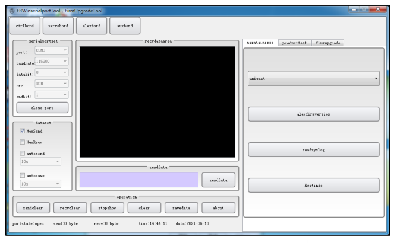
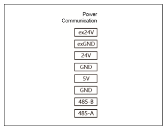

Appendix
==========

.. toctree:: 
  :maxdepth: 5

Appendix 1: Motion controller errors and handling methods
-----------------------------------------------------------------

.. csv-table:: 
   :header: "Main Fault Code", "Sub Fault Code", "Description"
   :widths: 20, 10, 70

   "0-No Fault", "0", "No fault"
   "1-Command Point Error", "1", "Joint command point error, resettable"
   "1-Command Point Error", "2", "Linear target point error (including tool mismatch), resettable"
   "1-Command Point Error", "3", "Arc intermediate point error (including tool mismatch), resettable"
   "1-Command Point Error", "4", "Arc target point error (including tool mismatch), resettable"
   "1-Command Point Error", "5", "Arc command points too close, resettable"
   "1-Command Point Error", "6", "Full circle/helix intermediate point 1 error (including tool mismatch), resettable"
   "1-Command Point Error", "7", "Full circle/helix intermediate point 2 error (including tool mismatch), resettable"
   "1-Command Point Error", "8", "Full circle/helix intermediate point 3 error (including tool mismatch), resettable"
   "1-Command Point Error", "9", "Full circle/helix command points too close, resettable"
   "1-Command Point Error", "10", "TPD command point error, resettable"
   "1-Command Point Error", "11", "TPD command tool does not match current tool, resettable"
   "1-Command Point Error", "12", "TPD current command and next command start point deviation too large, resettable"
   "1-Command Point Error", "13", "Internal/external tool switching error, resettable"
   "1-Command Point Error", "14", "New helix start point error, resettable"
   "1-Command Point Error", "15", "New spline command point error, resettable"
   "1-Command Point Error", "17", "PTP joint command limit exceeded, resettable"
   "1-Command Point Error", "18", "TPD joint command limit exceeded, resettable"
   "1-Command Point Error", "19", "LIN/ARC joint command limit exceeded, resettable"
   "1-Command Point Error", "20", "Cartesian space command overspeed, not resettable"
   "1-Command Point Error", "21", "Joint space torque command limit exceeded, resettable"
   "1-Command Point Error", "22", "JOG joint command limit exceeded, resettable"
   "1-Command Point Error", "23", "Axis 1 joint space command speed limit exceeded, resettable"
   "1-Command Point Error", "24", "Axis 2 joint space command speed limit exceeded, resettable"
   "1-Command Point Error", "25", "Axis 3 joint space command speed limit exceeded, resettable"
   "1-Command Point Error", "26", "Axis 4 joint space command speed limit exceeded, resettable"
   "1-Command Point Error", "27", "Axis 5 joint space command speed limit exceeded, resettable"
   "1-Command Point Error", "28", "Axis 6 joint space command speed limit exceeded, resettable"
   "1-Command Point Error", "29", "Joint feedback speed limit exceeded, not resettable"
   "1-Command Point Error", "30", "Joint command and feedback deviation too large, not resettable, requires restart"
   "1-Command Point Error", "31", "DMP target point error (including tool mismatch), resettable"
   "1-Command Point Error", "33", "Next command joint configuration changed (next command has singular pose, use PTP command or change next point), resettable"
   "1-Command Point Error", "34", "Current command joint configuration changed (next command has singular pose, use PTP command or change next point), resettable"
   "1-Command Point Error", "35", "LIN command joint speed limit exceeded, resettable"
   "1-Command Point Error", "36", "LIN command adaptive speed exceeds threshold, resettable"
   "1-Command Point Error", "37", "Unreachable point in trajectory, resettable"
   "1-Command Point Error", "38", "Unreachable point in trajectory - singular pose, resettable"
   "1-Command Point Error", "49", "Command error, only LIN and ARC commands allowed between ARCSTART and ARCEND, resettable"
   "1-Command Point Error", "50", "Command error, only LIN and ARC commands allowed between WEAVESTART and WEAVEEND, resettable"
   "1-Command Point Error", "51", "Weaving parameter error, resettable"
   "1-Command Point Error", "52", "Weaving command points too close, resettable"
   "1-Command Point Error", "53", "Unreachable point in weaving trajectory - singular pose, resettable"
   "1-Command Point Error", "54", "Unreachable point in weaving trajectory - joint command limit exceeded, resettable"
   "1-Command Point Error", "55", "Unreachable point in weaving trajectory - planning anomaly (tool z coincides with forward direction x angle), resettable"
   "1-Command Point Error", "56", "Unreachable point in weaving trajectory - planning anomaly (arc waypoint error), resettable"
   "1-Command Point Error", "65", "Laser sensor command deviation too large, resettable"
   "1-Command Point Error", "66", "Laser sensor command interrupted, seam tracking ended early, resettable"
   "1-Command Point Error", "81", "External axis command speed limit exceeded, resettable"
   "1-Command Point Error", "82", "External axis command and feedback deviation too large, not resettable, requires homing or restart"
   "1-Command Point Error", "83", "Extended peripheral (external axis/IO) communication error, resettable"
   "1-Command Point Error", "84", "Extended peripheral (external axis/IO) communication packet loss error, resettable"
   "1-Command Point Error", "97", "Conveyor tracking - start point and reference point pose change too large, resettable"
   "1-Command Point Error", "113", "Constant force control - X direction exceeds max adjustment distance, resettable"
   "1-Command Point Error", "114", "Constant force control - Y direction exceeds max adjustment distance, resettable"
   "1-Command Point Error", "115", "Constant force control - Z direction exceeds max adjustment distance, resettable"
   "1-Command Point Error", "116", "Constant force control - RX direction exceeds max adjustment angle, resettable"
   "1-Command Point Error", "117", "Constant force control - RY direction exceeds max adjustment angle, resettable"
   "1-Command Point Error", "118", "Constant force control - RZ direction exceeds max adjustment angle, resettable"
   "1-Command Point Error", "119", "External sensor data error, resettable"
   "1-Command Point Error", "120", "Helix exploration motion failed, resettable"
   "1-Command Point Error", "121", "Rotational insertion motion failed, resettable"
   "1-Command Point Error", "122", "Linear insertion motion failed, resettable"
   "1-Command Point Error", "123", "Surface positioning motion failed, resettable"
   "1-Command Point Error", "129", "Exceeded max torque record points, resettable"
   "1-Command Point Error", "130", "Speed switching error, resettable"
   "1-Command Point Error", "147", "Focus following error, resettable"
   "1-Command Point Error", "148", "Attitude speed limit exceeded, resettable"
   "1-Command Point Error", "149", "Joint status word feedback abnormal, resettable"
   "2-Drive Fault", "1", "Axis 1 drive fault, not resettable"
   "2-Drive Fault", "2", "Axis 2 drive fault, not resettable"
   "2-Drive Fault", "3", "Axis 3 drive fault, not resettable"
   "2-Drive Fault", "4", "Axis 4 drive fault, not resettable"
   "2-Drive Fault", "5", "Axis 5 drive fault, not resettable"
   "2-Drive Fault", "6", "Axis 6 drive fault, not resettable"
   "3-Soft Limit Exceeded", "1", "Axis 1 soft limit exceeded, resettable"
   "3-Soft Limit Exceeded", "2", "Axis 2 soft limit exceeded, resettable"
   "3-Soft Limit Exceeded", "3", "Axis 3 soft limit exceeded, resettable"
   "3-Soft Limit Exceeded", "4", "Axis 4 soft limit exceeded, resettable"
   "3-Soft Limit Exceeded", "5", "Axis 5 soft limit exceeded, resettable"
   "3-Soft Limit Exceeded", "6", "Axis 6 soft limit exceeded, resettable"
   "4-Collision Fault", "1", "Axis 1 collision fault, resettable"
   "4-Collision Fault", "2", "Axis 2 collision fault, resettable"
   "4-Collision Fault", "3", "Axis 3 collision fault, resettable"
   "4-Collision Fault", "4", "Axis 4 collision fault, resettable"
   "4-Collision Fault", "5", "Axis 5 collision fault, resettable"
   "4-Collision Fault", "6", "Axis 6 collision fault, resettable"
   "4-Collision Fault", "7", "End effector collision fault, resettable"
   "5-Active Slave Count Error", "1", "Active slave count error, not resettable"
   "6-Slave Error", "1", "Slave offline, not resettable"
   "6-Slave Error", "2", "Slave status does not match set value, not resettable"
   "6-Slave Error", "3", "Slave not configured, not resettable"
   "6-Slave Error", "4", "Slave configuration error, not resettable"
   "6-Slave Error", "5", "Slave initialization error, not resettable"
   "6-Slave Error", "6", "Slave mailbox communication initialization error, not resettable"
   "7-IO Error", "1", "Channel error, resettable"
   "7-IO Error", "2", "Value error, resettable"
   "7-IO Error", "3", "WaitDI timeout, resettable"
   "7-IO Error", "4", "WaitAI timeout, resettable"
   "7-IO Error", "5", "WaitAxleDI timeout, resettable"
   "7-IO Error", "6", "WaitAxleAI timeout, resettable"
   "7-IO Error", "7", "Channel configured function error, resettable"
   "7-IO Error", "8", "Arc start timeout, resettable"
   "7-IO Error", "9", "Arc end timeout, resettable"
   "7-IO Error", "10", "Search positioning timeout, resettable"
   "7-IO Error", "11", "Conveyor IO detection timeout, resettable"
   "7-IO Error", "12", "WaitAuxDI timeout, resettable"
   "7-IO Error", "13", "WaitAuxAI timeout, resettable"
   "7-IO Error", "14", "Wire search positioning timeout, resettable"
   "8-Gripper Error", "1", "Gripper motion timeout error, resettable"
   "9-File Error", "1", "zbt config file version error, initialization error - not resettable"
   "9-File Error", "2", "zbt config file load failed, initialization error - not resettable"
   "9-File Error", "3", "user config file version error, initialization error - not resettable"
   "9-File Error", "4", "user config file load failed, initialization error - not resettable"
   "9-File Error", "5", "exaxis config file version error, initialization error - not resettable"
   "9-File Error", "6", "exaxis config file load failed, initialization error - not resettable"
   "9-File Error", "7", "Robot model inconsistent, requires reconfiguration - not resettable"
   "9-File Error", "8", "dhpara config file version error, initialization error - not resettable"
   "9-File Error", "9", "dhpara config file load failed, initialization error - not resettable"
   "9-File Error", "10", "Robot model not set - not resettable"
   "9-File Error", "11", "load config file version error, initialization error - not resettable"
   "9-File Error", "12", "load config file load failed, initialization error - not resettable"
   "9-File Error", "13", "speed config file version error, initialization error - not resettable"
   "9-File Error", "14", "speed config file load failed, initialization error - not resettable"
   "10-Singular Pose", "1", "Singular pose"
   "11-Drive Communication Error", "1", "Axis 1 drive communication error, not resettable"
   "11-Drive Communication Error", "2", "Axis 2 drive communication error, not resettable"
   "11-Drive Communication Error", "3", "Axis 3 drive communication error, not resettable"
   "11-Drive Communication Error", "4", "Axis 4 drive communication error, not resettable"
   "11-Drive Communication Error", "5", "Axis 5 drive communication error, not resettable"
   "11-Drive Communication Error", "6", "Axis 6 drive communication error, not resettable"
   "12-External Axis Soft Limit", "1", "External axis 1 soft limit exceeded, resettable"
   "12-External Axis Soft Limit", "2", "External axis 2 soft limit exceeded, resettable"
   "12-External Axis Soft Limit", "3", "External axis 3 soft limit exceeded, resettable"
   "12-External Axis Soft Limit", "4", "External axis 4 soft limit exceeded, resettable"
   "13-Parameter Setting Error", "1", "Tool number out of range, resettable"
   "13-Parameter Setting Error", "2", "Positioning completion threshold error, resettable"
   "13-Parameter Setting Error", "3", "Collision level error, resettable"
   "13-Parameter Setting Error", "4", "Load weight error, resettable"
   "13-Parameter Setting Error", "5", "Load center of mass X error, resettable"
   "13-Parameter Setting Error", "6", "Load center of mass Y error, resettable"
   "13-Parameter Setting Error", "7", "Load center of mass Z error, resettable"
   "13-Parameter Setting Error", "8", "DI filter time error, resettable"
   "13-Parameter Setting Error", "9", "AxleDI filter time error, resettable"
   "13-Parameter Setting Error", "10", "AI filter time error, resettable"
   "13-Parameter Setting Error", "11", "AxleAI filter time error, resettable"
   "13-Parameter Setting Error", "12", "DI high/low level range error, resettable"
   "13-Parameter Setting Error", "13", "DO high/low level range error, resettable"
   "13-Parameter Setting Error", "14", "Workpiece number out of range, resettable"
   "13-Parameter Setting Error", "15", "External axis number out of range, resettable"
   "13-Parameter Setting Error", "16", "Conveyor encoder channel error, resettable"
   "13-Parameter Setting Error", "17", "Conveyor workpiece axis number error, resettable"

Appendix 2: Servo driver fault code table
--------------------------------------------------

+------------+-----------------------------------------------------------------------------+----------------------------------------------------------------------------------------------------------------------+
| Fault code |                                 Fault name                                  |                                                  Processing method                                                   |
+============+=============================================================================+======================================================================================================================+
| 1          | Software overcurrent fault                                                  || 1. Check whether the joint load or resistance becomes larger or abnormal;                                           |
|            |                                                                             || 2. If the fault is still not eliminated, repair or replace the drive board.                                         |
+------------+-----------------------------------------------------------------------------+----------------------------------------------------------------------------------------------------------------------+
| 2          | Overvoltage fault                                                           | Reduce the speed or acceleration of the robot.                                                                       |
+------------+-----------------------------------------------------------------------------+----------------------------------------------------------------------------------------------------------------------+
| 3          | Under voltage fault                                                         || 1. Check whether the 48V power supply voltage output of the control box is abnormal;                                |
|            |                                                                             || 2. Check the drive plate and joint housing for short circuit;                                                       |
|            |                                                                             || 3. If the fault is still not eliminated, repair or replace the drive board.                                         |
+------------+-----------------------------------------------------------------------------+----------------------------------------------------------------------------------------------------------------------+
| 4          | Overheating fault                                                           | Reduce the load or speed of the robot.                                                                               |
+------------+-----------------------------------------------------------------------------+----------------------------------------------------------------------------------------------------------------------+
| 5          | Overload fault                                                              | Reduce the load or speed of the robot.                                                                               |
+------------+-----------------------------------------------------------------------------+----------------------------------------------------------------------------------------------------------------------+
| 6          | Overspeed fault                                                             || 1. Check whether the magnetic braiding assembly and the motor shaft fixing jackscrew are loose;                     |
|            |                                                                             || 2. Re-perform encoder zero calibration;                                                                             |
|            |                                                                             || 3. If the fault is still not eliminated, repair or replace the magnetic editor assembly.                            |
+------------+-----------------------------------------------------------------------------+----------------------------------------------------------------------------------------------------------------------+
| 7          | Parameter abnormal fault                                                    | Repair or replace the drive plate.                                                                                   |
+------------+-----------------------------------------------------------------------------+----------------------------------------------------------------------------------------------------------------------+
| 8          | Runaway fault                                                               || 1. Check whether the magnetic braiding assembly and the motor shaft fixing jackscrew are loose;                     |
|            |                                                                             || 2. Re-perform encoder zero calibration;                                                                             |
|            |                                                                             || 3. If the fault is still not eliminated, repair or replace the magnetic editor assembly.                            |
+------------+-----------------------------------------------------------------------------+----------------------------------------------------------------------------------------------------------------------+
| 9          | Position error fault                                                        || 1. Check whether the joint load or resistance becomes larger or abnormal;                                           |
|            |                                                                             || 2. If the fault is still not eliminated, repair or replace the drive board.                                         |
+------------+-----------------------------------------------------------------------------+----------------------------------------------------------------------------------------------------------------------+
| 10         | Position overflow fault                                                     || 1. Check whether the hard limit is loose;                                                                           |
|            |                                                                             || 2. Re-perform robot zero calibration.                                                                               |
+------------+-----------------------------------------------------------------------------+----------------------------------------------------------------------------------------------------------------------+
| 11         | Hardware overcurrent fault                                                  | Repair or replace the drive plate.                                                                                   |
+------------+-----------------------------------------------------------------------------+----------------------------------------------------------------------------------------------------------------------+
| 12         | Drive inhibit fault                                                         | The robot is NOT enabled.                                                                                            |
+------------+-----------------------------------------------------------------------------+----------------------------------------------------------------------------------------------------------------------+
| 13         | Motor locked rotor fault                                                    || 1. Check whether the brake electromagnet is engaged;                                                                |
|            |                                                                             || 2. Check whether the hard limit is hit;                                                                             |
|            |                                                                             || 3. If the fault is still not eliminated, repair or replace the drive board.                                         |
+------------+-----------------------------------------------------------------------------+----------------------------------------------------------------------------------------------------------------------+
| 14         | Power supply failure                                                        | The robot is NOT enabled.                                                                                            |
+------------+-----------------------------------------------------------------------------+----------------------------------------------------------------------------------------------------------------------+
| 15         | STO fault                                                                   | The robot is NOT enabled.                                                                                            |
+------------+-----------------------------------------------------------------------------+----------------------------------------------------------------------------------------------------------------------+
| 16         | Phase current AD zero setting fault                                         | Repair or replace the drive plate.                                                                                   |
+------------+-----------------------------------------------------------------------------+----------------------------------------------------------------------------------------------------------------------+
| 17         | EEPROM fault                                                                | Repair or replace the drive plate.                                                                                   |
+------------+-----------------------------------------------------------------------------+----------------------------------------------------------------------------------------------------------------------+
| 18         | Hall fault                                                                  || 1. Check whether the hall harness is inserted firmly and whether there is short circuit or open circuit;            |
|            |                                                                             || 2. If the fault is still not eliminated, repair or replace the joint.                                               |
+------------+-----------------------------------------------------------------------------+----------------------------------------------------------------------------------------------------------------------+
| 19         | Encoder failed                                                              | Repair or replace the magnetic braid assembly.                                                                       |
+------------+-----------------------------------------------------------------------------+----------------------------------------------------------------------------------------------------------------------+
| 20         | Encoder zero setting fault                                                  || 1. Re-perform encoder zero calibration;                                                                             |
|            |                                                                             || 2. If the fault is still not eliminated, repair or replace the magnetic editor assembly.                            |
+------------+-----------------------------------------------------------------------------+----------------------------------------------------------------------------------------------------------------------+
| 21         | Encoder Z-phase signal loss fault                                           | The robot is NOT enabled.                                                                                            |
+------------+-----------------------------------------------------------------------------+----------------------------------------------------------------------------------------------------------------------+
| 22         | Encoder count fault                                                         | The robot is NOT enabled.                                                                                            |
+------------+-----------------------------------------------------------------------------+----------------------------------------------------------------------------------------------------------------------+
| 23         | Encoder multi turn data overflow fault                                      | The robot is NOT enabled.                                                                                            |
+------------+-----------------------------------------------------------------------------+----------------------------------------------------------------------------------------------------------------------+
| 24         | External clock fault                                                        | Repair or replace the drive plate.                                                                                   |
+------------+-----------------------------------------------------------------------------+----------------------------------------------------------------------------------------------------------------------+
| 25         | UVW phase sequence fault                                                    | The robot is NOT enabled.                                                                                            |
+------------+-----------------------------------------------------------------------------+----------------------------------------------------------------------------------------------------------------------+
| 26         | FPGA fault                                                                  | The robot is NOT enabled.                                                                                            |
+------------+-----------------------------------------------------------------------------+----------------------------------------------------------------------------------------------------------------------+
| 27         | Zero return fault                                                           | The robot is NOT enabled.                                                                                            |
+------------+-----------------------------------------------------------------------------+----------------------------------------------------------------------------------------------------------------------+
| 28         | Magnetic encoder fault                                                      || 1. Check whether the magnetic braiding assembly and the motor shaft fixing jackscrew are loose;                     |
|            |                                                                             || 2. If the fault is still not eliminated, repair or replace the magnetic editor assembly.                            |
+------------+-----------------------------------------------------------------------------+----------------------------------------------------------------------------------------------------------------------+
| 29         | Motor power line disconnection fault                                        || 1. Check whether the power line of the motor is firmly inserted, and whether there is short circuit or open circuit;|
|            |                                                                             || 2. If the fault is still not eliminated, repair or replace the drive board.                                         |
+------------+-----------------------------------------------------------------------------+----------------------------------------------------------------------------------------------------------------------+
| 30         | EtherCAT fault                                                              || 1. Check whether the network cable is firmly plugged, and whether there is short circuit or open circuit;           |
|            |                                                                             || 2. If the fault is still not eliminated, repair or replace the drive board                                          |
+------------+-----------------------------------------------------------------------------+----------------------------------------------------------------------------------------------------------------------+
| 31         | EtherCAT_SM_DOG fault                                                       || 1. Check whether the network cable is firmly plugged, and whether there is short circuit or open circuit;           |
|            |                                                                             || 2. If the fault is still not eliminated, repair or replace the drive board.                                         |
+------------+-----------------------------------------------------------------------------+----------------------------------------------------------------------------------------------------------------------+
| 32         | EtherCAT_FATALSYNC failure                                                  || 1. Check whether the network cable is firmly plugged, and whether there is short circuit or open circuit;           |
|            |                                                                             || 2. If the fault is still not eliminated, repair or replace the drive board.                                         |
+------------+-----------------------------------------------------------------------------+----------------------------------------------------------------------------------------------------------------------+
| 33         | EtherCAT_SYNC fault                                                         || 1. Check whether the network cable is firmly plugged, and whether there is short circuit or open circuit;           |
|            |                                                                             || 2. If the fault is still not eliminated, repair or replace the drive board.                                         |
+------------+-----------------------------------------------------------------------------+----------------------------------------------------------------------------------------------------------------------+
| 34         | EtherCAT_RFT failure                                                        || 1. Check whether the network cable is firmly plugged, and whether there is short circuit or open circuit;           |
|            |                                                                             || 2. If the fault is still not eliminated, repair or replace the drive board.                                         |
+------------+-----------------------------------------------------------------------------+----------------------------------------------------------------------------------------------------------------------+
| 35         | Drive shaft address fault                                                   || 1. Re-configure the drive axis address;                                                                             |
|            |                                                                             || 2. If the fault is still not eliminated, repair or replace the drive board.                                         |
+------------+-----------------------------------------------------------------------------+----------------------------------------------------------------------------------------------------------------------+
| 36         | Robot zero calibration fault                                                || 1. Re-perform robot zero calibration;                                                                               |
|            |                                                                             || 2. First use JLINK to erase FLASH, then download the program again and zero;                                        |
|            |                                                                             || 3. If the fault is still not eliminated, repair or replace the drive board.                                         |
+------------+-----------------------------------------------------------------------------+----------------------------------------------------------------------------------------------------------------------+
| 37         | Encoder communication failure                                               || 1. Check whether the encoder harness is inserted firmly and whether there is short circuit or open circuit;         |
|            |                                                                             || 2. If the fault is still not eliminated, repair or replace the magnetic editor assembly.                            |
+------------+-----------------------------------------------------------------------------+----------------------------------------------------------------------------------------------------------------------+
| 40         | Magnetic encoder module failure - zero calibration failure                  || 1. Re-zero the magnetic braiding assembly;                                                                          |
|            |                                                                             || 2. If the fault is still not eliminated, repair or replace the magnetic editor assembly.                            |
+------------+-----------------------------------------------------------------------------+----------------------------------------------------------------------------------------------------------------------+
| 41         | Magnetic encoder module fault - multi turn fault                            || 1. Check whether the magnetic braiding assembly and the motor shaft fixing jackscrew are loose;                     |
|            |                                                                             || 2. If the fault is still not eliminated, repair or replace the magnetic editor assembly.                            |
+------------+-----------------------------------------------------------------------------+----------------------------------------------------------------------------------------------------------------------+
| 42         | Magnetic encoder module failure - multi turn small magnetic encoder failure || 1. Check whether the multi turn small magnetic braiding chip is abnormal;                                           |
|            |                                                                             || 2. If the fault is still not eliminated, repair or replace the magnetic editor assembly.                            |
+------------+-----------------------------------------------------------------------------+----------------------------------------------------------------------------------------------------------------------+
| 43         | Magnetic encoder module failure - multi turn large magnetic encoder failure || 1. Check whether the multi turn magnetic braiding chip is abnorma;                                                  |
|            |                                                                             || 2. If the fault is still not eliminated, repair or replace the magnetic editor assembly.                            |
+------------+-----------------------------------------------------------------------------+----------------------------------------------------------------------------------------------------------------------+
| 44         | Magnetic braiding module fault - single turn magnetic braiding fault        || 1. Check whether the single turn magnetic braiding chip is abnormal;                                                |
|            |                                                                             || 2. If the fault is still not eliminated, repair or replace the magnetic editor assembly.                            |
+------------+-----------------------------------------------------------------------------+----------------------------------------------------------------------------------------------------------------------+
| 45         | Magnetic encoder module failure - optical encoder failure                   || 1. Check whether the optical coding disc is polluted or not stuck;                                                  |
|            |                                                                             || 2. If the fault is still not eliminated, repair or replace the magnetic editor assembly.                            |
+------------+-----------------------------------------------------------------------------+----------------------------------------------------------------------------------------------------------------------+

Appendix 3: End plate 485 upgrade
-----------------------------------------

During field use, it is possible to update the firmware to meet the new requirements. A new upgrade file (XX_XX_MAIN. bin) will be provided to upgrade the terminal board through the 485 interface (USB to 485 module is required). The upgrade steps are as follows:

**Step1: 485 wiring.** There is a 5Pin communication aviation connector at the end of the robot. The pin pin distribution and pin pin description of the aviation connector are shown in Fig. 1.Connect the 485 - A and 485 - B at the end of the robot with A and B of the USB to 485 tool using twisted pair cables.

.. figure:: appendix/001.png
   :align: center
   :width: 4in

.. centered:: Figure 18.3-1 Pin Pin Distribution of Aviation Connector

**Step2: hardware connection.** connect the USB end of the USB to 485 tool to the PC, and in the PC device manager, if the USB&485 tool is identified, the following interface will appear.

.. figure:: appendix/002.png
   :align: center
   :width: 6in

.. centered:: Figure 18.3-2 USB&485 Port Identification Description

**Step3:Upgrade the tool.** After the wiring is completed, open the "Fair Serial Port Debugging Assistant", click the "Terminal Board" button, and select the above identified serial port in the "Serial Port Parameter Setting" function. The baud rate is 115200, the data bit is 8, the check bit is none, and the stop bit is 1. Then open the serial port. After success, the prompt "Serial port opened successfully" will appear.

.. figure:: appendix/003.png
   :align: center
   :width: 4in

.. centered:: Figure 18.3-3 Serial Port Parameter Settings

**Step4:Firmware upgrade.** Select "End plate" and click "Firmware upgrade", as shown in the fig.

.. centered:: Figure 18.3-4 End Plate Firmware Upgrade

-  First, click "Flash Erase". After the erasure is successful, you will be prompted in the receiving data area that the erasure is successful.

-  Open the file (the file to be upgraded), select the path to store it, as shown below. After the selection, the file name to be upgraded will appear in the file name display box.

.. figure:: appendix/005.png
   :align: center
   :width: 6in

.. centered:: Figure 18.3-5 Select Upgrade File

-  Click "Send File", and when the progress bar displays 100%, it means that the upgrade file has been sent.

**Step5:Upgrade verification.** The system is restarted and powered on. In the "Maintenance Information" column, select "Query terminal board firmware version information", and the firmware version information will be displayed in the "Receive Data Area". If it is consistent with the upgraded file version information, the upgrade is successful, otherwise the upgrade fails.

.. figure:: appendix/006.png
   :align: center
   :width: 6in

.. centered:: Figure 18.3-6 Querying Firmware Version Information

Appendix 4: Control Box 485 Upgrade
----------------------------------------

There is a "power communication" interface on the robot control box board, and USB&485 tools A and B are respectively connected to the "485-A" and "485-B" of its interface.

The upgrade process is the same as that of the terminal board, and the software can be selected accordingly, which will not be repeated here.

.. centered:: Figure 18.4-1 Power Communication Interface

Appendix 5: List of Spare Parts and Vulnerable Parts
-------------------------------------------------------------

+----------------------------+----------------+-------------------+
|      Spare Part Name       |    Part No.    | Quantity/piece(s) |
+============================+================+===================+
| M8 * 30 screw              | 4.0.08.2006185 | 4                 |
+----------------------------+----------------+-------------------+
| Straight pin A type 8 * 20 | 4.5.00.2013076 | 2                 |
+----------------------------+----------------+-------------------+
| Fuse 5x20 6A               | /              | 1                 |
+----------------------------+----------------+-------------------+