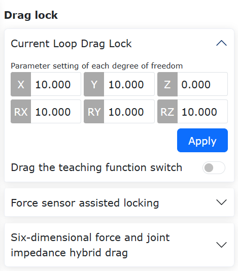
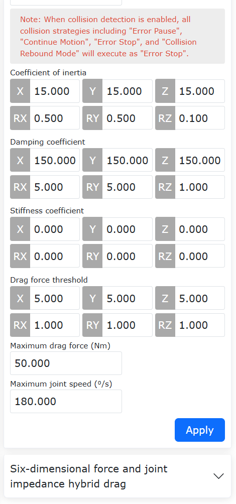
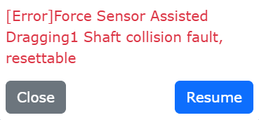
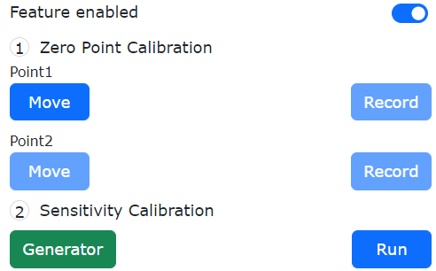
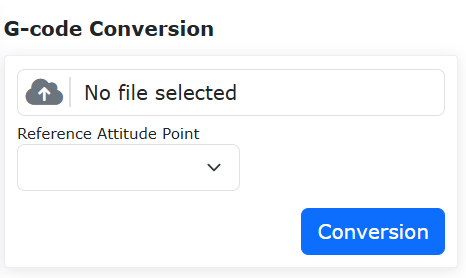

Applicazioni Strumento
======================

.. toctree:: 
   :maxdepth: 6

Imballaggio Robot
-----------------

Nel menu “Applicazioni Ausiliarie” → “Applicazioni Strumento”, fare clic sul pulsante “Imballaggio Robot” per accedere all’interfaccia di imballaggio rapido del robot.

.. important:: 
   Prima di eseguire la funzione di imballaggio, verificare attentamente l’ambiente circostante e lo stato del robot per evitare collisioni.
   
   In caso di spedizione dalla fabbrica, prima dell’imballaggio accedere a Impostazioni di Sistema → Impostazioni Generali ed eseguire il ripristino alle impostazioni di fabbrica.

**Passo 1**: Prima di spostare il robot al punto di imballaggio, portarlo alla posizione zero.

**Passo 2**: Fare clic sul pulsante “Vai a Zero” e confermare che lo zero meccanico del robot sia corretto; le tacche sugli snodi (indicate dai cerchi arancioni nell’immagine) devono essere allineate.

**Passo 3**: Fare clic sul pulsante “Vai al Punto Imballaggio”; il robot si muoverà automaticamente alla posizione di imballaggio con gli angoli degli assi predefiniti dal processo di confezionamento.

.. image:: application/001.png
   :width: 4in
   :align: center

.. centered:: Figura 14.1‑1 Imballaggio rapido del robot

Backup Dati
-----------

Nel menu “Applicazioni Ausiliarie” → “Applicazioni Strumento”, fare clic su “Backup Dati” per accedere all’interfaccia di backup.

Il pacchetto di backup include: dati del sistema di coordinate utensile, file di configurazione di sistema, punti di insegnamento, programmi utente, programmi modello e file di configurazione utente. Questa funzione consente di trasferire rapidamente tutti i dati rilevanti da un robot a un altro.

.. image:: application/002.png
   :width: 4in
   :align: center

.. centered:: Figura 14.2‑1 Interfaccia Backup Dati

Per evitare potenziali rischi legati a incongruenze nelle configurazioni (ad esempio modalità di installazione) durante l’importazione del backup, è stata introdotta una funzione di verifica dei parametri critici.

Funzione di Verifica durante l’Importazione del Backup
~~~~~~~~~~~~~~~~~~~~~~~~~~~~~~~~~~~~~~~~~~~~~~~~~~~~~~~~~~~~~~~~~~~~~

Durante l’importazione, il pacchetto di backup viene confrontato con il robot destinatario in base a specifici parametri chiave, elencati nella tabella seguente. Questi parametri, se non corrispondono esattamente, possono comportare rischi per la sicurezza. L’importazione avviene solo se tutti i parametri coincidono; in caso contrario, verrà visualizzato un messaggio di errore e sarà necessario verificare la coerenza tra il robot e il pacchetto.

Tabella dei 5 parametri chiave da verificare:

.. list-table::
   :widths: 15 40 100
   :header-rows: 0
   :class: sheet-center

   * - **N.**
     - **Parametro Chiave**
     - **Descrizione**

   * - 1
     - ROBOT_TYPE
     - Modello del robot

   * - 2
     - INSTALL_POS
     - Modalità di installazione

   * - 3
     - INSTALL_YANGLE
     - Angolo di inclinazione della base

   * - 4
     - INSTALL_ZANGLE
     - Angolo di rotazione della base

   * - 5
     - NEW_TEACH_ENABLE
     - Configurazione dinamica

.. image:: application/003.png
   :width: 6in
   :align: center

.. centered:: Figura 14.2‑2 Messaggio di errore quando i parametri chiave non corrispondono

Registrazione Dati 10s
----------------------

Nel menu “Applicazioni Ausiliarie” → “Applicazioni Strumento”, fare clic su “Registrazione Dati 10s” per accedere all’interfaccia dedicata.

È possibile scegliere tra due tipi di registrazione:
- **Registrazione parametri predefiniti**: dati selezionati automaticamente dal sistema.
- **Registrazione parametri personalizzati**: l’utente può selezionare fino a 15 parametri da registrare.

Dopo aver scelto i parametri desiderati, utilizzare il pulsante “Sposta a destra” per aggiungerli all’elenco. Cliccare su “Avvia Registrazione” per iniziare, “Interrompi Registrazione” per fermarla e “Scarica Dati” per scaricare gli ultimi 10 secondi di dati registrati.

.. image:: application/004.png
   :width: 4in
   :align: center

.. centered:: Figura 14.3‑1 Registrazione Dati 10s

LED Terminale
--------------

Nel menu “Applicazioni Ausiliarie” → “Applicazioni Strumento”, fare clic su “LED Terminale” per accedere all’interfaccia di configurazione del colore del LED.

È possibile impostare il colore del LED su verde, blu o ciano. L’utente può assegnare un colore diverso per ciascuna delle tre modalità operative: automatica, manuale e trascinamento. Non è consentito assegnare lo stesso colore a più modalità contemporaneamente.

.. image:: application/005.png
   :width: 4in
   :align: center

.. centered:: Figura 14.4‑1 Configurazione LED Terminale

Blocco Trascinamento
--------------------

Nel menu “Applicazioni Ausiliarie” → “Applicazioni Strumento”, fare clic su “Blocco Trascinamento” per accedere all’interfaccia di configurazione del blocco dei gradi di libertà durante il trascinamento.

Questa funzione consente di limitare il movimento del robot durante il trascinamento. Quando la funzione è abilitata, i valori impostati per ciascun grado di libertà (X, Y, Z, RX, RY, RZ) determinano la libertà di movimento. Ad esempio:
- Impostando X:10, Y:0, Z:10, RX:10, RY:10, RZ:10, il robot potrà muoversi solo lungo l’asse Y.
- Per mantenere fissa l’orientazione e consentire solo spostamenti traslazionali (X, Y, Z), impostare X, Y, Z a 0 e RX, RY, RZ a 10.

.. centered:: Figura 14.5‑1 Configurazione Blocco Trascinamento

Protezione Anticollisione Attiva anche in Trascinamento con Sensore di Forza
~~~~~~~~~~~~~~~~~~~~~~~~~~~~~~~~~~~~~~~~~~~~~~~~~~~~~~~~~~~~~~~~~~~~~~~~~~~~~~~~~

Panoramica
++++++++++++++++++++++

Nei robot FR, precedentemente, la protezione anticollisione non veniva attivata durante il trascinamento assistito dal sensore di forza. Ora questa funzione è stata implementata per migliorare la sicurezza e ridurre i rischi operativi.

Protezione Anticollisione
+++++++++++++++++++++++++

**Passo 1**: Accedere tramite “Applicazioni Ausiliarie” → “Applicazioni Strumento” → “Blocco Trascinamento”. Nell’interfaccia di configurazione del trascinamento assistito dal sensore di forza, attivare sia “Interruttore di Stato” che “Rilevamento Collisione”, come mostrato nelle figure seguenti.

.. image:: application/007.png
   :width: 4in
   :align: center

.. centered:: Figura 14.5‑2 Configurazione del trascinamento assistito dal sensore di forza

**Passo 2**: Durante il trascinamento, applicare una forza esterna sugli snodi del robot per attivare la protezione anticollisione. L’interfaccia web visualizzerà l’errore “Guasto: collisione durante trascinamento con sensore di forza”. È possibile ripristinare rapidamente la funzione tramite l’interfaccia:
- Cliccare su “Ripristina” per cancellare l’errore e riattivare il trascinamento assistito.
- Cliccare su “Disattiva” per cancellare l’errore e mantenere disattivato il trascinamento assistito.

.. centered:: Figura 14.5‑3 Collisione attivata durante il trascinamento con sensore di forza

.. note:: 
   Durante il trascinamento assistito dal sensore di forza, il robot è in stato di arresto. La differenza tra il comando di coppia e il valore misurato può causare falsi allarmi. Si consiglia di impostare il livello di sensibilità alla collisione a 7 o superiore. Livelli troppo bassi potrebbero generare errori di collisione durante il normale trascinamento.

Calibrazione Parametri Sensori di Coppia sugli Snodi
++++++++++++++++++++++++++++++++++++++++++++++++++++

Panoramica
************************

La sensibilità del sensore di coppia misura la sua capacità di rispondere alle variazioni di coppia, rappresentando il rapporto tra la tensione in uscita e la coppia reale applicata allo snodo.  
La linearità indica quanto bene un modello regressivo approssima i dati misurati.  
L’isteresi è la massima differenza tra i valori misurati durante un ciclo ascendente (da coppia minima a massima) e discendente (da massima a minima), nelle stesse condizioni.  
La ripetibilità è il rapporto tra il risultato attuale e quello del test precedente, e serve a valutare la precisione del sensore.

Il metodo di calibrazione prevede di far eseguire al robot una traiettoria prestabilita, acquisendo dati sulla coppia gravitazionale e sui valori grezzi del sensore in diverse posizioni, per calcolare sensibilità, linearità, isteresi e ripetibilità.

Calibrazione Parametri
**********************

**Passo 1**: Impostare il sistema di coordinate utensile su “Tool0”. Accedere a “Applicazioni Ausiliarie” → “Applicazioni Strumento” → “Blocco Trascinamento” e attivare la funzione “Calibrazione Coppia Snodi”, come mostrato in Figura 2-1.

.. image:: application/037.png
   :width: 4in
   :align: center

.. centered:: Figura 14.5‑4 Abilitazione funzione

**Passo 2**: Dopo aver attivato la funzione, procedere con la calibrazione della sensibilità (Figura 2-2). Cliccare su “Genera Programma” per inviare uno script Lua interno al controllore. Passare il robot in modalità automatica, impostare la velocità a “10” e fare clic su “Esegui”, attendendo il completamento del movimento.

.. centered:: Figura 14.5‑5 Calibrazione sensibilità

.. note:: Se la sensibilità è già stata calibrata in precedenza, è possibile saltare questo passo e procedere direttamente con la configurazione del trascinamento.

**Passo 3**: Al termine del movimento, i risultati di calibrazione (sensibilità, linearità, isteresi, ripetibilità) vengono visualizzati automaticamente nell’interfaccia web. Cliccare su “Applica” per salvare i parametri, come mostrato in Figura 2-3.

.. image:: application/039.png
   :width: 4in
   :align: center

.. centered:: Figura 14.5‑6 Risultati calibrazione

Generazione Punto di Intersezione (Movimento con Presa Laser)
-------------------------------------------------------------

Durante la saldatura, il movimento con presa laser consente di configurare l’orientazione del robot in modo che, al raggiungimento del punto, assuma la posa desiderata. Questa funzione è particolarmente utile per giunti d’angolo o saldature a smusso.

Procedura Operativa per il Movimento con Presa Laser
~~~~~~~~~~~~~~~~~~~~~~~~~~~~~~~~~~~~~~~~~~~~~~~~~~~~~~~~~~

**Passo 1**: Prima di utilizzare il sensore laser, applicare il sistema di coordinate “Pistola Saldatrice” come sistema utensile corrente. Nella pagina di insegnamento, andare su “Impostazioni Iniziali” → “Base” → “Coordinate Utensile”, selezionare “Pistola Saldatrice” e applicare. La barra di stato mostrerà Tool1 come sistema utensile attivo.

.. figure:: application/010.png
   :align: center
   :width: 4in

.. centered:: Figura 14.6‑1 Applicazione del sistema di coordinate pistola saldatrice

**Passo 2**: Creare un programma Lua per il movimento con presa laser. Andare su “Programmi di Insegnamento” → “Programmazione” → “Nuovo” e creare un nuovo programma utente denominato “testPointRecord.lua”.

.. figure:: application/011.png
   :align: center
   :width: 4in

.. centered:: Figura 14.6‑2 Creazione nuovo programma per presa laser

**Passo 3**: (Opzionale) Configurare un punto di riferimento per l’orientazione. In modalità manuale, trascinare il robot nella posa desiderata per la saldatura. Nella pagina di insegnamento, andare su “Registrazione Punti” → “Salva Punto con Nome” e salvare la posa come “referencePoint”.

.. figure:: application/012.png
   :align: center
   :width: 4in

.. centered:: Figura 14.6‑3 Salvataggio punto di riferimento per orientazione

**Passo 4**: Generare il programma per il movimento con presa laser. Andare su “Programmi di Insegnamento” → “Programmazione” → “Istruzioni Saldatura” → “Tracciamento Laser”, scorrere fino alla sezione “Movimento con Presa Sensore”, selezionare il “Tipo di Movimento”, la “Velocità Debug” e il punto di riferimento per l’orientazione. Il sistema genererà automaticamente il programma Lua corrispondente.

Se non viene selezionato alcun punto di riferimento, il robot manterrà l’orientazione al momento della presa. Se invece viene selezionato, assumerà tale orientazione nel punto rilevato dal laser.

.. figure:: application/013.png
   :align: center
   :width: 6in

.. centered:: Figura 14.6‑4 Selezione del punto di riferimento per orientazione

Esecuzione del movimento con presa laser: trascinare il robot in modo che il raggio laser punti sul punto di saldatura desiderato. Il sensore rileverà la posizione della giunzione. Al termine, la pistola saldatrice si sposterà al punto rilevato assumendo l’orientazione di riferimento.

.. figure:: application/014.png
   :align: center
   :width: 4in

.. centered:: Figura 14.6‑5 Rilevamento posizione giunzione con laser

.. figure:: application/015.png
   :align: center
   :width: 4in

.. centered:: Figura 14.6‑6 Pistola saldatrice orientata verso la giunzione

Calcolo Punto di Intersezione con Tre o Quattro Punti
~~~~~~~~~~~~~~~~~~~~~~~~~~~~~~~~~~~~~~~~~~~~~~~~~~~~~

Quando non è possibile insegnare direttamente la posizione di una giunzione d’angolo, il robot collaborativo può calcolare il punto di intersezione tra due piani (es. lastre metalliche) acquisendo punti di contatto su ciascun piano.

- Per giunzioni ad angolo retto: utilizzare il metodo a **tre punti**.
- Per giunzioni non ortogonali: utilizzare il metodo a **quattro punti**.

Sono disponibili due modalità: tramite interfaccia grafica o script Lua. In entrambi i casi è possibile specificare un’orientazione di riferimento, in modo che il robot si muova al punto calcolato con la posa desiderata.

Calcolo Punto di Intersezione tramite Interfaccia
++++++++++++++++++++++++++++++++++++++++++++++++++++++++++++

Tre Punti – Calcolo Intersezione
********************************

**Passo 1**: Acquisire tre punti di contatto e salvarli come punti di insegnamento; configurare (opzionalmente) un punto di riferimento per l’orientazione.

.. figure:: application/016.png
   :align: center
   :width: 4in

.. centered:: Figura 14.6‑7 Selezione di tre punti di ricerca

Due punti appartengono allo stesso piano, il terzo a un piano perpendicolare.

.. note:: Se non viene selezionato un punto di riferimento, l’orientazione del punto calcolato sarà uguale a quella del punto P3. Altrimenti, assumerà l’orientazione del punto di riferimento.

**Passo 2**: Nella pagina di insegnamento, andare su “Applicazioni Ausiliarie” → “Applicazioni Strumento” → “Generazione Punto di Intersezione” e aprire il modulo per il calcolo con tre o quattro punti.

.. figure:: application/017.png
   :align: center
   :width: 4in

.. centered:: Figura 14.6‑8 Selezione punti per calcolo intersezione

**Passo 3**: Selezionare “Ricerca a Tre Punti”, scegliere i tre punti acquisiti e fare clic su “Calcola”. Verificare visivamente nel modello 3D che il punto generato sia corretto, assegnargli un nome e salvarlo.

.. figure:: application/018.png
   :align: center
   :width: 4in

.. centered:: Figura 14.6‑9 Calcolo e salvataggio punto di intersezione

**Passo 4**: Il punto salvato può ora essere utilizzato nei movimenti di insegnamento.

.. figure:: application/019.png
   :align: center
   :width: 6in

.. centered:: Figura 14.6‑10 Salvataggio punto di intersezione come punto di insegnamento

Quattro Punti – Calcolo Intersezione
*******************************************

**Passo 1**: Acquisire quattro punti di contatto e salvarli come punti di insegnamento; configurare (opzionalmente) un punto di riferimento per l’orientazione.

.. figure:: application/020.png
   :align: center
   :width: 4in

.. centered:: Figura 14.6‑11 Selezione di quattro punti di ricerca

I primi due punti appartengono a un piano, gli altri due a un piano adiacente (non necessariamente perpendicolare).

.. note:: Se non viene selezionato un punto di riferimento, l’orientazione del punto calcolato sarà uguale a quella del punto P4. Altrimenti, assumerà l’orientazione del punto di riferimento.

**Passo 2**: Nella pagina di insegnamento, andare su “Impostazioni Iniziali” → “Periferiche” → “Tracciamento” → “Sensore” e aprire il modulo per il calcolo con tre o quattro punti.

.. figure:: application/021.png
   :align: center
   :width: 4in

.. centered:: Figura 14.6‑12 Selezione punti e punto di riferimento

**Passo 3**: Selezionare “Ricerca a Quattro Punti”, scegliere i quattro punti acquisiti e fare clic su “Calcola”. Verificare il risultato nel modello 3D, assegnare un nome e salvare il punto.

.. figure:: application/022.png
   :align: center
   :width: 4in

.. centered:: Figura 14.6‑13 Calcolo e salvataggio punto di intersezione

**Passo 4**: Il punto salvato può ora essere utilizzato nei movimenti di insegnamento.

.. figure:: application/023.png
   :align: center
   :width: 6in

.. centered:: Figura 14.6‑14 Salvataggio punto di intersezione come punto di insegnamento

Calcolo Punto di Intersezione tramite Script Lua
++++++++++++++++++++++++++++++++++++++++++++++++

Tre Punti – Movimento con Ricerca
*********************************

**Passo 1**: Acquisire tre punti di contatto e salvarli come punti di insegnamento; configurare (opzionalmente) un punto di riferimento per l’orientazione.

.. figure:: application/016.png
   :align: center
   :width: 4in

.. centered:: Figura 14.6‑15 Selezione di tre punti di ricerca

Due punti appartengono allo stesso piano, il terzo a un piano perpendicolare.

.. note:: Se non viene selezionato un punto di riferimento, l’orientazione del punto calcolato sarà uguale a quella del punto P3. Altrimenti, assumerà l’orientazione del punto di riferimento.

**Passo 2**: Creare uno script Lua per il movimento con ricerca a tre punti. Andare su “Programmi di Insegnamento” → “Programmazione” → “Nuovo” e creare un nuovo programma denominato “test3point.lua”.

.. figure:: application/024.png
   :align: center
   :width: 4in

.. centered:: Figura 14.6‑16 Creazione nuovo programma per ricerca a tre punti

**Passo 3**: Generare lo script. Andare su “Programmi di Insegnamento” → “Programmazione” → “Istruzioni Saldatura” → “Tracciamento Laser”, scorrere fino a “Movimento con Ricerca Intersezione”, selezionare “Ricerca a Tre Punti”, scegliere i punti “Punto1”, “Punto2”, “Punto3” e il punto di riferimento per l’orientazione, impostare “Tipo di Movimento” e “Velocità Debug”, quindi fare clic su “Aggiungi” e “Applica” per generare lo script.

.. figure:: application/025.png
   :align: center
   :width: 4in

.. centered:: Figura 14.6‑17 Movimento con ricerca a tre punti

**Passo 4**: In modalità automatica, fare clic su “Esegui”: il robot calcolerà automaticamente il punto di intersezione e si sposterà alla posizione con l’orientazione di riferimento.

Quattro Punti – Movimento con Ricerca
*********************************************

**Passo 1**: Acquisire quattro punti di contatto e salvarli come punti di insegnamento; configurare (opzionalmente) un punto di riferimento per l’orientazione.

.. figure:: application/020.png
   :align: center
   :width: 4in

.. centered:: Figura 14.6‑18 Selezione di quattro punti di ricerca

Due punti appartengono a un piano, gli altri due a un piano adiacente.

.. note:: Se non viene selezionato un punto di riferimento, l’orientazione del punto calcolato sarà uguale a quella del punto P4. Altrimenti, assumerà l’orientazione del punto di riferimento.

**Passo 2**: Creare uno script Lua per il movimento con ricerca a quattro punti. Andare su “Programmi di Insegnamento” → “Programmazione” → “Nuovo” e creare un nuovo programma denominato “test4point.lua”.

.. figure:: application/026.png
   :align: center
   :width: 4in

.. centered:: Figura 14.6‑19 Creazione nuovo programma per ricerca a quattro punti

**Passo 3**: Generare lo script. Andare su “Programmi di Insegnamento” → “Programmazione” → “Istruzioni Saldatura” → “Tracciamento Laser”, scorrere fino a “Movimento con Ricerca Intersezione”, selezionare “Ricerca a Quattro Punti”, scegliere i punti “Punto1”, “Punto2”, “Punto3”, “Punto4” e il punto di riferimento per l’orientazione, impostare “Tipo di Movimento” e “Velocità Debug”, quindi fare clic su “Aggiungi” e “Applica”.

.. figure:: application/027.png
   :align: center
   :width: 4in

.. centered:: Figura 14.6‑20 Movimento con ricerca a quattro punti

**Passo 4**: In modalità automatica, fare clic su “Esegui”: il robot calcolerà automaticamente il punto di intersezione e si sposterà alla posizione con l’orientazione di riferimento.

Protocollo Periferiche
----------------------

Nel menu “Applicazioni Ausiliarie” → “Applicazioni Strumento”, fare clic su “Protocollo Periferiche” per accedere all’interfaccia di configurazione.

Questa pagina permette di configurare il protocollo di comunicazione in base alla periferica utilizzata.

.. image:: application/028.png
   :width: 4in
   :align: center

.. centered:: Figura 14.7‑1 Configurazione protocollo periferiche

Nella programmazione è stato aggiunto un’interfaccia Lua per la comunicazione Modbus-RTU:
- Registro ingressi: indirizzo 0x1000, 50 registri (100 byte)
- Registro holding: indirizzo 0x2000, 50 registri (100 byte)

::

   ModbusRegRead(fun_code, reg_add, reg_num): lettura registri;

   fun_code: codice funzione — 0x03 per registri holding, 0x04 per registri ingressi
   reg_add: indirizzo registro
   reg_num: numero di registri

::

   ModbusRegWrite(fun_code, reg_add, reg_num, reg_value): scrittura registri;

   fun_code: codice funzione — 0x06 per singolo registro, 0x10 per registri multipli
   reg_add: indirizzo registro
   reg_num: numero di registri
   reg_value: array di byte

::

   ModbusRegGetData(reg_num): recupera dati dai registri;

   reg_num: numero di registri

   Valore restituito:
   reg_value: variabile array

Esempio di programma:

.. image:: application/029.png
   :width: 4in
   :align: center

.. centered:: Figura 14.7‑2 Esempio programma Lua con comunicazione Modbus-RTU

Funzione di Conversione da Codice G a Traiettoria Robot
-------------------------------------------------------

Panoramica Funzione
~~~~~~~~~~~~~~~~~~~

Questa funzione consente di convertire file G-code (estensione “.gcode”), generati da software CAD/CAM con percorsi composti da linee rette, archi, cerchi completi o spline (approssimate con segmenti rettilinei), in file LUA eseguibili dal robot.

Caratteristiche della conversione:

(1) L’interfaccia web accetta solo file con estensione “.gcode”. Al termine della conversione viene generato un file LUA con lo stesso nome. Se esiste già un file LUA con lo stesso nome, la conversione fallisce.

(2) Sono supportate le istruzioni G-code:

- G0 (movimento rapido) → MoveJ
- G1 (interpolazione lineare) → MoveL
- G2/G3 (archi orari/antiorari) → MoveC
- G2/G3 per cerchi completi → Circle

(3) Attualmente la conversione è supportata solo per archi e cerchi nel piano XY.

(4) Nel G-code:

- Il parametro S (velocità mandrino in giri/minuto) viene mappato sulla velocità di MoveJ (mm/minuto).
- Il parametro F (avanzamento in mm/minuto) viene mappato sulle velocità di MoveL, MoveC e Circle.
- I valori di velocità non devono superare la velocità massima del robot.

(5) Durante l’esecuzione del file LUA generato, impostare la percentuale di velocità nell’angolo in alto a destra dell’interfaccia web al 100%.

Procedura Operativa
~~~~~~~~~~~~~~~~~~~

L’orientazione del robot lungo il percorso viene calcolata come illustrato nella figura seguente.

.. image:: application/030.png
   :width: 6in
   :align: center

.. centered:: Figura 14.8-1 Schema calcolo orientazione robot

Dove:
- P-xyz: orientazione del punto di riferimento insegnato
- O-xy: sistema di coordinate del disegno CAD

All’inizio del percorso (punto A), il robot assume l’orientazione di riferimento. Nei punti successivi (B, C), l’orientazione viene calcolata in base:
- All’angolo tra l’asse Z del riferimento e il piano CAD
- All’angolo tra la proiezione di Z sul piano CAD e la tangente al percorso nel punto iniziale

Procedura dettagliata:

**Passo 1**: Utilizzare un software CAD con funzionalità CAM per generare il file G-code. Verificare il percorso con un simulatore (es. NC Viewer).

**Passo 2**: Prima della conversione, calibrare il sistema di coordinate utensile e pezzo. Il sistema pezzo deve coincidere con il sistema macchina del software CAD.

.. image:: application/031.png
   :width: 4in
   :align: center

.. image:: application/032.png
   :width: 4in
   :align: center

.. centered:: Figura 14.8-2 Interfacce calibrazione utensile e pezzo

**Passo 3**: Registrare un punto di riferimento per l’orientazione nel sistema calibrato. Tale orientazione verrà utilizzata per calcolare la posa lungo il percorso.

**Passo 4**: Accedere a “Applicazioni Ausiliarie” → “Applicazioni Strumento” → “Conversione G-code” per aprire l’interfaccia di conversione.

.. centered:: Figura 14.8-3 Interfaccia conversione G-code

**Passo 5**: Cliccare su “Seleziona File”, scegliere il file G-code (deve avere estensione “.gcode”). Selezionare il punto di riferimento per l’orientazione (registrato al Passo 3); l’interfaccia mostrerà i sistemi di coordinate associati. Cliccare su “Converti”. In caso di successo, apparirà un messaggio di conferma. Se esiste già un file LUA con lo stesso nome, la conversione verrà bloccata.

.. image:: application/034.png
   :width: 6in
   :align: center

.. centered:: Figura 14.8-4 Conversione completata con successo

.. image:: application/035.png
   :width: 6in
   :align: center

.. centered:: Figura 14.8-5 Conversione fallita (nome file già esistente)

**Passo 6**: Andare su “Programmazione Insegnamento” → “Programmazione”, aprire il file LUA generato, passare il robot in modalità automatica e fare clic su “Avvia” per eseguire il percorso.

.. image:: application/036.png
   :width: 6in
   :align: center

.. centered:: Figura 14.8-6 Apertura file LUA generato