Base
===============

.. toctree:: 
   :maxdepth: 6

Installation
-----------------------------------------------------

Robot installation method setting and display
~~~~~~~~~~~~~~~~~~~~~~~~~~~~~~~~~~~~~~~~~~~~~~~

On the web-based teaching page, click "Initial Setup" → "Basic" → "Installation". The page layout is shown as follows. The specific instructions are as follows:

(1) Quick installation is used for common installation settings of robotic arms, corresponding from left to right: formal installation, side installation and reverse installation. When the corresponding button is clicked, the interface will automatically deliver and change the base tilt and rotation angle.
(2) If the required installation method does not meet the requirements of quick installation, you can configure it by setting the base tilt and rotation angle yourself.
(3) Whether it is quick installation or setting the base tilt and rotation angle by yourself, you need to click Apply to take effect.
   
.. note:: Please make sure that the set installation method is consistent with the actual robotic arm before dragging, otherwise there will be safety risks.

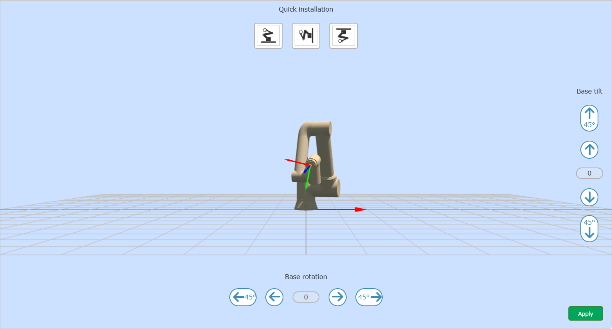
   
.. centered:: Figure 6.1‑1 360 degree free installation

.. important:: 
   After the installation of the robot is completed, the installation method of the robot must be set correctly, otherwise it will affect the use of the robot's dragging function and collision detection function.

Coordinate
----------------

TCP
~~~~~~~~~~~~~~~~~~~

In the menu bar of "Initial" -> "Base", click "TCP" to enter the tool coordinate page.

Tool coordinates can be modified, cleared, renamed and applied. In the drop-down list of tool coordinate systems, after selecting the corresponding coordinate system(the coordinate system name can be customized), the corresponding coordinate value, tool type and installation location (only displayed under sensor type tools) will be displayed below. After selecting a coordinate system, click the "Apply" button, and the currently used tool coordinate system will become the selected coordinate, as shown below.

.. image:: base/001.png
   :width: 4in
   :align: center
   
.. centered:: Figure 6.2‑1 Set tool coordinates

Click "Modify" to reset the tool coordinate system of the number according to the prompt. Tool calibration methods are divided into four-point method and six-point method. The four-point method only calibrates the tool TCP, that is, the position of the center point of the tool. Its posture defaults to be consistent with the end posture. The six-point method adds two points to the four-point method. , used to calibrate the attitude of the tool, here we take the six-point method as an example to explain.

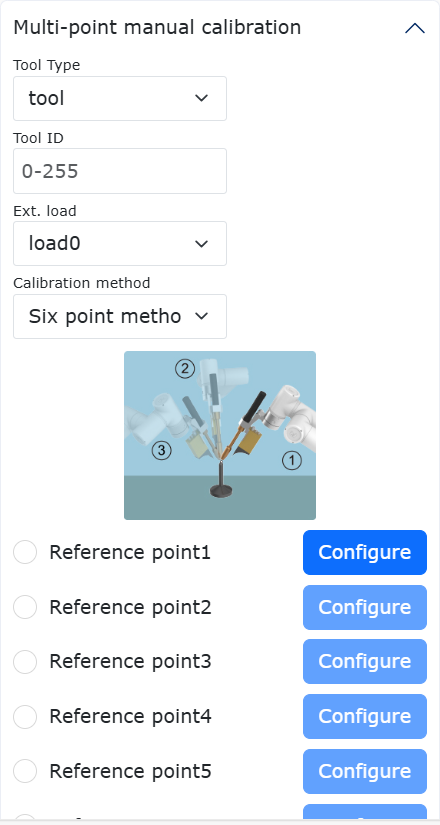

.. centered:: Figure 6.2‑2 Set tool coordinates

Select a fixed point in the robot space, move the tool to the fixed point in three different postures, and set 1-3 points in sequence. As shown in the upper left of figure. Move the tool vertically to the fixed point setting point 4, as shown in the upper right of figure. Keep the posture unchanged, use the base coordinates to move, move a certain distance in the horizontal direction, and set point 5, which is the positive direction of the X-axis of the set tool coordinate system. Return to the fixed point, move vertically for a certain distance, and set point 6. This direction is the positive direction of the Z-axis of the tool coordinate system, and the positive direction of the Y-axis of the tool coordinate system is determined by the right-hand rule. Click the Calculate button to calculate the tool pose. If you need to reset it, click Cancel and press the Modify button to re-create the tool coordinate system.

.. image:: base/003.png
   :width: 3in
   :align: center

.. centered:: Figure 6.2‑3 Schematic diagram of the six-point method

After completing the last step, click "Finish" to return to the tool coordinate interface, and click "Save" to store the tool coordinate system just created.

.. important:: 
   1. After the tool is installed at the end, the tool coordinate system must be calibrated and applied, otherwise the position and attitude of the tool center point will not meet the expected values when the robot executes the motion command.
   2. The tool coordinate system generally uses toolcoord1~toolcoord19, and toolcoord0 is used to indicate that the position center of the tool TCP is at the center of the end flange. When calibrating the tool coordinate system, it is first necessary to apply the tool coordinate system to toolcoord0, and then select other tool coordinate systems for calibration and application.

Ext. TCP
~~~~~~~~~~~~~~~~~~~~~~~~~~

Under the menu bar of "Initial" -> "Base", click "Ext. TCP" to enter the external tool coordinate system interface.

The modification, clearing and application of external tool coordinates can be realized in the external tool coordinate system setting interface.

There are 15 numbers in the drop-down list of the external tool coordinate system, from etoolcoord0~etoolcoord14, after selecting the corresponding coordinate system, the corresponding coordinate value will be displayed below, after selecting a coordinate system, click the "Apply" button, the currently used tool coordinate system Change to the selected coordinates, as shown in figure below.

.. image:: base/004.png
   :width: 4in
   :align: center

.. centered:: Figure 6.2‑4 External tool coordinates

Click "Modify" to reset the tool coordinate system of the number according to the prompt, as shown in figure below.

.. image:: base/005.png
   :width: 4in
   :align: center

.. centered:: Figure 6.2‑5 Schematic diagram of the six-point method

**1. Three-point method to determine the external TCP**

- **Set point 1**:The TCP of the measured tool is moved to the external TCP, click the Setpoint 1 button;

- **Set point 2**:Move a certain distance from point 1 along the X axis of the external TCF coordinate system, and click the button to set point 2;

- **Set point 3**:Go back to point 1, move from point 1 along the Z axis of the external TCF coordinate system for a certain distance, and click the button to set point 3;

- **Calculate**:Click the calculate button to get the external TCF;

**2.Six-point method to determine the tool TCF**

- **Set points 1-4**:Select a fixed point in the robot space, move the tool to the selected point from four different angles, and set points 1-4 in sequence;

- **Set point 5**:Go back to the fixed point and move a certain distance along the X axis of the tool TCF coordinate system, and click the Set Point 5 button;

- **Set point 6**:Go back to the fixed point and move a certain distance along the Y axis of the tool TCF coordinate system, and click the set point 6 button;

- **Calculate**:Click the calculate button to get the tool TCF;

If you need to reset, click the Cancel button to go back to the step of creating a new tool coordinate system.

After completing the last step, click "Finish" to return to the tool coordinate interface, and click "Save" to store the tool coordinate system just created.

.. important:: 
   1. The use of external tools must be calibrated and applied to the external tool coordinate system, otherwise the position and attitude of the tool center point when the robot executes motion commands will not meet the expected values.
   2. The external tool coordinate system generally uses etoolcoord1~etoolcoord14, and the application of etoolcoord0 means that the center position of the external tool TCP is at the center of the end flange. When calibrating the tool coordinate system, the tool coordinate system must first be applied to etoolcoord0, and then other tool coordinate systems should be selected calibration.

Workpiece
~~~~~~~~~~~~~~~~~~~~~~~

Under the menu bar of "Initial" -> "Base", click "Workpiece" to enter the workpiece coordinates interface. Workpiece coordinates can realize the modification, clearing and application of workpiece coordinates. There are 15 numbers in the drop-down list of the workpiece coordinate system, select the corresponding coordinate system (wobjcoord0~
wobjcoord14), and then the corresponding coordinate value will be displayed in the "Coordinate System Coordinates" below. After selecting a certain coordinate system, click the "Apply" button, and the currently used workpiece coordinate system will change to the selected coordinates, as shown in figure below.

.. image:: base/006.png
   :width: 4in
   :align: center

.. centered:: Figure 6.2‑6 Set workpiece coordinates

The workpiece coordinate system is generally calibrated based on the tool, and the workpiece coordinate system needs to be established on the basis of the established tool coordinate system. Click "Modify" to reset the workpiece coordinate system of the number according to the prompt. Fix the workpiece and select the calibration method "origin-X-axis-Z-axis" or "origin-X-axis-XY+plane". The selection of the first two points of the two calibration methods is the same, and the third point is different. One method is to calibrate the Z direction of the workpiece coordinate system, and the second method is to calibrate a point on the XY+ plane, just calibrate according to the diagram. Click the Calculate button to calculate the workpiece pose. If you need to reset it, click Cancel and press the Modify button to re-create the workpiece coordinate system.

.. image:: base/007.png
   :width: 3in
   :align: center

.. centered:: Figure 6.2‑7 Schematic diagram of the three-point method

After completing the last step, click "Finish" to return to the workpiece coordinate interface, and click "Save" to store the workpiece coordinate system just created.

.. important:: 
   1. The workpiece coordinate system is calibrated based on the tool, and the workpiece coordinate system needs to be established on the basis of the established tool coordinate system.
   2. The workpiece coordinate system generally uses wobjcoord1~wobjcoord14, and wobjcoord0 is used to indicate that the origin of the workpiece coordinate system is at the origin of the base coordinates. When calibrating the workpiece coordinate system, it is first necessary to apply the workpiece coordinate system to wobjcoord0, and then select other workpiece coordinate systems for calibration and application.

Payload
-------------

End payload
~~~~~~~~~~~~~~

In the menu bar under 'Initial Setup' -> 'Basic' -> 'Load', click 'Trajectory Identification' to enter the trajectory identification interface.

When configuring the end load, please enter the mass of the end tool used and the corresponding center of mass coordinates into the "Load mass" and "Load mass center coordinates X, Y and Z" input boxes and apply.

.. important:: 
    The load mass cannot exceed the maximum load range of the robot. For the load range corresponding to the specific robot model, please refer to 2.1. Basic parameters.The center of mass coordinate setting range is 0-1000, unit mm.

.. image:: base/016.png
   :width: 4in
   :align: center

.. centered:: Figure 6.3-1 Schematic diagram of load setting

.. important:: 
   After the load is installed at the end of the robot, the weight of the end load and the coordinates of the center of mass must be set correctly, otherwise it will affect the drag function of the robot and the use of the collision detection function.

If the user is unsure about the tool mass or center of mass, he can click "Automatic Identification" to enter the load identification function to measure the tool data.

Before taking measurements, make sure the load is installed and then select the version. Click the "Tool Data Measurement" button to enter the load motion test interface.

.. image:: base/017.png
   :width: 4in
   :align: center

.. centered:: Figure 6.3-2 Load Identification Joint Setup

Click "Load Identification Start" to test. In case of emergency, please stop the movement in time.

.. image:: base/018.png
   :width: 4in
   :align: center

.. centered:: Figure 6.3-3 load identification start

After the exercise is over, click the "Get Identification Result" button to obtain the calculated tool data and display it on the page. If you want to apply it to the load data, click Apply.

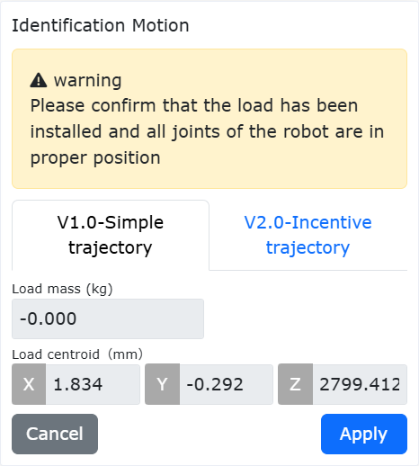

.. centered:: Figure 6.3-4 Load Identification Results

Joint
--------------

Soft limit
~~~~~~~~~~~

Under the menu bar of "Initial" -> "Base" -> "Joint", click "Soft limit" to enter the soft limit interface.

There may be other equipment in the robot's stroke, and the limit angle can softly limit the robot so that the robot's movement does not exceed a certain coordinate value and prevent the robot from colliding. Triggering the soft limit to stop the robot is automatically triggered by the robot, and there is no stopping distance.

Administrators can use the default values or enter angle values. Input the angle value to limit the positive and negative angles of the robot joints respectively. When the input value exceeds the robot joint soft limit angle value listed in the robot basic parameter table in 2.1-Basic Parameters, the limit angle will be adjusted to the maximum value that can be set. When the robot reports that the command exceeds the limit, it needs to enter the drag mode and drag the robot joints to within the limit angle. The interface is shown in figure below.

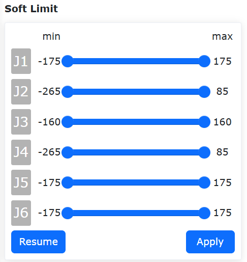

.. centered:: Figure 6.4-1 Schematic diagram of robot limit

Joint Soft Limit Protection
+++++++++++++++++++++++++++++++++++

Overview
************************

The Joint Soft Limit Protection function is an active safety mechanism that dynamically restricts operators from exceeding the set soft limit range during drag teaching by real-time monitoring of the robotic arm's joint motion status. This feature ensures soft limits remain effective during drag teaching, thereby enhancing human-robot collaboration safety.

Joint Soft Limit Protection
********************************

The Joint Soft Limit Protection function requires matching software package and firmware versions for optimal performance.

Soft Limit Configuration and Function Control
""""""""""""""""""""""""""""""""""""""""""""""""""""

**Step1**: Log in to the web interface, navigate to "Initial Setup"->"Basic"->"Joints"->"Soft Limits" to access the robot soft limit configuration module.

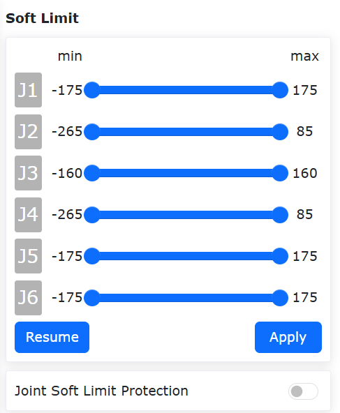

.. centered:: Figure 6.4‑1-2 Robot Soft Limit Configuration Module

**Step2**: Set appropriate soft limits for each joint based on the robot's actual working range. Verify whether each joint's current angular position is within the preset soft limit range. If yes, click "Apply" to implement the preset soft limits; if not, move each joint within the preset range first. Otherwise, an out-of-limit error will appear when clicking "Apply", as shown below. In this case, perform single-axis jogging or dragging toward the valid range to clear the error.

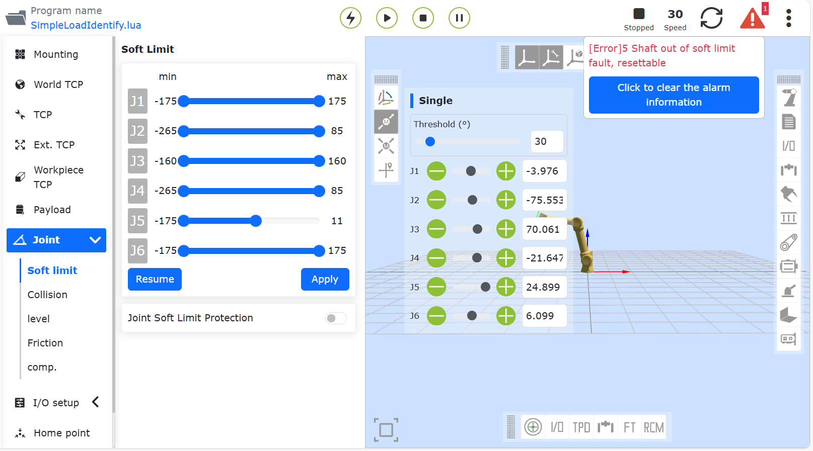

.. centered:: Figure 6.4‑1-3 Error Display When Joint Angles Exceed Soft Limit Range

**Step3**: After successful soft limit configuration, toggle the "Joint Soft Limit Protection" slider to activate this function (see Figure below). During drag teaching, the set soft limits will take effect, and resistance will be felt when approaching the limits.

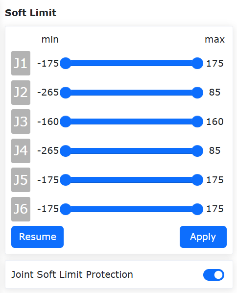

.. centered:: Figure 6.4‑1-4 Enabling Joint Soft Limit Protection

**Step4**: To disable Joint Soft Limit Protection, simply toggle the "Joint Soft Limit Protection" slider.

Collision level
~~~~~~~~~~~~~~~~~~

Under the menu bar of "Initial" -> "Base" -> "Joint", click "Collision Level" to enter the collision level interface.

The collision level is divided into one to ten levels, and the detection of one to three levels is more sensitive, and the robot needs to run at the recommended speed. At the same time, you can choose to customize the percentage setting, and 100% corresponds to the tenth level. The collision strategy can set the processing method of the robot after the collision, which is divided into error stop and continuous movement, and the user can set it according to the specific use requirements. Such as Figure 6.2‑16.

.. image:: base/021.png
   :width: 4in
   :align: center

.. centered:: Figure 6.4-2 Schematic diagram of collision level

Post-collision response strategy function
~~~~~~~~~~~~~~~~~~~~~~~~~~~~~~~~~~~~~~~~~~~~~~

On the basis of the original collision strategy in motion, " Gravitational moment mode " and " Vibration response mode " are added to ensure the safety of man-machine cooperation. 

When the two strategies are triggered, they will switch from automatic mode or manual mode to drag mode. The Gravitational moment mode will move away from the collision point according to the magnitude and direction of the collision force, while the Vibration response mode will return to the collision position after moving away from the collision point. At the same time, collision detection at rest is added.

Collision strategy
+++++++++++++++++++++

FT_Guard command is used to realize collision detection based on force sensor. The previous collision strategies were "collision stop", "collision pause" and "moving on". In order to avoid the extrusion force between robot and object after collision, the strategies of "Gravitational moment mode", "Vibration response mode" and "Collision rebound mode" are added.

When triggered, all three strategies will switch from automatic mode or manual mode to drag mode, and then switch to manual mode. Among them, the Gravitational moment mode will be far away from the collision point according to the magnitude and direction of the collision force; The Vibration response mode will return to the collision position after being far away from the collision point; The collision rebound mode will accelerate away from the collision point according to the set parameters.

Gravitational moment mode
*****************************

The Gravitational moment mode in collision strategy is set as follows.

**Step1**:Click "Collision Level" under the menu bar of "Initial" -> "Base" -> "Joint" to enter the corresponding interface.

**Step2**:In the column of "Collision Strategy", click the drop-down box to select " Gravitational moment mode ", and the interface is shown below; Then, click the "Apply" button to enable the function. 

.. note:: In the operation of the robot, if the load mass changes greatly, this strategy is not recommended; This strategy is not recommended if the running speed is too fast.

.. image:: base/022.png
   :width: 4in
   :align: center

.. centered:: Figure 6.4-3 Gravitational moment mode of Collision Strategy

Vibration response mode
*************************

The setting steps of oscillation response mode in collision strategy are as follows.

**Step1**:Click "Collision Level" under the menu bar of "Initial" -> "Base" -> "Joint" to enter the corresponding interface.

**Step2**:In the column of "Collision Strategy", click the drop-down box to select " Vibration response mode", and the interface is shown below; Then, click the "Apply" button to enable the function.

.. note:: It is not recommended to use this strategy if the robot runs too fast.

.. image:: base/023.png
   :width: 4in
   :align: center

.. centered:: Figure 6.4-4 Vibration response mode of Collision Strategy

Collision rebound mode
**************************

The collision rebound mode in collision strategy is set as follows.

**Step 1**：Click "Collision Level" under the menu bar of "Robot Settings" in the initial setting to enter the corresponding interface.

**Step 2**：In the column of "Collision Strategy", click the drop-down box to select "Collision Rebound Mode", and set the safety time of 1000ms, the safety distance of 150mm, the safety speed of 150mm/s, and the safety factor of each joint is 5. The specific interface is shown below.

.. image:: base/049.png
   :width: 6in
   :align: center

.. centered:: Figure 6.4-5 Collision rebound mode of collision strategy

The meaning of each parameter:
  - Safe time: indicates the duration in drag mode after switching from automatic mode to drag mode, and the range is [1000-2000] ms;
  - Safe distance: indicates the position of the robot away from the collision point after collision, and the range is [150-200] mm;
  - Safe speed: indicates the maximum TCP speed of the robot away from the collision point after collision. If the speed limit is exceeded, the rebound force will be restrained, and the range is [50-250] mm/s;
  - Safety factor: indicates the attenuation speed of rebound force. The smaller the factor, the faster the attenuation and the faster the rebound speed, and vice versa. The range is [1-10], dimensionless.

FT_Guard Command
**********************

FT_Guard command is used to realize collision detection of force sensor. First select the direction of detection, or set all directions. Then, the current force sensor data is obtained as the initial value, and then the maximum threshold and minimum threshold are set to determine the upper and lower limits of collision force triggering, so that the collision detection function setting can be completed. Take the Z-direction configuration as an example. See Figure for detailed settings.

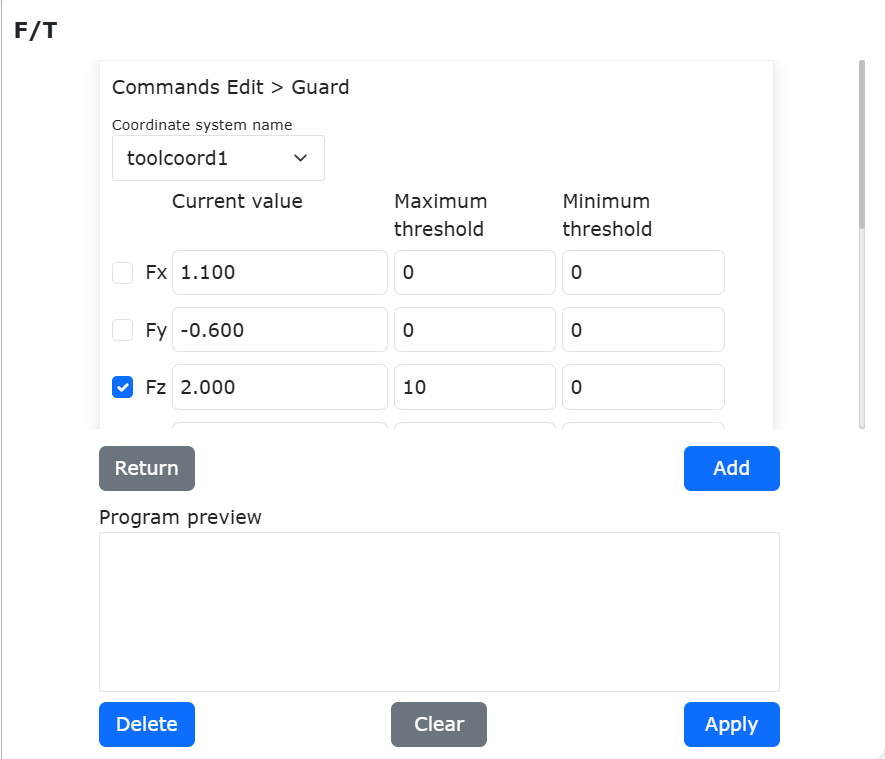

.. centered:: Figure 6.4-6 parameter of FT_Guard command

FT_Guard command is usually used with motion command, such as PTP or LIN, and a simple example is shown below.

.. image:: base/051.png
   :width: 5in
   :align: center

.. centered:: Figure 6.4-7 example of FT_Guard with motion command

The first behavior of figure sets the force sensor collision detection on, and the last behavior turns off the force sensor collision detection function.

Static collision detection
+++++++++++++++++++++++++++++++

The setup steps of static collision detection are as follows.

**Step1**:Click "Collision Level" under the menu bar of "Initial" -> "Base" -> "Joint" to enter the corresponding interface.

**Step2**:Turn on the switch for static collision detection, as shown below. When it is detected that the gap between the joint torque command and the torque feedback is too large, the robot will enter the drag mode to avoid continuous extrusion force.

.. image:: base/024.png
   :width: 4in
   :align: center

.. centered:: Figure 6.4-8 Static collision detection

Torque Detection Function Before Dragging
++++++++++++++++++++++++++++++++++++++++++++++++++++

Overview
***********************
Before the robot enters the drag mode, torque detection is required. The function of this is to prevent abnormal phenomena such as lifting or falling after the robot enters the drag mode due to the operator setting incorrect load parameters or selecting the wrong installation method. If the joint torque is detected to exceed the allowable range, the controller will immediately report an error and prohibit the robot from entering the drag mode.

Torque Detection Before Dragging
**************************************

**Step1**: Click "Initial Settings"->"Basic"-> "Joints"->"Collision Level" to enter the collision level setting interface, and turn on the torque detection function before dragging, as shown in Figure 2-1.

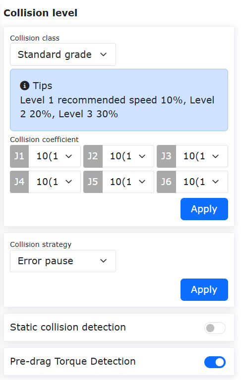

.. centered:: Figure 6.4-9 Torque Detection Function Before Dragging Enabled

**Step2**: Switch to drag mode. The Web interface enters the drag mode by clicking the robot status area - robot drag status, long pressing the teach pendant "Teach Mode" button, or long pressing the robot end drag button. If the controller reports an error and the robot does not switch to drag mode, as shown in Figure 2-2, check whether the robot load configuration and installation method are correct.

.. image:: base/070.png
   :width: 2in
   :align: center

.. centered:: Figure 6.4-10 Torque Exceeds Limit, Controller Reports Error

**Step3**: Check the load configuration and installation method. Click "Initial Settings"->"Basic"-> "Load"->"End" to check whether the end load configuration on the web interface is the same as the actual installed load; click "Initial Settings"->"Basic"-> "Installation"->"Free Installation" to check whether the installation method on the web interface is the same as the actual installation method.

Friction compensation
~~~~~~~~~~~~~~~~~~~~~~~~~

Under the menu bar of "Initial" -> "Base" -> "Joint", click "Friction comp." to enter the friction compensation setting interface.

**Friction compensation coefficient**:The usage scenario for friction compensation is only in the dragging mode. The friction compensation coefficient can be set from 0 to 1. The higher the value, the greater the compensation force when dragging. The friction compensation coefficient needs to be set separately for each axis according to the different installation methods.

**Friction compensation switch**:Users can turn on or off friction compensation according to the actual robot and usage habits.

.. image:: base/025.png
   :width: 4in
   :align: center

.. centered:: Figure 6.4-11 Friction Compensation Settings

.. important:: 
   The friction compensation function of the robot needs to be used with caution. According to the actual situation, a reasonable compensation coefficient should be set. Generally, the recommended median value is about 0.5.

Dragging Force Compensation
~~~~~~~~~~~~~~~~~~~~~~~~~~~~~

Overview
+++++++++++++++++++++++++++++++++++++

Dragging force optimization builds upon the current current-loop dragging by compensating additional torque based on the robot's motion trend. This compensates for torque errors introduced by modeling inaccuracies and other factors, resulting in smoother robot dragging.

Robot Dragging Force Optimization
+++++++++++++++++++++++++++++++++++++

The dragging force optimization feature requires matching software and firmware versions to ensure optimal performance.

Dragging Force Optimization Configuration
************************************************
**Step1**: Log in to the web interface, navigate to "Initial Setup" -> "Basic" -> "Joints" -> "Friction Compensation" to access the dragging force compensation settings module, as shown in the figure.

.. image:: base/068.png
   :width: 4in
   :align: center

.. centered:: Figure 6.4-12 Dragging Force Compensation Settings Module

**Step2**: Set "Compensation Switch" to "ON" and "Adaptive Switch" to "OFF", configure parameters as shown in Figure 2-1, then click "Apply" to successfully enable the function. Press the drag button to drag the robot, and the dragging feel will be noticeably smoother than before enabling the function.

**Step3**: Parameter adjustment - the compensation coefficient range is [0-1]. If dragging feels slightly heavy, increase the parameter for the corresponding axis. If the robot fails to stop during dragging or joint vibration occurs, decrease the parameter for the corresponding axis. During dragging, a damping sensation will be present to decelerate and stop the robot.

**Step4**: To disable the dragging force compensation function, set "Compensation Switch" to "OFF".

I/O setup
--------------------

Pausing LUA Program
~~~~~~~~~~~~~~~~~~~~~~~~~~~~~

During the execution of a robot LUA program, clicking the "Pause/Resume" button will pause the LUA program, and the robot's status will change to "Pause". Clicking the button again will resume the program from the paused position, and the robot's status will return to "Running".

All running background processes will also be paused and resumed synchronously during this operation. Different types of LUA instructions behave differently when paused:

**① Motion Commands**:  
The robot stops immediately when paused. Upon resuming, the robot will continue moving to the target position specified by the command.

**② Logic Commands (SetDO, GetDI, GetInverseKinRef, etc.)**:  
If the program is paused during execution, these commands will complete their current operation before waiting for the LUA program to resume before proceeding to the next command.

**③ Wait Commands (WaitDI, ModbusMasterWaitDI, etc.)**:  
If paused during a wait operation, the pause duration does not count toward the wait timeout period.

**④ Sleep Commands (sleep_ms, WaitMs)**:  
If paused during a sleep operation, the pause duration does not count toward the specified sleep time.

.. image:: base/066.png
   :width: 4in
   :align: center

.. centered:: Figure 6.5‑1 LUA Program Paused State

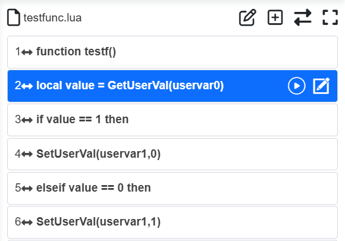

.. centered:: Figure 6.5‑2 LUA Program Running State

I/O configuration
~~~~~~~~~~~~~~~~~~

Click "Initial" -> "Base" -> "I/O setup" on the menu bar, and click the "DI Configuration" and "DO Configuration" submenus respectively to enter the DI and DO configuration interface. Among them, the control box CI0-CI7 and CO0-CO7 are configurable, and the terminal DI0 and DI1 are configurable. 

DI Configuration
++++++++++++++++++++

In production, when the collaborative robot needs to connect peripherals or stops suddenly due to failure or other factors, it needs to output DO signal to realize sound and light alarm prompt. The input configurable functions are shown in table below.

.. centered:: Table 6.5‑1 Configurable functions of control box input

.. list-table:: 
   :widths: 15 30 100
   :header-rows: 1
   :align: center

   * - Function number
     - Function name
     - Function description
   * - 0
     - None
     - None
   * - 1
     - Arc start success signal
     - The arc starts successfully and the robot outputs the arc start signal to the welder
   * - 2
     - Welding preparation signal
     - Robot welding preparation success signal
   * - 3
     - Conveyor detection
     - Conveyor detection switch DI configuration signal
   * - 4
     - Pause
     - Robot motion pause signal during welding
   * - 5
     - Resume
     - When the arc is interrupted unexpectedly during robot welding or the operator actively pauses welding, welding interruption will be triggered. After welding interruption, when the external input signal to the robot changes from invalid to valid, the robot automatically resumes welding from the original interrupted position
   * - 6
     - Start
     - In the DI configuration configurable input, select CIO as "Start" and click "Apply". The configurable input valid state can be selected as "high level valid". When the CI0 level changes from low level to high level, the "start" function is triggered to start the program opened in the current teaching program interface. If the interface is not opened, the last saved program will be run; the configurable input valid state can be selected as "low level valid". When the CI0 level changes from high level to low level, the "start" function is triggered to start the program opened in the current teaching program interface. If the interface is not opened, the last saved program will be run
   * - 7
     - Stop
     - The robot stops the motion signal during welding
   * - 8
     - Pause/resume
     - After the robot moves, the pause/resume motion signal is triggered cyclically
   * - 9
     - Start/stop
     - After the robot moves, the start/stop motion signal is triggered cyclically
   * - 10
     - Foot drag switch
     - Robot foot drag switch motion signal
   * - 11
     - Move to the operation origin
     - The robot moves to the operation origin signal with the current robot posture as the operation origin
   * - 12
     - Manual automatic switching (pulse signal)
     - In the configurable input of DI configuration, select CIO as "Manual automatic switching (pulse signal)", and click "Apply". Select "High level valid" for the configurable input valid state. When the CI0 level changes from low level to high level, the "Manual automatic switching (pulse signal)" function is triggered, and the robot switches the running state once; select "Low level valid" for the configurable input valid state. When the CI0 level changes from high level to low level, the "Manual automatic switching (pulse signal)" function is triggered, and the robot switches the running state once
   * - 13
     - Welding wire positioning success
     - Robot welding wire positioning success signal
   * - 14
     - Motion interruption
     - Robot motion program interruption signal
   * - 15
     - Start main program
     - Start robot main program signal
   * - 16
     - Start rewinding
     - After the robot program is running, the program rewinding start signal.
   * - 17
     - Start confirmation
     - Robot program start confirmation signal
   * - 18
     - Laser detection signal X
     - Robot laser sensor detection signal X
   * - 19
     - Laser detection signal Y
     - Robot laser sensor detection signal Y
   * - 20
     - External emergency stop input signal 1
     - Robot external emergency stop input signal 1, ① only displayed under QX. ② Under LA, relevant configuration can be made in the "Initial Settings" -> "Safety" -> "I/O Safety" -> "DIO Safety Function Configuration" interface
   * - 21
     - External emergency stop input signal 2
     - Robot external emergency stop input signal 2, ① only displayed under QX. ② Under LA, relevant configuration can be made in the "Initial Settings" -> "Safety" -> "I/O Safety" -> "DIO Safety Function Configuration" interface
   * - 22
     - Level 1 reduction mode
     - Robot level 1 reduction mode, ① only displayed under QX. ② In LA, you can configure the relevant settings in the "Initial Settings" -> "Safety" -> "I/O Safety" -> "DIO Safety Function Configuration" interface
   * - 23
     - Secondary reduction mode
     - Robot secondary reduction mode, ① only displayed in QX. ② In LA, you can configure the relevant settings in the "Initial Settings" -> "Safety" -> "I/O Safety" -> "DIO Safety Function Configuration" interface
   * - 24
     - Third-level reduction mode (stop)
     - Robot third-level reduction mode (stop), ① only displayed in QX. ② Under LA, you can make relevant configurations in the "Initial Settings" -> "Safety" -> "I/O Safety" -> "DIO Safety Function Configuration" interface
   * - 25
     - Resume welding
     - After the robot is interrupted from welding, the welding operation signal is restored
   * - 26
     - Stop welding
     - During the robot welding process, the welding operation signal is stopped
   * - 27
     - Auxiliary drag on
     - Control box DI function configuration force sensor drag function on signal
   * - 28
     - Auxiliary drag off
     - Control box DI function configuration force sensor drag function off signal
   * - 29
     - Auxiliary drag on/off
     - Control box DI function configuration force sensor drag function, cycle on/off signal
   * - 30
     - Clear all errors
     - Clear all error signals triggered by the robot
   * - 31
     - Manual automatic switching (high and low level)
     - In the configurable input of DI configuration, select CIO as "Manual automatic switching (high and low level)" and click "Apply". The configurable input valid state can be selected as "high level valid". When CI0 is switched to a high level, the "manual automatic switching (high and low levels)" function is triggered, and the robot state is switched to the automatic state; the configurable input valid state can be selected as "low level valid". When CI0 is switched to a low level, the "manual automatic switching (high and low levels)" function is triggered, and the robot state is switched to the automatic state.
   * - 32
     - Enable
     - Controls robot enable
   * - 33
     - Disable
     - Controls robot disable
   * - 34
     - Enable/Disable (Rising/Falling Edge)
     - Rising/Falling edge of input signal triggers robot enable/disable respectively

Terminal input valid state
****************************************

.. centered:: Table 6.5‑2 Configurable functions of terminal input

.. list-table:: 
   :widths: 15 30 100 
   :header-rows: 1
   :align: center

   * - Function number
     - Function name
     - Function description
   * - 0
     - None
     - None
   * - 1
     - Drag mode
     - The robot end enables the drag mode signal
   * - 2
     - Teaching point record
     - The robot end enables the teaching point record signal and saves the current robot point data
   * - 3
     - Hand automatic switching
     - Robot hand automatic switching trigger signal
   * - 4
     - TPD trajectory recording start/stop
     - After the robot starts TPD movement, the trajectory recording start/stop signal
   * - 5
     - Pause
     - Robot movement pause signal
   * - 6
     - Resume
     - Robot resume movement signal
   * - 7
     - Start
     - Robot program start signal
   * - 8
     - Stop
     - Robot program stop signal
   * - 9
     - Pause/Resume
     - After the robot moves, the pause/resume movement signal is triggered cyclically
   * - 10
     - Start/Stop
     - After the robot moves, the start/stop movement signal is triggered cyclically
   * - 11
     - Auxiliary drag on
     - Control box DI function configuration force sensor drag function on signal
   * - 12
     - Auxiliary drag off
     - Control box DI function configuration force sensor drag function off signal
   * - 13
     - Auxiliary drag on/off
     - Control box DI function configuration force sensor drag function, cycle on/off signal

The default configuration of the control box: CO0 is 1-robot error, CO1 is 2-robot in motion.

.. image:: base/026.png
   :width: 6in
   :align: center

.. centered:: Figure 6.5‑3 Control box DI and DO configuration

**Terminal DI default configuration**: DI0 drag teaching, DI1 teaching point recording.

.. image:: base/027.png
   :width: 4in
   :align: center

.. centered:: Figure 6.5‑4 Terminal DI configuration

After configuration is completed, the corresponding output DO status can be viewed in the control box I/O page under the corresponding state.

.. important::
  The configured DI and DO are prohibited from being used in program programming.

**Reduction mode configuration (first level, second level, third level)**: The first and second level reduction modes can configure the joint speed and terminal TCP speed, and the third level reduction mode is stop and the speed does not need to be configured.

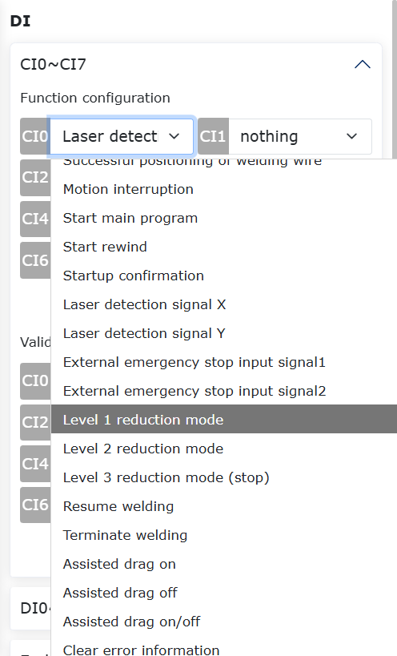

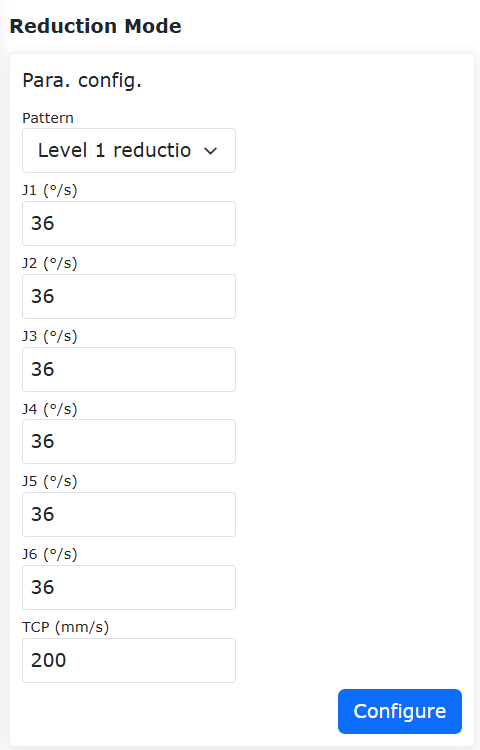

.. centered:: Figure 6.5‑5 Reduced mode configuration

DO configuration
++++++++++++++++++

The output configurable functions are shown in the following table:

.. centered:: Table 6.5‑3 Control box output configurable functions

.. list-table:: 
   :widths: 15 30 100
   :header-rows: 1
   :align: center

   * - Function number
     - Function name
     - Function description
   * - 0
     - None
     - None
   * - 1
     - Error
     - DO output error signal
   * - 2
     - Movement
     - Robot movement signal
   * - 3
     - Spray start and stop
     - Robot spray start and stop operation signal
   * - 4
     - Spray gun cleaning
     - Robot spray gun cleaning operation signal
   * - 5
     - Arc start
     - The robot controls the DO output port of the welding machine arc start. When the robot program executes the arc start command, the DO output port corresponding to the welding machine arc start automatically outputs valid
   * - 6
     - Gas supply
     - The robot controls the DO output port of the welding machine gas supply. When the robot executes the welding gas supply command, the DO output port corresponding to the gas supply automatically outputs valid
   * - 7
     - Forward wire feeding
     - The robot controls the DO output port of the welding machine forward wire feeding. When the robot executes the forward wire feeding command, the DO output port corresponding to the forward wire feeding automatically outputs valid
   * - 8
     - Reverse wire feeding
     - The robot controls the DO output port of the welding machine to feed the wire in reverse. When the robot executes the reverse wire feeding command, the DO output port corresponding to the reverse wire feeding automatically outputs and becomes valid
   * - 9
     - JOB input port 1
     - JOB input port 1 signal
   * - 10
     - JOB input port 2
     - JOB input port 2 signal
   * - 11
     - JOB input port 3
     - JOB input port 3 signal
   * - 12
     - Conveyor start and stop
     - Conveyor movement start and stop operation signal
   * - 13
     - Pause
     - Robot movement pause signal
   * - 14
     - Arrival at the operation origin
     - Robot movement to the operation origin signal
   * - 15
     - Enter the interference zone
     - Robot movement to the interference zone signal
   * - 16
     - Wire position finding start and stop control
     - Robot wire position finding start and stop control operation signal
   * - 17
     - Robot start completion
     - Robot start completion signal
   * - 18
     - Program start stop
     - Robot motion program start stop signal
   * - 19
     - Automatic manual mode
     - Robot hand automatic mode switching signal
   * - 20
     - Emergency stop output signal 1
     - Robot emergency stop output signal 1, ① only displayed under QX. ② Under LA, you can configure it in the "Initial Settings" -> "Safety" -> "I/O Safety" -> "DIO Safety Function Configuration" interface
   * - 21
     - Emergency stop output signal 2
     - Robot emergency stop output signal 2, ① only displayed under QX. ② Under LA, you can configure it in the "Initial Settings" -> "Safety" -> "I/O Safety" -> "DIO Safety Function Configuration" interface
   * - 22
     - Lua script program run/stop
     - Robot motion Lua script program run/stop signal
   * - 23
     - Safety status output
     - Robot safety status output signal, ① only displayed under QX. ② In LA, you can configure the relevant settings in the "Initial Settings" -> "Safety" -> "I/O Safety" -> "DIO Safety Function Configuration" interface
   * - 24
     - Protective stop status output
     - Robot protective stop status output signal, ① only displayed in QX. ② In LA, you can configure the relevant settings in the "Initial Settings" -> "Safety" -> "I/O Safety" -> "DIO Safety Function Configuration" interface
   * - 25
     - Robot in motion
     - Robot in motion status signal, ① only displayed in QX. ② In LA, you can configure the relevant settings in the "Initial Settings" -> "Safety" -> "I/O Safety" -> "DIO Safety Function Configuration" interface
   * - 26
     - Robot reduction mode
     - Robot reduction mode signal, ① only displayed in QX. ② In LA, you can configure the relevant settings in the "Initial Settings" -> "Safety" -> "I/O Safety" -> "DIO Safety Function Configuration" interface
   * - 27
     - Robot non-reduction mode
     - Robot non-reduction mode signal, ① only displayed in QX. ② Under LA, you can configure the relevant settings in the "Initial Settings" -> "Safety" -> "I/O Safety" -> "DIO Safety Function Configuration" interface
   * - 28
     - Reserved
     - Reserved
   * - 29
     - Command point error
     - Joint command point error signal
   * - 30
     - Drive error
     - Drive error signal
   * - 31
     - Soft limit error
     - Robot exceeds soft limit error signal, need to adjust the corresponding joint soft limit
   * - 32
     - Collision error
     - Robot collision error signal
   * - 33
     - Active slave number error
     - Active slave number error abnormal signal
   * - 34
     - Slave error
     - Slave abnormal error signal
   * - 35
     - I/O error
     - I/O error signal
   * - 36
     - Gripper error
     - Gripper related configuration abnormal signal
   * - 37
     - File error
     - Configuration file loading error signal
   * - 38
     - Singular position error
     - Error signal when the robot moves to a singular position
   * - 39
     - Driver communication error
     - Abnormal communication error signal of the robot driver
   * - 40
     - Parameter error
     - DO high and low level range error
   * - 41
     - External axis exceeds soft limit error
     - External axis 1-4 exceeds soft limit fault signal
   * - 42
     - Planning & Timeout Warning
     - Robot planning and timeout alarm status
   * - 43
     - Safety Door Warning
     - Safety door trigger status
   * - 44
     - Motion Warning
     - Motion warning status
   * - 45
     - Interference Zone Warning
     - Robot entering interference zone warning
   * - 46
     - Safety Wall Warning
     - Robot entering safety wall warning
   * - 47
     - Robot Enabled
     - Robot enable status

Control box DO high and low effective configurable function
~~~~~~~~~~~~~~~~~~~~~~~~~~~~~~~~~~~~~~~~~~~~~~~~~~~~~~~~~~~~~~~~

Overview
+++++++++++
During the entire process from the control box power-on to the robot enabling, DO can be configured to the required output state according to the specific usage scenario, which is more flexible and convenient to use.

Operation steps
++++++++++++++++++

Enter Initial Settings->Basics->I/O Settings->DO interface, and configure the control box DO output during power-on to the required high/low level.

.. image:: base/055.png
   :width: 4in
   :align: center

.. centered:: Figure 6.5‑6 Control box DO output configuration during power-on

Alias
~~~~~~~~~~~~~~~~~~~~~~~~~~~~~~~

Click "Initial - Base - I/O setup" on the menu bar, click on the "Alias"  submenu to enter the configuration interface, and configure the given meaning names of the control box and end IO signals according to the actual usage scenario. After successful configuration, the modules related to IO signal content will display corresponding aliases, as follows:

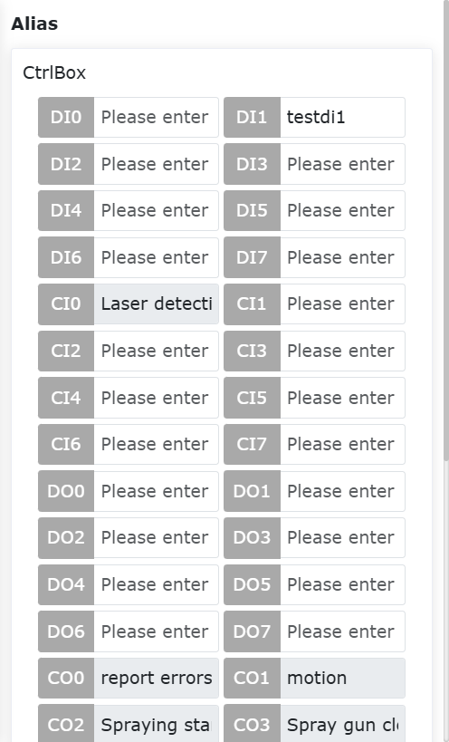

.. centered:: Figure 6.5‑7 I/O alias configuration

Filter
~~~~~~~~~~~~~~~~

Click "Initial - Base - I/O setup" on the menu bar, and click the "Filter" submenu to enter the IO filter time setting interface. The filter time setting interface includes: 

- control box DI filter time
- end board DI filter time
- control box AI0 Filtering time
- AI1 filtering time of the control box
- AI0 filtering time of the end board
- Button box DI filter time
- Extended DI filter time
- Extended AI0 filter time
- Extended AI1 filter time
- Extended AI2 filter time
- Extended AI3 filter time
- Smart DI filter time

Users can view all the filter parameter value tables and set the corresponding parameters according to their needs by selecting the appropriate parameters and inputting the parameter values as shown in the figure below.

.. image:: base/029.png
   :width: 3in
   :align: center

.. image:: base/076.png
   :width: 3in
   :align: center

.. centered:: Figure 6.5‑8 Filter interface

.. important:: 
   The I/O filter time range is [0~200], the unit is ms.

Output reset
~~~~~~~~~~~~~~~~~~~~~~~~~~~~~~~~~~~~

Click "Initial - Base - I/O setup" on the left menu bar, click the "Output reset" submenu to enter the configuration interface, and configure whether different outputs need to be reset after stopping/pausing according to the actual need for reset during use. The current output includes:

- control box DO
- control box AO
- End plate DO
- End plate AO
- Expand DO
- Expand AO
- SmartTool DO

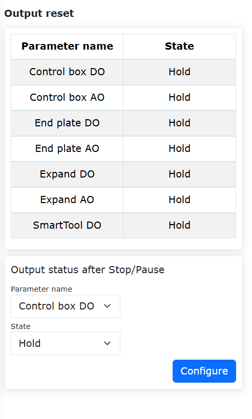

.. centered:: Figure 6.5‑9 Output reset configuration

Joint origin
------------------------

In the menu bar under 'Initial Setup' -> 'Basics', click 'Home point' to enter the Joint origin configuration interface.

This page displays the name and joint position information of the work origin. The work origin is named pHome. Click "Set" to use the current robot pose as the work origin. Click "Move to this point" to move the robot to the work origin. In addition, the configurable option of moving to the origin of the work is added in the DI configuration, and the configurable option of reaching the origin of the work is added in the DO configuration.

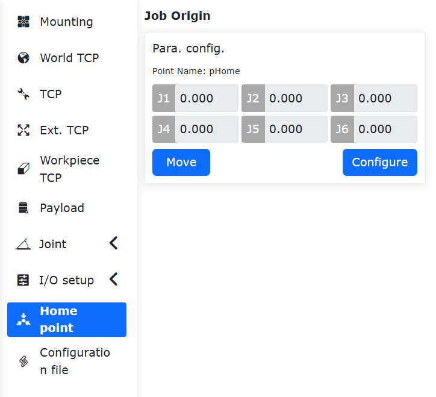

.. centered:: Figure 6.6‑1 Joint origin

.. Configuration import and export
.. ~~~~~~~~~~~~~~~~~~~~~~~~~~~~~~~~~

.. Under the menu bar of "Robot Settings" in "Initial Settings", click "Configuration Import and Export" to enter the configuration import and export interface.

.. **Import robot configuration files**:The user imports a robot configuration file named user.config, which contains various parameters in the robot setting function. Click the "Select File" button, select the configuration file that has been modified and the content meets the specifications, and click the "Import" button. When the prompt of import completion appears, the parameters in the file are successfully set.

.. **Export robot configuration file**:Click the "Export" button to export the robot configuration file user.config to the local.

.. **Import controller database**:The user imports the controller database file named fr_controller_data.db. Click the "Select File" button, select the database file that has been modified and the content meets the specifications, and click the "Import" button. When the prompt of import completion appears, the parameters in the file are successfully set.

.. **Controller database**:Click the "Export" button to export the robot controller database file to the local.

.. .. image:: base/031.png
..    :width: 3in
..    :align: center

.. .. centered:: Figure 6.5-1 Configuration import and export

Tool Tcp Automatic Calibration
-------------------------------------------

Overview
~~~~~~~~~~~~~

Robot tool TCP (Tool Center Position, TCP) automatic calibration uses photoelectric sensor equipment (double tube cross type) to quickly calibrate the robot tool TCP. By counting the time when the tool triggers I/O signals in the photoelectric sensor device during robot movement, the conversion relationship between the robot end flange and the tool coordinate system is established, thereby accurately calibrating the robot tool coordinate system and improving the accuracy of the robot system.

Calibration process of coordinate system for sensor equipment
~~~~~~~~~~~~~~~~~~~~~~~~~~~~~~~~~~~~~~~~~~~~~~~~~~~~~~~~~~~~~~~~~~~~~~~

Installing robots
++++++++++++++++++++++++++

Install a robot with an absolute positioning accuracy of 1.2 mm on the work platform, and install a specialized tool for calibrating the coordinate system of the photoelectric sensor on the end flange of the robot.

.. image:: base/034.png
   :width: 2in
   :align: center

.. centered:: Figure 6.7‑1 Example of robot installation

Installing sensor device
+++++++++++++++++++++++++++++++++

Connect the two sets of brown, blue, and black signal wires of the photoelectric sensor device to the two sets of 24V, 0V, CI0, and CI1 ports (any available configurable digital signal input port is sufficient) of the robot control box. Power on the control box to start the robot and light up the X and Y axis beams of the photoelectric sensor device.

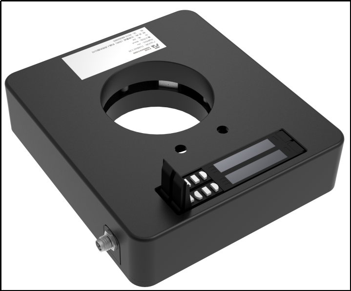

.. centered:: Figure 6.7‑2 Example of photoelectric sensor equipment

Setting up the TCP automatic calibration system coordinate system
++++++++++++++++++++++++++++++++++++++++++++++++++++++++++++++++++++++

According to the TCP automatic calibration system for robot tools, firstly, place the coarse positioning photoelectric sensor device in the flexible workspace of the robot, and ensure that the coordinate system of the photoelectric sensor device is roughly aligned with the robot base coordinate system.

As shown above, where {b} is the robot base coordinate system, {e} is the end flange coordinate system, and {s} is the sensor coordinate system.

.. image:: base/036.png
   :width: 4in
   :align: center

.. centered:: Figure 6.7‑3 Coordinate system setting for TCP automatic calibration system of robot tool

(1) adjust the posture of the robot's end flange to Rx, Ry, and Rz at 180 °, 0 °, and 0 °, respectively, and ensure that this posture remains unchanged throughout the entire calibration sensor device coordinate system movement process after adjustment;

(2) Then make the robot tool TCP perform MoveL motion together in the X and Y axis directions of the robot base coordinate system and the sensor coordinate system;

(3) During the movement of the robot, once the X and Y axis beams of the photoelectric sensor device always maintain the triggering I/O signal state, the installation position of the photoelectric sensor device can be accurately positioned as its current position.

Calibrate the sensor coordinate system based on the web interface
+++++++++++++++++++++++++++++++++++++++++++++++++++++++++++++++++++++++++++++++++++++++++++++++

In the robot web control interface, click on "Initial" -> "Base" -> "Coordinate" -> "TCP" to enter the "Tool coordinate system settings" interface;

Select the reference coordinate system from the drop-down menu of "Coordinate system name", and choose the corresponding "Tool Type" and "Installation position", then click "Modify" to enter the "Modify Wizard" interface;

Select "Laser automatic calibration", enter the laser automatic calibration interface, click "Configuration", enter the "Laser calibration device configuration" interface, if there are previous settings, click "Modify".

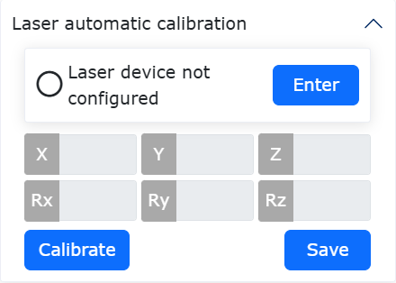

.. centered:: Figure 6.7‑4  Example of entering the photoelectric automatic calibration interface

Set I/O
***********************

Select the input port numbers for the control box of the X-axis laser beam and Y-axis laser beam, then click "Set". After successful settings, a green check mark will appear before the "Setup I/O" indicator.

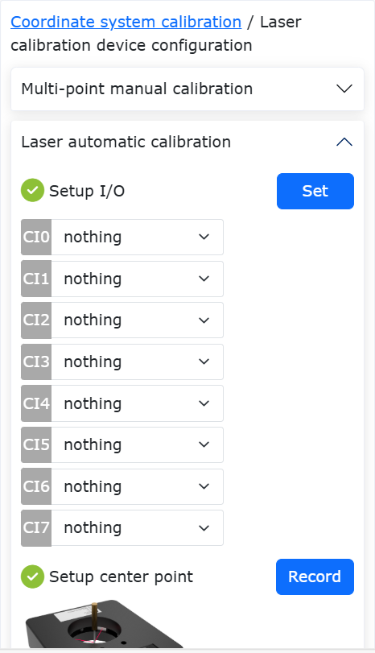

.. centered:: Figure 6.7‑5 Example of setting the X and Y axis laser beam I/O ports of the laser sensor

Teaching center point
******************************

Drag the robot to trigger the X and Y axis beam I/O signals of the photoelectric sensor device using the TCP tool, and then move it along the Z+ axis direction of the base coordinate system to a position 5 mm above the measurement plane of the sensor device (where the X and Y axis beams intersect). 

.. warning:: Note that during this process, the end flange posture of the robot remains unchanged at Rx, Ry, and Rz, which are 180 °, 0 °, and 0 °, respectively. Then click "Record". After successful setting, a green check mark will appear before the "Setup center Point" marker.

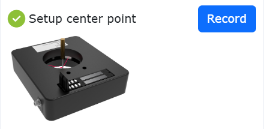

.. centered:: Figure 6.7‑6  The teaching TCP is located at the center of the sensor measurement plane

Set parameters
****************************

Set three custom parameters: "Movement radius", "Angular velocity", and "Depth of movement".

(1) The "Movement radius" parameter is the radius at which the robot tool performs circular motion. Referring to the effective measurement radius of the laser sensor used, which is 35 mm, it is recommended to set it to "10-15 mm". If it is too large, it may cause interference between the tool and the sensor, and if it is too small, it may cause interference between the X and Y axis laser I/O signals of the sensor;

(2) The "Angular velocity" parameter is the uniform angular velocity at which the robot tool moves in a circular motion. It is recommended to set it to "10-40 deg/s". If it is too large, it may cause impact vibration at the end of the tool and result in frame dropping of sensor I/O signals;

(3) The "Depth of movement" parameter is the Euclidean distance between the centers of the robot's two circular motions. The effective measurement height of the laser sensor used is 25 mm, and it is recommended to set it to "5-15mm". If it is too large, it may cause interference between the tool and the sensor.

Then click on "Set", and after successful settings, a green check mark will appear before the "Set Parameters" icon.

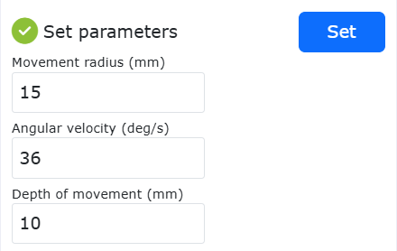

.. centered:: Figure 6.7‑7 Example of custom parameter setting

Run
*********************

In automatic mode, click "Run" to initiate the calibration operation of the sensor coordinate system. After the operation is completed, the interface displays the x, y, and z coordinate values of the calibrated sensor coordinate system and the attitude angles of Rx, Ry, and Rz. Then click "complete" to save the current data and exit the current interface.

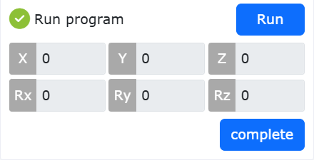

.. centered:: Figure 6.7‑8 Example of calibration results for laser sensor coordinate system

.. warning:: Pay attention to the current operation. It is recommended that the robot perform this operation during the lifecycle of each production task (robot power off start operation) to prevent small displacement of sensor installation position caused by high-frequency vibration during operation and calculation errors caused by incorrect operation resulting in the release of sensor coordinate system calibration data in the controller.

Calibration process of tool coordinate system
~~~~~~~~~~~~~~~~~~~~~~~~~~~~~~~~~~~~~~~~~~~~~~

After completing the "Laser device configured", if a green check mark appears in front of the label, it indicates that the laser sensor coordinate system has been successfully set. Remove the specialized tool for the end flange of the robot and install the unknown tool to be calibrated. Click "Calibrate" to start the TCP automatic calibration tool. After the operation is completed, the interface will display the calibration results.

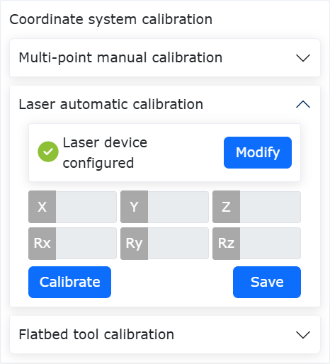

.. centered:: Figure 6.7‑9 Example of TCP calibration results for tool

Click "Save" to update the calibration result of the current tool TCP in the selected reference coordinate system from the drop-down menu of "Coordinate system name" in the "Current tool coordinate system" interface.

In the "Current tool coordinate system" interface, click "Apply" to apply the current tool TCP calibration result in the current reference tool coordinate system.

.. important:: 
  It should be noted that:

  （1）Note that before clicking "calibrate", you can avoid errors during the calibration tool coordinate system process by observing whether the x, y, and z coordinate results of the calibrated sensor coordinate system have significant errors compared to the actual sensor installation position. If the situation occurs, the reason may be that the robot tool TCP automatic calibration system coordinate system is set incorrectly, and the installation position of the laser sensor equipment needs to be adjusted before recalibrating the sensor coordinate system;

  （2）At the same time, after clicking "Calibrate", you can avoid errors in the process of calibrating the tool coordinate system by observing whether the robot adjusts the end flange attitude significantly (>90 °) after performing two circular movements. If the situation occurs, the reason may be that the "movement radius" parameter is set too small, causing interference in the sensor I/O signal. In this case, it is necessary to modify the "movement radius" parameter and click "calibrate" again;

  （3）In addition, it is recommended to calibrate the tool type with a cylindrical end, a spindle direction roughly parallel to the end flange spindle direction, and a radius within 10 mm. The measurable length of the tool end should be within 5-15 mm (not the overall length of the tool) to avoid interference with the sensor device.

TCP Calibration based on flatbed
-----------------------------------

Overview
~~~~~~~~~~~~

When using the "four-point method" to carry out TCP calibration of tools, it is necessary to manually control the robot movement and realize the exact coincidence of points with the naked eye, and the calibration efficiency and accuracy are affected by the operator's proficiency.

The principle of TCP calibration based on flatbed is as follows: the robot tool is used to touch any position of the flatbed several times, and the TCP of the tool is solved by establishing a calibration model. The whole calibration process is automatically completed, which can improve the efficiency of calibration and reduce the dependence on manual work.

2The operation flow of TCP calibration function based on flatbed
~~~~~~~~~~~~~~~~~~~~~~~~~~~~~~~~~~~~~~~~~~~~~~~~~~~~~~~~~~~~~~~~~~~~~~~~~~~~~~

Fix the calibration flatbed in the working space of the robot, the flatbed should not be shaken, and the electrical conductivity of the flatbed is good. The end of the tool is approximately vertical to the calibration flatbed, and is located 50mm above the flatbed.

.. image:: base/043.png
   :width: 4in
   :align: center

.. centered:: Figure 6.8‑1 Calibration layout

In turn, click on the “Program” – “Coding” button, select “FR_CalibrateTheToolTcpPlane. lua” and open the file.

.. image:: base/044.png
   :width: 4in
   :align: center

.. centered:: Figure 6.8‑2 Opening the calibration file

Click the buttons of “Initial”, “Base” and “Coordinate” and “TCP” successively to enter the “Current tool coordinate system” interface. Select the coordinate system to be calibrated in “Coordinate system name” (take toolcord1 coordinate system as an example), click “Modify” button, you can enter the TCP calibration method selection interface.

.. image:: base/001.png
   :width: 4in
   :align: center

.. centered:: Figure 6.8‑3 Setting the tool coordinate system

In the “Modify Wizard”, select “Flatbed Tool Calibration” to enter the tablet tool calibration interface. 

.. image:: base/045.png
   :width: 4in
   :align: center

.. centered:: Figure 6.8‑4 Selection of calibration method

In the “Flatbed tool calibration” interface, click “Modify” button to configure the flatbed tool, click “Record” button to record the calibration reference point. After the configuration is complete, click the “complete” button to return to the  “Flatbed tool calibration” interface..

.. image:: base/046.png
   :width: 4in
   :align: center

.. centered:: Figure 6.8‑5 Configuring the flatbed tool

Click the “Run” button in the “Flatbed tool calibration” interface, the robot will automatically carry out the TCP calibration of the tool, after the calibration is completed, the TCP coordinates of the tool will be displayed, click the “Save” button, the calibration result will be returned to the “Current tool coordinate system” interface.

.. image:: base/047.png
   :width: 4in
   :align: center

.. centered:: Figure 6.8‑6 Calibration results

Click the “Apply” button in the “Current tool coordinate system” interface to save the TCP calibration result of the tool and apply it. 

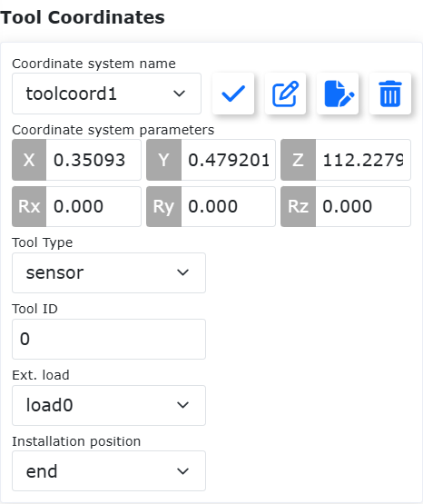

.. centered:: Figure 6.8‑7 Calibration result application

Control Box Analog Feedback Arc Tracking Function
--------------------------------------------------------------

Overview
~~~~~~~~~~~~~~~~

The control box analog feedback arc tracking function collects welding voltage and current analog signals to achieve arc tracking compensation. This function is implemented by configuring the corresponding AI and AO channels for the control box analog signals.

.. image:: base/059.png
   :width: 4in
   :align: center

.. centered:: Figure 6.9‑1 Topology Diagram of Arc Tracking Function Based on Analog Signal Communication
.. centered:: a represents the computer; b represents the robot and control box; c represents the welder

Control Box Analog AI Configuration Process
~~~~~~~~~~~~~~~~~~~~~~~~~~~~~~~~~~~~~~~~~~~~~~~~~~~~~~~~~~~~

On the robot web control interface, navigate to "Initial Setup" -> "Basic" -> "I/O Settings" -> "AI" to enter the "AI Configuration" interface.

In the "Arc Tracking Channel" section of the "AI Configuration" interface, select "Ctrl-AI0" and "Ctrl-AI1" from the dropdown menus for "Welding Current Control AI" and "Welding Voltage Control AI" respectively, then click "Configure" to complete the control box analog AI configuration.

.. image:: base/060.png
   :width: 6in
   :align: center

.. centered:: Figure 6.9‑2 AI Channel Configuration

In the "Analog Current-Voltage Relationship Graph" section of the AI channel configuration shown above, the parameter settings for the "A-V" and "V-V" interfaces should refer to the analog input/output tables or graphs of the welder being used.

For example, configure the lower and upper limits of the welding current for the control box current analog AI as 0A and 500A respectively; configure the lower and upper limits of the output voltage as 0V and 5V respectively as the parameters for the "A-V" interface in the "Analog Current-Voltage Relationship Graph" section. Click "Configure" to complete the control box current analog AI channel configuration.

.. image:: base/061.png
   :width: 3in
   :align: center

.. centered:: Figure 6.9‑3 Control Box Current Analog AI Configuration

For example, configure the lower and upper limits of the welding voltage for the control box voltage analog AI as 0V and 50V respectively; configure the lower and upper limits of the output voltage as 1.018V and 10V respectively as the parameters for the "V-V" interface in the "Analog Current-Voltage Relationship Graph" section. Click "Configure" to complete the control box voltage analog AI channel configuration.

.. image:: base/062.png
   :width: 3in
   :align: center

.. centered:: Figure 6.9‑4 Control Box Voltage Analog AI Configuration

Control Box Analog AO Configuration Process
~~~~~~~~~~~~~~~~~~~~~~~~~~~~~~~~~~~~~~~~~~~~~~~~~~~~~~~~~~~~~

On the robot web control interface, navigate to "Initial Setup" -> "Peripherals" -> "Welder" to enter the "Welder Configuration" interface.

.. image:: base/063.png
   :width: 6in
   :align: center

.. centered:: Figure 6.9‑5 Welder Configuration

In the "Welding Function I/O Configuration" section of the "Welder Configuration" interface, the parameters for the "DI" and "DO" interfaces can be customized to configure the control box CI and CO channels. Select "Controller I/O" from the "Control Type" dropdown menu to begin the controller analog AO channel configuration process.

In the "Analog Current-Voltage Relationship Graph" section of the "Welder Configuration" interface, the parameter settings for the "A-V" and "V-V" interfaces should refer to the analog input/output tables or graphs of the welder being used.

For example, configure the lower and upper limits of the welding current for the control box current analog AO as 0A and 495A respectively; configure the lower and upper limits of the output voltage as 1V and 10V respectively as the parameters for the control box AO channel current analog configuration. Then select "Ctrl-AO0" from the "Welder Current Control AO" dropdown menu and click "Configure" to complete the control box current analog AO channel configuration.

.. image:: base/064.png
   :width: 6in
   :align: center

.. centered:: Figure 6.9‑6 Control Box Current Analog AO Configuration

For example, configure the lower and upper limits of the welding voltage for the control box voltage analog AO as 10V and 45V respectively; configure the lower and upper limits of the output voltage as 1V and 10V respectively as the parameters for the control box AO channel voltage analog configuration.

Then select "Ctrl-AO1" from the "Welder Voltage Control AO" dropdown menu and click "Configure" to complete the control box voltage analog AO channel configuration.

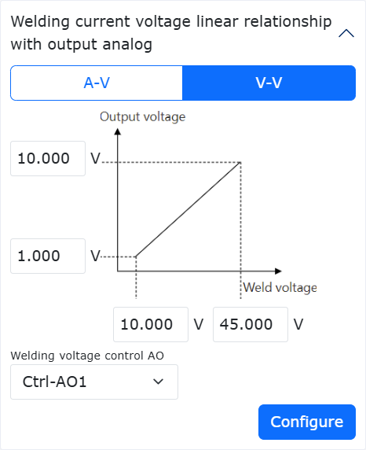

.. centered:: Figure 6.9‑7 Control Box Voltage Analog AO Configuration

Linear Rack Guideway Collision Detection
----------------------------------------------------------------------

Overview
~~~~~~~~~~~~~~~~

The Linear Rack Guideway Collision Detection function is used to achieve alarm and emergency stop when the guideway or robot collides with environmental objects during asynchronous or synchronous operation. By monitoring changes in the guideway torque feedback, it judges whether a collision has occurred based on a set threshold. If a collision occurs, the guideway stops immediately, thereby avoiding the application of continuous force by the guideway and robot on the collided object, further enhancing human-robot collaboration safety.

Linear Rack Guideway Collision Detection Function
~~~~~~~~~~~~~~~~~~~~~~~~~~~~~~~~~~~~~~~~~~~~~~~~~~~~

To use the Linear Rack Guideway Collision Detection function, the "Rail_Adaptation_Program.lua" program must be executed after the guideway is activated. This ensures the function can adapt to different guideways and loading conditions, obtaining the best collision detection performance. If adaptation is not performed, the collision detection performance will significantly decrease, and the external force required to trigger a collision will be greater.

Linear Rack Guideway Parameter Setting and Enabling
+++++++++++++++++++++++++++++++++++++++++++++++++++++++++++++

**Step1**: Log in to the web interface, click "Initial Setup" -> "Peripherals" -> "Extended Axes" in sequence to enter the Extended Axis Coordinate System setup module, as shown in Figure 2-1.

.. image:: base/078.png
   :width: 4in
   :align: center

.. centered:: Figure 6.10‑1 Extended Axis Coordinate System Setup Module

**Step2**: Based on the actual working conditions of the extended axis and the robot, set parameters and calibrate as needed. In Figure 2-1, click Edit, set the Extended Axis Coordinate System Name to "exaxis1", select the Scheme as "0-Single Degree of Freedom Linear Slide", and select the Extended Axis Number as "1". If the guideway and robot only run asynchronously, calibration may not be necessary. If synchronous operation is required, calibration is mandatory. Refer to the relevant user manual or consult professional personnel for the calibration process. After setting the parameters, click "Save" and apply the corresponding coordinate system, as shown in Figure 2-2.

.. image:: base/079.png
   :width: 4in
   :align: center

.. centered:: Figure 6.10‑2 Extended Axis Coordinate System Parameter Setting

**Step3**: Establish UDP communication between the extended axis and the robot, and ensure the extended axis PLC program can send back the torque feedback data of the extended axis drive motor (after the gearbox) to the robot controller. Click "Initial Setup" -> "Peripherals" -> "Extended Axes" in sequence to enter the UDP Communication Configuration page. Select the coordinate system set in Step 2 and apply it. Click the "Edit" icon for UDP Communication Configuration to configure and load the communication settings. The PLC and laptop IP addresses must be in the same subnet as the controller, as shown in Figure 2-3. Note: It is necessary to ensure that the extended axis PLC program can send back the torque feedback data of the extended axis drive motor (after the gearbox) to the robot controller, and the sampling period should ideally be 1ms, with a maximum not exceeding 4ms, otherwise the collision detection function will be invalid.

.. image:: base/080.png
   :width: 4in
   :align: center

.. centered:: Figure 6.10‑3 UDP Communication Configuration Page

**Step4**: Configure UDP Extended Axis parameters. The UDP Extended Axis parameter setting page is shown in Figure 2-4. Select the Axis Type as "Linear Guideway", Axis Direction as "Positive", and configure the remaining parameters according to the actual situation. Among them, the Lead and Encoder Resolution are fixed and determined by the guideway; the upper limits of Running Speed and Acceleration are affected by the motor performance. The upper limits used in this function test are as shown in Figure 2-4. Please contact professional personnel when configuring different upper limits.

.. image:: base/081.png
   :width: 4in
   :align: center

.. centered:: Figure 6.10‑4 UDP Extended Axis Parameter Setting

**Step5**: Enable the linear rack guideway and move it to the starting point. Enable the linear rack guideway via the "Remove Enable" button in Figure 2-4 or the "Servo Enable" button in Figure 2-5. If the slider on the guideway is far from the starting point, move it to the starting point using "Reverse Rotation" or "Forward Rotation" (note: the running speed needs to be away from 15%). After moving to the starting point, click "Zero Point Setting" and perform homing using the "Return to Zero from Current Position" method.

.. image:: base/082.png
   :width: 4in
   :align: center

.. centered:: Figure 6.10‑5 Enable Linear Rack Guideway and Move

Enabling Linear Rack Guideway Collision Detection Function
+++++++++++++++++++++++++++++++++++++++++++++++++++++++++++++

**Step1**: Ensure the installation method of both the guideway and the robot is upright. Before enabling the linear rack guideway collision detection function, check if the installation method is upright. Specifically, first ensure the physical installation of the guideway and robot is upright. Then, click "Initial Setup" -> "Basic" -> "Installation" in sequence to enter the Free Installation page. If both "Base Rotation" and "Base Tilt" are 0, the software is set to upright installation; otherwise, they must be set to 0. If they are not 0, the interface will prompt an error, as shown in Figure 2-6.

.. image:: base/083.png
   :width: 6in
   :align: center

.. centered:: Figure 6.10‑6 Error Prompt if Installation Method is Not Upright

**Step2**: Enable the linear rack guideway collision detection function and set parameters. Click "Initial Setup" -> "Basic" -> "Joints" -> "Collision Level" in sequence to enter the Collision Level setting page. Click the slider for the "Linear Rack Guideway Collision Detection" function, then set the Gear Radius and Slider Mass. The Gear Radius can be calculated from the Lead and Reduction Ratio. The Slider Mass does not include the robot and its carried end load. The guideway level has 11 options, where Level1 is the easiest to trigger a collision, and Level10 is the most difficult. After the controller is powered on, and before executing the adaptation program, set the collision level to "Off" first.

.. image:: base/084.png
   :width: 4in
   :align: center

.. centered:: Figure 6.10‑7 Linear Rack Guideway Collision Detection Function

**Step3**: Execute the "Rail_Adaptation_Program.lua" program to adapt to the current guideway. After each controller restart, the "Rail_Adaptation_Program.lua" program must be executed (to prevent changes such as robot type from affecting the dynamic characteristics of the guideway). Before executing the program, ensure the guideway collision level is "Off". In automatic mode, run the lua program at 100% interface speed. Wait for the program to complete one cycle, indicating adaptation is complete, then it can be stopped.

.. image:: base/085.png
   :width: 5in
   :align: center

.. centered:: Figure 6.10‑8 Execute "Rail_Adaptation_Program.lua" Program to Adapt to Current Guideway

**Step4**: Reasonably set the guideway collision level and execute tasks. Users can set the guideway collision level reasonably based on the motor drive performance and task running speed. If the guideway and robot are running asynchronously, colliding with the robot or guideway can trigger "Axis 8 Collision Fault, Resettable". At this time, the guideway stops running, as shown in Figure 2-9. If the guideway and robot are running synchronously, colliding with the robot can trigger an alarm, causing the guideway to stop running, and the robot will react according to the set collision strategy.

.. image:: base/086.png
   :width: 4in
   :align: center

.. centered:: Figure 6.10‑9 Guideway Triggering Collision Fault

Force Sensor Loaded Zeroing and Open Posture Compliance Admittance Parameters
------------------------------------------------------------------------------------------

Overview
~~~~~~~~~~~~~~~~

The Force Sensor Loaded Zeroing function is used to quickly clear the sensor's zero drift data when the robot, carrying the quick changer, replaces the load without disassembling the quick changer. The Open Posture Compliance Admittance Parameters allow customers to adjust the posture based on the actual torque magnitude in constant force control.

Force Sensor Loaded Zeroing
~~~~~~~~~~~~~~~~~~~~~~~~~~~~~~~~

**Step1**: Install and activate the force sensor. Under the "Initial Setup" -> "Peripherals" -> "Force Sensor" menu, click "Adapted Devices" to enter the configuration interface. After the force sensor configuration is completed, select the configured force sensor number, click the "Reset" button. After the page pops up indicating the command was sent successfully, click the "Activate" button. Check the activation status in the force sensor information table to determine if activation was successful. Additionally, the force sensor will have initial values. Users can choose "Zero Calibration" and "Remove Zero" according to usage needs, as shown in Figure 2-1. Force sensor zero calibration requires ensuring the force sensor is installed vertically downward, and no load is configured below the sensor.

.. image:: base/087.png
   :width: 4in
   :align: center

.. centered:: Figure 6.11‑1 Force Sensor Configuration Information

**Step2**: Force sensor load identification. Under the "Initial Setup" -> "Basic" -> "Load" menu, click "Auto Identification" to enter the Force/Torque Sensor Load interface. Perform sensor automatic zeroing, record the initial position, then switch the robot to automatic mode, and click "Auto Zero", as shown in Figure 2-2.

.. image:: base/088.png
   :width: 4in
   :align: center

.. centered:: Figure 6.11‑2 Force Sensor Load Identification

**Step3**: If the actual load at the end of the force sensor is replaced, input the load weight and center of mass coordinates in the Load Configuration module, click "Apply" to update the load configuration and complete the force sensor loaded zeroing.

Open Posture Compliance Admittance Parameters
~~~~~~~~~~~~~~~~~~~~~~~~~~~~~~~~~~~~~~~~~~~~~~~~~~~~~~~~~~~~~~~~

**Step1**: Click "Initial Setup" -> "Basic" -> "Tool Coordinate" to enter the Tool Coordinate System setting interface. Select "Coordinate System Name" and set the coordinate system parameters corresponding to the end tool, as shown in Figure 3-1.

.. image:: base/089.png
   :width: 4in
   :align: center

.. centered:: Figure 6.11‑3 Tool Coordinate System Setting

**Step2**: Click "Teach Program" -> "Program Programming", write a constant force control lua script, select "Force Control Set" -> "Control", add a force control motion command, set Posture Compliance to "Enable", set the Inertia Coefficient and Damping Coefficient, and set the Maximum Adjustment Angle as the threshold for the posture compliance angle, as shown in Figure 3-2.

.. image:: base/090.png
   :width: 4in
   :align: center

.. centered:: Figure 6.11‑4 Open Posture Compliance Admittance Parameters

**Step3**: On the web interface, click "FT", set the force sensor reference coordinate system, select the reference coordinate system as "Custom Coordinate System" and set the corresponding coordinate system parameters to "0", as shown in Figure 3-3.

.. image:: base/091.png
   :width: 4in
   :align: center

.. centered:: Figure 6.11‑5 Set Force Sensor Reference Coordinate System

**Step4**: Run the script and observe the posture compliance effect. The inertia parameter adjusts the acceleration response and anti-disturbance capability; the larger the inertia, the more obvious the robot lag. The damping coefficient affects the smoothness during posture compliance; the larger the damping, the more difficult the posture compliance.