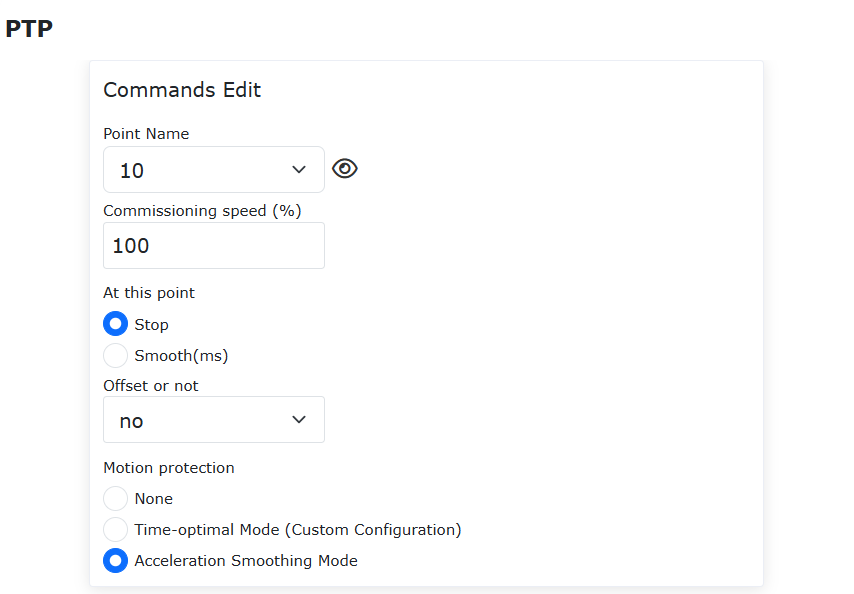
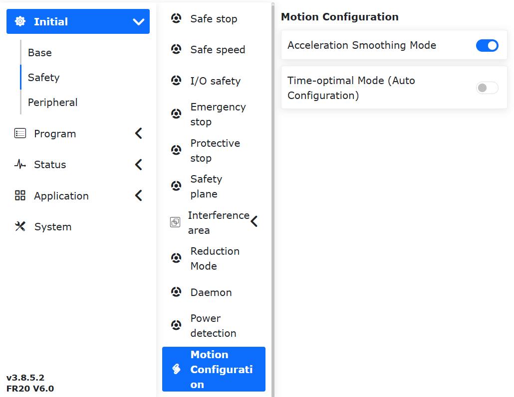
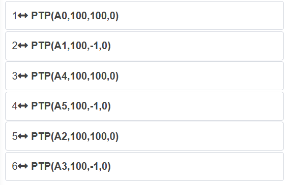
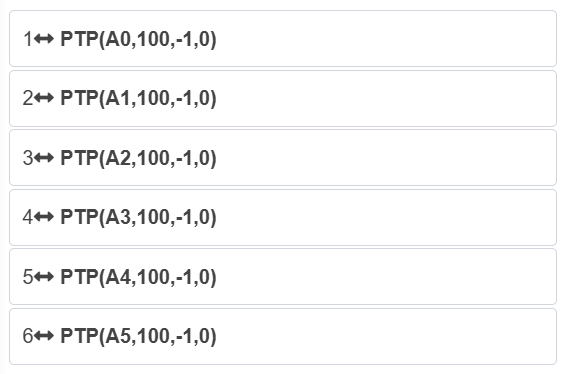

Base
===============

.. toctree:: 
   :maxdepth: 6

Installazione
-----------------------------------------------------

Impostazione e visualizzazione della modalità di installazione del robot
~~~~~~~~~~~~~~~~~~~~~~~~~~~~~~~~~~~~~~~~~~~~~~~~~~~~~~~~~~~~~~~~~~~~~~~~~~~~~~~~~~~~~

Nella pagina di insegnamento del lato Web, fare clic su "Impostazioni iniziali" → "Base" → "Installazione". Il layout della pagina è mostrato di seguito. Le spiegazioni specifiche sono le seguenti:

1. L'installazione rapida viene utilizzata per impostazioni comuni di installazione del braccio robotico, corrispondenti da sinistra a destra rispettivamente a: installazione normale, installazione laterale e installazione capovolta. Facendo clic sul pulsante corrispondente, l'interfaccia invierà e modificherà automaticamente l'angolo di inclinazione e rotazione della base.
2. Se la modalità di installazione richiesta non corrisponde all'installazione rapida, è possibile configurare l'angolo di inclinazione e rotazione della base tramite l'impostazione manuale.
3. Sia per l'installazione rapida che per l'impostazione manuale dell'angolo di inclinazione e rotazione della base, è necessario fare clic su Applica affinché le modifiche abbiano effetto.

.. note:: Assicurarsi che la modalità di installazione impostata corrisponda effettivamente al braccio robotico prima di eseguire operazioni di trascinamento, altrimenti potrebbero esserci rischi per la sicurezza.

.. image:: teaching_pendant_software/026.png
   :width: 6in
   :align: center

.. centered:: Figura 6.1‑1 Installazione libera a 360 gradi

.. important::
    Dopo aver completato l'installazione del robot, è necessario impostare correttamente la modalità di installazione del robot. In caso contrario, ciò influenzerà l'utilizzo della funzione di trascinamento e della rilevazione delle collisioni del robot.

Sistemi di coordinate
------------------------------

Coordinate dell'utensile
~~~~~~~~~~~~~~~~~~~~~~~~~~~~~~~

Sotto la barra dei menu "Impostazioni iniziali" -> "Base", fare clic su "Coordinate utensile" per accedere alla pagina delle coordinate dell'utensile.

La pagina delle coordinate utensile consente di modificare, cancellare, rinominare e applicare le coordinate dell'utensile. Nell'elenco a discesa del sistema di coordinate utensile, selezionare il sistema di coordinate corrispondente. Di seguito verranno visualizzati i valori delle coordinate corrispondenti (il nome del sistema di coordinate può essere personalizzato), il tipo di utensile e la posizione di installazione (visualizzata solo per utensili di tipo sensore). Dopo aver selezionato un sistema di coordinate, fare clic sul pulsante "Applica". Il sistema di coordinate utensile attualmente in uso diventerà le coordinate selezionate, come mostrato di seguito.

.. image:: base/001.png
   :width: 4in
   :align: center

.. centered:: Figura 6.2‑1-1 Impostazione delle coordinate utensile

Facendo clic sul pulsante "Rinomina", è possibile rinominare il sistema di coordinate. Fare clic nuovamente o su Applica per completare la modifica, come mostrato nella figura seguente.

.. image:: base/075.png
   :width: 3in
   :align: center

.. centered:: Figura 6.2‑1-2 Rinomina del sistema di coordinate

Facendo clic su "Modifica", è possibile reimpostare il sistema di coordinate utensile per questo numero in base alle istruzioni. Il metodo di calibrazione dell'utensile è suddiviso in metodo a quattro punti e metodo a sei punti. Il metodo a quattro punti calibra solo il TCP (Tool Center Point) dell'utensile, ovvero la posizione del punto centrale dell'utensile, con l'orientamento per impostazione predefinita corrispondente all'orientamento del terminale. Il metodo a sei punti aggiunge due punti al metodo a quattro punti per calibrare l'orientamento dell'utensile. Qui spiegheremo prendendo come esempio il metodo a sei punti.

.. image:: base/002.png
   :width: 4in
   :align: center

.. centered:: Figura 6.2‑2 Impostazione delle coordinate utensile

Selezionare un punto fisso nello spazio del robot, spostare l'utensile al punto fisso con tre orientamenti diversi e impostare in sequenza i punti 1-3, come mostrato nell'angolo in alto a sinistra nella figura seguente. Spostare verticalmente l'utensile al punto fisso per impostare il punto 4, come mostrato nell'angolo in alto a destra nella figura seguente. Mantenendo questo orientamento, utilizzare lo spostamento nelle coordinate base per muoversi per una certa distanza nella direzione orizzontale e impostare il punto 5. Questa direzione è la direzione positiva dell'asse X del sistema di coordinate utensile impostato. Tornare al punto fisso, spostarsi verticalmente verso l'alto per una certa distanza e impostare il punto 6. Questa direzione è la direzione positiva dell'asse Z del sistema di coordinate utensile. La direzione positiva dell'asse Y del sistema di coordinate utensile è determinata dalla regola della mano destra. Fare clic sul pulsante Calcola per calcolare la posa dell'utensile. Se è necessario reimpostare, fare clic su Annulla per riavviare la procedura di creazione di un nuovo sistema di coordinate utensile.

.. image:: base/003.png
   :width: 3in
   :align: center

.. centered:: Figura 6.2‑3 Schema del metodo a sei punti

Dopo aver completato l'ultimo passaggio, fare clic su "Fine" per tornare all'interfaccia delle coordinate utensile, quindi fare clic su "Salva" per memorizzare il sistema di coordinate utensile appena creato.

.. important::
    1. Dopo aver installato un utensile sul terminale, è necessario calibrare e applicare il sistema di coordinate utensile. In caso contrario, durante l'esecuzione dei comandi di movimento del robot, la posizione e l'orientamento del centro dell'utensile non corrisponderanno ai valori previsti.
    2. Il sistema di coordinate utensile utilizza generalmente toolcoord1~toolcoord19. Applicare toolcoord0 significa che la posizione centrale del TCP dell'utensile si trova al centro della flangia terminale. Durante la calibrazione del sistema di coordinate utensile, è necessario prima applicare il sistema di coordinate utensile a toolcoord0, quindi selezionare un altro sistema di coordinate utensile per la calibrazione e l'applicazione.

Coordinate utensile esterno
~~~~~~~~~~~~~~~~~~~~~~~~~~~~~~~~~~~~~

Sotto la barra dei menu "Impostazioni iniziali" -> "Base", fare clic su "Coordinate utensile esterno" per accedere all'interfaccia del sistema di coordinate utensile esterno.

Nell'interfaccia di impostazione del sistema di coordinate utensile esterno è possibile modificare, cancellare e applicare le coordinate utensile esterno.

L'elenco a discesa del sistema di coordinate utensile esterno contiene 15 numeri, da etoolcoord0 a etoolcoord14. Dopo aver selezionato il sistema di coordinate corrispondente, di seguito verranno visualizzati i valori delle coordinate corrispondenti. Dopo aver selezionato un sistema di coordinate, fare clic sul pulsante "Applica". Il sistema di coordinate utensile attualmente in uso diventerà le coordinate selezionate, come mostrato nella figura seguente.

.. image:: base/004.png
   :width: 4in
   :align: center

.. centered:: Figura 6.2‑4 Coordinate utensile esterno

Facendo clic su "Modifica", è possibile reimpostare il sistema di coordinate utensile per questo numero in base alle istruzioni, come mostrato nella figura seguente.

.. image:: base/005.png
   :width: 4in
   :align: center

.. centered:: Figura 6.2‑5 Schema del metodo a sei punti

**1. Determinazione del TCP esterno con metodo a tre punti**

- **Imposta punto 1**: Spostare il TCP dell'utensile misurato sul TCP esterno, fare clic sul pulsante Imposta punto 1;
- **Imposta punto 2**: Dal punto 1, spostarsi lungo la direzione positiva dell'asse X del sistema di coordinate TCF esterno per una certa distanza, fare clic sul pulsante Imposta punto 2;
- **Imposta punto 3**: Tornare al punto 1, dal punto 1 spostarsi lungo la direzione positiva dell'asse Z del sistema di coordinate TCF esterno per una certa distanza, fare clic sul pulsante Imposta punto 3;
- **Calcola**: Fare clic sul pulsante Calcola per ottenere il TCF esterno;

**2. Determinazione del TCF dell'utensile con metodo a sei punti**

- **Imposta punti 1-4**: Selezionare un punto fisso nello spazio del robot, spostare l'utensile sul punto selezionato da quattro angoli diversi e impostare in sequenza i punti 1-4;
- **Imposta punto 5**: Tornare al punto fisso, spostarsi lungo la direzione positiva dell'asse X del sistema di coordinate TCF dell'utensile per una certa distanza, fare clic sul pulsante Imposta punto 5;
- **Imposta punto 6**: Tornare al punto fisso, spostarsi lungo la direzione positiva dell'asse Y del sistema di coordinate TCF dell'utensile per una certa distanza, fare clic sul pulsante Imposta punto 6;
- **Calcola**: Fare clic sul pulsante Calcola per ottenere il TCF dell'utensile;

Se è necessario reimpostare, fare clic su Annulla per riavviare la procedura di creazione di un nuovo sistema di coordinate utensile.

Dopo aver completato l'ultimo passaggio, fare clic su "Fine" per tornare all'interfaccia delle coordinate utensile, quindi fare clic su "Salva" per memorizzare il sistema di coordinate utensile appena creato.

.. important::
    1. Quando si utilizza un utensile esterno, è necessario calibrare e applicare il sistema di coordinate utensile esterno. In caso contrario, durante l'esecuzione dei comandi di movimento del robot, la posizione e l'orientamento del centro dell'utensile non corrisponderanno ai valori previsti.
    2. Il sistema di coordinate utensile esterno utilizza generalmente etoolcoord1~etoolcoord14. Applicare etoolcoord0 significa che la posizione centrale del TCP dell'utensile esterno si trova al centro della flangia terminale. Durante la calibrazione del sistema di coordinate utensile, è necessario prima applicare il sistema di coordinate utensile a etoolcoord0, quindi selezionare un altro sistema di coordinate utensile per la calibrazione.

Coordinate del pezzo
~~~~~~~~~~~~~~~~~~~~~~~~~~~

Sotto la barra dei menu "Impostazioni iniziali" -> "Base", fare clic su "Coordinate del pezzo" per accedere all'interfaccia delle coordinate del pezzo. Le coordinate del pezzo consentono di modificare, cancellare e applicare le coordinate del pezzo. L'elenco a discesa del sistema di coordinate del pezzo contiene 15 numeri (wobjcoord0~ wobjcoord14). Dopo aver selezionato il sistema di coordinate corrispondente, i valori delle coordinate corrispondenti verranno visualizzati in "Coordinate del sistema di coordinate" di seguito. Dopo aver selezionato un sistema di coordinate, fare clic sul pulsante "Applica". Il sistema di coordinate del pezzo attualmente in uso diventerà le coordinate selezionate, come mostrato nella figura seguente.

.. image:: base/006.png
   :width: 4in
   :align: center

.. centered:: Figura 6.2‑6 Impostazione delle coordinate del pezzo

Il sistema di coordinate del pezzo è generalmente calibrato sulla base dell'utensile e deve essere stabilito sulla base di un sistema di coordinate utensile già creato. Facendo clic su "Modifica", è possibile reimpostare il sistema di coordinate del pezzo per questo numero in base alle istruzioni. Dopo aver fissato il pezzo, selezionare il metodo di calibrazione "Origine - Asse X - Asse Z" o "Origine - Asse X - Piano XY+". I primi due punti di selezione per i due metodi di calibrazione sono gli stessi, il terzo punto è diverso. Scegliendo il primo metodo si calibra la direzione Z del sistema di coordinate del pezzo; scegliendo il secondo metodo si calibra un punto sul piano XY+. Calibrare in base allo schema. Fare clic sul pulsante Calcola per calcolare la posa del pezzo. Se è necessario reimpostare, fare clic su Annulla per riavviare la procedura di creazione di un nuovo sistema di coordinate del pezzo.

.. image:: base/007.png
   :width: 3in
   :align: center

.. centered:: Figura 6.2‑7 Schema del metodo a tre punti

Dopo aver completato l'ultimo passaggio, fare clic su "Fine" per tornare all'interfaccia delle coordinate del pezzo, quindi fare clic su "Salva" per memorizzare il sistema di coordinate del pezzo appena creato.

.. important::
    1. Il sistema di coordinate del pezzo è calibrato sulla base dell'utensile e deve essere stabilito sulla base di un sistema di coordinate utensile già creato.
    2. Il sistema di coordinate del pezzo utilizza generalmente wobjcoord1~wobjcoord14. Applicare wobjcoord0 significa che l'origine del sistema di coordinate del pezzo si trova nell'origine delle coordinate base. Durante la calibrazione del sistema di coordinate del pezzo, è necessario prima applicare il sistema di coordinate del pezzo a wobjcoord0, quindi selezionare un altro sistema di coordinate del pezzo per la calibrazione e l'applicazione.

Carico
--------------

Terminale
~~~~~~~~~~~~~

Sotto la barra dei menu "Impostazioni iniziali" -> "Base" -> "Carico", fare clic su "Identificazione della traiettoria" per accedere all'interfaccia di identificazione della traiettoria.

Quando si configura il carico del terminale, inserire rispettivamente la massa dell'utensile terminale utilizzato e le coordinate del baricentro corrispondente nelle caselle di immissione "Massa del carico" e "Coordinate del baricentro del carico X, Y e Z", quindi applicare.

.. important::
    La massa del carico non deve superare il carico massimo del robot. Per l'intervallo di carico corrispondente al modello specifico del robot, fare riferimento a 2.1. Parametri di base. L'intervallo di impostazione delle coordinate del baricentro è 0-1000, unità mm.

.. image:: base/016.png
   :width: 4in
   :align: center

.. centered:: Figura 6.3‑1 Schema di impostazione del carico

.. important::
    Dopo aver installato un carico sul terminale del robot, è necessario impostare correttamente il peso del carico terminale e le coordinate del baricentro. In caso contrario, ciò influenzerà l'utilizzo della funzione di trascinamento e della rilevazione delle collisioni del robot.

Se l'utente non è certo della massa o del baricentro dell'utensile, può utilizzare la funzione di identificazione del carico tramite "Identificazione automatica" per misurare i dati dell'utensile.

Prima della misurazione, dopo aver installato il carico, selezionare la versione. Fare clic sul pulsante "Misurazione dei dati dell'utensile" per accedere all'interfaccia del test di movimento del carico.

.. image:: base/017.png
   :width: 4in
   :align: center

.. centered:: Figura 6.3‑2 Impostazione dei giunti per l'identificazione del carico

Fare clic su "Avvia identificazione carico" per eseguire il test. In caso di emergenza, interrompere immediatamente il movimento.

.. image:: base/018.png
   :width: 4in
   :align: center

.. centered:: Figura 6.3‑3 Avvio dell'identificazione del carico

Dopo la fine del movimento, fare clic sul pulsante "Ottieni risultato identificazione" per ottenere i dati dell'utensile calcolati, che verranno visualizzati sulla pagina. Se necessario applicarli ai dati di carico, fare clic su Applica.

.. image:: base/019.png
   :width: 4in
   :align: center

.. centered:: Figura 6.3‑4 Risultato dell'identificazione del carico

Giunti
--------------

Limiti soft
~~~~~~~~~~~~~

Sotto la barra dei menu "Impostazioni iniziali" -> "Base" -> "Giunti", fare clic su "Limiti soft" per accedere all'interfaccia dei limiti soft.

All'interno della corsa del robot potrebbero esserci altre apparecchiature. L'angolo di limitazione può applicare limiti soft al robot, impedendo che il robot superi determinati valori di coordinate e prevenendo collisioni. L'attivazione dei limiti soft fa fermare il robot automaticamente, senza distanza di arresto.

L'amministratore può utilizzare i valori predefiniti o inserire valori angolari. Inserendo valori angolari, è possibile limitare rispettivamente l'angolo positivo e negativo di ciascun giunto del robot. Se il valore inserito supera l'angolo di limite soft del giunto del robot elencato nella tabella dei parametri di base del robot in 2.1 - Parametri di base, l'angolo di limite verrà regolato al valore massimo impostabile. Quando il robot segnala un superamento del limite dell'istruzione, è necessario passare alla modalità trascinamento e trascinare il giunto del robot all'interno dell'angolo di limite. L'interfaccia è mostrata nella figura seguente:

.. image:: base/020.png
   :width: 4in
   :align: center

.. centered:: Figura 6.4‑1-1 Schema dei limiti del robot

Protezione da limiti soft dei giunti
++++++++++++++++++++++++++++++++++++++++++++

Panoramica
************************

La funzione di protezione da limiti soft dei giunti è un meccanismo di protezione attiva che limita dinamicamente l'operatore durante l'insegnamento per trascinamento, impedendo di superare l'intervallo dei limiti soft impostati, monitorando in tempo reale lo stato di movimento dei giunti del braccio robotico. Questa funzione conferisce significato ai limiti soft anche nell'insegnamento per trascinamento, migliorando così la sicurezza della collaborazione uomo-robot.

Protezione da limiti soft dei giunti
********************************************

La funzione di protezione da limiti soft dei giunti richiede che il pacchetto software e la versione del firmware corrispondano per ottenere la migliore esperienza.

Impostazione dei limiti soft e attivazione/disattivazione della funzione
""""""""""""""""""""""""""""""""""""""""""""""""""""""""""""""""""""""""""""""""""""""""

**Step1**: Accedere all'interfaccia web, fare clic in sequenza su "Impostazioni iniziali" -> "Base" -> "Giunti" -> "Limiti soft" per accedere al modulo di impostazione dei limiti soft del robot.

.. image:: base/056.png
   :width: 4in
   :align: center

.. centered:: Figura 6.4‑1-2 Modulo di impostazione dei limiti soft del robot

**Step2**: In base all'effettivo intervallo di lavoro del robot, impostare ragionevolmente i limiti soft di ciascun giunto. A questo punto, è necessario verificare se la posizione angolare attuale di ciascun giunto del robot si trova nell'intervallo dei limiti soft preimpostati. In caso affermativo, fare clic su "Applica" per inviare i limiti soft preimpostati; in caso contrario, è necessario spostare ciascun giunto nell'intervallo preimpostato. Altrimenti, quando si fa clic su "Applica", verrà visualizzato un messaggio di superamento del limite, come mostrato nella figura seguente. A questo punto, è possibile spostare il giunto che ha superato il limite in modo incrementale o trascinandolo nella direzione che rientra nell'intervallo dei limiti soft, per cancellare l'errore.

.. image:: base/057.png
   :width: 6in
   :align: center

.. centered:: Figura 6.4‑1-3 Errore segnalato quando la posizione angolare effettiva dei giunti del robot supera l'intervallo dei limiti soft impostati

**Step3**: Dopo aver impostato correttamente l'intervallo dei limiti soft, fare clic sul cursore "Protezione da limiti soft dei giunti" per attivare questa funzione, come mostrato in dettaglio nella figura seguente. A questo punto, in modalità trascinamento, i limiti soft impostati avranno effetto limitante. Inoltre, quando ci si avvicina ai limiti soft durante il trascinamento, si percepirà una resistenza.

.. image:: base/058.png
   :width: 4in
   :align: center

.. centered:: Figura 6.4‑1-4 Attivazione della funzione di protezione da limiti soft dei giunti

**Step4**: Se è necessario disattivare la funzione di protezione da limiti soft dei giunti, è possibile farlo facendo clic sul cursore "Protezione da limiti soft dei giunti".

Livello di collisione
~~~~~~~~~~~~~~~~~~~~~~~~~~~~

Sotto la barra dei menu "Impostazioni iniziali" -> "Base" -> "Giunti", fare clic su "Livello di collisione" per accedere all'interfaccia del livello di collisione.

Il livello di collisione è suddiviso da uno a dieci livelli. I livelli da uno a tre sono più sensibili alla rilevazione e il robot deve funzionare alla velocità consigliata. È inoltre possibile selezionare l'impostazione percentuale personalizzata, dove il 100% corrisponde al livello dieci. La strategia di collisione può essere impostata per definire la risposta del robot dopo una collisione, suddivisa in "Segnalazione errore e arresto" e "Continua movimento". L'utente può impostare in base alle esigenze d'uso specifiche. Come mostrato nella figura seguente:

.. image:: base/021.png
   :width: 4in
   :align: center

.. centered:: Figura 6.4‑2 Schema del livello di collisione

Strategia di risposta dopo collisione
++++++++++++++++++++++++++++++++++++++++++++++

Sulla base della strategia di collisione originale durante il movimento, sono state aggiunte la "Modalità momento gravitazionale" e la "Modalità risposta oscillante", con l'obiettivo di garantire la sicurezza della collaborazione uomo-robot.

Quando attivate, entrambe le strategie passano dalla modalità automatica o manuale alla modalità trascinamento. La modalità momento gravitazionale allontana il punto di collisione in base all'entità e alla direzione della forza di collisione, mentre la modalità risposta oscillante torna alla posizione di collisione dopo essersi allontanata dal punto di collisione. Inoltre, è stata aggiunta la rilevazione di collisione a robot fermo.

Strategia di collisione
+++++++++++++++++++++++++++++++

L'istruzione FT_Guard viene utilizzata per implementare la rilevazione di collisione basata sul sensore di forza. Le strategie di collisione precedenti erano "Arresto per collisione", "Pausa per collisione" e "Continua movimento". Per evitare che il robot eserciti una forza di spremitura sugli oggetti dopo una collisione, sono state aggiunte le strategie "Modalità momento gravitazionale", "Modalità risposta oscillante" e "Modalità rimbalzo per collisione".

Quando attivate, tutte e tre le strategie passano dalla modalità automatica o manuale alla modalità trascinamento, per poi tornare alla modalità manuale. La modalità momento gravitazionale allontana il punto di collisione in base all'entità e alla direzione della forza di collisione; la modalità risposta oscillante torna alla posizione di collisione dopo essersi allontanata dal punto di collisione; la modalità rimbalzo per collisione si allontana rapidamente dal punto di collisione in base ai parametri impostati.

Modalità momento gravitazionale
**********************************************

I passaggi per impostare la modalità momento gravitazionale nella strategia di collisione sono i seguenti.

**Step1**: Sotto la barra dei menu "Impostazioni iniziali" -> "Base" -> "Giunti", fare clic su "Livello di collisione" per accedere all'interfaccia corrispondente.

**Step2**: Nella colonna "Strategia di collisione", fare clic sulla casella a discesa e selezionare "Modalità momento gravitazionale", l'interfaccia è mostrata nella figura seguente; quindi, fare clic sul pulsante "Applica" per attivare la funzione.

.. note:: Se la massa del carico cambia in modo significativo durante il funzionamento del robot, non è consigliabile utilizzare questa strategia; se la velocità di funzionamento è troppo elevata, non è consigliabile utilizzare questa strategia.

.. image:: base/022.png
   :width: 4in
   :align: center

.. centered:: Figura 6.4-3 Strategia di collisione - Modalità momento gravitazionale

Modalità risposta oscillante
**********************************

I passaggi per impostare la modalità risposta oscillante nella strategia di collisione sono i seguenti.

**Step1**: Sotto la barra dei menu "Impostazioni iniziali" -> "Base" -> "Giunti", fare clic su "Livello di collisione" per accedere all'interfaccia corrispondente.

**Step2**: Nella colonna "Strategia di collisione", fare clic sulla casella a discesa e selezionare "Modalità risposta oscillante", l'interfaccia è mostrata nella figura seguente; quindi, fare clic sul pulsante "Applica" per attivare la funzione.

.. note:: Se la velocità di funzionamento è troppo elevata durante il funzionamento del robot, non è consigliabile utilizzare questa strategia.

.. image:: base/023.png
   :width: 4in
   :align: center

.. centered:: Figura 6.4-4 Strategia di collisione - Modalità risposta oscillante

Modalità rimbalzo per collisione
****************************************

I passaggi per impostare la modalità rimbalzo per collisione nella strategia di collisione sono i seguenti.

**Step1**: Sotto la barra dei menu "Impostazioni iniziali" -> "Base" -> "Giunti", fare clic su "Livello di collisione" per accedere all'interfaccia corrispondente.

**Step2**: Nella colonna "Strategia di collisione", fare clic sulla casella a discesa e selezionare "Modalità rimbalzo per collisione", impostare in sequenza il tempo di sicurezza a 1000 ms, la distanza di sicurezza a 150 mm, la velocità di sicurezza a 150 mm/s e il coefficiente di sicurezza di ciascun giunto a 5. L'interfaccia specifica è mostrata nella figura seguente.

.. image:: base/049.png
   :width: 4in
   :align: center

.. centered:: Figura 6.4-5 Strategia di collisione - Modalità rimbalzo per collisione

Significato dei vari parametri:
  - Tempo di sicurezza: indica la durata in modalità trascinamento dopo il passaggio dalla modalità automatica alla modalità trascinamento, intervallo [1000-2000] ms;
  - Distanza di sicurezza: indica la posizione in cui il robot si allontana dal punto di collisione dopo una collisione, intervallo [150-200] mm;
  - Velocità di sicurezza: indica la massima velocità TCP del robot quando si allontana dal punto di collisione dopo una collisione. Se viene superato il limite di velocità, la forza di rimbalzo sarà limitata, intervallo [50-250] mm/s;
  - Coefficiente di sicurezza: indica la velocità di decadimento della forza di rimbalzo. Più piccolo è il coefficiente, più rapido è il decadimento e più veloce è la velocità di rimbalzo, e viceversa. Intervallo [1-10], adimensionale.

Istruzione FT_Guard
**********************

L'istruzione FT_Guard viene utilizzata per implementare la rilevazione di collisione del sensore di forza. Prima selezionare la direzione di rilevamento, è anche possibile impostare tutte le direzioni. Quindi acquisire i dati attuali del sensore di forza come valori iniziali, quindi impostare la soglia massima e minima per determinare i limiti superiore e inferiore per l'attivazione della forza di collisione, completando così l'impostazione della funzione di rilevamento di collisione. Prendendo come esempio la configurazione nella direzione Z, le impostazioni dettagliate sono mostrate nella figura seguente.

.. image:: base/050.png
   :width: 6in
   :align: center

.. centered:: Figura 6.4-6 Configurazione dei parametri dell'istruzione FT_Guard

L'istruzione FT_Guard è generalmente abbinata alle istruzioni di movimento, può essere utilizzata con istruzioni come PTP o Lin. Un semplice esempio è mostrato nella figura.

.. image:: base/051.png
   :width: 5in
   :align: center

.. centered:: Figura 6.3-7 Esempio di combinazione di FT_Guard con istruzioni di movimento

La prima riga imposta l'attivazione della rilevazione di collisione del sensore di forza, l'ultima riga disattiva la funzione di rilevamento di collisione del sensore di forza.

Rilevazione di collisione in stato statico
++++++++++++++++++++++++++++++++++++++++++++++++++++

I passaggi per impostare la rilevazione di collisione in stato statico sono i seguenti.

**Step1**: Sotto la barra dei menu "Impostazioni iniziali" -> "Base" -> "Giunti", fare clic su "Livello di collisione" per accedere all'interfaccia corrispondente.

**Step2**: Attivare l'interruttore della rilevazione di collisione in stato statico, come mostrato nella figura seguente. Quando viene rilevata una differenza eccessiva tra il comando di coppia del giunto e il feedback della coppia, il robot entrerà in modalità trascinamento per evitare di generare una forza di spremitura continua.

.. image:: base/024.png
   :width: 4in
   :align: center

.. centered:: Figura 6.4-8 Rilevazione di collisione in stato statico

Funzione di rilevazione della coppia prima del trascinamento
+++++++++++++++++++++++++++++++++++++++++++++++++++++++++++++++++

Panoramica
***********************
Prima che il robot entri in modalità trascinamento, è necessario eseguire il rilevamento della coppia. Lo scopo di questa funzione è prevenire fenomeni anomali come sollevamento o caduta del robot dopo l'ingresso in modalità trascinamento, causati dall'operatore che ha impostato parametri di carico errati o ha selezionato una modalità di installazione errata. Se viene rilevato che la coppia del giunto supera l'intervallo consentito, il controller segnalerà immediatamente un errore e impedirà al robot di entrare in modalità trascinamento.

Rilevamento della coppia prima del trascinamento
*****************************************************************

**Step1**: Fare clic su "Impostazioni iniziali" -> "Base" -> "Giunti" -> "Livello di collisione" per accedere all'interfaccia di impostazione del livello di collisione, attivare la funzione di rilevamento della coppia prima del trascinamento, come mostrato nella Figura 2-1.

.. image:: base/069.png
   :width: 4in
   :align: center

.. centered:: Figura 6.4-9 Attivazione della funzione di rilevamento della coppia prima del trascinamento

**Step2**: Passare alla modalità trascinamento. L'interfaccia Web passa alla modalità trascinamento facendo clic sulla zona stato robot - stato trascinamento robot, tenendo premuto il pulsante "Modalità insegnamento" della scatola dei pulsanti, o tenendo premuto il pulsante di trascinamento sul terminale del robot. Se il controller segnala un errore e il robot non passa alla modalità trascinamento, come mostrato nella Figura 2-2, verificare che la configurazione del carico del robot e la modalità di installazione siano corrette.

.. image:: base/070.png
   :width: 4in
   :align: center

.. centered:: Figura 6.4-10 Coppia oltre il limite, errore del controller

**Step3**: Verificare la configurazione del carico e la modalità di installazione. Fare clic su "Impostazioni iniziali" -> "Base" -> "Carico" -> "Terminale" per verificare se la configurazione del carico terminale nell'interfaccia web corrisponde al carico effettivamente installato; fare clic su "Impostazioni iniziali" -> "Base" -> "Installazione" -> "Installazione libera" per verificare se la modalità di installazione nell'interfaccia web corrisponde alla modalità di installazione effettiva.

Funzione di Rilevamento Falsi Allarmi
++++++++++++++++++++++++++++++++++++++

Panoramica
***********************

L'ottimizzazione della funzione di collisione si basa sul rilevamento delle collisioni, aggiungendo un interruttore per i falsi allarmi, che può aiutare a evitare il rischio di falsi allarmi di collisione.

Impostazione del Livello di Collisione
*****************************************

**Passo 1**: Accedi all'interfaccia Web, quindi fai clic in sequenza su "Configurazione iniziale" → "Base" → "Giunto" → "Livello di collisione" per entrare nel modulo di impostazione del livello di collisione.

Più alto è il livello di collisione, maggiore è la coppia richiesta affinché si verifichi una collisione, rendendo la risposta alla collisione meno sensibile. I valori di coppia corrispondenti agli attuali livelli di collisione, ad esempio 38,4 N·m per il Livello 10, rappresentano la coppia articolare teorica necessaria per innescare una collisione sull'Asse 1.

.. image:: base/093.png
   :width: 4in
   :align: center

.. centered:: Figura 6.4-11 Modulo di Impostazione del Livello di Collisione

**Passo 2**: L'interruttore di rilevamento falsi allarmi è abilitato per impostazione predefinita. Se non necessario, l'interruttore di rilevamento può essere impostato su "Off", come mostrato nella figura sottostante.

.. image:: base/094.png
   :width: 4in
   :align: center

.. centered:: Figura 6.4-12 Interruttore di Rilevamento Falsi Allarmi

Compensazione dell'attrito
~~~~~~~~~~~~~~~~~~~~~~~~~~~~~~~~~~

Sotto la barra dei menu "Impostazioni iniziali" -> "Base" -> "Giunti", fare clic su "Compensazione attrito" per accedere all'interfaccia di impostazione della compensazione dell'attrito.

**Coefficiente di compensazione dell'attrito**: La compensazione dell'attrito è specifica per la modalità trascinamento. L'intervallo impostabile per il coefficiente di compensazione dell'attrito è 0~1. Più alto è il valore, maggiore è la forza compensata durante il trascinamento. Il coefficiente di compensazione dell'attrito deve essere impostato separatamente per ciascun asse in base alla diversa modalità di installazione.

**Interruttore compensazione attrito**: L'utente può attivare o disattivare la compensazione dell'attrito in base al robot effettivo e alle abitudini d'uso.

.. image:: base/025.png
   :width: 4in
   :align: center

.. centered:: Figura 6.4-11 Impostazione della compensazione dell'attrito

.. important::
   La funzione di compensazione dell'attrito del robot deve essere utilizzata con cautela. Impostare un coefficiente di compensazione ragionevole in base alla situazione effettiva. Generalmente si raccomanda un valore medio di circa 0.5.

Funzione di regolazione del coefficiente di compensazione dell'attrito
~~~~~~~~~~~~~~~~~~~~~~~~~~~~~~~~~~~~~~~~~~~~~~~~~~~~~~~~~~~~~~~~~~~~~~~~~~~~

Panoramica
++++++++++++++++++++++++
La funzione di regolazione del coefficiente di compensazione dell'attrito è utilizzata principalmente per modificare l'entità del valore di compensazione dell'attrito all'interno del controllore.

In modalità trascinamento, la regolazione del coefficiente di compensazione dell'attrito può rendere più scorrevole il trascinamento del robot; in modalità automatica, può migliorare la bontà di adattamento tra la curva del comando di coppia e la curva del feedback di coppia.

Regolazione del coefficiente di compensazione dell'attrito
++++++++++++++++++++++++++++++++++++++++++++++++++++++++++++++

Il valore predefinito di fabbrica per il coefficiente di compensazione dell'attrito è 0.5, che è un parametro generale. Gli utenti possono regolare il guadagno di compensazione dell'attrito in base alle condizioni effettive per ottenere un'esperienza migliore.

Configurazione del coefficiente di compensazione dell'attrito
******************************************************************

**Step1**: Accedere all'interfaccia web. Fare clic in sequenza su "Impostazioni iniziali" → "Base" → "Giunto" → "Compensazione attrito" per accedere al modulo di impostazione della compensazione dell'attrito.

.. image:: base/092.png
   :width: 4in
   :align: center

.. centered:: Grafico 6.4-12 Modulo di impostazione della compensazione dell'attrito

**Step2**: Il coefficiente di compensazione dell'attrito è predefinito a 0.5. Quando l'interruttore di compensazione dell'attrito è attivato come mostrato in figura, la sensazione di trascinamento diventa più fluida rispetto a quando è disattivato. Se la funzione non è abilitata, la sensazione di trascinamento è più pesante.

**Step3**: Regolazione dei parametri. L'intervallo per il coefficiente di compensazione dell'attrito è [0-1]. Se il trascinamento risulta leggermente pesante, è possibile aumentare il parametro per ciascun asse in base alla situazione reale. Se durante il trascinamento il giunto non si arresta o si verifica vibrazione del giunto, è necessario diminuire il parametro per l'asse corrispondente.

**Step4**: Per disabilitare la funzione di compensazione dell'attrito, selezionare "Disattivo" tramite l'interruttore di compensazione.

Compensazione della forza di trascinamento
~~~~~~~~~~~~~~~~~~~~~~~~~~~~~~~~~~~~~~~~~~~~~~~~~~~~~~~~~~~~

Panoramica
+++++++++++++++++++++++++++++

L'ottimizzazione della forza di trascinamento si basa sull'attuale anello di corrente di trascinamento e compensa una certa coppia in base alla tendenza del movimento del robot, utilizzata per superare errori di coppia introdotti da modellazioni imprecise, rendendo il trascinamento del robot più fluido.

Ottimizzazione della forza di trascinamento del robot
++++++++++++++++++++++++++++++++++++++++++++++++++++++++++

La funzionalità di ottimizzazione della forza di trascinamento richiede che la versione software e la versione firmware corrispondano per ottenere una migliore esperienza.

Configurazione della funzione di ottimizzazione della forza di trascinamento
***************************************************************************************************
**Step1**: Accedere all'interfaccia web, fare clic in sequenza su "Impostazioni iniziali" -> "Base" -> "Giunti" -> "Compensazione attrito", per accedere al modulo di configurazione della compensazione della forza di trascinamento, come mostrato in figura.

.. image:: base/068.png
   :width: 4in
   :align: center

.. centered:: Figura 6.4-13 Modulo di configurazione compensazione forza di trascinamento

**Step2**: Selezionare "Attiva" per l'interruttore di compensazione, selezionare "Disattiva" per l'interruttore adattativo, configurare i parametri come mostrato nella Figura 2-1, fare clic su "Applica". La funzione si attiverà con successo. Premendo il pulsante di trascinamento, si può trascinare il robot. La sensazione al tatto rispetto a prima dell'attivazione della funzione sarà più fluida.

**Step3**: Regolazione dei parametri, l'intervallo del coefficiente di compensazione è [0-1]. Se il trascinamento risulta leggermente pesante, è possibile aumentare il parametro per l'asse corrispondente; se durante il trascinamento si verifica il fenomeno di impossibilità di arresto o vibrazioni del giunto, è necessario ridurre il parametro per l'asse corrispondente. Inoltre, durante il trascinamento si percepirà un senso di smorzamento, utilizzato per decelerare e fermare il robot.

**Step4**: Per disattivare la funzione di compensazione della forza di trascinamento, è possibile selezionare "Disattiva" dall'interruttore di compensazione.

Configurazione I/O
--------------------------

Pausa programma LUA
~~~~~~~~~~~~~~~~~~~~~~~~~~~~~

Durante l'esecuzione del programma LUA del robot, facendo clic sul pulsante "Pausa/Ripristina" è possibile mettere in pausa l'esecuzione del programma LUA. Lo stato di esecuzione del robot diventerà "Pause". Facendo nuovamente clic sul pulsante, il programma riprenderà dall'istruzione in cui era stato messo in pausa e lo stato di esecuzione del robot tornerà "Running".

Tutti i programmi in background avviati verranno sincronicamente messi in pausa e ripristinati durante il processo sopra descritto. Diversi tipi di istruzioni LUA si comportano diversamente durante la pausa:

**①Istruzioni di movimento**: Alla pausa, il robot si ferma immediatamente; al ripristino, il robot riprende il movimento e si sposta alla posizione obiettivo dell'istruzione.

**②Istruzioni logiche come SetDO, GetDI, GetInverseKinRef**: Se la pausa del programma viene attivata durante l'esecuzione di tali istruzioni, dopo il loro completamento, il programma LUA attenderà l'uscita dallo stato di pausa prima di eseguire l'istruzione successiva.

**③Istruzioni di attesa come WaitDI, ModbusMasterWaitDI**: Se la pausa viene attivata durante l'attesa, il tempo di pausa non viene conteggiato nel tempo di timeout dell'attesa.

**④Istruzioni di sospensione come sleep_ms, WaitMs**: Se la pausa viene attivata durante la sospensione, il tempo di pausa non viene conteggiato nel tempo di sospensione impostato.

.. image:: base/066.png
   :width: 4in
   :align: center

.. centered:: Figura 6.5‑1 Stato di pausa programma LUA

.. image:: base/067.png
   :width: 4in
   :align: center

.. centered:: Figura 6.5‑2 Stato programma LUA in esecuzione

Configurazione I/O
~~~~~~~~~~~~~~~~~~~~~~~~~

Fare clic sulla barra dei menu su "Impostazioni iniziali" -> "Base" -> "Configurazione I/O", quindi fare clic sui sottomenu "DI", "DO" per accedere alle interfacce di configurazione DI e DO. Sono configurabili CI0-CI7 e CO0-CO7 del control cabinet, e DI0 e DI1 dell'estremità.

Configurazione DI
++++++++++++++++++++++++++

Quando il robot collaborativo in produzione necessita di connettere periferiche o si ferma improvvisamente a causa di guasti o altri fattori, è necessario emettere segnali DO per realizzare avvisi acustici/luminosi. Le funzioni configurabili per gli ingressi sono mostrate nella tabella seguente:

.. centered:: Tabella 6.5‑1 Funzioni configurabili ingressi control cabinet

.. list-table::
   :widths: 15 30 100
   :header-rows: 1
   :align: center

   * - Codice funzione
     - Nome funzione
     - Descrizione funzione
   * - 0
     - Nessuna
     - Nessuna
   * - 1
     - Segnale accensione arco riuscita
     - Accensione arco saldatrice riuscita, il robot emette segnale di accensione arco alla saldatrice
   * - 2
     - Segnale preparazione saldatura
     - Segnale preparazione saldatrice robot riuscita
   * - 3
     - Rilevamento nastro trasportatore
     - Segnale DI configurazione interruttore rilevamento nastro trasportatore
   * - 4
     - Pausa
     - Segnale di pausa movimento durante la saldatura del robot
   * - 5
     - Ripristino
     - Durante la saldatura del robot, un'interruzione imprevista dell'arco o una pausa attiva da parte dell'operatore attiverà un'interruzione della saldatura. Dopo l'interruzione, quando un segnale esterno al robot passa da non valido a valido, il robot riprende automaticamente la saldatura dalla posizione dell'interruzione originale.
   * - 6
     - Avvio
     - Nella configurazione DI ingressi configurabili, selezionare CI0 come "Avvio", fare clic su "Applica". Se lo stato valido dell'ingresso configurabile è selezionato come "Attivo alto", quando il livello di CI0 passa da basso ad alto, viene attivata la funzione "Avvio", che può avviare il programma aperto nell'interfaccia del programma di insegnamento corrente; se nessuna interfaccia è aperta, viene eseguito l'ultimo programma salvato. Se lo stato valido è selezionato come "Attivo basso", quando CI0 passa da alto a basso, viene attivata la funzione "Avvio".
   * - 7
     - Arresto
     - Segnale di arresto movimento durante la saldatura del robot
   * - 8
     - Pausa/Ripristino
     - Dopo l'avvio del movimento del robot, attiva ciclicamente i segnali di pausa/ripristino movimento.
   * - 9
     - Avvio/Arresto
     - Dopo l'avvio del movimento del robot, attiva ciclicamente i segnali di avvio/arresto movimento.
   * - 10
     - Interruttore pedale trascinamento
     - Segnale movimento interruttore pedale trascinamento robot
   * - 11
     - Sposta a origine lavoro
     - Segnale per spostare il robot all'origine lavoro, utilizzando la posa corrente del robot come origine lavoro.
   * - 12
     - Commutazione manuale/automatico (segnale impulso)
     - Nella configurazione DI ingressi configurabili, selezionare CI0 come "Commutazione manuale/automatico (segnale impulso)", fare clic su "Applica". Se lo stato valido è "Attivo alto", quando CI0 passa da basso ad alto, viene attivata la funzione, cambiando lo stato di esecuzione del robot una volta. Se "Attivo basso", quando CI0 passa da alto a basso, viene attivata la funzione.
   * - 13
     - Rilevamento filo riuscito
     - Segnale riuscito rilevamento filo saldatura robot
   * - 14
     - Interruzione movimento
     - Segnale di interruzione programma movimento robot
   * - 15
     - Avvio programma principale
     - Segnale di avvio programma principale robot
   * - 16
     - Avvio riavvolgimento
     - Segnale di avvio riavvolgimento programma dopo l'esecuzione del programma robot.
   * - 17
     - Conferma avvio
     - Segnale di conferma avvio programma robot
   * - 18
     - Segnale rilevamento laser X
     - Segnale di rilevamento X sensore laser robot
   * - 19
     - Segnale rilevamento laser Y
     - Segnale di rilevamento Y sensore laser robot
   * - 20
     - Segnale ingresso arresto di emergenza esterno 1
     - Segnale ingresso arresto di emergenza esterno 1 robot, ①Visualizzato solo in QX. ②In LA, configurabile in "Impostazioni iniziali"->"Sicurezza"->"Sicurezza I/O"->"Configurazione funzione sicurezza DIO".
   * - 21
     - Segnale ingresso arresto di emergenza esterno 2
     - Segnale ingresso arresto di emergenza esterno 2 robot, ①Visualizzato solo in QX. ②In LA, configurabile in "Impostazioni iniziali"->"Sicurezza"->"Sicurezza I/O"->"Configurazione funzione sicurezza DIO".
   * - 22
     - Modalità ridotta livello 1
     - Modalità ridotta livello 1 robot, ①Visualizzato solo in QX. ②In LA, configurabile in "Impostazioni iniziali"->"Sicurezza"->"Sicurezza I/O"->"Configurazione funzione sicurezza DIO".
   * - 23
     - Modalità ridotta livello 2
     - Modalità ridotta livello 2 robot, ①Visualizzato solo in QX. ②In LA, configurabile in "Impostazioni iniziali"->"Sicurezza"->"Sicurezza I/O"->"Configurazione funzione sicurezza DIO".
   * - 24
     - Modalità ridotta livello 3 (arresto)
     - Modalità ridotta livello 3 (arresto) robot, ①Visualizzato solo in QX. ②In LA, configurabile in "Impostazioni iniziali"->"Sicurezza"->"Sicurezza I/O"->"Configurazione funzione sicurezza DIO".
   * - 25
     - Ripristino saldatura
     - Segnale operazione ripristino saldatura dopo interruzione saldatura robot
   * - 26
     - Termina saldatura
     - Segnale operazione terminazione saldatura durante la saldatura robot
   * - 27
     - Attiva trascinamento assistito
     - Segnale attivazione funzione trascinamento con sensore di forza configurata su DI control cabinet
   * - 28
     - Disattiva trascinamento assistito
     - Segnale disattivazione funzione trascinamento con sensore di forza configurata su DI control cabinet
   * - 29
     - Attiva/Disattiva trascinamento assistito
     - Funzione DI control cabinet configurazione sensore di forza trascinamento, segnale ciclico attivazione/disattivazione.
   * - 30
     - Cancella tutti gli errori
     - Segnale per cancellare tutti gli errori attivati dal robot
   * - 31
     - Commutazione manuale/automatico (livello alto/basso)
     - Nella configurazione DI ingressi configurabili, selezionare CI0 come "Commutazione manuale/automatico (livello alto/basso)", fare clic su "Applica". Se lo stato valido è "Attivo alto", quando CI0 diventa alto, viene attivata la funzione, lo stato del robot passa a automatico. Se "Attivo basso", quando CI0 diventa basso, viene attivata la funzione, lo stato del robot passa a automatico.
   * - 32
     - Abilita
     - Controlla l'abilitazione del robot
   * - 33
     - Disabilita
     - Controlla la disabilitazione del robot
   * - 34
     - Abilita/Disabilita (fronte di salita/discesa)
     - Il fronte di salita e di discesa dello stato valido del segnale di ingresso attivano rispettivamente l'abilitazione e la disabilitazione del robot.

Aggiunta di Funzioni Configurabili all'CI di Fine Corsa
**********************************************************

Panoramica
""""""""""""""""""""""""""""""""""""""""

Sincronizzare tutte le funzioni del CI della centralina di controllo del robot al CI di fine corsa mira a costruire un sistema di controllo logicamente equivalente e fisicamente complementare. Le due interfacce sono completamente equivalenti nelle funzioni logiche e possono essere utilizzate in parallelo o in modo selettivo, consentendo al sistema di controllo del robot di allocare in modo intelligente i percorsi del segnale in base agli scenari di task, al layout fisico delle apparecchiature e ai requisiti di affidabilità.

Procedura Operativa
""""""""""""""""""""""""""""""""""""""""""""""""""""""""""""""""""""""""""""

**Step1**: Fare clic in sequenza sui pulsanti della barra dei menu "Impostazioni Iniziali" - "Base" - "Impostazioni I/O" - "DI", ecc., per accedere all'interfaccia di configurazione DI. Selezionare End DI0 e End DI1 per configurare le funzioni di ingresso del fine corsa del robot.

.. image:: base/095.png
   :width: 4in
   :align: center

.. centered:: Figura 6.5‑3 Configurazione Parametri DI di Fine Corsa

**Step2**: I segnali DI supportati dal fine corsa del robot sono elencati nella tabella sottostante. Gli utenti possono configurare i segnali corrispondenti in base alle proprie esigenze di utilizzo effettive.

.. centered:: Tabella 6.5‑2 Funzioni Configurabili Ingresso Fine Corsa

.. list-table:: 
   :widths: 15 30 100 
   :header-rows: 1
   :align: center

   * - Numero Funzione
     - Nome Funzione
     - Descrizione Funzione
   * - 0
     - Nessuno
     - Nessuno
   * - 1
     - Modalità Trascinamento
     - Segnale per abilitare la modalità trascinamento al fine corsa del robot
   * - 2
     - Registrazione Punti Insegnamento
     - Segnale per abilitare la registrazione dei punti di insegnamento al fine corsa del robot, salva i dati di posizione corrente del robot
   * - 3
     - Commutazione Manuale/Automatica
     - Segnale di attivazione per la commutazione manuale/automatica del robot
   * - 4
     - Avvio/Arresto Registrazione Traiettoria TPD
     - Dopo che il robot inizia il movimento TPD, segnale per avviare/arrestare la registrazione della traiettoria
   * - 5
     - Pausa
     - Segnale per mettere in pausa il movimento del robot
   * - 6
     - Riprendi
     - Segnale per riprendere il movimento del robot
   * - 7
     - Avvia
     - Segnale per avviare il programma del robot
   * - 8
     - Arresta
     - Segnale per arrestare il programma del robot
   * - 9
     - Pausa/Riprendi
     - Dopo il movimento del robot, attiva ciclicamente il segnale di pausa/ripresa movimento
   * - 10
     - Avvia/Arresta
     - Dopo il movimento del robot, attiva ciclicamente il segnale di avvio/arresto movimento
   * - 11
     - Abilitazione Trascinamento Assistito
     - Funzione DI della centralina di controllo configura il segnale di abilitazione della funzione di trascinamento con sensore di forza
   * - 12
     - Disabilitazione Trascinamento Assistito
     - Funzione DI della centralina di controllo configura il segnale di disabilitazione della funzione di trascinamento con sensore di forza
   * - 13
     - Abilitazione/Disabilitazione Trascinamento Assistito
     - Funzione DI della centralina di controllo configura la funzione di trascinamento con sensore di forza, segnale ciclico di abilitazione/disabilitazione
   * - 14
     - Segnale Rilevamento Laser X
     - Segnale di rilevamento del sensore laser del robot X
   * - 15
     - Segnale Rilevamento Laser Y
     - Segnale di rilevamento del sensore laser del robot Y
   * - 16
     - Sposta all'Origine Operativa
     - Segnale per spostare il robot all'origine operativa
   * - 17
     - Interruzione Movimento
     - Segnale per interrompere il programma di movimento del robot
   * - 18
     - Avvia Programma Principale
     - Segnale per avviare il programma principale del robot
   * - 19
     - Avvia Rewind
     - Dopo l'esecuzione del programma del robot, segnale per avviare il rewind del programma
   * - 20
     - Conferma Avvio
     - Segnale di conferma avvio programma del robot
   * - 21
     - Riprendi Saldatura
     - Dopo che si verifica un'interruzione di saldatura sul robot, segnale per riprendere l'operazione di saldatura
   * - 22
     - Termina Saldatura
     - Durante il processo di saldatura del robot, segnale per terminare l'operazione di saldatura
   * - 23
     - Cancellazione Messaggi Errore
     - Cancella tutti i segnali di errore attivati dal robot
   * - 24
     - Commutazione Manuale/Automatica (Livello Alto/Basso)
     - Quando l'ingresso configurabile seleziona "Livello Alto Attivo", il robot passa in automatico quando il segnale di ingresso è a livello alto; quando l'ingresso configurabile seleziona "Livello Basso Attivo", il robot passa in automatico quando il segnale di ingresso è a livello basso
   * - 25
     - Abilita
     - Controlla l'abilitazione del robot
   * - 26
     - Disabilita
     - Controlla la disabilitazione del robot
   * - 27
     - Abilita/Disabilita (Fronte di Salita/Discesa)
     - I fronti di salita e discesa dello stato valido del segnale di ingresso attivano rispettivamente le azioni di abilitazione e disabilitazione del robot
   * - 28
     - Segnale Avvio/Arresto Tracciamento Laser Servo
     - Quando la funzione di registrazione e tracciamento laser del robot è abilitata e la funzione I/O avvio/arresto è attivata, l'attivazione del CI di fine corsa corrispondente inizia il tracciamento laser; il rilascio del CI di fine corsa corrispondente termina il tracciamento

La configurazione predefinita del control cabinet è: CO0 come 1-Errore robot, CO1 come 2-Robot in movimento.

.. image:: base/026.png
   :width: 6in
   :align: center

.. centered:: Figura 6.5‑3 Configurazione DI e DO control cabinet

**Configurazione predefinita DI estremità**: DI0 trascinamento insegnamento, DI1 registrazione punto insegnamento.

.. image:: base/027.png
   :width: 4in
   :align: center

.. centered:: Figura 6.5‑4 Configurazione DI estremità

Dopo la configurazione, è possibile visualizzare lo stato DO di uscita corrispondente nella pagina I/O del control cabinet in base allo stato corrispondente.

.. important::
   I DI e DO già configurati sono vietati nell'utilizzo durante la programmazione.

**Configurazione modalità ridotta (livello 1, 2, 3)**: Le modalità ridotta livello 1 e 2 consentono di configurare la velocità dei giunti e la velocità TCP dell'estremità. La modalità ridotta livello 3 è l'arresto e non richiede la configurazione della velocità.

.. image:: base/032.png
   :width: 4in
   :align: center

.. image:: base/033.png
   :width: 4in
   :align: center

.. centered:: Figura 6.5‑5 Configurazione modalità ridotta

Configurazione DO
++++++++++++++++++++++++++++++++++

Le funzioni configurabili per le uscite sono mostrate nella tabella seguente:

.. centered:: Tabella 6.5‑3 Funzioni configurabili uscite control cabinet

.. list-table::
   :widths: 15 30 100
   :header-rows: 1
   :align: center

   * - Codice funzione
     - Nome funzione
     - Descrizione funzione
   * - 0
     - Nessuna
     - Nessuna
   * - 1
     - Errore
     - Segnale DO uscita errore
   * - 2
     - Movimento
     - Segnale movimento robot
   * - 3
     - Avvio/Arresto spruzzatura
     - Segnale operazione avvio/arresto spruzzatura robot
   * - 4
     - Pulizia pistola spruzzatura
     - Segnale operazione pulizia pistola spruzzatura robot
   * - 5
     - Accensione arco
     - Porta DO uscita controllo accensione arco saldatrice robot. Quando il robot esegue l'istruzione di accensione arco, la corrispondente porta DO di uscita per l'accensione arco emette automaticamente un segnale valido.
   * - 6
     - Invio gas
     - Porta DO uscita controllo invio gas saldatrice robot. Quando il robot esegue l'istruzione di invio gas saldatura, la corrispondente porta DO di uscita per l'invio gas emette automaticamente un segnale valido.
   * - 7
     - Alimentazione filo in avanti
     - Porta DO uscita controllo alimentazione filo in avanti saldatrice robot. Quando il robot esegue l'istruzione di alimentazione filo in avanti, la corrispondente porta DO di uscita per l'alimentazione filo in avanti emette automaticamente un segnale valido.
   * - 8
     - Alimentazione filo all'indietro
     - Porta DO uscita controllo alimentazione filo all'indietro saldatrice robot. Quando il robot esegue l'istruzione di alimentazione filo all'indietro, la corrispondente porta DO di uscita per l'alimentazione filo all'indietro emette automaticamente un segnale valido.
   * - 9
     - Ingresso JOB 1
     - Segnale porta ingresso JOB 1
   * - 10
     - Ingresso JOB 2
     - Segnale porta ingresso JOB 2
   * - 11
     - Ingresso JOB 3
     - Segnale porta ingresso JOB 3
   * - 12
     - Avvio/Arresto nastro trasportatore
     - Segnale operazione avvio/arresto movimento nastro trasportatore
   * - 13
     - Pausa
     - Segnale pausa movimento robot
   * - 14
     - Raggiunta origine lavoro
     - Segnale robot giunto a origine lavoro
   * - 15
     - Entrata in zona di interferenza
     - Segnale robot entrato in zona di interferenza
   * - 16
     - Controllo avvio/arresto rilevamento filo
     - Segnale operazione controllo avvio/arresto rilevamento filo saldatura robot
   * - 17
     - Avvio robot completato
     - Segnale avvio robot completato
   * - 18
     - Avvio/Arresto programma
     - Segnale avvio/arresto programma movimento robot
   * - 19
     - Modalità automatica/manuale
     - Segnale commutazione modalità manuale/automatico robot
   * - 20
     - Segnale uscita arresto di emergenza 1
     - Segnale uscita arresto di emergenza 1 robot, ①Visualizzato solo in QX. ②In LA, configurabile in "Impostazioni iniziali"->"Sicurezza"->"Sicurezza I/O"->"Configurazione funzione sicurezza DIO".
   * - 21
     - Segnale uscita arresto di emergenza 2
     - Segnale uscita arresto di emergenza 2 robot, ①Visualizzato solo in QX. ②In LA, configurabile in "Impostazioni iniziali"->"Sicurezza"->"Sicurezza I/O"->"Configurazione funzione sicurezza DIO".
   * - 22
     - Esecuzione/Arresto script programma Lua
     - Segnale esecuzione/arresto script programma Lua movimento robot
   * - 23
     - Uscita stato di sicurezza
     - Segnale uscita stato di sicurezza robot, ①Visualizzato solo in QX. ②In LA, configurabile in "Impostazioni iniziali"->"Sicurezza"->"Sicurezza I/O"->"Configurazione funzione sicurezza DIO".
   * - 24
     - Uscita stato di arresto protettivo
     - Segnale uscita stato di arresto protettivo robot, ①Visualizzato solo in QX. ②In LA, configurabile in "Impostazioni iniziali"->"Sicurezza"->"Sicurezza I/O"->"Configurazione funzione sicurezza DIO".
   * - 25
     - Robot in movimento
     - Segnale stato robot in movimento, ①Visualizzato solo in QX. ②In LA, configurabile in "Impostazioni iniziali"->"Sicurezza"->"Sicurezza I/O"->"Configurazione funzione sicurezza DIO".
   * - 26
     - Modalità ridotta robot
     - Segnale modalità ridotta robot, ①Visualizzato solo in QX. ②In LA, configurabile in "Impostazioni iniziali"->"Sicurezza"->"Sicurezza I/O"->"Configurazione funzione sicurezza DIO".
   * - 27
     - Modalità non ridotta robot
     - Segnale modalità non ridotta robot, ①Visualizzato solo in QX. ②In LA, configurabile in "Impostazioni iniziali"->"Sicurezza"->"Sicurezza I/O"->"Configurazione funzione sicurezza DIO".
   * - 28
     - Riservato
     - Riservato
   * - 29
     - Errore punto istruzione
     - Segnale errore punto istruzione giunto
   * - 30
     - Errore azionamento
     - Segnale errore azionamento
   * - 31
     - Errore superamento limite software
     - Segnale errore superamento limite software robot, necessario regolare il limite software del giunto corrispondente.
   * - 32
     - Errore collisione
     - Segnale errore collisione robot
   * - 33
     - Errore numero slave attivi
     - Segnale anomalia errore numero slave attivi
   * - 34
     - Errore slave
     - Segnale errore anomalia slave
   * - 35
     - Errore I/O
     - Segnale errore I/O
   * - 36
     - Errore pinza
     - Segnale anomalia configurazione correlata pinza
   * - 37
     - Errore file
     - Segnale errore caricamento file configurazione
   * - 38
     - Errore posa singolare
     - Segnale errore posa singolare durante il movimento del robot
   * - 39
     - Errore comunicazione azionamento
     - Segnale errore anomalia comunicazione azionamento robot
   * - 40
     - Errore parametro
     - Segnale errore intervallo livello alto/basso DO
   * - 41
     - Errore superamento limite software asse esterno
     - Segnale guasto superamento limite software asse esterno 1-4
   * - 42
     - Avviso pianificazione e timeout
     - Stato allarme pianificazione e timeout robot
   * - 43
     - Avviso porta di sicurezza
     - Stato attivazione porta di sicurezza
   * - 44
     - Avviso movimento
     - Stato avviso movimento
   * - 45
     - Avviso zona di interferenza
     - Stato avviso ingresso robot in zona di interferenza
   * - 46
     - Avviso muro di sicurezza
     - Stato avviso ingresso robot in muro di sicurezza
   * - 47
     - Abilitazione robot
     - Stato abilitazione robot

Funzione configurabile stato alto/basso DO control cabinet
~~~~~~~~~~~~~~~~~~~~~~~~~~~~~~~~~~~~~~~~~~~~~~~~~~~~~~~~~~~~~~~~~~~~~~~~~~~~~~~~~~~~~~~~~

Panoramica
++++++++++++

Durante l'intero processo dall'accensione del control cabinet all'abilitazione del robot, i DO possono essere configurati per lo stato di uscita desiderato (alto/basso) in base allo scenario d'uso specifico, rendendo l'utilizzo più flessibile e conveniente.

Procedure operative
++++++++++++++++++++++++++++++++

Accedere a Impostazioni iniziali -> Base -> Configurazione I/O -> DO, configurare l'uscita DO del control cabinet durante l'accensione al livello alto/basso desiderato.

.. image:: base/055.png
   :width: 4in
   :align: center

.. centered:: Figura 6.5‑6 Configurazione uscita DO control cabinet durante accensione

Configurazione alias I/O
~~~~~~~~~~~~~~~~~~~~~~~~~~~~~~~~~~~~

Fare clic sulla barra dei menu "Impostazioni iniziali" -> "Base" -> "Configurazione I/O", fare clic sul sottomenu "Alias" per accedere all'interfaccia di configurazione. Configurare i nomi significativi per i segnali I/O del control cabinet e dell'estremità in base allo scenario d'uso effettivo. Dopo il successo della configurazione, i moduli relativi al contenuto dei segnali I/O mostreranno l'alias corrispondente, come segue:

.. image:: base/028.png
   :width: 4in
   :align: center

.. centered:: Figura 6.5‑7 Configurazione alias IO

Filtraggio I/O
~~~~~~~~~~~~~~~~~~~~~~~~~~

Fare clic sulla barra dei menu "Impostazioni iniziali" -> "Base" -> "Configurazione I/O", fare clic sul sottomenu "Filtraggio" per accedere all'interfaccia di impostazione del tempo di filtraggio I/O. L'interfaccia di impostazione include:

- Tempo di filtraggio DI control cabinet
- Tempo di filtraggio DI scheda estremità
- Tempo di filtraggio AI0 control cabinet
- Tempo di filtraggio AI1 control cabinet
- Tempo di filtraggio AI0 scheda estremità
- Tempo di filtraggio DI pulsantiera
- Tempo di filtraggio DI estensione
- Tempo di filtraggio AI0 estensione
- Tempo di filtraggio AI1 estensione
- Tempo di filtraggio AI2 estensione
- Tempo di filtraggio AI3 estensione
- Tempo di filtraggio Smart DI

Gli utenti possono visualizzare la tabella di tutti i valori dei parametri di filtraggio e impostare i parametri corrispondenti in base alle proprie esigenze, selezionando il parametro corrispondente e inserendo il valore. Come mostrato di seguito:

.. image:: base/029.png
   :width: 4in
   :align: center

.. image:: base/076.png
   :width: 4in
   :align: center

.. centered:: Figura 6.5‑8 Interfaccia filtraggio

.. important::
   L'intervallo del tempo di filtraggio I/O è [0~200], unità ms.

Configurazione reset uscite
~~~~~~~~~~~~~~~~~~~~~~~~~~~~~~~

Fare clic sulla barra dei menu "Impostazioni iniziali" -> "Base" -> "Configurazione I/O", fare clic sul sottomenu "Reset uscite" per accedere all'interfaccia di configurazione. In base alla necessità o meno di reset durante l'uso effettivo, configurare se diverse uscite necessitano di essere resettate dopo l'arresto/pausa. Attualmente le uscite includono:

- DO control cabinet
- AO control cabinet
- DO scheda estremità
- AO scheda estremità
- DO estensione
- AO estensione
- SmartTool DO

.. image:: base/030.png
   :width: 4in
   :align: center

.. centered:: Figura 6.5‑9 Configurazione reset uscite

Funzione Configurabile Stato Reset DO in Pausa/Ripresa
~~~~~~~~~~~~~~~~~~~~~~~~~~~~~~~~~~~~~~~~~~~~~~~~~~~~~~~~~~~~~~~~~~~~~~~~~~~~~~~~~~~~~

Panoramica
++++++++++++++++++++++++
Questa funzione ottimizza la funzione esistente di reset dell'output aggiungendo opzioni configurabili nelle impostazioni I/O. Può essere impostata su due tipi: Mantieni o Reset, dove Reset può essere ulteriormente suddiviso in Ripristina allo Stato Pre-reset e Non Ripristinare allo Stato Pre-reset. Gli utenti possono impostare diverse opzioni di configurazione in base alle esigenze effettive.

Processo Operativo
+++++++++++++++++++++++++++++++
**Step1**: Fare clic in sequenza su "Impostazioni iniziali" - "Impostazioni I/O" - istruzione "Reset Output". Impostare lo stato di uscita dopo l'arresto/pausa per DO o AO in base alle esigenze d'uso effettive. Lo stato può essere impostato su "Mantieni" o "Reset". Solo quando impostato su "Reset", è possibile impostare ulteriormente "Ripristina allo stato pre-reset".

**Step2**: Impostare lo stato su "Mantieni". Quando si fa clic su pausa durante l'esecuzione del programma Lua, quindi su riprendi, lo stato di uscita DO/AO rimane invariato per tutta la durata e rimane innescato. Quando si fa clic su stop durante l'esecuzione del programma Lua, lo stato di uscita DO/AO rimane invariato. Le impostazioni dei parametri sono mostrate nella figura sottostante.

.. image:: base/030.png
   :width: 4in
   :align: center

.. centered:: Figura 6.5‑10 Stato impostato su "Mantieni"

**Step3**: Impostare lo stato su "Reset" e "Ripristina allo stato pre-reset" su "No". Quando si fa clic su pausa durante l'esecuzione del programma Lua, lo stato di uscita DO/AO verrà resettato. Quando si fa clic su riprendi, lo stato di uscita DO/AO rimane resettato. Quando si fa clic su stop durante l'esecuzione del programma Lua, lo stato di uscita DO/AO verrà resettato. Le impostazioni dei parametri sono mostrate nella figura sottostante.

.. image:: base/096.png
   :width: 4in
   :align: center

.. centered:: Figura 6.5‑11 Stato impostato su "Reset" + "No"

**Step4**: Impostare lo stato su "Reset" e "Ripristina allo stato pre-reset" su "Sì". Quando si fa clic su pausa durante l'esecuzione del programma Lua, lo stato di uscita DO/AO verrà resettato. Quando si fa clic su riprendi, lo stato di uscita DO/AO verrà ricaricato. Quando si fa clic su stop durante l'esecuzione del programma Lua, lo stato di uscita DO/AO verrà resettato. Le impostazioni dei parametri sono mostrate nella figura sottostante.

.. image:: base/097.png
   :width: 4in
   :align: center

.. centered:: Figura 6.5‑12 Stato impostato su "Reset" + "Sì"

Origine lavoro
---------------------

Sotto la barra dei menu "Impostazioni iniziali" -> "Base", fare clic su "Origine lavoro" per accedere all'interfaccia della funzione di configurazione dell'origine lavoro.

Questa pagina mostra il nome e le informazioni sulla posizione dei giunti dell'origine lavoro. L'origine lavoro è denominata con il nome fisso pHome. Fare clic su "Imposta" per utilizzare la posa corrente del robot come origine lavoro. Fare clic su "Sposta al punto" per far muovere il robot all'origine lavoro. Inoltre, nella configurazione DI viene aggiunta l'opzione configurabile "Sposta a origine lavoro" e nella configurazione DO viene aggiunta l'opzione configurabile "Raggiunta origine lavoro".

.. image:: base/077.png
   :width: 4in
   :align: center

.. centered:: Figura 6.6‑1 Origine lavoro

.. Importazione/Esportazione configurazione
.. ~~~~~~~~~~~~~~~

.. Sotto la barra dei menu "Impostazioni iniziali" -> "Impostazioni robot", fare clic su "Importazione/Esportazione configurazione" per accedere all'interfaccia di importazione/esportazione configurazione.

.. **Importazione file configurazione robot**: L'utente importa un file di configurazione robot denominato user.config, che contiene i vari parametri delle funzioni di impostazione del robot. Fare clic sul pulsante "Seleziona file", selezionare il file di configurazione modificato e conforme alle specifiche, fare clic sul pulsante "Importa". Quando appare il prompt di importazione completata, i parametri nel file vengono impostati con successo.

.. **Esportazione file configurazione robot**: Fare clic sul pulsante "Esporta" per esportare il file di configurazione robot user.config in locale.

.. **Importazione database controller**: L'utente importa un file di database controller denominato fr_controller_data.db. Fare clic sul pulsante "Seleziona file", selezionare il file di database modificato e conforme alle specifiche, fare clic sul pulsante "Importa". Quando appare il prompt di importazione completata, i parametri nel file vengono impostati con successo.

.. **Database controller**: Fare clic sul pulsante "Esporta" per esportare il file di database controller robot in locale.

.. .. image:: base/031.png
..    :width: 3in
..    :align: center

.. .. centered:: Figura 6.5-1 Importazione/Esportazione configurazione

Funzione di Calibrazione Automatica TCP con Sensore Fotoelettrico
-------------------------------------------------------------------

Panoramica
~~~~~~~~~~~~~~~~~~~~~~~~~~~~~~

Quando una collisione dello strumento del robot causa uno spostamento della posizione TCP, può essere attivata la funzione di calibrazione automatica TCP basata su un sensore fotoelettrico. Questa funzione completa rapidamente la ricalibrazione del sistema di coordinate dello strumento calcolando e compensando automaticamente la deviazione di posizione, riducendo significativamente i tempi di fermo e migliorando l'efficienza operativa dell'apparecchiatura e la stabilità della produzione.

Procedura Operativa
~~~~~~~~~~~~~~~~~~~~~~~~~~~~~~

**Step1**: Posizionare il sensore fotoelettrico nello spazio di lavoro del robot e collegare i due gruppi di cavi di segnale marrone, blu e nero del dispositivo sensore fotoelettrico ai due gruppi di porte 24V, 0V e CI0, CI1 sul quadro di controllo del robot (vanno bene qualsiasi porta di ingresso digitale configurabile disponibile) oppure collegarli ai due gruppi di porte 24V, 0V e End-DI0, End-DI1 all'estremità del robot.

**Step2**: Calibrare il sistema di coordinate del sensore fotoelettrico. Il sistema di coordinate del sensore fotoelettrico è essenzialmente un sistema di coordinate del pezzo e la sua accuratezza ha un impatto significativo sulla successiva calibrazione TCP dello strumento. Può essere determinato in diversi modi:

- （1）Utilizzare il metodo di calibrazione del sistema di coordinate del pezzo, con l'origine nell'intersezione dei due fasci laser, i due fasci laser che servono rispettivamente come asse X e asse Y, e l'asse Z perpendicolare al sensore fotoelettrico rivolto verso l'esterno;
- （2）Fornito da apparecchiature di misura esterne (come una telecamera);
- （3）Calibrare utilizzando la configurazione del dispositivo fotoelettrico all'interno della funzione di calibrazione automatica fotoelettrica. Questa opzione richiede l'uso di uno strumento con dimensioni precise note e l'applicazione di un sistema di coordinate del pezzo approssimativamente accurato: Prima cliccare "Impostazione Iniziale" -> "Coordinate Utensile", applicare il Sistema di Coordinate Utensile 0, poi cliccare il pulsante "Calibrazione Sistema di Coordinate" per il sistema di coordinate dello strumento preciso (usando il sistema di coordinate 1 come esempio), poi cliccare "Applica", e infine selezionare "Funzione di Calibrazione Automatica Fotoelettrica".

.. image:: base/034.png
   :width: 4in
   :align: center

.. centered:: Figura 6.7-1 Selezione Calibrazione Automatica Fotoelettrica
 
Accedere alla sezione "Dispositivo Fotoelettrico Configurato", configurare il segnale di trigger IO, impostare il punto centrale di insegnamento, impostare i parametri di offset, poi cliccare "Esegui" per calibrare il sistema di coordinate del sensore. Successivamente, applicare manualmente il risultato della calibrazione a un sistema di coordinate del pezzo.

.. image:: base/035.png
   :width: 4in
   :align: center

.. centered:: Figura 6.7-2 Calibrazione Sistema di Coordinate del Sensore

**Step3**: Calibrare il sistema di coordinate dello strumento. Dopo Step2, è stato ottenuto e applicato un sistema di coordinate del pezzo accurato, ed è noto e applicato il sistema di coordinate dello strumento pre-collisione: Prima cliccare "Impostazione Iniziale" -> "Coordinate Utensile", applicare il Sistema di Coordinate Utensile 0, poi cliccare il pulsante "Calibrazione Sistema di Coordinate" per il sistema di coordinate dello strumento pre-collisione (usando il sistema di coordinate 1 come esempio), poi cliccare "Applica", e selezionare "Funzione di Calibrazione Automatica Fotoelettrica". All'interno di "Parametri Calibrazione Fotoelettrica Configurati", impostare i parametri di calibrazione.

.. image:: base/036.png
   :width: 4in
   :align: center

.. centered:: Figura 6.7-3 Impostazione Parametri Calibrazione Automatica Fotoelettrica
 
Dopo il completamento dell'impostazione, cliccare il pulsante "Fine" per tornare al menu precedente, poi cliccare il pulsante "Calibra" per eseguire la calibrazione TCP. Una volta terminata la calibrazione, cliccare il pulsante "Salva" per salvare il risultato della calibrazione.

.. image:: base/037.png
   :width: 4in
   :align: center

.. centered:: Figura 6.7-4 Calibrazione e Salvataggio Automatico Fotoelettrico

Calibrazione TCP basata su Utensile a Piastra
---------------------------------------------------------------

Panoramica
~~~~~~~~~~~~~~~~~~~~~~~

Quando si utilizza il "metodo a quattro punti" per la calibrazione TCP dell'utensile, è necessario controllare manualmente il movimento del robot e ottenere la precisa sovrapposizione punto a punto a occhio nudo, il che rende l'efficienza e la precisione della calibrazione dipendenti dall'abilità dell'operatore.

Il principio della calibrazione TCP basata su utensile a piastra è il seguente: si sfruttano i molteplici contatti tra l'utensile del robot e la piastra in posizioni arbitrarie, e si risolve il TCP dell'utensile costruendo un modello di calibrazione. L'intero processo di calibrazione viene eseguito automaticamente, migliorando l'efficienza della calibrazione e riducendo la dipendenza dall'operatore umano.

Flusso Operativo per la Funzione di Calibrazione TCP basata su Utensile a Piastra
~~~~~~~~~~~~~~~~~~~~~~~~~~~~~~~~~~~~~~~~~~~~~~~~~~~~~~~~~~~~~~~~~~~~~~~~~~~~~~~~~~~~~~~~~~~~

Fissare la piastra di calibrazione nello spazio di lavoro del robot, assicurandosi che non oscilli e che la piastra abbia una buona conduttività. Posizionare l'estremità dell'utensile approssimativamente perpendicolare alla piastra di calibrazione, a circa 50 mm sopra di essa.

.. image:: base/043.png
   :width: 4in
   :align: center

.. centered:: Figura 6.8‑1 Schema Layout Calibrazione

Fare clic in sequenza su "Programma insegnamento" -> "Programmazione programma", selezionare il file di calibrazione "FR_CalibrateTheToolTcpPlane.lua" e aprirlo.

.. image:: base/044.png
   :width: 4in
   :align: center

.. centered:: Figura 6.8‑2 Apertura File Calibrazione

Fare clic in sequenza su "Impostazioni iniziali" -> "Base" -> "Sistemi di coordinate" -> "Utensile" per accedere all'interfaccia "Sistema coordinate corrente". Nel menu "Nome sistema coordinate" selezionare il sistema di coordinate da calibrare (ad esempio, sistema di coordinate toolcord1), fare clic sul pulsante "Modifica" per accedere all'interfaccia di selezione del metodo di calibrazione TCP.

.. image:: base/001.png
   :width: 4in
   :align: center

.. centered:: Figura 6.8‑3 Impostazione Sistema Coordinate Utensile

Nella "Procedura guidata modifica", selezionare "Calibrazione utensile a piastra" per accedere all'interfaccia di calibrazione utensile a piastra.

.. image:: base/045.png
   :width: 4in
   :align: center

.. centered:: Figura 6.8‑4 Selezione Metodo Calibrazione

Nell'interfaccia "Calibrazione utensile a piastra", fare clic sul pulsante "Entra" per configurare l'utensile a piastra; fare clic sul pulsante "Registra" per registrare il punto di riferimento di calibrazione. Dopo aver completato la configurazione, fare clic sul pulsante "Completa" per tornare all'interfaccia "Calibrazione utensile a piastra".

.. image:: base/046.png
   :width: 4in
   :align: center

.. centered:: Figura 6.8‑5 Configurazione Utensile a Piastra

Nell'interfaccia "Calibrazione utensile a piastra", fare clic sul pulsante "Esegui". Il robot eseguirà automaticamente la calibrazione TCP dell'utensile. Al termine della calibrazione, verranno visualizzate le coordinate TCP dell'utensile. Fare clic sul pulsante "Salva" per riportare il risultato della calibrazione nell'interfaccia "Sistema coordinate utensile corrente".

.. image:: base/047.png
   :width: 4in
   :align: center

.. centered:: Figura 6.8‑6 Risultato Calibrazione

Nell'interfaccia "Sistema coordinate utensile corrente", fare clic sul pulsante "Applica" per salvare e applicare il risultato della calibrazione TCP dell'utensile.

.. image:: base/048.png
   :width: 4in
   :align: center

.. centered:: Figura 6.8‑7 Applicazione Risultato Calibrazione

Funzione di Tracciamento Arco con Feedback Analogico dal Pannello di Controllo
------------------------------------------------------------------------------------

Panoramica
~~~~~~~~~~~~~~~~

La funzione di tracciamento arco con feedback analogico dal pannello di controllo acquisisce i segnali analogici di tensione e corrente della saldatrice per implementare la compensazione del tracciamento dell'arco. La funzione viene implementata configurando i canali AI e AO corrispondenti ai segnali analogici del pannello di controllo.

.. image:: base/059.png
   :width: 4in
   :align: center

.. centered:: Figura 6.9‑1 Diagramma Topologico Funzione Tracciamento Arco basata su Comunicazione Segnale Analogico
.. centered:: a indica computer; b indica robot e pannello di controllo; c indica saldatrice

Flusso di Configurazione AI Analogico Pannello di Controllo
~~~~~~~~~~~~~~~~~~~~~~~~~~~~~~~~~~~~~~~~~~~~~~~~~~~~~~~~~~~~~~~~~~~~~~~~~~~

Nell'interfaccia di controllo Web del robot, fare clic in sequenza su "Impostazioni iniziali" -> "Base" -> "Impostazioni I/O" -> "AI" per accedere all'interfaccia "Configurazione AI".

Nell'interfaccia "Configurazione AI", nella sezione "Canale tracciamento arco", nei menu a discesa "AI controllo corrente saldatura" e "AI controllo tensione saldatura", selezionare rispettivamente "Ctrl-AI0" e "Ctrl-AI1" come canali analogici per corrente e tensione. Fare clic su "Configura" per completare la configurazione AI analogica del pannello di controllo.

.. image:: base/060.png
   :width: 3in
   :align: center

.. centered:: Figura 6.9‑2 Configurazione Canale AI

Nei parametri di configurazione della sezione "Grafico relazione corrente-tensione analogica" nella configurazione AI mostrata sopra, i parametri per le interfacce "A-V" e "V-V" devono fare riferimento alla tabella/grafico di ingresso/uscita analogica della saldatrice in uso.

Ad esempio, configurare i limiti inferiore e superiore della corrente di saldatura per l'AI analogico corrente del pannello di controllo rispettivamente a 0A e 500A; configurare i limiti inferiore e superiore della tensione di uscita per l'AI analogico corrente del pannello di controllo rispettivamente a 0V e 5V, come parametri di configurazione per l'interfaccia "A-V" nella sezione "Grafico relazione corrente-tensione analogica" della configurazione AI. Fare clic su "Configura" per completare la configurazione del canale AI analogico corrente del pannello di controllo.

.. image:: base/061.png
   :width: 3in
   :align: center

.. centered:: Figura 6.9‑3 Configurazione AI Analogico Corrente Pannello di Controllo

Ad esempio, configurare i limiti inferiore e superiore della tensione di saldatura per l'AI analogico tensione del pannello di controllo rispettivamente a 0V e 50V; configurare i limiti inferiore e superiore della tensione di uscita per l'AI analogico tensione del pannello di controllo rispettivamente a 1.018V e 10V, come parametri di configurazione per l'interfaccia "V-V" nella sezione "Grafico relazione corrente-tensione analogica" della configurazione AI. Fare clic su "Configura" per completare la configurazione del canale AI analogico tensione del pannello di controllo.

.. image:: base/062.png
   :width: 3in
   :align: center

.. centered:: Figura 6.9‑4 Configurazione AI Analogico Tensione Pannello di Controllo

Flusso di Configurazione AO Analogico Pannello di Controllo
~~~~~~~~~~~~~~~~~~~~~~~~~~~~~~~~~~~~~~~~~~~~~~~~~~~~~~~~~~~~~~~~~~~~~~~~~~~~

Nell'interfaccia di controllo Web del robot, fare clic in sequenza su "Impostazioni iniziali" -> "Periferiche" -> "Saldatrice" per accedere all'interfaccia "Configurazione saldatrice".

.. image:: base/063.png
   :width: 6in
   :align: center

.. centered:: Figura 6.9‑5 Configurazione Saldatrice

Nell'interfaccia "Configurazione saldatrice", nella sezione "Configurazione I/O funzionalità saldatura", i parametri per le interfacce "DI" e "DO" possono essere configurati personalizzando i canali CI e CO del pannello di controllo; nel menu a discesa "Tipo controllo" selezionare "Controller I/O" per avviare il flusso di configurazione dei canali AO analogici del controller.

Nell'interfaccia "Configurazione saldatrice", nella sezione "Grafico relazione corrente-tensione analogica", i parametri per le interfacce "A-V" e "V-V" devono fare riferimento alla tabella/grafico di ingresso/uscita analogica della saldatrice in uso.

Ad esempio, configurare i limiti inferiore e superiore della corrente di saldatura per l'AO analogico corrente del pannello di controllo rispettivamente a 0A e 495A; configurare i limiti inferiore e superiore della tensione di uscita per l'AO analogico corrente del pannello di controllo rispettivamente a 1V e 10V, come parametri di configurazione per la corrente analogica nella configurazione AO del pannello di controllo. Nel menu a discesa "AO controllo corrente saldatrice" selezionare "Ctrl-AO0", fare clic su "Configura" per completare la configurazione del canale AO analogico corrente del pannello di controllo.

.. image:: base/064.png
   :width: 3in
   :align: center

.. centered:: Figura 6.9‑6 Configurazione AO Analogico Corrente Pannello di Controllo

Ad esempio, configurare i limiti inferiore e superiore della tensione di saldatura per l'AO analogico tensione del pannello di controllo rispettivamente a 10V e 45V; configurare i limiti inferiore e superiore della tensione di uscita per l'AO analogico tensione del pannello di controllo rispettivamente a 1V e 10V, come parametri di configurazione per la tensione analogica nella configurazione AO del pannello di controllo. Nel menu a discesa "AO controllo tensione saldatrice" selezionare "Ctrl-AO1", fare clic su "Configura" per completare la configurazione del canale AO analogico tensione del pannello di controllo.

.. image:: base/065.png
   :width: 3in
   :align: center

.. centered:: Figura 6.9‑7 Configurazione AO Analogico Tensione Pannello di Controllo

Rilevamento Collisioni per Guida a Crea Diritta
----------------------------------------------------------------------

Panoramica
~~~~~~~~~~~~~~~~

La funzione di rilevamento collisioni per guida a crea diritta è progettata per rilevare e arrestare urgentemente la guida in caso di collisione tra la guida/robot e oggetti ambientali durante il funzionamento asincrono o sincrono. Monitorando le variazioni della coppia di feedback della guida e basandosi su una soglia impostata, determina se si è verificata una collisione. In caso affermativo, la guida si arresta immediatamente, evitando che la guida e il robot esercitino una forza continua sull'oggetto colpito, migliorando ulteriormente la sicurezza della collaborazione uomo-macchina.

Funzionalità di Rilevamento Collisioni per Guida a Crea Diritta
~~~~~~~~~~~~~~~~~~~~~~~~~~~~~~~~~~~~~~~~~~~~~~~~~~~~~~~~~~~~~~~~~~~~~~~~~~~~~~~~~~

Per la funzione di rilevamento collisioni per guida a crea diritta, è necessario eseguire il programma "Rail_Adaptation_Program.lua" dopo l'attivazione della guida, per garantire che la funzione possa adattarsi a diverse guide e condizioni di carico, ottenendo così le migliori prestazioni di rilevamento collisioni. Senza questa adattamento, le prestazioni di rilevamento collisioni si ridurranno significativamente e la forza esterna necessaria per innescare una collisione sarà maggiore.

Impostazione Parametri e Abilitazione Guida a Crea Diritta
+++++++++++++++++++++++++++++++++++++++++++++++++++++++++++++

**Passo 1**: Accedere all'interfaccia web, fare clic in sequenza su "Impostazioni iniziali" -> "Periferiche" -> "Assi di estensione" per accedere al modulo di impostazione del sistema di coordinate degli assi di estensione, come mostrato nella Figura 2-1.

.. image:: base/078.png
   :width: 4in
   :align: center

.. centered:: Figura 6.10‑1 Modulo Impostazione Sistema Coordinate Assi di Estensione

**Passo 2**: Basandosi sulla situazione lavorativa effettiva dell'asse di estensione e del robot, impostare i parametri ed eseguire la calibrazione secondo necessità. Nella Figura 2-1, fare clic su Modifica, impostare il nome del sistema di coordinate dell'asse di estensione su "exaxis1", scegliere lo schema "0-Guida lineare a singolo grado di libertà" e selezionare il numero dell'asse di estensione come "1". Se la guida e il robot funzionano solo in modo asincrono, la calibrazione può essere omessa; se è necessario un funzionamento sincrono, la calibrazione è obbligatoria. Il processo di calibrazione può essere consultato nel relativo manuale utente o chiedendo a personale specializzato. Dopo aver impostato i parametri, fare clic su "Salva" e applicare il corrispondente sistema di coordinate, come mostrato nella Figura 2-2.

.. image:: base/079.png
   :width: 4in
   :align: center

.. centered:: Figura 6.10‑2 Impostazione Parametri Sistema Coordinate Assi di Estensione

**Passo 3**: Stabilire la comunicazione UDP tra l'asse di estensione e il robot, assicurandosi che il programma PLC dell'asse di estensione possa restituire i dati di feedback della coppia del motore di azionamento dell'asse di estensione dopo il riduttore al controller del robot. Fare clic in sequenza su "Impostazioni iniziali" -> "Periferiche" -> "Assi di estensione" per accedere alla pagina di configurazione della comunicazione UDP. Selezionare il sistema di coordinate impostato nel Passo 2 e applicarlo, fare clic sull'icona "Modifica" per la configurazione UDP, configurare la comunicazione e caricarla. L'indirizzo IP del PLC e del computer portatile deve essere nella stessa sottorete del controller, come mostrato nella Figura 2-3. È importante notare che è necessario assicurarsi che il programma PLC dell'asse di estensione possa restituire i dati di feedback della coppia del motore di azionamento dell'asse di estensione dopo il riduttore al controller del robot, e che il periodo di campionamento sia preferibilmente di 1 ms, massimo non superiore a 4 ms, altrimenti la funzione di rilevamento collisioni non funzionerà.

.. image:: base/080.png
   :width: 4in
   :align: center

.. centered:: Figura 6.10‑3 Pagina Configurazione Comunicazione UDP

**Passo 4**: Impostare i parametri dell'asse di estensione UDP. La pagina di impostazione dei parametri dell'asse di estensione UDP è mostrata nella Figura 2-4. Selezionare "Guida lineare" come tipo di asse e "Positivo" come direzione dell'asse. Gli altri parametri devono essere configurati in base alla situazione effettiva. Il passo e la risoluzione dell'encoder sono fissi, dipendenti dalla guida; i limiti di velocità e accelerazione dipendono dalle prestazioni del motore. I limiti utilizzati in questo test di funzionalità sono quelli mostrati nella Figura 2-4; per configurare limiti diversi, contattare il personale specializzato.

.. image:: base/081.png
   :width: 4in
   :align: center

.. centered:: Figura 6.10‑4 Impostazione Parametri Asse di Estensione UDP

**Passo 5**: Abilitare la guida a crea diritta e spostarla al punto di partenza. Abilitare la guida a crea diritta tramite il pulsante "Rimuovi abilitazione" nella Figura 2-4 o il pulsante "Abilitazione servo" nella Figura 2-5. Se il carrello della guida è lontano dal punto di partenza, spostarlo al punto di partenza tramite "Rotazione inversa" o "Rotazione positiva" (nota: la velocità di funzionamento deve essere lontana dal 15%). Una volta raggiunto il punto di partenza, fare clic su "Imposta zero" e eseguire il ritorno a zero utilizzando il metodo "Posizione corrente come zero".

.. image:: base/082.png
   :width: 4in
   :align: center

.. centered:: Figura 6.10‑5 Abilitazione Guida a Crea Diritta e Spostamento

Attivazione Funzione Rilevamento Collisioni Guida a Crea Diritta
+++++++++++++++++++++++++++++++++++++++++++++++++++++++++++++++++++++++++++++++

**Passo 1**: Assicurarsi che sia la guida che il robot siano installati in posizione normale. Prima di attivare la funzione di rilevamento collisioni per la guida a crea diritta, verificare che il metodo di installazione sia normale. In particolare, prima assicurarsi che guida e robot siano installati in posizione normale. Poi, fare clic in sequenza su "Impostazioni iniziali" -> "Base" -> "Installazione" per accedere alla pagina di installazione libera. Se "Rotazione base" e "Inclinazione base" sono entrambi 0, il software è impostato per installazione normale; altrimenti, devono essere impostati a 0. Se non sono 0, l'interfaccia mostrerà un errore, come mostrato nella Figura 2-6.

.. image:: base/083.png
   :width: 6in
   :align: center

.. centered:: Figura 6.10‑6 Se il Metodo di Installazione non è Normale, Verrà Segnalato un Errore

**Passo 2**: Attivare la funzione di rilevamento collisioni per la guida a crea diritta e impostare i parametri. Fare clic in sequenza su "Impostazioni iniziali" -> "Base" -> "Giunti" -> "Livello collisione" per accedere alla pagina di impostazione del livello di collisione. Fare clic sul cursore della funzione "Rilevamento collisioni guida a crea diritta", impostare il raggio della ruota dentata e la massa del carrello. Il raggio della ruota dentata può essere calcolato dal passo e dal rapporto di riduzione; la massa del carrello non include il robot e il carico terminale che trasporta. Il livello della guida ha 11 opzioni, dove Level1 innesca più facilmente una collisione, Level10 è il più difficile. Subito dopo l'accensione del controller, prima dell'esecuzione del programma di adattamento, impostare il livello di collisione su "Disattivato".

.. image:: base/084.png
   :width: 4in
   :align: center

.. centered:: Figura 6.10‑7 Funzione Rilevamento Collisioni Guida a Crea Diritta

**Passo 3**: Eseguire il programma "Rail_Adaptation_Program.lua" per adattare la guida corrente. Dopo ogni riavvio del controller, è necessario eseguire il programma "Rail_Adaptation_Program.lua" (per prevenire che cambiamenti come il tipo di robot influenzino le caratteristiche dinamiche della guida). Prima di eseguire il programma, assicurarsi che il livello di collisione della guida sia "Disattivato". In modalità automatica, eseguire il programma Lua con velocità dell'interfaccia al 100%. Attendere che il programma completi un ciclo per concludere l'adattamento, quindi è possibile interrompere l'esecuzione.

.. image:: base/085.png
   :width: 5in
   :align: center

.. centered:: Figura 6.10‑8 Esecuzione "Rail_Adaptation_Program.lua" per Adattare la Guida Corrente

**Passo 4**: Impostare in modo appropriato il livello di collisione della guida ed eseguire il compito. L'utente può impostare in modo appropriato il livello di collisione della guida in base alle prestazioni dell'azionamento del motore e alla velocità di esecuzione del compito. Se la guida e il robot funzionano in modo asincrono, una collisione con il robot o la guida può innescare "Guasto collisione asse 8, resettabile". In questo caso, la guida si arresta, come mostrato nella Figura 2-9. Se la guida e il robot funzionano in modo sincrono, una collisione con il robot può innescare un allarme e far arrestare la guida, mentre il robot reagisce secondo la strategia di collisione impostata.

.. image:: base/086.png
   :width: 4in
   :align: center

.. centered:: Figura 6.10‑9 Guida Innesca Guasto Collisione

Azzeramento Sensore di Forza con Carico e Parametri di Ammettenza per Adattamento Posizionale Aperto
--------------------------------------------------------------------------------------------------------------

Panoramica
~~~~~~~~~~~~~~~~

La funzione di azzeramento del sensore di forza con carico è progettata per consentire al robot, dotato di un adattatore rapido, di cancellare rapidamente i dati di deriva zero del sensore quando si cambia il carico senza rimuovere l'adattatore rapido. I parametri di ammettenza per l'adattamento posizionale aperto consentono al cliente di regolare la posa in base alla coppia effettiva nel controllo di forza costante.

Azzeramento Sensore di Forza con Carico
~~~~~~~~~~~~~~~~~~~~~~~~~~~~~~~~~~~~~~~~~~~

**Passo 1**: Installare e attivare il sensore di forza. Nel menu "Impostazioni iniziali" -> "Periferiche" -> "Sensore di forza", fare clic su "Dispositivi adattati" per accedere all'interfaccia di configurazione. Dopo aver configurato il sensore di forza, selezionare il numero del sensore di forza configurato, fare clic sul pulsante "Reset". Dopo che la pagina conferma l'invio del comando, fare clic sul pulsante "Attiva". È possibile verificare se l'attivazione è riuscita controllando lo stato di attivazione nella tabella delle informazioni del sensore di forza. Inoltre, il sensore di forza avrà un valore iniziale; l'utente può scegliere "Calibrazione zero" o "Rimuovi zero" in base alle esigenze d'uso, come mostrato nella Figura 2-1. Per la calibrazione zero del sensore di forza, è necessario assicurarsi che il sensore di forza sia orizzontale e rivolto verticalmente verso il basso, e che non ci siano carichi configurati sotto il sensore.

.. image:: base/087.png
   :width: 4in
   :align: center

.. centered:: Figura 6.11‑1 Informazioni Configurazione Sensore di Forza

**Passo 2**: Identificazione del carico del sensore di forza. Nel menu "Impostazioni iniziali" -> "Base" -> "Carico", fare clic su "Identificazione automatica" per accedere all'interfaccia del sensore di forza/coppia. Per l'azzeramento automatico del sensore, registrare la posizione iniziale, quindi passare il robot in modalità automatica e fare clic su "Azzeramento automatico", come mostrato nella Figura 2-2.

.. image:: base/088.png
   :width: 4in
   :align: center

.. centered:: Figura 6.11‑2 Identificazione Carico Sensore di Forza

**Passo 3**: Se il carico effettivo all'estremità del sensore di forza viene sostituito, inserire il peso del carico e le coordinate del centro di massa nel modulo di configurazione del carico, fare clic su "Applica" per aggiornare la configurazione del carico e completare l'azzeramento del sensore di forza con carico.

Parametri di Ammettenza per Adattamento Posizionale Aperto
~~~~~~~~~~~~~~~~~~~~~~~~~~~~~~~~~~~~~~~~~~~~~~~~~~~~~~~~~~~~~~~~

**Passo 1**: Fare clic su "Impostazioni iniziali" -> "Base" -> "Coordinate utensile" per accedere all'interfaccia di impostazione del sistema di coordinate dell'utensile. Selezionare "Nome sistema coordinate" e impostare i parametri del sistema di coordinate corrispondenti all'utensile terminale, come mostrato nella Figura 3-1.

.. image:: base/089.png
   :width: 4in
   :align: center

.. centered:: Figura 6.11‑3 Impostazione Sistema Coordinate Utensile

**Passo 2**: Fare clic su "Programma insegnamento" -> "Programmazione programma", scrivere uno script Lua per il controllo di forza costante, selezionare "Set controllo forza" -> "Control", aggiungere l'istruzione di movimento con controllo di forza, impostare l'adattamento posizionale su "Attivo", impostare il coefficiente di inerzia e il coefficiente di smorzamento, e impostare l'angolo massimo di regolazione come soglia per l'angolo di adattamento posizionale, come mostrato nella Figura 3-2.

.. image:: base/090.png
   :width: 4in
   :align: center

.. centered:: Figura 6.11‑4 Parametri di Ammettenza per Adattamento Posizionale Aperto

**Passo 3**: Nell'interfaccia web, fare clic su "FT", impostare il sistema di coordinate di riferimento del sensore di forza. Selezionare il sistema di coordinate di riferimento come "Sistema di coordinate personalizzato" e impostare i corrispondenti parametri del sistema di coordinate su "0", come mostrato nella Figura 3-3.

.. image:: base/091.png
   :width: 4in
   :align: center

.. centered:: Figura 6.11‑5 Impostazione Sistema Coordinate di Riferimento Sensore di Forza

**Passo 4**: Eseguire lo script e osservare l'effetto dell'adattamento posizionale. Il parametro di inerzia regola la risposta all'accelerazione e la capacità di resistenza alle perturbazioni: maggiore è l'inerzia, più evidente è l'isteresi del robot. Il coefficiente di smorzamento influenza la fluidità durante l'adattamento posizionale: maggiore è lo smorzamento, più difficile è l'adattamento posizionale.

Configurazione del Movimento
---------------------------------------------

Ottimizzazione della Curva di Velocità a T + Funzione di Smussamento Blending
~~~~~~~~~~~~~~~~~~~~~~~~~~~~~~~~~~~~~~~~~~~~~~~~~~~~~

Panoramica
++++++++++++++++++++++

Il blending tra due segmenti di traiettoria evita i frequenti problemi di avvio/arresto causati da fermate complete, migliorando così l'efficienza del movimento del robot.

Questa funzione si applica principalmente al blending tra i comandi PTP-PTP, LIN-LIN, ARC-ARC, LIN-ARC e ARC-LIN. Il blending tra altri tipi di comando non è efficace.

Procedura Operativa
++++++++++++++++++++++

Poiché i metodi operativi per ciascun comando sono simili, questo manuale utilizza il blending tra PTP-PTP come esempio per illustrare il funzionamento di questa funzione. Questa funzione può essere implementata in due modi: utilizzando istruzioni Lua o utilizzando l'interruttore di configurazione del movimento.

Metodo con Istruzioni Lua
*****************************

**Passo 1**: Selezionare i punti di insegnamento per eseguire la funzione PTP. Questo manuale utilizza "A0" ~ "A5" come nomi dei punti di insegnamento.

**Passo 2**: Fare clic su "Teach Program" -> "Programmazione Programmi", selezionare il comando "Punto a Punto" da "Istruzioni di Movimento". Nell'area "Modifica Istruzione", selezionare il punto di insegnamento e impostare la velocità di debug. Selezionare "Modalità Smussamento Accelerazione" per la protezione del movimento e impostare il parametro "Transizione Smussata" nei punti in cui è richiesto lo smussamento.

.. centered:: Figura 7.13-1 Impostazioni Istruzione Blending per PTP con Smussamento Accelerazione

**Passo 3**: Generare ed eseguire il programma Lua per ottenere la funzione di blending PTP-PTP. In questa modalità, solo le istruzioni tra AccSmoothStart() e AccSmoothEnd() utilizzano la curva di velocità a T ottimizzata per il movimento, mentre le altre istruzioni utilizzano la curva di velocità a T originale.

.. image:: base/104.png
   :width: 4in
   :align: center

.. centered:: Figura 7.13-2 Programma Tipico per Blending PTP-PTP con Metodo Istruzioni Lua

Metodo con Interruttore di Configurazione del Movimento
***********************************

**Passo 1**: Fare clic su "Impostazioni Iniziali" -> "Sicurezza" -> "Configurazione Movimento" e attivare l'interruttore "Modalità Smussamento Accelerazione".

.. centered:: Figura 7.13-3 Impostazioni Interruttore Configurazione Modalità Smussamento Accelerazione

**Passo 2**: Selezionare i punti di insegnamento per eseguire la funzione PTP-PTP. Questo manuale utilizza "A0" ~ "A5" come nomi dei punti di insegnamento.

**Passo 3**: Fare clic su "Teach Program" -> "Programmazione Programmi", selezionare il comando "Punto a Punto" da "Istruzioni di Movimento". Nell'area "Modifica Istruzione", selezionare il punto di insegnamento e impostare la velocità di debug. Selezionare "Nessuno" per la protezione del movimento e impostare il parametro "Transizione Smussata" nei punti in cui è richiesto lo smussamento.

.. image:: base/106.png
   :width: 6in
   :align: center

.. centered:: Figura 7.13-4 Impostazioni Istruzione Blending per PTP Regolare

**Passo 4**: Generare ed eseguire il programma Lua per ottenere la funzione di blending PTP-PTP. Il programma tipico è lo stesso del programma PTP regolare. In questa modalità, tutte le istruzioni utilizzano la curva di velocità a T ottimizzata per il movimento.

.. centered:: Figura 7.13-5 Programma Tipico per Blending PTP-PTP con Interruttore di Configurazione

Funzione Parametri Adattivi FIR + Funzione Pausa/Ripresa FIR
~~~~~~~~~~~~~~~~~~~~~~~~~~~~~~~~~~~~~~~~~~~~~~~~~~~~~

Panoramica
++++++++++++++++++++++

La funzione di configurazione adattiva dei parametri della modalità tempo-ottimale del robot elimina la necessità di eseguire il debug e la configurazione dei vari parametri. Questa funzione completa adattivamente la configurazione dei parametri per la modalità tempo-ottimale in base allo stato operativo corrente del robot, migliorando l'efficienza del debug.

Procedura Operativa
++++++++++++++++++++++

L'utilizzo dei comandi di movimento di base PTP, LIN e ARC del robot è simile. Questo esempio utilizza il comando di movimento PTP in modalità tempo-ottimale come esempio principale.

**Passo 1**: Nell'interfaccia di controllo Web del robot, fare clic su "Impostazioni Iniziali" -> "Sicurezza" -> "Configurazione Movimento" in sequenza per accedere all'interfaccia "Configurazione Movimento".

.. image:: base/098.png
   :width: 6in
   :align: center

.. centered:: Figura 7.13-6 Interfaccia Configurazione Movimento

**Passo 2**: Nell'interfaccia "Configurazione Movimento", fare clic sull'interruttore "Modalità Tempo-Ottimale" per accedere all'interfaccia "Modalità Tempo-Ottimale".

.. image:: base/099.png
   :width: 3in
   :align: center

.. centered:: Figura 7.13-7 Interfaccia Modalità Tempo-Ottimale

.. note:: Nella sezione "Configurazione Parametri" dell'interfaccia "Modalità Tempo-Ottimale", il "Coefficiente di Regolazione" può essere impostato da -100 a 100, rappresentando un fattore di scala utilizzato per controllare il grado di ottimizzazione temporale dei comandi di movimento. Il valore predefinito è 1.

**Passo 3**: Determinare i punti di insegnamento per eseguire il movimento PTP. Questo esempio utilizza "A0" ~ "A5" come nomi dei punti di insegnamento.

**Passo 4**: Nell'interfaccia di controllo Web del robot, fare clic su "Teach Program" -> "Programmazione Programmi" in sequenza per accedere all'interfaccia "Istruzioni di Movimento".

.. image:: base/100.png
   :width: 2in
   :align: center

.. centered:: Figura 7.13-8 Interfaccia Istruzioni di Movimento

**Passo 5**: Nell'interfaccia "Istruzioni di Movimento", fare clic su "Punto a Punto" per accedere all'interfaccia di modifica dell'istruzione "PTP". Selezionare il punto di insegnamento dal menu a tendina "Nome Punto", impostare il rapporto di velocità desiderato nel campo "Velocità di Debug", selezionare "Ferma" dal campo "In Questo Punto", selezionare "No" dal menu a tendina "Offset" e selezionare "Nessuno" dal campo "Protezione Movimento". Quindi fare clic su "Aggiungi".

.. image:: base/101.png
   :width: 6in
   :align: center

.. centered:: Figura 7.13-9 Interfaccia di Modifica Istruzione di Movimento PTP

**Passo 6**: Nell'interfaccia di modifica dell'istruzione di movimento "PTP", fare clic su "Applica" per generare automaticamente il programma LUA corrispondente.

.. centered:: Figura 7.13-10 Programma LUA Tipico per Movimento PTP in Modalità Tempo-Ottimale

.. note:: 
   Il programma LUA tipico per il movimento PTP in modalità tempo-ottimale non è diverso da un programma LUA per movimento PTP regolare. La differenza è che la funzione "Modalità Tempo-Ottimale" è stata attivata nel Passo 2.

   Quando l'interruttore della funzione "Modalità Tempo-Ottimale" è attivato, i comandi di movimento di base del robot PTP, LIN e ARC sono tutti in modalità tempo-ottimale. Disattivando l'interruttore della funzione "Modalità Tempo-Ottimale" in questa interfaccia, i comandi di movimento di base PTP, LIN e ARC torneranno al loro stato normale.
   L'interruttore della funzione "Modalità Smussamento Accelerazione" non può essere attivato contemporaneamente alla modalità tempo-ottimale in questa interfaccia.