Programmazione
===================

.. toctree:: 
   :maxdepth: 6

Introduzione
~~~~~~~~~~~~~~~~~~~~

Fare clic sui comandi a sinistra per aggiungere nodi al programma al programma. Durante l'esecuzione del programma, il nodo attualmente in esecuzione è evidenziato in verde.

In modalità manuale, fare clic sulla prima icona a destra del nodo per eseguire singolarmente quel comando, la seconda icona è per modificare il contenuto del nodo.

.. image:: coding/001.png
   :width: 6in
   :align: center

.. centered:: Figura 9.1-1 Interfaccia dell'Albero del Programma

Fare clic su "⇄" per commutare la modalità, passando il programma di insegnamento in stato di modifica.

.. image:: coding/002.png
   :width: 6in
   :align: center

.. centered:: Figura 9.1‑2 Stato di Modifica del Programma di Insegnamento

Le icone a destra del nome del programma sono spiegate di seguito:

.. note:: 
   .. image:: coding/003.png
      :height: 0.75in
      :align: left

   Nome: **Espandi/Comprimi**
   
   Funzione: Espande/comprime l'interfaccia dell'albero del programma

.. note:: 
   .. image:: coding/004.png
      :height: 0.75in
      :align: left

   Nome: **Aggiungi Punto di Insegnamento Locale**
   
   Funzione: Aggiunge un punto di insegnamento locale al programma corrente

.. note:: 
   .. image:: coding/005.png
      :height: 0.75in
      :align: left

   Nome: **Rinomina**
   
   Funzione: Rinomina il programma corrente

Barra degli Strumenti
~~~~~~~~~~~~~~~~~~~~~~~~~~~~~~~~~~~~

Utilizzare la barra degli strumenti nella parte superiore dell'albero del programma per modificare l'albero del programma.

.. note:: 
   .. image:: coding/006.png
      :height: 0.75in
      :align: left

   Nome: **Apri**
   
   Funzione: Apre un file programma utente

.. note:: 
   .. image:: coding/007.png
      :height: 0.75in
      :align: left

   Nome: **Nuovo**
   
   Funzione: Crea un nuovo file programma utilizzando un modello
   
.. note:: 
   .. image:: coding/008.png
      :height: 0.75in
      :align: left

   Nome: **Importa**
   
   Funzione: Importa un file nella cartella dei programmi utente

.. note:: 
   .. image:: coding/009.png
      :height: 0.75in
      :align: left

   Nome: **Esporta**
   
   Funzione: Esporta il file programma utente in locale.

.. note:: 
   .. image:: coding/010.png
      :height: 0.75in
      :align: left

   Nome: **Salva**
   
   Funzione: Salva le modifiche al file

.. note:: 
   .. image:: coding/011.png
      :height: 0.75in
      :align: left

   Nome: **Salva con nome**
   
   Funzione: Rinomina il file e lo salva nella cartella dei programmi utente o dei programmi modello.

.. note:: 
   .. image:: coding/012.png
      :height: 0.75in
      :align: left

   Nome: **Copia**
   
   Funzione: Copia un nodo, consentendo di utilizzarlo per altre operazioni (ad esempio, incollarlo in un'altra posizione dell'albero del programma).

.. note:: 
   .. image:: coding/013.png
      :height: 0.75in
      :align: left

   Nome: **Incolla**
   
   Funzione: Consente di incollare un nodo precedentemente tagliato o copiato.

.. note:: 
   .. image:: coding/014.png
      :height: 0.75in
      :align: left

   Nome: **Taglia**
   
   Funzione: Taglia un nodo, consentendo di utilizzarlo per altre operazioni (ad esempio, incollarlo in un'altra posizione dell'albero del programma).

.. note:: 
   .. image:: coding/015.png
      :height: 0.75in
      :align: left

   Nome: **Elimina**
   
   Funzione: Elimina un nodo dall'albero del programma.

.. note:: 
   .. image:: coding/016.png
      :height: 0.75in
      :align: left

   Nome: **Sposta su**
   
   Funzione: Sposta il nodo verso l'alto.

.. note:: 
   .. image:: coding/017.png
      :height: 0.75in
      :align: left

   Nome: **Sposta giù**
   
   Funzione: Sposta il nodo verso il basso.

.. note:: 
   .. image:: coding/018.png
      :height: 0.75in
      :align: left

   Nome: **Commuta Modalità Modifica**
   
   Funzione: Passa dalla modalità albero del programma alla modalità modifica Lua e viceversa.

Le icone in alto a destra sono descritte come segue:

.. note:: 
   .. image:: coding/240.png
      :height: 0.75in
      :align: left

   Nome: **Aggiunta/Modifica Programmazione Programmi**
   
   Funzione: Aggiungere/modificare il contenuto del comando del programma corrente

.. note:: 
   .. image:: coding/245.png
      :height: 0.75in
      :align: left

   Nome: **Punto di Insegnamento Locale**
   
   Funzione: Punti di insegnamento applicabili solo al programma corrente

.. note:: 
   .. image:: coding/242.png
      :height: 0.75in
      :align: left

   Nome: **Interfaccia Sottoprogramma NewDofile**
   
   Funzione: Quando il comando del programma corrente contiene un'istruzione NewDofile, fare clic per entrare e selezionare il nome del sottoprogramma per visualizzarne il contenuto.

.. note:: 
   .. image:: coding/244.png
      :height: 0.75in
      :align: left

   Nome: **Backup del Programma di Insegnamento Corrente**
   
   Funzione: Registra le modifiche apportate al programma corrente

.. note:: 
   .. image:: coding/602.png
      :height: 0.75in
      :align: left

   Nome: **Log di Stampa**
   
   Funzione: Emette informazioni specificate nella finestra di stampa WebApp per un facile debug e tracciamento dei dati

.. note:: 
   .. image:: coding/241.png
      :height: 0.75in
      :align: left

   Nome: **Modello Robot**
   
   Funzione: Tornare all'interfaccia del modello 3D del robot

.. note:: 
   .. image:: coding/596.png
      :height: 0.75in
      :align: left

   Nome: **Debug di Rete Socket**
   
   Funzione: Interfaccia di debug delle comunicazioni di rete

.. note:: 
   .. image:: coding/243.png
      :height: 0.75in
      :align: left

   Nome: **Impostazioni Modbus TCP**
   
   Funzione: Configurare i parametri di comunicazione Modbus TCP

.. note:: 
   .. image:: coding/597.png
      :height: 0.75in
      :align: left

   Nome: **Impostazioni Modbus RTU**
   
   Funzione: Configurare i parametri di comunicazione Modbus RTU

.. note:: 
   .. image:: coding/598.png
      :height: 0.75in
      :align: left

   Nome: **Gestione Programmi in Background**
   
   Funzione: Configurare l'interfaccia dei programmi in background

.. note:: 
   .. image:: coding/599.png
      :height: 0.75in
      :align: left

   Nome: **Gestione Variabili Utente**
   
   Funzione: Configurare l'interfaccia delle variabili utente

.. note:: 
   .. image:: coding/600.png
      :height: 0.75in
      :align: left

   Nome: **Punti di Insegnamento**
   
   Funzione: Configurare l'interfaccia dei punti di insegnamento

.. note:: 
   .. image:: coding/601.png
      :height: 0.75in
      :align: left

   Nome: **Configurazione Programma Principale**
   
   Funzione: Configurare il programma principale

Comandi del Programma
~~~~~~~~~~~~~~~~~~~~~~~~~~~~~~~~~~~~~

Il lato sinistro è principalmente per l'aggiunta di comandi del programma. Fare clic sull'icona sopra ciascuna parola chiave per accedere all'interfaccia dettagliata di aggiunta comandi a destra. Le operazioni per aggiungere comandi al file si dividono principalmente in due tipi:

- 1. Aprire l'istruzione pertinente, fare clic sul pulsante "Applica" per aggiungere immediatamente l'istruzione al programma;
- 2. Fare prima clic sul pulsante "Aggiungi", a questo punto il comando non è ancora salvato nel file del programma, è necessario fare clic su "Applica" per salvare il comando nel file.

Il secondo metodo si presenta spesso in situazioni in cui devono essere inviate più istruzioni dello stesso tipo. Per questo tipo di comandi, abbiamo aggiunto il pulsante "Aggiungi" e la funzione di visualizzazione dei contenuti delle istruzioni già aggiunte. Fare clic sul pulsante "Aggiungi" per aggiungere un'istruzione. La sezione "Istruzioni aggiunte" mostra tutte le istruzioni già aggiunte. Fare clic su "Applica" per salvare le istruzioni aggiunte nel file aperto a destra.

Interfaccia Istruzioni Logiche
~~~~~~~~~~~~~~~~~~~~~~~~~~~~~~~~~~~~~~~

.. image:: coding/019.png
   :width: 6in
   :align: center

.. centered:: Figura 9.4 Interfaccia Istruzioni Logiche

Comando Ciclo
+++++++++++++++++++++++++

Fare clic sull'icona "Ciclo" per accedere all'interfaccia di modifica del comando While.

Selezionare lo scenario di ciclo per il comando While. Gli scenari sono i seguenti:

- Cicla sempre
- Ciclo per numero limitato di volte: inserire il numero di cicli e il nome della variabile
- Cicla mentre l'espressione è vera: fare clic sul campo di immissione per aprire l'editor di espressioni, selezionare l'espressione appropriata in base alla situazione d'uso

.. image:: coding/020.png
   :width: 6in
   :align: center

.. centered:: Figura 9.4-1-1 Interfaccia Istruzione While

.. image:: coding/236.png
   :width: 6in
   :align: center

.. centered:: Figura 9.4-1-2 Istruzione While - Cicla Sempre

.. image:: coding/237.png
   :width: 6in
   :align: center

.. centered:: Figura 9.4-1-3 Istruzione While - Ciclo a Numero Limitato

.. image:: coding/238.png
   :width: 6in
   :align: center

.. centered:: Figura 9.4-1-4 Istruzione While - Editor di Espressioni

.. image:: coding/239.png
   :width: 6in
   :align: center

.. centered:: Figura 9.4-1-5 Istruzione While - Cicla mentre l'Espressione è Vera

Per comodità operativa, è possibile inserire arbitrariamente contenuti in "do", e successivamente modificare il programma inserendo altre istruzioni per sostituirle.

Comando Decisione
+++++++++++++++++++++++++

Fare clic sul pulsante "Decisione" per accedere all'interfaccia di modifica del comando if…else.

Questo comando include i seguenti pulsanti:

- Aggiungi else if: quando non esiste un'espressione "else", fare clic su questo pulsante per aggiungere un'espressione "else if"
- Rimuovi else if: quando esiste un'espressione "else if", fare clic su questo pulsante per eliminare l'espressione "else if"
- Aggiungi else: fare clic su questo pulsante per aggiungere un'espressione "else"
- Rimuovi else: fare clic su questo pulsante per eliminare l'espressione "else"

Dopo aver aggiunto tramite il pulsante corrispondente, fare clic sul campo di immissione per aprire l'editor di espressioni e selezionare l'espressione appropriata in base alla situazione d'uso. Dopo aver completato l'aggiunta, fare clic su "Aggiungi" e "Applica".

Questa istruzione richiede una certa conoscenza di programmazione. Per assistenza, contattarci.

.. image:: coding/021.png
   :width: 6in
   :align: center

.. centered:: Figura 9.4-2 Interfaccia Istruzione if…else

Comando Salto
+++++++++++++++++++++++++

Fare clic sul pulsante "Salto" per accedere all'interfaccia di modifica del comando Goto.

L'istruzione Goto è un'istruzione di salto. Inserire l'istruzione nel campo di immissione a destra. Dopo la modifica, fare clic su "Aggiungi" e "Applica". (Questa istruzione richiede una certa conoscenza di programmazione. Per assistenza, contattarci)

.. image:: coding/022.png
   :width: 6in
   :align: center

.. centered:: Figura 9.4-3 Interfaccia Istruzione Goto

Comando Attesa
+++++++++++++++++++++++++

Fare clic sull'icona "Attesa" per accedere all'interfaccia di modifica del comando Wait.

Questa istruzione è un'istruzione di ritardo, divisa in tre parti: "WaitMs", "WaitDI" e "WaitAI".

L'istruzione "WaitTime" ha un'unità di tempo di attesa in millisecondi. Inserire il numero di millisecondi da attendere, quindi fare clic su "Aggiungi" e "Applica".

.. image:: coding/023.png
   :width: 6in
   :align: center

.. centered:: Figura 9.4-4 Interfaccia Istruzione WaitTime

L'istruzione "WaitDI", ovvero attesa DI singolo, selezionare il numero della porta IO da attendere, lo stato di attesa, il tempo massimo di attesa e la modalità di gestione del timeout di attesa, quindi fare clic su "Aggiungi" e "Applica".

.. image:: coding/024.png
   :width: 6in
   :align: center

.. centered:: Figura 9.4-5 Interfaccia Istruzione WaitDI

L'istruzione "WaitMultiDI", ovvero attesa multi DI, prima selezionare la condizione di soddisfacimento dei multi DI, poi selezionare le porte DI e lo stato da attendere, infine impostare il tempo massimo di attesa e la modalità di gestione del timeout di attesa, quindi fare clic su "Aggiungi" e "Applica".

.. image:: coding/025.png
   :width: 6in
   :align: center

.. centered:: Figura 9.4-6 Interfaccia Istruzione WaitMultiDI

L'istruzione "WaitAI", selezionare l'analogico da attendere, il valore, il tempo massimo di attesa e la modalità di gestione del timeout di attesa, quindi fare clic su "Aggiungi" e "Applica".

.. image:: coding/026.png
   :width: 6in
   :align: center

.. centered:: Figura 9.4-7 Interfaccia Istruzione WaitAI

Comando Pausa
+++++++++++++++++++++++++

Fare clic sull'icona "Pausa" per accedere all'interfaccia di modifica del comando Pause.

Questa istruzione è un'istruzione di pausa. Inserendo questa istruzione nel programma, quando il programma la esegue, il robot si mette in pausa. Per continuare l'esecuzione, fare clic sul pulsante "Pausa/Riprendi" nell'area di controllo.

.. image:: coding/027.png
   :width: 6in
   :align: center

.. centered:: Figura 9.4-8 Interfaccia Istruzione Pause

Comando Sottoprogramma
++++++++++++++++++++++++++++++++++

Fare clic sull'icona "Sottoprogramma" per accedere all'interfaccia di modifica del comando Dofile.

L'istruzione Dofile chiama programmi interni al controller. Per usare l'istruzione Dofile, è necessario salvare il sottoprogramma chiamato, mentre il programma principale, se non modificato, non deve essere salvato nuovamente. L'istruzione Dofile supporta chiamate di secondo livello. Prestare attenzione a due parametri: il livello della chiamata e l'ID della chiamata. In linea di principio, nello stesso programma non devono apparire ID duplicati.

.. image:: coding/028.png
   :width: 6in
   :align: center

.. centered:: Figura 9.4-9 Interfaccia Istruzione Dofile

Comando Variabili
++++++++++++++++++++++++++++++++++

Fare clic sull'icona "Variabili" per accedere all'interfaccia di modifica del comando Var.

Questa istruzione riguarda il sistema delle variabili, diviso in due parti: definizione di variabili Lua, query di variabili, e ridenominazione, acquisizione del valore e impostazione del valore delle variabili Sys. La definizione di variabili Lua può dichiarare una variabile e assegnarle un valore iniziale, da utilizzare in combinazione con istruzioni come while, if-else, ecc. L'istruzione di query di variabili Lua può interrogare in tempo reale il valore del nome della variabile inserito, visualizzandolo nella barra di stato. Il numero di variabili Sys è fisso. È possibile rinominarle, acquisirne il valore e impostarne il valore. Il valore memorizzato in queste variabili non viene azzerato allo spegnimento del sistema.

.. image:: coding/029.png
   :width: 6in
   :align: center

.. centered:: Figura 9.4-10 Interfaccia Istruzione Var

.. important:: I nomi delle variabili devono iniziare con una lettera o un trattino basso, non possono iniziare con un numero o altri caratteri speciali.

Interfaccia Istruzioni di Movimento
~~~~~~~~~~~~~~~~~~~~~~~~~~~~~~~~~~~~~~~~~~~~~~~~~~~~

.. image:: coding/030.png
   :width: 6in
   :align: center

.. centered:: Figura 9.5 Interfaccia Istruzioni di Movimento

Comando Punto a Punto (PTP)
++++++++++++++++++++++++++++++++++++++++++++

Fare clic sull'icona "Punto a Punto" per accedere all'interfaccia di modifica del comando PTP.

È possibile selezionare il punto da raggiungere. L'impostazione del tempo di transizione smooth permette che il movimento da questo punto al successivo sia continuo. L'impostazione dello spostamento permette di scegliere se spostare in base al sistema di coordinate della base o al sistema di coordinate dell'utensile, e apre la finestra per impostare gli spostamenti x, y, z, rx, ry, rz. Il percorso specifico PTP è il percorso ottimale pianificato automaticamente dal controllore di movimento. Fare clic su "Aggiungi" e "Applica" per salvare questa istruzione.

.. image:: coding/031.png
   :width: 6in
   :align: center

.. centered:: Figura 9.5-1 Interfaccia Istruzione PTP

Movimento Relativo Punto a Punto
******************************************
Il robot si muove di una distanza relativa dalla posizione corrente. Nella pagina di aggiunta dell'istruzione PTP, selezionare il nome del punto come "CurrentPos", scegliere il sistema di coordinate di offset come sistema di coordinate base, sistema di coordinate utensile o sistema di coordinate pezzo in base alle esigenze, e inserire il valore di offset. Il robot eseguirà quindi un movimento di offset lungo il sistema di coordinate impostato in base alla sua posizione corrente. ("CurrentPos" è un punto di sistema che non richiede insegnamento)

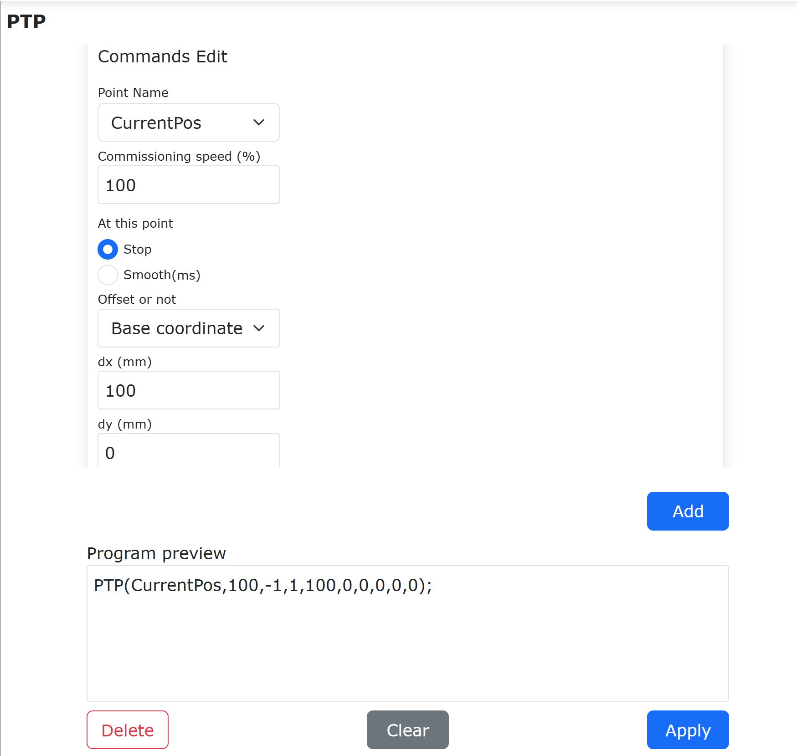

.. centered:: Figura 9.5-1-1 Comando Movimento Relativo PTP

Fare clic sui pulsanti "Aggiungi" e "Applica" per aggiungere un comando di movimento relativo PTP del robot al programma Lua. Passare il robot in modalità automatica e fare clic sul pulsante di avvio. Nel programma di esempio, il robot si sposterà di 100mm lungo la direzione X+ del sistema di coordinate di base dalla sua posizione corrente.

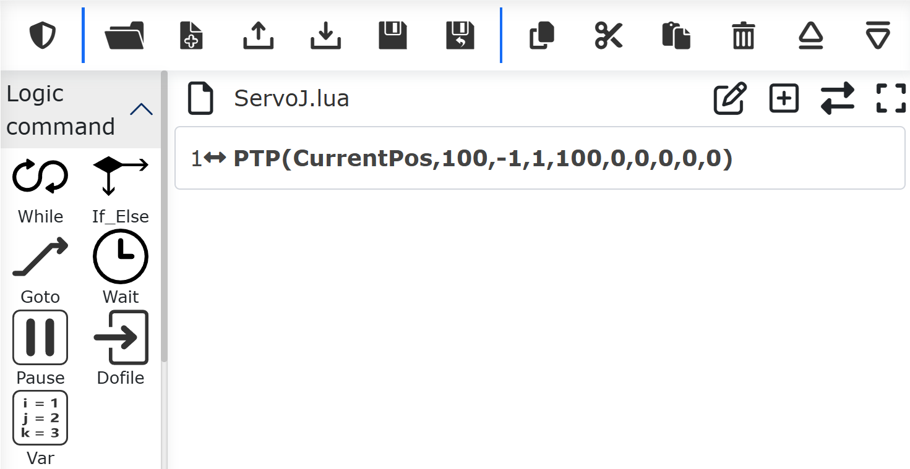

.. centered:: Figura 9.5-1-2 Comando Movimento Relativo PTP Aggiunto

Comando Lineare (LIN)
++++++++++++++++++++++++++++++

Fare clic sull'icona "Linea" per accedere all'interfaccia di modifica del comando Lin.

Questa istruzione è simile all'istruzione "PTP", ma il percorso per raggiungere il punto con questa istruzione è lineare.

.. image:: coding/032.png
   :width: 6in
   :align: center

.. centered:: Figura 9.5-2 Interfaccia Istruzione Lin

Movimento Relativo Lineare
******************************************
Il robot si muove linearmente di una distanza relativa dalla posizione corrente. Nella pagina di aggiunta dell'istruzione LIN, selezionare il nome del punto come "CurrentPos", scegliere il sistema di coordinate di offset come sistema di coordinate base, sistema di coordinate utensile o sistema di coordinate pezzo in base alle esigenze, e inserire il valore di offset. Il robot eseguirà quindi un movimento di offset lungo il sistema di coordinate impostato in base alla sua posizione corrente. ("CurrentPos" è un punto di sistema che non richiede insegnamento)

.. image:: coding/517.png
   :width: 6in
   :align: center

.. centered:: Figura 9.5-2-1 Comando Movimento Relativo LIN

Fare clic sui pulsanti "Aggiungi" e "Applica" per aggiungere un comando di movimento relativo lineare del robot al programma Lua. Passare il robot in modalità automatica e fare clic sul pulsante di avvio. Nel programma di esempio, il robot si sposterà di 100mm lungo la direzione X+ del sistema di coordinate di base dalla sua posizione corrente.

.. image:: coding/518.png
   :width: 6in
   :align: center

.. centered:: Figura 9.5-2-2 Comando Movimento Relativo LIN Aggiunto

Il movimento relativo lineare del robot supporta funzioni come livellamento, velocità fisica e ricerca del filo di saldatura.

.. important:: Quando si seleziona il nome del punto come "seamPos", il comando lineare viene utilizzato nello scenario di saldatura con sensore laser. A causa dell'errore accumulato durante l'esecuzione nella saldatura, vengono aggiunti "Spostamento abilitato" e "Quantità di spostamento".

   **Spostamento abilitato**: No, Spostamento sistema base, Spostamento sistema utensile, Spostamento dati grezzi laser;

   **Quantità di spostamento**: ∆x, ∆y, ∆z, ∆rx, ∆ry, ∆rz, intervallo: -300~300;

   .. image:: coding/033.png
      :width: 6in
      :align: center

   .. centered:: Figura 9.5-2-3 Interfaccia Istruzione Lin (Scenario Saldatura)

L'istruzione LIN consente di selezionare la modalità di velocità di movimento come "Percentuale" o "Velocità fisica":

- Percentuale: Inserire la percentuale di velocità di debug. Il robot si muove in base alla percentuale della velocità massima. La velocità effettiva di movimento del robot viene calcolata come: V = Velocità massima del robot × Percentuale di velocità globale × Percentuale di velocità di debug. Passando il mouse sull'icona dell'occhio a destra della casella di inserimento "Velocità di debug", verrà visualizzata la velocità fisica effettiva (unità: mm/s) del robot in modalità manuale e automatica con l'impostazione corrente della velocità di debug.

.. image:: coding/458.png
   :width: 5in
   :align: center

.. centered:: Grafico 9.5-2-4 Visualizzazione della velocità fisica effettiva inserendo una percentuale

- Velocità fisica: La velocità inserita è la velocità di esecuzione effettiva del robot, unità mm/s; l'accelerazione inserita è solitamente impostata al doppio della velocità. (La velocità fisica massima dell'istruzione LIN è limitata dalla percentuale di velocità globale. Se la velocità massima di esecuzione del robot è 1000 mm/s e la velocità globale è al 50%, la velocità fisica massima dell'istruzione LIN sarà 1000 × 50% = 500 mm/s).

.. image:: coding/459.png
   :width: 5in
   :align: center

.. centered:: Grafico 9.5-2-5 Inserimento della velocità fisica effettiva

Funzione di Gestione Sovraccarico Articolare Istruzione LIN
*******************************************************************************

Quando si utilizza l'istruzione di movimento lineare nello spazio cartesiano LIN, la condizione vincolante per la pianificazione è la velocità lineare. Tuttavia, durante l'esecuzione effettiva, a causa dello spazio di lavoro, mentre si soddisfa il requisito di velocità lineare, la velocità angolare delle articolazioni potrebbe già superare il limite. Questa funzione implementa strategie di gestione opzionali per affrontare situazioni di sovraccarico articolare durante il movimento LIN.

**Passo 1**: Fare clic sul pulsante dell'istruzione di movimento lineare;

.. image:: coding/034.png
   :width: 6in
   :align: center

.. centered:: Figura 9.5-3-1 Fare clic sul pulsante istruzione movimento lineare

**Passo 2**: Selezionare il punto obiettivo per l'istruzione di movimento lineare;

.. image:: coding/035.png
   :width: 6in
   :align: center

.. centered:: Figura 9.5-3-2 Selezionare il punto obiettivo movimento lineare

**Passo 3**: Attivare l'interruttore di protezione sovraccarico articolare;

.. image:: coding/036.png
   :width: 6in
   :align: center

.. centered:: Figura 9.5-3-3 Attivare il pulsante interruttore protezione sovraccarico articolare

**Passo 4**: Selezionare la strategia di gestione sovraccarico articolare (selezionare segnalazione errore o riduzione adattiva; altre opzioni sono strategie predefinite senza protezione);

.. image:: coding/037.png
   :width: 6in
   :align: center

.. centered:: Figura 9.5-3-4 Strategie di Gestione Sovraccarico Articolare

**Passo 5**:
   Impostare la strategia di gestione e i relativi parametri, quindi fare clic sul pulsante Aggiungi per aggiungere l'istruzione Lua;

   Con la strategia di riduzione adattiva, la soglia di riduzione è la percentuale della riduzione di velocità lineare rispetto alla velocità lineare impostata. Quando la riduzione supera la soglia impostata, il robot si ferma con un errore.

.. image:: coding/038.png
   :width: 6in
   :align: center

.. centered:: Figura 9.5-3-5 Selezione e Impostazione Strategia Gestione Sovraccarico Articolare

**Passo 6**: L'istruzione Lua aggiunta ha la forma mostrata in figura;

.. image:: coding/039.png
   :width: 6in
   :align: center

.. centered:: Figura 9.5-3-6 Istruzione Lua

**Inizio Protezione Sovraccarico**: JointOverSpeedProtectStart（a, b）;
   a: Numero strategia (riferimento ordine menu a tendina)

   b: Percentuale soglia (0~100, efficace solo per riduzione adattiva)

**Fine Protezione Sovraccarico**: JointOverSpeedProtectEnd（）;

.. note:: Per la protezione movimento "Attraversamento Punti Singolari", fare riferimento alla spiegazione della funzione di attraversamento punti singolari in modalità automatica.

Funzione Velocità Angolare Regolabile in Punti di Transizione Posizione Angolo Rivestimento
***********************************************************************************************************

Quando si incontrano pezzi che richiedono saldatura angolare con rivestimento durante la saldatura, o in una pianificazione lineare specifica (con grandi variazioni di orientamento e piccoli cambiamenti di posizione, ma che richiede una transizione rapida senza aumentare la velocità lineare), è possibile utilizzare questa funzione.

**Passo 1**: Impostare il sistema di coordinate dell'utensile, calibrare le dimensioni e l'orientamento della torcia saldatrice.

.. note:: I valori nell'interfaccia sono solo esempi; fare riferimento allo stato effettivo dell'utensile.

.. image:: coding/246.png
   :width: 4in
   :align: center

.. centered:: Figura 9.5-3-7 Impostare Sistema Coordinate Utensile

**Passo 2**: Fare clic su "Programma di Insegnamento", selezionare "Programmazione", e sotto "Istruzioni di Movimento" selezionare "Linea".

.. image:: coding/032.png
   :width: 6in
   :align: center

.. centered:: Figura 9.5-3-8 Interfaccia Impostazioni Istruzione Linea

**Passo 3**: Impostare il punto iniziale di ogni segmento lineare della saldatura angolare come punto di transizione, attivare il pulsante "Velocità angolare punti transizione regolabile", impostare la percentuale massima di accelerazione (la velocità angolare massima predefinita al 100% è 360°/s).

.. image:: coding/248.png
   :width: 6in
   :align: center

.. centered:: Figura 9.5-3-9 Interfaccia Configurazione Parametri Regolazione Velocità Angolare Punti Transizione

**Passo 4**: Fare clic sul pulsante "Aggiungi" per generare un'istruzione lineare che includa la regolazione della velocità angolare di orientamento nella transizione.

.. image:: coding/249.png
   :width: 6in
   :align: center

.. centered:: Figura 9.5-3-10 Aggiungere Istruzione Movimento Lineare con Punto di Transizione

**Passo 5**: Il robot completa la transizione di orientamento nel punto di partenza, esegue normalmente l'istruzione lineare per raggiungere la fine del segmento, disattivare il pulsante "Velocità angolare punti transizione regolabile", aggiungere il punto di terminazione del percorso.

.. image:: coding/250.png
   :width: 6in
   :align: center

.. centered:: Figura 9.5-3-11 Inserire Punto Finale Linea

**Passo 6**: Fare clic sul pulsante "Applica" per generare la corrispondente istruzione LUA.

.. image:: coding/251.png
   :width: 6in
   :align: center

.. centered:: Figura 9.5-3-12 Generare Istruzione LUA Lineare con Punti di Transizione

Una saldatura angolare completa di solito ha più punti di transizione. Nell'angolo mostrato in Figura 7, ci sono due punti di transizione di orientamento con piccoli cambiamenti di posizione ma grandi variazioni di orientamento durante la saldatura.

Il punto 1 è l'inizio del primo segmento di saldatura, il punto 2 è la fine del primo segmento di saldatura;

Il punto 3 è l'inizio del secondo segmento di saldatura, il punto 4 è la fine del secondo segmento di saldatura;

Il punto 5 è l'inizio del terzo segmento di saldatura, il punto 6 è la fine del terzo segmento di saldatura.

La transizione di orientamento avviene dalla fine del segmento di saldatura precedente all'inizio del segmento successivo, quindi è necessario aggiungere un'istruzione di regolazione della velocità angolare di orientamento all'inizio del segmento di saldatura successivo. In questo modo, durante la transizione di orientamento nell'angolo, la velocità lineare massima rimane invariata, mentre la velocità angolare massima aumenta, rendendo fluido il processo di saldatura angolare.

.. image:: coding/252.png
   :width: 4in
   :align: center

.. centered:: Figura 9.5-3-13 Esempio Processo Saldatura Angolare

Comando Arco (ARC)
++++++++++++++++++++++++

Fare clic sull'icona "Arco" per accedere all'interfaccia di modifica del comando Arc.

L'istruzione "Arc" è un movimento ad arco, composto da tre punti: il primo è il punto iniziale dell'arco, il secondo è il punto di transizione intermedio dell'arco, il terzo è il punto finale.

Sia i punti di transizione che i punti finali possono essere impostati con o senza offset. È possibile scegliere tra offset basato sul sistema di coordinate base, offset basato sul sistema di coordinate utensile o offset basato sul sistema di coordinate pezzo, e verranno visualizzate le impostazioni di offset per x, y, z, rx, ry, rz. Per il punto finale, è possibile impostare un raggio di transizione morbido per ottenere un movimento continuo.

.. important::
   Il movimento ad arco richiede prima di aggiungere un'istruzione PTP o Lin per raggiungere il punto iniziale.

.. image:: coding/040.png
   :width: 6in
   :align: center

.. centered:: Figura 9.5-4 Interfaccia Istruzione Arc

Il comando ARC consente di selezionare la modalità di velocità di movimento come "Percentuale" o "Velocità Fisica":

- **Percentuale:** Inserire una percentuale di velocità di debug. Il robot si muove a una percentuale della sua velocità massima. La velocità di movimento effettiva del robot viene calcolata come: V = Velocità Massima del Robot × Percentuale Velocità Globale × Percentuale Velocità Debug. Posizionando il mouse sull'icona a forma di occhio a destra del campo di inserimento "Velocità Debug", verrà visualizzata la velocità fisica effettiva (in mm/s) del robot in modalità manuale e automatica con le impostazioni di velocità di debug correnti.

.. image:: coding/461.png
   :width: 5in
   :align: center

.. centered:: Figura 9.5-4-1 Visualizzazione del Valore di Velocità Fisica Effettiva Inserendo una Percentuale

- **Velocità Fisica:** La velocità inserita è la velocità operativa effettiva del robot, in mm/s. L'accelerazione inserita è tipicamente impostata al doppio della velocità. (La velocità fisica massima del comando LIN è limitata dalla percentuale di velocità globale. Se la velocità operativa massima del robot è 1000 mm/s e la velocità globale è del 50%, la velocità fisica massima per il comando LIN è 1000 × 50% = 500 mm/s).

.. image:: coding/462.png
   :width: 5in
   :align: center

.. centered:: Figura 9.5-4-2 Inserimento della Velocità Fisica Effettiva

Comando Cerchio Completo (CIRCLE)
++++++++++++++++++++++++++++++++++++++++

Fare clic sull'icona "Cerchio" per accedere all'interfaccia di modifica del comando Circle.

Il robot collaborativo può eseguire traiettorie circolari complete aggiungendo l'istruzione cerchio. Prima di aggiungere l'istruzione cerchio, è necessario avere tre punti di percorso sulla traiettoria circolare pre-insegnati. Supponiamo che i tre punti di percorso sulla traiettoria circolare siano "P1", "P2", "P3", dove "P1" è il punto di partenza della traiettoria circolare, "P2" e "P3" sono rispettivamente il punto intermedio 1 e il punto intermedio 2 della traiettoria circolare. Spostare il robot in questi tre punti e aggiungere i nomi dei punti di insegnamento come "P1", "P2", "P3".

.. important::
   Il movimento a traiettoria circolare richiede prima di aggiungere un'istruzione PTP o Lin per raggiungere il punto iniziale.

.. image:: coding/042.png
   :width: 3in
   :align: center

.. centered:: Figura 9.5-5 Traiettoria Cerchio

.. image:: coding/043.png
   :width: 3in
   :align: center

.. image:: coding/044.png
   :width: 3in
   :align: center

.. image:: coding/045.png
   :width: 3in
   :align: center

.. centered:: Figura 9.5-6 Insegnare i punti "P1", "P2", "P3"

Aggiunta Istruzione Cerchio
*****************************************

**Passo 1**: Creare un nuovo programma utente "testCircle.lua", fare clic sul pulsante "Cerchio" per aprire la pagina di aggiunta istruzione cerchio.

.. image:: coding/046.png
   :width: 6in
   :align: center

.. centered:: Figura 9.5-7 Pulsante Aggiungi Istruzione Cerchio

**Passo 2**: Nella pagina di aggiunta istruzione cerchio, selezionare il modo di movimento del punto iniziale e il punto iniziale come "P1".

.. image:: coding/050.png
   :width: 6in
   :align: center

.. centered:: Figura 9.5-8 Modo Movimento Punto Iniziale e Punto Iniziale "P1"

**Step3**: Nella pagina di aggiunta del comando Cerchio, selezionare "Punto Intermedio Cerchio 1" come punto "P2" e "Punto Intermedio Cerchio 2" come punto "P3".

.. image:: coding/465.png
   :width: 6in
   :align: center

.. centered:: Figura 9.33-9 Selezione dei Punti Intermedi e Finale dell'Arco

**Step4**: Selezionare la modalità di velocità e inserire il valore della velocità.

Il comando Circle consente di selezionare la modalità di velocità di movimento come "Percentuale" o "Velocità Fisica":

- **Percentuale:** Inserire una percentuale di velocità di debug. Il robot si muove a una percentuale della sua velocità massima. La velocità di movimento effettiva del robot viene calcolata come: V = Velocità Massima del Robot × Percentuale Velocità Globale × Percentuale Velocità Debug. Posizionando il mouse sull'icona a forma di occhio a destra del campo di inserimento "Velocità Debug", verrà visualizzata la velocità fisica effettiva (in mm/s) del robot in modalità manuale e automatica con le impostazioni di velocità di debug correnti.

.. image:: coding/466.png
   :width: 5in
   :align: center

.. centered:: Figura 9.33-10 Visualizzazione del Valore di Velocità Fisica Effettiva Inserendo una Percentuale

- **Velocità Fisica:** La velocità inserita è la velocità operativa effettiva del robot, in mm/s. L'accelerazione inserita è tipicamente impostata al doppio della velocità. (La velocità fisica massima del comando LIN è limitata dalla percentuale di velocità globale. Se la velocità operativa massima del robot è 1000 mm/s e la velocità globale è del 50%, la velocità fisica massima per il comando LIN è 1000 × 50% = 500 mm/s).

.. image:: coding/467.png
   :width: 5in
   :align: center

.. centered:: Figura 9.33-11 Inserimento della Velocità Fisica Effettiva

**Step5**: Fare clic in sequenza sul pulsante "Aggiungi" e poi sul pulsante "Applica". A questo punto, il comando di movimento circolare è stato aggiunto a "testCircle.lua".

.. image:: coding/468.png
   :width: 6in
   :align: center

.. centered:: Figura 9.33-12 Aggiunta del Comando di Movimento Circolare

**Step5**: A questo punto, il comando di movimento circolare è stato aggiunto a "testCircle.lua".

Passare il robot in modalità automatica e, garantita la sicurezza, avviare il programma. Il robot si muoverà secondo la traiettoria circolare.

Spostamento Traiettoria Cerchio
*****************************************

Il movimento cerchio del robot collaborativo supporta lo spostamento dei punti intermedi 1 e 2 della traiettoria circolare. I tipi di spostamento includono i seguenti due:

**Stesso spostamento per entrambi i punti intermedi della traiettoria circolare**: Il punto intermedio 1 della traiettoria circolare (punto "P2") e il punto intermedio 2 della traiettoria circolare (punto "P3") vengono spostati utilizzando lo stesso spostamento ∆(dx, dy, dz, drx, dry, drz).

**Spostamento diverso per i due punti intermedi della traiettoria circolare**: Il punto intermedio 1 della traiettoria circolare (punto "P2") e il punto intermedio 2 della traiettoria circolare (punto "P3") vengono spostati utilizzando due spostamenti diversi ∆1(dx1, dy1, dz1, drx1, dry1, drz1) e ∆2(dx2, dy2, dz2, drx2, dry2, drz2).

Di seguito vengono dimostrati rispettivamente gli usi di "stesso spostamento" e "spostamento diverso".

1. Stesso spostamento

Come mostrato, aprire la pagina di aggiunta istruzione cerchio, selezionare "Tipo di spostamento" come "Stesso spostamento", selezionare allo stesso modo il modo di movimento del punto iniziale e il punto iniziale come "P1", il punto intermedio 1 cerchio come punto "P2".

.. image:: coding/051.png
   :width: 6in
   :align: center

.. centered:: Figura 9.5-12 Cerchio Stesso Spostamento

Selezionare il punto intermedio 2 cerchio come "P3", e "Spostamento abilitato" come "Spostamento sistema base".

.. note:: È possibile scegliere "Offset coordinate utensile" o "Offset coordinate pezzo" in base alle condizioni di lavoro effettive.

Inserire lo spostamento dx di 10 mm, fare clic successivamente sui pulsanti "Aggiungi" e "Applica" in fondo alla pagina.

.. image:: coding/052.png
   :width: 6in
   :align: center

.. centered:: Figura 9.5-13 Impostare Spostamento

A questo punto, un'istruzione cerchio con punto iniziale "P1", e entrambi i punti intermedi "P2" e "P3" spostati di 10 mm lungo la direzione X del sistema di coordinate della base è stata aggiunta al programma "testCircle.lua".

.. image:: coding/053.png
   :width: 6in
   :align: center

.. centered:: Figura 9.5-14 Programma Cerchio Stesso Spostamento

Passare il robot in modalità automatica e, garantita la sicurezza, avviare il programma. Nella traiettoria di movimento effettiva del robot, il cerchio che passa per "P1", "P2" e "P3" avrà "P2" come il punto originale "P2" spostato di 10 mm lungo X, e "P3" come il punto originale "P3" spostato di 10 mm lungo X.

.. image:: coding/054.png
   :width: 3in
   :align: center

.. centered:: Figura 9.5-15 Traiettoria Stesso Spostamento X 10mm

2. Spostamento diverso

Aprire la pagina di aggiunta istruzione cerchio, selezionare "Tipo di spostamento" come "Spostamento diverso", selezionare allo stesso modo il modo di movimento del punto iniziale e il punto iniziale come "P1", il punto intermedio 1 cerchio come punto "P2", "Spostamento abilitato" selezionato come "Spostamento sistema base".

.. note:: È possibile scegliere "Offset coordinate utensile" o "Offset coordinate pezzo" in base alle condizioni di lavoro effettive.

Inserire lo spostamento dy di 10 mm.

.. image:: coding/055.png
   :width: 6in
   :align: center

.. centered:: Figura 9.5-16 Spostamento Diverso

Selezionare il punto intermedio cerchio come "P3", "Spostamento abilitato" selezionato come "Spostamento sistema base".

.. note:: È possibile scegliere "Offset coordinate utensile" o "Offset coordinate pezzo" in base alle condizioni di lavoro effettive.

Inserire lo spostamento dx di 10 mm, fare clic successivamente sui pulsanti "Aggiungi" e "Applica" in fondo alla pagina.

.. image:: coding/056.png
   :width: 6in
   :align: center

.. centered:: Figura 9.5-17 Impostare Spostamento Punto Intermedio 2 Spostamento Diverso

A questo punto, un'istruzione cerchio con punto iniziale "P1", punto intermedio "P2" spostato di 10 mm lungo la direzione Y del sistema di coordinate della base e "P3" spostato di 10 mm lungo la direzione X del sistema di coordinate della base è stata aggiunta al programma "testCircle.lua".

.. image:: coding/057.png
   :width: 6in
   :align: center

.. centered:: Figura 9.5-18 Programma Cerchio Due Punti Spostamento Diverso

Passare il robot in modalità automatica e, garantita la sicurezza, avviare il programma. Nella traiettoria di movimento effettiva del robot, il cerchio che passa per "P1", "P2'" e "P3'" avrà "P2'" come il punto originale "P2" spostato di 10 mm lungo Y, e "P3'" come il punto originale "P3" spostato di 10 mm lungo X.

.. image:: coding/058.png
   :width: 3in
   :align: center

.. centered:: Figura 9.5-19 Traiettoria Due Punti Traiettoria Cerchio Spostati Separatamente

Comando Spirale (SPIRAL)
++++++++++++++++++++++++++++++++++++++++

Fare clic sull'icona "Spirale" per accedere all'interfaccia di modifica del comando Spiral.

Se utilizzare l'offset, è possibile scegliere "Offset basato su coordinate base", "Offset basato su coordinate utensile" o "Offset basato su coordinate pezzo". Questo offset si applica all'intera traiettoria a spirale.

.. image:: coding/059.png
   :width: 6in
   :align: center

.. centered:: Figura 9.5-20 Interfaccia Istruzione Spiral

Comando Nuova Spirale (N-SPIRAL)
++++++++++++++++++++++++++++++++++++++++

Fare clic sull'icona "Nuova Spirale" per accedere all'interfaccia di modifica del comando N-Spiral.

L'istruzione "N-Spiral" è un movimento a spirale versione ottimizzata. Questa istruzione richiede solo un punto più la configurazione di vari parametri per realizzare il movimento a spirale. Il robot utilizza la posizione corrente come punto di partenza. L'utente imposta la velocità di debug, lo spostamento abilitato, il numero di giri della spirale, l'angolo di inclinazione della spirale, il raggio iniziale, l'incremento del raggio, l'incremento della direzione dell'asse di rotazione e la direzione di rotazione. Il numero di giri indica il numero di giri della spirale. L'angolo di inclinazione della spirale è l'angolo tra l'asse Z dell'utensile e la direzione orizzontale. L'angolo di correzione dell'orientamento corregge l'orientamento alla fine della spirale rispetto all'orientamento del primo punto della spirale. Il raggio iniziale è la dimensione del raggio del primo giro. L'incremento del raggio è l'incremento del raggio per ogni giro. L'incremento della direzione dell'asse di rotazione è l'incremento nella direzione dell'asse della spirale. La direzione di rotazione può essere oraria o antioraria.

.. image:: coding/060.png
   :width: 6in
   :align: center

.. centered:: Figura 9.5-21 Interfaccia Istruzione N-Spiral

Funzione Impostazione Velocità Costante per Ogni Giro della Spirale
*********************************************************************************************

Panoramica
""""""""""""""
Quando si utilizza l'istruzione di movimento a spirale, è possibile impostare la velocità di esecuzione del movimento a spirale, in modo che ogni giro mantenga la velocità di esecuzione impostata.

Procedura Operativa
""""""""""""""""""""""""""""
**Passo 1**: Selezionare il punto di insegnamento per eseguire il movimento a spirale. Questo manuale utilizza "P0" come nome del punto di insegnamento.

**Passo 2**: Fare clic su "Programma di Insegnamento" -> pulsante "Programmazione", selezionare l'istruzione "Nuova Spirale", in "Modalità Velocità" selezionare "Velocità Fisica", e impostare il valore di velocità e il valore di accelerazione. Questo valore di velocità è la velocità di esecuzione effettiva della spirale. Impostare i parametri "Numero giri spirale", "Angolo inclinazione spirale", "Raggio iniziale", "Incremento raggio", "Incremento direzione asse rotazione" e "Direzione rotazione" secondo necessità, come mostrato in Figura 2-1.

.. image:: coding/492.png
   :width: 6in
   :align: center

.. centered:: Figura 9.5-21-1 Impostazione Parametri Nuova Spirale

**Passo 3**: Aggiungere l'istruzione di movimento, generare il programma Lua ed eseguirlo per realizzare la funzione di esecuzione della spirale alla velocità impostata, come mostrato in Figura 2-2.

.. image:: coding/493.png
   :width: 6in
   :align: center

.. centered:: Figura 9.5-21-2 Programma Tipico per Eseguire Spirale a Velocità Impostata

Comando Spirale Orizzontale (H-SPIRAL)
++++++++++++++++++++++++++++++++++++++++++++++++++++++++

Fare clic sull'icona "Spirale Orizzontale" per accedere all'interfaccia di modifica del comando H-Spiral.

L'istruzione "H-Spiral" è un movimento a spirale nello spazio orizzontale. Questa istruzione viene impostata dopo un'istruzione di movimento singolo (linea).

   - Raggio spirale: 0~100 mm
   - Velocità angolare spirale: 0~2 giri/s
   - Direzione rotazione: spirale oraria/antioraria
   - Angolo inclinazione spirale: 0~40°

.. image:: coding/061.png
   :width: 6in
   :align: center

.. centered:: Figura 9.5-22 Interfaccia Istruzione H-Spiral

Comando Spline
++++++++++++++++++++++++++

Fare clic sull'icona "Spline" per accedere all'interfaccia di modifica del comando Spline.

Questa istruzione è divisa in tre parti: inizio gruppo spline, segmento spline e fine gruppo spline. L'inizio gruppo spline è il segnale di inizio del movimento spline. Il segmento spline include segmenti SPL, SLIN e SCIRC. Fare clic sull'icona corrispondente per accedere all'interfaccia di aggiunta istruzioni. La fine gruppo spline è il segnale di fine del movimento spline.

.. image:: coding/062.png
   :width: 6in
   :align: center

.. centered:: Figura 9.5-23 Interfaccia Istruzione Spline

Comando Nuova Spline (N-SPLINE)
++++++++++++++++++++++++++++++++++++++++++++++

Fare clic sull'icona "Nuova Spline" per accedere all'interfaccia di modifica del comando N-Spline.

Questa istruzione è una versione ottimizzata dell'algoritmo dell'istruzione Spline e sostituirà in futuro l'attuale istruzione Spline.

Questa istruzione è divisa in tre parti: inizio traiettoria multi-punto, segmento traiettoria multi-punto e fine traiettoria multi-punto. L'inizio traiettoria multi-punto è il segnale di inizio del movimento a traiettoria multi-punto. Il segmento traiettoria multi-punto consiste nell'impostare i vari punti della traiettoria.

Fare clic sull'icona per accedere all'interfaccia di aggiunta punti. La fine traiettoria multi-punto è il segnale di fine del movimento a traiettoria multi-punto. Qui è possibile impostare la modalità di controllo e la velocità di debug.

- Modalità controllo: punto transizione arco / punto percorso dato
- Tempo medio transizione globale: intero, maggiore di 10, valore predefinito 2000

.. image:: coding/063.png
   :width: 6in
   :align: center

.. centered:: Figura 9.5-24 Interfaccia Istruzione N-Spline

Comando Oscillazione (WEAVE)
++++++++++++++++++++++++++++++++++++++++++++++

Fare clic sull'icona "Oscillazione" per accedere all'interfaccia di modifica del comando Weave. L'istruzione "Weave" include due parti:

- Selezionare il numero di oscillazione con i parametri configurati, fare clic su "Inizia oscillazione saldatura" e "Ferma oscillazione saldatura" e applicare per aggiungere le relative istruzioni al programma.

.. image:: coding/064.png
   :width: 6in
   :align: center

.. centered:: Figura 9.5-25 Interfaccia Istruzione Weave

- Fare clic su "Configura e Testa", è possibile selezionare il tipo di oscillazione in base allo scenario d'uso, configurare i parametri dell'oscillazione saldatura. Dopo aver completato la configurazione, è possibile testare la traiettoria di oscillazione tramite i pulsanti inizia test oscillazione saldatura e ferma test oscillazione saldatura. Attualmente i tipi di oscillazione sono:

   - Oscillazione onda triangolare (LIN/ARC)
   - Oscillazione onda triangolare L verticale (LIN/ARC)
   - Oscillazione circolare - oraria (LIN)
   - Oscillazione circolare - antioraria (LIN)
   - Oscillazione onda sinusoidale (LIN/ARC)
   - Oscillazione onda sinusoidale L verticale (LIN/ARC)
   - Oscillazione triangolare saldatura verticale

.. image:: coding/065.png
   :width: 6in
   :align: center

.. centered:: Figura 9.5-26 Interfaccia Istruzione Configura e Testa Weave

Funzione Oscillazione a Zigzag Inclinato
***************************************************

L'uso della funzione di oscillazione a zigzag inclinato consente all'estremità dell'utensile del robot di formare una traiettoria di oscillazione a zigzag inclinata nello spazio cartesiano. L'oscillazione a zigzag inclinato si sovrappone alla pianificazione lineare. La quantità di inclinazione è controllata dal parametro angolo azimutale. L'inclinazione dell'angolo azimutale sul piano di oscillazione specificato (unità deg);

Quando il valore è positivo, l'estremità sinistra si inclina nella direzione di avanzamento; quando è negativo, l'estremità destra si inclina nella direzione di avanzamento; se è 90 deg o -90 deg, è possibile oscillare lungo la direzione di avanzamento.

.. image:: coding/066.png
   :width: 4in
   :align: center

.. centered:: Figura 9.5-26-1 Effetto Angolo Azimutale Oscillazione

**Passo 1**: Impostare il movimento lineare di base.

.. image:: coding/067.png
   :width: 4in
   :align: center

.. centered:: Figura 9.5-26-2 Esempio Programma Lua Movimento Lineare Base

**Passo 2**: Fare clic per aggiungere l'istruzione di oscillazione.

.. image:: coding/068.png
   :width: 5in
   :align: center

.. centered:: Figura 9.5-26-3 Fare clic per Aggiungere Istruzione Oscillazione

**Passo 3**: Nella pagina di configurazione parametri istruzione oscillazione, fare clic sul pulsante "Configura", nel menu a tendina "Tipo oscillazione" selezionare "Oscillazione onda triangolare" o "Oscillazione onda sinusoidale", inserire il corrispondente "Angolo azimutale direzione oscillazione", fare clic su "Applica".

.. image:: coding/069.png
   :width: 6in
   :align: center

.. centered:: Figura 9.5-26-4 Configurazione Parametri Oscillazione

**Passo 4**: Fare clic sul pulsante "Inizia oscillazione" per aggiungere l'istruzione di oscillazione sopra il movimento lineare; fare clic sul pulsante "Ferma oscillazione" per aggiungere l'istruzione di oscillazione sotto il movimento lineare.

.. image:: coding/070.png
   :width: 4in
   :align: center

.. centered:: Figura 9.5-26-5 Programma Lua dopo Aggiunta Istruzione Oscillazione

**Passo 5**: Fare clic su "Inizia esecuzione", la traiettoria dell'estremità del robot è mostrata in figura.

.. image:: coding/071.png
   :width: 3in
   :align: center

.. image:: coding/072.png
   :width: 3in
   :align: center

.. centered:: Figura 9.5-26-6 Oscillazione a Zigzag (sinistra) Oscillazione a Zigzag Inclinato (destra)

Comando Riproduzione Traiettoria (TPD)
++++++++++++++++++++++++++++++++++++++++++++++++++++++++++++

Fare clic sul pulsante "Riproduzione Traiettoria" per accedere all'interfaccia di modifica del comando TPD.

In questa istruzione, l'utente deve prima avere una traiettoria registrata.

Sulla registrazione traiettoria: Prima di iniziare a registrare la traiettoria, salvare prima il punto di partenza della traiettoria. Con il robot in modalità trascinamento, inserire il nome del file, selezionare il periodo (supponendo un valore x, cioè registrare un punto ogni x millisecondi, si consiglia di registrare un punto ogni 4 millisecondi), fare clic su inizia registrazione. L'utente può trascinare il robot per eseguire il movimento desiderato secondo necessità. Al termine della registrazione, fare clic su ferma registrazione per salvare la traiettoria di movimento del robot precedente. Se un movimento non può essere completamente registrato, verrà visualizzato un messaggio che indica il superamento del limite di punti di registrazione. L'utente dovrà dividere il movimento in più sessioni di registrazione.

Durante la programmazione, prima utilizzare un'istruzione PTP per raggiungere il punto iniziale della traiettoria corrispondente, poi nell'istruzione TPD riproduzione traiettoria selezionare la traiettoria, selezionare se applicare smooth, impostare la velocità di debug, fare clic successivamente su "Aggiungi", "Applica" per inserire il programma. L'istruzione di caricamento traiettoria è principalmente utilizzata per leggere in anticipo il file di traiettoria, estrarlo in istruzioni di traiettoria, applicandosi meglio agli scenari di inseguimento del nastro trasportatore.

.. note:: 
   Per le operazioni dettagliate su TPD, fare riferimento al modulo di spiegazione operativa della funzione di programmazione di insegnamento (TPD).

.. image:: coding/073.png
   :width: 6in
   :align: center

.. centered:: Figura 9.5-27 Interfaccia Istruzione TPD

Funzione TPD di Insegnamento e Riproduzione di Traiettorie per Robot
*******************************************************************************

Panoramica
""""""""""""""""""""
La funzione TPD di insegnamento e riproduzione di traiettorie per robot consente al robot di ricordare e ripetere con precisione le traiettorie complesse insegnate, raggiungendo così una produzione automatizzata di alta qualità ed efficienza nella produzione industriale, e sostituendo gli esseri umani nel completare attività ad alto rischio in ambienti pericolosi.

Procedura Operativa
""""""""""""""""""""""""""""""""""""""""""""""""""
**Step1**: Impostazione dei parametri di registrazione TPD. Fare clic su "TPD" nella barra di stato nella parte inferiore dell'interfaccia per accedere alla funzione TPD e configurare i parametri di registrazione della traiettoria. Impostare il nome del file di traiettoria, il tipo di posa e il periodo di campionamento, e configurare DI e DO. Durante il processo di registrazione della traiettoria TPD, attivando il DI, quando si riproduce il TPD, verrà emesso il DO corrispondente.

.. image:: coding/549.png
   :width: 3in
   :align: center

.. centered:: Figura 9.5-27-1 Impostazione dei parametri TPD

**Step2**: Passaggio alla modalità di trascinamento. In modalità manuale, è possibile passare alla modalità di insegnamento a trascinamento in due modi: tenendo premuto il pulsante dell'estremità o utilizzando il pulsante di commutazione della modalità di trascinamento sull'interfaccia. Nella funzione di registrazione TPD, si consiglia di commutare il robot in modalità di insegnamento a trascinamento dall'interfaccia.

.. image:: coding/550.png
   :width: 3in
   :align: center

.. centered:: Figura 9.5-27-2 Impostazione della modalità di trascinamento del robot

**Step3**: Avvio della registrazione. Fare clic sul pulsante "Avvia registrazione" per avviare la registrazione della traiettoria e trascinare il robot per l'insegnamento del movimento. Inoltre, nella configurazione DI dell'estremità è presente una voce di configurazione della funzione "Avvio/Arresto registrazione TPD". Configurando questa funzione, l'utente può attivare la funzione di registrazione della traiettoria "Avvia registrazione" tramite segnali esterni. È importante notare che per avviare la registrazione della traiettoria tramite segnale esterno, è necessario prima configurare le informazioni della traiettoria TPD sulla pagina.

**Step4**: Arresto della registrazione. Dopo aver completato l'insegnamento del movimento, fare clic sul pulsante "Arresta registrazione" per interrompere la registrazione della traiettoria, quindi uscire dalla modalità di insegnamento a trascinamento utilizzando il pulsante di commutazione dell'insegnamento a trascinamento. Come nello Step 3, dopo aver configurato la funzione "Avvio/Arresto registrazione TPD", l'arresto della registrazione può essere attivato tramite un segnale esterno.

**Step5**: Modifica della traiettoria TPD. Fare clic su "TPD" nella barra di stato nella parte inferiore dell'interfaccia per accedere alla funzione di modifica della traiettoria TPD. Innanzitutto, selezionare la traiettoria da modificare, fare clic sul pulsante "Ottieni". Start-index ed End-index mostreranno il numero di sequenza iniziale e finale della traiettoria. Regolarli trascinando il cursore o inserendo manualmente i valori; quindi fare clic sul pulsante "Riproduci". Il robot eseguirà un movimento simulato sull'interfaccia (il robot reale non si muove); infine, fare clic sul pulsante "Completa" per completare la modifica della traiettoria TPD.

.. image:: coding/551.png
   :width: 3in
   :align: center

.. centered:: Figura 9.5-27-3 Modifica della traiettoria TPD

**Step6**: Scrivere il programma TPD di insegnamento e riproduzione delle traiettorie. Fare clic su "Programma di insegnamento" - "Riproduzione traiettoria" - "Carica traiettoria", selezionare la traiettoria da riprodurre, quindi fare clic sul pulsante "Aggiungi". Fare clic su "Riproduzione traiettoria", selezionare la stessa traiettoria, impostare i parametri corrispondenti secondo le istruzioni sull'interfaccia, quindi fare clic sul pulsante "Aggiungi".

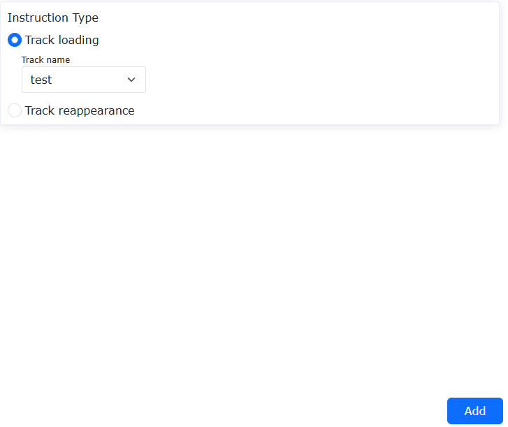

.. centered:: Figura 9.5-27-4 Impostazione del caricamento della traiettoria TPD

.. image:: coding/553.png
   :width: 6in
   :align: center

.. centered:: Figura 9.5-27-5 Impostazione della riproduzione della traiettoria TPD

**Step7**: Generare il programma Lua ed eseguirlo. Secondo il tipico programma Lua generato nello Step 6, eseguire il programma per eseguire l'insegnamento e la riproduzione della traiettoria.

.. image:: coding/554.png
   :width: 4in
   :align: center

.. centered:: Figura 9.5-27-6 Programma tipico per la riproduzione della traiettoria TPD

Comando Spostamento Punto (OFFSET)
+++++++++++++++++++++++++++++++++++++++++++++++++

Fare clic sull'icona "Spostamento Punto" per accedere all'interfaccia di modifica del comando Offset.

Questa istruzione è un'istruzione di spostamento globale. Inserendo i vari spostamenti e aggiungendo le istruzioni di attivazione e disattivazione al programma, i movimenti tra l'inizio e la fine verranno spostati in base al sistema di coordinate della base (o del pezzo).

.. image:: coding/074.png
   :width: 6in
   :align: center

.. centered:: Figura 9.5-28 Interfaccia Istruzione Offset

Comando Servo
+++++++++++++++++++++++++++++++++++++++++
Fare clic sull'icona "Servo" per accedere all'interfaccia di modifica dei comandi servoMotion. Il movimento servo include il movimento servo nello spazio cartesiano e il movimento servo nello spazio dei giunti.

.. image:: coding/075.png
   :width: 6in
   :align: center

.. centered:: Figura 9.5-29-1 Interfaccia Comandi Movimento Servo

Movimento Servo nello Spazio Cartesiano
*************************************************************
Comando di controllo servo ServoCart (movimento nello spazio cartesiano). Questo comando può controllare il movimento del robot attraverso il controllo della posa assoluta o il controllo dell'offset basato sulla posa corrente.

.. image:: coding/076.png
   :width: 6in
   :align: center

.. centered:: Figura 9.5-29-2 Interfaccia Comando ServoCart

Esempio di programma di controllo della posa assoluta:

.. image:: coding/077.png
   :width: 6in
   :align: center

.. centered:: Figura 9.5-29-3 Movimento Assoluto ServoCart

In questo esempio, x, y, z, rx, ry, rz (posizione cartesiana) sono la posizione corrente acquisita del robot. Inoltre, gli utenti possono controllare il movimento del robot leggendo file di dati di traiettoria, inviando dati di traiettoria tramite comunicazione socket, ecc.

Esempio di programma di controllo basato sull'offset dalla posa corrente (offset delle coordinate base):

.. image:: coding/519.png
   :width: 6in
   :align: center

.. centered:: Figura 9.5-29-4 Movimento Relativo ServoCart

Movimento Servo nello Spazio dei Giunti
********************************************************
Comando di controllo servo ServoJ (movimento nello spazio dei giunti). Questo comando può controllare il movimento del robot attraverso le posizioni assolute dei giunti del robot.

Fare clic in sequenza su "Programma Insegnamento", "Programmazione Programma", "Movimento Servo". Nella pagina dei comandi servoMotion, selezionare "Movimento Spazio Giunti".

.. image:: coding/520.png
   :width: 6in
   :align: center

.. centered:: Figura 9.5-29-5 Modifica Comando ServoJ

I parametri nel comando sono spiegati come segue:

- **Posizione Giunti**: La posizione target dei giunti per il movimento ServoJ. Il movimento dalla posizione corrente alla posizione target deve essere completato entro il ciclo di comando impostato. Se la deviazione tra la posizione target e il comando della posizione corrente è troppo grande, il robot potrebbe segnalare errori come sovraccarico del giunto.
- **Posizione Asse Esteso**: La posizione target dell'asse esteso per il movimento ServoJ.
- **Accelerazione**: Percentuale di accelerazione per il movimento ServoJ (attualmente non disponibile).
- **Velocità**: Percentuale di velocità per il movimento ServoJ (attualmente non disponibile; la velocità operativa effettiva del robot attualmente dipende dalla differenza di posizione tra due comandi ServoJ e dal ciclo di comando).
- **Ciclo Comando**: Intervallo di tempo di esecuzione tra due comandi ServoJ.

Inserire la corrispondente posizione target, velocità, accelerazione e ciclo di comando. Fare clic sui pulsanti "Aggiungi" e "Applica" per aggiungere un comando ServoJ al programma LUA.

.. image:: coding/521.png
   :width: 6in
   :align: center

.. centered:: Figura 9.5-29-6 Comando ServoJ Aggiunto al Programma Lua

In pratica, è spesso necessario inviare continuamente più comandi ServoJ secondo il ciclo di comando impostato. Le posizioni target dei giunti di questi comandi ServoJ formano una curva di movimento continua del robot, consentendo un controllo flessibile del movimento del robot. Il ciclo di invio dei comandi deve corrispondere al ciclo di comando impostato.

Il controllo del movimento ServoJ può essere implementato nel programma LUA tramite cicli o aggiungendo più comandi consecutivamente.

.. image:: coding/522.png
   :width: 6in
   :align: center

.. centered:: Figura 9.5-29-7 Esempio di Movimento ServoJ Continuo

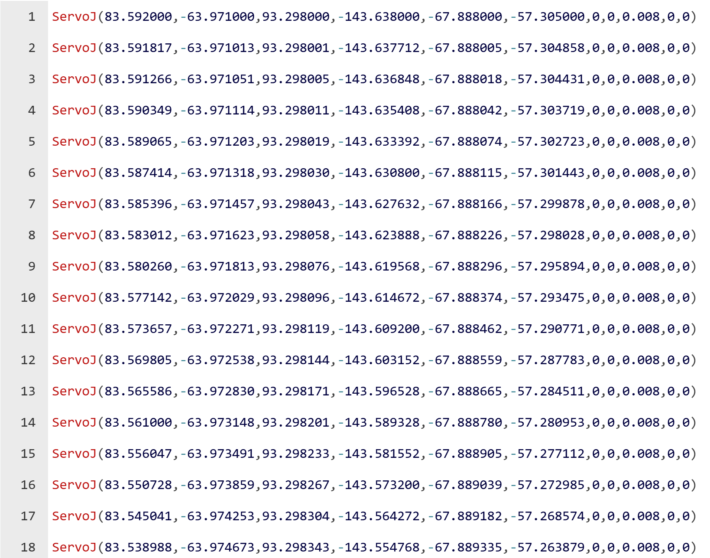

.. centered:: Figura 9.5-29-8 Esempio di Movimento ServoJ Continuo 1

Comando Traiettoria (TRAJECTORY)
++++++++++++++++++++++++++++++++++++++

Fare clic sull'icona "Traiettoria" per accedere all'interfaccia di modifica del comando Trajectory.

.. image:: coding/078.png
   :width: 6in
   :align: center

.. centered:: Figura 9.5-30 Interfaccia Istruzione Trajectory

Comando TraiettoriaJ
++++++++++++++++++++++++++++++++

Clicca sull'icona "TraiettoriaJ" per accedere all'interfaccia di modifica dei comandi TrajectoryJ.

Le istruzioni Trajectory e TrajectoryJ sono interfacce universali che consentono alla fotocamera di fornire direttamente le traiettorie, soddisfacendo l'esigenza di importare nel sistema file di punti traiettoria discreti con formato fisso esistente, permettendo al robot di muoversi secondo la traiettoria del file importato.

1. Funzione di importazione file traiettoria: Seleziona file dal computer locale per importarli nel sistema di controllo del robot.
2. Precaricamento traiettoria: Carica le istruzioni selezionando file di traiettoria già importati.
3. Movimento traiettoria: Combina le istruzioni con la velocità di debug selezionata utilizzando il file di traiettoria precaricato per far muovere il robot.
4. Stampa numero punto traiettoria: Durante l'esecuzione della traiettoria da parte del robot, stampa il numero del punto traiettoria per visualizzare lo stato di avanzamento del movimento corrente.

.. image:: coding/079.png
   :width: 6in
   :align: center

.. centered:: Grafico 9.5-31 Interfaccia istruzione TrajectoryJ

Comando DMP
++++++++++++++++

Clicca sull'icona "DMP" per accedere all'interfaccia di modifica dei comandi DMP.

DMP è un metodo di apprendimento per imitazione di traiettorie che richiede una traiettoria di riferimento pre-programmata. Nell'interfaccia di modifica comandi, seleziona il punto di insegnamento come nuovo punto di partenza, clicca su "Aggiungi", "Applica" per salvare l'istruzione. Il percorso DMP specifico è la nuova traiettoria che imita la traiettoria di riferimento dal nuovo punto di partenza.

.. image:: coding/080.png
   :width: 6in
   :align: center

.. centered:: Grafico 9.5-32 Interfaccia istruzione DMP

Comando trasformazione pezzo
++++++++++++++++++++++++++++++++++++++++++++++++

Clicca sull'icona "Trasformazione pezzo" per accedere all'interfaccia di modifica comandi WPTrsf.

Seleziona il sistema di coordinate del pezzo da trasformare automaticamente, clicca su "Aggiungi", "Applica" per salvare l'istruzione. Questa istruzione realizza la conversione automatica dei punti nel sistema di coordinate del pezzo durante l'esecuzione delle istruzioni PTP e LIN interne. L'area di esempio mostra e suggerisce la combinazione corretta di utilizzo delle istruzioni; le istruzioni specifiche possono essere adattate in base allo scenario effettivo dopo l'aggiunta.

.. image:: coding/081.png
   :width: 6in
   :align: center

.. centered:: Grafico 9.5-33 Interfaccia istruzione WPTrsf

Funzione di Trasformazione del Pezzo e Velocità di Sicurezza
**************************************************************

Panoramica
""""""""""""""""""""""""""""""""""""

La funzione di trasformazione del pezzo si riferisce alla migrazione delle traiettorie di movimento PTP\LIN\ARC\CIR sotto l'attuale sistema di coordinate del pezzo per funzionare sotto il sistema di coordinate del pezzo target.

La funzione di velocità di sicurezza si riferisce alla configurazione aperta dei limiti di velocità nello spazio cartesiano\articolare del robot, consentendo la protezione della velocità sia nello spazio di lavoro che nello spazio articolare.

Procedura Operativa della Funzione di Trasformazione del Pezzo
""""""""""""""""""""""""""""""""""""""""""""""""""""""""""""""""""""""""""""""""""""""""""""""""""""""""""""

**Step1**: Calibrare il sistema di coordinate del pezzo del robot tramite WebApp. Per i dettagli operativi di questa funzione, fare riferimento ai capitoli corrispondenti del manuale utente.

**Step2**: Insegnamento dei punti. Insegnare i punti di movimento PTP\LIN\ARC\CIR e scrivere programmi LUA tramite WebApp. Per i dettagli operativi di questa funzione, fare riferimento ai capitoli corrispondenti del manuale utente.

**Step3**: Configurare la trasformazione del sistema di coordinate del pezzo. Nell'interfaccia principale di WebApp, fare clic su "Teach Program" - "Program Programming" per accedere all'area "Istruzioni di Movimento".

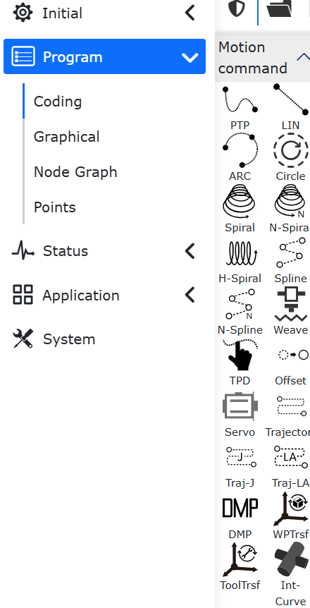

.. centered:: Figura 9.5-33-1 Area "Istruzioni di Movimento"

Nell'area "Istruzioni di Movimento", fare clic sul pulsante "Trasformazione Pezzo" per accedere all'interfaccia di configurazione dell'istruzione "WPTrsf".

.. image:: coding/584.png
   :width: 6in
   :align: center

.. centered:: Figura 9.5-33-2 Configurazione Istruzione WPTrsf

Nell'interfaccia di configurazione dell'istruzione "WPTrsf" -> area di configurazione "Modifica Istruzione", selezionare il numero del sistema di coordinate del pezzo target dal menu a tendina "Seleziona Sistema di Coordinate Pezzo", quindi fare clic sui pulsanti "Aggiungi" - "Applica" per completare la configurazione della funzione di trasformazione del pezzo.

**Step4**: Scrivere il programma LUA per la funzione di trasformazione del pezzo. Regolare l'ordine delle istruzioni generate dal Passo 2 al Passo 3 ed eseguire il programma LUA per implementare la funzione di trasformazione del pezzo.

.. image:: coding/585.png
   :width: 4in
   :align: center

.. centered:: Figura 9.5-33-3 Programma LUA per la Funzione di Trasformazione del Pezzo

Procedura Operativa della Funzione di Velocità di Sicurezza
""""""""""""""""""""""""""""""""""""""""""""""""""""""""""""""""""""""""""""""""""""""""""""""""""""""""""""

Nell'interfaccia principale di WebApp, fare clic su "Impostazioni Iniziali" - "Sicurezza" - "Velocità di Sicurezza" per accedere all'area di configurazione "Velocità di Sicurezza".

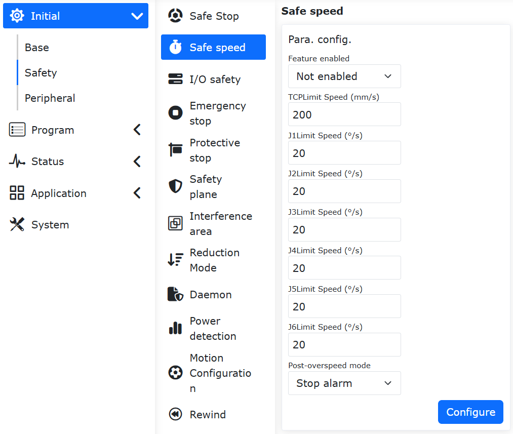

.. centered:: Figura 9.5-33-4 Configurazione Istruzione Velocità di Sicurezza

Nell'area di configurazione "Velocità di Sicurezza" -> menu a tendina "Abilitazione Funzione", è possibile selezionare le opzioni "Disabilita", "Abilita in Modalità Manuale" e "Abilita in Tutte le Modalità".

"Abilita in Modalità Manuale" significa che la funzione viene abilitata quando si passa alla modalità manuale in WebApp; "Abilita in Tutte le Modalità" significa che la funzione viene abilitata quando si passa alla modalità manuale, modalità automatica e modalità drag in WebApp.

Nell'area di configurazione "Velocità di Sicurezza" mostrata di seguito, è possibile impostare la protezione della velocità negli spazi cartesiano e articolare del robot rispettivamente nei campi di input "Velocità Limite TCP", "Velocità Limite J1", "Velocità Limite J2", "Velocità Limite J3", "Velocità Limite J4", "Velocità Limite J5" e "Velocità Limite J6".

È importante notare che durante il movimento del robot, le suddette protezioni di velocità vengono attivate in base al valore minimo tra di esse.

Nell'area di configurazione "Velocità di Sicurezza" -> menu a tendina "Modalità Post-Superamento Velocità", è possibile selezionare le opzioni "Stop e Allarme", "Limitazione Automatica Velocità" e "Disabilita Dopo Stop e Allarme", come mostrato nella tabella seguente.

.. centered:: Tabella 9.5-4 Selezione "Modalità Post-Superamento Velocità" con Diverse Opzioni "Abilitazione Funzione"

.. list-table::
   :widths: 25 25 25 25
   :header-rows: 0
   :align: center

   * - \
     - **Stop e Allarme**
     - **Limitazione Automatica Velocità**
     - **Disabilita Dopo Stop e Allarme**

   * - **Abilita in Modalità Manuale**
     - Supportato
     - Supportato
     - Supportato

   * - **Abilita in Tutte le Modalità**
     - Supportato
     - Non Supportato
     - Supportato
			
"Stop e Allarme": Quando sia la velocità di comando che quella di feedback degli giunti superano la velocità di sicurezza, WebApp visualizza un avviso di superamento velocità;

"Limitazione Automatica Velocità": Quando sia la velocità di comando che quella di feedback degli giunti superano la velocità di sicurezza, la velocità viene automaticamente ridotta entro il limite di sicurezza;

"Disabilita Dopo Stop e Allarme": Quando sia la velocità di comando che quella di feedback degli giunti superano la velocità di sicurezza, WebApp visualizza un avviso di superamento velocità e tutti gli giunti del robot vengono disabilitati.

Comando trasformazione utensile
++++++++++++++++++++++++++++++++++++++++++++++++

Clicca sull'icona "Trasformazione utensile" per accedere all'interfaccia di modifica comandi ToolTrsf.

Dopo aver aggiunto le istruzioni PTP e LIN, seleziona il sistema di coordinate dell'utensile da trasformare automaticamente, clicca su "Aggiungi", "Applica" per salvare l'istruzione. Le coordinate cartesiane dei punti nell'istruzione vengono convertite automaticamente in base al sistema di coordinate del pezzo attualmente impostato.

.. note:: L'area di esempio mostra e suggerisce la combinazione corretta di utilizzo delle istruzioni; le istruzioni specifiche possono essere adattate in base allo scenario effettivo dopo l'aggiunta.

.. image:: coding/276.png
   :width: 6in
   :align: center

.. centered:: Grafico 9.5-34 Interfaccia istruzione ToolTrsf

Interfaccia istruzioni di controllo
~~~~~~~~~~~~~~~~~~~~~~~~~~~~~~~~~~~~~~~~~~~~~~~~~~~~~~~~~

.. image:: coding/082.png
   :width: 6in
   :align: center

.. centered:: Grafico 9.6 Interfaccia istruzioni di controllo

Comando I/O digitale
++++++++++++++++++++++++++++++

Clicca sull'icona "I/O digitale" per accedere all'interfaccia di modifica comandi IO.

L'istruzione "IO" è divisa in tre parti: impostazione IO (SetDO/SPLCSetDO), acquisizione DI (GetDI/SPLCGetDI) e acquisizione DO (GetDO).

"SetDO/SPLCSetDO": Questa istruzione può impostare lo stato dell'output DO specificato, inclusi 16 output digitali della scatola di controllo e 2 output digitali dell'utensile. L'opzione di stato "False" significa chiuso, "True" significa aperto. L'opzione di blocco "Bloccante" indica che lo stato DO viene impostato dopo l'arresto del movimento, mentre "Non bloccante" indica che lo stato DO viene impostato durante il movimento precedente. L'opzione traiettoria liscia "Break" indica che lo stato DO viene impostato dopo il completamento del raggio di transizione liscio, "Serious" indica che lo stato DO viene impostato durante il movimento del raggio di transizione liscio. Quando questa istruzione viene aggiunta in un thread ausiliario, "Applica thread" deve essere impostato su Sì, altrimenti su No in altri contesti. Clicca su "Aggiungi", "Applica".

.. image:: coding/083.png
   :width: 6in
   :align: center

.. centered:: Grafico 9.6-1 Interfaccia istruzione SetDO

Nell'istruzione "GetDI/SPLCGetDI", seleziona il valore numerico della porta che desideri acquisire. L'opzione di blocco "Bloccante" indica che lo stato DI viene acquisito dopo l'arresto del movimento, mentre "Non bloccante" indica che lo stato DI viene acquisito durante il movimento precedente. Quando questa istruzione viene aggiunta in un thread ausiliario, "Applica thread" deve essere impostato su Sì, altrimenti su No in altri contesti. Dopo la selezione, clicca su "Aggiungi", "Applica".

.. image:: coding/084.png
   :width: 6in
   :align: center

.. centered:: Grafico 9.6-2 Interfaccia istruzione GetDI

Nell'istruzione "GetDO", selezionare il valore del numero di porta desiderato. L'opzione di blocco seleziona "Bloccante" per ottenere lo stato DO dopo l'arresto del movimento, e seleziona "Non bloccante" per ottenere lo stato DO durante il movimento precedente. Dopo la selezione, fare clic sui pulsanti "Aggiungi" e "Applica".

.. image:: coding/571.png
   :width: 6in
   :align: center

.. centered:: Figura 9.6-2-2 Interfaccia dell'istruzione GetDO

Comando AI analogico
++++++++++++++++++++++++++++++

Clicca sull'icona "AI analogico" per accedere all'interfaccia di modifica comandi AI.

Questa istruzione è divisa in tre parti funzionali: impostazione uscita analogica (SetAO/SPLCSetAO), acquisizione ingresso analogico (GetAI/SPLCGetAI) e acquisizione uscita analogica (GetAO).

"SetAO/SPLCSetAO": Seleziona l'output analogico da impostare, inserisci il valore da impostare (range 0-10). L'opzione di blocco "Bloccante" indica che lo stato AO viene impostato dopo l'arresto del movimento, mentre "Non bloccante" indica che lo stato AO viene impostato durante il movimento precedente. Quando questa istruzione viene aggiunta in un thread ausiliario, "Applica thread" deve essere impostato su Sì, altrimenti su No in altri contesti. Clicca su "Aggiungi", "Applica".

.. image:: coding/085.png
   :width: 6in
   :align: center

.. centered:: Grafico 9.6-3 Interfaccia istruzione SetAO

"GetAI/SPLCGetAI": Seleziona l'input analogico da acquisire. L'opzione di blocco "Bloccante" indica che lo stato AI viene acquisito dopo l'arresto del movimento, mentre "Non bloccante" indica che lo stato AI viene acquisito durante il movimento precedente. Quando questa istruzione viene aggiunta in un thread ausiliario, "Applica thread" deve essere impostato su Sì, altrimenti su No in altri contesti. Clicca su "Aggiungi", "Applica".

.. image:: coding/086.png
   :width: 6in
   :align: center

.. centered:: Grafico 9.6-4 Interfaccia istruzione GetAI

"GetAO" seleziona l'ingresso analogico da ottenere. L'opzione di blocco seleziona "Bloccante" per ottenere lo stato AI dopo l'arresto del movimento, e seleziona "Non bloccante" per ottenere lo stato AI durante il movimento precedente. Fare clic su "Aggiungi" e "Applica".

.. image:: coding/572.png
   :width: 6in
   :align: center

.. centered:: Figura 9.6-4-2 Interfaccia dell'istruzione GetAO

Comando I/O virtuale
++++++++++++++++++++++++++++++

Clicca sull'icona "I/O virtuale" per accedere all'interfaccia di modifica comandi Vir-IO.

Questa istruzione è un comando di controllo I/O virtuale che può impostare lo stato DI e AI esterni simulati e acquisire lo stato DI e AI simulati.

.. image:: coding/087.png
   :width: 6in
   :align: center

.. centered:: Grafico 9.6-5 Interfaccia istruzione Vir-IO

Comando I/O esteso
++++++++++++++++++++++++++++++

Clicca sull'icona "I/O esteso" per accedere all'interfaccia di modifica comandi Aux-IO.

Aux-IO è una funzione di istruzione per il controllo di I/O estesi esterni attraverso la comunicazione tra robot e PLC, che richiede l'instaurazione di comunicazione UDP tra robot e PLC. Oltre ai 16 ingressi/uscite originali, è possibile estendere fino a 128 ingressi/uscite. L'uso di questa istruzione è simile a quello dell'I/O universale descritto in precedenza. L'uso di questa funzione presenta una certa difficoltà tecnica; contattateci per consulenza.

.. image:: coding/088.png
   :width: 6in
   :align: center

.. centered:: Grafico 9.6-6 Interfaccia istruzione Aux-IO

Comando DO movimento
++++++++++++++++++++++++++++++

Clicca sull'icona "DO movimento" per accedere all'interfaccia di modifica comandi MoveDO.

Questa istruzione è divisa in modalità output continuo e modalità output singolo.

- Modalità output continuo: Implementa la funzione di output continuo di segnali DO durante il movimento lineare, in base all'intervallo impostato.

.. image:: coding/089.png
   :width: 6in
   :align: center

.. centered:: Grafico 9.6-7 Interfaccia output continuo istruzione MoveDO

- Modalità output singolo: È possibile scegliere tra output a sezione di velocità costante e configurazione libera. Tempo di impostazione output dopo l'inizio del movimento, tempo di reset output prima della fine del movimento, range [0, 1000].

.. image:: coding/090.png
   :width: 6in
   :align: center

.. centered:: Grafico 9.6-8 Interfaccia output singolo istruzione MoveDO

Comando AO movimento
++++++++++++++++++++++++++++++++++++++++++++

Clicca sull'icona "AO movimento" per accedere all'interfaccia di modifica comandi MoveAO.

1. Panoramica

Questa istruzione, utilizzata insieme alle istruzioni di movimento, consente di emettere segnali AO proporzionalmente in base alla velocità TCP in tempo reale durante il movimento.

2. Descrizione istruzione AO movimento

L'istruzione AO movimento si trova nell'area di modifica delle istruzioni di insegnamento simulato - programmi di insegnamento, con l'icona corrispondente al comando di controllo - AO movimento.

.. image:: coding/091.png
   :width: 6in
   :align: center

.. centered:: Grafico 9.6-9 Istruzione AO movimento

.. image:: coding/092.png
   :width: 6in
   :align: center

.. centered:: Grafico 9.6-10 Dettaglio istruzione AO movimento

- Numero AO: Selezione a discesa, Ctrl-AO0 corrisponde ad AO0 della scatola di controllo, Ctrl-AO1 corrisponde ad AO1 della scatola di controllo, End-AO0 corrisponde ad AO0 terminale.
  
- Velocità TCP massima: Valore della velocità TCP massima del robot; Funzione: crea una proporzione con la velocità TCP in tempo reale.
  
- Percentuale AO velocità TCP massima: Percentuale AO corrispondente al valore di velocità TCP massima del robot; Funzione: imposta il valore superiore dell'output AO.
  
- Percentuale AO compensazione zona morta: Quando la valvola proporzionale presenta una zona morta, è possibile impostare questo parametro per garantire l'output AO; Funzione: imposta il valore inferiore dell'output AO.

.. important:: 
   Formula di calcolo: Percentuale output AO = velocità TCP in tempo reale / velocità TCP massima impostata * percentuale AO velocità TCP massima impostata.

   Le istruzioni di movimento compatibili con questa istruzione sono: PTP/LIN/ARC/CIRCLE/SPLINE/NSPLINE/SERVOJ.

Comando sistema di coordinate
++++++++++++++++++++++++++++++++++++++++++++++++++++++++++

Clicca sull'icona "Sistema di coordinate" per accedere all'interfaccia di modifica comandi ToolList.

Seleziona il nome del sistema di coordinate dell'utensile, clicca su "Applica" per aggiungere questa istruzione al programma. Quando il programma esegue questa istruzione, verrà impostato il sistema di coordinate dell'utensile del robot.

.. image:: coding/093.png
   :width: 6in
   :align: center

.. centered:: Grafico 9.6-11 Interfaccia istruzione ToolList

Comando cambio modalità
++++++++++++++++++++++++++++++++++++++++++++

Clicca sull'icona "Cambio modalità" per accedere all'interfaccia di modifica comandi Mode.

Questa istruzione può commutare il robot in modalità manuale, solitamente aggiunta alla fine di un programma, in modo che dopo il completamento dell'esecuzione del programma, il robot passi automaticamente in modalità manuale per essere trascinato.

.. image:: coding/094.png
   :width: 6in
   :align: center

.. centered:: Grafico 9.6-12 Interfaccia istruzione Mode

Comando livello collisione
++++++++++++++++++++++++++++++

Clicca sull'icona "Livello collisione" per accedere all'interfaccia di modifica comandi Collision.

Questa istruzione imposta il livello di collisione, consentendo di regolare in tempo reale il livello di collisione di ciascun asse durante l'esecuzione del programma, per una distribuzione più flessibile degli scenari applicativi.

.. image:: coding/095.png
   :width: 6in
   :align: center

.. centered:: Grafico 9.6-13 Interfaccia istruzione Collision

Comando accelerazione
++++++++++++++++++++++++++++++

Clicca sull'icona "Accelerazione" per accedere all'interfaccia di modifica comandi Acc.

L'istruzione Acc realizza la funzione di impostazione separata dell'accelerazione del robot. Regolando il fattore di scala dell'accelerazione dell'istruzione di movimento, è possibile aumentare o diminuire il tempo di accelerazione/decelerazione, consentendo la regolazione del tempo del ciclo di movimento del robot.

.. image:: coding/096.png
   :width: 6in
   :align: center

.. centered:: Grafico 9.6-14 Interfaccia istruzione Acc

Interfaccia istruzioni periferiche
~~~~~~~~~~~~~~~~~~~~~~~~~~~~~~~~~~~~~~

.. image:: coding/097.png
   :width: 6in
   :align: center

.. centered:: Grafico 9.7 Interfaccia istruzioni periferiche

Comando pinza
++++++++++++++++

Clicca sull'icona "Pinza" per accedere all'interfaccia di modifica comandi Gripper.

In questa istruzione, sono incluse le istruzioni di controllo movimento pinza e le istruzioni di attivazione/reset pinza. Nelle istruzioni di controllo pinza, viene visualizzato il numero della pinza configurata e attivata. L'utente può impostare l'apertura/chiusura, la velocità di apertura/chiusura e la coppia di apertura/chiusura della pinza tramite la casella di modifica o il cursore, con valori in percentuale. L'opzione di blocco: selezionando "Bloccante" significa che il movimento della pinza aspetta il completamento dell'istruzione di movimento precedente; selezionando "Non bloccante" significa che il movimento della pinza è parallelo all'istruzione di movimento precedente. Cliccando su "Aggiungi", "Applica", i valori impostati vengono salvati nel file di insegnamento. Le istruzioni di reset/attivazione pinza mostrano i numeri delle pinze già configurate e consentono di aggiungere istruzioni di reset/attivazione al programma.

.. image:: coding/098.png
   :width: 6in
   :align: center

.. centered:: Grafico 9.7-1 Interfaccia istruzione Gripper

Comando pistola a spruzzo
++++++++++++++++++++++++++++++++

Clicca sull'icona "Pistola a spruzzo" per accedere all'interfaccia di modifica comandi Spray.

Questa istruzione riguarda i comandi relativi alla verniciatura, controllando la pistola a spruzzo per "Iniziare verniciatura", "Fermare verniciatura", "Iniziare pulizia pistola" e "Fermare pulizia pistola". Durante la modifica di questo comando di programma, assicurarsi che la pistola a spruzzo periferica sia configurata; fare riferimento al capitolo sulle periferiche del robot.

.. image:: coding/099.png
   :width: 6in
   :align: center

.. centered:: Grafico 9.7-2 Interfaccia istruzione Spray

Comando asse esterno
++++++++++++++++++++++++++++++++

Clicca sull'icona "Asse esterno" per accedere all'interfaccia di modifica comandi EAxis. Seleziona la modalità combinata:

- Controller + azionamento servo (485)
- Controller + PLC (UDP)

Selezionando Controller + PLC (UDP), questa istruzione è per scenari che utilizzano assi esterni, combinata con l'istruzione PTP, può scomporre il movimento nella direzione X di un punto nello spazio nel movimento dell'asse esterno. Seleziona il numero dell'asse esterno, scegli la modalità movimento come sincrona, seleziona il punto da raggiungere, clicca su "Aggiungi", "Applica" per salvare questa istruzione.

.. image:: coding/100.png
   :width: 6in
   :align: center

.. centered:: Grafico 9.7-3 Interfaccia istruzione EAxis

Selezionando Controller + azionamento servo (485), questa istruzione può configurare i parametri dell'asse esteso. Imposta parametri diversi in base alle diverse modalità di controllo. Per gli assi estesi già configurati, è possibile impostare il punto zero.

.. image:: coding/101.png
   :width: 6in
   :align: center

.. centered:: Grafico 9.7-4 Interfaccia istruzione asse esteso

Comando nastro trasportatore
++++++++++++++++++++++++++++++++++++++++++++++++

Clicca sull'icona "Nastro trasportatore" per accedere all'interfaccia di modifica comandi Convey.

Questa istruzione include quattro comandi: rilevamento posizione in tempo reale, rilevamento IO in tempo reale, avvio tracciamento e arresto tracciamento. Fare riferimento al capitolo sulle periferiche del robot.

.. image:: coding/102.png
   :width: 6in
   :align: center

.. centered:: Grafico 9.7-5 Interfaccia istruzione Conveyor

Funzione di Movimento di Inseguimento in Posizione su Nastro Trasportatore
***********************************************************************

Panoramica
"""""""""""""""""""""""""""""""""""

Questa funzione consente al robot di identificare e tracciare in modo sincrono gli oggetti in movimento su un nastro trasportatore, e quindi realizzare un movimento "relativamente statico" tra il robot e l'oggetto senza fermare il nastro trasportatore.

Procedura Operativa
""""""""""""""""""""""""""""""""""""""""""""""""""""""""""""""""""""""

**Passo 1**: Fare clic su "Applicazioni Ausiliarie" - "Pacchetto Processo" - "Inseguimento Nastro" per configurare i parametri di inseguimento del nastro, tra cui "Configurazione I/O", "Configurazione Parametri", "Compensazione Punto di Presa" (richiesta solo per la funzione "Inseguimento e Presa") e "Configurazione Punti di Riferimento". Nella "Configurazione Punti di Riferimento", la posizione del "Punto di Partenza a" è la posizione dell'oggetto all'inizio del movimento del nastro; la posizione del "Punto Finale b" è la posizione dell'oggetto al termine del movimento del nastro. Per i dettagli operativi, fare riferimento ai capitoli corrispondenti.

**Passo 2**: Il movimento di inseguimento utilizza il sistema di coordinate del pezzo come sistema di coordinate del nastro, quindi è necessario impostare il sistema di coordinate del pezzo. Fare clic su "Impostazioni Iniziali" - "Base", selezionare "Sistema di Coordinate del Pezzo", fare clic per selezionare un sistema di coordinate del pezzo diverso da "wobjcoord0" per la calibrazione. Fare riferimento ai capitoli corrispondenti per il metodo di calibrazione.

**Passo 3**: Fare clic su "Teach Program" - "Programmazione Programmi" - "Nastro" per accedere alla pagina di configurazione della funzione nastro.

**Passo 4**: Fare clic sul pulsante "Abilitazione Inseguimento", selezionare "Inseguimento Movimento" come modalità di lavoro e fare clic sul pulsante "Aggiungi".

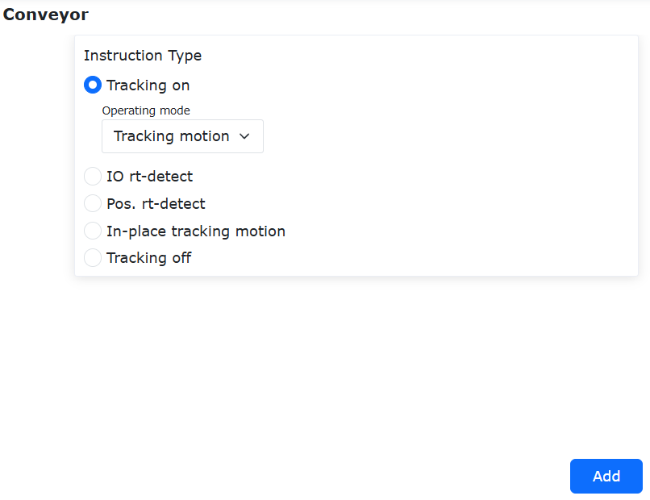

.. centered:: Figura 9.7-5-1 Impostazioni Abilitazione Inseguimento

**Passo 5**: Fare clic sul pulsante "Rilevamento I/O in Tempo Reale", impostare il tempo massimo di attesa e fare clic sul pulsante "Aggiungi".

.. image:: coding/591.png
   :width: 6in
   :align: center

.. centered:: Figura 9.7-5-2 Impostazioni Rilevamento I/O in Tempo Reale

**Passo 6**: Fare clic sul pulsante "Rilevamento Posizione in Tempo Reale", selezionare "Inseguimento Movimento" come modalità di lavoro e fare clic sul pulsante "Aggiungi".

.. image:: coding/592.png
   :width: 6in
   :align: center

.. centered:: Figura 9.7-5-3 Impostazioni Rilevamento Posizione in Tempo Reale

**Passo 7**: Fare clic sul pulsante "Inseguimento in Posizione". Le modalità di lavoro sono "Tempo", "Distanza" e "Tempo + Distanza". Nella modalità "Tempo", è necessario impostare il tempo di movimento. Il tempo viene calcolato dall'inizio dell'inseguimento del nastro e l'inseguimento si interrompe dopo il tempo impostato. Nella modalità "Distanza", è necessario impostare la distanza di movimento. La distanza viene calcolata dall'inizio dell'inseguimento del nastro e l'inseguimento si interrompe dopo la distanza impostata. Nella modalità "Tempo + Distanza", è necessario impostare sia il tempo che la distanza di movimento. Il calcolo inizia dall'attivazione dell'inseguimento del nastro e l'inseguimento si interrompe quando viene soddisfatta una delle condizioni impostate (tempo o distanza). Nota: Per la sicurezza dell'ambiente di movimento, la posizione massima di inseguimento di queste tre modalità non supererà la posizione del "Punto Finale b" durante la calibrazione del nastro. Fare clic sul pulsante "Aggiungi".

.. image:: coding/593.png
   :width: 6in
   :align: center

.. centered:: Figura 9.7-5-4 Impostazioni Parametri Inseguimento in Posizione

**Passo 8**: Fare clic sul pulsante "Disabilitazione Inseguimento" e fare clic sul pulsante "Aggiungi".

.. image:: coding/594.png
   :width: 6in
   :align: center

.. centered:: Figura 9.7-5-5 Impostazioni Disabilitazione Inseguimento

**Passo 9**: Il programma LUA generato per l'inseguimento in posizione su nastro è mostrato in figura. Eseguire il programma per realizzare l'inseguimento in posizione su nastro.

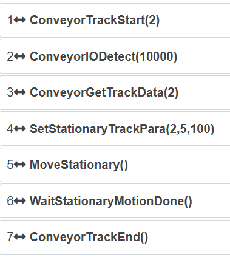

.. centered:: Figura 9.7-5-6 Programma LUA per Inseguimento in Posizione su Nastro

Comando apparecchiatura levigatura
++++++++++++++++++++++++++++++++++++++++++++++++

Clicca sull'icona "Apparecchiatura levigatura" per accedere all'interfaccia di modifica comandi Polish.

Questa istruzione può impostare la velocità di rotazione, la forza di contatto, la distanza di estensione e la modalità di controllo dell'apparecchiatura di levigatura.

.. image:: coding/103.png
   :width: 6in
   :align: center

.. centered:: Grafico 9.7-6 Interfaccia istruzione Polish

Interfaccia istruzioni saldatura
~~~~~~~~~~~~~~~~~~~~~~~~~~~~~~~~~~~~~~~~~~~~~~~

.. image:: coding/104.png
   :width: 6in
   :align: center

.. centered:: Grafico 9.8 Interfaccia istruzioni saldatura

Comando saldatura
++++++++++++++++++++++++++++++++

Clicca sull'icona "Saldatura" per accedere all'interfaccia di modifica comandi Weld.

Questa istruzione è principalmente utilizzata per le periferiche del saldatore. Prima di aggiungere questa istruzione, verificare che la configurazione del saldatore nelle periferiche utente sia completata; fare riferimento al capitolo sulle periferiche del robot.

- Intervallo tensione saldatura: 0~700V 
- Intervallo corrente saldatura: 0~1000A

.. important:: Quando si configurano l'output AO, la corrente di saldatura e la tensione di saldatura, è necessario selezionare il tipo I/O. Se si seleziona I/O controller, è necessario selezionare l'AO output corrispondente.

.. image:: coding/105.png
   :width: 6in
   :align: center

.. centered:: Grafico 9.8-1 Interfaccia istruzione Weld

Comando saldatura a segmenti
++++++++++++++++++++++++++++++++++++++++++++++++

Clicca sull'icona "Saldatura a segmenti" per accedere all'interfaccia di modifica comandi Segment.

Il robot collaborativo può eseguire operazioni di saldatura a segmenti aggiungendo istruzioni di saldatura a segmenti. Prima di aggiungere istruzioni di saldatura a segmenti, è necessario selezionare la modalità di saldatura a segmenti e insegnare i punti di inizio e fine. Le modalità di saldatura a segmenti includono "senza cambiare orientamento" e "cambiando orientamento". Il robot considera se cambiare l'orientamento durante il percorso di saldatura in base alla modalità di saldatura a segmenti selezionata.

Insegnare il punto iniziale "segment01" e il punto finale "segment02", confermando la posizione di inizio e fine del percorso di saldatura, come mostrato di seguito.

.. image:: coding/106.png
   :width: 3in
   :align: center

.. centered:: Grafico 9.8-2-1 Punto iniziale "segment01"

.. image:: coding/107.png
   :width: 3in
   :align: center

.. centered:: Grafico 9.8-2-2 Punto finale "segment02"

Aggiunta istruzione saldatura a segmenti
********************************************************

**Step1**: Creare un nuovo programma utente "testSegment1.lua", cliccare sul pulsante "Saldatura a segmenti" per aprire la pagina di aggiunta istruzioni di saldatura a segmenti.

.. image:: coding/108.png
   :width: 6in
   :align: center

.. centered:: Grafico 9.8-2-3 Pulsante aggiunta istruzione saldatura a segmenti

**Step2**: Nella pagina di aggiunta istruzioni di saldatura a segmenti, selezionare "Punto iniziale" come "segment01", selezionare "Punto finale" come "segment02".

.. image:: coding/109.png
   :width: 6in
   :align: center

.. centered:: Grafico 9.8-2-4 Punto iniziale e finale saldatura a segmenti

**Step3**: Configurare la velocità di debug, lunghezza di esecuzione, lunghezza di non esecuzione, modalità funzionale, selezione oscillazione e regola di arrotondamento, quindi cliccare in sequenza sui pulsanti "Aggiungi" e "Applica".

**Step4**: A questo punto, "testSegment1.lua" ha aggiunto l'istruzione di movimento per saldatura a segmenti.

.. image:: coding/110.png
   :width: 6in
   :align: center

.. centered:: Grafico 9.8-2-5 Aggiunta istruzione movimento saldatura a segmenti

Variazione orientamento traiettoria saldatura a segmenti
****************************************************************

Il movimento di saldatura a segmenti del robot collaborativo può selezionare la modalità di saldatura a segmenti, i tipi di modalità includono i seguenti due tipi;

**Senza cambiare orientamento**: Il robot mantiene sempre l'orientamento del punto iniziale del percorso di saldatura durante l'esecuzione del percorso di saldatura.

**Cambiando orientamento**: Il robot calcola la posa cartesiana e la posizione articolare di ogni segmento del percorso durante il processo di saldatura a segmenti, cambiando orientamento durante l'esecuzione della saldatura a segmenti.

Di seguito vengono dimostrati rispettivamente l'uso di "senza cambiare orientamento" e "cambiando orientamento".

1. Senza cambiare orientamento
   
Aprire la pagina di aggiunta istruzioni di saldatura a segmenti, selezionare "Senza cambiare orientamento" in "Modalità saldatura a segmenti", selezionare ugualmente "Punto iniziale" come "segment01", "Punto finale" come "segment02", impostare la lunghezza di esecuzione a 100, la lunghezza di non esecuzione a 50, selezionare altre configurazioni pertinenti e salvare il programma.

.. image:: coding/111.png
   :width: 6in
   :align: center

.. centered:: Grafico 9.8-2-6 Modalità saldatura a segmenti senza cambiare orientamento

2. Cambiando orientamento
   
Aprire la pagina di aggiunta istruzioni di saldatura a segmenti, selezionare "Cambiando orientamento" in "Modalità saldatura a segmenti", selezionare ugualmente "Punto iniziale" come "segment01", "Punto finale" come "segment02", impostare la lunghezza di esecuzione a 100, la lunghezza di non esecuzione a 50, selezionare altre configurazioni pertinenti e salvare il programma.

.. image:: coding/112.png
   :width: 6in
   :align: center

.. centered:: Grafico 9.8-2-7 Modalità saldatura a segmenti cambiando orientamento

3. Tipi di esecuzione saldatura a segmenti

Durante l'esecuzione del programma, la situazione di esecuzione della saldatura a segmenti del robot è divisa nei seguenti casi:

1) Se la modalità funzionale seleziona la funzione di esecuzione del primo segmento, la selezione oscillazione sceglie l'oscillazione del segmento di esecuzione, la regola di arrotondamento non arrotonda. Allora il robot esegue alternativamente movimento oscillatorio di 100mm e movimento lineare di 50mm, fermandosi al punto finale;

.. image:: coding/113.png
   :width: 6in
   :align: center

.. centered:: Grafico 9.8-2-8 Funzione oscillazione primo segmento eseguito senza arrotondamento

2) Se la modalità funzionale seleziona la funzione di non esecuzione del primo segmento, la selezione oscillazione sceglie la non oscillazione del segmento di esecuzione, la regola di arrotondamento non arrotonda. Allora il robot esegue alternativamente movimento oscillatorio di 50mm e movimento lineare di 100mm, fermandosi al punto finale;

.. image:: coding/114.png
   :width: 6in
   :align: center

.. centered:: Grafico 9.8-2-9 Funzione non oscillazione primo segmento non eseguito senza arrotondamento

3) Se la modalità funzionale seleziona la funzione di esecuzione del primo segmento, la selezione oscillazione sceglie l'oscillazione del segmento di esecuzione, la regola di arrotondamento arrotonda. Allora il robot esegue alternativamente movimento oscillatorio di 100mm e movimento lineare di 50mm, dopo il completamento dell'ultimo ciclo complessivo, se la distanza residua è inferiore a 150mm, l'oscillazione si interrompe;

.. image:: coding/115.png
   :width: 6in
   :align: center

.. centered:: Grafico 9.8-2-10 Funzione oscillazione primo segmento eseguito con arrotondamento ciclo

4) Se la modalità funzionale seleziona la funzione di esecuzione del primo segmento, la selezione oscillazione sceglie la non oscillazione del segmento di esecuzione, la regola di arrotondamento arrotonda. Allora il robot esegue alternativamente movimento oscillatorio di 50mm e movimento lineare di 100mm, dopo il completamento dell'ultimo ciclo complessivo, se la distanza residua è inferiore a 150mm, l'oscillazione si interrompe;

.. image:: coding/116.png
   :width: 6in
   :align: center

.. centered:: Grafico 9.8-2-11 Funzione non oscillazione primo segmento non eseguito con arrotondamento ciclo

5) Se la modalità funzionale seleziona la funzione di esecuzione del primo segmento, la selezione oscillazione sceglie l'oscillazione del segmento di esecuzione, la regola di arrotondamento arrotonda singolo segmento. Allora il robot esegue alternativamente movimento oscillatorio di 100mm e movimento lineare di 50mm, dopo il completamento dell'ultimo ciclo, se il segmento successivo è la pianificazione dell'oscillazione di 100mm e la distanza residua è inferiore a 100mm, l'oscillazione si interrompe; se il segmento successivo è la pianificazione del movimento lineare di 50mm e la distanza residua è inferiore a 50mm, il movimento si interrompe;

.. image:: coding/117.png
   :width: 6in
   :align: center

.. centered:: Grafico 9.8-2-12 Funzione oscillazione primo segmento eseguito con arrotondamento singolo segmento

6) Se la modalità funzionale seleziona la funzione di esecuzione del primo segmento, la selezione oscillazione sceglie la non oscillazione del segmento di esecuzione, la regola di arrotondamento arrotonda singolo segmento. Allora il robot esegue alternativamente movimento oscillatorio di 50mm e movimento lineare di 100mm, dopo il completamento dell'ultimo ciclo, se il segmento successivo è la pianificazione dell'oscillazione di 50mm e la distanza residua è inferiore a 50mm, l'oscillazione si interrompe; se il segmento successivo è la pianificazione del movimento lineare di 100mm e la distanza residua è inferiore a 100mm, il movimento si interrompe.

.. image:: coding/118.png
   :width: 6in
   :align: center

.. centered:: Grafico 9.8-2-13 Funzione non oscillazione primo segmento non eseguito con arrotondamento singolo segmento

4. Confronto orientamenti
   
Quando si configurano diverse modalità di saldatura a segmenti, anche l'orientamento del robot durante l'esecuzione del percorso di saldatura sarà diverso. Di seguito il confronto degli orientamenti durante l'esecuzione:

.. image:: coding/119.png
   :width: 3in
   :align: center

.. centered:: Grafico 9.8-2-14 Orientamento iniziale percorso saldatura

.. image:: coding/120.png
   :width: 3in
   :align: center

.. centered:: Grafico 9.8-2-15 Orientamento senza cambiamento durante l'esecuzione

.. image:: coding/121.png
   :width: 3in
   :align: center

.. centered:: Grafico 9.8-2-16 Orientamento con cambiamento durante l'esecuzione

Scenario reale saldatura a segmenti
********************************************************
In un ambiente di test reale, il robot deve essere dotato di configurazioni come la torcia di saldatura. In base alle istruzioni di saldatura a segmenti create, esegue operazioni di saldatura sulla piastra di saldatura. L'immagine dello scenario reale è la seguente:

.. image:: coding/122.png
   :width: 3in
   :align: center

.. centered:: Grafico 9.8-2-17 Scenario reale saldatura a segmenti

Comando tracciamento laser
++++++++++++++++++++++++++++++++++++++++++

Clicca sull'icona "Tracciamento laser" per accedere all'interfaccia di modifica comandi Laser.

Questa istruzione include tre parti: comando laser, comando tracciamento e comando ricerca posizione. Prima di aggiungere questa istruzione, verificare che il sensore di tracciamento laser nelle periferiche utente sia configurato correttamente. Fare riferimento al capitolo sulle periferiche del robot.

Nel modulo di caricamento sensore, in base alla funzione selezionata, viene visualizzata l'interfaccia "Comando sensore" corrispondente per configurare il comando sensore:

**Ruini/Chuangxiang**: Inserire il tipo di saldatura, intervallo: intero 0~49

.. image:: coding/123.png
   :width: 6in
   :align: center

.. centered:: Grafico 9.8-3-1 Interfaccia istruzione Laser (tipo saldatura)

**Quanshi**: Inserire il numero del compito, intervallo: intero 0~255

.. image:: coding/124.png
   :width: 6in
   :align: center

.. centered:: Grafico 9.8-3-2 Interfaccia istruzione Laser (numero compito)

Funzione di Tracciamento a Punto Fisso del Sensore Laser
****************************************************************

Panoramica
""""""""""""""""""""""
L'attuale tracciamento laser a punto fisso è implementato in base al metodo dell'asse esteso. Sono stati aggiunti nuovi metodi di tracciamento a tempo personalizzato o di tracciamento attivato da I/O per adattarsi a vari scenari applicativi. Quando si seleziona il metodo di tracciamento a tempo personalizzato, è necessario impostare il tempo di tracciamento. Il tracciamento laser inizia all'avvio del programma e termina quando viene raggiunto il tempo impostato. Quando si seleziona il metodo di tracciamento attivato da I/O, il programma Lua o SDK viene eseguito; il tracciamento inizia quando l'I/O viene attivato e il tracciamento laser termina quando il segnale I/O viene rimosso.

Processo Operativo di Tracciamento a Tempo Personalizzato
"""""""""""""""""""""""""""""""""""""""""""""""""""""""""""""""""""""""""""

**Step1**: Fare clic su "Impostazioni iniziali" - "Periferiche" - "Sensore laser a linea" - "Dispositivi adattati" per accedere alla pagina di configurazione. La pagina di configurazione include "Configurazione sensore", "Configurazione comunicazione e caricamento", "Calcolo di riferimento", ecc. Fare clic su "Configurazione sensore" per impostare i parametri del filtro di ingresso del sensore, impostare la differenza massima in base alle condizioni effettive, selezionare l'elaborazione dei dati come "Dati grezzi (nessuna trasformazione)", impostare il coefficiente di sensibilità direzione X a 0, impostare le direzioni Y e Z in base alle condizioni effettive (si consiglia di impostare a 1). Fare clic su "Configurazione comunicazione e caricamento" per inserire i parametri di comunicazione corrispondenti per connettersi al sensore laser. Per la configurazione dettagliata, fare riferimento alla sezione corrispondente del manuale utente.

.. image:: coding/524.png
   :width: 6in
   :align: center

.. centered:: Figura 9.8-3-3 Configurazione del sensore laser a linea

**Step2**: Calibrare il sistema di coordinate dell'utensile e il sistema di coordinate del sensore laser. Calibrare il sistema di coordinate dell'utensile utilizzando il "Metodo a sei punti" e calibrare il sistema di coordinate del sensore laser utilizzando il "Metodo a cinque punti". La calibrazione del sistema di coordinate dell'utensile e del sensore laser non è il focus di questa introduzione alla funzione. Per i metodi di calibrazione dettagliati, fare riferimento alla sezione corrispondente del manuale utente.

**Step3**: Regolare la posizione del pezzo e del fascio laser come mostrato nella figura seguente. Il rettangolo nero è il pezzo, il segmento rosso è il fascio laser. Il fascio laser deve essere perpendicolare al bordo del pezzo da tracciare e la direzione di movimento del pezzo deve essere parallela al fascio laser. Il pezzo si muove a velocità costante, si consiglia una velocità di 15 mm/s. Una velocità troppo elevata ridurrà le prestazioni di tracciamento.

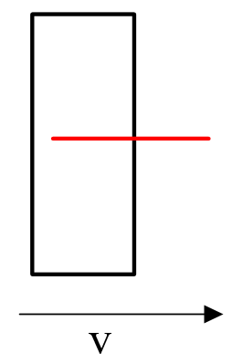

.. centered:: Figura 9.8-3-4 Schema della posizione relativa pezzo/fascio laser

**Step4**: Fare clic su "Programma di insegnamento" - "Tracciamento laser" - "Registrazione dati", impostare la selezione della funzione su "Registra e riproduce simultaneamente", impostare il tipo di movimento di tracciamento a punto fisso su "Movimento robot", impostare la modalità di attivazione del tracciamento a punto fisso su "Tempo", impostare la durata del tracciamento in base alle esigenze effettive. In questo manuale, 21 s sono utilizzati come esempio. Le impostazioni degli altri parametri sono le stesse del tracciamento laser utilizzando l'asse esteso. Fare clic sul pulsante "Aggiungi" in basso.

.. image:: coding/526.png
   :width: 6in
   :align: center

.. centered:: Figura 9.8-3-5 Impostazioni parametri tracciamento durata personalizzata

**Step5**: Fare clic su "Programma di insegnamento" - "Tracciamento laser" - "Registrazione dati", impostare la selezione della funzione su "Interrompi registrazione", fare clic sul pulsante aggiungi per generare il programma Lua. Quando si esegue questo programma, il robot traccerà per 21 s e poi terminerà il tracciamento.

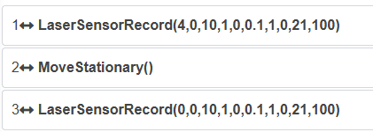

.. centered:: Figura 9.8-3-6 Programma Lua tipico per tracciamento durata personalizzata

Processo Operativo di Tracciamento Attivato da I/O
""""""""""""""""""""""""""""""""""""""""""""""""""""""""""""
**Step1**: Fare clic su "Impostazioni iniziali" - "Periferiche" - "Sensore laser a linea" - "Dispositivi adattati" per accedere alla pagina di configurazione. La pagina di configurazione include "Configurazione sensore", "Configurazione comunicazione e caricamento", "Calcolo di riferimento", ecc.

Fare clic su "Configurazione sensore" per impostare i parametri del filtro di ingresso del sensore, impostare la differenza massima in base alle condizioni effettive, selezionare l'elaborazione dei dati come "Dati grezzi (nessuna trasformazione)", impostare il coefficiente di sensibilità direzione X a 0, impostare le direzioni Y e Z in base alle condizioni effettive (si consiglia di impostare a 1). Fare clic su "Configurazione comunicazione e caricamento" per inserire i parametri di comunicazione corrispondenti per connettersi al sensore laser. Per la configurazione dettagliata, fare riferimento alla sezione corrispondente del manuale utente.

.. image:: coding/528.png
   :width: 6in
   :align: center

.. centered:: Figura 9.8-3-7 Configurazione del sensore laser a linea

**Step2**: Calibrare il sistema di coordinate dell'utensile e il sistema di coordinate del sensore laser. Calibrare il sistema di coordinate dell'utensile utilizzando il "Metodo a sei punti" e calibrare il sistema di coordinate del sensore laser utilizzando il "Metodo a cinque punti". La calibrazione del sistema di coordinate dell'utensile e del sensore laser non è il focus di questa introduzione alla funzione. Per i metodi di calibrazione dettagliati, fare riferimento alla sezione corrispondente del manuale utente.

**Step3**: Regolare la posizione del pezzo e del fascio laser come mostrato nella figura seguente. Il rettangolo nero è il pezzo, il segmento rosso è il fascio laser. Il fascio laser deve essere perpendicolare al bordo del pezzo da tracciare e la direzione di movimento del pezzo deve essere parallela al fascio laser. Il pezzo si muove a velocità costante, si consiglia una velocità di 15 mm/s. Una velocità troppo elevata ridurrà le prestazioni di tracciamento.

.. centered:: Figura 9.8-3-8 Schema della posizione relativa pezzo/fascio laser

**Step4**: Fare clic su "Programma di insegnamento" - "Tracciamento laser" - "Registrazione dati", impostare la selezione della funzione su "Registra e riproduce simultaneamente", impostare il tipo di movimento di tracciamento a punto fisso su "Movimento robot", impostare la modalità di attivazione del tracciamento a punto fisso su "I/O". Il tracciamento inizia quando l'I/O viene attivato e si interrompe quando il segnale I/O viene rimosso. Le impostazioni degli altri parametri sono le stesse del tracciamento laser utilizzando l'asse esteso. Fare clic sul pulsante "Aggiungi" in basso.

.. image:: coding/529.png
   :width: 6in
   :align: center

.. centered:: Figura 9.8-3-9 Impostazioni parametri tracciamento I/O

**Step5**: Fare clic su "Programma di insegnamento" - "Tracciamento laser" - "Registrazione dati", impostare la selezione della funzione su "Interrompi registrazione", fare clic sul pulsante aggiungi per generare il programma Lua. Quando si esegue questo programma, il tracciamento inizia quando l'I/O viene attivato e si interrompe quando il segnale I/O viene rimosso.

.. image:: coding/530.png
   :width: 6in
   :align: center

.. centered:: Figura 9.8-3-10 Programma Lua tipico per tracciamento I/O

Comando registrazione laser
++++++++++++++++++++++++++++++++++++++++++

Clicca sull'icona "Registrazione laser" per accedere all'interfaccia di modifica comandi LT-Rec.

Questa istruzione realizza la funzione di estrazione del punto iniziale e finale della registrazione del tracciamento laser, consentendo al robot di muoversi automaticamente alla posizione iniziale. È adatta per scenari in cui il robot inizia il movimento dall'esterno del pezzo e registra il tracciamento laser. Allo stesso tempo, il computer superiore può acquisire le informazioni sui punti iniziali e finali nei dati registrati, per i successivi movimenti.

Realizza la funzione di velocità regolabile per la riproduzione del tracciamento laser, consentendo al robot di registrare ad alta velocità e quindi riprodurre alla normale velocità di saldatura, migliorando l'efficienza operativa.

.. image:: coding/125.png
   :width: 6in
   :align: center

.. centered:: Grafico 9.8-4 Interfaccia istruzione LT-Rec

Comando ricerca posizione filo saldatura
+++++++++++++++++++++++++++++++++++++++++++++++++++++++

Clicca sull'icona "Ricerca posizione filo saldatura" per accedere all'interfaccia di modifica comandi W-Search.

Questa istruzione è per la ricerca della posizione del filo di saldatura, includendo le istruzioni di inizio ricerca, fine ricerca e calcolo offset. È generalmente utilizzata in scenari di saldatura, richiedendo la combinazione di I/O del saldatore con le istruzioni di movimento del robot.

.. image:: coding/126.png
   :width: 6in
   :align: center

.. centered:: Grafico 9.8-5 Interfaccia istruzione W-Search

Nella scrittura del programma, di solito si imposta prima l'istruzione di inizio ricerca, poi si aggiungono due istruzioni LIN per determinare la direzione di ricerca. Dopo il successo della ricerca, si acquisisce l'offset calcolato, applicando questo offset attraverso l'istruzione di offset globale alle istruzioni di movimento di saldatura effettive. Esempio di programma come segue.

.. image:: coding/127.png
   :width: 4in
   :align: center

.. centered:: Grafico 9.8-5-1 Esempio W-Search (1D)

Comando tracciamento ad arco
+++++++++++++++++++++++++++++++++++++++++++++++++++++++

Clicca sull'icona "Tracciamento ad arco" per accedere all'interfaccia di modifica comandi Weld-Trc.

Questa istruzione realizza la compensazione della traiettoria del robot per il tracciamento della saldatura utilizzando il rilevamento della deviazione della saldatura, è possibile utilizzare un sensore ad arco per rilevare la deviazione della saldatura.

**Step1**: Modalità di impostazione corrente di riferimento compensazione alto/basso: feedback, impostare conteggio inizio corrente di riferimento alto/basso e conteggio corrente di riferimento alto/basso

.. image:: coding/128.png
   :width: 6in
   :align: center

.. centered:: Grafico 9.8-6-1 Interfaccia istruzione Weld-Trc - feedback

**Step2**: Modalità di impostazione corrente di riferimento compensazione alto/basso: costante, impostare corrente di riferimento alto/basso

.. image:: coding/129.png
   :width: 6in
   :align: center

.. centered:: Grafico 9.8-6-2 Interfaccia istruzione Weld-Trc - costante

**Step3**: Pagina interazione parametri compensazione sinistra/destra

.. image:: coding/130.png
   :width: 6in
   :align: center

.. centered:: Grafico 9.8-6-3 Interfaccia istruzione Weld-Trc - parametri compensazione sinistra/destra

Istruzioni di Debug per Asse Esteso
***********************************************************

Panoramica
""""""""""""""""""""""""""""""""""

L'interfaccia dell'istruzione GetInverseKinExaxis per la cinematica inversa delle posizioni target dell'asse esteso e l'interfaccia dell'istruzione ServoCart con posizioni dell'asse esteso supportano vari scenari in cui gli assi estesi e i robot sono utilizzati contemporaneamente.

Processo Operativo
""""""""""""""""""""""""""""""""""""""""""""""""""""""""""""""""

**Step1**: I parametri e il valore di ritorno dell'interfaccia dell'istruzione di cinematica inversa GetInverseKinExaxis sono mostrati nelle tabelle sottostanti.

.. centered:: Tabella 9.5-1 Parametri GetInverseKinExaxis

.. list-table::
   :widths: 10 20 30 40
   :header-rows: 0
   :align: center

   * - **N.**
     - **Tipo Dati**
     - **Nome Variabile**
     - **Descrizione Dettagliata**

   * - 1
     - uint8_t
     - posMode
     - 0: Posa assoluta, 1: Posa relativa - Sistema coordinate base, 2: Posa relativa - Sistema coordinate utensile

   * - 2
     - float
     - desePos[6]
     - Posizione cartesiana robot

   * - 3
     - float
     - exaxis[4]
     - Posizione asse esteso

   * - 4
     - int
     - toolNum
     - Numero utensile [0-14]

   * - 5
     - int
     - workPieceNum
     - Numero pezzo [0-14]

.. centered:: Tabella 9.5-2 Valore Ritorno GetInverseKinExaxis

.. list-table::
   :widths: 10 20 30 40
   :header-rows: 0
   :align: center

   * - **N.**
     - **Tipo Dati**
     - **Nome Variabile**
     - **Descrizione Dettagliata**

   * - 1
     - float
     - jointPos[6]
     - Posizione giunto

**Step2**: Il formato di chiamata dell'istruzione di cinematica inversa GetInverseKinExaxis in un programma Lua è mostrato nella figura sottostante. Inserendo semplicemente i parametri elencati nella tabella, è possibile ottenere i valori corrispondenti dei giunti. Per le chiamate nell'SDK, fare riferimento alla documentazione SDK corrispondente.

.. image:: coding/543.png
   :width: 6in
   :align: center

.. centered:: Figura 9.5-29-9 Chiamata GetInverseKinExaxis in Lua

**Step3**: L'interfaccia dell'istruzione ServoCart con posizioni dell'asse esteso è mostrata nella tabella sottostante, senza valore di ritorno.

.. centered:: Tabella 9.5-3 Parametri ServoCart

.. list-table::
   :widths: 10 20 30 40
   :header-rows: 0
   :align: center

   * - **N.**
     - **Tipo Dati**
     - **Nome Variabile**
     - **Descrizione Dettagliata**

   * - 1
     - uint8_t
     - posMode
     - 0: Posa assoluta, 1: Posa relativa - Sistema coordinate base, 2: Posa relativa - Sistema coordinate utensile

   * - 2
     - float
     - desePos[6]
     - Posizione cartesiana robot

   * - 3
     - float
     - gain[6]
     - Coefficiente proporzionalità posa, utilizzato nei casi di posa relativa

   * - 4
     - float
     - exaxis[4]
     - Posizione asse esteso

   * - 5
     - float
     - acc
     - Proporzione accelerazione, 0~100, predefinito 0

   * - 6
     - float
     - vel
     - Proporzione velocità, 0~100, predefinito 0

   * - 7
     - float
     - interval
     - Periodo istruzione [s]

   * - 8
     - float
     - filterTime
     - Tempo filtro [s], temporaneamente non disponibile

   * - 9
     - float
     - posGain
     - Amplificatore proporzionale posizione target, temporaneamente non disponibile

**Step4**: Il formato di chiamata dell'istruzione ServoCart con posizioni dell'asse esteso in un programma Lua è mostrato nella figura sottostante. Inserendo semplicemente i parametri elencati nella tabella, il robot può eseguire il movimento ServoCart con posizioni dell'asse esteso. Per le chiamate nell'SDK, fare riferimento alla documentazione SDK corrispondente.

.. image:: coding/544.png
   :width: 6in
   :align: center

.. centered:: Figura 9.5-29-10 Chiamata ServoCart in Lua

Composizione del Sistema di Tracciamento dell'Arco Robotico
+++++++++++++++++++++++++++++++++++++++++++++++++++++++++++++++++++++++

Durante il processo di saldatura con tracciamento dell'arco del robot collaborativo, la saldatrice fornisce un feedback in tempo reale dei segnali di corrente e tensione di saldatura al robot. Il robot compensa la posizione della traiettoria di saldatura in base ai valori di corrente e tensione di saldatura forniti in feedback in tempo reale, realizzando così l'effetto di tracciamento dell'arco. Il feedback dei segnali di corrente e tensione tra la saldatrice e il robot può essere realizzato nei seguenti quattro modi. I primi due richiedono un PLC aggiuntivo per l'inoltro dei dati, mentre gli ultimi due prevedono una connessione diretta tra la saldatrice e la centralina di controllo del robot:

①Comunicazione CANopen o altri bus: Se la saldatrice supporta protocolli di comunicazione bus come CANopen, EtherCAT o ModbusTCP (ad es., OTC NBC-500RP, Megmeet serie A2, ecc.), il PLC e la saldatrice possono comunicare direttamente tramite il relativo protocollo di comunicazione. Il segnale di corrente di saldatura corrispondente può essere trasmesso direttamente al PLC tramite comunicazione e quindi fornito come feedback al robot tramite comunicazione UDP.

.. image:: coding/277.png
   :width: 6in
   :align: center

.. centered:: Figura 9.8-6-4 Diagramma Topologico della Composizione del Sistema di Tracciamento dell'Arco Robotico (Comunicazione Bus PLC e Saldatrice)
.. centered:: a-Computer; b-Robot e Centralina di Controllo; c-PLC e Modulo di Comunicazione Bus; d-Saldatrice

②PLC + IO Analogico: Il PLC può anche acquisire direttamente segnali analogici e quindi convertire i segnali analogici in valori di corrente con una determinata relazione di conversione per fornire un feedback al robot. Se la saldatrice dispone di un canale di uscita analogico per la corrente di saldatura in tempo reale, è possibile collegare direttamente questo canale al modulo di ingresso analogico del PLC. Se la saldatrice non dispone di un canale di uscita analogico per la corrente di saldatura in tempo reale, è possibile collegare un sensore di corrente Hall esterno. Il sensore acquisisce il segnale di corrente di saldatura in tempo reale e converte il segnale di corrente di saldatura in un segnale analogico in uscita verso il modulo di ingresso analogico del PLC.

.. image:: coding/278.png
   :width: 6in
   :align: center

.. centered:: Figura 9.8-6-5 Diagramma Topologico della Composizione del Sistema di Tracciamento dell'Arco Robotico (PLC che Acquisisce Segnali Analogici)
.. centered:: a-Computer; b-Robot e Centralina di Controllo; c-PLC e Modulo di Ingresso Analogico; d-Saldatrice e Sensore di Corrente Hall

③AI della Centralina di Controllo: Le porte I/O della centralina di controllo del robot hanno due ingressi analogici (0 ~ 10V). Se la saldatrice dispone di un canale di uscita analogico per la corrente di saldatura in tempo reale, è possibile collegare direttamente questo canale alla porta di ingresso analogico della centralina di controllo. Se la saldatrice non dispone di un canale di uscita analogico per la corrente di saldatura in tempo reale, è possibile collegare un sensore di corrente Hall esterno. Il sensore acquisisce il segnale di corrente di saldatura in tempo reale e converte il segnale di corrente di saldatura in un segnale analogico in uscita verso il canale di ingresso analogico della centralina di controllo. Esiste solitamente una relazione lineare tra il valore di ingresso analogico e il valore effettivo della corrente di saldatura. I parametri dettagliati sono impostati successivamente nella "Configurazione del Canale di Tracciamento dell'Arco".

.. image:: coding/534.png
   :width: 5in
   :align: center

.. centered:: Figura 9.8-6-6 Diagramma Topologico della Composizione del Sistema di Tracciamento dell'Arco Robotico (AI della Centralina di Controllo che Acquisisce Segnali Analogici)
.. centered:: a-Computer; b-Robot e Centralina di Controllo; c-Saldatrice e Sensore di Corrente Hall

④Comunicazione Ethernet (ModbusTCP): Se la saldatrice supporta la comunicazione ModbusTCP, il robot può controllare direttamente la saldatura e leggere i valori di feedback in tempo reale di corrente e tensione tramite ModbusTCP. Come mostrato nella Figura 1-4. La comunicazione ModbusTCP tra il robot e la saldatrice utilizza il protocollo aperto periferiche della centralina di controllo. Per i dettagli, vedere "8.6.6. Protocollo di Comunicazione Digitale (Modbus TCP)."

.. image:: coding/535.png
   :width: 5in
   :align: center

.. centered:: Figura 9.8-6-7 Diagramma Topologico della Composizione del Sistema di Tracciamento dell'Arco Robotico (Comunicazione ModbusTCP)
.. centered:: a-Computer; b-Robot e Centralina di Controllo; c-Saldatrice

Modelli saldatore e impostazioni
****************************************

.. centered:: Tabella 9.8-1 Modelli saldatore e impostazioni

.. list-table::
   :widths: 70
   :header-rows: 0
   :align: center

   * - **Modelli saldatore attualmente testati e compatibili**

   * - Saldatore Megmeet ArtsenII CM350
  
.. centered:: Tabella 9.8-2 Impostazioni funzioni saldatore

.. list-table::
   :widths: 100 100
   :header-rows: 0
   :align: center

   * - **Numero funzione**
     - **Parametro impostazione**

   * - F18
     - 20

   * - F19
     - 56

Modelli PLC e impostazioni
****************************************
.. centered:: Tabella 9.8-3 Modelli PLC e impostazioni

.. list-table::
   :widths: 70
   :header-rows: 0
   :align: center

   * - **Modelli PLC attualmente testati e compatibili**

   * - Inovance Easy521
  
.. centered:: Tabella 9.8-4 Impostazioni chiave PLC

.. list-table::
   :widths: 70 70
   :header-rows: 0
   :align: center

   * - **Voce impostazione**
     - **Contenuto impostazione**

   * - Protocollo comunicazione
     - CANOPEN

   * - Origine campionamento corrente feedback
     - Dati feedback CANOPEN saldatore

   * - Periodo sincronizzazione
     - 2ms

:download:`Allegato: Programma PLC <../_static/_doc/MEGMEET PLC PROGRAME.zip>`

Funzione tracciamento ad arco
*********************************************

**1) Introduzione parametri interfaccia funzione**

.. image:: coding/279.png
   :width: 4in
   :align: center

.. centered:: Grafico 9.8-7-1 Scenario tipico tracciamento ad arco

Lo scenario tipico della funzione tracciamento ad arco include: a. pezzo da saldare (cavo di saldatura ad angolo retto o acuto), b. torcia di saldatura, e è la linea centrale del cavo.

La funzione tracciamento ad arco può realizzare, attraverso le informazioni di corrente di saldatura acquisite e i parametri di oscillazione impostati sul robot, il tracciamento della saldatura nella direzione: c. alto/basso (profondità) e d. sinistra/destra (centro).

**2) Configurazione comunicazione**

①Comunicazione CANopen o altri bus：

Aprire WebApp, cliccare in sequenza su "Impostazioni iniziali", "Configurazione periferiche utente", "Configurazione saldatore".

.. image:: coding/280.png
   :width: 4in
   :align: center

.. centered:: Grafico 9.8-7-2 Apertura configurazione saldatore

Selezionare il tipo di controllo come "Protocollo comunicazione digitale", configurare i parametri comunicazione UDP, il significato dei vari parametri è il seguente:

**Indirizzo IP**: Indirizzo IP del lato PLC per la comunicazione UDP;

**Numero porta**: Numero porta comunicazione UDP lato PLC;

**Periodo comunicazione**: Periodo di comunicazione UDP tra robot e PLC, predefinito 2ms;

**Periodo rilevamento perdita pacchetti, numero perdite pacchetti**: Quando il numero di pacchetti persi entro il periodo di rilevamento supera il valore impostato, il robot segnala l'errore "Eccezione perdita pacchetti comunicazione UDP", interrompendo automaticamente la comunicazione.

**Durata conferma interruzione comunicazione**: Se il robot non riceve un pacchetto di dati di feedback completo dal PLC entro questa durata, segnala l'errore "Interruzione comunicazione UDP", interrompendo la comunicazione UDP.

**Riconnessione automatica interruzione comunicazione**: Indica se il robot tenta automaticamente la riconnessione dopo aver rilevato l'interruzione della comunicazione UDP;

**Periodo riconnessione, numero riconnessioni**: Con la riconnessione automatica abilitata e dopo aver rilevato l'interruzione della comunicazione UDP, il robot tenta la riconnessione con il periodo impostato; quando il numero di tentativi raggiunge il massimo impostato senza successo, il robot segnala l'errore "Interruzione comunicazione UDP", interrompendo la comunicazione UDP.

Dopo aver configurato i suddetti parametri, cliccare in sequenza sui pulsanti "Configura" e "Carica".

.. image:: coding/281.png
   :width: 4in
   :align: center

.. centered:: Grafico 9.8-7-3 Selezione tipo controllo
   
②PLC + IO Analogico:

Come per la "①Comunicazione CANopen o altri bus", il programma PLC converte i dati analogici di ingresso nei dati di corrente e tensione del protocollo di comunicazione UDP e li invia al robot.

③AI della Centralina di Controllo:

Non è richiesta alcuna configurazione di comunicazione. È sufficiente collegare correttamente i cavi I/O tra la centralina di controllo e la saldatrice. Le linee analogiche di feedback della corrente e tensione di saldatura in tempo reale dalla saldatrice vengono immesse sulle porte AI0 e AI1 della centralina di controllo del robot.

④Comunicazione Ethernet (ModbusTCP):

Collegare correttamente il cavo di rete tra il robot e la saldatrice. In WebApp, fare clic in sequenza su "Impostazioni Iniziali", "Periferiche", "Centralina di Controllo", "Protocollo Aperto Periferiche". Caricare il protocollo di comunicazione della saldatrice nel robot, quindi fare clic in sequenza sui pulsanti "Configura" e "Carica". Il robot stabilirà quindi una connessione di comunicazione ModbusTCP con la saldatrice.

.. image:: coding/542.png
   :width: 4in
   :align: center

.. centered:: Figura 9.8-7-4 Stabilire la Comunicazione Ethernet per il Tracciamento dell'Arco

.. note:: L'effetto di tracciamento dell'arco dipende da un feedback rapido dei dati di corrente e tensione di saldatura in tempo reale. Se la frequenza di feedback è lenta, potrebbe causare il fallimento del tracciamento della cordone di saldatura. Pertanto, quando si utilizza ModbusTCP per la comunicazione con la saldatrice, è necessario impostare in modo appropriato il ciclo di comunicazione nel protocollo. Il ciclo di comunicazione consigliato è inferiore a 10 ms.

**3) Configurazione Canale**

①Comunicazione CANopen o altri bus:

Fare clic in sequenza su "Impostazioni Iniziali" -> "Periferiche" -> "Saldatrice" -> "Protocollo di Comunicazione Digitale (UDP)."

.. image:: coding/282.png
   :width: 4in
   :align: center

.. centered:: Figura 9.8-7-5 Selezione del Tipo di Controllo della Saldatrice come "Protocollo di Comunicazione Digitale (UDP)"

Trovare il "Canale di Tracciamento dell'Arco" nella parte inferiore della pagina. Selezionare il canale AI esteso corrispondente in base alla configurazione effettiva. Il canale AI corrente di saldatura predefinito è "Aux-AI0" e il canale AI tensione di saldatura predefinito è "Aux-AI1". Fare clic sul pulsante "Configura".

.. note:: 
   Il protocollo di comunicazione UDP tra il robot e il PLC è dettagliato nell'"Appendice 1: Protocollo di Comunicazione UDP del Robot". I dati di feedback dal PLC al robot nel protocollo includono i canali di ingresso per il feedback della corrente e tensione di saldatura effettive nei byte 74~77.
   
   Durante la saldatura, il PLC acquisisce i segnali di corrente di saldatura in tempo reale tramite CANOpen o altri bus e fornisce il feedback al robot per il tracciamento dell'arco attraverso i valori di corrente e tensione di saldatura effettive nei byte 74~77.

.. image:: coding/536.png
   :width: 4in
   :align: center

.. centered:: Figura 9.8-7-6 Configurazione Canale Tracciamento Arco con Comunicazione Bus

②PLC + IO Analogico:

La configurazione è la stessa della "①Comunicazione CANopen o altri bus". Nel programma PLC, l'utente converte l'ingresso analogico letto nei valori effettivi di feedback della corrente e tensione di saldatura attraverso una conversione numerica, e assegna questi valori ai canali di ingresso per il feedback della corrente e tensione di saldatura effettive (byte 74~77) nel pacchetto di dati di feedback dal PLC al robot nel protocollo di comunicazione UDP tra il robot e il PLC.

③AI della Centralina di Controllo:

Fare clic in sequenza su "Impostazioni Iniziali" -> "Periferiche" -> "Saldatrice," "I/O Controller."

.. image:: coding/537.png
   :width: 4in
   :align: center

.. centered:: Figura 9.8-7-7 Selezione del Tipo di Controllo della Saldatrice come "I/O Controller"

Trovare il "Canale di Tracciamento dell'Arco" nella parte inferiore della pagina. Selezionare Corrente di Saldatura AI come "Ctrl-AI0" e Tensione di Saldatura AI come "Ctrl-AI1". Fare clic sul pulsante "Configura". L'ingresso analogico 0~10V della centralina di controllo ha spesso una relazione lineare con i valori effettivi di feedback della corrente e tensione, quindi è necessario configurare i valori effettivi di corrente e tensione di saldatura corrispondenti a diversi ingressi analogici.

Nella sezione "Diagramma della Relazione Corrente-Tensione Analogica" della configurazione del canale AI, le impostazioni dei parametri per le interfacce "A-V" e "V-V" devono fare riferimento alla tabella/grafico di ingresso/uscita analogica della saldatrice in uso.

Ad esempio, configurare i limiti inferiore e superiore della corrente di saldatura per l'AI analogico corrente della centralina di controllo rispettivamente a 0A e 500A. Configurare i limiti inferiore e superiore della tensione di uscita per l'AI analogico corrente della centralina di controllo rispettivamente a 0V e 5V, come parametri di configurazione per l'interfaccia "A-V" nella sezione "Diagramma della Relazione Corrente-Tensione Analogica" della configurazione del canale AI. Fare clic su "Configura" per completare la configurazione del canale AI analogico corrente della centralina di controllo.

.. image:: coding/538.png
   :width: 4in
   :align: center

.. centered:: Figura 9.8-7-8 Configurazione AI Analogico Corrente della Centralina di Controllo

Ad esempio, configurare i limiti inferiore e superiore della tensione di saldatura per l'AI analogico tensione della centralina di controllo rispettivamente a 0V e 50V. Configurare i limiti inferiore e superiore della tensione di uscita per l'AI analogico tensione della centralina di controllo rispettivamente a 1.018V e 10V, come parametri di configurazione per l'interfaccia "V-V" nella sezione "Diagramma della Relazione Corrente-Tensione Analogica" della configurazione del canale AI. Fare clic su "Configura" per completare la configurazione del canale AI analogico tensione della centralina di controllo.

.. image:: coding/539.png
   :width: 4in
   :align: center

.. centered:: Figura 9.8-7-9 Configurazione AI Analogico Tensione della Centralina di Controllo

④Comunicazione Ethernet (ModbusTCP):

Fare clic in sequenza su "Impostazioni Iniziali", "Periferiche", "Saldatrice", "Protocollo di Comunicazione Digitale (Modbus TCP)."

.. image:: coding/540.png
   :width: 4in
   :align: center

.. centered:: Figura 9.8-7-10 Selezione del Tipo di Controllo della Saldatrice come "Protocollo di Comunicazione Digitale (Modbus TCP)"

Trovare il "Canale di Tracciamento dell'Arco" nella parte inferiore della pagina. Selezionare Corrente di Saldatura AI come "Ethernet" e Tensione di Saldatura AI come "Ethernet". Fare clic sul pulsante "Configura".

.. image:: coding/541.png
   :width: 4in
   :align: center

.. centered:: Figura 9.8-7-11 Configurazione Canale Tracciamento Arco con Comunicazione Ethernet

**4) Introduzione all'uso delle istruzioni funzione**

La funzione di tracciamento ad arco può essere adattata al movimento di saldatura con oscillazione, inserendo l'istruzione di inizio tracciamento ad arco dopo l'accensione dell'arco nella saldatura oscillante e l'istruzione di fine tracciamento ad arco prima dello spegnimento dell'arco nella saldatura oscillante.

.. image:: coding/283.png
   :width: 6in
   :align: center

.. centered:: Grafico 9.8-7-12 Esempio tipico programma tracciamento ad arco

**5) Introduzione parametri interfaccia funzione**

.. centered:: Tabella 9.8-5 Modulo compensazione alto/basso tracciamento ad arco

.. list-table::
   :widths: 70 70 70
   :header-rows: 0
   :align: center

   * - **Nome parametro**
     - **Significato**
     - **Note**

   * - Tempo ritardo tracciamento ad arco
     - Tempo di ritardo corrente feedback
     - Predefinito 0ms, non modificare

   * - Compensazione deviazione alto/basso
     - Interruttore compensazione alto/basso
     - Scegliere "Attiva" o "Disattiva"

   * - Coefficiente regolazione alto/basso
     - Coefficiente relazione corrente-distanza compensazione (regola sensibilità)
     - Quando la saldatura tende a transizione cortocircuito, il rapporto segnale/rumore della corrente diminuisce gradualmente, si consiglia di ridurre la sensibilità

   * - Tempo inizio compensazione alto/basso
     - Periodo minimo per iniziare la compensazione alto/basso
     - Correlato alla frequenza di oscillazione, è meglio iniziare dopo 3~4 secondi dall'accensione dell'arco, quando la corrente si stabilizza. Se la frequenza di oscillazione è 1Hz, il parametro può essere 4; se la frequenza è 2Hz, il parametro può essere 8, e così via

   * - Quantità massima compensazione alto/basso per volta
     - Quantità massima compensazione per ogni periodo compensazione alto/basso
     - Impostare in base allo scenario di saldatura, maggiore frequenza di oscillazione richiede minore quantità compensazione

   * - Quantità massima compensazione alto/basso totale
     - Quantità massima accumulata compensazione in un intero processo di saldatura
     - Impostare in base allo scenario di saldatura, maggiore deviazione della saldatura richiede impostazione corrispondentemente maggiore

   * - Selezione sistema coordinate alto/basso
     - Sistema coordinate in cui viene applicato il valore compensazione
     - Se esiste oscillazione di saldatura, scegliere "Oscillazione", altrimenti scegliere "Utensile" o "Base"

   * - Modalità impostazione corrente riferimento alto/basso
     - Selezione modalità ottenimento corrente riferimento
     - Scegliere "Feedback" per ottenere tramite lettura corrente feedback; o "Costante" per inserire direttamente il valore corrente

   * - Conteggio inizio campionamento corrente riferimento alto/basso
     - Numero periodi ritardo per iniziare il campionamento corrente riferimento
     - Correlato alla frequenza di oscillazione, è meglio iniziare dopo 3~4 secondi dall'accensione dell'arco, quando la corrente si stabilizza. Se la frequenza di oscillazione è 1Hz, il parametro può essere 4; se la frequenza è 2Hz, il parametro può essere 8, e così via

   * - Conteggio campionamento corrente riferimento alto/basso
     - Periodo statistico per il campionamento della corrente riferimento in modalità feedback
     - Predefinito 1 ciclo

   * - Corrente riferimento alto/basso
     - Valore corrente riferimento in modalità costante
     - Inserire manualmente per raggiungere l'altezza di compensazione desiderata

.. centered:: Tabella 9.8-6 Modulo compensazione sinistra/destra tracciamento ad arco

.. list-table::
   :widths: 70 70 70
   :header-rows: 0
   :align: center

   * - **Nome parametro**
     - **Significato**
     - **Spiegazione parametro**

   * - Tempo ritardo tracciamento ad arco
     - Tempo di ritardo corrente feedback
     - Predefinito 0ms, non modificare

   * - Compensazione deviazione sinistra/destra
     - Interruttore compensazione sinistra/destra
     - Scegliere "Attiva" o "Disattiva"

   * - Coefficiente regolazione sinistra/destra
     - Coefficiente relazione corrente-distanza compensazione (regola sensibilità)
     - Quando la saldatura tende a transizione cortocircuito, il rapporto segnale/rumore della corrente diminuisce gradualmente, si consiglia di ridurre la sensibilità

   * - Tempo inizio compensazione sinistra/destra
     - Periodo minimo per iniziare la compensazione sinistra/destra
     - Correlato alla frequenza di oscillazione, è meglio iniziare dopo 3~4 secondi dall'accensione dell'arco, quando la corrente si stabilizza. Se la frequenza di oscillazione è 1Hz, il parametro può essere 4; se la frequenza è 2Hz, il parametro può essere 8, e così via

   * - Quantità massima compensazione sinistra/destra per volta
     - Quantità massima compensazione per ogni periodo compensazione sinistra/destra
     - Impostare in base allo scenario di saldatura, maggiore frequenza di oscillazione richiede minore quantità compensazione

   * - Quantità massima compensazione sinistra/destra totale
     - Quantità massima accumulata compensazione in un intero processo di saldatura
     - Impostare in base allo scenario di saldatura, maggiore deviazione della saldatura richiede impostazione corrispondentemente maggiore

**6) Campo di applicazione**

.. centered:: Tabella 9.8-7 Compensazione alto/basso attiva, compensazione sinistra/destra disattiva

.. list-table::
   :widths: 70 70
   :header-rows: 0
   :align: center

   * - **Parametro chiave**
     - **Intervallo parametro**

   * - Frequenza oscillazione Hz
     - 0 (non utilizzare oscillazione saldatura), 0.5 a 2 (utilizzare oscillazione saldatura)

   * - Ampiezza oscillazione mm
     - 0 (non utilizzare oscillazione saldatura), 3 a 7 (utilizzare oscillazione saldatura)

   * - Tensione impostata V
     - >17

   * - Corrente impostata A
     - >160
  
.. centered:: Tabella 9.8-8 Compensazione alto/basso disattiva, compensazione sinistra/destra attiva

.. list-table::
   :widths: 70 70
   :header-rows: 0
   :align: center

   * - **Parametro chiave**
     - **Intervallo parametro**

   * - Frequenza oscillazione Hz
     - 0.5 a 2

   * - Ampiezza oscillazione mm
     - 3 a 7

   * - Tensione impostata V
     - >17

   * - Corrente impostata A
     - >160
  
.. centered:: Tabella 9.8-9 Compensazione alto/basso e sinistra/destra entrambe attive

.. list-table::
   :widths: 70 70
   :header-rows: 0
   :align: center

   * - **Parametro chiave**
     - **Intervallo parametro**

   * - Frequenza oscillazione Hz
     - 0.5 a 2

   * - Ampiezza oscillazione mm
     - 3 a 7

   * - Tensione impostata V
     - >19

   * - Corrente impostata A
     - >210

**7) Note**

1) La funzione di tracciamento ad arco con compensazione sinistra/destra può essere adattata solo a traiettorie lineari combinate con oscillazioni a onda triangolare o sinusoidale simmetrica.
2) Utilizzando la funzione di compensazione, la posizione di inizio saldatura deve essere accuratamente sopra la saldatura (l'asse della torcia deve essere al centro della saldatura d'angolo), la torcia non deve essere troppo vicina alla saldatura, altrimenti c'è rischio di urto.
3) I materiali su entrambi i lati del cavo del pezzo devono essere consistenti.
4) Le dimensioni e l'orientamento del sistema di coordinate del pezzo devono essere calibrati con precisione utilizzando il metodo a 6 punti.
5) Maggiore è la deviazione tra la traiettoria impostata e la saldatura, maggiore deve essere la quantità massima di compensazione per volta e quella totale.
6) La deviazione del punto finale tra la traiettoria impostata e la saldatura non dovrebbe superare i 100mm/m. Una deviazione eccessiva potrebbe causare l'urto del filo di saldatura o addirittura della torcia contro il pezzo, facendo deviare la posizione di saldatura dalla traiettoria prevista (oscillazione insufficiente), impedendo alla funzione di tracciamento ad arco di funzionare normalmente.
7) Quando si sceglie una corrente e tensione impostate più piccole per la saldatura, i coefficienti di regolazione alto/basso e sinistra/destra del tracciamento ad arco dovrebbero essere corrispondentemente ridotti, per diminuire la compensazione instabile causata dalla corrente di feedback frastagliata.
8) Quando si selezionano diversi sistemi di coordinate per il tracciamento ad arco, potrebbe essere necessario regolare i segni positivi/negativi dei coefficienti di compensazione alto/basso e sinistra/destra. Oltre a giudicare in base alla direzione del sistema di coordinate corrispondente, si può anche determinare tramite prova di saldatura. Se dopo aver insegnato una traiettoria di saldatura oscillante su una lastra inclinata (figura sinistra), si attiva il tracciamento ad arco e la traiettoria di saldatura (figura destra) si muove nella direzione di discesa del gradiente di inclinazione del piano di oscillazione, mantenendo alla fine l'altezza della torcia simile a quella iniziale, allora i segni dei coefficienti di regolazione sono corretti.

.. image:: coding/284.png
   :width: 6in
   :align: center

.. centered:: Grafico 9.8-7-13 Impostazione traiettoria oscillante inclinata (sinistra), traiettoria di saldatura quando i segni sono corretti (destra)

Comando regolazione orientamento
++++++++++++++++++++++++++++++++++++++++++++++++++++

Clicca sull'icona "Regolazione orientamento" per accedere all'interfaccia di modifica comandi Adjust.

Questa istruzione è per lo scenario di adattamento automatico dell'orientamento della torcia di saldatura nel tracciamento saldatura. Dopo aver registrato tre punti di orientamento corrispondenti, aggiungere l'istruzione di adattamento automatico dell'orientamento in base alla direzione di movimento effettiva del robot. Fare riferimento al capitolo sulle periferiche del robot.

.. image:: coding/134.png
   :width: 6in
   :align: center

.. centered:: Grafico 9.8-8 Interfaccia istruzione Adjust

Interfaccia istruzioni controllo forza
~~~~~~~~~~~~~~~~~~~~~~~~~~~~~~~~~~~~~~~~~~~~~~~~

.. image:: coding/135.png
   :width: 6in
   :align: center

.. centered:: Grafico 9.9 Interfaccia istruzioni controllo forza

Comando set controllo forza
+++++++++++++++++++++++++++++++++++++++++++

Clicca sull'icona "Set controllo forza" per accedere all'interfaccia di modifica comandi F/T.

Questa istruzione include otto comandi: FT_Guard (rilevamento collisione), FT_Control (controllo forza costante), FT_Compliance (controllo cedevolezza), FT_Spiral (inserimento a spirale), FT_Rot (inserimento rotazione), FT_Lin (inserimento lineare), FT_FindSurface (posizionamento superficie), FT_CalCenter (posizionamento centro). Fare riferimento al capitolo sulle periferiche del robot.

.. image:: coding/136.png
   :width: 6in
   :align: center

.. centered:: Grafico 9.9-1 Interfaccia istruzione F/T

Funzione di Ottimizzazione dell'Inserimento Rotazionale a Controllo di Forza
****************************************************************************************

Panoramica
""""""""""""""""""""""""""""""""""
La funzione di inserimento rotazionale a controllo di forza è generalmente utilizzata per eseguire azioni di inserimento rotazionale. Prima di eseguire l'azione, è necessario spostare l'estremità del robot nella posizione del foro insegnato completamente allineata. In base allo scenario applicativo, impostare i parametri di movimento corrispondenti e la strategia di gestione per la mancata rilevazione della forza esterna. Al termine, se la forza esterna rilevata non raggiunge la soglia impostata, l'utente può scegliere autonomamente di interrompere l'intero programma (funzione configurata come "Errore", l'interfaccia visualizza un errore rosso) o di continuare il movimento (funzione configurata come "Avviso", l'interfaccia visualizza un avviso giallo).

Processo Operativo
""""""""""""""""""""""""""""""""""""""""
**Step1**: Fare clic in sequenza su "Programma di insegnamento" -> "Programmazione programma" -> "Set controllo di forza" -> istruzione "Rot". Impostare i parametri di movimento corrispondenti in base allo scenario applicativo effettivo. La strategia di gestione per la mancata rilevazione della forza esterna può essere impostata su "Errore" o "Avviso". Quando configurato come "Errore", se il robot rileva che la forza esterna è sempre inferiore alla soglia impostata e l'angolo di rotazione impostato è stato raggiunto, verrà segnalato un errore sull'interfaccia e l'esecuzione del programma successivo verrà interrotta. Quando configurato come "Avviso", se il robot rileva che la forza esterna è sempre inferiore alla soglia impostata e l'angolo di rotazione impostato è stato raggiunto, verrà visualizzato un avviso sull'interfaccia e l'esecuzione del programma successivo continuerà.

.. image:: coding/531.png
   :width: 3in
   :align: center

.. centered:: Figura 9.9-2 Configurazione parametri inserimento rotazionale a controllo di forza

**Step2**: La funzione di inserimento rotazionale a controllo di forza deve essere combinata con la funzione "FT_Control" per il movimento, con gli stessi parametri di movimento impostati. I tipici programmi Lua con la strategia di gestione per la mancata rilevazione della forza esterna impostata su "Errore" e "Avviso" sono mostrati nelle figure seguenti rispettivamente.

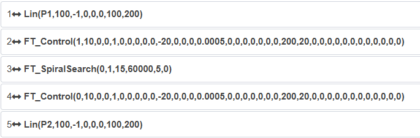

.. centered:: Figura 9.9-3 Programma Lua tipico configurato come "Errore"

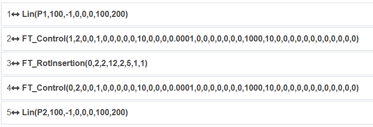

.. centered:: Figura 9.9-4 Programma Lua tipico configurato come "Avviso"

Comando registrazione coppia
++++++++++++++++++++++++++++++++++

Clicca sull'icona "Registrazione coppia" per accedere all'interfaccia di modifica comandi Torque.

Questa istruzione è per la registrazione della coppia, realizzando la funzione di rilevamento collisione con registrazione in tempo reale della coppia. Cliccare sul pulsante "Avvia registrazione coppia" per registrare continuamente la situazione di collisione durante l'esecuzione delle istruzioni di movimento, la coppia in tempo reale registrata viene utilizzata come valore teorico per il giudizio di rilevamento collisione, riducendo la probabilità di falsi allarmi. Quando si supera l'intervallo di soglia impostato, viene registrata la durata del rilevamento collisione. Cliccare sul pulsante "Ferma registrazione coppia" per interrompere la registrazione. Cliccare su "Reset registrazione coppia" per ripristinare lo stato predefinito.

.. image:: coding/137.png
   :width: 6in
   :align: center 

.. centered:: Grafico 9.9-5 Interfaccia istruzione Torque

Interfaccia istruzioni visione
~~~~~~~~~~~~~~~~~~~~~~~~~~~~~~~~~~~~~

.. image:: coding/138.png
   :width: 6in
   :align: center

.. centered:: Grafico 9.10 Interfaccia istruzioni visione

Comando visione 3D
++++++++++++++++++++++++++

Clicca sull'icona "Visione 3D" per accedere all'interfaccia di modifica comandi 3D.

Questa istruzione genera esempi di programmi per visione 3D, gli utenti possono fare riferimento ai programmi generati per lavorare con altri dispositivi di visione, includendo due esempi di riferimento per calibrazione fotocamera e presa fotocamera.

.. image:: coding/139.png
   :width: 6in
   :align: center

.. centered:: Grafico 9.10-1 Interfaccia istruzione 3D

Interfaccia istruzioni pallettizzazione
~~~~~~~~~~~~~~~~~~~~~~~~~~~~~~~~~~~~~~~~~~~~~~~~~

.. image:: coding/140.png
   :width: 6in
   :align: center

.. centered:: Grafico 9.11 Interfaccia istruzioni pallettizzazione

Comando movimento matrice
++++++++++++++++++++++++++++++++++

Clicca sull'icona "Movimento matrice" per accedere all'interfaccia di modifica comandi Pallet.

Questa istruzione genera programmi per pallettizzazione.

.. image:: coding/141.png
   :width: 6in
   :align: center

.. centered:: Grafico 9.11-1 Interfaccia istruzione Pallet

Questa funzione controlla il movimento regolare del braccio robotico impostando tre coordinate di punti e valori come righe, colonne, strati e altezza strato, applicabile a scenari comuni di pallettizzazione. Primo passo: selezionare la modalità di movimento del robot, "PTP" o "Linea"; secondo passo: impostare il percorso di movimento del robot, "Percorso da testa a coda" o "Percorso a zigzag"; terzo passo: impostare la modalità di impilamento, "Accumulo" o "Scarico".

.. image:: coding/142.png
   :width: 6in
   :align: center

.. centered:: Grafico 9.11‑2 Movimento matrice

Quarto passo: insegnare tre punti in base al percorso, il primo punto è l'inizio della prima riga, l'orientamento del braccio durante l'intero processo di movimento è determinato da questo punto; il secondo punto è la fine della prima riga; il terzo punto è la fine dell'ultima riga. Quinto passo: impostare il numero di righe e colonne; sesto passo: impostare il numero di strati e l'altezza di ogni strato.

.. image:: coding/143.png
   :width: 6in
   :align: center

.. centered:: Grafico 9.11‑3 Movimento matrice

Interfaccia istruzioni comunicazione
~~~~~~~~~~~~~~~~~~~~~~~~~~~~~~~~~~~~~~~~~~~~~~~~

.. image:: coding/144.png
   :width: 6in
   :align: center

.. centered:: Grafico 9.12 Interfaccia istruzioni comunicazione

Comando Modbus
++++++++++++++++

Clicca sull'icona "Modbus" per accedere all'interfaccia di modifica comandi Modbus.

Questa funzione è per la comunicazione bus basata sul protocollo ModbusTCP. Gli utenti possono controllare la comunicazione tra robot e client o server ModbusTCP (comunicazione master e slave) tramite istruzioni correlate, eseguendo operazioni di lettura/scrittura su bobine, ingressi discreti, registri.

.. image:: coding/145.png
   :width: 6in
   :align: center

.. centered:: Grafico 9.12-1 Interfaccia istruzione modbus master

.. image:: coding/146.png
   :width: 6in
   :align: center

.. centered:: Grafico 9.12-2 Interfaccia istruzione modbus slave

Per ulteriori funzionalità operative su ModbusTCP, contattateci per consulenza.

Comando Xmlrpc
++++++++++++++++

Clicca sull'icona "Xmlrpc" per accedere all'interfaccia di modifica comandi Xmlrpc.

XML-RPC è un metodo di chiamata di procedura remota che utilizza XML per trasmettere dati tra programmi tramite socket. Con questo metodo, il controller del robot può richiamare funzioni (con parametri) in programmi/servizi remoti e ottenere dati strutturati restituiti. Il controller del robot si occupa di tutti i dettagli della scrittura dei messaggi client XML-RPC e della conversione tra tipi di dati e XML.

.. image:: coding/147.png
   :width: 6in
   :align: center

.. centered:: Grafico 9.12-3 Interfaccia istruzione Xmlrpc

.. important:: 
  1) Il controller funge da client per connettersi a porte personalizzate remote;

  2) Il controller come client richiama funzioni remote;

  3) Supporta la chiamata a diverse funzioni remote;

  4) Supporta il passaggio di parametri array di stringhe e il ritorno di risultati array di caratteri, il numero di elementi dell'array è personalizzabile;

  Supporta il passaggio di parametri array di tipo double e il ritorno di risultati array di tipo double, il numero di elementi dell'array è personalizzabile;

::

   XmlrpcClientCall(serverUrl, methodName, tableType, param)

   serverUrl URL server, ad esempio: "http://192.168.58.29:50000/RPC2"

   methodName Nome funzione chiamata, "example.add"

   tableType 1-array di tipo double, 2-array di tipo string

   param Parametri funzione chiamata

::

   XmlrpcClientCall(error, result)

   error 0-nessun errore, 1-errore

   result Se i parametri passati sono array di tipo double, result è array di tipo double,

   se i parametri passati sono array di tipo string, result è array di tipo string

Interfaccia istruzioni ausiliarie
~~~~~~~~~~~~~~~~~~~~~~~~~~~~~~~~~~~~~~~~~

.. image:: coding/148.png
   :width: 6in
   :align: center

.. centered:: Grafico 9.13 Interfaccia istruzioni ausiliarie

Comando thread ausiliario
++++++++++++++++++++++++++++++++++++

Clicca sull'icona "Thread ausiliario" per accedere all'interfaccia di modifica dei comandi Thread.

Il comando Thread è una funzione per thread ausiliari che consente all'utente di definire un thread ausiliario che viene eseguito contemporaneamente al thread principale. Il thread ausiliario interagisce principalmente con dispositivi esterni per lo scambio di dati, supporta la comunicazione socket, l'acquisizione dello stato DI del robot, l'impostazione dello stato DO del robot, l'acquisizione delle informazioni sullo stato del robot e lo scambio di dati con il thread principale. Il thread principale utilizza i dati acquisiti dal thread ausiliario per valutare la logica di controllo del movimento del robot. Screenshot di esempio del programma utente:

.. image:: coding/149.png
   :width: 6in
   :align: center

.. centered:: Grafico 9.13-1 Esempio programma Thread

Comando chiamata funzione
++++++++++++++++++++++++++++++++++++++++++++

Clicca sull'icona "Chiamata funzione" per accedere all'interfaccia di modifica dei comandi Function.

Questa istruzione è un'interfaccia per la chiamata di funzioni, che fornisce all'utente le funzioni dell'interfaccia del robot da scegliere e avvisa l'utente sui parametri richiesti dalla funzione, facilitando la scrittura di istruzioni script. Ulteriori funzioni verranno aggiunte gradualmente.

.. image:: coding/150.png
   :width: 6in
   :align: center

.. centered:: Grafico 9.13-2 Interfaccia istruzione Function

Comando tabella punti
++++++++++++++++++++++++++++++

Clicca sull'icona "Tabella punti" per accedere all'interfaccia di modifica dei comandi PT-Mode.

Questa istruzione viene utilizzata principalmente per la commutazione tra la modalità di sistema e la modalità tabella punti, applicando i punti di insegnamento all'interno di diverse tabelle punti attraverso il cambio della tabella punti. Per i dettagli, fare riferimento al Capitolo 11 - Punti di insegnamento.

.. image:: coding/151.png
   :width: 6in
   :align: center

.. centered:: Grafico 9.13-3 Interfaccia istruzione tabella punti

Verifica programma insegnamento non salvato
~~~~~~~~~~~~~~~~~~~~~~~~~~~~~~~~~~~~~~~~~~~~~~~~~~~

Nella pagina di insegnamento del programma, dopo aver aperto/creato un programma, se il programma insegnamento è stato modificato senza salvare.

Se si clicca su "Apri", "Nuovo", "Esporta", "Rinomina" o altre operazioni sui file correlate, viene attivata una finestra di dialogo "Salvare questo programma?" con il messaggio "Il programma corrente è stato modificato, salvare le modifiche a questo programma?", come mostrato di seguito.

.. image:: coding/152.png
   :width: 6in
   :align: center

.. centered:: Grafico 9.14-1 Verifica programma pagina corrente non salvato

**Step1**: Cliccare sul pulsante "Non salvare", il programma viene ripristinato ai dati precedenti le modifiche e continua l'esecuzione dell'operazione sui file precedente.

**Step2**: Cliccare sul pulsante "Salva", il programma lua non salvato viene salvato con successo e continua l'esecuzione dell'operazione sui file precedente.

Quando si lascia la pagina di insegnamento del programma per passare ad altre pagine, viene attivato lo stesso prompt "Salvare questo programma?" e si rimane comunque nella pagina del programma insegnamento corrente, come mostrato di seguito.

.. image:: coding/153.png
   :width: 6in
   :align: center

.. centered:: Grafico 9.14-2 Verifica programma non salvato durante cambio pagina

**Step1**: Cliccare sul pulsante "Non salvare" per passare alla pagina selezionata in precedenza.

**Step2**: Cliccare sul pulsante "Salva", il programma lua non salvato viene salvato con successo e si passa alla pagina selezionata in precedenza.

Crittografia programma insegnamento
~~~~~~~~~~~~~~~~~~~~~~~~~~~~~~~~~~~~~~~~~~~~~~

I programmi di insegnamento possono essere crittografati o non crittografati. Il livello di crittografia è diviso in crittografia di livello uno e crittografia di livello due, con il livello uno che offre la massima protezione, seguito dal livello due.
Tutti i programmi di insegnamento vengono visualizzati e impostati sotto forma di tabella in "Impostazioni di sistema - Informazioni personalizzate". Sul lato destro della tabella è presente una spiegazione dei livelli di crittografia.

.. image:: coding/154.png
   :width: 6in
   :align: center

.. centered:: Grafico 9.15-1 Crittografia programma insegnamento

Quando un programma è in stato di crittografia di livello uno, dopo averlo aperto:
Le icone dei pulsanti corrispondenti nella barra delle operazioni come "Esporta", "Salva", "Salva con nome", "Copia", "Taglia", "Incolla", "Elimina", "Sposta su", "Sposta giù" e "Cambia modalità modifica" diventeranno grigie. Cliccare sulle icone non avrà effetto e verrà visualizzato un messaggio che informa che il programma corrente è in stato crittografato.
L'icona "Rinomina" del programma verrà nascosta.
La barra di aggiunta istruzioni e l'area di modifica del programma non saranno visibili e verrà visualizzato un messaggio che indica che è attiva la crittografia di livello uno.

.. image:: coding/155.png
   :width: 6in
   :align: center

.. centered:: Grafico 9.15-2 Interfaccia programma crittografia livello uno

Quando un programma è in stato di crittografia di livello due, dopo averlo aperto nella pagina "Insegnamento programma":
Le icone dei pulsanti corrispondenti nella barra delle operazioni come "Salva", "Copia", "Taglia", "Incolla", "Elimina", "Sposta su" e "Sposta giù" diventeranno grigie. Cliccare sulle icone non avrà effetto e verrà visualizzato un messaggio che informa che il programma corrente è in stato crittografato.
L'icona "Rinomina" del programma verrà nascosta.
La barra di aggiunta istruzioni non sarà visibile e verrà visualizzato un messaggio che indica che è attiva la crittografia di livello due.
L'area di modifica del programma può essere visualizzata normalmente per leggere il programma.

.. image:: coding/156.png
   :width: 6in
   :align: center

.. centered:: Grafico 9.15-3 Interfaccia programma crittografia livello due

Sia la crittografia di livello uno che di livello due supportano la funzione "Esporta". Durante l'importazione verrà eseguita un'operazione di verifica; se esiste un programma con lo stesso nome che è un file crittografato, l'operazione di importazione verrà interrotta e verrà visualizzato un messaggio che informa che non è possibile importare e sovrascrivere un programma crittografato.

.. image:: coding/157.png
   :width: 3in
   :align: center

.. centered:: Grafico 9.15-4 Importazione programma

Punti di insegnamento locali
~~~~~~~~~~~~~~~~~~~~~~~~~~~~~~~~~~~~~~~~~~~~~~

I punti di insegnamento locali sono associati al programma di insegnamento corrente. Quando si aggiungono comandi di programma, possono essere applicati solo al programma di insegnamento corrente, non ad altri programmi di insegnamento.

**Aggiungi**: Cliccare sull'icona "Aggiungi punto di insegnamento locale" all'estrema destra del nome del file del programma per aggiungere un punto di insegnamento locale. (Per i dettagli sui punti di insegnamento locali, consultare la registrazione dei punti di insegnamento nelle operazioni del robot)

.. image:: coding/158.png
   :width: 6in
   :align: center

.. centered:: Grafico 9.16-1 Aggiungi punto di insegnamento locale

**Elimina**: Cliccare sulla colonna del numero di serie nella tabella per selezionare il punto di insegnamento locale da eliminare, quindi cliccare sull'icona "Elimina" in alto a destra del titolo dei punti di insegnamento locali per eliminare il punto di insegnamento locale.

.. image:: coding/159.png
   :width: 6in
   :align: center

.. centered:: Grafico 9.16-2 Elimina punto di insegnamento locale

**Esegui**: Cliccare sull'icona "Avvia esecuzione" nella colonna delle operazioni dei dati della tabella dei punti di insegnamento locali per eseguire un singolo punto di insegnamento locale, spostando il robot nella posizione di quel punto.

.. image:: coding/160.png
   :width: 6in
   :align: center

.. centered:: Grafico 9.16-3 Esegui punto di insegnamento locale

**Dettagli**: Cliccare sull'icona "Dettagli" nella colonna delle operazioni dei dati della tabella dei punti di insegnamento locali per visualizzare i dettagli del punto di insegnamento locale.

.. image:: coding/161.png
   :width: 3in
   :align: center

.. centered:: Grafico 9.16-4 Dettagli punto di insegnamento locale

Backup programma corrente
~~~~~~~~~~~~~~~~~~~~~~~~~~~~~~

Dopo che l'utente modifica e salva un programma di insegnamento, viene attivata la funzione "Backup" del programma corrente (il periodo di backup è di 1 anno), salvando il contenuto iniziale del programma corrente e visualizzandolo a destra, facilitando il confronto delle modifiche apportate dall'utente.
L'utente può selezionare una data per visualizzare il contenuto del backup del programma corrispondente e cliccare sull'icona "Elimina" in alto a destra per eliminare il contenuto del backup del programma corrente. Il contenuto del backup del programma corrente può essere solo visualizzato, non modificato.

.. image:: coding/162.png
   :width: 6in
   :align: center

.. centered:: Grafico 9.17 Backup programma corrente

Comunicazione Modbus TCP
~~~~~~~~~~~~~~~~~~~~~~~~~~~~~~~~~
ModbusTCP è un protocollo di comunicazione comunemente utilizzato nella produzione industriale. Il robot collaborativo Faro fornisce due modalità per comunicare con i vostri dispositivi: ModbusTCP master e ModbusTCP slave.

Il robot collaborativo supporta fino a 8 master ModbusTCP che comunicano contemporaneamente con dispositivi esterni, ciascuno dei quali supporta fino a 128 registri; lo slave ModbusTCP del robot collaborativo dispone di 128 bobine (coil), 128 ingressi discreti (discrete input), 64 registri di mantenimento (holding register) e 64 registri di input (input register) (i tipi di dati dei registri di mantenimento e di input includono tre tipi: senza segno, con segno e a virgola mobile). Inoltre, alcuni indirizzi dei registri di input dello slave ModbusTCP del robot sono dedicati a fornire informazioni come la posizione articolare corrente del robot, la velocità di movimento, ecc., mentre alcuni indirizzi dei registri delle bobine sono dedicati a controllare l'avvio del programma, l'arresto del programma, l'impostazione dei DO della scatola di controllo, ecc.

Lo slave ModbusTCP del robot supporta la connessione con un solo master; il robot può funzionare contemporaneamente come master e slave per comunicare con diversi dispositivi. Di seguito viene descritto l'uso dettagliato.

ModbusTCP master
+++++++++++++++++

Prima di utilizzare il robot collaborativo come master ModbusTCP per comunicare con il vostro dispositivo, verificare la connessione di rete tra il vostro dispositivo e il robot e confermare che le interfacce di rete siano sulla stessa sottorete.

L'utilizzo del master ModbusTCP del robot comprende i seguenti passaggi:

- Aggiunta di un master;
- Aggiunta di registri;
- Test di comunicazione;
- Scrittura del programma utente;
- Esecuzione del programma utente.

Aggiunta master ModbusTCP
************************************

Aprire WebApp, cliccare in sequenza su "Insegnamento simulato", "Insegnamento programma", creare un nuovo programma utente "testModbusMaster.lua".

.. image:: coding/163.png
   :width: 6in
   :align: center

.. centered:: Grafico 9.18-1 Creazione programma utente master ModbusTCP

Cliccare sul pulsante "Impostazioni ModbusTCP" per aprire la pagina di configurazione della funzione ModbusTCP.

.. image:: coding/164.png
   :width: 6in
   :align: center

.. centered:: Grafico 9.18-2 Apertura impostazioni ModbusTCP

Cliccare in sequenza su "Impostazioni master", "Aggiungi master Modbus" per completare l'aggiunta di un master ModbusTCP.

.. image:: coding/165.png
   :width: 6in
   :align: center

.. centered:: Grafico 9.18-3 Aggiunta "Master ModbusTCP"

Inserire in sequenza "Nome", "IP slave", "Porta", "Numero slave", "Periodo comunicazione" e "Tempo di timeout" in base alla situazione del vostro dispositivo. Il significato specifico di questi parametri è il seguente:

**Nome**: Nome del master ModbusTCP del robot. Il robot supporta la creazione di un massimo di 8 master per stabilire connessioni con slave corrispondenti; diversi master possono essere distinti impostando nomi univoci, come "PLC", "Fotocamera", "Scheda acquisizione dati", "FRRobot1", ecc.;

**IP slave**: Indirizzo IP dello slave a cui il master ModbusTCP del robot deve connettersi;

.. note:: È necessario collegare prima il robot e il dispositivo slave tramite cavo di rete e assicurarsi che gli indirizzi IP del robot e del dispositivo slave siano sulla stessa sottorete.

**Porta**: Porta dello slave ModbusTCP a cui connettersi;

**Numero slave**: Numero dello slave ModbusTCP a cui connettersi;

**Periodo comunicazione**: Periodo (ms) in cui il master ModbusTCP del robot interroga lo stato dello slave; questo periodo influisce solo sulla velocità di aggiornamento dei dati del registro slave nella pagina "Impostazioni ModbusTCP", non sulla velocità di lettura o scrittura dei valori del registro slave ModbusTCP nel programma lua dell'utente.

**Tempo di timeout**: Quando si richiama l'interfaccia di lettura/scrittura ModbusTCP per un'operazione, se il sistema non riesce a connettersi entro il tempo di timeout, verrà segnalato un errore di mancata connessione Modbus. Unità: ms, intervallo valido: 100-60000.

.. image:: coding/166.png
   :width: 6in
   :align: center

.. centered:: Grafico 9.18-4 Impostazione parametri master ModbusTCP

Dopo aver inserito correttamente i parametri di cui sopra, il master ModbusTCP del robot stabilisce automaticamente una connessione con lo slave configurato. Dopo il successo della connessione, l'indicatore di stato "Stato connessione" nella pagina si accende.

.. note:: 
   Se avete confermato di aver configurato correttamente i parametri relativi al master ModbusTCP, ma il robot non si è connesso con successo al vostro dispositivo, controllare le seguenti configurazioni:
   
   ① Connessione fisica di rete tra robot e dispositivo slave;

   ② Il robot ha due porte di rete fisiche (teach pendant e control box) con indirizzi IP diversi; assicurarsi di essere collegati alla porta di rete corretta;

   ③ Confermare che la porta di rete del robot e la porta di rete del dispositivo slave siano sulla stessa sottorete, ad esempio, se l'indirizzo IP del robot è 192.168.58.2, l'indirizzo IP del dispositivo slave deve essere compreso tra 192.168.58.0 e 192.168.58.255 e non può essere uguale all'indirizzo IP del robot;
   
   ④ Verificare che la porta del dispositivo slave corrisponda alla porta impostata. Se l'indicatore di stato della connessione lampeggia, significa che ci sono errori negli indirizzi dei registri in questo master; controllare che il tipo e l'indirizzo del registro siano corretti.

.. image:: coding/167.png
   :width: 6in
   :align: center

.. centered:: Grafico 9.18-5 Stato connessione master ModbusTCP

A questo punto abbiamo completato la creazione di un master ModbusTCP del robot. Se cliccate nuovamente su "Aggiungi master Modbus", potrete creare un nuovo master ModbusTCP. Il robot supporta fino a 8 master che comunicano contemporaneamente con dispositivi esterni. Fare doppio clic sul pulsante "Elimina" in alto a destra del master Modbus per eliminare tale master Modbus.

.. image:: coding/168.png
   :width: 6in
   :align: center

.. centered:: Grafico 9.18-6 Aggiunta successiva master ModbusTCP

Aggiunta registri master ModbusTCP
*******************************************

Cliccare sul pulsante "Aggiungi registro master" per aggiungere un registro a questo master.

.. image:: coding/169.png
   :width: 6in
   :align: center

.. centered:: Grafico 9.18-7 Aggiunta registro master ModbusTCP

Selezionare in sequenza il tipo di registro master, inserire il numero di indirizzo e il nome. Il significato dei parametri è il seguente:

**Tipo**: Tipo di registro; DI - ingresso discreto; DO - bobina; AI senza segno - registro di input senza segno (0-65535); AI con segno - registro di input con segno (-32768-32767); AI virgola mobile - registro di input a virgola mobile (i dati del registro a virgola mobile hanno una lunghezza di 32 bit, occupando due registri con segno o senza segno); AO senza segno - registro di mantenimento senza segno (0-65535); AO con segno - registro di mantenimento con segno (-32768-32767); AO virgola mobile - registro di mantenimento a virgola mobile (i dati del registro a virgola mobile hanno una lunghezza di 32 bit, occupando due registri con segno o senza segno); tra questi, i registri a virgola mobile in AI e AO vengono visualizzati in formato big-endian;

**Numero indirizzo**: Indirizzo del registro slave ModbusTCP da leggere o scrivere;

**Nome**: Alias del registro. Il master ModbusTCP del robot può impostare un massimo di 128 registri diversi; ciascun registro può essere distinto impostando nomi diversi in base al significato effettivo, come "Inizio", "Servo pronto", "Livello liquido", ecc.

.. image:: coding/170.png
   :width: 6in
   :align: center

.. centered:: Grafico 9.18-8 Impostazione parametri registro master ModbusTCP

Cliccando nuovamente sul pulsante "Aggiungi registro master" è possibile aggiungere un altro registro master; facendo doppio clic sul pulsante "Elimina" a destra del registro, è possibile eliminare tale registro. Di seguito viene mostrato un esempio in cui è stato aggiunto un registro per ciascun tipo.

.. note:: Se, dopo aver aggiunto un registro master, l'indicatore di stato della connessione master lampeggia, significa che l'indirizzo del registro master non può essere letto; verificare che il tipo e l'indirizzo del registro siano corretti.

.. image:: coding/171.png
   :width: 6in
   :align: center

.. centered:: Grafico 9.18-9 Aggiunta multipli registri master

Test comunicazione master ModbusTCP
***************************************

Prima del test di comunicazione, verificare che l'indicatore "Stato connessione" del master ModbusTCP sia acceso in modo costante; se l'indicatore è acceso, significa che la connessione corrente è riuscita.

I registri del master Modbus del robot hanno una casella di valore "Valore indirizzo" per visualizzare il valore corrente del registro. Tra questi, i registri di tipo DI (ingresso discreto) e AI (registro di input) sono di sola lettura e le corrispondenti caselle di valore indirizzo sono grigie e non modificabili.

Quando il valore nell'indirizzo corrispondente dello slave cambia, il valore indirizzo del registro corrispondente del master del robot viene aggiornato per visualizzare il valore corrente. I registri DO (bobina) e AO (registro di mantenimento) sono registri leggibili e scrivibili, quindi le loro caselle di valore indirizzo sono bianche e modificabili; possono leggere i valori del registro corrispondente dello slave ModbusTCP e anche modificare il valore del registro nella pagina delle impostazioni del master Modbus del robot.

.. image:: coding/172.png
   :width: 6in
   :align: center

.. centered:: Grafico 9.18-10 Valori indirizzo master Modbus

1. Monitoraggio valori registri master DI e AI

Sul dispositivo slave ModbusTCP esterno, impostare il valore dell'indirizzo 255 del registro DI (ingresso discreto) a 1, modificare il valore dell'indirizzo 257 del registro AI (registro di input) a 123, il valore dell'indirizzo 258 a -123 e il valore dell'indirizzo 259 a 123.3. In questo momento, il valore indirizzo del registro corrispondente nella pagina delle impostazioni del master Modbus del robot verrà visualizzato di conseguenza.

.. note:: 
   Poiché il registro all'indirizzo 259 è un registro a virgola mobile, esso occupa effettivamente due registri a 16 bit (259 e 260) per memorizzare un numero in virgola mobile. Pertanto, non è possibile impostare separatamente un registro per operare sul registro AI 260, altrimenti si verificherebbe un errore di valore.

.. image:: coding/173.png
   :width: 6in
   :align: center

.. centered:: Grafico 9.18-11 Visualizzazione valori registri DI e AI master Modbus

2. Scrittura valori registri master DO e AO

Nella pagina delle impostazioni del master Modbus del robot, inserire 1 nella casella di input del valore dell'indirizzo 255 del registro DO (bobina) con nome "Inizio", e inserire rispettivamente 65535, -32768 e 128.78 nelle caselle di input dei valori degli indirizzi 260, 261 e 262 dei registri AO (registro di mantenimento) con nomi "Posizione obiettivo A", "Posizione obiettivo B" e "Posizione obiettivo C". In questo momento, i valori corrispondenti sono stati scritti negli indirizzi dei registri corrispondenti dello slave Modbus.

.. image:: coding/174.png
   :width: 6in
   :align: center

.. centered:: Grafico 9.18-12 Scrittura registri DO e AO master Modbus

3. Monitoraggio valori registri master DO e AO

Quando si modificano i valori dei registri DO (bobina) e AO (registro di mantenimento) nello slave ModbusTCP, i valori degli indirizzi dei registri nella pagina delle impostazioni del master ModbusTCP non vengono aggiornati immediatamente; è necessario cliccare sul pulsante "Aggiorna" in alto a destra della configurazione del master. Solo allora i valori degli indirizzi dei registri DO e AO nella pagina verranno aggiornati.

.. image:: coding/175.png
   :width: 6in
   :align: center

.. centered:: Grafico 9.18-13 Aggiornamento valori indirizzi DO e AO master ModbusTCP

Scrittura programma master ModbusTCP
+++++++++++++++++++++++++++++++++++++++++++++++

Cliccare in sequenza su "Istruzioni comunicazione" per aprire la pagina di aggiunta istruzioni di comunicazione.

.. image:: coding/176.png
   :width: 6in
   :align: center

.. centered:: Grafico 9.18-14 Apertura pagina aggiunta istruzioni comunicazione

Cliccare su "Modbus".

.. image:: coding/177.png
   :width: 6in
   :align: center

.. centered:: Grafico 9.18-15 Selezione Modbus

Cliccare su "Modbus_TCP".

.. image:: coding/178.png
   :width: 6in
   :align: center

.. centered:: Grafico 9.18-16 Selezione Modbus_TCP
   
Selezionare "Master (client)" per aprire la pagina di aggiunta istruzioni master ModbusTCP.

.. image:: coding/179.png
   :width: 6in
   :align: center

.. centered:: Grafico 9.18-17 Aggiunta istruzioni master ModbusTCP

1. Scrittura singola uscita digitale DO (bobina)

Selezionare "Nome master Modbus" come il master "PLC" aggiunto in precedenza nella pagina delle impostazioni del master Modbus, nome DO come "Inizio", numero registri 1, valore registro 1, cliccare sul pulsante "Scrivi uscita digitale". Infine, scorrere fino alla fine della pagina e cliccare sul pulsante "Applica".

.. image:: coding/180.png
   :width: 6in
   :align: center

.. centered:: Grafico 9.18-18 Aggiunta scrittura singola uscita digitale

A questo punto, il programma robot "testModbusMaster.lua" ha aggiunto un'istruzione di scrittura singola uscita digitale del master Modbus del robot. Passare il robot in modalità automatica, cliccare sul pulsante di avvio, il robot scriverà il valore dell'indirizzo del registro bobina "Avvio" corrispondente al master "PLC" a 1.

.. image:: coding/181.png
   :width: 6in
   :align: center

.. centered:: Grafico 9.18-19 Programma LUA scrittura singola bobina

2. Scrittura multiple uscite digitali DO (bobina)

Aprire la pagina di aggiunta istruzioni master ModbusTCP, selezionare "Nome master Modbus" come il master "PLC" aggiunto in precedenza nella pagina delle impostazioni del master Modbus, nome DO come "Inizio", numero registri 5, valori registro 1,0,1,0,1, dove il numero di valori registro deve corrispondere al numero di registri impostato e i valori multipli devono essere separati da virgole inglesi, cliccare sul pulsante "Scrivi uscita digitale". Infine, scorrere fino alla fine della pagina e cliccare sul pulsante "Applica".

.. image:: coding/182.png
   :width: 6in
   :align: center

.. centered:: Grafico 9.18-20 Configurazione scrittura multiple uscite digitali

A questo punto, il programma robot "testModbusMaster.lua" ha aggiunto un'istruzione di scrittura multiple uscite digitali del master Modbus del robot. Passare il robot in modalità automatica, cliccare sul pulsante di avvio, il robot scriverà rispettivamente i valori 1, 0, 1, 0, 1 nel registro bobina "Avvio" del master "PLC" e nei successivi 4 registri bobina.
   
.. image:: coding/183.png
   :width: 6in
   :align: center

.. centered:: Grafico 9.18-21 Programma LUA scrittura multiple bobine

3. Lettura singola uscita digitale DO (bobina)
   
Aprire la pagina di aggiunta istruzioni master ModbusTCP, selezionare "Nome master Modbus" come il master "PLC" aggiunto in precedenza nella pagina delle impostazioni del master Modbus, nome DO come "Inizio", numero registri 1, non è necessario inserire il valore registro, cliccare su "Leggi uscita digitale". Infine, scorrere fino alla fine della pagina e cliccare sul pulsante "Applica".
   
.. image:: coding/184.png
   :width: 6in
   :align: center

.. centered:: Grafico 9.18-22 Configurazione lettura singola uscita digitale

A questo punto, il programma robot "testModbusMaster.lua" ha aggiunto un'istruzione di lettura singola uscita digitale del master Modbus del robot.
      
.. image:: coding/185.png
   :width: 6in
   :align: center

.. centered:: Grafico 9.18-23 Programma lettura singola bobina

Di solito, dopo aver letto un registro Modbus, il valore letto viene memorizzato in una variabile; quindi, è necessario definire una variabile per memorizzare il valore letto. Cliccare sul pulsante "Cambia modalità" per passare il programma lua del robot in stato modificabile, scrivere e aggiungere la variabile di ritorno "startValue" prima dell'istruzione "ModbusMasterReadDO". Dopo l'esecuzione del programma, il valore letto verrà memorizzato in "startValue".
      
.. image:: coding/186.png
   :width: 6in
   :align: center

.. centered:: Grafico 9.18-24 Memorizzazione lettura singola uscita digitale in variabile

Il valore del registro di tipo bobina ha solo due valori: 0 e 1. Nel programma del robot, è possibile eseguire operazioni diverse giudicando in base al valore del registro. Cliccare sul pulsante "Cambia modalità" per passare il programma di insegnamento del robot in modalità non modificabile, aggiungere due istruzioni di movimento articolare per muoversi rispettivamente a due punti diversi "P1" e "P2".
      
.. image:: coding/187.png
   :width: 6in
   :align: center

.. centered:: Grafico 9.18-25 Aggiunta istruzioni movimento a punti diversi

Passare nuovamente il programma in modalità modificabile e scrivere la condizione di giudizio per il valore bobina "startValue". Quando il valore di "startValue" è 1, il robot si muove al punto "P1", altrimenti si muove al punto "P2".
      
.. image:: coding/188.png
   :width: 6in
   :align: center

.. centered:: Grafico 9.18-26 Movimento a punti diversi in base al valore bobina

Infine, passare nuovamente il programma del robot in modalità non modificabile, passare il robot in modalità automatica e, dopo aver confermato la sicurezza, avviare il programma. Poiché le prime due righe di questo programma impostano entrambe il valore DO bobina con nome "Inizio" a 1, dopo l'esecuzione del programma, il robot si muoverà al punto "P1".
      
.. image:: coding/189.png
   :width: 6in
   :align: center

.. centered:: Grafico 9.18-27 Lettura valore singolo registro bobina e movimento

4. Lettura multiple uscite digitali DO (bobina)

Aprire la pagina di aggiunta istruzioni master ModbusTCP, selezionare "Nome master Modbus" come il master "PLC" aggiunto in precedenza nella pagina delle impostazioni del master Modbus, nome DO come "Inizio", numero registri 6, non è necessario inserire il valore registro, cliccare su "Leggi uscita digitale". Infine, scorrere fino alla fine della pagina e cliccare sul pulsante "Applica".
      
.. image:: coding/190.png
   :width: 6in
   :align: center

.. centered:: Grafico 9.18-28 Configurazione lettura multiple uscite digitali

A questo punto, il programma robot "testModbusMaster.lua" ha aggiunto un'istruzione di lettura multiple uscite digitali del master Modbus del robot.
         
.. image:: coding/191.png
   :width: 6in
   :align: center

.. centered:: Grafico 9.18-29 Programma lettura multiple uscite digitali

Cliccare sul pulsante "Cambia modalità" per passare il programma lua del robot in stato modificabile. Poiché il numero di letture è 6, è necessario scrivere e aggiungere 6 variabili di ritorno "value1,value2,value3,value4,value5,value6" prima dell'istruzione "ModbusMasterReadDO". Dopo l'esecuzione del programma, i 6 valori del registro letti verranno memorizzati rispettivamente nelle 6 variabili sopra indicate; allo stesso modo, è possibile giudicare i valori di "value1" ~ "value6" per far eseguire azioni diverse al robot.
         
.. image:: coding/192.png
   :width: 6in
   :align: center

.. centered:: Grafico 9.18-30 Memorizzazione lettura multiple uscite digitali in variabili

5. Lettura ingresso digitale DI (ingresso discreto)

Aprire la pagina di aggiunta istruzioni master ModbusTCP, selezionare "Nome master Modbus" come il master "PLC" aggiunto in precedenza nella pagina delle impostazioni del master Modbus, nome DI come "Servo pronto", numero registri 2, cliccare su "Leggi ingresso digitale". Infine, scorrere fino alla fine della pagina e cliccare sul pulsante "Applica".
         
.. image:: coding/193.png
   :width: 6in
   :align: center

.. centered:: Grafico 9.18-31 Configurazione lettura ingresso digitale

A questo punto, il programma robot "testModbusMaster.lua" ha aggiunto un'istruzione di lettura ingresso digitale del master Modbus del robot.
            
.. image:: coding/194.png
   :width: 6in
   :align: center

.. centered:: Grafico 9.18-32 Istruzione programma lettura ingresso digitale

Cliccare sul pulsante "Cambia modalità" per passare il programma lua del robot in stato modificabile, scrivere le variabili di ritorno "state1,state2" prima dell'istruzione "ModbusMasterReadDO". Dopo l'esecuzione del programma, i due valori di ingresso digitale letti verranno memorizzati rispettivamente nelle variabili "state1" e "state2"; è possibile giudicare i valori delle variabili per controllare il robot nell'esecuzione di operazioni diverse.
            
.. image:: coding/195.png
   :width: 6in
   :align: center

.. centered:: Grafico 9.18-33 Memorizzazione lettura ingresso digitale in variabili

6. Operazioni di lettura/scrittura per ingressi analogici AI (registri di input) e uscite analogiche AO (registri di mantenimento)

Le operazioni di lettura/scrittura per gli ingressi analogici AI (registri di input) e le uscite analogiche AO (registri di mantenimento) sono sostanzialmente le stesse di quelle per gli ingressi digitali DI (ingressi discreti) e le uscite digitali DO (bobine). La differenza è che l'intervallo di dati di questi ultimi è limitato a 0 o 1, mentre quello dei primi è più ampio. Pertanto, per le operazioni specifiche, fare riferimento alla scrittura dei programmi per ingressi digitali e uscite digitali. Qui vengono mostrati solo esempi di programma per la lettura dell'ingresso analogico AI e le operazioni di lettura/scrittura per l'uscita analogica AO.
            
.. image:: coding/196.png
   :width: 6in
   :align: center

.. centered:: Grafico 9.18-34 Lettura ingresso analogico AI
            
.. image:: coding/197.png
   :width: 6in
   :align: center

.. centered:: Grafico 9.18-35 Lettura/scrittura uscita analogica AO

7. Attesa ingresso digitale

Aprire la pagina di aggiunta istruzioni master ModbusTCP, trovare "Impostazione attesa ingresso digitale", ovvero l'impostazione di attesa per l'ingresso discreto DI, selezionare il nome DI come il registro configurato "Servo pronto", stato di attesa "True", tempo di timeout 5000ms. Cliccare sul pulsante "Aggiungi", infine cliccare sul pulsante "Applica".
            
.. image:: coding/198.png
   :width: 6in
   :align: center

.. centered:: Grafico 9.18-36 Aggiunta istruzione attesa ingresso DI

A questo punto, il programma robot "testModbusMaster.lua" ha aggiunto un'istruzione di attesa ingresso digitale DI del master Modbus del robot. Dopo l'avvio del programma, il robot attenderà continuamente che il valore del registro "Servo pronto" del master "PLC" diventi true, ovvero il valore numerico 1. Poiché il tempo di timeout impostato è di 5 secondi, se dopo 5 secondi di attesa il segnale "Servo pronto" è ancora 0, il programma del robot segnalerà un errore di timeout e si fermerà automaticamente.
            
.. image:: coding/199.png
   :width: 6in
   :align: center

.. centered:: Grafico 9.18-37 Programma attesa ingresso digitale DI

8. Attesa ingresso analogico

Aprire la pagina di aggiunta istruzioni master ModbusTCP, trovare "Impostazione attesa ingresso analogico", ovvero l'impostazione di attesa per il registro di input AI, selezionare il nome AI come il registro configurato "Livello liquido", stato di attesa ">", valore registro 255, tempo di timeout 5000ms. Cliccare sul pulsante "Aggiungi", infine cliccare sul pulsante "Applica".
            
.. image:: coding/200.png
   :width: 6in
   :align: center

.. centered:: Grafico 9.18-38 Aggiunta attesa ingresso analogico

A questo punto, il programma robot "testModbusMaster.lua" ha aggiunto un'istruzione di attesa valore registro di input AI del master Modbus del robot. Dopo l'avvio del programma, il robot attenderà continuamente che il valore del registro "Livello liquido" del master "PLC" sia maggiore di 255. Poiché il tempo di timeout impostato è di 5 secondi, se dopo 5 secondi di attesa il segnale "Livello liquido" non è ancora maggiore di 255, il programma del robot segnalerà un errore di timeout e si fermerà automaticamente.
            
.. image:: coding/201.png
   :width: 6in
   :align: center

.. centered:: Grafico 9.18-39-1 Programma attesa registro di input AI

Aprire la pagina di aggiunta istruzioni master ModbusTCP, trovare "Impostazione attesa ingresso analogico", ovvero l'impostazione di attesa per il registro di input AI, selezionare il nome AI come il registro configurato "Livello liquido", stato di attesa "=", valore registro 255, tempo di timeout 5000ms. Cliccare sul pulsante "Aggiungi", infine cliccare sul pulsante "Applica".
            
.. image:: coding/494.png
   :width: 6in
   :align: center

.. centered:: Grafico 9.18-39-2 Aggiunta attesa ingresso analogico

A questo punto, il programma robot "test.lua" ha aggiunto un'istruzione di attesa valore registro di input AI del master Modbus del robot. Dopo l'avvio del programma, il robot attenderà continuamente che il valore del registro "Livello liquido" del master "PLC" sia uguale a 255. Poiché il tempo di timeout impostato è di 5 secondi, se dopo 5 secondi di attesa il segnale "Livello liquido" non è ancora uguale a 255, il programma del robot segnalerà un errore di timeout e si fermerà automaticamente.

ModbusTCP slave
++++++++++++++++++

Lo slave ModbusTCP del robot fornisce quattro tipi di registri: uscite digitali universali (bobine), ingressi digitali universali (ingressi discreti), ingressi analogici universali (registri di mantenimento) e uscite analogiche universali (registri di input). Tra questi, gli ingressi digitali e analogici universali sono utilizzati principalmente dal robot per leggere i dati del master ModbusTCP esterno, controllando così le operazioni del robot; mentre le uscite digitali e analogiche universali sono utilizzate principalmente dal robot per inviare segnali dati al dispositivo master ModbusTCP esterno, che legge i valori dei registri corrispondenti per controllare il funzionamento del proprio dispositivo. Oltre agli ingressi/uscite universali di cui sopra, il robot fornisce anche alcuni "Ingressi digitali funzionali (bobine)" per consentire al dispositivo master esterno di controllare l'avvio del programma, l'arresto del programma, ecc., e alcuni registri di input per visualizzare le informazioni sullo stato corrente del robot, inclusa la posizione cartesiana corrente del robot, lo stato di esecuzione corrente del robot, ecc. (per la definizione specifica, consultare Allegato 1: Tabella mappatura indirizzi slave ModbusTCP). Il processo di utilizzo dello slave ModbusTCP del robot include principalmente: ① configurazione dei parametri; ② test di comunicazione; ③ scrittura del programma.

Configurazione parametri comunicazione slave ModbusTCP
*******************************************************************

Aprire WebApp, cliccare in sequenza su "Insegnamento simulato", "Insegnamento programma", creare un nuovo programma utente "testModbusSlave.lua".
            
.. image:: coding/202.png
   :width: 6in
   :align: center

.. centered:: Grafico 9.18-40 Creazione programma utente slave ModbusTCP

Cliccare sul pulsante "Impostazioni ModbusTCP" per aprire la pagina di configurazione della funzione ModbusTCP.
            
.. image:: coding/203.png
   :width: 6in
   :align: center

.. centered:: Grafico 9.18-41 Apertura impostazioni ModbusTCP

Cliccare in sequenza su "Impostazioni slave", inserire l'IP, la porta e il numero slave dello slave del robot. "IP" è l'indirizzo IP dello slave del robot. Il robot collaborativo Faro ha due porte di rete (teach pendant e control box) con indirizzi IP diversi; inserire l'indirizzo IP corretto in base alla porta di rete a cui è collegato lo slave del dispositivo esterno (si consiglia di utilizzare la porta di rete sulla control box). Dopo aver modificato l'indirizzo IP, la porta o il numero slave dello slave ModbusTCP del robot, è necessario riavviare il robot per rendere effettive le modifiche.
            
.. image:: coding/204.png
   :width: 6in
   :align: center

.. centered:: Grafico 9.18-42 Impostazioni slave ModbusTCP

Dopo aver completato l'impostazione dei parametri dello slave ModbusTCP e aver riavviato il robot, il dispositivo master esterno può stabilire una connessione con lo slave del robot tramite i parametri impostati. Dopo il successo della connessione, l'indicatore di stato "Stato connessione" nella pagina delle impostazioni dello slave del robot si accenderà.
            
.. image:: coding/205.png
   :width: 6in
   :align: center

.. centered:: Grafico 9.18-43 Indicatore stato connessione slave

Test comunicazione slave ModbusTCP
*****************************************************************

1. Ingresso digitale universale (bobina)

Lo slave ModbusTCP del robot fornisce 128 registri bobina, i cui indirizzi di registro sono 100~127.

.. note:: Per la definizione specifica, consultare Allegato 1: Tabella mappatura indirizzi slave ModbusTCP.

I registri universali dello slave ModbusTCP del robot possono impostare alias. Modificare il nome del registro bobina DI0 dello slave del robot in "A pronto" e DI1 in "B pronto". Secondo la tabella di mappatura degli indirizzi, gli indirizzi Modbus bobina per "A pronto" e "B pronto" sono rispettivamente 100 e 101. Sul dispositivo master ModbusTCP esterno, impostare entrambi gli indirizzi dei registri bobina 100 e 101 dello slave del robot a 1. A questo punto, gli indicatori dei due registri nella pagina di monitoraggio dello slave ModbusTCP del robot si accenderanno.
            
.. image:: coding/206.png
   :width: 6in
   :align: center

.. centered:: Grafico 9.18-44 Monitoraggio stato bobina slave ModbusTCP

2. Uscita digitale universale (ingresso discreto)

Lo slave ModbusTCP del robot fornisce 128 registri di ingresso discreto, i cui indirizzi di registro sono 100~127.

.. note:: Per la definizione specifica, consultare Allegato 1: Tabella mappatura indirizzi slave ModbusTCP.

Anche i registri di ingresso discreto dello slave ModbusTCP del robot possono impostare alias. Cliccare su "Uscita digitale universale (ingresso discreto)", modificare il nome del registro di ingresso discreto DO0 dello slave del robot in "A avvio" e DO1 in "B avvio". Secondo la tabella di mappatura degli indirizzi, gli indirizzi Modbus di ingresso discreto per "A avvio" e "B avvio" sono rispettivamente 100 e 101. Cliccare sull'indicatore di ingresso discreto corrispondente a "A avvio", l'indicatore si accenderà, il valore dell'indirizzo del registro corrispondente 100 diventerà 1 e il dispositivo master ModbusTCP esterno potrà leggere il valore di questo registro.

.. image:: coding/207.png
   :width: 6in
   :align: center

.. centered:: Grafico 9.18-45 Controllo ingresso discreto slave ModbusTCP

3. Ingresso analogico (registro di mantenimento)

Il robot fornisce un totale di 64 registri di mantenimento di tre tipi: senza segno, con segno e a virgola mobile. Gli indirizzi di AI0~AI63 sono 100~195

.. note:: text
   Per la definizione specifica, consultare Allegato 1: Tabella mappatura indirizzi slave ModbusTCP. L'intervallo dei dati per i registri senza segno è 0~65535, per i registri con segno è -32768~32767 e i registri a virgola mobile vengono visualizzati in formato big-endian.
   
   Modificare i nomi di AI0 e AI1 rispettivamente in "Tensione" e "Corrente". Dalla tabella di mappatura degli indirizzi dello slave ModbusTCP, gli indirizzi dei due registri sono rispettivamente 100 e 101. Pertanto, quando il dispositivo master collegato modifica i valori degli indirizzi dei registri di mantenimento 100 e 101, la pagina di monitoraggio dello slave ModbusTCP del robot aggiornerà e visualizzerà di conseguenza i valori degli indirizzi dei registri "Tensione" e "Corrente". L'ingresso analogico del robot viene utilizzato principalmente per leggere segnali numerici dal dispositivo master esterno.

.. image:: coding/208.png
   :width: 6in
   :align: center

.. centered:: Grafico 9.18-46 Monitoraggio ingresso analogico slave ModbusTCP

4. Uscita analogica (registro di input)

Il robot fornisce un totale di 64 registri di input di tre tipi: senza segno, con segno e a virgola mobile. Gli indirizzi di AO0~AO63 sono 100~195
   
.. note:: text
   Per la definizione specifica, consultare Allegato 1: Tabella mappatura indirizzi slave ModbusTCP. L'intervallo dei dati per i registri senza segno è 0~65535, per i registri con segno è -32768~32767 e i registri a virgola mobile vengono visualizzati in formato big-endian.
   
   Modificare i nomi di AO0 e AO1 rispettivamente in "Posizione obiettivo A" e "Posizione obiettivo B", i valori dei registri di input sono rispettivamente 2000 e 1500. Dalla tabella di mappatura degli indirizzi dello slave ModbusTCP, gli indirizzi dei due registri sono rispettivamente 100 e 101. Pertanto, quando il dispositivo master collegato legge i valori degli indirizzi dei registri di input 100 e 101, otterrà i valori impostati. L'uscita analogica dello slave del robot viene utilizzata principalmente per trasmettere segnali numerici al dispositivo master esterno.

.. image:: coding/209.png
   :width: 6in
   :align: center

.. centered:: Grafico 9.18-47 Modifica ingresso analogico slave Modbus

Scrittura programma slave ModbusTCP
********************************************

Cliccare in sequenza su "Tutti", "Istruzioni comunicazione" per aprire la pagina di aggiunta istruzioni di comunicazione.

.. image:: coding/210.png
   :width: 6in
   :align: center

.. centered:: Grafico 9.18-48 Apertura pagina aggiunta istruzioni comunicazione

Cliccare su "Modbus".

.. image:: coding/211.png
   :width: 6in
   :align: center

.. centered:: Grafico 9.18-49 Selezione Modbus

Cliccare su "Modbus_TCP".

.. image:: coding/178.png
   :width: 6in
   :align: center

.. centered:: Grafico 9.18-50 Selezione Modbus_TCP

Selezionare "Slave" per aprire la pagina di aggiunta istruzioni slave ModbusTCP.

.. image:: coding/212.png
   :width: 6in
   :align: center

.. centered:: Grafico 9.18-51 Aggiunta istruzioni slave ModbusTCP

1. Scrittura singola uscita digitale DO (ingresso discreto)

Selezionare il nome DO come "A avvio", numero registri 1, valore registro 0, cliccare su "Scrivi singola uscita digitale". Infine, scorrere fino alla fine della pagina e cliccare sul pulsante "Applica".

.. image:: coding/213.png
   :width: 6in
   :align: center

.. centered:: Grafico 9.18-52 Aggiunta istruzione scrittura singola uscita digitale

A questo punto, il programma robot "testModbusSlave.lua" ha aggiunto un'istruzione di scrittura singola uscita digitale dello slave Modbus del robot. Passare il robot in modalità automatica, cliccare sul pulsante di avvio, il robot scriverà il valore dell'indirizzo dell'uscita digitale corrispondente a "A avvio" a 0.
   
.. image:: coding/214.png
   :width: 6in
   :align: center

.. centered:: Grafico 9.18-53 Programma LUA scrittura singola uscita digitale

2. Scrittura multiple uscite digitali DO (ingresso discreto)

Aprire la pagina di aggiunta istruzioni slave ModbusTCP, trovare "Impostazione uscita digitale", selezionare il nome DO come "A avvio", numero registri 5, valori registro 1,0,1,0,1, dove il numero di valori registro deve corrispondere al numero di registri impostato e i valori multipli devono essere separati da virgole inglesi, cliccare su "Scrivi uscita digitale". Infine, scorrere fino alla fine della pagina e cliccare sul pulsante "Applica".
   
.. image:: coding/215.png
   :width: 6in
   :align: center

.. centered:: Grafico 9.18-54 Configurazione scrittura multiple uscite digitali

A questo punto, il programma robot "testModbusSlave.lua" ha aggiunto un'istruzione di scrittura multiple uscite digitali dello slave Modbus del robot. Passare il robot in modalità automatica, cliccare sul pulsante di avvio, il robot scriverà rispettivamente i valori 1, 0, 1, 0, 1 nel registro di ingresso discreto "A avvio" e nei successivi 4 registri di ingresso discreto.
      
.. image:: coding/216.png
   :width: 6in
   :align: center

.. centered:: Grafico 9.18-55 Programma LUA scrittura multiple uscite digitali

3. Lettura singola uscita digitale DO (ingresso discreto)

Aprire la pagina di aggiunta istruzioni master ModbusTCP, trovare "Impostazione uscita digitale", nome DO come "A avvio", numero registri 1, non è necessario inserire il valore registro, cliccare su "Leggi uscita digitale". Infine, scorrere fino alla fine della pagina e cliccare sul pulsante "Applica".
      
.. image:: coding/217.png
   :width: 6in
   :align: center

.. centered:: Grafico 9.18-56 Configurazione lettura singola uscita digitale

A questo punto, il programma robot "testModbusSlave.lua" ha aggiunto un'istruzione di lettura singola uscita digitale dello slave Modbus del robot.
         
.. image:: coding/218.png
   :width: 6in
   :align: center

.. centered:: Grafico 9.18-57 Programma lettura singola uscita digitale

Di solito, dopo aver letto un registro Modbus, il valore letto viene memorizzato in una variabile; quindi, è necessario definire una variabile per memorizzare il valore letto. Cliccare sul pulsante "Cambia modalità" per passare il programma lua del robot in stato modificabile, scrivere e aggiungere la variabile di ritorno "AStartValue" prima dell'istruzione "ModbusSlaveReadDO". Dopo l'esecuzione del programma, il valore letto verrà memorizzato in "AStartValue".
         
.. image:: coding/219.png
   :width: 6in
   :align: center

.. centered:: Grafico 9.18-58 Memorizzazione lettura singola uscita digitale in variabile

Il valore del registro di tipo bobina ha solo due valori: 0 e 1. Nel programma del robot, è possibile eseguire operazioni diverse giudicando in base al valore del registro. Cliccare sul pulsante "Cambia modalità" per passare il programma di insegnamento del robot in modalità non modificabile, aggiungere due istruzioni di movimento articolare per muoversi rispettivamente a due punti diversi "P1" e "P2".
         
.. image:: coding/220.png
   :width: 6in
   :align: center

.. centered:: Grafico 9.18-59 Aggiunta istruzioni movimento a punti diversi

Passare nuovamente il programma in modalità modificabile e scrivere la condizione di giudizio per il valore uscita digitale "AStartValue". Quando il valore di "AStartValue" è 1, il robot si muove al punto "P1", altrimenti si muove al punto "P2".
         
.. image:: coding/221.png
   :width: 6in
   :align: center

.. centered:: Grafico 9.18-60 Movimento a punti diversi in base al valore uscita digitale

Infine, passare nuovamente il programma del robot in modalità non modificabile, passare il robot in modalità automatica e, dopo aver confermato la sicurezza, avviare il programma. Poiché la seconda riga di questo programma imposta il valore DO uscita digitale con nome "A avvio" a 1, dopo l'esecuzione del programma, il robot si muoverà al punto "P1".
         
.. image:: coding/222.png
   :width: 6in
   :align: center

.. centered:: Grafico 9.18-61 Lettura valore singolo registro bobina e movimento

4. Lettura multiple uscite digitali DO (ingresso discreto)

Aprire la pagina di aggiunta istruzioni master ModbusTCP, trovare "Impostazione uscita digitale", selezionare il nome DO come "A avvio", numero registri 2, non è necessario inserire il valore registro, cliccare su "Leggi uscita digitale". Infine, scorrere fino alla fine della pagina e cliccare sul pulsante "Applica".
         
.. image:: coding/223.png
   :width: 6in
   :align: center

.. centered:: Grafico 9.18-62 Configurazione lettura multiple uscite digitali

A questo punto, il programma robot "testModbusSlave.lua" ha aggiunto un'istruzione di lettura multiple uscite digitali dello slave Modbus del robot.
            
.. image:: coding/224.png
   :width: 6in
   :align: center

.. centered:: Grafico 9.18-63 Programma lettura multiple uscite digitali

Cliccare sul pulsante "Cambia modalità" per passare il programma lua del robot in stato modificabile. Poiché il numero di letture è 2, è necessario scrivere e aggiungere 2 variabili di ritorno "value1,value2" prima dell'istruzione "ModbusSlaveReadDO". Dopo l'esecuzione del programma, i 2 valori dei registri di uscita digitale letti verranno memorizzati rispettivamente nelle 2 variabili sopra indicate; allo stesso modo, è possibile giudicare i valori di "value1", "value6" per far eseguire azioni diverse al robot.
            
.. image:: coding/225.png
   :width: 6in
   :align: center

.. centered:: Grafico 9.18-64 Memorizzazione lettura multiple uscite digitali in variabili

5. Lettura ingresso digitale DI (bobina)

Aprire la pagina di aggiunta istruzioni slave ModbusTCP, trovare "Impostazione ingresso digitale", selezionare il nome DI come "A pronto", numero registri 2, cliccare su "Leggi ingresso digitale". Infine, scorrere fino alla fine della pagina e cliccare sul pulsante "Applica".
            
.. image:: coding/226.png
   :width: 6in
   :align: center

.. centered:: Grafico 9.18-65 Configurazione lettura ingresso digitale

A questo punto, il programma robot "testModbusSlave.lua" ha aggiunto un'istruzione di lettura ingresso digitale dello slave Modbus del robot.
               
.. image:: coding/227.png
   :width: 6in
   :align: center

.. centered:: Grafico 9.18-66 Istruzione programma lettura ingresso digitale

Cliccare sul pulsante "Cambia modalità" per passare il programma lua del robot in stato modificabile, scrivere le variabili di ritorno "AState,BState" prima dell'istruzione "ModbusSlaveReadDI". Dopo l'esecuzione del programma, i due valori di ingresso digitale letti verranno memorizzati rispettivamente nelle variabili "AState" e "BState"; è possibile giudicare i valori delle variabili per controllare il robot nell'esecuzione di operazioni diverse.
              
.. image:: coding/228.png
   :width: 6in
   :align: center

.. centered:: Grafico 9.18-67 Programma lettura ingresso digitale

6. Operazioni di lettura/scrittura per uscita analogica AO (registro di input) e ingresso analogico AI (registro di mantenimento)

Le operazioni di lettura/scrittura per l'uscita analogica (registro di input) e l'ingresso analogico (registro di mantenimento) sono sostanzialmente le stesse di quelle per l'uscita digitale (ingresso discreto) e l'ingresso digitale (bobina). La differenza è che l'intervallo di dati di questi ultimi è limitato a 0 o 1, mentre quello dei primi è più ampio. Pertanto, per le operazioni specifiche, fare riferimento alla scrittura dei programmi per uscita digitale e ingresso digitale. Qui vengono mostrati solo esempi di programma per la lettura dell'ingresso analogico e le operazioni di lettura/scrittura per l'uscita analogica.
              
.. image:: coding/229.png
   :width: 6in
   :align: center

.. centered:: Grafico 9.18-68 Lettura ingresso analogico
              
.. image:: coding/230.png
   :width: 6in
   :align: center

.. centered:: Grafico 9.18-69 Lettura/scrittura uscita analogica

7. Attesa ingresso digitale

Aprire la pagina di aggiunta istruzioni slave ModbusTCP, trovare "Impostazione attesa ingresso digitale", selezionare il nome DI come il registro configurato "A pronto", stato di attesa "True", tempo di timeout 5000ms. Cliccare sul pulsante "Aggiungi", infine cliccare sul pulsante "Applica".
              
.. image:: coding/231.png
   :width: 6in
   :align: center

.. centered:: Grafico 9.18-70 Aggiunta istruzione attesa ingresso digitale

A questo punto, il programma robot "testModbusSlave.lua" ha aggiunto un'istruzione di attesa ingresso digitale dello slave Modbus del robot. Dopo l'avvio del programma, il robot attenderà continuamente che il valore del registro bobina "A pronto" dello slave diventi true, ovvero il valore numerico 1. Poiché il tempo di timeout impostato è di 5 secondi, se dopo 5 secondi di attesa il segnale "A pronto" è ancora 0, il programma del robot segnalerà un errore di timeout e si fermerà automaticamente.
              
.. image:: coding/232.png
   :width: 6in
   :align: center

.. centered:: Grafico 9.18-71 Programma attesa ingresso digitale

8. Attesa ingresso analogico

Aprire la pagina di aggiunta istruzioni slave ModbusTCP, trovare "Impostazione attesa ingresso analogico", selezionare il nome AI come il registro configurato "Tensione", stato di attesa ">", valore registro 255, tempo di timeout 5000ms. Cliccare sul pulsante "Aggiungi", infine cliccare sul pulsante "Applica".

.. image:: coding/233.png
   :width: 6in
   :align: center

.. centered:: Grafico 9.18-72 Aggiunta istruzione attesa ingresso analogico

A questo punto, il programma robot "testModbusSlave.lua" ha aggiunto un'istruzione di attesa valore ingresso analogico dello slave Modbus del robot. Dopo l'avvio del programma, il robot attenderà continuamente che il valore del registro "Tensione" dello slave sia maggiore di 255. Poiché il tempo di timeout impostato è di 5 secondi, se dopo 5 secondi di attesa il segnale "Tensione" non è ancora maggiore di 255, il programma del robot segnalerà un errore di timeout e si fermerà automaticamente.
              
.. image:: coding/234.png
   :width: 6in
   :align: center

.. centered:: Grafico 9.18-73 Programma attesa registro di input analogico

Aprire la pagina di aggiunta istruzioni slave ModbusTCP, trovare "Impostazione attesa ingresso analogico", ovvero l'impostazione di attesa per il registro di input AI, selezionare il nome AI come il registro configurato "Livello liquido", stato di attesa "=", valore registro 255, tempo di timeout 5000ms. Cliccare sul pulsante "Aggiungi", infine cliccare sul pulsante "Applica".
            
.. image:: coding/495.png
   :width: 6in
   :align: center

.. centered:: Grafico 9.18-73-2 Aggiunta attesa ingresso analogico

A questo punto, il programma robot "test.lua" ha aggiunto un'istruzione di attesa valore registro di input AI dello slave Modbus del robot. Dopo l'avvio del programma, il robot attenderà continuamente che il valore del registro "Livello liquido" sia uguale a 255. Poiché il tempo di timeout impostato è di 5 secondi, se dopo 5 secondi di attesa il segnale "Livello liquido" non è ancora uguale a 255, il programma del robot segnalerà un errore di timeout e si fermerà automaticamente.

Feedback stato robot e controllo slave ModbusTCP
***************************************************************************

Gli indirizzi dei registri di input 310~473 dello slave ModbusTCP del robot collaborativo vengono utilizzati per fornire feedback sullo stato in tempo reale del robot (per la definizione specifica degli indirizzi, consultare Allegato 1: Tabella mappatura indirizzi slave ModbusTCP). È sufficiente che il dispositivo master legga i valori dei registri corrispondenti per ottenere i dati sullo stato in tempo reale del robot.

Gli indirizzi dei registri bobina 300~599 dello slave ModbusTCP del robot collaborativo vengono utilizzati dal dispositivo master per controllare il robot (per la definizione specifica degli indirizzi, consultare Allegato 1: Tabella mappatura indirizzi slave ModbusTCP). Prendendo come esempio l'indirizzo bobina 502, la funzione di questo indirizzo è "Avvia programma".

Quando il robot è in modalità automatica, se il dispositivo master imposta il valore dell'indirizzo 502 da 0 a 1, il robot inizia automaticamente a eseguire il programma configurato; prendendo come esempio l'indirizzo bobina 300, esso viene utilizzato per controllare l'uscita DO0 della control box del robot. Quando il master esterno imposta l'indirizzo bobina 300 da 0 a 1, DO0 della control box produce automaticamente un'uscita valida; allo stesso modo, quando il master esterno imposta l'indirizzo bobina 300 da 1 a 0, l'uscita di DO0 della control box diventa non valida. Nella pagina delle impostazioni dello slave ModbusTCP, cliccare su "Ingresso digitale funzionale (bobina)" per monitorare tutti gli ingressi digitali funzionali correnti.
              
.. image:: coding/235.png
   :width: 6in
   :align: center

.. centered:: Grafico 9.18-74 Ingresso digitale funzionale slave robot
                 
.. image:: coding/434.png
   :width: 6in
   :align: center

.. centered:: Grafico 9.18-74 Tabella mappatura indirizzi slave Modbus

Appendix 1: :download:`Tabella mappatura indirizzi slave Modbus <../_static/_doc/ModbusTCP Slave station address mapping table.xlsx>`

Programmi in background robot
~~~~~~~~~~~~~~~~~~~~~~~~~~~~~~~~~~

Funzione programmi in background robot
+++++++++++++++++++++++++++++++++++++++++++++++++++++++

I programmi in background del robot sono programmi di controllo utilizzati per gestire le relazioni logiche dei segnali che possono essere eseguiti in background mentre il programma di movimento in primo piano è in esecuzione; i due sono indipendenti nella relazione di esecuzione.

Il programma in background può monitorare lo stato di esecuzione del primo piano e inviare segnali di controllo al primo piano. Il programma in background può anche connettersi tramite comunicazione I/O con dispositivi esterni per monitorare e controllare i dispositivi periferici del robot. Il programma logico in background può eseguire istruzioni diverse dal programma di insegnamento in primo piano; non può controllare alcun asse di movimento. Pertanto, durante la programmazione, non deve contenere alcuna istruzione di movimento degli assi del robot. Conserva solo le funzioni di controllo logico e di comunicazione I/O.

Quando si utilizza un programma in background, il programma viene eseguito ciclicmente dall'inizio alla fine. Il ciclo di esecuzione del programma in background nel sistema è di 1 millisecondo; è possibile aggiungere una funzione di ritardo nel programma in background per controllare il ciclo di esecuzione. Durante l'esecuzione del programma in background, non è influenzato da arresti di emergenza, pause o allarmi.

.. note:: È possibile eseguire contemporaneamente un massimo di 8 programmi in background.

Dopo lo spegnimento dell'alimentazione, alla successiva accensione, il programma logico in background verrà caricato automaticamente ed eseguito in base allo stato impostato.

Salvataggio programma in background robot
****************************************************

La creazione, modifica e salvataggio dei programmi in background possono essere eseguiti solo nell'interfaccia del programma in background.

**Step1**: Aprire l'interfaccia del programma in background del robot. Aprire la pagina di insegnamento, cliccare in sequenza su "Programma insegnamento", "Programmazione programma". Selezionare l'istruzione del programma in background in alto a sinistra per accedere all'interfaccia del programma in background.

.. note:: Il programma in background include solo istruzioni di giudizio logico, assegnazione, controllo in primo piano, interfacce I/O e istruzioni di comunicazione Modbus.

.. image:: coding/253.png
   :width: 6in
   :align: center

.. centered:: Grafico 9.19-1 Interfaccia programma in background

**Step2**: In modalità manuale, aprire il file del programma di insegnamento in background. Cliccare su "Nuovo" per creare un nuovo file di programma di insegnamento, modificare il programma, cliccare su "Salva" per salvare il file.

.. note:: Il ciclo di esecuzione del programma in background è di 1 millisecondo; all'interno del programma è possibile utilizzare la funzione di ritardo fornita, come nella riga 4 del programma seguente, aggiungere un ritardo di 1 secondo per controllare il ciclo di esecuzione.

.. image:: coding/254.png
   :width: 6in
   :align: center

.. centered:: Grafico 9.19-2 Creazione e salvataggio file programma in background

Gestione programma in background robot
********************************************

I programmi in background salvati con successo possono essere creati, sospesi, ripresi ed eliminati nell'interfaccia di gestione dei programmi in background. L'interfaccia di gestione dei programmi in background consente di visualizzare intuitivamente lo stato di esecuzione di tutti i programmi in background già creati. Il verde indica che è in esecuzione, il rosso indica lo stato di sospensione.

**Step1**: Creazione programma in background. Cliccare sul pulsante di gestione dei programmi in background, selezionare il programma in background già salvato tramite il menu a discesa, cliccare su "Inizia esecuzione" per eseguire il corrispondente programma in background.

.. image:: coding/255.png
   :width: 6in
   :align: center

.. centered:: Grafico 9.19-3 Creazione programma in background

**Step2**: Ripresa, sospensione programma in background. Nell'interfaccia di gestione dei programmi in background, cliccare sui pulsanti "Riprendi" e "Sospendi" per il programma di monitoraggio per riprendere e sospendere il corrispondente programma in background. Cliccare sul pulsante "Elimina" per eliminare il corrispondente programma in background.

.. image:: coding/256.png
   :width: 6in
   :align: center

.. centered:: Grafico 9.19-4 Sospensione, ripresa, eliminazione programma in background

Utilizzo variabili utente robot
+++++++++++++++++++++++++++++++++++

.. note:: Il robot collaborativo ha aggiunto la funzione variabili utente, applicabile per lo scambio di dati tra il programma in background e il programma in primo piano del robot, o tra diversi programmi in background.

Gestione variabili utente robot
*************************************

Prima di utilizzare le variabili utente, è possibile rinominarle secondo le proprie preferenze. Aprire la pagina di insegnamento, cliccare in sequenza su "Programma insegnamento", "Programmazione programma", "Gestione variabili utente"; questa pagina può essere utilizzata sia nel programma in primo piano che in quello in background. Cliccare sul nome della variabile per modificarlo direttamente.

.. image:: coding/257.png
   :width: 6in
   :align: center

.. centered:: Grafico 9.19-5 Gestione variabili utente

Utilizzo variabili utente robot
*********************************************

Quando si utilizzano variabili utente nei programmi in primo piano e in background, è possibile operare solo tramite le interfacce di lettura/scrittura delle variabili utente.

**Step1**: In modalità manuale, aprire il file del programma di insegnamento. Aprire la pagina di insegnamento, cliccare in sequenza su "Programma insegnamento", "Programmazione programma", cliccare su "Nuovo" per creare un nuovo file di programma di insegnamento.

.. image:: coding/258.png
   :width: 6in
   :align: center

.. centered:: Grafico 9.19-6 Creazione file programma insegnamento

**Step2**: Utilizzo interfaccia lettura variabili utente. Cliccare sull'istruzione "Variabile", selezionare "Variabile utente", cliccare sul menu a discesa "Ottieni valore variabile", selezionare la variabile utente da leggere, cliccare sui pulsanti "Aggiungi", "Applica" per scrivere il programma dell'interfaccia di lettura variabili utente.

.. image:: coding/259.png
   :width: 6in
   :align: center

.. centered:: Grafico 9.19-7 Utilizzo interfaccia lettura variabili utente

**Step3**: Utilizzo interfaccia scrittura variabili utente. Cliccare sull'istruzione "Variabile", selezionare "Variabile utente", cliccare sul menu a discesa "Imposta valore variabile", selezionare la variabile utente da impostare, inserire il valore corrispondente da impostare; questo valore supporta costanti e valori di variabile. Cliccare sui pulsanti "Aggiungi", "Applica" per scrivere il programma dell'interfaccia di scrittura variabili utente.

.. image:: coding/260.png
   :width: 6in
   :align: center

.. centered:: Grafico 9.19-8 Utilizzo interfaccia scrittura variabili utente

Levigatura a forza costante orizzontale direzione XY
~~~~~~~~~~~~~~~~~~~~~~~~~~~~~~~~~~~~~~~~~~~~~~~~~~~~~~~~~~~~~~

Panoramica
+++++++++++++++

Il principio della levigatura a forza costante orizzontale direzione XY è il seguente: la levigatura a forza costante orizzontale si riferisce all'applicazione di una forza costante sullo strumento di levigatura (come mola, disco levigante, ecc.) sulla superficie specificata del pezzo, controllando il movimento dello strumento lungo le direzioni XY, mantenendo sempre una forza di levigatura costante nel punto di contatto.

Flusso operativo funzione levigatura a forza costante orizzontale direzione XY
++++++++++++++++++++++++++++++++++++++++++++++++++++++++++++++++++++++++++++++++++++++++++++++++++++++

Per utilizzare il sensore di forza per la levigatura a forza costante, è necessario installare lo strumento di levigatura sotto il sensore di forza e configurare il sistema di coordinate dell'utensile. Cliccare in sequenza su "Impostazioni iniziali" -> "Base" -> "Sistema di coordinate" -> "Utensile" per accedere all'interfaccia "Impostazione sistema di coordinate utensile". In "Nome sistema coordinate" selezionare il sistema di coordinate da impostare (ad esempio, il sistema di coordinate toolcoord0), impostare in base alle dimensioni dell'utensile terminale.

.. image:: coding/246.png
   :width: 4in
   :align: center

.. centered:: Grafico 9.20-1 Impostazione sistema di coordinate utensile

Impostazione sistema di coordinate di riferimento controllo forza. Nell'interfaccia web, cliccare in sequenza su "FT" -> "Sistema di coordinate di riferimento", selezionare "Sistema di coordinate personalizzato" e impostare tutti i parametri su "0". Durante il funzionamento del sensore di forza, diversi sistemi di coordinate di riferimento influenzeranno l'entità della forza esterna acquisita dal sensore.

.. image:: coding/261.png
   :width: 6in
   :align: center

.. centered:: Grafico 9.20-2 Impostazione sistema di coordinate di riferimento

Fissare la lastra da levigare all'interno dello spazio di lavoro del robot; la lastra non deve oscillare. Posizionare approssimativamente l'utensile terminale perpendicolare alla lastra di levigatura, insegnare i punti iniziale e finale.

.. image:: coding/262.png
   :width: 2in
   :align: center

.. centered:: Grafico 9.20-3 Schema layout levigatura

Cliccare in sequenza su "Programma insegnamento" -> "Programmazione programma" -> "Set controllo forza", aggiungere l'istruzione "FT_Control". L'istruzione "FT_Control" è un'istruzione di movimento con controllo forza, che consente al robot di muoversi attorno alla forza impostata.

.. image:: coding/263.png
   :width: 4in
   :align: center

.. centered:: Grafico 9.20-4 Aggiunta istruzione controllo forza

.. image:: coding/264.png
   :width: 6in
   :align: center

.. centered:: Grafico 9.20-5 Esempio istruzione levigatura controllo forza

Funzione specifica dei parametri:

**Nome sistema coordinate**: Nome corrispondente al sistema di coordinate del sensore impostato;

**Seleziona direzione forza rilevamento**: Impostazione soglia di rilevamento: selezionare la direzione della forza di controllo; nella levigatura orizzontale, selezionare Fx, Fy e impostare la corrispondente forza costante desiderata;

**Parametri PID**: Impostare i coefficienti proporzionali PID per forza e coppia; generalmente impostare F_P_gain a 0.001;

**Distanza massima regolazione**: Distanza massima di movimento corrispondente alle direzioni X, Y, Z;

**Angolo massimo regolazione**: Angolo massimo di rotazione corrispondente a RX, RY, RZ;

**Raggio disco levigatura**: Determinato dal raggio effettivo dell'utensile di levigatura terminale.

Funzione evasione automatica punti singolari traiettoria
~~~~~~~~~~~~~~~~~~~~~~~~~~~~~~~~~~~~~~~~~~~~~~~~~~~~~~~~~~~~~~~~~~~~

Panoramica
+++++++++++++++

Quando il robot incontra un intervallo singolare che non può attraversare durante le traiettorie delle istruzioni LIN e ARC, il robot segnala un errore, indicando che la posa successiva è singolare o appare un avviso di singolarità. Se si desidera raggiungere il punto di percorso successivo che passa attraverso l'intervallo singolare, è possibile utilizzare questa funzione per evitare i punti singolari nello spazio articolare o cartesiano per raggiungere la posa obiettivo successiva.

.. image:: coding/265.png
   :width: 4in
   :align: center

.. centered:: Grafico 9.21-1 Schema semplificato punti singolari robot

La figura sopra è uno schema semplificato dei punti singolari del robot. Le singolarità del robot includono tre tipi: spalla, gomito e polso. Nella figura, A è il centro dell'articolazione 5 WCP (Wrist Center Point), utilizzato per giudicare la singolarità della spalla; B è l'intervallo di singolarità della spalla, di forma simile a un cilindro, il cui raggio è la lunghezza del parametro DH d4 del robot; quando il WCP entra nel cilindro B, il robot entra in stato di singolarità; C è il confine di singolarità del gomito del robot; quando J3=0° o 180°, il robot è in stato di singolarità del gomito; D è lo spazio interno del robot; in qualsiasi posizione all'interno dello spazio interno, quando J5=0° o 180°, si trova in stato di singolarità del polso.

.. note:: La singolarità è una caratteristica di movimento determinata dalla struttura fisica del robot; durante l'esecuzione effettiva, dovrebbe essere evitata il più possibile. L'evasione attraverso algoritmi comporta cambiamenti nella posa terminale, nella velocità e persino nella configurazione; è necessario valutare se gli effetti collaterali dell'evasione influiscono sui requisiti prima di scegliere.

Flusso operativo funzione evasione automatica punti singolari traiettoria
+++++++++++++++++++++++++++++++++++++++++++++++++++++++++++++++++++++++++++++++++++++++++

Nel nuovo programma creato, cliccare per aggiungere istruzioni di movimento del robot di tipo LIN/ARC.

.. image:: coding/266.png
   :width: 6in
   :align: center

.. centered:: Grafico 9.21-2 Aggiunta istruzioni movimento LIN/ARC

Cliccare sull'istruzione "Linea", selezionare i waypoint che attraversano i punti singolari del robot, nell'interfaccia di configurazione dei parametri dell'istruzione, nella sotto-opzione "Protezione movimento", cliccare sul pulsante "Evasione punto singolare".

.. image:: coding/267.png
   :width: 6in
   :align: center

.. centered:: Grafico 9.21-3 Attivazione funzione evasione punti singolari

I parametri "Evasione punto singolare" includono "Modalità protezione", "Regolazione singolarità spalla", "Regolazione singolarità gomito" e parametri correlati a "Regolazione singolarità polso". Tra questi, "Modalità protezione" è divisa in "Modalità articolare" e "Modalità cartesiana", il che significa che il robot può attraversare la singolarità dallo spazio articolare o aggirarla dallo spazio cartesiano; i parametri "Regolazione singolarità" specificano l'intervallo per determinare la singolarità e la deviazione massima per l'evasione della singolarità; per spalla e gomito l'unità è mm, per il polso è °.

.. note:: Lo spazio articolare seleziona la traiettoria più breve tra le articolazioni, quindi non si verificano limiti di escursione; durante l'evasione nello spazio cartesiano possono verificarsi limiti articolari; prestare attenzione e regolare durante l'insegnamento.

Dopo aver selezionato e impostato i parametri di evasione dei punti singolari, è possibile cliccare sul pulsante "Aggiungi" per aggiungere l'istruzione, quindi cliccare su "Applica" per aggiungere l'istruzione lua al programma.

.. image:: coding/268.png
   :width: 6in
   :align: center

.. centered:: Grafico 9.21-4 Configurazione parametri evasione punti singolari, aggiunta istruzione lua

Dopo aver insegnato un tipico programma di movimento LIN con evasione singolarità, il programma lua è il seguente:

.. image:: coding/269.png
   :width: 6in
   :align: center

.. centered:: Grafico 9.21-5 Programma lua contenente istruzione evasione punti singolari

L'effetto di evasione realizzato è il seguente, la linea rossa è la traiettoria terminale del robot:

.. image:: coding/270.png
   :width: 4in
   :align: center

.. image:: coding/271.png
   :width: 4in
   :align: center

.. centered:: Grafico 9.21-6 Esempio traiettoria evasione singolarità spalla (sopra: spazio cartesiano, sotto: spazio articolare)

.. image:: coding/272.png
   :width: 4in
   :align: center

.. image:: coding/273.png
   :width: 4in
   :align: center

.. centered:: Grafico 9.21-7 Esempio traiettoria evasione singolarità gomito (sopra: spazio cartesiano, sotto: spazio articolare)

.. image:: coding/274.png
   :width: 4in
   :align: center

.. centered:: Grafico 9.21-8 Esempio traiettoria evasione singolarità polso (spazio articolare)

Attualmente, questa funzione supporta l'evasione quando il movimento LIN/ARC attraversa un singolo tipo di punto singolare. Se i punti di inizio e fine del movimento si trovano all'interno dell'intervallo singolare impostato, o se durante il movimento si attraversa più di un tipo di singolarità o si verificano contemporaneamente due o più singolarità, l'interfaccia visualizzerà una finestra di avviso "[Avviso] Posa singolare", indicando che l'attuale situazione di singolarità non può essere evitata.

.. image:: coding/275.png
   :width: 3in
   :align: center

.. centered:: Grafico 9.21-9 Avviso situazione singolarità corrente non evitabile

Funzione attraversamento punti singolari modalità automatica
~~~~~~~~~~~~~~~~~~~~~~~~~~~~~~~~~~~~~~~~~~~~~~~~~~~~~~~~~~~~~~~~~~~~~~~~~~~~~~~

Panoramica
++++++++++++

Quando il robot esegue istruzioni LIN o ARC e attraversa punti singolari, la velocità del robot subirà cambiamenti improvvisi, causando instabilità nel controllo del movimento e persino danni all'attrezzatura. Attraverso la funzione di attraversamento dei punti singolari, il robot può attraversare in modo fluido i punti singolari. Questo manuale utilizza un'istruzione LIN che attraversa una singolarità del polso come esempio per illustrare l'uso della funzione di attraversamento dei punti singolari in modalità automatica.

Flusso operativo
++++++++++++++++

1. Insegnare due punti di controllo movimento per l'esecuzione dell'istruzione LIN del robot (in questo manuale denominati rispettivamente wristlin1 e wristlin2).

2. Cliccare in sequenza su "Programma insegnamento" -> "Programmazione programma", selezionare l'istruzione "Da punto a punto" nelle "Istruzioni movimento", aggiungere il primo punto di movimento.

.. image:: coding/285.png
   :width: 6in
   :align: center

.. centered:: Grafico 9.22-1 Aggiunta primo punto di movimento

3. Selezionare l'istruzione "Linea" nelle "Istruzioni movimento", aggiungere il secondo punto di movimento, in "Protezione movimento" selezionare "Attraversamento punto singolare", e impostare rispettivamente gli intervalli di regolazione per la singolarità della spalla, del gomito e del polso.

.. image:: coding/286.png
   :width: 6in
   :align: center

.. centered:: Grafico 9.22-2 Impostazione parametri attraversamento punti singolari

4. Generare e eseguire il programma lua; tipica istruzione LIN con attraversamento punti singolari in modalità automatica.

.. image:: coding/287.png
   :width: 6in
   :align: center

.. centered:: Grafico 9.22-3 Tipica istruzione LIN attraversamento punti singolari

5. Osservare il risultato del movimento del robot e regolare la velocità di movimento del robot e l'intervallo di impostazione delle singolarità per ottenere diverse precisioni e impatti.

Tabella comparativa precisione-impatto
++++++++++++++++++++++++++++++++++++++++++++++++++++

1. La singolarità del polso è il tipo di singolarità più facilmente attivato dal robot. Di seguito sono riassunte le tabelle comparative di precisione e impatto per le istruzioni LIN e ARC con singolarità del polso, dove le tabelle comparative per LIN/ARC sono le seguenti (〇 indica che è stato attivato un avviso di collisione).
   
.. centered:: Tabella 9.22-3-1 Errore istruzione LIN singolarità polso (unità: mm)

.. list-table::
   :widths: 35 20 20 20 20 20 20
   :header-rows: 0
   :class: sheet-center

   * - **Intervallo singolarità/Velocità interfaccia**
     - **2**
     - **20**
     - **40**
     - **60**
     - **80**
     - **100**

   * - 2 mm
     - 0.19					
     - 0.20
     - 0.20 
     - 0.21 
     - 〇  
     - 〇  

   * - 4 mm
     - 0.14					
     - 0.14
     - 0.14
     - 0.14
     - 0.14  
     - 0.14  

   * - 6 mm
     - 0.40				
     - 0.40
     - 0.41
     - 0.41
     - 0.42  
     - 0.42  

   * - 8 mm
     - 0.82				
     - 0.83
     - 0.83
     - 0.84
     - 0.83  
     - 0.84  

   * - 10 mm
     - 1.38				
     - 1.38
     - 1.39
     - 1.39
     - 1.39
     - 1.41  
   
.. centered:: Tabella 9.22-3-2 Jerk lineare istruzione LIN singolarità polso (unità: m/s\ :sup:`3`)

.. list-table::
   :widths: 35 20 20 20 20 20 20
   :header-rows: 0
   :class: sheet-center

   * - **Intervallo singolarità/Velocità interfaccia**
     - **2**
     - **20**
     - **40**
     - **60**
     - **80**
     - **100**

   * - 2 mm
     - 0.605						
     - 12.040
     - 11.370
     - 2743.000		
     - 〇  
     - 〇  

   * - 4 mm
     - 0.916								
     - 34.620
     - 110.900	
     - 241.300	
     - 303.900  
     - 400.700  

   * - 6 mm
     - 0.906									
     - 59.700
     - 139.600
     - 343.700
     - 445.600  
     - 582.900  

   * - 8 mm
     - 1.073									
     - 67.480
     - 199.600
     - 438.300
     - 553.400 
     - 623.900  

   * - 10 mm
     - 1.013								
     - 69.490
     - 195.800	
     - 556.600
     - 649.300
     - 953.300  
   
.. centered:: Tabella 9.22-3-3 Jerk angolare istruzione LIN singolarità polso (unità:°/s\ :sup:`3`)

.. list-table::
   :widths: 35 20 20 20 20 20 20
   :header-rows: 0
   :class: sheet-center

   * - **Intervallo singolarità/Velocità interfaccia**
     - **2**
     - **20**
     - **40**
     - **60**
     - **80**
     - **100**

   * - 2 mm
     - 1122									
     - 25140
     - 24780
     - 54890		
     - 〇  
     - 〇  

   * - 4 mm
     - 305													
     - 9035
     - 26030
     - 39330
     - 60510
     - 80330

   * - 6 mm
     - 219														
     - 8161
     - 19450
     - 84700
     - 109300
     - 143400 

   * - 8 mm
     - 478													
     - 6651
     - 19780
     - 121600
     - 150500
     - 162100 

   * - 10 mm
     - 281												
     - 5296
     - 14470
     - 161600
     - 177300
     - 256000
   
.. centered:: Tabella 9.22-3-4 Errore istruzione ARC singolarità polso (unità: mm)

.. list-table::
   :widths: 35 20 20 20 20 20 20
   :header-rows: 0
   :class: sheet-center

   * - **Intervallo singolarità/Velocità interfaccia**
     - **2**
     - **20**
     - **40**
     - **60**
     - **80**
     - **100**

   * - 2 mm
     - 1.06									
     - 1.06
     - 1.05
     - 1.05		
     - 〇  
     - 〇  

   * - 4 mm
     - 1.58														
     - 1.59
     - 1.60
     - 1.62
     - 〇  
     - 〇 

   * - 6 mm
     - 3.31																			
     - 3.34
     - 3.35
     - 3.32
     - 3.39
     - 3.33 

   * - 8 mm
     - 5.81																		
     - 5.83
     - 5.87
     - 5.87
     - 5.87
     - 5.96 

   * - 10 mm
     - 9.06																	
     - 9.09
     - 9.12
     - 9.17
     - 9.17
     - 9.22
   
.. centered:: Tabella 9.22-3-5 Jerk lineare istruzione ARC singolarità polso (unità: m/s\ :sup:`3`)

.. list-table::
   :widths: 35 20 20 20 20 20 20
   :header-rows: 0
   :class: sheet-center

   * - **Intervallo singolarità/Velocità interfaccia**
     - **2**
     - **20**
     - **40**
     - **60**
     - **80**
     - **100**

   * - 2 mm
     - 13.970										
     - 643.000	
     - 2230.000	
     - 3408.000	
     - 〇  
     - 〇  

   * - 4 mm
     - 0.635																	
     - 24.850
     - 42.480
     - 76.990
     - 〇  
     - 〇 

   * - 6 mm
     - 3.000																						
     - 19.960
     - 45.350
     - 57.120
     - 77.050
     - 59.800	 

   * - 8 mm
     - 1.494																						
     - 27.830
     - 90.290
     - 124.200
     - 148.400
     - 168.000

   * - 10 mm
     - 0.460																					
     - 31.870
     - 112.600
     - 211.000
     - 229.300
     - 117.500
   
.. centered:: Tabella 9.22-3-6 Jerk angolare istruzione ARC singolarità polso (unità:°/s\ :sup:`3`)

.. list-table::
   :widths: 35 20 20 20 20 20 20
   :header-rows: 0
   :class: sheet-center

   * - **Intervallo singolarità/Velocità interfaccia**
     - **2**
     - **20**
     - **40**
     - **60**
     - **80**
     - **100**

   * - 2 mm
     - 3378													
     - 85380
     - 228600	
     - 351900
     - 〇  
     - 〇  

   * - 4 mm
     - 1098																				
     - 31360
     - 71460
     - 104800
     - 〇  
     - 〇 

   * - 6 mm
     - 390																											
     - 15770
     - 43650
     - 79330
     - 93930
     - 124200 

   * - 8 mm
     - 315																											
     - 10270
     - 28770
     - 57000
     - 75840
     - 94050

   * - 10 mm
     - 504																										
     - 6108
     - 21470
     - 34920
     - 47280
     - 97160

2. Poiché le singolarità della spalla e del gomito corrispondono rispettivamente al confine di lavoro minimo e massimo del robot, la precisione non può essere utilizzata come parametro di valutazione. Pertanto, di seguito sono riassunte le tabelle comparative dell'impatto per la singolarità della spalla e del gomito, dove 〇 indica che è stato attivato un avviso di collisione.
   
.. centered:: Tabella 9.22-3-7 Jerk lineare singolarità spalla (unità: m/s\ :sup:`3`)

.. list-table::
   :widths: 35 20 20 20 20 20 20
   :header-rows: 0
   :class: sheet-center

   * - **Intervallo singolarità/Velocità interfaccia**
     - **2**
     - **20**
     - **40**
     - **60**
     - **80**
     - **100**

   * - 40 mm
     - 1.166																
     - 99.730
     - 253.200	
     - 273.500
     - 〇  
     - 〇  

   * - 70 mm
     - 1.047																								
     - 92.440
     - 328.900
     - 634.500
     - 878.400  
     - 1499.000	 

   * - 100 mm
     - 1.060																															
     - 90.250
     - 273.900
     - 506.600
     - 926.300
     - 1555.000	 

.. centered:: Tabella 9.22-3-8 Jerk angolare singolarità spalla (unità:°/s\ :sup:`3`)

.. list-table::
   :widths: 35 20 20 20 20 20 20
   :header-rows: 0
   :class: sheet-center

   * - **Intervallo singolarità/Velocità interfaccia**
     - **2**
     - **20**
     - **40**
     - **60**
     - **80**
     - **100**

   * - 40 mm
     - 396																		
     - 89.83
     - 824
     - 348
     - 〇  
     - 〇  

   * - 70 mm
     - 428																													
     - 121
     - 681
     - 167
     - 1783 
     - 35690 

   * - 100 mm
     - 440																																				
     - 151
     - 473
     - 246
     - 1495
     - 39280

.. centered:: Tabella 9.22-3-9 Jerk lineare singolarità gomito (unità: m/s\ :sup:`3`)

.. list-table::
   :widths: 35 20 20 20 20 20 20
   :header-rows: 0
   :class: sheet-center

   * - **Intervallo singolarità/Velocità interfaccia**
     - **2**
     - **20**
     - **40**
     - **60**
     - **80**
     - **100**

   * - 40 mm
     - 0.905																						
     - 14.430
     - 52.080
     - 87.380
     - 129.400  
     - 657.000  

   * - 70 mm
     - 1.144																																		
     - 24.320
     - 79.580
     - 270.300
     - 793.300 
     - 1478.000 

   * - 100 mm
     - 1.852																																									
     - 27.930
     - 112.700
     - 328.100
     - 583.000
     - 758.600

.. centered:: Tabella 9.22-3-10 Jerk angolare singolarità gomito (unità:°/s\ :sup:`3`)

.. list-table::
   :widths: 35 20 20 20 20 20 20
   :header-rows: 0
   :class: sheet-center

   * - **Intervallo singolarità/Velocità interfaccia**
     - **2**
     - **20**
     - **40**
     - **60**
     - **80**
     - **100**

   * - 40 mm
     - 347																										
     - 128
     - 148
     - 142
     - 63
     - 38050 

   * - 70 mm
     - 424																																						
     - 132
     - 141
     - 21780
     - 56190
     - 95610 

   * - 100 mm
     - 46																																														
     - 1443
     - 6194
     - 19940
     - 35170
     - 46770

Funzione pianificazione traiettoria in tempo reale con lookahead
~~~~~~~~~~~~~~~~~~~~~~~~~~~~~~~~~~~~~~~~~~~~~~~~~~~~~~~~~~~~~~~~~~~~~~

Panoramica
++++++++++++

La pianificazione traiettoria in tempo reale con lookahead si basa sulle informazioni del percorso corrente e futuro, regolando dinamicamente parametri di movimento come velocità e accelerazione del robot, per garantire la fluidità, continuità e precisione del movimento. Prevedendo la posizione e l'orientamento futuri del robot, il controllo con lookahead può rispondere prima dei punti chiave del percorso, evitando così movimenti irregolari o errori di traiettoria causati da cambiamenti improvvisi di velocità e accelerazione.

Flusso operativo
++++++++++++++++++++++++++++++

**Step1**: Preparare un file di punti traiettoria in formato "txt", in cui ogni punto traiettoria è rappresentato da una posa cartesiana.
   
**Step2**: Cliccare in sequenza su "Programma insegnamento" -> "Programmazione programma", selezionare l'istruzione "Traiettoria lookahead" nelle "Istruzioni movimento", in "Configurazione istruzione" importare ed eliminare il file traiettoria.

.. image:: coding/288.png
   :width: 6in
   :align: center

.. centered:: Grafico 9.23-1 Importazione ed eliminazione file traiettoria

**Step3**: Selezionare il file traiettoria da eseguire, aggiungere l'istruzione "Precaricamento traiettoria": prima scegliere il metodo di adattamento ai punti traiettoria in "Metodo adattamento curva", inclusi "Collegamento linea", "Adattamento linea", "Curva B-spline", "Metodo ottimizzazione polinomiale", ecc. Quando si seleziona "Adattamento linea", è necessario impostare ulteriormente il limite di errore; altri metodi non richiedono questa impostazione; poi impostare il metodo di livellamento e la precisione di livellamento; infine impostare la velocità massima, l'accelerazione massima e il jerk massimo durante l'esecuzione, e selezionare se attivare il lookahead a velocità costante tramite "Movimento a velocità costante"; quando attivato, il robot eseguirà il lookahead a velocità costante.

.. image:: coding/289.png
   :width: 6in
   :align: center

.. centered:: Grafico 9.23-2 Impostazione parametri precaricamento traiettoria "Adattamento linea"

.. image:: coding/292.png
   :width: 6in
   :align: center

.. centered:: Grafico 9.23-3 Impostazione parametri precaricamento traiettoria

**Step4**: Aggiungere l'istruzione "Movimento traiettoria" e generare il programma lua; eseguendo il programma lua è possibile eseguire la pianificazione traiettoria in tempo reale con lookahead sul file traiettoria importato. Il programma tipico per la pianificazione traiettoria in tempo reale con lookahead è mostrato di seguito.

.. image:: coding/290.png
   :width: 5in
   :align: center

.. centered:: Grafico 9.23-4 Programma tipico pianificazione traiettoria in tempo reale con lookahead (curva B-spline)

**Step5**: Per la riga di comando "LoadTrajectory" nel programma lua, cliccare sul pulsante di modifica per modificare i parametri impostati, realizzando così effetti di pianificazione traiettoria diversi.

.. image:: coding/291.png
   :width: 6in
   :align: center

.. centered:: Grafico 9.23-5 Modifica parametri impostazione

Funzione di tracciamento ad arco con ampiezza di oscillazione monotona graduale
~~~~~~~~~~~~~~~~~~~~~~~~~~~~~~~~~~~~~~~~~~~~~~~~~~~~~~~~~~~~~~~~~~~~~~~~~~~~~~~~~~~~~~~~~~~~~~~~~~~

Il movimento di oscillazione può realizzare due modalità di cambio dell'ampiezza di oscillazione: "brusco" e "graduale".

La modalità "brusco" si riferisce al passaggio diretto dai parametri di oscillazione del segmento precedente a quelli del segmento successivo, che può essere realizzato impostando due movimenti di oscillazione adiacenti ma con parametri diversi, oppure inviando in tempo reale un nuovo numero di oscillazione durante l'esecuzione del movimento di oscillazione (per i dettagli, vedere la sezione del manuale corrispondente, non verrà approfondito qui).

La modalità "graduale" si riferisce alla graduale variazione dell'ampiezza di oscillazione impostata all'inizio del segmento di oscillazione corrente fino all'ampiezza di oscillazione impostata alla fine del segmento.

Il cambio graduale dei parametri di oscillazione è supportato solo durante l'oscillazione lineare.

Introduzione
+++++++++++++

La traiettoria del movimento di oscillazione con ampiezza monotona graduale è mostrata nella figura seguente.

.. image:: coding/293.png
   :width: 4in
   :align: center

Dove, la linea blu è la direzione del movimento di oscillazione, a è l'ampiezza di oscillazione del punto di partenza, b è l'ampiezza di oscillazione del punto finale, e l'ampiezza di oscillazione cambia gradualmente durante il movimento.

.. note:: Notare che attualmente è supportata solo l'oscillazione graduale in cui il punto iniziale e il punto finale sono dello stesso tipo, con ampiezze diverse (da a a b) e gli altri parametri identici. Si consiglia di verificare i parametri di oscillazione prima dell'esecuzione.

Il flusso operativo per impostare un segmento di oscillazione con ampiezza graduale è il seguente:

**Step 1**: Cliccare su "Programma insegnamento", "Programmazione programma", selezionare e cliccare sul pulsante "Oscillazione" sotto "Istruzioni movimento" per accedere alla pagina di configurazione delle istruzioni di oscillazione.

.. image:: coding/294.png
   :width: 3in
   :align: center

.. centered:: Grafico 9.24-1 Cliccare sul pulsante funzione oscillazione

**Step 2**: Nell'editor delle istruzioni, selezionare il numero dei parametri di oscillazione all'inizio dell'oscillazione, cliccare su "Inizia oscillazione", quindi cliccare sul pulsante "Aggiungi".
   
.. image:: coding/295.png
   :width: 6in
   :align: center

.. centered:: Grafico 9.24-2 Aggiunta parametri oscillazione iniziali

**Step 3**: Selezionare il numero di destinazione per la transizione graduale dell'oscillazione, selezionare "Inizia transizione graduale oscillazione", cliccare sul pulsante "Aggiungi".
   
.. image:: coding/296.png
   :width: 6in
   :align: center

.. centered:: Grafico 9.24-3 Aggiunta parametri oscillazione graduale

**Step 4**: Dopo aver aggiunto il corrispondente movimento lineare, selezionare "Fine transizione graduale oscillazione", cliccare su aggiungi, quindi selezionare "Ferma oscillazione" e aggiungere, completando l'impostazione di un segmento di movimento di oscillazione con ampiezza graduale. Cliccare su "Applica" per aggiungere al programma LUA.
   
.. image:: coding/297.png
   :width: 6in
   :align: center

.. centered:: Grafico 9.24-4 Istruzione LUA per implementare un movimento di oscillazione con ampiezza graduale completo

Funzione di tracciamento ad arco con offset
~~~~~~~~~~~~~~~~~~~~~~~~~~~~~~~~~~~~~~~~~~~~~~~~~~~~~~~~~~~~~~~~~~~~

Durante il processo di saldatura con tracciamento ad arco, il robot regola di default il centro di oscillazione della torcia per mantenerlo in linea con il centro della scanalatura del pezzo. Tuttavia, alcuni processi richiedono che il centro di oscillazione della torcia abbia un certo offset rispetto al centro della scanalatura del pezzo.
   
.. image:: coding/298.png
   :width: 3in
   :align: center

.. centered:: Grafico 9.25-1 Scenario tipico tracciamento ad arco con offset

Lo scenario tipico della funzione di tracciamento ad arco con offset include: a. pezzo da saldare (scanalatura di saldatura ad angolo retto o acuto), b. torcia di saldatura, e. linea centrale della scanalatura. La funzione di tracciamento ad arco realizza il tracciamento della scanalatura di saldatura nelle direzioni: c. alto/basso (profondità) e d. sinistra/destra (centro), f. distanza di offset per il tracciamento direzione sinistra/destra.

Per realizzare il tracciamento ad arco con offset, sono disponibili due modalità per impostare l'offset sinistra/destra: "campionamento" e "percentuale".

Tracciamento ad arco con offset tramite campionamento
+++++++++++++++++++++++++++++++++++++++++++++++++++++++++++++

Il metodo di campionamento consiste nel raccogliere i valori di corrente sinistra/destra durante un ciclo di oscillazione dopo l'accensione dell'arco nella saldatura oscillante, utilizzandoli come riferimento. Nelle successive fasi di saldatura, la corrente campionata viene confrontata con la corrente di riferimento per determinare la direzione di tracciamento.

Il metodo di campionamento richiede che la posizione di inizio della saldatura oscillante sia impostata fino all'offset desiderato. L'offset non deve essere maggiore dell'ampiezza di oscillazione e la saldatura deve coprire la scanalatura di giunzione.

Il flusso di impostazione dell'istruzione di offset tramite campionamento è il seguente:
   
.. image:: coding/299.png
   :width: 3in
   :align: center

.. centered:: Grafico 9.25-2 Cliccare sul pulsante istruzione tracciamento ad arco

**Step 1**: Cliccare su "Programma insegnamento", "Programmazione programma", selezionare e cliccare sul pulsante "Tracciamento ad arco" sotto "Istruzioni saldatura" per accedere alla pagina di configurazione delle istruzioni di tracciamento ad arco.
   
.. image:: coding/300.png
   :width: 6in
   :align: center

.. centered:: Grafico 9.25-3 Pagina di configurazione tracciamento ad arco con offset tramite campionamento

**Step 2**: Il tracciamento ad arco con offset si applica alla compensazione sinistra/destra. Cliccare sulla sottopagina "Compensazione sinistra/destra", nel menu a discesa della modalità offset selezionare "Campionamento", impostare il ciclo di inizio campionamento (il ciclo di inizio campionamento deve essere inferiore al tempo di inizio compensazione sinistra/destra), selezionare il tipo di istruzione "Inizio", cliccare sul pulsante aggiungi per generare l'istruzione LUA.
   
.. image:: coding/301.png
   :width: 6in
   :align: center

.. centered:: Grafico 9.25-4 Aggiunta istruzione fine tracciamento ad arco con offset tramite campionamento

**Step 3**: Dopo aver aggiunto le istruzioni di movimento oscillante, cliccare per selezionare il tipo di istruzione di tracciamento ad arco "Fine", cliccare su aggiungi per generare la corrispondente istruzione LUA.

Tracciamento ad arco con offset percentuale
+++++++++++++++++++++++++++++++++++++++++++++++++++++++

L'offset percentuale consiste nell'applicare un guadagno percentuale alla corrente campionata durante il tracciamento ad arco, causando una deviazione nella corrente del ciclo di oscillazione sinistra/destra. Il robot compensa automaticamente il segnale deviato.

.. note:: Notare che minore è l'ampiezza di oscillazione e maggiore è l'angolo della scanalatura, minore sarà la deviazione della corrente sinistra/destra e minore sarà la percentuale di regolazione. Si consiglia di effettuare il debug con intervalli di regolazione dell'1%.

Il flusso di impostazione dell'istruzione di offset percentuale è il seguente:
   
.. image:: coding/299.png
   :width: 3in
   :align: center

.. centered:: Grafico 9.25-5 Cliccare sul pulsante istruzione tracciamento ad arco

**Step 1**: Cliccare su "Programma insegnamento", "Programmazione programma", selezionare e cliccare sul pulsante "Tracciamento ad arco" sotto "Istruzioni saldatura" per accedere alla pagina di configurazione delle istruzioni di tracciamento ad arco.
   
.. image:: coding/302.png
   :width: 6in
   :align: center

.. centered:: Grafico 9.25-6 Pagina di configurazione tracciamento ad arco con offset percentuale

**Step 2**: Il tracciamento ad arco con offset si applica alla compensazione sinistra/destra. Cliccare sulla sottopagina "Compensazione sinistra/destra", nel menu a discesa della modalità offset selezionare "Percentuale", impostare il valore percentuale (un valore positivo aumenta la corrente nella prima metà del ciclo e compensa nella direzione della seconda metà del ciclo; un valore negativo fa il contrario), selezionare il tipo di istruzione "Inizio", cliccare sul pulsante aggiungi per generare l'istruzione LUA.
   
.. image:: coding/303.png
   :width: 6in
   :align: center

.. centered:: Grafico 9.25-7 Aggiunta istruzione fine tracciamento ad arco con offset percentuale

**Step 3**: Dopo aver aggiunto le istruzioni di movimento oscillante, cliccare per selezionare il tipo di istruzione di tracciamento ad arco "Fine", cliccare su aggiungi per generare la corrispondente istruzione LUA.

La struttura di un tipico programma LUA per il tracciamento con offset è la seguente:
   
.. image:: coding/304.png
   :width: 6in
   :align: center

.. centered:: Grafico 9.25-8 Un tipico programma LUA per il tracciamento ad arco con offset

Funzione di soglia di rilevamento collisione personalizzata
~~~~~~~~~~~~~~~~~~~~~~~~~~~~~~~~~~~~~~~~~~~~~~~~~~~~~~~~~~~~~~~~~~~

Panoramica
++++++++++++++++++++++++++

La funzione di soglia di rilevamento collisione personalizzata è un miglioramento della funzione corrente di impostazione manuale del livello di collisione. Se l'impostazione corrente del livello di collisione non soddisfa lo scenario d'uso, l'utente può impostare una soglia di rilevamento collisione personalizzata in base alla situazione effettiva. Le soglie di rilevamento collisione sono divise in soglie di rilevamento articolari e soglie di rilevamento TCP.

Descrizione impostazione funzione
++++++++++++++++++++++++++++++++++++++++++++++

**Step1**: Cliccare su "Programma insegnamento", selezionare "Programmazione programma", aprire l'interfaccia corrispondente.

**Step2**: Cliccare sul pulsante "Nuovo" in alto, inserire "example", selezionare "empty.lua", creare un nuovo script lua, come mostrato in figura.
   
.. image:: coding/305.png
   :width: 3in
   :align: center

.. centered:: Grafico 9.26-1 Creazione script lua

Descrizione impostazione funzione soglia di rilevamento articolare
***********************************************************************************

Descrizione impostazione parametri
""""""""""""""""""""""""""""""""""""""""""""

**Step1**: Nell'interfaccia delle istruzioni di controllo, selezionare la funzione "Rilevamento collisione", come mostrato nella Figura 2. Cliccare su "Attiva rilevamento collisione", sotto la barra di stato rilevamento, selezionare "Solo articolare". In base alle esigenze effettive, modificare i valori di input per J1-J6, l'intervallo dei valori è, l'unità è NM. In questa modalità, la modifica delle soglie TCP per le direzioni X-RZ non ha effetto. In base alle esigenze effettive, selezionare se bloccare come "Non bloccante" o "Bloccante". Cliccare sul pulsante aggiungi, completare l'aggiunta dell'istruzione di attivazione.

**Step2**: Cliccare su "Disattiva rilevamento collisione", cliccare sul pulsante aggiungi, completare l'aggiunta dell'istruzione di disattivazione. L'interfaccia di anteprima del programma è mostrata nella Figura 3, cliccare sul pulsante "Applica" per completare l'aggiunta della funzione.

.. note:: La funzione di soglia di rilevamento collisione personalizzata è un insieme di istruzioni; dopo l'attivazione, è necessario disattivarla tempestivamente.

**Step3**: All'interno della funzione di rilevamento collisione, aggiungere le corrispondenti istruzioni di movimento, come mostrato nella Figura 4.
   
.. image:: coding/306.png
   :width: 6in
   :align: center

.. centered:: Grafico 9.26-2 Interfaccia impostazione soglia di rilevamento articolare
   
.. image:: coding/307.png
   :width: 6in
   :align: center

.. centered:: Grafico 9.26-3 Interfaccia anteprima programma
   
.. image:: coding/308.png
   :width: 6in
   :align: center

.. centered:: Grafico 9.26-4 Interfaccia esempio script lua

Descrizione impostazione funzione soglia di rilevamento TCP
******************************************************************

Descrizione impostazione parametri
""""""""""""""""""""""""""""""""""""""""""""""""

**Step1**: Nell'interfaccia delle istruzioni di controllo, selezionare la funzione "Rilevamento collisione", come mostrato nella Figura 5. Cliccare su "Attiva rilevamento collisione", sotto la barra di stato rilevamento, selezionare "Solo TCP". In base alle esigenze effettive, modificare i valori di input per le direzioni X-RZ, l'intervallo dei valori è, l'unità è N. In questa modalità, la modifica delle soglie articolari per J1-J6 non ha effetto. In base alle esigenze effettive, selezionare se bloccare come "Non bloccante" o "Bloccante". Cliccare sul pulsante aggiungi, completare l'aggiunta dell'istruzione di attivazione.

**Step2**: Cliccare su "Disattiva rilevamento collisione", cliccare sul pulsante aggiungi, completare l'aggiunta dell'istruzione di disattivazione. L'interfaccia di anteprima del programma è mostrata nella Figura 6, cliccare sul pulsante "Applica" per completare l'aggiunta della funzione.

.. note:: La funzione di soglia di rilevamento collisione personalizzata è un insieme di istruzioni; dopo l'attivazione, è necessario disattivarla tempestivamente.
   
.. image:: coding/309.png
   :width: 6in
   :align: center

.. centered:: Grafico 9.26-5 Interfaccia impostazione soglia di rilevamento TCP
   
.. image:: coding/310.png
   :width: 6in
   :align: center

.. centered:: Grafico 9.26-6 Interfaccia anteprima programma

**Step3**: All'interno della funzione di rilevamento collisione, aggiungere le corrispondenti istruzioni di movimento, come mostrato nella Figura 7.
   
.. image:: coding/311.png
   :width: 6in
   :align: center

.. centered:: Grafico 9.26-7 Interfaccia esempio script lua

Descrizione impostazione funzione soglia di rilevamento articolare e TCP
***************************************************************************************

Descrizione impostazione parametri
""""""""""""""""""""""""""""""""""""""""""""""""

**Step1**: Nell'interfaccia delle istruzioni di controllo, selezionare la funzione "Rilevamento collisione", come mostrato nella Figura 8. Cliccare su "Attiva rilevamento collisione", sotto la barra di stato rilevamento, selezionare "Articolare e TCP". In base alle esigenze effettive, modificare i valori di input per J1-J6 e le direzioni X-RZ. L'intervallo dei valori per J1-J6 è, l'unità è NM; i valori di input per le direzioni X-RZ sono, l'unità è N. In base alle esigenze effettive, selezionare se bloccare come "Non bloccante" o "Bloccante". Cliccare sul pulsante aggiungi, completare l'aggiunta dell'istruzione di attivazione.
   
.. image:: coding/312.png
   :width: 6in
   :align: center

.. centered:: Grafico 9.26-8 Interfaccia impostazione soglia di rilevamento articolare e TCP
 
**Step2**: Cliccare su "Disattiva rilevamento collisione", cliccare sul pulsante aggiungi, completare l'aggiunta dell'istruzione di disattivazione. L'interfaccia di anteprima del programma è mostrata nella Figura 9, cliccare sul pulsante "Applica" per completare l'aggiunta della funzione.

.. note:: La funzione di soglia di rilevamento collisione personalizzata è un insieme di istruzioni; dopo l'attivazione, è necessario disattivarla tempestivamente.
   
.. image:: coding/313.png
   :width: 6in
   :align: center

.. centered:: Grafico 9.26-9 Interfaccia anteprima programma

**Step3**: All'interno della funzione di rilevamento collisione, aggiungere le corrispondenti istruzioni di movimento, come mostrato nella Figura 10.
   
.. image:: coding/314.png
   :width: 4in
   :align: center

.. centered:: Grafico 9.26-10 Interfaccia esempio script lua

Impostazioni consigliate per le soglie di rilevamento
************************************************************************

Soglie di rilevamento articolare
""""""""""""""""""""""""""""""""""""""""""""""""""""""

Le soglie di rilevamento articolare consigliate equivalgono all'impostazione del livello di collisione a 10. Valori più grandi rendono il rilevamento di collisione meno sensibile, l'intervallo dei valori è, l'unità è NM. I dati nella tabella sono solo a scopo di riferimento; i valori effettivi devono essere adattati in base alla velocità di esecuzione del robot e al carico.

.. centered:: Tabella 9.26-1 Soglie articolari consigliate

.. list-table::
   :widths: 30 20 20 20 20 20 20
   :header-rows: 0
   :class: sheet-center
   :align: center

   * - **Tipo robot**
     - **J1**
     - **J2**
     - **J3**
     - **J4**
     - **J5**
     - **J6**

   * - **FR3**
     - 0.4					
     - 0.7
     - 0.6 
     - 0.3 
     - 0.3 
     - 0.3 

   * - **FR3-WMS**
     - 0.4					
     - 0.7
     - 0.6 
     - 0.3 
     - 0.3 
     - 0.3 

   * - **FR3-WML**
     - 0.4					
     - 0.7
     - 0.6 
     - 0.3 
     - 0.3 
     - 0.3 

   * - **FR3-C**
     - 0.4					
     - 0.7
     - 0.6 
     - 0.3 
     - 0.3 
     - 0.3 

   * - **FR5**
     - 0.6					
     - 1
     - 0.8 
     - 0.3 
     - 0.3 
     - 0.3 

   * - **FR5-WML**
     - 0.6					
     - 1
     - 0.8 
     - 0.3 
     - 0.3 
     - 0.3 

   * - **FR10**
     - 2.5					
     - 3.6
     - 0.8 
     - 0.6 
     - 0.6 
     - 0.6  

   * - **FR16**
     - 2.5					
     - 3.6
     - 0.8 
     - 0.6 
     - 0.6 
     - 0.6 

   * - **FR20**
     - 5					
     - 8
     - 4.5
     - 0.9 
     - 0.9
     - 0.9 

   * - **FR30**
     - 5					
     - 8
     - 4.5
     - 0.9 
     - 0.9
     - 0.9 

Soglie di rilevamento TCP
"""""""""""""""""""""""""""""""""""""

Valori più grandi per le soglie di rilevamento TCP rendono il rilevamento di collisione meno sensibile, l'intervallo dei valori è, l'unità è N. I dati nella tabella sono solo a scopo di riferimento; i valori effettivi devono essere adattati in base alla velocità di esecuzione del robot e al carico.

.. centered:: Tabella 9.26-2 Soglie di rilevamento TCP

.. list-table::
   :widths: 30 20 20 20 20 20 20
   :header-rows: 0
   :class: sheet-center
   :align: center

   * - **Tipo robot**
     - **X**
     - **Y**
     - **Z**
     - **RX**
     - **RY**
     - **RZ**

   * - **FR3**
     - 300					
     - 300
     - 300
     - 20 
     - 20
     - 20

   * - **FR3-WMS**
     - 300					
     - 300
     - 300
     - 20 
     - 20
     - 20

   * - **FR3-WML**
     - 300					
     - 300
     - 300
     - 20 
     - 20
     - 20

   * - **FR3-C**
     - 300					
     - 300
     - 300
     - 20 
     - 20
     - 20

   * - **FR5**
     - 300					
     - 300
     - 300
     - 20 
     - 20
     - 20

   * - **FR5-WML**
     - 300					
     - 300
     - 300
     - 20 
     - 20
     - 20

   * - **FR10**
     - 500					
     - 500
     - 500
     - 35 
     - 35
     - 35 

   * - **FR16**
     - 500					
     - 500
     - 500
     - 35 
     - 35
     - 35 

   * - **FR20**
     - 800					
     - 800
     - 800
     - 60 
     - 60
     - 60 

   * - **FR30**
     - 800					
     - 800
     - 800
     - 60 
     - 60
     - 60 

Funzionalità di ottimizzazione delle caratteristiche di velocità a T + blending smooth
~~~~~~~~~~~~~~~~~~~~~~~~~~~~~~~~~~~~~~~~~~~~~~~~~~~~~~~~~~~~~~~~~~~~~~~~~~~~~~~~~~~~~~~~~~~~~~~~~~~

Panoramica
++++++++++++++

Il blending tra due traiettorie evita i frequenti avvii e arresti dovuti a fermate complete, migliorando così l'efficienza del movimento del robot. Questa funzione si applica principalmente al blending tra istruzioni PTP, LIN, ARC e CIRCLE, che può essere realizzato in due modi: utilizzando istruzioni Lua o utilizzando l'interruttore di configurazione del movimento.

Flusso operativo
++++++++++++++++++++++++++++

Blending PTP-PTP
***************************************

Metodo istruzioni Lua
""""""""""""""""""""""""""""""""""""""""""

**Step1**: Selezionare i punti di insegnamento per eseguire la funzione PTP-PTP. In questo manuale, "A0"~"A5" sono i nomi dei punti di insegnamento.

**Step2**: Cliccare su "Programma insegnamento" -> "Programmazione programma", selezionare l'istruzione "Da punto a punto" nelle "Istruzioni movimento", nell'editor delle istruzioni selezionare il punto di insegnamento e impostare la velocità di debug, nella protezione movimento selezionare "Modalità accelerazione liscia", nei punti che richiedono levigatezza impostare il parametro "Raggio transizione liscia".
   
.. image:: coding/315.png
   :width: 6in
   :align: center

.. centered:: Grafico 9.27-1 Impostazioni istruzione blending per PTP con accelerazione liscia

**Step3**: Aggiungere più istruzioni PTP, generare ed eseguire il programma Lua per realizzare la funzione di blending PTP-PTP. Questo metodo utilizza il movimento a velocità a T ottimizzato solo per le istruzioni tra AccSmoothStart() e AccSmoothEnd(), utilizzando il movimento a velocità a T originale per le altre istruzioni.
   
.. image:: coding/316.png
   :width: 4in
   :align: center

.. centered:: Grafico 9.27-2 Programma tipico per blending tra PTP-PTP con metodo istruzioni Lua

Metodo interruttore configurazione movimento
"""""""""""""""""""""""""""""""""""""""""""""""""""""""

**Step1**: Cliccare su "Impostazioni iniziali" -> "Sicurezza" -> "Configurazione movimento", attivare l'interruttore "Modalità accelerazione liscia".
   
.. image:: coding/317.png
   :width: 6in
   :align: center

.. centered:: Grafico 9.27-3 Impostazioni interruttore configurazione modalità accelerazione liscia

**Step2**: Selezionare i punti di insegnamento per eseguire la funzione PTP-PTP. In questo manuale, "A0"~"A5" sono i nomi dei punti di insegnamento.

**Step3**: Cliccare su "Programma insegnamento" -> "Programmazione programma", selezionare l'istruzione "Da punto a punto" nelle "Istruzioni movimento", nell'editor delle istruzioni selezionare il punto di insegnamento e impostare la velocità di debug, nella protezione movimento selezionare "Nessuna", nei punti che richiedono levigatezza impostare il parametro "Raggio transizione liscia".
   
.. image:: coding/318.png
   :width: 6in
   :align: center

.. centered:: Grafico 9.27-4 Impostazioni istruzione blending per PTP normale

**Step4**: Aggiungere più istruzioni PTP, generare ed eseguire il programma Lua per realizzare la funzione di blending PTP-PTP. Il programma tipico è lo stesso del programma PTP-PTP normale. Questo metodo utilizza il movimento a velocità a T ottimizzato per tutte le istruzioni.
   
.. image:: coding/319.png
   :width: 4in
   :align: center

.. centered:: Grafico 9.27-5 Programma tipico per blending tra PTP-PTP con metodo interruttore configurazione

Blending PTP-LIN
***************************************

Metodo istruzioni Lua
""""""""""""""""""""""""""""""""""""""""""

**Step1**: Selezionare i punti di insegnamento per eseguire la funzione PTP-LIN. In questo manuale, "A0"~"A5" sono i nomi dei punti di insegnamento.

**Step2**: Cliccare su "Programma insegnamento" -> "Programmazione programma", selezionare l'istruzione "Da punto a punto" nelle "Istruzioni movimento", nell'editor delle istruzioni selezionare il punto di insegnamento e impostare la velocità di debug, nella protezione movimento selezionare "Modalità accelerazione liscia", nei punti che richiedono levigatezza impostare il parametro "Raggio transizione liscia".
   
.. image:: coding/315.png
   :width: 6in
   :align: center

.. centered:: Grafico 9.27-6 Impostazioni istruzione blending per PTP con accelerazione liscia

**Step3**: Aggiungere più istruzioni PTP e LIN, generare ed eseguire il programma Lua per realizzare la funzione di blending PTP-LIN. Questo metodo utilizza il movimento a velocità a T ottimizzato solo per le istruzioni tra AccSmoothStart() e AccSmoothEnd(), utilizzando il movimento a velocità a T originale per le altre istruzioni.
   
.. image:: coding/415.png
   :width: 4in
   :align: center

.. centered:: Grafico 9.27-7 Programma tipico per blending tra PTP-LIN con metodo istruzioni Lua

Metodo interruttore configurazione movimento
"""""""""""""""""""""""""""""""""""""""""""""""""""""""

**Step1**: Cliccare su "Impostazioni iniziali" -> "Sicurezza" -> "Configurazione movimento", attivare l'interruttore "Modalità accelerazione liscia".
   
.. image:: coding/317.png
   :width: 6in
   :align: center

.. centered:: Grafico 9.27-8 Impostazioni interruttore configurazione modalità accelerazione liscia

**Step2**: Selezionare i punti insegnati per la funzione PTP-PTP. In questo manuale, i nomi dei punti insegnati sono "A0"~"A5".

**Step3**: Fare clic sul pulsante "Programma di insegnamento" -> "Programmazione del programma", selezionare l'istruzione "Da punto a punto" in "Istruzioni di movimento", nella "Modifica istruzioni" selezionare il punto insegnato e impostare la velocità di debug, selezionare "Nessuna" per la protezione del movimento, e impostare il parametro "Transizione morbida" nei punti in cui è necessaria la levigatezza.

.. image:: coding/318.png
   :width: 6in
   :align: center

.. centered:: Grafico 9.27-4 Impostazioni dell'istruzione blending per l'istruzione PTP convenzionale

**Step4**: Aggiungere più istruzioni PTP, generare il programma Lua ed eseguirlo per realizzare la funzione di blending PTP-PTP. Il programma tipico è lo stesso del programma PTP-PTP convenzionale. Questo metodo utilizza il movimento a velocità a T ottimizzato per tutte le istruzioni.

.. image:: coding/319.png
   :width: 4in
   :align: center

.. centered:: Grafico 9.27-5 Programma tipico che utilizza l'interruttore di configurazione per il blending tra PTP-PTP

Blending PTP-LIN
***************************************

Utilizzo del metodo con istruzioni Lua
""""""""""""""""""""""""""""""""""""""""""

**Step1**: Selezionare i punti insegnati per la funzione PTP-LIN. In questo manuale, i nomi dei punti insegnati sono "A0"~"A5".

**Step2**: Fare clic sul pulsante "Programma di insegnamento" -> "Programmazione del programma", selezionare l'istruzione "Da punto a punto" in "Istruzioni di movimento", nella "Modifica istruzioni" selezionare il punto insegnato e impostare la velocità di debug, selezionare "Modalità levigatezza accelerazione" per la protezione del movimento, e impostare il parametro "Transizione morbida" nei punti in cui è necessaria la levigatezza.

.. image:: coding/315.png
   :width: 6in
   :align: center

.. centered:: Grafico 9.27-6 Impostazioni dell'istruzione blending per l'istruzione PTP con levigatezza accelerazione

**Step3**: Aggiungere più istruzioni PTP e LIN, generare il programma Lua ed eseguirlo per realizzare la funzione di blending PTP-LIN. Questo metodo utilizza il movimento a velocità a T ottimizzato solo per le istruzioni tra AccSmoothStart() e AccSmoothEnd(), e utilizza il movimento a velocità a T originale per le altre istruzioni.

.. image:: coding/415.png
   :width: 4in
   :align: center

.. centered:: Grafico 9.27-7 Programma tipico del metodo con istruzioni Lua per il blending tra PTP-LIN

Utilizzo del metodo con interruttore di configurazione del movimento
"""""""""""""""""""""""""""""""""""""""""""""""""""""""""""""""""""""""""""""""

**Step1**: Fare clic sul pulsante "Impostazioni iniziali" -> "Sicurezza" -> "Configurazione movimento" per aprire l'interruttore "Modalità levigatezza accelerazione".

.. image:: coding/317.png
   :width: 6in
   :align: center

.. centered:: Grafico 9.27-8 Impostazioni dell'interruttore di configurazione della modalità levigatezza accelerazione

**Step2**: Selezionare i punti insegnati per la funzione PTP-LIN. In questo manuale, i nomi dei punti insegnati sono "A0"~"A5".

**Step3**: Fare clic sul pulsante "Programma di insegnamento" -> "Programmazione del programma", selezionare l'istruzione "Da punto a punto" in "Istruzioni di movimento", nella "Modifica istruzioni" selezionare il punto insegnato e impostare la velocità di debug, selezionare "Nessuna" per la protezione del movimento, e impostare il parametro "Transizione morbida" nei punti in cui è necessaria la levigatezza.

.. image:: coding/318.png
   :width: 6in
   :align: center

.. centered:: Grafico 9.27-9 Impostazioni dell'istruzione blending per l'istruzione PTP convenzionale

**Step4**: Aggiungere più istruzioni PTP e LIN, generare il programma Lua ed eseguirlo per realizzare la funzione di blending PTP-LIN. Il programma tipico è lo stesso del programma PTP-LIN convenzionale. Questo metodo utilizza il movimento a velocità a T ottimizzato per tutte le istruzioni.

.. image:: coding/397.png
   :width: 4in
   :align: center

.. centered:: Grafico 9.27-10 Programma tipico che utilizza l'interruttore di configurazione per il blending tra PTP-LIN

Blending PTP-ARC
***************************************

Utilizzo del metodo con istruzioni Lua
""""""""""""""""""""""""""""""""""""""""""

**Step1**: Selezionare i punti insegnati per la funzione PTP-ARC. In questo manuale, i nomi dei punti insegnati sono "A0"~"A8".

**Step2**: Fare clic sul pulsante "Programma di insegnamento" -> "Programmazione del programma", selezionare l'istruzione "Da punto a punto" in "Istruzioni di movimento", nella "Modifica istruzioni" selezionare il punto insegnato e impostare la velocità di debug, selezionare "Modalità levigatezza accelerazione" per la protezione del movimento, e impostare il parametro "Transizione morbida" nei punti in cui è necessaria la levigatezza.

.. image:: coding/315.png
   :width: 6in
   :align: center

.. centered:: Grafico 9.27-11 Impostazioni dell'istruzione blending per l'istruzione PTP con levigatezza accelerazione

**Step3**: Aggiungere più istruzioni PTP e ARC, generare il programma Lua ed eseguirlo per realizzare la funzione di blending PTP-ARC. Questo metodo utilizza il movimento a velocità a T ottimizzato solo per le istruzioni tra AccSmoothStart() e AccSmoothEnd(), e utilizza il movimento a velocità a T originale per le altre istruzioni.

.. image:: coding/398.png
   :width: 4in
   :align: center

.. centered:: Grafico 9.27-12 Programma tipico del metodo con istruzioni Lua per il blending tra PTP-ARC

Utilizzo del metodo con interruttore di configurazione del movimento
"""""""""""""""""""""""""""""""""""""""""""""""""""""""""""""""""""""""""""""""

**Step1**: Fare clic sul pulsante "Impostazioni iniziali" -> "Sicurezza" -> "Configurazione movimento" per aprire l'interruttore "Modalità levigatezza accelerazione".

.. image:: coding/317.png
   :width: 6in
   :align: center

.. centered:: Grafico 9.27-13 Impostazioni dell'interruttore di configurazione della modalità levigatezza accelerazione

**Step2**: Selezionare i punti insegnati per la funzione PTP-ARC. In questo manuale, i nomi dei punti insegnati sono "A0"~"A8".

**Step3**: Fare clic sul pulsante "Programma di insegnamento" -> "Programmazione del programma", selezionare l'istruzione "Da punto a punto" in "Istruzioni di movimento", nella "Modifica istruzioni" selezionare il punto insegnato e impostare la velocità di debug, selezionare "Nessuna" per la protezione del movimento, e impostare il parametro "Transizione morbida" nei punti in cui è necessaria la levigatezza.

.. image:: coding/318.png
   :width: 6in
   :align: center

.. centered:: Grafico 9.27-14 Impostazioni dell'istruzione blending per l'istruzione PTP convenzionale

**Step4**: Aggiungere più istruzioni PTP e ARC, generare il programma Lua ed eseguirlo per realizzare la funzione di blending PTP-ARC. Il programma tipico è lo stesso del programma PTP-ARC convenzionale. Questo metodo utilizza il movimento a velocità a T ottimizzato per tutte le istruzioni.

.. image:: coding/399.png
   :width: 4in
   :align: center

.. centered:: Grafico 9.27-15 Programma tipico che utilizza l'interruttore di configurazione per il blending tra PTP-ARC

Blending PTP-CIRCLE
***************************************

Utilizzo del metodo con istruzioni Lua
""""""""""""""""""""""""""""""""""""""""""

**Step1**: Selezionare i punti insegnati per la funzione PTP-CIRCLE. In questo manuale, i nomi dei punti insegnati sono "A0"~"A8".

**Step2**: Fare clic sul pulsante "Programma di insegnamento" -> "Programmazione del programma", selezionare l'istruzione "Da punto a punto" in "Istruzioni di movimento", nella "Modifica istruzioni" selezionare il punto insegnato e impostare la velocità di debug, selezionare "Modalità levigatezza accelerazione" per la protezione del movimento, e impostare il parametro "Transizione morbida" nei punti in cui è necessaria la levigatezza.

.. image:: coding/315.png
   :width: 6in
   :align: center

.. centered:: Grafico 9.27-16 Impostazioni dell'istruzione blending per l'istruzione PTP con levigatezza accelerazione

**Step3**: Aggiungere più istruzioni PTP e CIRCLE, generare il programma Lua ed eseguirlo per realizzare la funzione di blending PTP-CIRCLE. Questo metodo utilizza il movimento a velocità a T ottimizzato solo per le istruzioni tra AccSmoothStart() e AccSmoothEnd(), e utilizza il movimento a velocità a T originale per le altre istruzioni.

.. image:: coding/400.png
   :width: 4in
   :align: center

.. centered:: Grafico 9.27-17 Programma tipico del metodo con istruzioni Lua per il blending tra PTP-CIRCLE

Utilizzo del metodo con interruttore di configurazione del movimento
"""""""""""""""""""""""""""""""""""""""""""""""""""""""""""""""""""""""""""""""

**Step1**: Fare clic sul pulsante "Impostazioni iniziali" -> "Sicurezza" -> "Configurazione movimento" per aprire l'interruttore "Modalità levigatezza accelerazione".

.. image:: coding/317.png
   :width: 6in
   :align: center

.. centered:: Grafico 9.27-18 Impostazioni dell'interruttore di configurazione della modalità levigatezza accelerazione

**Step2**: Selezionare i punti insegnati per la funzione PTP-CIRCLE. In questo manuale, i nomi dei punti insegnati sono "A0"~"A8".

**Step3**: Fare clic sul pulsante "Programma di insegnamento" -> "Programmazione del programma", selezionare l'istruzione "Da punto a punto" in "Istruzioni di movimento", nella "Modifica istruzioni" selezionare il punto insegnato e impostare la velocità di debug, selezionare "Nessuna" per la protezione del movimento, e impostare il parametro "Transizione morbida" nei punti in cui è necessaria la levigatezza.

.. image:: coding/318.png
   :width: 6in
   :align: center

.. centered:: Grafico 9.27-19 Impostazioni dell'istruzione blending per l'istruzione PTP convenzionale

**Step4**: Aggiungere più istruzioni PTP e CIRCLE, generare il programma Lua ed eseguirlo per realizzare la funzione di blending PTP-CIRCLE. Il programma tipico è lo stesso del programma PTP-CIRCLE convenzionale. Questo metodo utilizza il movimento a velocità a T ottimizzato per tutte le istruzioni.

.. image:: coding/401.png
   :width: 4in
   :align: center

.. centered:: Grafico 9.27-20 Programma tipico che utilizza l'interruttore di configurazione per il blending tra PTP-CIRCLE

Blending LIN-PTP
***************************************

Utilizzo del metodo con istruzioni Lua
""""""""""""""""""""""""""""""""""""""""""

**Step1**: Selezionare i punti insegnati per la funzione LIN-PTP. In questo manuale, i nomi dei punti insegnati sono "A0"~"A5".

**Step2**: Fare clic sul pulsante "Programma di insegnamento" -> "Programmazione del programma", selezionare l'istruzione "Linea retta" in "Istruzioni di movimento", nella "Modifica istruzioni" selezionare il punto insegnato e impostare la velocità di debug, selezionare "Modalità levigatezza accelerazione" per la protezione del movimento, e impostare i parametri "Raggio di transizione" e "Metodo di transizione" nei punti in cui è necessaria la levigatezza. Il metodo di transizione può essere "Transizione angolo" o "Transizione tangente interna".

.. image:: coding/402.png
   :width: 6in
   :align: center

.. centered:: Grafico 9.27-21 Impostazioni dell'istruzione blending per l'istruzione PTP con levigatezza accelerazione

**Step3**: Aggiungere più istruzioni LIN e PTP, generare il programma Lua ed eseguirlo per realizzare la funzione di blending LIN-PTP. Questo metodo utilizza il movimento a velocità a T ottimizzato solo per le istruzioni tra AccSmoothStart() e AccSmoothEnd(), e utilizza il movimento a velocità a T originale per le altre istruzioni.

.. image:: coding/403.png
   :width: 4in
   :align: center

.. centered:: Grafico 9.27-22 Programma tipico del metodo con istruzioni Lua per il blending tra LIN-PTP

Utilizzo del metodo con interruttore di configurazione del movimento
"""""""""""""""""""""""""""""""""""""""""""""""""""""""""""""""""""""""""""""""

**Step1**: Fare clic sul pulsante "Impostazioni iniziali" -> "Sicurezza" -> "Configurazione movimento" per aprire l'interruttore "Modalità levigatezza accelerazione".

.. image:: coding/317.png
   :width: 6in
   :align: center

.. centered:: Grafico 9.27-23 Impostazioni dell'interruttore di configurazione della modalità levigatezza accelerazione

**Step2**: Selezionare i punti insegnati per la funzione LIN-PTP. In questo manuale, i nomi dei punti insegnati sono "A0"~"A5".

**Step3**: Fare clic sul pulsante "Programma di insegnamento" -> "Programmazione del programma", selezionare l'istruzione "Linea retta" in "Istruzioni di movimento", nella "Modifica istruzioni" selezionare il punto insegnato e impostare la velocità di debug, selezionare "Nessuna" per la protezione del movimento, e impostare i parametri "Raggio di transizione" e "Metodo di transizione" nei punti in cui è necessaria la levigatezza. Il metodo di transizione può essere "Transizione angolo" o "Transizione tangente interna".

.. image:: coding/404.png
   :width: 6in
   :align: center

.. centered:: Grafico 9.27-24 Impostazioni dell'istruzione blending per l'istruzione LIN convenzionale

**Step4**: Generare il programma Lua ed eseguirlo per realizzare la funzione di blending LIN-PTP. Il programma tipico è lo stesso del programma LIN-PTP convenzionale. Questo metodo utilizza il movimento a velocità a T ottimizzato per tutte le istruzioni.

.. image:: coding/405.png
   :width: 4in
   :align: center

.. centered:: Grafico 9.27-25 Programma tipico che utilizza l'interruttore di configurazione per il blending tra LIN-PTP

Blending LIN-LIN
***************************************

Utilizzo del metodo con istruzioni Lua
""""""""""""""""""""""""""""""""""""""""""

**Step1**: Selezionare i punti insegnati per la funzione LIN-LIN. In questo manuale, i nomi dei punti insegnati sono "A0"~"A5".

**Step2**: Fare clic sul pulsante "Programma di insegnamento" -> "Programmazione del programma", selezionare l'istruzione "Linea retta" in "Istruzioni di movimento", nella "Modifica istruzioni" selezionare il punto insegnato e impostare la velocità di debug, selezionare "Modalità levigatezza accelerazione" per la protezione del movimento, e impostare i parametri "Raggio di transizione" e "Metodo di transizione" nei punti in cui è necessaria la levigatezza. Il metodo di transizione può essere "Transizione angolo" o "Transizione tangente interna".

.. image:: coding/402.png
   :width: 6in
   :align: center

.. centered:: Grafico 9.27-26 Impostazioni dell'istruzione blending per l'istruzione LIN con levigatezza accelerazione

**Step3**: Aggiungere più istruzioni LIN e LIN, generare il programma Lua ed eseguirlo per realizzare la funzione di blending LIN-LIN. Questo metodo utilizza il movimento a velocità a T ottimizzato solo per le istruzioni tra AccSmoothStart() e AccSmoothEnd(), e utilizza il movimento a velocità a T originale per le altre istruzioni.

.. image:: coding/416.png
   :width: 4in
   :align: center

.. centered:: Grafico 9.27-27 Programma tipico del metodo con istruzioni Lua per il blending tra LIN-LIN

Utilizzo del metodo con interruttore di configurazione del movimento
"""""""""""""""""""""""""""""""""""""""""""""""""""""""""""""""""""""""""""""""""""""""""""""

**Step1**: Fare clic sul pulsante "Impostazioni iniziali" -> "Sicurezza" -> "Configurazione movimento" per aprire l'interruttore "Modalità levigatezza accelerazione".

.. image:: coding/317.png
   :width: 6in
   :align: center

.. centered:: Grafico 9.27-28 Impostazioni dell'interruttore di configurazione della modalità levigatezza accelerazione

**Step2**: Selezionare i punti insegnati per la funzione LIN-LIN. In questo manuale, i nomi dei punti insegnati sono "A0"~"A5".

**Step3**: Fare clic sul pulsante "Programma di insegnamento" -> "Programmazione del programma", selezionare l'istruzione "Linea retta" in "Istruzioni di movimento", nella "Modifica istruzioni" selezionare il punto insegnato e impostare la velocità di debug, selezionare "Nessuna" per la protezione del movimento, e impostare i parametri "Raggio di transizione" e "Metodo di transizione" nei punti in cui è necessaria la levigatezza. Il metodo di transizione può essere "Transizione angolo" o "Transizione tangente interna".

.. image:: coding/404.png
   :width: 6in
   :align: center

.. centered:: Grafico 9.27-29 Impostazioni dell'istruzione blending per l'istruzione LIN convenzionale

**Step4**: Generare il programma Lua ed eseguirlo per realizzare la funzione di blending LIN-LIN. Il programma tipico è lo stesso del programma LIN-LIN convenzionale. Questo metodo utilizza il movimento a velocità a T ottimizzato per tutte le istruzioni.

.. image:: coding/417.png
   :width: 4in
   :align: center

.. centered:: Grafico 9.27-30 Programma tipico che utilizza l'interruttore di configurazione per il blending tra LIN-LIN

Blending LIN-ARC
***************************************

Utilizzo del metodo con istruzioni Lua
""""""""""""""""""""""""""""""""""""""""""

**Step1**: Selezionare i punti insegnati per la funzione LIN-ARC. In questo manuale, i nomi dei punti insegnati sono "A0"~"A8".

**Step2**: Fare clic sul pulsante "Programma di insegnamento" -> "Programmazione del programma", selezionare l'istruzione "Linea retta" in "Istruzioni di movimento", nella "Modifica istruzioni" selezionare il punto insegnato e impostare la velocità di debug, selezionare "Modalità levigatezza accelerazione" per la protezione del movimento, e impostare i parametri "Raggio di transizione" e "Metodo di transizione" nei punti in cui è necessaria la levigatezza. Il metodo di transizione può essere "Transizione angolo" o "Transizione tangente interna".

.. image:: coding/402.png
   :width: 6in
   :align: center

.. centered:: Grafico 9.27-31 Impostazioni dell'istruzione blending per l'istruzione LIN con levigatezza accelerazione

**Step3**: Aggiungere più istruzioni LIN e ARC, generare il programma Lua ed eseguirlo per realizzare la funzione di blending LIN-ARC. Questo metodo utilizza il movimento a velocità a T ottimizzato solo per le istruzioni tra AccSmoothStart() e AccSmoothEnd(), e utilizza il movimento a velocità a T originale per le altre istruzioni.

.. image:: coding/406.png
   :width: 4in
   :align: center

.. centered:: Grafico 9.27-32 Programma tipico del metodo con istruzioni Lua per il blending tra LIN-ARC

Utilizzo del metodo con interruttore di configurazione del movimento
"""""""""""""""""""""""""""""""""""""""""""""""""""""""""""""""""""""""""""""""

**Step1**: Fare clic sul pulsante "Impostazioni iniziali" -> "Sicurezza" -> "Configurazione movimento" per aprire l'interruttore "Modalità levigatezza accelerazione".

.. image:: coding/317.png
   :width: 6in
   :align: center

.. centered:: Grafico 9.27-33 Impostazioni dell'interruttore di configurazione della modalità levigatezza accelerazione

**Step2**: Selezionare i punti insegnati per la funzione LIN-ARC. In questo manuale, i nomi dei punti insegnati sono "A0"~"A8".

**Step3**: Fare clic sul pulsante "Programma di insegnamento" -> "Programmazione del programma", selezionare l'istruzione "Linea retta" in "Istruzioni di movimento", nella "Modifica istruzioni" selezionare il punto insegnato e impostare la velocità di debug, selezionare "Nessuna" per la protezione del movimento, e impostare i parametri "Raggio di transizione" e "Metodo di transizione" nei punti in cui è necessaria la levigatezza. Il metodo di transizione può essere "Transizione angolo" o "Transizione tangente interna".

.. image:: coding/404.png
   :width: 6in
   :align: center

.. centered:: Grafico 9.27-34 Impostazioni dell'istruzione blending per l'istruzione LIN convenzionale

**Step4**: Generare il programma Lua ed eseguirlo per realizzare la funzione di blending LIN-LIN. Il programma tipico è lo stesso del programma LIN-LIN convenzionale. Questo metodo utilizza il movimento a velocità a T ottimizzato per tutte le istruzioni.

.. image:: coding/407.png
   :width: 4in
   :align: center

.. centered:: Grafico 9.27-35 Programma tipico che utilizza l'interruttore di configurazione per il blending tra LIN-ARC

Blending LIN-CIRCLE
***************************************

Utilizzo del metodo con istruzioni Lua
""""""""""""""""""""""""""""""""""""""""""

**Step1**: Selezionare i punti insegnati per la funzione LIN-CIRCLE. In questo manuale, i nomi dei punti insegnati sono "A0"~"A8".

**Step2**: Fare clic sul pulsante "Programma di insegnamento" -> "Programmazione del programma", selezionare l'istruzione "Linea retta" in "Istruzioni di movimento", nella "Modifica istruzioni" selezionare il punto insegnato e impostare la velocità di debug, selezionare "Modalità levigatezza accelerazione" per la protezione del movimento, e impostare i parametri "Raggio di transizione" e "Metodo di transizione" nei punti in cui è necessaria la levigatezza. Il metodo di transizione può essere "Transizione angolo" o "Transizione tangente interna".

.. image:: coding/402.png
   :width: 6in
   :align: center

.. centered:: Grafico 9.27-36 Impostazioni dell'istruzione blending per l'istruzione LIN con levigatezza accelerazione

**Step3**: Aggiungere più istruzioni LIN e CIRCLE, generare il programma Lua ed eseguirlo per realizzare la funzione di blending LIN-CIRCLE. Questo metodo utilizza il movimento a velocità a T ottimizzato solo per le istruzioni tra AccSmoothStart() e AccSmoothEnd(), e utilizza il movimento a velocità a T originale per le altre istruzioni.

.. image:: coding/408.png
   :width: 4in
   :align: center

.. centered:: Grafico 9.27-37 Programma tipico del metodo con istruzioni Lua per il blending tra LIN-CIRCLE

Utilizzo del metodo con interruttore di configurazione del movimento
"""""""""""""""""""""""""""""""""""""""""""""""""""""""""""""""""""""""""""""""

**Step1**: Fare clic sul pulsante "Impostazioni iniziali" -> "Sicurezza" -> "Configurazione movimento" per aprire l'interruttore "Modalità levigatezza accelerazione".

.. image:: coding/317.png
   :width: 6in
   :align: center

.. centered:: Grafico 9.27-38 Impostazioni dell'interruttore di configurazione della modalità levigatezza accelerazione

**Step2**: Selezionare i punti insegnati per la funzione LIN-CIRCLE. In questo manuale, i nomi dei punti insegnati sono "A0"~"A8".

**Step3**: Fare clic sul pulsante "Programma di insegnamento" -> "Programmazione del programma", selezionare l'istruzione "Linea retta" in "Istruzioni di movimento", nella "Modifica istruzioni" selezionare il punto insegnato e impostare la velocità di debug, selezionare "Nessuna" per la protezione del movimento, e impostare i parametri "Raggio di transizione" e "Metodo di transizione" nei punti in cui è necessaria la levigatezza. Il metodo di transizione può essere "Transizione angolo" o "Transizione tangente interna".

.. image:: coding/404.png
   :width: 6in
   :align: center

.. centered:: Grafico 9.27-39 Impostazioni dell'istruzione blending per l'istruzione LIN convenzionale

**Step4**: Aggiungere più istruzioni LIN e CIRCLE, generare il programma Lua ed eseguirlo per realizzare la funzione di blending LIN-CIRCLE. Il programma tipico è lo stesso del programma LIN-ARC convenzionale. Questo metodo utilizza il movimento a velocità a T ottimizzato per tutte le istruzioni.

.. image:: coding/409.png
   :width: 4in
   :align: center

.. centered:: Grafico 9.27-40 Programma tipico che utilizza l'interruttore di configurazione per il blending tra LIN-CIRCLE

Blending ARC-PTP
***************************************

Utilizzo del metodo con istruzioni Lua
""""""""""""""""""""""""""""""""""""""""""

**Step1**: Selezionare i punti insegnati per la funzione ARC-PTP. In questo manuale, i nomi dei punti insegnati sono "A0"~"A9".

**Step2**: Fare clic sul pulsante "Programma di insegnamento" -> "Programmazione del programma", selezionare l'istruzione "Arco" in "Istruzioni di movimento", nella "Modifica istruzioni" selezionare il punto insegnato e impostare la velocità di debug, selezionare "Modalità levigatezza accelerazione" per la protezione del movimento, e impostare il parametro "Transizione morbida" nei punti in cui è necessaria la levigatezza.

.. image:: coding/410.png
   :width: 6in
   :align: center

.. centered:: Grafico 9.27-41 Impostazioni dell'istruzione blending per l'istruzione ARC con levigatezza accelerazione

**Step3**: Aggiungere più istruzioni ARC e PTP, generare il programma Lua ed eseguirlo per realizzare la funzione di blending ARC-PTP. Questo metodo utilizza il movimento a velocità a T ottimizzato solo per le istruzioni tra AccSmoothStart() e AccSmoothEnd(), e utilizza il movimento a velocità a T originale per le altre istruzioni.

.. image:: coding/411.png
   :width: 4in
   :align: center

.. centered:: Grafico 9.27-42 Programma tipico del metodo con istruzioni Lua per il blending tra ARC-PTP

Utilizzo del metodo con interruttore di configurazione del movimento
""""""""""""""""""""""""""""""""""""""""""""""""""""""""""""""""""""""""""

**Step1**: Fare clic sul pulsante "Impostazioni iniziali" -> "Sicurezza" -> "Configurazione movimento" per aprire l'interruttore "Modalità levigatezza accelerazione".

.. image:: coding/317.png
   :width: 6in
   :align: center

.. centered:: Grafico 9.27-43 Impostazioni dell'interruttore di configurazione della modalità levigatezza accelerazione

**Step2**: Selezionare i punti insegnati per la funzione ARC-PTP. In questo manuale, i nomi dei punti insegnati sono "A0"~"A9".

**Step3**: Fare clic sul pulsante "Programma di insegnamento" -> "Programmazione del programma", selezionare l'istruzione "Arco" in "Istruzioni di movimento", nella "Modifica istruzioni" selezionare il punto insegnato e impostare la velocità di debug, selezionare "Nessuna" per la protezione del movimento, e impostare il parametro "Transizione morbida" nei punti in cui è necessaria la levigatezza.

.. image:: coding/418.png
   :width: 6in
   :align: center

.. centered:: Grafico 9.27-44 Impostazioni dell'istruzione blending per l'istruzione ARC convenzionale

**Step4**: Aggiungere più istruzioni ARC e PTP, generare il programma Lua ed eseguirlo per realizzare la funzione di blending ARC-PTP. Il programma tipico è lo stesso del programma ARC-PTP convenzionale. Questo metodo utilizza il movimento a velocità a T ottimizzato per tutte le istruzioni.

.. image:: coding/412.png
   :width: 4in
   :align: center

.. centered:: Grafico 9.27-45 Programma tipico che utilizza l'interruttore di configurazione per il blending tra ARC-PTP

Blending ARC-LIN
***************************************

Utilizzo del metodo con istruzioni Lua
""""""""""""""""""""""""""""""""""""""""""

**Step1**: Selezionare i punti insegnati per la funzione ARC-LIN. In questo manuale, i nomi dei punti insegnati sono "A0"~"A9".

**Step2**: Fare clic sul pulsante "Programma di insegnamento" -> "Programmazione del programma", selezionare l'istruzione "Arco" in "Istruzioni di movimento", nella "Modifica istruzioni" selezionare il punto insegnato e impostare la velocità di debug, selezionare "Modalità levigatezza accelerazione" per la protezione del movimento, e impostare il parametro "Transizione morbida" nei punti in cui è necessaria la levigatezza.

.. image:: coding/410.png
   :width: 6in
   :align: center

.. centered:: Grafico 9.27-46 Impostazioni dell'istruzione blending per l'istruzione ARC con levigatezza accelerazione

**Step3**: Aggiungere più istruzioni ARC e LIN, generare il programma Lua ed eseguirlo per realizzare la funzione di blending ARC-LIN. Questo metodo utilizza il movimento a velocità a T ottimizzato solo per le istruzioni tra AccSmoothStart() e AccSmoothEnd(), e utilizza il movimento a velocità a T originale per le altre istruzioni.

.. image:: coding/413.png
   :width: 4in
   :align: center

.. centered:: Grafico 9.27-47 Programma tipico del metodo con istruzioni Lua per il blending tra ARC-LIN

Utilizzo del metodo con interruttore di configurazione del movimento
"""""""""""""""""""""""""""""""""""""""""""""""""""""""""""""""""""""""""""""""

**Step1**: Fare clic sul pulsante "Impostazioni iniziali" -> "Sicurezza" -> "Configurazione movimento" per aprire l'interruttore "Modalità levigatezza accelerazione".

.. image:: coding/317.png
   :width: 6in
   :align: center

.. centered:: Grafico 9.27-48 Impostazioni dell'interruttore di configurazione della modalità levigatezza accelerazione

**Step2**: Selezionare i punti insegnati per la funzione ARC-LIN. In questo manuale, i nomi dei punti insegnati sono "A0"~"A9".

**Step3**: Fare clic sul pulsante "Programma di insegnamento" -> "Programmazione del programma", selezionare l'istruzione "Arco" in "Istruzioni di movimento", nella "Modifica istruzioni" selezionare il punto insegnato e impostare la velocità di debug, selezionare "Nessuna" per la protezione del movimento, e impostare il parametro "Transizione morbida" nei punti in cui è necessaria la levigatezza.

.. image:: coding/419.png
   :width: 6in
   :align: center

.. centered:: Grafico 9.27-49 Impostazioni dell'istruzione blending per l'istruzione ARC convenzionale

**Step4**: Aggiungere più istruzioni ARC e LIN, generare il programma Lua ed eseguirlo per realizzare la funzione di blending ARC-LIN. Il programma tipico è lo stesso del programma ARC-LIN convenzionale. Questo metodo utilizza il movimento a velocità a T ottimizzato per tutte le istruzioni.

.. image:: coding/414.png
   :width: 4in
   :align: center

.. centered:: Grafico 9.27-50 Programma tipico che utilizza l'interruttore di configurazione per il blending tra ARC-LIN

Blending ARC-ARC
***************************************

Utilizzo del metodo con istruzioni Lua
""""""""""""""""""""""""""""""""""""""""""

**Step1**: Selezionare i punti insegnati per la funzione ARC-ARC. In questo manuale, i nomi dei punti insegnati sono "A0"~"A12".

**Step2**: Fare clic sul pulsante "Programma di insegnamento" -> "Programmazione del programma", selezionare l'istruzione "Arco" in "Istruzioni di movimento", nella "Modifica istruzioni" selezionare il punto insegnato e impostare la velocità di debug, selezionare "Modalità levigatezza accelerazione" per la protezione del movimento, e impostare il parametro "Transizione morbida" nei punti in cui è necessaria la levigatezza.

.. image:: coding/410.png
   :width: 6in
   :align: center

.. centered:: Grafico 9.27-51 Impostazioni dell'istruzione blending per l'istruzione ARC con levigatezza accelerazione

**Step3**: Aggiungere più istruzioni ARC, generare il programma Lua ed eseguirlo per realizzare la funzione di blending ARC-ARC. Questo metodo utilizza il movimento a velocità a T ottimizzato solo per le istruzioni tra AccSmoothStart() e AccSmoothEnd(), e utilizza il movimento a velocità a T originale per le altre istruzioni.

.. image:: coding/420.png
   :width: 4in
   :align: center

.. centered:: Grafico 9.27-52 Programma tipico del metodo con istruzioni Lua per il blending tra ARC-ARC

Utilizzo del metodo con interruttore di configurazione del movimento
"""""""""""""""""""""""""""""""""""""""""""""""""""""""""""""""""""""""""""""""""""""""""""""

**Step1**: Fare clic sul pulsante "Impostazioni iniziali" -> "Sicurezza" -> "Configurazione movimento" per aprire l'interruttore "Modalità levigatezza accelerazione".

.. image:: coding/317.png
   :width: 6in
   :align: center

.. centered:: Grafico 9.27-53 Impostazioni dell'interruttore di configurazione della modalità levigatezza accelerazione

**Step2**: Selezionare i punti insegnati per la funzione ARC-ARC. In questo manuale, i nomi dei punti insegnati sono "A0"~"A12".

**Step3**: Fare clic sul pulsante "Programma di insegnamento" -> "Programmazione del programma", selezionare l'istruzione "Arco" in "Istruzioni di movimento", nella "Modifica istruzioni" selezionare il punto insegnato e impostare la velocità di debug, selezionare "Nessuna" per la protezione del movimento, e impostare il parametro "Transizione morbida" nei punti in cui è necessaria la levigatezza.

.. image:: coding/419.png
   :width: 6in
   :align: center

.. centered:: Grafico 9.27-54 Impostazioni dell'istruzione blending per l'istruzione ARC convenzionale

**Step4**: Aggiungere più istruzioni ARC, generare il programma Lua ed eseguirlo per realizzare la funzione di blending ARC-ARC. Il programma tipico è lo stesso del programma ARC-ARC convenzionale. Questo metodo utilizza il movimento a velocità a T ottimizzato per tutte le istruzioni.

.. image:: coding/421.png
   :width: 4in
   :align: center

.. centered:: Grafico 9.27-55 Programma tipico che utilizza l'interruttore di configurazione per il blending tra ARC-ARC

Blending ARC-CIRCLE
***************************************

Utilizzo del metodo con istruzioni Lua
""""""""""""""""""""""""""""""""""""""""""

**Step1**: Selezionare i punti insegnati per la funzione ARC-CIRCLE. In questo manuale, i nomi dei punti insegnati sono "A0"~"A12".

**Step2**: Fare clic sul pulsante "Programma di insegnamento" -> "Programmazione del programma", selezionare l'istruzione "Arco" in "Istruzioni di movimento", nella "Modifica istruzioni" selezionare il punto insegnato e impostare la velocità di debug, selezionare "Modalità levigatezza accelerazione" per la protezione del movimento, e impostare il parametro "Transizione morbida" nei punti in cui è necessaria la levigatezza.
   
.. image:: coding/410.png
   :width: 6in
   :align: center

.. centered:: Grafico 9.27-56 Impostazioni dell'istruzione blending per l'istruzione ARC con levigatezza accelerazione

**Step3**: Aggiungere più istruzioni ARC e CIRCLE, generare il programma Lua ed eseguirlo per realizzare la funzione di blending ARC-CIRCLE. Questo metodo utilizza il movimento a velocità a T ottimizzato solo per le istruzioni tra AccSmoothStart() e AccSmoothEnd(), e utilizza il movimento a velocità a T originale per le altre istruzioni.
   
.. image:: coding/422.png
   :width: 4in
   :align: center

.. centered:: Grafico 9.27-57 Programma tipico del metodo con istruzioni Lua per il blending tra ARC-CIRCLE

Utilizzo del metodo con interruttore di configurazione del movimento
"""""""""""""""""""""""""""""""""""""""""""""""""""""""""""""""""""""""""""""""

**Step1**: Fare clic sul pulsante "Impostazioni iniziali" -> "Sicurezza" -> "Configurazione movimento" per aprire l'interruttore "Modalità levigatezza accelerazione".
   
.. image:: coding/317.png
   :width: 6in
   :align: center

.. centered:: Grafico 9.27-58 Impostazioni dell'interruttore di configurazione della modalità levigatezza accelerazione

**Step2**: Selezionare i punti insegnati per la funzione ARC-CIRCLE. In questo manuale, i nomi dei punti insegnati sono "A0"~"A12".

**Step3**: Fare clic sul pulsante "Programma di insegnamento" -> "Programmazione del programma", selezionare l'istruzione "Arco" in "Istruzioni di movimento", nella "Modifica istruzioni" selezionare il punto insegnato e impostare la velocità di debug, selezionare "Nessuna" per la protezione del movimento, e impostare il parametro "Transizione morbida" nei punti in cui è necessaria la levigatezza.
   
.. image:: coding/419.png
   :width: 6in
   :align: center

.. centered:: Grafico 9.27-59 Impostazioni dell'istruzione blending per l'istruzione ARC convenzionale

**Step4**: Aggiungere più istruzioni ARC e CIRCLE, generare il programma Lua ed eseguirlo per realizzare la funzione di blending ARC-CIRCLE. Il programma tipico è lo stesso del programma ARC-CIRCLE convenzionale. Questo metodo utilizza il movimento a velocità a T ottimizzato per tutte le istruzioni.
   
.. image:: coding/423.png
   :width: 4in
   :align: center

.. centered:: Grafico 9.27-60 Programma tipico che utilizza l'interruttore di configurazione per il blending tra ARC-CIRCLE

Blending CIRCLE-PTP
***************************************

Utilizzo del metodo con istruzioni Lua
""""""""""""""""""""""""""""""""""""""""""

**Step1**: Selezionare i punti insegnati per la funzione CIRCLE-PTP. In questo manuale, i nomi dei punti insegnati sono "A0"~"A9".

**Step2**: Fare clic sul pulsante "Programma di insegnamento" -> "Programmazione del programma", selezionare l'istruzione "Cerchio completo" in "Istruzioni di movimento", nella "Modifica istruzioni" selezionare il punto insegnato e impostare la velocità di debug, selezionare "Modalità levigatezza accelerazione" per la protezione del movimento, e impostare il parametro "Transizione morbida" nei punti in cui è necessaria la levigatezza.
   
.. image:: coding/424.png
   :width: 6in
   :align: center

.. centered:: Grafico 9.27-61 Impostazioni dell'istruzione blending per l'istruzione CIRCLE con levigatezza accelerazione

**Step3**: Aggiungere più istruzioni CIRCLE e PTP, generare il programma Lua ed eseguirlo per realizzare la funzione di blending CIRCLE-PTP. Questo metodo utilizza il movimento a velocità a T ottimizzato solo per le istruzioni tra AccSmoothStart() e AccSmoothEnd(), e utilizza il movimento a velocità a T originale per le altre istruzioni.
   
.. image:: coding/425.png
   :width: 4in
   :align: center

.. centered:: Grafico 9.27-62 Programma tipico del metodo con istruzioni Lua per il blending tra CIRCLE-PTP

Utilizzo del metodo con interruttore di configurazione del movimento
"""""""""""""""""""""""""""""""""""""""""""""""""""""""""""""""""""""""""""""""

**Step1**: Fare clic sul pulsante "Impostazioni iniziali" -> "Sicurezza" -> "Configurazione movimento" per aprire l'interruttore "Modalità levigatezza accelerazione".
   
.. image:: coding/317.png
   :width: 6in
   :align: center

.. centered:: Grafico 9.27-63 Impostazioni dell'interruttore di configurazione della modalità levigatezza accelerazione

**Step2**: Selezionare i punti insegnati per la funzione CIRCLE-PTP. In questo manuale, i nomi dei punti insegnati sono "A0"~"A9".

**Step3**: Fare clic sul pulsante "Programma di insegnamento" -> "Programmazione del programma", selezionare l'istruzione "Cerchio completo" in "Istruzioni di movimento", nella "Modifica istruzioni" selezionare il punto insegnato e impostare la velocità di debug, selezionare "Nessuna" per la protezione del movimento, e impostare il parametro "Transizione morbida" nei punti in cui è necessaria la levigatezza.
   
.. image:: coding/426.png
   :width: 6in
   :align: center

.. centered:: Grafico 9.27-64 Impostazioni dell'istruzione blending per l'istruzione CIRCLE convenzionale

**Step4**: Aggiungere più istruzioni CIRCLE e PTP, generare il programma Lua ed eseguirlo per realizzare la funzione di blending CIRCLE-PTP. Il programma tipico è lo stesso del programma CIRCLE-PTP convenzionale. Questo metodo utilizza il movimento a velocità a T ottimizzato per tutte le istruzioni.
   
.. image:: coding/427.png
   :width: 4in
   :align: center

.. centered:: Grafico 9.27-65 Programma tipico che utilizza l'interruttore di configurazione per il blending tra CIRCLE-PTP

Blending CIRCLE-LIN
***************************************

Utilizzo del metodo con istruzioni Lua
""""""""""""""""""""""""""""""""""""""""""

**Step1**: Selezionare i punti insegnati per la funzione CIRCLE-LIN. In questo manuale, i nomi dei punti insegnati sono "A0"~"A12".

**Step2**: Fare clic sul pulsante "Programma di insegnamento" -> "Programmazione del programma", selezionare l'istruzione "Cerchio completo" in "Istruzioni di movimento", nella "Modifica istruzioni" selezionare il punto insegnato e impostare la velocità di debug, selezionare "Modalità levigatezza accelerazione" per la protezione del movimento, e impostare il parametro "Transizione morbida" nei punti in cui è necessaria la levigatezza.
   
.. image:: coding/424.png
   :width: 6in
   :align: center

.. centered:: Grafico 9.27-66 Impostazioni dell'istruzione blending per l'istruzione CIRCLE con levigatezza accelerazione

**Step3**: Aggiungere più istruzioni CIRCLE e LIN, generare il programma Lua ed eseguirlo per realizzare la funzione di blending CIRCLE-LIN. Questo metodo utilizza il movimento a velocità a T ottimizzato solo per le istruzioni tra AccSmoothStart() e AccSmoothEnd(), e utilizza il movimento a velocità a T originale per le altre istruzioni.
   
.. image:: coding/428.png
   :width: 4in
   :align: center

.. centered:: Grafico 9.27-67 Programma tipico del metodo con istruzioni Lua per il blending tra CIRCLE-LIN

Utilizzo del metodo con interruttore di configurazione del movimento
"""""""""""""""""""""""""""""""""""""""""""""""""""""""""""""""""""""""""""""

**Step1**: Fare clic sul pulsante "Impostazioni iniziali" -> "Sicurezza" -> "Configurazione movimento" per aprire l'interruttore "Modalità levigatezza accelerazione".
   
.. image:: coding/317.png
   :width: 6in
   :align: center

.. centered:: Grafico 9.27-68 Impostazioni dell'interruttore di configurazione della modalità levigatezza accelerazione

**Step2**: Selezionare i punti insegnati per la funzione CIRCLE-LIN. In questo manuale, i nomi dei punti insegnati sono "A0"~"A12".

**Step3**: Fare clic sul pulsante "Programma di insegnamento" -> "Programmazione del programma", selezionare l'istruzione "Cerchio completo" in "Istruzioni di movimento", nella "Modifica istruzioni" selezionare il punto insegnato e impostare la velocità di debug, selezionare "Nessuna" per la protezione del movimento, e impostare il parametro "Transizione morbida" nei punti in cui è necessaria la levigatezza.
   
.. image:: coding/426.png
   :width: 6in
   :align: center

.. centered:: Grafico 9.27-69 Impostazioni dell'istruzione blending per l'istruzione CIRCLE convenzionale

**Step4**: Aggiungere più istruzioni CIRCLE e LIN, generare il programma Lua ed eseguirlo per realizzare la funzione di blending CIRCLE-LIN. Il programma tipico è lo stesso del programma CIRCLE-LIN convenzionale. Questo metodo utilizza il movimento a velocità a T ottimizzato per tutte le istruzioni.
   
.. image:: coding/429.png
   :width: 4in
   :align: center

.. centered:: Grafico 9.27-70 Programma tipico che utilizza l'interruttore di configurazione per il blending tra CIRCLE-LIN

Blending CIRCLE-ARC
***************************************

Utilizzo del metodo con istruzioni Lua
""""""""""""""""""""""""""""""""""""""""""

**Step1**: Selezionare i punti insegnati per la funzione CIRCLE-ARC. In questo manuale, i nomi dei punti insegnati sono "A0"~"A12".

**Step2**: Fare clic sul pulsante "Programma di insegnamento" -> "Programmazione del programma", selezionare l'istruzione "Cerchio completo" in "Istruzioni di movimento", nella "Modifica istruzioni" selezionare il punto insegnato e impostare la velocità di debug, selezionare "Modalità levigatezza accelerazione" per la protezione del movimento, e impostare il parametro "Transizione morbida" nei punti in cui è necessaria la levigatezza.
   
.. image:: coding/424.png
   :width: 6in
   :align: center

.. centered:: Grafico 9.27-71 Impostazioni dell'istruzione blending per l'istruzione CIRCLE con levigatezza accelerazione

**Step3**: Aggiungere più istruzioni CIRCLE e ARC, generare il programma Lua ed eseguirlo per realizzare la funzione di blending CIRCLE-ARC. Questo metodo utilizza il movimento a velocità a T ottimizzato solo per le istruzioni tra AccSmoothStart() e AccSmoothEnd(), e utilizza il movimento a velocità a T originale per le altre istruzioni.
   
.. image:: coding/430.png
   :width: 4in
   :align: center

.. centered:: Grafico 9.27-72 Programma tipico del metodo con istruzioni Lua per il blending tra CIRCLE-ARC

Utilizzo del metodo con interruttore di configurazione del movimento
"""""""""""""""""""""""""""""""""""""""""""""""""""""""""""""""""""""""""""""

**Step1**: Fare clic sul pulsante "Impostazioni iniziali" -> "Sicurezza" -> "Configurazione movimento" per aprire l'interruttore "Modalità levigatezza accelerazione".
   
.. image:: coding/317.png
   :width: 6in
   :align: center

.. centered:: Grafico 9.27-73 Impostazioni dell'interruttore di configurazione della modalità levigatezza accelerazione

**Step2**: Selezionare i punti insegnati per la funzione CIRCLE-ARC. In questo manuale, i nomi dei punti insegnati sono "A0"~"A12".

**Step3**: Fare clic sul pulsante "Programma di insegnamento" -> "Programmazione del programma", selezionare l'istruzione "Cerchio completo" in "Istruzioni di movimento", nella "Modifica istruzioni" selezionare il punto insegnato e impostare la velocità di debug, selezionare "Nessuna" per la protezione del movimento, e impostare il parametro "Transizione morbida" nei punti in cui è necessaria la levigatezza.
   
.. image:: coding/426.png
   :width: 6in
   :align: center

.. centered:: Grafico 9.27-74 Impostazioni dell'istruzione blending per l'istruzione CIRCLE convenzionale

**Step4**: Aggiungere più istruzioni CIRCLE e ARC, generare il programma Lua ed eseguirlo per realizzare la funzione di blending CIRCLE-ARC. Il programma tipico è lo stesso del programma CIRCLE-ARC convenzionale. Questo metodo utilizza il movimento a velocità a T ottimizzato per tutte le istruzioni.
   
.. image:: coding/431.png
   :width: 4in
   :align: center

.. centered:: Grafico 9.27-75 Programma tipico che utilizza l'interruttore di configurazione per il blending tra CIRCLE-ARC

Blending CIRCLE-CIRCLE
***************************************

Utilizzo del metodo con istruzioni Lua
""""""""""""""""""""""""""""""""""""""""""

**Step1**: Selezionare i punti insegnati per la funzione CIRCLE-CIRCLE. In questo manuale, i nomi dei punti insegnati sono "A0"~"A12".

**Step2**: Fare clic sul pulsante "Programma di insegnamento" -> "Programmazione del programma", selezionare l'istruzione "Cerchio completo" in "Istruzioni di movimento", nella "Modifica istruzioni" selezionare il punto insegnato e impostare la velocità di debug, selezionare "Modalità levigatezza accelerazione" per la protezione del movimento, e impostare il parametro "Transizione morbida" nei punti in cui è necessaria la levigatezza.
   
.. image:: coding/424.png
   :width: 6in
   :align: center

.. centered:: Grafico 9.27-76 Impostazioni dell'istruzione blending per l'istruzione CIRCLE con levigatezza accelerazione

**Step3**: Aggiungere più istruzioni CIRCLE, generare il programma Lua ed eseguirlo per realizzare la funzione di blending CIRCLE-CIRCLE. Questo metodo utilizza il movimento a velocità a T ottimizzato solo per le istruzioni tra AccSmoothStart() e AccSmoothEnd(), e utilizza il movimento a velocità a T originale per le altre istruzioni.
   
.. image:: coding/432.png
   :width: 4in
   :align: center

.. centered:: Grafico 9.27-77 Programma tipico del metodo con istruzioni Lua per il blending tra CIRCLE-CIRCLE

Utilizzo del metodo con interruttore di configurazione del movimento
"""""""""""""""""""""""""""""""""""""""""""""""""""""""""""""""""""""""""""""""

**Step1**: Fare clic sul pulsante "Impostazioni iniziali" -> "Sicurezza" -> "Configurazione movimento" per aprire l'interruttore "Modalità levigatezza accelerazione".
   
.. image:: coding/317.png
   :width: 6in
   :align: center

.. centered:: Grafico 9.27-78 Impostazioni dell'interruttore di configurazione della modalità levigatezza accelerazione

**Step2**: Selezionare i punti insegnati per la funzione CIRCLE-CIRCLE. In questo manuale, i nomi dei punti insegnati sono "A0"~"A12".

**Step3**: Fare clic sul pulsante "Programma di insegnamento" -> "Programmazione del programma", selezionare l'istruzione "Cerchio completo" in "Istruzioni di movimento", nella "Modifica istruzioni" selezionare il punto insegnato e impostare la velocità di debug, selezionare "Nessuna" per la protezione del movimento, e impostare il parametro "Transizione morbida" nei punti in cui è necessaria la levigatezza.
   
.. image:: coding/426.png
   :width: 6in
   :align: center

.. centered:: Grafico 9.27-79 Impostazioni dell'istruzione blending per l'istruzione CIRCLE convenzionale

**Step4**: Aggiungere più istruzioni CIRCLE, generare il programma Lua ed eseguirlo per realizzare la funzione di blending CIRCLE-CIRCLE. Il programma tipico è lo stesso del programma CIRCLE-CIRCLE convenzionale. Questo metodo utilizza il movimento a velocità a T ottimizzato per tutte le istruzioni.
   
.. image:: coding/433.png
   :width: 4in
   :align: center

.. centered:: Grafico 9.27-80 Programma tipico che utilizza l'interruttore di configurazione per il blending tra CIRCLE-CIRCLE

Blending del movimento asincrono dell'asse esteso
****************************************************************

Utilizzo del metodo con istruzioni Lua
""""""""""""""""""""""""""""""""""""""""""

**Step1**: Selezionare i punti insegnati per la funzione di blending del movimento asincrono dell'asse esteso. In questo manuale, i nomi dei punti insegnati sono "A0"~"A5".

**Step2**: Fare clic sul pulsante "Programma di insegnamento" -> "Programmazione del programma", selezionare l'istruzione "Asse esteso" in "Istruzioni periferiche", selezionare "Asincrono" per "Metodo di movimento", selezionare il punto insegnato e impostare la velocità di debug, selezionare "Modalità levigatezza accelerazione" per la protezione del movimento, e impostare il parametro "Transizione morbida" nei punti in cui è necessaria la levigatezza.
   
.. image:: coding/435.png
   :width: 6in
   :align: center

.. centered:: Grafico 9.27-81 Impostazioni dell'istruzione blending per il movimento asincrono dell'asse esteso

**Step3**: Aggiungere istruzioni di movimento, generare il programma Lua ed eseguirlo per realizzare la funzione di blending del movimento asincrono dell'asse esteso. Questo metodo utilizza la pianificazione della velocità a forma di S e il blending solo per le istruzioni tra AccSmoothStart() e AccSmoothEnd(), e utilizza la pianificazione della velocità a forma di T per le altre istruzioni.
   
.. image:: coding/436.png
   :width: 4in
   :align: center

.. centered:: Grafico 9.27-82 Programma tipico del metodo con istruzioni Lua per il blending del movimento asincrono dell'asse esteso

Utilizzo del metodo con interruttore di configurazione del movimento
""""""""""""""""""""""""""""""""""""""""""""""""""""""""""""""""""""""""""""""""""""""""""""""""""""""""""""""""

**Step1**: Fare clic sul pulsante "Impostazioni iniziali" -> "Sicurezza" -> "Configurazione movimento" per aprire l'interruttore "Modalità levigatezza accelerazione".
   
.. image:: coding/317.png
   :width: 6in
   :align: center

.. centered:: Grafico 9.27-83 Impostazioni dell'interruttore di configurazione della modalità levigatezza accelerazione

**Step2**: Selezionare i punti insegnati per la funzione di blending del movimento asincrono dell'asse esteso. In questo manuale, i nomi dei punti insegnati sono "A0"~"A5".

**Step3**: Fare clic sul pulsante "Programma di insegnamento" -> "Programmazione del programma", selezionare l'istruzione "Asse esteso" in "Istruzioni periferiche", selezionare "Asincrono" per "Metodo di movimento", selezionare il punto insegnato e impostare la velocità di debug, selezionare "Nessuna" per la protezione del movimento, e impostare il parametro "Transizione morbida" nei punti in cui è necessaria la levigatezza.
   
.. image:: coding/437.png
   :width: 6in
   :align: center

.. centered:: Grafico 9.27-84 Impostazioni dell'istruzione blending convenzionale per il movimento asincrono dell'asse esteso

**Step4**: Aggiungere più istruzioni di movimento, generare il programma Lua ed eseguirlo per realizzare la funzione di blending del movimento asincrono dell'asse esteso. Il programma tipico è lo stesso del programma di movimento convenzionale dell'asse esteso. Questo metodo utilizza la pianificazione della velocità a forma di S e il blending per tutti i movimenti.
   
.. image:: coding/438.png
   :width: 4in
   :align: center

.. centered:: Grafico 9.27-85 Programma tipico che utilizza l'interruttore di configurazione per il blending del movimento asincrono dell'asse esteso

Blending del movimento sincrono dell'asse esteso
*******************************************************

Utilizzo del metodo con istruzioni Lua
""""""""""""""""""""""""""""""""""""""""""

**Step1**: Selezionare i punti insegnati per la funzione di blending del movimento sincrono dell'asse esteso. In questo manuale, i nomi dei punti insegnati sono "A0"~"A5".

**Step2**: Fare clic sul pulsante "Programma di insegnamento" -> "Programmazione del programma", selezionare l'istruzione "Asse esteso" in "Istruzioni periferiche", selezionare "Sincrono" per "Metodo di movimento", selezionare il punto insegnato e impostare la velocità di debug, selezionare "Modalità levigatezza accelerazione" per la protezione del movimento, e impostare il parametro "Transizione morbida" nei punti in cui è necessaria la levigatezza.
   
.. image:: coding/439.png
   :width: 6in
   :align: center

.. centered:: Grafico 9.27-86 Impostazioni dell'istruzione blending per il movimento sincrono dell'asse esteso

**Step3**: Aggiungere istruzioni di movimento, generare il programma Lua ed eseguirlo per realizzare la funzione di blending del movimento sincrono dell'asse esteso. Questo metodo utilizza la pianificazione della velocità a forma di S e il blending solo per le istruzioni tra AccSmoothStart() e AccSmoothEnd(), e utilizza la pianificazione della velocità a forma di T per le altre istruzioni.
   
.. image:: coding/440.png
   :width: 4in
   :align: center

.. centered:: Grafico 9.27-87 Programma tipico del metodo con istruzioni Lua per il blending del movimento sincrono dell'asse esteso

Utilizzo del metodo con interruttore di configurazione del movimento
"""""""""""""""""""""""""""""""""""""""""""""""""""""""""""""""""""""""""""""""

**Step1**: Fare clic sul pulsante "Impostazioni iniziali" -> "Sicurezza" -> "Configurazione movimento" per aprire l'interruttore "Modalità levigatezza accelerazione".
   
.. image:: coding/317.png
   :width: 6in
   :align: center

.. centered:: Grafico 9.27-88 Impostazioni dell'interruttore di configurazione della modalità levigatezza accelerazione

**Step2**: Selezionare i punti insegnati per la funzione di blending del movimento sincrono dell'asse esteso. In questo manuale, i nomi dei punti insegnati sono "A0"~"A5".

**Step3**: Fare clic sul pulsante "Programma di insegnamento" -> "Programmazione del programma", selezionare l'istruzione "Asse esteso" in "Istruzioni periferiche", selezionare "Sincrono" per "Metodo di movimento", selezionare il punto insegnato e impostare la velocità di debug, selezionare "Nessuna" per la protezione del movimento, e impostare il parametro "Transizione morbida" nei punti in cui è necessaria la levigatezza.
   
.. image:: coding/441.png
   :width: 6in
   :align: center

.. centered:: Grafico 9.27-89 Impostazioni dell'istruzione blending convenzionale per il movimento sincrono dell'asse esteso

**Step4**: Aggiungere più istruzioni di movimento, generare il programma Lua ed eseguirlo per realizzare la funzione di blending del movimento sincrono dell'asse esteso. Il programma tipico è lo stesso del programma di movimento convenzionale dell'asse esteso. Questo metodo utilizza la pianificazione della velocità a forma di S e il blending per tutti i movimenti.
   
.. image:: coding/442.png
   :width: 4in
   :align: center

.. centered:: Grafico 9.27-90 Programma tipico che utilizza l'interruttore di configurazione per il blending del movimento sincrono dell'asse esteso

Funzione di inclinazione laterale dell'oscillazione
~~~~~~~~~~~~~~~~~~~~~~~~~~~~~~~~~~~~~~~~~~~~~~~~~~~~~~~

Panoramica
++++++++++++++

La funzione di inclinazione laterale dell'oscillazione del robot supporta la rotazione personalizzata dell'utensile finale del robot attorno alla direzione Rx del sistema di coordinate di oscillazione durante il movimento oscillante, riducendo la differenza nella lunghezza di contatto tra la saldatura d'angolo e i materiali collegati su entrambi i lati durante processi come la saldatura a sovrapposizione.

Flusso operativo
++++++++++++++++++++++++++++

Nell'interfaccia di controllo Web del robot, fare clic in sequenza su "Programma di insegnamento" -> "Modifica programma", per accedere all'interfaccia "Istruzioni di movimento", come mostrato nella figura seguente.
   
.. image:: coding/320.png
   :width: 4in
   :align: center

.. centered:: Grafico 9.28-1 Interfaccia delle istruzioni di movimento

Nell'interfaccia "Istruzioni di movimento", fare clic su "Oscillazione", per accedere all'interfaccia di modifica delle istruzioni "Weave".
   
.. image:: coding/321.png
   :width: 6in
   :align: center

.. centered:: Grafico 9.28-2 Interfaccia di modifica delle istruzioni Weave

Nell'interfaccia di modifica delle istruzioni "Weave", fare clic sulla casella a discesa "Seleziona numero" per scegliere diverse configurazioni dei parametri di oscillazione; fare clic sul "Pulsante" a destra della casella a discesa "Seleziona numero" per modificare la configurazione dei parametri di oscillazione sotto quel numero.
   
.. image:: coding/322.png
   :width: 6in
   :align: center

.. centered:: Grafico 9.28-3 Configurazione dei parametri di oscillazione

Nella configurazione dei parametri di oscillazione, nella colonna "Angolo di inclinazione laterale della direzione di oscillazione", è possibile inserire l'angolo personalizzato di rotazione attorno alla direzione Rx del sistema di coordinate di oscillazione, quindi fare clic su "Configura" per completare la configurazione dei parametri di oscillazione.

.. note:: Nota: il parametro "Angolo di inclinazione laterale della direzione di oscillazione" si applica ai parametri "Tipo di oscillazione" che includono "Oscillazione a onda triangolare", "Oscillazione sinusoidale", "Oscillazione circolare - senso orario" e "Oscillazione circolare - senso antiorario".

Di seguito viene illustrato come implementare la funzione di inclinazione laterale dell'oscillazione utilizzando il movimento Lin come esempio:

**Step1**: Nell'interfaccia di modifica delle istruzioni "Weave", nella casella a discesa "Seleziona numero" dell'interfaccia "Modifica istruzioni", scegliere il numero di configurazione con i parametri di inclinazione laterale dell'oscillazione già configurati; nella colonna "Tipo di istruzione", fare clic su "Inizia oscillazione", quindi fare clic su "Aggiungi" per indicare l'attivazione della funzione di oscillazione.
   
.. image:: coding/323.png
   :width: 6in
   :align: center

.. centered:: Grafico 9.28-4 Aggiunta dell'inizio dell'oscillazione

**Step2**: Nell'interfaccia "Istruzioni di movimento", fare clic su "Linea retta" per creare un movimento lineare Lin. Questo passaggio è un'istruzione di movimento di base e non verrà approfondito.

**Step3**: Nell'interfaccia di modifica delle istruzioni "Weave", nella colonna "Tipo di istruzione", fare clic su "Termina oscillazione", quindi fare clic su "Aggiungi" per indicare la disattivazione della funzione di oscillazione.
   
.. image:: coding/324.png
   :width: 6in
   :align: center

.. centered:: Grafico 9.28-5 Aggiunta dell'arresto dell'oscillazione

**Step4**: Dopo aver completato i passaggi 1~3, nella colonna "Anteprima programma" dell'interfaccia di modifica delle istruzioni "Weave", è possibile verificare se i passaggi 1~3 sono stati impostati correttamente.
   
.. image:: coding/325.png
   :width: 6in
   :align: center

.. centered:: Grafico 9.28-6 Anteprima del programma di oscillazione

**Step5**: Dopo aver controllato le impostazioni del programma nella colonna "Anteprima programma", fare clic su "Applica" per generare automaticamente un programma LUA eseguibile.
   
.. image:: coding/326.png
   :width: 4in
   :align: center

.. centered:: Grafico 9.28-7 Programma LUA tipico per il movimento oscillatorio

Funzione di transizione graduale dei parametri di processo di saldatura (corrente, tensione, velocità di avanzamento lungo la saldatura)
~~~~~~~~~~~~~~~~~~~~~~~~~~~~~~~~~~~~~~~~~~~~~~~~~~~~~~~~~~~~~~~~~~~~~~~~~~~~~~~~~~~~~~~~~~~~~~~~~~~~~~~~~~~~~~~~~~~~~~~~~~~~~~~~~~~~~~~~~~~~~~~~~~~~~~~

Panoramica
++++++++++++++

La funzione di transizione graduale dei parametri di processo di saldatura (corrente, tensione e velocità di avanzamento lungo la saldatura) supporta la definizione personalizzata dell'intervallo di variazione dei parametri di processo durante la saldatura.

Flusso di transizione graduale dei parametri di corrente e tensione
++++++++++++++++++++++++++++++++++++++++++++++++++++++++++++++++++++++++++

Transizione graduale della corrente
********************************************

Nell'interfaccia di controllo Web del robot, fare clic in sequenza su "Programma di insegnamento" -> "Programmazione del programma", per accedere all'interfaccia "Istruzioni di saldatura", come mostrato nella figura seguente.
   
.. image:: coding/327.png
   :width: 4in
   :align: center

.. centered:: Grafico 9.29-1 Interfaccia delle istruzioni di saldatura

Nell'interfaccia "Istruzioni di saldatura", fare clic su "Saldatura", per accedere all'interfaccia di configurazione delle istruzioni "Weld".
   
.. image:: coding/328.png
   :width: 4in
   :align: center

.. centered:: Grafico 9.29-2 Interfaccia di configurazione delle istruzioni Weld

Nell'interfaccia di configurazione delle istruzioni "Weld", nella colonna "Tipo di istruzione", fare clic su "Inizio transizione graduale corrente di saldatura", e configurare i parametri "Corrente iniziale", "Corrente finale", "AO controllo corrente saldatura" e "Selezione levigatezza".

Ad esempio, configurare "Corrente iniziale" a 260 A, "Corrente finale" a 220 A, "AO controllo corrente saldatura" al canale analogico "Ctrl-AO0" del quadro di controllo e "Selezione levigatezza" a "Break", quindi fare clic su "Aggiungi". Una volta completata la configurazione, nella colonna "Anteprima programma", verificare se i parametri dell'istruzione sono configurati correttamente.
   
.. image:: coding/329.png
   :width: 4in
   :align: center

.. centered:: Grafico 9.29-3 Parametri dell'istruzione di inizio transizione graduale della corrente di saldatura

Nell'interfaccia di configurazione delle istruzioni "Weld", nella colonna "Tipo di istruzione", fare clic su "Fine transizione graduale corrente di saldatura". Non è necessario configurare parametri, fare clic su "Aggiungi" per completare la configurazione. Nella colonna "Anteprima programma", verificare se i parametri dell'istruzione sono configurati correttamente.
   
.. image:: coding/330.png
   :width: 4in
   :align: center

.. centered:: Grafico 9.29-4 Parametri dell'istruzione di fine transizione graduale della corrente di saldatura

Dopo aver configurato i parametri delle istruzioni "Inizio transizione graduale corrente di saldatura" e "Fine transizione graduale corrente di saldatura", fare clic su "Applica" per generare automaticamente un programma LUA eseguibile.

.. note:: Durante la configurazione dei parametri delle istruzioni "Inizio transizione graduale corrente di saldatura" e "Fine transizione graduale corrente di saldatura", è necessario configurare istruzioni di movimento. Di seguito viene mostrato un programma LUA tipico che combina un'istruzione di movimento di tracciamento dell'arco con la transizione graduale dei parametri di corrente.
   
.. image:: coding/331.png
   :width: 4in
   :align: center

.. centered:: Grafico 9.29-5 Programma LUA tipico per il tracciamento dell'arco con transizione graduale dei parametri di corrente

Transizione graduale della tensione
**************************************************

Nell'interfaccia di configurazione delle istruzioni "Weld", nella colonna "Tipo di istruzione", fare clic su "Inizio transizione graduale tensione di saldatura", e configurare i parametri "Tensione iniziale", "Tensione finale", "AO controllo tensione saldatura" e "Selezione levigatezza".

Ad esempio, configurare "Tensione iniziale" a 25 V, "Tensione finale" a 22 V, "AO controllo tensione saldatura" al canale analogico "Ctrl-AO1" del quadro di controllo e "Selezione levigatezza" a "Break", quindi fare clic su "Aggiungi". Una volta completata la configurazione, nella colonna "Anteprima programma", verificare se l'istruzione è configurata correttamente, come mostrato nella figura seguente.
   
.. image:: coding/332.png
   :width: 4in
   :align: center

.. centered:: Grafico 9.29-6 Parametri dell'istruzione di inizio transizione graduale della tensione di saldatura

Nell'interfaccia di configurazione delle istruzioni "Weld", nella colonna "Tipo di istruzione", fare clic su "Fine transizione graduale tensione di saldatura". Non è necessario configurare parametri, fare clic su "Aggiungi" per completare la configurazione. Nella colonna "Anteprima programma", verificare se l'istruzione è configurata correttamente.
   
.. image:: coding/333.png
   :width: 4in
   :align: center

.. centered:: Grafico 9.29-7 Parametri dell'istruzione di fine transizione graduale della tensione di saldatura

Dopo aver configurato i parametri delle istruzioni "Inizio transizione graduale tensione di saldatura" e "Fine transizione graduale tensione di saldatura", fare clic su "Applica" per generare automaticamente un programma LUA eseguibile.
   
.. image:: coding/334.png
   :width: 4in
   :align: center

.. centered:: Grafico 9.29-8 Programma LUA tipico per il tracciamento dell'arco con transizione graduale dei parametri di tensione

Flusso di transizione graduale del parametro di velocità di avanzamento
+++++++++++++++++++++++++++++++++++++++++++++++++++++++++++++++++++++++++++++++++++++++++++++++++++++++

Nell'interfaccia di controllo Web del robot, fare clic in sequenza su "Programma di insegnamento" -> "Programmazione del programma", per accedere all'interfaccia "Istruzioni di movimento".
   
.. image:: coding/335.png
   :width: 3in
   :align: center

.. centered:: Grafico 9.29-9 Interfaccia delle istruzioni di movimento

Nell'interfaccia "Istruzioni di movimento", fare clic su "Oscillazione", per accedere all'interfaccia di configurazione delle istruzioni "Weave".
   
.. image:: coding/336.png
   :width: 4in
   :align: center

.. centered:: Grafico 9.29-10 Interfaccia di configurazione delle istruzioni Weave

Nell'interfaccia di configurazione delle istruzioni "Weave", nella colonna "Tipo di istruzione", fare clic su "Inizio transizione graduale oscillazione", e configurare i parametri "Velocità iniziale", "Velocità finale" e "Modalità di transizione".

Ad esempio, configurare "Modalità di transizione" a "Oscillazione + velocità di avanzamento", "Velocità iniziale" a 24 cm/min e "Velocità finale" a 30 cm/min, quindi fare clic su "Aggiungi". Una volta completata la configurazione, nella colonna "Anteprima programma", verificare se l'istruzione è configurata correttamente.
   
.. image:: coding/337.png
   :width: 4in
   :align: center

.. centered:: Grafico 9.29-11 Parametri dell'istruzione di inizio transizione graduale per oscillazione + velocità di avanzamento

Nell'interfaccia delle istruzioni "Weave", nella colonna "Tipo di istruzione", fare clic su "Fine transizione graduale oscillazione". Non è necessario configurare parametri, fare clic su "Aggiungi" per completare la configurazione. Nella colonna "Anteprima programma", verificare se l'istruzione è configurata correttamente.
   
.. image:: coding/338.png
   :width: 4in
   :align: center

.. centered:: Grafico 9.29-12 Parametri dell'istruzione di fine transizione graduale per oscillazione + velocità di avanzamento

Dopo aver configurato i parametri delle istruzioni "Inizio transizione graduale oscillazione" e "Fine transizione graduale oscillazione", fare clic su "Applica" per generare automaticamente un programma LUA eseguibile.

.. note:: Durante la configurazione dei parametri delle istruzioni "Inizio transizione graduale oscillazione" e "Fine transizione graduale oscillazione", è necessario configurare istruzioni di movimento. Di seguito viene mostrato un programma LUA tipico che combina un'istruzione di movimento di tracciamento dell'arco con la transizione graduale del parametro di velocità di avanzamento.
   
.. image:: coding/339.png
   :width: 4in
   :align: center

.. centered:: Grafico 9.29-13 Programma LUA tipico per il tracciamento dell'arco con transizione graduale del parametro di velocità di avanzamento

.. note:: Quando si configurano i parametri delle istruzioni di transizione graduale dei parametri di processo di saldatura nelle interfacce di configurazione delle istruzioni "Weld" e "Weave", è necessario prima determinare il metodo di comunicazione tra il quadro di controllo e la saldatrice. Per la comunicazione analogica e digitale, fare clic rispettivamente su "I/O controller" o "Protocollo di comunicazione digitale".

Funzione di Gradazione del Tempo di Sosta dell'Oscillazione
+++++++++++++++++++++++++++++++++++++++++++++++++++++++++++++++++++

Panoramica
***********************************

Per l'oscillazione ad onda triangolare, l'oscillazione ad onda triangolare a L verticale, l'oscillazione ad onda sinusoidale e l'oscillazione ad onda sinusoidale a L verticale, in cui l'ampiezza dell'oscillazione e il tempo di sosta non sono coerenti all'inizio e alla fine dell'oscillazione, questa funzione modifica gradualmente l'ampiezza dell'oscillazione e il tempo di sosta dal valore di impostazione iniziale al valore di impostazione finale.

Per l'oscillazione ad onda triangolare e l'oscillazione ad onda sinusoidale, in cui l'ampiezza dell'oscillazione, il tempo di sosta e la velocità di avanzamento non sono coerenti all'inizio e alla fine dell'oscillazione, questa funzione modifica gradualmente l'ampiezza dell'oscillazione, il tempo di sosta e la velocità di avanzamento dal valore di impostazione iniziale al valore di impostazione finale.

Procedura Operativa
***********************************

**Step1**: Impostazione dei parametri di oscillazione. Fare clic sul pulsante "Programma di insegnamento" - "Programmazione" - "Oscillazione", selezionare il numero di oscillazione iniziale e impostare i parametri di oscillazione, quindi selezionare il numero di oscillazione finale e impostare i parametri di oscillazione. Nota: Solo l'ampiezza dell'oscillazione, il tempo di sosta sinistro e il tempo di sosta destro possono essere diversi tra i parametri di oscillazione iniziale e finale; tutti gli altri parametri devono essere coerenti.
   
.. image:: coding/545.png
   :width: 4in
   :align: center

.. centered:: Figura 9.29-14 Impostazione dei parametri di oscillazione

**Step2**: Impostazione della modalità di gradazione. Fare clic su "Avvio gradazione oscillazione" per impostare la modalità di gradazione corrispondente: Per l'oscillazione ad onda triangolare, l'oscillazione ad onda triangolare a L verticale, l'oscillazione ad onda sinusoidale e l'oscillazione ad onda sinusoidale a L verticale, la modalità di gradazione può essere impostata su "Oscillazione"; Per l'oscillazione ad onda triangolare e l'oscillazione ad onda sinusoidale, la modalità di gradazione può anche essere impostata su "Oscillazione + Velocità di avanzamento", e sono necessarie impostazioni aggiuntive per la velocità iniziale e la velocità finale durante l'oscillazione.
   
.. image:: coding/546.png
   :width: 4in
   :align: center

.. centered:: Figura 9.29-15 Impostazione della modalità di gradazione "Oscillazione"
   
.. image:: coding/547.png
   :width: 4in
   :align: center

.. centered:: Figura 9.29-16 Impostazione della modalità di gradazione "Oscillazione + Velocità di avanzamento"

**Step3**: Scrittura del programma di gradazione dell'oscillazione. Fare clic su "Avvia oscillazione", selezionare il numero di oscillazione iniziale e aggiungerlo; quindi fare clic su "Avvio gradazione oscillazione", impostare il numero di oscillazione finale e la modalità di gradazione, e aggiungerlo; quindi fare clic su "Fine gradazione oscillazione" e "Ferma oscillazione" in sequenza e aggiungerli; infine, aggiungere manualmente la posizione del punto di inizio oscillazione e la posizione del punto finale nel programma Lua per generare un tipico programma Lua.
   
.. image:: coding/548.png
   :width: 4in
   :align: center

.. centered:: Figura 9.29-17 Programma tipico per la gradazione del tempo di sosta dell'oscillazione

Funzione di Oscillazione a Punto Fisso
+++++++++++++++++++++++++++++++++++++++++++++++++++++++

Panoramica
***********************************

Per l'oscillazione ad onda triangolare, l'oscillazione ad onda triangolare a L verticale, l'oscillazione circolare - in senso orario, l'oscillazione circolare - in senso antiorario, l'oscillazione ad onda sinusoidale, l'oscillazione ad onda sinusoidale a L verticale e l'oscillazione triangolare per saldatura verticale, è stata aggiunta una funzione di oscillazione a punto fisso: l'end-effector del robot esegue solo l'oscillazione senza avanzare. Nota: Questa funzione richiede che venga prima calibrata la coordinata del punto centrale dell'utensile (TCP).

Procedura Operativa
***********************************

**Step1**: Impostazione dei parametri di oscillazione. Fare clic sul pulsante "Programma di insegnamento" - "Programmazione" - "Oscillazione", modificare il numero di oscillazione per impostare i parametri di oscillazione. Nota: Se si desidera che il tempo effettivo di oscillazione a punto fisso corrisponda al tempo di oscillazione a punto fisso impostato, non è possibile impostare il tempo di sosta.
   
.. image:: coding/558.png
   :width: 4in
   :align: center

.. centered:: Figura 9.29-18 Impostazione dei parametri di oscillazione
 
**Step2**: Impostazione dei parametri di oscillazione a punto fisso. Fare clic su "Programma di insegnamento" - "Programmazione" - "Oscillazione" - "Avvio oscillazione a punto fisso", impostare il riferimento di oscillazione e i parametri del tempo di oscillazione, fare clic su "Aggiungi", quindi fare clic sul pulsante "Fine oscillazione a punto fisso" e su "Aggiungi". Il riferimento di oscillazione può essere selezionato tra due tipi: "Sistema di coordinate utensile" e "Punto di riferimento". Quando si seleziona "Sistema di coordinate utensile" come riferimento di oscillazione, la direzione X del sistema di coordinate utensile del punto corrente viene utilizzata come direzione di avanzamento e la direzione Y del sistema di coordinate utensile del punto corrente viene utilizzata come direzione di oscillazione. Quando si seleziona "Punto di riferimento" come riferimento di oscillazione, la linea tra il punto corrente e il punto di riferimento viene utilizzata come direzione di avanzamento, e la direzione di oscillazione è determinata dall'algoritmo di oscillazione. Nota: Il punto di riferimento e la posizione corrente devono avere lo stesso sistema di coordinate utensile e lo stesso sistema di coordinate pezzo. I due riferimenti di oscillazione sono mostrati rispettivamente nelle figure.
   
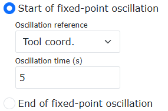

.. centered:: Figura 9.29-19 Riferimento di oscillazione come "Sistema di coordinate utensile"
   
.. image:: coding/560.png
   :width: 2in
   :align: center

.. centered:: Figura 9.29-20 Riferimento di oscillazione come "Punto di riferimento"

**Step3**: Scrivere il programma di oscillazione a punto fisso. I programmi Lua generati per i due riferimenti di oscillazione sono mostrati rispettivamente nelle figure. Eseguendo il programma Lua è possibile realizzare la funzione di oscillazione a punto fisso.
   
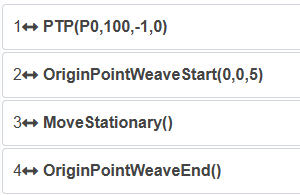

.. centered:: Figura 9.29-21 Programma di oscillazione a punto fisso con riferimento di oscillazione come "Sistema di coordinate utensile"
   
.. image:: coding/562.png
   :width: 4in
   :align: center

.. centered:: Figura 9.29-22 Programma di oscillazione a punto fisso con riferimento di oscillazione come "Punto di riferimento"

Funzione di Oscillazione a Punto Fisso con Laser
+++++++++++++++++++++++++++++++++++++++++++++++++++++++

Panoramica
***********************************

La funzione di oscillazione a punto fisso con laser è una combinazione della funzione di oscillazione a punto fisso del robot e della funzione di inseguimento laser: basata sull'oscillazione a punto fisso originale del robot, la posizione di oscillazione può essere regolata tramite la funzione di inseguimento laser e può essere adattata al movimento degli assi di estensione. Questa funzione è efficace solo per i tipi di "oscillazione ad onda triangolare" e "oscillazione ad onda sinusoidale".

Procedura Operativa per Laser + Oscillazione a Punto Fisso
****************************************************************************

**Step1**: Configurare la comunicazione laser. Fare riferimento al capitolo corrispondente del manuale utente per i passaggi operativi specifici. Quando si applica a scenari come la saldatura effettiva, prestare attenzione a quanto segue:

   - (1) Il sensore laser lineare deve essere dotato di dispositivi di protezione per evitare l'influenza di luce intensa e spruzzi di saldatura;
   - (2) Il punto di riconoscimento dell'acquisizione dei dati del laser lineare deve mantenere una certa distanza dal punto di saldatura per ridurre l'impatto della luce intensa sulla qualità dell'acquisizione dei dati laser durante la saldatura.

**Step2**: Calibrare il sistema di coordinate utensile del robot e il sistema di coordinate laser. Fare riferimento al capitolo corrispondente del manuale utente per i passaggi operativi specifici.

**Step3**: Regolare la posizione del pezzo e del raggio laser. Lo schema è mostrato nella figura seguente, dove il rettangolo nero è il pezzo e il segmento di linea rossa è il raggio laser. Il raggio laser dovrebbe essere perpendicolare al bordo del pezzo da inseguire per garantire buone prestazioni di inseguimento.
   
.. image:: coding/563.png
   :width: 2in
   :align: center

.. centered:: Figura 9.29-23 Schema del pezzo e del raggio laser

**Step4**: Impostazione dei parametri di oscillazione. Fare clic sul pulsante "Programma di insegnamento" - "Programmazione" - "Oscillazione", modificare il numero di oscillazione per impostare i parametri di oscillazione. Nota: (1) La funzione Laser + Oscillazione a punto fisso è efficace solo per i tipi "oscillazione ad onda triangolare" e "oscillazione ad onda sinusoidale"; (2) Se si desidera che il tempo effettivo di oscillazione a punto fisso corrisponda al tempo impostato, non è possibile impostare i tempi di sosta sinistro e destro; (3) Per garantire le prestazioni di inseguimento laser, i tempi di sosta sinistro e destro devono essere coerenti.
   
.. image:: coding/564.png
   :width: 3in
   :align: center

.. centered:: Figura 9.29-24 Impostazione dei parametri di oscillazione

**Step5**: Impostazione dei parametri di oscillazione a punto fisso. Fare clic su "Programma di insegnamento" - "Programmazione" - "Oscillazione" - "Avvio oscillazione a punto fisso", impostare il riferimento di oscillazione e i parametri del tempo di oscillazione, fare clic su "Aggiungi", quindi fare clic sul pulsante "Fine oscillazione a punto fisso" e su "Aggiungi". Il riferimento di oscillazione può essere selezionato tra due tipi: "Sistema di coordinate utensile" e "Punto di riferimento". Quando si seleziona "Sistema di coordinate utensile" come riferimento di oscillazione, la direzione X del sistema di coordinate utensile del punto corrente viene utilizzata come direzione di avanzamento e la direzione Y del sistema di coordinate utensile del punto corrente viene utilizzata come direzione di oscillazione. Quando si seleziona "Punto di riferimento" come riferimento di oscillazione, la linea tra il punto corrente e il punto di riferimento viene utilizzata come direzione di avanzamento, e la direzione di oscillazione è determinata dall'algoritmo di oscillazione. Nota: Il punto di riferimento e la posizione corrente devono avere lo stesso sistema di coordinate utensile e lo stesso sistema di coordinate pezzo.
   

.. centered:: Figura 9.29-25 Riferimento di oscillazione come "Sistema di coordinate utensile"
   
.. image:: coding/560.png
   :width: 2in
   :align: center

.. centered:: Figura 9.29-26 Riferimento di oscillazione come "Punto di riferimento"

**Step6**: Aggiungere l'istruzione di inseguimento laser. Fare clic in sequenza su "Programma di insegnamento" - "Programmazione" - "Inseguimento laser", quindi fare clic su "Avvia inseguimento" e selezionare il sistema di coordinate laser calibrato nel Step 2 (questo manuale utilizza toolcoord5 come esempio), e infine fare clic su "Ferma inseguimento".
   
.. image:: coding/565.png
   :width: 3in
   :align: center

.. centered:: Figura 9.29-27 Impostazione dell'inseguimento laser

**Step7**: Scrivere il programma Lua per Laser + Oscillazione a punto fisso. Regolare l'ordine delle istruzioni generate nei Step 5 e Step 6. I programmi Lua generati per i due riferimenti di oscillazione a punto fisso sono mostrati rispettivamente nelle figure seguenti. Il tempo di esecuzione del programma è correlato solo al tempo impostato dell'oscillazione a punto fisso ed è indipendente dalla velocità dell'interfaccia. Eseguire il programma Lua per realizzare la funzione Laser + Oscillazione a punto fisso.
   
.. image:: coding/566.png
   :width: 4in
   :align: center

.. centered:: Figura 9.29-28 Programma Laser + Oscillazione a punto fisso 1
   
.. image:: coding/567.png
   :width: 4in
   :align: center

.. centered:: Figura 9.29-29 Programma Laser + Oscillazione a punto fisso 2

Procedura Operativa per Laser + Asse di Estensione + Oscillazione a Punto Fisso
****************************************************************************************

**Step1**: Configurare la comunicazione laser. Fare riferimento al capitolo corrispondente del manuale utente per i passaggi operativi specifici. Quando si applica a scenari come la saldatura effettiva, prestare attenzione a quanto segue:

   - (1) Il sensore laser lineare deve essere dotato di dispositivi di protezione per evitare l'influenza di luce intensa e spruzzi di saldatura;
   - (2) Il punto di riconoscimento dell'acquisizione dei dati del laser lineare deve mantenere una certa distanza dal punto di saldatura per ridurre l'impatto della luce intensa sulla qualità dell'acquisizione dei dati laser durante la saldatura.

**Step2**: Configurare la comunicazione dell'asse di estensione. Fare riferimento al capitolo corrispondente del manuale utente per i passaggi operativi specifici.

**Step3**: Calibrare il sistema di coordinate utensile del robot e il sistema di coordinate laser. Fare riferimento al capitolo corrispondente del manuale utente per i passaggi operativi specifici.

**Step4**: Regolare la posizione del pezzo e del raggio laser. Lo schema è mostrato nella figura seguente, dove il rettangolo nero è il pezzo e il segmento di linea rossa è il raggio laser. Il raggio laser dovrebbe essere perpendicolare al bordo del pezzo da inseguire per garantire buone prestazioni di inseguimento.
   
.. image:: coding/563.png
   :width: 2in
   :align: center

.. centered:: Figura 9.29-30 Schema della posizione relativa del pezzo e del raggio laser

**Step5**: Impostazione dei parametri di oscillazione. Fare clic sul pulsante "Programma di insegnamento" - "Programmazione" - "Oscillazione", modificare il numero di oscillazione per impostare i parametri di oscillazione. Nota: (1) La funzione Laser + Asse di estensione + Oscillazione a punto fisso è efficace solo per i tipi "oscillazione ad onda triangolare" e "oscillazione ad onda sinusoidale"; (2) Se si desidera che il tempo effettivo di oscillazione a punto fisso corrisponda al tempo impostato, non è possibile impostare i tempi di sosta sinistro e destro; (3) Per garantire le prestazioni di inseguimento laser, i tempi di sosta sinistro e destro devono essere coerenti.
   
.. image:: coding/564.png
   :width: 3in
   :align: center

.. centered:: Figura 9.29-31 Impostazione dei parametri di oscillazione

**Step6**: Impostazione dei parametri di oscillazione a punto fisso. Fare clic su "Programma di insegnamento" - "Programmazione" - "Oscillazione" - "Avvio oscillazione a punto fisso", impostare il riferimento di oscillazione e i parametri del tempo di oscillazione, fare clic su "Aggiungi", quindi fare clic sul pulsante "Fine oscillazione a punto fisso" e su "Aggiungi". Il riferimento di oscillazione può essere selezionato tra due tipi: "Sistema di coordinate utensile" e "Punto di riferimento". Quando si seleziona "Sistema di coordinate utensile" come riferimento di oscillazione, la direzione X del sistema di coordinate utensile del punto corrente viene utilizzata come direzione di avanzamento e la direzione Y del sistema di coordinate utensile del punto corrente viene utilizzata come direzione di oscillazione. Quando si seleziona "Punto di riferimento" come riferimento di oscillazione, la linea tra il punto corrente e il punto di riferimento viene utilizzata come direzione di avanzamento, e la direzione di oscillazione è determinata dall'algoritmo di oscillazione. Nota: Il punto di riferimento e la posizione corrente devono avere lo stesso sistema di coordinate utensile e lo stesso sistema di coordinate pezzo.
   

.. centered:: Figura 9.29-32 Riferimento di oscillazione come "Sistema di coordinate utensile"
   
.. image:: coding/560.png
   :width: 2in
   :align: center

.. centered:: Figura 9.29-33 Riferimento di oscillazione come "Punto di riferimento"

**Step7**: Aggiungere l'istruzione di movimento dell'asse di estensione. Fare clic in sequenza su "Programma di insegnamento" - "Programmazione" - "Asse di estensione", quindi fare clic su "Istruzione di movimento", selezionare "Asincrono" come modalità di movimento, selezionare il punto di inizio e il punto di fine del movimento, e fare clic sul pulsante "Aggiungi".
   
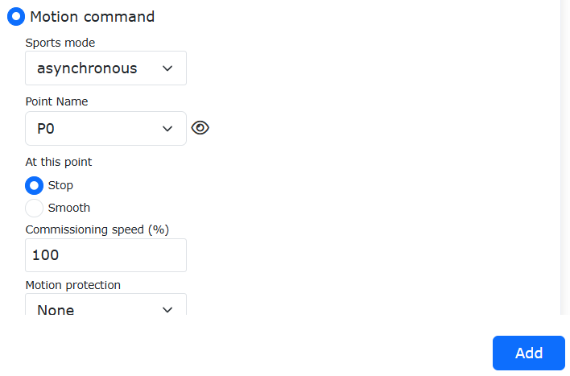

.. centered:: Figura 9.29-34 Aggiunta del movimento dell'asse di estensione

**Step8**: Aggiungere l'istruzione di inseguimento laser. Fare clic in sequenza su "Programma di insegnamento" - "Programmazione" - "Inseguimento laser", quindi fare clic su "Avvia inseguimento" e selezionare il sistema di coordinate laser calibrato nel Step 3 (questo manuale utilizza toolcoord5 come esempio), e infine fare clic su "Ferma inseguimento".
   
.. image:: coding/565.png
   :width: 3in
   :align: center

.. centered:: Figura 9.29-35 Impostazione dell'inseguimento laser

**Step9**: Scrivere il programma Lua per Laser + Asse di estensione + Oscillazione a punto fisso. Regolare l'ordine delle istruzioni generate nei Step 5, Step 6 e Step 7. I programmi Lua generati per i due riferimenti di oscillazione a punto fisso sono mostrati rispettivamente nella Figura 3-7 e nella Figura 3-8. Il tempo di esecuzione del programma è correlato solo al tempo impostato dell'oscillazione a punto fisso ed è indipendente dalla velocità dell'interfaccia. Eseguire il programma Lua per realizzare la funzione Laser + Asse di estensione + Oscillazione a punto fisso.
   
.. image:: coding/569.png
   :width: 4in
   :align: center

.. centered:: Figura 9.29-36 Programma Laser + Asse di estensione + Oscillazione a punto fisso 1
   
.. image:: coding/570.png
   :width: 4in
   :align: center

.. centered:: Figura 9.29-37 Programma Laser + Asse di estensione + Oscillazione a punto fisso 2

Comunicazione ModbusRTU del robot
~~~~~~~~~~~~~~~~~~~~~~~~~~~~~~~~~~~~~~~~~~~~~~~~~~~~~~~

Panoramica
++++++++++++++

ModbusRTU è un protocollo di comunicazione comunemente utilizzato nella produzione industriale. I robot collaborativi Faro forniscono due modalità, Master ModbusRTU e Slave ModbusRTU, per comunicare con i vostri dispositivi. Il robot collaborativo supporta fino a 8 master ModbusRTU che comunicano contemporaneamente con dispositivi esterni, ciascuno supportando fino a 128 registri; lo slave ModbusRTU del robot collaborativo ha 64 coil, 64 input discreti, 32 registri holding e 32 registri input (i tipi di dati dei registri holding e input includono signed e floating point).

Inoltre, alcuni registri input dello slave ModbusRTU del robot sono dedicati a fornire informazioni come la posizione corrente delle giunture del robot, la velocità di movimento, ecc. Alcuni registri coil sono dedicati al controllo dell'avvio del programma, dell'arresto del programma, all'impostazione dei DO del quadro di controllo, ecc. Lo slave ModbusRTU del robot supporta la connessione con un solo master. Di seguito sono riportati i metodi di utilizzo dettagliati.

Istruzioni operative relative al Master ModbusRTU del robot
++++++++++++++++++++++++++++++++++++++++++++++++++++++++++++++++++++++

Prima di utilizzare il robot collaborativo come master ModbusRTU per comunicare con i vostri dispositivi, controllare prima la connessione hardware 485 tra il vostro dispositivo e il robot. L'utilizzo del master ModbusRTU del robot prevede i seguenti passaggi: ① Aggiungere un master; ② Aggiungere registri; ③ Test di comunicazione; ④ Scrivere il programma utente; ⑤ Eseguire il programma utente;

Aggiunta di un Master ModbusRTU
*******************************************
Aprire WebApp, fare clic in sequenza su "Simulazione insegnamento", "Insegnamento programma", creare un nuovo programma utente "testModbusRTUMaster.lua".
   
.. image:: coding/340.png
   :width: 6in
   :align: center

.. centered:: Grafico 9.30-1 Creazione del programma utente per il master ModbusRTU

Fare clic sul pulsante "Impostazioni ModbusRTU", per aprire la pagina di configurazione della funzione ModbusRTU.
   
.. image:: coding/341.png
   :width: 4in
   :align: center

.. centered:: Grafico 9.30-2 Apertura delle impostazioni ModbusRTU

Fare clic in sequenza su "Impostazioni master", "Aggiungi master Modbus", per completare l'aggiunta di un master ModbusRTU.
   
.. image:: coding/342.png
   :width: 4in
   :align: center

.. centered:: Grafico 9.30-3 Aggiunta di un "Master ModbusRTU"

In base alla situazione del dispositivo slave, selezionare in sequenza "Baud rate", "Bit dati", "Parità" e "Bit di stop". Il significato specifico di questi parametri è il seguente:

**Baud rate**: Baud rate utilizzato per la comunicazione ModbusRTU. Supporta: 9600, 14400, 19200, 38400, 56000, 67600, 115200, 128000. Il valore predefinito è 115200. Impostare in modo coerente con lo slave.

**Bit dati**: Attualmente supporta solo 8 bit. Impostare in modo coerente con lo slave.

**Parità**: Metodo di parità. Supporta None, Odd, Even. Il valore predefinito è None. Impostare in modo coerente con lo slave.

**Bit di stop**: Supporta 0.5, 1, 1.5, 2. Il valore predefinito è 1. Impostare in modo coerente con lo slave.
   
.. image:: coding/343.png
   :width: 4in
   :align: center

.. centered:: Grafico 9.30-4 Impostazione dei parametri del master ModbusRTU

Dopo aver inserito correttamente i parametri sopra, il master ModbusRTU del robot può comunicare con lo slave. (Se avete confermato di aver configurato correttamente i parametri relativi al master ModbusRTU, ma la comunicazione tra il robot e il vostro dispositivo non riesce, controllare le seguenti configurazioni:

① La connessione fisica 485 tra il robot e il dispositivo slave; ② Controllare la configurazione di comunicazione del dispositivo slave e si consiglia di testare prima il collegamento di comunicazione con un software di debug seriale. Ad esempio, configurare sul PC parametri ModbusRTU coerenti con quelli del robot, creare un nuovo registro nell'interfaccia web del robot ed eseguire un'operazione di lettura del registro holding 0x03, per verificare se il software di debug seriale sul PC può ricevere i dati. Come mostrato nella figura seguente, leggendo il registro all'indirizzo 0x1000 tramite l'istruzione 0x03, il PC può ricevere normalmente i dati, indicando che la configurazione di comunicazione è corretta.
   
.. image:: coding/344.png
   :width: 4in
   :align: center

.. centered:: Grafico 9.30-5 Verifica dello stato della connessione Modbus

A questo punto abbiamo completato la creazione di un master ModbusRTU del robot. Se si fa clic nuovamente su "Aggiungi master Modbus", è possibile creare un nuovo master ModbusRTU (Figura 2-6). Il robot supporta fino a 8 master che comunicano contemporaneamente con dispositivi esterni. Fare doppio clic sul pulsante "Elimina" in alto a destra del master Modbus, per eliminare quel master Modbus.
   
.. image:: coding/345.png
   :width: 4in
   :align: center

.. centered:: Grafico 9.30-6 Aggiunta di un altro master ModbusRTU

Aggiunta di registri al master ModbusRTU
*******************************************

Fare clic sul pulsante "Aggiungi registro master", per aggiungere un registro a questo master.
   
.. image:: coding/346.png
   :width: 4in
   :align: center

.. centered:: Grafico 9.30-7 Aggiunta di un registro del master ModbusRTU

Selezionare in sequenza il tipo di registro del master, inserire il numero dell'indirizzo e il nome. Il significato di ciascun parametro è il seguente:

**Tipo**: Codice funzione modbus, 0x01 - Leggi coil; 0x02 - Leggi input discreti; 0x03 - Leggi registri holding (tipo signed -32768-32767); 0x03 - Leggi registri holding (tipo floating point, lunghezza dati 32 bit, occupa due registri, 4 byte); 0x04 - Leggi registri input (tipo signed -32768-32767); 0x04 - Leggi registri input (tipo floating point, lunghezza dati 32 bit, occupa due registri, 4 byte); 0x05 - Scrivi coil singolo; 0x06 - Scrivi registro holding singolo; 0x0F - Scrivi più coil; 0x03 - Leggi registri holding (tipo signed -32768-32767); 0x03 - Leggi registri holding (tipo floating point, lunghezza dati 32 bit, occupa due registri, 4 byte); I registri floating point per la lettura/scrittura vengono visualizzati in formato big-endian.

**Indirizzo registro**: Indirizzo del registro dello slave ModbusRTU da leggere o scrivere;

**Quantità registri**: Numero di registri da operare in caso di lettura/scrittura multipla (0x05, 0x06 possono avere quantità solo 1). Supporta fino a 12 registri.

**Valore indirizzo**: Valore visualizzato per la lettura o valore da scrivere per l'operazione di scrittura (separare più valori con virgola inglese ",")
   
.. image:: coding/347.png
   :width: 4in
   :align: center

.. centered:: Grafico 9.30-8 Impostazione dei parametri del registro del master ModbusRTU

Facendo nuovamente clic sul pulsante "Aggiungi registro master", è possibile aggiungere un altro registro master. Fare doppio clic sul pulsante "Elimina" a destra del registro, per eliminare quel registro. La figura seguente mostra i codici funzione supportati per i registri.
   
.. image:: coding/348.png
   :width: 4in
   :align: center

.. centered:: Grafico 9.30-9 Aggiunta di più registri master

Test di comunicazione del master ModbusRTU
**********************************************************

I registri del master Modbus del robot hanno una casella numerica "Valore indirizzo" per visualizzare il valore corrente del registro. I registri di tipo 0x01, 0x02, 0x03, 0x04 sono di sola lettura, le corrispondenti caselle dei valori indirizzo sono grigie e non modificabili. Quando il valore all'indirizzo corrispondente dello slave cambia, il master del robot può leggere il valore del registro corrispondente facendo clic sul pulsante di lettura e visualizzare il valore corrente in modo sincrono. I codici funzione 0x05, 0x06, 0x0F, 0x10 sono operazioni di scrittura, le loro caselle dei valori indirizzo sono bianche e modificabili. È possibile modificare il valore del registro nella pagina delle impostazioni del master Modbus del robot.
   
.. image:: coding/349.png
   :width: 4in
   :align: center

.. centered:: Grafico 9.30-10 Valore indirizzo del master Modbus

Test di lettura dei registri del master
""""""""""""""""""""""""""""""""""""""""""""""""""""
Sul dispositivo slave ModbusRTU esterno, leggere consecutivamente 10 coil a partire dall'indirizzo 0x4000, leggere consecutivamente 12 input discreti a partire dall'indirizzo 0x3000, leggere consecutivamente due registri holding a partire dall'indirizzo 0x2010 utilizzando int16, leggere un numero floating point dal registro input all'indirizzo 0x1029. A questo punto, il valore indirizzo dei registri corrispondenti nella pagina delle impostazioni del master Modbus del robot verrà visualizzato di conseguenza. Il frame di dati inviato è mostrato nella figura seguente (poiché il registro all'indirizzo 0x1029 è configurato per la lettura in formato floating point, in realtà legge due registri a 16 bit, 0x1029 e 0x102A, per memorizzare un numero floating point, ma la quantità di lettura è impostata su 1).
   
.. image:: coding/350.png
   :width: 4in
   :align: center

.. centered:: Grafico 9.30-11 Il master Modbus visualizza i valori dei registri letti (screenshot del frame di istruzione)

Test di scrittura dei registri del master
""""""""""""""""""""""""""""""""""""""""""""""""""""

Nella pagina delle impostazioni del master ModbusRTU del robot, scrivere un coil singolo all'indirizzo 0x1000, valore 1; scrivere un registro singolo all'indirizzo 0x1001, valore 2001; scrivere 5 coil a partire dall'indirizzo 0x2000, valori 1,1,0,1,1; scrivere 2 registri holding a partire dall'indirizzo 0x2010, tipo dati int16, valori 3001, 3002; scrivere un registro holding in formato floating point all'indirizzo 0x1029 (in realtà due registri a 16 bit), valore 21.55; gli indirizzi dei registri corrispondenti dello slave Modbus sono stati scritti con i rispettivi valori.
   
.. image:: coding/351.png
   :width: 4in
   :align: center

.. centered:: Grafico 9.30-12 Operazione di scrittura del master ModbusRTU (screenshot del frame di istruzione)

Scrittura del programma per il master ModbusRTU
************************************************

Aprire la pagina di aggiunta delle istruzioni di comunicazione.
   
.. image:: coding/352.png
   :width: 4in
   :align: center

.. centered:: Grafico 9.30-13 Apertura della pagina di aggiunta delle istruzioni di comunicazione

Fare clic su "Modbus".
   
.. image:: coding/353.png
   :width: 4in
   :align: center

.. centered:: Grafico 9.30-14 Selezione di Modbus

Fare clic su "Modbus_RTU", selezionare "Master (client)", per aprire la pagina di aggiunta delle istruzioni del master ModbusRTU.
   
.. image:: coding/354.png
   :width: 4in
   :align: center

.. centered:: Grafico 9.30-15 Selezione di Modbus_RTU

Scrittura di un coil singolo
""""""""""""""""""""""""""""

Selezionare "Scrivi registro", codice funzione 0x05 - Coil singolo, registro, indirizzo coil 0x1000, valore registro, quantità coil 1, array di byte {1}, fare clic sul pulsante "Aggiungi". Infine, scorrere fino alla parte inferiore della pagina, fare clic sul pulsante "Applica" (Figura 2-16).
   
.. image:: coding/355.png
   :width: 4in
   :align: center

.. centered:: Grafico 9.30-16 Scrittura di un coil singolo

A questo punto, il programma robot "testModbusRTUSlave.lua" ha già aggiunto un'istruzione di scrittura di un singolo output digitale del master Modbus del robot. Passare il robot in modalità automatica, fare clic sul pulsante di avvio, il master del robot scriverà il valore 1 all'indirizzo del registro coil corrispondente 0x1000.
   
.. image:: coding/356.png
   :width: 6in
   :align: center

.. centered:: Grafico 9.30-17 Programma LUA per la scrittura di un coil singolo

Scrittura di più coil
""""""""""""""""""""""""""""""""""""""""
Selezionare "Scrivi registro", codice funzione 0x0F - Più coil, registro, indirizzo coil 0x1010, valore registro, quantità coil 3, array di byte {1,0,1}, fare clic sul pulsante "Aggiungi". Infine, scorrere fino alla parte inferiore della pagina, fare clic sul pulsante "Applica" (Figura 2-18).
   
.. image:: coding/357.png
   :width: 4in
   :align: center

.. centered:: Grafico 9.30-18 Scrittura di più coil

A questo punto, il programma robot "testModbusRTUSlave.lua" ha già aggiunto un'istruzione di scrittura di un singolo output digitale del master Modbus del robot. Passare il robot in modalità automatica, fare clic sul pulsante di avvio, il master del robot scriverà il valore 1 all'indirizzo del registro coil corrispondente 0x1000.
   
.. image:: coding/358.png
   :width: 4in
   :align: center

.. centered:: Grafico 9.30-19 Programma LUA per la scrittura di più coil

Lettura di coil e input discreti
""""""""""""""""""""""""""""""""""""""""""""""""

Selezionare "Istruzione lettura registro", codice funzione 0x01 - Coil (se è necessario leggere input discreti, selezionare 0x02 - Input discreti), registro, indirizzo coil 0x2000, registro, quantità coil 3, fare clic sul pulsante "Aggiungi". Contemporaneamente, selezionare "Dati lettura registro", registro, coil, quantità input discreti 3, fare clic sul pulsante "Aggiungi". Infine, scorrere fino alla parte inferiore della pagina, fare clic sul pulsante "Applica" (Figura 2-20).
   
.. image:: coding/359.png
   :width: 4in
   :align: center
   
.. image:: coding/394.png
   :width: 4in
   :align: center

.. centered:: Grafico 9.30-20 Lettura di coil

A questo punto, il programma robot "testModbusRTUSlave.lua" ha già aggiunto due istruzioni di lettura coil del master Modbus del robot.
   
.. image:: coding/360.png
   :width: 6in
   :align: center

.. centered:: Grafico 9.30-21 Programma per la lettura di un coil singolo

Di solito, dopo aver letto un registro Modbus, il valore letto viene memorizzato in una variabile, quindi è necessario definire una variabile per memorizzare il valore letto. Fare clic sul pulsante "Cambia modalità", per passare il programma Lua del robot in modalità modificabile. Prima dell'istruzione "ModbusRegRead", aggiungere le variabili di ritorno "value1", "value2", "value3". Dopo l'esecuzione del programma, i valori letti verranno memorizzati in "value1", "value2", "value3".
   
.. image:: coding/361.png
   :width: 6in
   :align: center

.. centered:: Grafico 9.30-22 Memorizzazione di più valori coil in variabili

I valori dei registri di tipo coil e input discreti hanno solo due valori: 0 e 1. Nel programma del robot, è possibile eseguire operazioni diverse in base al valore del registro.

Lettura di registri holding e input
""""""""""""""""""""""""""""""""""""""""""""""
Selezionare "Istruzione lettura registro", codice funzione 0x03 - Coil (se è necessario leggere registri input, selezionare 0x04 - Registri input), registro, indirizzo coil 0x4000, registro, quantità coil 5, fare clic sul pulsante "Aggiungi". Contemporaneamente, selezionare "Dati lettura registro", registro, coil, quantità input discreti 5, fare clic sul pulsante "Aggiungi". Infine, scorrere fino alla parte inferiore della pagina, fare clic sul pulsante "Applica" (Figura 2-23).
   
.. image:: coding/362.png
   :width: 4in
   :align: center
   
.. image:: coding/395.png
   :width: 4in
   :align: center

.. centered:: Grafico 9.30-23 Lettura di registri holding

A questo punto, il programma robot "testModbusRTUSlave.lua" ha già aggiunto due istruzioni di lettura coil del master Modbus del robot.
   
.. image:: coding/363.png
   :width: 4in
   :align: center

.. centered:: Grafico 9.30-24 Programma per la lettura di un coil singolo

Di solito, dopo aver letto un registro Modbus, il valore letto viene memorizzato in una variabile, quindi è necessario definire variabili per memorizzare i valori letti. Fare clic sul pulsante "Cambia modalità", per passare il programma Lua del robot in modalità modificabile. Prima dell'istruzione "ModbusRegRead", aggiungere le variabili di ritorno "value1", "value2", "value3", "value4", "value5". Dopo l'esecuzione del programma, i valori letti verranno memorizzati in "value1", "value2", "value3", "value4", "value5".
   
.. image:: coding/364.png
   :width: 6in
   :align: center

.. centered:: Grafico 9.30-25 Memorizzazione di più valori di registri holding in variabili

Istruzioni operative relative allo Slave ModbusRTU del robot
++++++++++++++++++++++++++++++++++++++++++++++++++++++++++++++++++++++++++++++

Lo slave ModbusRTU del robot fornisce quattro tipi di registri: input digitali generali (coil), output digitali generali (input discreti), input analogici generali (registri holding) e output analogici generali (registri input). Tra questi, gli input digitali generali e gli input analogici vengono utilizzati principalmente dal robot per leggere i dati dal master ModbusRTU esterno, al fine di controllare le operazioni del robot. Gli output digitali generali e gli output analogici generali vengono utilizzati principalmente dal robot per inviare segnali dati al dispositivo master ModbusRTU esterno. Il dispositivo master esterno legge i valori dei registri corrispondenti per controllare il funzionamento del proprio dispositivo.

Oltre agli input/output generali di cui sopra, il robot fornisce anche alcuni "input digitali funzionali (coil)" per consentire al dispositivo master esterno di controllare operazioni come l'avvio del programma, l'arresto del programma, ecc. Fornisce inoltre alcuni registri input per visualizzare le informazioni sullo stato corrente del robot, inclusa la posizione cartesiana corrente del robot, lo stato di esecuzione corrente del robot, ecc. (per definizioni specifiche, vedere Allegato 1: Tabella di mappatura degli indirizzi dello slave ModbusRTU). Lo slave ModbusRTU del robot supporta la connessione con un solo master. L'utilizzo dello slave ModbusRTU del robot comprende principalmente: ① Configurazione dei parametri; ② Test di comunicazione; ③ Scrittura del programma.

Configurazione dei parametri di comunicazione dello slave ModbusRTU
************************************************************************************

Aprire WebApp, fare clic in sequenza su "Simulazione insegnamento", "Insegnamento programma", creare un nuovo programma utente "testModbusRTUSlave.lua".
   
.. image:: coding/365.png
   :width: 6in
   :align: center

.. centered:: Grafico 9.30-26 Creazione del programma utente per lo slave ModbusRTU

Fare clic sul pulsante "Impostazioni ModbusRTU", per aprire la pagina di configurazione della funzione ModbusRTU.
   
.. image:: coding/366.png
   :width: 6in
   :align: center

.. centered:: Grafico 9.30-27 Apertura delle impostazioni ModbusRTU

Fare clic in sequenza su "Impostazioni slave", inserire il baud rate, i bit dati, la parità, i bit di stop e il numero dello slave dello slave del robot. Tra questi, "Baud rate", "Bit dati", "Parità", "Bit di stop" sono i parametri di configurazione del robot come slave ModbusRTU. "Numero slave" è il numero del dispositivo slave specificato nei comandi inviati dal master esterno.
   
.. image:: coding/367.png
   :width: 4in
   :align: center

.. centered:: Grafico 9.30-28 Impostazioni dello slave ModbusRTU

Test di comunicazione dello slave ModbusRTU
*******************************************************

Input digitali generali (coil)
""""""""""""""""""""""""""""""""""""""""""""""
Lo slave ModbusRTU del robot fornisce 64 registri coil, i cui indirizzi sono 0x4000~0x403F (per definizioni specifiche, vedere Allegato 1: Tabella di mappatura degli indirizzi dello slave ModbusRTU). Tutti i registri generali dello slave ModbusRTU del robot possono avere alias. Modificare il nome del registro coil DI0 dello slave del robot in "A in posizione", e il nome di DI1 in "B in posizione". Secondo la tabella di mappatura degli indirizzi, gli indirizzi Modbus coil per "A in posizione" e "B in posizione" sono rispettivamente 0x4000 e 0x4001. Sul dispositivo master ModbusRTU esterno, impostare entrambi i registri coil dello slave del robot agli indirizzi 0x4000 e 0x4001 su 1. A questo punto, nella pagina di monitoraggio dello slave ModbusRTU del robot, le spie dei due registri si accendono.
   
.. image:: coding/368.png
   :width: 4in
   :align: center

.. centered:: Grafico 9.30-29 Monitoraggio dello stato dei coil dello slave ModbusRTU (screenshot del frame di istruzione)

Output digitali generali (input discreti)
""""""""""""""""""""""""""""""""""""""""""""""

Lo slave ModbusRTU del robot fornisce 64 registri input discreti, i cui indirizzi sono 0x3000-0x303F (per definizioni specifiche, vedere Allegato 1: Tabella di mappatura degli indirizzi dello slave ModbusRTU). Anche i registri input discreti dello slave ModbusRTU del robot possono avere alias. Fare clic su "Output digitali generali (input discreti)" per modificare il nome del registro input discreto DO0 dello slave del robot in "Avvio A", e il nome di DO1 in "Avvio B". Secondo la tabella di mappatura degli indirizzi, gli indirizzi Modbus input discreti per "Avvio A" e "Avvio B" sono rispettivamente 0x3000 e 0x3001. Fare clic sulla spia dell'input discreto corrispondente a "Avvio A", la spia si accende, il valore del registro corrispondente all'indirizzo 0x3000 diventa 1, e il dispositivo master ModbusRTU esterno può leggere questo valore del registro.
   
.. image:: coding/369.png
   :width: 4in
   :align: center

.. centered:: Grafico 9.30-30 Controllo degli input discreti dello slave ModbusRTU

Input analogici (registri holding)
""""""""""""""""""""""""""""""""""""""""
Il robot fornisce tre tipi di registri holding: senza segno, con segno e floating point, per un totale di 32. Gli indirizzi di AI0~AI32 sono 0x2000-0x202F (per definizioni specifiche, vedere Allegato 1: Tabella di mappatura degli indirizzi dello slave ModbusRTU). Tra questi, l'intervallo di dati dei registri con segno è -32768~32767, e i registri floating point vengono visualizzati in formato big-endian. Modificare i nomi di AI0 e AI1 rispettivamente in "Tensione" e "Corrente". Dalla tabella di mappatura degli indirizzi dello slave ModbusRTU, si ricava che gli indirizzi dei due registri sono rispettivamente 0x2000 e 0x2001. Pertanto, quando il dispositivo master collegato modifica i valori degli indirizzi dei registri holding 0x2000 e 0x2001, la pagina di monitoraggio dello slave ModbusRTU del robot aggiorna e visualizza di conseguenza i valori degli indirizzi dei registri "Tensione" e "Corrente". L'input analogico del robot viene utilizzato principalmente per acquisire segnali numerici dal dispositivo master esterno.
   
.. image:: coding/370.png
   :width: 4in
   :align: center

.. centered:: Grafico 9.30-31 Monitoraggio dell'input analogico dello slave ModbusRTU (screenshot del frame di istruzione)

Output analogici (registri input)
""""""""""""""""""""""""""""""""""""""""
Il robot fornisce tre tipi di registri input: senza segno, con segno e floating point, per un totale di 64. Gli indirizzi di AO0~AO63 sono 0x1000-0x100F, 0x104D-0x106C (per definizioni specifiche, vedere Allegato 1: Tabella di mappatura degli indirizzi dello slave ModbusRTU). Tra questi, l'intervallo di dati dei registri con segno è -32768~32767, e i registri floating point vengono visualizzati in formato big-endian. Modificare i nomi di AO0 e AO1 rispettivamente in "Posizione target A" e "Posizione target B", con valori dei registri input rispettivamente 2000 e 1500. Dalla tabella di mappatura degli indirizzi dello slave ModbusRTU, si ricava che gli indirizzi dei due registri sono rispettivamente 0x1000 e 0x1001. Pertanto, quando il dispositivo master collegato legge i valori degli indirizzi dei registri input 0x1000 e 0x1001, ottiene i valori impostati. L'output analogico dello slave del robot viene utilizzato principalmente per trasmettere segnali numerici al dispositivo master esterno.
   
.. image:: coding/371.png
   :width: 4in
   :align: center

.. centered:: Grafico 9.30-32 Modifica dell'input analogico dello slave Modbus

Scrittura del programma per lo slave ModbusRTU
**************************************************

Aprire la pagina di aggiunta delle istruzioni di comunicazione.
   
.. image:: coding/372.png
   :width: 4in
   :align: center

.. centered:: Grafico 9.30-33 Apertura della pagina di aggiunta delle istruzioni di comunicazione

Fare clic su "Modbus".
   
.. image:: coding/373.png
   :width: 6in
   :align: center

.. centered:: Grafico 9.30-34 Selezione di Modbus

Fare clic su "Modbus_RTU", selezionare "Slave", per aprire la pagina di aggiunta delle istruzioni dello slave ModbusRTU.
   
.. image:: coding/374.png
   :width: 4in
   :align: center

.. centered:: Grafico 9.30-35 Selezione di Modbus_RTU, Slave

Scrittura di un singolo output digitale DO (input discreto)
""""""""""""""""""""""""""""""""""""""""""""""""""""""""""""""""""""""""""""

Selezionare il nome DO come "Avvio A", quantità registro 1, valore registro 0, fare clic su "Scrivi singolo output digitale". Infine, scorrere fino alla parte inferiore della pagina, fare clic sul pulsante "Applica".
   
.. image:: coding/375.png
   :width: 4in
   :align: center

.. centered:: Grafico 9.30-36 Aggiunta dell'istruzione per scrivere un singolo output digitale, applicazione dell'istruzione per scrivere un singolo output digitale

A questo punto, il programma robot "testModbusRTUSlave.lua" ha già aggiunto un'istruzione di scrittura di un singolo output digitale dello slave Modbus del robot. Passare il robot in modalità automatica, fare clic sul pulsante di avvio, il robot scriverà il valore 0 all'indirizzo corrispondente all'output digitale denominato "Avvio A".
   
.. image:: coding/376.png
   :width: 6in
   :align: center

.. centered:: Grafico 9.30-37 Programma LUA per la scrittura di un singolo output digitale

Scrittura di più output digitali DO (input discreti)
""""""""""""""""""""""""""""""""""""""""""""""""""""""""

Aprire la pagina di aggiunta delle istruzioni dello slave ModbusRTU, trovare "Impostazioni output digitali", selezionare il nome DO come "Avvio A", quantità registro 5, valore registro 1,0,1,0,1. Il numero di valori del registro deve corrispondere alla quantità di registri impostata, e più valori di registro devono essere separati da virgole inglesi, fare clic su "Scrivi output digitale". Infine, scorrere fino alla parte inferiore della pagina, fare clic sul pulsante "Applica".
   
.. image:: coding/377.png
   :width: 4in
   :align: center

.. centered:: Grafico 9.30-38 Configurazione della scrittura di più output digitali, applicazione della scrittura di più output digitali

A questo punto, il programma robot "testModbusRTUSlave.lua" ha già aggiunto un'istruzione di scrittura di più output digitali dello slave Modbus del robot. Passare il robot in modalità automatica, fare clic sul pulsante di avvio, lo slave del robot scriverà rispettivamente i valori 1, 0, 1, 0, 1 nei successivi 4 registri input discreti a partire da "Avvio A".
   
.. image:: coding/378.png
   :width: 6in
   :align: center

.. centered:: Grafico 9.30-39 Programma LUA per la scrittura di più output digitali

Lettura di un singolo output digitale DO (input discreto)
""""""""""""""""""""""""""""""""""""""""""""""""""""""""""""""""""""""""""

Aprire la pagina di aggiunta delle istruzioni del master ModbusRTU, trovare "Impostazioni output digitali", nome DO "Avvio A", quantità registro 1, non è necessario inserire il valore registro, fare clic su "Leggi output digitale". Infine, scorrere fino alla parte inferiore della pagina, fare clic sul pulsante "Applica".
   
.. image:: coding/379.png
   :width: 4in
   :align: center

.. centered:: Grafico 9.30-40 Configurazione della lettura di un singolo output digitale, applicazione della lettura di un singolo output digitale

A questo punto, il programma robot "testModbusRTUSlave.lua" ha già aggiunto un'istruzione di lettura di un singolo output digitale dello slave Modbus del robot.
   
.. image:: coding/380.png
   :width: 4in
   :align: center

.. centered:: Grafico 9.30-41 Programma per la lettura di un singolo output digitale

Di solito, dopo aver letto un registro Modbus, il valore letto viene memorizzato in una variabile, quindi è necessario definire una variabile per memorizzare il valore letto. Fare clic sul pulsante "Cambia modalità", per passare il programma Lua del robot in modalità modificabile. Prima dell'istruzione "ModbusSlaveReadDO_RTU", aggiungere la variabile di ritorno "AStartValue". Dopo l'esecuzione del programma, il valore letto verrà memorizzato in "AStartValue".
   
.. image:: coding/381.png
   :width: 4in
   :align: center

.. centered:: Grafico 9.30-42 Memorizzazione della lettura di un singolo output digitale in una variabile

I valori dei registri di tipo coil hanno solo due valori: 0 e 1. Nel programma del robot, è possibile eseguire operazioni diverse in base al valore del registro.

Lettura di più output digitali DO (input discreti)
""""""""""""""""""""""""""""""""""""""""""""""""""""""""""""""

Aprire la pagina di aggiunta delle istruzioni del master ModbusRTU, trovare "Impostazioni output digitali", selezionare il nome DO come "Avvio A", quantità registro 2, non è necessario inserire il valore registro, fare clic su "Leggi output digitale". Infine, scorrere fino alla parte inferiore della pagina, fare clic sul pulsante "Applica".
   
.. image:: coding/382.png
   :width: 4in
   :align: center

.. centered:: Grafico 9.30-43 Configurazione della lettura di più output digitali, applicazione della lettura di più output digitali

A questo punto, il programma robot "testModbusRTUSlave.lua" ha già aggiunto un'istruzione di lettura di più output digitali dello slave Modbus del robot.
   
.. image:: coding/383.png
   :width: 4in
   :align: center

.. centered:: Grafico 9.30-44 Programma per la lettura di più output digitali

Fare clic sul pulsante "Cambia modalità", per passare il programma Lua del robot in modalità modificabile. Poiché la quantità letta è di 2, è necessario aggiungere due variabili di ritorno "value1, value2" prima dell'istruzione "ModbusSlaveReadDO_RTU". Dopo l'esecuzione del programma, i valori dei 2 registri output digitali letti verranno memorizzati rispettivamente nelle due variabili sopra. Allo stesso modo, è possibile controllare il robot in base ai valori di "value1" e "value2".
   
.. image:: coding/384.png
   :width: 4in
   :align: center

.. centered:: Grafico 9.30-45 Memorizzazione della lettura di più output digitali in variabili

Lettura dell'input digitale DI (coil)
"""""""""""""""""""""""""""""""""""""""""""

Aprire la pagina di aggiunta delle istruzioni dello slave ModbusRTU, trovare "Impostazioni input digitali", selezionare il nome DI come "A in posizione", quantità registro 2, fare clic su "Leggi input digitale". Infine, scorrere fino alla parte inferiore della pagina, fare clic sul pulsante "Applica".
   
.. image:: coding/385.png
   :width: 4in
   :align: center

.. centered:: Grafico 9.30-46 Configurazione della lettura dell'input digitale, applicazione della lettura dell'input digitale

A questo punto, il programma robot "testModbusRTUSlave.lua" ha già aggiunto un'istruzione di lettura dell'input digitale dello slave Modbus del robot.
   
.. image:: coding/386.png
   :width: 4in
   :align: center

.. centered:: Grafico 9.30-47 Istruzione del programma per la lettura dell'input digitale

Fare clic sul pulsante "Cambia modalità", per passare il programma Lua del robot in modalità modificabile. Prima dell'istruzione "ModbusSlaveReadDI_RTU", aggiungere le variabili di ritorno "AState, BState". Dopo l'esecuzione del programma, i due valori di input digitale letti verranno memorizzati rispettivamente nelle variabili "AState" e "BState". È possibile controllare il robot in base ai valori delle variabili.
   
.. image:: coding/387.png
   :width: 4in
   :align: center

.. centered:: Grafico 9.30-48 Programma per la lettura dell'input digitale

Operazioni di lettura/scrittura per output analogici AO (registri input) e input analogici AI (registri holding)
""""""""""""""""""""""""""""""""""""""""""""""""""""""""""""""""""""""""""""""""""""""""""""""""""""""""""""""""""

Le operazioni di lettura/scrittura per output analogici (registri input) e input analogici (registri holding) sono fondamentalmente le stesse di quelle per output digitali (input discreti) e input digitali (coil). La differenza è che l'intervallo di dati di questi ultimi è limitato a 0 o 1, mentre quello dei primi è più ampio. Pertanto, per le operazioni specifiche, fare riferimento alla scrittura dei programmi per output digitali e input digitali. Qui vengono mostrati solo esempi di programmi per la lettura di input analogici e la lettura/scrittura di output analogici.
   
.. image:: coding/388.png
   :width: 4in
   :align: center

.. centered:: Grafico 9.30-49 Lettura dell'input analogico
   
.. image:: coding/389.png
   :width: 6in
   :align: center

.. centered:: Grafico 9.30-50 Lettura/scrittura dell'output analogico

Attesa dell'input digitale
""""""""""""""""""""""""""""""""""""""""""""""""""""""
Aprire la pagina di aggiunta delle istruzioni dello slave ModbusRTU, trovare "Impostazioni attesa input digitale", selezionare il nome DI come il registro "A in posizione" configurato, stato di attesa "True", tempo di timeout 5000 ms. Fare clic sul pulsante "Aggiungi", infine fare clic sul pulsante "Applica".
   
.. image:: coding/390.png
   :width: 4in
   :align: center

.. centered:: Grafico 9.30-51 Aggiunta dell'istruzione di attesa dell'input digitale

A questo punto, il programma robot "testModbusRTUSlave.lua" ha già aggiunto un'istruzione di attesa dell'input digitale dello slave Modbus del robot. Dopo l'avvio del programma, il robot attenderà continuamente che il valore del registro coil "A in posizione" dello slave diventi true, cioè valore 1. Poiché il tempo di timeout è impostato a 5 s, se dopo 5 s di attesa il segnale "A in posizione" è ancora 0, il programma del robot segnalerà un errore di timeout e si fermerà automaticamente.
   
.. image:: coding/391.png
   :width: 4in
   :align: center

.. centered:: Grafico 9.30-52 Programma di attesa dell'input digitale

Attesa dell'input analogico
""""""""""""""""""""""""""""""""""
Aprire la pagina di aggiunta delle istruzioni dello slave ModbusRTU, trovare "Impostazioni attesa input analogico", selezionare il nome AI come il registro "Corrente" configurato, stato di attesa ">", valore registro 255, tempo di timeout 5000 ms. Fare clic sul pulsante "Aggiungi", infine fare clic sul pulsante "Applica".
   
.. image:: coding/392.png
   :width: 4in
   :align: center

.. centered:: Grafico 9.30-53 Aggiunta dell'istruzione di attesa dell'input analogico

A questo punto, il programma robot "testModbusRTUSlave.lua" ha già aggiunto un'istruzione di attesa del valore di input analogico dello slave Modbus del robot. Dopo l'avvio del programma, il robot attenderà continuamente che il valore del registro "Corrente" dello slave sia maggiore di 255. Poiché il tempo di timeout è impostato a 5 s, se dopo 5 s di attesa il segnale "Corrente" non è ancora maggiore di 255, il programma del robot segnalerà un errore di timeout e si fermerà automaticamente.
   
.. image:: coding/393.png
   :width: 4in
   :align: center

.. centered:: Grafico 9.30-54 Programma di attesa del registro di input analogico

Aprire la pagina di aggiunta delle istruzioni dello slave ModbusRTU, trovare "Impostazioni attesa input analogico", ovvero l'impostazione di attesa del registro input AI, selezionare il nome AI come il registro "Livello liquido" configurato, stato di attesa "=", valore registro 255, tempo di timeout 5000 ms. Fare clic sul pulsante "Aggiungi", infine fare clic sul pulsante "Applica".
            
.. image:: coding/496.png
   :width: 6in
   :align: center

.. centered:: Grafico 9.30-54-2 Aggiunta dell'attesa dell'input analogico

A questo punto, il programma robot "test.lua" ha già aggiunto un'istruzione di attesa del valore del registro input AI dello slave Modbus Rtu del robot. Dopo l'avvio del programma, il robot attenderà continuamente che il valore del registro "Livello liquido" sia uguale a 255. Poiché il tempo di timeout è impostato a 5 s, se dopo 5 s di attesa il segnale "Livello liquido" non è ancora uguale a 255, il programma del robot segnalerà un errore di timeout e si fermerà automaticamente.

Feedback dello stato e controllo del robot tramite slave ModbusRTU
***********************************************************************************
Gli indirizzi dei registri input 0x1010-0x104C dello slave ModbusRTU del robot collaborativo sono utilizzati per fornire feedback sullo stato in tempo reale del robot (per definizioni specifiche degli indirizzi, vedere Allegato 1: Tabella di mappatura degli indirizzi dello slave ModbusRTU). È sufficiente che il dispositivo master legga i valori dei registri corrispondenti per ottenere i dati sullo stato in tempo reale del robot.

Gli indirizzi dei registri coil 0x4040-0x405C dello slave ModbusRTU del robot collaborativo sono utilizzati dal dispositivo master per controllare il robot (per definizioni specifiche degli indirizzi, vedere Allegato 1: Tabella di mappatura degli indirizzi dello slave ModbusRTU). Prendendo come esempio l'indirizzo coil 0x4054, la funzione di questo indirizzo è "Avvia programma". Quando il robot è in modalità automatica, se il dispositivo master imposta il valore dell'indirizzo 0x4054 da 0 a 1, il robot inizia automaticamente a eseguire il programma configurato; prendendo come esempio l'indirizzo coil 0x4040, questo viene utilizzato per controllare l'output DO0 del quadro di controllo del robot. Quando il master esterno imposta il valore dell'indirizzo coil 0x4040 da 0 a 1, il DO0 del quadro di controllo viene attivato; allo stesso modo, quando il master esterno imposta il valore dell'indirizzo coil 0x4040 da 1 a 0, l'output DO0 del quadro di controllo viene disattivato. Nella pagina delle impostazioni dello slave ModbusRTU, fare clic su "Input digitali funzionali (coil)", per monitorare la situazione corrente di tutti gli input digitali funzionali.
   
.. image:: coding/396.png
   :width: 4in
   :align: center

.. centered:: Grafico 9.30-55 Input digitali funzionali dello slave del robot

Allegato 1: Tabella di mappatura degli indirizzi dello slave Modbus Rtu

.. list-table::
   :widths: 15 20 25 15 20 10
   :header-rows: 0
   :align: center

   * - **Indirizzo fornito dal controller di terze parti**
     - **Tipo**
     - **Nome**
     - **Tipo di dati**
     - **Codice funzione**
     - **Lettura/Scrittura**

   * - 0x3000
     - Output digitale generale (discreto)
     - DO0
     - BOOL 
     - 0x02 
     - Sola lettura  

   * - 0x3001
     - Output digitale generale (discreto)
     - DO1
     - BOOL 
     - 0x02 
     - Sola lettura  

   * - 0x3002
     - Output digitale generale (discreto)
     - DO2
     - BOOL 
     - 0x02 
     - Sola lettura  

   * - 0x3003
     - Output digitale generale (discreto)
     - DO3
     - BOOL 
     - 0x02 
     - Sola lettura  

   * - ...
     - Output digitale generale (discreto)
     - ...
     - BOOL 
     - 0x02 
     - Sola lettura  

   * - 0x303F
     - Output digitale generale (discreto)
     - DO127
     - BOOL 
     - 0x02 
     - Sola lettura  

   * - 0x4000
     - Input digitale generale (coil)
     - DI0
     - BOOL 
     - 0x01、0x05、0x0F 
     - Lettura/Scrittura  

   * - 0x4001
     - Input digitale generale (coil)
     - DI1
     - BOOL 
     - 0x01、0x05、0x0F 
     - Lettura/Scrittura  

   * - 0x4002
     - Input digitale generale (coil)
     - DI2
     - BOOL 
     - 0x01、0x05、0x0F 
     - Lettura/Scrittura  

   * - 0x4003
     - Input digitale generale (coil)
     - DI3
     - BOOL 
     - 0x01、0x05、0x0F 
     - Lettura/Scrittura  

   * - ...
     - Input digitale generale (coil)
     - ...
     - BOOL 
     - 0x01、0x05、0x0F 
     - Lettura/Scrittura  

   * - 0x403F
     - Input digitale generale (coil)
     - DI64
     - BOOL 
     - 0x01、0x05、0x0F 
     - Lettura/Scrittura  

   * - 0x4040
     - Controllo robot
     - DO0 quadro di controllo
     - BOOL 
     - 0x01、0x05、0x0F 
     - Lettura/Scrittura  

   * - 0x4041
     - Controllo robot
     - DO1 quadro di controllo
     - BOOL 
     - 0x01、0x05、0x0F 
     - Lettura/Scrittura  

   * - 0x4042
     - Controllo robot
     - DO2 quadro di controllo
     - BOOL 
     - 0x01、0x05、0x0F 
     - Lettura/Scrittura  

   * - 0x4043
     - Controllo robot
     - DO3 quadro di controllo
     - BOOL 
     - 0x01、0x05、0x0F 
     - Lettura/Scrittura  

   * - 0x4044
     - Controllo robot
     - DO4 quadro di controllo
     - BOOL 
     - 0x01、0x05、0x0F 
     - Lettura/Scrittura  

   * - 0x4045
     - Controllo robot
     - DO5 quadro di controllo
     - BOOL 
     - 0x01、0x05、0x0F 
     - Lettura/Scrittura  

   * - 0x4046
     - Controllo robot
     - DO6 quadro di controllo
     - BOOL 
     - 0x01、0x05、0x0F 
     - Lettura/Scrittura  

   * - 0x4047
     - Controllo robot
     - DO7 quadro di controllo
     - BOOL 
     - 0x01、0x05、0x0F 
     - Lettura/Scrittura  

   * - 0x4048
     - Controllo robot
     - CO0 quadro di controllo
     - BOOL 
     - 0x01、0x05、0x0F 
     - Lettura/Scrittura  

   * - 0x4049
     - Controllo robot
     - CO1 quadro di controllo
     - BOOL 
     - 0x01、0x05、0x0F 
     - Lettura/Scrittura  

   * - 0x404A
     - Controllo robot
     - CO2 quadro di controllo
     - BOOL 
     - 0x01、0x05、0x0F 
     - Lettura/Scrittura  

   * - 0x404B
     - Controllo robot
     - CO3 quadro di controllo
     - BOOL 
     - 0x01、0x05、0x0F 
     - Lettura/Scrittura  

   * - 0x404C
     - Controllo robot
     - CO4 quadro di controllo
     - BOOL 
     - 0x01、0x05、0x0F 
     - Lettura/Scrittura  

   * - 0x404D
     - Controllo robot
     - CO5 quadro di controllo
     - BOOL 
     - 0x01、0x05、0x0F 
     - Lettura/Scrittura  

   * - 0x404E
     - Controllo robot
     - CO6 quadro di controllo
     - BOOL 
     - 0x01、0x05、0x0F 
     - Lettura/Scrittura  

   * - 0x404F
     - Controllo robot
     - CO7 quadro di controllo
     - BOOL 
     - 0x01、0x05、0x0F 
     - Lettura/Scrittura  

   * - 0x4050
     - Controllo robot
     - DO0 utensile
     - BOOL 
     - 0x01、0x05、0x0F 
     - Lettura/Scrittura  

   * - 0x4051
     - Controllo robot
     - DO1 utensile
     - BOOL 
     - 0x01、0x05、0x0F 
     - Lettura/Scrittura  

   * - 0x4052
     - Controllo robot
     - Pausa
     - BOOL 
     - 0x01、0x05、0x0F 
     - Lettura/Scrittura  

   * - 0x4053
     - Controllo robot
     - Riprendi
     - BOOL 
     - 0x01、0x05、0x0F 
     - Lettura/Scrittura  

   * - 0x4054
     - Controllo robot
     - Avvia
     - BOOL 
     - 0x01、0x05、0x0F 
     - Lettura/Scrittura  

   * - 0x4055
     - Controllo robot
     - Arresta
     - BOOL 
     - 0x01、0x05、0x0F 
     - Lettura/Scrittura  

   * - 0x4056
     - Controllo robot
     - Sposta all'origine dell'operazione
     - BOOL 
     - 0x01、0x05、0x0F 
     - Lettura/Scrittura  

   * - 0x4057
     - Controllo robot
     - Commuta manuale/automatico
     - BOOL 
     - 0x01、0x05、0x0F 
     - Lettura/Scrittura  

   * - 0x4058
     - Controllo robot
     - Avvia programma principale
     - BOOL 
     - 0x01、0x05、0x0F 
     - Lettura/Scrittura  

   * - 0x4059
     - Controllo robot
     - Modalità riduzione di primo livello
     - BOOL 
     - 0x01、0x05、0x0F 
     - Lettura/Scrittura  

   * - 0x405A
     - Controllo robot
     - Modalità riduzione di secondo livello
     - BOOL 
     - 0x01、0x05、0x0F 
     - Lettura/Scrittura  

   * - 0x405B
     - Controllo robot
     - Modalità riduzione di terzo livello (arresto)
     - BOOL 
     - 0x01、0x05、0x0F 
     - Lettura/Scrittura  

   * - 0x405C
     - Controllo robot
     - Cancella tutti i guasti
     - BOOL 
     - 0x01、0x05、0x0F 
     - Lettura/Scrittura  

   * - 0x405D
     - Controllo robot
     - Riservato
     - BOOL 
     - 0x01、0x05、0x0F 
     - Lettura/Scrittura  

   * - 0x405E
     - Controllo robot
     - Riservato
     - BOOL 
     - 0x01、0x05、0x0F 
     - Lettura/Scrittura  

   * - 0x1000
     - Input analogico
     - AO0
     - INT16 
     - 0x04
     - Sola lettura  

   * - 0x1001
     - Input analogico
     - AO1
     - INT16 
     - 0x04
     - Sola lettura  

   * - 0x1002
     - Input analogico
     - AO2
     - INT16 
     - 0x04
     - Sola lettura  

   * - ...
     - Input analogico
     - ...
     - INT16 
     - 0x04
     - Sola lettura  

   * - 0x100F
     - Input analogico
     - AO15
     - INT16 
     - 0x04
     - Sola lettura  

   * - 0x1010
     - Stato robot
     - Stato abilitazione 0-non abilitato, 1-abilitato
     - UINT16 
     - 0x04
     - Sola lettura  

   * - 0x1011
     - Stato robot
     - Modalità robot, 1-manuale, 0-automatico
     - UINT16 
     - 0x04
     - Sola lettura  

   * - 0x1012
     - Stato robot
     - Stato esecuzione robot 1-arrestato, 2-in esecuzione, 3-in pausa, 4-trattinato
     - UINT16 
     - 0x04
     - Sola lettura  

   * - 0x1013
     - Stato robot
     - Numero utensile
     - UINT16 
     - 0x04
     - Sola lettura  

   * - 0x1014
     - Stato robot
     - Numero pezzo
     - UINT16 
     - 0x04
     - Sola lettura  

   * - 0x1015
     - Stato robot
     - Stato arresto di emergenza 0-non in arresto di emergenza, 1-arresto di emergenza
     - UINT16 
     - 0x04
     - Sola lettura  

   * - 0x1016
     - Stato robot
     - Guasto limite morbido eccessivo
     - UINT16 
     - 0x04
     - Sola lettura  

   * - 0x1017
     - Stato robot
     - Codice guasto principale
     - UINT16 
     - 0x04
     - Sola lettura  

   * - 0x1018
     - Stato robot
     - Codice guasto secondario
     - UINT16 
     - 0x04
     - Sola lettura  

   * - 0x1019
     - Stato robot
     - Rilevamento collisione, 1-collisione, 0-nessuna collisione
     - UINT16 
     - 0x04
     - Sola lettura  

   * - 0x101A
     - Stato robot
     - Segnale di movimento a punto
     - UINT16 
     - 0x04
     - Sola lettura  

   * - 0x101B
     - Stato robot
     - Segnale arresto sicurezza SI0
     - UINT16 
     - 0x04
     - Sola lettura  

   * - 0x101C
     - Stato robot
     - Segnale arresto sicurezza SI1
     - UINT16 
     - 0x04
     - Sola lettura  

   * - 0x101D
     - Stato robot
     - Input analogico quadro di controllo AI0
     - UINT16 
     - 0x04
     - Sola lettura  

   * - 0x101E
     - Stato robot
     - Input analogico quadro di controllo AI1
     - UINT16 
     - 0x04
     - Sola lettura  

   * - 0x101F
     - Stato robot
     - Input analogico utensile AI0
     - UINT16 
     - 0x04
     - Sola lettura  

   * - 0x1020
     - Stato robot
     - Output analogico quadro di controllo AO0
     - UINT16 
     - 0x04
     - Sola lettura  

   * - 0x1021
     - Stato robot
     - Output analogico quadro di controllo AO1
     - UINT16 
     - 0x04
     - Sola lettura  

   * - 0x1022
     - Stato robot
     - Output analogico utensile AO0
     - UINT16 
     - 0x04
     - Sola lettura  

   * - 0x1023
     - Stato robot
     - Input digitale quadro di controllo Bit0-Bit7 corrispondente a DI0-DI7 Bit8-Bit15 corrispondente a CI0-CI7
     - UINT16 
     - 0x04
     - Sola lettura  

   * - 0x1024
     - Stato robot
     - Input digitale lato utensile Bit0-Bit15 corrispondente a DI0-DI15
     - UINT16 
     - 0x04
     - Sola lettura  

   * - 0x1025
     - Stato robot
     - Output digitale quadro di controllo Bit0-Bit7 corrispondente a DO0-DO7 Bit8-Bit15 corrispondente a CO0-CO7
     - UINT16 
     - 0x04
     - Sola lettura  

   * - 0x1026
     - Stato robot
     - Output digitale lato utensile Bit0-Bit15 corrispondente a DO0-DO15
     - UINT16 
     - 0x04
     - Sola lettura  

   * - 0x1027
     - Stato robot
     - Velocità TCP
     - FLOAT32 (visualizzazione big-endian) 
     - 0x04
     - Sola lettura  

   * - 0x1028
     - Stato robot
     - Velocità TCP
     - FLOAT32 (visualizzazione big-endian) 
     - 0x04
     - Sola lettura  

   * - 0x1029
     - Stato robot
     - Posizione giunto 1
     - FLOAT32 (visualizzazione big-endian) 
     - 0x04
     - Sola lettura  

   * - 0x102A
     - Stato robot
     - Posizione giunto 1
     - FLOAT32 (visualizzazione big-endian) 
     - 0x04
     - Sola lettura  

   * - 0x102B
     - Stato robot
     - Posizione giunto 2
     - FLOAT32 (visualizzazione big-endian) 
     - 0x04
     - Sola lettura  

   * - 0x102C
     - Stato robot
     - Posizione giunto 2
     - FLOAT32 (visualizzazione big-endian) 
     - 0x04
     - Sola lettura  

   * - 0x102D
     - Stato robot
     - Posizione giunto 3
     - FLOAT32 (visualizzazione big-endian) 
     - 0x04
     - Sola lettura  

   * - 0x102E
     - Stato robot
     - Posizione giunto 3
     - FLOAT32 (visualizzazione big-endian) 
     - 0x04
     - Sola lettura  

   * - 0x102F
     - Stato robot
     - Posizione giunto 4
     - FLOAT32 (visualizzazione big-endian) 
     - 0x04
     - Sola lettura  

   * - 0x1030
     - Stato robot
     - Posizione giunto 4
     - FLOAT32 (visualizzazione big-endian) 
     - 0x04
     - Sola lettura  

   * - 0x1031
     - Stato robot
     - Posizione giunto 5
     - FLOAT32 (visualizzazione big-endian) 
     - 0x04
     - Sola lettura  

   * - 0x1032
     - Stato robot
     - Posizione giunto 5
     - FLOAT32 (visualizzazione big-endian) 
     - 0x04
     - Sola lettura  

   * - 0x1033
     - Stato robot
     - Posizione giunto 6
     - FLOAT32 (visualizzazione big-endian) 
     - 0x04
     - Sola lettura  

   * - 0x1034
     - Stato robot
     - Posizione giunto 6
     - FLOAT32 (visualizzazione big-endian) 
     - 0x04
     - Sola lettura  

   * - 0x1035
     - Stato robot
     - Velocità giunto 1
     - FLOAT32 (visualizzazione big-endian) 
     - 0x04
     - Sola lettura  

   * - 0x1036
     - Stato robot
     - Velocità giunto 1
     - FLOAT32 (visualizzazione big-endian) 
     - 0x04
     - Sola lettura  

   * - 0x1037
     - Stato robot
     - Velocità giunto 2
     - FLOAT32 (visualizzazione big-endian) 
     - 0x04
     - Sola lettura  

   * - 0x1038
     - Stato robot
     - Velocità giunto 2
     - FLOAT32 (visualizzazione big-endian) 
     - 0x04
     - Sola lettura  

   * - 0x1039
     - Stato robot
     - Velocità giunto 3
     - FLOAT32 (visualizzazione big-endian) 
     - 0x04
     - Sola lettura  

   * - 0x103A
     - Stato robot
     - Velocità giunto 3
     - FLOAT32 (visualizzazione big-endian) 
     - 0x04
     - Sola lettura  

   * - 0x103B
     - Stato robot
     - Velocità giunto 4
     - FLOAT32 (visualizzazione big-endian) 
     - 0x04
     - Sola lettura  

   * - 0x103C
     - Stato robot
     - Velocità giunto 4
     - FLOAT32 (visualizzazione big-endian) 
     - 0x04
     - Sola lettura  

   * - 0x103D
     - Stato robot
     - Velocità giunto 5
     - FLOAT32 (visualizzazione big-endian) 
     - 0x04
     - Sola lettura  

   * - 0x103E
     - Stato robot
     - Velocità giunto 5
     - FLOAT32 (visualizzazione big-endian) 
     - 0x04
     - Sola lettura  

   * - 0x103F
     - Stato robot
     - Velocità giunto 6
     - FLOAT32 (visualizzazione big-endian) 
     - 0x04
     - Sola lettura  

   * - 0x1040
     - Stato robot
     - Velocità giunto 6
     - FLOAT32 (visualizzazione big-endian) 
     - 0x04
     - Sola lettura  

   * - 0x1041
     - Stato robot
     - Posizione TCP X
     - FLOAT32 (visualizzazione big-endian) 
     - 0x04
     - Sola lettura  

   * - 0x1042
     - Stato robot
     - Posizione TCP X
     - FLOAT32 (visualizzazione big-endian) 
     - 0x04
     - Sola lettura  

   * - 0x1043
     - Stato robot
     - Posizione TCP Y
     - FLOAT32 (visualizzazione big-endian) 
     - 0x04
     - Sola lettura  

   * - 0x1044
     - Stato robot
     - Posizione TCP Y
     - FLOAT32 (visualizzazione big-endian) 
     - 0x04
     - Sola lettura  

   * - 0x1045
     - Stato robot
     - Posizione TCP Z
     - FLOAT32 (visualizzazione big-endian) 
     - 0x04
     - Sola lettura  

   * - 0x1046
     - Stato robot
     - Posizione TCP Z
     - FLOAT32 (visualizzazione big-endian) 
     - 0x04
     - Sola lettura  

   * - 0x1047
     - Stato robot
     - Posizione TCP RX
     - FLOAT32 (visualizzazione big-endian) 
     - 0x04
     - Sola lettura  

   * - 0x1048
     - Stato robot
     - Posizione TCP RX
     - FLOAT32 (visualizzazione big-endian) 
     - 0x04
     - Sola lettura  

   * - 0x1049
     - Stato robot
     - Posizione TCP RY
     - FLOAT32 (visualizzazione big-endian) 
     - 0x04
     - Sola lettura  

   * - 0x104A
     - Stato robot
     - Posizione TCP RY
     - FLOAT32 (visualizzazione big-endian) 
     - 0x04
     - Sola lettura  

   * - 0x104B
     - Stato robot
     - Posizione TCP RZ
     - FLOAT32 (visualizzazione big-endian) 
     - 0x04
     - Sola lettura  

   * - 0x104C
     - Stato robot
     - Posizione TCP RZ
     - FLOAT32 (visualizzazione big-endian) 
     - 0x04
     - Sola lettura  

   * - 0x104D
     - Input analogico
     - AO16
     - FLOAT32 (visualizzazione big-endian) 
     - 0x04
     - Sola lettura  

   * - 0x104E
     - Input analogico
     - AO16
     - FLOAT32 (visualizzazione big-endian) 
     - 0x04
     - Sola lettura  

   * - 0x104F
     - Input analogico
     - AO17
     - FLOAT32 (visualizzazione big-endian) 
     - 0x04
     - Sola lettura  

   * - 0x1050
     - Input analogico
     - AO17
     - FLOAT32 (visualizzazione big-endian) 
     - 0x04
     - Sola lettura  

   * - ...
     - Input analogico
     - ...
     - FLOAT32 (visualizzazione big-endian) 
     - 0x04
     - Sola lettura  

   * - 0x106B
     - Input analogico
     - AO31
     - FLOAT32 (visualizzazione big-endian) 
     - 0x04
     - Sola lettura  

   * - 0x106C
     - Input analogico
     - AO31
     - FLOAT32 (visualizzazione big-endian) 
     - 0x04
     - Sola lettura  

   * - 0x2000
     - Output analogico
     - AI0
     - INT16 
     - 0x03、0x06、0x10
     - Lettura/Scrittura  

   * - 0x2001
     - Output analogico
     - AI1
     - INT16 
     - 0x03、0x06、0x10
     - Lettura/Scrittura  

   * - 0x2002
     - Output analogico
     - AI2
     - INT16 
     - 0x03、0x06、0x10
     - Lettura/Scrittura  

   * - ...
     - Output analogico
     - ...
     - INT16 
     - 0x03、0x06、0x10
     - Lettura/Scrittura  

   * - 0x200F
     - Output analogico
     - AI15
     - INT16 
     - 0x03、0x06、0x10
     - Lettura/Scrittura  

   * - 0x2010
     - Output analogico
     - AI16
     - FLOAT32 (visualizzazione big-endian) 
     - 0x03、0x06、0x10
     - Lettura/Scrittura  

   * - 0x2011
     - Output analogico
     - AI16
     - FLOAT32 (visualizzazione big-endian) 
     - 0x03、0x06、0x10
     - Lettura/Scrittura  

   * - 0x2012
     - Output analogico
     - AI17
     - FLOAT32 (visualizzazione big-endian) 
     - 0x03、0x06、0x10
     - Lettura/Scrittura  

   * - 0x2013
     - Output analogico
     - AI17
     - FLOAT32 (visualizzazione big-endian) 
     - 0x03、0x06、0x10
     - Lettura/Scrittura  

   * - ...
     - Output analogico
     - ...
     - FLOAT32 (visualizzazione big-endian) 
     - 0x03、0x06、0x10
     - Lettura/Scrittura  

   * - 0x202E
     - Output analogico
     - AI31
     - FLOAT32 (visualizzazione big-endian) 
     - 0x03、0x06、0x10
     - Lettura/Scrittura  

   * - 0x202F
     - Output analogico
     - AI31
     - FLOAT32 (visualizzazione big-endian) 
     - 0x03、0x06、0x10
     - Lettura/Scrittura  

Protezione basata sulla funzione di adattamento dell'orientamento del sensore di forza a sei assi
~~~~~~~~~~~~~~~~~~~~~~~~~~~~~~~~~~~~~~~~~~~~~~~~~~~~~~~~~~~~~~~~~~~~~~~~~~~~~~~~~~~~~~~~~~~~~~~~~~~~~~~~~~~~~~~~~~~~~

Panoramica
++++++++++++++

Attualmente, la funzione di adattamento dell'orientamento del robot FR sotto il controllo di forza costante FT_Control non ha limiti per l'angolo di regolazione massimo. Quando il sensore di forza a sei assi è sottoposto a una coppia esterna, l'estremità del robot continuerà a spostarsi, il che in tali circostanze può facilmente portare a situazioni pericolose.

Sulla base della funzione di adattamento dell'orientamento di FT_Control, viene aggiunto un limite per l'angolo di regolazione massimo, impostando una soglia personalizzata per rendere la funzione di adattamento dell'orientamento più fluida.

Flusso operativo
++++++++++++++++++++++++++++++++++++++++

**Step1**: Fare clic su "Impostazioni iniziali" -> "Base" -> "Coordinate utensile", per accedere all'interfaccia di impostazione del sistema di coordinate dell'utensile. Selezionare "Nome sistema di coordinate" e impostare i parametri del sistema di coordinate corrispondente all'utensile finale.
   
.. image:: coding/443.png
   :width: 4in
   :align: center

.. centered:: Grafico 9.31-1 Impostazione del sistema di coordinate dell'utensile

**Step2**: Fare clic su "Programma di insegnamento"->"Programmazione del programma", scrivere uno script Lua per il controllo di forza costante, selezionare "Set di controllo di forza"->"Control", aggiungere un'istruzione di movimento con controllo di forza, impostare "Attivazione" per l'adattamento dell'orientamento e impostare l'angolo massimo di regolazione come soglia per l'angolo di adattamento dell'orientamento.
   
.. image:: coding/444.png
   :width: 6in
   :align: center

.. centered:: Grafico 9.31-2 Istruzione di movimento con controllo di forza

**Step3**: Nell'interfaccia web, fare clic su "FT", impostare il sistema di coordinate di riferimento del sensore di forza a sei assi, selezionare il sistema di coordinate di riferimento come "Sistema di coordinate personalizzato" e impostare i parametri corrispondenti del sistema di coordinate.
L'adattamento dell'angolo di orientamento ruota attorno al sistema di coordinate dell'utensile, impostare i parametri del sistema di coordinate di riferimento su "0"; l'adattamento dell'angolo di orientamento ruota attorno al sistema di coordinate della flangia finale, impostare i parametri del sistema di coordinate di riferimento sui parametri del sistema di coordinate corrispondenti all'utensile finale.
   
.. image:: coding/445.png
   :width: 4in
   :align: center

.. centered:: Grafico 9.31-3 Impostazione del sistema di coordinate di riferimento del sensore di forza a sei assi

**Step4**: Eseguire lo script, osservare l'effetto di adattamento dell'orientamento. L'angolo di regolazione dell'adattamento dell'orientamento sotto forza costante sarà limitato all'interno dell'intervallo personalizzato dell'angolo massimo di regolazione.

Funzionalità dell'interfaccia di comunicazione Socket
~~~~~~~~~~~~~~~~~~~~~~~~~~~~~~~~~~~~~~~~~~~~~~~~~~~~~~~~~~~~~~~~~~~~~

Configurazione Socket
++++++++++++++++++++++++++++++++++

Quando si utilizza la funzionalità dell'interfaccia di comunicazione Socket, dopo l'accensione e l'avvio del robot, è necessario accedere alla pagina web per configurare il protocollo Socket. La configurazione viene salvata in caso di spegnimento.

Fare clic su "Programma di insegnamento" - "Programmazione del programma", quindi fare clic su "Debug rete Socket" nella barra dei menu in alto a destra per accedere all'interfaccia di configurazione Socket. Fare clic su "Aggiungi Socket" per configurare i parametri Socket. È possibile aggiungere fino a quattro Socket.

.. image:: coding/446.png
   :width: 6in
   :align: center

.. centered:: Grafico 9.32-1 Interfaccia di debug rete Socket

.. image:: coding/447.png
   :width: 6in
   :align: center

.. centered:: Grafico 9.32-2 Interfaccia dei parametri di configurazione Socket

Impostazione dei parametri di comunicazione
********************************************

I protocolli di comunicazione supportati sono UDP, TCP Server, TCP Client.

I tipi di dati supportati sono ASCII e HEX. Dopo aver configurato il tipo di dati, tutte le trasmissioni e ricezioni di dati per quella connessione Socket vengono elaborate in base al tipo configurato.

Meccanismo di rilevamento heartbeat
********************************************
Il meccanismo di rilevamento heartbeat si applica solo a TCP Server e TCP Client.

Il meccanismo di rilevamento heartbeat utilizza il meccanismo Keepalive per rilevare e mantenere lo stato attivo della connessione, prevenendo interruzioni accidentali di connessioni inattive per lungo tempo. Include principalmente i seguenti parametri:

- Intervallo di rilevamento: Dopo quanto tempo di inattività iniziare a inviare pacchetti di rilevamento keepalive, unità secondi;
- Intervallo di rilevamento: Intervallo di tempo tra l'invio dei pacchetti di rilevamento, unità secondi;
- Numero di rilevamenti: Numero massimo di pacchetti di rilevamento da inviare.

Meccanismo di riconnessione in caso di interruzione
************************************************************************
Il meccanismo di riconnessione in caso di interruzione si applica solo a TCP Client.

Quando il meccanismo di riconnessione in caso di interruzione è attivato, se il client TCP rileva la disconnessione del server all'apertura, attiverà attivamente il meccanismo di riconnessione. Se non riesce a connettersi dopo aver raggiunto il numero massimo di tentativi di riconnessione, la connessione verrà interrotta. Include principalmente i seguenti parametri:

- Intervallo di riconnessione: Intervallo di tempo tra i tentativi di riconnessione, unità ms, si consiglia un intervallo a livello di secondi;
- Numero massimo di tentativi di riconnessione: Numero massimo di tentativi di riconnessione.
  
Analisi del protocollo personalizzato
********************************************
Quando l'analisi del protocollo personalizzato è attivata, i dati trasmessi e ricevuti vengono incapsulati o analizzati in base al contenuto della configurazione del protocollo.

Il protocollo personalizzato può essere generato automaticamente in base ai parametri configurati. In modalità ASCII, supporta la combinazione di intestazione del frame, conteggio del frame, lunghezza dei dati e fine del frame. È possibile utilizzare separatori per dividere i dati. In modalità HEX, supporta la combinazione di intestazione del frame, conteggio del frame, lunghezza dei dati, metodo di checksum e fine del frame.

.. image:: coding/448.png
   :width: 6in
   :align: center

.. centered:: Grafico 9.32-3 Configurazione del protocollo personalizzato in modalità ASCII

.. image:: coding/449.png
   :width: 6in
   :align: center

.. centered:: Grafico 9.32-4 Configurazione del protocollo personalizzato in modalità HEX

Dopo aver configurato il protocollo personalizzato, fare clic sul pulsante "Genera" per generare automaticamente il file Lua corrispondente. Il file Lua supporta funzioni di importazione ed esportazione. È possibile modificare personalmente il tipo di protocollo in base al codice del file per una configurazione flessibile.

Connessione Socket
++++++++++++++++++++++++++++++++++++++++++

Visualizzazione dello stato di connessione nell'interfaccia
********************************************************************
Dopo aver configurato le informazioni Socket, è possibile stabilire la connessione Socket. Lo stato della connessione include i seguenti tre stati:

- Bianco: Connessione non stabilita.

.. image:: coding/450.png
   :width: 6in
   :align: center

.. centered:: Grafico 9.32-5 Stato non connesso

- Giallo: TCP Server in attesa di connessione o TCP Client in richiesta di connessione.

.. image:: coding/451.png
   :width: 6in
   :align: center

.. centered:: Grafico 9.32-6 Stato di attesa connessione

- Verde: Connessione riuscita.

.. image:: coding/452.png
   :width: 6in
   :align: center

.. centered:: Grafico 9.32-7 Stato di connessione riuscita

Modulo istruzioni di connessione
********************************************

Fare clic su "Programma di insegnamento" - "Programmazione del programma" - "Istruzioni di comunicazione", selezionare l'istruzione "Socket" per generare istruzioni per aprire e chiudere la connessione Socket, utilizzate nella programmazione Lua. L'ID Socket può selezionare solo una connessione Socket già configurata.

.. image:: coding/453.png
   :width: 6in
   :align: center

.. centered:: Grafico 9.32-8 Modulo istruzioni di connessione Socket

Dettaglio istruzioni:

- Istruzione per aprire la connessione: OpenSockeConnect(id);
- Parametro id: ID socket già configurato, valore di ritorno 0 per successo;
- Istruzione per chiudere la connessione: CloseSockeConnect(id);
- Parametro id: ID socket già configurato, valore di ritorno 0 per successo.

Comunicazione Socket
+++++++++++++++++++++++++++++++++++++++++

Test di comunicazione
***********************************
L'interfaccia fornisce test di comunicazione, consentendo test di trasmissione e ricezione dati, come mostrato nella figura seguente.

.. image:: coding/454.png
   :width: 6in
   :align: center

.. centered:: Grafico 9.32-9 Test di comunicazione
 
L'invio di dati dall'interfaccia utilizza per impostazione predefinita la modalità bloccante, attendendo il completamento del movimento prima di inviare i dati. Il timeout di ricezione dati predefinito è di 5 secondi, dopo i quali viene segnalato un errore e l'operazione si interrompe. I parametri sopra possono essere regolati durante l'invio tramite il modulo di istruzioni.

Modulo istruzioni di comunicazione
***********************************

Fare clic su "Programma di insegnamento" - "Programmazione del programma" - "Istruzioni di comunicazione", selezionare l'istruzione "Socket" per generare istruzioni di comunicazione Socket per la trasmissione e ricezione di dati, utilizzate nella programmazione Lua. L'ID Socket può selezionare solo una connessione Socket già configurata, per l'invio dei dati.

.. image:: coding/455.png
   :width: 6in
   :align: center

.. centered:: Grafico 9.32-10 Invio di dati Socket

I parametri dell'istruzione sono rispettivamente: ID Socket, dati da inviare e se attendere il completamento del movimento.

Dettaglio istruzioni:

- Istruzione di invio: SocketSend(id,data,block);
- Parametri: id, ID socket già connesso; data: dati da inviare, in formato stringa, il contenuto dei dati deve corrispondere al tipo di dati configurato, ad esempio "hello" o "FA54DE"; block: se bloccare il movimento, 0: attendere il completamento del movimento prima di inviare, 1: inviare immediatamente. Valore di ritorno 0 per successo.

La ricezione dei dati è mostrata nella figura seguente.

.. image:: coding/456.png
   :width: 6in
   :align: center

.. centered:: Grafico 9.32-11 Ricezione di dati Socket

I parametri dell'istruzione sono rispettivamente: ID Socket, timeout di ricezione in millisecondi e stato dopo il timeout.

Dettaglio istruzioni:

- Istruzione di ricezione: SocketReceive(id,timeout,stopStartegy);
- Parametri: id, ID socket già connesso; timeout: timeout di ricezione; stopStartegy: strategia dopo il timeout, 0: segnala errore e interrompe dopo il timeout, 1: continua l'esecuzione dopo il timeout;
- Valori di ritorno: time: tempo di ricezione, data: dati ricevuti.

Funzione di controllo dell'impedenza durante il movimento del robot
~~~~~~~~~~~~~~~~~~~~~~~~~~~~~~~~~~~~~~~~~~~~~~~~~~~~~~~~~~~~~~~~~~~~~~~~~~~

Panoramica
++++++++++++++++++++++++++++++++

La funzione di controllo dell'impedenza rileva in tempo reale le forze esterne. Quando viene raggiunta una soglia predefinita, adatta attivamente la forza esterna, deviando dalla traiettoria di movimento. Quando la forza esterna scende sotto la soglia, ritorna alla traiettoria di movimento, migliorando così l'interazione uomo-macchina. Questa funzione, quando rileva che la forza esterna supera una soglia di forza preimpostata, guida il braccio robotico a generare uno spostamento nella direzione della forza, ottenendo un effetto di evitamento attivo. Dopo che la forza esterna viene rimossa, il braccio robotico ritorna vicino alla traiettoria di movimento originale, migliorando così la sicurezza durante la collaborazione uomo-macchina.

Funzione di controllo dell'impedenza
+++++++++++++++++++++++++++++++++++++++++++++++++++

Impostazione del controllo dell'impedenza nello spazio cartesiano e attivazione/disattivazione della funzione
*****************************************************************************************************************************************

**Step1**: Accedere all'interfaccia web, fare clic in sequenza su "Impostazioni iniziali" → "Base" → "Giunti" → "Livello collisione", per accedere al modulo di impostazione del livello di collisione del robot, impostare un coefficiente di collisione appropriato, come mostrato nella Figura 2-1.

.. image:: coding/473.png
   :width: 6in
   :align: center

.. centered:: Grafico 9.33-1 Modulo di impostazione del coefficiente di collisione del robot

**Step2**: Per utilizzare un sensore di forza per implementare la funzione di controllo dell'impedenza, è necessario configurare il sensore di forza nella configurazione della periferica finale in "Periferiche" → "Utensile finale"; se non si utilizza un sensore di forza per implementare la funzione di controllo dell'impedenza, non è necessario eseguire questo passaggio.

**Step3**: Fare clic in sequenza su "Programma di insegnamento" → "Programmazione del programma" → "Set di controllo di forza", aggiungere l'istruzione "Impedance". L'istruzione "Impedance" consente al robot di implementare il controllo dell'impedenza durante l'esecuzione della traiettoria (attualmente, è disponibile solo il controllo dell'impedenza nello spazio cartesiano).

.. image:: coding/474.png
   :width: 6in
   :align: center

.. centered:: Grafico 9.33-2 Aggiunta dell'istruzione di controllo di forza

**Step4**: Nel modulo di istruzione di controllo di forza, selezionare "Spazio cartesiano" nella casella a discesa "Selezione spazio", impostare valori appropriati per soglia della forza, coefficiente di massa, coefficiente di smorzamento, coefficiente di rigidità, velocità lineare massima, accelerazione lineare massima, velocità angolare massima e accelerazione angolare massima nelle caselle di testo. Nel "Tipo di istruzione", fare clic su "Attiva", quindi su "Aggiungi", per aggiungere l'istruzione di attivazione del controllo dell'impedenza; nel "Tipo di istruzione", fare clic su "Disattiva", quindi su "Aggiungi", per aggiungere l'istruzione di disattivazione del controllo dell'impedenza.

.. image:: coding/475.png
   :width: 6in
   :align: center

.. centered:: Grafico 9.33-3 Esempio di istruzione di controllo dell'impedenza

**Step5**: Durante l'esecuzione, se il braccio robotico si ferma e nell'angolo inferiore sinistro dell'interfaccia Web viene visualizzato "Errore 500: Livello di collisione corrente troppo basso", ciò è dovuto al fatto che la soglia della forza impostata è superiore alla soglia di attivazione del livello di collisione. In questo caso, aumentare il livello di collisione o ridurre la soglia della forza per risolvere l'errore.

.. image:: coding/476.png
   :width: 6in
   :align: center

.. centered:: Grafico 9.33-4 Avviso di livello di collisione troppo basso

**Step6**: Durante l'esecuzione, se il braccio robotico si ferma e nell'angolo inferiore destro dell'interfaccia Web viene visualizzato "Guasto collisione", ciò significa che la forza esterna sul braccio robotico ha superato la soglia di attivazione del livello di collisione, attivando così un guasto per collisione.

.. image:: coding/477.png
   :width: 4in
   :align: center

.. centered:: Grafico 9.33-5 Avviso di guasto collisione

Funzione specifica dei parametri e valori consigliati:

- Selezione spazio: Imposta lo spazio di esecuzione del controllo dell'impedenza. Attualmente è disponibile solo il controllo dell'impedenza nello spazio cartesiano;
- Soglia della forza: Forza minima di attivazione per il controllo dell'impedenza. L'intervallo per la soglia della forza in direzione di traslazione è 30–150 N, per la soglia della forza in direzione di rotazione è 7–30 Nm;
- Coefficiente di massa: Aumentare il coefficiente di massa rallenta lo spostamento, ridurlo fa sì che il robot si sposti troppo velocemente. Intervallo per la direzione di traslazione: [0.01-1], consigliato 0.04; intervallo per la direzione di rotazione: [0.001-1], consigliato 0.01;
- Coefficiente di smorzamento: Aumentare il coefficiente di smorzamento rallenta lo spostamento, ridurlo fa sì che il robot si sposti troppo velocemente, causando oscillazioni. Intervallo per la direzione di traslazione: [0.1-2], consigliato 0.1; intervallo per la direzione di rotazione: [0.008-1.5], consigliato 0.08;
- Coefficiente di rigidità: Aumentare il coefficiente di rigidità rallenta lo spostamento, consigliato 0;
- Velocità lineare massima: Limita la velocità generata dalla forza esterna in direzione di traslazione, consigliato 250 mm/s;
- Accelerazione lineare massima: Limita l'accelerazione generata dalla forza esterna in direzione di traslazione, consigliato 500 mm/s2;
- Velocità angolare massima: Limita la velocità angolare generata dalla forza esterna in direzione di rotazione, consigliato 90°/s;
- Accelerazione angolare massima: Limita l'accelerazione angolare generata dalla forza esterna in direzione di rotazione, consigliato 180°/s2.

Impostazione del Controllo di Impedanza nello Spazio dei Giunti e Avvio/Arresto della Funzione
**************************************************************************************************

**Step1**: Accedere all'interfaccia web, fare clic in sequenza su "Impostazioni iniziali" → "Base" → "Giunti" → "Livello di collisione" per accedere al modulo di impostazione del livello di collisione del robot e impostare un coefficiente di collisione ragionevole.

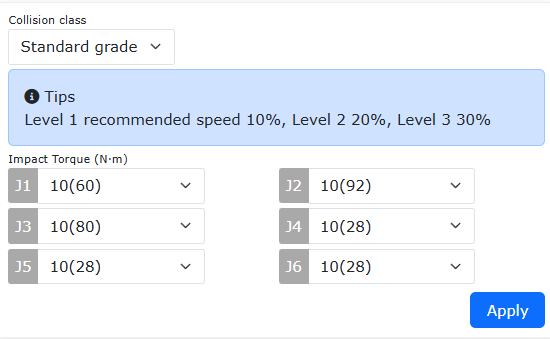

.. centered:: Figura 9.34-6 Modulo di impostazione del coefficiente di collisione del robot

**Step2**: Fare clic in sequenza su "Programma di insegnamento" → "Programmazione" → "Set di controllo di forza" e aggiungere l'istruzione "Impedance". L'istruzione "Impedance" consente al robot di realizzare il controllo di impedenza lungo la traiettoria di movimento.

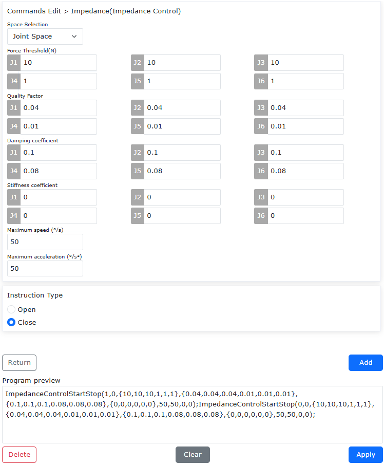

.. centered:: Figura 9.34-7 Aggiunta dell'istruzione di controllo di forza

**Step3**: Nel modulo delle istruzioni di controllo di forza, selezionare "Spazio dei giunti" dal menu a discesa di selezione dello spazio, e impostare nei campi di testo i valori appropriati per soglia di forza, coefficiente di massa, coefficiente di smorzamento, coefficiente di rigidità, velocità massima e accelerazione massima. Nel tipo di istruzione, fare clic su "Attiva", quindi fare clic su "Aggiungi" per aggiungere l'istruzione di attivazione del controllo di impedenza; nel tipo di istruzione, fare clic su "Disattiva", quindi fare clic su "Aggiungi" per aggiungere l'istruzione di disattivazione del controllo di impedenza.

.. image:: coding/557.png
   :width: 6in
   :align: center

.. centered:: Figura 9.34-8 Istruzione di controllo di impedanza

Funzioni specifiche dei parametri e valori consigliati:

- Selezione spazio: Imposta lo spazio operativo per il controllo di impedenza sullo spazio dei giunti;
- Soglia di forza: La forza di attivazione minima per il controllo di impedenza. L'intervallo di soglia per J1-J3 è 10–50 Nm, per le direzioni di rotazione l'intervallo di soglia è 1–10 Nm;
- Coefficiente di massa: Aumentare il coefficiente di massa comporta uno spostamento più lento, diminuirlo comporta uno spostamento troppo rapido del robot. L'intervallo di impostazione per J1-J3 è [0,01-1], valore consigliato 0,04; per J4-J6 l'intervallo di impostazione è [0,001-1], valore consigliato 0,01;
- Coefficiente di smorzamento: Aumentare il coefficiente di smorzamento comporta uno spostamento più lento, diminuirlo comporta uno spostamento troppo rapido del robot e può generare oscillazioni. L'intervallo di impostazione per J1-J3 è [0,1-2], valore consigliato 0,1; per J4-J6 l'intervallo di impostazione è [0,008-1,5], valore consigliato 0,08;
- Coefficiente di rigidità: Aumentare il coefficiente di rigidità comporta uno spostamento più lento. Il valore consigliato è 0;
- Velocità massima: Limita la velocità di rotazione del giunto generata da forze esterne. Il valore consigliato è 50°/s;
- Accelerazione massima: Limita l'accelerazione di rotazione del giunto generata da forze esterne. Il valore consigliato è 50°/s².

Funzione di saldatura oscillante personalizzata
~~~~~~~~~~~~~~~~~~~~~~~~~~~~~~~~~~~~~~~~~~~~~~~~~~~~~~~~~~~~~~~~~~~~~~~~~~~

Panoramica
++++++++++++++++++++++++++++++++

La funzione di saldatura oscillante personalizzata consente di eseguire la saldatura oscillante utilizzando un modello di saldatura oscillante progettato dall'utente.

Descrizione della funzione di saldatura oscillante personalizzata:

- (1) Nell'interfaccia dei parametri di oscillazione, selezionare "Oscillazione personalizzata 0", "Oscillazione personalizzata 1" o "Oscillazione personalizzata 2" per il tipo di oscillazione. Sono disponibili al massimo 3 modelli di saldatura oscillante personalizzati.
- (2) Il numero massimo di endpoint di oscillazione personalizzati è 10, il minimo è 2. L'ultimo endpoint ha dati X, Y, Z fissati a 0 e non modificabili. Il tempo di permanenza per tutti gli endpoint può essere impostato.
- (3) I valori X, Y, Z degli endpoint di oscillazione personalizzati devono essere compresi nell'intervallo -10 mm ~ 10 mm, e la frequenza di oscillazione non deve superare 10.
- (4) Attualmente, le traiettorie lineari, ad arco e circolari complete supportano la saldatura oscillante personalizzata, ma non supportano ancora la funzione di transizione graduale dell'oscillazione.
- (5) Prestare attenzione: quando il tempo di attesa dell'oscillazione è impostato su "Include", il tempo totale di permanenza dell'oscillazione non deve superare la metà del periodo di oscillazione.

Flusso operativo per la funzione di saldatura oscillante personalizzata
+++++++++++++++++++++++++++++++++++++++++++++++++++++++++++++++++++++++++++++

Il flusso operativo per la funzione di saldatura oscillante personalizzata è il seguente:

**Step 1**: Prima registrare i punti di insegnamento di inizio e fine della traiettoria lineare. Quindi fare clic su "Programma di insegnamento", "Programmazione del programma", selezionare "Da punto a punto" per spostare l'estremità del robot al punto di inizio della linea "custWeaveP1", infine selezionare "Linea retta" per spostare il robot al punto finale della linea "custWeaveP2".

**Step 2**: Selezionare il pulsante "Oscillazione", fare clic sul pulsante di modifica del processo di oscillazione, per accedere all'interfaccia di impostazione dei parametri di oscillazione. Selezionare "Oscillazione personalizzata N" (N=0, 1, 2) per "Tipo di oscillazione".

.. image:: coding/478.png
   :width: 6in
   :align: center

.. centered:: Grafico 9.34-1 Interfaccia di impostazione dei parametri di oscillazione

**Step 3**: Dopo aver selezionato il "Tipo di oscillazione", scorrere verso il basso nell'interfaccia di impostazione dei parametri di oscillazione. Nell'interfaccia, selezionare il numero di endpoint di oscillazione personalizzati, impostare la posizione e il tempo di permanenza di ciascun punto nel sistema di coordinate di oscillazione, infine fare clic sul pulsante "Configura".

.. image:: coding/479.png
   :width: 6in
   :align: center

.. centered:: Grafico 9.34-2 Interfaccia di impostazione dell'oscillazione personalizzata

**Step 4**: Nell'interfaccia di oscillazione, nel "Tipo di istruzione", selezionare in sequenza "Inizia oscillazione", "Termina oscillazione" e fare clic sul pulsante "Aggiungi", infine fare clic sul pulsante "Applica".

.. image:: coding/480.png
   :width: 6in
   :align: center

.. centered:: Grafico 9.34-3 Interfaccia di impostazione delle istruzioni di oscillazione

**Step 5**: Nell'interfaccia di modifica del programma, selezionare l'istruzione di inizio oscillazione, fare clic sul pulsante "Sposta su" nella parte superiore dell'interfaccia, infine salvare il programma. Passare il robot in modalità automatica, fare clic sul pulsante "Inizia", il robot inizierà l'oscillazione personalizzata sulla traiettoria lineare.

.. image:: coding/481.png
   :width: 6in
   :align: center

.. centered:: Grafico 9.34-4 Interfaccia originale delle istruzioni LUA

.. image:: coding/482.png
   :width: 6in
   :align: center

.. centered:: Grafico 9.34-5 Interfaccia delle istruzioni LUA modificata

**Step 6**: I passaggi di impostazione per l'oscillazione personalizzata sulle traiettorie ad arco e circolari complete sono gli stessi dello Step 1-Step 5.

Configurazione dei punti di insegnamento
~~~~~~~~~~~~~~~~~~~~~~~~~~~~~~~~~~~~~~~~~~~~~~~~~~~~~~~~~~~~~~

Fare clic su "Configurazione punti di insegnamento" per accedere all'interfaccia della funzionalità di configurazione dei punti di insegnamento.

Prima di utilizzare la funzionalità di registrazione dei punti di insegnamento tramite la scatola pulsanti o altri segnali IO, l'utente deve configurare il prefisso del nome del punto di insegnamento, il limite superiore del numero e il metodo di insegnamento. Il prefisso del nome supporta due modalità: prefisso personalizzato e utilizzo del nome del programma corrente come prefisso. Ad esempio, con un prefisso di nome personalizzato "P", limite superiore del numero "3", metodo di insegnamento "Insegnamento robot", i punti registrati per l'estremità corrente (utensile) del robot saranno in sequenza: P1, P2, P3. La registrazione successiva sovrascriverà i punti registrati in precedenza.

.. image:: coding/483.png
   :width: 4in
   :align: center

.. centered:: Grafico 9.35-1 Configurazione dei punti di insegnamento

Aggiornamento automatico del programma Lua con registrazione punti dell'estremità
++++++++++++++++++++++++++++++++++++++++++++++++++++++++++++++++++++++++++++++++++++++++++

Configurazione della funzionalità di registrazione punti dell'estremità
**************************************************************************************

1. Attivare la funzionalità di registrazione punti dell'estremità, fare clic su Impostazioni. È possibile selezionare i programmi Lua per i quali aggiornare i punti tramite l'interruttore.

.. image:: coding/484.png
   :width: 4in
   :align: center

.. centered:: Grafico 9.35‑2 Attivazione della funzionalità di registrazione punti dell'estremità

2. Dopo aver completato la configurazione, il nome dei punti registrati dall'estremità avrà prefisso "test", il limite superiore del numero è 10, selezionare tutti i programmi Lua per l'aggiornamento. Chiudere WebApp, la funzionalità rimane attiva.
   
Aggiornamento automatico del programma Lua con registrazione punti tramite pulsante dell'estremità
*********************************************************************************************************************************

1. Fare clic sul pulsante di registrazione punti dell'estremità del robot.

.. image:: coding/485.png
   :width: 4in
   :align: center

.. centered:: Grafico 9.35‑3 Pulsante di registrazione punti dell'estremità

2. In questo momento, lo stato di illuminazione LED dell'estremità: lampeggio viola (inizio) -> luce blu fissa (registrazione punto e aggiornamento Lua in corso) -> luce verde fissa (registrazione punto completata). Le informazioni sui punti con il nome corrispondente nel programma Lua selezionato vengono aggiornate in modo sincrono.

.. image:: coding/486.png
   :width: 4in
   :align: center

.. centered:: Grafico 9.35‑3 Cambiamenti LED durante la registrazione punti e l'aggiornamento del programma Lua

3. In caso di fallimento della registrazione punto, lo stato di illuminazione LED dell'estremità: lampeggio viola (inizio) -> lampeggio rosso (registrazione punto fallita) -> luce verde fissa (ritorno alla normalità).

.. image:: coding/487.png
   :width: 4in
   :align: center

.. centered:: Grafico 9.35‑4 Cambiamenti LED in caso di fallimento della registrazione punti dell'estremità

Esempio di utilizzo della funzionalità
********************************************************

1. Prefisso personalizzato: test, limite superiore del numero 5, metodo di insegnamento selezionare insegnamento robot, attivare la funzionalità di registrazione punti dell'estremità, fare clic su Impostazioni.

2. Abilitare il programma Lua program1 per l'aggiornamento dei punti.

.. image:: coding/488.png
   :width: 4in
   :align: center

.. centered:: Grafico 9.35‑5 Configurazione dei punti di insegnamento

3. La figura seguente mostra il programma program1 e la sua traiettoria di esecuzione corrente.

.. image:: coding/489.png
   :width: 6in
   :align: center

.. centered:: Grafico 9.35‑6 Programma program1 e traiettoria di esecuzione corrente

4. Passare la pagina in modalità manuale, trascinare il robot in una nuova posizione, fare clic sul pulsante di registrazione punti dell'estremità, attendere il completamento del lampeggio LED dell'estremità: lampeggio viola (inizio) -> luce blu fissa (registrazione punto e aggiornamento Lua in corso) -> luce verde fissa (registrazione punto completata). In questo momento, il punto registrato è test1.
5. Ripetere il passaggio 4, registrare in sequenza test2, test3, test4, test5, completando la registrazione di 5 punti. A questo punto, i punti del programma program1 sono stati aggiornati in modo sincrono.
6. Eseguire nuovamente il programma program1, la traiettoria di movimento è ora aggiornata, come mostrato nella figura seguente.

.. image:: coding/490.png
   :width: 4in
   :align: center

.. centered:: Grafico 9.35‑7 Traiettoria di esecuzione aggiornata

Configurazione del programma principale
~~~~~~~~~~~~~~~~~~~~~~~~~~~~~~~~~~~~~~~~~~~~~~~~~~~~~~~~

Fare clic su "Configurazione programma principale" per accedere all'interfaccia della funzionalità di configurazione del programma principale.

La configurazione del programma principale può essere utilizzata insieme alla configurazione DI per l'avvio del programma principale. Il programma principale configurato deve essere prima eseguito in prova per garantire la sicurezza. Dopo aver configurato il DI corrispondente nella configurazione del robot per la funzione di segnale di avvio del programma principale, l'utente può controllare quel segnale DI per eseguire il programma principale.

.. image:: coding/491.png
   :width: 4in
   :align: center

.. centered:: Grafico 9.36‑1 Configurazione del programma principale

Saldatura a linee intersecanti con asse esteso del robot
~~~~~~~~~~~~~~~~~~~~~~~~~~~~~~~~~~~~~~~~~~~~~~~~~~~~~~~~~~~~~~~~~~

Composizione del sistema
++++++++++++++++++++++++++++++++++

.. image:: coding/497.png
   :width: 6in
   :align: center

.. centered:: Grafico 9.37‑1 Composizione del sistema di saldatura a linee intersecanti con asse esteso del robot

Nel sistema, (a) è il computer, (b) è il robot e il suo quadro di controllo, (c) è il posizionatore e il dispositivo di azionamento, (d) è la saldatrice e le apparecchiature accessorie.

Configurazione della comunicazione per l'asse esteso
++++++++++++++++++++++++++++++++++++++++++++++++++++++++

I metodi di comunicazione tra il robot e l'asse esteso includono l'utilizzo di UDP o RS485.

.. image:: coding/498.png
   :width: 6in
   :align: center

.. centered:: Grafico 9.37‑2 Pagina di configurazione dell'asse esteso
 
Nell'interfaccia operativa del robot, fare clic su "Impostazioni iniziali", "Periferiche", "Asse esteso", per accedere alla pagina di configurazione dell'asse esteso. Prendendo come esempio la connessione di un PLC al robot tramite comunicazione UDP, fare clic sull'icona "Comunicazione UDP", per accedere alla pagina di configurazione dell'asse esteso con comunicazione UDP.

.. image:: coding/499.png
   :width: 6in
   :align: center

.. centered:: Grafico 9.37‑3 Interfaccia di configurazione della comunicazione UDP
 
Nella pagina di configurazione dell'asse esteso con comunicazione UDP, è possibile selezionare il numero dell'asse esteso corrispondente, connettersi e configurare i parametri di comunicazione UDP (indirizzo, porta, periodo, rilevamento perdita pacchetti, ecc.), nonché il tempo di completamento del posizionamento dell'asse esteso.

Il contenuto della configurazione dell'asse esteso non è l'obiettivo principale di questa introduzione alla funzione. Per la configurazione dettagliata, consultare il manuale utente corrispondente.

Configurazione della connessione della saldatrice
+++++++++++++++++++++++++++++++++++++++++++++++++++
Configurare la saldatrice tramite la seguente pagina di configurazione:

.. image:: coding/500.png
   :width: 6in
   :align: center

.. centered:: Grafico 9.37‑4 Pagina di configurazione della saldatrice

La comunicazione con la saldatrice può utilizzare comunicazione IO o comunicazione RS485. Fare clic su "Impostazioni iniziali", "Periferiche", "Saldatrice", per accedere all'interfaccia di configurazione e connessione. È possibile configurare moduli come "Tipo di controllo", "Configurazione I/O", "Parametri processo di saldatura", "Debug saldatrice", ecc.

Il contenuto della configurazione della saldatrice non è l'obiettivo principale di questa introduzione alla funzione. Per la configurazione dettagliata, consultare il manuale utente corrispondente.

Calibrazione del sistema di coordinate dell'utensile
++++++++++++++++++++++++++++++++++++++++++++++++++++
Dopo aver installato la torcia di saldatura sull'estremità del robot, calibrare la torcia di saldatura:

.. image:: coding/501.png
   :width: 6in
   :align: center

.. centered:: Grafico 9.37‑5 Pagina di configurazione del sistema di coordinate dell'utensile

Fare clic su "Impostazioni iniziali", "Base", "Coordinate utensile", per accedere alla pagina di impostazione del sistema di coordinate dell'utensile.

.. image:: coding/502.png
   :width: 6in
   :align: center

.. centered:: Grafico 9.37‑6 Selezione del metodo a 6 punti per calibrare la torcia di saldatura

Selezionare un sistema di coordinate vuoto, selezionare il tipo di utensile come "Utensile", scegliere il metodo a 6 punti per calibrare l'utensile torcia di saldatura. Si consiglia di calibrare l'orientamento del sistema di coordinate dell'utensile come mostrato nella Figura 4-3 seguente.

.. image:: coding/503.png
   :width: 4in
   :align: center

.. centered:: Grafico 9.37‑7 Diagramma dell'orientamento del sistema di coordinate della torcia di saldatura

Il contenuto della calibrazione del sistema di coordinate dell'utensile non è l'obiettivo principale di questa introduzione alla funzione. Per il metodo di calibrazione dettagliato, consultare il manuale utente corrispondente.

Funzione di saldatura a linee intersecanti
++++++++++++++++++++++++++++++++++++++++++++++++++++

Il movimento della traiettoria per la saldatura a linee intersecanti ha due forme: una utilizza un posizionatore a due gradi di libertà a L per il movimento a linee intersecanti, l'altra esegue direttamente il movimento a linee intersecanti senza utilizzare un posizionatore.

Calibrazione del sistema di coordinate dell'asse esteso
*************************************************************

Quando si utilizza il sistema di coordinate dell'asse esteso per realizzare il movimento sincronizzato tra il posizionatore e il robot, è necessario calibrare il sistema di coordinate dell'asse esteso.

.. image:: coding/504.png
   :width: 6in
   :align: center

.. centered:: Grafico 9.37‑8 Pagina di impostazione del sistema di coordinate dell'asse esteso

Fare clic su "Impostazioni iniziali", "Periferiche", "Asse esteso", per accedere all'interfaccia di impostazione del sistema di coordinate dell'asse esteso. Selezionare il numero dell'asse esteso da impostare, fare clic sul pulsante di modifica, selezionare "1-Posizionatore a due gradi di libertà a L" e salvare.

.. image:: coding/505.png
   :width: 6in
   :align: center

.. centered:: Grafico 9.37‑9 Pagina di calibrazione dell'asse esteso
 
Durante la calibrazione dell'asse esteso, prestare attenzione a selezionare "Posizione robot relativa all'asse esteso" come "Esterno all'asse esteso". Per il caso del posizionatore, selezionare il metodo a 4 punti per la calibrazione.

Il contenuto della calibrazione dell'asse esteso non è l'obiettivo principale di questa introduzione alla funzione. Per il metodo di calibrazione dettagliato, consultare il manuale utente corrispondente.

Saldatura della traiettoria a linee intersecanti
***************************************************

In base ai punti di insegnamento registrati sulle sezioni trasversali del tubo principale e del tubo di giunzione, è possibile stabilire il sistema di coordinate del pezzo come mostrato nella figura seguente. L'origine del sistema di coordinate si trova nel punto di intersezione degli assi del tubo principale e del tubo di giunzione. L'asse X è parallelo all'asse del tubo principale, puntando verso la sezione trasversale in cui sono stati registrati i punti di insegnamento. L'asse Z è parallelo all'asse del tubo di giunzione, puntando verso il piano in cui sono stati registrati i punti di insegnamento.

.. image:: coding/506.png
   :width: 4in
   :align: center

.. centered:: Grafico 9.37‑10 Sistema di coordinate del pezzo per la traiettoria a linee intersecanti

Metodo senza posizionatore
""""""""""""""""""""""""""""""""""""""""""""""""""""""""""""""""
**Step 1**: Registrare 6 punti di insegnamento rispettivamente sulle sezioni trasversali del tubo principale e del tubo di giunzione.

**Step 2**: Fare clic su "Programma di insegnamento", "Programmazione del programma", trovare "Linee intersecanti" in "Istruzioni di movimento", per accedere alla pagina di impostazione della traiettoria a linee intersecanti.

.. image:: coding/507.png
   :width: 6in
   :align: center

.. centered:: Grafico 9.37‑11 Pagina di impostazione della traiettoria a linee intersecanti

**Step 3**: Nella pagina di impostazione della traiettoria a linee intersecanti, selezionare "Disabilita" per "Punti asse esteso", completare le impostazioni per il movimento del punto di inizio, direzione di movimento, velocità e accelerazione, valore di offset. La direzione antioraria per la direzione di movimento è data dalla regola della mano destra: afferrare l'asse Z del sistema di coordinate del pezzo con la mano destra, la direzione delle quattro dita indica il senso antiorario.

**Step 4**: Nella sezione "Dati punti linee intersecanti" della pagina di impostazione della traiettoria a linee intersecanti, selezionare i punti di insegnamento registrati. Dopo il completamento delle impostazioni, fare clic sui pulsanti "Aggiungi" e "Applica".

.. image:: coding/508.png
   :width: 6in
   :align: center

.. centered:: Grafico 9.37‑12 Impostazione dell'istruzione per la traiettoria a linee intersecanti

**Step 5**: Fare clic sul pulsante "Saldatura" sotto "Istruzioni di saldatura", per accedere alla pagina di impostazione della saldatura. Selezionare le istruzioni "Accensione arco" e "Estinzione arco", fare clic sui pulsanti "Aggiungi" e "Applica". Dopo l'aggiunta riuscita, spostare l'istruzione LUA di accensione arco di una riga verso l'alto.

.. image:: coding/509.png
   :width: 6in
   :align: center

.. centered:: Grafico 9.37‑13 Impostazione delle istruzioni di saldatura
 
Di seguito è riportato un tipico programma LUA per la saldatura a linee intersecanti senza posizionatore:

.. image:: coding/510.png
   :width: 6in
   :align: center

.. centered:: Grafico 9.37‑14 Programma di esempio per la saldatura a linee intersecanti senza posizionatore

Metodo con posizionatore a due gradi di libertà a L
""""""""""""""""""""""""""""""""""""""""""""""""""""""""""""""""""""""""

**Step 1**: Registrare 6 punti di insegnamento rispettivamente sulle sezioni trasversali del tubo principale e del tubo di giunzione, ruotare gli assi 1 e 2 del posizionatore e registrare 4 punti di insegnamento per il posizionatore.

**Step 2**: Fare clic su "Programma di insegnamento", "Programmazione del programma", trovare "Linee intersecanti" in "Istruzioni di movimento", per accedere alla pagina di impostazione della traiettoria a linee intersecanti.

.. image:: coding/511.png
   :width: 6in
   :align: center

.. centered:: Grafico 9.37‑15 Pagina di impostazione della traiettoria a linee intersecanti

**Step 3**: Nella pagina di impostazione della traiettoria a linee intersecanti, selezionare "Abilita" per "Punti asse esteso", selezionare i punti di insegnamento del posizionatore registrati, completare le impostazioni per il movimento del punto di inizio, direzione di movimento, velocità e accelerazione, valore di offset.

**Step 4**: Nella sezione "Dati punti linee intersecanti" della pagina di impostazione della traiettoria a linee intersecanti, selezionare i punti di insegnamento registrati. Dopo il completamento delle impostazioni, fare clic sui pulsanti "Aggiungi" e "Applica".

.. image:: coding/512.png
   :width: 6in
   :align: center

.. centered:: Grafico 9.37‑16 Impostazione dell'istruzione per la traiettoria a linee intersecanti

**Step 5**: Fare clic sul pulsante "Saldatura" sotto "Istruzioni di saldatura", per accedere alla pagina di impostazione della saldatura. Selezionare le istruzioni "Accensione arco" e "Estinzione arco", fare clic sui pulsanti "Aggiungi" e "Applica". Dopo l'aggiunta riuscita, spostare l'istruzione LUA di accensione arco di una riga verso l'alto.

.. image:: coding/513.png
   :width: 6in
   :align: center

.. centered:: Grafico 9.37‑17 Impostazione delle istruzioni di saldatura
 
Di seguito è riportato un tipico programma LUA per la saldatura a linee intersecanti con posizionatore:

.. image:: coding/514.png
   :width: 6in
   :align: center

.. centered:: Grafico 9.37‑18 Programma di esempio per la saldatura a linee intersecanti con posizionatore

Funzione di Stampa PrintMsg() del Programma LUA del Robot
~~~~~~~~~~~~~~~~~~~~~~~~~~~~~~~~~~~~~~~~~~~~~~~~~~~~~~~~~~~~~~~~~~~~~~~~~~~~~~~~~~~~~~~~~~~~~~~~~~~~~~~~~~~~

Il programma LUA del robot dispone di istruzioni di stampa integrate che possono visualizzare informazioni specifiche nella finestra di stampa WebApp. Questa funzione supporta la stampa di valori numerici, stringhe, tabelle, booleani, ecc., ed è dotata di capacità ausiliarie come archiviazione dei log di stampa, ricerca dei contenuti e download dei log, facilitando il debug e il tracciamento dei dati.

Modifica e Aggiunta di Istruzioni di Stampa
++++++++++++++++++++++++++++++++++++++++++++++++++++++++++++++++++++

Fare clic sul pulsante "Stampa" nella pagina "Istruzioni Logiche" per aprire la pagina di modifica dell'istruzione di stampa PrintMsg(). Innanzitutto, impostare rispettivamente il testo di stampa e il tipo di dati.

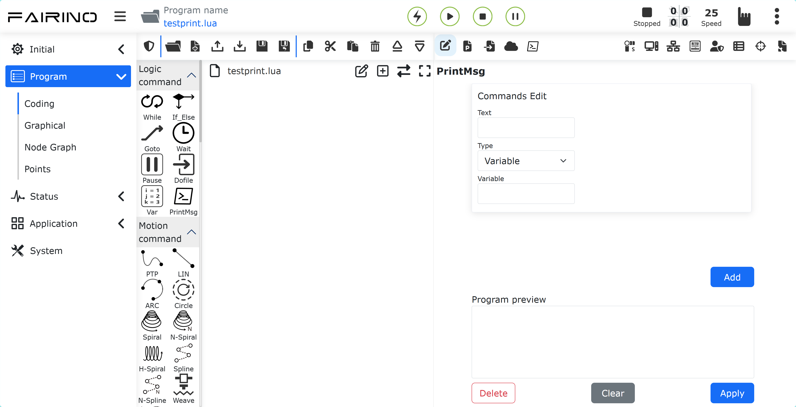

.. centered:: Figura 9.39‑1 Pagina di Modifica dell'Istruzione di Stampa   

- **Testo**: Inserire una stringa descrittiva personalizzata per indicare il significato del contenuto stampato, ad esempio "robot current pos :", "recv socket value :", ecc.
- **Tipo**: Suddiviso in "Variabile" e "Funzione", selezionare in base alle esigenze.
- **Variabile**: Stampare valori di variabili personalizzate, supportando variabili di tipo numerico, stringa, tabella, booleano, ecc.
- **Funzione**: Stampare il valore restituito della funzione dell'istruzione specificata. Dopo aver selezionato questo tipo, è possibile scegliere la funzione target dall'elenco delle funzioni sottostante, come GetActualTCPPose() per ottenere la posizione TCP del robot, GetDI() per leggere lo stato di ingresso DI del controller, GetActualJointPosDegree() per ottenere gli angoli correnti delle articolazioni del robot, ecc.

Prendendo come esempio la stampa della posizione corrente delle articolazioni del robot: inserire il testo di stampa "robot current joint pos :", selezionare Funzione come tipo di dati e scegliere la funzione GetActualJointPosDegree(), quindi fare clic su Aggiungi e Applica in sequenza. Il sistema genererà automaticamente l'istruzione di stampa corrispondente nel programma LUA:

.. code-block:: console
    :linenos:

    PrintMsg("robot current joint pos :",GetActualJointPosDegree())

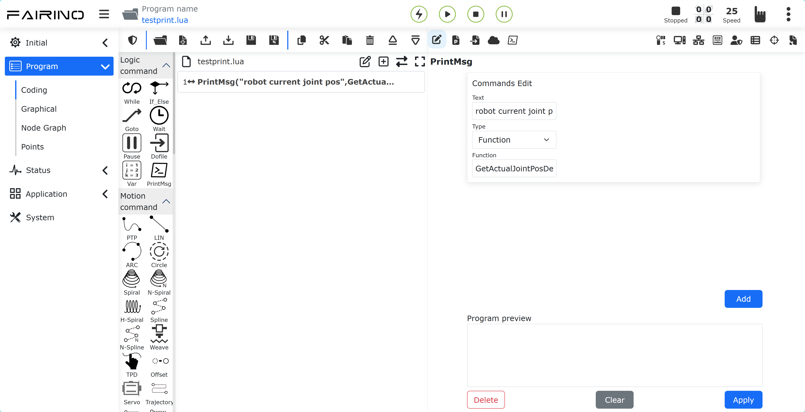

.. centered:: Figura 9.39‑2 Aggiunta di un'Istruzione di Stampa   

È inoltre possibile passare il pannello del programma alla pagina modificabile, inserire il nome dell'istruzione PrintMsg() e inserire il contenuto da stampare nei parametri, separando più contenuti stampabili con virgole.

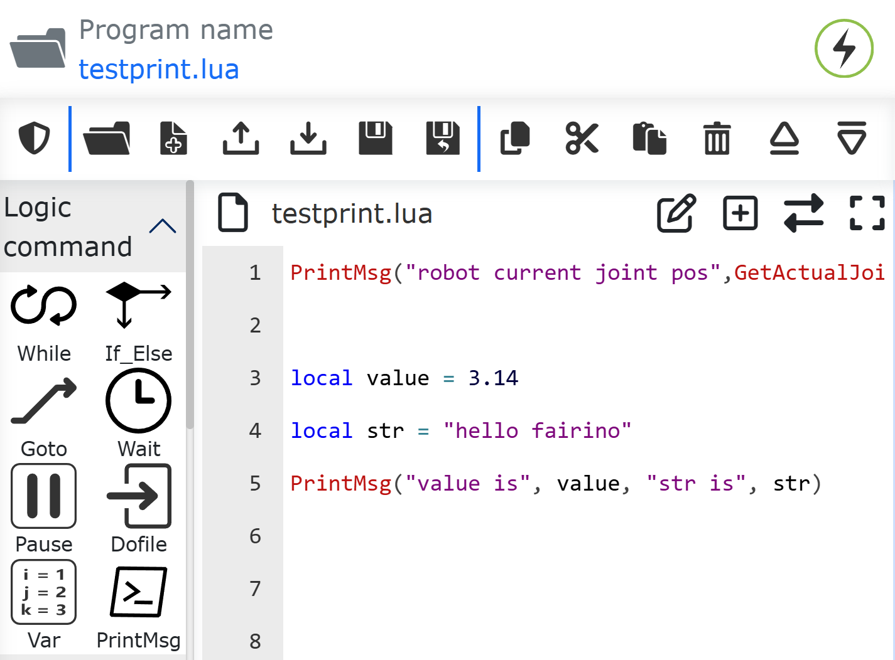

.. centered:: Figura 9.39‑3 Scrittura di Informazioni di Stampa Personalizzate  

Visualizzazione delle Informazioni di Stampa e Operazioni di Base
++++++++++++++++++++++++++++++++++++++++++++++++++++++++++++++++++++

Fare clic sul pulsante di visualizzazione stampa per aprire la finestra pop-up delle informazioni di stampa. Passare il robot alla modalità automatica ed eseguire il programma. Il contenuto stampato verrà visualizzato in tempo reale nella finestra. Ogni messaggio contiene quattro informazioni: timestamp, nome del programma LUA, numero di riga del codice e contenuto stampato.

.. image:: coding/576.png
   :width: 6in
   :align: center

.. centered:: Figura 9.39‑4 Finestra di Visualizzazione del Contenuto Stampato  

Cancellazione del Contenuto Stampato
*******************************************************************

Fare clic sul pulsante "Cancella" nella parte superiore della finestra di stampa per cancellare tutto il contenuto visualizzato nella finestra con un solo clic.

.. image:: coding/577.png
   :width: 6in
   :align: center

.. centered:: Figura 9.39‑5 Cancellazione del Contenuto Stampato  

Ricerca del Contenuto Stampato
*******************************************************************

Inserire la parola chiave target nella casella di ricerca e fare clic su Trova. La finestra mostrerà solo i record di stampa che contengono la parola chiave, nascondendo il resto. Dopo aver svuotato la casella di ricerca e fare clic nuovamente su Trova, tutte le informazioni di stampa verranno ripristinate.

.. image:: coding/578.png
   :width: 6in
   :align: center

.. centered:: Figura 9.39‑6 Ricerca del Contenuto Stampato  

Configurazione e Gestione dei Log di Stampa
++++++++++++++++++++++++++++++++++++++++++++++++++++++++++++++++++++

Configurazione dei Parametri di Archiviazione dei Log di Stampa
*******************************************************************

Nel webapp, fare clic su "Impostazioni di Sistema" e "Modalità Manutenzione" in sequenza per entrare nella modalità di manutenzione. Trovare i moduli "Gestione Log" e "Log di Stampa" per configurare l'attivazione/disattivazione della funzione di archiviazione dei log di stampa, impostare il numero di file da salvare e il numero massimo di voci di stampa per singolo file di log. Dopo aver abilitato l'archiviazione dei log di stampa, tutti i dati di stampa verranno automaticamente scritti nei file di log.

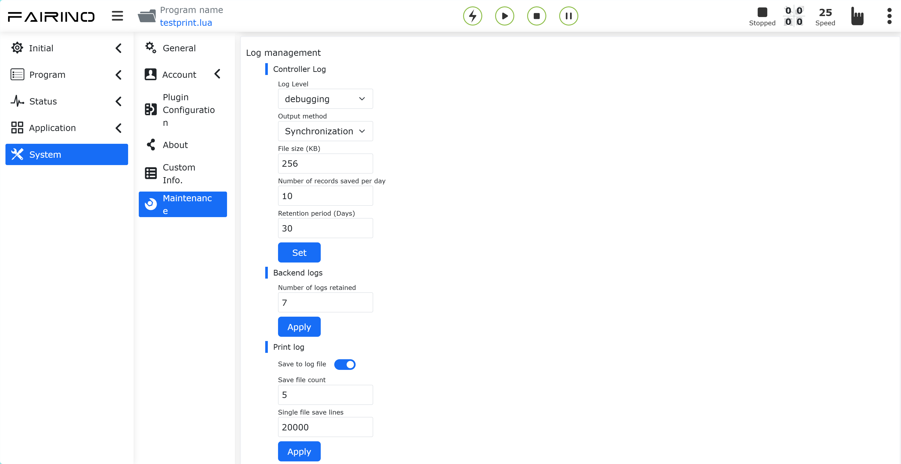

.. centered:: Figura 9.39‑7 Configurazione dei Parametri di Archiviazione dei Log di Stampa 

Quando il dispositivo robot riavvia il sistema o il numero di voci in un singolo file di log raggiunge il limite impostato, viene automaticamente creato un nuovo file di log e viene attivata la rotazione dei log. Quando il numero totale di file di log supera il limite massimo di archiviazione, il sistema eliminerà automaticamente i file di log più vecchi.

Download dei Log di Stampa
*******************************************************************

Fare clic sul pulsante di download nella parte superiore della finestra di stampa per scaricare tutto il contenuto stampato nella finestra corrente sul computer locale.

.. image:: coding/580.png
   :width: 6in
   :align: center

.. centered:: Figura 9.39‑8 Download dei Log di Stampa 

Oltre al download diretto dei log di stampa, i log di stampa sono inclusi anche durante il download dei log del controller e dei file sorgente dati completi.

Esempi di Codice delle Istruzioni di Stampa
++++++++++++++++++++++++++++++++++++++++++++++++++++++++++++++++++++

Stampa della Posizione Target Ricevuta dal Robot
*******************************************************************

Di seguito è riportato un programma in cui il robot legge le posizioni Cartesiane x, y, z target da un slave ModbusTCP e controlla il movimento del robot verso la posizione target. Nel programma, ogni volta che viene letta la posizione target, viene utilizzata l'istruzione PrintMsg() per stampare la posizione target.

.. image:: coding/581.png
   :width: 6in
   :align: center

.. centered:: Figura 9.39‑9 Esempio di Stampa della Posizione Target del Robot 

Stampa della Posizione in Tempo Reale del Robot e dei Dati DI della Scatola di Controllo
**************************************************************************************************

Di seguito è riportato un programma di movimento non bloccante del robot che stampa la posizione del robot e i valori DI della scatola di controllo in tempo reale durante il movimento.

.. note:: Nota: Quando si chiama l'istruzione di stampa PrintMsg() in un ciclo, è necessario utilizzare l'istruzione sleep_ms() per impostare l'intervallo di sospensione del ciclo per evitare un ciclo infinito.

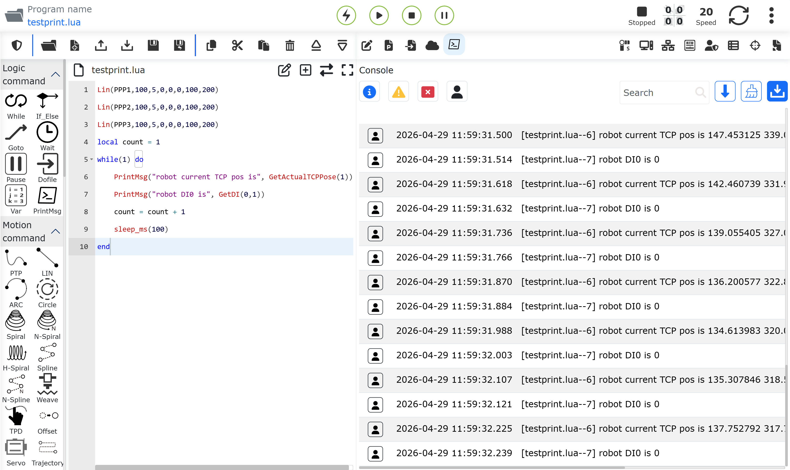

.. centered:: Figura 9.39‑10 Esempio di Stampa della Posizione Corrente e DI Durante il Movimento del Robot   

Ottimizzazione della Funzione di Caricamento Web per Grandi Programmi LUA e Sottoprogrammi
~~~~~~~~~~~~~~~~~~~~~~~~~~~~~~~~~~~~~~~~~~~~~~~~~~~~~~~~~~~~~~~~~~~~~~~~~~~~~~~~~~~~~~~~~~~~~~~~~~~~~~~~~~~~~~~~~~~~~~~~~~~~~~~~~~~~~~~~~~

Contesto
++++++++++++++++++++++++++++++++++++++++++++++

Attualmente il robot non è in grado di gestire grandi programmi LUA (200k+ righe). Quando si carica un grande programma LUA, la pagina web non riesce a caricarlo e utilizzarlo.

Allo stesso tempo, durante l'importazione dei programmi, la logica di importazione corrente non esegue l'analisi e la validazione del programma. Dopo l'importazione, il programma deve essere aperto manualmente e salvato per la validazione. Quando si utilizzano contemporaneamente un gran numero di chiamate a sottoprogrammi, è necessario aprirli manualmente uno per uno, con notevole dispendio di tempo e una drastica riduzione dell'efficienza lavorativa.

Panoramica
++++++++++++++++++++++++++++++++++++++++++++++

Questa ottimizzazione riguarda i programmi importati. Il backend li analizza e li salva automaticamente. Dopo il caricamento dei sottoprogrammi successivi, possono essere chiamati direttamente senza bisogno di apertura e salvataggio manuali.

Per i grandi programmi LUA, quando il frontend web importa un grande programma LUA (un programma LUA nativo che non richiede una seconda analisi), viene nominato con il prefisso RAW, come RAW_test.lua. Questo tipo di programma indica che il programma è composto interamente da istruzioni LUA native e non contiene informazioni applicative di business. Può essere inserito direttamente nell'interprete LUA per l'esecuzione. Il controller deve solo eseguire la validazione sintattica, senza analizzare riga per riga. Questo riduce significativamente il tempo di analisi dell'importazione del file. Allo stesso tempo, il frontend non esegue più il rendering animato per i grandi programmi LUA; i programmi vengono visualizzati in formato testo semplice e non vengono più mostrati l'evidenziazione dinamica e i numeri di riga in esecuzione, migliorando l'efficienza del rendering dei dati del frontend. Per le istruzioni specifiche che necessitano di analisi, fare riferimento al Capitolo 1.4.

Dopo l'importazione di un programma, il Web deve visualizzare un indicatore di avanzamento e un messaggio di conferma al termine dell'importazione.

Per i grandi programmi LUA, si consiglia di utilizzare i sottoprogrammi insieme al metodo `RAW_` per migliorare l'efficienza operativa.

Procedura Operativa per Grandi Programmi LUA
+++++++++++++++++++++++++++++++++++++++++++++++++++++++++++++++++++++++++++++++++++++++++++++++++++++++++++++++++++++++++++

**Passo 1**: Assegnare al grande programma LUA il prefisso `RAW_`, ad esempio RAW_test200000.lua.

**Passo 2**: Aprire la pagina web, fare clic su "Teach Program" -> "Program Programming" in sequenza, selezionare il comando "Importa" e scegliere RAW_test200000.lua nella selezione dei file "Importa".

.. image:: coding/587.png
   :width: 6in
   :align: center

.. centered:: Figura 9.40‑1 Importazione File `RAW_`    

**Passo 3**: Attendere il completamento dell'importazione. Al termine dell'importazione, le operazioni di importazione, analisi, salvataggio e rendering sono già state completate e il file può essere eseguito direttamente.

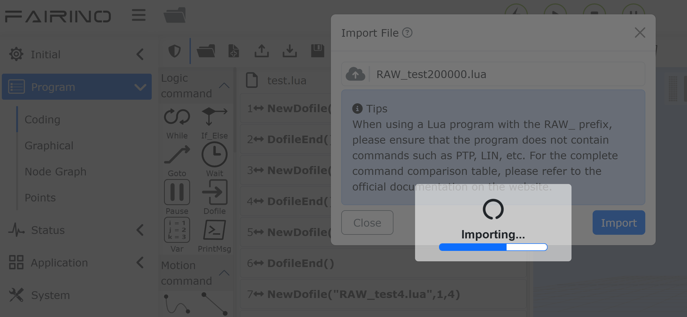

.. centered:: Figura 9.40‑2 Attesa Importazione   

Procedura Operativa per Sottoprogrammi
+++++++++++++++++++++++++++++++++++++++++++++++++++++++++++++++++++++++++++++++++++++++++++++++++++++++++++++++++++++++++++

**Passo 1**: Aprire la pagina web, fare clic su "Teach Program" -> "Program Programming" in sequenza, selezionare il comando "Importa" e selezionare in batch il programma principale e i sottoprogrammi nella selezione dei file "Importa".

**Passo 2**: Attendere che tutti i programmi vengano importati con successo, passare il robot alla modalità automatica e il programma principale può essere eseguito direttamente.

Precauzioni
++++++++++++++++++++++++++++++++++++++++++++++++++++++++++++++++++++++++++++++++++++++++++++++++

I file `RAW_` eseguono solo la validazione sintattica e non analizzano e generano il contenuto del file riga per riga. Contengono informazioni sui punti, operazioni IO e altre funzioni LUA integrate personalizzate per la comodità del cliente. Tali funzioni devono essere combinate con i dati personalizzati dell'utente per la generazione secondaria in funzioni LUA direttamente eseguibili e non possono essere utilizzate nei file `RAW_`.

.. image:: coding/589.png
   :width: 6in
   :align: center

.. centered:: Figura 9.40‑3 Diagramma di Flusso dell'Importazione del Programma LUA 

Per la scrittura di file `RAW_`, fare riferimento al Manuale Utente dello Script di Programmazione FRLua. Le seguenti funzioni LUA richiedono l'analisi e non sono applicabili ai file `RAW_`.

laserPTP(), EXT_AXIS_PTP(), SPTP(), NewSP(), SplinePTP(), laserLin(), SLIN(), Lin(), laserARC(), ARC() 
laserCircle(), Circle(), TCPComputeCircleCenter(), unifCircle(), NewSpiral(), Spiral(), SCIRC() 
ModbusSlaveWriteDO(), ModbusSlaveWriteDI(), ModbusSlaveWriteAO(), ModbusSlaveWriteAI(), ModbusSlaveReadDO(), ModbusSlaveReadDI(), ModbusSlaveReadAO(), ModbusSlaveReadAI(), ModbusSlaveWaitDI(), ModbusSlaveWaitAI()
ModbusMasterWriteDO(), ModbusMasterWriteAO(), ModbusMasterReadDO(), ModbusMasterReadDI(), ModbusMasterReadAO(), ModbusMasterReadAI(), ModbusMasterWaitDI(), ModbusMasterWaitAI()
ModbusSlaveWriteDO_RTU(), ModbusSlaveWriteDI_RTU(), ModbusSlaveWriteAO_RTU(), ModbusSlaveWriteAI_RTU(), ModbusSlaveReadDO_RTU(), ModbusSlaveReadDI_RTU(), ModbusSlaveReadAO_RTU(), ModbusSlaveReadAI_RTU(), ModbusSlaveWaitDI_RTU(), ModbusSlaveWaitAI_RTU()
ModbusMasterWriteDO_RTU(), ModbusMasterWriteAO_RTU(), ModbusMasterReadDO_RTU(), ModbusMasterReadDI_RTU(), ModbusMasterReadAO_RTU(), ModbusMasterReadAI_RTU(), ModbusMasterWaitDI_RTU(), ModbusMasterWaitAI_RTU(), SetAO(), SetAuxAO(), SetToolAO(), WaitAI()
FieldBusSlaveWaitAI(), WaitToolAI(), WaitAuxAI(), SPLCSetAO(), SPLCSetToolAO(), SetToolList(), SetWObjList(), SetExToolList(), PostureAdjustOn(), RegisterVar(), SetSysVarValue(), GetSysVarValue(), MultilayerOffsetTrsfToBase(), GetSegWeldDisDir(), DMP()
LTSearchStart(), PointTableSwitch(), GetSegmentWeldPoint(), LaserRecordPoint(), GetIntersectionThrough3Point(), GetIntersectionThrough4Point(), GetUserVal(), SetUserVal(), MoveToIntersectLineStart(), MoveIntersectLine(), OriginPointWeaveStart()
MatrixMoveStart(), MatrixMoveEnd(), MatrixSetCountPlus(), MatrixGetCount(), MatrixSetStartCount().   