Coding
===============

.. toctree:: 
   :maxdepth: 6
 
Introduction
~~~~~~~~~~~~~~

Click the command on the left to add a program node to the program tree. When the program is running, the currently executed program node is highlighted in green.

In manual mode, click the first icon on the right side of the node to make the robot execute the instruction alone, and the second icon is to edit the content of the node.

.. image:: coding/001.png
   :width: 6in
   :align: center

.. centered:: Figure 9.1-1 Program tree interface

Click "⇄" to switch modes, and the teaching program text can be changed to the editing state.

.. image:: coding/002.png
   :width: 6in
   :align: center

.. centered:: Figure 9.1-2 Teaching program editing status

The icons to the right of the program name are described as follows:

.. note:: 
   .. image:: coding/003.png
      :height: 0.75in
      :align: left

   name: **Expand/Zoom**
   
   effect: Expand/zoom the program tree interface

.. note:: 
   .. image:: coding/004.png
      :height: 0.75in
      :align: left

   name: **Add teaching points**
   
   effect: Add a local teaching point to the current program

.. note:: 
   .. image:: coding/005.png
      :height: 0.75in
      :align: left

   name: **Rename**
   
   effect: Rename the current program

Tool bar
~~~~~~~~~~

Modify the program tree using the toolbar at the bottom of the program tree.

.. note:: 
   .. image:: coding/006.png
      :height: 0.75in
      :align: left

   name: **Open**
   
   effect: Open user program file

.. note:: 
   .. image:: coding/007.png
      :height: 0.75in
      :align: left

   name: **New build**
   
   effect: Select a template to create a new program file
   
.. note:: 
   .. image:: coding/008.png
      :height: 0.75in
      :align: left

   name: **Import**
   
   effect: Import the file into the user program folder

.. note:: 
   .. image:: coding/009.png
      :height: 0.75in
      :align: left

   name: **Export**
   
   effect: Export user program files to a local point.

.. note:: 
   .. image:: coding/010.png
      :height: 0.75in
      :align: left

   name: **Save**
   
   effect: Save file edits

.. note:: 
   .. image:: coding/011.png
      :height: 0.75in
      :align: left

   name: **Save as**
   
   effect: Rename the file and store it in the user program or template program folder.

.. note:: 
   .. image:: coding/012.png
      :height: 0.75in
      :align: left

   name: **Copy**
   
   effect: Duplicates a node and allows it to be used for other operations (eg: paste it elsewhere in the program tree).

.. note:: 
   .. image:: coding/013.png
      :height: 0.75in
      :align: left

   name: **Paste**
   
   effect: Allows you to paste previously cut or copied nodes.

.. note:: 
   .. image:: coding/014.png
      :height: 0.75in
      :align: left

   name: **To cut**
   
   effect: Cuts a node and allows it to be used for other operations (eg: paste it elsewhere in the program tree).

.. note:: 
   .. image:: coding/015.png
      :height: 0.75in
      :align: left

   name: **Delete**
   
   effect: Deletes a node from the program tree.

.. note:: 
   .. image:: coding/016.png
      :height: 0.75in
      :align: left

   name: **Move up**
   
   effect: Move the node up.

.. note:: 
   .. image:: coding/017.png
      :height: 0.75in
      :align: left

   name: **Move down**
   
   effect: Move the node down.

.. note:: 
   .. image:: coding/018.png
      :height: 0.75in
      :align: left

   name: **Toggle edit mode**
   
   effect:The program tree mode and lua editing mode switch each other.

The icons on the top right are described as follows:

.. note:: 
   .. image:: coding/240.png
      :height: 0.75in
      :align: left

   name: **Programming add/edit**
   
   effect: Add/edit the contents of the current program command

.. note:: 
   .. image:: coding/241.png
      :height: 0.75in
      :align: left

   name: **Robot Model**
   
   effect: Return to the robot 3D model interface

.. note:: 
   .. image:: coding/242.png
      :height: 0.75in
      :align: left

   name: **NewDofile subroutine**
   
   effect: When there is a NewDofile instruction in the current program command, click to enter and select the subroutine name to view the subroutine content.

.. note:: 
   .. image:: coding/243.png
      :height: 0.75in
      :align: left

   name: **Modbus TCP Settings**
   
   effect: Configure Modbus TCP communication parameters

.. note:: 
   .. image:: coding/244.png
      :height: 0.75in
      :align: left

   name: **Current program backup**
   
   effect: Record the changes made to the current program

.. note:: 
   .. image:: coding/245.png
      :height: 0.75in
      :align: left

   name: **Local teaching point**
   
   effect: Applies only to the teaching points of the current program

Program command
~~~~~~~~~~~~~~~~~~

The left side is mainly for adding program commands. Click the icon above each keyword to enter the detailed interface of adding program commands on the right. There are two main operations for adding program commands to files:

- 1. Open the relevant command and click the Apply button to add the command to the program.
- 2. click the "Add" button first, at this time the command is not saved in the program file, and you need to click "Apply" again to save the command in the file. 

The second method often occurs when multiple commands of the same type are issued. We add an add button and display the content of the added command to this type of command. Click the Add button to add a command, and the added command displays all the added commands. , click "Apply" to save the added command to the opened file on the right.

Logic Command Interface
~~~~~~~~~~~~~~~~~~~~~~~~~

.. image:: coding/019.png
   :width: 6in
   :align: center

.. centered:: Figure 9.4 Logic Command Interface

While command
++++++++++++++++

Select the loop scenario of the While command, the scenario is as follows:

- Always loop
- Limited number of cycles: Enter the number of loops and variable name
- Loop while expression is true: Click the input box to pop up the expression editor and select the corresponding expression according to the usage scenario

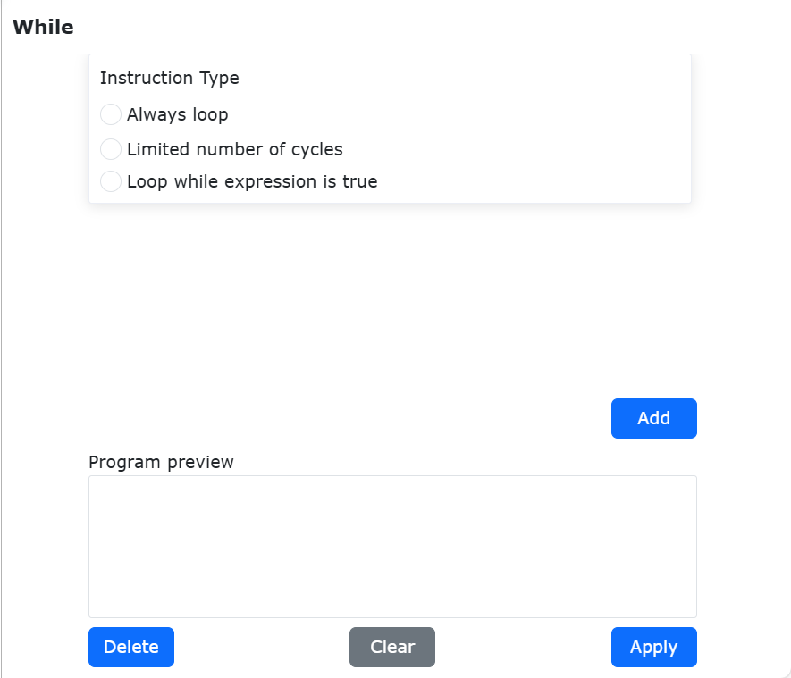

.. centered:: Figure 9.4-1-1 While command interface

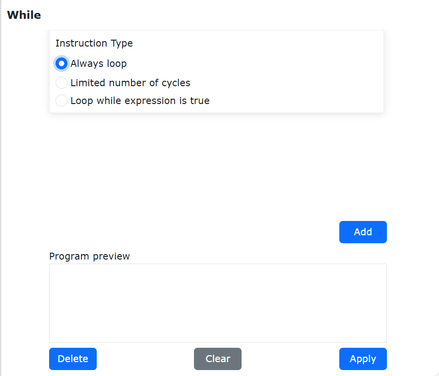

.. centered:: Figure 9.4-1-2 While command - Always loop

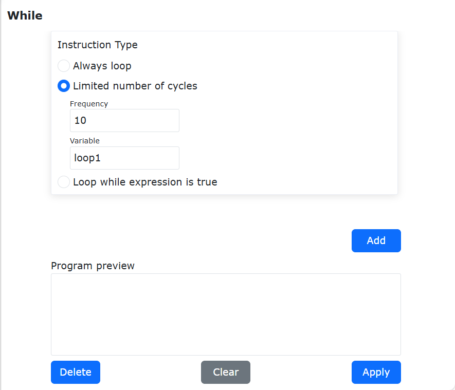

.. centered:: Figure 9.4-1-3 While command - Limited number of cycles

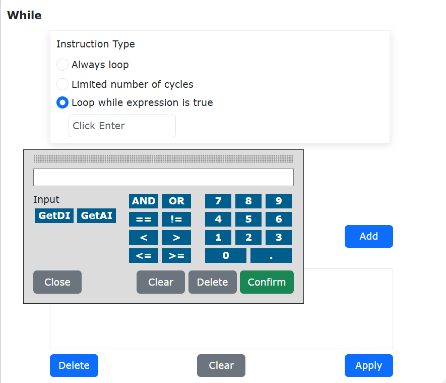

.. centered:: Figure 9.4-1-4 While command - Expression Editor

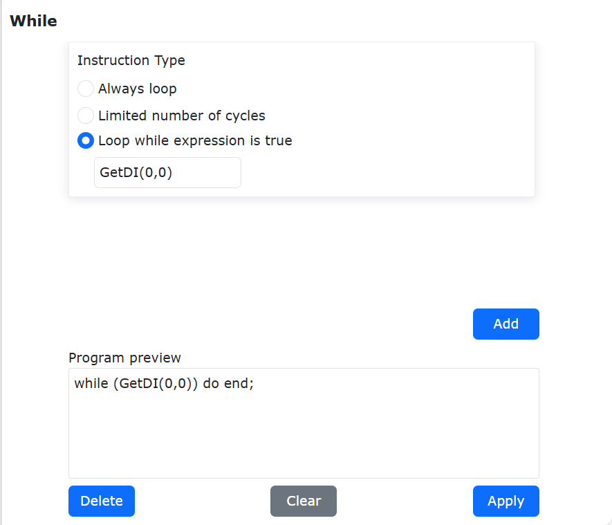

.. centered:: Figure 9.4-1-5 While command - Loop while expression is true

For ease of operation, you can enter any do content and edit other instructions in the program to insert them instead.

if…else command
++++++++++++++++

Click the "if...else" button to enter the if...else command editing interface.

This command contains the following buttons:

- Add else if: When there is no "else" expression, click this button to add an "else if" expression
- Delete else if: When an "else if" expression exists, click this button to delete the "else if" expression.
- Add else: Click this button to add an "else" expression
- Delete else: Click this button to delete the "else" expression

After clicking the corresponding button to add, click the input box to pop up the expression editor and select the corresponding expression according to the usage scenario. After adding, click "Add" and "Apply".

This instruction requires a certain programming foundation. If you need help, please contact us.

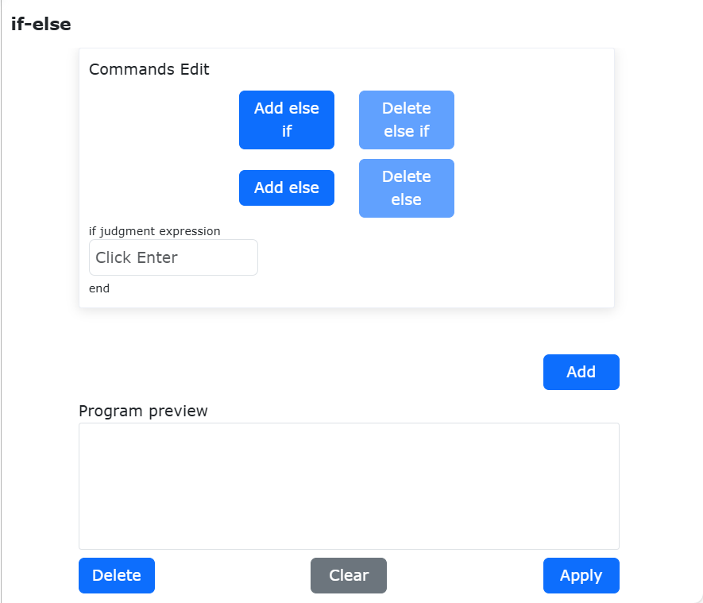

.. centered:: Figure 9.4-2 if…else command interface

Goto command
++++++++++++++++

Click the "Goto" button to enter the Goto command editing interface.

The Goto instruction is a jump instruction, enter the statement in the input box on the right, and click "Add" and "Apply" after editing. (This instruction requires a certain programming foundation, if you need help, please contact us)

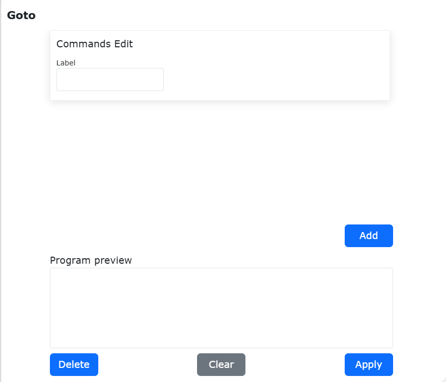

.. centered:: Figure 9.4-3 Goto command interface

Wait command
++++++++++++++++

Click the "Wait" icon to enter the Wait command editing interface.

This instruction is a delay instruction, which is divided into three parts: "WaitMs", "WaitDI" and "WaitAI".

"WaitTime" command delay waiting time unit is milliseconds, input the number of milliseconds to wait, click "Add", "Apply".

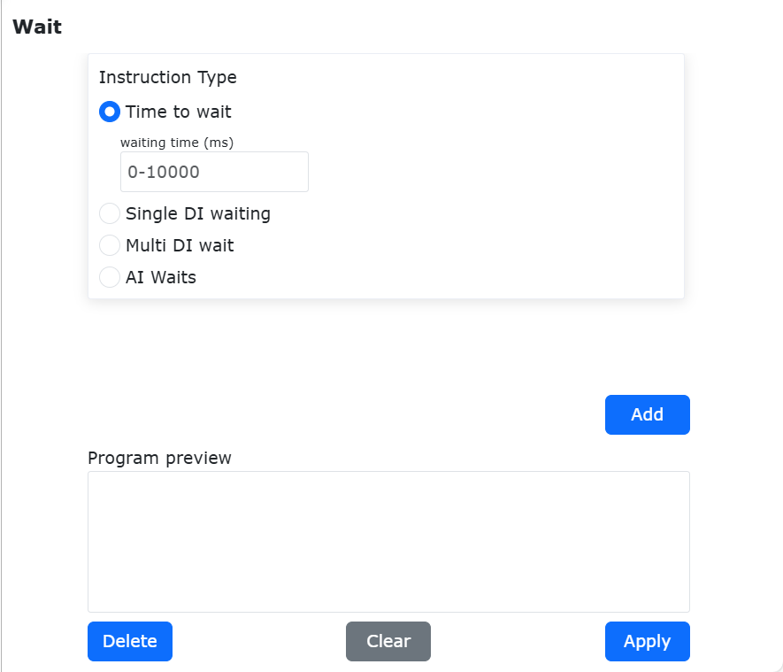

.. centered:: Figure 9.4-4 WaitTime command interface

"WaitDI" command, that is, single DI waiting, select the IO port number to be waited for, wait state, wait maximum time and wait timeout processing method, and click "Add" and "Apply".

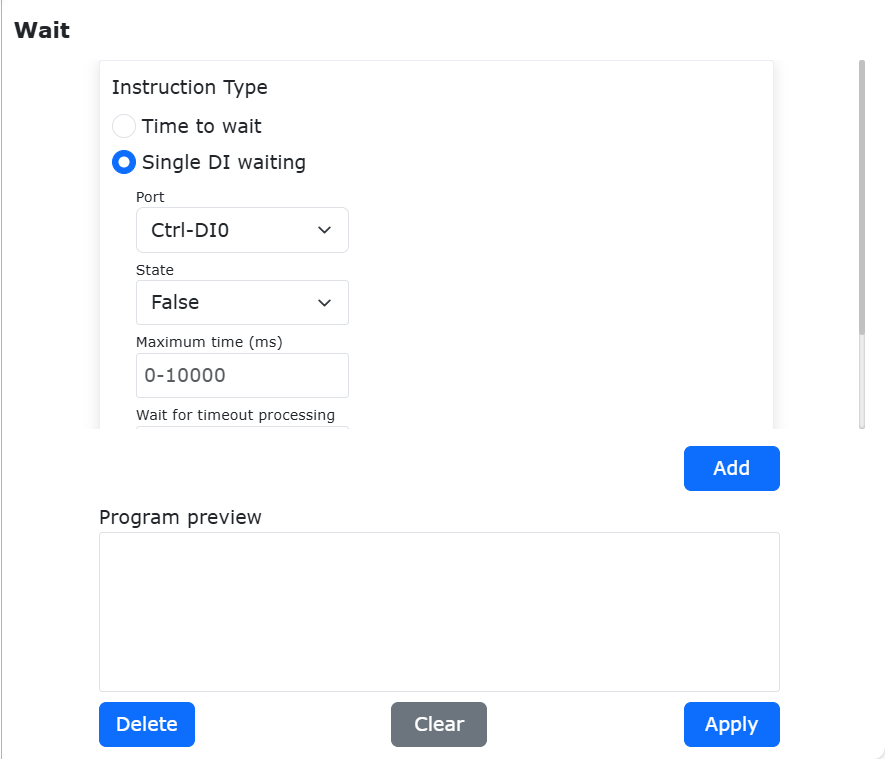

.. centered:: Figure 9.4-5 WaitDI command interface

"WaitMultiDI" command, that is, multi-DI waiting, first select the multi-DI establishment conditions, then check the DI port and status that need to wait, and finally set the maximum waiting time and waiting timeout processing method, click "Add" and "Apply".

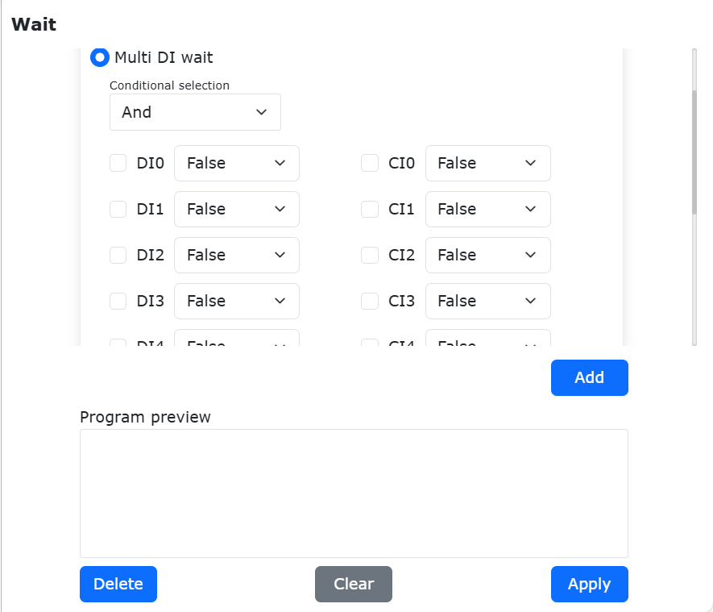

.. centered:: Figure 9.4-6 WaitMultiDI command interface

"WaitAI" command, select the analog quantity to be waited for, the value, the maximum waiting time and the waiting timeout processing method, and click "Add" and "Apply".

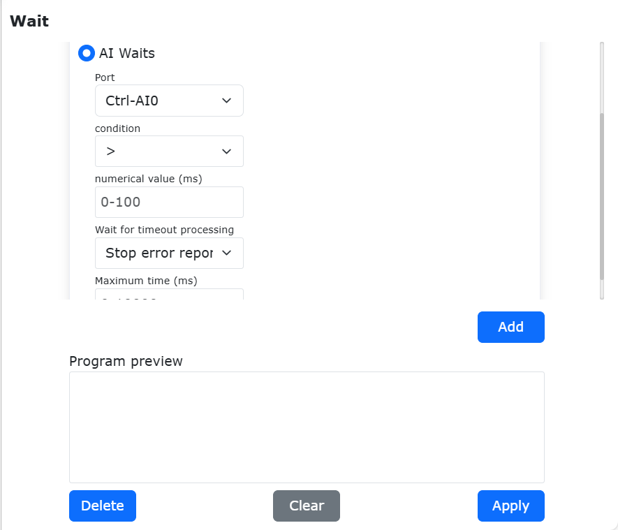

.. centered:: Figure 9.4-7 WaitAI command interface

Pause command
++++++++++++++++

Click the "Pause" icon to enter the Pause command editing interface.

This instruction is a pause instruction. Insert this instruction into the program. When the program executes this instruction, the robot will be in a pause state. If you want to continue running, click the "Pause/Resume" button in the control area.

.. centered:: Figure 9.4-8 Pause command interface

Dofile command
++++++++++++++++

Click the "Dofile" icon to enter the Dofile command editing interface.

The Dofile command calls the internal program of the controller. When using the Dofile command, the called subroutine needs to be saved, and the main program does not need to be saved again if it has not changed. The Dofile command supports two-level calls, and two parameter settings need to be paid attention to. One is the level of the call, and the other is the ID number of the call. In principle, the same ID number cannot appear in the same program.

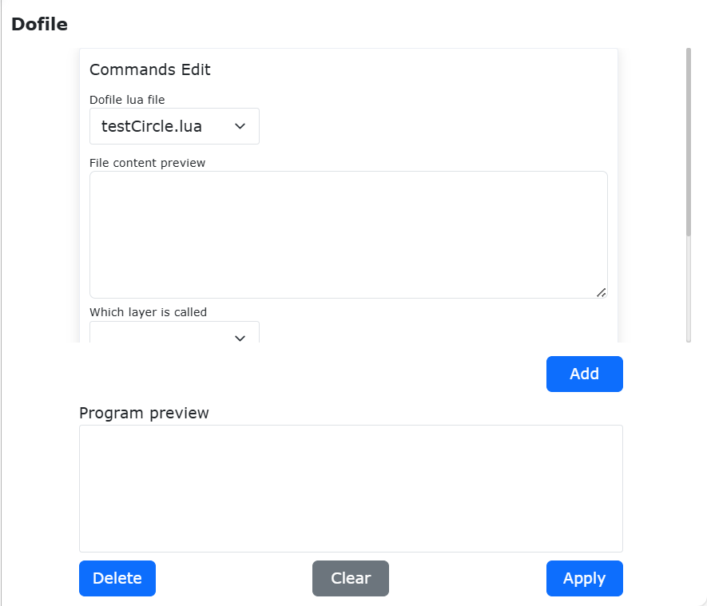

.. centered:: Figure 9.4-9 Dofile command interface

Var command
++++++++++++++++

Click the "Var" icon to enter the Var command editing interface.

This command is a variable system command, which is divided into two parts: Lua variable definition, variable query and Sys variable renaming, getting value, and setting value. Lua variable definition can declare a variable and assign an initial value, and cooperate with while, if-else and other commands Use the Lua variable query command to query the value of the input variable name in real time and display it in the status bar. The number of Sys variables is fixed, and you can rename them, get variable values, and set variable values. The values stored in this variable will not be cleared when the system is turned off.

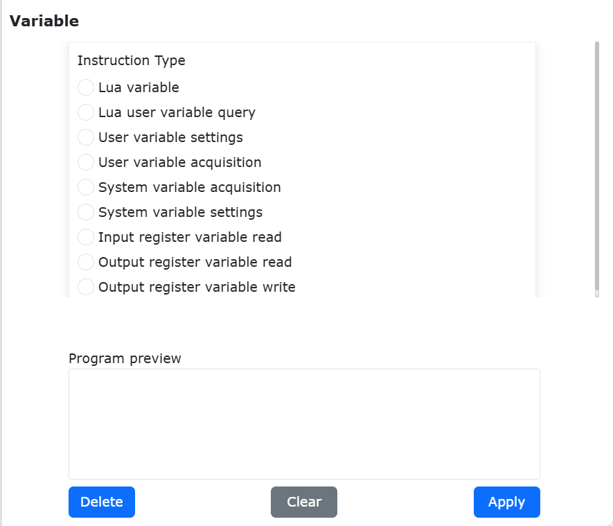

.. centered:: Figure 9.4-10 Var command interface

.. important:: Variable names must start with letters or underscores, not numbers or other special characters.

Motion command interface
~~~~~~~~~~~~~~~~~~~~~~~~~~

.. image:: coding/030.png
   :width: 6in
   :align: center

.. centered:: Figure 9.5 Motion command interface

PTP command
++++++++++++++++

Click the "PTP" icon to enter the PTP command editing interface.

You can choose the point to be reached, and the smooth transition time setting can realize that the movement from this point to the next point is continuous. Whether to set the offset, you can choose to offset based on the base coordinate system and based on the tool coordinates, and pop up x, y, z, rx, ry, rz offset settings, PTP specific path is the optimal path automatically planned by the motion controller, click "Add" and "Apply" to save this command.

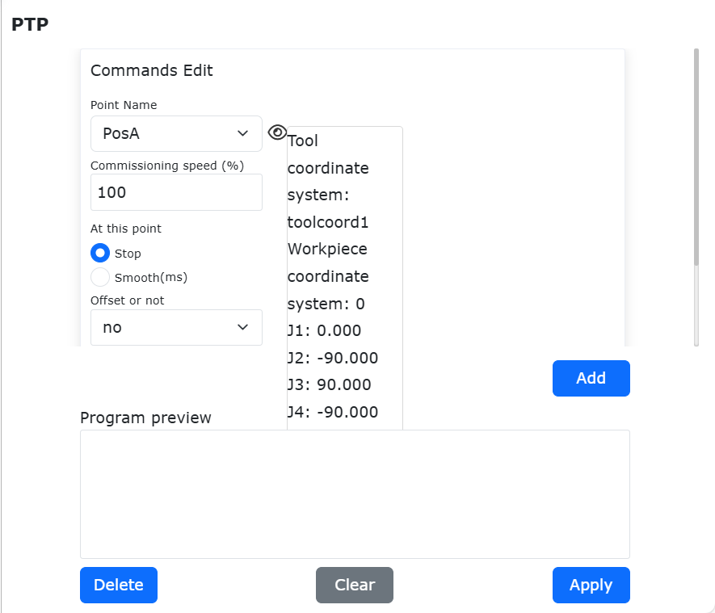

.. centered:: Figure 9.5-1 PTP command interface

Lin command
++++++++++++++++

Click the "Lin" icon to enter the Lin command editing interface.

The function of this command is similar to the "PTP" command, but the path of the point reached by this command is a straight line.

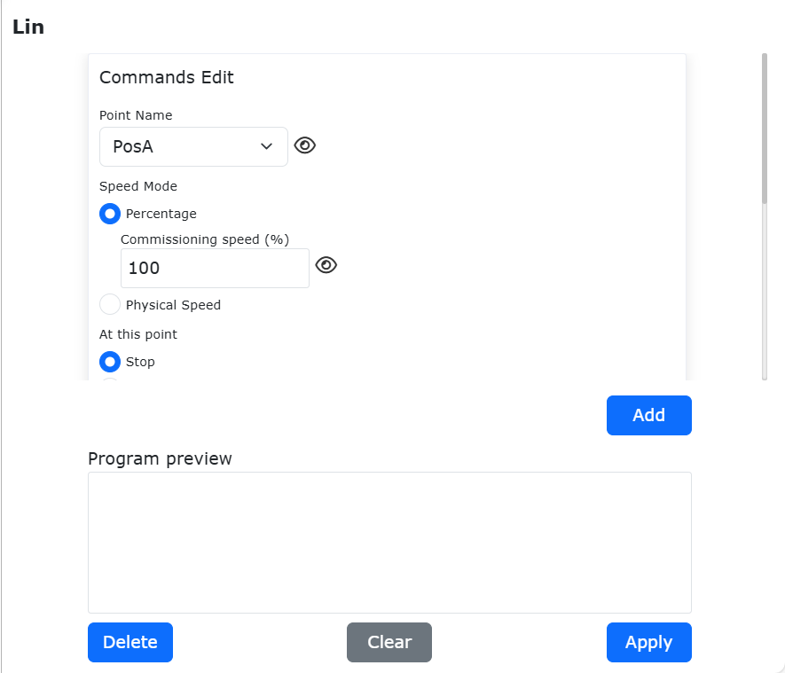

.. centered:: Figure 9.5-2 Lin command interface

.. important:: When the selection point name is "seamPos", the straight line command is applied in the welding scene using the laser sensor. Due to the accumulated operating error during welding, "whether to offset" and "offset amount" are added.

   **Whether to offset**: No, base coordinate system offset, tool coordinate system offset, laser original data offset;

   **Offset**: Δx, Δy, Δz, Δrx, Δry, Δrz, range: -300~300;

   .. image:: coding/033.png
      :width: 6in
      :align: center

   .. centered:: Figure 9.5-2-1 Lin command interface(Welding scene)

LIN command joint	overspeed processing function
*****************************************************************

When using the Cartesian space linear motion command LIN, the constrained condition is the linear velocity, but the actual operation is affected by the workspace, and the angular velocity of the joint may have exceeded the limit when the linear velocity requirement is met. This function implements an optional handling strategy to deal with joint overspeed during LIN movements.

**Step1**: Click the Linear Motion Command button;

.. image:: coding/034.png
   :width: 6in
   :align: center

.. centered:: Figure 9.5-3-1 Click the Linear Motion Command button

**Step2**: Select the linear motion command target waypoint;

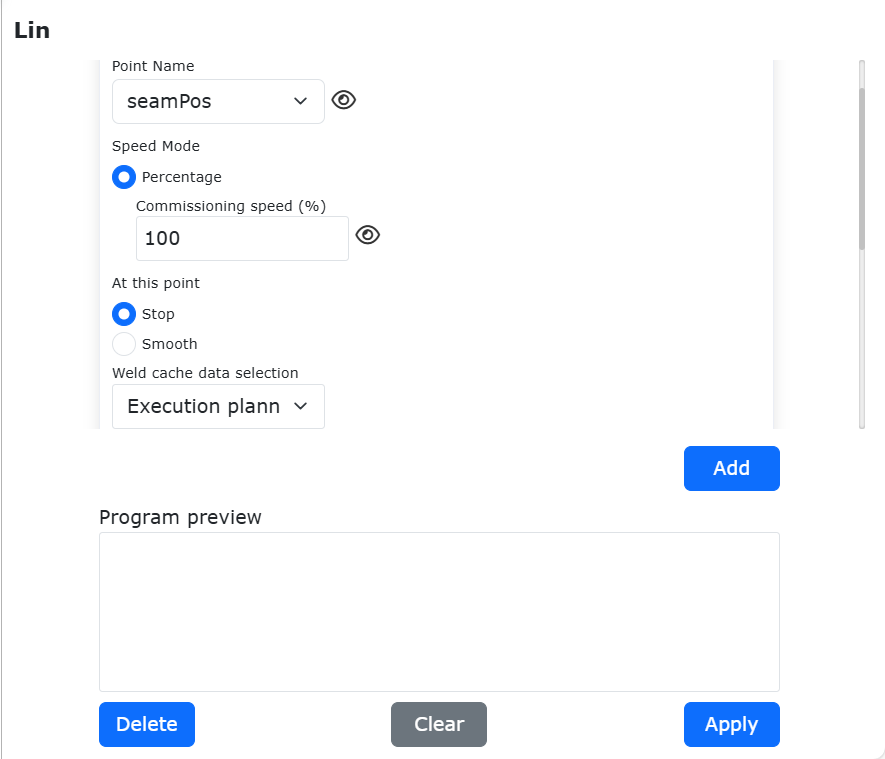

.. centered:: Figure 9.5-3-2 Select the linear motion target waypoint

**Step3**: Turn on the joint overspeed protection switch;

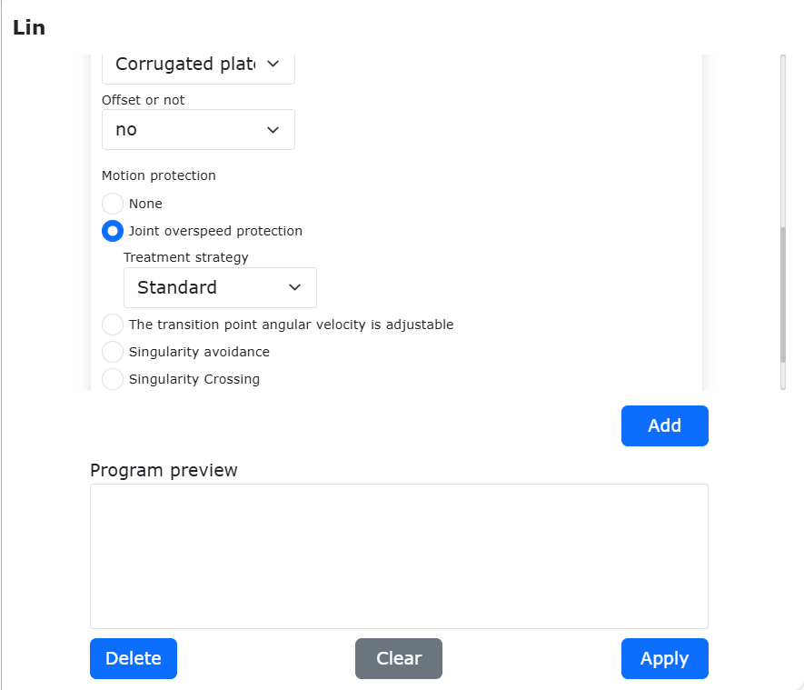

.. centered:: Figure 9.5-3-3 Turn on the joint overspeed protection switch button

**Step4**: Select the joint overspeed treatment strategy (first two options is not for joint overspeed treatment);

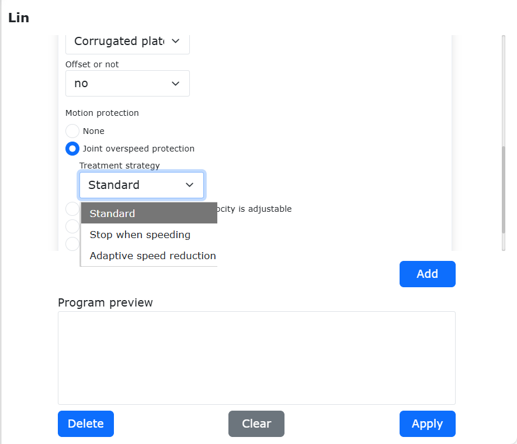

.. centered:: Figure 9.5-3-4 Joint overspeed treatment strategies

**Step5**: Set the processing option and processing parameters, then click the Add button to add the Lua command;

   Under the adaptive speed reduction strategy, the deceleration threshold is the percentage of the linear velocity reduction value relative to the set linear velocity, and when the deceleration value exceeds the set threshold, the robot will report an error and stop.

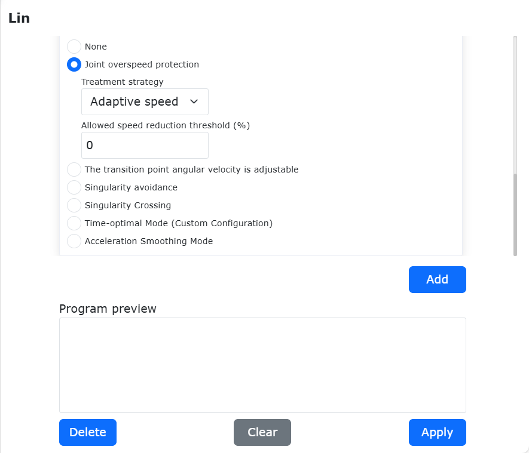

.. centered:: Figure 9.5-3-5 Joint overspeed treatment strategy selection and setting

**Step6**: The added Lua command is shown in the figure;

.. image:: coding/039.png
   :width: 6in
   :align: center

.. centered:: Figure 9.5-3-6 lua command

**Joint overspeed protection begins**:JointOverSpeedProtectStart(a,b);
   a: strategy type number(same as the order of drop-down box)

   b: threshold(0~100)

**Joint overspeed protection ends**:JointOverSpeedProtectEnd();

.. note:: For the “singularity crossing” motion protection, please refer to the description of the singularity crossing function in automatic mode.
   
Angular velocity adjustable function
**********************************************

This function can be used when encountering a workpiece that requires corner welding during the welding process, or when a specific linear line is planned (a quick transition is required when the attitude change is large and the position change is small, but the linear speed cannot be accelerated).

**Step1**:Set the tool coordinate system to calibrate the tool size and attitude of the welding gun.

.. note:: The values on the interface are examples only, and the actual tool status shall prevail.

.. image:: coding/246.png
   :width: 6in
   :align: center

.. centered:: Figure 9.5-3-7 Sets the tool coordinate system

**Step2**:Click on "Program", select "Coding", and select " LIN" in the "Motion Command" category.

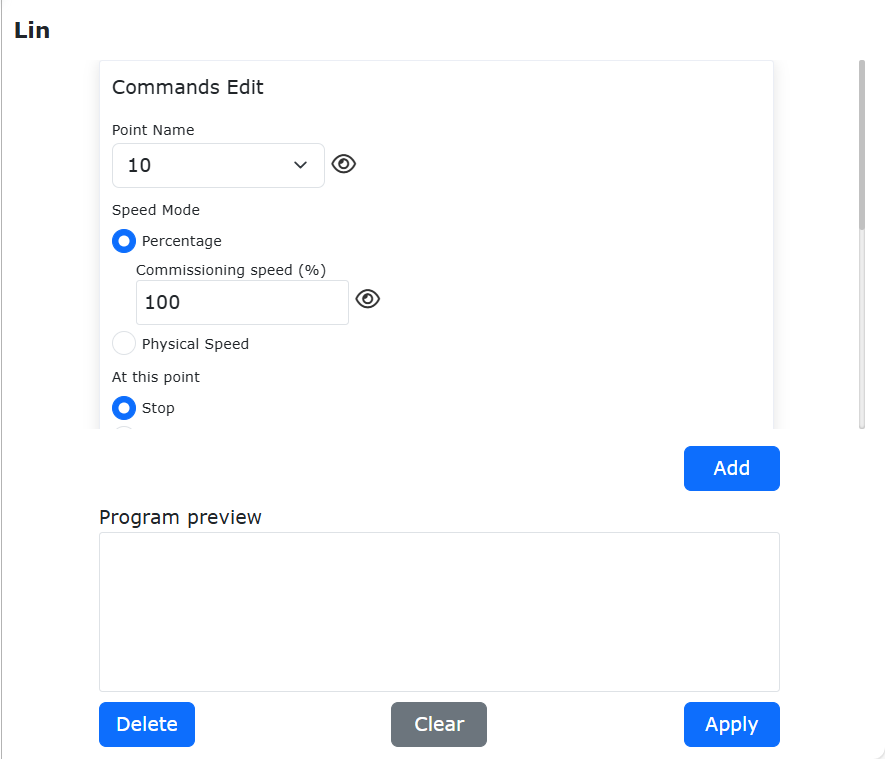

.. centered:: Figure 9.5-3-8 Straight line command setting interface

**Step3**:Set the starting point of each straight line of wrapping angle welding as the transition point, turn on the "The transition point angular velocity is adjustable" button, and set the maximum acceleration percentage (the default maximum angular velocity of 100% is 360°/s).

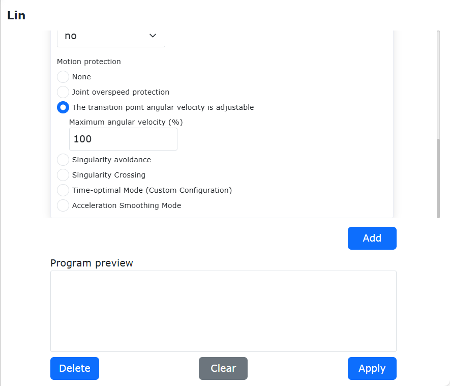

.. centered:: Figure 9.5-3-9 Transition point angular velocity adjustment parameter configuration interface

**Step4**:Click the "Add" button to generate a LIN command with the adjustment of the transition attitude angular velocity.

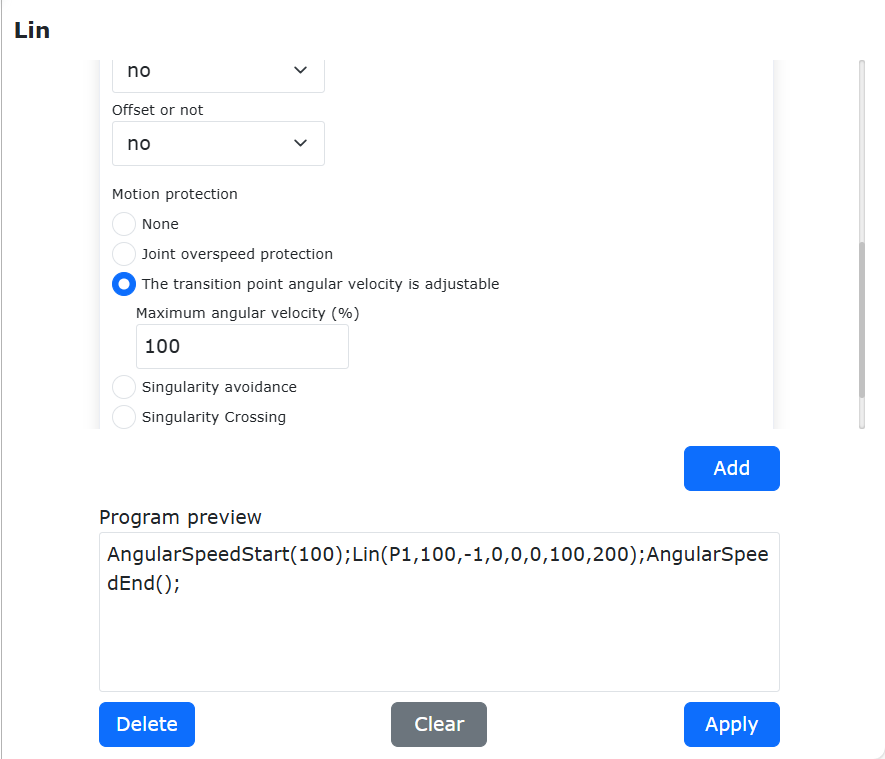

.. centered:: Figure 9.5-3-10 Add a transition point linear motion command

**Step5**:The robot completes the attitude transition at the starting point, normally executes the linear command movement to the end point of the section, closes the "The transition point angular velocity is adjustable" button, and adds a termination waypoint.

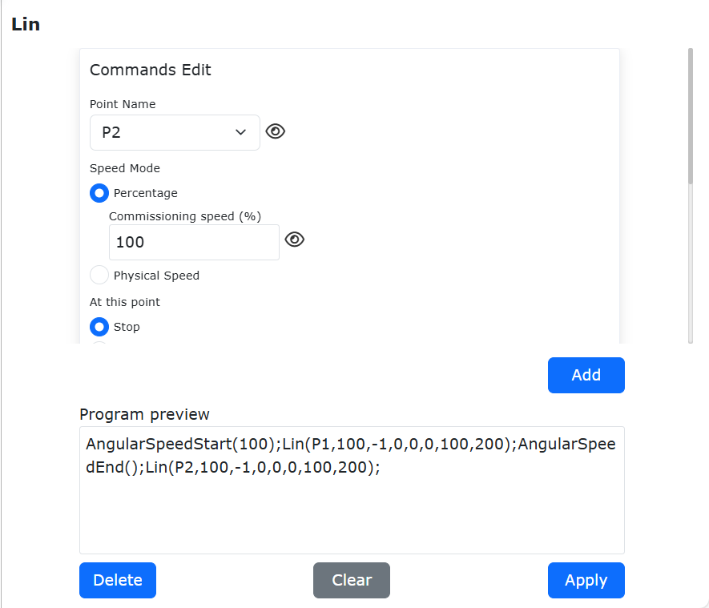

.. centered:: Figure 9.5-3-11  Inserts the end point of the line

**Step6**:Click the "Apply" button to generate the corresponding LUA command.

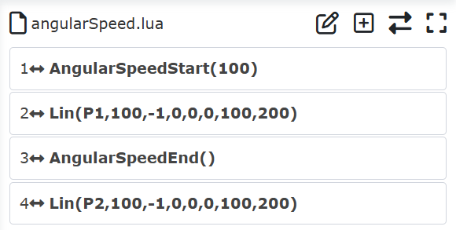

.. centered:: Figure 9.5-3-12 Generate a straight LUA instruction with transition points

A complete set of corner wrapping welds usually has more than one transition point, and in the case of corner wrapping shown in Figure 7, there are two attitude transition points with small position change and large attitude change during the welding process. 

Point 1 is the starting point of the first section of welding, and point 2 is the end point of the first section of welding; 

Point 3 is the starting point of the second section of welding, and point 4 is the end point of the second section of welding; 

Point 5 is the starting point of the third section of welding, and point 6 is the end point of the third section of welding. 

The attitude transition occurs from the end point of the previous section of welding to the starting point of the next section of welding, so it is necessary to add the attitude angular velocity adjustment instruction at the starting point of the next section of welding, so that the maximum linear velocity remains unchanged during the transition of the wrapping angle attitude, and the maximum angular velocity is increased, so that the process of wrapping angle welding process runs.

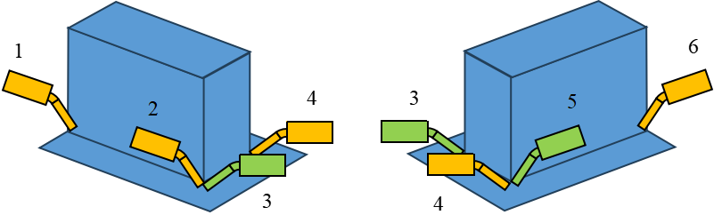

.. centered:: Figure 9.5-3-13 Example of a wrapping welding process

Arc command
++++++++++++++++

Click the "Arc" icon to enter the Arc command editing interface.

The "Arc" command is an arc motion, which includes three points. The first point is the starting point of the arc, the second point is the middle transition point of the arc, and the third point is the end point.

Both the transition point and the end point can be set to offset, and you can choose to base coordinate system offset Shift and offset based on tool coordinates, and pop up x, y, z, rx, ry, rz offset settings, and the end point can set a smooth transition radius to achieve continuous motion effect.

.. important::
   For circular motion, you need to add PTP or Lin command to move to the starting point first.

.. centered:: Figure 9.5-4 Arc command interface

Circle command
++++++++++++++++

Click the "Circle" icon to enter the Circle command editing interface.

The cooperative robot can carry out the circle trajectory movement by adding the circle command. Before adding the circle command, it is necessary to teach three path points on the circle trajectory. Suppose that the three path points on the circle trajectory are "P1", "P2" and "P3" respectively, where "P1" is the starting point of the circle trajectory, "P2" and "P3" are the middle point 1 and 2 of the circle trajectory.Move the robot to the above three points and add the names of the teaching points as "P1", "P2" and "P3" respectively.

.. important::
   For full circle trajectory motion, you need to add PTP or Lin command to move to the starting point first.

.. image:: coding/042.png
   :width: 3in
   :align: center

.. centered:: Figure 9.5-5 Circle trajectory

.. image:: coding/043.png
   :width: 3in
   :align: center

.. image:: coding/044.png
   :width: 3in
   :align: center

.. image:: coding/045.png
   :width: 3in
   :align: center

.. centered:: Figure 9.5-6 Teaching "P1", "P2" and "P3"

Circle command addition
**********************************************

**Step1**: Create a new user program "testCircle.lua" and click the "Circle" button to open the page of adding circle commands.

.. image:: coding/046.png
   :width: 6in
   :align: center

.. centered:: Figure 9.5-7 Add the circle command button

**Step2**: In the full circle instruction adding page, select the starting point motion mode and the starting point as "P1".

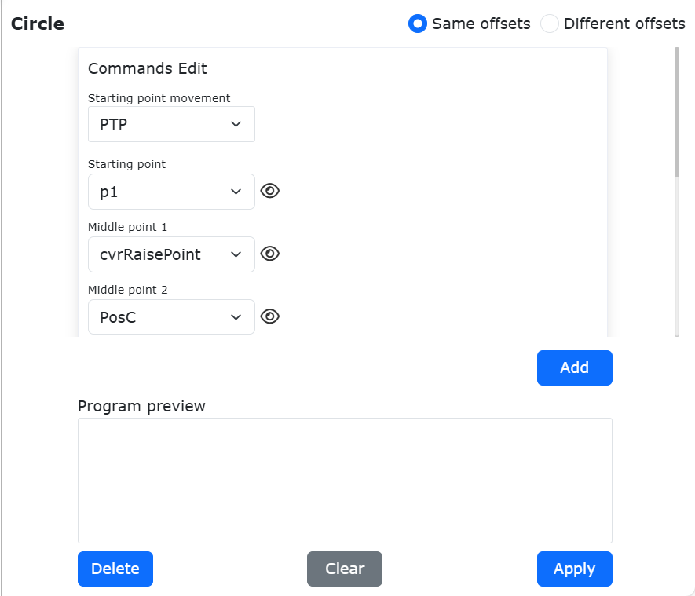

.. centered:: Figure 9.5-8 Starting point motion mode and starting point "P1"

**Step3**: Select "Middle point 1" as the "P2" point in the circle command addition page, and click "Next".

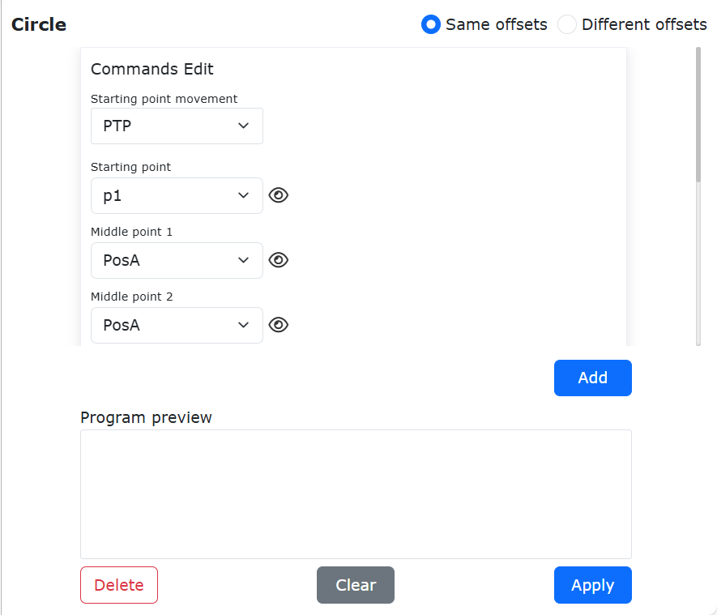

.. centered:: Figure 9.5-9 Middle Point 1 of the Circle

**Step4**: Select "Middle point 2" as the "P3" point, and click the "Add" button and the "Apply" button in turn.

.. image:: coding/048.png
   :width: 6in
   :align: center

.. centered:: Figure 9.5-10 The middle point 2 of the circle

**Step5**: At this time, "testCircle.lua" has added the circle movement command.

.. image:: coding/049.png
   :width: 6in
   :align: center

.. centered:: Figure 9.5-11 Circle movement command addition

Switch the robot to automatic mode, start the program on the premise of ensuring safety, and the robot will move according to the circle trajectory shown in Figure 1.

Circle trajectory offset
**********************************************

The circular motion of the cooperative robot supports the offset of the positions of the middle point 1 and the middle point 2 of the circular trajectory, and the offset types include the following two types:

**The middle points of the two trajectories of the circle have the same offset:** the middle point 1 (P2) and the middle point 2 (P3) of the circle are offset by the same offset ∆(dx, dy, dz, drx, dry, drz).

**The middle points of the two trajectories of the circle have different offsets:** the middle point 1 (P2) and the middle point 2 (P3) of the circle adopt two different offsets ∆1 (dx1, dy1, dz1, drx1, dry1, drz1) and ∆2 (dx2, dy2, dz2, drx2, dry2, drz2) respectively.

The following demonstrates the usage of "same offset" and "different offset" respectively.

(1) Same offset

Open the circle command addition page, select "Same Offset" for Offset Type, and also select the starting point motion mode and starting point as "P1", and the middle point 1 of the full circle as "P2".

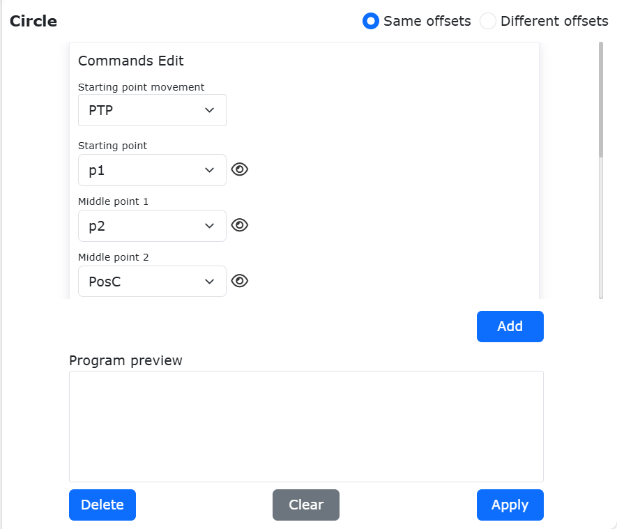

.. centered:: Figure 9.5-12 Same offset of the circle

Select P3 for the middle point 2 of the circle, and select Base Coordinate Offset for Offset.

.. note:: 
   Note: you can select Tool Coordinate Offset according to the actual work situation.

Enter the offset dx as 10mm, and then click the Add button and the Apply button at the bottom of the page.

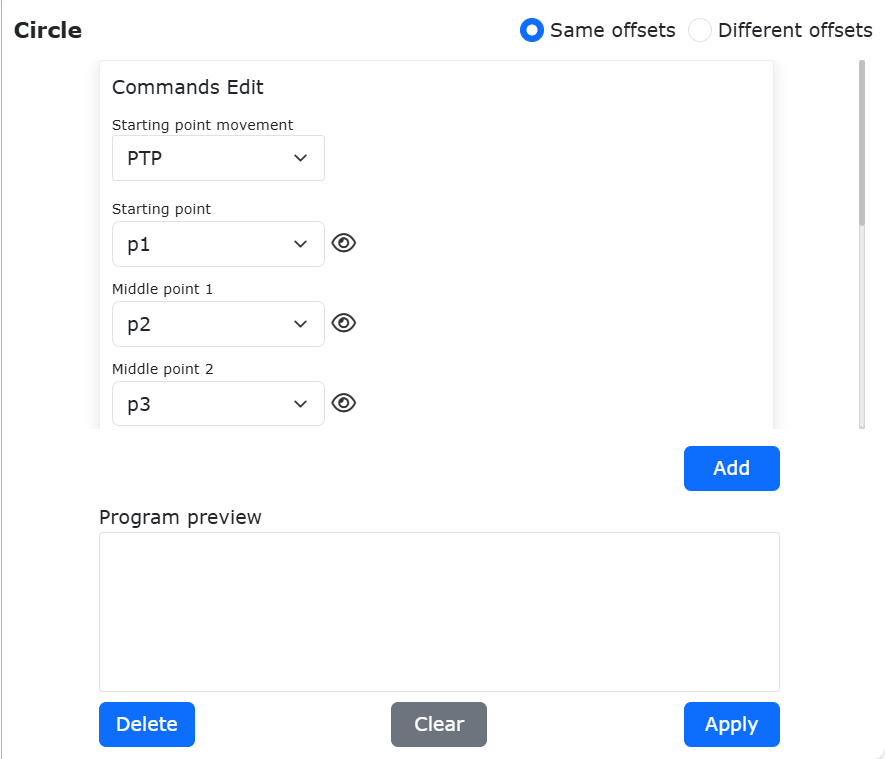

.. centered:: Figure 9.5-13 Setting Offset

At this time, a full circle starting point is "P1", and the two intermediate points "P2" and "P3" are offset by 10mm along the X-axis direction of the base coordinate system. The full circle instruction has been added to the "testCircle.lua" program.

.. image:: coding/053.png
   :width: 6in
   :align: center

.. centered:: Figure 9.5-14 Same Offset Program for Circle

Switch the robot to the automatic mode, and start the program under the condition of ensuring safety. The actual motion trajectory of the robot passes through the circles of "P1", "P2" and "P3", where "P2" is the point where the original "P2" is offset by 10mm in the X direction, and "P3" is the point where the original "P3" is offset by 10mm in the X direction.

.. image:: coding/054.png
   :width: 3in
   :align: center

.. centered:: Figure 9.5-15 Track with the same offset X10mm

(2) Different offset

Open the circle command adding page, select "Different Offsets" for Offset Type, and also select the starting point motion mode and starting point as "P1", and the middle point 1 of the full circle as "P2", and select "Base coordinate offset" for "Offset".

.. note:: 
   Note: you can select "Tool coordinate offset" according to the actual work situation.

Enter the offset dy as 10mm.

.. centered:: Figure 9.5-16 Different offsets

Select P3 for the middle point 2 of the circle, and select Base Coordinate Offset for Offset

.. note:: 
   Note: you can select Tool Coordinate Offset according to the actual work situation.

Enter the offset dx as 10mm, and then click the Add button and the Apply button at the bottom of the page.

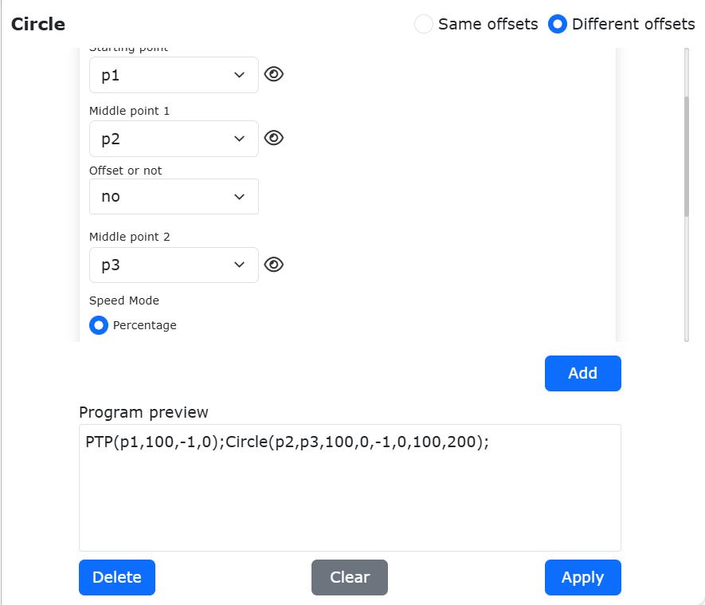

.. centered:: Figure 9.5-17 Offset of middle point 2 is set with different offsets

At this time, an command that the middle point "P2" of the circle is shifted by 10mm along the Y direction of the base coordinate system and "P3" is shifted by 10mm along the X axis direction of the base coordinate system has been added to the "testCircle.lua" program; Of course, a linear motion command needs to be added before the circle motion command to make the robot move to the starting point of the circle.

.. image:: coding/057.png
   :width: 6in
   :align: center

.. centered:: Figure 9.5-18 Program for Two Different Offset Points of Circle

Switch the robot to the automatic mode, and start the program under the condition of ensuring safety. The actual motion trajectory of the robot passes through the circles of "P1", "P2" and "P3", where "P2" is the point where the original "P2" is offset by 10mm in the Y direction, and "P3" is the point where the original P3 is offset by 10mm in the X direction.

.. image:: coding/058.png
   :width: 3in
   :align: center

.. centered:: Figure 9.5-19 Two trajectory points of the circle are offset from the trajectory respectively

Spiral command
++++++++++++++++

Click the "Spiral" icon to enter the Spiral command editing interface.

The "Spiral" command is a spiral motion, which includes three points, which form a circle. On the third point setting page, there are several parameters including the number of spiral turns, attitude correction angle, radius increment and rotation axis direction increment. Setting, the number of helix circles is the number of motion circles of the helix, the attitude correction angle is the attitude at the end of the helix and the attitude of the first point of the helix, the radius increment is the increment of the radius of each circle, and the direction of the rotation axis is increased. The amount is the increment in the direction of the screw axis. set up
Whether to offset, the offset takes effect on the trajectory of the entire helix.

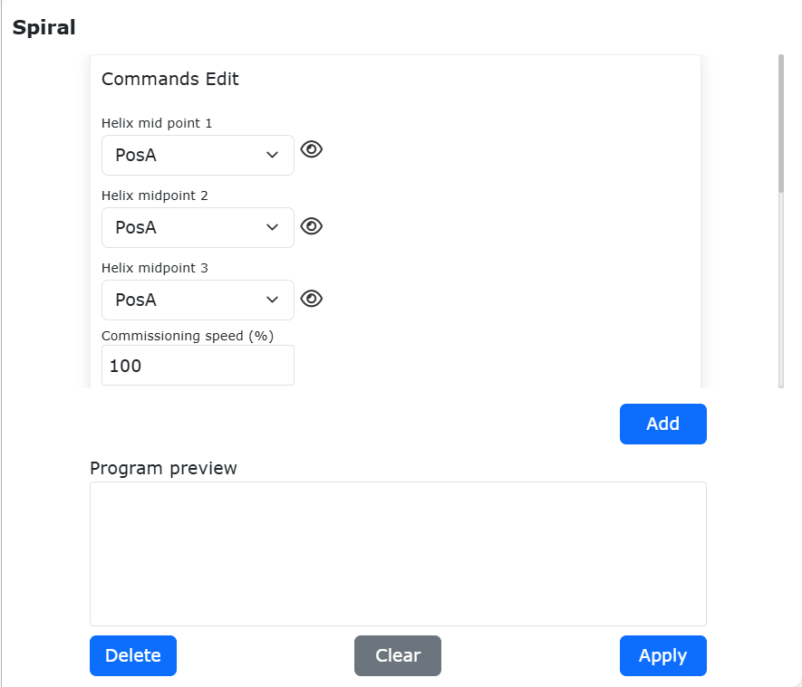

.. centered:: Figure 9.5-20 Spiral command interface

N-Spiral command
++++++++++++++++

Click the "N-Spiral" icon to enter the N-Spiral command editing interface.

The "N-Spiral" command is an optimized version of the spiral motion. This command only needs one point plus the configuration of various parameters to realize the spiral motion. The robot takes the current position as the starting point, and the user sets the debugging speed, whether to offset, the number of spiral turns, the spiral inclination, the initial radius, the radius increment, the rotation axis direction increment and the rotation direction. The number of spiral turns is the helix. The number of motion circles, the helix inclination is the angle between the Z axis of the tool and the horizontal direction, the attitude correction angle is the attitude at the end of the helix and the attitude of the first point of the helix, the initial radius is the radius of the first circle, and the radius increment That is, the increment of the radius of each circle, the increment in the direction of the rotation axis is the increment in the direction of the screw axis, and the direction of rotation is clockwise and counterclockwise.

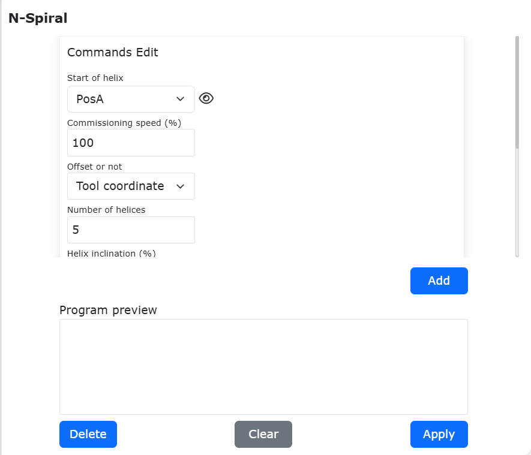

.. centered:: Figure 9.5-21 N-Spiral command interface

Uniform Speed Per Helix Circle Setting Function
*****************************************************

Overview
""""""""""""""
When using the helical motion command, the operating speed of the helical motion can be set, ensuring the speed of each circle maintains the set operating speed.

Operation Process
""""""""""""""""""""""""""""
**Step1**: Select the teaching point that executes the helical motion. This manual uses "P0" as the name of the teaching point.

**Step2**: Click the "Teach Program" -> "Program Programming" button, select the "New Helix" command. In the "Speed Mode", select "Physical Speed", and set the speed value and acceleration value. This speed value is the actual operating speed of the helix. Set parameters such as "Number of Helix Circles", "Helix Inclination Angle", "Initial Radius", "Radius Increment", "Rotation Axis Direction Increment", and "Rotation Direction" according to actual needs, as shown in Figure 2-1.

.. centered:: Figure 9.5-21-1 New Helix Parameter Settings

**Step3**: Add the motion command, generate the Lua program and run it to achieve the helical motion function at the set speed, as shown in Figure 2-2.

.. image:: coding/493.png
   :width: 6in
   :align: center

.. centered:: Figure 9.5-21-2 Typical Program for Running Helix at Set Speed

H-Spiral command
+++++++++++++++++++

Click the "H-Spiral" icon to enter the H-Spiral command editing interface.

The "H-Spiral" command is a horizontal space spiral motion. This command is set after the single-segment motion (straight line) command. 

   - Spiral radius: 0~100mm
   - Helix angular speed: 0~2rev/s
   - Direction of rotation: spiral clockwise/counterclockwise
   - Helix inclination angle: 0~40°

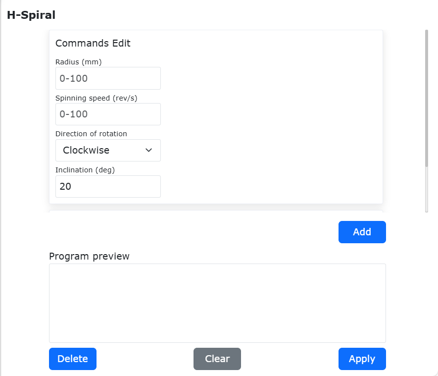

.. centered:: Figure 9.5-22 H-Spiral command interface

Spline command
++++++++++++++++

Click the "Spline" icon to enter the Spline command editing interface.

The command is divided into three parts: the start of the spline group, the spline segment and the end of the spline group. The start of the spline group is the start mark of the spline movement. The spline segment includes SPL, SLIN and SCIRC segments. Click the corresponding icon to enter the command Add interface, the end of spline group is the end sign of spline movement.

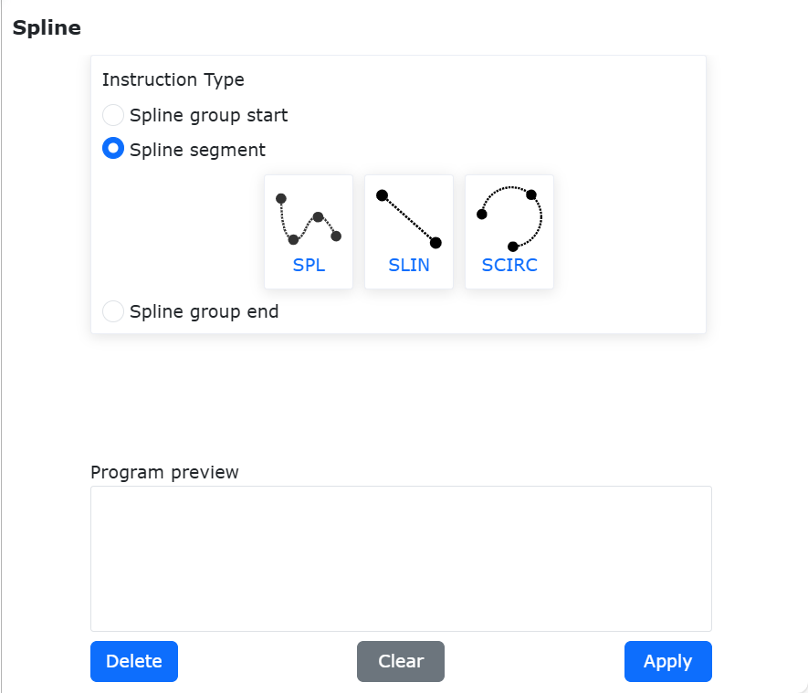

.. centered:: Figure 9.5-23 Spline command interface

N-Spline command
+++++++++++++++++++

Click the "N-Spline" icon to enter the N-Spline command editing interface.

This instruction is an optimization instruction for the Spline instruction algorithm, and will replace the existing Spline instruction in the future. 

This instruction is divided into three parts: the start of the multi-point trajectory, the segment of the multi-point trajectory and the end of the multi-point trajectory. The start mark, the multi-point track segment is to set each track point.

Click the icon to enter the point adding interface, the end of the multi-point track is the end mark of the multi-point track movement, here you can set the control mode and debugging speed.

- Control mode: arc transition point/given path point
- Global average connection time: integer, greater than 10, default value is 2000

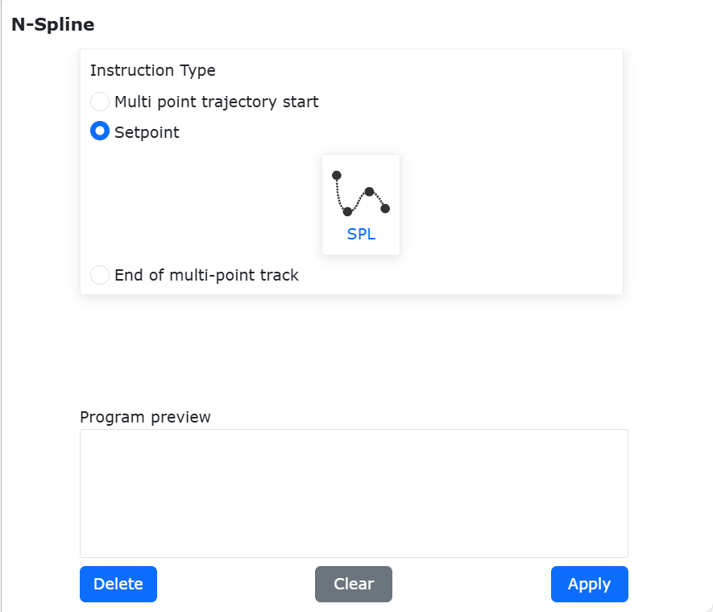

.. centered:: Figure 9.5-24 N-Spline command interface

Weave command
++++++++++++++++

Click the "Weave" icon to enter the Weave command editing interface. The "Weave" command consists of two parts.

- Select the weaving number with configured parameters, click "Start Weaving" and "Stop Weaving" and apply to add related commands to the program.

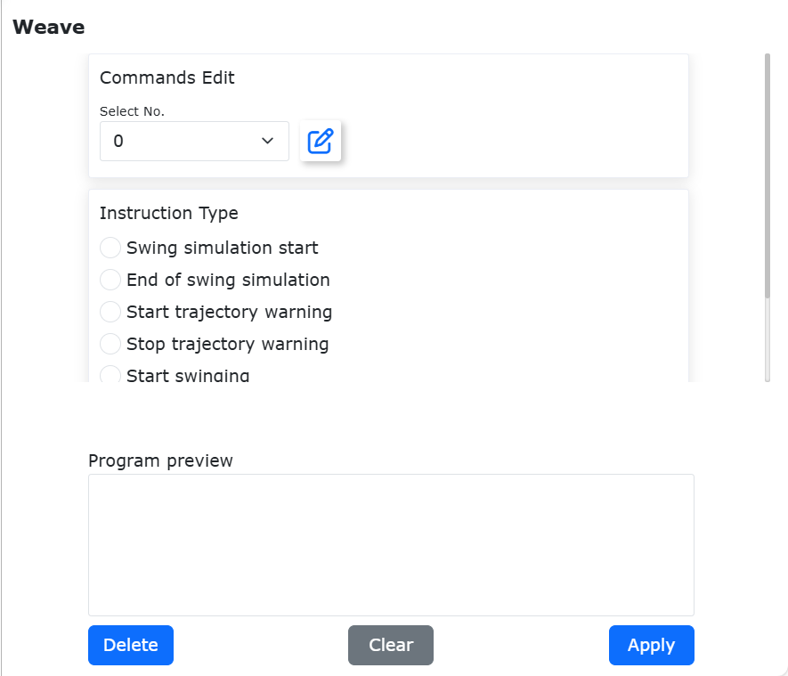

.. centered:: Figure 9.5-25 Weave command interface

- Click "Configuration and Test" to select the weaving type according to the usage scenario and configure the weaving parameters. After the configuration is completed, the weaving trajectory can be tested by pressing the start weaving test and stop weaving test buttons. The current swing types are:

   - Triangular wave swing (LIN/ARC)
   - Vertical L-shaped triangular wave swing (LIN/ARC)
   - Circular Oscillation - Clockwise (LIN)
   - Circular Oscillation - Counterclockwise (LIN)
   - Sine wave swing (LIN/ARC)
   - Vertical L-shaped sine wave swing (LIN/ARC)
   - Vertical welding triangle swing

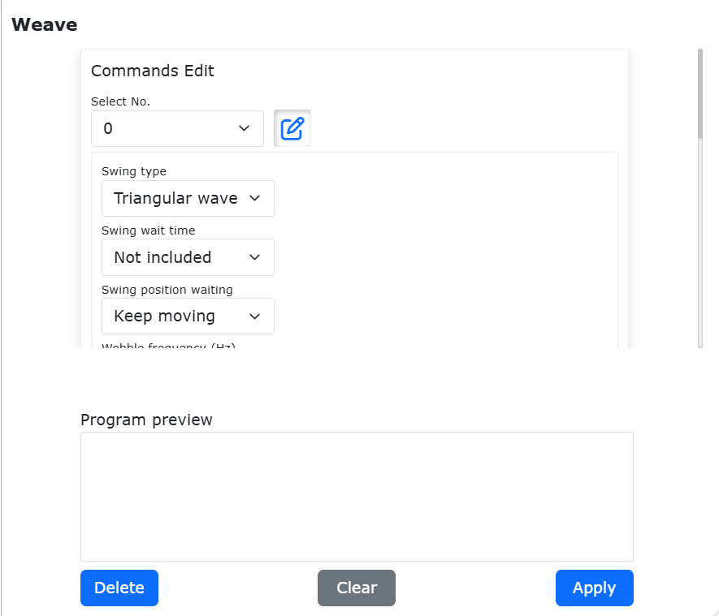

.. centered:: Figure 9.5-26 Weave configuration and testing command interface

Slope serration weave function
**********************************

This function allows the end of the robot tool to generate slope serration weave trajectory in Cartesian space. The weave is superimposed on the linear trajectory, and the azimuth parameter (unit deg) defines the azimuth angle of the swing welding on the specified welding plane; 

When the value is positive, the left endpoint is skewed in the forward direction, and when it is negative, the right endpoint is skewed in the forward direction; If it is 90deg or -90deg, it can weave in the forward direction.

.. image:: coding/066.png
   :width: 4in
   :align: center

.. centered:: Figure 9.5-26-1 Swing azimuth effect

**Step1**:Edit to set up basic linear motion.

.. image:: coding/067.png
   :width: 4in
   :align: center

.. centered:: Figure 9.5-26-2 Example of a basic linear motion LUA program

**Step2**:Add weave command in motion command block.

.. image:: coding/068.png
   :width: 5in
   :align: center

.. centered:: Figure 9.5-26-3 Add weave command

**Step3**:Click the "Configure" button, select "Triangular wave swing" or "Sine wave swing" from the drop-down box, imput desired azimuth angle in "Swing direction azimuth" box and click "Apply".

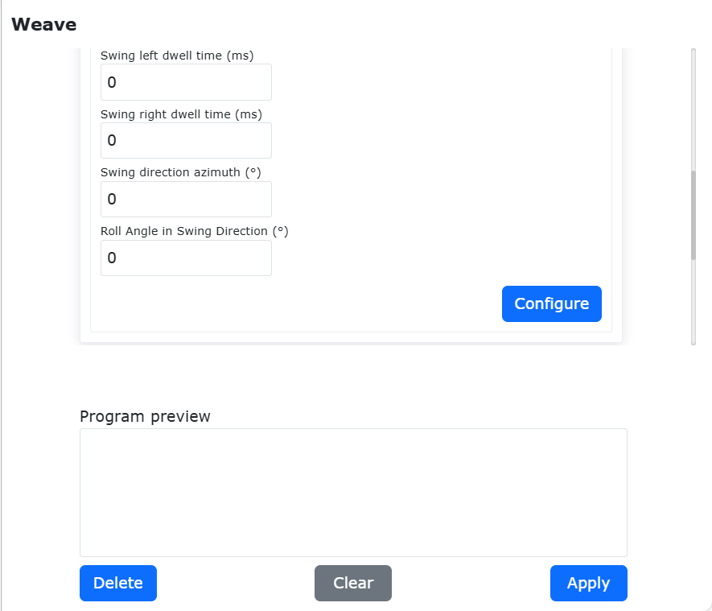

.. centered:: Figure 9.5-26-4 Weave parameter configuration

**Step4**:Click the "Start Swing" button to add the swing command above the linear motion; Click the "Stop Swing" button to add the swing command below the linear motion.

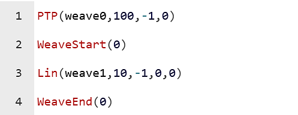

.. centered:: Figure 9.5-26-5 Add the lua program after the swing command

**Step5**:Click "Start Running"buttom, and the end trajectory of the robot is shown in the figure.

.. image:: coding/071.png
   :width: 3in
   :align: center

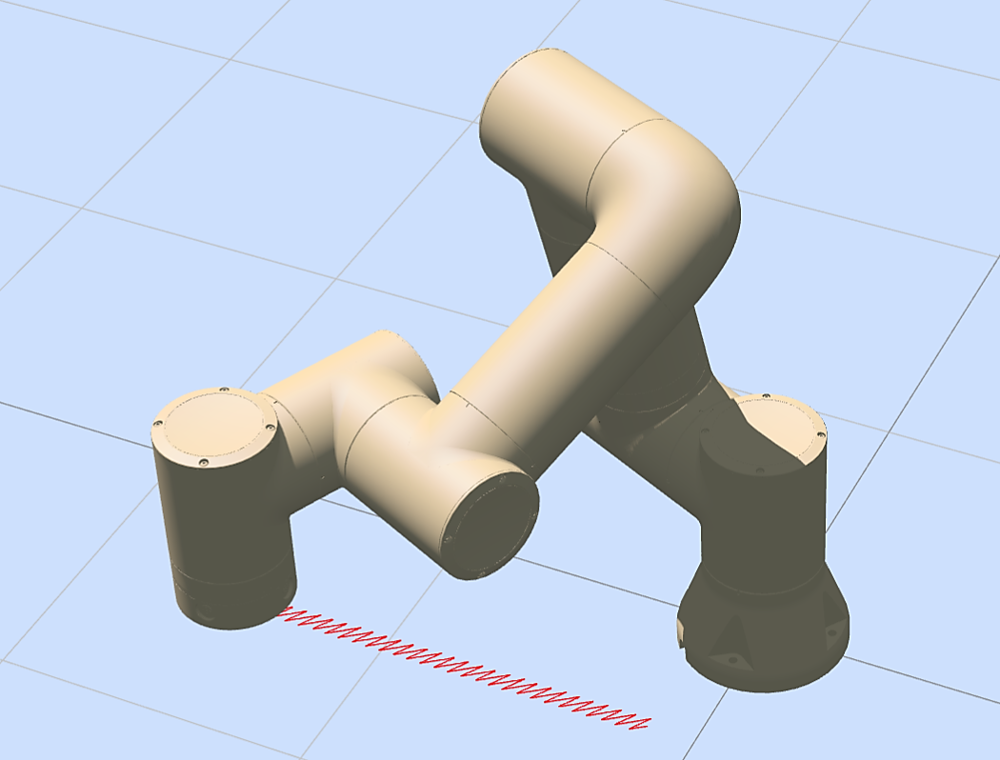

.. centered:: Figure 9.5-26-6 Zigzag weave (left) slope serration weave (right)

TPD command
++++++++++++++++

Click the "TPD" button to enter the TPD command editing interface.

In this command, the user first needs to have a recorded track.

About track recording: Before preparing to record the track, first save the starting point of the track. When the robot is in the dragging mode, input the file name, select the period (assuming the value is x, that is, record a point every x milliseconds, it is recommended to record a point every 4 milliseconds), the point starts recording, and the user can drag the robot to specify Movement, after the recording is completed, click to stop recording, and the previous movement track of the robot can be saved. When a movement cannot be fully recorded, a
A reminder that the number of recording points exceeds the limit is displayed, and the user needs to record the exercise in several times.

When programming, first use the PTP instruction to reach the starting point of the corresponding trajectory, then select the trajectory in the TPD trajectory reproduction instruction, select whether it is smooth, set the debugging speed, and click "Add" and "Apply" in sequence to insert the program. The trajectory loading command is mainly used to pre-read the trajectory file and extract it into a trajectory command, which is better applied to the conveyor belt tracking scene.

.. note:: 
   For the detailed operation of TPD, please refer to the teaching programming (TPD) function operation instruction module.

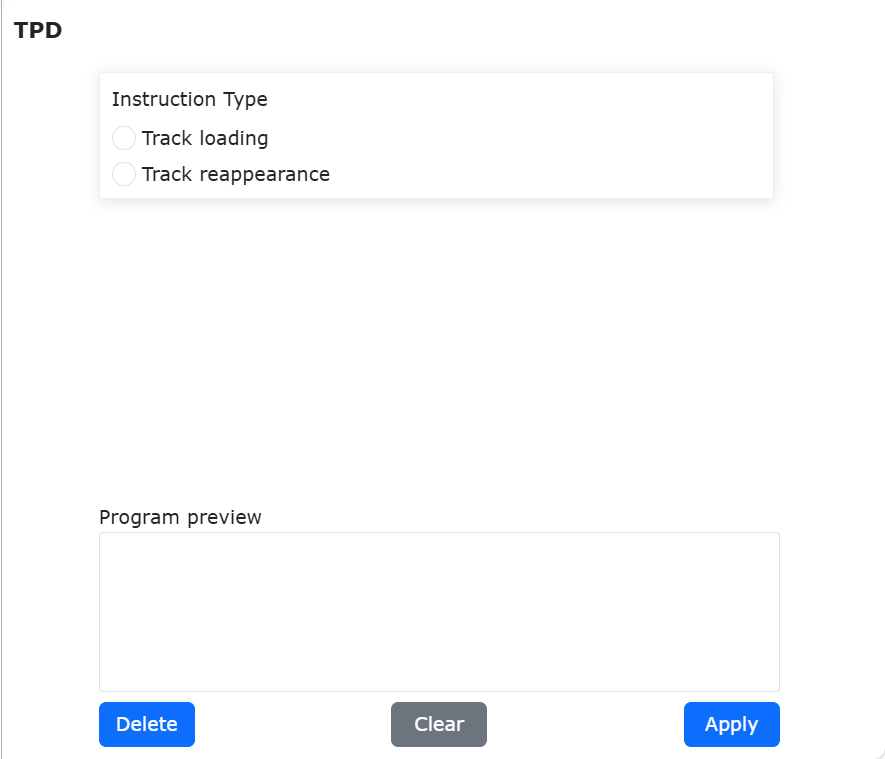

.. centered:: Figure 9.5-27 TPD command interface

Offset command
++++++++++++++++

Click the "Offset" icon to enter the Offset command editing interface.

This command is an overall offset command. Input each offset, add the opening command and closing command to the program, and the motion command between the start and close will be offset based on the base coordinates (or workpiece coordinates).

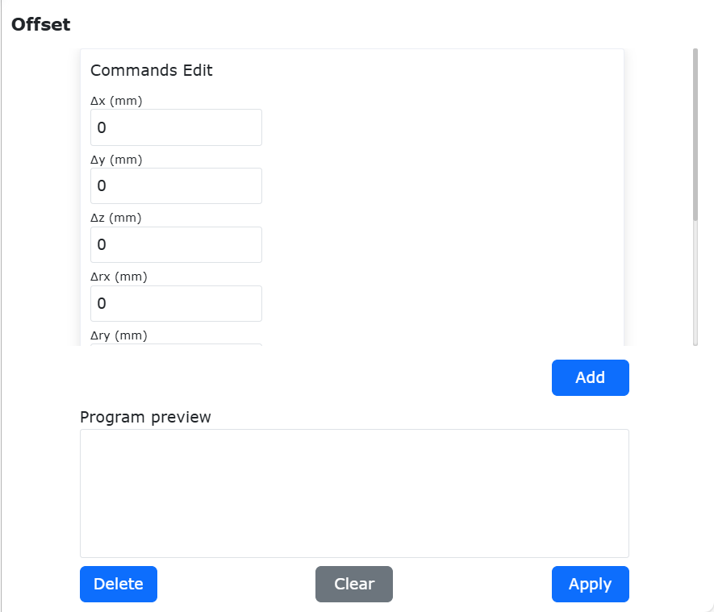

.. centered:: Figure 9.5-28 Offset command interface

ServoCart command
++++++++++++++++++++

Click the "ServoC" icon to enter the ServoCart command editing interface.

ServoCart servo control (Cartesian space motion) command, which can control the robot motion through absolute pose control or based on the current pose offset.

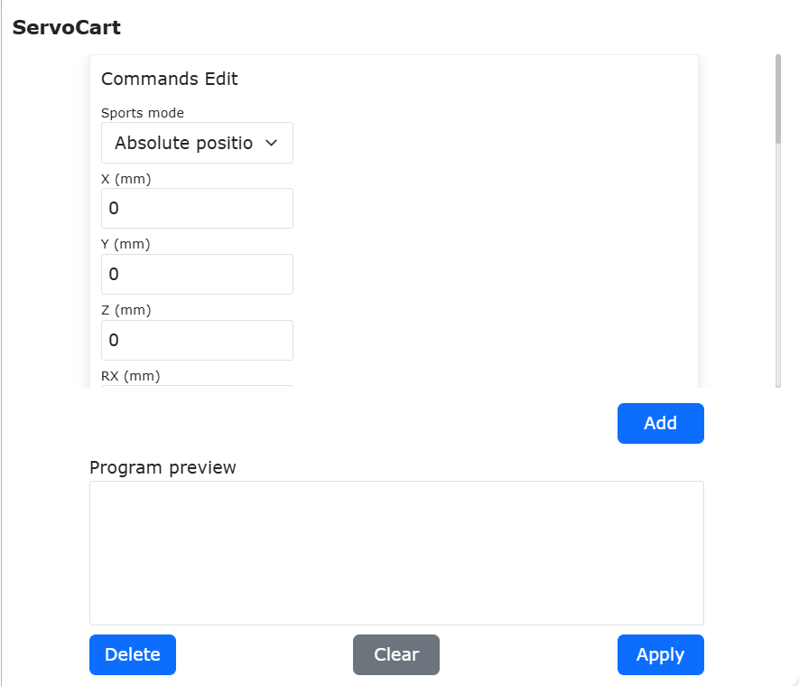

.. centered:: Figure 9.5-29 ServoCart command interface

Absolute pose control program example:

.. image:: coding/076.png
   :width: 6in
   :align: center

In this example, x, y, z, rx, ry, rz (Cartesian position) are the current position of the robot. In addition, the user can control the movement of the robot by reading the trajectory data file and sending the trajectory data through socket communication.

Example of control program based on current pose offset (base coordinate offset):

.. image:: coding/077.png
   :width: 6in
   :align: center

Trajctory command
+++++++++++++++++++

Click the "Trajctory" icon to enter the Trajctory command editing interface.

.. centered:: Figure 9.5-30 Trajctory command interface

TrajctoryJ command
++++++++++++++++++++

Click the "TrajctoryJ" icon to enter the TrajctoryJ command editing interface.

1. Trajectory file import function: select a local computer file to import to the robot control system.

2. Track preloading: select the imported track file and load it by command.

3. Trajectory movement: Send the robot movement through the combination command of the preloaded trajectory file and the selected debugging speed.

4. Print the track point number: print the track point number during the robot running track, so as to check the progress of the current movement.

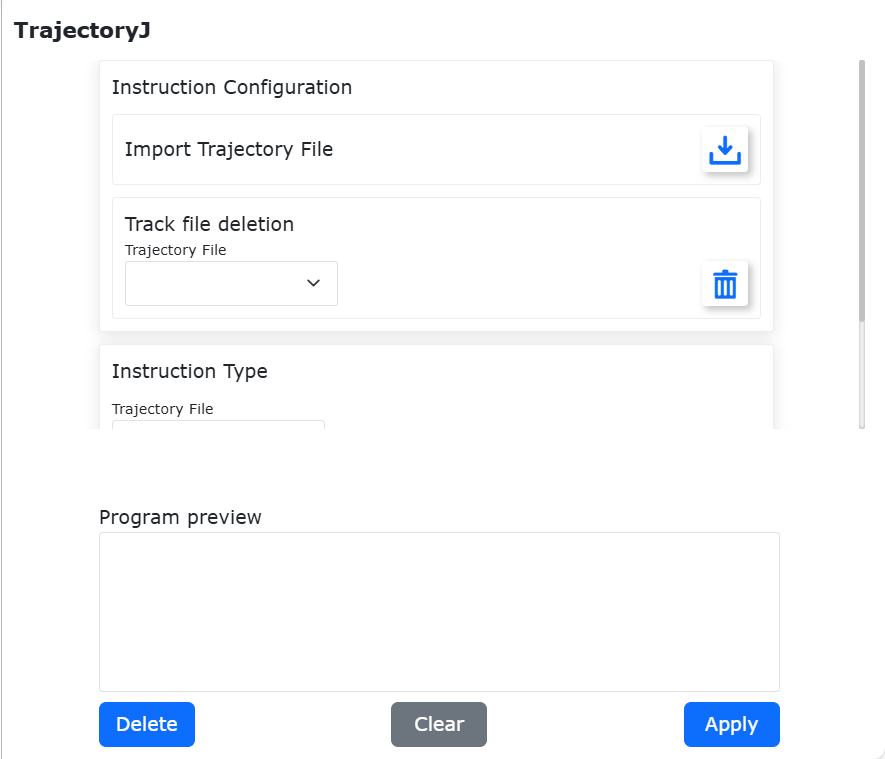

.. centered:: Figure 9.5-31 TrajctoryJ command interface

DMP command
++++++++++++++++

Click the "DMP" icon to enter the DMP command editing interface.

DMP is a trajectory imitation learning method that requires prior planning of reference trajectories. In the command editing interface. , select the teaching point as the new starting point, click "Add" and "Apply" to save the command. The DMP specific path is a new trajectory that mimics the reference trajectory with a new starting point.

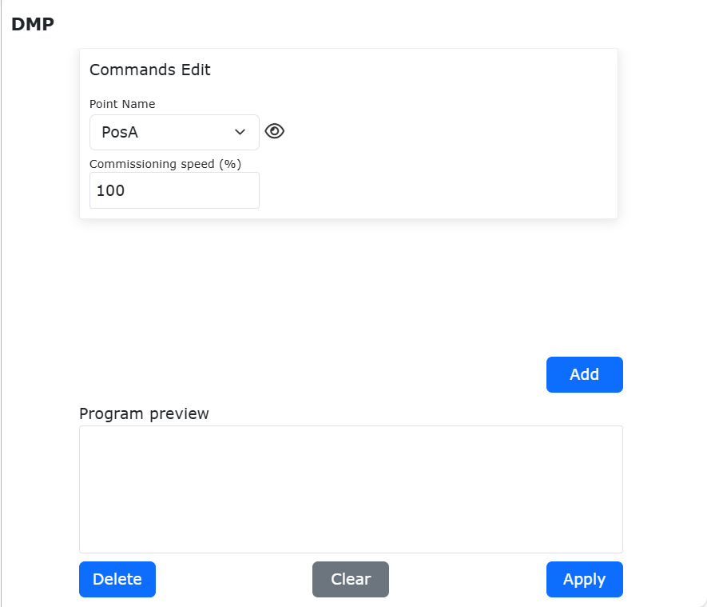

.. centered:: Figure 9.5-32 DMP command interface

WPTrsf command
++++++++++++++++

Click the "WPTrsf" icon to enter the WPTrsf command editing interface.

Select the workpiece coordinate system to be automatically converted, and click "Add" and "Apply" to save the instruction. This instruction realizes automatic conversion of points in the workpiece coordinate system when executing internal PTP and LIN instructions. Use the example area to show and prompt the correct combination of instructions. After adding specific instructions, you can adjust the combination according to the actual scene.

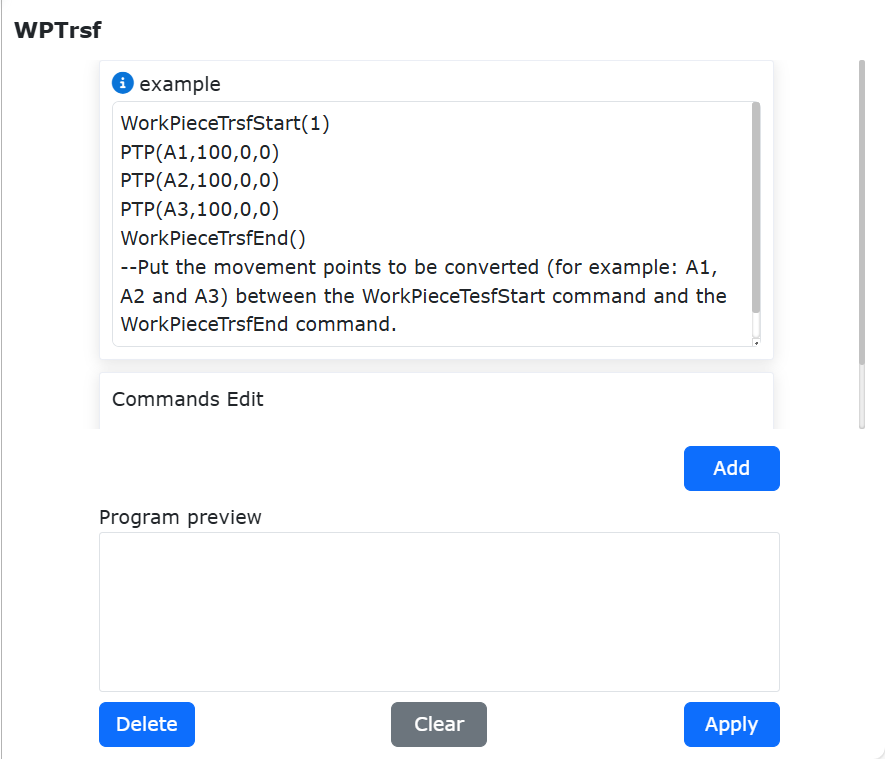

.. centered:: Figure 9.5-33 WPTrsf command interface

Tool conversion command
++++++++++++++++++++++++++++++

Click the "Tool conversion" icon to enter the ToolTrsf command editing interface.

After adding PTP and Lin instructions, select the tool coordinate system to be automatically converted, click "Add" and "Apply" to save the instruction, and the Cartesian coordinates of the points in the instruction will be automatically converted according to the currently set workpiece coordinate system.

.. note:: The usage example area shows and prompts the correct combination of instructions. After adding specific instructions, you can adjust the combination according to the actual scenario.

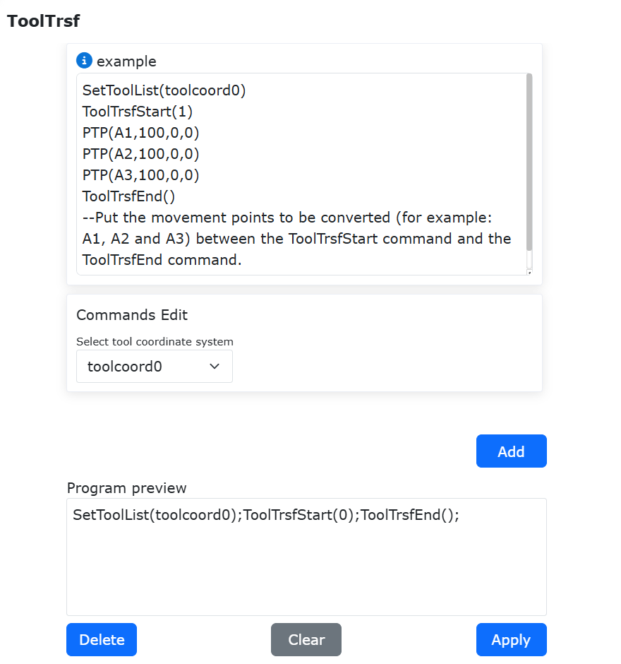

.. centered:: Figure 9.5-34 ToolTrsf command interface

Control command interface
~~~~~~~~~~~~~~~~~~~~~~~~~~~~~

.. image:: coding/082.png
   :width: 6in
   :align: center

.. centered:: Figure 9.6 Control command interface

IO command
++++++++++++++++

Click the "IO" icon to enter the IO command editing interface.

The "IO" command is divided into two parts: setting IO (SetDO/SPLCSetDO) and getting IO (GetDI/SPLCGetDI).

"SetDO/SPLCSetDO" This command can set the specified output DO state, including 16 digital outputs of the control box and 2 digital outputs of the tool. The state option "False" is closed, "True" is open, and whether to block the option selects "blocked". "Indicates that the DO state is set after the movement stops, and selecting the "non-blocking" option means that the DO state is set during the last movement. Selecting "Break" for the smooth trajectory option means setting the DO state after the smooth transition radius ends, and selecting "Serious" means setting the DO state during the smooth transition radius movement. When this instruction is added in the auxiliary thread, whether the application thread needs to select yes, and other places use this instruction to select no. Click "Add", "Apply".

.. centered:: Figure 9.6-1 SetDO command interface

In the "GetDI/SPLCGetDI" command, select the value of the port number you want to get, whether to block or not, select "block" to get the DI status after the movement stops, and select the "non-blocking" option to get the DI state during the last movement. When this instruction is added in the auxiliary thread, whether the application thread needs to select yes, and other places use this instruction to select no. After selection, click the "Add" and "Apply" buttons.

.. centered:: Figure 9.6-2 GetDI command interface

AI command
++++++++++++++++

Click the "AI" icon to enter the AI command editing interface.

In this instruction, it is divided into two functions: setting analog output (SetAO/SPLCSetAO) and obtaining analog input (GetAI/SPLCGetAI).

"SetAO/SPLCSetAO" select the analog output that needs to be set, input the value that needs to be set, the range is 0-10, whether to block or not select "block" means to set the AO state after the movement stops, select "non-block" means to set the AO state after the last movement Set the AO state in the process. When this instruction is added in the auxiliary thread, whether the application thread needs to select yes, and other places use this instruction to select no. Click "Add", "Apply".

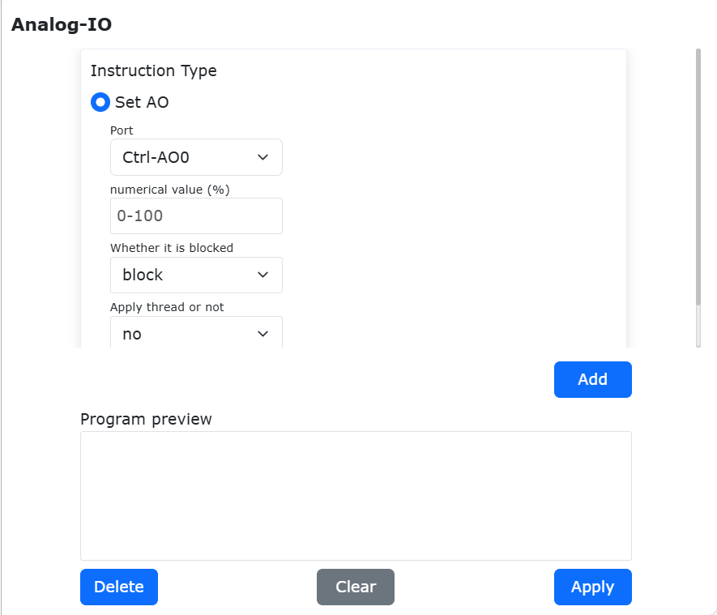

.. centered:: Figure 9.6-3 SetAO command interface

"GetAI/SPLCGetAI" selects the analog input that needs to be obtained, whether to block or not selects "blocked" to obtain the AI state after the movement stops, and selects the "non-blocked" option to obtain the AI state during the last movement. When this instruction is added in the auxiliary thread, whether the application thread needs to select yes, and other places use this instruction to select no. Click "Add", "Apply".

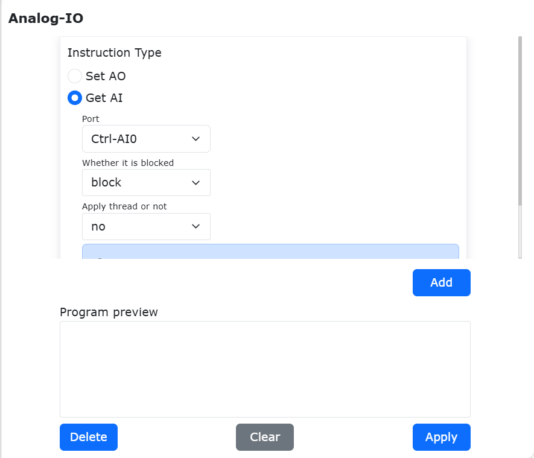

.. centered:: Figure 9.6-4 GetAI command interface

Vir-IO command
++++++++++++++++

Click the "Vir-IO" icon to enter the Vir-IO command editing interface.

This command is a virtual IO control command, which can realize the setting of the simulated external DI and AI status, and obtain the simulated DI and AI status.

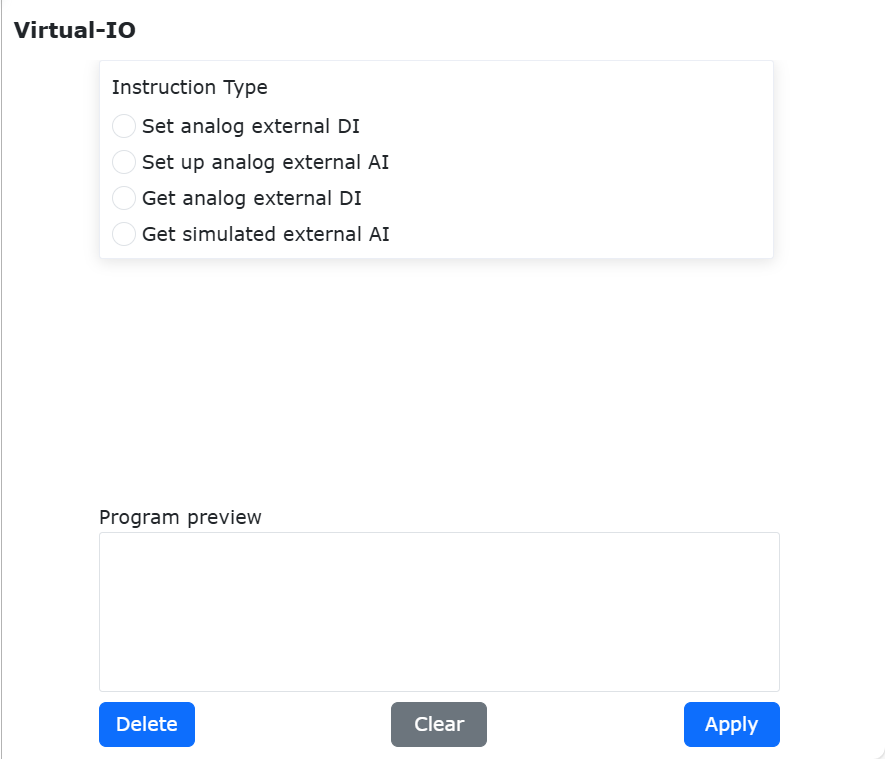

.. centered:: Figure 9.6-5 Vir-IO command interface

Aux-IO command
++++++++++++++++

Click the "Aux-IO" icon to enter the Aux-IO command editing interface.

Aux-IO is the instruction function for the robot to communicate with the PLC to control the external expansion IO. It is necessary for the robot to establish UDP communication with the PLC. On the basis of the original 16-channel input and output, 128-channel input and output can be expanded. The usage of this command is the same as that mentioned above. IO usage is similar. There are certain technical difficulties in using this function, please contact us for consultation beforehand.

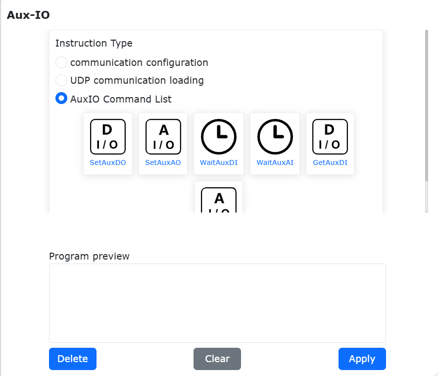

.. centered:: Figure 9.6-6 Aux-IO command interface

MoveDO command
++++++++++++++++

Click the "MoveDO" icon to enter the MoveDO command editing interface.

This instruction is divided into continuous output mode and single output mode.

- Continuous output mode: During linear motion, the DO signal function is continuously output according to the set interval.

.. centered:: Figure 9.6-7 MoveDO command continuous output interface

- Single output mode: There are two options: constant speed segment output and free configuration. The setting time is output after the movement starts, and the reset time is output before the movement ends, ranging from [0, 1000].

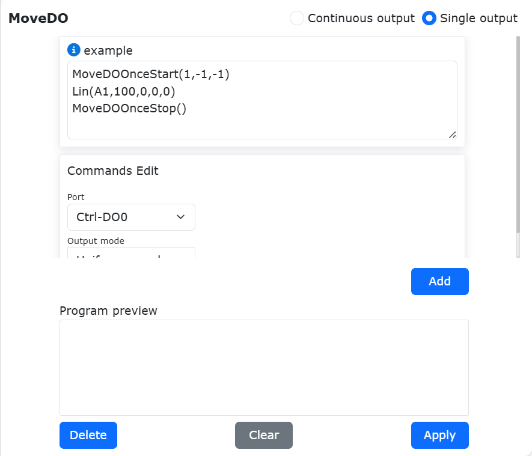

.. centered:: Figure 9.6-8 MoveDO instruction single output interface

MoveAO command
++++++++++++++++

Click the "MoveAO" icon to enter the MoveAO command editing interface.

1. Summary

When used in conjunction with motion commands, this instruction can output AO signals proportionally based on real-time TCP speed during the motion process.

2. Description of Motion AO Command

The motion AO command is located in the teaching simulation program teaching command editing area, and the icon is Control Command-Motion AO.

.. image:: coding/091.png
   :width: 6in
   :align: center

.. centered:: Figure 9.6-9 Motion AO Instruction

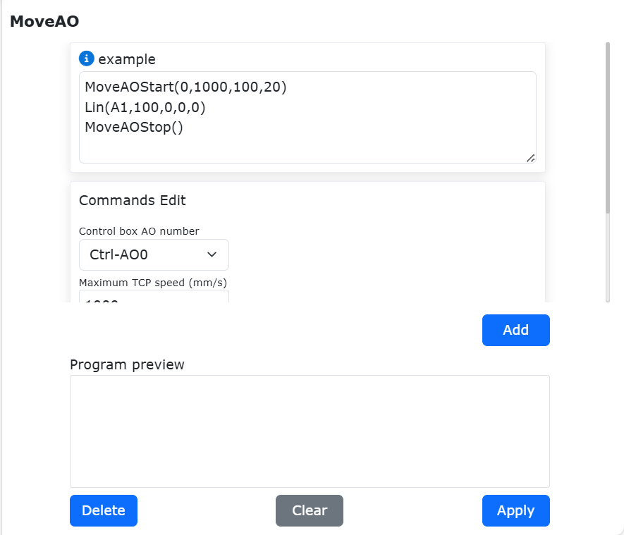

.. centered:: Figure 9.6-10 Details of Motion AO Instructions

- AO number: dropdown list selection, Ctrl-AO0 corresponds to control box AO0, Ctrl-AO1 corresponds to control box AO1, and End AO0 corresponds to end AO0.

- Maximum TCP speed: The maximum TCP speed value of the robot; Function: Proportional to real-time TCP speed.

- Maximum TCP speed AO percentage: The AO percentage corresponding to the maximum TCP speed value of the robot; Function: Set the upper limit value of AO output.

- Dead zone compensation value AO percentage: When there is a dead zone in the proportional valve, this parameter can be set to ensure AO output; Function: Set the lower limit value of AO output.

.. important:: 
   Calculation formula:Output AO percentage=Real time TCP speed/Set maximum TCP speed * Set maximum TCP speed AO percentage.

   The accompanying motion commands for this command are as follows:PTP/LIN/ARC/CIRCLE/SPLINE/NSPLINE/SERVOJ.

ToolList command
+++++++++++++++++++

Click the "ToolList" icon to enter the ToolList command editing interface.

Select the tool coordinate system name and click "Apply" to add this command to the program. When the program runs this statement, the tool coordinate system of the robot will be set.

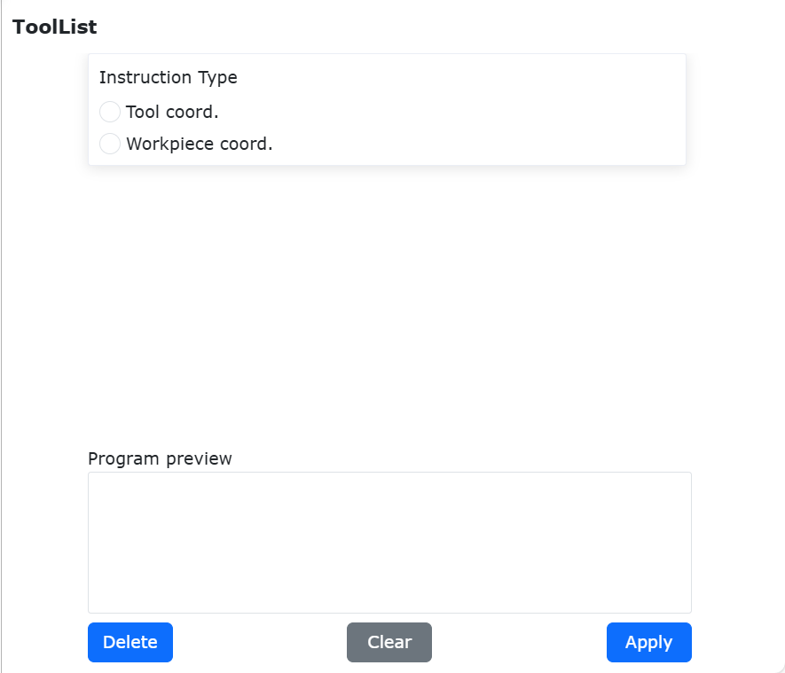

.. centered:: Figure 9.6-11 ToolList command interface

Mode command
++++++++++++++++

Click the "Mode" icon to enter the Mode command editing interface.

This command can switch the robot to manual mode, and is usually added at the end of a program so that the user can automatically switch the robot to manual mode and drag the robot after the program runs.

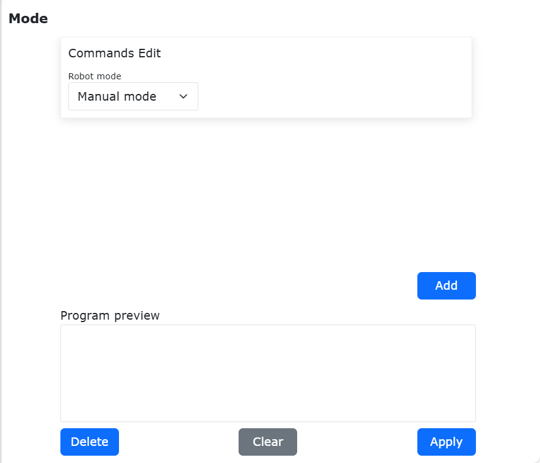

.. centered:: Figure 9.6-12 Mode command interface

Collision command
++++++++++++++++++++

Click the "Collision" icon to enter the Collision command editing interface.

This command is used to set the collision level. Through this command, the collision level of each axis can be adjusted in real time during program operation, and the application scenario can be deployed more flexibly.

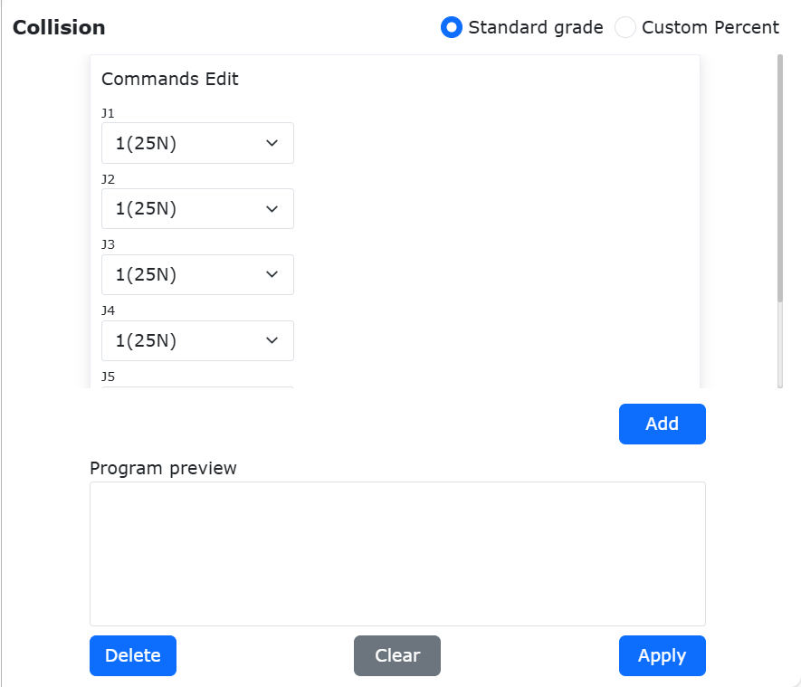

.. centered:: Figure 9.6-13 Collision command interface

Acc command
++++++++++++++++

Click the "Acc" icon to enter the Acc command editing interface.

The Acc command is to realize the function that the acceleration of the robot can be set separately. By adjusting the acceleration scaling factor of the motion command, the acceleration and deceleration time can be increased or decreased, and the takt time of the robot action can be adjusted.

.. centered:: Figure 9.6-14 Acc command interface

Peripheral Command Interface
~~~~~~~~~~~~~~~~~~~~~~~~~~~~~~~~

.. image:: coding/097.png
   :width: 6in
   :align: center

.. centered:: Figure 9.7 Peripheral Command Interface

Gripper command
++++++++++++++++++

Click the "Gripper" icon to enter the Gripper command editing interface.

In this command, it is divided into the gripper motion control command and the gripper activation/reset command. In the gripper control command, the number of the gripper that has been configured and activated is displayed. The user can edit through the edit box, or slide the slider to The required value is used to complete the setting of jaw opening and closing, opening and closing speed and opening and closing torque. Blocking means that the gripper moves in parallel with the previous movement command. Click the "Add" and "Apply" buttons to save the set value to the teaching file. The gripper reset/activation command displays the number of the grippers that have been configured, and the reset/activation command can be added to the program.

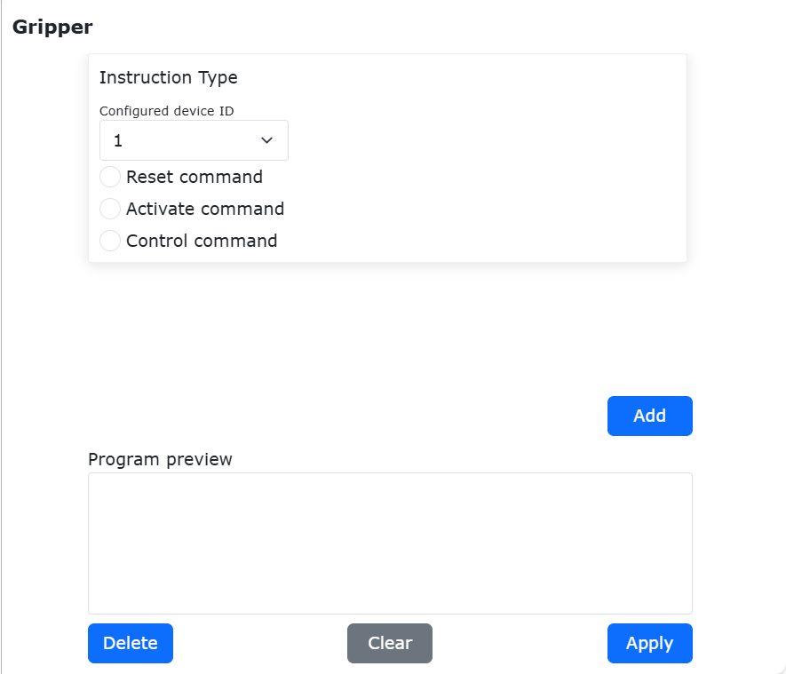

.. centered:: Figure 9.7-1 Gripper command interface

Spray command
++++++++++++++++

Click the "Spray" icon to enter the Spray command editing interface.

This command is a spraying-related command, which controls the spray gun to "start spraying", "stop spraying", "start cleaning the gun" and "stop the light gun". When editing the program command, it is necessary to confirm that the peripherals of the spray gun have been configured. For details, see the chapter on peripherals of the robot.

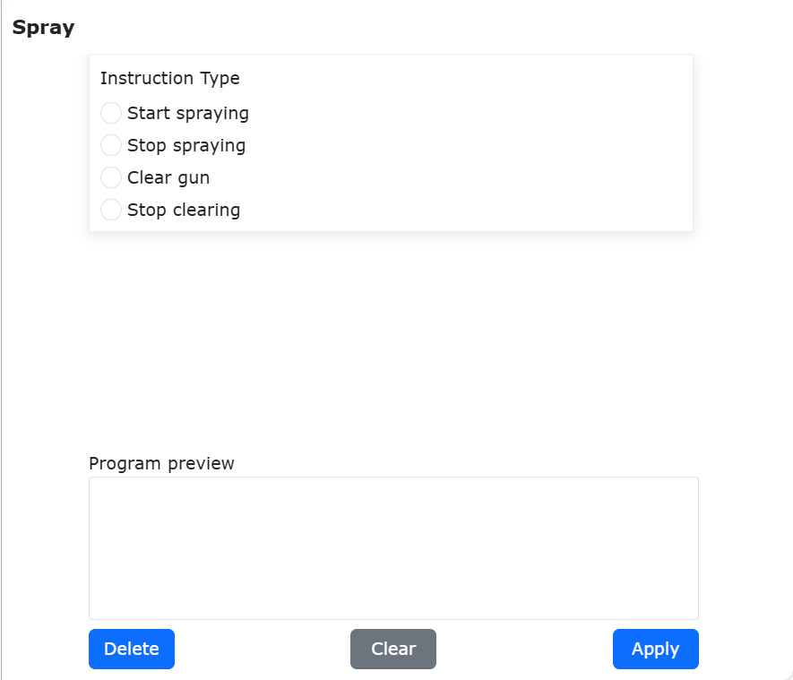

.. centered:: Figure 9.7-2 Spray command interface

EAxis command
++++++++++++++++

Click the "EAxis" icon to enter the EAxis command editing interface., Select the combination mode: 

- Controller + servo drive (485)
- Controller + PLC (UDP)

Select controller + PLC(UDP),this command is used in combination with the PTP command for scenarios using external axes, and can decompose the movement of a point in space in the X-axis direction to the movement of external axes. Select the external axis number, select synchronous motion mode, select the point to be reached, and click "Add" and "Apply" to save the command.

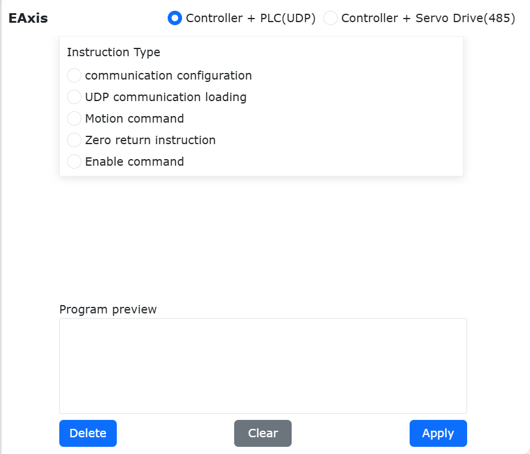

.. centered:: Figure 9.7-3 EAxis command interface

Select controller + servo drive(485),This command can configure the extended axis parameters. Set different parameters according to different control modes. The zero point of the configured expansion axis can be set.

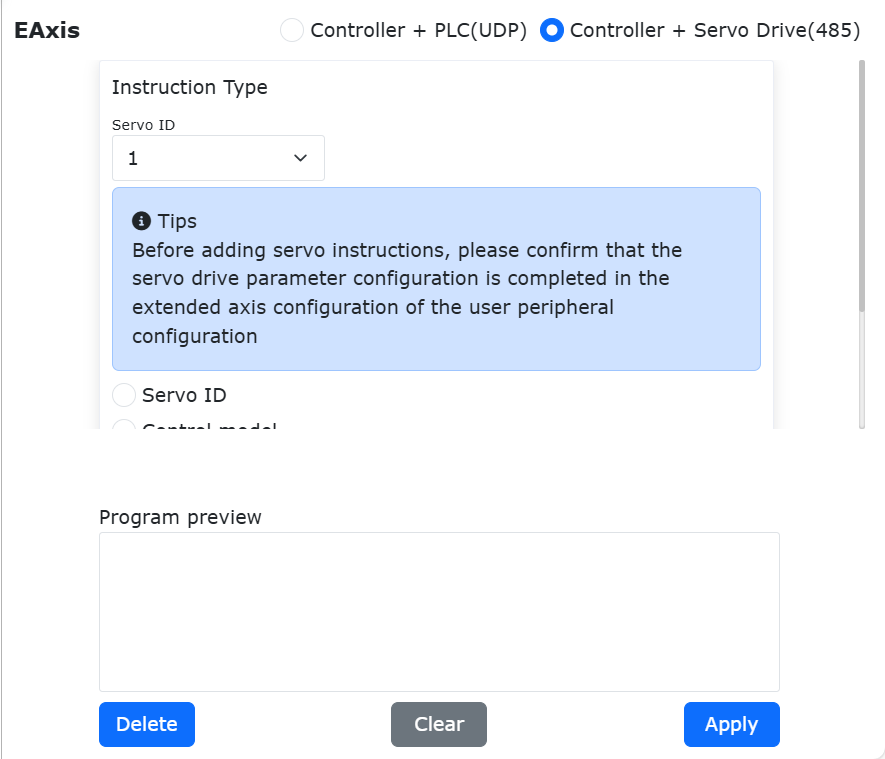

.. centered:: Figure 3.7-4 Servo command interface

Convey command
++++++++++++++++

Click the "Convey" icon to enter the Convey command editing interface.

This command includes four commands: position real-time detection, IO real-time detection, tracking on and tracking off. See Robot Peripherals chapter for details.

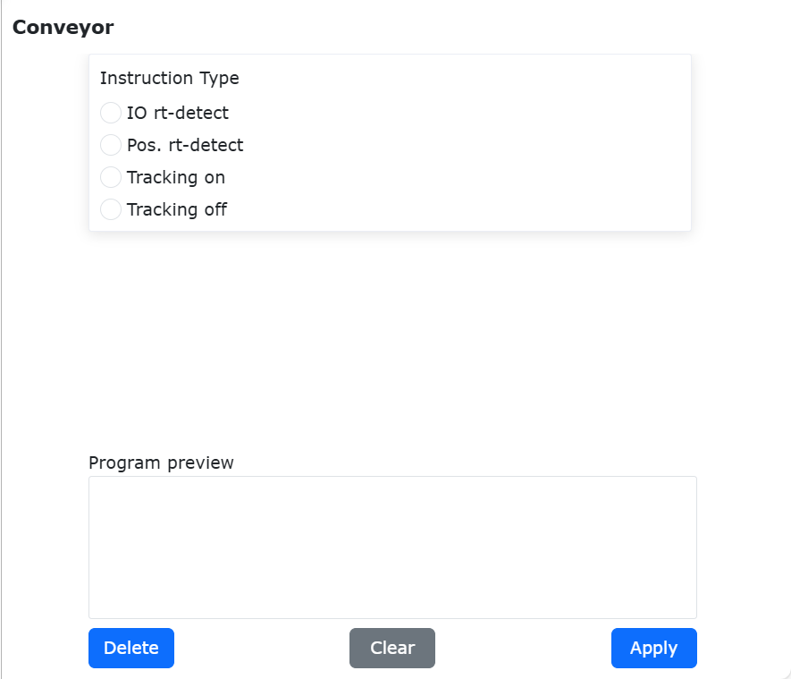

.. centered:: Figure 9.7-5 Conveyor command interface

Polish command
++++++++++++++++

Click the "Polishing" icon to enter the Polish command editing interface.

This command can set the rotation speed, contact force, extension distance and control mode of the grinding equipment.

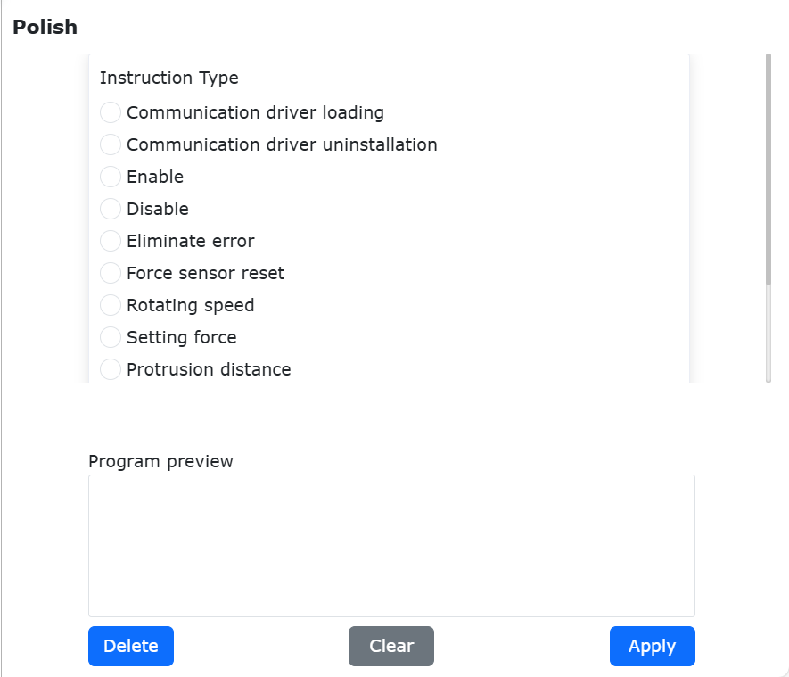

.. centered:: Figure 9.7-6 Polish command interface

Welding command interface
~~~~~~~~~~~~~~~~~~~~~~~~~~~~~~

.. image:: coding/104.png
   :width: 6in
   :align: center

.. centered:: Figure 9.8 Welding command interface 

Weld command
++++++++++++++++

Click the "Weld" icon to enter the Weld command editing interface.

This command is mainly used for welding machine peripherals. Before adding this command, please confirm whether the welding machine configuration is completed in the user peripherals. For details, see the chapter on robot peripherals.

- welding voltage range: 0~700V
- welding current range: 0~1000A

.. important:: When configuring the output AO, welding current, and welding voltage, you need to select the I/O type. If you select controller I/O, you need to select the corresponding output AO.

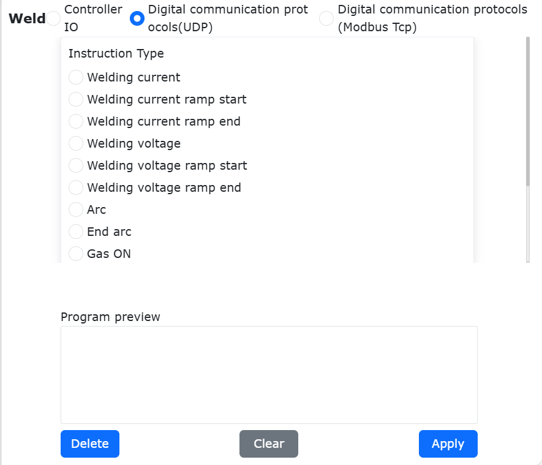

.. centered:: Figure 9.8-1 Weld command interface

Segment command
++++++++++++++++

Click the "Segment" icon to enter the Segment command editing interface.

The collaborative robot can perform segment welding operations by adding segment welding instructions. Before adding segment welding instructions, you need to select the segment welding mode and teach the starting point and end point. The segment welding mode is divided into unchanged posture and changing posture. The robot considers whether to change the posture during the welding trajectory according to the selected segment welding mode.

Teach the starting point "segment01" and the end point "segment02", and confirm the starting point and end point of the welding trajectory, as shown in the figure below.

.. image:: coding/106.png
   :width: 3in
   :align: center

.. centered:: Figure 9.8-2-1 Starting point “segment01”

.. image:: coding/107.png
   :width: 3in
   :align: center

.. centered:: Figure 9.8-2-2 Starting point “segment02”

Segment welding command added
********************************

**Step1**: Create a new user program "testSegment1.lua", click the "Segment Welding" button, and open the segment welding instruction adding page.

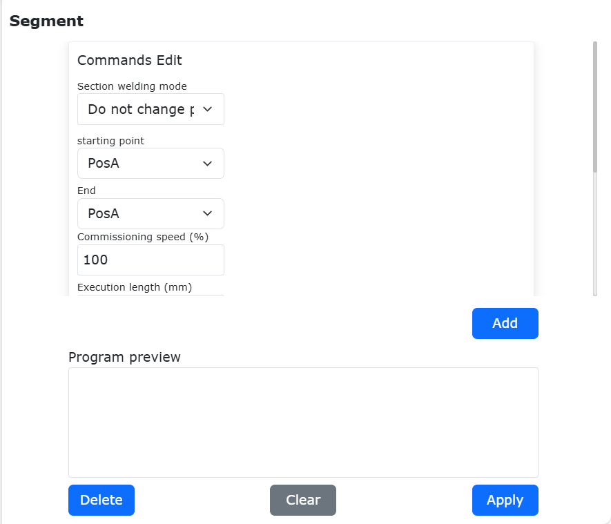

.. centered:: Figure 9.8-2-3 Add segment welding command button

**Step2**: On the segment welding instruction adding page, select "segment01" as the "start point" and "segment02" as the "end point".

.. image:: coding/109.png
   :width: 6in
   :align: center

.. centered:: Figure 9.8-2-4 Starting point and end point of segment welding

**Step3**: Configure the debugging speed, execution length, non-execution length, functional mode, swing selection and rounding rules, and click the "Add" button and the "Apply" button in sequence.

**Step4**: At this time, "testSegment1.lua" has added segment welding motion instructions, as shown in Figure5.

.. image:: coding/110.png
   :width: 4in
   :align: center

.. centered:: Figure 9.8-2-5 Addition of segment welding motion instructions

Changes in segment welding motion trajectory and attitude
************************************************************

The segment welding mode of the collaborative robot can be selected for the segment welding movement. The mode types include the following two types;

**No change in posture**:The robot always maintains the posture of the starting point of the welding trajectory during the welding trajectory.

**Changing posture**:During the welding trajectory process, the robot calculates the Cartesian pose and joint position of each segment of the trajectory, and changes its posture during the segment welding operation.

The following demonstrates the usage of "no change posture" and "change posture" respectively.

1. Do not change posture
   
Open the segment welding instruction adding page, select "No change in attitude" for "segment welding mode", also select "start point" as "segment01", "end point" as "segment02", set the execution length to 100, non-execution Set the length to 50, select other relevant configurations and save the program.

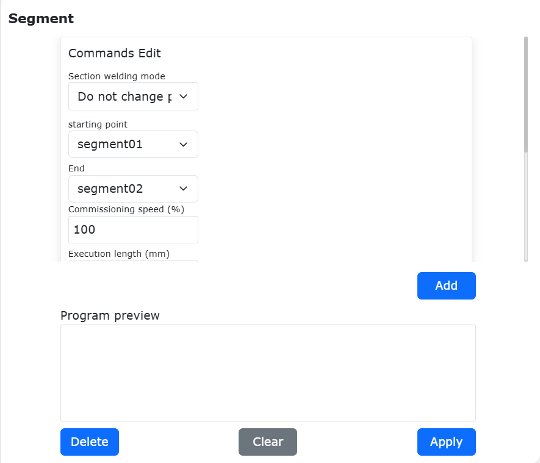

.. centered:: Figure 9.8-2-6 Segment welding mode without changing attitude

2. Change posture
   
Open the segment welding instruction adding page, select "Change Attitude" for "Segment Welding Mode", also select "Start Point" as "segment01", "End Point" as "segment02", set the execution length to 100, and the non-execution length. Set it to 50, select other relevant configurations and save the program.

.. centered:: Figure 9.8-2-7 Changing attitude segment welding mode

3. Section welding operation type

Running program, robot segment welding operation conditions are divided into the following types:

1) If the function mode selects the first segment to execute the function, and the swing selects the execution segment to swing, the rounding rule will not round. Then the robot performs swing motion at 100mm and linear motion at 50mm alternately, and stops when it reaches the end point;

.. centered:: Figure 9.8-2-8 The first section executes the swing function without rounding

2) If the function mode selects the first segment to not execute the function, the swing selection does not execute the segment swing, and the rounding rules do not round. Then the robot performs swing motion for 50mm and linear motion for 100mm alternately, and stops when it reaches the end point;

.. centered:: Figure 9.8-2-9 The first section does not execute the swing function and does not round

3) If the function mode selects the first segment to perform the function, the swing selects the execution segment to swing, and the rounding rules are rounded. Then the robot performs swing motion at 100mm and linear motion at 50mm alternately. After the last period of the overall cycle, if the remaining distance is less than 150mm, it will stop swinging;

.. centered:: Figure 9.8-2-10 The first section performs circular rounding of the swing function

4) If the function mode selects the first segment to perform the function, and the swing selects not to execute the segment swing, the rounding rules are rounded. Then the robot performs swing motion at 50mm and linear motion at 100mm alternately. After the last period of the overall cycle, if the remaining distance is less than 150mm, it will stop swinging;

.. centered:: Figure 9.8-2-11 The first section does not perform circular rounding of the swing function

5) If the function mode selects the first segment to execute the function, the swing selects the execution segment to swing, and the rounding rule is single segment rounding. Then the robot performs swing motion at 100mm and linear motion at 50mm alternately. After the last cycle, if the next segment is 100mm, swing planning is performed and the remaining distance is less than 100mm, the swing will stop; if the next segment is 50mm, linear motion planning is performed and the remaining distance is If it is less than 50mm, the movement will stop;

.. centered:: Figure 9.8-2-12 The first section performs single-section rounding of the swing function

6) If the function mode selects the first segment to perform the function, the swing selects not to execute segment swing, and the rounding rule is single segment rounding. Then the robot performs swing motion at 50mm and linear motion at 100mm alternately. After the last cycle, if the next segment is 50mm, swing planning is performed and the remaining distance is less than 50mm, then the swing is stopped; if the next segment is 100mm, linear motion planning is performed and the remaining distance is Less than 100mm, the movement stops.

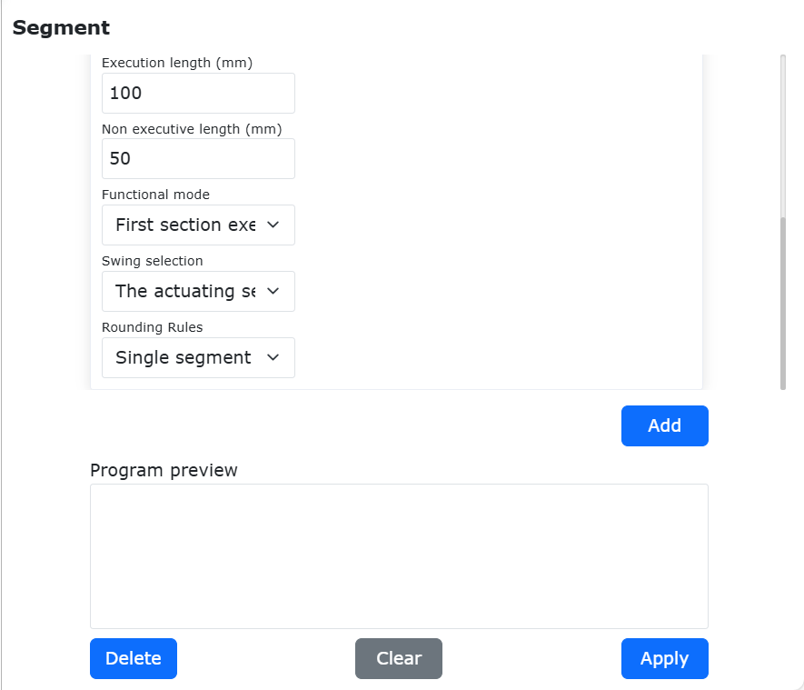

.. centered:: Figure 9.8-2-13 The first section does not perform single-section rounding of the swing function

4. Posture contrast
   
When configuring different segment welding modes, the posture of the robot during welding trajectory operation will also be different. The posture comparison during operation is as follows:

.. image:: coding/119.png
   :width: 3in
   :align: center

.. centered:: Figure 9.8-2-14 Initial posture of welding trajectory

.. image:: coding/120.png
   :width: 3in
   :align: center

.. centered:: Figure 9.8-2-15 The posture does not change during operation

.. image:: coding/121.png
   :width: 3in
   :align: center

.. centered:: Figure 9.8-2-16 Change of attitude during operation

Actual scene of segment welding
*************************************

In the actual test environment, the robot needs to be equipped with a welding gun and other configurations, and perform welding operations on the welding plate according to the created segment welding instructions. The actual scene diagram is as follows:

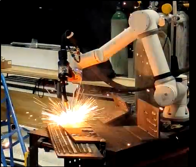

.. centered:: Figure 9.8-2-17 Actual scene of segment welding

Laser command
++++++++++++++++

Click the "Laser" icon to enter the Laser command editing interface.

This command includes three parts: laser command, tracking command and positioning command. Before adding this command, please confirm whether the laser tracking sensor in the user peripheral has been configured successfully. See Robot Peripherals chapter for details.

In the sensor loading module, after displaying the corresponding "sensor command" interface according to the function selection, configure the sensor command:

**Ruiniu/CXZK**: Enter the weld type, range: 0~49 integer

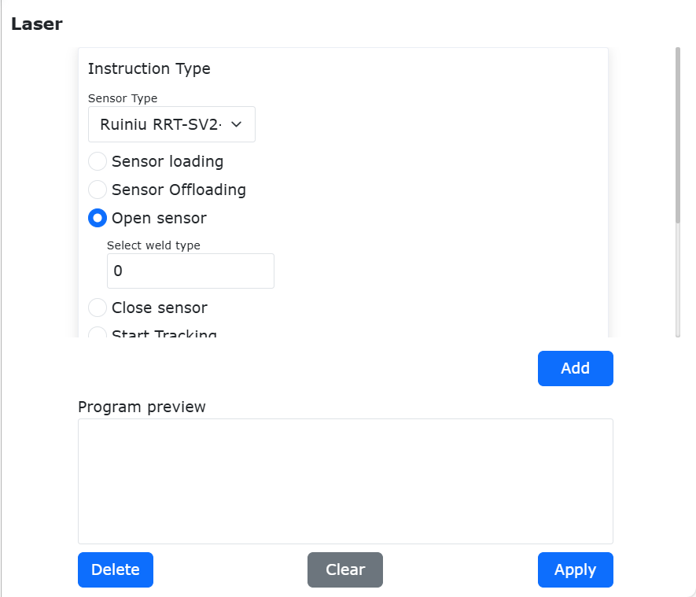

.. centered:: Figure 9.8-3-1 Laser command interface

**Quanshi**: Enter the task number, range: 0~255 integer

.. centered:: Figure 9.8-3-2 Laser command interface

LT-Rec command
++++++++++++++++

Click the "LT-Rec" icon to enter the LT-Rec command editing interface.

This command realizes the function of taking out the starting point and end point of laser tracking recording, so that the robot can automatically move to the starting point position, which is suitable for the occasion where the movement starts from the outside of the workpiece and laser tracking recording is performed. At the same time, the host computer can obtain the information of the starting point and end point in the recorded data. for follow-up exercise.

Realize the adjustable function of laser tracking and reproduction speed, so that the robot can record at a very fast speed, and then reproduce according to the normal welding speed, which can improve the working efficiency.

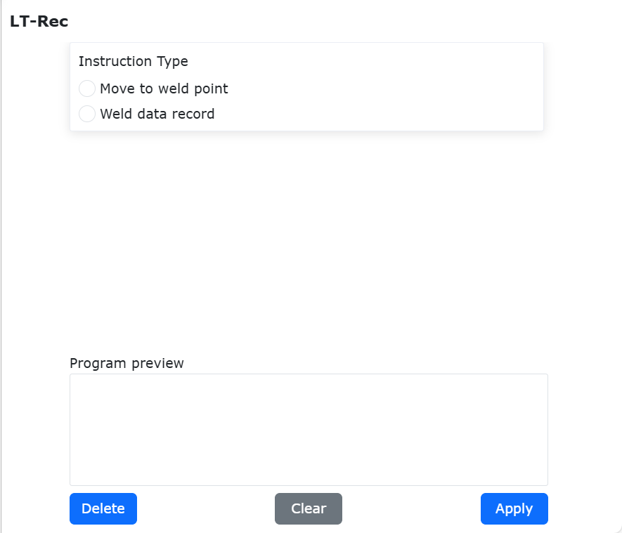

.. centered:: Figure 9.8-4 LT-Rec command interface

W-Search command
++++++++++++++++

Click the "W-Search" icon to enter the W-Search command editing interface.

This command is a welding wire positioning command, including three commands of start of positioning, end of positioning and calculation of offset. This command is generally used in welding scenes and requires the combination of welding machine and robot IO and motion commands.

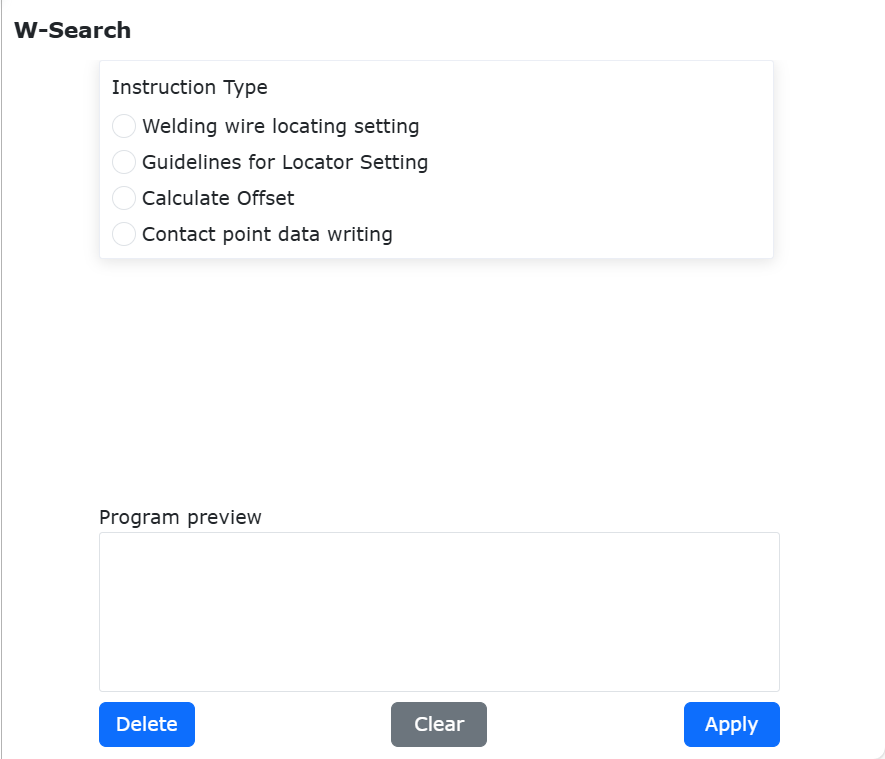

.. centered:: Figure 9.8-5 W-Search command interface

In writing a program, usually first set the start command of the search, and then add two LIN instructions to determine the direction of the search. After the search is successful, obtain the calculated offset, and pass the offset through the overall offset command. To take effect into the real welding motion command, the program example is as follows.

.. image:: coding/127.png
   :width: 4in
   :align: center

.. centered:: Figure 9.8-5-1 W-Search example(1D)

Weld-Trc command
++++++++++++++++++

Click the "Weld-Trc" icon to enter the Weld-Trc command editing interface.

This command realizes the robot seam tracking and uses the deviation detection of the welding seam to compensate the trajectory, and the arc sensor can be used to detect the seam deviation.

**Step1**: Upper and lower compensation reference current setting method: feedback, set the upper and lower reference current start counting and the upper and lower reference current counting

.. centered:: Figure 9.8-6-1 Weld-Trc command interface-Feedback

**Step2**:Upper and lower compensation reference current setting method: constant, set the upper and lower reference current

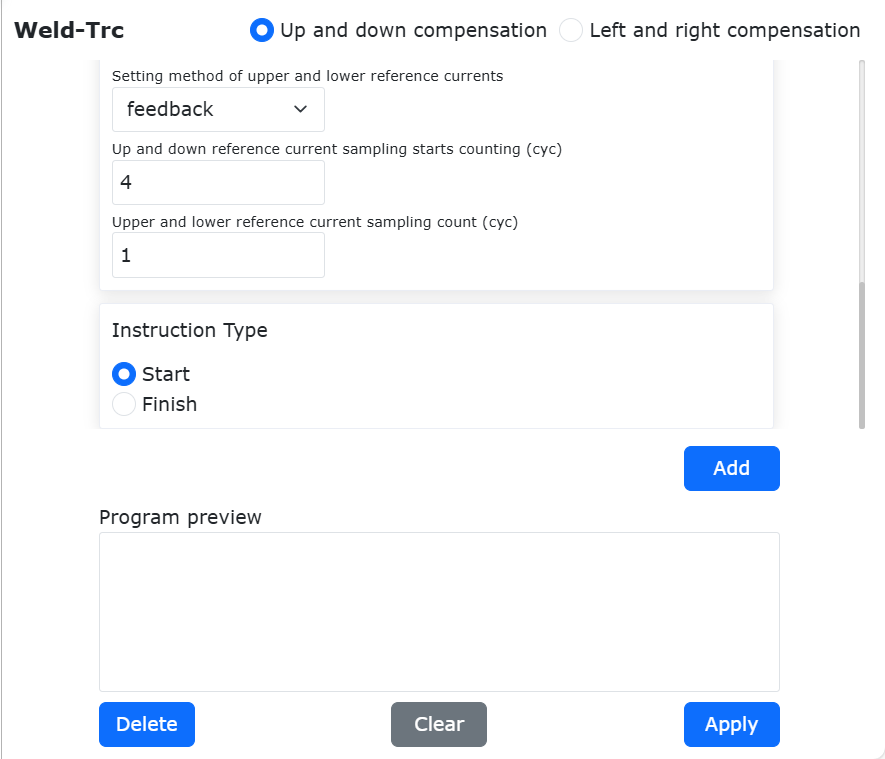

.. centered:: Figure 9.8-6-2 Weld-Trc command interface-constant

**Step3**:Left and right compensation parameter interactive page

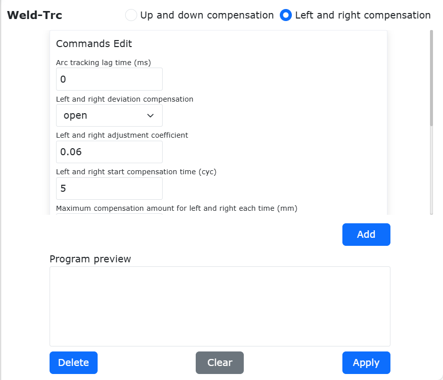

.. centered:: Figure 9.8-6-3 Weld-Trc command interface-left and right compensation parameters

Robot arc tracking system composition
+++++++++++++++++++++++++++++++++++++++

During arc tracking welding, the welding machine feeds the real-time welding current signal to PLC, and then the PLC feeds back to the robot through UDP communication. The robot can compensate the welding trajectory position according to the real-time feedback welding current value to achieve arc tracking effect. There are two ways to feedback the current signal between the welding machine and the PLC:

①CANopen or other bus communication: If your welder supports CANopen, EtherCAT, ModbusTCP and other bus communication protocols (such as MEGMEET A2 series, etc.), the PLC and the welder can communicate data directly through the relevant communication protocols, and the corresponding welding current signal can be directly transmitted to the PLC through communication. The PLC then feeds back to the robot through UDP communication.

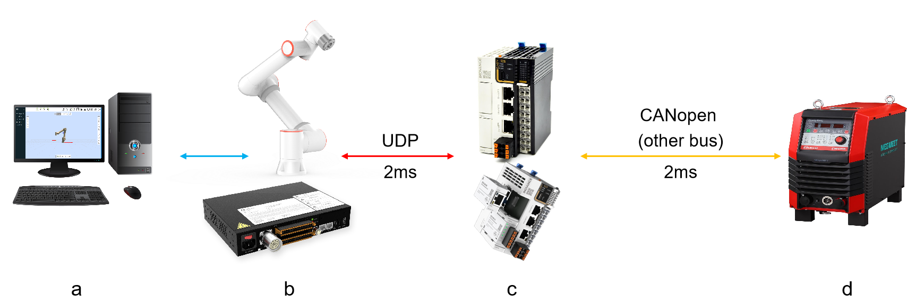

.. centered:: Figure 9.8-6-4 Topology diagram of robot arc tracking system (PLC communicates with welding machine bus)
.. centered:: a-computer;b-Robot and control box;c-PLC and bus communication module; d-welder

②Analog IO: PLC can also directly collect the analog signal, and then convert the analog signal into the current value with a certain conversion relationship to feed back to the robot; If your welding machine has a real-time welding current analog output channel, you can directly connect the channel to the PLC analog input module; If your welding machine does not have a real-time welding current analog output channel, you can connect an external Hall current sensor. The sensor collects the real-time welding current signal, converts the welding current signal into an analog signal, and outputs the welding current signal to the PLC analog input module.

.. image:: coding/278.png
   :width: 6in
   :align: center

.. centered:: Figure 9.8-6-5 Topology diagram of robot arc tracking system (PLC acquisition of analog signals)
.. centered:: a-computer; b-Robot and control box; c-PLC and analog input module; d-welder and Hall current sensor

Welding machine model and setting
**************************************

.. centered:: Table 9.8-1 Verified welding machine model

.. list-table::
   :widths: 70
   :header-rows: 0
   :align: center

   * - **Verified welding machine model**

   * - MEGMEET ArtsenII CM350
  
.. centered:: Table 9.8-2 Welding machine function setting

.. list-table::
   :widths: 100 100
   :header-rows: 0
   :align: center

   * - **Function number**
     - **Set the parameters**

   * - F18
     - 20

   * - F19
     - 56

PLC model and settings
**************************************

.. centered:: Table 9.8-3 Verified PLC models

.. list-table::
   :widths: 70
   :header-rows: 0
   :align: center

   * - **Verified PLC models**

   * - INOVANCE Easy521
  
.. centered:: Table 9.8-4 PLC key settings

.. list-table::
   :widths: 70 70
   :header-rows: 0
   :align: center

   * - **Settings**
     - **Set the contents**

   * - Communication protocols
     - CANOPEN

   * - Feedback current sampling source
     - Feedback data from welding machine

   * - Synchronization period
     - 2ms

:download:`Annex:PLC Program <../_static/_doc/MEGMEET PLC PROGRAME.zip>`

Arc tracking function
**************************************

**1）Introduction to the arc tracing feature**

.. image:: coding/279.png
   :width: 4in
   :align: center

.. centered:: Figure 9.8-7-1 Typical arc tracing scenario

Typical scenarios for the arc tracing function include: a. welding the workpiece (the weld groove is at a right or acute angle), b. the welding gun, e. weld center line. 

The arc tracking function can tracing the welding groove through the collected welding current information and the swing parameters: c. up and down (depth) direction tracking and d. left and right (center line) direction tracking.

**2）Communication Configuration**

Open WebApp and click "Initial", "Peripheral" and "Welder" in turn.

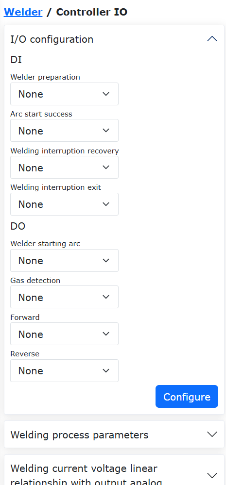

.. centered:: Figure 9.8-7-2 Open welding config

The control type is selected as "Digital communication protocol". Since the robot communicates with PLC through UDP, UDP communication parameters need to be configured. The meanings of each parameter are as follows:

**IP address**:IP address of PLC for UDP communication;

**Port number**:PLC UDP communication port number;

**Communication cycle**:The cycle of UDP communication between the robot and the PLC, the default is 2ms;

**Packet loss detection cycle and Packet loss times**:When the number of lost packets in the packet loss detection period exceeds the specified value, the robot reports an error message indicating UDP Packet loss Exception and automatically cuts off the communication;

**Communication interruption confirmation time**:The robot does not receive a complete PLC feedback packet within this period of time, which will report "UDP communication interruption" error alarm, and cut off UDP communication;

**Automatic reconnection after communication interruption**:Whether the robot automatically reconnects after detecting UDP communication interruption;

**Reconnection period and Num of reconnections**:After automatic reconnection of UDP communication interruption is enabled and UDP communication interruption is detected, the robot reconnects at the set period. When the reconnection times reach the maximum set value and the connection is not successful, the robot reports an error alarm of "UDP communication interruption" and disconnects the UDP communication at the same time.

After configuring the above parameters, click the "Configure" and "Load" buttons successively.

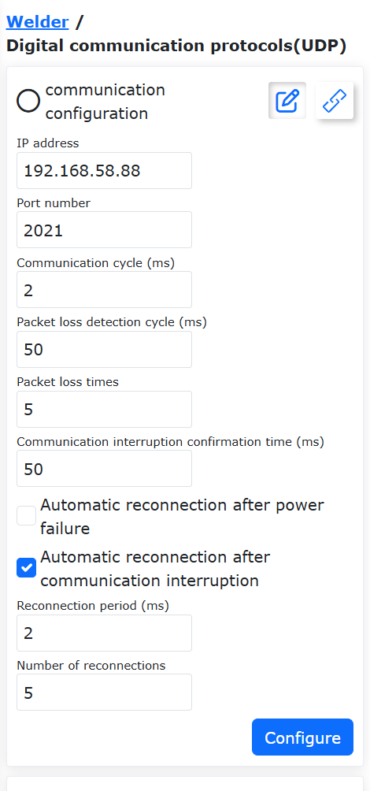

.. centered:: Figure 9.8-7-3 Selecting the control type
   
**3）Arc Tracing Channel Configuration**

Click "Initial", "Base", "I/O setup" and "AI" successively, select the corresponding extended AI channel according to the actual configuration, and click "Apply" button.

.. note:: 
   The UDP communication protocol between the robot and the PLC is shown in 8.5.5.Appendix 1: UDP communication protocol for robots. In the protocol, the PLC feedback data to the robot includes four analog input channels with serial numbers 70~73, corresponding to Aux-AI0~3 in Figure 4-4; 
   
   In the welding process, PLC collects real-time welding current signals and converts them into 0~4095 numerical signals and assign them to an analog input channel (default is "Aux-AI0"). The robot side collects the corresponding analog input channel values for arc tracking operations.
   
   If you need to change the arc tracking channel to "Aux-AI1", "Aux-AI2" or "Aux-AI3", you need to update the PLC program simultaneously and assign the real-time welding current collected to the corresponding analog input port.

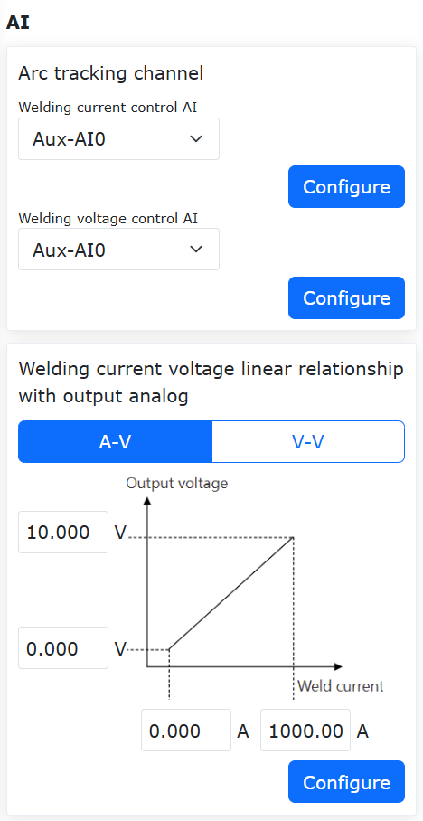

.. centered:: Figure 9.8-7-4 Arc tracking channel configuration

**4）Introduction to the use of arc tracing function commands**

The arc tracking function can be adapted to the swing welding movement, inserting the arc tracking start command after the swing welding arc starts, and inserting the arc tracking end command before the swing welding arc extinguishing.

.. image:: coding/283.png
   :width: 6in
   :align: center

.. centered:: Figure 9.8-7-5 Typical example of arc tracing

**5)Introduction to the parameters of the function interface**

.. centered:: Table 9.8-5 Arc tracking up-down compensation module

.. list-table::
   :widths: 70 70 70
   :header-rows: 0
   :align: center

   * - **The name of the parameter**
     - **Meaning**
     - **Description**

   * - Arc tracking lag time
     - The time for the feedback current to lag
     - The default is 0ms, do not adjust it

   * - Compensation for up-down deviations
     - Up-down compensating switches
     - You can choose to "on" or "off"

   * - Up-down adjustment coefficients
     - The coefficient of the relationship between the current and the compensation distance (adjustment sensitivity)
     - The welding tends to be in a short-circuit transition state, and the current signal-to-noise ratio gradually decreases, so it is recommended to reduce the sensitivity

   * - Up-down start compensating period
     - The fastest periods to start the up-down compensation
     - Associated with the swing frequency, it is better to open when the current tends to be stable for 3~4s after arcing. If the oscillation frequency is 1 Hz, the parameter can be 4, if the frequency is 2 Hz, the parameter can be 8, and so on

   * - The maximum distance of up-down compensation each period
     - The maximum distance of compensation per up-down compensation period
     - According to the welding scene setting, the faster the weave frequency, the smaller the compensation distance

   * - The maximum distance of compensation for the up-down totals
     - The maximum cumulative distance of compensation for a single complete welding process
     - According to the welding scene setting, the larger the weld deviation, the larger the setting

   * - Up-down coordinate system selection
     - The coordinate system in which the compensation value is compensated
     - If there is a welding weave, select "Weave", otherwise select "Tool" or "Frame"

   * - Up-down reference current setting method
     - Selection of the reference current acquisition method
     - You can choose "Feedback" by reading the feedback current, or "Constant" by filling in the current value directly

   * - The up-down reference current samples start counting
     - The number of periods for which the reference current is harvested with a delay
     - Associated with the weave frequency, it is better to open when the current tends to be stable for 3~4s after arcing. If the weave frequency is 1 Hz, the parameter can be 4, if the frequency is 2 Hz, the parameter can be 8, and so on

   * - Up-down reference current sampling counts
     - Reference current feedback mode, the statistical period of collecting the reference current
     - Default 1 CYC

   * - Up-down reference currents
     - Reference current constant mode, reference current value
     - It can be filled in manually to achieve the desired compensation height

.. centered:: Table 9.8-6 Arc tracking left-right compensation module

.. list-table::
   :widths: 70 70 70
   :header-rows: 0
   :align: center

   * - **The name of the parameter**
     - **Meaning**
     - **Parameter description**

   * - Arc tracking lag time
     - The time for the feedback current to lag
     - The default is 0ms, do not adjust it

   * - Compensation for left-right deviations
     - Left-right compensation switches
     - You can choose to "On" or "Off"

   * - Left-right compensation coefficients
     - The coefficient of the relationship between the current and the compensation distance (adjustment sensitivity)
     - The welding tends to be in a short-circuit transition state, and the current signal-to-noise ratio gradually decreases, so it is recommended to reduce the sensitivity

   * - Left-right compensation start counting
     - The fastest count to start left-right compensation function
     - Associated with the weave frequency, it is better to start when the current tends to be stable for 3~4s after arcing. If the weave frequency is 1 Hz, the parameter can be 4, if the frequency is 2 Hz, the parameter can be 8, and so on

   * - Left-right the maximum distance of compensation each time
     - The maximum distance of compensation per compensation cycle
     - According to the welding scene setting, the faster the swing frequency, the smaller the compensation distance

   * - The maximum distance of compensation for the left -right totals
     - The maximum cumulative distance of compensation for a single complete welding process
     - According to the welding scene setting, the larger the weld deviation, the larger the setting
     
**6)Scope of application**

.. centered:: Table 9.8-7 Up-down compensation On, Left-right compensation Off

.. list-table::
   :widths: 70 70
   :header-rows: 0
   :align: center

   * - **Key parameters**
     - **Parameter range**

   * - Weave frequency Hz
     - 0 (without welding swing), 0.5 to 2 (with weld swing)

   * - Weave amplitude mm
     - 0 (without welding swing), 3 through 7 (with welding swing)

   * - Set the voltage V
     - >17

   * - Set the current A
     - >160
  
.. centered:: Table 9.8-8 Up-down compensation Off, Left-right compensation On

.. list-table::
   :widths: 70 70
   :header-rows: 0
   :align: center

   * - **Key parameters**
     - **Parameter range**

   * - Weave frequency Hz
     - 0.5 to 2

   * - Weave amplitude mm
     - 3 to 7

   * - Set the voltage V
     - >17

   * - Set the current A
     - >160
  
.. centered:: Table 9.8-9 Up-down compensation On, Left-right compensation On

.. list-table::
   :widths: 70 70
   :header-rows: 0
   :align: center

   * - **Key parameters**
     - **Parameter range**

   * - Weave frequency Hz
     - 0.5 to 2

   * - Weave amplitude mm
     - 3 to 7

   * - Set the voltage V
     - >19

   * - Set the current A
     - >210

**7)Precautions**

1) The left-right compensated arc tracking function can only be adapted to symmetrical triangle or sine weave based on line trajectory.
2) The starting position of the welding to be able using the compensation function must be accurately above the weld (the axis of the welding gun is in the center of the fillet weld), and the welding gun should not be too close to the seam, otherwise there is a risk of hitting the welding gun.
3) The material on both sides of the groove of the workpiece needs to be consistent.
4) The coordinate size and attitude of the workpiece need to be accurately calibrated using the 6-point method.
5) If the deviation between the set trajectory and the seam is larger, the maximum compensation distance each time and the total maximum compensation distance should be larger too.
6) The deviation between the set trajectory and the end point of the weld should not be larger than 100mm/m, and too large the deviation may cause the welding wire or even the welding gun to hit the workpiece, so that the welding position deviates from the preset trajectory (the weave is not in place), resulting in the arc tracking function can not work normally.
7) If a small set current and voltage is selected for welding, the compensate coefficient of arc tracking should be reduced accordingly to reduce the instability compensation caused by the burr of the feedback current.
8)  When different coordinate systems are selected for arc tracking, the positive and negative signs of the up-down and left-right compensation coefficients may need to be adjusted, which can be judged by test welding in addition to the direction of the corresponding coordinate system. If the welding trajectory (left) is taught on an inclined plate, the welding trajectory (right) moves in the direction of descent based on the tilt gradient of the swing plane after arc tracking is enabled, and the height of the welding torch at the end is close to the starting point, then the sign of the adjustment coefficient is correct.

.. image:: coding/284.png
   :width: 6in
   :align: center

.. centered:: Figure 9.8-7-6 Set the tilt swing trajectory (left), weld trajectory when the symbol is correct (right)

Adjust command
++++++++++++++++

Click the "Adjust" icon to enter the Adjust command editing interface.

This command adaptively adjusts the posture of the welding torch for the scene of welding tracking. After recording the three corresponding posture points, add the posture adaptive adjustment command according to the actual direction of the robot's movement. See Robot Peripherals chapter for details.

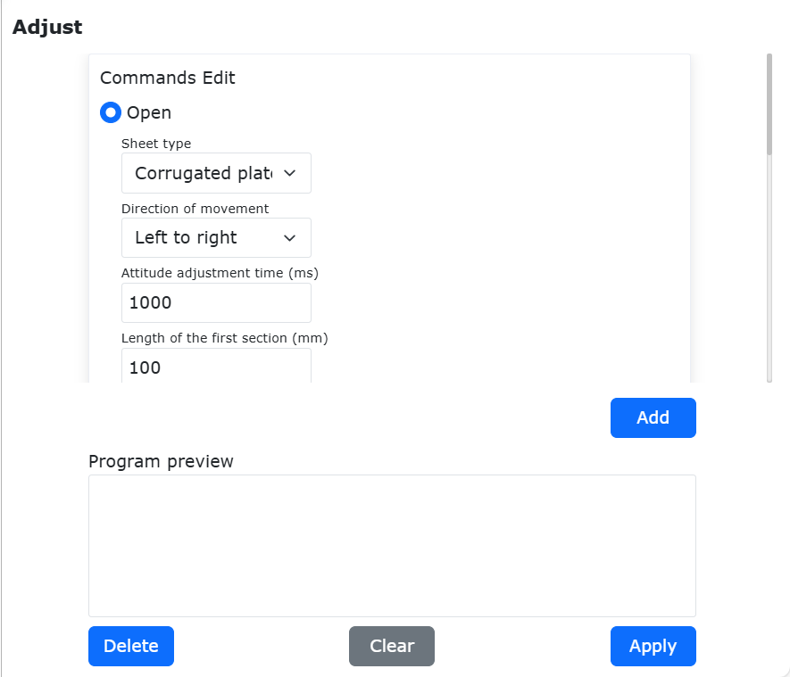

.. centered:: Figure 9.8-8 Adjust command interface

Force control command interface 
~~~~~~~~~~~~~~~~~~~~~~~~~~~~~~~~~~~

.. image:: coding/135.png
   :width: 6in
   :align: center

.. centered:: Figure 9.9 Force control command interface

F/T command
++++++++++++++++

Click the "F/T" icon to enter the F/T command editing interface.

The command includes nine commands: FT_Guard (collision detection), FT_Control (constant force control), FT_Compliance (compliance control), FT_Spiral (spiral insertion), FT_Rot ​​(rotation insertion), FT_Lin (linear insertion), FT_FindSurface (surface positioning), FT_CalCenter (center positioning), FT_Click (click force detection), see the robot peripherals chapter for details.

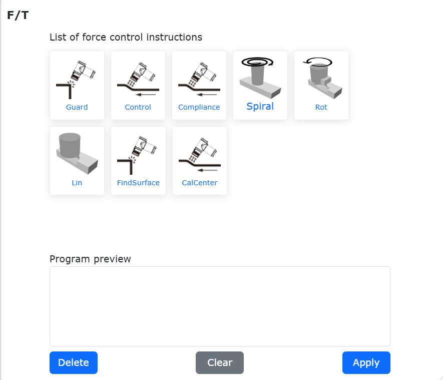

.. centered:: Figure 9.9-1 F/T command interface

Torque command
++++++++++++++++

Click the "Torque" icon to enter the Torque command editing interface.

This command is a torque recording command, which realizes the real-time torque recording collision detection function. Click the "Torque Record Start" button to continuously record the collision situation during the operation of the motion command, and the recorded real-time torque is used as the theoretical value of the collision detection judgment to reduce the probability of false alarms. When the set threshold range is exceeded, the collision detection duration is recorded. Click the "Torque Recording Stop" button to stop recording. Click "Torque Record Reset" to return the status to the default state.

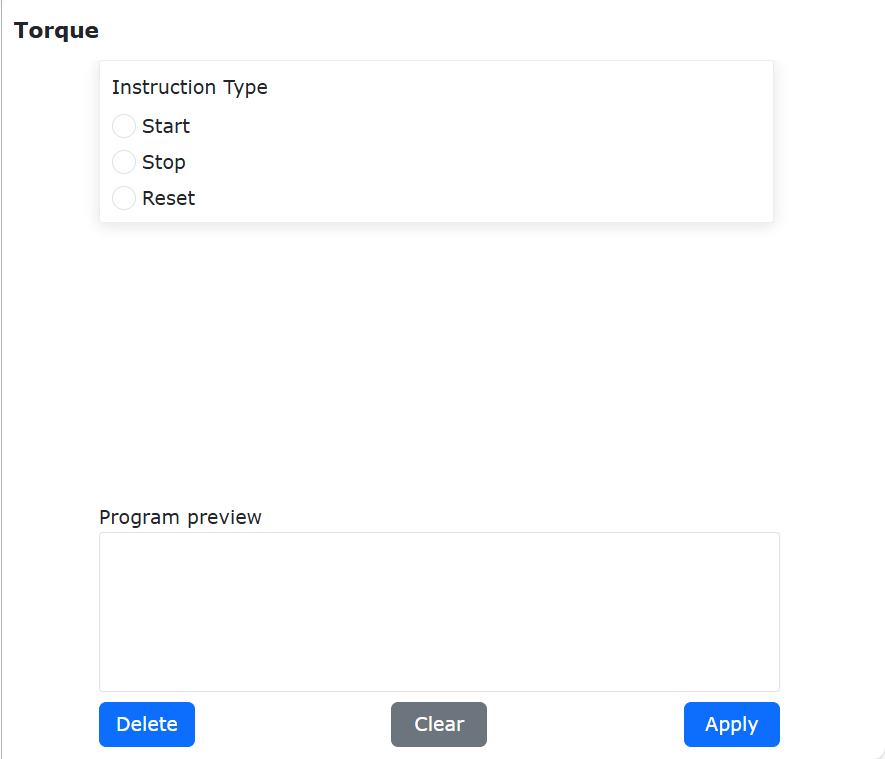

.. centered:: Figure 9.9-2 Torque command interface

Visual command interface
~~~~~~~~~~~~~~~~~~~~~~~~~~~

.. image:: coding/138.png
   :width: 6in
   :align: center

.. centered:: Figure 9.10 Visual command interface

3D command
++++++++++++++++

Click the "3D" icon to enter the 3D command editing interface.

This command generates commands for 3D vision program examples. Users can refer to the generated programs and communicate with other vision devices, including two program case references of camera calibration and camera capture.

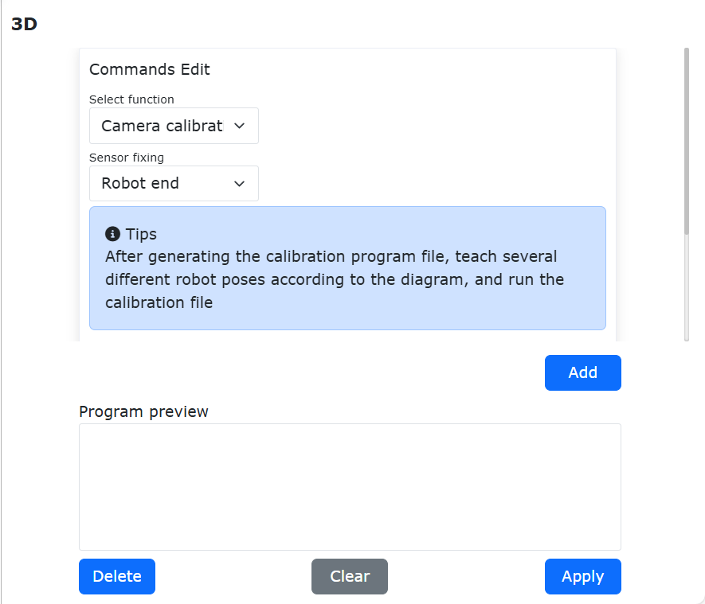

.. centered:: Figure 9.10-1 3D command interface

Palletizing command interface
~~~~~~~~~~~~~~~~~~~~~~~~~~~~~~~~

.. image:: coding/140.png
   :width: 6in
   :align: center

.. centered:: Figure 9.11 Palletizing command interface

Pallet command
++++++++++++++++

Click the "Pallet" icon to enter the Pallet command editing interface.

This instruction generates instructions for the palletizing program, which is consistent with the matrix movement function in Section 3.9.6. For details, refer to that chapter.

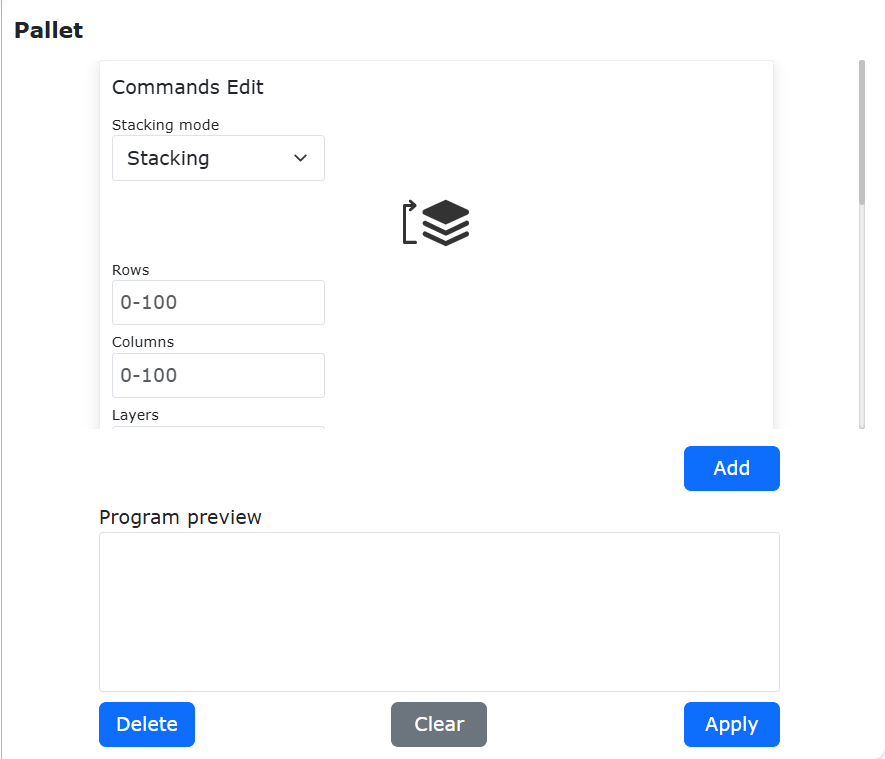

.. centered:: Figure 9.11-1 Pallet command interface 

This function controls the regular movement of the manipulator by setting the three-point coordinates and the values of the row and column layer and layer height, which is suitable for common palletizing applications. The first step is to select the robot movement mode, "PTP" or "Line", the second step is to set the robot movement path, "head-to-tail walking method" or "bow walking method", the third step is to set the stacking method, "stack stacking" or "unstacking".

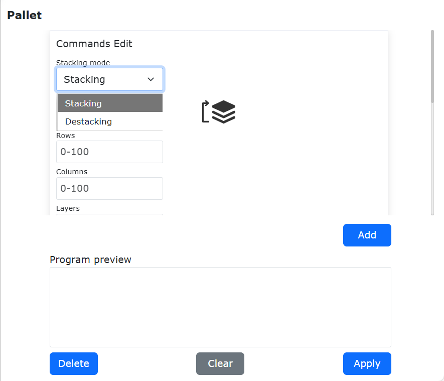

.. centered:: Figure 4.11-2 Matrix move

The fourth step is to teach three points according to the path. The first point is the starting point of the first row, and the arm posture is determined by this point during the whole movement process. The second point is the end point of the first row, and the third point is the end point of the last row. The fifth step is to set the number of rows and columns. The sixth step is to set the number of layers and the height of each layer. The last step is to name the matrix motion program file, and a matrix movement program is generated successfully.

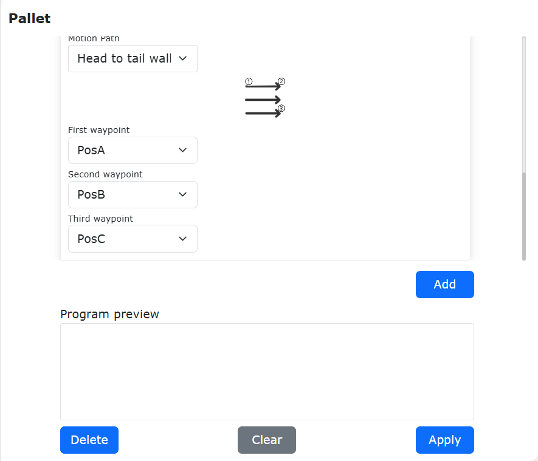

.. centered:: Figure 4.11-3 Matrix move

Communication command interface
~~~~~~~~~~~~~~~~~~~~~~~~~~~~~~~~~~~~

.. image:: coding/144.png
   :width: 6in
   :align: center

.. centered:: Figure 9.12 Communication command interface

Modbus command
++++++++++++++++

Click the "Mobus" icon to enter the Modbus command editing interface.

The command function is a bus function based on the ModbusTCP protocol. The user can control the robot to communicate with the ModbusTCP client or server (the master station communicates with the slave station) through relevant instructions, and perform read and write operations on coils, discrete quantities, and registers.

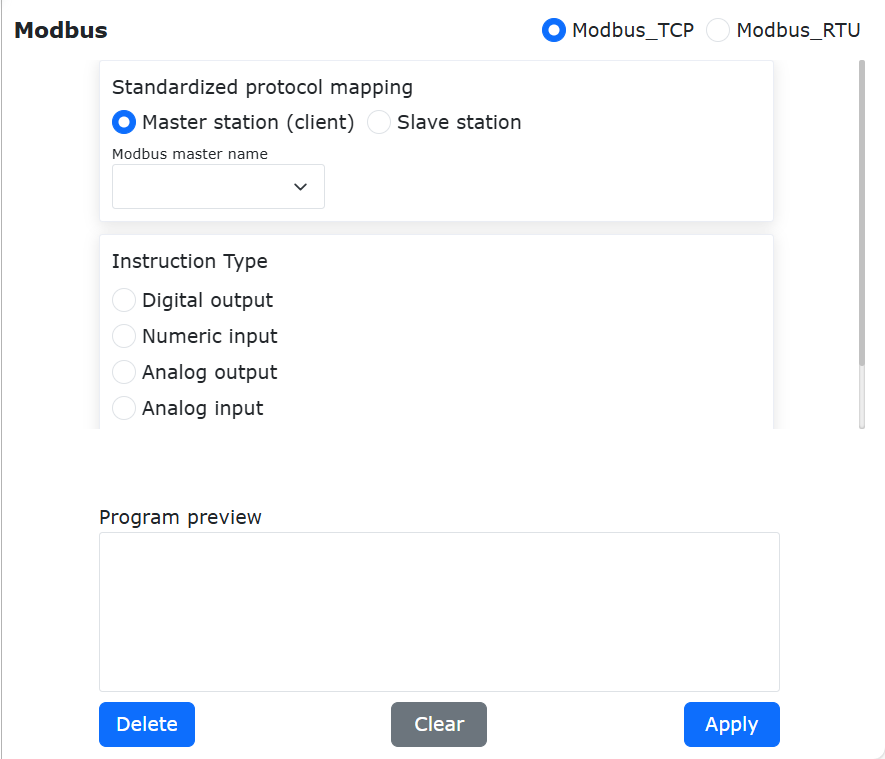

.. centered:: Figure 9.12-1 modbus command master interface

.. image:: coding/146.png
   :width: 6in
   :align: center

.. centered:: Figure 9.12-2 modbus command slave interface

For more operating functions of ModbusTCP, please contact us for consultation.

Xmlrpc command
++++++++++++++++

Click the "Xmlroc" icon to enter the Xmlrpc command editing interface.

XML-RPC is a remote procedure call method for transferring data between programs using xml over sockets. In this way, the robot controller can call the function (with parameters) in the remote program/service and obtain the returned structured data. The Robot Controller handles all the details of writing XML-RPC client messages and handling conversions between data types and XML.

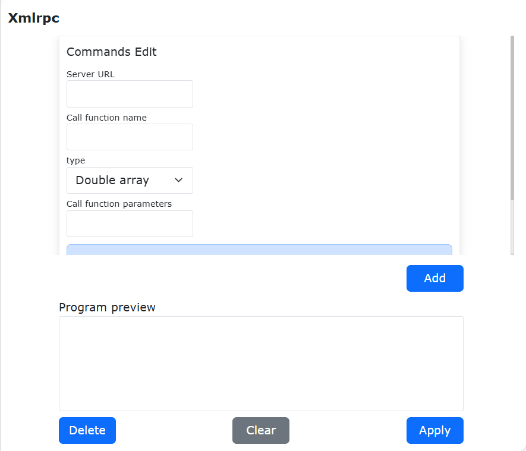

.. centered:: Figure 9.12-3 Xmlrpc command interface

.. important:: 
   1) The controller acts as a client to connect to the remote custom port;

   2) The controller acts as a client to call the remote function;

   3) Support calling different remote functions;

   4) Support string array parameter input and character array result return, the number of array elements can be customized;

   Support double-type array parameter input and double-type array result return, the number of array elements can be customized;

::

   XmlrpcClientCall(serverUrl,methodName,tableType,param)

   serverUrl server url, for example:"http://192.168.58.29:50000/RPC2"

   methodName Call function name, "example.add"

   tableType 1-double array, 2-string array

   param call function parameters

::

   XmlrpcClientCall(error, result)

   error 0 - no error, 1 - error

   result If the parameter is passed in as a double array, the result is a double array,

   If the parameter is passed in as an array of string type, the result will be an array of string type

Auxiliary command interface
~~~~~~~~~~~~~~~~~~~~~~~~~~~~~~~~

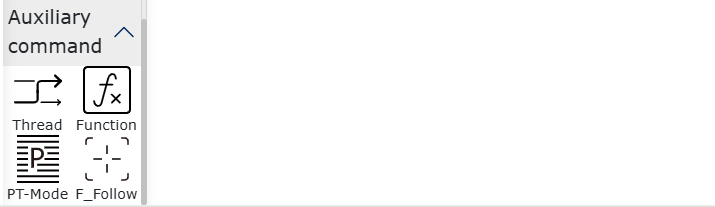

.. centered:: Figure 9.13 Auxiliary command interface

Thread command
++++++++++++++++

Click the "Thread" icon to enter the Thread command editing interface.

The Thread command is an auxiliary thread function. Users can define an auxiliary thread to run simultaneously with the main thread. The auxiliary thread mainly performs data interaction with external devices, supports socket communication, obtains robot DI status, robot DO status settings, and obtains robot status information. Thread data interaction, the data obtained by the main thread through the auxiliary thread is used to control the judgment of the robot's motion logic, the screenshot of the user program example:

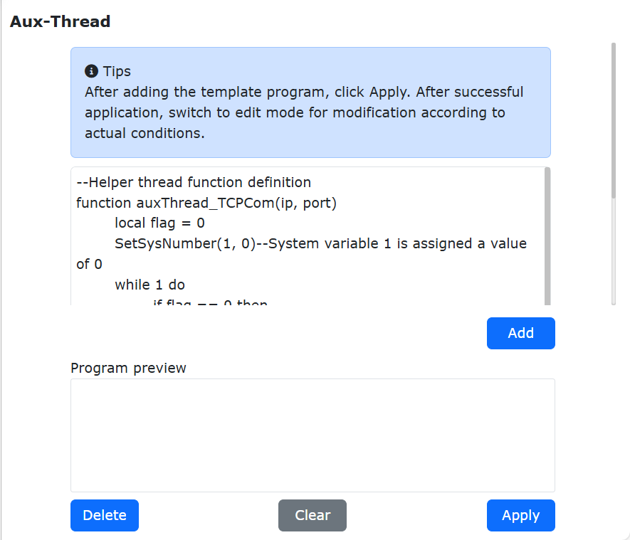

.. centered:: Figure 9.13-1 Thread program example

Function command
++++++++++++++++

Click the "Function" icon to enter the Function command editing interface.

This command is to call the function interface function, provide the robot interface function to the customer to choose, and remind the customer of the parameters required by the function, which is convenient for the customer to write script commands, and more functions are being added one after another.

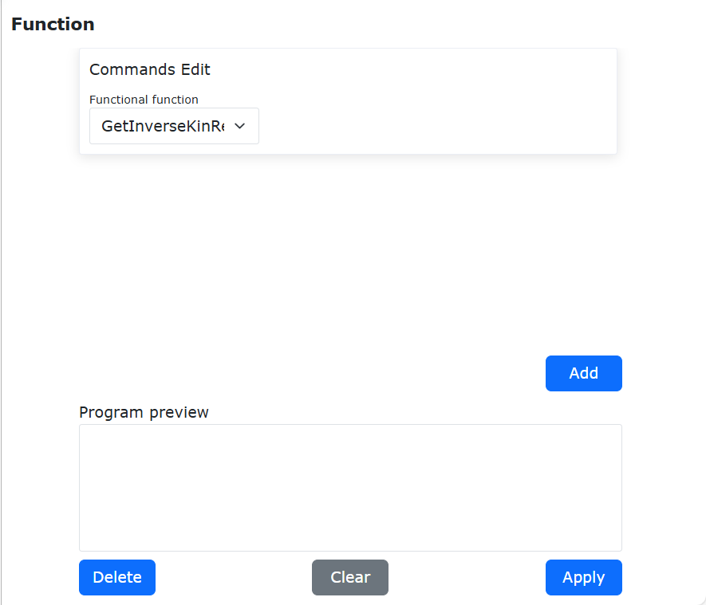

.. centered:: Figure 9.13-2 Function command interface

PT-Mode command
++++++++++++++++

Click the "PT-Mode" icon to enter the PT-Mode command editing interface.

This command is mainly used for mode switching between system mode and point table mode. Teaching points in different point tables can be applied by switching point tables.For details, see Chapter 11 - Points.

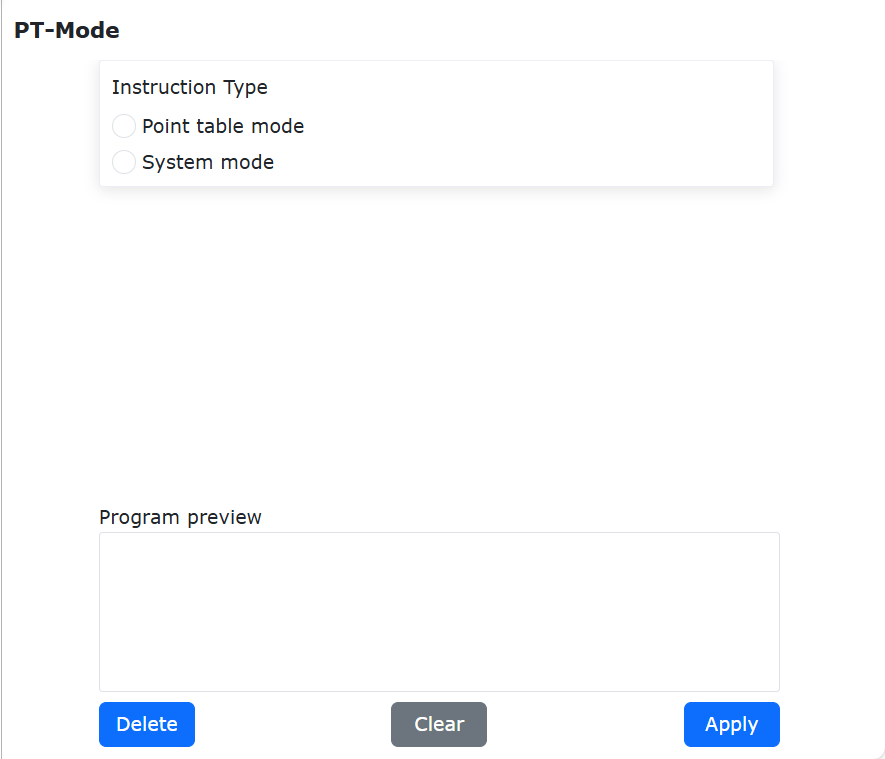

.. centered:: Figure 9.13-3 PT-Mode command interface

Teaching program is not saved for verification
~~~~~~~~~~~~~~~~~~~~~~~~~~~~~~~~~~~~~~~~~~~~~~~~

On the program teaching page, after opening/creating a new program, if the teaching program is modified, the program is not saved.

If you click "Open", "New", "Export", "Rename" and other related file operations, the "Do you want to save this program" pop-up box will be triggered, prompting "The current program has changed. Do you want to save the changes to this program?" ,As shown below.

.. image:: coding/152.png
   :width: 6in
   :align: center

.. centered:: Figure 9.14-1 The current page program does not save verification

**Step1**:Click the "Not Save" button, and the program will restore the unmodified data and continue to perform previous related file operations.

**Step2**:Click the "Save" button, the unsaved Lua program is saved successfully, and the previous related file operations continue to be performed.

If you leave the program teaching page and switch to other pages, the prompt "Do you want to save this program" will also be triggered, and you will still stay on the current teaching program page, as shown below.

.. image:: coding/153.png
   :width: 6in
   :align: center

.. centered:: Figure 9.14-2 Switch page program does not save verification

**Step1**:Click the "Not Save" button to jump to the previously selected page.

**Step2**:Click the "Save" button, and the unsaved Lua program is saved successfully and jumps to the previously selected page.

Teaching program encryption
~~~~~~~~~~~~~~~~~~~~~~~~~~~~~~~

The teaching procedure is divided into a state of encryption and non-encryption. The encryption level is divided into first-level encryption and secondary encryption. Among them, the level of first-level encryption is the highest, and the secondary is second.
All teaching programs are displayed and set in the form of program encryption information in "System Settings - Custom Information". Encryption level descriptions are provided to the right of the table.

.. image:: coding/154.png
   :width: 6in
   :align: center

.. centered:: Figure 9.15-1 Demonstration of teaching procedures

When the program is a first-level encryption state, after opening the program: the corresponding "export", "preservation", "existing as", "copy", "cut", "delete", "delete", "delete", "delete", "delete" The buttons such as "upward", "downward" and "editing mode switching" will be grayed.
Click the icon to be invalid and it will prompt that the current program is in an encrypted state. The program "renamed" icon will hide. Add instruction bars and program editing areas are invisible and prompts to be locked in first-level encryption.

.. image:: coding/155.png
   :width: 6in
   :align: center

.. centered:: Figure 9.15-2 Program first-level encryption interface

When the program is second-level encryption, after opening the program on the "Program Demonstration" page: the corresponding "savings", "copy", "shear", "paste", "delete", "upper", "upper" in the operating bar The buttons such as the "Move" will turn ashes.
Click the icon to be invalid and it will prompt that the current program is encrypted. The program "renamed" icon will hide. The adding instruction bar is not visible and prompts to be locked in a secondary encryption. The program editing area can browse the reading program normally.

.. image:: coding/156.png
   :width: 6in
   :align: center

.. centered:: Figure 9.15-3 Program second-level encryption interface

Both first -level encryption and second -level encryption can use the "export" function. Verification operations will be performed when importing.
If the program of the same name is an encrypted file, the import operation will be interrupted and indicated that the coverage of the encryption program cannot be introduced.

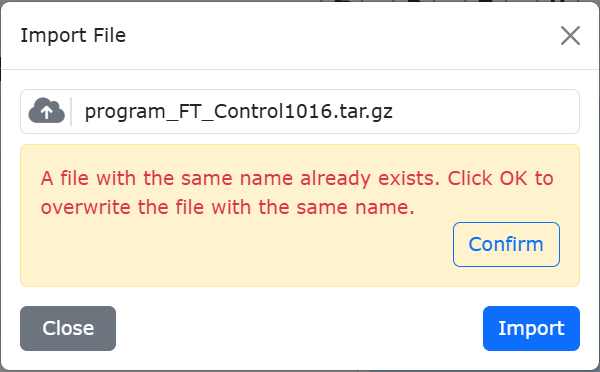

.. centered:: Figure 9.15-4 Program import

Local teaching point
~~~~~~~~~~~~~~~~~~~~~~~~

The local teaching point is bound to the current teaching program. When adding a program command, it can only be applied to the current teaching program and cannot be used in other teaching programs.

**Add**: Click the "Add Local Teaching Point" icon on the far right of the program file name to add local teaching points. (For detailed records of local teaching points, please refer to the teaching point records in robot operation)

.. image:: coding/158.png
   :width: 6in
   :align: center

.. centered:: Figure 9.16-1 Add local teaching points

**Delete**: Click the serial number column of the table to select the local teaching point to be deleted, and then click the "Delete" icon in the upper right corner of the title of the local teaching point to delete the local teaching point.

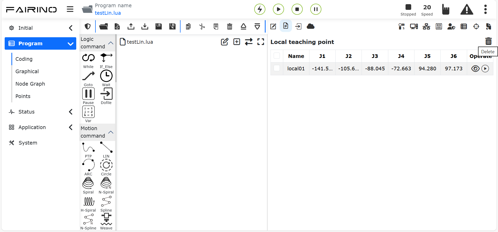

.. centered:: Figure 9.16-2 Delete local teaching point

**Run**: Click the "Start Running" icon in the data operation bar of the local teaching point table to perform a single-point operation of the local teaching point and move the robot to the position of this point.

.. image:: coding/160.png
   :width: 6in
   :align: center

.. centered:: Figure 9.16-3 Run local teaching point

**Details**: Click the "Details" icon in the data operation bar of the local teaching point table to view the details of the local teaching point.

.. image:: coding/161.png
   :width: 3in
   :align: center

.. centered:: Figure 9.16-4 Local teaching point details

Current program backup
~~~~~~~~~~~~~~~~~~~~~~~~~~

After the user modifies the teaching program and clicks save, the "backup" function of the current program is triggered (the backup time is 1 year), and the initial content of the current program is saved and displayed on the right side, which is convenient for the user to compare the modified content.
Users can view the corresponding program backup content by selecting a date, and click the "Delete" icon in the upper right corner to delete the current program backup content. The content of the current program backup can only be viewed, not modified.

.. image:: coding/162.png
   :width: 6in
   :align: center

.. centered:: Figure 9.17 Current program backup

Modbus TCP Communication
~~~~~~~~~~~~~~~~~~~~~~~~~~~~

ModbusTCP is a commonly used communication protocol in industrial production. Faao collaborative robots provide two ways to communicate with your device: ModbusTCP master and ModbusTCP slave.

The collaborative robot supports up to 8 ModbusTCP masters to communicate with external devices at the same time, and each master supports up to 128 registers; the collaborative robot ModbusTCP slave has 128 coils, 128 discrete inputs, 64 holding registers and 64 input registers (holding registers and input register data types include unsigned, signed and floating point types). At the same time, some ModbusTCP slave input register addresses of collaborative robots are dedicated to feedback information such as the current robot's joint position and movement speed, and some coil register addresses are dedicated to controlling the robot to start the program, stop the program, set the control box DO and other functions.

The robot ModbusTCP slave only supports establishing a connection with one master station. The robot can communicate with different devices as a master and a slave at the same time. The following is a detailed usage method.
 
ModbusTCP master
+++++++++++++++++

Before using the cooperative robot as the ModbusTCP master station to communicate with your equipment, please check the network connection between your equipment and the robot, and confirm that the network interfaces are in the same network segment.

There are several steps to use the robot ModbusTCP master station: 

- Add the master station;
- Add registers;
- Communication test;
- Writing user programs;
- Run user programs.

Add ModbusTCP master
***********************

Open the WebApp, click "Teaching" and "Program Teaching" in turn to create a new user program "testModbusMaster.lua".

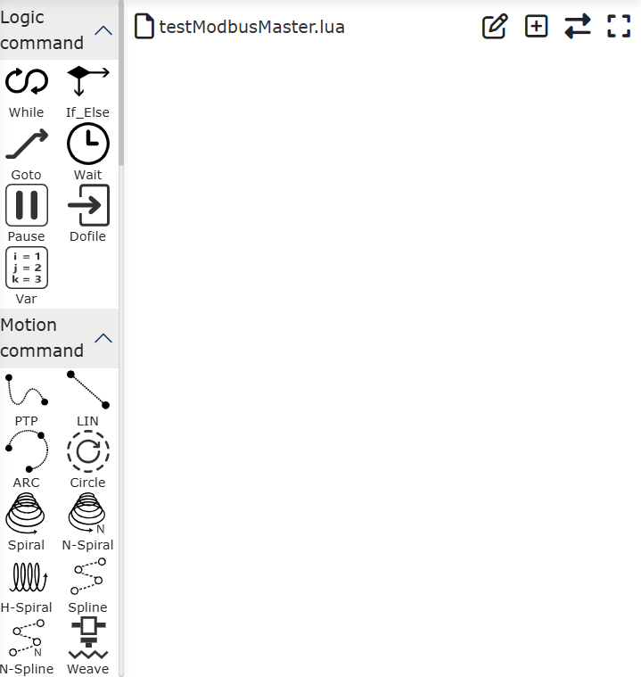

.. centered:: Figure 9.18-1 Create ModbusTCP master station user program

Click "ModbusTCP Settings" button to open the ModbusTCP function configuration page.

.. image:: coding/164.png
   :width: 6in
   :align: center

.. centered:: Figure 9.18-2 Open ModbusTCP Settings

Click "Master settings" and "Add Modbus master station" in turn to finish adding a ModbusTCP master station.

.. image:: coding/165.png
   :width: 6in
   :align: center

.. centered:: Figure 9.18-3 Add "ModbusTCP Master Station

According to your equipment, enter the name, slave ip, port number, slave number, communication cycle, and timeout in turn. The specific meanings of the above parameters are as follows:

**Name**:ModbusTCP master station name. Robots can create up to 8 master stations to connect with corresponding slave stations. Different master stations can be distinguished by unique names, such as PLC, camera, data acquisition card and FRRobot1;

**Slave IP**:the slave IP address to which the ModbusTCP master station of the robot is connected;

.. note:: The robot and slave equipment must be connected through the network cable first, and the IP addresses of the robot and slave equipment must be in the same network segment.

**Port number**:The port number of ModbusTCP slave station to be connected;

**Slave station number**:ModbusTCP slave station number to be connected;

**Communication period**: The period (ms) when the robot ModbusTCP master station inquires about the slave station status, which only affects the update speed of the slave station register data on the ModbusTCP Settings page, but does not affect the speed of reading or writing the ModbusTCP slave station register value in the lua program of the user.

**Timeout Period**: When using the ModbusTCP read/write interface for operations, if the system fails to establish a connection after exceeding the timeout period, it will report a Modbus not connected error. Unit: ms, valid range: 100-60000.

.. image:: coding/166.png
   :width: 6in
   :align: center

.. centered:: Figure 9.18-4 Setting ModbusTCP master station parameters

After the above parameters are correctly input, the ModbusTCP master station of the robot automatically establishes a connection with the configured slave station. After the connection is successful, the "Connection status" indicator on the page lights up.

.. note:: 
   If you have confirmed that the relevant parameters of ModbusTCP master station are correctly configured, but the robot is not successfully connected with your equipment, please check the following configurations:
   
   ①The physical network connection between the robot and the slave equipment;

   ②The IP addresses of the two network physical ports of the robot teaching device and the control box are different, please confirm whether they are connected to the correct network port;

   ③Please confirm whether the network port of the robot and the network port of the slave station equipment are in the same network segment. If the IP address of the robot is 192.168.58.2, the IP address of the slave station equipment must be 192.168.58.0~192.168.58.255, and it cannot be the same as the IP address of the robot; 
   
   ④Check whether the port number of the slave equipment is the same as the set port number. (If the connection status indicator is flashing, it means that the register address in the master station is wrong. Please check whether the register type and address are correct)

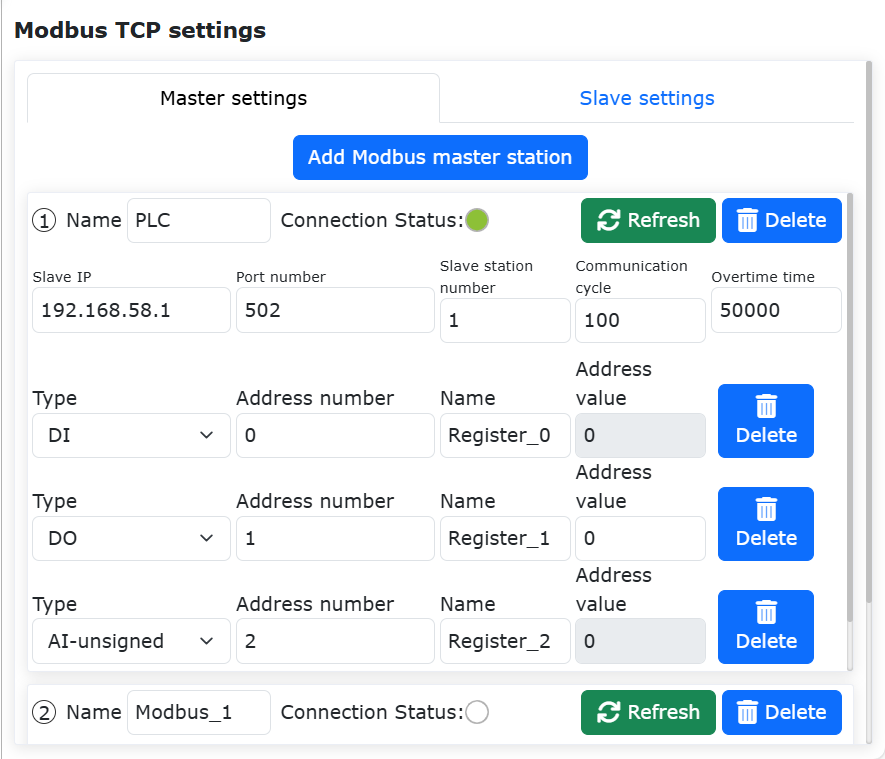

.. centered:: Figure 9.18-5 Connection status of Modbus TCP master station

At this point, we have completed the creation of a ModbusTCP master station for the robot. If you click "Add Modbus Master Station" again, you can create a new ModbusTCP master station (Figure 7). The robot can support up to 8 master stations to communicate with external devices at the same time. Double-click the "Delete" button in the upper right corner of the Modbus master station to delete the Modbus master station.

.. image:: coding/168.png
   :width: 6in
   :align: center

.. centered:: Figure 9.18-6 Add ModbusTCP master station again

ModbusTCP master add register
*******************************

Click the "Add master register" button to add a register for this master station.

.. image:: coding/169.png
   :width: 6in
   :align: center

.. centered:: Figure 9.18-7 Add ModbusTCP master station register

Select the modbus register type, input address number and name of the master station in turn, and the meanings of each parameter are as follows:

**Type**:Register type, DI:discrete input; DO:coil; AI-unsigned:unsigned input register (0-65535); AI-signed:signed input register (-32768-32767); AI-float:float type input register (the data length of float type register is 32 bits, occupying two signed or unsigned registers); AO-unsigned:unsigned holding register (0-65535); AI-signed:signed holding register (-32768-32767); AI-float:float type holding register (the data length of float type register is 32 bits, occupying two signed or unsigned registers), among which the floating-point type registers in AI and AO are big-end display.

**Address number**:The address of ModbusTCP slave register to be read or written;

**Name**: The alias of the register. The ModbusTCP master station of the robot can set up at most 128 different registers, and each register can be distinguished by different names according to the actual meaning, such as "Start", "Servo in Place" and "Liquid Level".

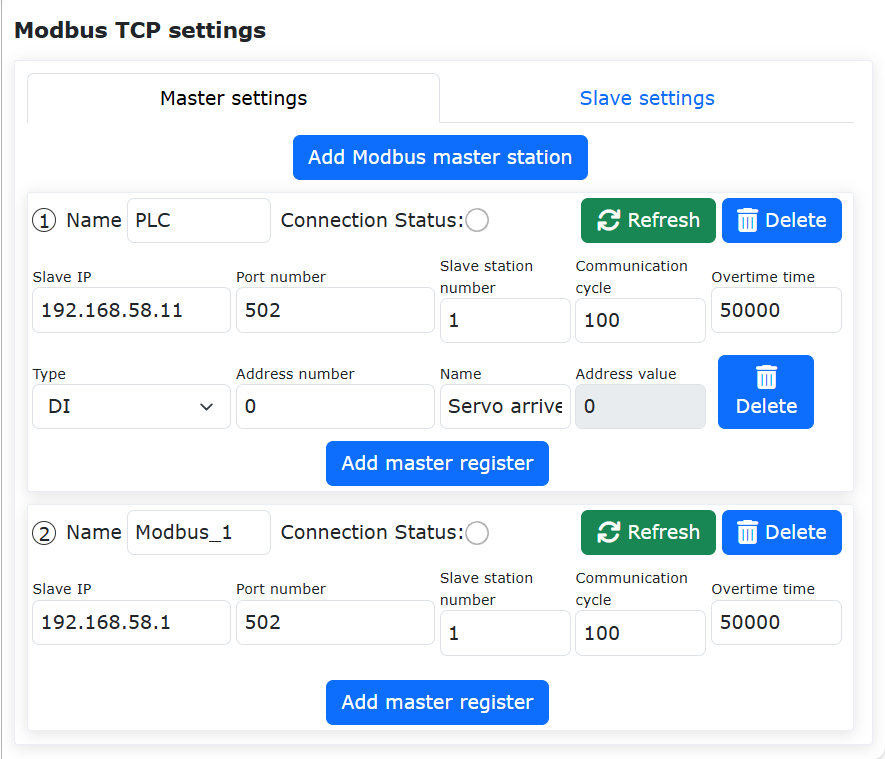

.. centered:: Figure 9.18-8 Setting ModbusTCP master station register parameters

Click the "Add Master Register" button again to add another master register, and double-click the "Delete" button on the right side of the register to delete it, a register is added for each type. 

.. note:: If the master station connection status indicator flashes after adding the master station register, it means that the master station register address cannot be read. Please check whether the register type and address are correct.

.. image:: coding/171.png
   :width: 6in
   :align: center

.. centered:: Figure 9.18-9 Adding Multiple Master Station Registers

ModbusTCP master communication test
************************************

Before the communication test, please check whether the "Cnnection status" indicator of ModbusTCP master station is always on. If the indicator is always on, it means that the current connection has been successful. 

The robot Modbus master station register has an "address value" value box for displaying the current register value, in which the registers of DI (discrete input) and AI (input register) are read-only and the corresponding address values are gray non-editable value boxes. 

When the value of the corresponding address of the slave station changes, the robot master station displays the current value synchronously corresponding to the register address value. DO (coil) and AO (holding register) are readable and writable registers, so their addresses are white editable value boxes, which can be used to read the values of the corresponding registers of ModbusTCP slave stations or modify the values of the registers on the Modbus master station setting page of the robot.

.. image:: coding/172.png
   :width: 6in
   :align: center

.. centered:: Figure 9.18-10 Modbus master station address value

1. Numerical monitoring of DI and AI type registers of master

On the external ModbusTCP slave device, set the address value of No.255 of DI (discrete input) register to 1, change the address value of No.257 of AI (input register) to No.123, change the address value of No.258 to -123, and change the address value of No.259 to 123.3. At this time, the address value of the corresponding register on the robot Modbus master station setting page will be displayed accordingly. 

.. note:: 
   Because the register with address 259 is a floating-point register, it actually occupies two 16-bit registers 259 and 260 to store a floating-point number, so you can't set a separate register to operate the No.260 register of AI, otherwise a numerical error will occur.

.. image:: coding/173.png
   :width: 6in
   :align: center

.. centered:: Figure 9.18-11 Modbus master station displays the values of DI and AI registers

2. Numerical writing of DO and AO type registers in the master
   
In the Modbus master station setting page of the robot, enter 1 in the No.255 address value input box of the DO (coil) type register named 'Start', and enter 65535,-32767 and 128.78 input boxes of the AO (holding register) named 'Target position A', 'Target position B' and 'Target position C' respectively.

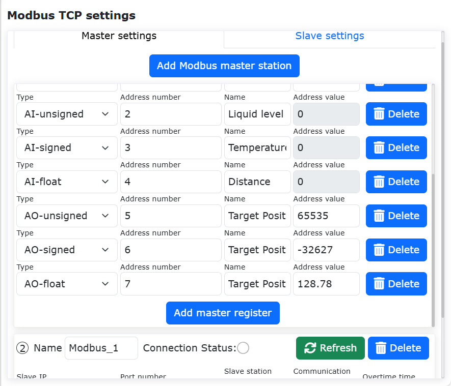

.. centered:: Figure 9.18-12 Modbus master station writes DO and AO registers

3. Numerical monitoring of DO and AO type registers of master
If you change the values of DO (coil) and AO (holding register) in ModbusTCP slave station, the register address value of ModbusTCP master station setting page will not be updated immediately. You need to click the "Refresh" button in the upper right corner of master station configuration, and then the register address values of DO and AO on the page will be updated.

.. image:: coding/175.png
   :width: 6in
   :align: center

.. centered:: Figure 9.18-13 Refresh the DO and AO address values of ModbusTCP master station.

Write ModbusTCP master program
+++++++++++++++++++++++++++++++++

Click "Program" and "Communication command" in turn to open the communication command adding page.

.. image:: coding/176.png
   :width: 6in
   :align: center

.. centered:: Figure 9.18-14  Open the communication command add page

Click "Modbus".

.. image:: coding/177.png
   :width: 6in
   :align: center

.. centered:: Figure 9.18-15 Select Modbus

Click "Modbus_TCP".

.. image:: coding/178.png
   :width: 6in
   :align: center

.. centered:: Figure 9.18-16 Select Modbus_TCP
   
Select "Master station (client)" to open the ModbusTCP master station command addition page.

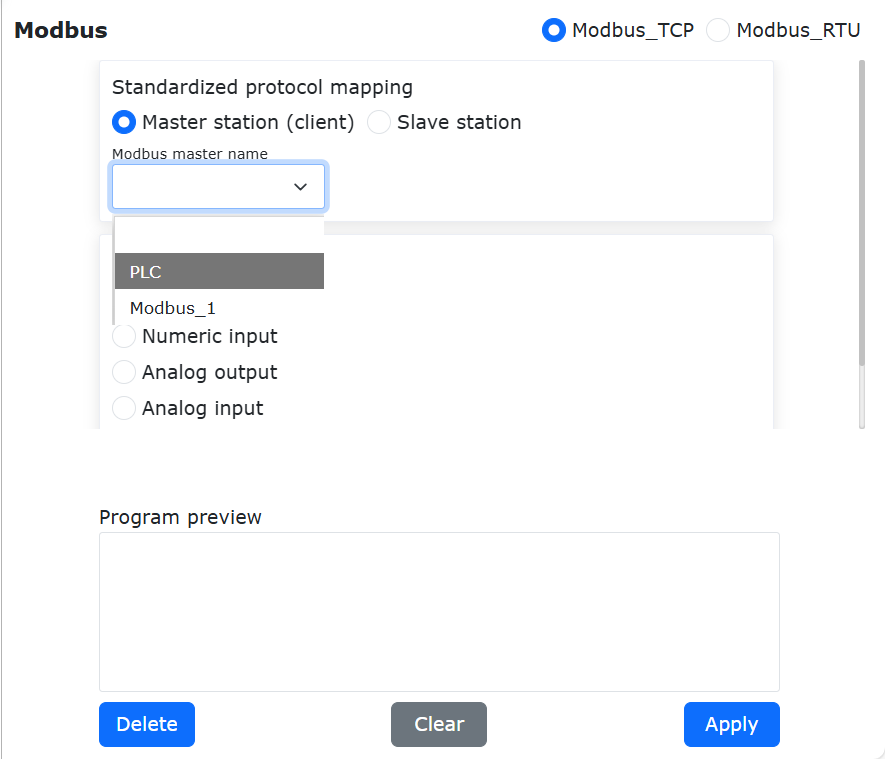

.. centered:: Figure 9.18-17 Selecting Master Station (Client)

1. Write a single digital output DO (coil)

Select "Modbus master name" as the master station ‘PLC’ added on the Modbus master station setting page before, with DO name as ‘Start’, register number as 1 and register value as 1, and click the "Write digital output" button. Finally, scroll to the bottom of the page and click the "Apply" button (Figure 21).

.. centered:: Figure 9.18-18 Adding Write Single Digital Output

At this time, the robot program "testModbusMaster.lua" has added an command for the Modbus master station of the robot to write a single digital output. Switch the robot to the automatic mode, click the start button, and the robot will write the address value of the coil register ‘Start’ corresponding to the master station "PLC" as 1.

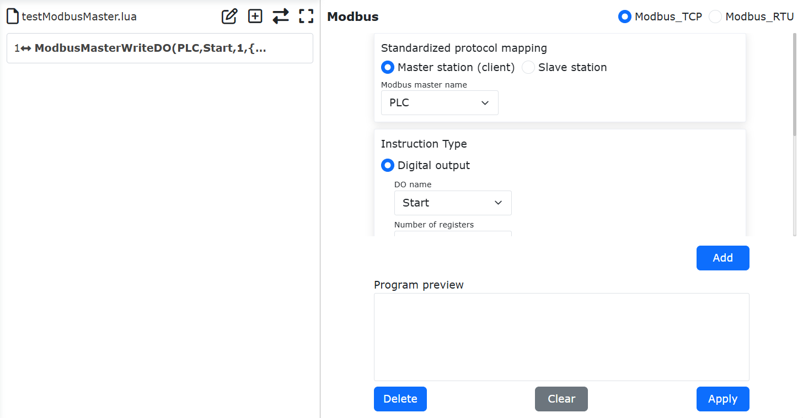

.. centered:: Figure 9.18-19 Writing a single coil lua program

2. Write multiple digital outputs DO (coils)

Open the ModbusTCP master station command adding page, select Modbus master name as the master station ‘PLC’ added in the Modbus master station setting page before, the name of DO is ‘Start’, the number of registers is 5, and the register values are 1,0,1,0,1. the number of register values should correspond to the set number of registers, and multiple register values should be separated by English commas, and click the ‘Write digital output’ button. Finally, scroll to the bottom of the page and click the "Apply" button.

.. centered:: Figure 9.18-20 Configures writing multiple digital outputs

At this time, the robot program "testModbusMaster.lua" has added an command that the robot Modbus master station writes multiple digital outputs, so as to switch the robot to the automatic mode, click the start button, and the robot will write the values of the coil register ‘Start’ corresponding to the master station ‘PLC’ and the following four coils as 1, 0, 1, 0 and 1 respectively.
   
.. image:: coding/183.png
   :width: 6in
   :align: center

.. centered:: Figure 9.18-21 Programming multiple coils lua

3. Read a single digital output DO (coil)
   
Open the ModbusTCP master station command addition page, select "Modbus master name" as the master station "PLC" added in the Modbus master station setting page before, the DO name is "Start", the number of registers is 1, and the register value does not need to be filled in, and click "Read digital output". Finally, scroll to the bottom of the page and click the "Apply" button.
   
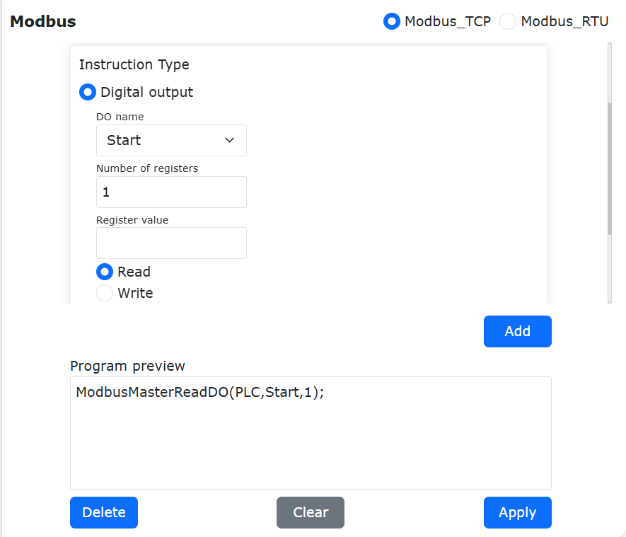

.. centered:: Figure 9.18-22 Configuring Reading a Single Digital Output

At this time, the robot program "testModbusMaster.lua" has added an command for the robot Modbus master station to read a single digital output.
      
.. image:: coding/185.png
   :width: 6in
   :align: center

.. centered:: Figure 9.18-23 Program for reading a single coil

Usually, after reading the Modbus register, the read value is stored in a variable, so it is necessary to define a variable to store the read value. As shown in figure 29, click the "switch mode" Button to switch the robot lua program to an editable state, and write the variable "startValue" with added return value before the "ModbusMasterReadDO" command, and the value read after executing the program will be stored in "startValue".
      
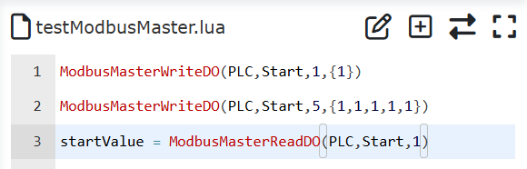

.. centered:: Figure 9.18-24 Reading a single digital output into a variable

The register value of coil type is only 0 and 1, so different operations can be carried out by judging the different register values in robot programs. As shown in Figure 30, click the "Switch Mode" button to switch the robot teaching program to the non-editable mode, and add two joint motion commands to move to two different points "P1" and "P2" respectively.
      
.. image:: coding/187.png
   :width: 6in
   :align: center

.. centered:: Figure 9.18-25 Add motion commands of different points

The program is switched to the editable mode again, and the judgment condition of the coil value "startValue" is written. When the value of "startValue" is 1, the robot moves to the point "P1", otherwise the robot moves to the point "P2".
      
.. image:: coding/188.png
   :width: 6in
   :align: center

.. centered:: Figure 9.18-26 Move to different points according to different coil values

Finally, switch the robot program to non-editable mode, switch the robot to automatic mode, and start the running program on the premise of confirming safety. The first two lines of the program set the DO value of the coil named "Start" to 1, so the robot will move to the "P1" point after executing the program.
      
.. image:: coding/189.png
   :width: 6in
   :align: center

.. centered:: Figure 9.18-27 Read the register value of a single coil and move it

4. Read multiple digital DO (coils)

Open the ModbusTCP master station command adding page, select "Modbus master name" as the master station "PLC" added in the Modbus master station setting page, the name of DO is "Start", the number of registers is 6, and the register value does not need to be filled in, and click "Read digital output". Finally, scroll to the bottom of the page and click the "Apply" button (Figure 34).
      

.. centered:: Figure 9.18-28 Configuring Reading Multiple Digital Outputs 

At this time, the robot program "testModbusMaster.lua" has added an command that the robot Modbus master station reads multiple digital outputs.
         
.. image:: coding/191.png
   :width: 6in
   :align: center

.. centered:: Figure 9.18-29 Reading multiple digital output programs

Click the "switch mode" button "" to switch the robot lua program to the editable state. Since the number of readings is six, it is necessary to write and add six return value variables "value1,value2,Value3,Value4, Value5,value6" before the "ModbusMasterReadDO" command, and the six register values read after the program execution will have the above six variables respectively.
         
.. image:: coding/192.png
   :width: 6in
   :align: center

.. centered:: Figure 9.18-30 Reading Multiple Digital Outputs and Storing Variables

5. Read DIgital input DI (discrete input)

Open the ModbusTCP master station command addition page, select "Modbus master name" as the master station "PLC" previously added in the Modbus master station setting page, the DI name is "Servo arrive", the number of registers is 2, and click "Read digital input". Finally, scroll to the bottom of the page and click the "Apply" button (Figure 38).
         
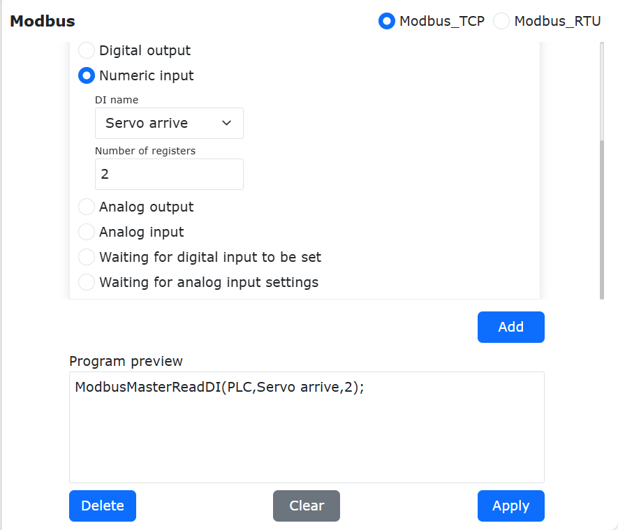

.. centered:: Figure 9.18-31 Configuring Read Digital Input

At this time, the robot program "testModbusMaster.lua" has added an command for the Modbus master station to read digital input.
            
.. image:: coding/194.png
   :width: 6in
   :align: center

.. centered:: Figure 9.18-32 Reading digital input program commands

Click the "Switch Mode" button "" to switch the robot lua program to an editable state, and write the return value variables "state1,state2" before the "ModbusMasterReadDO" command. The two digital input values read after executing the program will be stored in the variables "state1" and "state2" respectively, and you can control the robot to do different operations by judging the variable values.
            
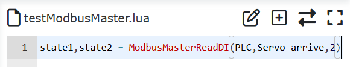

.. centered:: Figure 9.18-33 Reading digital input and storing variables

6. Read and write analog input AI (input register) and analog output AO (holding register)
The reading and writing operations of analog input AI (input register) and analog output AO (holding register) are basically the same as those of digital input DI (discrete input) and digital output DO (coil), but the difference is that the data range of the latter is only 0 or 1, while the data range of the former is larger, so the specific operations can refer to the programming of digital input and digital output, and only the reading input AI (Figure 41) and writing analog output AO are shown here.
            
.. image:: coding/196.png
   :width: 6in
   :align: center

.. centered:: Figure 9.18-34 Reading analog input AI
            
.. image:: coding/197.png
   :width: 6in
   :align: center

.. centered:: Figure 9.18-35 Read and write analog output AO

7. Waiting for digital input

Open the ModbusTCP master station command addition page, find the "Wait for digital input to be set", that is, wait for DI discrete input setting, select the "servo in place" register with DI name as the configuration, the waiting status is "True" and the timeout time is 5000 ms. Click "Add" button, and finally click "Apply" button.
            
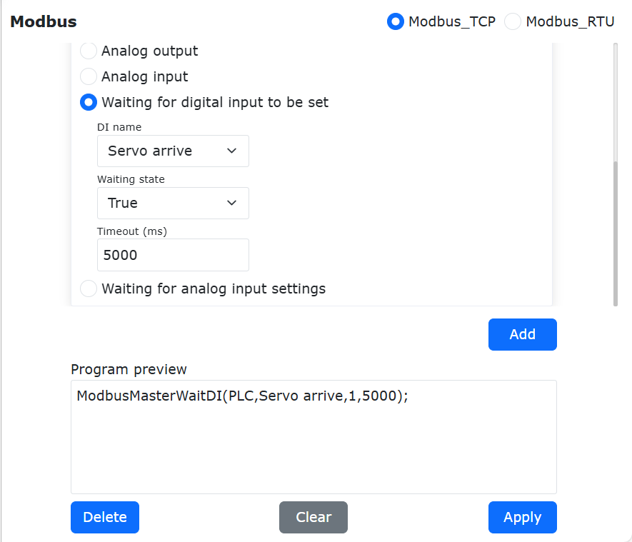

.. centered:: Figure 9.18-36 Add the command of waiting for DI input

At this time, the robot program "testModbusMaster.lua" has added an command that the robot Modbus master station waits for DIgital input DI. After starting the program, the robot will wait for the value of the "Servo arrive" register of the "PLC" master station to become true, that is, the value 1. Since the set timeout is 5s, when the "Servo arrive" signal is still 0 after the robot waits 5s, the robot program will report a timeout error and the program will stop.
            
.. image:: coding/199.png
   :width: 6in
   :align: center

.. centered:: Figure 9.18-37 Waiting for Digital Input DI Program

8. Waiting for analog Input

Open the ModbusTCP master station command addition page, find "Waiting for analog input setting", that is, waiting for the setting of AI input register, select the configured "liquid level" register with AI name, waiting status of ">", register value of 255 and timeout time of 5000 ms.. Click "Add" button, and finally click "Apply" button.
            
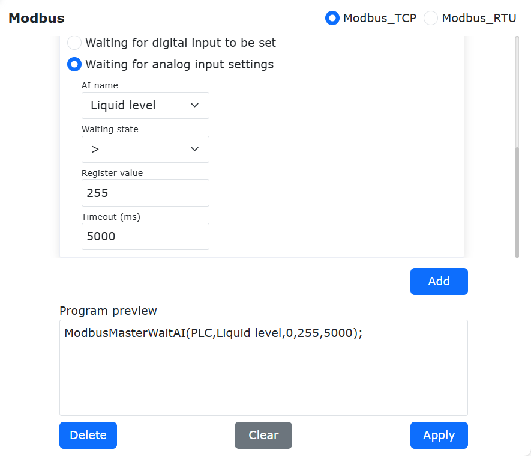

.. centered:: Figure 9.18-38 Add Waiting for Analog Input

At this time, the robot program "testModbusMaster.lua" has added an command that the robot Modbus master station waits for the AI input register value. After starting the program, the robot will wait for the "Liquid level" register value of the "PLC" master station to be greater than 255. Since the set timeout is 5s, when the "Liquid level" signal is still less than 255 after the robot waits for 5s, the robot program will report a timeout error and the program will automatically stop running.
            
.. image:: coding/201.png
   :width: 6in
   :align: center

.. centered:: Figure 9.18-39 Waiting for AI Input Register Program

Open the ModbusTCP Master command addition page, find the "Wait for Analog Input Setting" (i.e., wait for AI input register setting). Select the AI name as the configured "Liquid Level" register, set the wait condition to "=", the register value to 255, and the timeout to 5000ms. Click the "Add" button, and finally click the "Apply" button.

.. image:: coding/494.png
   :width: 6in
   :align: center

.. centered:: Figure 9.18-39-2 Add Wait for Analog Input

At this point, a Modbus Master command to wait for the AI input register value has been added to the robot program "test.lua". After starting the program, the robot will continuously wait for the "Liquid Level" register value from the "PLC" master to equal 255. Since the timeout is set to 5s, if the "Liquid Level" signal still does not equal 255 after the robot waits for 5 seconds, the robot program will report a timeout error and automatically stop running.

ModbusTCP slave
++++++++++++++++++

Robot ModbusTCP slave station provides four types of registers: Digital input (coil), Digital output (discrete input), Analog input (holding register) and Analog output (input register). The digital input and analog input are mainly used for the robot to read the data of the external ModbusTCP master station to control the robot operation, while the digital output and analog output are mainly used for the robot to send data signals to the external ModbusTCP master station equipment, and the external master station equipment reads the relevant register values to control the equipment operation. In addition to the above-mentioned general input and output, the robot also provides some "Functional digital input (coils)" for the external master station equipment to control the robot's start-up program and stop-up program, and provides some input registers to display the current robot's state information, including the robot's current Cartesian position, the robot's current running state, etc. (please refer to Annex 1: ModbusTCP slave address mapping table). The use process of robot ModbusTCP slave station mainly includes: ①parameter configuration; ②Communication test; ③Programming.

ModbusTCP slave communication parameter configuration
******************************************************

Open the WebApp, click "Teaching" and "Program Teaching" in turn to create a new user program "testModbusSlave.lua".
            
.. image:: coding/202.png
   :width: 6in
   :align: center

.. centered:: Figure 9.18-40 Create ModbusTCP slave station user program

Click "ModbusTCP Settings" button to open the ModbusTCP function configuration page.
            
.. image:: coding/203.png
   :width: 6in
   :align: center

.. centered:: Figure 9.18-41 Open ModbusTCP Settings

Click "Slave Settings" in turn, and enter the IP, Port number and Slave station number of the robot slave station, where "IP" is the IP address of the robot slave station, FAIRINO cooperative robot has two network ports, the teaching device and the control box and the IP addresses of the two ports are different. Enter the correct IP address according to the network port where the external device is connected to the robot slave station (it is recommended that you use the network port on the control box).You have to restart robot after change the IP address, port number or slave station number of the robot ModbusTCP slave station,otherwise it won't take effect.
            
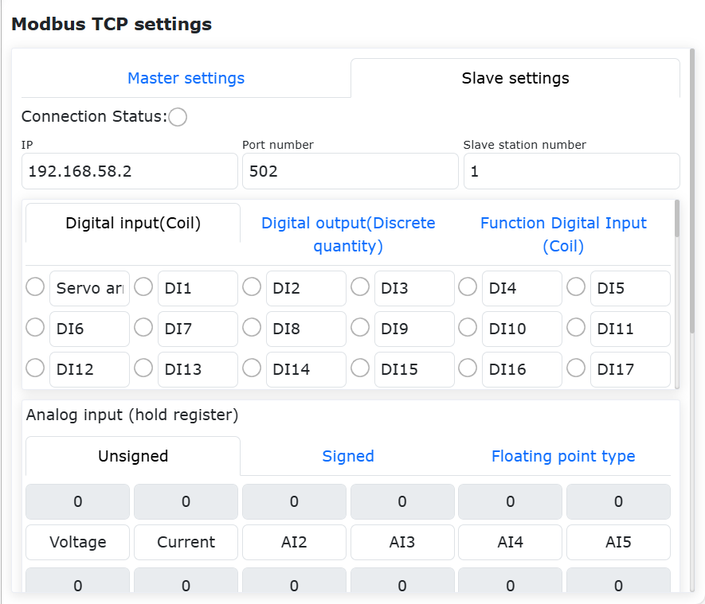

.. centered:: Figure 9.18-42 ModbusTCP slave settings

After the parameters of ModbusTCP slave station are set and the robot is restarted, the external master station equipment can establish a connection with the robot slave station through the set parameters. After the connection is successful, the "Connection status" indicator light on the robot slave station setting page will light up.
            
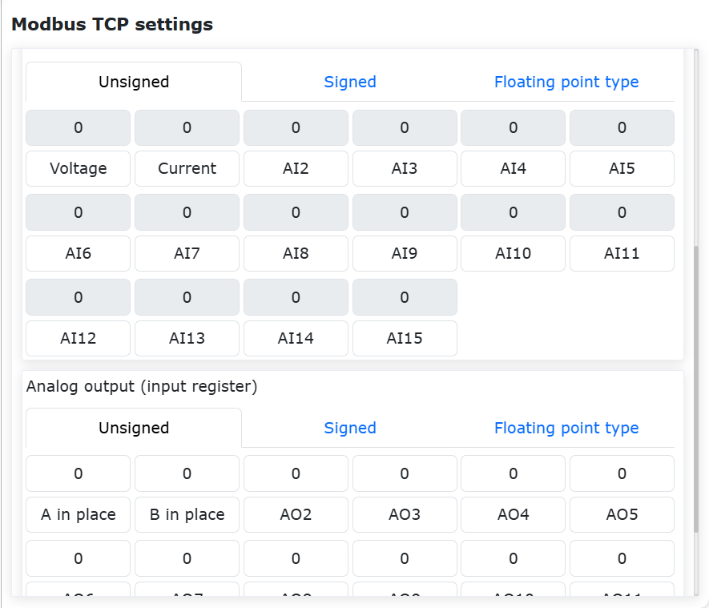

.. centered:: Figure 9.18-43 slave station connection status indicator light

ModbusTCP slave communication test
************************************

1. Digital input (coil)

The robot ModbusTCP slave station provides 128 coil registers, and their register addresses are 100~127.

.. note:: Please refer to Annex I: ModbusTCP slave station address mapping table.

Aliases can be set for the general registers of robot ModbusTCP slave stations as shown in Figure 52. Modify the name of the robot slave station coil register DI0 to be "A in place" and the name of DI1 to be "B in place". According to the address mapping table, the Modbus coil addresses of "A in place" and "B in place" are 100 and 101, respectively. Set the robot slave station coil register addresses 100 and 101 to 1 on the external ModbusTCP master station equipment, At this time, two register indicators on the monitoring page of the robot ModbusTCP slave station light up .
            
.. image:: coding/206.png
   :width: 6in
   :align: center

.. centered:: Figure 9.18-44 ModbusTCP slave station coil state monitoring

2. Digital output (discrete input)

The robot ModbusTCP slave station provides 128 discrete input registers, and their register addresses are 100~127.

.. note:: Please refer to Annex 1: ModbusTCP slave station address mapping table for specific definitions.

Similarly, the robot ModbusTCP slave's discrete input register can also be set with aliases, as shown in Figure 53. Click "Digital Output (Discrete Input)" to modify the name of the robot slave's discrete input register DO0 as "A Start" and DO1 as "B Start". According to the address mapping table, the Modbus discrete input addresses of "A Start" and "B Start" are 100 and 101 respectively. Click "A Start" to correspond to the discrete input indicator light, which lights up, and the value of the corresponding register address 100 becomes 1, which can be read from the external ModbusTCP master station equipment.

.. image:: coding/207.png
   :width: 6in
   :align: center

.. centered:: Figure 9.18-45 ModbusTCP slave discrete input control

3. Analog input (holding register)

The robot provides 64 holding registers of unsigned, signed and float types, with the addresses of AI0~AI63 ranging from 100 to 195.

.. note:: text
   Please refer to Annex 1: ModbusTCP slave address mapping table for specific definitions, in which the data range of unsigned register is 0~65535, the data range of signed register is -32768~32767, and the float register is displayed at the big end.
   
   As shown in Figure 53, the names of AI0 and AI1 are changed to "voltage" and "current" respectively, and the addresses of the two registers are found to be 100 and 101 respectively from the ModbusTCP slave address mapping table. Therefore, when the connected master station equipment modifies the register address values of the holding registers 100 and 101, the register address values of "voltage" and "current" on the ModbusTCP slave station monitoring page of the robot are updated and displayed synchronously, and the robot's analog input is mainly used for reading the external master station equipment values.

.. image:: coding/208.png
   :width: 6in
   :align: center

.. centered:: Figure 9.18-46 ModbusTCP slave analog input monitoring

4. Analog output (input register)

The robot provides 64 input registers of unsigned, signed and floating-point types, with the addresses of AO0~AO63 ranging from 100 to 195.
   
.. note:: text
   please refer to Annex 1: ModbusTCP slave address mapping table, in which the data range of unsigned register is 0~65535, the data range of signed register is -32768~32767, and the floating-point register is displayed at the big end.
   
   As shown in figure 55, the names of AO0 and AO1 are changed to "position A" and "position B" respectively, and the values of the input registers are 2000 and 1500 respectively. The addresses of the two registers are 100 and 101 respectively from the station address mapping table of ModbusTCP. Therefore, when the connected master station equipment reads the address values of the input registers 100 and 101, the set values can be obtained, and the simulated output of the robot slave station is mainly used for the robot to transfer to the external master station equipment.

.. image:: coding/209.png
   :width: 6in
   :align: center

.. centered:: Figure 9.18-47 Modbus slave station modifies analog input

ModbusTCP slave programming
****************************

Click "All" and "Communication command" in turn to open the communication command adding page.

.. image:: coding/210.png
   :width: 6in
   :align: center

.. centered:: Figure 9.18-48 Open the communication command add page

Click "Modbus".

.. image:: coding/211.png
   :width: 6in
   :align: center

.. centered:: Figure 9.18-49 Select Modbus

Click "Modbus_TCP".

.. image:: coding/178.png
   :width: 6in
   :align: center

.. centered:: Figure 9.18-50 Select Modbus_TCP

Select "slave station" to open the ModbusTCP slave station command adding page (figure 60).

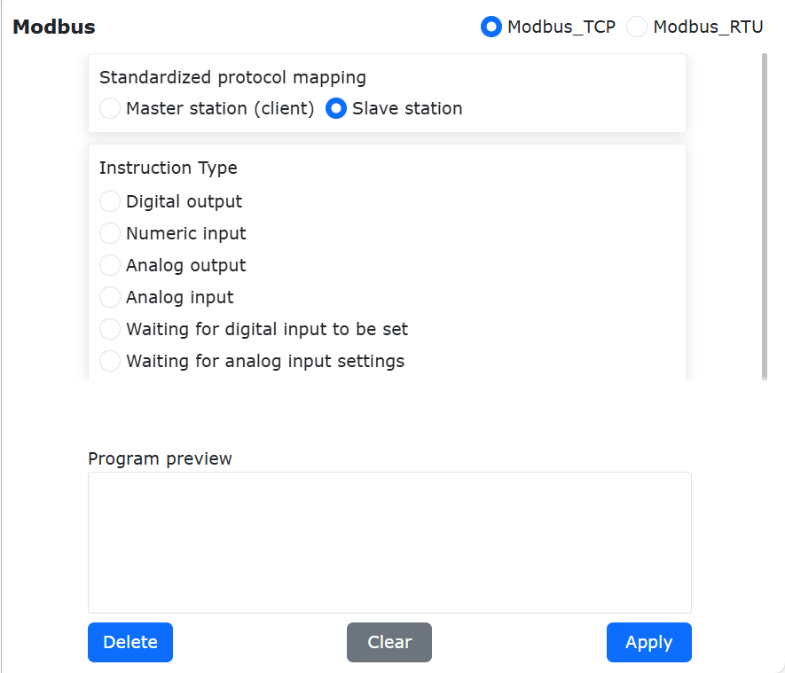

.. centered:: Figure 9.18-51 slave command addition

1. Write a single digital output DO (discrete input)

Select the DO name as "A Start", the number of registers is 1 and the register value is 0, and click "Write Single Digital Output". Finally, scroll to the bottom of the page and click the "Apply" button (Figure 62).

.. image:: coding/213.png
   :width: 6in
   :align: center

.. centered:: Figure 9.18-52 Adding Write Single Digital Output command 

At this time, the robot program "testModbusSlave.lua" has added an command for the robot Modbus slave station to write a single digital output, switch the robot to the automatic mode, click the start button, and the robot will write the address value of the corresponding digital output named "A Start" as 0.
   
.. image:: coding/214.png
   :width: 6in
   :align: center

.. centered:: Figure 9.18-53 Write a single digital output LUA program

2. Write multiple digital outputs DO (discrete input)

Open the ModbusTCP slave command addition page, find the "Digital Output Settings", select the DO name as "A Start", the number of registers is 5, and the register values are 1,0,1,0,1, where the number of register values corresponds to the set number of registers, and multiple register values are separated by English commas, and click "Write Digital Output". Finally, scroll to the bottom of the page and click the "Apply" button (Figure 65).
   

.. centered:: Figure 9.18-54 Configures Writing Multiple Digital Outputs 

At this time, the robot program "testModbusSlave.lua" has added an command for the robot Modbus slave station to write multiple digital outputs. Switch the robot to the automatic mode, click the start button, and the robot will start the slave station "A" and write the values of its four discrete input registers as 1, 0, 1, 0 and 1 respectively.
      
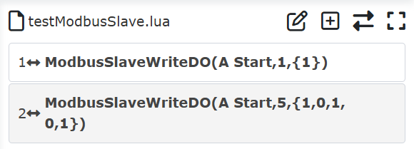

.. centered:: Figure 9.18-55 Write multiple digital output LUA programs

3. Read a single digital output DO (discrete input)

Open the ModbusTCP master station command addition page, find "Digital Output Settings", the name of DO is "A Start", the number of registers is 1, and the register value does not need to be filled in. Click "Read Digital Output". Finally, scroll to the bottom of the page and click the "Apply" button (Figure 68).
      
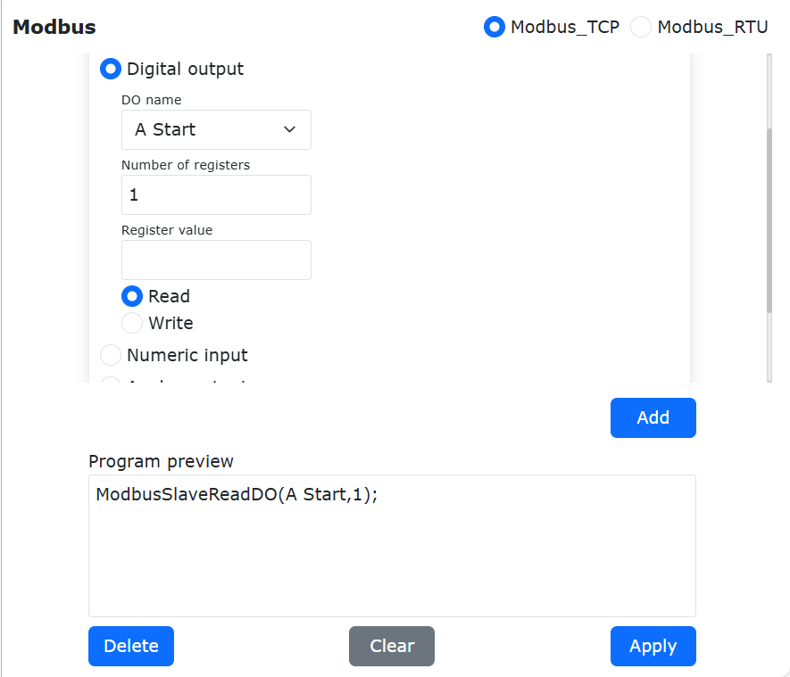

.. centered:: Figure 9.18-56 Configuring Reading a Single Digital Output 

At this time, the robot program "testModbusSlave.lua" has added an command for the robot Modbus to read a single digital output from the station.
         
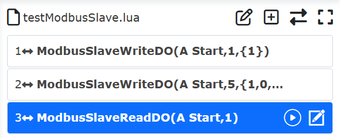

.. centered:: Figure 9.18-57 Read a single digital output program

Usually, after reading the Modbus register, the read value is stored in a variable, so it is necessary to define a variable to store the read value. As shown in figure 70, click the "switch mode" button "" to switch the robot lua program to the editable state, and write the variable "AStartValue" with added return value before the "ModbusSlaveReadDO" command, and the value read after executing the program will be stored in "AStartValue".
         
.. image:: coding/219.png
   :width: 6in
   :align: center

.. centered:: Figure 9.18-58 Reading a single digital output into a variable

The register value of coil type is only 0 and 1, so different operations can be carried out by judging the different register values in robot programs. As shown in Figure 71, click the "Switch Mode" button "" to switch the robot teaching program to the non-editable mode, and add two joint motion commands to move to two different points "P1" and "P2" respectively.
         
.. image:: coding/220.png
   :width: 6in
   :align: center

.. centered:: Figure 9.18-59 Add motion commands of different points.

As shown in Figure 72, the program is switched to the editable mode again, and the judgment condition of the digital output value "AStartValue" is written. When the value of "AStartValue" is 1, the robot moves to the point "P1", otherwise the robot moves to the point "P2".
         
.. image:: coding/221.png
   :width: 6in
   :align: center

.. centered:: Figure 9.18-60 Move to different points according to different digital output values

Finally, switch the robot program to non-editable mode, switch the robot to automatic mode, and start the running program on the premise of confirming safety. As shown in figure 73, the second line of the program sets the DO value of the digital output named "A Start" to 1, so the robot will move to the "P1" point after executing the program.
         
.. image:: coding/222.png
   :width: 6in
   :align: center

.. centered:: Figure 9.18-61 Read the register value of a single coil and move it

4. Read multiple digital outputs DO (discrete input)

As shown in Figure 74, open the ModbusTCP master station command addition page, find the "Digital Output Settings", select the DO name as "A Start", the number of registers is 2, and the register value does not need to be filled in, and click "Read Digital Output". Finally, scroll to the bottom of the page and click the "Apply" button (Figure 75).
         
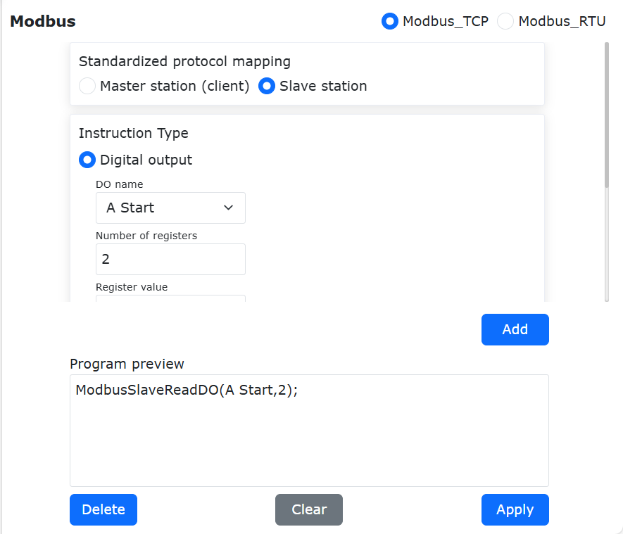

.. centered:: Figure 9.18-62 Configures Reading Multiple Digital Outputs

As shown in Figure 76, at this time, the robot program "testModbusSlave.lua" has added an command for the robot Modbus to read multiple digital outputs from the station.
            
.. image:: coding/224.png
   :width: 6in
   :align: center

.. centered:: Figure 9.18-63 Reading multiple digital output programs

As shown in figure 77, click the "switch mode" button "" to switch the robot lua program to the editable state. Since the number of readings is two, it is necessary to write and add two return values "value1,value2" before the "ModbusSlaveReadDO" command, and the values of the two digital output registers read after executing the program will be stored in the above two variables respectively. Similarly, you can judge "value1" and "value2".
            
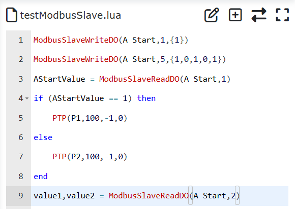

.. centered:: Figure 9.18-64 Reading Multiple Digital Outputs and Storing Variables

5. Read DIgital input DI (coil)

As shown in Figure 78, open the ModbusTCP slave command addition page, find the "Digital Input Settings", select the DI name as "A in place" and the number of registers as 2, and click "Read Digital Input". Finally, scroll to the bottom of the page and click the "Apply" button (Figure 79).
            

.. centered:: Figure 9.18-65 Configuring Read Digital Input

As shown in Figure 80, at this time, the robot program "testModbusSlave.lua" has added an command for the robot Modbus to read digital input from the station.
               
.. image:: coding/227.png
   :width: 6in
   :align: center

.. centered:: Figure 9.18-66 Reading digital input program commands

As shown in Figure 81, click the "switch mode" button "" to switch the robot lua program to an editable state, and write the return value variable "AState,BState" before the "ModbusSlaveReadDI" command. The two digital input values read after executing the program will be stored in the variables "AState" and "BState" respectively, and you can control the robot to do different operations by judging the variable values.
              
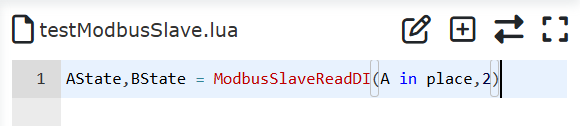

.. centered:: Figure 9.18-67 Reading digital input program

6. Read and write operations of analog output AO (input register) and analog input AI (hold register)

The reading and writing operations of analog output (input register) and analog input (holding register) are basically the same as those of digital output (discrete input) and digital input (coil), but the difference is that the data range of the latter is only 0 or 1, while the data range of the former is larger, so the specific operations can refer to the programming of digital output and digital input, and only the reading and writing operations of analog input (Figure 82) and analog output (Figure 83) are shown here.
              
.. image:: coding/229.png
   :width: 6in
   :align: center

.. centered:: Figure 9.18-68 Reading Analog Input
              
.. image:: coding/230.png
   :width: 6in
   :align: center

.. centered:: Figure 9.18-69 Reading and writing analog output

7. Waiting for digital input

As shown in Figure 84, open the ModbusTCP slave command addition page, find "Waiting for digital input settings", select the "A in place" register with DI name as configuration, the waiting status is "True", and the timeout time is 5000 ms. Click "Add" button, and finally click "Apply" button.
              
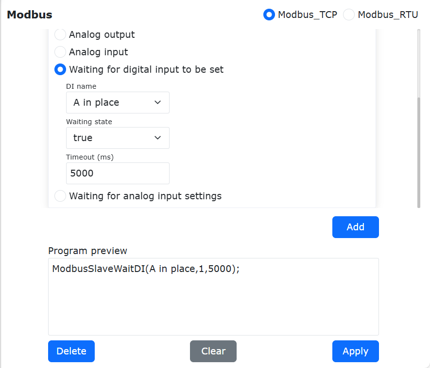

.. centered:: Figure 9.18-70 Add the command of waiting for digital input

As shown in Figure 85, at this time, the robot program "testModbusSlave.lua" has added an command that the robot Modbus slave station waits for digital input. After starting the program, the robot will wait for the value of the "A in place" coil register of the slave station to become true, that is, the value 1. Since the set timeout is 5s, when the "A in place" signal is still 0 after the robot waits for 5s, the robot program will report a timeout error and the program will automatically stop running.
              
.. image:: coding/232.png
   :width: 6in
   :align: center

.. centered:: Figure 9.18-71 Waiting for Digital Input Program

8. Waiting for analog input

As shown in figure 86, open the ModbusTCP slave command addition page, and find the voltage register with the AI name selected for "Waiting for Analog Input Settings". The waiting state is ">", the register value is 255, and the timeout time is 5000 ms.. Click "Add" button, and finally click "Apply" button.

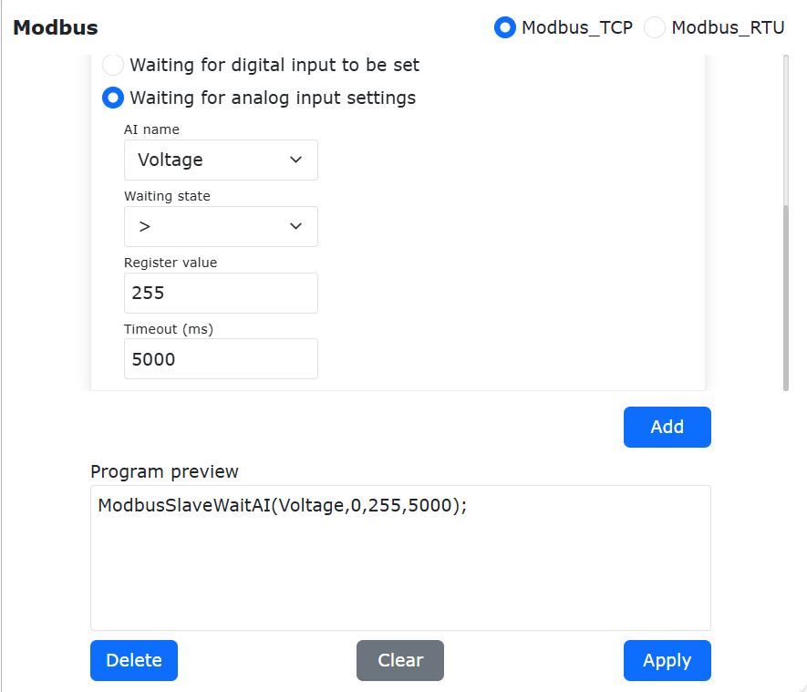

.. centered:: Figure 9.18-72 Add an command to wait for analog input

As shown in Figure 87, at this time, the robot program "testModbusSlave.lua" has added an command that the robot Modbus slave station waits for the analog input value. After starting the program, the robot will wait for the slave station's "voltage" register value to be greater than 255. Since the set timeout time is 5s, when the robot waits for 5s and the "voltage" signal is still less than 255, the robot program will report a timeout error and the program will automatically stop running.
              
.. image:: coding/234.png
   :width: 6in
   :align: center

.. centered:: Figure 9.18-73 Waiting for Analog Input Register Program

Open the ModbusTCP Slave command addition page, find the "Wait for Analog Input Setting" (i.e., wait for AI input register setting). Select the AI name as the configured "Liquid Level" register, set the wait condition to "=", the register value to 255, and the timeout to 5000ms. Click the "Add" button, and finally click the "Apply" button.

.. image:: coding/495.png
   :width: 6in
   :align: center

.. centered:: Figure 9.18-73-2 Add Wait for Analog Input

At this point, a Modbus Slave command to wait for the AI input register value has been added to the robot program "test.lua". After starting the program, the robot will continuously wait for the "Liquid Level" register value to equal 255. Since the timeout is set to 5s, if the "Liquid Level" signal still does not equal 255 after the robot waits for 5 seconds, the robot program will report a timeout error and automatically stop running.

ModbusTCP slave robot state feedback and control
******************************************************

The ModbusTCP slave input register addresses 310~473 of the cooperative robot are used to feed back the real-time status of the robot (see Annex 1: ModbusTCP slave address mapping table). You only need to read the value of the corresponding register with the master station equipment to obtain the corresponding real-time status data of the robot.

The coil register addresses 300~599 of ModbusTCP slave station of the cooperative robot are used for the master station equipment to control the robot (see Annex 1: ModbusTCP slave address mapping table). Taking coil address 502 as an example, this address function indicates "startup program".

When the robot is in automatic mode, the master station equipment sets the value of address 502 from 0 to 1, the robot automatically starts to run the currently configured program; Take the coil address 300 as an example. It is used to control the output of the robot control box DO0. When the external master station sets the coil address 300 from 0 to 1, the automatic output of the control box DO0 is valid. Similarly, when the external master station sets the coil address 300 from 1 to 0, the output of the control box DO0 is invalid. As shown in Figure 88, click "Function Digital Input (Coil)" on the ModbusTCP slave station setting page to monitor all current function digital inputs.
              
.. image:: coding/235.png
   :width: 6in
   :align: center

.. centered:: Figure 9.18-74 Digital Input of Robot Slave Station Function
                 
.. image:: coding/434.png
   :width: 6in
   :align: center

.. centered:: Figure 9.18-74 Modbus TCP Slave station address mapping table

Appendix 1: :download:`Modbus TCP Slave station address mapping table <../_static/_doc/ModbusTCP Slave station address mapping table.xlsx>`

Robot Backgrounder Function
~~~~~~~~~~~~~~~~~~~~~~~~~~~~~~~~~

Robot Backgrounder Function
++++++++++++++++++++++++++++++++++

The robot background program is a control program used to process the logical relationship of signals in the process of running the robot in the foreground motion program, and the background is also running, and the two are independent of each other in the operation relationship.

The background program can monitor the operating status of the foreground and at the same time send control signals to the foreground. The background program can also be connected with external devices through I/O communication to monitor and control the operation of robot peripheral equipment. Unlike the foreground teach-in, the background logic program can run commands, which cannot control any axis of motion. Therefore, it cannot be programmed with any robot axis motion commands. Only the logic control function and I/O communication function are retained.

When using a background program, the program scans in a loop from start to finish. The running cycle is 1 millisecond, and a delay function can be added to the background program to control the running cycle. During the execution of the background program, it is not affected by emergency stop, pause, or alarm. 

.. note:: Run up to 8 background programs at the same time.

A maximum of 8 programs can be executed at the same time as background logic, and an error alarm will be sent when the number of programs exceeds the maximum value.

When the power is cut off, the background logic program will be automatically loaded and run according to the set state the next time the power is turned on.

Save the robot background program
************************************

Backgrounder creation, editing, and saving can only be used in the Backgrounder interface.

**Step1**:Open the robot background program interface. Open the teaching page, click "Program", and then click "Coding". Select the command background program in the upper left corner to enter the background program interface.

.. note:: The background program only contains logic judgment, assignment instructions, front-end control instructions, I/O interface instructions and Modbus communication instructions.

.. image:: coding/253.png
   :width: 6in
   :align: center

.. centered:: Figure 9.19-1 The robot background program interface

**Step2**:In manual mode, open the background teach program file. Click "New" to create a new teaching program file, edit the program, and click "Save" to save the file. 

.. note:: The running cycle of the background program is 1 millisecond, and the provided delay function can be used in the program, as shown in the fourth line of the program in the following figure, to increase the delay of 1 second to control the running cycle.

.. image:: coding/254.png
   :width: 6in
   :align: center

.. centered:: Figure 9.19-2 Save the robot background program

Robot background program management
********************************************

Successfully saved backgrounders can be created, paused, resumed, and deleted in the backgrounder management interface. The backgrounder management interface allows you to intuitively see the running status of all created backgrounders. Green is running, and red is paused.

**Step1**:Create a background program. Click the Background Program Management button, select the saved background program from the drop-down box, and click Start Run to run the corresponding background program.

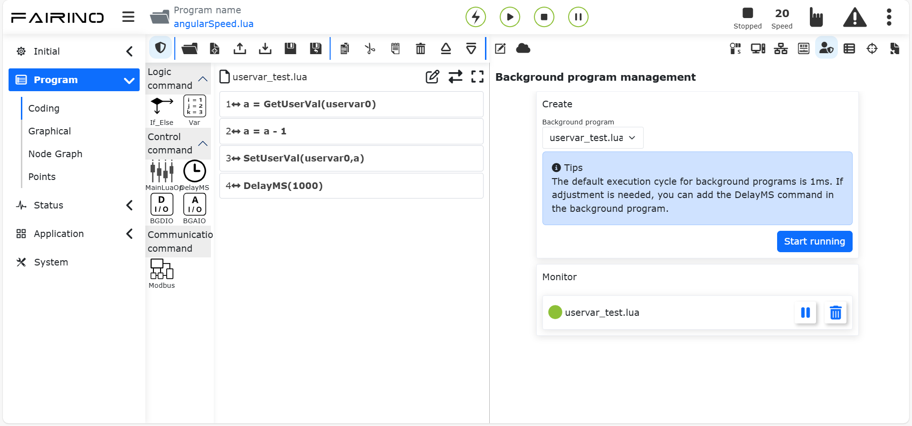

.. centered:: Figure 9.19-3 Start running the robot background program

**Step2**:Resume and pause the background program. In the background program management page, click Resume and Pause on the monitor to resume and pause the corresponding background program.Click Delete on the monitor program to delete the corresponding background program.

.. image:: coding/256.png
   :width: 6in
   :align: center

.. centered:: Figure 9.19-4 Pause、resume、delete the background program

Use of the robot user variables
++++++++++++++++++++++++++++++++++++++

.. note:: The new user variable function is applicable to the data interaction between the robot background program and the foreground program, or between different background programs.

Robot user variable management
*************************************

Before using user variables, you can rename them to your liking. Open the teach-in page, click "Program", "Coding", and "user variable management", which can be used in both the foreground program and the background program. Click on the variable name to change the variable name directly.

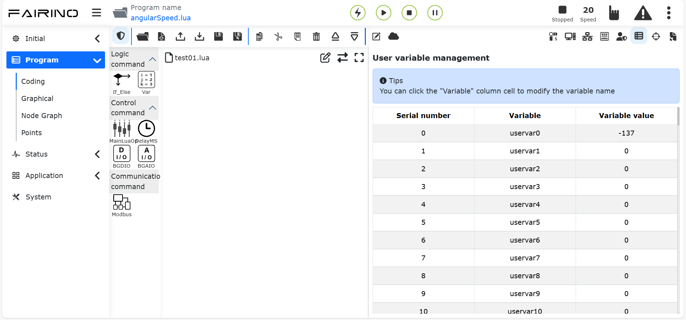

.. centered:: Figure 9.19-5 Robot user variable management

Robot user variable use
*************************

When user variables are used in foreground  and background programs, only the user variable read/write interface can be used.

**Step1**:In manual mode, open the teach-in program file. Open the teaching page, click "Program", click "Coding", and click "New" to create a new teaching program file.

.. image:: coding/258.png
   :width: 6in
   :align: center

.. centered:: Figure 9.19-6 Create a new teach-in program file

**Step2**:Use the user variable read interface. Click the "Variable" command, select "User Variable", click the Get Variable Value drop-down box, select the user variable to be read, and click the "Add" and "Apply" buttons to write the user variable reading interface program.

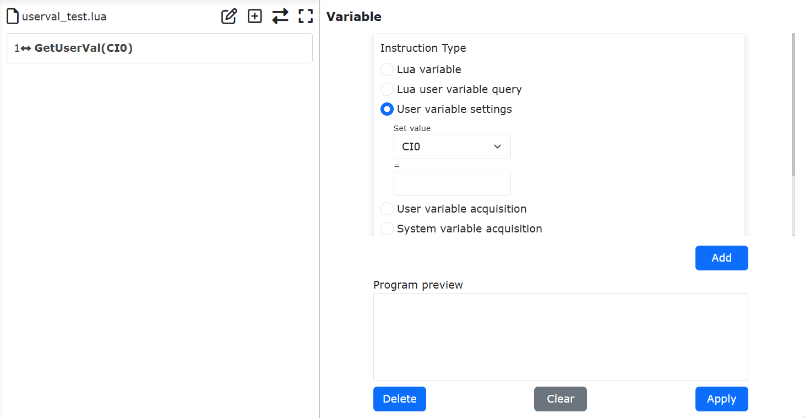

.. centered:: Figure 9.19-7 Use the user variable read interface

**Step3**:Use user variables to write interfaces. Click the "Variable" command, select "User Variable", click the Set Variable Value drop-down box, select the user variable to be set, and fill in the corresponding set value, which supports both constant and variable value. Click the Add and Apply buttons to write user variables and write interface programs.

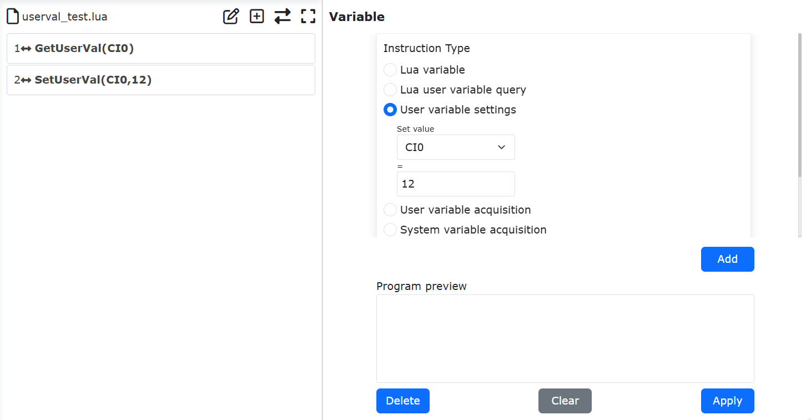

.. centered:: Figure 9.19-8 Use the user variable write interface

XY horizontal constant
~~~~~~~~~~~~~~~~~~~~~~~~

Overview
+++++++++++++++

The principle of lateral constant force grinding in the XY direction is as follows: Lateral constant force grinding refers to applying a grinding tool (such as a grinding wheel, grinding disc, etc.) with a constant force on a specified workpiece surface, and controlling the movement of the tool along the XY direction to maintain a constant grinding force at the contact point. 

Operation process of lateral constant force grinding function in XY direction
+++++++++++++++++++++++++++++++++++++++++++++++++++++++++++++++++++++++++++++++++++++++++++++++++++

To perform constant force grinding using a force sensor, it is necessary to install a grinding tool under the force sensor and configure the tool coordinate system. Click on the "Initial" -> "Base" -> "Coordinate" -> "TCP" button in sequence to enter the "Tool coordinate system settings" interface. Select the coordinate system to be set in the "Coordinate system name" (taking toolcoord 0 coordinate system as an example), and set it according to the size of the end tool.

.. image:: coding/246.png
   :width: 4in
   :align: center

.. centered:: Figure 9.20-1 Set tool coordinate system

Force control reference coordinate system setting. In the web interface, click on "FT" -> "Reference coord.", select "Custom coordinates", and set each parameter to "0". When the force sensor is working, different reference coordinate systems will affect the magnitude of the external force obtained by the sensor.

.. image:: coding/261.png
   :width: 6in
   :align: center

.. centered:: Figure 9.20-2 Set reference coordinate

Fix the flat plate to be polished in the robot workspace, and the plate should not shake. Place the end of the tool approximately perpendicular to the polishing plate and teach the starting and ending points.

.. image:: coding/262.png
   :width: 2in
   :align: center

.. centered:: Figure 9.20-3 Polishing layout diagram

Click on the "Program" -> "Coding" -> "F/T" button in sequence, and add the "FT_Control" instruction. The "FT_Control" command is a force controlled motion command that allows the robot to move around the set force.

.. image:: coding/263.png
   :width: 4in
   :align: center

.. centered:: Figure 9.20-4 Add FT_Control command

.. image:: coding/264.png
   :width: 6in
   :align: center

.. centered:: Figure 9.20-5 Example of FT_Control polishing instruction

The specific function of parameters:

**Coordinate system name**:The name corresponding to setting the sensor coordinate system; 

**Check the direction of force detection and set the detection threshold**:Select the direction of the control force. In horizontal polishing, check Fx and Fy and set the corresponding expected constant force; 

**PID parameters**:Set the PID proportional coefficients for force and torque, generally setting the F_P_gain to 0.001;

**Maximum adjustment distance**:corresponding to the maximum movement distance in the X, Y, and Z directions; 

**Maximum adjustment angle**:corresponding to the maximum rotation angle of RX, RY, RZ; 

**Grinding disc radius**:determined by the actual radius of the end grinding tool.

Automatic Singularity Avoidance Trajectory
~~~~~~~~~~~~~~~~~~~~~~~~~~~~~~~~~~~~~~~~~~~~~~~~~~~~~~~~~~~~~~

Overview
+++++++++++++++

When the robot encounters a singular range that cannot be passed by the robot in the LIN and ARC command tracks, the robot will report an error or prompt the next digit to be strange or a singular warning appears. 

If you want to be able to reach the next waypoint that will pass through the singular range, you can use this function to avoid the singularity point through joint space or Cartesian space to reach the next target pose.

.. image:: coding/265.png
   :width: 4in
   :align: center

.. centered:: Figure 9.21-1 A simple schematic diagram of a robot's singularity

The above figure is a schematic diagram of the robot singularity, the robot singularity includes three kinds of singularity: shoulder, elbow and wrist, and A is the 5 joint center WCP (Wrist Center Point), which is used to judge the shoulder singularity; B is the singular range of the shoulder, which resembles a cylinder, and its radius is the length of the robot DH parameter d4, and the robot enters the singular state when the WCP enters the cylinder B; C is the elbow singularity boundary of the robot, and the robot is in the elbow singularity state when J3=0 or 180°; D is the internal space, and it is in the wrist singular state when J5=0 or 180° at any position in the internal space.

.. note:: It should be noted that singularity is a motion characteristic determined by the physical structure of the robot, which should be avoided as much as possible during actual operation, and it will lead to changes in the terminal posture and speed and even configuration configuration when it is avoided by algorithms, and it is necessary to consider whether the side effects of avoidance affect the requirements before making a choice.

The trajectory automatically avoids the operation process of the singularity function
+++++++++++++++++++++++++++++++++++++++++++++++++++++++++++++++++++++++++++++++++++++++++++++++++++++++++

In the new program, click Add Robot LIN/ARC type motion command.

.. image:: coding/266.png
   :width: 6in
   :align: center

.. centered:: Figure 9.21-2 Add LIN/ARC LUA command

2.Click the "LIN" command, select the waypoint of the robot singularity, and click the "Singularity Avoidance" button in the "Motion Protection" sub-option of the command parameter configuration interface.

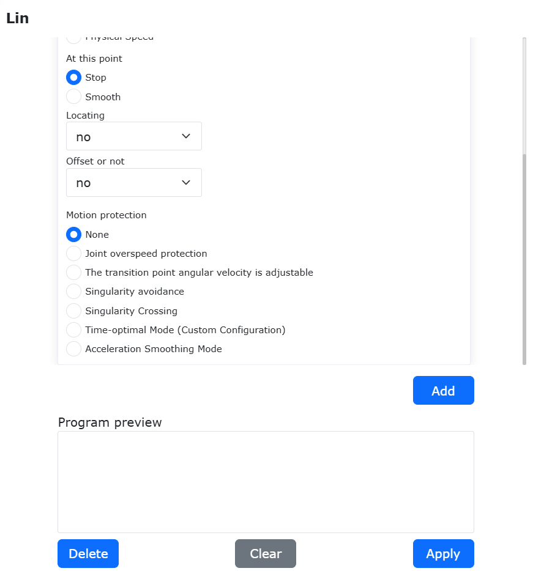

.. centered:: Figure 9.21-3 Turn on singularity avoidance switch

3.Singularity Avoidance parameters include Guard Mode, Shoulder Singularity, Elbow Singularity, and Wrist Singularity. Among them, the "protection mode" is divided into "joint mode" and "Cartesian mode", which means that the robot can cross the singular from the joint space or bypass the singular from the Cartesian space; The parameters of the "Singular Adjustment" specify the maximum deviation between the range of the determination of singularity and the singularity avoidance, which is mm for shoulder and elbow singularity units, and ° for wrist singular units.

.. note:: The joint space will select the nearest trajectory between the joints, so there will be no limit situation, and the joint limit may occur when the Cartesian space is avoided, so you need to pay attention to and adjust it during teaching.

After selecting and setting the singularity avoidance parameters, you can click the "Add" button to add the command, and then click "Apply" to add the LUA command to the program.

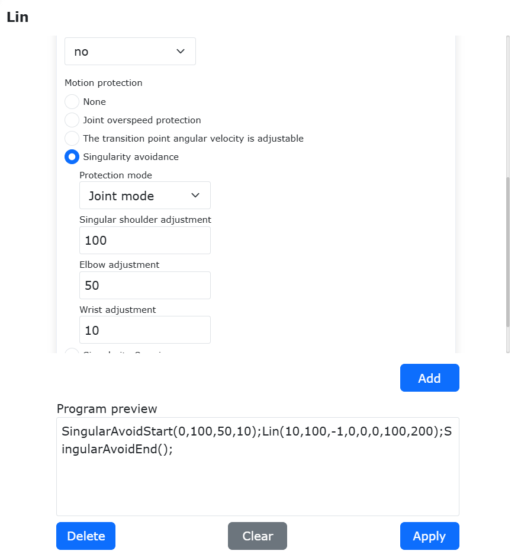

.. centered:: Figure 9.21-4 Configure singularity avoidance parameters and add the lua command

The teach-in completes a typical LIN singular avoidance movement lua procedure as follows:

.. image:: coding/269.png
   :width: 6in
   :align: center

.. centered:: Figure 9.21-5 lua program that contains singularity avoidance instructions

The effect of achieving avoidance is as follows, and the red is the trajectory line at the end of the robot:

.. image:: coding/270.png
   :width: 4in
   :align: center

.. image:: coding/271.png
   :width: 4in
   :align: center

.. centered:: Figure 9.21-6 Example of a shoulder singular avoidance trajectory(top: Cartesian space, bottom: joint space)

.. image:: coding/272.png
   :width: 4in
   :align: center

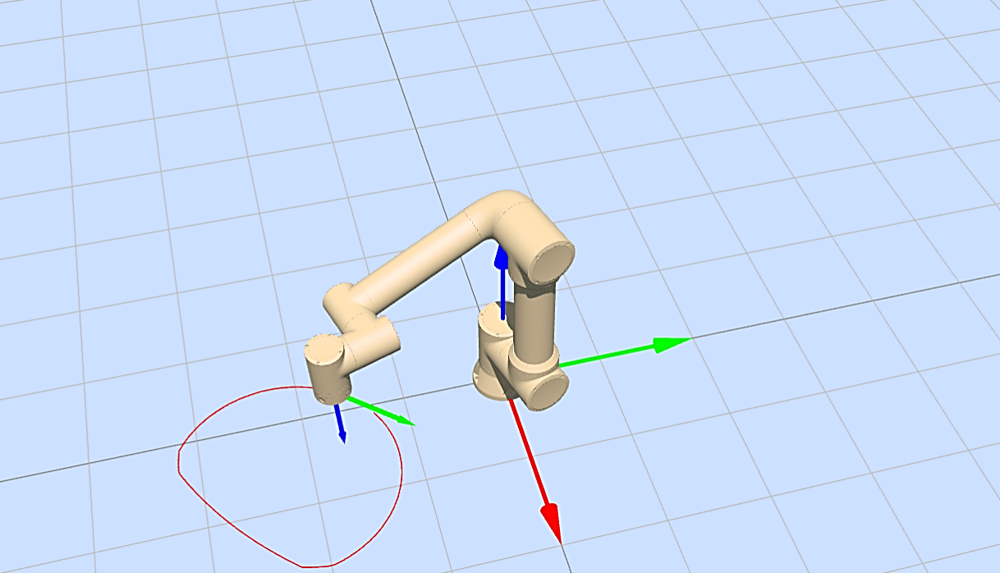

.. centered:: Figure 9.21-7 Example of an elbow singular avoidance trajectory(top: Cartesian space, bottom: joint space)

.. image:: coding/274.png
   :width: 4in
   :align: center

.. centered:: Figure 9.21-8  Example of a wrist singular avoidance trajectory (joint space)

6.If the start and end points of the movement are within the set singular range, when more than one singularity occurs during the movement, or even when two or more singular situations occur at the same time, the interface will display a pop-up window of "[Warning] Singular Pose" to indicate that the current singular situation cannot be avoided.

.. image:: coding/275.png
   :width: 3in
   :align: center

.. centered:: Figure 9.21-9  The current singular situation cannot be avoided

Singularity crossing function in automatic mode
~~~~~~~~~~~~~~~~~~~~~~~~~~~~~~~~~~~~~~~~~~~~~~~~~~~~~~~~~~~~~~~~~~~~~~

Overview
++++++++++++

When the robot executes LIN or ARC commands and passes through a singularity, its speed may fluctuate drastically, leading to unstable motion control and even potential damage to the equipment. By utilizing the singularity crossing function, the robot can smoothly pass through singularities. This manual takes the example of the LIN command passing through a wrist singularity to illustrate how to use the singularity crossing function in automatic mode.

Operation Flow
++++++++++++++++

1. Teach the robot to execute the LIN command with two motion control points (named wristlin1 and wristlin2 in this manual).

2. Click the “Program” button, then click “Coding”, select the “PTP” command under “Motion command”, and add the first motion point.

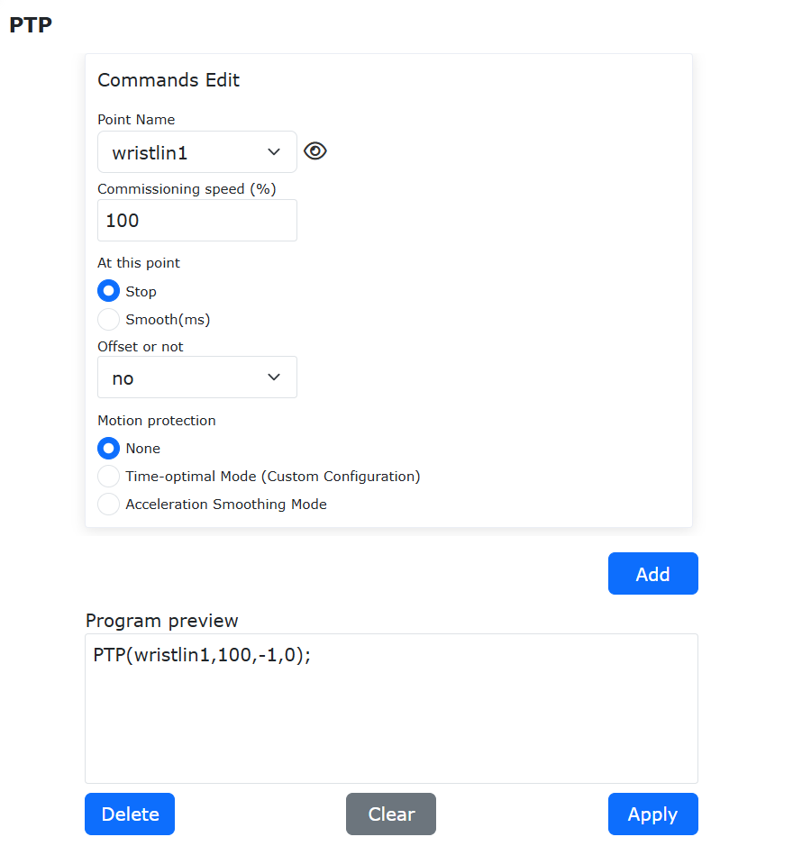

.. centered:: Figure 9.22-1 Add the first motion point

3. Select the “LIN” command under “Motion command”, and add the second motion point. In the “Motion protection” section, select "Singularity Crossing," and set the adjustment ranges for shoulder singularity, elbow singularity, and wrist singularity.

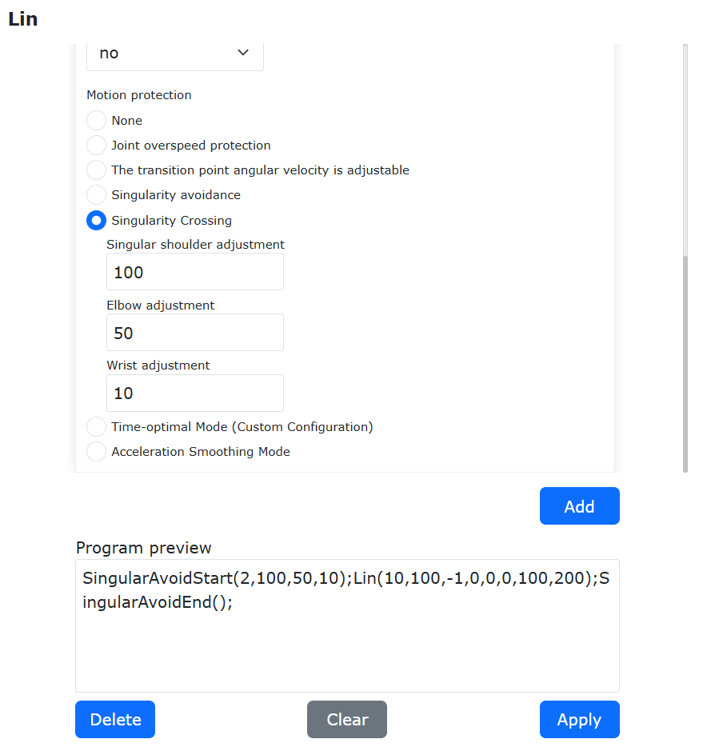

.. centered:: Figure 9.22-2 Set the singularity crossing parameters

4. Generate and run the Lua program. The typical LIN command program for singularity crossing in automatic mode.

.. image:: coding/287.png
   :width: 6in
   :align: center

.. centered:: Figure 9.22-3 Typical singularities crossing LIN instructions

5. Observe the robot's motion results, and adjust the robot's movement speed and singularity settings range to achieve different motion accuracy and impact.

Precision Impact Table
++++++++++++++++++++++++++++++++++

1. Wrist singularity is the most easily triggered singularity type for the robot. A table comparing the precision and impact of wrist singularity for LIN and ARC commands has been compiled. The comparison table for LIN and ARC commands are shown below, (〇 indicates that a collision warning was triggered).
   
.. centered:: Table 9.22-3-1 Error of wrist singularity LIN command (Unit: mm）

.. list-table::
   :widths: 40 30 30 30 30 30 30
   :header-rows: 0
   :class: sheet-center

   * - **Range / Velocity**
     - **2**
     - **20**
     - **40**
     - **60**
     - **80**
     - **100**

   * - 2 mm
     - 0.19					
     - 0.20
     - 0.20 
     - 0.21 
     - 〇  
     - 〇  

   * - 4 mm
     - 0.14					
     - 0.14
     - 0.14
     - 0.14
     - 0.14  
     - 0.14  

   * - 6 mm
     - 0.40				
     - 0.40
     - 0.41
     - 0.41
     - 0.42  
     - 0.42  

   * - 8 mm
     - 0.82				
     - 0.83
     - 0.83
     - 0.84
     - 0.83  
     - 0.84  

   * - 10 mm
     - 1.38				
     - 1.38
     - 1.39
     - 1.39
     - 1.39
     - 1.41  
   
.. centered:: Table 9.22-3-2 Linear jerk of wrist singularity LIN command (Unit: m/s3)

.. list-table::
   :widths: 40 30 30 30 30 30 30
   :header-rows: 0
   :class: sheet-center

   * - **Range / Velocity**
     - **2**
     - **20**
     - **40**
     - **60**
     - **80**
     - **100**

   * - 2 mm
     - 0.605						
     - 12.040
     - 11.370
     - 2743.000		
     - 〇  
     - 〇  

   * - 4 mm
     - 0.916								
     - 34.620
     - 110.900	
     - 241.300	
     - 303.900  
     - 400.700  

   * - 6 mm
     - 0.906									
     - 59.700
     - 139.600
     - 343.700
     - 445.600  
     - 582.900  

   * - 8 mm
     - 1.073									
     - 67.480
     - 199.600
     - 438.300
     - 553.400 
     - 623.900  

   * - 10 mm
     - 1.013								
     - 69.490
     - 195.800	
     - 556.600
     - 649.300
     - 953.300  
   
.. centered:: Table 9.22-3-3 Angular jerk of wrist singularity LIN command (Unit: °/s³)

.. list-table::
   :widths: 40 30 30 30 30 30 30
   :header-rows: 0
   :class: sheet-center

   * - **Range / Velocity**
     - **2**
     - **20**
     - **40**
     - **60**
     - **80**
     - **100**

   * - 2 mm
     - 1122									
     - 25140
     - 24780
     - 54890		
     - 〇  
     - 〇  

   * - 4 mm
     - 305													
     - 9035
     - 26030
     - 39330
     - 60510
     - 80330

   * - 6 mm
     - 219														
     - 8161
     - 19450
     - 84700
     - 109300
     - 143400 

   * - 8 mm
     - 478													
     - 6651
     - 19780
     - 121600
     - 150500
     - 162100 

   * - 10 mm
     - 281												
     - 5296
     - 14470
     - 161600
     - 177300
     - 256000
   
.. centered:: Table 9.22-3-4 Error of wrist singularity ARC command (Unit: mm)

.. list-table::
   :widths: 40 30 30 30 30 30 30
   :header-rows: 0
   :class: sheet-center

   * - **Range / Velocity**
     - **2**
     - **20**
     - **40**
     - **60**
     - **80**
     - **100**

   * - 2 mm
     - 1.06									
     - 1.06
     - 1.05
     - 1.05		
     - 〇  
     - 〇  

   * - 4 mm
     - 1.58														
     - 1.59
     - 1.60
     - 1.62
     - 〇  
     - 〇 

   * - 6 mm
     - 3.31																			
     - 3.34
     - 3.35
     - 3.32
     - 3.39
     - 3.33 

   * - 8 mm
     - 5.81																		
     - 5.83
     - 5.87
     - 5.87
     - 5.87
     - 5.96 

   * - 10 mm
     - 9.06																	
     - 9.09
     - 9.12
     - 9.17
     - 9.17
     - 9.22
   
.. centered:: Table 9.22-3-5 Linear jerk of wrist singularity ARC command (Unit: m/s3)

.. list-table::
   :widths: 40 30 30 30 30 30 30
   :header-rows: 0
   :class: sheet-center

   * - **Range / Velocity**
     - **2**
     - **20**
     - **40**
     - **60**
     - **80**
     - **100**

   * - 2 mm
     - 13.970										
     - 643.000	
     - 2230.000	
     - 3408.000	
     - 〇  
     - 〇  

   * - 4 mm
     - 0.635																	
     - 24.850
     - 42.480
     - 76.990
     - 〇  
     - 〇 

   * - 6 mm
     - 3.000																						
     - 19.960
     - 45.350
     - 57.120
     - 77.050
     - 59.800	 

   * - 8 mm
     - 1.494																						
     - 27.830
     - 90.290
     - 124.200
     - 148.400
     - 168.000

   * - 10 mm
     - 0.460																					
     - 31.870
     - 112.600
     - 211.000
     - 229.300
     - 117.500
   
.. centered:: Table 9.22-3-6 Angular jerk of wrist singularity ARC command (Unit: °/s³)

.. list-table::
   :widths: 40 30 30 30 30 30 30
   :header-rows: 0
   :class: sheet-center

   * - **Range / Velocity**
     - **2**
     - **20**
     - **40**
     - **60**
     - **80**
     - **100**

   * - 2 mm
     - 3378													
     - 85380
     - 228600	
     - 351900
     - 〇  
     - 〇  

   * - 4 mm
     - 1098																				
     - 31360
     - 71460
     - 104800
     - 〇  
     - 〇 

   * - 6 mm
     - 390																											
     - 15770
     - 43650
     - 79330
     - 93930
     - 124200 

   * - 8 mm
     - 315																											
     - 10270
     - 28770
     - 57000
     - 75840
     - 94050

   * - 10 mm
     - 504																										
     - 6108
     - 21470
     - 34920
     - 47280
     - 97160

2. Since shoulder singularity and elbow singularity correspond to the robot's minimum and maximum working boundaries, respectively, precision cannot be used as an evaluation metric. Therefore, an impact comparison table for shoulder singularity is compiled, as shown in Tab, and an impact comparison table for elbow singularity is compiled, as shown below (where 〇 indicates that a collision warning was triggered).
   
.. centered:: Table 9.22-3-7 Linear jerk of shoulder singularity (Unit: m/s3)

.. list-table::
   :widths: 40 30 30 30 30 30 30
   :header-rows: 0
   :class: sheet-center

   * - **Range / Velocity**
     - **2**
     - **20**
     - **40**
     - **60**
     - **80**
     - **100**

   * - 40 mm
     - 1.166																
     - 99.730
     - 253.200	
     - 273.500
     - 〇  
     - 〇  

   * - 70 mm
     - 1.047																								
     - 92.440
     - 328.900
     - 634.500
     - 878.400  
     - 1499.000	 

   * - 100 mm
     - 1.060																															
     - 90.250
     - 273.900
     - 506.600
     - 926.300
     - 1555.000	 

.. centered:: Table 9.22-3-8 Angular jerk of shoulder singularity (Unit: °/s³)

.. list-table::
   :widths: 40 30 30 30 30 30 30
   :header-rows: 0
   :class: sheet-center

   * - **Range / Velocity**
     - **2**
     - **20**
     - **40**
     - **60**
     - **80**
     - **100**

   * - 40 mm
     - 396																		
     - 89.83
     - 824
     - 348
     - 〇  
     - 〇  

   * - 70 mm
     - 428																													
     - 121
     - 681
     - 167
     - 1783 
     - 35690 

   * - 100 mm
     - 440																																				
     - 151
     - 473
     - 246
     - 1495
     - 39280

.. centered:: Table 9.22-3-9 Linear jerk of elbow singularity (Unit: m/s3)

.. list-table::
   :widths: 40 30 30 30 30 30 30
   :header-rows: 0
   :class: sheet-center

   * - **Range / Velocity**
     - **2**
     - **20**
     - **40**
     - **60**
     - **80**
     - **100**

   * - 40 mm
     - 0.905																						
     - 14.430
     - 52.080
     - 87.380
     - 129.400  
     - 657.000  

   * - 70 mm
     - 1.144																																		
     - 24.320
     - 79.580
     - 270.300
     - 793.300 
     - 1478.000 

   * - 100 mm
     - 1.852																																									
     - 27.930
     - 112.700
     - 328.100
     - 583.000
     - 758.600

.. centered:: Table 9.22-3-10 Angular jerk of elbow singularity (Unit: °/s³)

.. list-table::
   :widths: 40 30 30 30 30 30 30
   :header-rows: 0
   :class: sheet-center

   * - **Range / Velocity**
     - **2**
     - **20**
     - **40**
     - **60**
     - **80**
     - **100**

   * - 40 mm
     - 347																										
     - 128
     - 148
     - 142
     - 63
     - 38050 

   * - 70 mm
     - 424																																						
     - 132
     - 141
     - 21780
     - 56190
     - 95610 

   * - 100 mm
     - 46																																														
     - 1443
     - 6194
     - 19940
     - 35170
     - 46770

Real-time forward trajectory planning function
~~~~~~~~~~~~~~~~~~~~~~~~~~~~~~~~~~~~~~~~~~~~~~~~~~~~~~~~~~~

Overview
++++++++++++

Real-time forward-looking trajectory planning is based on current and future path information, dynamically adjusting the robot's motion parameters such as speed and acceleration to ensure smoothness, continuity and accuracy of motion. By predicting the robot's future position and posture, forward-looking control can respond before the key points of the path, thereby avoiding unstable motion or trajectory errors due to sudden changes in speed and acceleration.

Operation process
++++++++++++++++++++++

**Step1**: Prepare a trajectory point file in "txt" format, in which each trajectory point is represented by a Cartesian pose.

**Step2**: Click the "Teaching Program"->"Programming" button in sequence, select the "Trajectory Forward" command in "Motion Command", and import and delete the trajectory file in "Command Configuration".

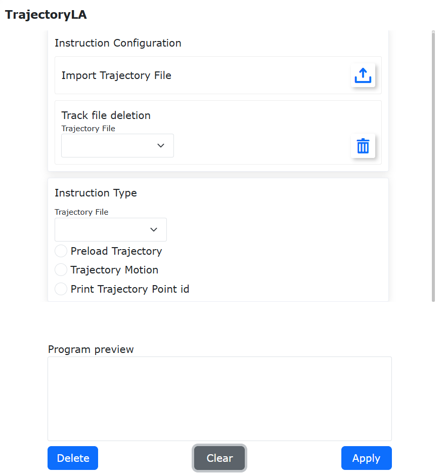

.. centered:: Figure 9.23-1 Import and delete trajectory files

**Step3**: Select the trajectory file to run and add the "Trajectory Preload" command: 

First, choose the fitting method for trajectory points in "Curve Fitting Method", including "Linear Connection", "Linear Fitting", "B-spline Curve", "Polynomial Optimization Method", etc. When selecting "Linear Fitting", additional error limits need to be set, which is not required for other methods. 

Then set the smoothing method and smoothing precision. Finally, configure the maximum velocity, maximum acceleration and maximum jerk during operation. The "Uniform Motion" option can be enabled for constant velocity lookahead, which will make the robot perform lookahead at constant speed when activated.

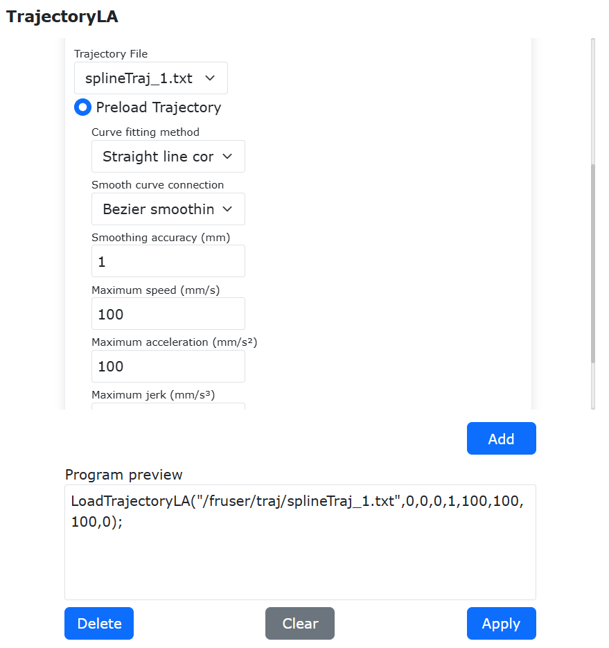

.. centered:: Figure 9.23-2 Setting "Linear Fitting" Parameters for Trajectory Preloading

.. image:: coding/292.png
   :width: 6in
   :align: center

.. centered:: Figure 9.23-3 Setting Trajectory Preloading Parameters

**Step4**: Add the "Trajectory Motion" command and generate Lua program. The imported trajectory file can be processed with real-time lookahead trajectory planning by running the Lua program. A typical real-time lookahead trajectory planning program is shown below.

.. image:: coding/290.png
   :width: 5in
   :align: center

.. centered:: Figure 9.23-4 Typical Program for Real-time Lookahead Trajectory Planning (B-spline Curve)

**Step 5**: For the "LoadTrajectory" command line in the lua program, click the edit button to modify the setting parameters to achieve different trajectory planning effects.

.. image:: coding/291.png
   :width: 6in
   :align: center

.. centered:: Figure 9.23-5 Modify the setting parameters

Swing amplitude monotonous gradual arc tracking function
~~~~~~~~~~~~~~~~~~~~~~~~~~~~~~~~~~~~~~~~~~~~~~~~~~~~~~~~~~~~~~~~~~

Swinging motion can realize two swinging amplitude switching modes: "sudden change" and "gradual change".

The "sudden change" mode refers to the mode of directly switching the swinging parameters of the previous section with the swinging parameters of the next section. It can be realized by setting two adjacent swinging motions with different parameters, or by issuing a new swinging number in real time during the swinging motion (see the manual section corresponding to the function for details, which will not be repeated here).

The "gradual change" mode means that in the current swinging motion, the swinging amplitude set at the beginning gradually changes to the swinging amplitude set at the end.

The swinging parameter gradual switching mode only supports the process of linear swinging.

Introduction
++++++++++++++

The swinging motion trajectory of monotonic gradual swinging amplitude is shown in the figure below.

.. image:: coding/293.png
   :width: 4in
   :align: center

Among them, the blue line is the swing direction, a is the swing amplitude of the starting point, and b is the swing amplitude of the ending point. The swing amplitude gradually changes during the movement.

.. note:: Please note that currently only the starting point and the end point are of the same type, the swing amplitude is different (from a to b), and the other parameters are consistent. It is recommended to check the swing parameters before executing the swing.

The operation process of setting a swing amplitude gradual swing is as follows:

**Step 1**: Click "Teaching Program", "Programming", select and click the "Swing" button under "Motion Instructions" to enter the swing instruction configuration page.

.. image:: coding/294.png
   :width: 3in
   :align: center

.. centered:: Figure 9.24-1 Click the swing function button

**Step 2**: Select the swing parameter number at the start of the swing in the command editor, click "Start Swing" and then click the "Add" button.
   
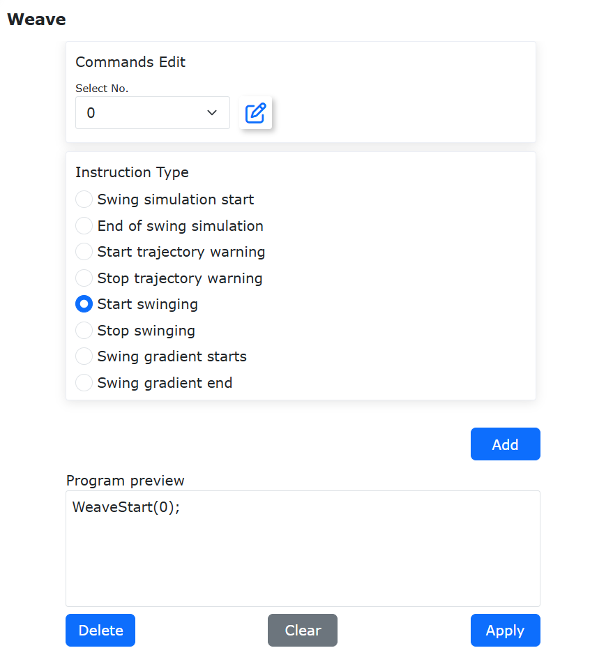

.. centered:: Figure 9.24-2 Add starting swing parameters

**Step 3**: Select the target number of the swing gradient, click "Swing gradient start", and click the "Add" button.
   
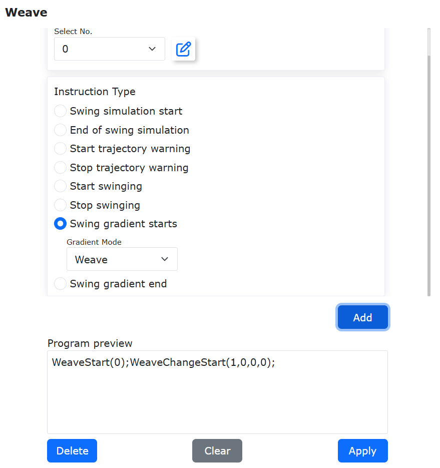

.. centered:: Figure 9.24-3 Add gradual swing parameters

**Step 4**: After adding the corresponding linear motion, click "Swing Gradient End" and click Add, then click "Stop Swing" and add, complete the setting of a gradual swing motion, and click "Apply" to add it to the LUA program.
   
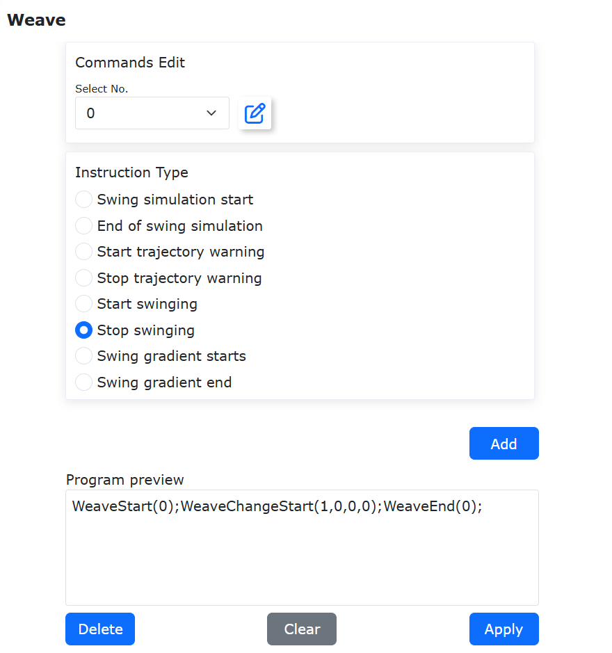

.. centered:: Figure 9.24-4 Implement a complete swing amplitude gradient motion LUA instruction

Offset arc tracking function
~~~~~~~~~~~~~~~~~~~~~~~~~~~~~~~

During the arc tracking welding process, the robot defaults to adjusting the welding gun swing center to track the workpiece groove center according to the current information to keep consistent, but some process requirements require that the welding gun swing center has a certain offset relative to the workpiece groove center.
   
.. image:: coding/298.png
   :width: 3in
   :align: center

.. centered:: Figure 9.25-1 Typical scenarios of bias arc tracking

Typical scenarios of the bias arc tracking function include: a. welding workpiece (welding groove is right angle or acute angle), b. welding gun, e. groove center line. The arc tracking function realizes the following for the welding groove: c. up and down (depth) direction tracking and d. left and right (center) direction tracking, f. left and right direction tracking offset distance.

To realize bias arc tracking, two methods of setting left and right offsets can be selected, namely "sampling" and "percentage" adjustment methods.

Sampling bias arc tracking
++++++++++++++++++++++++++++++++

The sampling method is to collect the left and right current values ​​during the swinging within a certain cycle as a reference after the swing welding arc is started, and compare the sampling current with the reference current in the subsequent welding process to obtain the tracking direction.

The sampling method requires teaching the swing welding starting position to the required offset, the offset shall not be greater than the swing amplitude, and the weld needs to cover the splicing groove.

The sampling bias instruction setting process is as follows:
   
.. image:: coding/299.png
   :width: 3in
   :align: center

.. centered:: Figure 9.25-2 Click the arc tracking command button

**Step 1**: Click "Teaching Program", "Programming", select and click the "Arc Tracking" button under "Welding Command" to enter the arc tracking command configuration page.
   
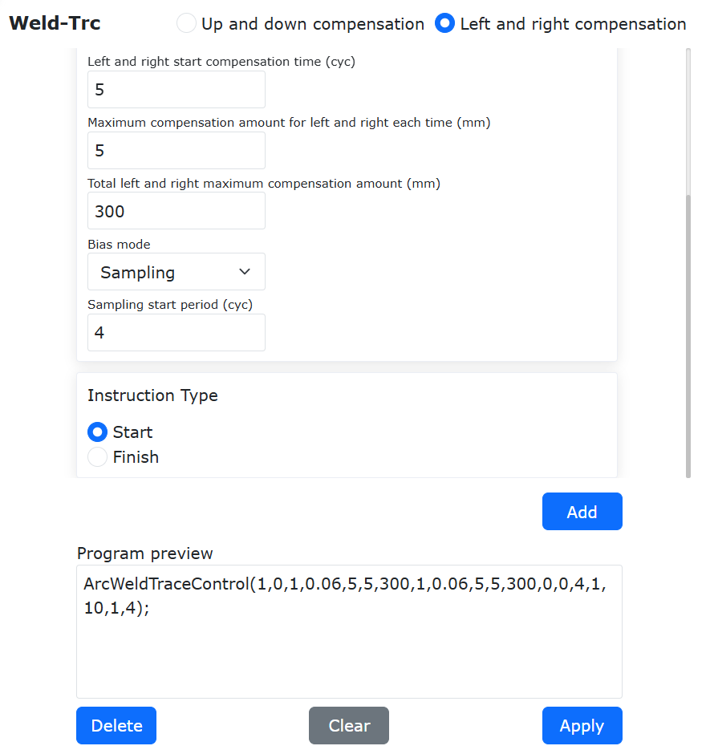

.. centered:: Figure 9.25-3 Sampling bias arc tracking configuration page

**Step 2**: Bias arc tracking acts on left and right compensation. Click the "Left and Right Compensation" subpage, pull down and select "Sampling" in the bias mode, set the sampling start period (the sampling start period must be less than the left and right compensation start time), select "Start" for the instruction type, and click the Add button to generate the LUA instruction.
   
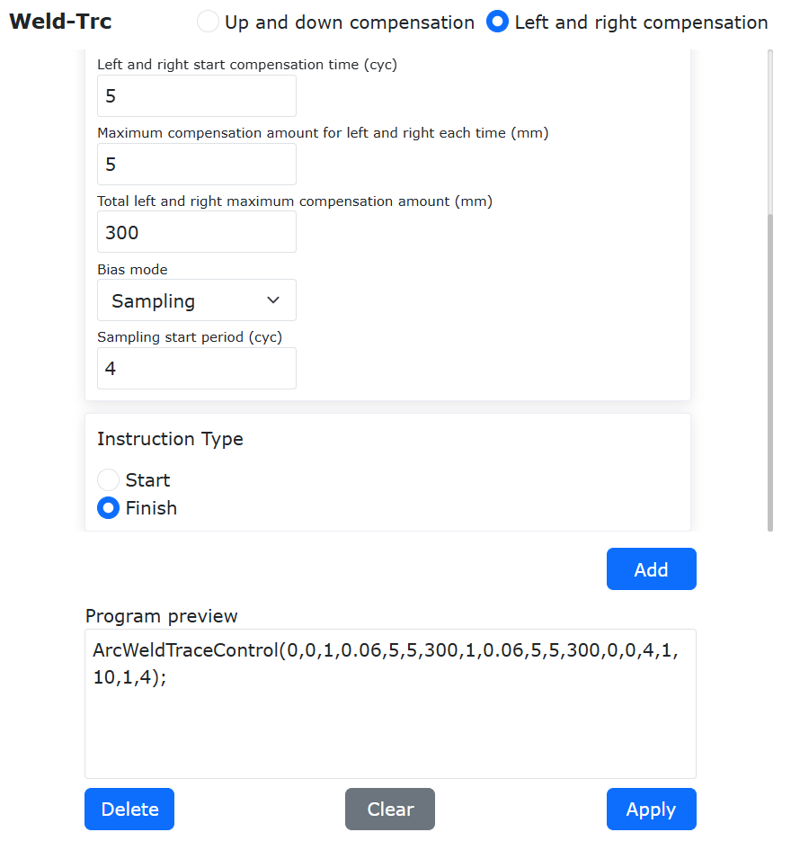

.. centered:: Figure 9.25-4 Add sampling bias arc tracking end instruction

**Step 3**: After adding the swing motion instruction, click to select the arc tracking instruction type "End", and click Add to generate the corresponding LUA instruction.

Percentage bias arc tracking
++++++++++++++++++++++++++++++++++++

The percentage bias is to gain the input sampling current by percentage during the arc tracking process, so that the current of the left and right swing cycles will deviate, and the robot will automatically compensate for the deviation signal.

.. note:: It should be noted that the smaller the swing amplitude and the larger the groove angle, the smaller the deviation of the left and right currents, and the smaller the adjustment percentage. It is recommended to debug with every 1% as the adjustment interval.

The percentage bias instruction setting process is as follows:
   
.. image:: coding/299.png
   :width: 3in
   :align: center

.. centered:: Figure 9.25-5 Click the arc tracking command button

**Step 1**: Click "Teaching Program", "Programming", select and click the "Arc Tracking" button under "Welding Command" to enter the arc tracking command configuration page.
   

.. centered:: Figure 9.25-6 Sampling bias arc tracking configuration page

**Step 2**: Bias arc tracking acts on left and right compensation. Click the "Left and Right Compensation" subpage, pull down and select "Percent" in the bias mode, set the percentage value (positive value compensates the current gain of the first half cycle and the direction of the second half cycle, negative value is the opposite), select "Start" for the instruction type, and click the Add button to generate the LUA instruction.
   
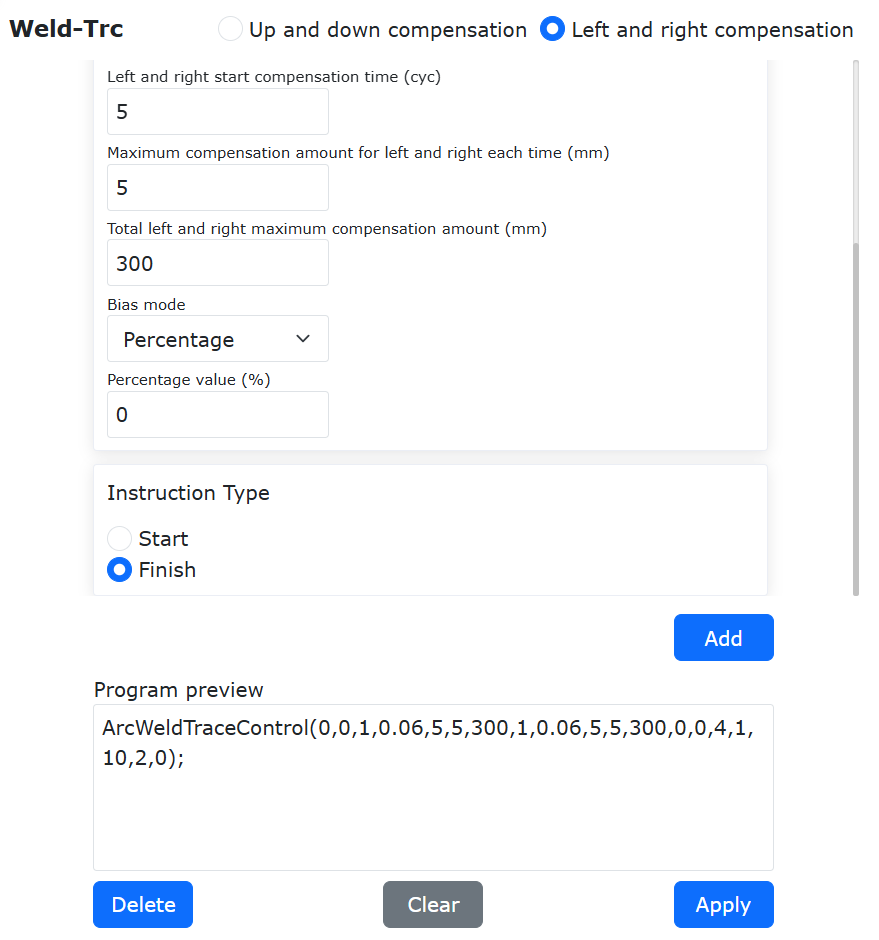

.. centered:: Figure 9.25-7 Add percentage bias arc tracking end instruction

**Step 3**: After adding the swing motion instruction, click to select the arc tracking instruction type "End", and click Add to generate the corresponding LUA instruction.

The typical LUA program structure of a bias tracking is as follows:
   
.. image:: coding/304.png
   :width: 6in
   :align: center

.. centered:: Figure 9.25-8 A typical bias arc tracking LUA program

Custom collision detection threshold function
~~~~~~~~~~~~~~~~~~~~~~~~~~~~~~~~~~~~~~~~~~~~~~

Overview
++++++++

The custom collision detection threshold function is a perfection of the current manual setting of the collision level function. If the current collision level setting does not meet the usage scenario, the user can set a custom collision detection threshold according to the actual situation. The collision detection threshold is divided into joint detection threshold and TCP detection threshold.

Function setting description
++++++++++++++++++++++++++++

**Step1**: Click "Teaching Program", select "Programming", and open the corresponding interface.

**Step2**: Click the "New" button above, enter "example", select "empty.lua", and create a new lua script, as shown in Figure 1.
   

.. centered:: Figure 9.26-1 Create a new lua script

Joint detection threshold function setting instructions
*****************************************************************

Parameter setting instructions
""""""""""""""""""""""""""""""""""

**Step1**: In the control command interface, select the "collision detection" function, as shown in Figure 2. Click "collision detection on", and select "joint only" under the detection status bar. According to actual needs, modify the input values ​​of J1-J6, the value range is, the unit is NM. In this mode, modifying the TCP threshold in the X-RZ direction does not take effect. According to actual needs, select "non-blocking" or "blocking" for blocking. Click the Add button to complete the opening instruction addition.

**Step2**: Click "collision detection off", click the Add button, and complete the closing instruction addition. The program preview interface is shown in Figure 3, click the "Apply" button to complete the function addition.

.. note:: The custom collision detection threshold function is a set of instructions, which needs to be closed in time after opening.

**Step3**: In the collision detection function, add the corresponding motion instructions, as shown in Figure 4.
   
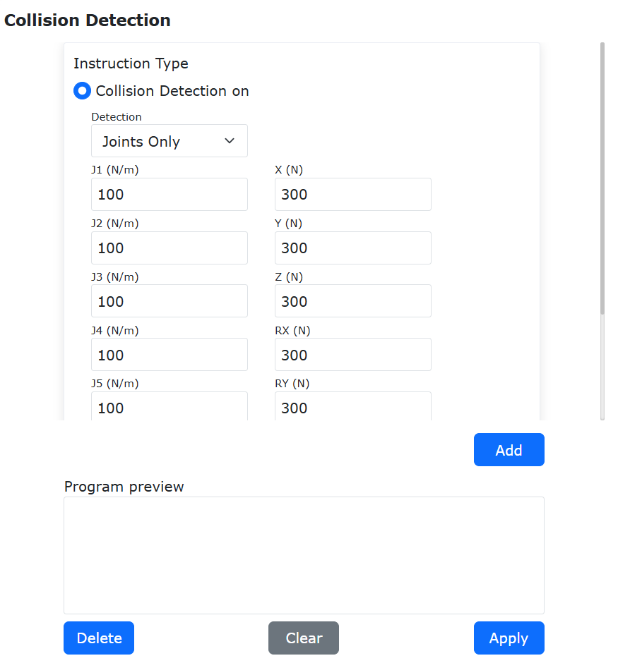

.. centered:: Figure 9.26-2 Joint detection threshold setting interface
   

.. centered:: Figure 9.26-3 Program preview interface
   
.. image:: coding/308.png
   :width: 6in
   :align: center

.. centered:: Figure 9.26-4 lua script program example interface

TCP detection threshold function setting instructions
****************************************************************

Parameter setting instructions
""""""""""""""""""""""""""""""""""

**Step1**: In the control command interface, select the "collision detection" function, as shown in Figure 5. Click "collision detection on", and select "TCP only" under the detection status bar. According to actual needs, modify the input value of the X-RZ direction, the value range is, and the unit is N. In this mode, modifying the joint threshold of J1-J6 does not take effect. According to actual needs, select "non-blocking" or "blocking" for blocking. Click the Add button to complete the opening instruction addition.

**Step2**: Click "collision detection off", click the Add button, and complete the closing instruction addition. The program preview interface is shown in Figure 6, click the "Apply" button to complete the function addition.

.. note:: The custom collision detection threshold function is a set of instructions, which needs to be closed in time after opening.
   

.. centered:: Figure 9.26-5 TCP detection threshold setting interface
   
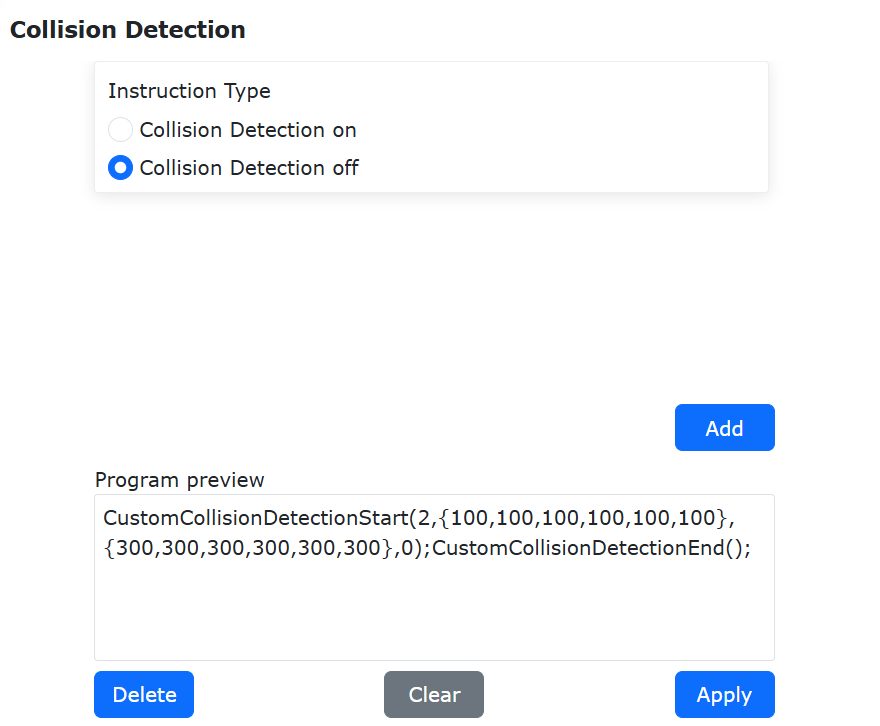

.. centered:: Figure 9.26-6 Program preview interface

**Step 3**: Add corresponding motion instructions in the collision detection function, as shown in Figure 7.
   
.. image:: coding/311.png
   :width: 6in
   :align: center

.. centered:: Figure 9.26-7 lua script program example interface

Joint and TCP detection threshold function setting instructions
**********************************************************************

Parameter setting instructions
"""""""""""""""""""""""""""""""""""""

**Step 1**: In the control instruction interface, select the "collision detection" function, as shown in Figure 8. Click "collision detection on", and select "joint and TCP" under the detection status bar. According to actual needs, modify the input values ​​of J1-J6 and X-RZ directions. The value range of J1-J6 is, the unit is NM; the input value of X-RZ direction is, the unit is N. According to actual needs, select "non-blocking" or "blocking" for blocking. Click the Add button to complete the instruction addition.
   
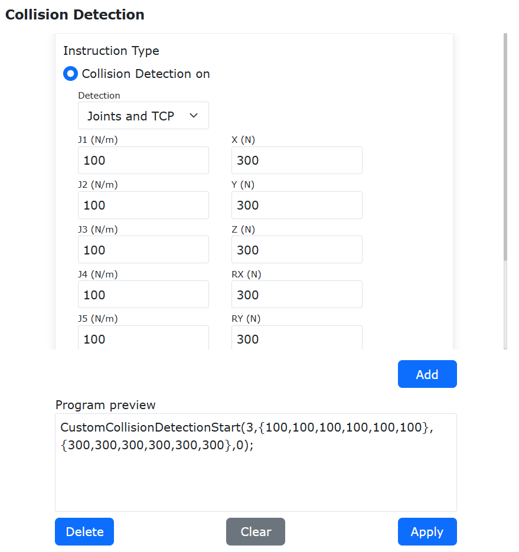

.. centered:: Figure 9.26-8 Joint and TCP detection threshold setting interface

**Step2**: Click "Close Collision Detection", click the Add button, and the closing command is added. The program preview interface is shown in Figure 9. Click the "Apply" button to complete the function addition.

.. note:: The custom collision detection threshold function is a set of instructions, which needs to be closed in time after opening.
   

.. centered:: Figure 9.26-9 Program preview interface

**Step 3**: Add corresponding motion instructions in the collision detection function, as shown in Figure 10.
   
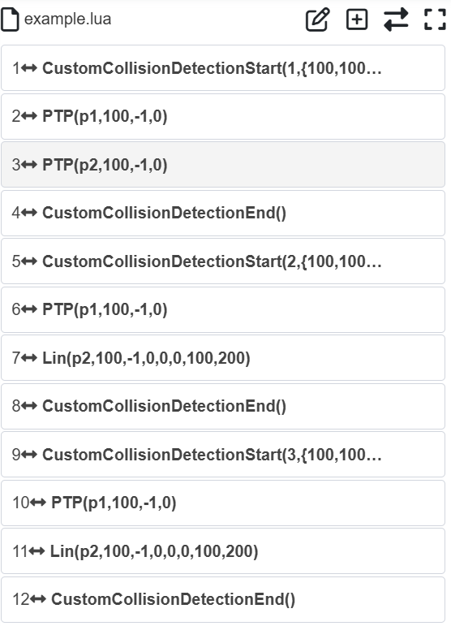

.. centered:: Figure 9.26-10 lua script program example interface

Recommended settings for detection thresholds
********************************************************

Joint detection thresholds
"""""""""""""""""""""""""""""""""""

The recommended joint detection threshold is equivalent to setting the collision level to level 10. The larger the value, the less sensitive the collision detection. The value range is in NM. The data in the table is for reference only. The actual value needs to be adjusted according to the robot's running speed and load conditions.

.. centered:: Table 9.26-1 Recommended joint thresholds

.. list-table::
   :widths: 30 20 20 20 20 20 20
   :header-rows: 0
   :class: sheet-center
   :align: center

   * - **Robot Type**
     - **J1**
     - **J2**
     - **J3**
     - **J4**
     - **J5**
     - **J6**

   * - **FR3**
     - 0.4					
     - 0.7
     - 0.6 
     - 0.3 
     - 0.3 
     - 0.3 

   * - **FR3-WMS**
     - 0.4					
     - 0.7
     - 0.6 
     - 0.3 
     - 0.3 
     - 0.3 

   * - **FR3-WML**
     - 0.4					
     - 0.7
     - 0.6 
     - 0.3 
     - 0.3 
     - 0.3 

   * - **FR3-C**
     - 0.4					
     - 0.7
     - 0.6 
     - 0.3 
     - 0.3 
     - 0.3 

   * - **FR5**
     - 0.6					
     - 1
     - 0.8 
     - 0.3 
     - 0.3 
     - 0.3 

   * - **FR10**
     - 2.5					
     - 3.6
     - 0.8 
     - 0.6 
     - 0.6 
     - 0.6  

   * - **FR16**
     - 2.5					
     - 3.6
     - 0.8 
     - 0.6 
     - 0.6 
     - 0.6 

   * - **FR20**
     - 5					
     - 8
     - 4.5
     - 0.9 
     - 0.9
     - 0.9 

   * - **FR30**
     - 5					
     - 8
     - 4.5
     - 0.9 
     - 0.9
     - 0.9 

TCP detection threshold
""""""""""""""""""""""""""""

The larger the TCP detection threshold, the less sensitive the collision detection. The value range is, and the unit is N. The data in the table is for reference only. The actual value needs to be adjusted according to the robot's running speed and load conditions.

.. centered:: Table 9.26-2 TCP detection threshold

.. list-table::
   :widths: 30 20 20 20 20 20 20
   :header-rows: 0
   :class: sheet-center
   :align: center

   * - **Robot Type**
     - **X**
     - **Y**
     - **Z**
     - **RX**
     - **RY**
     - **RZ**

   * - **FR3**
     - 300					
     - 300
     - 300
     - 20 
     - 20
     - 20

   * - **FR3-WMS**
     - 300					
     - 300
     - 300
     - 20 
     - 20
     - 20

   * - **FR3-WML**
     - 300					
     - 300
     - 300
     - 20 
     - 20
     - 20

   * - **FR3-C**
     - 300					
     - 300
     - 300
     - 20 
     - 20
     - 20

   * - **FR5**
     - 300					
     - 300
     - 300
     - 20 
     - 20
     - 20

   * - **FR10**
     - 500					
     - 500
     - 500
     - 35 
     - 35
     - 35 

   * - **FR16**
     - 500					
     - 500
     - 500
     - 35 
     - 35
     - 35 

   * - **FR20**
     - 800					
     - 800
     - 800
     - 60 
     - 60
     - 60 

   * - **FR30**
     - 800					
     - 800
     - 800
     - 60 
     - 60
     - 60 

T-Shape Velocity Characteristic Optimization + Blending Smoothing Function
~~~~~~~~~~~~~~~~~~~~~~~~~~~~~~~~~~~~~~~~~~~~~~~~~~~~~~~~~~~~~~~~~~~~~~~~~~~~~~~~~~~

Overview
++++++++++++++

Blending between two trajectory segments avoids frequent start-stop issues caused by complete stops, thereby improving robot motion efficiency. This function primarily performs blending between PTP, LIN, ARC, and CIRCLE instructions, achievable in two ways: using Lua instruction mode or motion configuration switch mode.

Operation Procedures
++++++++++++++++++++++++++++

PTP-PTP Blending
***************************************

Using Lua Instruction Mode
""""""""""""""""""""""""""""""""""""""""""

**Step 1**: Select teaching points for PTP-PTP function execution. This manual uses "A0" to "A5" as teaching point names.

**Step 2**: Click "Teach Program" → "Program Programming" button, select "Point-to-Point" in "Motion Instructions", choose teaching points in "Instruction Editing", set debug speed, select "Acceleration Smooth Mode" for motion protection, and configure "Smooth Transition" parameter at points requiring smoothing.

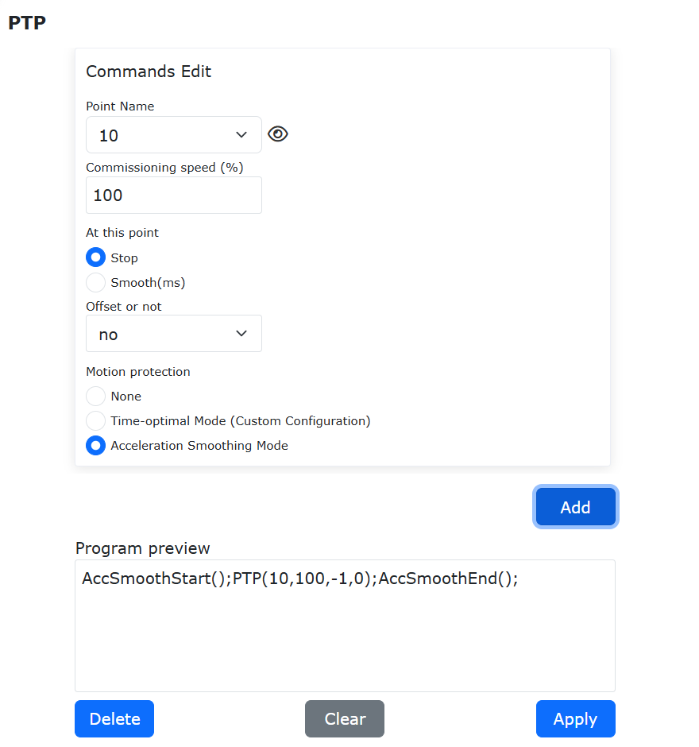

.. centered:: Figure 9.27-1 Blending Instruction Settings for Accelerated Smooth PTP Instructions

**Step 3**: Add multiple PTP instructions, generate and run a Lua program to implement PTP-PTP blending. This mode uses optimized T-shape velocity motion only for instructions between AccSmoothStart() and AccSmoothEnd(), with original T-shape velocity for others.

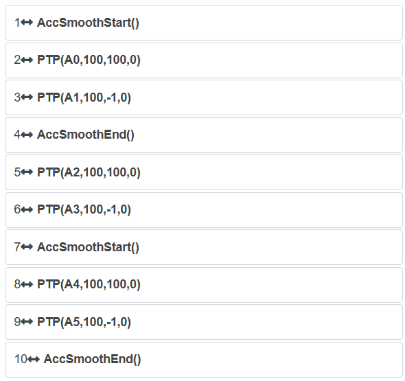

.. centered:: Figure 9.27-2 Typical PTP-PTP Blending Program in Lua Instruction Mode

Using Motion Configuration Switch Mode
"""""""""""""""""""""""""""""""""""""""""""""""""""""""

**Step 1**: Click "Initial Settings" → "Safety" → "Motion Configuration" button to enable the "Acceleration Smooth Mode" switch.

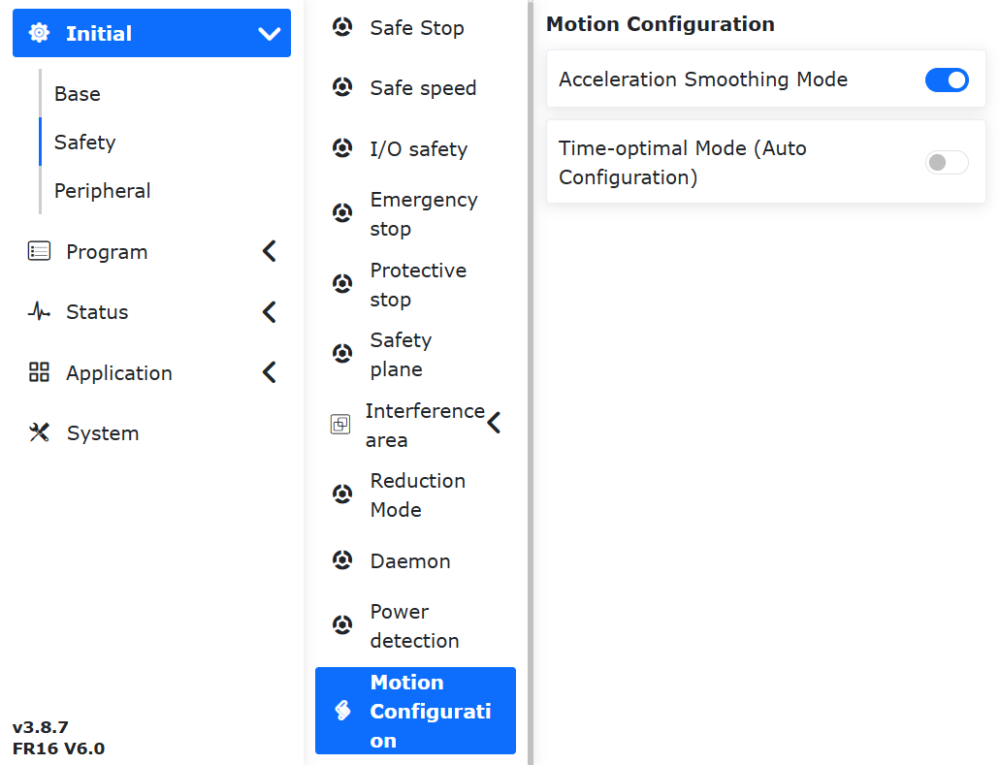

.. centered:: Figure 9.27-3 Acceleration Smooth Mode Configuration Switch Settings

**Step 2**: Select teaching points for PTP-PTP function execution, using "A0" to "A5" as names.

**Step 3**: Click "Teach Program" → "Program Programming" button, select "Point-to-Point" in "Motion Instructions", choose teaching points, set debug speed, select "None" for motion protection, and configure "Smooth Transition" parameter at points requiring smoothing.

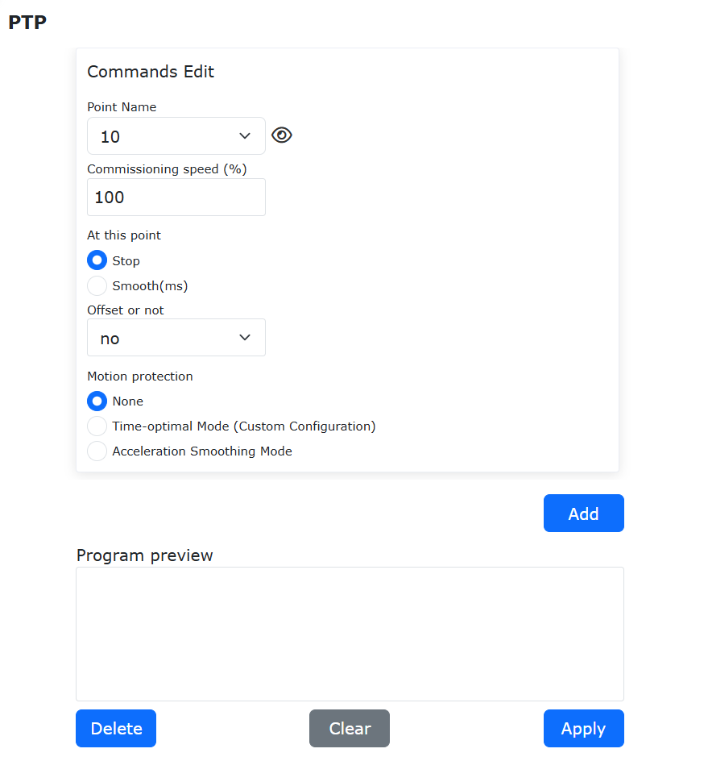

.. centered:: Figure 9.27-4 Blending Instruction Settings for Conventional PTP Instructions

**Step 4**: Add multiple PTP instructions, generate and run a Lua program to implement PTP-PTP blending. The typical program mirrors conventional PTP-PTP programs, applying optimized T-shape velocity motion to all instructions.

.. image:: coding/319.png
   :width: 4in
   :align: center

.. centered:: Figure 9.27-5 Typical PTP-PTP Blending Program Using Configuration Switch

PTP-LIN Blending
***************************************

Using Lua Instruction Mode
""""""""""""""""""""""""""""""""""""""""""

**Step 1**: Select teaching points for PTP-LIN function execution, using "A0" to "A5" as names.

**Step 2**: Click "Teach Program" → "Program Programming" button, select "Point-to-Point" in "Motion Instructions", choose teaching points, set debug speed, select "Acceleration Smooth Mode", and configure "Smooth Transition" parameter.

.. centered:: Figure 9.27-6 Blending Instruction Settings for Accelerated Smooth PTP Instructions

**Step 3**: Add multiple PTP and LIN instructions, generate Lua program to implement PTP-LIN blending. Only instructions between AccSmoothStart() and AccSmoothEnd() use optimized T-shape velocity.

.. image:: coding/415.png
   :width: 4in
   :align: center

.. centered:: Figure 9.27-7 Typical PTP-LIN Blending Program in Lua Mode

Using Motion Configuration Switch Mode
"""""""""""""""""""""""""""""""""""""""""""""""""""""""

**Step 1**: Enable "Acceleration Smooth Mode" in "Initial Settings" → "Safety" → "Motion Configuration".

.. centered:: Figure 9.27-8 Acceleration Smooth Mode Switch Configuration

**Step 2**: Select teaching points for PTP-LIN, using "A0" to "A5".

**Step 3**: Choose "Point-to-Point" instruction, set debug speed, select "None" for motion protection, configure "Smooth Transition".

.. centered:: Figure 9.27-9 Blending Settings for Conventional PTP Instructions

**Step 4**: Add PTP and LIN instructions, run Lua program. All instructions use optimized T-shape velocity.

.. image:: coding/397.png
   :width: 4in
   :align: center

.. centered:: Figure 9.27-10 Typical PTP-LIN Blending Program via Configuration Switch

PTP-ARC Blending
***************************************

Using Lua Instruction Mode
""""""""""""""""""""""""""""""""""""""""""

**Step 1**: Select teaching points "A0" to "A8" for PTP-ARC blending.

**Step 2**: Insert "Point-to-Point" instruction, set "Acceleration Smooth Mode" and "Smooth Transition".

.. centered:: Figure 9.27-11 Blending Settings for Accelerated Smooth PTP

**Step 3**: Add PTP and ARC instructions. Only AccSmoothStart/End-enclosed instructions use optimized velocity.

.. image:: coding/398.png
   :width: 4in
   :align: center

.. centered:: Figure 9.27-12 Typical PTP-ARC Blending Program in Lua Mode

Using Motion Configuration Switch Mode
"""""""""""""""""""""""""""""""""""""""""""""""""""""""

**Step 1**: Enable acceleration smooth mode in motion configuration.

.. centered:: Figure 9.27-13 Acceleration Smooth Mode Switch Setup

**Step 2**: Select "A0" to "A8" as teaching points.

**Step 3**: Configure "Point-to-Point" instruction with "Smooth Transition", motion protection "None".

.. centered:: Figure 9.27-14 Blending Settings for Conventional PTP

**Step 4**: Generate program; all instructions use optimized T-shape velocity.

.. image:: coding/399.png
   :width: 4in
   :align: center

.. centered:: Figure 9.27-15 Typical PTP-ARC Blending via Configuration Switch

PTP-CIRCLE Blending
***************************************

Using Lua Instruction Mode
""""""""""""""""""""""""""""""""""""""""""

**Step 1**: Select teaching points "A0" to "A8" for PTP-CIRCLE.

**Step 2**: Set up "Point-to-Point" instruction with acceleration smooth mode.

.. centered:: Figure 9.27-16 Blending Settings for Accelerated Smooth PTP

**Step 3**: Add PTP and CIRCLE instructions, run between AccSmoothStart/End.

.. image:: coding/400.png
   :width: 4in
   :align: center

.. centered:: Figure 9.27-17 Typical PTP-CIRCLE Blending in Lua Mode

Using Motion Configuration Switch Mode
"""""""""""""""""""""""""""""""""""""""""""""""""""""""

**Step 1**: Enable acceleration smooth mode switch.

.. centered:: Figure 9.27-18 Acceleration Smooth Mode Configuration

**Step 2**: Choose "A0" to "A8" as teaching points.

**Step 3**: Configure PTP instruction with "Smooth Transition", no motion protection.

.. centered:: Figure 9.27-19 Blending Settings for Conventional PTP

**Step 4**: Generate program for all-instruction optimized velocity.

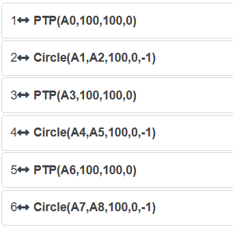

.. centered:: Figure 9.27-20 PTP-CIRCLE Blending via Configuration Switch

LIN-PTP Blending
***************************************

Using Lua Instruction Mode
""""""""""""""""""""""""""""""""""""""""""

**Step 1**: Select "A0" to "A5" for LIN-PTP blending.

**Step 2**: Insert "Linear" instruction, set "Acceleration Smooth Mode", "Transition Radius" and "Transition Mode".

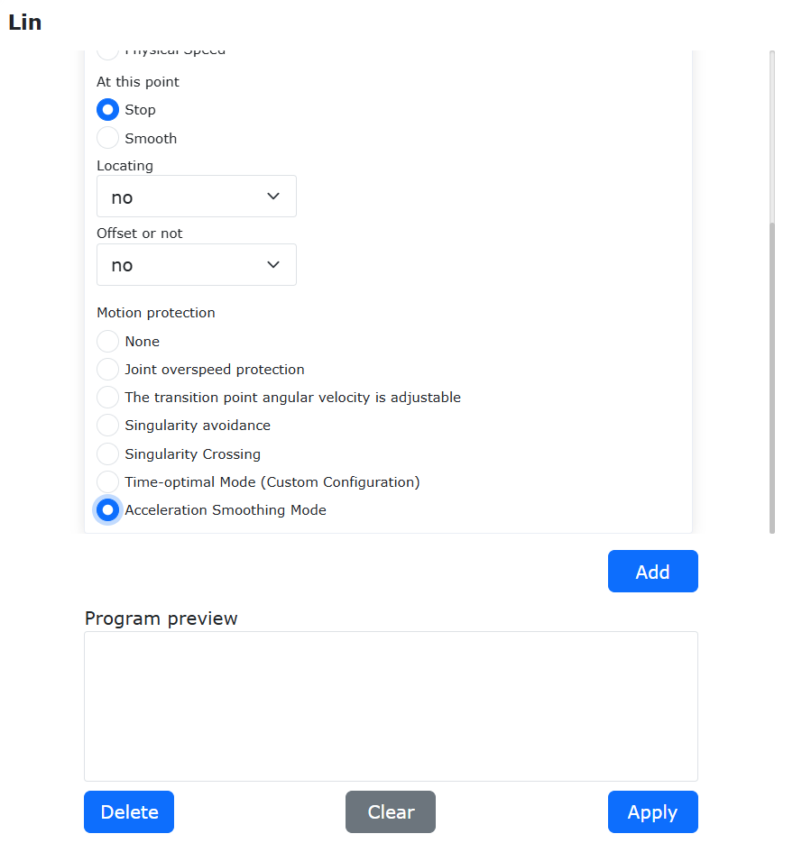

.. centered:: Figure 9.27-21 Blending Settings for Accelerated Smooth LIN

**Step 3**: Add LIN and PTP instructions, run within AccSmoothStart/End.

.. image:: coding/403.png
   :width: 4in
   :align: center

.. centered:: Figure 9.27-22 Typical LIN-PTP Blending in Lua Mode

Using Motion Configuration Switch Mode
"""""""""""""""""""""""""""""""""""""""""""""""""""""""

**Step 1**: Enable acceleration smooth mode in settings.

.. centered:: Figure 9.27-23 Acceleration Smooth Mode Switch Setup

**Step 2**: Select "A0" to "A5" as teaching points.

**Step 3**: Configure LIN instruction with transition parameters, no motion protection.

.. centered:: Figure 9.27-24 Blending Settings for Conventional LIN

**Step 4**: Generate program for all-instruction optimized velocity.

.. image:: coding/405.png
   :width: 4in
   :align: center

.. centered:: Figure 9.27-25 LIN-PTP Blending via Configuration Switch

LIN-LIN Blending
***************************************

Using Lua Instruction Mode
""""""""""""""""""""""""""""""""""""""""""

**Step 1**: Select "A0" to "A5" for LIN-LIN blending.

**Step 2**: Set up LIN instruction with acceleration smooth mode and transition parameters.

.. centered:: Figure 9.27-26 Blending Settings for Accelerated Smooth LIN

**Step 3**: Add multiple LIN instructions, run between AccSmoothStart/End.

.. image:: coding/416.png
   :width: 4in
   :align: center

.. centered:: Figure 9.27-27 Typical LIN-LIN Blending in Lua Mode

Using Motion Configuration Switch Mode
"""""""""""""""""""""""""""""""""""""""""""""""""""""""

**Step 1**: Enable acceleration smooth mode switch.

.. centered:: Figure 9.27-28 Acceleration Smooth Mode Configuration

**Step 2**: Choose "A0" to "A5" as teaching points.

**Step 3**: Configure LIN instruction with transition radius and mode.

.. centered:: Figure 9.27-29 Blending Settings for Conventional LIN

**Step 4**: Generate program for optimized velocity across all instructions.

.. image:: coding/417.png
   :width: 4in
   :align: center

.. centered:: Figure 9.27-30 LIN-LIN Blending via Configuration Switch

LIN-ARC Blending
***************************************

Using Lua Instruction Mode
""""""""""""""""""""""""""""""""""""""""""

**Step 1**: Select "A0" to "A8" for LIN-ARC blending.

**Step 2**: Configure LIN instruction with acceleration smooth mode and transition parameters.

.. centered:: Figure 9.27-31 Blending Settings for Accelerated Smooth LIN

**Step 3**: Add LIN and ARC instructions within AccSmoothStart/End.

.. image:: coding/406.png
   :width: 4in
   :align: center

.. centered:: Figure 9.27-32 Typical LIN-ARC Blending in Lua Mode

Using Motion Configuration Switch Mode
"""""""""""""""""""""""""""""""""""""""""""""""""""""""

**Step 1**: Enable acceleration smooth mode in settings.

.. centered:: Figure 9.27-33 Acceleration Smooth Mode Switch Setup

**Step 2**: Select "A0" to "A8" as teaching points.

**Step 3**: Set LIN instruction with transition radius and mode, no motion protection.

.. centered:: Figure 9.27-34 Blending Settings for Conventional LIN

**Step 4**: Generate program for all-instruction optimized velocity.

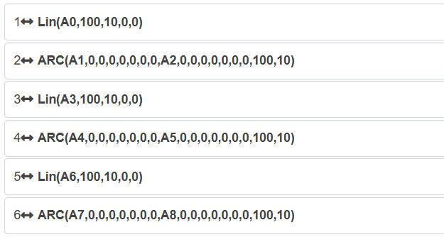

.. centered:: Figure 9.27-35 LIN-ARC Blending via Configuration Switch

LIN-CIRCLE Blending
***************************************

Using Lua Instruction Mode
""""""""""""""""""""""""""""""""""""""""""

**Step 1**: Select "A0" to "A8" for LIN-CIRCLE blending.

**Step 2**: Configure LIN instruction with acceleration smooth mode and transition parameters.

.. centered:: Figure 9.27-36 Blending Settings for Accelerated Smooth LIN

**Step 3**: Add LIN and CIRCLE instructions between AccSmoothStart/End.

.. image:: coding/408.png
   :width: 4in
   :align: center

.. centered:: Figure 9.27-37 Typical LIN-CIRCLE Blending in Lua Mode

Using Motion Configuration Switch Mode
"""""""""""""""""""""""""""""""""""""""""""""""""""""""

**Step 1**: Enable acceleration smooth mode switch.

.. centered:: Figure 9.27-38 Acceleration Smooth Mode Configuration

**Step 2**: Choose "A0" to "A8" as teaching points.

**Step 3**: Set LIN instruction with transition radius and mode, no motion protection.

.. centered:: Figure 9.27-39 Blending Settings for Conventional LIN

**Step 4**: Generate program for optimized velocity across all instructions.

.. image:: coding/409.png
   :width: 4in
   :align: center

.. centered:: Figure 9.27-40 LIN-CIRCLE Blending via Configuration Switch

ARC-PTP Blending
***************************************

Using Lua Instruction Mode
""""""""""""""""""""""""""""""""""""""""""

**Step 1**: Select "A0" to "A9" for ARC-PTP blending.

**Step 2**: Configure "Arc" instruction with acceleration smooth mode and "Smooth Transition".

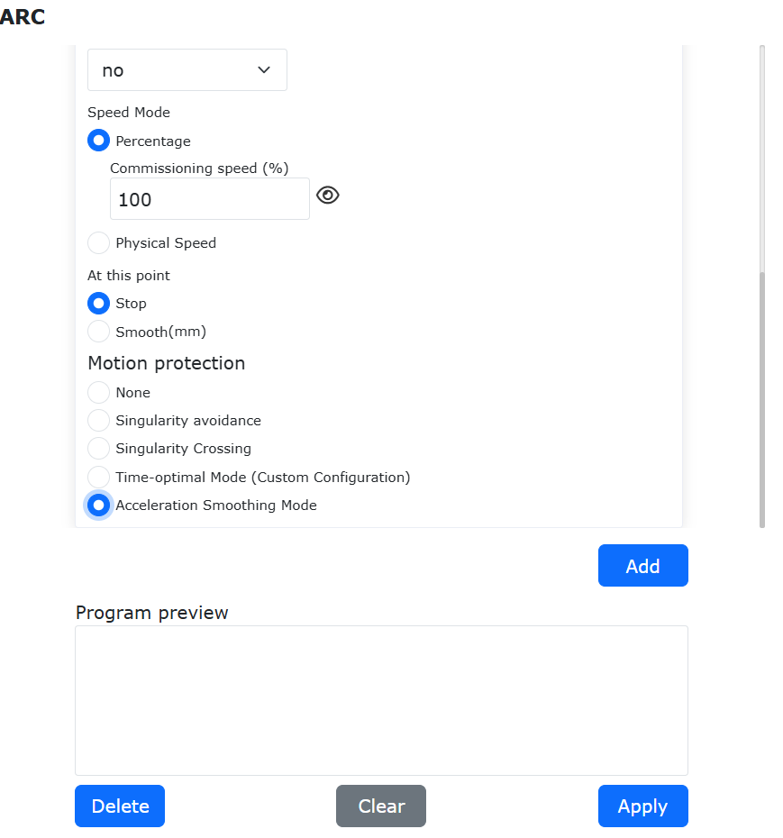

.. centered:: Figure 9.27-41 Blending Settings for Accelerated Smooth ARC

**Step 3**: Add ARC and PTP instructions within AccSmoothStart/End.

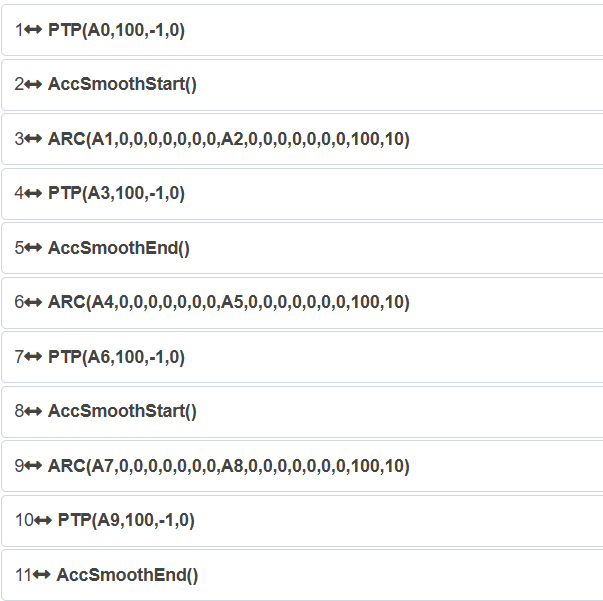

.. centered:: Figure 9.27-42 Typical ARC-PTP Blending in Lua Mode

Using Motion Configuration Switch Mode
"""""""""""""""""""""""""""""""""""""""""""""""""""""""

**Step 1**: Enable acceleration smooth mode in settings.

.. centered:: Figure 9.27-43 Acceleration Smooth Mode Switch Setup

**Step 2**: Select "A0" to "A9" as teaching points.

**Step 3**: Set Arc instruction with "Smooth Transition", no motion protection.

.. image:: coding/418.png
   :width: 6in
   :align: center

.. centered:: Figure 9.27-44 Blending Settings for Conventional ARC

**Step 4**: Generate program for all-instruction optimized velocity.

.. image:: coding/412.png
   :width: 4in
   :align: center

.. centered:: Figure 9.27-45 ARC-PTP Blending via Configuration Switch

ARC-LIN Blending
***************************************

Using Lua Instruction Mode
""""""""""""""""""""""""""""""""""""""""""

**Step 1**: Select "A0" to "A9" for ARC-LIN blending.

**Step 2**: Configure Arc instruction with acceleration smooth mode and "Smooth Transition".

.. centered:: Figure 9.27-46 Blending Settings for Accelerated Smooth ARC

**Step 3**: Add ARC and LIN instructions between AccSmoothStart/End.

.. image:: coding/413.png
   :width: 4in
   :align: center

.. centered:: Figure 9.27-47 Typical ARC-LIN Blending in Lua Mode

Using Motion Configuration Switch Mode
"""""""""""""""""""""""""""""""""""""""""""""""""""""""

**Step 1**: Enable acceleration smooth mode switch.

.. centered:: Figure 9.27-48 Acceleration Smooth Mode Configuration

**Step 2**: Choose "A0" to "A9" as teaching points.

**Step 3**: Set Arc instruction with "Smooth Transition", no motion protection.

.. image:: coding/419.png
   :width: 6in
   :align: center

.. centered:: Figure 9.27-49 Blending Settings for Conventional ARC

**Step 4**: Generate program for optimized velocity across all instructions.

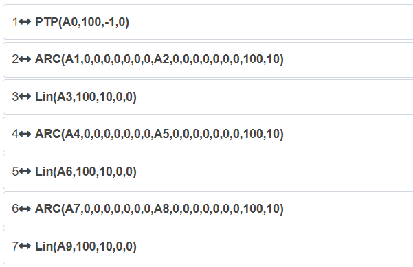

.. centered:: Figure 9.27-50 ARC-LIN Blending via Configuration Switch

ARC-ARC Blending
***************************************

Using Lua Instruction Mode
""""""""""""""""""""""""""""""""""""""""""

**Step 1**: Select "A0" to "A12" for ARC-ARC blending.

**Step 2**: Configure Arc instruction with acceleration smooth mode and "Smooth Transition".

.. centered:: Figure 9.27-51 Blending Settings for Accelerated Smooth ARC

**Step 3**: Add multiple Arc instructions within AccSmoothStart/End.

.. image:: coding/420.png
   :width: 4in
   :align: center

.. centered:: Figure 9.27-52 Typical ARC-ARC Blending in Lua Mode

Using Motion Configuration Switch Mode
"""""""""""""""""""""""""""""""""""""""""""""""""""""""

**Step 1**: Enable acceleration smooth mode in settings.

.. centered:: Figure 9.27-53 Acceleration Smooth Mode Switch Setup

**Step 2**: Select "A0" to "A12" as teaching points.

**Step 3**: Set Arc instruction with "Smooth Transition", no motion protection.

.. image:: coding/419.png
   :width: 6in
   :align: center

.. centered:: Figure 9.27-54 Blending Settings for Conventional ARC

**Step 4**: Generate program for all-instruction optimized velocity.

.. image:: coding/421.png
   :width: 4in
   :align: center

.. centered:: Figure 9.27-55 ARC-ARC Blending via Configuration Switch

ARC-CIRCLE Blending
***************************************

Using Lua Instruction Mode
""""""""""""""""""""""""""""""""""""""""""

**Step 1**: Select "A0" to "A12" for ARC-CIRCLE blending.

**Step 2**: Configure Arc instruction with acceleration smooth mode and "Smooth Transition".

.. centered:: Figure 9.27-56 Blending Settings for Accelerated Smooth ARC

**Step 3**: Add Arc and CIRCLE instructions between AccSmoothStart/End.

.. image:: coding/422.png
   :width: 4in
   :align: center

.. centered:: Figure 9.27-57 Typical ARC-CIRCLE Blending in Lua Mode

Using Motion Configuration Switch Mode
"""""""""""""""""""""""""""""""""""""""""""""""""""""""

**Step 1**: Enable acceleration smooth mode switch.

.. centered:: Figure 9.27-58 Acceleration Smooth Mode Configuration

**Step 2**: Choose "A0" to "A12" as teaching points.

**Step 3**: Set Arc instruction with "Smooth Transition", no motion protection.

.. image:: coding/419.png
   :width: 6in
   :align: center

.. centered:: Figure 9.27-59 Blending Settings for Conventional ARC

**Step 4**: Generate program for optimized velocity across all instructions.

.. image:: coding/423.png
   :width: 4in
   :align: center

.. centered:: Figure 9.27-60 ARC-CIRCLE Blending via Configuration Switch

CIRCLE-PTP Blending
***************************************

Using Lua Instruction Mode
""""""""""""""""""""""""""""""""""""""""""

**Step 1**: Select "A0" to "A9" for CIRCLE-PTP blending.

**Step 2**: Configure "Full Circle" instruction with acceleration smooth mode and "Smooth Transition".

.. image:: coding/424.png
   :width: 6in
   :align: center

.. centered:: Figure 9.27-61 Blending Settings for Accelerated Smooth CIRCLE

**Step 3**: Add CIRCLE and PTP instructions within AccSmoothStart/End.

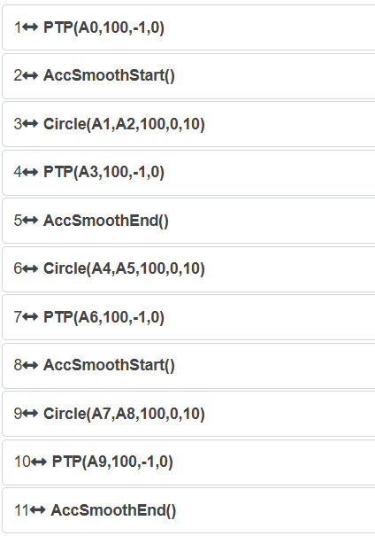

.. centered:: Figure 9.27-62 Typical CIRCLE-PTP Blending in Lua Mode

Using Motion Configuration Switch Mode
"""""""""""""""""""""""""""""""""""""""""""""""""""""""

**Step 1**: Enable acceleration smooth mode in settings.

.. centered:: Figure 9.27-63 Acceleration Smooth Mode Switch Setup

**Step 2**: Select "A0" to "A9" as teaching points.

**Step 3**: Set Full Circle instruction with "Smooth Transition", no motion protection.

.. image:: coding/426.png
   :width: 6in
   :align: center

.. centered:: Figure 9.27-64 Blending Settings for Conventional CIRCLE

**Step 4**: Generate program for all-instruction optimized velocity.

.. image:: coding/427.png
   :width: 4in
   :align: center

.. centered:: Figure 9.27-65 CIRCLE-PTP Blending via Configuration Switch

CIRCLE-LIN Blending
***************************************

Using Lua Instruction Mode
""""""""""""""""""""""""""""""""""""""""""

**Step 1**: Select "A0" to "A12" for CIRCLE-LIN blending.

**Step 2**: Configure Full Circle instruction with acceleration smooth mode and "Smooth Transition".

.. image:: coding/424.png
   :width: 6in
   :align: center

.. centered:: Figure 9.27-66 Blending Settings for Accelerated Smooth CIRCLE

**Step 3**: Add CIRCLE and LIN instructions between AccSmoothStart/End.

.. image:: coding/428.png
   :width: 4in
   :align: center

.. centered:: Figure 9.27-67 Typical CIRCLE-LIN Blending in Lua Mode

Using Motion Configuration Switch Mode
"""""""""""""""""""""""""""""""""""""""""""""""""""""""

**Step 1**: Enable acceleration smooth mode switch.

.. centered:: Figure 9.27-68 Acceleration Smooth Mode Configuration

**Step 2**: Choose "A0" to "A12" as teaching points.

**Step 3**: Set Full Circle instruction with "Smooth Transition", no motion protection.

.. image:: coding/426.png
   :width: 6in
   :align: center

.. centered:: Figure 9.27-69 Blending Settings for Conventional CIRCLE

**Step 4**: Generate program for optimized velocity across all instructions.

.. image:: coding/429.png
   :width: 4in
   :align: center

.. centered:: Figure 9.27-70 CIRCLE-LIN Blending via Configuration Switch

CIRCLE-ARC Blending
***************************************

Using Lua Instruction Mode
""""""""""""""""""""""""""""""""""""""""""

**Step 1**: Select "A0" to "A12" for CIRCLE-ARC blending.

**Step 2**: Configure Full Circle instruction with acceleration smooth mode and "Smooth Transition".

.. image:: coding/424.png
   :width: 6in
   :align: center

.. centered:: Figure 9.27-71 Blending Settings for Accelerated Smooth CIRCLE

**Step 3**: Add CIRCLE and Arc instructions within AccSmoothStart/End.

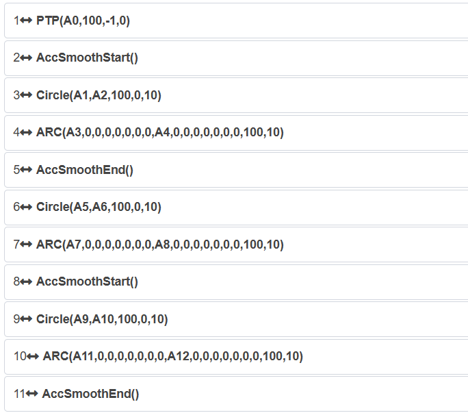

.. centered:: Figure 9.27-72 Typical CIRCLE-ARC Blending in Lua Mode

Using Motion Configuration Switch Mode
"""""""""""""""""""""""""""""""""""""""""""""""""""""""

**Step 1**: Enable acceleration smooth mode in settings.

.. centered:: Figure 9.27-73 Acceleration Smooth Mode Switch Setup

**Step 2**: Select "A0" to "A12" as teaching points.

**Step 3**: Set Full Circle instruction with "Smooth Transition", no motion protection.

.. image:: coding/426.png
   :width: 6in
   :align: center

.. centered:: Figure 9.27-74 Blending Settings for Conventional CIRCLE

**Step 4**: Generate program for all-instruction optimized velocity.

.. image:: coding/431.png
   :width: 4in
   :align: center

.. centered:: Figure 9.27-75 CIRCLE-ARC Blending via Configuration Switch

CIRCLE-CIRCLE Blending
***************************************

Using Lua Instruction Mode
""""""""""""""""""""""""""""""""""""""""""

**Step 1**: Select "A0" to "A12" for CIRCLE-CIRCLE blending.

**Step 2**: Configure Full Circle instruction with acceleration smooth mode and "Smooth Transition".

.. image:: coding/424.png
   :width: 6in
   :align: center

.. centered:: Figure 9.27-76 Blending Settings for Accelerated Smooth CIRCLE

**Step 3**: Add multiple CIRCLE instructions within AccSmoothStart/End.

.. image:: coding/432.png
   :width: 4in
   :align: center

.. centered:: Figure 9.27-77 Typical CIRCLE-CIRCLE Blending in Lua Mode

Using Motion Configuration Switch Mode
"""""""""""""""""""""""""""""""""""""""""""""""""""""""

**Step 1**: Enable acceleration smooth mode switch.

.. centered:: Figure 9.27-78 Acceleration Smooth Mode Configuration

**Step 2**: Choose "A0" to "A12" as teaching points.

**Step 3**: Set Full Circle instruction with "Smooth Transition", no motion protection.

.. image:: coding/426.png
   :width: 6in
   :align: center

.. centered:: Figure 9.27-79 Blending Settings for Conventional CIRCLE

**Step 4**: Generate program for optimized velocity across all instructions.

.. image:: coding/433.png
   :width: 4in
   :align: center

.. centered:: Figure 9.27-80 CIRCLE-CIRCLE Blending via Configuration Switch

Blending for Extended Axis Asynchronous Motion
*******************************************************

Using Lua Command Method
""""""""""""""""""""""""""""""""""""""""""

**Step1**: Select the taught points for extended axis asynchronous motion blending. This manual uses "A0" to "A5" as the taught point names.

**Step2**: Click "Teach Program" → "Program Editing", select the "Extended Axis" command under "Peripheral Commands", set "Motion Mode" to "Asynchronous", select the taught points and configure the debug speed. For motion protection, choose "Acceleration Smoothing Mode" and set the "Smooth Transition" parameter at the points requiring smoothing.

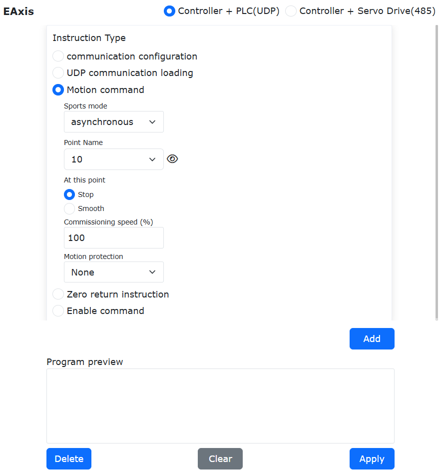

.. centered:: Figure 9.27-81 Extended Axis Asynchronous Motion Blending Command Settings

**Step3**: Add motion commands, generate and run the Lua program to achieve blending for extended axis asynchronous motion. This method only applies S-curve velocity planning and blending between `AccSmoothStart()` and `AccSmoothEnd()`, while using T-curve planning for other commands.

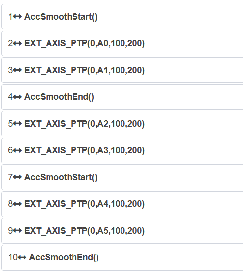

.. centered:: Figure 9.27-82 Typical Lua Program for Extended Axis Asynchronous Motion Blending

Using Motion Configuration Switch
"""""""""""""""""""""""""""""""""""""""""""""""""""""""

**Step1**: Click "Initial Setup" → "Safety" → "Motion Configuration" and enable the "Acceleration Smoothing Mode" switch.

.. centered:: Figure 9.27-83 Acceleration Smoothing Mode Configuration Switch

**Step2**: Select the taught points for extended axis asynchronous motion blending. This manual uses "A0" to "A5" as the taught point names.

**Step3**: Click "Teach Program" → "Program Editing", select the "Extended Axis" command under "Peripheral Commands", set "Motion Mode" to "Asynchronous", select the taught points and configure the debug speed. For motion protection, choose "None" and set the "Smooth Transition" parameter at the points requiring smoothing.

.. centered:: Figure 9.27-84 Standard Extended Axis Asynchronous Motion Blending Command Settings

**Step4**: Add multiple motion commands, generate and run the Lua program to achieve blending for extended axis asynchronous motion. The typical program is the same as standard extended axis motion programs. This method applies S-curve velocity planning and blending to all motions.

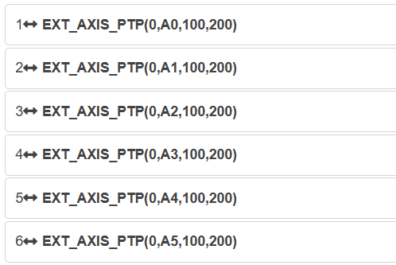

.. centered:: Figure 9.27-85 Typical Program for Extended Axis Asynchronous Motion Blending Using Configuration Switch

Blending for Extended Axis Synchronous Motion
***********************************************************

Using Lua Command Method
""""""""""""""""""""""""""""""""""""""""""

**Step1**: Select the taught points for extended axis synchronous motion blending. This manual uses "A0" to "A5" as the taught point names.

**Step2**: Click "Teach Program" → "Program Editing", select the "Extended Axis" command under "Peripheral Commands", set "Motion Mode" to "Synchronous", select the taught points and configure the debug speed. For motion protection, choose "Acceleration Smoothing Mode" and set the "Smooth Transition" parameter at the points requiring smoothing.

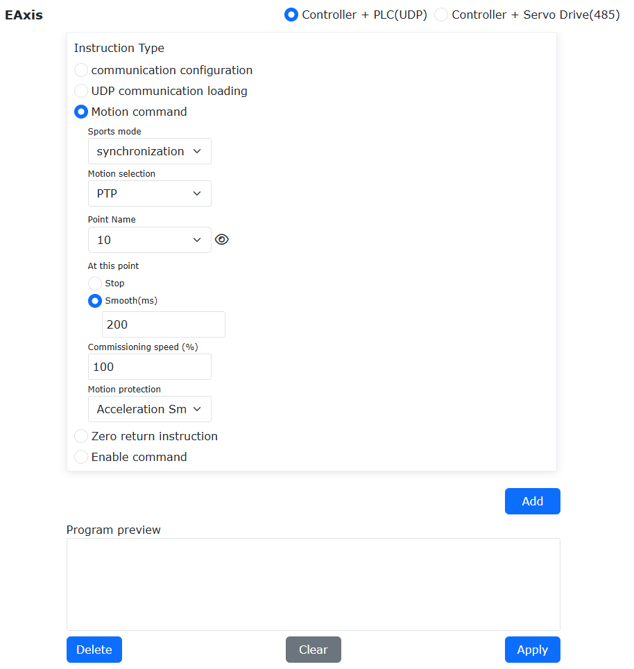

.. centered:: Figure 9.27-86 Extended Axis Synchronous Motion Blending Command Settings

**Step3**: Add motion commands, generate and run the Lua program to achieve blending for extended axis synchronous motion. This method only applies S-curve velocity planning and blending between `AccSmoothStart()` and `AccSmoothEnd()`, while using T-curve planning for other commands.

.. image:: coding/440.png
   :width: 4in
   :align: center

.. centered:: Figure 9.27-87 Typical Lua Program for Extended Axis Synchronous Motion Blending

Using Motion Configuration Switch
"""""""""""""""""""""""""""""""""""""""""""""""""""""""

**Step1**: Click "Initial Setup" → "Safety" → "Motion Configuration" and enable the "Acceleration Smoothing Mode" switch.

.. centered:: Figure 9.27-88 Acceleration Smoothing Mode Configuration Switch

**Step2**: Select the taught points for extended axis synchronous motion blending. This manual uses "A0" to "A5" as the taught point names.

**Step3**: Click "Teach Program" → "Program Editing", select the "Extended Axis" command under "Peripheral Commands", set "Motion Mode" to "Synchronous", select the taught points and configure the debug speed. For motion protection, choose "None" and set the "Smooth Transition" parameter at the points requiring smoothing.

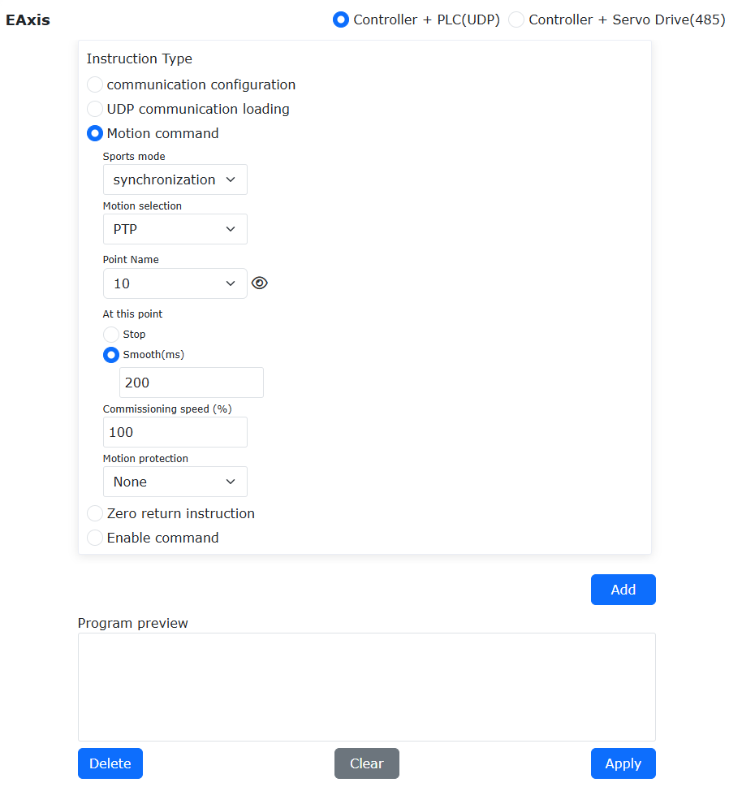

.. centered:: Figure 9.27-89 Standard Extended Axis Synchronous Motion Blending Command Settings

**Step4**: Add multiple motion commands, generate and run the Lua program to achieve blending for extended axis synchronous motion. The typical program is the same as standard extended axis motion programs. This method applies S-curve velocity planning and blending to all motions.

.. image:: coding/442.png
   :width: 4in
   :align: center

.. centered:: Figure 9.27-90 Typical Program for Extended Axis Synchronous Motion Blending Using Configuration Switch

Swing Tilt Angle Function
~~~~~~~~~~~~~~~~~~~~~~~~~~~~~~~~~~~~~~~~~~~~~~~~~~~~~~~

Overview
++++++++++++++

The robot swing tilt angle function allows the robot's end tool to customize the swing angle around the Rx direction of the swing coordinate system during swinging motion, reducing the difference in contact length between the fillet weld and the connected materials on both sides in operations such as lap welding.

Operation Procedure
++++++++++++++++++++++++++++

On the robot’s web control interface, click "Teaching Program" -> "Program Editing" to enter the "Motion Command" interface, as shown below.

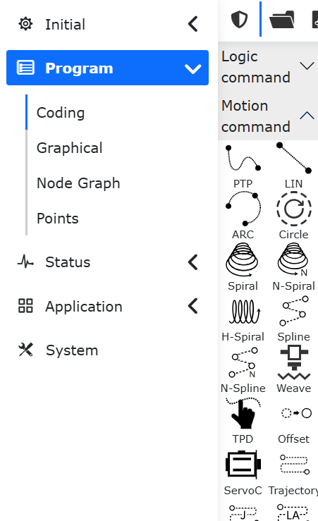

.. centered:: Figure 9.28-1 Motion Command Interface

In the "Motion Command" interface, click "Weave" to enter the "Weave" command editing interface.

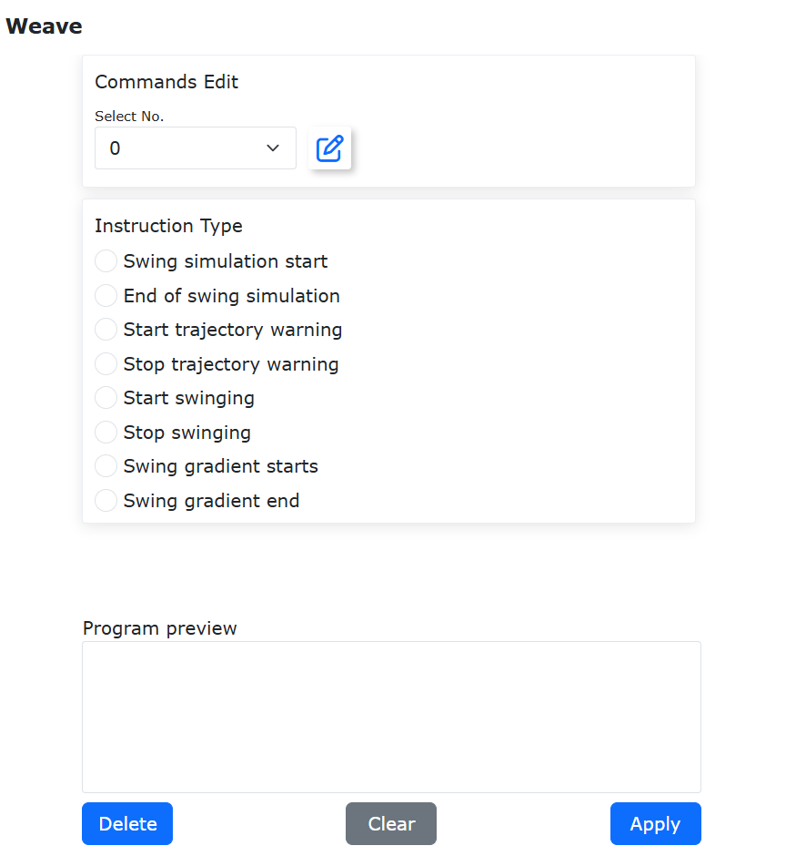

.. centered:: Figure 9.28-2 Weave Command Editing Interface

In the "Weave" command editing interface, click the "Selection Number" dropdown to choose different swing parameter configurations. Click the button next to the dropdown to modify the swing parameters under the selected number.

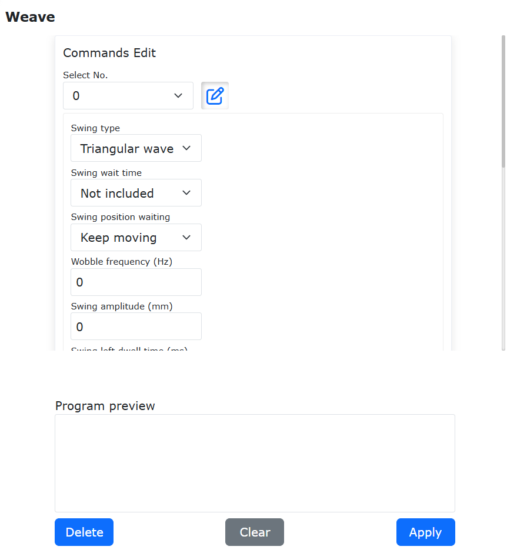

.. centered:: Figure 9.28-3 Swing Parameter Configuration

In the swing parameter configuration, enter a custom rotation angle around the Rx direction of the swing coordinate system in the "Swing Direction Tilt Angle" field, then click "Configure" to complete the setup.

.. note:: Note: The "Swing Direction Tilt Angle" parameter is applicable to "Triangle Wave Swing," "Sine Wave Swing," "Circular Swing - Clockwise," and "Circular Swing - Counterclockwise" in the "Swing Type" parameter.

The following example demonstrates the swing tilt angle function using Lin motion:

**Step 1**: In the "Weave" command editing interface, select a pre-configured swing parameter set from the "Selection Number" dropdown. Under "Command Type," click "Start Weave," then click "Add" to enable the swing function.

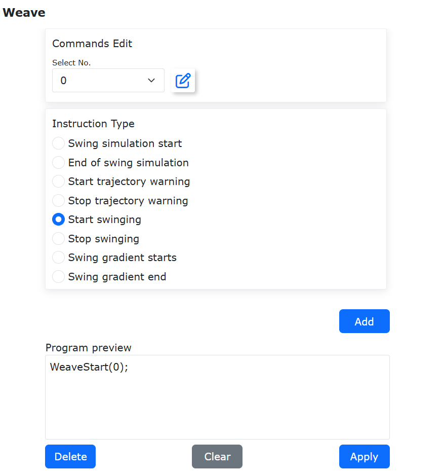

.. centered:: Figure 9.28-4 Adding Start Weave

**Step 2**: In the "Motion Command" interface, click "Linear" to create a Lin linear motion (basic motion command, not detailed here).

**Step 3**: In the "Weave" command editing interface, under "Command Type," click "Stop Weave," then click "Add" to disable the swing function.

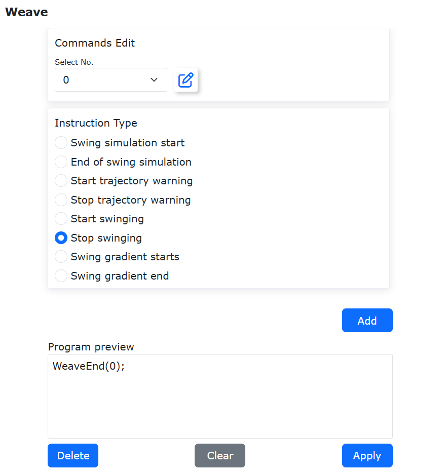

.. centered:: Figure 9.28-5 Adding Stop Weave

**Step 4**: After completing Steps 1–3, check the correctness of the settings in the "Program Preview" section of the "Weave" command editing interface.

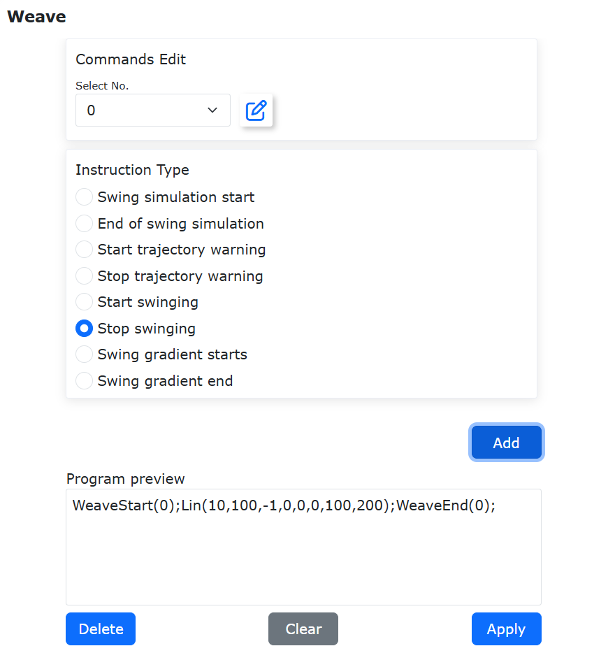

.. centered:: Figure 9.28-6 Swing Program Preview

**Step 5**: After verifying the program in the "Program Preview" section, click "Apply" to automatically generate executable LUA code.

.. image:: coding/326.png
   :width: 4in
   :align: center

.. centered:: Figure 9.28-7 Example LUA Swing Motion Program

Welding process parameter gradient function (current, voltage, travel speed along weld seam)
~~~~~~~~~~~~~~~~~~~~~~~~~~~~~~~~~~~~~~~~~~~~~~~~~~~~~~~~~~~~~~~~~~~~~~~~~~~~~~~~~~~~~~~~~~~~~~~~~~~~~~~~~~~~~~~~~~~~~~~~~~~~~~~

Overview
++++++++++++++

The welding parameter gradual change function (current, voltage, and travel speed along the weld seam) supports customizing the variation range of process parameters during welding.

Current/Voltage Parameter Gradual Change Process
++++++++++++++++++++++++++++++++++++++++++++++++++++++++++++

Current Parameter Gradual Change
*****************************************

On the robot web control interface, navigate to "Teach Program" -> "Program Editing" to enter the "Welding Command" interface as shown below.
   
.. image:: coding/327.png
   :width: 3in
   :align: center

.. centered:: Figure 9.29-1 Welding Command Interface

In the "Welding Command" interface, click "Weld" to enter the "Weld" command configuration interface.
   
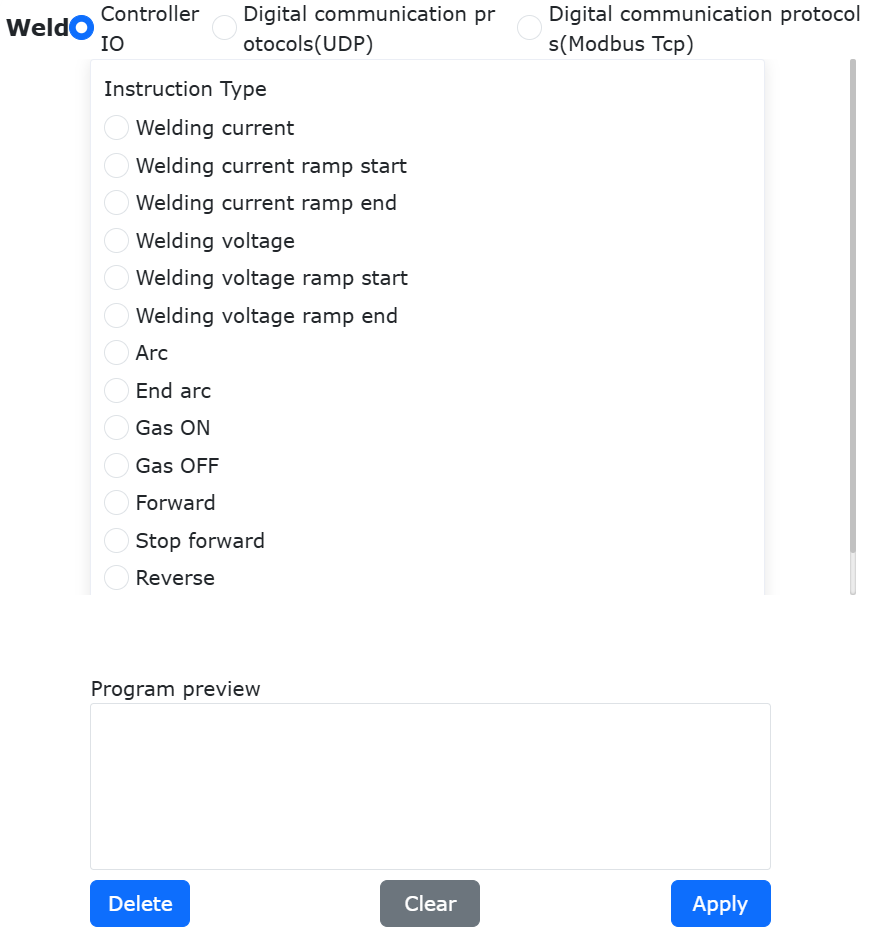

.. centered:: Figure 9.29-2 Weld Command Configuration Interface

In the "Command Type" section of the "Weld" command configuration interface, click "Welding Current Gradual Start" to configure parameters including "Start Current", "End Current", "Welding Current Control AO", and "Smoothing Option".

For example, configure "Start Current" as 260 A, "End Current" as 220 A, "Welding Current Control AO" as "Ctrl-AO0" control box analog channel, and "Smoothing Option" as "Break". Click "Add" to complete configuration, then verify parameters in the "Program Preview" section for any errors.
   
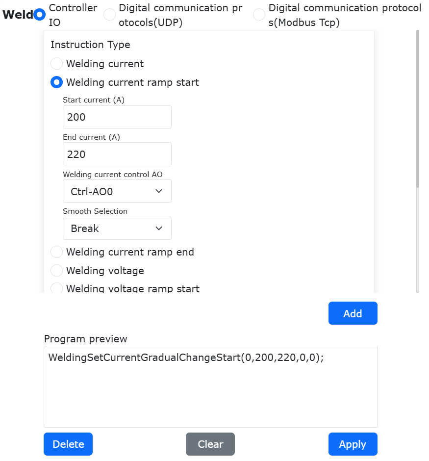

.. centered:: Figure 9.29-3 Welding Current Gradual Start Command Parameters

In the "Command Type" section of the "Weld" command configuration interface, click "Welding Current Gradual End". No parameters need to be configured. Click "Add" to complete, then verify in "Program Preview".
   
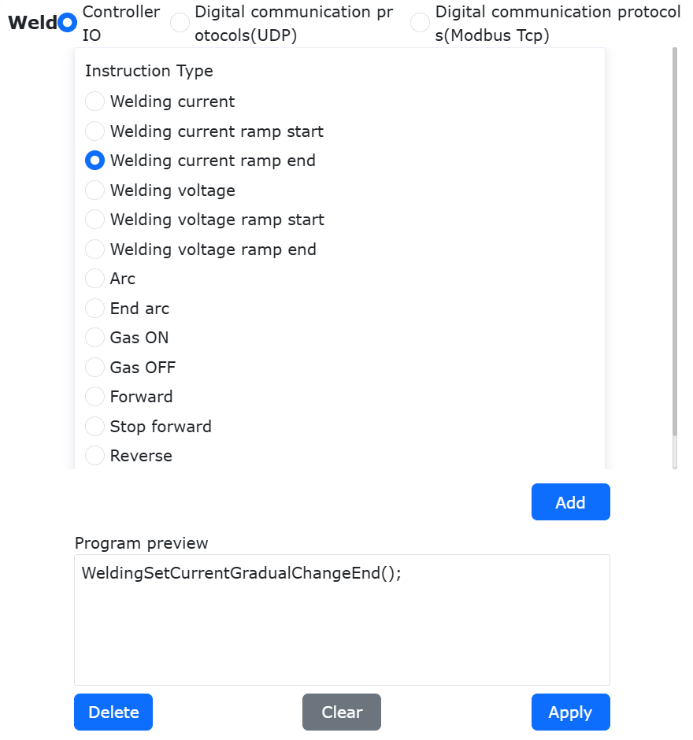

.. centered:: Figure 9.29-4 Welding Current Gradual End Command Parameters

After configuring both start and end commands, click "Apply" to automatically generate executable LUA program.

.. note:: During configuration, motion commands must be included. A typical LUA program combining arc tracking motion with current gradual change is shown below.
   
.. image:: coding/331.png
   :width: 4in
   :align: center

.. centered:: Figure 9.29-5 Typical Current Gradual Change Arc Tracking LUA Program

Voltage Parameter Gradual Change
**********************************

In the "Command Type" section of the "Weld" command configuration interface, click "Welding Voltage Gradual Start" to configure parameters including "Start Voltage", "End Voltage", "Welding Voltage Control AO", and "Smoothing Option".

For example, configure "Start Voltage" as 25 V, "End Voltage" as 22 V, "Welding Voltage Control AO" as "Ctrl-AO1" control box analog channel, and "Smoothing Option" as "Break". Click "Add" to complete configuration, then verify in "Program Preview".
   
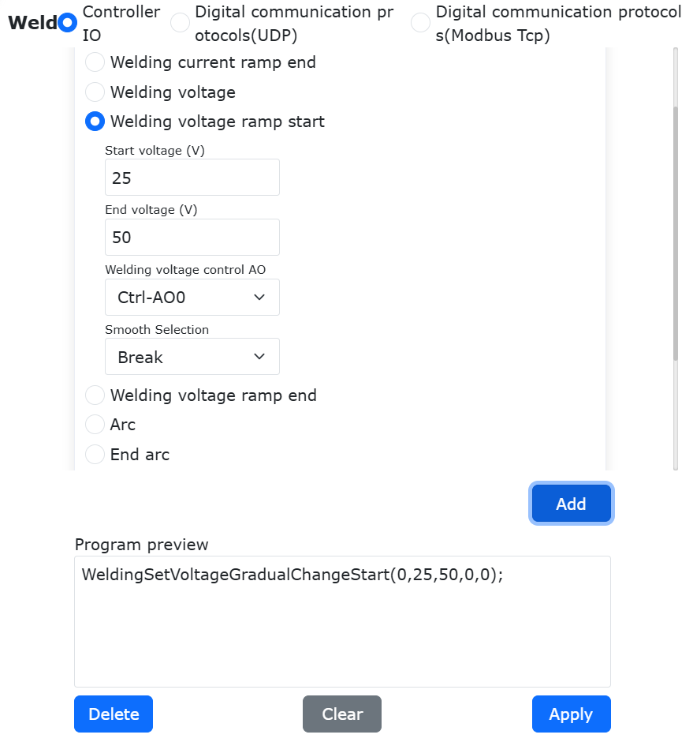

.. centered:: Figure 9.29-6 Welding Voltage Gradual Start Command Parameters

In the "Command Type" section, click "Welding Voltage Gradual End". No parameters need configuration. Click "Add" then verify.
   
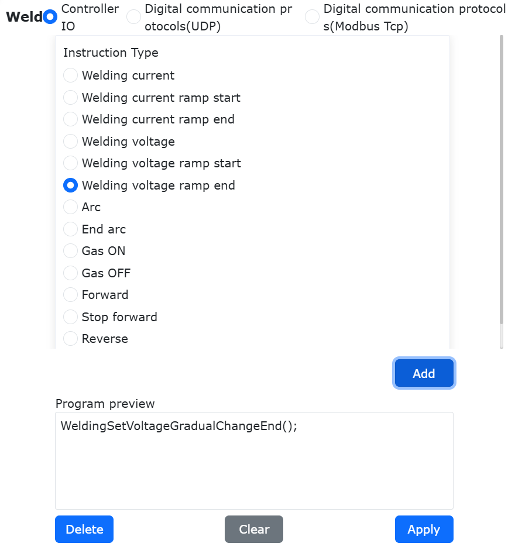

.. centered:: Figure 9.29-7 Welding Voltage Gradual End Command Parameters

After configuration, click "Apply" to generate LUA program.
   
.. image:: coding/334.png
   :width: 4in
   :align: center

.. centered:: Figure 9.29-8 Typical Voltage Gradual Change Arc Tracking LUA Program

Travel Speed Gradual Change Process
+++++++++++++++++++++++++++++++++++++++++++++++

Navigate to "Teach Program" -> "Program Editing" -> "Motion Command" interface.
   
.. image:: coding/335.png
   :width: 3in
   :align: center

.. centered:: Figure 9.29-9 Motion Command Interface

Click "Weave" to enter configuration interface.
   
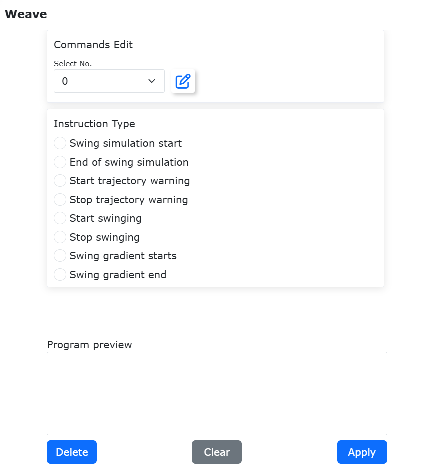

.. centered:: Figure 9.29-10 Weave Command Configuration Interface

In "Command Type", click "Weave Gradual Start" to configure "Start Speed", "End Speed", and "Gradual Mode".

For example, set "Gradual Mode" as "Weave+Travel Speed", "Start Speed" as 24 cm/min, and "End Speed" as 30 cm/min. Click "Add" then verify.
   
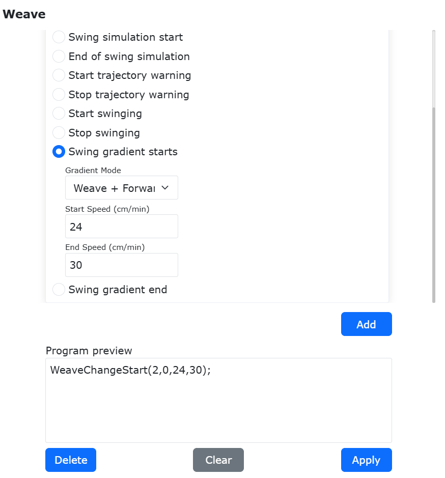

.. centered:: Figure 9.29-11 Weave+Travel Speed Gradual Start Parameters

Click "Weave Gradual End" (no parameters needed), then "Add" and verify.
   
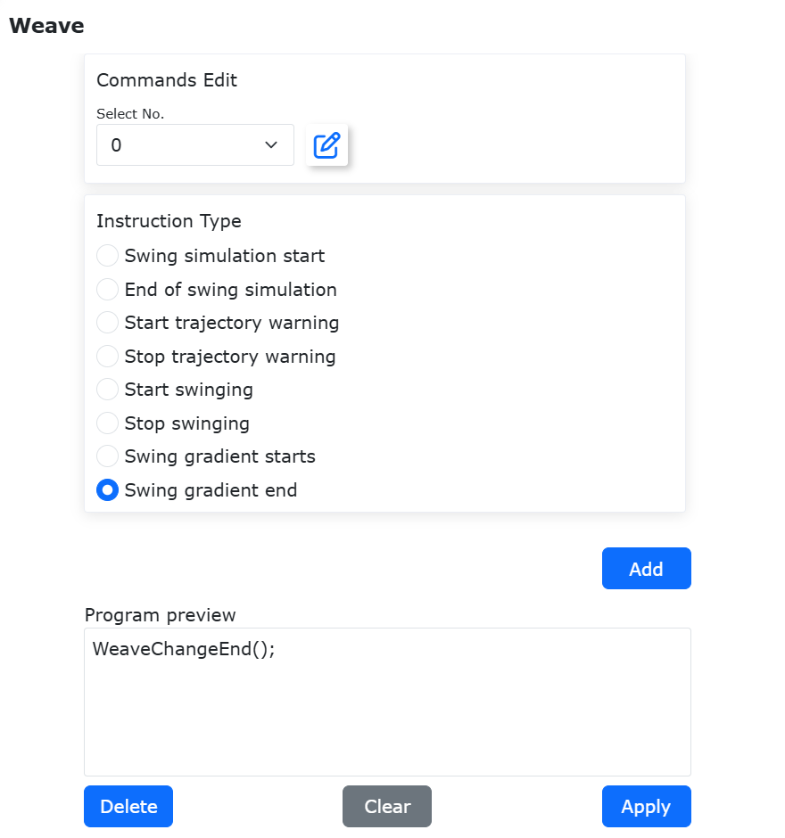

.. centered:: Figure 9.29-12 Weave+Travel Speed Gradual End Parameters

Click "Apply" to generate LUA program.

.. note:: Motion commands must be included. A sample program is shown below.
   
.. image:: coding/339.png
   :width: 4in
   :align: center

.. centered:: Figure 9.29-13 Typical Travel Speed Gradual Change Arc Tracking LUA Program

.. note:: Before configuring parameters in "Weld" or "Weave" interfaces, confirm the communication method between control box and welder (analog: "Controller I/O"; digital: "Digital Communication Protocol").

Robot ModbusRTU Communication
~~~~~~~~~~~~~~~~~~~~~~~~~~~~~~~~~~~~~~~~~~~~~~~~~~~~~~~

Overview
++++++++++++++

ModbusRTU is a commonly used communication protocol in industrial production. FAIR collaborative robots provide two communication methods: ModbusRTU Master and ModbusRTU Slave. The collaborative robot supports up to 8 ModbusRTU Masters communicating simultaneously with external devices, with each master supporting up to 128 registers. The robot's ModbusRTU Slave has 64 coils, 64 discrete inputs, 32 holding registers, and 32 input registers (holding registers and input registers support both signed and floating-point data types).

Additionally, some input register addresses of the robot's ModbusRTU Slave are dedicated to feedback information such as current joint positions and motion speeds. Some coil register addresses are dedicated to controlling robot operations like starting programs, stopping programs, and setting control box DOs. The robot's ModbusRTU Slave only supports connection with one master. Detailed usage methods are described below.

Robot ModbusRTU Master Operation Instructions
++++++++++++++++++++++++++++++++++++++++++++++++++++++++++++++++++++++

Before using the collaborative robot as a ModbusRTU Master to communicate with your device, please check the 485 hardware connection between your device and the robot. The steps to use the robot as a ModbusRTU Master are as follows: ① Add a master; ② Add registers; ③ Communication test; ④ Write user program; ⑤ Execute user program.

Adding a ModbusRTU Master
*******************************************
Open WebApp, click "Teach Simulation" and "Program Teaching" in sequence, and create a new user program "testModbusRTUMaster.lua".
   
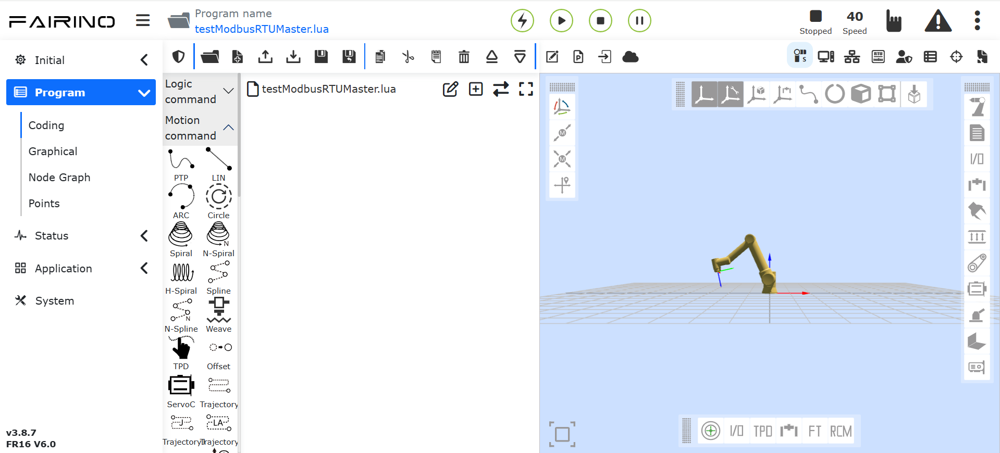

.. centered:: Figure 9.30-1 Creating a ModbusRTU Master User Program

Click the "ModbusRTU Settings" button to open the ModbusRTU configuration page.
   
.. image:: coding/341.png
   :width: 4in
   :align: center

.. centered:: Figure 9.30-2 Opening ModbusRTU Settings

Click "Master Settings" and then "Add Modbus Master" to complete adding a ModbusRTU Master.
   
.. image:: coding/342.png
   :width: 4in
   :align: center

.. centered:: Figure 9.30-3 Adding a "ModbusRTU Master"

Select "Baud Rate", "Data Bits", "Parity", and "Stop Bits" according to your slave device configuration. The meanings of these parameters are as follows:

**Baud Rate**: The baud rate used for ModbusRTU communication. Supported values: 9600, 14400, 19200, 38400, 56000, 67600, 115200, 128000. Default is 115200. Set to match the slave device.

**Data Bits**: Currently only supports 8 bits. Set to match the slave device.

**Parity**: Parity method. Supports None, Odd, Even. Default is None. Set to match the slave device.

**Stop Bits**: Supports 0.5, 1, 1.5, 2. Default is 1. Set to match the slave device.
   
.. image:: coding/343.png
   :width: 4in
   :align: center

.. centered:: Figure 9.30-4 Setting ModbusRTU Master Parameters

After correctly entering the above parameters, the robot ModbusRTU Master can communicate with the slave device. (If you have confirmed that the ModbusRTU Master parameters are correctly configured but communication fails, please check the following:

① Physical 485 connection between the robot and slave device; ② Check the slave device's communication configuration and test the communication link with a serial port debugging tool first. For example, configure the same ModbusRTU parameters on the PC, create a new register in the robot web interface, and perform a 0x03 read holding register operation to see if the serial port debugging tool receives data. As shown below, reading register address 0x1000 with 0x03 instruction, the PC can receive data normally, indicating correct communication configuration.)
   
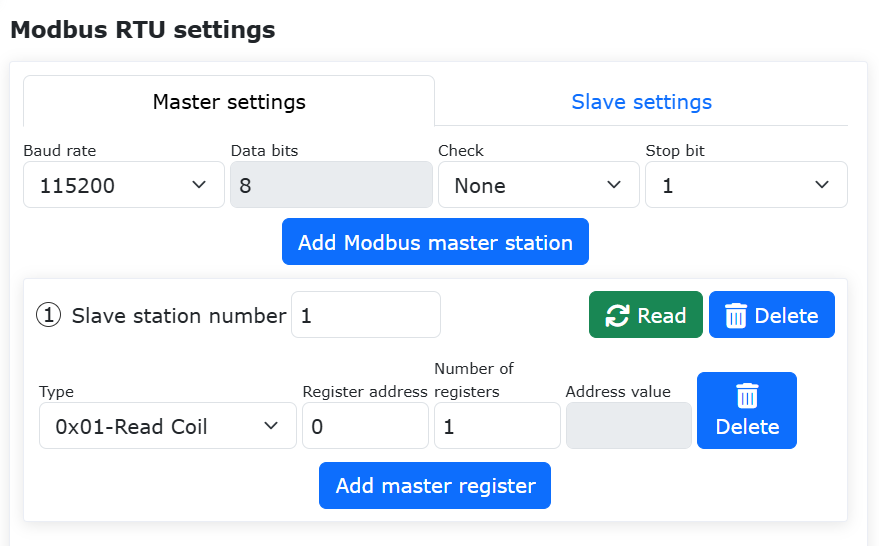

.. centered:: Figure 9.30-5 Verifying Modbus Connection Status

At this point, we have completed the creation of a robot ModbusRTU Master. If you click "Add Modbus Master" again, you can create another new ModbusRTU Master (Figure 2-6). The robot supports up to 8 masters communicating with external devices simultaneously. Double-click the "Delete" button in the upper right corner of the Modbus Master to delete it.
   
.. image:: coding/345.png
   :width: 4in
   :align: center

.. centered:: Figure 9.30-6 Adding Another ModbusRTU Master

Adding Registers to ModbusRTU Master
*******************************************

Click the "Add Master Register" button to add a register to the master.
   
.. image:: coding/346.png
   :width: 4in
   :align: center

.. centered:: Figure 9.30-7 Adding a ModbusRTU Master Register

Select the master register type, input address number, and name in sequence. The meanings of each parameter are as follows:

**Type**: Modbus function code. 0x01-Read Coils; 0x02-Read Discrete Inputs; 0x03-Read Holding Registers (signed -32768-32767); 0x03-Read Holding Registers (floating-point, 32-bit data length, occupies two registers, 4 bytes); 0x04-Read Input Registers (signed -32768-32767); 0x04-Read Input Registers (floating-point, 32-bit data length, occupies two registers, 4 bytes); 0x05-Write Single Coil; 0x06-Write Single Holding Register; 0x0F-Write Multiple Coils; 0x10-Write Multiple Holding Registers. Floating-point registers are displayed in big-endian format.

**Register Address**: The register address of the ModbusRTU Slave to read or write.

**Register Quantity**: The number of registers to operate when reading or writing multiple registers (0x05, 0x06 can only be 1). Supports up to 12 registers.

**Address Value**: Display value for reading, or write value (use English comma "," to separate multiple values).
   
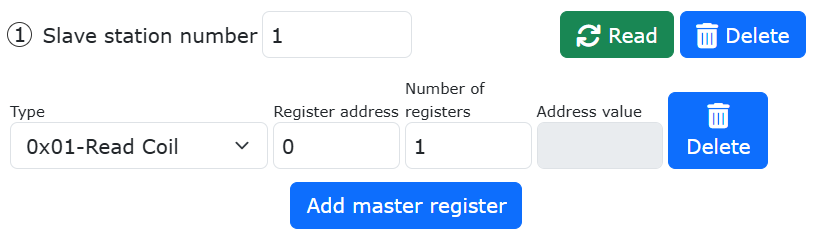

.. centered:: Figure 9.30-8 Setting ModbusRTU Master Register Parameters

Click the "Add Master Register" button again to add another master register. Double-click the "Delete" button on the right side of the register to delete it. The figure below shows the supported function code registers.
   
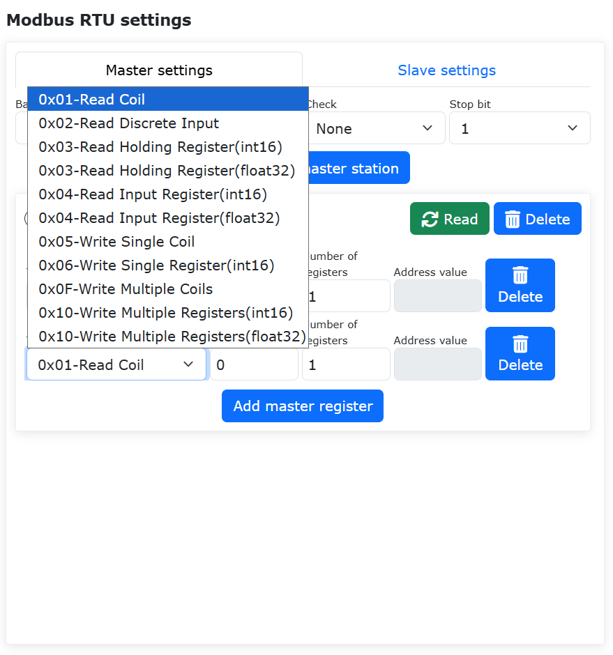

.. centered:: Figure 9.30-9 Adding Multiple Master Registers

ModbusRTU Master Communication Test
**********************************************************

The robot Modbus Master register has an "Address Value" field to display the current register value. Registers of types 0x01, 0x02, 0x03, and 0x04 are read-only, and their address values are displayed in gray non-editable fields. When the value of the corresponding address in the slave changes, the robot master can read the corresponding register address value by clicking the read button and display the current value synchronously. Function codes 0x05, 0x06, 0x0F, and 0x10 are write operations, and their address values are displayed in white editable fields. You can modify the register value on the robot Modbus Master settings page.
   
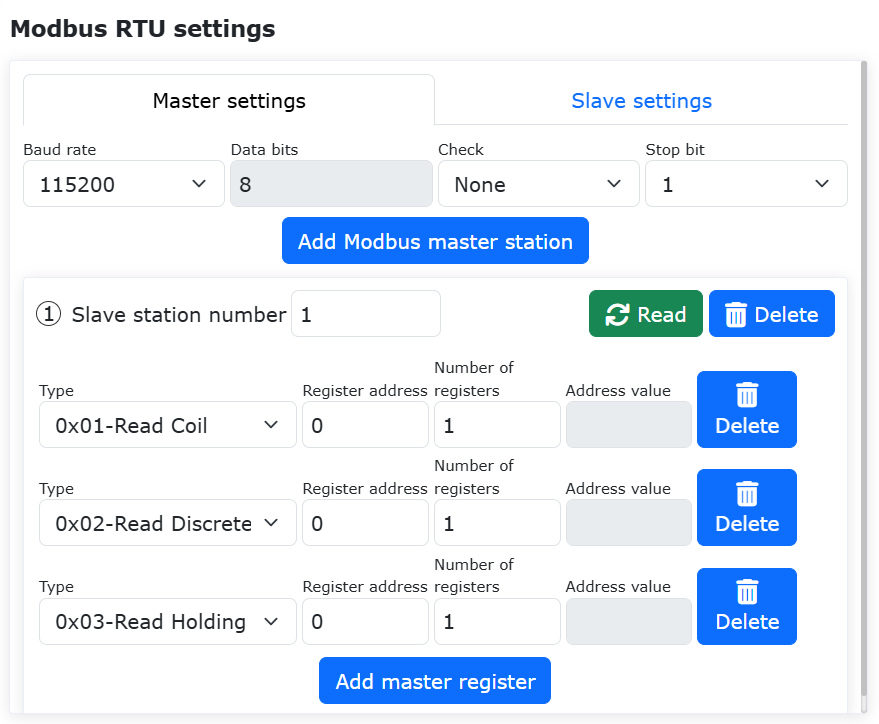

.. centered:: Figure 9.30-10 Modbus Master Address Value

Master Read Register Test
""""""""""""""""""""""""""""""""""
On the external ModbusRTU Slave device, continuously read 10 coils starting from address 0x4000, 12 discrete inputs starting from address 0x3000, 2 holding registers starting from address 0x2010 using int16, and 1 floating-point input register at address 0x1029. The corresponding register address values on the robot Modbus Master settings page will display accordingly. The sent data frames are shown below (since the register at address 0x1029 is set to floating-point type, it actually reads two 16-bit registers, 0x1029 and 0x102A, to store one floating-point number, but the read quantity is set to 1).
   
.. image:: coding/350.png
   :width: 4in
   :align: center

.. centered:: Figure 9.30-11 Modbus Master Displaying Read Register Values (Command Frame Screenshot)

Master Write Register Test
""""""""""""""""""""""""""""""""""

On the robot ModbusRTU Master settings page, write a single coil at address 0x1000 with a value of 1; write a single register at address 0x1001 with a value of 2001; write 5 coils starting at address 0x2000 with values 1,1,0,1,1; write 2 holding registers starting at address 0x2010 with int16 data type and values 3001, 3002; write a floating-point holding register at address 0x1029 (actually two 16-bit registers) with a value of 21.55; the corresponding register addresses on the Modbus Slave have been written with the specified values.
   
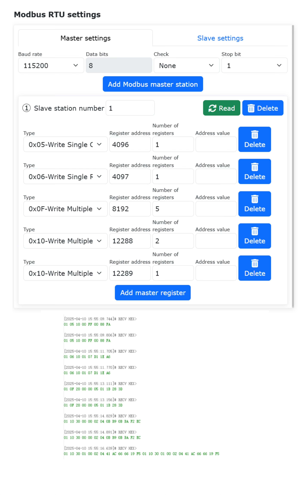

.. centered:: Figure 9.30-12 ModbusRTU Master Write Operation (Command Frame Screenshot)

Writing a ModbusRTU Master Program
************************************************

Click "All" and then "Communication Instructions" to open the communication instruction addition page.
   
.. image:: coding/352.png
   :width: 4in
   :align: center

.. centered:: Figure 9.30-13 Opening the Communication Instruction Addition Page

Click "Modbus".
   
.. image:: coding/353.png
   :width: 4in
   :align: center

.. centered:: Figure 9.30-14 Selecting Modbus

Click "Modbus_RTU", select "Master (Client)", to open the ModbusRTU Master instruction addition page.
   
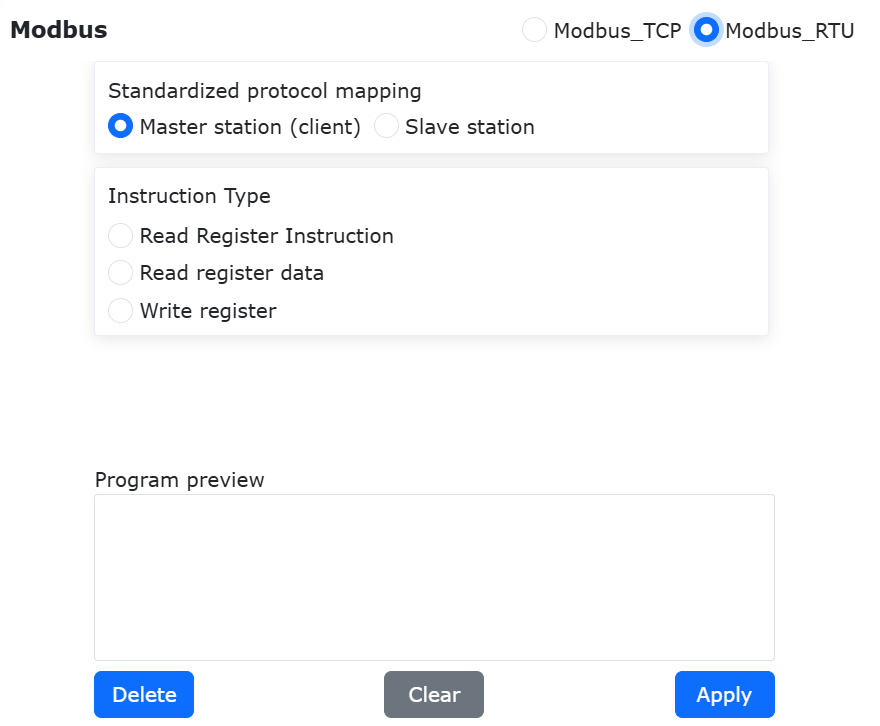

.. centered:: Figure 9.30-15 Selecting Modbus_RTU

Write Single Coil
""""""""""""""""""""""""""""

Select "Write Register", function code 0x05-Single Coil, register/coil address 0x1000, register value/coil quantity 1, byte array {1}, click "Add" button. Finally, scroll to the bottom of the page and click "Apply" button (Figure 2-16).
   
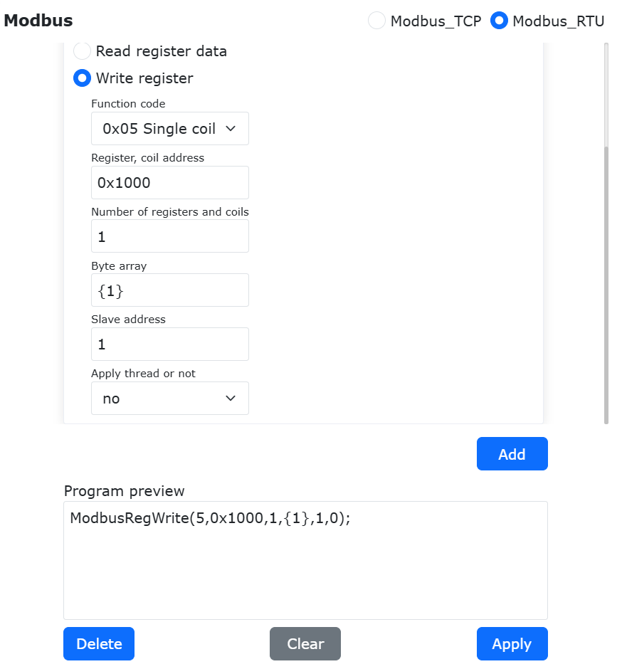

.. centered:: Figure 9.30-16 Writing a Single Coil

Now the robot program "testModbusRTUSlave.lua" has added a robot Modbus Master instruction to write a single digital output. Switch the robot to automatic mode and click the start button. The robot will write the value 1 to the coil register address 0x1000.
   
.. image:: coding/356.png
   :width: 6in
   :align: center

.. centered:: Figure 9.30-17 LUA Program for Writing a Single Coil

Write Multiple Coils
""""""""""""""""""""""""""""""""""""""""
Select "Write Register", function code 0x0F-Multiple Coils, register/coil address 0x1010, register value/coil quantity 3, byte array {1,0,1}, click "Add" button. Finally, scroll to the bottom of the page and click "Apply" button (Figure 2-18).
   
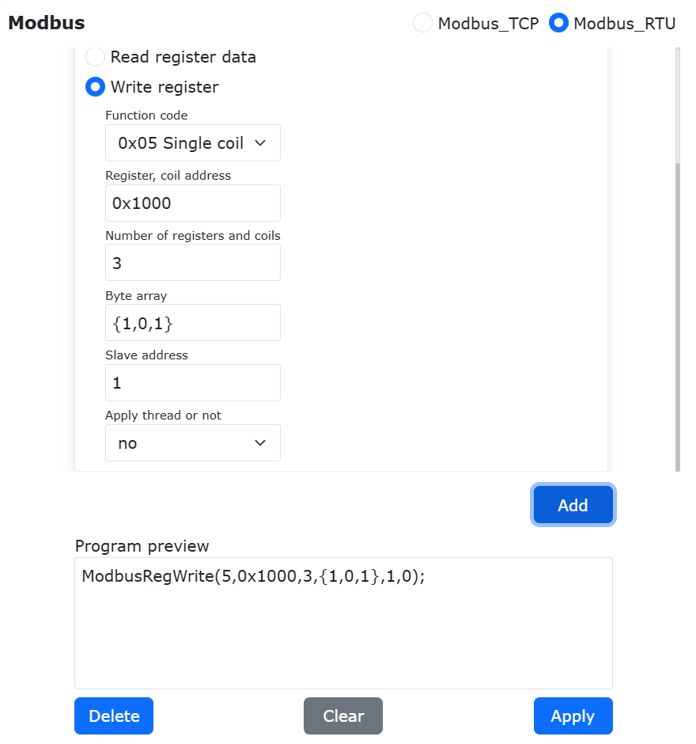

.. centered:: Figure 9.30-18 Writing Multiple Coils

Now the robot program "testModbusRTUSlave.lua" has added a robot Modbus Master instruction to write multiple digital outputs. Switch the robot to automatic mode and click the start button. The robot will write the values 1, 0, 1 to the coil registers starting at address 0x1000.
   
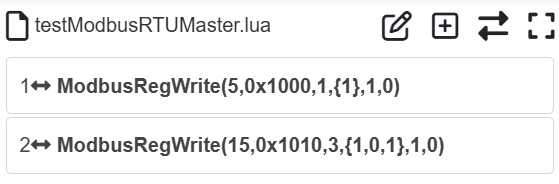

.. centered:: Figure 9.30-19 LUA Program for Writing Multiple Coils

Read Coils and Discrete Inputs
""""""""""""""""""""""""""""""

Select "Read Register Instruction", function code 0x01-Coils (select 0x02-Discrete Inputs if reading discrete inputs), register/coil address 0x2000, register/coil quantity 3, click "Add" button. Then select "Read Register Data", register/coil/discrete input quantity 3, click "Add" button. Finally, scroll to the bottom of the page and click "Apply" button (Figure 2-20).
   
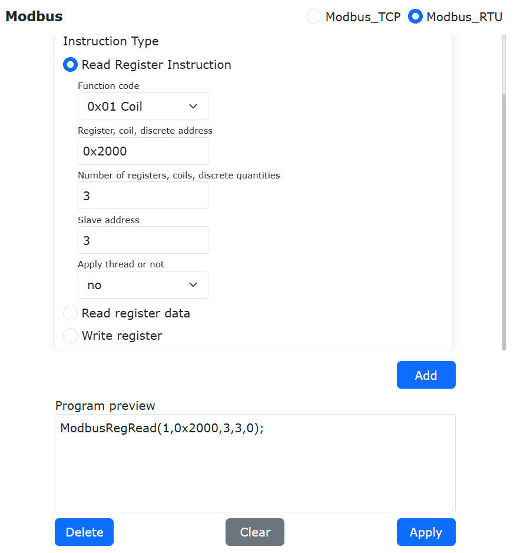
   
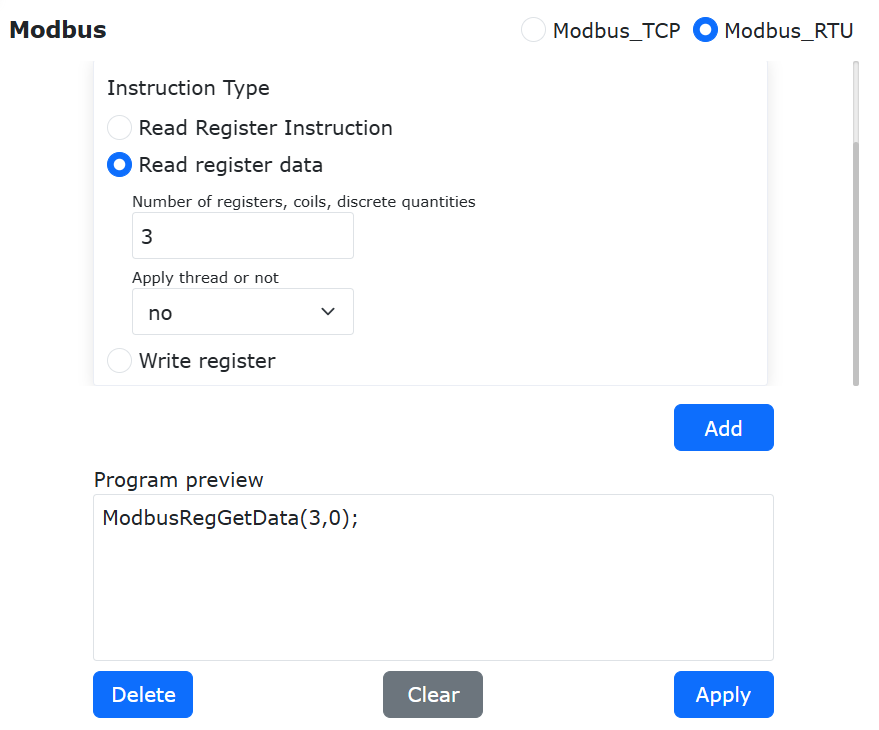

.. centered:: Figure 9.30-20 Reading Coils

Now the robot program "testModbusRTUSlave.lua" has added two robot Modbus Master instructions to read coils.
   
.. image:: coding/360.png
   :width: 6in
   :align: center

.. centered:: Figure 9.30-21 Program for Reading a Single Coil

Usually, after reading Modbus registers, the read values are stored in variables. Therefore, you need to define variables to store the read values. Click the "Switch Mode" button to switch the robot LUA program to editable mode. Before the "ModbusRegRead" instruction, add return value variables "value1", "value2", "value3". After executing the program, the read values will be stored in "value1", "value2", and "value3".
   
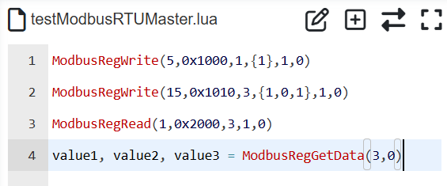

.. centered:: Figure 9.30-22 Storing Multiple Coil Values in Variables

Coil and discrete input type register values are only 0 or 1. In the robot program, you can perform different operations by judging different register values.

Read Holding Registers and Input Registers
""""""""""""""""""""""""""""""""""""""""""""""
Select "Read Register Instruction", function code 0x03-Holding Registers (select 0x04-Input Registers if reading input registers), register/coil address 0x4000, register/coil quantity 5, click "Add" button. Then select "Read Register Data", register/coil/discrete input quantity 5, click "Add" button. Finally, scroll to the bottom of the page and click "Apply" button (Figure 2-23).
   

   

.. centered:: Figure 9.30-23 Reading Holding Registers

Now the robot program "testModbusRTUSlave.lua" has added two robot Modbus Master instructions to read coils.
   
.. image:: coding/363.png
   :width: 4in
   :align: center

.. centered:: Figure 9.30-24 Program for Reading a Single Coil

Usually, after reading Modbus registers, the read values are stored in variables. Therefore, you need to define variables to store the read values. Click the "Switch Mode" button to switch the robot LUA program to editable mode. Before the "ModbusRegRead" instruction, add return value variables "value1", "value2", "value3", "value4", "value5". After executing the program, the read values will be stored in these variables.
   
.. image:: coding/364.png
   :width: 6in
   :align: center

.. centered:: Figure 9.30-25 Storing Multiple Holding Register Values in Variables

Robot ModbusRTU Slave Operation Instructions
+++++++++++++++++++++++++++++++++++++++++++++++++++

The robot ModbusRTU Slave provides four types of registers: general-purpose digital inputs (coils), general-purpose digital outputs (discrete inputs), general-purpose analog inputs (holding registers), and general-purpose analog outputs (input registers). The general-purpose digital inputs and analog inputs are mainly used for the robot to read data from external ModbusRTU Master devices to control robot operations. The general-purpose digital outputs and analog outputs are mainly used for the robot to send data signals to external ModbusRTU Master devices, which read the relevant register values to control their device operations.

In addition to the above general-purpose inputs and outputs, the robot also provides some "functional digital inputs (coils)" for external master devices to control robot operations such as starting programs and stopping programs. Some input registers are dedicated to displaying the current robot status information, including the robot's current Cartesian position and operation status (see Appendix 1: ModbusRTU Slave Address Mapping Table for specific definitions). The robot ModbusRTU Slave only supports connection with one master. The process of using the robot ModbusRTU Slave mainly includes: ① Parameter configuration; ② Communication test; ③ Program writing.

ModbusRTU Slave Communication Parameter Configuration
******************************************************

Open WebApp, click "Teach Simulation" and "Program Teaching" in sequence, and create a new user program "testModbusRTUSlave.lua".
   
.. image:: coding/365.png
   :width: 6in
   :align: center

.. centered:: Figure 9.30-26 Creating a ModbusRTU Slave User Program

Click the "ModbusRTU Settings" button to open the ModbusRTU configuration page.
   
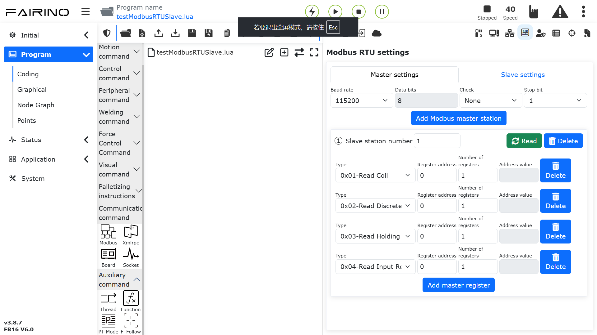

.. centered:: Figure 9.30-27 Opening ModbusRTU Settings

Click "Slave Settings" and enter the robot slave's baud rate, data bits, parity, stop bits, and slave number. "Baud Rate", "Data Bits", "Parity", and "Stop Bits" are the parameter configurations for the robot as a ModbusRTU Slave. "Slave Number" is the slave device number in the instructions sent by the external master.
   
.. image:: coding/367.png
   :width: 4in
   :align: center

.. centered:: Figure 9.30-28 ModbusRTU Slave Settings

ModbusRTU Slave Communication Test
****************************************

General-Purpose Digital Inputs (Coils)
""""""""""""""""""""""""""""""""""""""""""""""
The robot ModbusRTU Slave provides 64 coil registers with addresses 0x4000~0x403F (see Appendix 1: ModbusRTU Slave Address Mapping Table for specific definitions). The general-purpose registers of the robot ModbusRTU Slave can be aliased. Change the name of the robot slave coil register DI0 to "A Ready" and DI1 to "B Ready". According to the address mapping table, the Modbus coil addresses for "A Ready" and "B Ready" are 0x4000 and 0x4001, respectively. On the external ModbusRTU Master device, set the robot slave coil register addresses 0x4000 and 0x4001 to 1. The indicator lights for these two registers on the robot ModbusRTU Slave monitoring page will light up.
   
.. image:: coding/368.png
   :width: 4in
   :align: center

.. centered:: Figure 9.30-29 ModbusRTU Slave Coil Status Monitoring (Command Frame Screenshot)

General-Purpose Digital Outputs (Discrete Inputs)
""""""""""""""""""""""""""""""""""""""""""""""""""""""""""""

The robot ModbusRTU Slave provides 64 discrete input registers with addresses 0x3000-0x303F (see Appendix 1: ModbusRTU Slave Address Mapping Table for specific definitions). Similarly, the discrete input registers of the robot ModbusRTU Slave can also be aliased. Click "General-Purpose Digital Outputs (Discrete Inputs)" to change the name of the robot slave discrete input register DO0 to "A Start" and DO1 to "B Start". According to the address mapping table, the Modbus discrete input addresses for "A Start" and "B Start" are 0x3000 and 0x3001, respectively. Click the indicator light corresponding to "A Start". The light will turn on, and the value of the corresponding register address 0x3000 will change to 1. The external ModbusRTU Master device can read this register value.
   
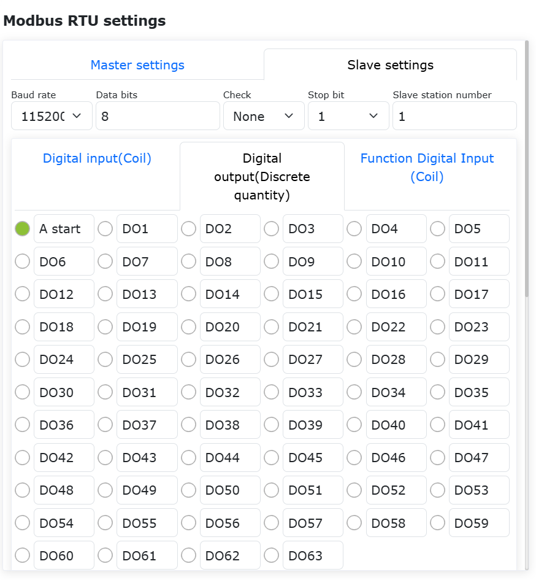

.. centered:: Figure 9.30-30 ModbusRTU Slave Discrete Input Control

Analog Inputs (Holding Registers)
""""""""""""""""""""""""""""""""""""""""
The robot provides three types of holding registers: unsigned, signed, and floating-point, totaling 32. The addresses for AI0~AI32 are 0x2000-0x202F (see Appendix 1: ModbusRTU Slave Address Mapping Table for specific definitions). The data range for signed registers is -32768~32767, and floating-point registers are displayed in big-endian format. Change the names of AI0 and AI1 to "Voltage" and "Current", respectively. From the ModbusRTU Slave address mapping table, the addresses of these two registers are 0x2000 and 0x2001, respectively. Therefore, when the connected master device modifies the values of holding register addresses 0x2000 and 0x2001, the "Voltage" and "Current" register address values on the robot ModbusRTU Slave monitoring page will update accordingly. The robot's analog inputs are mainly used for the robot to obtain numerical signals from external master devices.
   
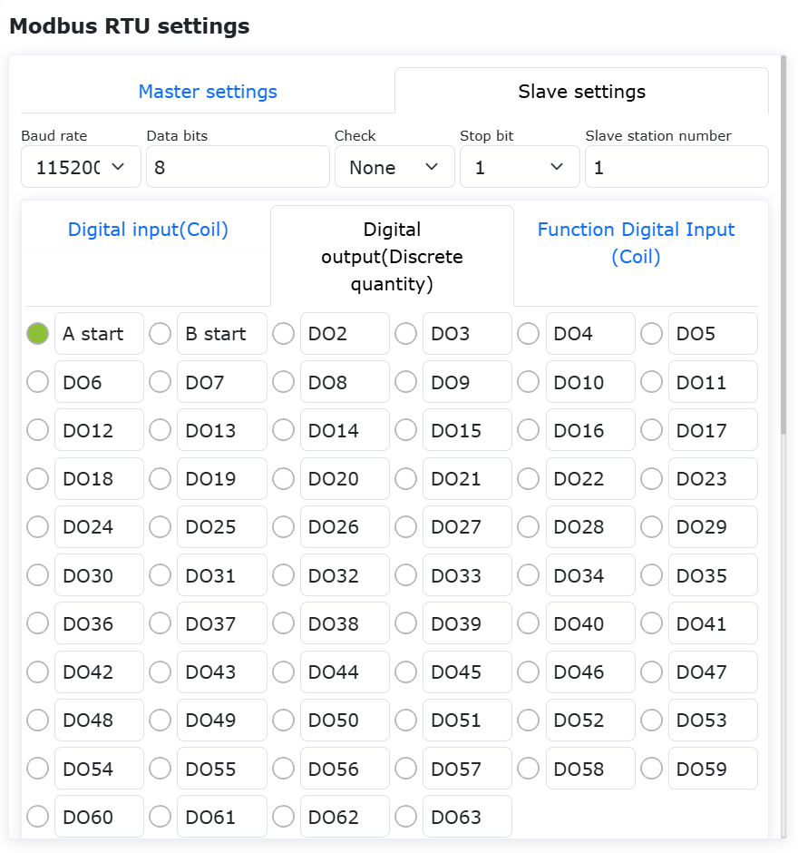

.. centered:: Figure 9.30-31 ModbusRTU Slave Analog Input Monitoring (Command Frame Screenshot)

Analog Outputs (Input Registers)
""""""""""""""""""""""""""""""""""""""""
The robot provides three types of input registers: unsigned, signed, and floating-point, totaling 64. The addresses for AO0~AO63 are 0x1000-0x100F, 0x104D-0x106C (see Appendix 1: ModbusRTU Slave Address Mapping Table for specific definitions). The data range for signed registers is -32768~32767, and floating-point registers are displayed in big-endian format. Change the names of AO0 and AO1 to "Target Position A" and "Target Position B", respectively, with input register values of 2000 and 1500. From the ModbusRTU Slave address mapping table, the addresses of these two registers are 0x1000 and 0x1001, respectively. Therefore, when the connected master device reads the input register addresses 0x1000 and 0x1001, it will obtain the set values. The robot slave analog outputs are mainly used for the robot to send numerical signals to external master devices.
   
.. image:: coding/371.png
   :width: 4in
   :align: center

.. centered:: Figure 9.30-32 Modbus Slave Modifying Analog Inputs

Writing a ModbusRTU Slave Program
**************************************************
Click "All" and then "Communication Instructions" to open the communication instruction addition page.
   
.. image:: coding/372.png
   :width: 4in
   :align: center

.. centered:: Figure 9.30-33 Opening the Communication Instruction Addition Page

Click "Modbus".
   
.. image:: coding/373.png
   :width: 6in
   :align: center

.. centered:: Figure 9.30-34 Selecting Modbus

Click "Modbus_RTU", select "Slave", to open the ModbusRTU Slave instruction addition page (Figure 60).
   
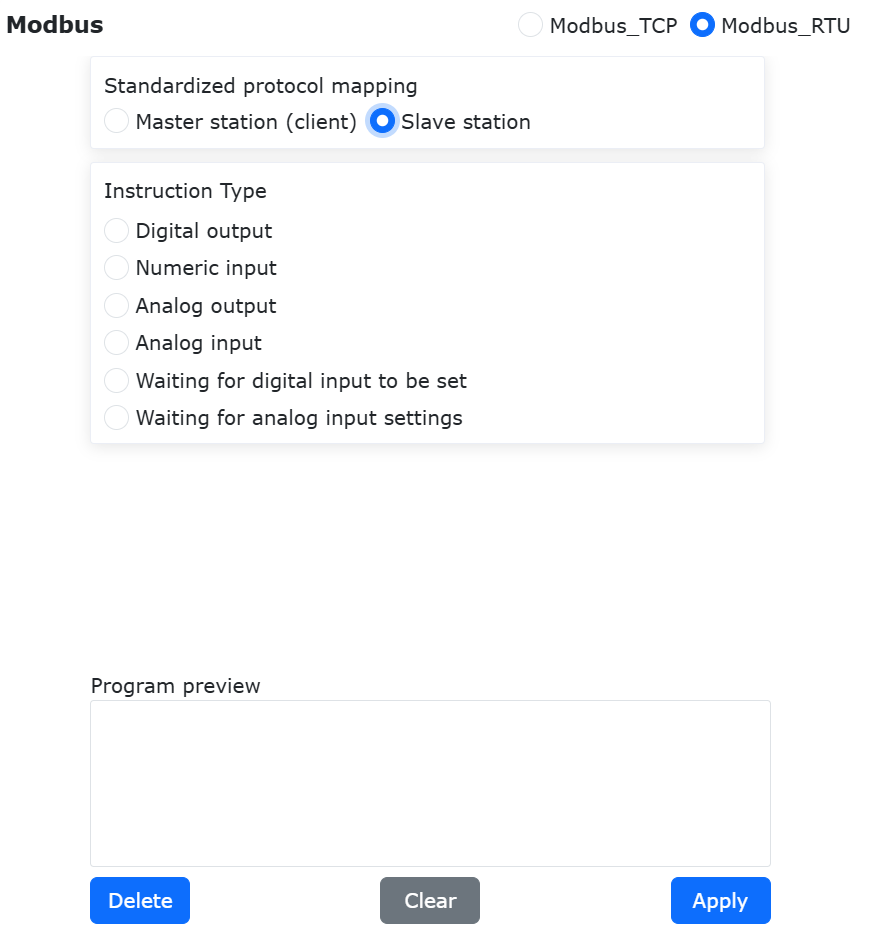

.. centered:: Figure 9.30-35 Selecting Modbus_RTU, Slave

Write Single Digital Output DO (Discrete Input)
""""""""""""""""""""""""""""""""""""""""""""""""
Select DO name as "A Start", register quantity as 1, register value as 0, click "Write Single Digital Output". Finally, scroll to the bottom of the page and click "Apply" button.
   
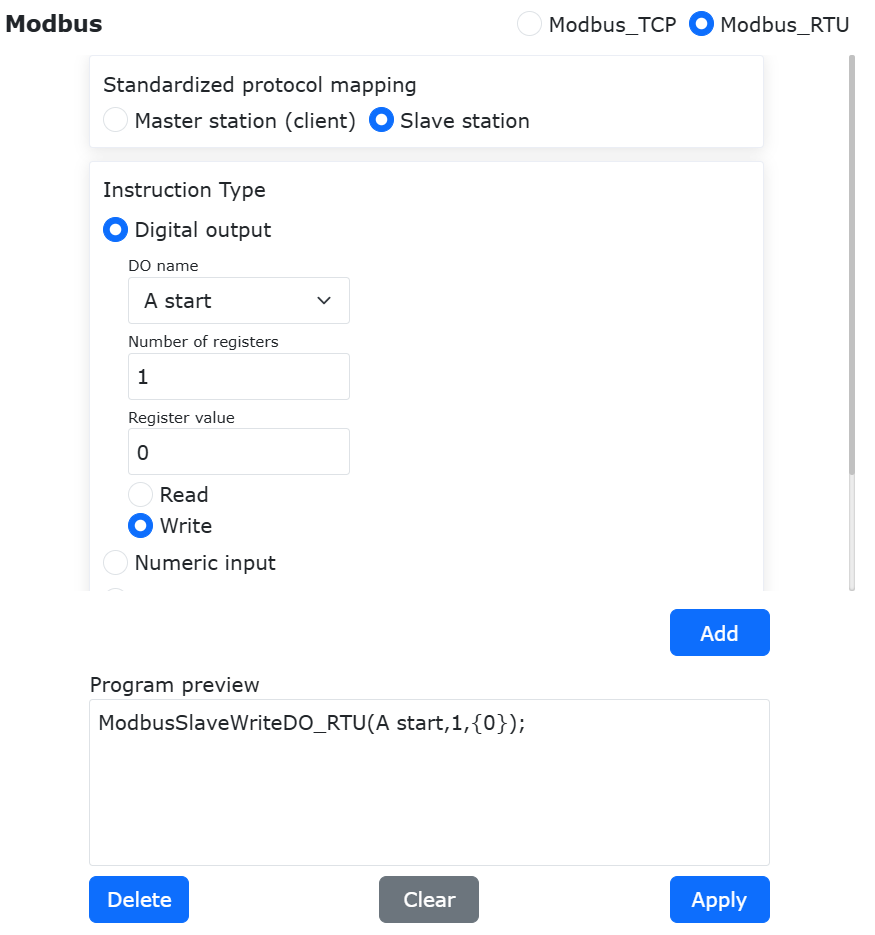

.. centered:: Figure 9.30-36 Adding a Write Single Digital Output Instruction, Applying the Write Single Digital Output Instruction

Now the robot program "testModbusRTUSlave.lua" has added a robot Modbus Slave instruction to write a single digital output. Switch the robot to automatic mode and click the start button. The robot will write the value 0 to the digital output named "A Start".
   
.. image:: coding/376.png
   :width: 6in
   :align: center

.. centered:: Figure 9.30-37 LUA Program for Writing a Single Digital Output

Write Multiple Digital Outputs DO (Discrete Inputs)
""""""""""""""""""""""""""""""""""""""""""""""""""""""""
Open the ModbusRTU Slave instruction addition page, find "Digital Output Settings", select DO name as "A Start", register quantity as 5, register value as 1,0,1,0,1. The number of register values must match the set register quantity, and multiple register values should be separated by English commas. Click "Write Digital Output". Finally, scroll to the bottom of the page and click "Apply" button.
   
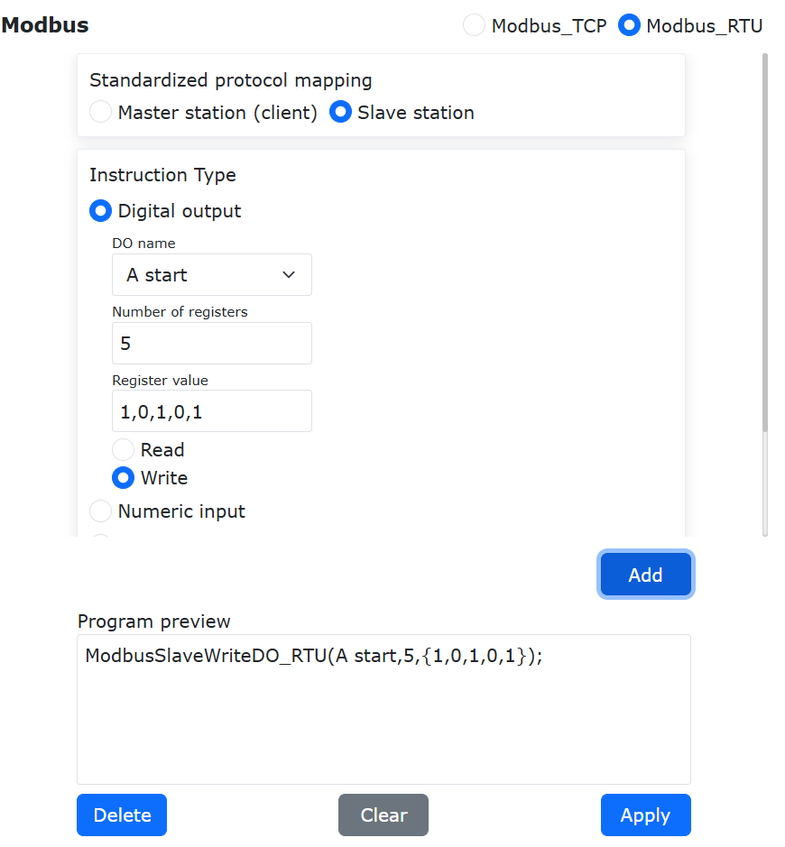

.. centered:: Figure 9.30-38 Configuring Write Multiple Digital Outputs, Applying Write Multiple Digital Outputs

Now the robot program "testModbusRTUSlave.lua" has added a robot Modbus Slave instruction to write multiple digital outputs. Switch the robot to automatic mode and click the start button. The robot will write the values 1, 0, 1, 0, 1 to the discrete input registers starting from "A Start" and the next four.
   

.. centered:: Figure 9.30-39 LUA Program for Writing Multiple Digital Outputs

Read Single Digital Output DO (Discrete Input)
""""""""""""""""""""""""""""""""""""""""""""""
Open the ModbusRTU Master instruction addition page, find "Digital Output Settings", DO name as "A Start", register quantity as 1, register value does not need to be filled, click "Read Digital Output". Finally, scroll to the bottom of the page and click "Apply" button.
   
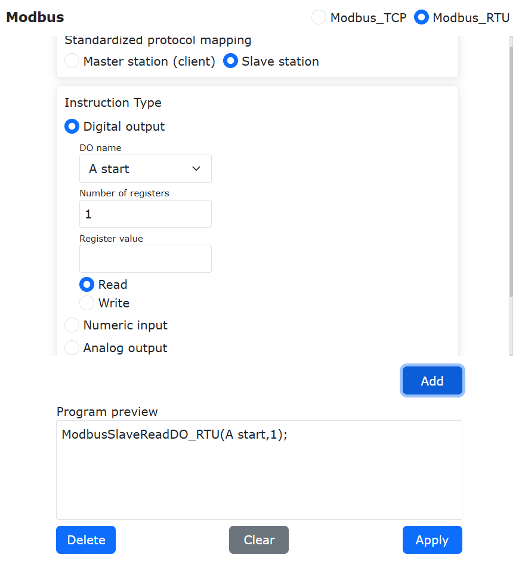

.. centered:: Figure 9.30-40 Configuring Read Single Digital Output, Applying Read Single Digital Output

Now the robot program "testModbusRTUSlave.lua" has added a robot Modbus Slave instruction to read a single digital output.
   
.. image:: coding/380.png
   :width: 4in
   :align: center

.. centered:: Figure 9.30-41 Program for Reading a Single Digital Output

Usually, after reading Modbus registers, the read values are stored in variables. Therefore, you need to define a variable to store the read value. Click the "Switch Mode" button to switch the robot LUA program to editable mode. Before the "ModbusSlaveReadDO_RTU" instruction, add a return value variable "AStartValue". After executing the program, the read value will be stored in "AStartValue".
   
.. image:: coding/381.png
   :width: 4in
   :align: center

.. centered:: Figure 9.30-42 Storing a Single Digital Output Read in a Variable

Coil-type register values are only 0 or 1. In the robot program, you can perform different operations by judging different register values.

Read Multiple Digital Outputs DO (Discrete Inputs)
"""""""""""""""""""""""""""""""""""""""""""""""""""""""""""""""""""""

Open the ModbusRTU Master instruction addition page, find "Digital Output Settings", select DO name as "A Start", register quantity as 2, register value does not need to be filled, click "Read Digital Output". Finally, scroll to the bottom of the page and click "Apply" button.
   
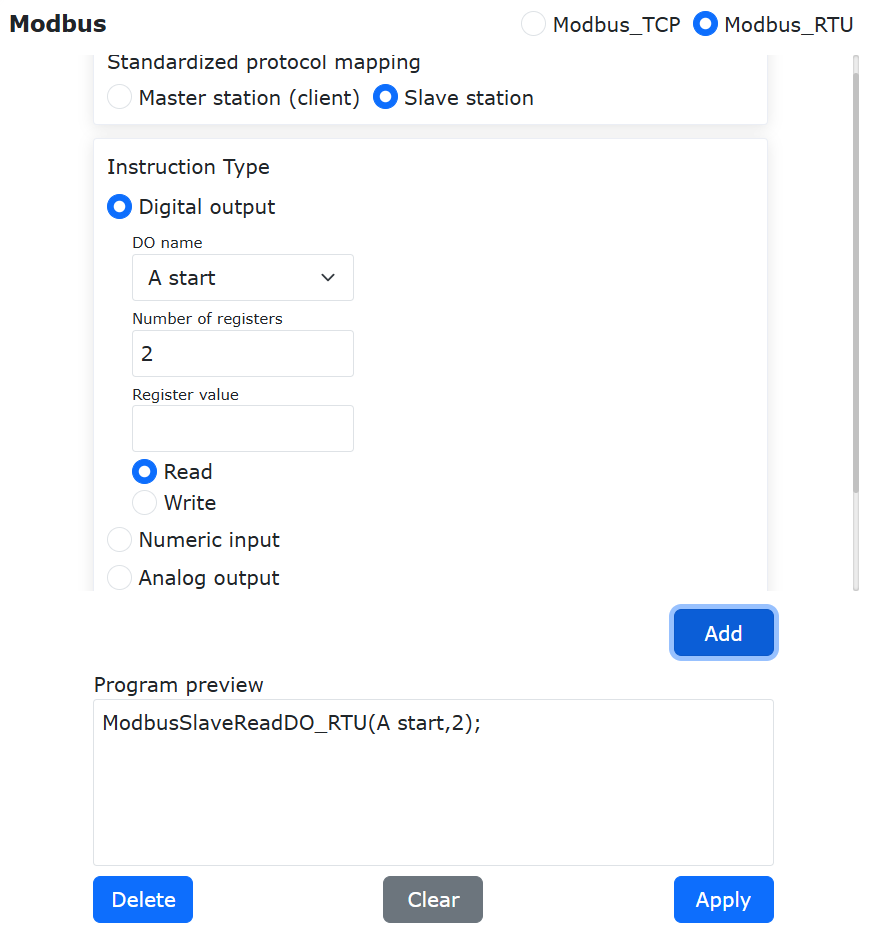

.. centered:: Figure 9.30-43 Configuring Read Multiple Digital Outputs, Applying Read Multiple Digital Outputs

Now the robot program "testModbusRTUSlave.lua" has added a robot Modbus Slave instruction to read multiple digital outputs.
   
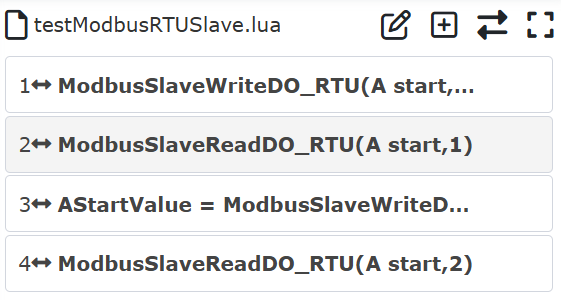

.. centered:: Figure 9.30-44 Program for Reading Multiple Digital Outputs

Click the "Switch Mode" button to switch the robot LUA program to editable mode. Since the read quantity is 2, you need to add two return value variables "value1,value2" before the "ModbusSlaveReadDO_RTU" instruction. After executing the program, the two digital output register values will be stored in these two variables. Similarly, you can judge the values of "value1" and "value2" to make the robot perform different actions.
   
.. image:: coding/384.png
   :width: 4in
   :align: center

.. centered:: Figure 9.30-45 Storing Multiple Digital Output Reads in Variables

Read Digital Input DI (Coils)
"""""""""""""""""""""""""""""""""""""""""""

Open the ModbusRTU Slave instruction addition page, find "Digital Input Settings", select DI name as "A Ready", register quantity as 2, click "Read Digital Input". Finally, scroll to the bottom of the page and click "Apply" button.
   
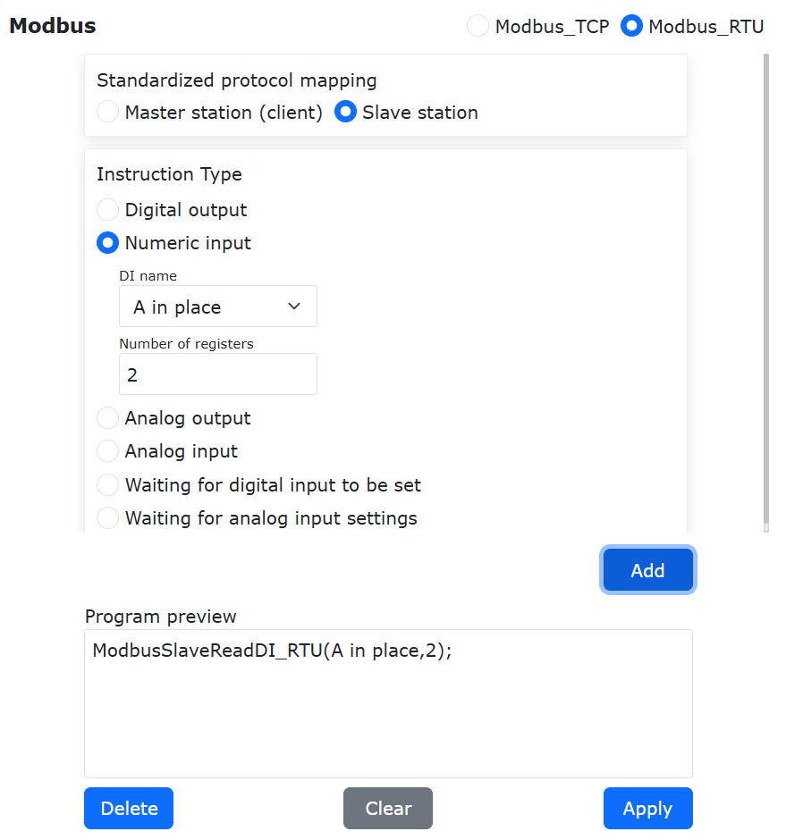

.. centered:: Figure 9.30-46 Configuring Read Digital Input, Applying Read Digital Input

Now the robot program "testModbusRTUSlave.lua" has added a robot Modbus Slave instruction to read digital inputs.
   
.. image:: coding/386.png
   :width: 4in
   :align: center

.. centered:: Figure 9.30-47 Program Instruction for Reading Digital Inputs

Click the "Switch Mode" button to switch the robot LUA program to editable mode. Before the "ModbusSlaveReadDI_RTU" instruction, add return value variables "AState,BState". After executing the program, the two digital input values will be stored in variables "AState" and "BState", respectively. You can control the robot to perform different operations by judging the variable values.
   
.. image:: coding/387.png
   :width: 4in
   :align: center

.. centered:: Figure 9.30-48 Program for Reading Digital Inputs

Read/Write Operations for Analog Output AO (Input Registers) and Analog Input AI (Holding Registers)
""""""""""""""""""""""""""""""""""""""""""""""""""""""""""""""""""""""""""""""""""""""""""""""""""""""""""""""""""

The read/write operations for analog outputs (input registers) and analog inputs (holding registers) are basically the same as those for digital outputs (discrete inputs) and digital inputs (coils). The difference is that the data range of the latter is limited to 0 or 1, while the former has a larger data range. Therefore, specific operations can refer to the writing of digital output and digital input programs. Here, only the program examples for reading analog inputs (Figure 3-24) and reading/writing analog outputs (Figure 3-25) are shown.
   
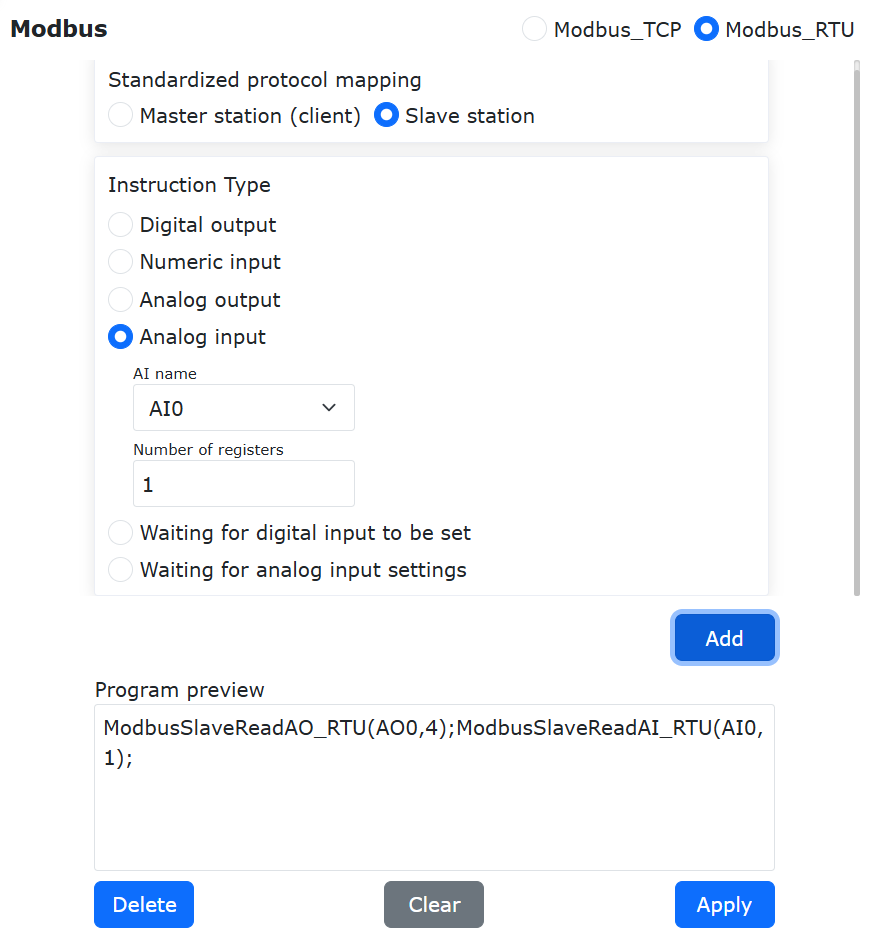

.. centered:: Figure 9.30-49 Reading Analog Inputs
   
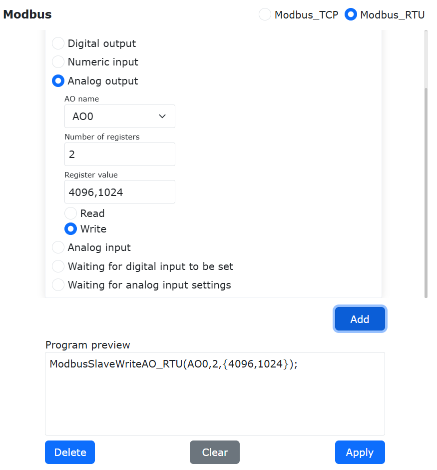

.. centered:: Figure 9.30-50 Reading/Writing Analog Outputs

Wait for Digital Input
""""""""""""""""""""""""""""""""""""""""""""""""""""""
Open the ModbusRTU Slave instruction addition page, find "Wait for Digital Input Settings", select DI name as the configured "A Ready" register, wait state as "True", timeout as 5000ms. Click "Add" button, then click "Apply" button.
   
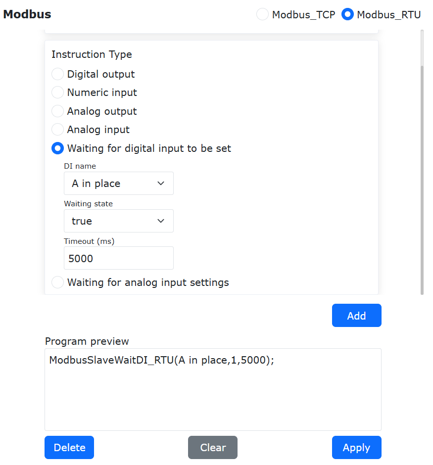

.. centered:: Figure 9.30-51 Adding a Wait for Digital Input Instruction

Now the robot program "testModbusRTUSlave.lua" has added a robot Modbus Slave instruction to wait for a digital input. After starting the program, the robot will wait for the "A Ready" coil register value of the slave to become true (value 1). Since the timeout is set to 5s, if the "A Ready" signal is still 0 after 5s, the robot program will report a timeout error and automatically stop running.
   
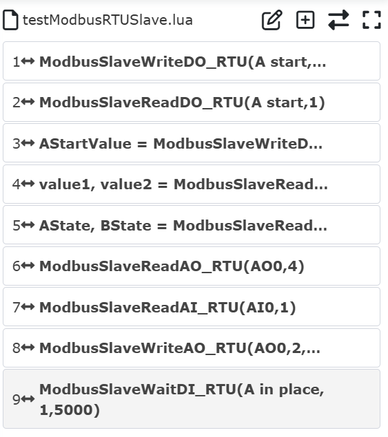

.. centered:: Figure 9.30-52 Program for Waiting for Digital Input

Wait for Analog Input
""""""""""""""""""""""""""""""""""
Open the ModbusRTU Slave instruction addition page, find "Wait for Analog Input Settings", select AI name as the configured "Current" register, wait state as ">", register value as 255, timeout as 5000ms. Click "Add" button, then click "Apply" button.
   
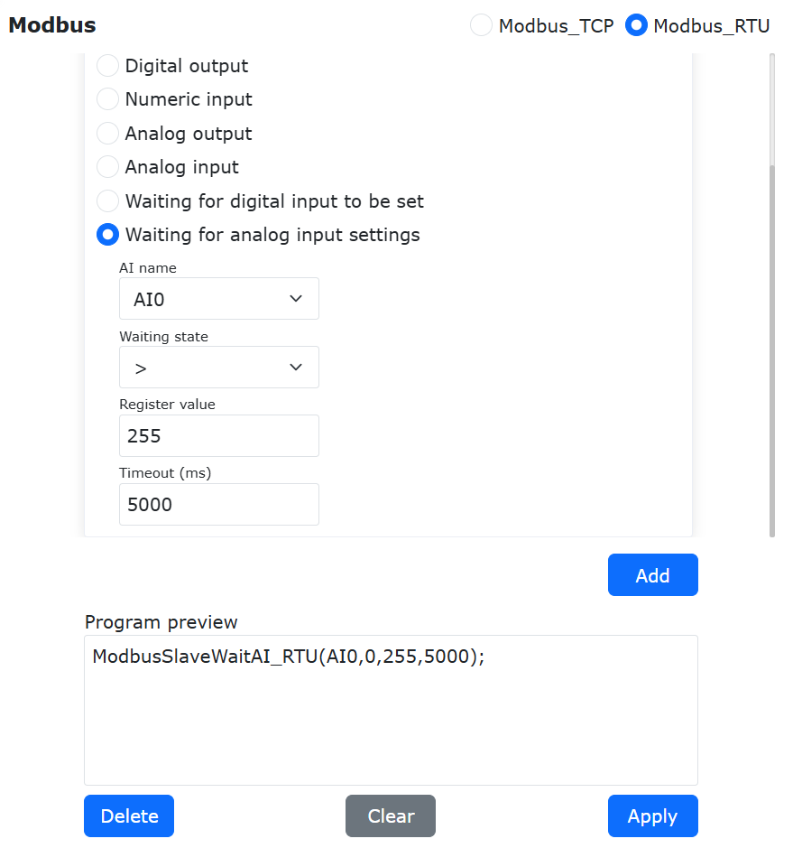

.. centered:: Figure 9.30-53 Adding a Wait for Analog Input Instruction

Now the robot program "testModbusRTUSlave.lua" has added a robot Modbus Slave instruction to wait for an analog input value. After starting the program, the robot will wait for the "Current" register value of the slave to be greater than 255. Since the timeout is set to 5s, if the "Current" signal is still not greater than 255 after 5s, the robot program will report a timeout error and automatically stop running.
   
.. image:: coding/393.png
   :width: 4in
   :align: center

.. centered:: Figure 9.30-54 Program for Waiting for Analog Input Register

Open the ModbusRTU Slave command addition page, find the "Wait for Analog Input Setting" (i.e., wait for AI input register setting). Select the AI name as the configured "Liquid Level" register, set the wait condition to "=", the register value to 255, and the timeout to 5000ms. Click the "Add" button, and finally click the "Apply" button.

.. image:: coding/496.png
   :width: 6in
   :align: center

.. centered:: Figure 9.30-54-2 Add Wait for Analog Input

At this point, a Modbus RTU Slave command to wait for the AI input register value has been added to the robot program "test.lua". After starting the program, the robot will continuously wait for the "Liquid Level" register value to equal 255. Since the timeout is set to 5s, if the "Liquid Level" signal still does not equal 255 after the robot waits for 5 seconds, the robot program will report a timeout error and automatically stop running.

Robot Status Feedback and Control via ModbusRTU Slave
***********************************************************************************
The input register addresses 0x1010-0x104C of the collaborative robot ModbusRTU Slave are used to feedback real-time robot status (see Appendix 1: ModbusRTU Slave Address Mapping Table for specific address definitions). You only need to read the corresponding register values with the master device to obtain the corresponding real-time robot status data.

The coil register addresses 0x4040-0x405C of the collaborative robot ModbusRTU Slave are used for the master device to control the robot (see Appendix 1: ModbusRTU Slave Address Mapping Table for specific address definitions). Take coil address 0x4054 as an example. This address function is "Start Program". When the robot is in automatic mode, the master device changes the value of address 0x4054 from 0 to 1, and the robot automatically starts running the currently configured program. Another example is coil address 0x4040, which is used to control the output of control box DO0. When the external master changes the coil address 0x4040 from 0 to 1, the control box DO0 automatically outputs effectively. Similarly, when the external master changes the coil address 0x4040 from 1 to 0, the control box DO0 output becomes invalid. On the ModbusRTU Slave settings page, click "Functional Digital Inputs (Coils)" to monitor all current functional digital inputs.
   
.. image:: coding/396.png
   :width: 4in
   :align: center

.. centered:: Figure 9.30-55 Digital input of the robot slave function

Attachment 1: Modbus Slave Address Mapping Table

.. list-table::
   :widths: 15 20 25 15 20 10
   :header-rows: 0
   :align: center

   * - **Third-party Controller Address**
     - **Type**
     - **Name**
     - **Data Type**
     - **Function Code**
     - **R/W**

   * - 0x3000
     - General Digital Output (Discrete)
     - DO0
     - BOOL 
     - 0x02 
     - Read Only  

   * - 0x3001
     - General Digital Output (Discrete)
     - DO1
     - BOOL 
     - 0x02 
     - Read Only  

   * - 0x3002
     - General Digital Output (Discrete)
     - DO2
     - BOOL 
     - 0x02 
     - Read Only  

   * - 0x3003
     - General Digital Output (Discrete)
     - DO3
     - BOOL 
     - 0x02 
     - Read Only  

   * - ...
     - General Digital Output (Discrete)
     - ...
     - BOOL 
     - 0x02 
     - Read Only  

   * - 0x303F
     - General Digital Output (Discrete)
     - DO127
     - BOOL 
     - 0x02 
     - Read Only  

   * - 0x4000
     - General Digital Input (Coil)
     - DI0
     - BOOL 
     - 0x01, 0x05, 0x0F 
     - R/W  

   * - 0x4001
     - General Digital Input (Coil)
     - DI1
     - BOOL 
     - 0x01, 0x05, 0x0F 
     - R/W  

   * - 0x4002
     - General Digital Input (Coil)
     - DI2
     - BOOL 
     - 0x01, 0x05, 0x0F 
     - R/W  

   * - 0x4003
     - General Digital Input (Coil)
     - DI3
     - BOOL 
     - 0x01, 0x05, 0x0F 
     - R/W  

   * - ...
     - General Digital Input (Coil)
     - ...
     - BOOL 
     - 0x01, 0x05, 0x0F 
     - R/W  

   * - 0x403F
     - General Digital Input (Coil)
     - DI64
     - BOOL 
     - 0x01, 0x05, 0x0F 
     - R/W  

   * - 0x4040
     - Robot Control
     - Control Box DO0
     - BOOL 
     - 0x01, 0x05, 0x0F 
     - R/W  

   * - 0x4041
     - Robot Control
     - Control Box DO1
     - BOOL 
     - 0x01, 0x05, 0x0F 
     - R/W  

   * - 0x4042
     - Robot Control
     - Control Box DO2
     - BOOL 
     - 0x01, 0x05, 0x0F 
     - R/W  

   * - 0x4043
     - Robot Control
     - Control Box DO3
     - BOOL 
     - 0x01, 0x05, 0x0F 
     - R/W  

   * - 0x4044
     - Robot Control
     - Control Box DO4
     - BOOL 
     - 0x01, 0x05, 0x0F 
     - R/W  

   * - 0x4045
     - Robot Control
     - Control Box DO5
     - BOOL 
     - 0x01, 0x05, 0x0F 
     - R/W  

   * - 0x4046
     - Robot Control
     - Control Box DO6
     - BOOL 
     - 0x01, 0x05, 0x0F 
     - R/W  

   * - 0x4047
     - Robot Control
     - Control Box DO7
     - BOOL 
     - 0x01, 0x05, 0x0F 
     - R/W  

   * - 0x4048
     - Robot Control
     - Control Box CO0
     - BOOL 
     - 0x01, 0x05, 0x0F 
     - R/W  

   * - 0x4049
     - Robot Control
     - Control Box CO1
     - BOOL 
     - 0x01, 0x05, 0x0F 
     - R/W  

   * - 0x404A
     - Robot Control
     - Control Box CO2
     - BOOL 
     - 0x01, 0x05, 0x0F 
     - R/W  

   * - 0x404B
     - Robot Control
     - Control Box CO3
     - BOOL 
     - 0x01, 0x05, 0x0F 
     - R/W  

   * - 0x404C
     - Robot Control
     - Control Box CO4
     - BOOL 
     - 0x01, 0x05, 0x0F 
     - R/W  

   * - 0x404D
     - Robot Control
     - Control Box CO5
     - BOOL 
     - 0x01, 0x05, 0x0F 
     - R/W  

   * - 0x404E
     - Robot Control
     - Control Box CO6
     - BOOL 
     - 0x01, 0x05, 0x0F 
     - R/W  

   * - 0x404F
     - Robot Control
     - Control Box CO7
     - BOOL 
     - 0x01, 0x05, 0x0F 
     - R/W  

   * - 0x4050
     - Robot Control
     - Tool DO0
     - BOOL 
     - 0x01, 0x05, 0x0F 
     - R/W  

   * - 0x4051
     - Robot Control
     - Tool DO1
     - BOOL 
     - 0x01, 0x05, 0x0F 
     - R/W  

   * - 0x4052
     - Robot Control
     - Pause
     - BOOL 
     - 0x01, 0x05, 0x0F 
     - R/W  

   * - 0x4053
     - Robot Control
     - Resume
     - BOOL 
     - 0x01, 0x05, 0x0F 
     - R/W  

   * - 0x4054
     - Robot Control
     - Start
     - BOOL 
     - 0x01, 0x05, 0x0F 
     - R/W  

   * - 0x4055
     - Robot Control
     - Stop
     - BOOL 
     - 0x01, 0x05, 0x0F 
     - R/W  

   * - 0x4056
     - Robot Control
     - Move to Home Position
     - BOOL 
     - 0x01, 0x05, 0x0F 
     - R/W  

   * - 0x4057
     - Robot Control
     - Manual/Auto Toggle
     - BOOL 
     - 0x01, 0x05, 0x0F 
     - R/W  

   * - 0x4058
     - Robot Control
     - Start Main Program
     - BOOL 
     - 0x01, 0x05, 0x0F 
     - R/W  

   * - 0x4059
     - Robot Control
     - Level 1 Reduction Mode
     - BOOL 
     - 0x01, 0x05, 0x0F 
     - R/W  

   * - 0x405A
     - Robot Control
     - Level 2 Reduction Mode
     - BOOL 
     - 0x01, 0x05, 0x0F 
     - R/W  

   * - 0x405B
     - Robot Control
     - Level 3 Reduction Mode (Stop)
     - BOOL 
     - 0x01, 0x05, 0x0F 
     - R/W  

   * - 0x405C
     - Robot Control
     - Clear All Faults
     - BOOL 
     - 0x01, 0x05, 0x0F 
     - R/W  

   * - 0x405D
     - Robot Control
     - Reserved
     - BOOL 
     - 0x01, 0x05, 0x0F 
     - R/W  

   * - 0x405E
     - Robot Control
     - Reserved
     - BOOL 
     - 0x01, 0x05, 0x0F 
     - R/W  

   * - 0x1000
     - Analog Input
     - AO0
     - INT16 
     - 0x04
     - Read Only  

   * - 0x1001
     - Analog Input
     - AO1
     - INT16 
     - 0x04
     - Read Only  

   * - 0x1002
     - Analog Input
     - AO2
     - INT16 
     - 0x04
     - Read Only  

   * - ...
     - Analog Input
     - ...
     - INT16 
     - 0x04
     - Read Only  

   * - 0x100F
     - Analog Input
     - AO15
     - INT16 
     - 0x04
     - Read Only  

   * - 0x1010
     - Robot Status
     - Enable Status (0-Disabled, 1-Enabled)
     - UINT16 
     - 0x04
     - Read Only  

   * - 0x1011
     - Robot Status
     - Robot Mode (1-Manual, 0-Auto)
     - UINT16 
     - 0x04
     - Read Only  

   * - 0x1012
     - Robot Status
     - Robot Operation Status (1-Stop, 2-Running, 3-Paused, 4-Dragging)
     - UINT16 
     - 0x04
     - Read Only  

   * - 0x1013
     - Robot Status
     - Tool Number
     - UINT16 
     - 0x04
     - Read Only  

   * - 0x1014
     - Robot Status
     - Workpiece Number
     - UINT16 
     - 0x04
     - Read Only  

   * - 0x1015
     - Robot Status
     - Emergency Stop Status (0-Normal, 1-Emergency Stop)
     - UINT16 
     - 0x04
     - Read Only  

   * - 0x1016
     - Robot Status
     - Soft Limit Fault
     - UINT16 
     - 0x04
     - Read Only  

   * - 0x1017
     - Robot Status
     - Main Fault Code
     - UINT16 
     - 0x04
     - Read Only  

   * - 0x1018
     - Robot Status
     - Sub Fault Code
     - UINT16 
     - 0x04
     - Read Only  

   * - 0x1019
     - Robot Status
     - Collision Detection (1-Collision, 0-No Collision)
     - UINT16 
     - 0x04
     - Read Only  

   * - 0x101A
     - Robot Status
     - Motion Completion Signal
     - UINT16 
     - 0x04
     - Read Only  

   * - 0x101B
     - Robot Status
     - Safety Stop Signal SI0
     - UINT16 
     - 0x04
     - Read Only  

   * - 0x101C
     - Robot Status
     - Safety Stop Signal SI1
     - UINT16 
     - 0x04
     - Read Only  

   * - 0x101D
     - Robot Status
     - Control Box Analog Input AI0
     - UINT16 
     - 0x04
     - Read Only  

   * - 0x101E
     - Robot Status
     - Control Box Analog Input AI1
     - UINT16 
     - 0x04
     - Read Only  

   * - 0x101F
     - Robot Status
     - Tool Analog Input AI0
     - UINT16 
     - 0x04
     - Read Only  

   * - 0x1020
     - Robot Status
     - Control Box Analog Output AO0
     - UINT16 
     - 0x04
     - Read Only  

   * - 0x1021
     - Robot Status
     - Control Box Analog Output AO1
     - UINT16 
     - 0x04
     - Read Only  

   * - 0x1022
     - Robot Status
     - Tool Analog Output AO0
     - UINT16 
     - 0x04
     - Read Only  

   * - 0x1023
     - Robot Status
     - Control Box Digital Input (Bit0-Bit7: DI0-DI7, Bit8-Bit15: CI0-CI7)
     - UINT16 
     - 0x04
     - Read Only  

   * - 0x1024
     - Robot Status
     - Tool Digital Input (Bit0-Bit15: DI0-DI15)
     - UINT16 
     - 0x04
     - Read Only  

   * - 0x1025
     - Robot Status
     - Control Box Digital Output (Bit0-Bit7: DO0-DO7, Bit8-Bit15: CO0-CO7)
     - UINT16 
     - 0x04
     - Read Only  

   * - 0x1026
     - Robot Status
     - Tool Digital Output (Bit0-Bit15: DO0-DO15)
     - UINT16 
     - 0x04
     - Read Only  

   * - 0x1027
     - Robot Status
     - TCP Speed
     - FLOAT32 (Big Endian) 
     - 0x04
     - Read Only  

   * - 0x1028
     - Robot Status
     - TCP Speed
     - FLOAT32 (Big Endian) 
     - 0x04
     - Read Only  

   * - 0x1029
     - Robot Status
     - Joint 1 Position
     - FLOAT32 (Big Endian) 
     - 0x04
     - Read Only  

   * - 0x102A
     - Robot Status
     - Joint 1 Position
     - FLOAT32 (Big Endian) 
     - 0x04
     - Read Only  

   * - 0x102B
     - Robot Status
     - Joint 2 Position
     - FLOAT32 (Big Endian) 
     - 0x04
     - Read Only  

   * - 0x102C
     - Robot Status
     - Joint 2 Position
     - FLOAT32 (Big Endian) 
     - 0x04
     - Read Only  

   * - 0x102D
     - Robot Status
     - Joint 3 Position
     - FLOAT32 (Big Endian) 
     - 0x04
     - Read Only  

   * - 0x102E
     - Robot Status
     - Joint 3 Position
     - FLOAT32 (Big Endian) 
     - 0x04
     - Read Only  

   * - 0x102F
     - Robot Status
     - Joint 4 Position
     - FLOAT32 (Big Endian) 
     - 0x04
     - Read Only  

   * - 0x1030
     - Robot Status
     - Joint 4 Position
     - FLOAT32 (Big Endian) 
     - 0x04
     - Read Only  

   * - 0x1031
     - Robot Status
     - Joint 5 Position
     - FLOAT32 (Big Endian) 
     - 0x04
     - Read Only  

   * - 0x1032
     - Robot Status
     - Joint 5 Position
     - FLOAT32 (Big Endian) 
     - 0x04
     - Read Only  

   * - 0x1033
     - Robot Status
     - Joint 6 Position
     - FLOAT32 (Big Endian) 
     - 0x04
     - Read Only  

   * - 0x1034
     - Robot Status
     - Joint 6 Position
     - FLOAT32 (Big Endian) 
     - 0x04
     - Read Only  

   * - 0x1035
     - Robot Status
     - Joint 1 Speed
     - FLOAT32 (Big Endian) 
     - 0x04
     - Read Only  

   * - 0x1036
     - Robot Status
     - Joint 1 Speed
     - FLOAT32 (Big Endian) 
     - 0x04
     - Read Only  

   * - 0x1037
     - Robot Status
     - Joint 2 Speed
     - FLOAT32 (Big Endian) 
     - 0x04
     - Read Only  

   * - 0x1038
     - Robot Status
     - Joint 2 Speed
     - FLOAT32 (Big Endian) 
     - 0x04
     - Read Only  

   * - 0x1039
     - Robot Status
     - Joint 3 Speed
     - FLOAT32 (Big Endian) 
     - 0x04
     - Read Only  

   * - 0x103A
     - Robot Status
     - Joint 3 Speed
     - FLOAT32 (Big Endian) 
     - 0x04
     - Read Only  

   * - 0x103B
     - Robot Status
     - Joint 4 Speed
     - FLOAT32 (Big Endian) 
     - 0x04
     - Read Only  

   * - 0x103C
     - Robot Status
     - Joint 4 Speed
     - FLOAT32 (Big Endian) 
     - 0x04
     - Read Only  

   * - 0x103D
     - Robot Status
     - Joint 5 Speed
     - FLOAT32 (Big Endian) 
     - 0x04
     - Read Only  

   * - 0x103E
     - Robot Status
     - Joint 5 Speed
     - FLOAT32 (Big Endian) 
     - 0x04
     - Read Only  

   * - 0x103F
     - Robot Status
     - Joint 6 Speed
     - FLOAT32 (Big Endian) 
     - 0x04
     - Read Only  

   * - 0x1040
     - Robot Status
     - Joint 6 Speed
     - FLOAT32 (Big Endian) 
     - 0x04
     - Read Only  

   * - 0x1041
     - Robot Status
     - TCP Position X
     - FLOAT32 (Big Endian) 
     - 0x04
     - Read Only  

   * - 0x1042
     - Robot Status
     - TCP Position X
     - FLOAT32 (Big Endian) 
     - 0x04
     - Read Only  

   * - 0x1043
     - Robot Status
     - TCP Position Y
     - FLOAT32 (Big Endian) 
     - 0x04
     - Read Only  

   * - 0x1044
     - Robot Status
     - TCP Position Y
     - FLOAT32 (Big Endian) 
     - 0x04
     - Read Only  

   * - 0x1045
     - Robot Status
     - TCP Position Z
     - FLOAT32 (Big Endian) 
     - 0x04
     - Read Only  

   * - 0x1046
     - Robot Status
     - TCP Position Z
     - FLOAT32 (Big Endian) 
     - 0x04
     - Read Only  

   * - 0x1047
     - Robot Status
     - TCP Position RX
     - FLOAT32 (Big Endian) 
     - 0x04
     - Read Only  

   * - 0x1048
     - Robot Status
     - TCP Position RX
     - FLOAT32 (Big Endian) 
     - 0x04
     - Read Only  

   * - 0x1049
     - Robot Status
     - TCP Position RY
     - FLOAT32 (Big Endian) 
     - 0x04
     - Read Only  

   * - 0x104A
     - Robot Status
     - TCP Position RY
     - FLOAT32 (Big Endian) 
     - 0x04
     - Read Only  

   * - 0x104B
     - Robot Status
     - TCP Position RZ
     - FLOAT32 (Big Endian) 
     - 0x04
     - Read Only  

   * - 0x104C
     - Robot Status
     - TCP Position RZ
     - FLOAT32 (Big Endian) 
     - 0x04
     - Read Only  

   * - 0x104D
     - Analog Input
     - AO16
     - FLOAT32 (Big Endian) 
     - 0x04
     - Read Only  

   * - 0x104E
     - Analog Input
     - AO16
     - FLOAT32 (Big Endian) 
     - 0x04
     - Read Only  

   * - 0x104F
     - Analog Input
     - AO17
     - FLOAT32 (Big Endian) 
     - 0x04
     - Read Only  

   * - 0x1050
     - Analog Input
     - AO17
     - FLOAT32 (Big Endian) 
     - 0x04
     - Read Only  

   * - ...
     - Analog Input
     - ...
     - FLOAT32 (Big Endian) 
     - 0x04
     - Read Only  

   * - 0x106B
     - Analog Input
     - AO31
     - FLOAT32 (Big Endian) 
     - 0x04
     - Read Only  

   * - 0x106C
     - Analog Input
     - AO31
     - FLOAT32 (Big Endian) 
     - 0x04
     - Read Only  

   * - 0x2000
     - Analog Output
     - AI0
     - INT16 
     - 0x03, 0x06, 0x10
     - R/W  

   * - 0x2001
     - Analog Output
     - AI1
     - INT16 
     - 0x03, 0x06, 0x10
     - R/W  

   * - 0x2002
     - Analog Output
     - AI2
     - INT16 
     - 0x03, 0x06, 0x10
     - R/W  

   * - ...
     - Analog Output
     - ...
     - INT16 
     - 0x03, 0x06, 0x10
     - R/W  

   * - 0x200F
     - Analog Output
     - AI15
     - INT16 
     - 0x03, 0x06, 0x10
     - R/W  

   * - 0x2010
     - Analog Output
     - AI16
     - FLOAT32 (Big Endian) 
     - 0x03, 0x06, 0x10
     - R/W  

   * - 0x2011
     - Analog Output
     - AI16
     - FLOAT32 (Big Endian) 
     - 0x03, 0x06, 0x10
     - R/W  

   * - 0x2012
     - Analog Output
     - AI17
     - FLOAT32 (Big Endian) 
     - 0x03, 0x06, 0x10
     - R/W  

   * - 0x2013
     - Analog Output
     - AI17
     - FLOAT32 (Big Endian) 
     - 0x03, 0x06, 0x10
     - R/W  

   * - ...
     - Analog Output
     - ...
     - FLOAT32 (Big Endian) 
     - 0x03, 0x06, 0x10
     - R/W  

   * - 0x202E
     - Analog Output
     - AI31
     - FLOAT32 (Big Endian) 
     - 0x03, 0x06, 0x10
     - R/W  

   * - 0x202F
     - Analog Output
     - AI31
     - FLOAT32 (Big Endian) 
     - 0x03, 0x06, 0x10
     - R/W  

Protection Based on 6-Axis Force Sensor Posture Compliance Function
~~~~~~~~~~~~~~~~~~~~~~~~~~~~~~~~~~~~~~~~~~~~~~~~~~~~~~~~~~~~~~~~~~~~~

Overview
++++++++++++++

Current FR robots have no maximum adjustment angle limit in posture compliance function under constant force FT_Control. When the 6-axis force sensor receives external torque, the robot end will continuously deviate, which may cause hazards.

This enhancement adds maximum adjustment angle limit on top of the FT_Control posture compliance function, allowing custom threshold setting to make posture compliance smoother.

Operation Procedure
++++++++++++++++++++++++++++++++++++++++

**Step1**: Click "Initial Setup"->"Basic"->"Coordinate System"->"Tool" to enter the tool coordinate system setup interface. Select "Coordinate System Name" and configure parameters for the end tool coordinate system.
   
.. image:: coding/443.png
   :width: 4in
   :align: center

.. centered:: Figure 9.31-1 Tool Coordinate System Setup

**Step2**: Click "Teach Programming"->"Program Editing" to write constant force control Lua script. Select "Force Control Set"->"Control", add force control motion command, set "Posture Compliance" to ON, and configure maximum adjustment angle as the threshold.
   
.. image:: coding/444.png
   :width: 6in
   :align: center

.. centered:: Figure 9.31-2 Force Control Motion Command

**Step3**: On web interface click "FT" to set 6-axis force sensor reference coordinate system. Select reference coordinate system as "Custom Coordinate System" and configure corresponding parameters.
When posture compliance adjusts around tool coordinate system, set reference coordinate parameters to "0"; when adjusting around end flange coordinate system, set parameters to match the end tool coordinate system.
   
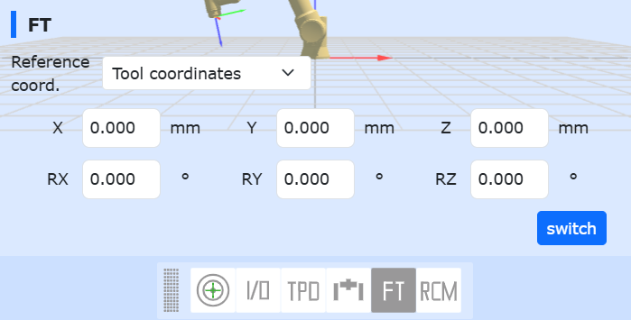

.. centered:: Figure 9.31-3 Setting 6-Axis Force Sensor Reference Coordinate System

**Step4**: Run the script to observe posture compliance effect. The adjustment angle under constant force will be limited within the custom maximum adjustment angle range.

Socket Communication Interface Function
~~~~~~~~~~~~~~~~~~~~~~~~~~~~~~~~~~~~~~~~~~~~~~~~~~~~~~~~~~~~~~~~~~~~~

Socket Configuration
++++++++++++++++++++++++++++++++++

When using the Socket communication interface function, after the robot is powered on, you need to first access the web page to configure the Socket protocol. The configuration is saved after power-off.

Click "Teach Program" - "Program Editing", then click "Socket Network Debugging" in the upper right menu bar to enter the Socket configuration interface. Click "Add Socket" to configure Socket parameters. Up to four Sockets can be added.

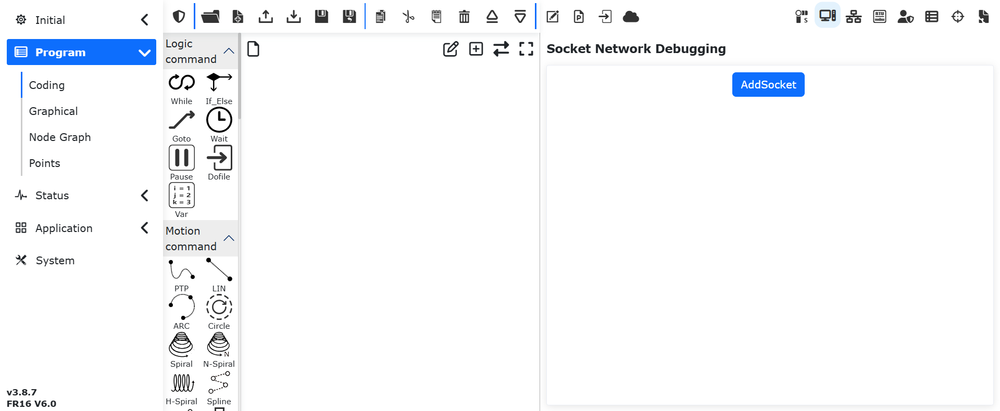

.. centered:: Figure 9.32-1 Socket Network Debugging Interface

.. image:: coding/447.png
   :width: 6in
   :align: center

.. centered:: Figure 9.32-2 Socket Configuration Parameters Interface

Communication Parameter Settings
********************************************

The communication protocol supports UDP, TCP server, and TCP client.

Data types support both ASCII and HEX. After configuring the data type, all data transmission and reception for that Socket connection will be processed according to the configured type.

Heartbeat Detection Mechanism
********************************************
The heartbeat detection mechanism is only applicable to TCP server and TCP client.

The heartbeat detection mechanism uses the Keepalive mechanism to detect and maintain the active state of the connection, preventing accidental interruption of long-idle connections. It mainly includes the following parameters:

- Probe interval: How long to wait before sending keepalive probe packets (in seconds);
- Probe time: Interval between probe packets (in seconds);
- Probe count: Maximum number of probe packets to send.

Reconnection Mechanism
********************************************
The reconnection mechanism is only applicable to TCP client.

When the reconnection mechanism is enabled and the TCP client detects a server disconnection upon startup, it will actively attempt to reconnect. If the connection cannot be established after reaching the maximum reconnection attempts, the connection will be dropped. It mainly includes the following parameters:

- Reconnection interval: Reconnection interval time (in ms, recommended to be in seconds);
- Maximum reconnection attempts: Maximum number of reconnection attempts.
  
Custom Protocol Parsing
********************************************
When custom protocol parsing is enabled, the transmitted and received data will be encapsulated or parsed according to the protocol configuration.

Custom protocols can be automatically generated based on configuration parameters. In ASCII mode, frame header, frame count, data length, and frame tail combinations are supported. Delimiters can be used for data segmentation. In HEX mode, frame header, frame count, data length, checksum method, and frame tail combinations are supported.

.. image:: coding/448.png
   :width: 6in
   :align: center

.. centered:: Figure 9.32-3 ASCII Mode Custom Protocol Configuration

.. image:: coding/449.png
   :width: 6in
   :align: center

.. centered:: Figure 9.32-4 HEX Mode Custom Protocol Configuration

After configuring the custom protocol, click the "Generate" button to automatically generate the corresponding Lua file. The Lua file supports import and export functions. The protocol type can be flexibly configured by modifying the file code.

Socket Connection
++++++++++++++++++++++++++++++++++++++++++

Interface Connection Display
********************************************
After configuring Socket information, the Socket connection can be established. The connection status includes the following three states:

- White: Connection not established.

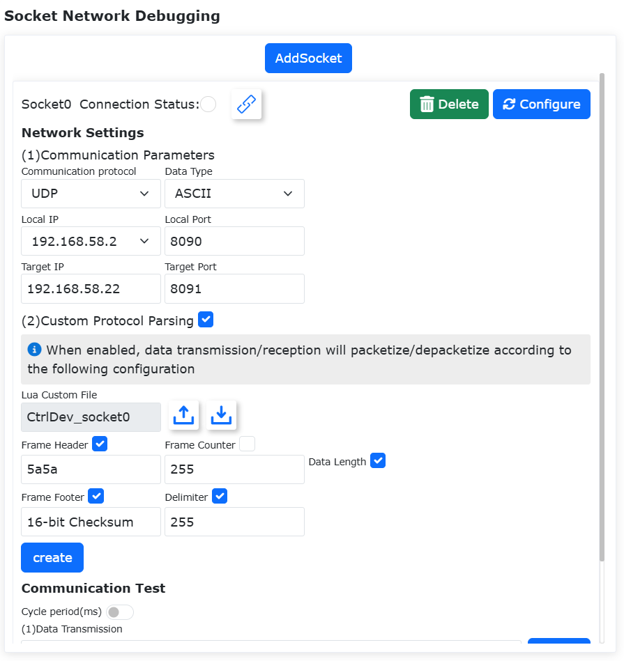

.. centered:: Figure 9.32-5 Disconnected State

- Yellow: TCP server waiting for connection or TCP client requesting connection.

.. image:: coding/451.png
   :width: 6in
   :align: center

.. centered:: Figure 9.32-6 Waiting for Connection State

- Green: Connection successful.

.. image:: coding/452.png
   :width: 6in
   :align: center

.. centered:: Figure 9.32-7 Connected State

Connection Command Module
********************************************

Click "Teach Program" - "Program Editing" - "Communication Commands", select "Socket" command to generate commands for opening and closing Socket connections for Lua programming. SocketID can only select already configured Socket connections.

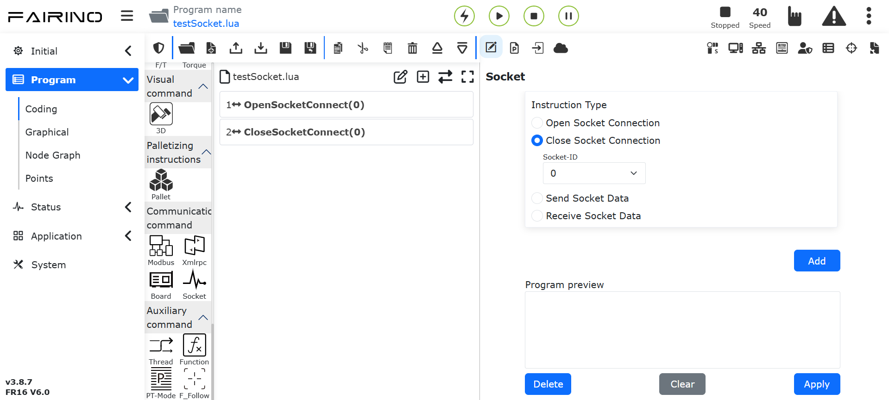

.. centered:: Figure 9.32-8 Socket Connection Command Module

Command details:

- Open connection command: OpenSockeConnect(id);
- Parameter id: Pre-configured socket ID, return value 0 for success;
- Close connection command: CloseSockeConnect(id);
- Parameter id: Pre-configured socket ID, return value 0 for success.

Socket Communication
+++++++++++++++++++++++++++++++++++++++++

Communication Testing
***********************************
The interface provides communication testing for data transmission and reception testing, as shown in Figure 3-1 below.

.. image:: coding/454.png
   :width: 6in
   :align: center

.. centered:: Figure 9.32-9 Communication Testing
 
The interface sends data in blocking mode by default, waiting for motion completion before sending data. The default data reception timeout is 5 seconds, after which an error will be reported and stopped. These parameters can be adjusted when issuing commands.

Communication Command Module
***********************************

Click "Teach Program" - "Program Editing" - "Communication Commands", select "Socket" command to generate Socket communication commands for data transmission and reception in Lua programming. SocketID can only select already configured Socket connections for sending data.

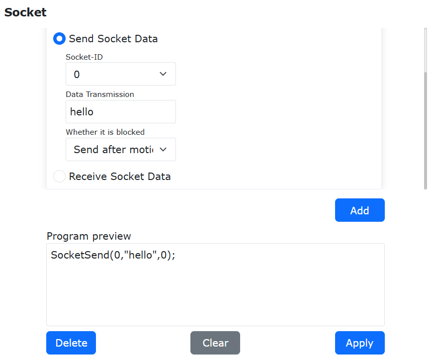

.. centered:: Figure 9.32-10 Sending Socket Data

Command parameters are Socket ID, data to send, and whether to wait for motion completion.

Command details:

- Send command: SocketSend(id,data,block);
- Parameters: id, connected socket ID; data: data to send (string format), content must match the configured data type, such as "hello" or "FA54DE"; block: whether to block motion (0: wait for motion completion before sending, 1: send immediately). Return value 0 for success.

Receiving data is shown below.

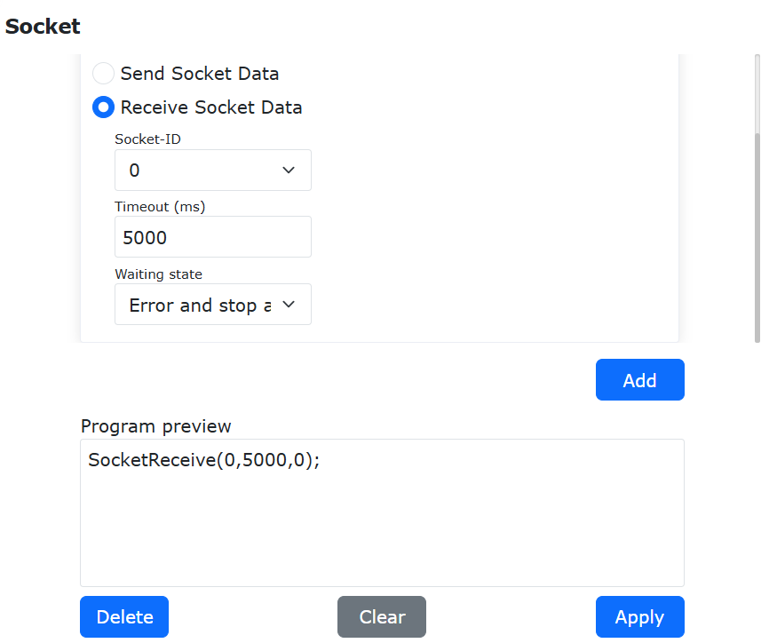

.. centered:: Figure 9.32-11 Receiving Socket Data

Command parameters are Socket ID, reception timeout (in milliseconds), and post-timeout strategy.

Command details:

- Receive command: SocketReceive(id,timeout,stopStartegy);
- Parameters: id, connected socket ID; timeout: reception timeout; stopStartegy: post-timeout strategy (0: report error and stop after timeout, 1: continue running after timeout);
- Return values: time: reception time, data: received data.

Robot Linear, Circular, and Full Circle Motion Setting Physical Speed
~~~~~~~~~~~~~~~~~~~~~~~~~~~~~~~~~~~~~~~~~~~~~~~~~~~~~~~~~~~~~~~~~~~~~~~~~~~

LUA Programming
+++++++++++++++++++++++++++++++++++++++++++

Linear Command
********************************
Click the "Linear" icon to enter the Lin command editing interface.

The function of this command is similar to the "PTP" command, but the path to the point reached by this command is a straight line.

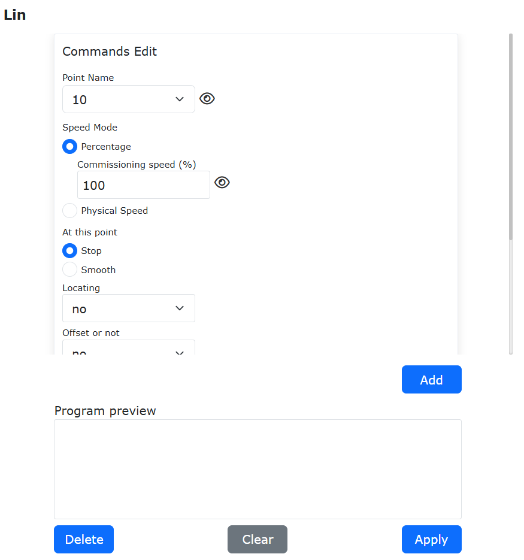

.. centered:: Figure 9.33-1 Lin Command Addition Interface

The LIN command allows selecting the motion speed mode as "Percentage" or "Physical Speed":

- Percentage: Input the debugging speed percentage. The robot moves at a percentage of its maximum speed. The actual robot motion speed is calculated as: V = Robot Maximum Speed × Global Speed Percentage × Debugging Speed Percentage. Hover the mouse over the small eye icon to the right of the "Debugging Speed" input box to display the actual physical speed (unit: mm/s) of the robot in both manual and automatic modes under the current debugging speed setting.

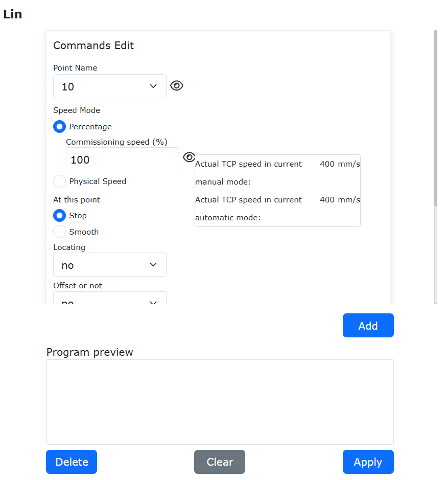

.. centered:: Figure 9.33-2 Input Percentage to Display Actual Physical Speed Value

- Physical Speed: The input speed is the actual operating speed of the robot, unit mm/s; the input acceleration is usually set to twice the speed. (The maximum physical speed of the LIN command is limited by the global speed percentage. If the robot's maximum operating speed is 1000mm/s and the global speed is 50%, then the maximum physical speed for the LIN command is 1000 × 50% = 500mm/s).

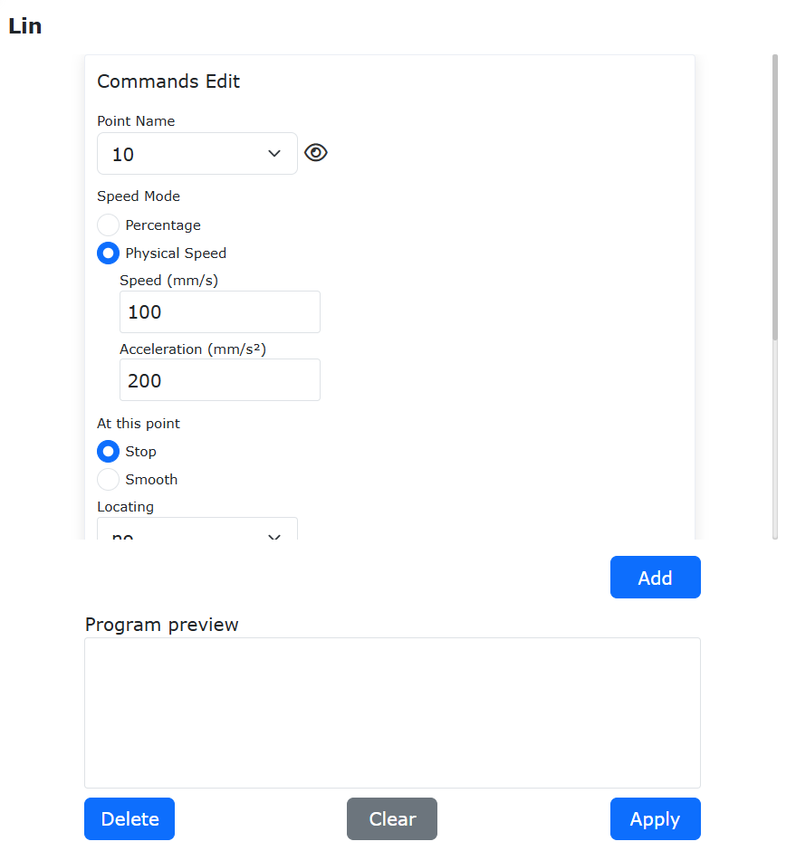

.. centered:: Figure 9.33-3 Input Actual Physical Speed

Circular Arc Command
*********************************

Click the "Circular Arc" icon to enter the Arc command editing interface.

The "Arc" command is for circular motion and includes three points: the first point is the arc start point, the second point is the arc intermediate transition point, and the third point is the end point.

Both the transition point and the end point can be set for offset, you can choose offset based on the base coordinate system or based on the tool coordinate system, and pop-up settings for x, y, z, rx, ry, rz offsets appear. The end point can set a smooth transition radius to achieve a continuous motion effect. (Arc motion requires first adding a PTP or Lin command to move to the start point).

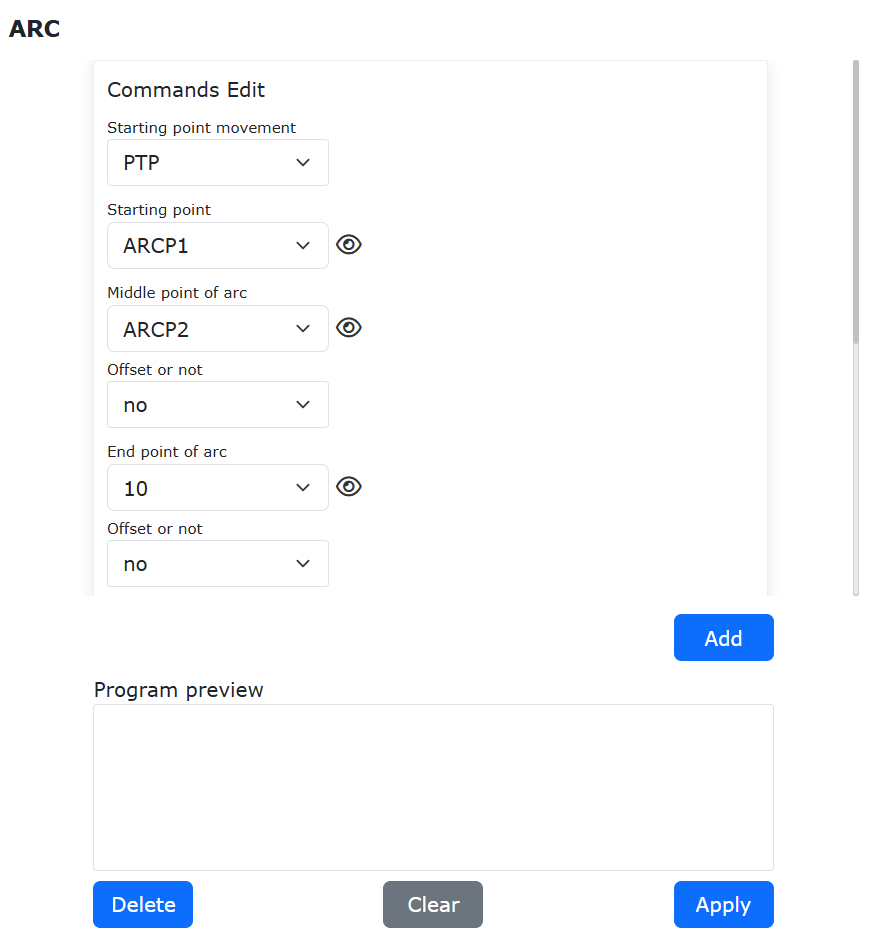

.. centered:: Figure 9.33-4 Arc Command Interface

The ARC command allows selecting the motion speed mode as "Percentage" or "Physical Speed":

- Percentage: Input the debugging speed percentage. The robot moves at a percentage of its maximum speed. The actual robot motion speed is calculated as: V = Robot Maximum Speed × Global Speed Percentage × Debugging Speed Percentage. Hover the mouse over the small eye icon to the right of the "Debugging Speed" input box to display the actual physical speed (unit: mm/s) of the robot in both manual and automatic modes under the current debugging speed setting.

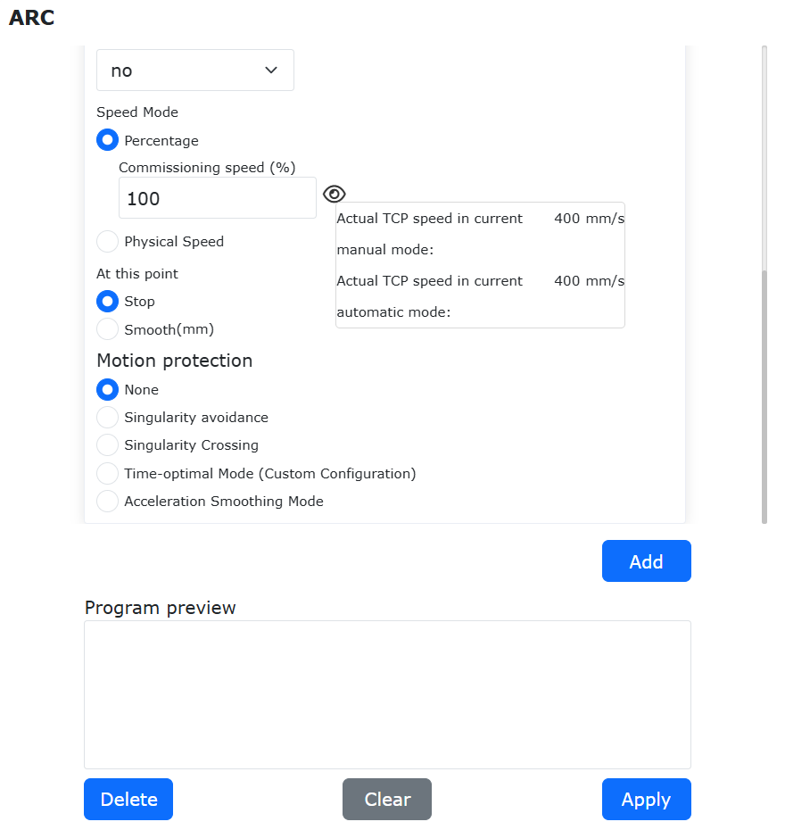

.. centered:: Figure 9.33-5 Input Percentage to Display Actual Physical Speed Value

- Physical Speed: The input speed is the actual operating speed of the robot, unit mm/s; the input acceleration is usually set to twice the speed. (The maximum physical speed of the ARC command is limited by the global speed percentage. If the robot's maximum operating speed is 1000mm/s and the global speed is 50%, then the maximum physical speed for the ARC command is 1000 × 50% = 500mm/s).

.. centered:: Figure 9.33-6 Input Actual Physical Speed
 
Full Circle Command Addition
******************************************

**Step1**: Create a new user program "testCircle.lua", click the "Full Circle" button to open the full circle command addition page.

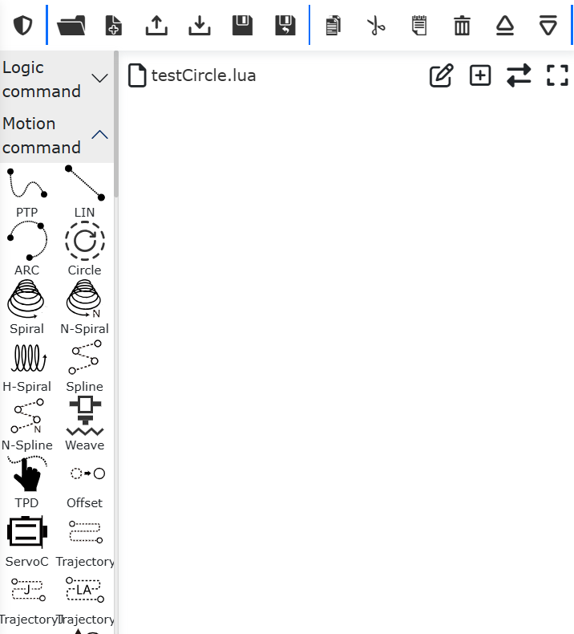

.. centered:: Figure 9.33-7 Add Full Circle Command Button

**Step2**: On the full circle command addition page, select the starting point motion mode and the starting point as "P1".

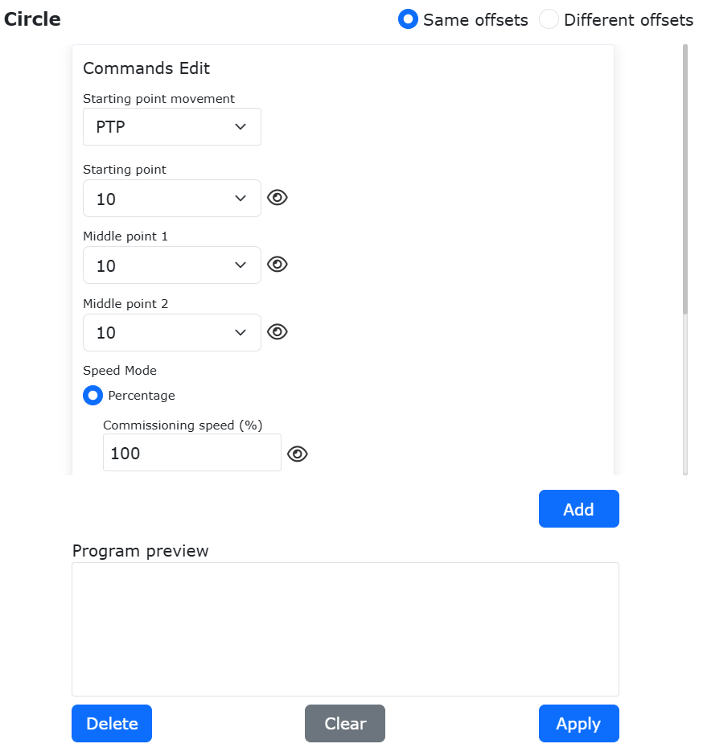

.. centered:: Figure 9.33-8 Starting Point Motion Mode and Starting Point "P1"

**Step3**: On the full circle command addition page, select "Full Circle Intermediate Point 1" as point "P2", and "Full Circle Intermediate Point 2" as point "P3".

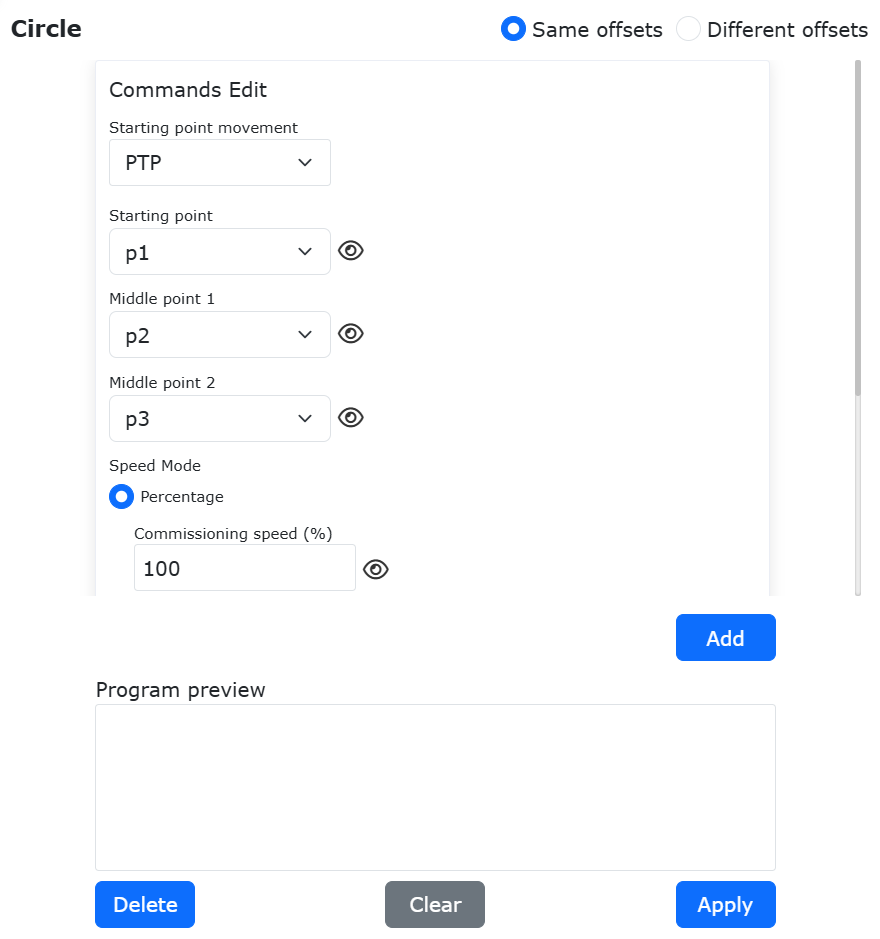

.. centered:: Figure 9.33-9 Select Arc Intermediate Points and End Point

**Step4**: Select the speed mode and input the speed value.

The Circle command allows selecting the motion speed mode as "Percentage" or "Physical Speed":

- Percentage: Input the debugging speed percentage. The robot moves at a percentage of its maximum speed. The actual robot motion speed is calculated as: V = Robot Maximum Speed × Global Speed Percentage × Debugging Speed Percentage. Hover the mouse over the small eye icon to the right of the "Debugging Speed" input box to display the actual physical speed (unit: mm/s) of the robot in both manual and automatic modes under the current debugging speed setting.

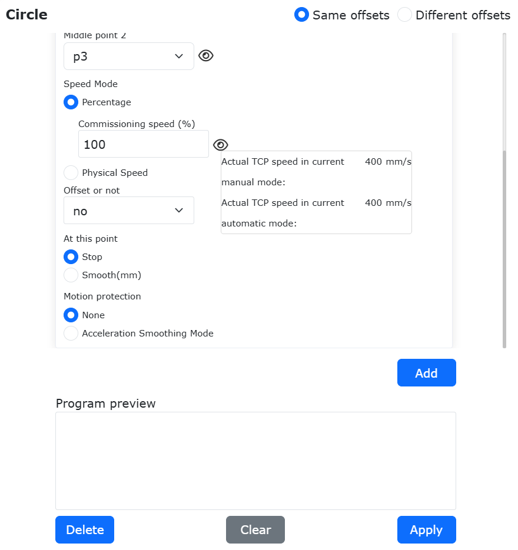

.. centered:: Figure 9.33-10 Input Percentage to Display Actual Physical Speed Value

- Physical Speed: The input speed is the actual operating speed of the robot, unit mm/s; the input acceleration is usually set to twice the speed. (The maximum physical speed of the Circle command is limited by the global speed percentage. If the robot's maximum operating speed is 1000mm/s and the global speed is 50%, then the maximum physical speed for the Circle command is 1000 × 50% = 500mm/s).

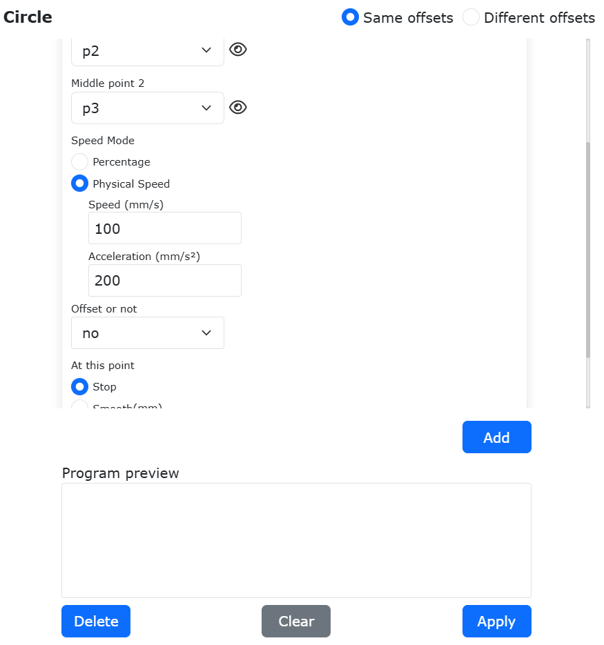

.. centered:: Figure 9.33-11 Input Actual Physical Speed

**Step5**: Click the "Add" button and then the "Apply" button sequentially. Now the "testCircle.lua" program has the full circle motion command added.

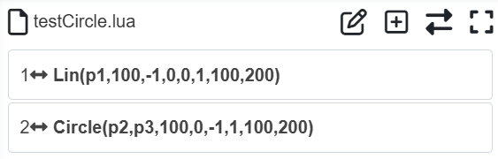

.. centered:: Figure 9.33-12 Full Circle Motion Command Added

Switch the robot to automatic mode and, ensuring safety, start the program. The robot will then move along the full circular trajectory.

Smart Tool
+++++++++++++++++++++++++++++++++++

Under the "Auxiliary Applications" -> "Tool Applications" menu bar, click "Smart Tool" to enter the Smart Tool configuration function interface.

Configure keys A-E and the IO key sequentially. After Smart Tool configuration is complete, the robot internally maintains the function corresponding to each button. When it detects that a button is pressed, it automatically executes the function item corresponding to that button.

A-E Key Functions:

- Motion Command: When selecting PTP, LIN, or ARC motion commands, the corresponding point speed needs to be input. Among them, LIN and ARC commands can choose "Percentage" or "Physical Speed":
- Percentage: Input the point speed percentage. The robot moves at a percentage of its maximum speed. The actual robot motion speed is calculated as: V = Robot Maximum Speed × Global Speed Percentage × Point Speed Percentage. Hover the mouse over the small eye icon to the right of the "Point Speed" input box to display the actual physical speed (unit: mm/s) of the robot in both manual and automatic modes under the current speed setting.

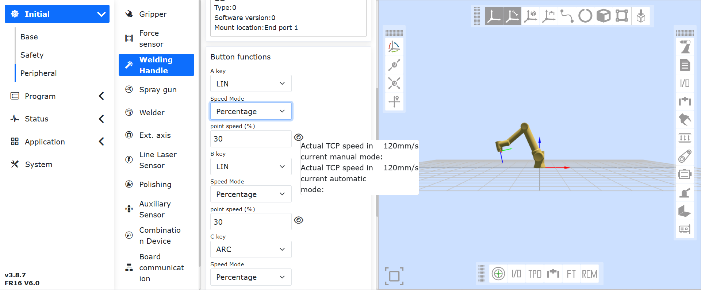

.. centered:: Figure 9.33-13 Input Percentage to Display Actual Physical Speed Value
 
- Physical Speed: The input speed is the actual operating speed of the robot, unit mm/s; the input acceleration is usually set to twice the speed. (The maximum physical speed is limited by the global speed percentage. If the robot's maximum operating speed is 1000mm/s and the global speed is 50%, then the maximum physical speed is 1000 × 50% = 500mm/s).

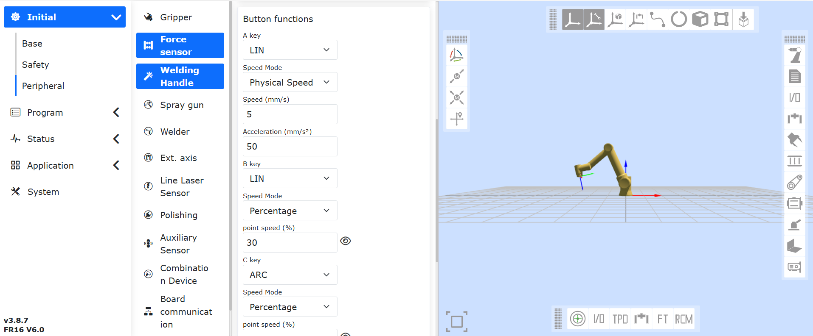

.. centered:: Figure 9.33-14 Input Actual Physical Speed

After successful configuration, a related motion command is added to the teach program. When configuring an ARC motion command, a PTP/LIN command must be configured first.

- DO Output: When "DO Output" is selected, a dropdown box appears allowing selection of output options DO0⁓DO7.

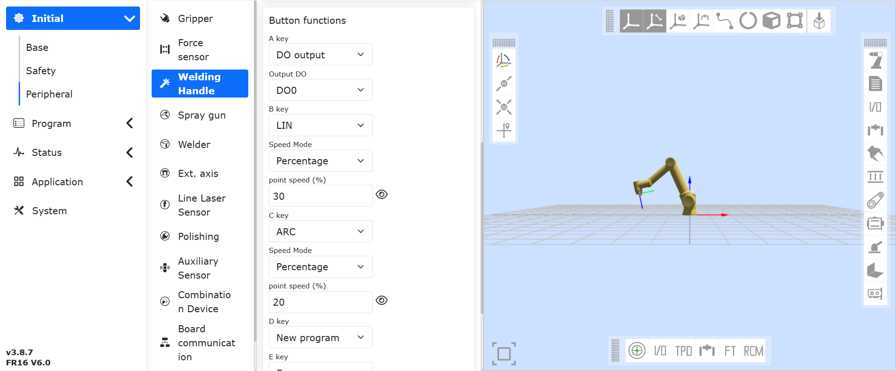

.. centered:: Figure 9.33-15 Smart Tool Configuration (A-E Keys)

IO Key Function:

- IO Signal Configuration: The dropdown box allows selection of DO0⁓DO7 options, CO0⁓CO7 options, End-DO0, End-DO1, and extended IO (Aux-DO0⁓Aux-DO127);
- Combined Command: After selecting "IO Signal", under specific conditions, the "Welder Selection" and "Point Speed" configuration items are displayed, generating different program commands.

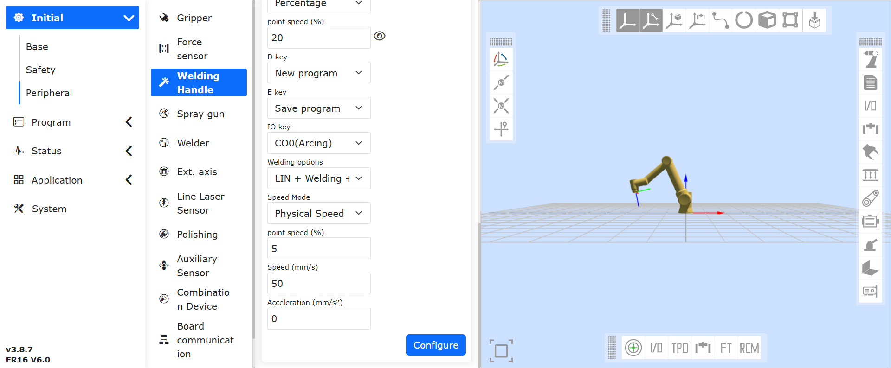

.. centered:: Figure 9.33-16 Smart Tool Configuration (IO Key)

.. important::
   - When the IO signal is configured as DO0~DO7 or CO0~CO7 (without "Arc Start" configured), the program adds SetDO; "Weld Selection" and "Point Speed" are hidden at this time.
   - When the IO signal is configured as End-DO0 or End-DO1, the program adds SetToolDO; "Weld Selection" and "Point Speed" are hidden at this time.
   - When the IO signal is configured as Extended IO (without "Welder Arc Start" configured), the program adds SetAuxDO; "Weld Selection" and "Point Speed" are hidden at this time.
   - When the IO signal is configured as CO0~CO7 (with "Arc Start" configured) and "Welder Selection" is "None", the program adds SetDO; "Weld Selection" and "Point Speed" are hidden at this time.
   - When the IO signal configuration item is Extended IO (with "Welder Arc Start" configured) and "Welder Selection" is "None", the program adds SetAuxDO; "Weld Selection" and "Point Speed" are hidden at this time.
   - When the IO signal is configured as CO0~CO7 (with "Arc Start" configured) or Extended IO (with "Welder Arc Start" configured) and "Welder Selection" is "Welding", the first press adds ARCStart, the second press adds ARCEnd, the third press adds ARCStart, the fourth press adds ARCStart, alternating and repeating the above operations; "Weld Selection" and "Point Speed" are hidden at this time.
   - When the IO signal is configured as CO0~CO7 (with "Arc Start" configured) or Extended IO (with "Welder Arc Start" configured) and "Welder Selection" is "LIN+Welding", the first press adds LIN and ARCStart, the second press adds LIN and ARCEnd, the third press adds LIN and ARCStart, the fourth press adds LIN and ARCEnd, alternating and repeating the above operations; "Weld Selection" and "Point Speed" are displayed at this time.
   - When the IO signal is configured as CO0~CO7 (with "Arc Start" configured) or Extended IO (with "Welder Arc Start" configured) and "Welder Selection" is "LIN+Welding+Weaving", the first press adds LIN, ARCStart, and WeaveStart, the second press adds LIN, ARCEnd, and WeaveEnd, the third press adds LIN, ARCStart, and WeaveStart, the fourth press adds LIN, ARCEnd, and WeaveEnd, alternating and repeating the above operations; "Weld Selection" and "Point Speed" are hidden at this time.

Impedance Control Function During Robot Motion
~~~~~~~~~~~~~~~~~~~~~~~~~~~~~~~~~~~~~~~~~~~~~~~~~~~~~~~~~~~~~~~~~~~~~~~~~~~

Overview
++++++++++++++++++++++++++++++++++++++

The impedance control function enables real-time detection of external forces. When the set threshold is reached, it actively complies with the external force, deviates from the motion trajectory, and returns to the motion trajectory after the external force drops below the threshold, thereby achieving better human-robot interaction. When an external force exceeding the preset force threshold is detected, this function drives the robotic arm to generate an offset in the direction of the force, achieving an active avoidance effect. After the external force is removed, the robotic arm returns to the vicinity of the original motion trajectory, thus enhancing safety during human-robot collaboration.

Impedance Control Function
+++++++++++++++++++++++++++++++++++++++++++

Impedance Control Configuration and Function Start/Stop in Cartesian Space
******************************************************************************************

**Step1**: Log in to the web interface, sequentially click "Initial Settings" → "Basic" → "Joints" → "Collision Level" to enter the robot collision level setting module, and set a reasonable collision coefficient, as shown in Figure 2-1.

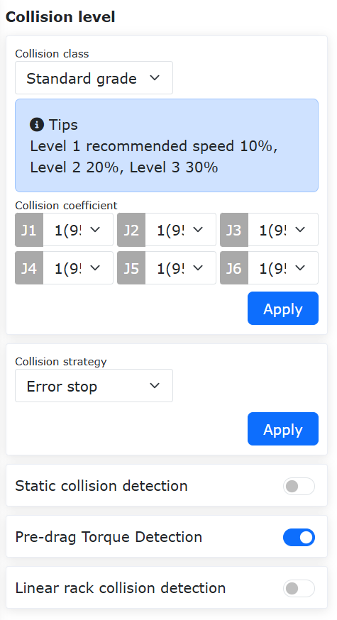

.. centered:: Figure 9.34-1 Robot Collision Coefficient Setting Module

**Step2**: To use a force sensor to implement the impedance control function, the force sensor must be configured in the end effector peripheral configuration under "Peripherals" → "End Effector". If choosing not to use a force sensor to implement the impedance control function, this step is not required.

**Step3**: Sequentially click "Teach Program" → "Program Programming" → "Force Control Set", and add the "Impedance" command. The "Impedance" command enables the robot to implement impedance control on the running trajectory (Currently, only impedance control in Cartesian space is available).

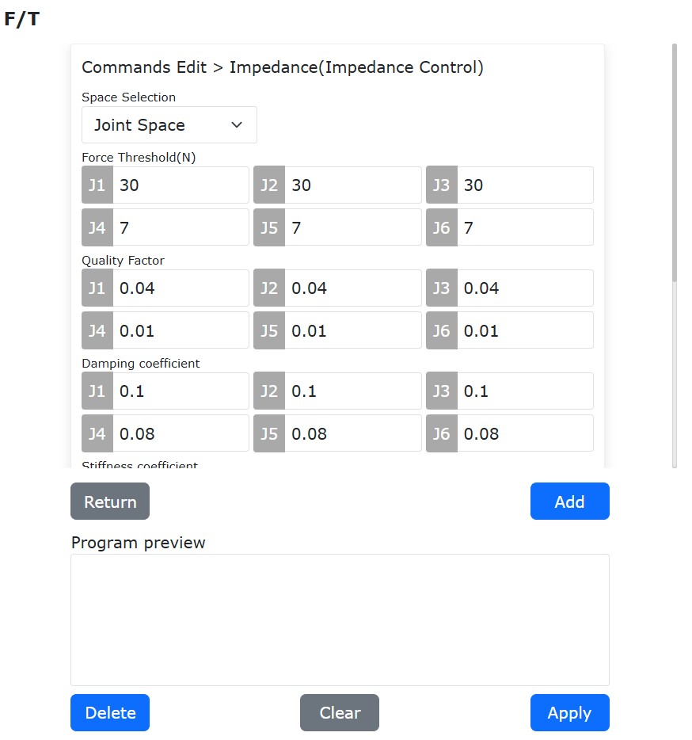

.. centered:: Figure 9.34-2 Adding Force Control Command

**Step4**: In the force control command module, select "Cartesian Space" from the space selection dropdown menu. Set appropriate values in the text boxes for force threshold, mass coefficient, damping coefficient, stiffness coefficient, maximum linear velocity, maximum linear acceleration, maximum angular velocity, and maximum angular acceleration. Click "Enable" under command type, then click "Add" to add the impedance control enable command; click "Disable" under command type, then click "Add" to add the impedance control disable command.

.. image:: coding/475.png
   :width: 6in
   :align: center

.. centered:: Figure 9.34-3 Impedance Control Command Example

**Step5**: During operation, if the robotic arm stops running and the lower left corner of the Web interface displays "500 Error: Current collision level is too low", this is because the set force threshold is greater than the trigger threshold of the collision level. At this point, increasing the collision level or decreasing the force threshold will resolve this error.

.. image:: coding/476.png
   :width: 6in
   :align: center

.. centered:: Figure 9.34-4 Collision Level Too Low Warning

**Step6**: During operation, if the robotic arm stops running and the lower right corner of the Web interface displays "Collision Fault", this is because the external force on the robotic arm has exceeded the trigger threshold of the collision level, thereby triggering a collision fault.

.. image:: coding/477.png
   :width: 6in
   :align: center

.. centered:: Figure 9.34-5 Collision Fault Warning

Specific Functions and Recommended Values of Parameters:

- Space Selection: Sets the operational space for impedance control. Currently, only Cartesian space impedance control is available.
- Force Threshold: The minimum trigger force for impedance control. The range for the translational direction force threshold is 30–150N, and for the rotational direction force threshold is 7–30Nm.
- Mass Coefficient: Increasing the mass coefficient will cause the offset to be slower, decreasing it will cause the robot offset to be too fast. The range for the translational direction is [0.01-1], recommended value is 0.04; the range for the rotational direction is [0.001-1], recommended value is 0.01.
- Damping Coefficient: Increasing the damping coefficient will cause the offset to be slower, decreasing it will cause the robot offset to be too fast, resulting in oscillation. The range for the translational direction is [0.1-2], recommended value is 0.1; the range for the rotational direction is [0.008-1.5], recommended value is 0.08.
- Stiffness Coefficient: Increasing the stiffness coefficient will cause the offset to be slower. Recommended value is 0.
- Maximum Linear Velocity: Limits the velocity generated by external forces in the translational direction. Recommended value is 250mm/s.
- Maximum Linear Acceleration: Limits the acceleration generated by external forces in the translational direction. Recommended value is 500mm/s².
- Maximum Angular Velocity: Limits the angular velocity generated by external forces in the rotational direction. Recommended value is 90°/s.
- Maximum Angular Acceleration: Limits the angular acceleration generated by external forces in the rotational direction. Recommended value is 180°/s².

Custom Weaving Welding Function
~~~~~~~~~~~~~~~~~~~~~~~~~~~~~~~~~~~~~~~~~~~~~~~~~~~~~~~~~~~~~~~~~~~~~~~~~~~

Overview
++++++++++++++++++++++++++++++++

The custom weaving welding function allows the execution of weaving using a pattern designed by the user.

Description of the Custom Weaving Welding Function:

- (1) In the weaving parameters interface, select any one of the weaving types: "Custom Weave 0", "Custom Weave 1", or "Custom Weave 2". A maximum of 3 custom weaving patterns can be set.
- (2) The number of custom weaving endpoints can be set to a maximum of 10 and a minimum of 2. The X, Y, Z data of the last endpoint is fixed at 0 and cannot be modified, though the dwell time for all endpoints can be set.
- (3) The X, Y, and Z values of the custom weaving endpoints must be within the range of -10mm to 10mm, and the weaving frequency must not exceed 10 Hz.
- (4) Currently, linear, circular, and full-circle trajectories support custom weaving welding, but the weaving gradient function is not yet supported.
- (5) Note: When the weaving dwell time is set to "Include", the total weaving dwell time must not exceed half of the weaving cycle time.

Operational Procedure for Custom Weaving Welding Function
++++++++++++++++++++++++++++++++++++++++++++++++++++++++++

The operational procedure for the custom weaving welding function is as follows:

**Step 1**: First, record the start and end teach points of the linear trajectory. Then, click "Teach Program" -> "Program Editing", select "Point to Point" to move the robot end to the linear start point "custWeaveP1". Finally, select "Linear" to move the robot to the linear end point "custWeaveP2".

**Step 2**: Select the "Weaving" button, click the weaving process editing button to enter the weaving parameters setting interface. Select "Custom Weave N" (N=0, 1, 2) for the "Weaving Type".

.. centered:: Chart 9.35-1 Weaving Parameters Setting Interface

**Step 3**: After selecting the "Weaving Type", scroll down in the weaving parameters setting interface. In this interface, select the number of custom weaving endpoints, set the position and dwell time of each point in the weaving coordinate system, and finally click the "Configure" button.

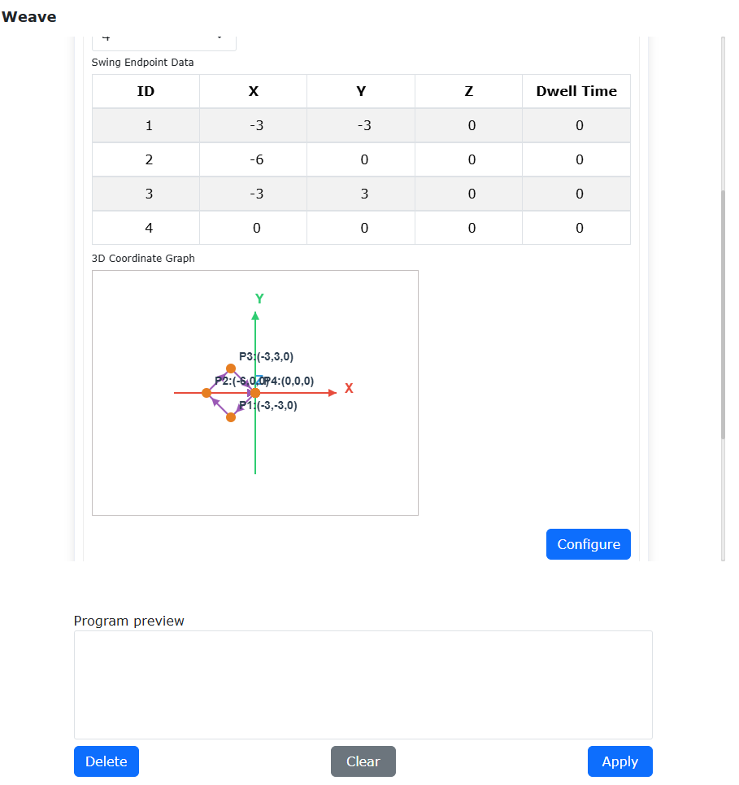

.. centered:: Chart 9.35-2 Custom Weaving Setting Interface

**Step 4**: In the weaving interface, sequentially select "Start Weaving" and "Stop Weaving" in the "Command Type" dropdown, click the "Add" button, and finally click the "Apply" button.

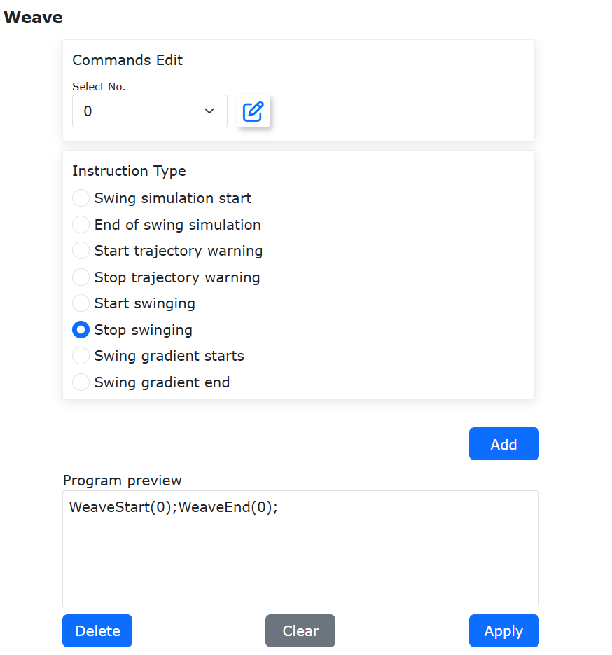

.. centered:: Chart 9.35-3 Weaving Command Setting Interface

**Step 5**: In the program editing interface, select the weaving start command, click the "Move Up" button at the top of the interface, and finally save the program. Switch the robot to automatic mode and click the "Start" button. The robot will then begin custom weaving along the linear trajectory.

.. image:: coding/481.png
   :width: 6in
   :align: center

.. centered:: Chart 9.35-4 Original LUA Command Interface

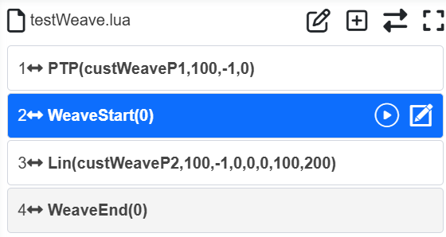

.. centered:: Chart 9.35-5 Modified LUA Command Interface

**Step 6**: The steps for setting up custom weaving for circular and full-circle trajectories are the same as Step 1 to Step 5 above.

Teach point configuration
~~~~~~~~~~~~~~~~~~~~~~~~~~~~~~~~~~~~

Click "Points Config." to enter the teaching point configuration interface.

Before using the button box or other IO signals to record the teaching point function, the user first configures the teaching point name prefix, the upper limit of the number and the teaching method. The name prefix supports two modes: custom prefix and current program name as the prefix. For example, customize the name prefix "P", number upper limit "3", teaching method "robot teaching", record the current end (tool) points of the robot in sequence: P1, P2, P3, and record again will overwrite the previous record points.

.. image:: coding/483.png
   :width: 4in
   :align: center

.. centered:: Chart 9.36-1 Teach point configuration

End-point dot automatic overwrite update Lua program function
++++++++++++++++++++++++++++++++++++++++++++++++++++++++++++++++++++++++++++++++++++

End-point dot configuration
********************************************

1. Enable the end-point dot function and click on settings. You can use the switch to select the Lua programs that need to be updated for specific positions. 

.. image:: coding/484.png
   :width: 4in
   :align: center

.. centered:: Chart 9.36‑2 Enable end point recording

2. The configuration is complete, with the end-tip dot name prefixed as "test", the numbering limit set to 10, and all Lua programs selected for enabling updates. Close the webApp, and the function remains active.
   
End-button dot automatic update Lua program
************************************************************

1. Click the robot end-point dot button.

.. image:: coding/485.png
   :width: 4in
   :align: center

.. centered:: Chart 9.36‑3 end-point dot button

2. At this point, the end-tip LED flashes: with the purple light flashing (start) -> blue light on (dot recording and updating in Lua) -> green light on (dot recording completed), and the position information corresponding to the selected Lua program's name is synchronized and updated.

.. image:: coding/486.png
   :width: 4in
   :align: center

.. centered:: Chart 9.36‑3 End-tip dot recording and updating Lua program LED changes

3. When the dot recording fails, the end-tip LED flashes: Purple light flashing (start) -> Red light flashing (dot recording failed) -> Green light on (returning to normal).

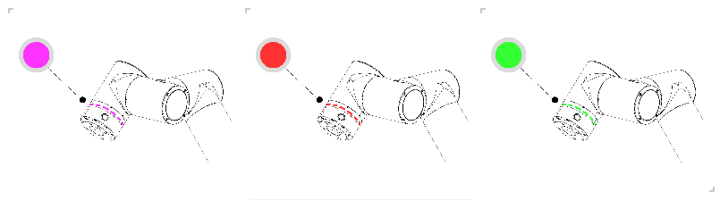

.. centered:: Chart 9.36‑4 LED changes when end-tip dot recording fails

Function usage example
******************************************

1. Click on Auxiliary Applications - Tool Applications - Teaching Point Configuration, customize the prefix to "test", set the number limit to 5, select Robot Teaching as the teaching method, enable the end-point dot function, and click on settings.

2. Activate the Lua program "program1" that requires position updates.

.. image:: coding/488.png
   :width: 4in
   :align: center

.. centered:: Chart 9.36‑5 Teaching Point Configuration

3. As shown below, it depicts the "program1" program and its current running trajectory.

.. image:: coding/489.png
   :width: 6in
   :align: center

.. centered:: Chart 9.36‑6 Program1 program and its current running trajectory

4. Switch the page to manual mode, move the robot to a new position, click the end-tip dot button, and wait for the end-tip LED to complete its flashing sequence: Purple light flashing (start) -> Blue light on (dot recording and updating in Lua) -> Green light on (dot recording completed), at which point the recorded position is labeled as test1.

5. Repeat step 4 to record positions "test2," "test3," "test4," and "test5," completing the recording of 5 points. At this stage, the positions for the "program1" program have been synchronized and updated.

6. Re-run the "program1" program. The motion trajectory will have been updated, and the updated motion trajectory is shown below.

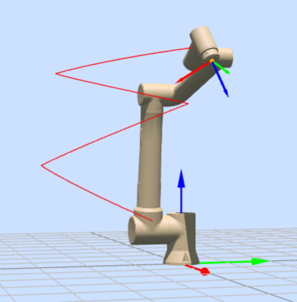

.. centered:: Chart 9.36‑7 Updated running trajectory

Main program configuration
~~~~~~~~~~~~~~~~~~~~~~~~~~~~~~~~~~~~

Click "Main program" to enter the main program configuration function interface.

The configuration of the main program can be used in conjunction with the DI configuration of the main program startup. The configured main program needs to be trial run first to ensure safety. After configuring the corresponding DI in the robot settings to start the main program signal function, the user can control the DI signal to run the main program.

.. image:: coding/491.png
   :width: 4in
   :align: center

.. centered:: Chart 9.37‑1 Main program configuration

Robot Extended Axis Intersecting Line Welding
~~~~~~~~~~~~~~~~~~~~~~~~~~~~~~~~~~~~~~~~~~~~~~~~~~~~~~~~~~~~~~~~~~

System Configuration
++++++++++++++++++++++++++++++++++

.. image:: coding/497.png
   :width: 6in
   :align: center

.. centered:: Figure 9.38‑1 Robot Extended Axis Intersecting Line Welding System Configuration

In the system, (a) is the computer, (b) is the robot and its control box, (c) is the positioner and drive equipment, (d) is the welder and supporting equipment.

Extended Axis Communication Configuration
++++++++++++++++++++++++++++++++++++++++++++++++++++++++

The communication methods between the robot and the extended axis include using UDP or RS485.

.. image:: coding/498.png
   :width: 6in
   :align: center

.. centered:: Figure 9.38‑2 Extended Axis Configuration Page

Click "Initial Setup", "Peripherals", "Extended Axis" on the robot operation interface to enter the extended axis configuration page. Taking using a PLC connected to the robot via UDP communication as an example, click the "UDP Communication" icon to enter the extended axis configuration page for UDP communication.

.. image:: coding/499.png
   :width: 6in
   :align: center

.. centered:: Figure 9.38‑3 UDP Communication Configuration Interface

On the extended axis configuration page for UDP communication, you can select the corresponding extended axis number, connect and configure UDP communication parameters (address, port, cycle, packet loss detection, etc.), and the extended axis positioning completion time.

Extended axis configuration content is not the focus of this function introduction. For detailed configuration, refer to the corresponding section of the user manual.

Welder Connection Configuration
+++++++++++++++++++++++++++++++++++++++++++++++++++
Configure the welder through the following configuration page:

.. image:: coding/500.png
   :width: 6in
   :align: center

.. centered:: Figure 9.38‑4 Welder Configuration Page

Welder communication can use IO communication or RS485 communication. Click "Initial Setup", "Peripherals", "Welder" to enter the configuration and connection interface, where you can configure modules such as "Control Type", "I/O Configuration", "Welding Process Parameters", "Welder Debugging", etc.

Welder configuration content is not the focus of this function introduction. For detailed configuration, refer to the corresponding section of the user manual.

Tool Coordinate System Calibration
++++++++++++++++++++++++++++++++++++++++++++++++++++
After installing the welding torch on the robot end, calibrate the welding torch:

.. image:: coding/501.png
   :width: 6in
   :align: center

.. centered:: Figure 9.38‑5 Tool Coordinate System Configuration Page

Click "Initial Setup", "Basic", "Tool Coordinates" to enter the tool coordinate system settings page.

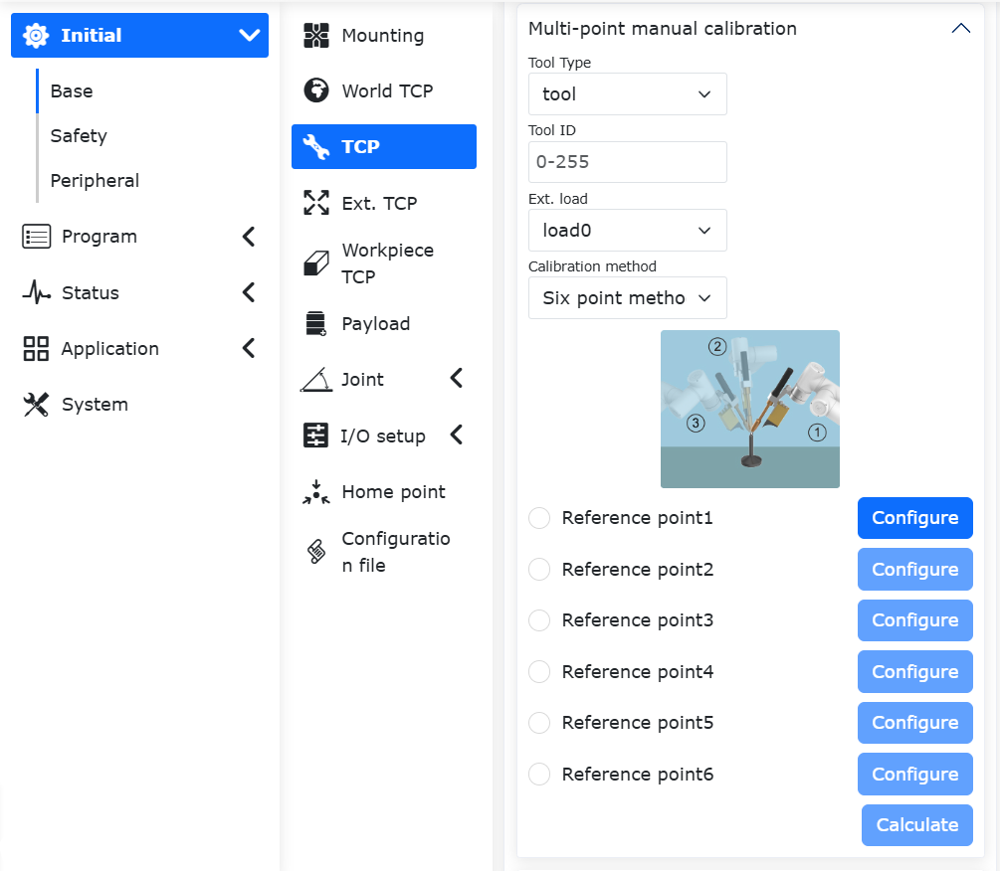

.. centered:: Figure 9.38‑6 Select the 6-Point Method to Calibrate the Welding Torch

Select an empty coordinate system, choose the tool type as "Tool", select the 6-point method to calibrate the welding torch tool. It is recommended to calibrate the posture of the tool coordinate system as shown in Figure 4-3 below.

.. image:: coding/503.png
   :width: 4in
   :align: center

.. centered:: Figure 9.38‑7 Welding Torch Coordinate System Posture Diagram

Tool coordinate system calibration content is not the focus of this function introduction. For detailed calibration methods, refer to the corresponding section of the user manual.

Intersecting Line Welding Function
+++++++++++++++++++++++++++++++++++++++

There are two forms of trajectory motion for intersecting line welding: one is using a two-degree-of-freedom L-type positioner for intersecting line motion, and the other is performing intersecting line motion directly without using a positioner.

Extended Axis Coordinate System Calibration
***************************************************

When using the extended axis coordinate system to achieve synchronized motion between the positioner and the robot, the extended axis coordinate system needs to be calibrated.

.. image:: coding/504.png
   :width: 6in
   :align: center

.. centered:: Figure 9.38‑8 Extended Axis Coordinate System Settings Page

Click "Initial Setup", "Peripherals", "Extended Axis" to enter the extended axis coordinate system settings interface. Select the extended axis number that needs to be set, click the edit button, select "1-Two-degree-of-freedom L-type Positioner" and save.

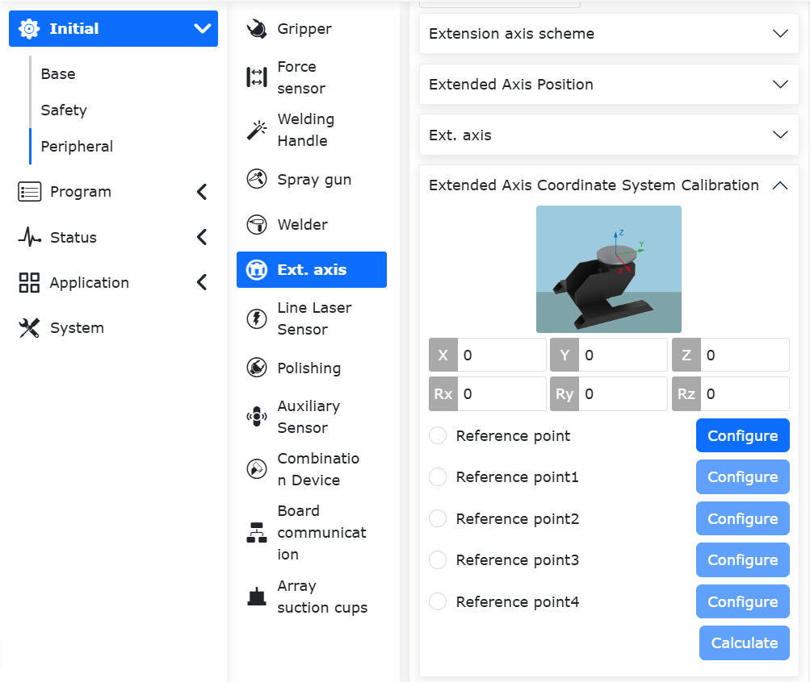

.. centered:: Figure 9.38‑9 Extended Axis Calibration Page

When calibrating the extended axis, pay attention to select "Robot Position Relative to Extended Axis" as "Outside Extended Axis". For the positioner case, select the 4-point method for calibration.

Extended axis calibration content is not the focus of this function introduction. For detailed calibration methods, refer to the corresponding section of the user manual.

Intersecting Line Trajectory Welding
***************************************************

Based on the taught points recorded on the cross-sections of the main pipe and the branch pipe, a workpiece coordinate system as shown in the figure below can be established. The origin of the coordinate system is located at the intersection point of the main pipe and branch pipe axes, the X-axis is parallel to the main pipe axis pointing towards the section where the taught points are recorded, and the Z-axis is parallel to the branch pipe axis pointing towards the plane where the taught points are recorded.

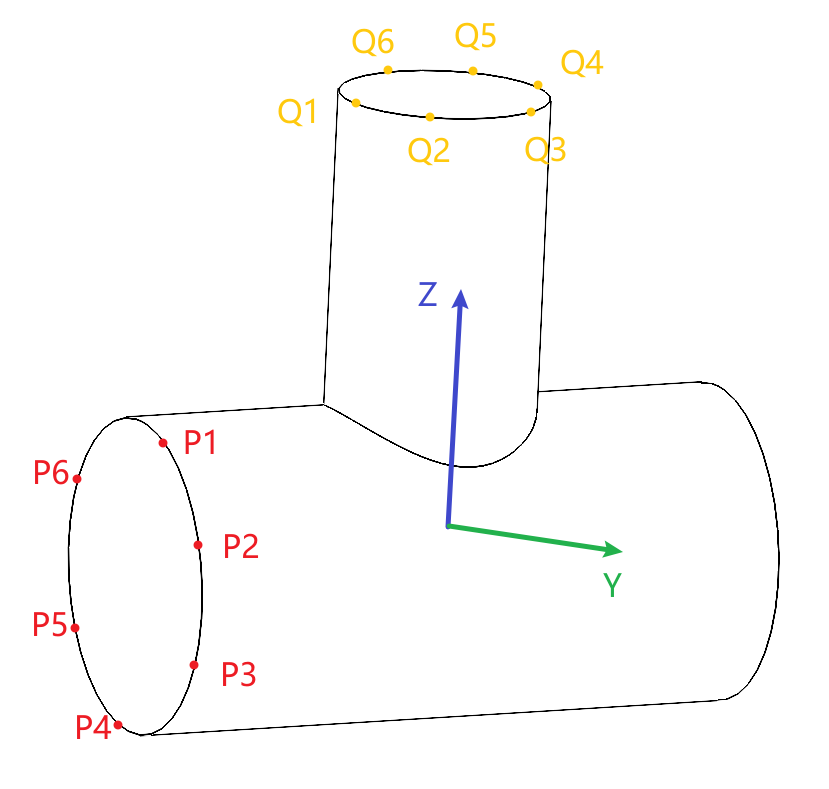

.. centered:: Figure 9.38‑10 Intersecting Line Trajectory Workpiece Coordinate System

Method Without Using a Positioner
""""""""""""""""""""""""""""""""""""""""""""""""""""""""""""""""
**Step 1**: Record 6 taught points on the cross-section of the main pipe and the cross-section of the branch pipe respectively.

**Step 2**: Click "Teach Program", "Program Programming", find "Intersecting Line" in the "Motion Instructions", and enter the intersecting line trajectory settings page.

.. image:: coding/507.png
   :width: 6in
   :align: center

.. centered:: Figure 9.38‑11 Intersecting Line Trajectory Settings Page

**Step 3**: On the intersecting line trajectory settings page, select "Disable" for "Extended Axis Points", complete the settings for starting point motion, motion direction, speed and acceleration, and offset value. The counterclockwise motion direction is the direction of the four fingers when the right hand grips the Z-axis of the workpiece coordinate system.

**Step 4**: In the "Intersecting Line Point Data" section of the intersecting line trajectory settings page, select the recorded taught points. After setting, click the "Add", "Apply" buttons.

.. image:: coding/508.png
   :width: 6in
   :align: center

.. centered:: Figure 9.38‑12 Intersecting Line Trajectory Instruction Settings

**Step 5**: Click the "Welding" button under "Welding Instructions" to enter the welding settings page, select "Arc Start" and "Arc End" instructions, click the "Add", "Apply" buttons. After successful addition, move the Arc Start LUA instruction up one line.

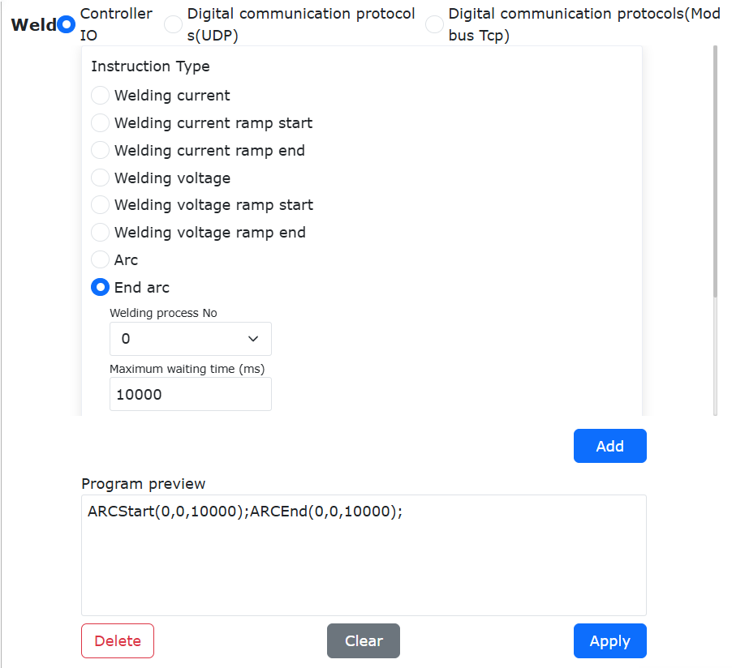

.. centered:: Figure 9.38‑13 Welding Instruction Settings

The following is a typical LUA program for intersecting line welding without a positioner:

.. image:: coding/510.png
   :width: 6in
   :align: center

.. centered:: Figure 9.38‑14 No Positioner - Intersecting Line Welding Example Program

Method Using a Two-Degree-of-Freedom L-Type Positioner
""""""""""""""""""""""""""""""""""""""""""""""""""""""""""""""""""""""""

**Step 1**: Record 6 taught points on the cross-section of the main pipe and the cross-section of the branch pipe respectively, and rotate axes 1 and 2 of the positioner to record 4 positioner taught points.

**Step 2**: Click "Teach Program", "Program Programming", find "Intersecting Line" in the "Motion Instructions", and enter the intersecting line trajectory settings page.

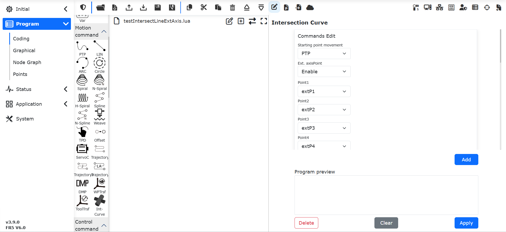

.. centered:: Figure 9.38‑15 Intersecting Line Trajectory Settings Page

**Step 3**: On the intersecting line trajectory settings page, select "Enable" for "Extended Axis Points", select the recorded positioner taught points, complete the settings for starting point motion, motion direction, speed and acceleration, and offset value.

**Step 4**: In the "Intersecting Line Point Data" section of the intersecting line trajectory settings page, select the recorded taught points. After setting, click the "Add", "Apply" buttons.

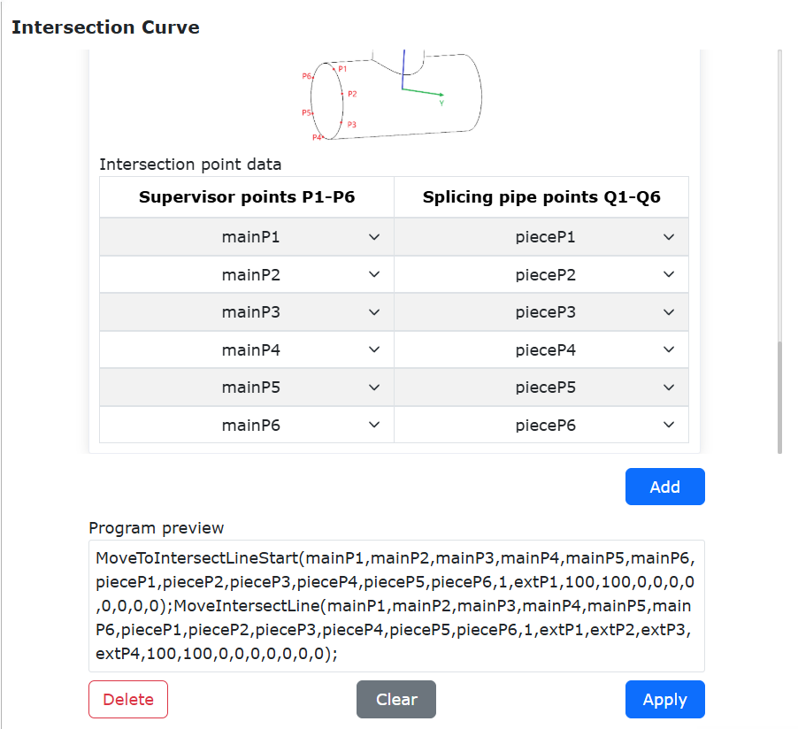

.. centered:: Figure 9.38‑16 Intersecting Line Trajectory Instruction Settings

**Step 5**: Click the "Welding" button under "Welding Instructions" to enter the welding settings page, select "Arc Start" and "Arc End" instructions, click the "Add", "Apply" buttons. After successful addition, move the Arc Start LUA instruction up one line.

.. image:: coding/513.png
   :width: 6in
   :align: center

.. centered:: Figure 9.38‑17 Welding Instruction Settings

The following is a typical LUA program for positioner-based intersecting line welding:

.. image:: coding/514.png
   :width: 6in
   :align: center

.. centered:: Figure 9.38‑18 Positioner - Intersecting Line Welding Example Program