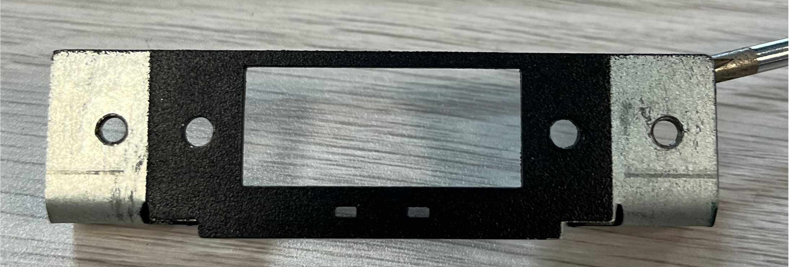
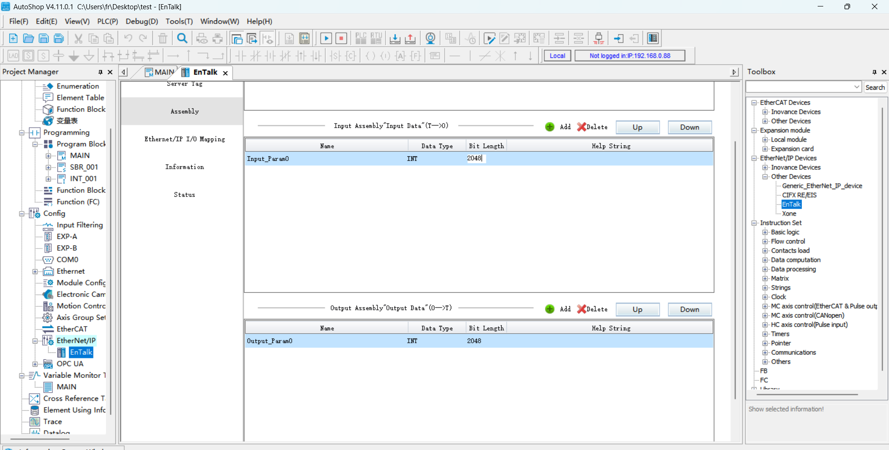

Modalità Slave del Robot
===============================================================

.. toctree:: 
   :maxdepth: 6

Panoramica
-------------------

Per facilitare il controllo del movimento del robot da parte del PLC attraverso diversi protocolli bus industriali (CC-Link, Profinet, Ethernet/IP, EtherCAT), vengono aggiunte le schede FRJ-PCIeN-EIP/CC/PN-RJ-V10 e FRJ-PCIeN-EC/PN/EIP/CC-RJ-V20 allo scatolo di controllo mini integrato. Viene sviluppata la modalità slave del robot per realizzare le seguenti funzioni:

- 1. Il dispositivo master invia segnali di ingresso allo slave del robot per controllare l'esecuzione di azioni corrispondenti, ad esempio: controllare l'uscita DO dello scatolo di controllo del robot, controllare il movimento del robot, ecc.;

- 2. Il dispositivo master legge il valore dell'indirizzo corrispondente per ottenere i dati di stato in tempo reale del robot corrispondenti, ad esempio: dati delle articolazioni del robot, posizione TCP, se il robot ha completato il movimento, ecc.

Configurazione Ambientale
--------------------------

Il modello della scheda e la versione del software sono descritti come segue:

.. list-table:: 
   :widths: 20 50 30
   :header-rows: 1
   :align: center

   * - **Tipo di Protocollo**
     - **Modello Scheda**
     - **Versione Software Robot**

   * - CC-Link IEF Basic
     - Scheda FRJ-PCIeN-EIP/CC/PN-RJ-V10
     - V3.8.4 e successive

   * - CC-Link IEF Basic
     - Scheda FRJ-PCIeN-EC/PN/EIP/CC-RJ-V20
     - V3.9.6 e successive

   * - Profinet
     - Scheda FRJ-PCIeN-EIP/CC/PN-RJ-V10
     - V3.8.4 e successive

   * - Profinet
     - Scheda FRJ-PCIeN-EC/PN/EIP/CC-RJ-V20
     - V3.9.6 e successive

   * - Ethernet/IP
     - Scheda FRJ-PCIeN-EIP/CC/PN-RJ-V10
     - V3.8.4 e successive

   * - Ethernet/IP
     - Scheda FRJ-PCIeN-EC/PN/EIP/CC-RJ-V20
     - V3.9.6 e successive

   * - EtherCAT
     - Scheda FRJ-PCIeN-EC/PN/EIP/CC-RJ-V20
     - V3.9.6 e successive

Installazione della Scheda
~~~~~~~~~~~~~~~~~~~~~~~~~~~~~~~~~~~~~~~~~~~~~~~~~~~~~~

(1) Verifica dei materiali: L'aspetto della scheda FRJ-PCIeN e delle relative parti in lamiera è mostrato di seguito.

.. centered:: Figura 19.2-1 Lamiera di Installazione (Anteriore)

.. image:: remote_mode/002.png
   :width: 4in
   :align: center

.. centered:: Figura 19.2-2 Lamiera di Installazione (Posteriore)

.. image:: remote_mode/003.png
   :width: 4in
   :align: center

.. centered:: Figura 19.2-3 Scheda FRH-PCIeN-EC/EIP/CC/PN-RJ-V10

.. image:: remote_mode/004.png
   :width: 4in
   :align: center

.. centered:: Figura 19.2-4 Scheda FRJ-PCIeN-EIP/CC/PN-RJ-V10

(2) Installare la scheda nello scatolo di controllo mini integrato, come mostrato in figura.

.. image:: remote_mode/005.png
   :width: 4in
   :align: center

.. centered:: Figura 19.2-5 Diagramma di Installazione della Lamiera

.. image:: remote_mode/008.png
   :width: 4in
   :align: center

.. centered:: Figura 19.2-6 Diagramma di Installazione della Scheda Madre Principale

.. image:: remote_mode/009.png
   :width: 4in
   :align: center

.. centered:: Figura 19.2-7 Diagramma di Installazione della Scheda di Espansione Porta RJ45

.. note:: Nota: Tutte le viti devono essere serrate.

(3) Il cablaggio tra lo scatolo di controllo del robot e il PLC è mostrato nella figura seguente.

.. image:: remote_mode/010.png
   :width: 4in
   :align: center

.. centered:: Figura 19.2-8 Diagramma di Cablaggio Scatolo di Controllo & PLC Mitsubishi    

.. image:: remote_mode/011.png
   :width: 4in
   :align: center

.. centered:: Figura 19.2-9 Diagramma di Cablaggio Scatolo di Controllo & PLC Siemens

.. image:: remote_mode/012.png
   :width: 4in
   :align: center

.. centered:: Figura 19.2-10 Diagramma di Cablaggio Scatolo di Controllo & PLC Inovance

.. image:: remote_mode/013.png
   :width: 4in
   :align: center

.. centered:: Figura 19.2-11 Diagramma di Cablaggio Scatolo di Controllo & PLC Inovance

.. note:: 
    1: Scatolo di controllo del robot (porta di rete della scheda);
    2: Switch;
    3: PC portatile;
    4: PLC Mitsubishi (porta di rete CC-Link IEF Basic);
    5: PLC Siemens (porta di rete Profinet);
    6: PLC Inovance (Ethernet/IP);
    7: PLC Inovance (porta di rete EtherCAT);
        
Configurazione Ambiente PLC
~~~~~~~~~~~~~~~~~~~~~~~~~~~~~~~~~~~~~~~~~~~~~~~~~~~~~~~~

L'ambiente di test realizzato per implementare i comandi slave di ciascun protocollo è mostrato nella tabella seguente, inclusi il modello di PLC, la versione del firmware e il software di test utilizzati in ciascun protocollo.

.. centered:: Tabella 2-1 Ambiente di Test

.. list-table:: 
   :widths: 20 40 40
   :header-rows: 1
   :align: center

   * - Protocollo
     - Profinet
     - CC-link

   * - Marca
     - Siemens
     - Mitsubishi

   * - Modello
     - CPU 1515-2 PN
     - FX5S-30TR/DS

   * - Firmware
     - 6ES75152AM020AB0
     - 30MR/ES V1.3

   * - Software
     - TIA Portal V17
     - GXWorks3V1.097B

   * - Indirizzo IP Scheda
     - Configurabile
     - Configurabile

   * - Indirizzo IP PLC
     - Non necessario sulla stessa sottorete
     - Stessa sottorete
		
.. list-table:: 
   :widths: 20 40 40
   :header-rows: 1
   :align: center

   * - Protocollo
     - Ethernet/IP
     - EtherCAT

   * - Marca
     - Inovance
     - Inovance

   * - Modello
     - Easy521-0808TN
     - Easy521-0808TN

   * - Firmware
     - /
     - /

   * - Software
     - AutoShop 4.11.0.1
     - AutoShop 4.11.0.1

   * - Indirizzo IP Scheda
     - Configurabile
     - Configurabile

   * - Indirizzo IP PLC
     - Stessa sottorete
     - Stessa sottorete
		
Inovance Ethernet/IP
+++++++++++++++++++++++++++++++++++++++++++++++++++++

(1) Importazione File EDS

Aprire il software di programmazione Inovance AutoShop, creare un nuovo progetto PLC, selezionare "EtherNet/IP Devices" nella barra degli strumenti di destra.

Fare clic con il tasto sinistro su "EtherNet/IP", quindi fare clic con il tasto destro per visualizzare la finestra di dialogo "Importa EDS". Confermare con il tasto sinistro e trovare la cartella contenente il file EDS della scheda. Dopo l'importazione riuscita, il nome della scheda apparirà nella directory "EtherNet/IP Devices". Chiudere il progetto e riaprirlo per completare l'importazione del file EDS.

.. image:: custom_protocol_slave/001.png
   :width: 6in
   :align: center

.. image:: custom_protocol_slave/002.png
   :width: 6in
   :align: center

(2) Impostazioni Parametri EtherNet/IP

Fare doppio clic sullo slave sotto "EtherNet/IP" nella barra degli strumenti di sinistra per visualizzare la finestra di impostazione dei parametri:

.. image:: custom_protocol_slave/003.png
   :width: 6in
   :align: center

Inserire l'indirizzo IP della scheda:

.. image:: custom_protocol_slave/004.png
   :width: 6in
   :align: center

Fare clic per selezionare "Connessione" per impostare la dimensione in byte dell'input e dell'output dei dati:

.. image:: custom_protocol_slave/005.png
   :width: 6in
   :align: center

Fare clic su "Modifica connessione" per accedere alla finestra pop-up e modificare sia i byte di input che di output in 256:

.. image:: custom_protocol_slave/006.png
   :width: 6in
   :align: center

Fare clic per selezionare "Set di dati", impostare il tipo di dati di input e output su "INT" e la lunghezza del bit su "2048":

.. image:: custom_protocol_slave/007.png
   :width: 6in
   :align: center

.. image:: custom_protocol_slave/008.png
   :width: 6in
   :align: center

Dopo aver impostato con successo i parametri del "Set di dati", fare clic per selezionare "Mappatura I/O EtherNet/IP" e inserire rispettivamente D0 e D200. D0 e D200 corrispondono rispettivamente agli indirizzi iniziali degli array di ricezione e invio sul lato PLC.

.. image:: custom_protocol_slave/010.png
   :width: 6in
   :align: center

.. image:: custom_protocol_slave/011.png
   :width: 6in
   :align: center

(3) Download del Programma

Aprire il programma di test, modificare l'indirizzo IP del PLC in modo che sia sulla stessa sottorete della scheda, eseguire il programma dopo il download.

Siemens Profinet
++++++++++++++++++++++++++++++++++++++++++++++++++++++++

(1) Importazione File GSD (File XML)

Aprire il software di programmazione Siemens TIA Portal V17, creare un nuovo progetto PLC, selezionare "Dispositivi e reti", fare doppio clic su 6ES7 515-2AM02-0AB0 nel "Catalogo hardware" a destra per aggiungere il modulo PLC.

.. image:: custom_protocol_slave/012.png
   :width: 6in
   :align: center

Nel menu della barra degli strumenti del software TIA PORTAL, selezionare "Opzioni" -> "Gestisci file di descrizione stazione generale (GSD)" per installare o eliminare i file GSD già installati.

.. image:: custom_protocol_slave/013.png
   :width: 6in
   :align: center

Per installare i file GSD, selezionare "Gestisci file di descrizione stazione generale (GSD)" come sopra, appare la finestra "Gestisci file di descrizione stazione generale".

Selezionare la cartella contenente i file GSD da installare dal "Percorso sorgente", selezionare uno o più file da installare dall'elenco dei file GSD visualizzato e fare clic sul pulsante "Installa". Come mostrato nella figura sottostante.

.. image:: custom_protocol_slave/014.png
   :width: 6in
   :align: center

Dopo l'installazione riuscita, il dispositivo con il file GSD installato può essere trovato sotto "Altri dispositivi di campo" nel catalogo hardware, come mostrato nella figura sottostante.

.. image:: custom_protocol_slave/015.png
   :width: 6in
   :align: center

Assegnazione IO: Cercare i moduli nella directory e trascinare Input e Output.

.. image:: custom_protocol_slave/016.png
   :width: 6in
   :align: center

Compilare il programma: Fare doppio clic per entrare in "Dispositivi e reti" nell'albero del progetto a sinistra, fare clic con il tasto destro sul modulo "PLC_1", selezionare "Compila" dal menu a discesa e fare clic su "Hardware e software (solo modifiche)". Al termine della compilazione, apparirà "Compilazione completata" nella parte inferiore della visualizzazione del software:

.. image:: custom_protocol_slave/017.png
   :width: 6in
   :align: center

.. image:: custom_protocol_slave/018.png
   :width: 6in
   :align: center

Scaricare il programma sul dispositivo: Fare doppio clic per entrare in "Dispositivi e reti" nell'albero del progetto a sinistra, fare clic con il tasto destro sul modulo "PLC_1", selezionare "Scarica sul dispositivo" dal menu a discesa e fare clic su "Hardware e software (solo modifiche)":

.. image:: custom_protocol_slave/019.png
   :width: 6in
   :align: center

Cercare e scaricare il dispositivo: Dopo la finestra pop-up, configurare il tipo di interfaccia PG/PC come mostrato di seguito, fare clic su "Avvia ricerca", selezionare il dispositivo su cui scaricare il programma e fare clic su "Scarica":

.. image:: custom_protocol_slave/020.png
   :width: 6in
   :align: center

.. image:: custom_protocol_slave/021.png
   :width: 6in
   :align: center

Mitsubishi CC-link
+++++++++++++++++++++++++++++++++++++++++++++++++

(1) Impostazioni CC-Link IEF Basic

Abilitare CC-link: Selezionare "Porta Ethernet" nella barra del menu di navigazione a sinistra, impostare l'indirizzo IP del PLC per garantire che sia sulla stessa sottorete dell'indirizzo della scheda Jiyuan. Fare clic su "Utilizzo CC-link IEF Basic" e selezionare "Utilizza":

.. image:: custom_protocol_slave/022.png
   :width: 6in
   :align: center

Impostazioni di configurazione della rete CC-Link: Sempre nelle impostazioni CC-Link IEF Basic, selezionare "Impostazioni configurazione rete" e scegliere il modulo generico CC-Link IEF Basic. Trascinarlo in basso a sinistra della vista per completare la configurazione hardware:

.. image:: custom_protocol_slave/023.png
   :width: 6in
   :align: center
   
.. image:: custom_protocol_slave/024.png
   :width: 6in
   :align: center

Impostare i punti della stazione slave e l'indirizzo IP:

.. image:: custom_protocol_slave/025.png
   :width: 6in
   :align: center
   
.. image:: custom_protocol_slave/026.png
   :width: 6in
   :align: center

Impostazioni di aggiornamento CC-Link: Sempre nelle impostazioni CC-Link IEF Basic, fare clic su "Impostazioni aggiornamento" e personalizzare le impostazioni di trasmissione: 256 byte in ricezione, 256 byte in trasmissione.
   
.. image:: custom_protocol_slave/027.png
   :width: 6in
   :align: center

(2) Download del Programma

Dopo aver aperto il programma di test, fare clic su "Online" -> "Scrivi su controllore programmabile" per accedere all'interfaccia di download.
   
.. image:: custom_protocol_slave/028.png
   :width: 6in
   :align: center

Dopo aver aperto l'interfaccia di download, fare clic su "Parametro + Programma" in alto a sinistra, quindi fare clic su "Esegui" in basso a destra per scaricare e attendere il completamento del download.
   
.. image:: custom_protocol_slave/029.png
   :width: 6in
   :align: center

Inovance EtherCAT
++++++++++++++++++++++++++++++++++++++++++++++

(1) Importazione File XML

Aprire il software di programmazione Inovance AutoShop, creare un nuovo progetto PLC, selezionare "EtherCATDevices" nella barra degli strumenti di destra:
   
.. image:: custom_protocol_slave/030.png
   :width: 6in
   :align: center

Fare clic con il tasto sinistro su "EtherCATDevices", quindi fare clic con il tasto destro per visualizzare la finestra di dialogo "Importa dispositivo XML". Confermare con il tasto sinistro e trovare la cartella contenente il file XML della scheda.

Dopo l'importazione riuscita, il nome della scheda apparirà nella directory "EtherCAT Devices". Chiudere il progetto e riaprirlo per completare il processo di importazione del file XML.
   
.. image:: custom_protocol_slave/031.png
   :width: 6in
   :align: center

(2) Aggiungere Slave EtherCAT

Barra degli strumenti di destra → "EtherCAT Devices" → "Other Devices" → "JIYuan" → "Xone-PCIe-ECATs". Fare doppio clic su "Xone-PCIe-ECATs" per aggiungere lo slave EtherCAT. Ora puoi vedere che lo slave è stato aggiunto con successo sotto il master EtherCAT nell'albero del progetto a sinistra.
   
.. image:: custom_protocol_slave/032.png
   :width: 6in
   :align: center
   
.. image:: custom_protocol_slave/033.png
   :width: 6in
   :align: center

(3) Aggiungere PDO
   
.. image:: custom_protocol_slave/034.png
   :width: 6in
   :align: center
   
.. image:: custom_protocol_slave/035.png
   :width: 6in
   :align: center

(4) Mappatura Indirizzi EtherCAT

Fare doppio clic sulla tabella delle variabili nella barra degli strumenti di sinistra per creare un nuovo array di input di 256 byte con indirizzo del componente software D0. Creare un nuovo array di output di 256 byte con indirizzo del componente software D200.
   
.. image:: custom_protocol_slave/036.png
   :width: 6in
   :align: center

Sotto "EtherCAT" nella barra degli strumenti di sinistra, fare doppio clic su "Xone-PCIe-ECATs". Nella finestra di dialogo visualizzata, fare clic su "Mappatura funzioni I/O", fare clic sulla casella per associare l'indirizzo della variabile. Nella finestra di dialogo visualizzata, fare clic su "Tabella variabili", selezionare l'input/output corrispondente, fare clic su "OK". Associare gli altri indirizzi in ordine utilizzando la stessa procedura.
   
.. image:: custom_protocol_slave/037.png
   :width: 6in
   :align: center

(5) Download del Programma

Aprire il programma di test, modificare l'indirizzo IP del PLC in modo che sia sulla stessa sottorete della scheda, eseguire il programma dopo il download.

Istruzioni Operative Relative alla Modalità Slave del Robot
--------------------------------------------------------------------------------------

Caricare la Modalità Slave
~~~~~~~~~~~~~~~~~~~~~~~~~~~~~~~~~~~~~~~~~~

(1) Aprire WebApp, andare su Impostazioni Iniziali -> Periferiche -> Comunicazione Scheda -> Configurazione Manuale.
   
.. image:: custom_protocol_slave/038.png
   :width: 6in
   :align: center

Innanzitutto, configurare l'indirizzo IP della scheda. Se lasciato vuoto, la scheda si avvierà con l'IP predefinito: 192.168.0.100. Attualmente, la configurazione IP è applicabile solo ai protocolli EIP e CC-link; per il protocollo PN, l'IP viene assegnato dal master PLC che esegue la scansione del dispositivo slave.

.. note:: Dopo aver modificato l'indirizzo IP sulla pagina, è necessario caricare la modalità slave per farlo diventare effettivo.
   
Successivamente, selezionare le funzioni di mappatura necessarie per DI, DO e AO (vedi appendice). Il significato di ciascun parametro è il seguente:

- DI è per il controllo del robot: Lo slave del robot riceve il segnale di ingresso esterno ed esegue la funzione mappata;
- DO è per l'uscita dello stato del robot: Lo slave del robot restituisce i segnali di stato al master;
- AO è per il feedback dello stato del robot: Lo slave del robot restituisce i dati di stato al master. AO0~AO15 sono interi con segno (int16), AO16~AO31 sono numeri in virgola mobile a precisione singola (float).

(2) Fare clic sul pulsante "Configura" per generare il file lua del protocollo aperto.
   
.. image:: custom_protocol_slave/039.png
   :width: 6in
   :align: center

.. note:: Il file lua del protocollo aperto supporta il download e può essere importato sull'interfaccia di configurazione automatica.

Un esempio del programma generato è il seguente:

.. code-block:: console
   :linenos:

   local id = 3 
   local ctrlDI = {0, 0, 0, 0, 0, 0}
   local funcDI = {0, 0, 0, 0, 0, 0, 0, 0, 0, 0, 0, 0, 0, 0, 0, 0}
   local DOState = {0, 0, 0, 0, 0, 0, 0, 0}
   local AOState = {0, 0, 0, 0, 0, 0, 0, 0, 0, 0, 0, 0, 0, 0, 0, 0, 0, 0, 0, 0, 0, 0, 0, 0, 0, 0, 0, 0, 0, 0, 0, 0}
   -- Launch the board communication process
   SetFieldBusIP("192.168.0.99")
   LoadFieldBusSlave()
   sleep_ms(8000)
   while(1) do
      -- Set the DO status
      CtrlBoxDO, CtrlBoxCO, CtrlBoxDI, CtrlBoxCI, errState, motionState, moveToOriginState, robotStartDoneState, modeChangeState, programStartStopState, emergencyState, reduceState, collision, enablestate, safetyStop0, safetyStop1, pauseState, interfereState = GetRobotFuncDOState()
      DOState[1] = CtrlBoxDO
      DOState[2] = CtrlBoxCO
      DOState[3] = CtrlBoxDI
      DOState[4] = CtrlBoxCI
      local ctrlWord0 = 0
      ctrlWord0 = SetBitWithIndex(ctrlWord0, 0, errState)
      ctrlWord0 = SetBitWithIndex(ctrlWord0, 1, motionState)
      ctrlWord0 = SetBitWithIndex(ctrlWord0, 2, moveToOriginState)
      ctrlWord0 = SetBitWithIndex(ctrlWord0, 3, robotStartDoneState)
      ctrlWord0 = SetBitWithIndex(ctrlWord0, 4, modeChangeState)
      ctrlWord0 = SetBitWithIndex(ctrlWord0, 5, programStartStopState)
      ctrlWord0 = SetBitWithIndex(ctrlWord0, 6, emergencyState)
      ctrlWord0 = SetBitWithIndex(ctrlWord0, 7, reduceState)
      DOState[5] = ctrlWord0
      local ctrlWord1 = 0
      ctrlWord1 = SetBitWithIndex(ctrlWord1, 0, collision)
      ctrlWord1 = SetBitWithIndex(ctrlWord1, 1, enablestate)
      ctrlWord1 = SetBitWithIndex(ctrlWord1, 2, safetyStop0)
      ctrlWord1 = SetBitWithIndex(ctrlWord1, 3, safetyStop1)
      ctrlWord1 = SetBitWithIndex(ctrlWord1, 4, pauseState)
      ctrlWord1 = SetBitWithIndex(ctrlWord1, 5, interfereState)
      DOState[6] = ctrlWord1
      SetFieldBusDOState(DOState)

      -- Set the AO status
      mainErrCode, subErrCode, TCPSpeed, axisPos1, axisPos2, axisPos3, axisPos4, axisPos5, axisPos6, jointVelFeedback1, jointVelFeedback2, jointVelFeedback3, jointVelFeedback4, jointVelFeedback5, jointVelFeedback6, jointCurFeedback1, jointCurFeedback2, jointCurFeedback3,jointCurFeedback4,jointCurFeedback5,jointCurFeedback6, jointTorqueFeedback1, jointTorqueFeedback2,jointTorqueFeedback3,jointTorqueFeedback4, jointTorqueFeedback5, jointTorqueFeedback6, cartPosx, cartPosy, cartPosz, cartPosrx, cartPosry, cartPosrz = GetRobotFuncAOState()
      AOState[1] = mainErrCode
      AOState[2] = subErrCode
      AOState[17] = axisPos1
      AOState[18] = axisPos2
      AOState[19] = axisPos3
      AOState[20] = axisPos4
      AOState[21] = axisPos5
      AOState[22] = axisPos6
      AOState[23] = cartPosx
      AOState[24] = cartPosy
      AOState[25] = cartPosz
      AOState[26] = cartPosrx
      AOState[27] = cartPosry
      AOState[28] = cartPosrz
      SetFieldBusAOState(AOState)
      sleep_ms(10) 

      -- Set the DI status
      -- Configue the DI function and update it in real-time
      ctrlDI[1],ctrlDI[2],ctrlDI[3],ctrlDI[4],ctrlDI[5],ctrlDI[6] = GetFieldBusDIState()
      funcDI[1] = ctrlDI[1] 
      funcDI[2] = ctrlDI[2] 
      funcDI[3] = GetBitWithIndex(ctrlDI[3], 0)
      funcDI[4] = GetBitWithIndex(ctrlDI[3], 1)
      funcDI[5] = GetBitWithIndex(ctrlDI[3], 2)
      funcDI[6] = GetBitWithIndex(ctrlDI[3], 3)
      funcDI[7] = GetBitWithIndex(ctrlDI[3], 4)
      funcDI[8] = GetBitWithIndex(ctrlDI[3], 5)
      funcDI[9] = GetBitWithIndex(ctrlDI[3], 6)
      funcDI[10] = GetBitWithIndex(ctrlDI[3], 7)
      funcDI[11] = GetBitWithIndex(ctrlDI[4], 0)
      funcDI[12] = GetBitWithIndex(ctrlDI[4], 1)
      funcDI[13] = GetBitWithIndex(ctrlDI[4], 2)
      funcDI[14] = GetBitWithIndex(ctrlDI[4], 3)
      funcDI[15] = GetBitWithIndex(ctrlDI[4], 4)
      funcDI[16] = GetBitWithIndex(ctrlDI[4], 5)
      SetRobotFuncDIState(funcDI)
      local stopFlag = GetOpenLUAStopFlag(id)
      if(stopFlag ~= 0) then 
         UnloadFieldBusSlave()
         break
      end
      sleep_ms(10)
   end

(3) Fare clic sul pulsante "Carica" per caricare la modalità slave del robot.
   
.. image:: custom_protocol_slave/040.png
   :width: 6in
   :align: center

.. note:: Dopo che la modalità slave del robot è stata caricata con successo, supporta l'avvio automatico all'accensione. Se è necessario utilizzare la modalità remota, scaricare prima la modalità slave.

(4) Fare clic sul pulsante della barra di stato della scheda a destra per monitorare le informazioni di interazione DI, DO, AI, AO. I parametri sono introdotti come segue:

- CtrlDO: Valore di ingresso del segnale DO/CO dello scatolo di controllo inviato dal master esterno;
- DI: Valore di ingresso del segnale di controllo del master esterno;
- Aux_DI: DI esteso della scheda di comunicazione;
- DO: Valore di uscita del segnale di feedback dello slave del robot;
- Aux_DO: DO esteso della scheda di comunicazione;
- AI: Valore di ingresso del master esterno;
- AI0~AI15: tipo int16;
- AI16~AI31: tipo float;
- AO: Valore di uscita dello slave del robot;
- AO0~AO15: tipo int16;
- AO16~AO31: tipo float.

.. note:: Per informazioni dettagliate sui parametri DI, DO, AI, AO, fare riferimento a "RD36-Tabella di Confronto Indirizzi Modalità Slave del Robot-V1.0-20260605".
   
.. image:: custom_protocol_slave/041.png
   :width: 4in
   :align: center

(5) Al termine del caricamento, è possibile generare istruzioni lua della scheda tramite Programma di Insegnamento -> Istruzioni di Comunicazione -> Scheda per impostare DO, AO dello slave, ottenere DI, AI dello slave e attendere DI, AI dello slave.
   
.. image:: custom_protocol_slave/042.png
   :width: 6in
   :align: center

Aggiornamento Firmware della Scheda e Configurazione del Ciclo di Comunicazione
------------------------------------------------------------------------------------

Scheda FRJ-PCIeN-EIP/CC/PN-RJ-V10
~~~~~~~~~~~~~~~~~~~~~~~~~~~~~~~~~~~~~~~~~~~~~~~~~~~~~~~~~~~~~~~~~~~~~~~~~~~~~~~~~~
Quando si cambia protocollo, la scheda richiede un aggiornamento del firmware. Utilizzare il computer host per aggiornare il firmware della scheda FRJ-PCIeN-EIP/CC/PN-RJ-V10. I passaggi sono i seguenti:

(1) Aprire WinPcap_4_1_3.exe e installare il pacchetto driver della scheda di rete.

(2) Collegare direttamente la porta di rete del PC (sistema Win11) alla porta di rete della scheda. Aprire Device Assistant v1.1.0.exe, fare doppio clic su "Ethernet", fare clic sul pulsante "Aggiorna" nell'angolo in alto a sinistra per scansionare il dispositivo della scheda attualmente connesso.
   
.. image:: custom_protocol_slave/043.png
   :width: 6in
   :align: center
      
.. image:: custom_protocol_slave/044.png
   :width: 6in
   :align: center

(3) Fare doppio clic sul dispositivo della scheda scansionato per accedere all'interfaccia di aggiornamento del firmware. Configurare il PC e l'IP della scheda ottenuto sulla stessa sottorete. Fare clic sul pulsante "..." sul lato destro della barra del menu "Aggiornamento firmware" per caricare il firmware da aggiornare. Fare clic sul pulsante "Aggiorna" e apparirà il messaggio "Aggiornamento riuscito" nella casella di testo nell'angolo in basso a sinistra.
      
.. image:: custom_protocol_slave/045.png
   :width: 6in
   :align: center

(4) Dopo un aggiornamento riuscito della scheda, verrà eseguita un'operazione di reset. Attendere il completamento del reset della scheda (5 secondi), inserire il ciclo di comunicazione richiesto (supporta 1~100ms), fare clic sul pulsante "Imposta" e dopo la visualizzazione del messaggio "Impostazione ciclo riuscita" nell'angolo in basso a sinistra, riavviare lo scatolo di controllo.
      
.. image:: custom_protocol_slave/046.png
   :width: 6in
   :align: center

Scheda FRJ-PCIeN-EC/PN/EIP/CC-RJ-V20
~~~~~~~~~~~~~~~~~~~~~~~~~~~~~~~~~~~~~~~~~~~~~~~~~~~~~~~~~~~~~~~~~~~~~~~~~~~~~~~~~~

Quando si cambia protocollo, la scheda richiede un aggiornamento del firmware. Accedere all'interfaccia del robot per aggiornare il firmware della scheda FRJ-PCIeN-EC/PN/EIP/CC-RJ-V20. I passaggi sono i seguenti:

(1) Inserire l'URL 192.168.58.2 per accedere all'interfaccia del robot. Fare clic sull'interfaccia "Impostazioni Iniziali" -> "Periferiche" -> "Comunicazione Scheda" per ottenere il numero di versione del firmware della scheda FRJ-PCIeN-EC/PN/EIP/CC-RJ-V20. Selezionare il file bin da aggiornare, fare clic su "Carica", attendere che l'aggiornamento del firmware abbia successo, quindi riavviare lo scatolo di controllo.
      
.. image:: custom_protocol_slave/047.png
   :width: 6in
   :align: center

.. note:: Per aggiornare il firmware della scheda FRJ-PCIeN-EC/PN/EIP/CC-RJ-V20, è necessario scaricare il protocollo aperto in esecuzione.

(2) Inserire l'URL 192.168.58.2 per accedere all'interfaccia del robot. Fare clic sull'interfaccia "Impostazioni Iniziali" -> "Periferiche" -> "Comunicazione Scheda" per ottenere il ciclo di comunicazione della scheda. Inserire il ciclo di comunicazione richiesto (1~100ms), fare clic sul pulsante "Configura", attendere che la configurazione abbia successo, quindi riavviare lo scatolo di controllo.
      
.. image:: custom_protocol_slave/048.png
   :width: 6in
   :align: center

.. note:: Per configurare il ciclo di comunicazione per la scheda FRJ-PCIeN-EC/PN/EIP/CC-RJ-V20, è necessario scaricare il protocollo aperto in esecuzione.

:download:`Firmware della scheda di comunicazione e file di configurazione <../_static/_doc/Board communication firmware and configuration files.zip>`

:download:`Riepilogo dei programmi di test PLC per ciascun protocollo <../_static/_doc/Summary of PLC Test Programs for Each Protocol.zip>`   