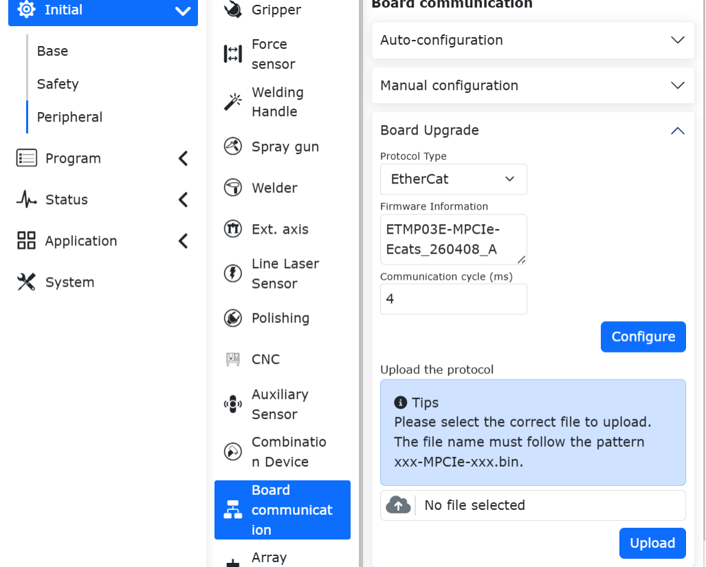
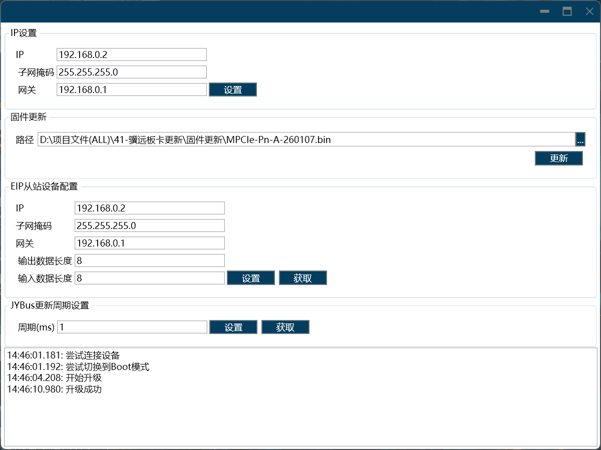

Istruzioni Slave per Protocollo Personalizzato
===================================================

.. toctree::
   :maxdepth: 6

Panoramica
-------------------

Per facilitare il controllo del movimento del robot da parte del PLC tramite diversi protocolli di bus industriale (CC-Link IEF Basic, Profinet, Ethernet/IP ed EtherCAT), sono state aggiunte le schede FRH-PCIeN-EC/EIP/CC/PN-RJ-V10, FRJ-PCIeN-EIP/CC/PN-RJ-V10 e FRJ-PCIeN-EC-RJ-V10 al control cabinet integrato mini.

Configurazione dell'Ambiente
----------------------------------------------------

Le descrizioni dei modelli delle schede e delle versioni software sono le seguenti:

.. list-table:: 
   :widths: 20 50 30
   :header-rows: 1
   :align: center

   * - **Tipo di protocollo**
     - **Modello di scheda**
     - **Versione software del robot**

   * - CC-Link IEF Basic
     - Scheda FRJ-PCIeN-EIP/CC/PN-RJ-V10
     - V3.8.4 e successive

   * - CC-Link IEF Basic
     - Scheda FRJ-PCIeN-EC-RJ-V10
     - V3.9.5 e successive

   * - Profinet
     - Scheda FRJ-PCIeN-EIP/CC/PN-RJ-V10
     - V3.8.4 e successive

   * - Profinet
     - Scheda FRJ-PCIeN-EC-RJ-V10
     - V3.9.5 e successive

   * - Ethernet/IP
     - Scheda FRJ-PCIeN-EIP/CC/PN-RJ-V10
     - V3.8.4 e successive

   * - Ethernet/IP
     - Scheda FRJ-PCIeN-EC-RJ-V10
     - V3.9.5 e successive

   * - EtherCAT
     - Scheda FRJ-PCIeN-EC-RJ-V10
     - V3.9.5 e successive

Setup Hardware Scheda FRH-PCIeN-EC/EIP/CC/PN-RJ-V10
~~~~~~~~~~~~~~~~~~~~~~~~~~~~~~~~~~~~~~~~~~~~~~~~~~~~~~~~~~~~

1. Installare la scheda FRH-PCIeN-EC/EIP/CC/PN-RJ-V10 nel control cabinet integrato mini, come mostrato nella figura.

.. image:: custom_protocol_slave/001.png
   :width: 4in
   :align: center

.. centered:: Figura 17.2-1 Installazione Scheda FRH-PCIeN-EC/EIP/CC/PN-RJ-V10

.. image:: custom_protocol_slave/002.png
   :width: 4in
   :align: center

.. centered:: Figura 17.2-2 Porte di Rete Scheda FRH-PCIeN-EC/EIP/CC/PN-RJ-V10

2. Il cablaggio tra il control cabinet del robot e il PLC è mostrato nelle figure seguenti.

.. image:: custom_protocol_slave/003.png
   :width: 4in
   :align: center

.. centered:: Figura 17.2-3 Schema di Cablaggio Control Cabinet & PLC Mitsubishi

.. image:: custom_protocol_slave/004.png
   :width: 4in
   :align: center

.. centered:: Figura 17.2-4 Schema di Cablaggio Control Cabinet & PLC Siemens

.. image:: custom_protocol_slave/005.png
   :width: 4in
   :align: center

.. centered:: Figura 17.2-5 Schema di Cablaggio Control Cabinet & PLC Omron

.. image:: custom_protocol_slave/006.png
   :width: 4in
   :align: center

.. centered:: Figura 17.2-6 Schema di Cablaggio Control Cabinet & PLC Inovance (Easy Series)

.. note:: 
    1: Control cabinet robot (porta di rete scheda);
    2: Switch;
    3: PC portatile;
    4: PLC Mitsubishi (porta CC-Link IEF Basic);
    5: PLC Siemens (porta Profinet);
    6: PLC Omron (porta Ethernet/IP);
    7: PLC Inovance Easy (porta EtherCAT);

.. important:: Quando il protocollo è commutato su bus EtherCAT, le porte di rete della scheda devono essere distinte tra EtherCAT_IN e EtherCAT_OUT. In questo caso, la porta EtherCAT del PLC Omron deve essere collegata direttamente alla porta EtherCAT_IN della scheda tramite un cavo di rete.

Setup Hardware Scheda FRJ-PCIeN
~~~~~~~~~~~~~~~~~~~~~~~~~~~~~~~~~~~~~~~

1. Installare la scheda nel control cabinet integrato mini, come mostrato nella figura.

.. image:: custom_protocol_slave/044.png
   :width: 4in
   :align: center

.. centered:: Figura 17.2-7 Porte di Rete Scheda FRJ-PCIeN

2. Il cablaggio tra il control cabinet del robot e il PLC è mostrato nelle figure seguenti.

.. image:: custom_protocol_slave/003.png
   :width: 4in
   :align: center

.. centered:: Figura 17.2-8 Schema di Cablaggio Control Cabinet & PLC Mitsubishi

.. image:: custom_protocol_slave/004.png
   :width: 4in
   :align: center

.. centered:: Figura 17.2-9 Schema di Cablaggio Control Cabinet & PLC Siemens

.. image:: custom_protocol_slave/005.png
   :width: 4in
   :align: center

.. centered:: Figura 17.2-10 Schema di Cablaggio Control Cabinet & PLC Inovance (Ethernet/IP)

.. note:: 
    1: Control cabinet robot (porta di rete scheda);
    2: Switch;
    3: PC portatile;
    4: PLC Mitsubishi (porta CC-Link IEF Basic);
    5: PLC Siemens (porta Profinet);
    6: PLC Inovance (porta Ethernet/IP);

Aggiornamento del Firmware della Scheda FRJ-PCIeN-EIP/CC/PN-RJ-V10
++++++++++++++++++++++++++++++++++++++++++++++++++++++++++++++++++++++++++++++++++++++++++++++++++++++

Quando si cambia protocollo sulla scheda, è necessario eseguire un aggiornamento del firmware. Durante l'aggiornamento del firmware, l'indirizzo IP della scheda e l'indirizzo IP del PC portatile devono essere configurati sulla stessa sottorete. Quindi, aprire il software "Gateway Tool Set" -> selezionare il dispositivo scheda di rete del PC da connettere -> fare clic sul pulsante "Start" nell'angolo in basso a destra -> fare clic sul pulsante "Cerca" nell'angolo in alto a destra per cercare il dispositivo scheda.

.. image:: custom_protocol_slave/045.png
   :width: 6in
   :align: center

.. centered:: Figura 17.2-11 Collegamento Dispositivo Scheda

Fare clic sul pulsante "Upgrade" in basso a sinistra -> selezionare il dispositivo scheda -> fare clic sul pulsante "..." in alto a destra, selezionare il firmware del protocollo richiesto -> fare clic sul pulsante "Upgrade", attendere il completamento dell'aggiornamento del firmware.

.. image:: custom_protocol_slave/046.png
   :width: 6in
   :align: center

.. centered:: Figura 17.2-12 Cambio Protocollo Scheda

.. note:: Dopo il cambio di protocollo della scheda, l'indirizzo IP della scheda cambierà, come dettagliato nella tabella seguente.

.. centered:: Tabella 17.2-1 Indirizzi IP Scheda

.. list-table:: 
   :widths: 20 80
   :header-rows: 1
   :align: center

   * - **Protocollo**
     - **Indirizzo IP**

   * - CC-Link IEF Basic
     - 192.168.0.113

   * - Ethernet/IP
     - 192.168.0.112

   * - Profinet
     - 192.168.0.2

Quando il protocollo è configurato come CC-Link IEF Basic, il controller modificherà l'IP della scheda in "192.168.0.113".

Quando il protocollo è configurato come Ethernet/IP, il controller modificherà l'IP della scheda in "192.168.0.112".

Quando il protocollo è commutato su Profinet e il nome del dispositivo slave corrisponde a quello del master, il master configurerà automaticamente l'indirizzo IP dello slave.

Aggiornamento del Firmware della Scheda FRJ-PCIeN-EC-RJ-V10
++++++++++++++++++++++++++++++++++++++++++++++++++++++++++++++++++++++++++++++++++++++

Inserire l'URL 192.169.58.2 per accedere all'interfaccia del robot, quindi fare clic su "Impostazioni iniziali" -> "Periferiche" -> "Comunicazione scheda" per ottenere il numero di versione del firmware della scheda FRJ-PCIeN-EC-RJ-V10. Selezionare il file bin da aggiornare, fare clic su Carica, attendere il completamento dell'aggiornamento del firmware, quindi riavviare il box di controllo.

.. centered:: Figura 17.2-13 Aggiornamento del firmware della scheda

.. note:: Per aggiornare il firmware della scheda FRJ-PCIeN-EC-RJ-V10, è necessario scaricare il protocollo aperto in esecuzione.

Setup Software
~~~~~~~~~~~~~~~~~~~~~~~~~~~~~~~~~~

1. Nel browser, inserire l'IP 192.168.58.2, nome utente admin, password 123, fare clic su "Login" per accedere all'interfaccia Web del control cabinet robot.

.. image:: teaching_pendant_software/001.png
   :width: 6in
   :align: center

.. centered:: Figura 17.2-14 Interfaccia di Accesso Web

2. Fare clic su Impostazioni Sistema -> Interfaccia Informazioni, fare clic sul pulsante Aggiornamento Software, selezionare il file software.tar.gz, caricare il pacchetto di aggiornamento.

.. image:: custom_protocol_slave/008.png
   :width: 6in
   :align: center

.. centered:: Figura 17.2-15 Aggiornamento Software

.. note:: La versione web del control cabinet QX deve essere V3.8.0 o superiore, la versione web del control cabinet LA deve essere V3.8.0 o superiore.

3. Fare clic sul pulsante di espansione in alto a destra, passare da "Modalità Locale" a "Modalità Remota".

.. image:: custom_protocol_slave/010.png
   :width: 4in
   :align: center

.. centered:: Figura 17.2-16 Passaggio a Modalità Remota

4. Selezionare il protocollo slave del controller e la necessità della funzione di avvio automatico, fare clic sul pulsante "Imposta". Nota: per cambiare protocollo, è necessario prima fare clic sul pulsante "Rimuovi", quindi configurare un altro protocollo.

.. image:: custom_protocol_slave/011.png
   :width: 6in
   :align: center

.. centered:: Figura 17.2-17 Configurazione Protocollo Comunicazione

.. note:: Per cambiare protocollo, è necessario riavviare il control cabinet prima di configurare il nuovo protocollo.

Setup Ambiente PLC
~~~~~~~~~~~~~~~~~~~~~~~~~~~~~~~~~~

L'ambiente di test configurato per implementare le istruzioni slave dei vari protocolli è mostrato nella tabella seguente, inclusi i modelli PLC utilizzati, le versioni firmware e il software di test.

.. list-table:: 
   :widths: 100 100 100 100 100
   :header-rows: 1
   :align: center

   * - Protocollo
     - Marca
     - Modello
     - Firmware
     - Software
  
   * - Profinet
     - Siemens
     - CPU 1515-2 PN
     - 6ES75152AM020AB0
     - TIA Portal V17
  
   * - CC-Link IEF Basic
     - Mitsubishi
     - FX5S-30TR/DS
     - 30MR/ES V1.3
     - GX Works3 V1.097B
  
   * - Ethernet/IP
     - Omron
     - MX102-1100
     - V1.3
     - Sysmac Studio V1.50
  
   * - EtherCAT
     - Inovance
     - Easy521-0808TN
     - /
     - AutoShop 4.10.2.4

Siemens Profinet
++++++++++++++++++++++++++++++++++

1. Importazione File GSD (File XML)

Aprire il software di programmazione Siemens TIA Portal V17, creare un nuovo progetto PLC, selezionare "Dispositivi e Rete", nel "Catalogo Hardware" a destra, fare doppio clic su 6ES7 515-2AM02-0AB0 per aggiungere il modulo PLC.

.. image:: custom_protocol_slave/012.png
   :width: 6in
   :align: center

Nel software TIA PORTAL, selezionare "Opzioni" -> "Gestisci File di Descrizione Stazione Generica (GSD)" dalla barra dei menu per installare o rimuovere file GSD già installati.

.. image:: custom_protocol_slave/013.png
   :width: 6in
   :align: center

Prendendo come esempio l'installazione del file GSD per la scheda FRH-PCIeN-EC/EIP/CC/PN-RJ-V10, selezionare "Gestisci File di Descrizione Stazione Generica (GSD)" come sopra, apparirà la finestra "Gestisci File di Descrizione Stazione Generica".

Da "Percorso Sorgente" selezionare la cartella contenente il file GSD da installare, dalla lista dei file GSD visualizzata selezionare uno o più file da installare, fare clic sul pulsante "Installa". Come mostrato nella figura sottostante.

.. image:: custom_protocol_slave/014.png
   :width: 6in
   :align: center

Dopo l'installazione riuscita, il dispositivo del file GSD installato può essere trovato nel catalogo hardware, sotto Altri Dispositivi sul Campo, come mostrato nella figura sottostante.

.. image:: custom_protocol_slave/015.png
   :width: 4in
   :align: center

2. Esecuzione Programma

Aprire il progetto "QNXtest".

.. image:: custom_protocol_slave/016.png
   :width: 6in
   :align: center

Compilare il programma: nel progetto a sinistra, fare doppio clic per entrare in "Dispositivi e Rete", fare clic destro sul modulo "PLC_1", selezionare Compila dal menu a discesa, fare clic su "Hardware e Software (solo modifiche)". Dopo la compilazione, verrà visualizzato "Compilazione Completata" nella parte inferiore della vista software.

.. image:: custom_protocol_slave/017.png
   :width: 6in
   :align: center

.. image:: custom_protocol_slave/018.png
   :width: 6in
   :align: center

Scaricare il programma sul dispositivo: nel progetto a sinistra, fare doppio clic per entrare in "Dispositivi e Rete", fare clic destro sul modulo "PLC_1", selezionare "Scarica su dispositivo" dal menu a discesa, fare clic su "Hardware e Software (solo modifiche)".

.. image:: custom_protocol_slave/019.png
   :width: 6in
   :align: center

Cercare e scaricare sul dispositivo: dopo la finestra pop-up, configurare il tipo di interfaccia PG/PC come mostrato di seguito, fare clic su Inizia Ricerca, selezionare il dispositivo su cui scaricare il programma, fare clic su Scarica.

.. image:: custom_protocol_slave/020.png
   :width: 6in
   :align: center

.. image:: custom_protocol_slave/021.png
   :width: 6in
   :align: center

Mitsubishi CC-Link IEF Basic
++++++++++++++++++++++++++++++++++

1. Impostazioni CC-Link IEF Basic

Attivare l'uso di CC-Link IEF Basic: dal menu di navigazione a sinistra selezionare "Porta Ethernet", impostare l'indirizzo IP del PLC, assicurarsi che sia nella stessa sottorete dell'indirizzo della scheda FRH-PCIeN-EC/EIP/CC/PN-RJ-V10. Fare clic su "Uso CC-Link IEF Basic", selezionare "Utilizza".

.. image:: custom_protocol_slave/022.png
   :width: 6in
   :align: center

Impostazioni configurazione rete CC-Link IEF Basic: sempre in Impostazioni CC-Link IEF Basic, selezionare "Impostazioni Configurazione Rete", selezionare il modulo CIFX Digital I/O della scheda FRH-PCIeN-EC/EIP/CC/PN-RJ-V10. Trascinarlo nell'area in basso a sinistra della vista per completare la configurazione hardware.

.. image:: custom_protocol_slave/023.png
   :width: 6in
   :align: center

Impostazioni refresh CC-Link IEF Basic: sempre in Impostazioni CC-Link IEF Basic, fare clic su Impostazioni Refresh, impostazioni trasmissione personalizzate: 256 byte ricezione, 256 byte trasmissione.

.. image:: custom_protocol_slave/024.png
   :width: 6in
   :align: center

2. Download Programma

Dopo aver aperto il programma di test, fare clic su "Online" -> "Scrivi su Controllore Programmable" per accedere all'interfaccia di download.

.. image:: custom_protocol_slave/025.png
   :width: 6in
   :align: center

Dopo aver aperto l'interfaccia di download, fare clic su "Parametri + Programma" in alto a sinistra, quindi fare clic su "Esegui" in basso a destra per eseguire il download, attendere il completamento.

.. image:: custom_protocol_slave/026.png
   :width: 6in
   :align: center

Inovance EtherCAT
++++++++++++++++++++++++++++++++++

1. Importazione File XML

Aprire il software di programmazione Inovance AutoShop, creare un nuovo progetto PLC, nella barra degli strumenti a destra selezionare "Dispositivi EtherCAT":

.. image:: custom_protocol_slave/052.png
   :width: 6in
   :align: center

Fare clic sinistro su "Dispositivi EtherCAT", quindi clic destro per aprire la finestra di dialogo "Importa XML Dispositivo", confermare con clic sinistro, individuare la cartella contenente i file XML della scheda.

Dopo l'importazione riuscita, sotto la directory "Dispositivi EtherCAT" apparirà il nome della scheda. A questo punto, chiudere e riaprire il progetto per completare il processo di importazione del file XML.

.. image:: custom_protocol_slave/053.png
   :width: 6in
   :align: center

2. Configurazione Variabili

Nella barra degli strumenti a sinistra, fare doppio clic sulla tabella delle variabili, creare un array di input da 256 byte, indirizzo dispositivo soft D0. Creare un array di output da 256 byte, indirizzo dispositivo soft D200.

.. image:: custom_protocol_slave/054.png
   :width: 6in
   :align: center

Nella barra degli strumenti a sinistra, sotto "EtherCAT", fare doppio clic su "Xone-PCIe-ECATs", nella finestra di dialogo che appare fare clic su "Mappatura Funzioni I/O", fare clic sul riquadro per associare l'indirizzo della variabile, nella finestra di dialogo fare clic su "Tabella Variabili", selezionare l'input/output corrispondente desiderato, fare clic su OK. Ripetere l'operazione per gli altri indirizzi in sequenza.

.. image:: custom_protocol_slave/055.png
   :width: 6in
   :align: center

3. Download Programma

Aprire il programma di test, modificare l'indirizzo IP del PLC in "192.168.0.88", il default è "192.168.1.88".

.. image:: custom_protocol_slave/056.png
   :width: 6in
   :align: center

Fare clic su "Modifica IP/Nome Dispositivo" per accedere all'interfaccia di impostazione IP, modificare l'indirizzo IP e il gateway in "192.168.0.88":

.. image:: custom_protocol_slave/057.png
   :width: 6in
   :align: center

Fare clic su "Modifica IP", dopo la finestra di dialogo fare clic su "Sì" per confermare, l'indirizzo IP è stato modificato con successo.

.. image:: custom_protocol_slave/058.png
   :width: 6in
   :align: center

Comunicazione stabilita, scaricare il programma PLC.

.. image:: custom_protocol_slave/059.png
   :width: 6in
   :align: center

Configurazione HMI (Simulazione CC-Link IEF Basic)
~~~~~~~~~~~~~~~~~~~~~~~~~~~~~~~~~~~~~~~~~~~~~~~~~~~~~~~~~~~~~~

1. Dopo l'accesso all'interfaccia HMI, abilitare "Enable Task" per stabilire la connessione di comunicazione tra PLC e controller.

.. image:: custom_protocol_slave/027.png
   :width: 6in
   :align: center

2. Fare clic sull'interfaccia 01_MC_EnableRobot, quindi fare clic su "EnableRobot" per abilitare il robot. Se durante l'uso si verificano errori, fare clic su "Reset" per ripristinare.

.. image:: custom_protocol_slave/028.png
   :width: 6in
   :align: center

3. Fare clic su "02_MC_ToolData" per accedere all'interfaccia informazioni utensile. Inserire i parametri a sinistra e fare clic su WriteToolData per scrivere le informazioni utensile; a destra fare clic su ReadToolData per leggere le informazioni utensile esistenti.
   
.. image:: custom_protocol_slave/029.png
   :width: 6in
   :align: center

4. Fare clic su "03_MC_FrameData" per accedere all'interfaccia informazioni pezzo. Inserire i parametri a sinistra e fare clic su WriteFrameData per scrivere le informazioni pezzo; a destra fare clic su ReadFrameData per leggere le informazioni pezzo esistenti.
   
.. image:: custom_protocol_slave/030.png
   :width: 6in
   :align: center

5. Fare clic su "04_MC_LoadData" per accedere all'interfaccia informazioni carico. Inserire i parametri a sinistra e fare clic su WriteLoadData per scrivere le informazioni carico; a destra fare clic su ReadLoadData per leggere le informazioni carico esistenti.
   
.. image:: custom_protocol_slave/031.png
   :width: 6in
   :align: center

6. Fare clic su "05_MC_RobotReferenceDynamics" per accedere all'interfaccia velocità massima e accelerazione massima del robot. Inserire i parametri a sinistra e fare clic su WriteRobotRefD per scrivere le informazioni velocità e accelerazione massime; a destra fare clic su ReadRobotRefD per leggere le informazioni velocità e accelerazione massime esistenti.
   
.. image:: custom_protocol_slave/032.png
   :width: 6in
   :align: center

7. Fare clic su "06_MC_Robot DefaultDynamics" per accedere all'interfaccia velocità predefinita e accelerazione predefinita del robot. Inserire i parametri a sinistra e fare clic su WriteRobotDefD per scrivere le informazioni velocità e accelerazione predefinite; a destra fare clic su ReadRobotDefD per leggere le informazioni velocità e accelerazione predefinite esistenti.
   
.. image:: custom_protocol_slave/033.png
   :width: 6in
   :align: center

8. Fare clic su "07_MC_RobotSwLimits" per accedere all'interfaccia limiti di posizione. Inserire i valori dei parametri limite massimo e minimo a sinistra e fare clic su WriteRobotSwLimits per scrivere le informazioni parametri limite; a destra fare clic su ReadRobotSwLimits per leggere le informazioni parametri limite esistenti.
   
.. image:: custom_protocol_slave/034.png
   :width: 6in
   :align: center

9. Fare clic su "08_MC_ReadActualPosition" per accedere all'interfaccia lettura posizione effettiva. Fare clic su ReadPosition per leggere le informazioni posizione esistenti.
   
.. image:: custom_protocol_slave/035.png
   :width: 6in
   :align: center

10. Fare clic su "09_MC_MoveLinearAbsolute" per accedere all'interfaccia movimento lineare. Inserire i parametri di coordinate e fare clic su MoveLinearAbsolute per far muovere il robot linearmente verso la posizione target.
   
.. image:: custom_protocol_slave/036.png
   :width: 6in
   :align: center

11. Fare clic su "10_MC_MoveAxesAbsolute" per accedere all'interfaccia movimento coordinate assi. Inserire i parametri di coordinate e fare clic su MoveAxesAbsolute per far muovere il robot verso la posizione target utilizzando le coordinate assi inserite come punto finale.
   
.. image:: custom_protocol_slave/037.png
   :width: 6in
   :align: center

12. Fare clic su "11_MC_MoveDirectAbsolute" per accedere all'interfaccia movimento diretto. Inserire i parametri di coordinate e fare clic su MoveDirectAbsolute per far muovere il robot direttamente verso la posizione target utilizzando i parametri inseriti come punto finale.
   
.. image:: custom_protocol_slave/038.png
   :width: 6in
   :align: center

13. Fare clic su "12_MC_Groups" per accedere all'interfaccia operazione movimento diretto. Qui, fare clic su GroupInterrupt per interrompere il movimento del robot durante lo spostamento, GroupContinue per far continuare il robot verso la posizione target. GroupStop per fermare (terminare) l'azione di movimento in corso. Se si verifica un allarme o un errore durante il processo, fare clic su GroupReset per ripristinare l'errore del robot.
   
.. image:: custom_protocol_slave/039.png
   :width: 6in
   :align: center

14. Fare clic su "13_MC_PositionConversion" per accedere all'interfaccia conversione posizione. XtoJ1 può convertire la posa cartesiana in angoli giunto, J1toX può convertire gli angoli giunto in posa cartesiana.
   
.. image:: custom_protocol_slave/040.png
   :width: 6in
   :align: center

15. Fare clic su "14_MC_GroupJog" per accedere all'interfaccia jogging del robot. Dopo la configurazione, selezionare l'asse da muovere tramite jog dal menu a discesa degli assi di coordinate, quindi selezionare la direzione di rotazione dell'asse. Fare clic su JogMove per eseguire il jog. A destra, MC_ChangeSpeedOverride può regolare la velocità di movimento del braccio robotico.
   
.. image:: custom_protocol_slave/041.png
   :width: 6in
   :align: center

Configurazione HMI (Simulazione Profinet)
~~~~~~~~~~~~~~~~~~~~~~~~~~~~~~~~~~~~~~~~~

1. Dopo aver aperto il programma, fare clic per selezionare "HMI_1[ktp700 Basic PN]" nell'albero del progetto, quindi nella barra dei menu fare clic su "Online" -> "Simulazione" -> "Avvia". Attendere la compilazione e l'avvio della simulazione da parte del software.

2. Dopo la simulazione, le funzioni corrispondono a quelle dello schermo Weintek (CC-Link IEF Basic). Per le impostazioni, fare riferimento al contenuto sopra descritto.
   
.. image:: custom_protocol_slave/042.png
   :width: 6in
   :align: center   

.. image:: custom_protocol_slave/043.png
   :width: 6in
   :align: center

Spiegazioni sulle Operazioni Relative alla Modalità Slave del Robot
---------------------------------------------------------------------------

Caricamento Modalità Slave
~~~~~~~~~~~~~~~~~~~~~~~~~~~~~~~~~

**Step 1**: Aprire WebApp, andare a Impostazioni Iniziali -> Periferiche -> Comunicazione Schede -> Configurazione Manuale.

.. image:: custom_protocol_slave/047.png
   :width: 6in
   :align: center

.. centered:: Figura 17.3-1 Configurazione Manuale Comunicazione Schede

Innanzitutto, configurare l'indirizzo IP della scheda FRJ-PCIeN. Se lasciato vuoto, la scheda si avvierà con l'IP predefinito: 192.168.0.100. Attualmente la configurazione IP è applicabile solo ai protocolli EIP e CC-Link IEF Basic. Per il protocollo PN, l'indirizzo IP dello slave viene assegnato dal master PLC durante la scansione dei dispositivi slave.

.. note:: Dopo aver modificato l'indirizzo IP nella pagina, è necessario caricare la modalità slave per renderlo effettivo.

Selezionare in sequenza le funzioni di mappatura richieste per DI, DO, AO (vedi Appendice 1). Il significato dei parametri è il seguente:

- DI è Controllo Robot: il robot slave accetta segnali di ingresso esterni ed esegue le funzioni mappate;
  
- DO è Uscita Stato Robot: il robot slave restituisce segnali di stato al master;
  
- AO è Feedback Stato Robot: il robot slave restituisce dati di stato al master. AO0~AO15 sono interi con segno (int16), AO16~AO31 sono numeri in virgola mobile a precisione singola (float).

**Step 2**: Fare clic sul pulsante "Configura" per generare il file lua del protocollo aperto.

.. image:: custom_protocol_slave/048.png
   :width: 6in
   :align: center

.. centered:: Figura 17.3-2 Operazioni e Stato Dispositivo

.. note:: Il file lua del protocollo aperto supporta il download. È possibile importare il file lua del protocollo aperto nell'interfaccia di configurazione automatica.

Esempio di programma generato:

.. code-block:: console
   :linenos:

   local id = 3 
   local ctrlDI = {0, 0, 0, 0, 0, 0}
   local funcDI = {0, 0, 0, 0, 0, 0, 0, 0, 0, 0, 0, 0, 0, 0, 0, 0}
   local DOState = {0, 0, 0, 0, 0, 0, 0, 0}
   local AOState = {0, 0, 0, 0, 0, 0, 0, 0, 0, 0, 0, 0, 0, 0, 0, 0, 0, 0, 0, 0, 0, 0, 0, 0, 0, 0, 0, 0, 0, 0, 0, 0}
   -- Avvia il processo di comunicazione della scheda
   LoadFieldBusSlave()
   sleep_ms(8000)
   while(1) do
      -- Imposta lo stato DO
      CtrlBoxDO, CtrlBoxCO, CtrlBoxDI, CtrlBoxCI, errState, motionState, moveToOriginState, robotStartDoneState, modeChangeState, programStartStopState, emergencyState, reduceState, collision, enablestate, safetyStop0, safetyStop1, pauseState, interfereState = GetRobotFuncDOState()
      DOState[1] = CtrlBoxDO
      DOState[2] = CtrlBoxCO
      DOState[3] = CtrlBoxDI
      DOState[4] = CtrlBoxCI
      local ctrlWord0 = 0
      ctrlWord0 = SetBitWithIndex(ctrlWord0, 0, errState)
      ctrlWord0 = SetBitWithIndex(ctrlWord0, 1, motionState)
      ctrlWord0 = SetBitWithIndex(ctrlWord0, 2, moveToOriginState)
      ctrlWord0 = SetBitWithIndex(ctrlWord0, 3, robotStartDoneState)
      ctrlWord0 = SetBitWithIndex(ctrlWord0, 4, modeChangeState)
      ctrlWord0 = SetBitWithIndex(ctrlWord0, 5, programStartStopState)
      ctrlWord0 = SetBitWithIndex(ctrlWord0, 6, emergencyState)
      ctrlWord0 = SetBitWithIndex(ctrlWord0, 7, reduceState)
      DOState[5] = ctrlWord0
      local ctrlWord1 = 0
      ctrlWord1 = SetBitWithIndex(ctrlWord1, 0, collision)
      ctrlWord1 = SetBitWithIndex(ctrlWord1, 1, enablestate)
      ctrlWord1 = SetBitWithIndex(ctrlWord1, 2, safetyStop0)
      ctrlWord1 = SetBitWithIndex(ctrlWord1, 3, safetyStop1)
      ctrlWord1 = SetBitWithIndex(ctrlWord1, 4, pauseState)
      ctrlWord1 = SetBitWithIndex(ctrlWord1, 5, interfereState)
      DOState[6] = ctrlWord1
      SetFieldBusDOState(DOState)

      -- Imposta lo stato AO
      mainErrCode, subErrCode, TCPSpeed, axisPos1, axisPos2, axisPos3, axisPos4, axisPos5, axisPos6, jointVelFeedback1, jointVelFeedback2, jointVelFeedback3, jointVelFeedback4, jointVelFeedback5, jointVelFeedback6, jointCurFeedback1, jointCurFeedback2, jointCurFeedback3,jointCurFeedback4,jointCurFeedback5,jointCurFeedback6, jointTorqueFeedback1, jointTorqueFeedback2,jointTorqueFeedback3,jointTorqueFeedback4, jointTorqueFeedback5, jointTorqueFeedback6, cartPosx, cartPosy, cartPosz, cartPosrx, cartPosry, cartPosrz = GetRobotFuncAOState()
      AOState[1] = mainErrCode
      AOState[2] = subErrCode
      AOState[17] = axisPos1
      AOState[18] = axisPos2
      AOState[19] = axisPos3
      AOState[20] = axisPos4
      AOState[21] = axisPos5
      AOState[22] = axisPos6
      AOState[23] = cartPosx
      AOState[24] = cartPosy
      AOState[25] = cartPosz
      AOState[26] = cartPosrx
      AOState[27] = cartPosry
      AOState[28] = cartPosrz
      SetFieldBusAOState(AOState)
      sleep_ms(10) 

      -- Imposta lo stato DI
      -- Configura la funzione DI e aggiornala in tempo reale
      ctrlDI[1],ctrlDI[2],ctrlDI[3],ctrlDI[4],ctrlDI[5],ctrlDI[6] = GetFieldBusDIState()
      funcDI[1] = ctrlDI[1] 
      funcDI[2] = ctrlDI[2] 
      funcDI[3] = GetBitWithIndex(ctrlDI[3], 0)
      funcDI[4] = GetBitWithIndex(ctrlDI[3], 1)
      funcDI[5] = GetBitWithIndex(ctrlDI[3], 2)
      funcDI[6] = GetBitWithIndex(ctrlDI[3], 3)
      funcDI[7] = GetBitWithIndex(ctrlDI[3], 4)
      funcDI[8] = GetBitWithIndex(ctrlDI[3], 5)
      funcDI[9] = GetBitWithIndex(ctrlDI[3], 6)
      funcDI[10] = GetBitWithIndex(ctrlDI[3], 7)
      funcDI[11] = GetBitWithIndex(ctrlDI[4], 0)
      funcDI[12] = GetBitWithIndex(ctrlDI[4], 1)
      funcDI[13] = GetBitWithIndex(ctrlDI[4], 2)
      funcDI[14] = GetBitWithIndex(ctrlDI[4], 3)
      funcDI[15] = GetBitWithIndex(ctrlDI[4], 4)
      funcDI[16] = GetBitWithIndex(ctrlDI[4], 5)
      SetRobotFuncDIState(funcDI)
      local stopFlag = GetOpenLUAStopFlag(id)
      if(stopFlag ~= 0) then 
         UnloadFieldBusSlave()
         break
      end
      sleep_ms(10)
   end

**Step 3**: Fare clic sul pulsante Carica per caricare la modalità slave del robot.

.. image:: custom_protocol_slave/049.png
   :width: 6in
   :align: center

.. centered:: Figura 17.3-3 Caricamento Modalità Slave

.. note:: Dopo il caricamento riuscito della modalità slave del robot, è supportata la funzione di avvio automatico. Per utilizzare la modalità remota, rimuovere prima la modalità slave.

**Step 4**: Fare clic sul pulsante della barra di stato a destra per monitorare le informazioni di interazione DI, DO, AI, AO. Descrizione parametri:

- CtrlDO è il valore del segnale di ingresso da parte del dispositivo master per controllare i DO del control cabinet robot;
  
- DI è il valore di ingresso del segnale di controllo dal master esterno;
  
- DO è il valore di uscita del segnale di feedback dal robot slave;
  
- AI è il valore di ingresso dal master esterno, AI0~AI15 sono di tipo int16, AI16~AI31 sono di tipo float;
  
- AO è il valore di uscita dal robot slave, AO0~AO15 sono di tipo int16, AO16~AO31 sono di tipo float.

.. image:: custom_protocol_slave/050.png
   :width: 6in
   :align: center

.. centered:: Figura 17.3-4 Informazioni Interazione DI, DO, AI, AO

**Step 5**: Dopo il caricamento, è possibile generare istruzioni lua per la scheda tramite Insegnamento Programma -> Istruzioni Comunicazione -> Scheda, per implementare l'impostazione di DO, AO slave, l'acquisizione di DI, AI slave, l'attesa di DI, AI slave.

.. image:: custom_protocol_slave/051.png
   :width: 6in
   :align: center

.. centered:: Figura 17.3-5 Generazione Istruzioni Lua Scheda

:download:`Appendice 1: Tabella Mappatura Indirizzi Modalità Slave <../_static/_doc/Control box slave mode address comparison table.xlsx>`

Configurazione Ciclo Comunicazione Scheda
---------------------------------------------------------

Scheda FRJ-PCIeN-EIP/CC/PN-RJ-V10
~~~~~~~~~~~~~~~~~~~~~~~~~~~~~~~~~~~~~~~~~~~~~~~~~~~~~~~~~~~

Il ciclo di comunicazione della scheda può essere configurato tramite il computer host. Attualmente è disponibile solo il firmware per il protocollo PN, con futura compatibilità per i protocolli EIP, CC-Link IE Basic e EtherCAT.

(1) Collegare direttamente la porta di rete del PC (sistema Windows 11) alla porta di rete della scheda. Aprire Device Assistant v1.1.0, fare doppio clic su "Ethernet" e fare clic sul pulsante "Aggiorna" in alto a sinistra per scansionare le schede attualmente collegate.

.. image:: custom_protocol_slave/060.png
   :width: 6in
   :align: center

.. image:: custom_protocol_slave/061.png
   :width: 6in
   :align: center

(2) Nell'interfaccia di aggiornamento firmware, caricare la nuova versione del firmware PN e fare clic sul pulsante "Aggiorna". Un messaggio che indica "Aggiornamento Riuscito" apparirà in basso a sinistra una volta stampato.

(3) Inserire il ciclo di comunicazione desiderato (supporta 1~100ms) e fare clic sul pulsante "Imposta". Un messaggio che indica "Impostazione Ciclo Riuscita" apparirà in basso a sinistra una volta stampato.

.. image:: custom_protocol_slave/063.png
   :width: 6in
   :align: center

Scheda FRJ-PCIeN-EC-RJ-V10
~~~~~~~~~~~~~~~~~~~~~~~~~~~~~~~~~~~~~~~~~~~~~~~~~~~~~~~~~~~

Inserire l'URL 192.169.58.2 per accedere all'interfaccia del robot, quindi fare clic su "Impostazioni iniziali" -> "Periferiche" -> "Comunicazione scheda" per ottenere il ciclo di comunicazione della scheda. Immettere il ciclo di comunicazione desiderato (1~100 ms), fare clic sul pulsante "Configura", attendere il completamento della configurazione, quindi riavviare il box di controllo.

.. note:: Per configurare il ciclo di comunicazione della scheda FRJ-PCIeN-EC-RJ-V10, è necessario scaricare il protocollo aperto in esecuzione.

Appendice
-------------------

Lista Istruzioni
~~~~~~~~~~~~~~~~~~~~~~~~~~~

.. list-table:: 
   :widths: 20 80
   :header-rows: 1
   :align: center

   * - Codice Comando
     - Descrizione Istruzione

   * - 0x1000
     - Abilitazione Robot

   * - 0x1001
     - Ripristina Tutti gli Errori

   * - 0x1002
     - Arresto Movimento Robot

   * - 0x1003
     - Lettura Posizione Effettiva

   * - 0x1004
     - Impostazione Velocità Robot

   * - 0x1005
     - Ripresa Movimento Robot

   * - 0x1006
     - Pausa Movimento Robot

   * - 0x1007
     - Calcola Posizione Cartesiana da Posizione Giunto

   * - 0x1008
     - Calcola Posizione Giunto da Posizione Cartesiana

   * - 0x2000
     - Scrittura Informazioni Utensile

   * - 0x2001
     - Lettura Informazioni Utensile

   * - 0x2002
     - Scrittura Informazioni Pezzo

   * - 0x2003
     - Lettura Informazioni Pezzo

   * - 0x2004
     - Scrittura Informazioni Carico

   * - 0x2005
     - Lettura Informazioni Carico

   * - 0x2006
     - Scrittura Informazioni Dinamiche Riferimento

   * - 0x2007
     - Lettura Informazioni Dinamiche Riferimento

   * - 0x2008
     - Scrittura Informazioni Dinamiche Predefinite

   * - 0x2009
     - Lettura Informazioni Dinamiche Predefinite

   * - 0x2010
     - Scrittura Informazioni Limiti Software

   * - 0x2011
     - Lettura Informazioni Limiti Software

   * - 0x3000
     - MoveAxes (basato su angoli giunto)

   * - 0x3001
     - MoveLinear

   * - 0x3002
     - MoveDirect (basato su sistema di coordinate cartesiane)

   * - 0x3003
     - Movimento jog

   * - 0x3004
     - Arresto jog