Custom protocol slave commands
================================================

.. toctree:: 
   :maxdepth: 6

Overview
-------------------

Industrial Bus Protocol Integration for Robot Motion Control
-----------------------------------------------------------------

To facilitate PLC-based robot motion control through various industrial bus protocols (CC-Link IEF Basic, Profinet, Ethernet/IP, and EtherCAT), the integrated mini control cabinet has been equipped with FRH-PCIeN-EC/EIP/CC/PN-RJ-V10 cards, FRJ-PCIeN-EIP/CC/PN-RJ-V10 cards, and FRJ-PCIeN-EC-RJ-V10 cards.

Environment Configuration
--------------------------

The required card models and software versions are as follows:

.. list-table:: 
   :widths: 20 50 30
   :header-rows: 1
   :align: center

   * - **Protocol Type**
     - **Card Model**
     - **Robot Software Version**

   * - CC-Link IEF Basic
     - FRH-PCIeN-EC/EIP/CC/PN-RJ-V10, FRJ-PCIeN-EIP/CC/PN-RJ-V10
     - V3.8.0+

   * - Profinet
     - FRH-PCIeN-EC/EIP/CC/PN-RJ-V10, FRJ-PCIeN-EIP/CC/PN-RJ-V10
     - V3.8.0+

   * - Ethernet/IP
     - FRH-PCIeN-EC/EIP/CC/PN-RJ-V10, FRJ-PCIeN-EIP/CC/PN-RJ-V10
     - V3.8.0+

   * - EtherCAT
     - FRH-PCIeN-EC/EIP/CC/PN-RJ-V10, FRJ-PCIeN-EC-RJ-V10
     - V3.8.4.1+

FRH-PCIeN-EC/EIP/CC/PN-RJ-V10 board hardware environment setup
~~~~~~~~~~~~~~~~~~~~~~~~~~~~~~~~~~~~~~~~~~~~~~~~~~~~~~~~~~~~~~~~~~~~~~~

1. Install the FRH-PCIeN-EC/EIP/CC/PN-RJ-V10 board into the integrated mini control box as shown.

.. image:: custom_protocol_slave/001.png
   :width: 4in
   :align: center

.. centered:: Figure 17.2-1 FRH-PCIeN-EC/EIP/CC/PN-RJ-V10 board installation

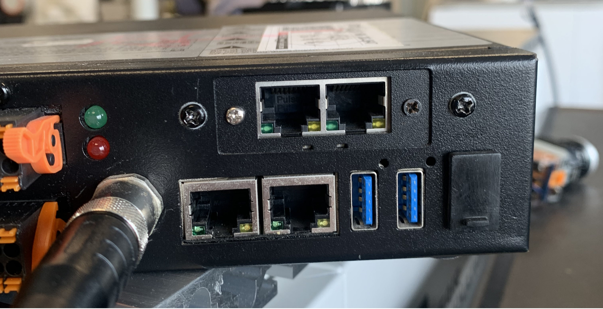

.. centered:: Figure 17.2-2 FRH-PCIeN-EC/EIP/CC/PN-RJ-V10 board network port

2. The robot control box and PLC wiring is shown below.

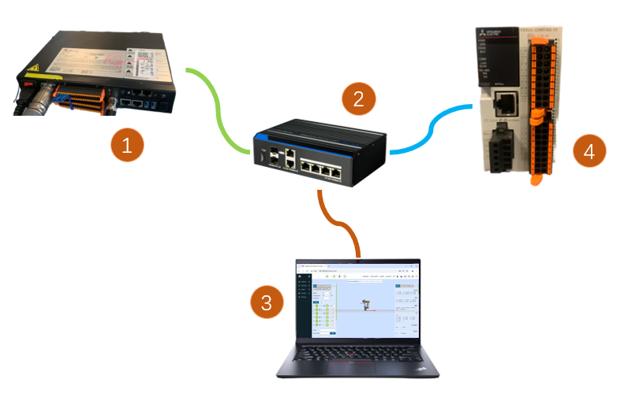

.. centered:: Figure 17.2-3 Control Box & Mitsubishi PLC Wiring Diagrams

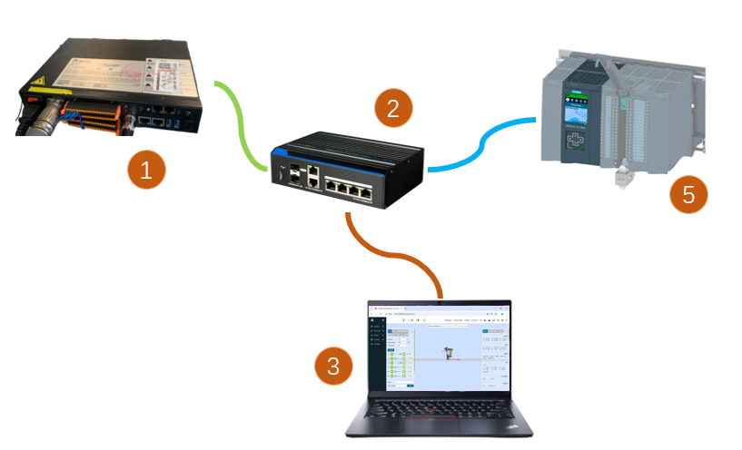

.. centered:: Figure 17.2-4 Control Box & Siemens PLC Wiring Diagrams

.. image:: custom_protocol_slave/005.png
   :width: 4in
   :align: center

.. centered:: Figure 17.2-5 Control Box & Omron PLC Wiring Diagrams

.. image:: custom_protocol_slave/006.png
   :width: 4in
   :align: center

.. centered:: Figure 17.2-6 Control Box & Omron PLC Wiring Diagrams

.. note:: 
      1: Robot control box (board input network port);
      2: Switch;
      3: PC;
      4: Mitsubishi PLC (CC-Link IEF Basic network port);
      5: Siemens PLC (Profinet network port);
      6: Omron PLC (Ethernet/IP network port);
      7: Omron PLC (EtherCAT network port);

.. important:: When the protocol is switched to EtherCAT bus, the board's network port needs to be distinguished as EtherCAT_IN and EtherCAT_OUT. At this time, the PLC's EtherCAT network port is directly connected to the board's EtherCAT_IN through a network cable.

FRJ-PCIeN Board Hardware Setup
~~~~~~~~~~~~~~~~~~~~~~~~~~~~~~~~~~~~~~~

1. Install the board into the integrated mini control box as shown.

.. image:: custom_protocol_slave/044.png
   :width: 4in
   :align: center

.. centered:: Figure 17.2-7 FRJ-PCIeN Board Ethernet Port

2. Wiring between robot control box and PLC is shown below.

.. centered:: Figure 17.2-8 Control Box & Mitsubishi PLC Wiring Diagram

.. centered:: Figure 17.2-9 Control Box & Siemens PLC Wiring Diagram

.. image:: custom_protocol_slave/005.png
   :width: 4in
   :align: center

.. centered:: Figure 17.2-10 Control Box & Inovance PLC Wiring Diagram

.. note:: 
    1: Robot control box (board Ethernet port);
    2: Switch;
    3: Laptop PC;
    4: Mitsubishi PLC (CC-Link IEF Basic port);
    5: Siemens PLC (Profinet port);
    6: Inovance PLC (Ethernet/IP port);

3. Firmware upgrade is required when switching protocols on FRJ-PCIeN board. For upgrade:
   - Set PC IP to "192.168.0.xxx"
   - Open "Gateway Toolset" software
   - Select PC network adapter
   - Click "Start" (bottom right)
   - Click "Search" (top right) to find board devices

.. image:: custom_protocol_slave/045.png
   :width: 6in
   :align: center

.. centered:: Figure 17.2-11 Connecting Board Device

4. Click "Upgrade" (bottom left)
   - Select board device
   - Click "..." (top right) to choose protocol firmware
   - Click "Upgrade" and wait for completion

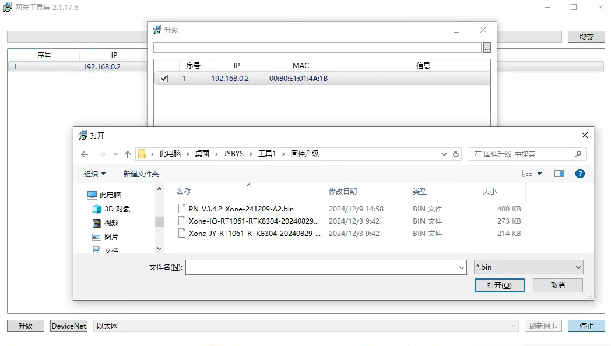

.. centered:: Figure 17.2-12 Board Protocol Switching

.. note:: IP address changes after protocol switching as shown below.

.. centered:: Table 17.2-1 Board IP Addresses

.. list-table:: 
   :widths: 20 80
   :header-rows: 1
   :align: center

   * - **Protocol**
     - **IP Address**

   * - CC-Link IEF Basic
     - 192.168.0.113

   * - Ethernet/IP
     - 192.168.0.112

   * - Profinet
     - 192.168.0.2

When configured for CC-Link IEF Basic, controller changes board IP to "192.168.0.113".

When configured for Ethernet/IP, controller changes board IP to "192.168.0.112".

When switching to Profinet, if slave device name matches master, master will automatically configure slave IP.

Software environment setup
~~~~~~~~~~~~~~~~~~~~~~~~~~~~~~~~~~

1. Browser IP input 192.168.58.2, account for admin, password for 123, click ‘Login’, enter the robot control box Web interface.

.. image:: teaching_pendant_software/001.png
   :width: 6in
   :align: center

.. centered:: Figure 17.2-13 Web Login Interface

2. Click System Settings -> About Interface, click the Software Upgrade button, select the software.tar.gz file, and upload the upgrade package.

.. image:: custom_protocol_slave/008.png
   :width: 4in
   :align: center

.. centered:: Figure 17.2-14 Upgrade software

.. note:: QX control box web version needs 3.8.0 and above, LA control box web version needs 3.8.0 and above.

3. Click the extension button in the upper right corner and switch from 'Local Mode' to 'Remote Mode'.

.. image:: custom_protocol_slave/010.png
   :width: 4in
   :align: center

.. centered:: Figure 17.2-15 Switch remote mode

4. Select the controller slave protocol and whether the auto-start function is required, then click the "Set" button. Note: To switch between different protocols, you need to click the "Uninstall" button first before configuring other protocols.

.. image:: custom_protocol_slave/011.png
   :width: 6in
   :align: center

.. centered:: Figure 17.2-16 Configure the communication protocol

.. note:: Switching different protocols requires restarting the control box before configuring the protocols.

PLC Environment construction
~~~~~~~~~~~~~~~~~~~~~~~~~~~~~~~~~~

The test environment built to implement the slave commands for each protocol is shown in the table below, which includes the PLC model, firmware version and test software used in each protocol.

.. list-table:: 
   :widths: 100 100 100 100 100
   :header-rows: 1
   :align: center

   * - Protocol
     - Brand
     - Type
     - Firmware
     - Software
  
   * - Profinet
     - Siemens
     - CPU 1515-2 PN
     - 6ES75152AM020AB0
     - TIA Portal V17
  
   * - CC-Link IEF Basic
     - Mitsubishi
     - FX5S-30TR/DS
     - 30MR/ES V1.3
     - GX Works3 V1.097B
  
   * - Ethernet/IP
     - Omron
     - MX102-1100
     - V1.3
     - Sysmac Studio V1.50
  
   * - EtherCAT
     - Omron
     - MX102-1100
     - V1.3
     - Sysmac Studio V1.50

Siemens Profinet
++++++++++++++++++++++++++++++++++

1. GSD file (XML file) importing

Open Siemens programming software TIA Portal V17, create a new PLC project, select ‘Devices and Networks’, and select ‘Hardware Catalogue’ on the right side to add PLC module by double clicking 6ES7 515-2AM02-0AB0 to add PLC module.

.. image:: custom_protocol_slave/012.png
   :width: 6in
   :align: center

In the TIA PORTAL software, select Options-> Manage Generic Station Description File (GSD) in the menu bar to install or remove a GSD file that has already been installed.

.. image:: custom_protocol_slave/013.png
   :width: 6in
   :align: center

As an example, to install the Herschel GSD file, select ‘Manage Generic Station Description File (GSD)’ as above, and the ‘Manage Generic Station Description File’ window will appear.

Select the folder where you want to install the GSD file from the ‘Source Path’, select one or more files to install from the list of displayed GSD files, and click the ‘Install’ button. Click the Install button as shown in the following figure.

.. image:: custom_protocol_slave/014.png
   :width: 6in
   :align: center

After successful installation, you can find the device with the installed GSD file in the hardware catalogue, other field devices, as shown in the figure below.

.. image:: custom_protocol_slave/015.png
   :width: 4in
   :align: center

2. Executable programme

Open the project ‘QNXtest’.

.. image:: custom_protocol_slave/016.png
   :width: 6in
   :align: center

Compiler: Double-click on the left side of the project tree to enter ‘Devices and Networks’, right-click on the ‘PLC_1’ module, select Compile from the drop-down menu, and then select ‘Hardware and Software (Changes Only)’ from the stand-alone menu. Hardware and Software (Changes Only)’. After the compilation is completed, it will prompt ‘Compilation complete’ at the bottom of the software view.

.. image:: custom_protocol_slave/017.png
   :width: 6in
   :align: center

.. image:: custom_protocol_slave/018.png
   :width: 6in
   :align: center

Download the programme to the device: Double click on the left side of the project tree to enter the ‘Device and Network’, right click on the ‘PLC_1’ module, and select ‘Download to Device’ from the drop-down menu. ‘Download to Device’, “Hardware and Software (change only)”.

.. image:: custom_protocol_slave/019.png
   :width: 6in
   :align: center

Search and download devices: After the pop-up window, configure the PG/PC interface type as shown in the following figure, click Start Search, select the device that needs to download the programme, and click Download.

.. image:: custom_protocol_slave/020.png
   :width: 6in
   :align: center

.. image:: custom_protocol_slave/021.png
   :width: 6in
   :align: center

Mitsubishi CC-Link IEF Basic
++++++++++++++++++++++++++++++++++

1. CC-Link IEF Basic Setup

Enable CC-Link IEF Basic: Select ‘Ethernet Port’ in the left menu bar, set the ip address of PLC and make sure it is in the same network segment as the address of Huexun card. Click ‘CC-Link IEF Basic’ and select ‘Use’.

.. image:: custom_protocol_slave/022.png
   :width: 6in
   :align: center

CC-Link IEF Basic Network Configuration Settings: Also in CC-Link IEF Basic Settings, select ‘Network Configuration Settings’, and choose Hueyoson CIFX Digital I/O module. Drag and drop the module to the bottom left of the view to complete the hardware configuration.

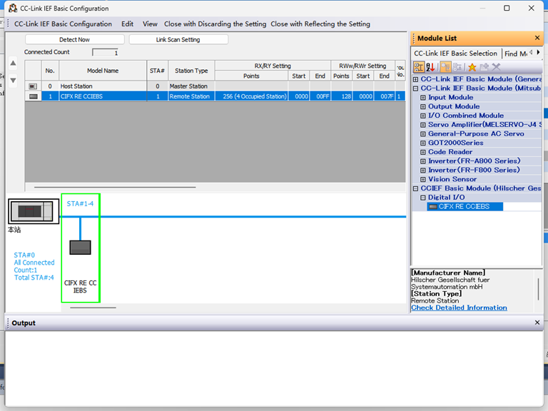

CC-Link IEF Basic Refresh Settings: Also in CC-Link IEF Basic Settings, click Refresh Settings to customise the transmission settings: 256 bytes receive, 256 bytes transmit.

.. image:: custom_protocol_slave/024.png
   :width: 6in
   :align: center

2. Program Download

After opening the test programme, click ‘Online’->‘Write to Programmable Controller’ to enter the download interface.

.. image:: custom_protocol_slave/025.png
   :width: 6in
   :align: center

After opening the download interface, click ‘Parameter+Programme’ on the top left, then click ‘Execute’ on the bottom right corner to download, wait for the download to complete.

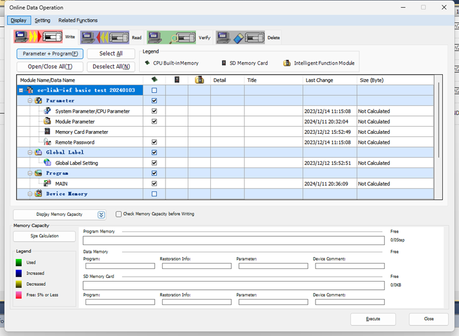

Inovance EtherCAT Configuration
++++++++++++++++++++++++++++++++++

1. XML File Import

Open Inovance AutoShop programming software and create a new PLC project. Select "EtherCAT Devices" from the right toolbox:

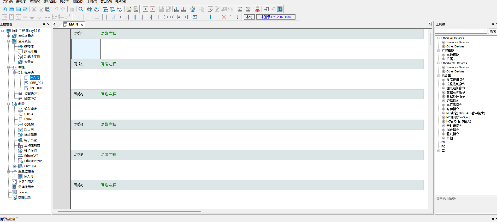

Right-click after selecting "EtherCAT Devices" to open the "Import Device XML" dialog. Locate the folder containing the card's XML file. After successful import, the card name will appear under "EtherCAT Devices". Close and reopen the project to complete the import process.

.. image:: custom_protocol_slave/053.png
   :width: 6in
   :align: center

2. Variable Mapping

Double-click the variable table in the left toolbar. Create:
- 256-byte input array (Soft element address: D0)
- 256-byte output array (Soft element address: D200)

.. image:: custom_protocol_slave/054.png
   :width: 6in
   :align: center

Under "EtherCAT" in the left toolbar, double-click "Xone-PCIe-ECATs". In the dialog, click "I/O Mapping", then bind variable addresses by selecting from the variable table. Repeat sequentially for other addresses.

.. image:: custom_protocol_slave/055.png
   :width: 6in
   :align: center

3. Program Download

Open the test program and change PLC IP from default "192.168.1.88" to "192.168.0.88":

.. image:: custom_protocol_slave/056.png
   :width: 6in
   :align: center

Click "Modify IP/Device Name" and update both IP and gateway to "192.168.0.88":

.. image:: custom_protocol_slave/057.png
   :width: 6in
   :align: center

Confirm modification by clicking "Yes" in the popup dialog when clicking "Modify IP".

.. image:: custom_protocol_slave/058.png
   :width: 6in
   :align: center

After successful communication, download the PLC program.

.. image:: custom_protocol_slave/059.png
   :width: 6in
   :align: center

HMI setting (CC-Link IEF Basic emulation)
~~~~~~~~~~~~~~~~~~~~~~~~~~~~~~~~~~~~~~~~~

1. After logging into the HMI interface, enable ‘Enable Task’ to establish the communication connection between PLC and controller.

.. image:: custom_protocol_slave/027.png
   :width: 6in
   :align: center

2. Click ‘01_MC_EnableRobot’ interface and then click ‘EnableRobot’ to enable the robot, and click ‘Reset’ to reset if there is any error during the process.

.. image:: custom_protocol_slave/028.png
   :width: 6in
   :align: center

3. Click ‘02_MC_ToolData’ to enter the tool information interface, enter the parameters on the left and click WriteToolData to write the tool information; on the right, click ReadToolData to read the existing tool information.
   
.. image:: custom_protocol_slave/029.png
   :width: 6in
   :align: center

4. Click ‘03_MC_FrameData’ to enter the interface of workpiece information. On the left side, after inputting parameters, click WriteFrameData to write workpiece information; on the right side, click ReadFrameData to read existing workpiece information.
   
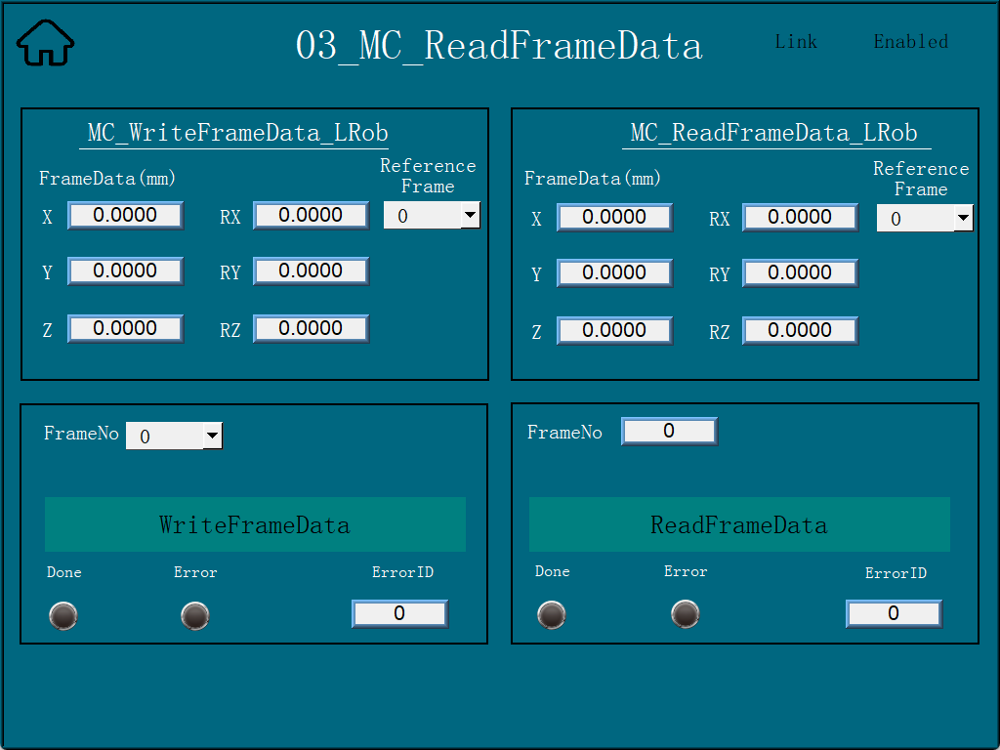

5. Click ‘04_MC_LoadData’ to enter the load information interface, enter the parameters on the left and click WriteLoadData to write load information; on the right, click ReadLoadData to read the existing load information.
   
.. image:: custom_protocol_slave/031.png
   :width: 6in
   :align: center

6. Click ‘05_MC_RobotReferenceDynamics’ to enter the interface of Maximum Velocity and Maximum Acceleration of Robot, enter the parameters on the left side and then click WriteRobotRefD to write the information of Maximum Velocity and Maximum Acceleration; click ReadRobotRefD on the right side to read the information of Maximum Velocity and Maximum Acceleration. On the right side, click ReadRobotRefD to read the max speed and max acceleration information.
   
.. image:: custom_protocol_slave/032.png
   :width: 6in
   :align: center

7. Click ‘06_MC_Robot DefaultDynamics’ to enter the interface of robot default speed and default acceleration, enter the parameters on the left side and click WriteRobotDefD to write the default speed and default acceleration information; on the right side, click ReadRobotDefD to read the default speed and default acceleration information. on the left side, and then click WriteRobotDefD to write the default speed and default acceleration information; on the right side, click ReadRobotDefD to read the information.
   
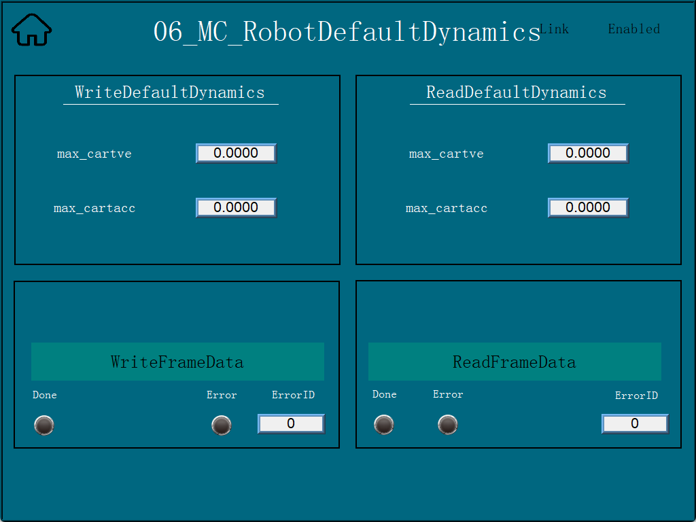

8. Click ‘07_MC_RobotSwLimits’ to enter the coordinate limit interface. On the left side, input the maximum limit and minimum limit parameter values and click WriteRobotSwLimits to write the limit parameter information; on the right side, click ReadRobotSwLimits to read the existing limit parameter information. parameter information.
   
.. image:: custom_protocol_slave/034.png
   :width: 6in
   :align: center

9. Click ‘08_MC_ReadActualPosition’ to enter the read actual position interface, click ReadPosition to read the existing position information.
   
.. image:: custom_protocol_slave/035.png
   :width: 6in
   :align: center

10. Click ‘09_MC_MoveLinearAbsolute’ to enter the Linear Motion interface, input the coordinate parameter and click MoveLinearAbsolute to make the robot move linearly at the target position.
   
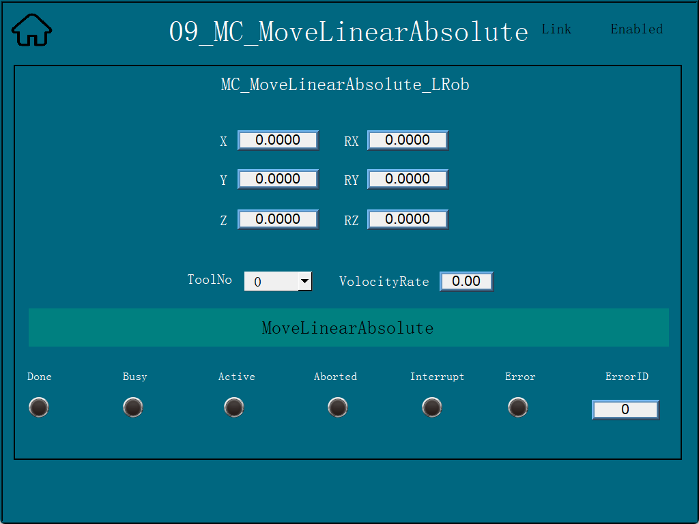

11. Click ‘10_MC_MoveAxesAbsolute’ to enter the interface of axis coordinate movement, input the coordinate parameter and click MoveAxesAbsolute to make the robot move to the target position with the input axis coordinate as the end point.
   
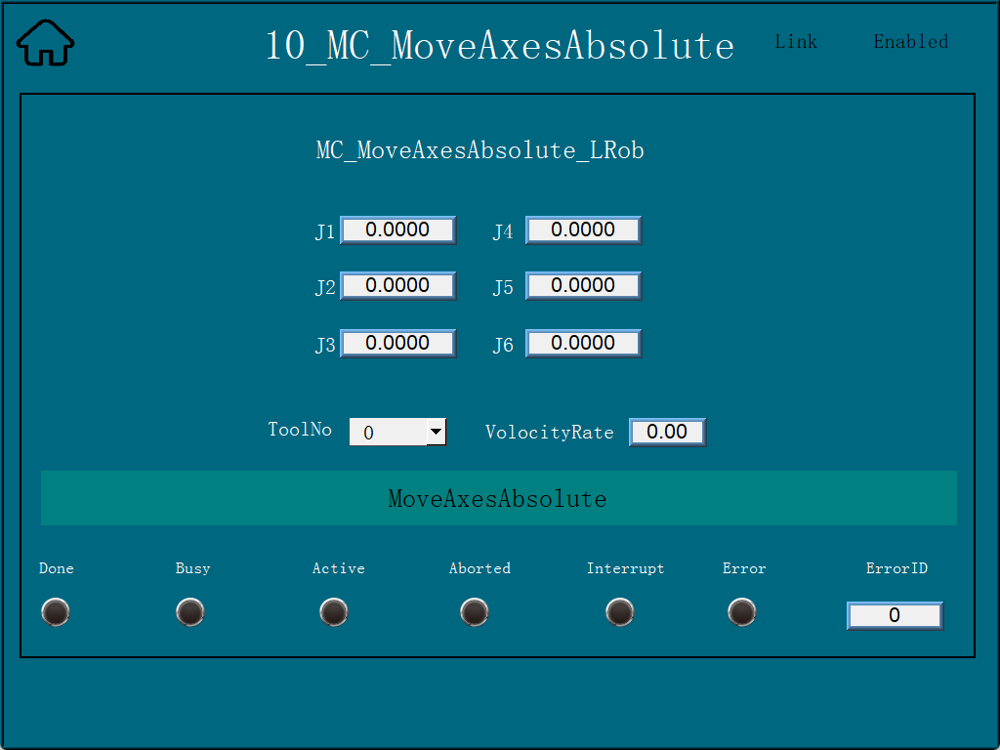

12. Click ‘11_MC_MoveDirectAbsolute’ to enter the direct motion interface, input the coordinate parameter and click MoveDirectAbsolute to make the robot move directly to the target position with the input parameter as the end point.
   
.. image:: custom_protocol_slave/038.png
   :width: 6in
   :align: center

13. Click ‘12_MC_Groups’ to enter the direct motion interface, in which, clicking GroupInterrupt can interrupt the movement of the robot in the process of movement, and clicking GroupContinue can make the robot continue to move to the target position. Click GroupStop to stop (end) the ongoing position movement. If an alarm or error is triggered during the process, click GroupReset to reset the robot to the error.
   
.. image:: custom_protocol_slave/039.png
   :width: 6in
   :align: center

14. Click ‘13_MC_PositionConversion’ to enter the position conversion interface, XtoJ1 can be converted from Cartesian position to joint angle, and J1toX can be converted from joint angle to Cartesian position.
   
.. image:: custom_protocol_slave/040.png
   :width: 6in
   :align: center

15. Click ‘14_MC_GroupJog’ to enter the interface of robot jogging, after the configuration is finished, drop down the axes to select the axis you need to jog, and then select the rotation direction of the axis. Click JogMove to move. MC_ChangeSpeedOverride on the right side can adjust the moving speed of the robot arm.
   
.. image:: custom_protocol_slave/041.png
   :width: 6in
   :align: center

HMI setting (Profinet emulation)
~~~~~~~~~~~~~~~~~~~~~~~~~~~~~~~~~~~~~~~~~

1. After opening the programme, click on ‘HMI_1[ktp700 Basic PN]’ in the project tree, and then click on ‘Online’→‘Simulation’→‘Start’ in the menu bar. Click ‘Online’→‘Simulation’→‘Start’ in the menu bar. Wait for the software to compile and simulate.

2. The function after emulation is the same as the content of the Velcro screen (CC-Link IEF Basic). You can refer to the above content to set up.
   
.. image:: custom_protocol_slave/042.png
   :width: 6in
   :align: center   

.. image:: custom_protocol_slave/043.png
   :width: 6in
   :align: center

Robot Slave Mode Operation Manual
---------------------------------------------------------

Loading Slave Mode
~~~~~~~~~~~~~~~~~~~~~~~~~~~~~~~~~

**Step 1**: Open the WebApp, navigate to Initial Setup -> Peripherals -> Board Communication -> Manual Configuration.

.. image:: custom_protocol_slave/047.png
   :width: 6in
   :align: center

.. centered:: Figure 17.3-1 Board Communication Manual Configuration

First, configure the IP address of the FRJ-PCIeN board. If left blank, the board will use the default IP: 192.168.0.100 for startup configuration. Currently, IP configuration only applies to EIP and CC-Link IEF Basic protocols. For PN protocol, the IP is assigned by the PLC master station scanning slave devices.

.. note:: After changing the IP address on the page, you need to load the slave mode for the changes to take effect.

Select the required mapping functions for DI, DO, and AO (see Appendix 1). The parameters are defined as follows:

- DI (Robot Control): The robot slave accepts external input signals and executes the mapped functions.
  
- DO (Robot Status Output): The robot slave feeds back status signals to the master station.
  
- AO (Robot Status Feedback): The robot slave feeds back status data to the master station. AO0~AO15 are signed integers (int16), and AO16~AO31 are single-precision floating-point numbers (float).

**Step 2**: Click the "Configure" button to generate the open protocol Lua file.

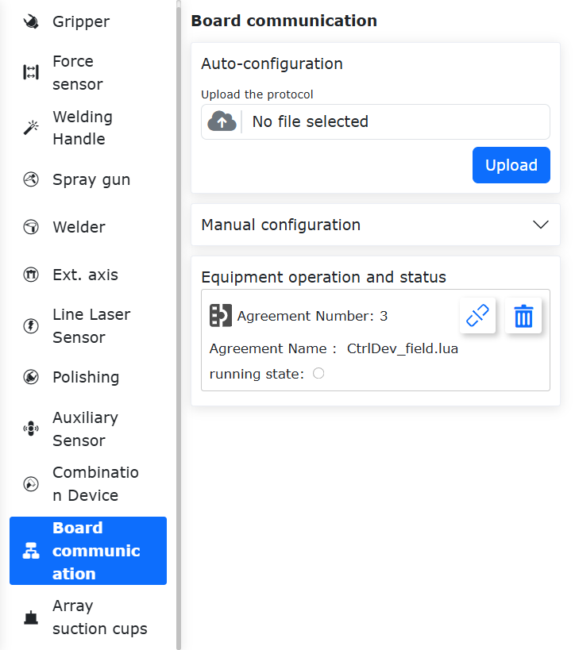

.. centered:: Figure 17.3-2 Device Operation and Status

.. note:: The open protocol Lua file supports download and can be imported in the auto-configuration interface.

Example generated program:

.. code-block:: console
   :linenos:

   local id = 3 
   local ctrlDI = {0, 0, 0, 0, 0, 0}
   local funcDI = {0, 0, 0, 0, 0, 0, 0, 0, 0, 0, 0, 0, 0, 0, 0, 0}
   local DOState = {0, 0, 0, 0, 0, 0, 0, 0}
   local AOState = {0, 0, 0, 0, 0, 0, 0, 0, 0, 0, 0, 0, 0, 0, 0, 0, 0, 0, 0, 0, 0, 0, 0, 0, 0, 0, 0, 0, 0, 0, 0, 0}
   -- Launch the board communication process
   LoadFieldBusSlave()
   sleep_ms(8000)
   while(1) do
      -- Set the DO status
      CtrlBoxDO, CtrlBoxCO, CtrlBoxDI, CtrlBoxCI, errState, motionState, moveToOriginState, robotStartDoneState, modeChangeState, programStartStopState, emergencyState, reduceState, collision, enablestate, safetyStop0, safetyStop1, pauseState, interfereState = GetRobotFuncDOState()
      DOState[1] = CtrlBoxDO
      DOState[2] = CtrlBoxCO
      DOState[3] = CtrlBoxDI
      DOState[4] = CtrlBoxCI
      local ctrlWord0 = 0
      ctrlWord0 = SetBitWithIndex(ctrlWord0, 0, errState)
      ctrlWord0 = SetBitWithIndex(ctrlWord0, 1, motionState)
      ctrlWord0 = SetBitWithIndex(ctrlWord0, 2, moveToOriginState)
      ctrlWord0 = SetBitWithIndex(ctrlWord0, 3, robotStartDoneState)
      ctrlWord0 = SetBitWithIndex(ctrlWord0, 4, modeChangeState)
      ctrlWord0 = SetBitWithIndex(ctrlWord0, 5, programStartStopState)
      ctrlWord0 = SetBitWithIndex(ctrlWord0, 6, emergencyState)
      ctrlWord0 = SetBitWithIndex(ctrlWord0, 7, reduceState)
      DOState[5] = ctrlWord0
      local ctrlWord1 = 0
      ctrlWord1 = SetBitWithIndex(ctrlWord1, 0, collision)
      ctrlWord1 = SetBitWithIndex(ctrlWord1, 1, enablestate)
      ctrlWord1 = SetBitWithIndex(ctrlWord1, 2, safetyStop0)
      ctrlWord1 = SetBitWithIndex(ctrlWord1, 3, safetyStop1)
      ctrlWord1 = SetBitWithIndex(ctrlWord1, 4, pauseState)
      ctrlWord1 = SetBitWithIndex(ctrlWord1, 5, interfereState)
      DOState[6] = ctrlWord1
      SetFieldBusDOState(DOState)

      -- Set the AO status
      mainErrCode, subErrCode, TCPSpeed, axisPos1, axisPos2, axisPos3, axisPos4, axisPos5, axisPos6, jointVelFeedback1, jointVelFeedback2, jointVelFeedback3, jointVelFeedback4, jointVelFeedback5, jointVelFeedback6, jointCurFeedback1, jointCurFeedback2, jointCurFeedback3,jointCurFeedback4,jointCurFeedback5,jointCurFeedback6, jointTorqueFeedback1, jointTorqueFeedback2,jointTorqueFeedback3,jointTorqueFeedback4, jointTorqueFeedback5, jointTorqueFeedback6, cartPosx, cartPosy, cartPosz, cartPosrx, cartPosry, cartPosrz = GetRobotFuncAOState()
      AOState[1] = mainErrCode
      AOState[2] = subErrCode
      AOState[17] = axisPos1
      AOState[18] = axisPos2
      AOState[19] = axisPos3
      AOState[20] = axisPos4
      AOState[21] = axisPos5
      AOState[22] = axisPos6
      AOState[23] = cartPosx
      AOState[24] = cartPosy
      AOState[25] = cartPosz
      AOState[26] = cartPosrx
      AOState[27] = cartPosry
      AOState[28] = cartPosrz
      SetFieldBusAOState(AOState)
      sleep_ms(10) 

      -- Set the DI status
      -- Configure the DI function and update it in real-time
      ctrlDI[1],ctrlDI[2],ctrlDI[3],ctrlDI[4],ctrlDI[5],ctrlDI[6] = GetFieldBusDIState()
      funcDI[1] = ctrlDI[1] 
      funcDI[2] = ctrlDI[2] 
      funcDI[3] = GetBitWithIndex(ctrlDI[3], 0)
      funcDI[4] = GetBitWithIndex(ctrlDI[3], 1)
      funcDI[5] = GetBitWithIndex(ctrlDI[3], 2)
      funcDI[6] = GetBitWithIndex(ctrlDI[3], 3)
      funcDI[7] = GetBitWithIndex(ctrlDI[3], 4)
      funcDI[8] = GetBitWithIndex(ctrlDI[3], 5)
      funcDI[9] = GetBitWithIndex(ctrlDI[3], 6)
      funcDI[10] = GetBitWithIndex(ctrlDI[3], 7)
      funcDI[11] = GetBitWithIndex(ctrlDI[4], 0)
      funcDI[12] = GetBitWithIndex(ctrlDI[4], 1)
      funcDI[13] = GetBitWithIndex(ctrlDI[4], 2)
      funcDI[14] = GetBitWithIndex(ctrlDI[4], 3)
      funcDI[15] = GetBitWithIndex(ctrlDI[4], 4)
      funcDI[16] = GetBitWithIndex(ctrlDI[4], 5)
      SetRobotFuncDIState(funcDI)
      local stopFlag = GetOpenLUAStopFlag(id)
      if(stopFlag ~= 0) then 
         UnloadFieldBusSlave()
         break
      end
      sleep_ms(10)
   end

**Step 3**: Click the "Load" button to load the robot slave mode.

.. centered:: Figure 17.3-3 Loading Slave Mode

.. note:: After successfully loading the robot slave mode, the auto-start function is supported. To use remote mode, unload the slave mode first.

**Step 4**: Click the status bar button on the right to monitor DI, DO, AI, and AO interaction information. The parameters are as follows:

- CtrlDO: Input signal value from the master device controlling the robot control box DO.
  
- DI: Input signal value from the external master control.
  
- DO: Output signal value fed back by the robot slave.
  
- AI: Input value from the external master. AI0~AI15 are int16 type, and AI16~AI31 are float type.
  
- AO: Output value from the robot slave. AO0~AO15 are int16 type, and AO16~AO31 are float type.

.. image:: custom_protocol_slave/050.png
   :width: 6in
   :align: center

.. centered:: Figure 17.3-4 DI, DO, AI, AO Interaction Information

**Step 5**:After loading is complete, you can use the Teach Program -> Communication Command -> Board Card to generate Lua commands for the board. This allows you to:

1) Set Slave DO (Digital Output) and AO (Analog Output).
2) Read Slave DI (Digital Input) and AI (Analog Input).
3) Wait for Slave DI and AI signals.

.. image:: custom_protocol_slave/051.png
   :width: 6in
   :align: center

.. centered:: Figure 17.3-5 Board Lua Commands

:download:`Appendix 1: Slave Mode Address Mapping Table <../_static/_doc/Control box slave mode address comparison table.xlsx>`

Appendice
-------------------

Instruction List
~~~~~~~~~~~~~~~~~~~~~~~~~~~

.. list-table:: 
   :widths: 20 80
   :header-rows: 1
   :align: center

   * - Command code
     - Command description

   * - 0x1000
     - Robot enablement

   * - 0x1001
     - Reset all error

   * - 0x1002
     - Robot stops moving

   * - 0x1003
     - Read actual position

   * - 0x1004
     - Set robot speed

   * - 0x1005
     - Resume robot motion

   * - 0x1006
     - Robot pauses motion

   * - 0x1007
     - Calculate the Cartesian position from the joint position

   * - 0x1008
     - Calculate joint position from Cartesian position

   * - 0x2000
     - Write tool information

   * - 0x2001
     - Read tool information

   * - 0x2002
     - Write workpiece information

   * - 0x2003
     - Read workpiece information

   * - 0x2004
     - Write load information

   * - 0x2005
     - Read load information

   * - 0x2006
     - Write reference dynamic information

   * - 0x2007
     - Read reference dynamic information

   * - 0x2008
     - Write default dynamic information

   * - 0x2009
     - Read default dynamic information

   * - 0x2010
     - Write soft limit information

   * - 0x2011
     - Read soft limit information

   * - 0x3000
     - MoveAxes (based on joint angle)

   * - 0x3001
     - MoveLinear

   * - 0x3002
     - MoveDirect (based on Cartesian coordinate system)

   * - 0x3003
     - jog motion

   * - 0x3004
     - jog stop