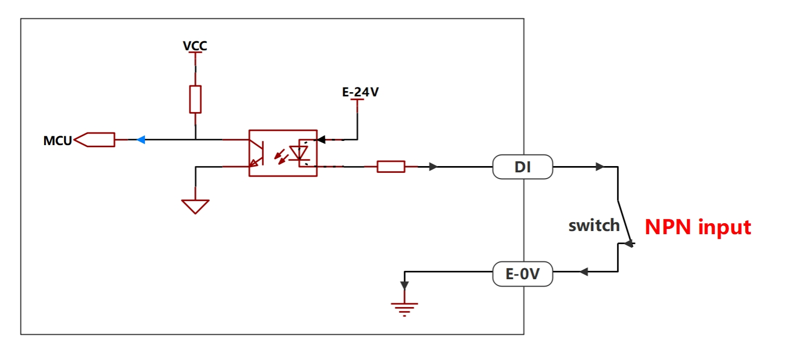
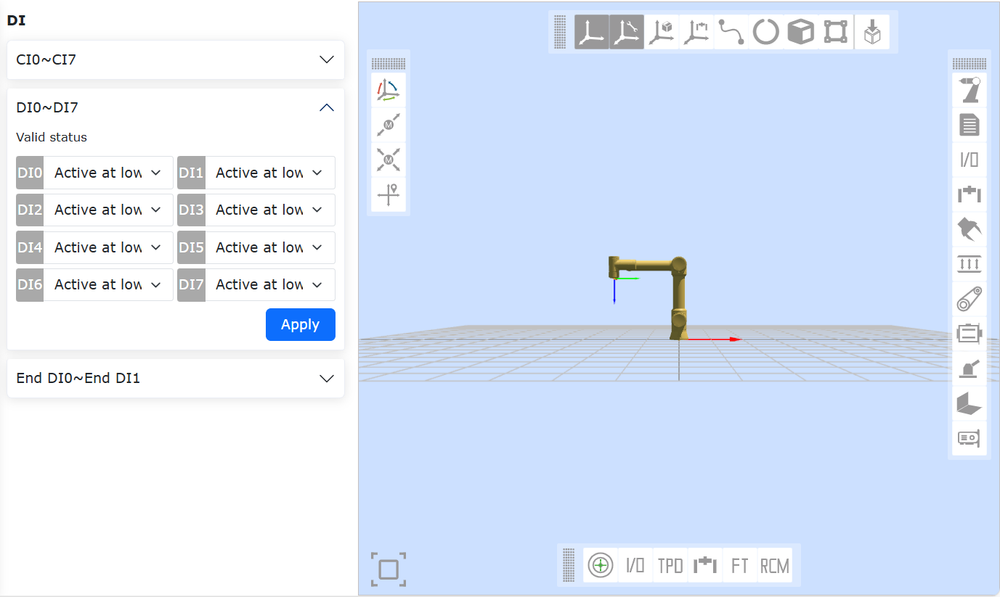
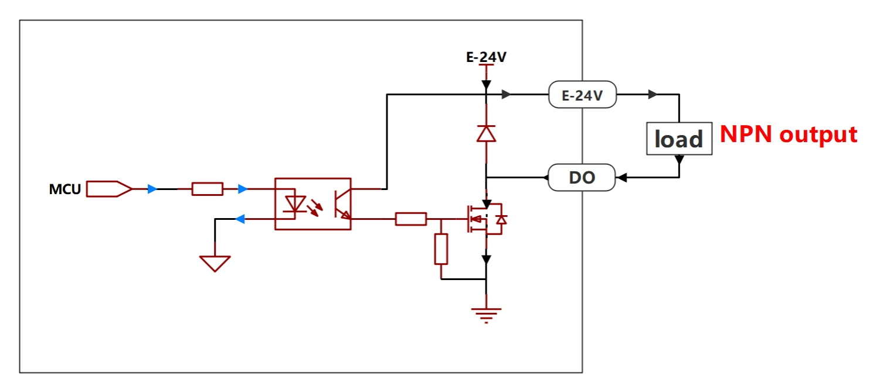
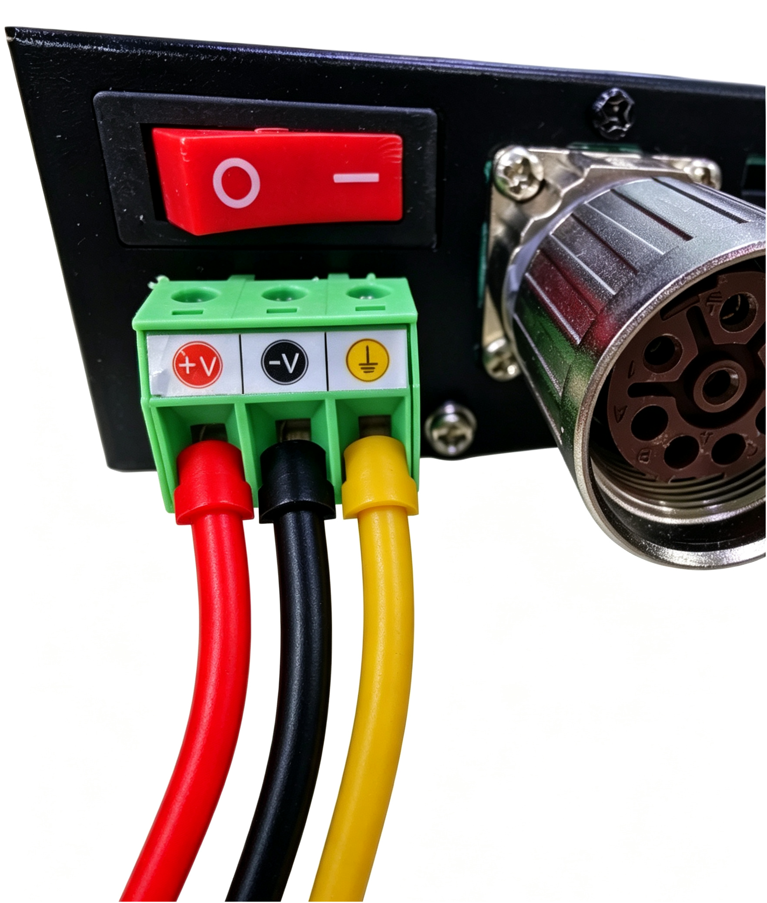
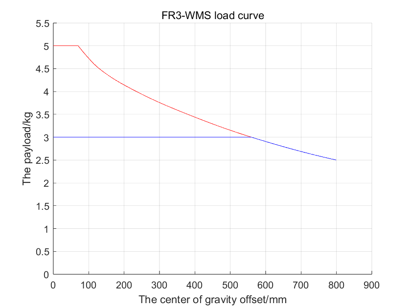
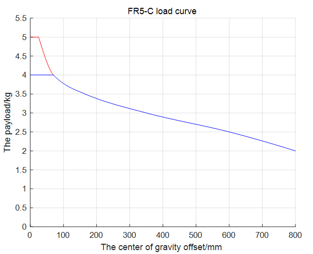
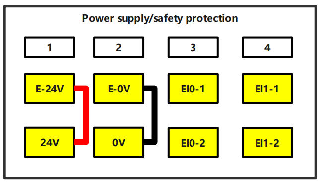

Installazione Hardware
==========================

.. toctree::
   :maxdepth: 5

Avvertenze di Sicurezza
-------------------------

Introduzione
~~~~~~~~~~~~~~

Questo manuale di istruzioni utilizza i seguenti avvisi, il cui scopo è garantire la sicurezza delle persone e delle attrezzature. Quando si legge questo manuale, è essenziale osservare ed eseguire tutte le istruzioni di montaggio e linee guida presenti negli altri capitoli. Particolare attenzione deve essere prestata ai testi associati ai simboli di avvertenza.

.. important::
    - Se il robot (corpo del robot, unità di controllo, teach pendant o scatola pulsanti) viene danneggiato, alterato o modificato per cause umane, Farobot (FAROBOT) declina ogni responsabilità.
    - Farobot (FAROBOT) non è responsabile per eventuali danni al robot o a qualsiasi altra apparecchiatura causati da errori nei programmi scritti dal cliente.

Sicurezza del Personale
~~~~~~~~~~~~~~~~~~~~~~~~~~~

Durante il funzionamento del sistema robotico, è imperativo garantire innanzitutto la sicurezza degli operatori. Di seguito sono elencate le precauzioni generali. Si prega di adottare le misure appropriate per garantire la sicurezza del personale.

1. Tutti gli operatori che utilizzano il sistema robotico devono ricevere formazione attraverso i corsi di addestramento organizzati da Farobot (Suzhou) Robot System Co., Ltd. L'utente deve assicurarsi che abbiano pienamente padroneggiato le procedure operative sicure e standardizzate e siano qualificati per l'operazione robotica. Per i dettagli sulla formazione, si prega di contattare la nostra azienda all'indirizzo email: jiling@frtech.fr.

2. Gli operatori che utilizzano il sistema robotico non devono indossare indumenti larghi o gioielli. Durante l'operazione del robot, assicurarsi che i capelli lunghi siano legati indietro.

3. Durante il funzionamento dell'apparecchiatura, anche se il robot sembra fermo, potrebbe essere in uno stato di pronto all'azione in attesa di un segnale di avvio. Anche in questo stato, il robot deve essere considerato come in movimento.

4. Dovrebbero essere tracciate linee sul pavimento per delimitare l'area di movimento del robot, in modo che l'operatore comprenda l'area di movimento del robot, inclusi gli utensili (pinze, attrezzi, ecc.) che esso trattiene.

5. Assicurarsi che siano stabilite misure di sicurezza (ad esempio, barriere, corde o schermi protettivi) vicino all'area operativa del robot per proteggere l'operatore e le persone circostanti. Se necessario, dovrebbero essere installati dispositivi di blocco in modo che persone diverse dall'operatore responsabile non possano accedere all'alimentazione del robot.

6. Quando si utilizzano il pannello di controllo e il teach pendant, poiché indossare guanti potrebbe portare a errori operativi, è imperativo lavorare senza guanti.

7. In caso di emergenza o situazione anomala in cui una persona viene bloccata o intrappolata dal robot, forzare lo spostamento del giunto spingendo o tirando il braccio del robot con forza (almeno 700 N). Lo spostamento manuale del braccio del robot senza alimentazione elettrica è limitato a situazioni di emergenza e potrebbe danneggiare il giunto.

Identificazione dei Pericoli
~~~~~~~~~~~~~~~~~~~~~~~~~~~~~~~

La valutazione del rischio deve considerare tutti i potenziali contatti tra l'operatore e il robot durante l'uso normale, nonché i possibili usi errati prevedibili. Il collo, il viso e la testa dell'operatore non devono essere esposti al rischio di contatto. L'utilizzo del robot senza dispositivi di protezione periferici richiede prima una valutazione del rischio per determinare se i pericoli correlati costituiscono un rischio inaccettabile, ad esempio:

- L'utilizzo di utensili terminali affilati o connettori per utensili può presentare pericoli;
- La manipolazione di sostanze tossiche o altre sostanze pericolose può presentare pericoli;
- Pericolo di schiacciamento delle dita dell'operatore tra la base del robot o i giunti;
- Pericolo di collisione con il robot;
- Pericoli derivanti da un fissaggio inadeguato del robot o dell'utensile collegato all'estremità;
- Pericoli derivanti dall'impatto tra il carico utile del robot e una superficie solida.

L'integratore deve valutare tali pericoli e i relativi livelli di rischio attraverso una valutazione del rischio, e determinare e implementare misure appropriate per ridurre i rischi a un livello accettabile. Si noti che attrezzature robotiche specifiche potrebbero presentare altri pericoli significativi.

Combinando le misure di sicurezza intrinseche applicate dal robot FR con le norme di sicurezza implementate dall'integratore e dall'utente finale o con la valutazione del rischio, i rischi associati all'operazione collaborativa FR possono essere ridotti al livello più basso ragionevolmente praticabile. Attraverso questo documento, eventuali rischi residui esistenti prima dell'installazione del robot possono essere comunicati all'integratore e all'utente finale. Se la valutazione del rischio dell'integratore determina che nella sua applicazione specifica esistono pericoli che potrebbero costituire un rischio inaccettabile per l'utente, l'integratore deve adottare misure appropriate di riduzione del rischio per eliminare o minimizzare tali pericoli fino a ridurre il rischio a un livello accettabile. L'utilizzo prima dell'adozione di appropriate misure di riduzione del rischio (se necessarie) non è sicuro.

Se il robot viene installato in modo non collaborativo (ad esempio, quando vengono utilizzati utensili pericolosi), la valutazione del rischio potrebbe indicare che l'integratore necessita di collegare dispositivi di sicurezza aggiuntivi (ad esempio, dispositivi di avvio sicuro) durante la programmazione per garantire la sicurezza delle persone e delle attrezzature.

Informazioni sulla Targhetta
~~~~~~~~~~~~~~~~~~~~~~~~~~~~~~~~~~~~~~~~~~~~

.. figure:: installation/002.png
   :align: center
   :width: 6in

.. centered:: Figura 3.1-1 Robot Collaborativo Modello FR3

.. figure:: installation/106.png
   :align: center
   :width: 6in

.. centered:: Figura 3.1-2 Robot Collaborativo Modello FR3-WMS

.. figure:: installation/107.png
   :align: center
   :width: 6in

.. centered:: Figura 3.1-3 Robot Collaborativo Modello FR3-WML

.. figure:: installation/108.png
   :align: center
   :width: 6in

.. centered:: Figura 3.1-4 Robot Collaborativo Modello FR3-C

.. figure:: installation/003.png
   :align: center
   :width: 6in

.. centered:: Figura 3.1-5 Robot Collaborativo Modello FR5

.. figure:: installation/128.png
	:align: center
	:width: 6in

.. centered:: Figura 3.1-6 Robot Collaborativo Modello FR5-C

.. figure:: installation/126.png
   :align: center
   :width: 6in

.. centered:: Figura 3.1-7 Robot Collaborativo Modello FR5

.. figure:: installation/004.png
   :align: center
   :width: 6in

.. centered:: Figura 3.1-8 Robot Collaborativo Modello FR10

.. figure:: installation/005.png
   :align: center
   :width: 6in

.. centered:: Figura 3.1-9 Robot Collaborativo Modello FR16

.. figure:: installation/006.png
   :align: center
   :width: 6in

.. centered:: Figura 3.1-10 Robot Collaborativo Modello FR20

.. figure:: installation/007.png
   :align: center
   :width: 6in

.. centered:: Figura 3.1-11 Robot Collaborativo Modello FR30

Validità e Responsabilità
~~~~~~~~~~~~~~~~~~~~~~~~~~~~~~~~~~~~~

Le informazioni in questo manuale non includono la progettazione, l'installazione e l'operazione di un'applicazione robotica completa, né includono tutte le apparecchiature periferiche che potrebbero influenzare la sicurezza di questo sistema completo. La progettazione e l'installazione di questo sistema completo devono conformarsi ai requisiti di sicurezza stabiliti negli standard e nelle normative del paese in cui il robot è installato.

L'integratore di Farobot (FAROBOT) è responsabile di garantire il rispetto delle leggi e dei regolamenti pertinenti del paese, assicurando che nell'applicazione robotica completa non esistano pericoli significativi. Ciò include, ma non si limita a:

- Eseguire una valutazione del rischio per il sistema robotico completo
- Collegare insieme altre apparecchiature meccaniche e dispositivi di sicurezza aggiuntivi definiti dalla valutazione del rischio
- Stabilire impostazioni di sicurezza appropriate nel software
- Garantire che gli utenti non modifichino alcuna misura di sicurezza
- Verificare che la progettazione e l'installazione dell'intero sistema robotico siano accurate
- Fornire istruzioni per l'uso chiare
- Segnalare sull'etichetta del robot il marchio e le informazioni di contatto dell'integratore
- Raccogliere tutti i documenti nel fascicolo tecnico, incluso questo manuale

Responsabilità Limitata
~~~~~~~~~~~~~~~~~~~~~~~~~~~~~~~~

Le informazioni sulla sicurezza contenute in questo manuale non devono essere considerate come una garanzia generale di sicurezza del robot. Anche rispettando tutte le istruzioni di sicurezza, è ancora possibile che si verifichino lesioni alle persone o danni alle attrezzature.

Simboli di Avvertenza in Questo Manuale
~~~~~~~~~~~~~~~~~~~~~~~~~~~~~~~~~~~~~~~~~~~~~~~

I seguenti simboli definiscono le indicazioni sui livelli di pericolo contenute in questo manuale. Gli stessi simboli di avvertenza sono utilizzati anche sul prodotto.

.. important::
   .. figure:: installation/008.png
      :width: 60
      :height: 50
      :align: left

   **PERICOLO**: Si riferisce a situazioni elettriche imminenti e pericolose che, se non evitate, possono provocare morte o lesioni gravi.

.. important::
   .. figure:: installation/009.png
      :width: 60
      :height: 50
      :align: left

   **PERICOLO DI SCOSSA ELETTRICA**: Si riferisce a situazioni imminenti e pericolose di scossa elettrica che, se non evitate, possono provocare morte o lesioni gravi per scossa elettrica.

.. important::
   .. figure:: installation/010.png
      :width: 60
      :height: 50
      :align: left

   **PERICOLO DI USTIONE**: Si riferisce a superfici calde potenzialmente pericolose; il contatto può causare lesioni.

Valutazione Prima dell'Uso
~~~~~~~~~~~~~~~~~~~~~~~~~~~~~~~~~

Alla prima accensione del robot o dopo qualsiasi modifica, la velocità predefinita del robot è inferiore a 250 mm/s. Non accedere come amministratore per modificare la velocità in modalità ad alta velocità. Successivamente, è necessario eseguire i seguenti test. Confermare che tutti gli ingressi e le uscite di sicurezza siano corretti e correttamente collegati. Testare che tutte le connessioni degli ingressi e delle uscite di sicurezza (incluse le apparecchiature condivise tra più macchine o robot) funzionino correttamente. Pertanto, è necessario:

- Testare che i pulsanti di arresto di emergenza e gli ingressi possano fermare il robot e attivare il freno.
- Testare che gli ingressi di protezione possano fermare il movimento del robot. Se è configurato un ripristino della protezione, verificare se è necessario attivarlo prima di riprendere il movimento.
- Testare che le modalità operative possano essere commutate, fare riferimento all'icona nell'angolo in alto a destra dell'interfaccia utente.
- Testare che il dispositivo abilitante a 3 posizioni debba essere premuto per avviare il movimento in modalità manuale e che il robot sia sotto controllo di rallentamento (questa funzionalità non è supportata prima della versione software V3.0 del robot).
- Testare che l'uscita di arresto di emergenza del sistema possa portare l'intero sistema in uno stato sicuro.

Arresto di Emergenza
~~~~~~~~~~~~~~~~~~~~~~~~~~~~~~~~

Il pulsante di arresto di emergenza è di classe 0. Premendo il pulsante di arresto di emergenza, si arresta immediatamente qualsiasi movimento del robot.

La tabella seguente mostra la distanza e il tempo di arresto per un arresto di classe 0. Queste misurazioni corrispondono alla seguente configurazione del robot:

- Estensione: 100% (braccio del robot completamente esteso orizzontalmente)
- Velocità: 100% (velocità generale del robot impostata al 100%, movimento ad una velocità articolare di 180°/s)
- Carico utile: Carico utile massimo

I giunti 1 e 6 testano il movimento orizzontale del robot, con l'asse di rotazione perpendicolare al suolo. I giunti 2, 3, 4 e 5 testano il robot seguendo una traiettoria verticale, con l'asse di rotazione parallelo al suolo, e l'arresto mentre il robot si muove verso il basso.

.. centered:: Tabella 3.1-1 Distanza di Arresto Classe 0 (rad)
.. list-table::
   :widths: 10 15 15 15 15 15 15
   :header-rows: 0
   :class: sheet-center

   * -
     - **Giunto 1**
     - **Giunto 2**
     - **Giunto 3**
     - **Giunto 4**
     - **Giunto 5**
     - **Giunto 6**

   * - **FR3**
     - 0.47
     - 0.60
     - 0.56
     - 0.29
     - 0.10
     - 0.06

   * - **FR3-WMS**
     - 0.47
     - 0.60
     - 0.56
     - 0.29
     - 0.10
     - 0.06

   * - **FR3-WML**
     - 0.51
     - 0.63
     - 0.60
     - 0.33
     - 0.16
     - 0.10

   * - **FR3-C**
     - 0.47
     - 0.60
     - 0.56
     - 0.29
     - 0.10
     - 0.06

   * - **FR5**
     - 0.51
     - 0.63
     - 0.60
     - 0.33
     - 0.16
     - 0.10

   * - **FR5-C**
     - 0.51
     - 0.63
     - 0.60
     - 0.33
     - 0.16
     - 0.10

   * - **FR10**
     - 0.64
     - 0.70
     - 0.69
     - 0.42
     - 0.25
     - 0.13

   * - **FR16**
     - 0.60
     - 0.67
     - 0.65
     - 0.39
     - 0.22
     - 0.12

   * - **FR20**
     - 0.69
     - 0.75
     - 0.80
     - 0.48
     - 0.31
     - 0.22

.. centered:: Tabella 3.1-2 Tempo di Arresto Classe 0 (ms)
.. list-table::
   :widths: 10 15 15 15 15 15 15
   :header-rows: 0
   :class: sheet-center

   * -
     - **Giunto 1**
     - **Giunto 2**
     - **Giunto 3**
     - **Giunto 4**
     - **Giunto 5**
     - **Giunto 6**

   * - **FR3**
     - 400
     - 470
     - 450
     - 280
     - 120
     - 90

   * - **FR3-WMS**
     - 400
     - 470
     - 450
     - 280
     - 120
     - 90

   * - **FR3-WML**
     - 400
     - 470
     - 450
     - 280
     - 120
     - 90

   * - **FR3-C**
     - 400
     - 470
     - 450
     - 280
     - 120
     - 90

   * - **FR5**
     - 420
     - 500
     - 480
     - 310
     - 150
     - 120

   * - **FR5-C**
     - 420
     - 500
     - 480
     - 310
     - 150
     - 120

   * - **FR10**
     - 460
     - 540
     - 510
     - 330
     - 170
     - 140

   * - **FR16**
     - 440
     - 530
     - 490
     - 320
     - 160
     - 130

   * - **FR20**
     - 540
     - 600
     - 700
     - 400
     - 260
     - 170

Dopo un arresto di emergenza, spegnere l'alimentazione, ruotare il pulsante di arresto di emergenza per ripristinarlo, quindi riaccendere l'alimentazione per riavviare il robot.

I tempi e le distanze di arresto per l'arresto di sicurezza del robot e l'arresto per limite software sono mostrati nelle tabelle seguenti. Queste misurazioni corrispondono alla seguente configurazione del robot:

- Estensione: 100% (braccio del robot completamente esteso orizzontalmente)
- Velocità: 100% (velocità generale del robot impostata al 100%, movimento ad una velocità articolare di 180°/s)
- Carico utile: Carico utile massimo

I giunti 1 e 6 testano il movimento orizzontale del robot, con l'asse di rotazione perpendicolare al suolo. I giunti 2, 3, 4 e 5 testano il robot seguendo una traiettoria verticale, con l'asse di rotazione parallelo al suolo, e l'arresto mentre il robot si muove verso il basso.

.. centered:: Tabella 3.1-3 Distanza di Arresto di Sicurezza (rad)
.. list-table::
   :widths: 10 15 15 15 15 15 15
   :header-rows: 0
   :class: sheet-center

   * -
     - **Giunto 1**
     - **Giunto 2**
     - **Giunto 3**
     - **Giunto 4**
     - **Giunto 5**
     - **Giunto 6**

   * - **FR3**
     - 0.49
     - 0.63
     - 0.58
     - 0.32
     - 0.12
     - 0.09

   * - **FR3-WMS**
     - 0.49
     - 0.63
     - 0.58
     - 0.32
     - 0.12
     - 0.09

   * - **FR3-WML**
     - 0.54
     - 0.65
     - 0.63
     - 0.35
     - 0.19
     - 0.12

   * - **FR3-C**
     - 0.49
     - 0.63
     - 0.58
     - 0.32
     - 0.12
     - 0.09

   * - **FR5**
     - 0.54
     - 0.65
     - 0.63
     - 0.35
     - 0.19
     - 0.12

   * - **FR5-C**
     - 0.54
     - 0.65
     - 0.63
     - 0.35
     - 0.19
     - 0.12

   * - **FR10**
     - 0.66
     - 0.73
     - 0.71
     - 0.45
     - 0.27
     - 0.14

   * - **FR16**
     - 0.63
     - 0.69
     - 0.68
     - 0.41
     - 0.25
     - 0.14

   * - **FR20**
     - 0.71
     - 0.78
     - 0.82
     - 0.51
     - 0.33
     - 0.25

.. centered:: Tabella 3.1-4 Tempo di Arresto di Sicurezza (ms)
.. list-table::
   :widths: 10 15 15 15 15 15 15
   :header-rows: 0
   :class: sheet-center

   * -
     - **Giunto 1**
     - **Giunto 2**
     - **Giunto 3**
     - **Giunto 4**
     - **Giunto 5**
     - **Giunto 6**

   * - **FR3**
     - 410
     - 490
     - 410
     - 300
     - 130
     - 110

   * - **FR3-WMS**
     - 410
     - 490
     - 410
     - 300
     - 130
     - 110

   * - **FR3-WML**
     - 410
     - 490
     - 410
     - 300
     - 130
     - 110

   * - **FR3-C**
     - 410
     - 490
     - 410
     - 300
     - 130
     - 110

   * - **FR5**
     - 450
     - 520
     - 510
     - 330
     - 180
     - 140

   * - **FR5-C**
     - 450
     - 520
     - 510
     - 330
     - 180
     - 140

   * - **FR10**
     - 480
     - 570
     - 530
     - 360
     - 190
     - 170

   * - **FR16**
     - 470
     - 550
     - 520
     - 340
     - 190
     - 150

   * - **FR20**
     - 560
     - 630
     - 720
     - 430
     - 280
     - 200

.. centered:: Tabella 3.1-5 Distanza di Arresto per Limite Software (rad)
.. list-table::
   :widths: 10 15 15 15 15 15 15
   :header-rows: 0
   :class: sheet-center

   * -
     - **Giunto 1**
     - **Giunto 2**
     - **Giunto 3**
     - **Giunto 4**
     - **Giunto 5**
     - **Giunto 6**

   * - **FR3**
     - 0.52
     - 0.65
     - 0.61
     - 0.34
     - 0.15
     - 0.11

   * - **FR3-WMS**
     - 0.52
     - 0.65
     - 0.61
     - 0.34
     - 0.15
     - 0.11

   * - **FR3-WML**
     - 0.56
     - 0.68
     - 0.65
     - 0.38
     - 0.21
     - 0.15

   * - **FR3-C**
     - 0.52
     - 0.65
     - 0.61
     - 0.34
     - 0.15
     - 0.11

   * - **FR5**
     - 0.56
     - 0.68
     - 0.65
     - 0.38
     - 0.21
     - 0.15

   * - **FR5-C**
     - 0.56
     - 0.68
     - 0.65
     - 0.38
     - 0.21
     - 0.15

   * - **FR10**
     - 0.69
     - 0.75
     - 0.74
     - 0.47
     - 0.30
     - 0.18

   * - **FR16**
     - 0.65
     - 0.72
     - 0.70
     - 0.44
     - 0.27
     - 0.17

   * - **FR20**
     - 0.74
     - 0.80
     - 0.85
     - 0.53
     - 0.36
     - 0.27

.. centered:: Tabella 3.1-6 Tempo di Arresto per Limite Software (ms)
.. list-table::
   :widths: 10 15 15 15 15 15 15
   :header-rows: 0
   :class: sheet-center

   * -
     - **Giunto 1**
     - **Giunto 2**
     - **Giunto 3**
     - **Giunto 4**
     - **Giunto 5**
     - **Giunto 6**

   * - **FR3**
     - 430
     - 500
     - 430
     - 310
     - 150
     - 120

   * - **FR3-WMS**
     - 430
     - 500
     - 430
     - 310
     - 150
     - 120

   * - **FR3-WML**
     - 430
     - 500
     - 430
     - 310
     - 150
     - 120

   * - **FR3-C**
     - 430
     - 500
     - 430
     - 310
     - 150
     - 120

   * - **FR5**
     - 460
     - 540
     - 520
     - 350
     - 190
     - 160

   * - **FR5-C**
     - 460
     - 540
     - 520
     - 350
     - 190
     - 160

   * - **FR10**
     - 500
     - 580
     - 550
     - 370
     - 210
     - 180

   * - **FR16**
     - 480
     - 570
     - 530
     - 360
     - 200
     - 170

   * - **FR20**
     - 580
     - 640
     - 740
     - 440
     - 300
     - 210

.. important::
   Secondo IEC 60204-1 e ISO 13850, i dispositivi di arresto di emergenza non sono dispositivi di protezione. Sono misure di protezione supplementari e non sono destinati a prevenire lesioni.

Movimento Senza Alimentazione
~~~~~~~~~~~~~~~~~~~~~~~~~~~~~~~~~~~~~~~~

Se si verifica una situazione in cui è necessario muovere i giunti del robot ma non è possibile alimentare il robot, o in altre situazioni di emergenza, contattare il rivenditore del robot. Se necessario, può essere utilizzata la forza per muovere forzatamente il robot per liberare una persona intrappolata.

Trasporto dell'Attrezzatura
---------------------------------

Trasporto
~~~~~~~~~~~~~~~~

Il robot e l'unità di controllo sono calibrati come un set completo. Non separarli, poiché ciò richiederebbe una ricalibrazione.

Il robot deve essere trasportato solo nella sua confezione originale. Se in futuro si deve spostare il robot, conservare i materiali di imballaggio in un luogo asciutto.

Quando si sposta il robot dall'imballaggio allo spazio di installazione, sostenere entrambi i bracci del robot contemporaneamente. Sostenere il robot finché tutti i bulloni di montaggio della base del robot non siano completamente serrati.

Movimentazione Manuale
~~~~~~~~~~~~~~~~~~~~~~~~~~~~

A seconda del modello, il robot collaborativo ha un peso totale (compresa la confezione) compreso tra 15 kg e 80 kg. Quando si solleva o si sposta manualmente il robot collaborativo, è richiesta l'assistenza di più persone; non è consigliato il sollevamento da parte di una sola persona. Durante il trasporto, è essenziale mantenere la stabilità per evitare ribaltamenti o scivolamenti dell'attrezzatura.

.. warning::
   - Se si utilizzano attrezzature professionali per la movimentazione, assicurarsi che personale qualificato con le opportune qualifiche operative utilizzi carroponte o carrelli elevatori per trasportare o spostare il robot collaborativo, altrimenti potrebbero verificarsi lesioni alle persone o altri incidenti.
   - Se si utilizza la movimentazione manuale, prestare attenzione alla sicurezza personale durante il trasporto.
   - Il robot collaborativo contiene componenti di precisione; durante il trasporto o la movimentazione si dovrebbero evitare vibrazioni o scosse violente, altrimenti le prestazioni dell'attrezzatura potrebbero ridursi.

Stoccaggio
~~~~~~~~~~~~~~

Il robot collaborativo deve essere conservato in un ambiente a -25~60°C, senza condensa.

Manutenzione, Ispezione, Smaltimento
------------------------------------------------------

Manutenzione
~~~~~~~~~~~~~~

Si prega di controllare l'arresto di emergenza e l'arresto protettivo ogni mese per verificare l'efficacia delle funzioni di sicurezza.
Per il cablaggio dell'arresto di emergenza e dell'arresto protettivo, fare riferimento al capitolo sul cablaggio.

Manuale di Ispezione
~~~~~~~~~~~~~~~~~~~~~~~~~~~~~~~~

Prefazione
+++++++++++

Avvertenze di Sicurezza
******************************

Questo manuale di istruzioni utilizza i seguenti avvisi, il cui scopo è garantire la sicurezza delle persone e delle attrezzature. Quando si legge questo manuale, è essenziale osservare ed eseguire tutte le istruzioni di montaggio e linee guida presenti negli altri capitoli.

Particolare attenzione deve essere prestata ai testi associati ai simboli di avvertenza. Leggere attentamente il manuale utente prima dell'uso. Questo manuale è destinato esclusivamente come guida alla manutenzione per i clienti. Il personale addetto alla manutenzione deve possedere competenze professionali. Farobot (FAROBOT) declina ogni responsabilità per operazioni eseguite da personale non qualificato.

.. note:: Se il robot (corpo del robot, unità di controllo, teach pendant) viene danneggiato, alterato o modificato per cause umane, Farobot (FAROBOT) declina ogni responsabilità; Farobot (FAROBOT) non è responsabile per eventuali danni al robot o a qualsiasi altra apparecchiatura causati da errori nei programmi scritti dal cliente.

Validità e Responsabilità
*************************************

Le informazioni in questo manuale non includono la progettazione, l'installazione e l'operazione di un'applicazione robotica completa, né includono tutte le apparecchiature periferiche che potrebbero influenzare la sicurezza di questo sistema completo. La progettazione e l'installazione di questo sistema completo devono conformarsi ai requisiti di sicurezza stabiliti negli standard e nelle normative del paese in cui il robot è installato.

L'integratore di Farobot (FAROBOT) è responsabile di garantire il rispetto delle leggi e dei regolamenti pertinenti del paese, assicurando che nell'applicazione robotica completa non esistano pericoli significativi. Ciò include, ma non si limita a:

- Eseguire una valutazione del rischio per il sistema robotico completo
- Collegare insieme altre apparecchiature meccaniche e dispositivi di sicurezza aggiuntivi definiti dalla valutazione del rischio
- Stabilire impostazioni di sicurezza appropriate nel software
- Garantire che gli utenti non modifichino alcuna misura di sicurezza
- Verificare che la progettazione e l'installazione dell'intero sistema robotico siano accurate
- Fornire istruzioni per l'uso chiare
- Segnalare sull'etichetta del robot il marchio e le informazioni di contatto dell'integratore
- Raccogliere tutti i documenti nel fascicolo tecnico, incluso questo manuale

Responsabilità Limitata
**********************************************

Le informazioni sulla sicurezza contenute in questo manuale non devono essere considerate come una garanzia generale di sicurezza del robot. Anche rispettando tutte le istruzioni di sicurezza, è ancora possibile che si verifichino lesioni alle persone o danni alle attrezzature.

Simboli di Avvertenza
***********************

I seguenti simboli definiscono le indicazioni sui livelli di pericolo contenute in questo manuale. Gli stessi simboli di avvertenza sono utilizzati anche sul prodotto.

.. note::
   .. image:: installation/070.png
      :height: 0.75in
      :align: left

   Nome: **PERICOLO**

   Funzione: Si riferisce a situazioni elettriche imminenti e pericolose che, se non evitate, possono provocare morte o lesioni gravi.

.. note::
   .. image:: installation/071.png
      :height: 0.75in
      :align: left

   Nome: **PERICOLO DI SCOSSA ELETTRICA**

   Funzione: Si riferisce a situazioni imminenti e pericolose di scossa elettrica che, se non evitate, possono provocare morte o lesioni gravi per scossa elettrica.

.. note::
   .. image:: installation/072.png
      :height: 0.75in
      :align: left

   Nome: **PERICOLO DI USTIONE**

   Funzione: Si riferisce a superfici calde potenzialmente pericolose; il contatto può causare lesioni.

Spiegazione degli Ingressi/Uscite Digitali dell'Unità di Controllo
~~~~~~~~~~~~~~~~~~~~~~~~~~~~~~~~~~~~~~~~~~~~~~~~~~~~~~~~~~~~~~~~~~~~~~~~~~~~~~~~~~

Precauzioni per la Modifica delle Funzioni degli I/O Digitali dell'Unità di Controllo
+++++++++++++++++++++++++++++++++++++++++++++++++++++++++++++++++++++++++++++++++++++++++++++++++++++++

.. important::

  (1) Quando si modificano le funzioni degli ingressi/uscite digitali, è necessario rispettare le procedure operative di sicurezza del robot per garantire la sicurezza degli operatori e delle attrezzature.
  (2) Durante il funzionamento del robot, evitare di modificare le funzioni degli ingressi/uscite digitali per non influenzare il normale funzionamento del robot.
  (3) Prima di eseguire operazioni di modifica delle funzioni degli ingressi/uscite digitali, assicurarsi di disattivare l'alimentazione del robot per prevenire scosse elettriche e movimenti imprevisti del robot, che potrebbero causare lesioni alle persone o danni alle attrezzature.
  (4) Prima di modificare le funzioni, è necessario chiarire i requisiti del sistema di controllo del robot per gli ingressi/uscite digitali, inclusi tipo di segnale, livello di tensione, capacità di carico, ecc.
  (5) Assicurarsi che le connessioni tra le porte degli ingressi/uscite digitali e le apparecchiature esterne siano corrette, inclusa la solidità del cablaggio e la compatibilità delle porte.
  (6) Evitare l'assegnazione duplicata dei segnali, garantendo che ogni assegnazione di segnale sia univoca.
  (7) Dopo aver completato l'assegnazione, riavviare il sistema di controllo del robot per rendere effettive le impostazioni.
  (8) Dopo aver completato la configurazione, accedere all'interfaccia di stato I/O per verificare che lo stato dei segnali di ingresso/uscita digitale sia corretto.
  (9) Verificare il corretto funzionamento delle funzioni degli ingressi/uscite digitali attraverso operazioni pratiche o scrivendo programmi di test.
  (10) Se i segnali di ingresso/uscita digitale sono correlati alla logica del programma, verificare che l'elaborazione di questi segnali nel programma sia corretta.

Spiegazione degli Ingressi Digitali dell'Unità di Controllo
++++++++++++++++++++++++++++++++++++++++++++++++++++++++++++++++++++++

Riepilogo degli Ingressi Digitali dell'Unità di Controllo
*******************************************************************

Di seguito sono elencati i tipi di ingresso supportati dagli ingressi digitali dell'unità di controllo integrata mini di Farobot, insieme ai corrispondenti diagrammi di cablaggio e alle tabelle di configurazione.

.. figure:: installation/080.png
   :align: center
   :width: 4in

.. centered:: Figura 3.3-1 Stato Attivo Ingressi DI0-DI7

.. centered:: Tabella 3.3-1 Tabella di Configurazione Ingressi Digitali Unità di Controllo

.. list-table::
   :widths: 15 15 35 10 10 10 10
   :header-rows: 0
   :align: center

   * - **Tipo Unità di Controllo**
     - **Tipo Ingresso**
     - **Diagramma di Connessione**
     - **Alto Attivo (Interruttore Chiuso)**
     - **Alto Attivo (Interruttore Aperto)**
     - **Basso Attivo (Interruttore Chiuso)**
     - **Basso Attivo (Interruttore Aperto)**

   * - Unità di Controllo CC
     - Uscita Tipo NPN
     - .. figure:: installation/081.png
          :align: center
          :width: 3in
     - Inattivo
     - Attivo
     - Attivo
     - Inattivo

   * - Unità di Controllo CA Tensione Stretta
     - Uscita Tipo NPN
     - .. figure:: installation/082.png
          :align: center
          :width: 3in
     - Inattivo
     - Attivo
     - Attivo
     - Inattivo

   * - Unità di Controllo CA Tensione Ampia
     - Uscita Tipo NPN
     - .. figure:: installation/083.png
          :align: center
          :width: 3in
     - Inattivo
     - Attivo
     - Attivo
     - Inattivo

   * - Unità di Controllo CA Tensione Ampia
     - Uscita Tipo PNP
     - .. figure:: installation/084.png
          :align: center
          :width: 3in
     - Inattivo
     - Attivo
     - Attivo
     - Inattivo

Tipi di Ingresso Supportati dagli Ingressi Digitali dell'Unità di Controllo
****************************************************************************************

Gli ingressi digitali delle unità di controllo CC e CA a tensione stretta supportano solo ingressi di tipo NPN. Gli ingressi digitali delle unità di controllo CA a tensione ampia supportano opzionalmente ingressi NPN e PNP; la modalità predefinita di fabbrica è NPN.

.. list-table::
   :widths: 50 50
   :header-rows: 0
   :align: center

   * - **Tipo Unità di Controllo**
     - **Tipo Ingresso**

   * - Unità di Controllo CC
     - Ingresso Tipo NPN

   * - Unità di Controllo CA Tensione Stretta
     - Ingresso Tipo NPN

   * - Unità di Controllo CA Tensione Ampia
     - Ingresso Tipo NPN/PNP

Diagramma di Cablaggio Ingressi Digitali Unità di Controllo
********************************************************************************

Gli ingressi digitali delle unità di controllo CC e CA a tensione stretta supportano solo ingressi di tipo NPN. Il loro diagramma di cablaggio è il seguente.

.. centered:: Figura 3.3-2 Diagramma di Collegamento Ingressi Digitali Unità di Controllo CC e CA Tensione Stretta

Gli ingressi digitali delle unità di controllo CA a tensione ampia supportano opzionalmente ingressi NPN e PNP; la modalità predefinita di fabbrica è NPN. I loro diagrammi di cablaggio sono i seguenti:

.. list-table::
   :widths: 50 50
   :header-rows: 0
   :align: center

   * - **Tipo Ingresso**
     - **Diagramma di Connessione**

   * - Ingresso Tipo NPN
     - .. figure:: installation/086.png
          :align: center
          :width: 3in

   * - Ingresso Tipo PNP
     - .. figure:: installation/087.png
          :align: center
          :width: 3in

Il tipo di ingresso degli ingressi digitali dell'unità di controllo a tensione ampia è determinato dagli switch DIP interni all'unità di controllo. Se l'utente necessita di modificare il tipo di ingresso, è necessario impostare l'interruttore DIP nella posizione corrispondente.

.. list-table::
   :widths: 30 30 40
   :header-rows: 0
   :align: center

   * -
     - Posizione Switch DIP
     - Posizione Fisica Switch DIP

   * - Ingresso Tipo NPN
     - EX-24V
     - .. figure:: installation/088.png
          :align: center
          :width: 3in

   * - Ingresso Tipo PNP
     - EX-0V
     - .. figure:: installation/089.png
          :align: center
          :width: 3in

Impostazioni Software Relative agli Ingressi Digitali dell'Unità di Controllo
***************************************************************************************

L'unico elemento di configurazione software relativo agli ingressi digitali è "Stato Attivo Ingressi DI0-DI7", che indica il livello di tensione digitale corrispondente quando viene rilevato un ingresso attivo. Questa impostazione consente all'utente di utilizzare gli ingressi digitali in modo più flessibile.

.. centered:: Figura 3.3-3 Stato Attivo Ingressi DI0-DI7

La tabella di corrispondenza seguente mostra lo stato attivo rilevato dal software in diverse impostazioni di "Stato Attivo Ingressi DI0-DI7" quando l'interruttore esterno dell'ingresso digitale si trova in stati diversi:

.. centered:: Tabella 3.3-2 Tabella di Corrispondenza Stato Attivo

.. list-table::
   :widths: 15 15 15 15 15 15
   :header-rows: 0
   :align: center

   * - **Tipo Unità di Controllo**
     - **Tipo Ingresso**
     - **Alto Attivo (Interruttore Chiuso)**
     - **Alto Attivo (Interruttore Aperto)**
     - **Basso Attivo (Interruttore Chiuso)**
     - **Basso Attivo (Interruttore Aperto)**

   * - Unità di Controllo CC
     - Ingresso Tipo NPN
     - Inattivo
     - Attivo
     - Attivo
     - Inattivo

   * - Unità di Controllo CA Tensione Stretta
     - Ingresso Tipo NPN
     - Inattivo
     - Attivo
     - Attivo
     - Inattivo

   * - Unità di Controllo CA Tensione Ampia
     - Ingresso Tipo NPN
     - Inattivo
     - Attivo
     - Attivo
     - Inattivo

   * - Unità di Controllo CA Tensione Ampia
     - Ingresso Tipo PNP
     - Inattivo
     - Attivo
     - Attivo
     - Inattivo

Spiegazione delle Uscite Digitali dell'Unità di Controllo
+++++++++++++++++++++++++++++++++++++++++++++++++++++++++++++++++++++

Riepilogo delle Uscite Digitali dell'Unità di Controllo
**************************************************************************

Di seguito sono elencati i tipi di uscita supportati dalle uscite digitali dell'unità di controllo integrata mini di Farobot, insieme ai corrispondenti diagrammi di cablaggio e alle tabelle di configurazione.

.. figure:: installation/091.png
   :align: center
   :width: 4in

.. centered:: Figura 3.3-4 Uscita DO Unità di Controllo Durante l'Accensione

.. centered:: Tabella 3.3-3 Tabella di Configurazione Uscite Digitali Unità di Controllo

.. list-table::
   :widths: 10 10 30 10 10 10 10
   :header-rows: 0
   :align: center

   * - **Tipo Unità di Controllo**
     - **Tipo Uscita**
     - **Diagramma di Connessione**
     - **Alto (Interruttore Impostato ON)**
     - **Alto (Interruttore Impostato OFF)**
     - **Basso (Interruttore Impostato ON)**
     - **Basso (Interruttore Impostato OFF)**

   * - Unità di Controllo CC
     - Uscita Tipo NPN
     - .. figure:: installation/093.png
          :align: center
          :width: 3in
     - Attivo
     - Attivo
     - Inattivo
     - Inattivo

   * - Unità di Controllo CA Tensione Stretta
     - Uscita Tipo NPN
     - .. figure:: installation/094.png
          :align: center
          :width: 3in
     - Attivo
     - Attivo
     - Inattivo
     - Inattivo

   * - Unità di Controllo CA Tensione Ampia
     - Uscita Tipo NPN
     - .. figure:: installation/095.png
          :align: center
          :width: 3in
     - Attivo
     - Attivo
     - Inattivo
     - Inattivo

   * - Unità di Controllo CA Tensione Ampia
     - Uscita Tipo PNP
     - .. figure:: installation/096.png
          :align: center
          :width: 3in
     - Attivo
     - Attivo
     - Inattivo
     - Inattivo

.. figure:: installation/092.png
   :align: center
   :width: 4in

.. centered:: Figura 3.3-5 Stato Attivo Uscite DO0-DO7

.. centered:: Tabella 3.3-4 Tabella di Configurazione Uscite Digitali Unità di Controllo

.. list-table::
   :widths: 10 10 30 10 10 10 10
   :header-rows: 0
   :align: center

   * - **Tipo Unità di Controllo**
     - **Tipo Uscita**
     - **Diagramma di Connessione**
     - **Alto Attivo (Interruttore Impostato ON)**
     - **Alto Attivo (Interruttore Impostato OFF)**
     - **Basso Attivo (Interruttore Impostato ON)**
     - **Basso Attivo (Interruttore Impostato OFF)**

   * - Unità di Controllo CC
     - Uscita Tipo NPN
     - .. figure:: installation/093.png
          :align: center
          :width: 3in
     - Attivo
     - Inattivo
     - Inattivo
     - Attivo

   * - Unità di Controllo CA Tensione Stretta
     - Uscita Tipo NPN
     - .. figure:: installation/094.png
          :align: center
          :width: 3in
     - Attivo
     - Inattivo
     - Inattivo
     - Attivo

   * - Unità di Controllo CA Tensione Ampia
     - Uscita Tipo NPN
     - .. figure:: installation/095.png
          :align: center
          :width: 3in
     - Attivo
     - Inattivo
     - Inattivo
     - Attivo

   * - Unità di Controllo CA Tensione Ampia
     - Uscita Tipo PNP
     - .. figure:: installation/096.png
          :align: center
          :width: 3in
     - Attivo
     - Inattivo
     - Inattivo
     - Attivo

Tipi di Uscita Supportati dalle Uscite Digitali dell'Unità di Controllo
************************************************************************************************

Le uscite digitali delle unità di controllo CC e CA a tensione stretta supportano solo uscite di tipo NPN. Le uscite digitali delle unità di controllo CA a tensione ampia supportano opzionalmente uscite NPN e PNP; la loro uscita è di tipo push-pull, è sufficiente collegarle secondo il rispettivo diagramma di cablaggio, non sono necessarie impostazioni speciali.

.. list-table::
   :widths: 50 50
   :header-rows: 0
   :align: center

   * - **Tipo Unità di Controllo**
     - **Tipo Uscita**

   * - Unità di Controllo CC
     - Uscita Tipo NPN

   * - Unità di Controllo CA Tensione Stretta
     - Uscita Tipo NPN

   * - Cassetta di controllo per tensione alternata ad ampio intervallo
     - Uscita Tipo NPN/PNP

Diagramma di Cablaggio Uscite Digitali Unità di Controllo
*****************************************************************************

Le uscite digitali delle unità di controllo CC e CA a tensione stretta supportano solo uscite di tipo NPN. Il loro diagramma di cablaggio è il seguente.

.. centered:: Figura 3.3-6 Diagramma di Collegamento Uscite Digitali Unità di Controllo CC e CA Tensione Stretta

Le uscite digitali delle unità di controllo CA a tensione ampia supportano uscite NPN e PNP. I loro diagrammi di cablaggio sono i seguenti:

.. list-table::
   :widths: 50 50
   :header-rows: 0
   :align: center

   * - **Tipo Uscita**
     - **Diagramma di Connessione**

   * - Uscita Tipo NPN
     - .. figure:: installation/098.png
          :align: center
          :width: 3in

   * - Uscita Tipo PNP
     - .. figure:: installation/099.png
          :align: center
          :width: 3in

Impostazioni Software Relative alle Uscite Digitali dell'Unità di Controllo
***************************************************************************************

Per le uscite digitali, ci sono due elementi di configurazione software: "Uscita DO Unità di Controllo Durante l'Accensione" e "Stato Attivo Uscite DO0-DO7". Tra questi, "Uscita DO Unità di Controllo Durante l'Accensione" rappresenta il livello di tensione emesso durante l'accensione dell'unità di controllo, prima che il sistema di controllo sia completamente inizializzato. Questo può corrispondere a diversi stati attivi dell'uscita, offrendo flessibilità per affrontare scenari che richiedono uno stato di uscita specifico durante l'accensione. "Stato Attivo Uscite DO0-DO7" rappresenta il livello di tensione dell'uscita digitale che il sistema di controllo deve emettere quando l'uscita è attiva. Questa impostazione consente un utilizzo più flessibile delle uscite digitali da parte dell'utente.

(1) In diverse impostazioni di "Uscita DO Unità di Controllo Durante l'Accensione", la tabella di corrispondenza dello stato attivo per le uscite digitali è la seguente:

   .. figure:: installation/100.png
      :align: center
      :width: 6in

   .. centered:: Figura 3.3-7 Uscita DO Unità di Controllo Durante l'Accensione

.. centered:: Tabella 3.3-5 Tabella di Corrispondenza Stato Attivo

.. list-table::
   :widths: 20 15 15 15 15 15
   :header-rows: 0
   :align: center

   * - **Tipo Unità di Controllo**
     - **Tipo Uscita**
     - **Alto Attivo (Interruttore Impostato ON)**
     - **Alto Attivo (Interruttore Impostato OFF)**
     - **Basso Attivo (Interruttore Impostato ON)**
     - **Basso Attivo (Interruttore Impostato OFF)**

   * - Unità di Controllo CC
     - Uscita Tipo NPN
     - Attivo
     - Attivo
     - Inattivo
     - Inattivo

   * - Unità di Controllo CA Tensione Stretta
     - Uscita Tipo NPN
     - Attivo
     - Attivo
     - Inattivo
     - Inattivo

   * - Unità di Controllo CA Tensione Ampia
     - Uscita Tipo NPN
     - Attivo
     - Attivo
     - Inattivo
     - Inattivo

   * - Unità di Controllo CA Tensione Ampia
     - Uscita Tipo PNP
     - Attivo
     - Attivo
     - Inattivo
     - Inattivo

(2) In diverse impostazioni di "Stato Attivo Uscite DO0-DO7", la tabella di corrispondenza dello stato attivo per le uscite digitali è la seguente:

   .. figure:: installation/101.png
      :align: center
      :width: 6in

   .. centered:: Figura 3.3-8 Stato Attivo Uscite DO0-DO7

.. centered:: Tabella 3.3-6 Tabella di Corrispondenza Stato Attivo

.. list-table::
   :widths: 20 15 15 15 15 15
   :header-rows: 0
   :align: center

   * - **Tipo Unità di Controllo**
     - **Tipo Uscita**
     - **Alto Attivo (Interruttore Impostato ON)**
     - **Alto Attivo (Interruttore Impostato OFF)**
     - **Basso Attivo (Interruttore Impostato ON)**
     - **Basso Attivo (Interruttore Impostato OFF)**

   * - Unità di Controllo CC
     - Uscita Tipo NPN
     - Attivo
     - Inattivo
     - Inattivo
     - Attivo

   * - Unità di Controllo CA Tensione Stretta
     - Uscita Tipo NPN
     - Attivo
     - Inattivo
     - Inattivo
     - Attivo

   * - Unità di Controllo CA Tensione Ampia
     - Uscita Tipo NPN
     - Attivo
     - Inattivo
     - Inattivo
     - Attivo

   * - Unità di Controllo CA Tensione Ampia
     - Uscita Tipo PNP
     - Attivo
     - Inattivo
     - Inattivo
     - Attivo

Manuale di Sicurezza per il Collegamento dell'Alimentazione del Box di Controllo DC
++++++++++++++++++++++++++++++++++++++++++++++++++++++++++++++++++++++++++++++++++++++++++++++++++++++++++++++++

Definizione e Identificazione dei Terminali
************************************************************************************
Il pannello frontale del box di controllo DC è dotato di un morsetto di ingresso alimentazione a 3 PIN, corrispondente rispettivamente al positivo dell'alimentazione (+V), al negativo dell'alimentazione (-V) e alla messa a terra di protezione (PE). Per evitare danni alle apparecchiature dovuti a collegamenti errati, fare riferimento rigorosamente alla tabella seguente:

.. list-table::
   :widths: 15 10 35 35
   :header-rows: 0
   :align: center

   * - **Marcatura Morsetto** 
     - **Codice Colore**
     - **Definizione Funzione**
     - **Operazione Vietata**

   * - 	.. figure:: installation/144.png
          :align: center
          :width: 2in
     - Rosso
     - Ingresso positivo dell'alimentazione CC, solo per cavo positivo 30-60VDC
     - Cortocircuito con PE o -V severamente vietato

   * - 	.. figure:: installation/145.png
          :align: center
          :width: 2in
     - Nero
     - Ingresso negativo dell'alimentazione CC, solo per cavo negativo 30-60VDC, costituisce il circuito di alimentazione
     - Collegamento al telaio o a PE severamente vietato

   * - 	.. figure:: installation/146.png
          :align: center
          :width: 2in
     - Giallo (Giallo-Verde)
     - Morsetto di terra di protezione (massa di sicurezza del telaio)
     - Utilizzo come negativo o positivo dell'alimentazione severamente vietato

.. warning::
  Avviso di Rischio Critico: Questo dispositivo non dispone di circuiti di protezione contro inversione di polarità, collegamenti errati o sovratensione. Qualsiasi delle seguenti operazioni non conformi danneggerà istantaneamente la scheda madre interna e i componenti di potenza, causando un bruciatura permanente e irreversibile del dispositivo:
  
  1. Inversione di polarità (cavi +V e -V invertiti);
  2. +V o -V collegati erroneamente al foro PE;
  3. Morsetto negativo collegato erroneamente a terra (-V in corto con PE);
  4. Collegamento a corrente alternata (110V/220V/380V) o a tensioni CC al di fuori dell'intervallo 30~60Vdc.

Preparativi per la Sicurezza Prima del Collegamento
*************************************************************************

Prima del collegamento, gli operatori devono completare le seguenti preparazioni:

Conferma dell'Interruzione dell'Alimentazione
""""""""""""""""""""""""""""""""""""""""""""""""""""""""""""""""""""""""""""""

Interrompere completamente l'alimentazione a monte e appendere un cartello di avviso di sicurezza. Utilizzare un multimetro per verificare i terminali di ingresso dell'alimentazione, confermando l'assenza di tensione e di carica residua, e non eseguire mai operazioni di cablaggio con l'alimentazione inserita.

Ispezione dell'Apparecchiatura
""""""""""""""""""""""""""""""""""""""""""""""""""""""""""""""""""""""""""""""

Verificare che i terminali dell'apparecchiatura non siano danneggiati, ossidati o allentati, che il corpo non sia umido, infiltrato d'acqua o danneggiato da urti, garantendo che l'apparecchiatura sia in perfette condizioni.

Conferma dell'Alimentazione
""""""""""""""""""""""""""""""""""""""""""""""""""""""""""""""""""""""""""""""

Confermare che il tipo di uscita dell'alimentazione a monte sia un alimentatore CC stabilizzato da 30-60VDC. È severamente vietato collegare alimentazione CA 110V/220V/380V, alimentazione CC inferiore a 30VDC o superiore a 60VDC.

Scelta del Cavo
""""""""""""""""""""""""""""""""""""""""""""""""""""""""""""""""""""""""""""""

Si consiglia di utilizzare cavi flessibili in rame di sezione 4mm² (AWG11) o superiore. La lunghezza di un singolo cavo di alimentazione non deve superare i 2 metri. Non utilizzare cavi con sezione insufficiente, isolamento danneggiato o invecchiato.

Scelta dei Terminali per i Cavi
""""""""""""""""""""""""""""""""""""""""""""""""""""""""""""""""""""""""""""""

Le estremità dei cavi devono essere crimpate con terminali a pressione preisolati (modello consigliato: DBV5.5-10 terminale a forcella). Inserire direttamente cavi in rame nudo nei fori dei terminali è severamente vietato.

Calibrazione degli Strumenti
""""""""""""""""""""""""""""""""""""""""""""""""""""""""""""""""""""""""""""""

Preparare un multimetro qualificato, un cacciavite isolato e una pinza crimpatrice. Calibrare in anticipo il multimetro per garantire il corretto funzionamento della rilevazione della tensione, consentendo una misurazione precisa della tensione e la distinzione della polarità.

Procedura di Cablaggio Standard
************************************************************************************

Crimpatura dei Terminali dei Cavi
""""""""""""""""""""""""""""""""""""""""""""""""""""""""""""""""""""""""""""""

Utilizzare la pinza crimpatrice per crimpare i terminali a pressione (consigliati DBV5.5-10) su un'estremità di ciascuno dei tre cavi colorati: rosso (+V), nero (-V) e giallo-verde (PE). Assicurarsi che la crimpatura sia salda e che l'anima in rame non sia esposta. È severamente vietato utilizzare cavi dello stesso colore o con identificazione del colore non chiara.

Inserimento e Serraggio del Connettore Terminale
""""""""""""""""""""""""""""""""""""""""""""""""""""""""""""""""""""""""""""""

Inserire i terminali crimpati nei fori corrispondenti del connettore a spina estraibile fornito con l'apparecchiatura (prestare attenzione alla direzione di inserimento, con il lato piatto del terminale rivolto verso la molla a contatto):
Cavo rosso → inserire nel foro +V;
Cavo nero → inserire nel foro -V;
Cavo giallo-verde → inserire nel foro PE.
Utilizzare un cacciavite isolato a taglio per serrare in senso orario la vite di bloccaggio del cavo sopra ciascun foro.

.. figure:: installation/147.png
  :align: center
  :width: 4in

.. centered:: Connettore verde con cavi e terminali a pressione inseriti

Verifica della Trazione
""""""""""""""""""""""""""""""""""""""""""""""""""""""""""""""""""""""""""""""

Dopo aver serrato ciascun cavo, tirare con forza il cavo per confermare che il terminale non sia allentato e che l'anima non sia scivolata fuori. Se allentato, ricrimpare il terminale e serrare nuovamente.

Inserimento nel Box di Controllo
""""""""""""""""""""""""""""""""""""""""""""""""""""""""""""""""""""""""""""""

Inserire il connettore cablato nell'ingresso di alimentazione del box di controllo DC, seguendo la direzione della guida anti-errore. Assicurarsi che il connettore sia completamente inserito.

.. centered:: Connettore con cavi inserito nell'ingresso di alimentazione del box di controllo DC

Verifica Finale dell'Isolamento Prima dell'Accensione
""""""""""""""""""""""""""""""""""""""""""""""""""""""""""""""""""""""""""""""

Prima di collegare l'alimentazione, utilizzare un multimetro per misurare l'impedenza tra +V e -V all'estremità del connettore, confermando l'assenza di cortocircuiti; misurare l'impedenza tra +V/-V e PE, confermando che siano in uno stato di isolamento aperto.

Avvio e Gestione delle Anomalie
************************************************************************************

- Avvio Normale: Chiudere l'interruttore di alimentazione a monte e osservare l'indicatore luminoso sul pannello del box di controllo. La condizione normale è che l'indicatore rimanga acceso, senza rumori anomali o odori.
- Condizione Anomala (Spegnere immediatamente!): In caso di forte stridio, fumo, scintille, odori, o se l'amperometro dell'alimentazione a monte indica istantaneamente un sovraccarico a fondo scala, scollegare immediatamente l'alimentazione principale e non riaccendere. Contattare il supporto tecnico dopo che il dispositivo si è completamente raffreddato. Non tentare di smontare il dispositivo per l'ispezione.

.. warning:: Avviso Finale: L'accensione indica che hai compreso e rispettato pienamente le specifiche di cablaggio sopra descritte. Se qualsiasi identificazione non è chiara, contattare immediatamente il supporto tecnico. Non fare affidamento sull'esperienza per il cablaggio!

Piano di Manutenzione e Controllo
++++++++++++++++++++++++++++++++++++++++++++++++

Braccio Robotico
******************************

1. Piano di Controllo

Di seguito è riportato l'elenco di controllo consigliato da Farobot per i robot, da eseguire agli intervalli di tempo indicati. Se un controllo rivela una condizione insoddisfacente delle parti interessate, correggere immediatamente.

.. note:: F=Controllo Funzionale,V=Ispezione Visiva,*=Da controllare obbligatoriamente dopo una collisione grave.

.. list-table::
   :widths: 10 40 20 20 20 20
   :header-rows: 0
   :align: center

   * -
     - **Elemento di Controllo**
     - **Requisito**
     - **Mensilmente**
     - **Semestralmente**
     - **Annualmente**

   * - 1
     - Controllo coperture posteriori dei giunti*
     - V
     -
     - ✔
     -

   * - 2
     - Controllo viti delle coperture posteriori dei giunti
     - F
     -
     - ✔
     -

   * - 3
     - Controllo guarnizioni in gomma dei giunti
     - V
     -
     - ✔
     -

   * - 4
     - Controllo cavi del robot
     - V
     -
     - ✔
     -

   * - 5
     - Controllo connessioni dei cavi del robot
     - V
     -
     - ✔
     -

   * - 6
     - Controllo bulloni di montaggio della base del robot*
     - F
     - ✔
     -
     -

   * - 7
     - Controllo bulloni di montaggio dell'utensile terminale*
     - F
     - ✔
     -
     -

.. figure:: installation/073.png
   :align: center
   :width: 3in

2. Ispezione Visiva

.. note:: Non utilizzare mai aria compressa per pulire il braccio del robot, poiché potrebbe danneggiare i componenti. Non conservare il robot per più di 6 mesi senza effettuare un'ispezione visiva.

- Se possibile, portare il braccio del robot nella posizione zero.
- Spegnere e scollegare il cavo di alimentazione dell'unità di controllo.
- Controllare se il cavo tra l'unità di controllo e il braccio del robot presenta danni.
- Controllare che i bulloni di montaggio della base siano correttamente serrati.
- Controllare che i bulloni della flangia dell'utensile siano correttamente serrati.
- Controllare le guarnizioni piatte per usura e danni.
- Controllare tutte le coperture posteriori dei giunti per eventuali crepe o danni.
- Controllare che le viti per le coperture posteriori dei giunti siano in posizione e correttamente serrate.

.. note:: Se si riscontra qualsiasi danno al robot durante il periodo di garanzia, contattare il rivenditore da cui è stato acquistato il robot.

3. Controllo Funzionale

Lo scopo del controllo funzionale è garantire che viti, bulloni, utensili e braccio del robot non siano allentati. Le viti/bulloni menzionati nel piano di controllo devono essere verificati utilizzando una chiave dinamometrica, e la coppia deve conformarsi alle specifiche standard. Per le specifiche dei bulloni di montaggio del braccio robotico, fare riferimento alle specifiche di installazione nel "Manuale Utente".

4. Pulizia

È possibile rimuovere polvere/sporco/olio osservati sul braccio del robot utilizzando un panno e uno dei seguenti detergenti: acqua, alcool isopropilico, etanolo al 10% o nafta al 10%. Se il robot opera in ambienti difficili, ad esempio con fluidi di taglio, refrigeranti, ecc., si consiglia di pulire o sostituire regolarmente le guarnizioni in gomma.

Non utilizzare candeggina. Non utilizzare candeggina in nessuna soluzione detergente diluita. In rari casi, può essere visibile una quantità minima di grasso dai giunti. Ciò non influisce sulla funzionalità, sull'uso o sulla durata del giunto.

Unità di Controllo, Teach Pendant, Scatola Pulsanti
********************************************************************

1. Piano di Controllo

Di seguito è riportato l'elenco di controllo consigliato da Farobot per le unità di controllo, teach pendant e scatole pulsanti, da eseguire agli intervalli di tempo indicati. Se un controllo rivela una condizione insoddisfacente delle parti interessate, correggere immediatamente.

.. note:: F=Controllo Funzionale, V=Ispezione Visiva.

.. list-table::
   :widths: 10 40 20 20 20 20
   :header-rows: 0
   :align: center

   * -
     - **Elemento di Controllo**
     - **Requisito**
     - **Mensilmente**
     - **Semestralmente**
     - **Annualmente**

   * - 1
     - Verifica del pulsante di arresto di emergenza sulla scatola pulsanti (teach pendant)
     - F
     - ✔
     -
     -

   * - 2
     - Verifica della funzionalità di ingresso/uscita di sicurezza sulla barra terminali
     - F
     - ✔
     -
     -

   * - 3
     - Verifica delle funzioni avvio/arresto e commutazione modalità della scatola pulsanti
     - F
     - ✔
     -
     -

   * - 4
     - Controllo del cavo della scatola pulsanti (teach pendant)
     - V
     -
     - ✔
     -

   * - 5
     - Controllo e pulizia del filtro dell'aria sull'unità di controllo
     - V
     - ✔
     -
     -

   * - 6
     - Verifica della solidità dei terminali dell'unità di controllo
     - F
     -
     - ✔
     -

   * - 7
     - Verifica della resistenza di terra dell'unità di controllo ≤1Ω
     - F
     -
     -
     - ✔

   * - 8
     - Verifica dell'alimentazione principale dell'unità di controllo
     - F
     -
     -
     - ✔

.. figure:: installation/074.png
   :align: center
   :width: 3in

2. Ispezione Visiva

- Scollegare il cavo di alimentazione dall'unità di controllo.
- Controllare che i terminali della scheda di controllo siano correttamente inseriti e non vi siano fili allentati.
- Controllare l'interno dell'unità di controllo per sporco/polvere. Se necessario, pulire utilizzando un aspirapolvere ESD.

.. note:: Non utilizzare mai aria compressa per pulire l'interno dell'unità di controllo, poiché ciò potrebbe danneggiare i componenti.

3. Controllo Funzionale

.. note:: Le funzioni di sicurezza del robot sono prioritarie. Si consiglia di testarle mensilmente per garantirne il corretto funzionamento.

- Pulsante di arresto di emergenza sul teach pendant/scatola pulsanti:

  A. Premere il pulsante di arresto di emergenza sul teach pendant/scatola pulsanti.
  B. Osservare che il robot si fermi e l'alimentazione dei giunti venga disattivata.
  C. Riaccendere l'alimentazione del robot.

   .. figure:: installation/075.png
      :align: center
      :width: 4in

   .. figure:: installation/076.png
      :align: center
      :width: 4in

- Altri ingressi e uscite di sicurezza ancora operativi

  Controllare quali ingressi e uscite di sicurezza sono attivi e se possono essere attivati tramite PolyScope o dispositivi esterni.

- Data e ora

  Controllare che la data e l'ora nella scheda "Log" siano corrette. Una data o un'ora non corretta indica una batteria CMOS scarica. La durata di conservazione della batteria CMOS è fino a 5 anni.

- Verifica del fissaggio dei terminali a molla

  .. figure:: installation/077.png
     :align: center
     :width: 4in

4. Pulizia

- Teach pendant

  Potrebbe essere necessario pulire lo schermo del teach pendant. Si consiglia di utilizzare un detergente industriale standard e delicato, senza solventi o additivi corrosivi. Non utilizzare materiali abrasivi per pulire lo schermo. Farobot non promuove detergenti specifici.

- Scatola pulsanti del teach pendant

  Normalmente non è richiesta una pulizia periodica. Se le identificazioni dei tasti diventano sbiadite e influenzano il riconoscimento operativo, pulire con un detergente quando necessario.

- Unità di controllo

  L'unità di controllo contiene due filtri, uno su ciascun lato.

  A. È possibile osservare lo stato dei filtri dalle prese d'aria sui lati sinistro e destro dell'unità di controllo. Normalmente, è visibile la struttura a nido d'ape del filtro.
  B. Rimuovere i filtri per la pulizia. Pulire con aria a bassa pressione o sostituire i filtri secondo necessità. Ricordarsi di pulire ciascun lato. Se molto sporchi o danneggiati, sostituire (la sostituzione richiede la rimozione del coperchio superiore del controllore e la sostituzione del filtro dall'interno del coperchio).
  C. Ascoltare il suono della ventola durante il funzionamento; se il suono è anomalo, contattare il fornitore di servizi o sostituire.

Scheda di Registrazione del Piano di Controllo
**********************************************************

1. Braccio Robotico

.. list-table::
   :widths: 40 20 20 20 40
   :header-rows: 0
   :align: center

   * - **Elemento di Controllo**
     - **Controllato**
     - **Ispettore**
     - **Data**
     - **Note**

   * - **Controllo coperture posteriori dei giunti**
     -
     -
     -
     -

   * - **Controllo viti delle coperture posteriori dei giunti**
     -
     -
     -
     -

   * - **Controllo guarnizioni in gomma dei giunti**
     -
     -
     -
     -

   * - **Controllo cavi del robot**
     -
     -
     -
     -

   * - **Controllo connessioni dei cavi del robot**
     -
     -
     -
     -

   * - **Controllo bulloni di montaggio della base del robot**
     -
     -
     -
     -

   * - **Controllo bulloni di montaggio dell'utensile terminale**
     -
     -
     -
     -

2. Unità di Controllo, Teach Pendant, Scatola Pulsanti

.. list-table::
   :widths: 40 20 20 20 40
   :header-rows: 0
   :align: center

   * - **Elemento di Controllo**
     - **Controllato**
     - **Ispettore**
     - **Data**
     - **Note**

   * - **Verifica del pulsante di arresto di emergenza sulla scatola pulsanti (teach pendant)**
     -
     -
     -
     -

   * - **Verifica della funzionalità di ingresso/uscita di sicurezza sulla barra terminali**
     -
     -
     -
     -

   * - **Verifica delle funzioni avvio/arresto e commutazione modalità della scatola pulsanti**
     -
     -
     -
     -

   * - **Controllo del cavo della scatola pulsanti (teach pendant)**
     -
     -
     -
     -

   * - **Controllo e pulizia del filtro dell'aria sull'unità di controllo**
     -
     -
     -
     -

   * - **Verifica della solidità dei terminali dell'unità di controllo**
     -
     -
     -
     -

   * - **Verifica della resistenza di terra dell'unità di controllo ≤1Ω**
     -
     -
     -
     -

   * - **Verifica dell'alimentazione principale dell'unità di controllo**
     -
     -
     -
     -

Smaltimento
~~~~~~~~~~~~~~

I robot FR devono essere smaltiti secondo le leggi, i regolamenti nazionali applicabili e gli standard nazionali. Per dettagli, contattare il produttore.

Specifiche di Installazione
----------------------------------------

Installazione del Braccio del Robot
~~~~~~~~~~~~~~~~~~~~~~~~~~~~~~~~~~~~~~~~~~~~~~~

.. important::
   Si raccomanda che la piattaforma di montaggio del robot soddisfi i seguenti requisiti per garantire che il robot sia installato in modo sicuro e stabile:

   (1) La piattaforma di montaggio del robot deve essere sufficientemente robusta e avere una capacità portante adeguata; dovrebbe essere in grado di supportare almeno 5 volte il peso del robot e resistere ad almeno 10 volte la coppia dell'asse 1.

   (2) La superficie della piattaforma di montaggio del robot deve essere piana per garantire un contatto stretto con la superficie di contatto del robot.

   (3) La piattaforma di montaggio del robot deve essere sufficientemente rigida, fissata saldamente e non deve risuonare con il robot.

   (4) Quando il robot e altri componenti si muovono simultaneamente, la piattaforma di montaggio dovrebbe essere isolata dagli altri componenti in movimento e non fissata insieme per evitare interferenze vibrazionali durante il movimento.

   (5) Se il robot è installato su una piattaforma mobile o su un asse esterno, l'accelerazione della piattaforma mobile o dell'asse esterno dovrebbe essere il più bassa possibile.

.. warning::
   Dovrebbero essere evitate le seguenti modalità di installazione:

   (I) Evitare di fissare il robot su altre apparecchiature in movimento.

   .. figure:: installation/064.png
      :align: center
      :width: 3in

   .. centered:: Figura 3.4-1 Evitare l'installazione su altre apparecchiature in movimento

   Assicurarsi che il braccio del robot sia installato correttamente e in sicurezza. Un'installazione instabile può causare incidenti.

.. note::
   È possibile acquistare una base precisa come accessorio da utilizzare. Le Figure 3.4-2, 3.4-5, 3.4-8, 3.4-11 mostrano le posizioni dei fori per perno e delle viti di montaggio.

Requisiti di Installazione del Braccio Robotico per Modelli FR3/FR3-WMS/FR3-WML/FR3-C/FR5-C
+++++++++++++++++++++++++++++++++++++++++++++++++++++++++++++++++++++++++++++++++++++++++++++++++

Quando si installa il robot sulla piattaforma di montaggio, utilizzare 4 bulloni M6 di grado minimo 8.8 per fissare il robot alla piattaforma. I bulloni devono essere serrati con una coppia non inferiore a 10 Nm. Si consiglia di utilizzare due fori per perno di φ5 mm sulla piattaforma di montaggio, insieme a perni, per il posizionamento del robot, al fine di migliorare la precisione di installazione e prevenire lo spostamento del robot a causa di collisioni, ecc. Quando sono richieste elevate precisioni operative per il robot, è imperativo utilizzare perni per il posizionamento del robot.

.. figure:: installation/025.png
   :align: center
   :width: 6in

.. centered:: Figura 3.4-2 Dimensioni di Installazione per Robot Collaborativo Modelli FR3/FR3-WMS/FR3-WML/FR3-C/FR5-C

.. important::
   Per diversi scenari applicativi, si raccomandano le seguenti basi di installazione per il robot:

   (I) Per scenari con velocità di movimento non troppo elevate, forze operative non eccessive, requisiti di precisione generali e dove non è conveniente fissare a terra, si raccomanda la seguente base di installazione per il robot:

   .. figure:: installation/062.png
      :align: center
      :width: 3in

   .. centered:: Figura 3.4-3 Base di Installazione a Bassa Richiesta per Robot Collaborativo Modelli FR3/FR3-WMS/FR3-WML/FR3-C/FR5-C

   (II) Per scenari con velocità di movimento elevate, forze operative elevate e requisiti di precisione elevati, si raccomanda la seguente base di installazione per il robot, fissando il robot su un pavimento solido:

   .. figure:: installation/067.png
      :align: center
      :width: 3in

   .. centered:: Figura 3.4-4 Base di Installazione ad Alta Richiesta per Robot Collaborativo Modelli FR3/FR3-WMS/FR3-WML/FR3-C/FR5-C

Requisiti di Installazione del Braccio Robotico per Modello FR5
++++++++++++++++++++++++++++++++++++++++++++++++++++++++++++++++++++++++++++++++

Quando si installa il robot sulla piattaforma di montaggio, utilizzare 4 bulloni M8 di grado minimo 8.8 per fissare il robot alla piattaforma. I bulloni devono essere serrati con una coppia non inferiore a 20 Nm. Si consiglia di utilizzare due fori per perno di φ8 mm sulla piattaforma di montaggio, insieme a perni, per il posizionamento del robot, al fine di migliorare la precisione di installazione e prevenire lo spostamento del robot a causa di collisioni, ecc. Quando sono richieste elevate precisioni operative per il robot, è imperativo utilizzare perni per il posizionamento del robot.

.. figure:: installation/026.png
   :align: center
   :width: 6in

.. centered:: Figura 3.4-5 Dimensioni di Installazione per Robot Collaborativo Modello FR5

.. important::
   Per diversi scenari applicativi, si raccomandano le seguenti basi di installazione per il robot:

   (I) Per scenari con velocità di movimento non troppo elevate, forze operative non eccessive, requisiti di precisione generali e dove non è conveniente fissare a terra, si raccomanda la seguente base di installazione per il robot:

   .. figure:: installation/062.png
      :align: center
      :width: 3in

   .. centered:: Figura 3.4-6 Base di Installazione a Bassa Richiesta per Robot Collaborativo Modello FR5

   (II) Per scenari con velocità di movimento elevate, forze operative elevate e requisiti di precisione elevati, si raccomanda la seguente base di installazione per il robot, fissando il robot su un pavimento solido:

   .. figure:: installation/067.png
      :align: center
      :width: 3in

   .. centered:: Figura 3.4-7 Base di Installazione ad Alta Richiesta per Robot Collaborativo Modello FR5

Requisiti di Installazione del Braccio Robotico per Modelli FR10, FR16
+++++++++++++++++++++++++++++++++++++++++++++++++++++++++++++++++++++++++++++++

Quando si installa il robot sulla piattaforma di montaggio, utilizzare 4 bulloni M8 di grado minimo 8.8 per fissare il robot alla piattaforma. I bulloni devono essere serrati con una coppia non inferiore a 25 Nm. Si consiglia di utilizzare due fori per perno di φ8 mm sulla piattaforma di montaggio, insieme a perni, per il posizionamento del robot, al fine di migliorare la precisione di installazione e prevenire lo spostamento del robot a causa di collisiones, ecc. Quando sono richieste elevate precisioni operative per il robot, è imperativo utilizzare perni per il posizionamento del robot.

.. figure:: installation/027.png
   :align: center
   :width: 6in

.. centered:: Figura 3.4-8 Dimensioni di Installazione per Robot Collaborativo Modelli FR10, FR16

.. important::
   Per diversi scenari applicativi, si raccomandano le seguenti basi di installazione per il robot:

   (I) Per scenari con velocità di movimento non troppo elevate, forze operative non eccessive, requisiti di precisione generali e dove non è conveniente fissare a terra, si raccomanda la seguente base di installazione per il robot:

   .. figure:: installation/065.png
      :align: center
      :width: 3in

   .. centered:: Figura 3.4-9 Base di Installazione a Bassa Richiesta per Robot Collaborativo Modelli FR10, FR16

   (II) Per scenari con velocità di movimento elevate, forze operative elevate e requisiti di precisione elevati, si raccomanda la seguente base di installazione per il robot, fissando il robot su un pavimento solido:

   .. figure:: installation/067.png
      :align: center
      :width: 3in

   .. centered:: Figura 3.4-10 Base di Installazione ad Alta Richiesta per Robot Collaborativo Modelli FR10, FR16

Requisiti di Installazione del Braccio Robotico per Modelli FR20, FR30
+++++++++++++++++++++++++++++++++++++++++++++++++++++++++++++++++++++++++++++++++++++++++++

Quando si installa il robot sulla piattaforma di montaggio, utilizzare 6 bulloni M10 di grado minimo 8.8 per fissare il robot alla piattaforma. I bulloni devono essere serrati con una coppia non inferiore a 45 Nm. Si consiglia di utilizzare due fori per perno di φ8 mm sulla piattaforma di montaggio, insieme a perni, per il posizionamento del robot, al fine di migliorare la precisione di installazione e prevenire lo spostamento del robot a causa di collisiones, ecc. Quando sono richieste elevate precisioni operative per il robot, è imperativo utilizzare perni per il posizionamento del robot.

.. figure:: installation/029.png
   :align: center
   :width: 6in

.. centered:: Figura 3.4-11 Dimensioni di Installazione per Robot Collaborativo Modelli FR20, FR30

.. important::

   Poiché i robot FR20 e FR30 hanno un peso proprio elevato e inerzie operative elevate, si consiglia di fissarli direttamente al pavimento. Si raccomanda la seguente base:

   .. figure:: installation/066.png
      :align: center
      :width: 3in

   .. centered:: Figura 3.4-12 Base di Installazione per Robot Collaborativo Modelli FR20, FR30

Installazione dell'Utensile Terminale
~~~~~~~~~~~~~~~~~~~~~~~~~~~~~~~~~~~~~~~~~~~~~~~~~~~~~~~~~~~~~

La flangia dell'utensile del robot ha quattro fori filettati M6 che possono essere utilizzati per collegare l'utensile al robot. I bulloni M6 devono essere serrati con una coppia di 8 Nm e il loro grado di resistenza deve essere almeno 8.8. Per riposizionare accuratamente l'utensile, utilizzare perni nei fori per perno Ø6 riservati.

.. figure:: installation/030.png
   :align: center
   :width: 6in

.. centered:: Figura 3.4-13 Disegno della Flangia Terminale per Robot Modelli FR3/FR3-WMS/FR3-WML/FR3-C/FR5/FR5-C/FR10/FR16

.. figure:: installation/031.png
   :align: center
   :width: 6in

.. centered:: Figura 3.4-14 Disegno della Flangia Terminale per Robot Modelli FR20/FR30

.. important::
   - Assicurarsi che l'utensile sia installato correttamente e in sicurezza.
   - Assicurarsi della struttura di sicurezza dell'utensile, che non vi siano parti che potrebbero cadere accidentalmente creando pericoli.
   - L'installazione di bulloni M6 più lunghi di 8 mm sulla flangia dell'utensile del robot potrebbe danneggiare la flangia dell'utensile e causare danni irreparabili, portando alla necessità di sostituire la flangia dell'utensile.

Ambiente di Installazione
~~~~~~~~~~~~~~~~~~~~~~~~~~~~~~

Durante l'installazione e l'uso del robot collaborativo, assicurarsi di soddisfare i seguenti requisiti:

- Temperatura ambiente: 0-45°C
- Umidità 0%-90% UR (senza condensa)
- Nessun impatto meccanico e vibrazioni
- Requisito di altitudine: sotto i 2000 m
- Nessun gas corrosivo, liquidi, gas esplosivi, sporco di olio, nebbia salina, polvere o polvere metallica, materiali radioattivi, rumore elettromagnetico, materiali infiammabili
- Evitare che l'apparecchiatura operi in condizioni di corrente instabile
- L'utente deve aggiungere un interruttore automatico prima dell'alimentazione del robot e si consiglia di aggiungere un filtro EMC

.. note::
   Se è necessario sollevare o installare il robot collaborativo su una superficie verticale, contattarci.

Capacità di Carico del Pavimento
~~~~~~~~~~~~~~~~~~~~~~~~~~~~~~~~~~~~~~~~~~~~~~~~~~~~

Installare il robot su una superficie solida che sia sufficiente a supportare almeno 5 volte il peso del braccio del robot, e che tale superficie non sia soggetta a vibrazioni.

Curve di Carico per Tutti i Modelli
~~~~~~~~~~~~~~~~~~~~~~~~~~~~~~~~~~~~~~~~~~~~~~~~~~~~~~~~~~~~~~~~~~~~~~~~

Panoramica
+++++++++++++

Le curve di carico descritte in questa sezione si basano su test condotti su ciascun modello lungo traiettorie specifiche. Le curve di carico per ciascun modello presentano due parti: "Prestazione Completa" e "Capacità di Carico Estesa". Nello specifico:

(1) L'ambiente operativo per "Prestazione Completa" è: coefficiente di compensazione dell'attrito per ciascun giunto pari a 1; livello di collisione per ciascun giunto pari a 10; velocità operativa impostata al 100% nell'interfaccia web e accelerazione di 360°/s²; Dinamica 2.0. In questo ambiente, la parte "Prestazione Completa" della curva di carico si adatta alla maggior parte delle traiettorie operative.
(2) Se il carico utile terminale si trova nella zona "Capacità di Carico Estesa", è necessario attivare la "Modalità Ottimizzata per il Tempo" e rispettare le limitazioni di accelerazione, oppure ridurre l'area di lavoro del robot.

Descrizione dei Parametri
+++++++++++++++++++++++++++++++++

Il carico utile nominale del robot dipende dall'offset del centro di gravità del carico utile, dove l'offset del centro di gravità è definito come la distanza tra il centro della flangia terminale e il centro di gravità del carico utile aggiuntivo.

Curva di Carico per Robot Collaborativo Modello FR3
*******************************************************************

Il carico utile massimo trasportabile per il robot collaborativo modello FR3 è di 5 kg, con un carico utile nominale di 3 kg. La curva di carico è mostrata in figura. L'interpretazione specifica della curva di carico è la seguente:

(1) FR3 può trasportare carichi fino a 3 kg sotto prestazioni complete, vedi "inviluppo blu".
(2) Quando il carico è compreso tra 3 kg e 5 kg, si tratta di capacità di carico estesa, vedi "inviluppo rosso". In questo caso, il robot può operare nelle seguenti condizioni:

  ① Attivare la "Modalità Ottimizzata per il Tempo", si consiglia di impostare l'accelerazione sotto 360°/s²;

  ② Ridurre l'area di lavoro del robot o diminuire la velocità operativa.

.. figure:: installation/032.png
   :align: center
   :width: 5in

.. centered:: Figura 3.4-15 Curva di Carico per Robot Collaborativo Modello FR3

Curva di Carico per Robot Collaborativo Modello FR3-WMS
*************************************************************************************

Il carico utile massimo trasportabile per il robot collaborativo modello FR3-WMS è di 5 kg, con un carico utile nominale di 3 kg. La curva di carico è mostrata in figura. L'interpretazione specifica della curva di carico è la seguente:

(1) FR3-WMS può trasportare carichi fino a 3 kg sotto prestazioni complete, vedi "inviluppo blu".
(2) Quando il carico è compreso tra 3 kg e 5 kg, si tratta di capacità di carico estesa, vedi "inviluppo rosso". In questo caso, il robot può operare nelle seguenti condizioni:

  ① Attivare la "Modalità Ottimizzata per il Tempo", si consiglia di impostare l'accelerazione sotto 360°/s²;

  ② Ridurre l'area di lavoro del robot o diminuire la velocità operativa.

.. centered:: Figura 3.4-16 Curva di Carico per Robot Collaborativo Modello FR3-WMS

Curva di Carico per Robot Collaborativo Modello FR3-WML
*************************************************************************************

Il carico utile massimo trasportabile per il robot collaborativo modello FR3-WML è di 4 kg, con un carico utile nominale di 3 kg. La curva di carico è mostrata in figura. L'interpretazione specifica della curva di carico è la seguente:

(1) FR3-WML può trasportare carichi fino a 3 kg sotto prestazioni complete, vedi "inviluppo blu".
(2) Quando il carico è compreso tra 3 kg e 4 kg, si tratta di capacità di carico estesa, vedi "inviluppo rosso". In questo caso, il robot può operare nelle seguenti condizioni:

  ① Attivare la "Modalità Ottimizzata per il Tempo", si consiglia di impostare l'accelerazione sotto 360°/s²;

  ② Ridurre l'area di lavoro del robot o diminuire la velocità operativa.

.. figure:: installation/110.png
   :align: center
   :width: 5in

.. centered:: Figura 3.4-17 Curva di Carico per Robot Collaborativo Modello FR3-WML

Curva di Carico per Robot Collaborativo Modello FR3-C
*************************************************************************************

Il carico utile massimo trasportabile per il robot collaborativo modello FR3-C è di 5 kg, con un carico utile nominale di 3 kg. La curva di carico è mostrata in figura. L'interpretazione specifica della curva di carico è la seguente:

(1) FR3-C può trasportare carichi fino a 3 kg sotto prestazioni complete, vedi "inviluppo blu".
(2) Quando il carico è compreso tra 3 kg e 5 kg, si tratta di capacità di carico estesa, vedi "inviluppo rosso". In questo caso, il robot può operare nelle seguenti condizioni:

  ① Attivare la "Modalità Ottimizzata per il Tempo", si consiglia di impostare l'accelerazione sotto 360°/s²;

  ② Ridurre l'area di lavoro del robot o diminuire la velocità operativa.

.. figure:: installation/111.png
   :align: center
   :width: 5in

.. centered:: Figura 3.4-18 Curva di Carico per Robot Collaborativo Modello FR3-C

Curva di Carico per Robot Collaborativo Modello FR5
*******************************************************************

Il carico utile massimo trasportabile per il robot collaborativo modello FR5 è di 7 kg, con un carico utile nominale di 5 kg. La curva di carico è mostrata in figura. L'interpretazione specifica della curva di carico è la seguente:

(1) FR5 può trasportare carichi fino a 5 kg sotto prestazioni complete, vedi "inviluppo blu".
(2) Quando il carico è compreso tra 5 kg e 7 kg, si tratta di capacità di carico estesa, vedi "inviluppo rosso". In questo caso, il robot può operare nelle seguenti condizioni:

  ① Attivare la "Modalità Ottimizzata per il Tempo", si consiglia di impostare l'accelerazione sotto 360°/s²;

  ② Ridurre l'area di lavoro del robot o diminuire la velocità operativa.

.. figure:: installation/033.png
   :align: center
   :width: 5in

.. centered:: Figura 3.4-19 Curva di Carico per Robot Collaborativo Modello FR5

Curva di Carico Robot Collaborativo Modello FR5-WML
*********************************************************

Il robot collaborativo modello FR5-WML ha una capacità di carico massima di 7kg e un carico nominale di 5kg. La curva di carico è mostrata nella figura. L'interpretazione specifica della curva di carico è la seguente:

(1) Entro la "inviluppo blu": Prestazioni complete - può eseguire la maggior parte delle traiettorie con coefficienti di compensazione dell'attrito tutti a 1, dinamica 2.0, velocità 100%, accelerazione 360 deg/s² (modalità manutenzione).
(2) Entro la "inviluppo rosso": Capacità di carico estesa - può operare nelle seguenti condizioni:

  ① Abilita "Modalità Ottimale Tempo";

  ② Riduci l'area di lavoro del robot o diminuisci la velocità operativa.

.. figure:: installation/127.png
	:align: center
	:width: 5in

.. centered:: Figura 3.4-20 Curva di Carico Robot Collaborativo Modello FR5-WML

Curva di Carico del Robot Collaborativo Modello FR5-C
***************************************************************

Il robot collaborativo modello FR5-C ha un carico massimo trasportabile di 5 kg e un carico nominale di 4 kg. La curva di carico è mostrata nella figura come "Prestazioni Complete".

.. centered:: Figura 3.4-21 Curva di Carico del Robot Collaborativo Modello FR5-C
  
Curva di Carico per Robot Collaborativo Modello FR10
*******************************************************************

Il carico utile massimo trasportabile per il robot collaborativo modello FR10 è di 14 kg, con un carico utile nominale di 10 kg. La curva di carico è mostrata in figura. L'interpretazione specifica della curva di carico è la seguente:

(1) FR10 può trasportare carichi fino a 10 kg sotto prestazioni complete, vedi "inviluppo blu".
(2) Quando il carico è compreso tra 10 kg e 14 kg, si tratta di capacità di carico estesa, vedi "inviluppo rosso". In questo caso, il robot può operare nelle seguenti condizioni:

  ① Attivare la "Modalità Ottimizzata per il Tempo", si consiglia di impostare l'accelerazione sotto 180°/s²;

  ② Ridurre l'area di lavoro del robot o diminuire la velocità operativa.

.. figure:: installation/034.png
   :align: center
   :width: 5in

.. centered:: Figura 3.4-21 Curva di Carico per Robot Collaborativo Modello FR10

Curva di Carico per Robot Collaborativo Modello FR16
*******************************************************************

Il carico utile massimo trasportabile per il robot collaborativo modello FR16 è di 20 kg, con un carico utile nominale di 16 kg. La curva di carico è mostrata in figura. L'interpretazione specifica della curva di carico è la seguente:

(1) FR16 può trasportare carichi fino a 16 kg sotto prestazioni complete, vedi "inviluppo blu".
(2) Quando il carico è compreso tra 16 kg e 20 kg, si tratta di capacità di carico estesa, vedi "inviluppo rosso". In questo caso, il robot può operare nelle seguenti condizioni:

  ① Attivare la "Modalità Ottimizzata per il Tempo", si consiglia di impostare l'accelerazione sotto 180°/s²;

  ② Ridurre l'area di lavoro del robot o diminuire la velocità operativa.

.. figure:: installation/035.png
   :align: center
   :width: 5in

.. centered:: Figura 3.4-22 Curva di Carico per Robot Collaborativo Modello FR16

Curva di Carico per Robot Collaborativo Modello FR20
*******************************************************************

Il carico utile massimo trasportabile per il robot collaborativo modello FR20 è di 25 kg, con un carico utile nominale di 20 kg. La curva di carico è mostrata in figura. L'interpretazione specifica della curva di carico è la seguente:

(1) FR20 può trasportare carichi fino a 20 kg sotto prestazioni complete, vedi "inviluppo blu".
(2) Quando il carico è compreso tra 20 kg e 25 kg, si tratta di capacità di carico estesa, vedi "inviluppo rosso". In questo caso, il robot può operare nelle seguenti condizioni:

  ① Attivare la "Modalità Ottimizzata per il Tempo", si consiglia di impostare l'accelerazione sotto 150°/s²;

  ② Ridurre l'area di lavoro del robot o diminuire la velocità operativa.

.. figure:: installation/036.png
   :align: center
   :width: 5in

.. centered:: Figura 3.4-23 Curva di Carico per Robot Collaborativo Modello FR20

Curva di Carico per Robot Collaborativo Modello FR30
*****************************************************************

Il carico utile massimo trasportabile per il robot collaborativo modello FR30 è di 35 kg, con un carico utile nominale di 30 kg. La curva di carico è mostrata in figura. L'interpretazione specifica della curva di carico è la seguente:

(1) FR30 può trasportare carichi fino a 30 kg sotto prestazioni complete, vedi "inviluppo blu".
(2) Quando il carico è compreso tra 30 kg e 35 kg, si tratta di capacità di carico estesa, vedi "inviluppo rosso". In questo caso, il robot può operare nelle seguenti condizioni:

  ① Attivare la "Modalità Ottimizzata per il Tempo", si consiglia di impostare l'accelerazione sotto 150°/s²;

  ② Ridurre l'area di lavoro del robot o diminuire la velocità operativa.

.. figure:: installation/069.png
   :align: center
   :width: 5in

.. centered:: Figura 3.4-24 Curva di Carico per Robot Collaborativo Modello FR30

Connessioni di Controllo
----------------------------------

Interfacce del Controller
~~~~~~~~~~~~~~~~~~~~~~~~~~~~~~~~~~~~~~~~~~~~~

Questa serie di robot può essere configurata con tre diversi tipi di unità di controllo con alimentazione in ingresso diversa. Le informazioni sull'alimentazione in ingresso dell'unità di controllo sono riportate sulla targhetta dell'unità di controllo. Il robot richiede una messa a terra elettrica.

.. list-table::
   :widths: 20 40 40
   :header-rows: 0
   :align: center

   * -
     - **Ingresso Massimo Input (per la configurazione della potenza dell'alimentazione primaria da parte del cliente)**
     - **Uscita Massima Output (picco massimo di uscita)**

   * - **CC 2kW**
     - 30-60 V CC / 30 A
     - 2000 W / 48 V CC / 41 A

   * - **CC 5kW**
     - 30-60 V CC / 40 A
     - 5000 W / 48 V CC / 104 A

   * - **CA Tensione Stretta 2kW**
     - 176-264 V CA / 10 A / monofase / 50 Hz
     - 2000 W / 48 V CC / 41 A

   * - **CA Tensione Ampia 2kW**
     - 100-240 V CA / 10 A / monofase / 50-60 Hz
     - 2000 W / 48 V CC / 41 A

   * - **CA Tensione Ampia 5kW**
     - 100-240 V CA / 16 A / monofase / 50-60 Hz
     - 5000 W / 48 V CC / 104 A

.. warning::
   Prima di effettuare qualsiasi connessione elettrica, assicurarsi che l'alimentazione sia spenta e appendere un cartello di avvertimento di sicurezza nelle vicinanze.

Tutte le connessioni esterne del sistema di controllo del robot in questa serie utilizzano connettori estraibili per un'installazione rapida. Il pannello di connessione del robot collaborativo è mostrato nella figura seguente.

- Assicurarsi che il pulsante di alimentazione dell'unità di controllo sia spento (pulsante in posizione 0) quando si collega il cavo di alimentazione alla presa di alimentazione.
- Collegare il cavo pesante del corpo del robot all'interfaccia pesante dell'unità di controllo.
- Inserire il connettore aereo della scatola pulsanti nell'interfaccia del teach pendant dell'unità di controllo.
- Mantenere una distanza di almeno 15 cm dalle prese di ventilazione sui lati dell'unità di controllo.
- Mantenere una distanza di almeno 25 cm dalla parte anteriore dell'unità di controllo (dove si trovano la lamiera utente, l'interruttore di alimentazione, il cavo pesante e il fascio cavi del teach pendant).
- Posizionare l'unità di controllo a un'altezza compresa tra 0,6 e 1,5 m dal suolo.
- Non è consentito all'utente sostituire autonomamente i cavi di alimentazione.

.. figure:: installation/037.png
   :align: center
   :width: 6in

.. centered:: Figura 3.5-1 Schema di Connessione del Robot

Pannello I/O del Controller
~~~~~~~~~~~~~~~~~~~~~~~~~~~~

È possibile utilizzare gli I/O all'interno del box di controllo per controllare vari dispositivi, inclusi relè pneumatici, PLC, finecorsa e pulsanti di arresto. La Figura 3.5-2 mostra il gruppo di interfacce elettriche del box di controllo, e la Figura 3.5-3 mostra il gruppo di interfacce elettriche del mini box di controllo integrato (mini BOX).

.. figure:: installation/038.png
	:align: center
	:width: 6in

.. centered:: Figura 3.5-2 Schema dell'interfaccia elettrica del box di controllo

.. figure:: installation/039.png
	:align: center
	:width: 6in

.. centered:: Figura 3.5-3 Schema dell'interfaccia elettrica del mini box di controllo integrato (mini BOX)

Gruppo Interfacce di Rete RJ45
~~~~~~~~~~~~~~~~~~~~~~~~~~~~~~~~~~~~~~~~~~~~~~~

Gli indirizzi del gruppo di interfacce di rete all'interno dell'unità di controllo sono mostrati nella figura seguente. Notare che questa immagine corrisponde all'ordine degli indirizzi delle porte di rete all'interno dell'unità di controllo. Le porte predefinite del robot non devono essere scollegate. La porta utente può essere utilizzata per comunicare con dispositivi come telecamere, indirizzo IP: 192.168.57.2. L'interfaccia della scatola pulsanti è per impostazione predefinita la porta di controllo del teach pendant, indirizzo IP: 192.168.58.2. Collegando un cavo Ethernet tra l'interfaccia della scatola pulsanti e un computer, impostando l'indirizzo IP del computer su 192.168.58.10 o su un altro indirizzo nella stessa sottorete, aprire il browser Google Chrome e digitare 192.168.58.2 per accedere alla pagina del teach pendant. L'unità di controllo Easy Manufacturing accede alla pagina del teach pendant tramite la porta di rete collegata alla scatola pulsanti.

.. figure:: installation/040.png
   :align: center
   :width: 3in

.. centered:: Figura 3.5-4 Schema del Gruppo Interfacce di Rete

Scheda Terminale
~~~~~~~~~~~~~~~~~~~~~~~~~~~~~~~

È possibile utilizzare gli I/O e l'interfaccia di comunicazione 485 della scheda terminale per controllare vari dispositivi, inclusi relè pneumatici, PLC e pulsanti di arresto di emergenza. La distribuzione dei pin e la loro descrizione sono mostrate nella figura seguente. Il connettore I/O è un connettore M12 femmina a 8 poli.

.. note:: Le interfacce I/O e 485 della scheda terminale non devono mai essere collegate/disconnessee a caldo (hot-plug).

.. figure:: installation/041.png
   :align: center
   :width: 3in

.. centered:: Figura 3.5-5 Schema delle Interfacce Elettriche della Scheda Terminale

Spiegazione della Messa a Terra
~~~~~~~~~~~~~~~~~~~~~~~~~~~~~~~~~~~~~~~~~

1. Il punto di messa a terra dell'unità di controllo si trova in alto a sinistra dell'interruttore di alimentazione, in corrispondenza della vite composita M4, come mostrato nella figura seguente.

.. figure:: installation/042.png
   :align: center
   :width: 8in

.. centered:: Figura 3.5-6 Schema della Messa a Terra dell'Unità di Controllo

2. Il punto di messa a terra del corpo si trova sulla destra della posizione di uscita del cavo della base, come mostrato nella figura seguente.

.. figure:: installation/043.png
   :align: center
   :width: 4in

.. centered:: Figura 3.5-7 Schema della Messa a Terra del Corpo

I conduttori di protezione utilizzati singolarmente devono avere una sezione non inferiore a:

- 2,5 mm² di rame o 16 mm² di alluminio, se è fornita protezione contro danni meccanici (condotto, tubazione, ecc.)
- 4 mm² di rame o 16 mm² di alluminio, se non è fornita protezione contro danni meccanici

Specifiche Generali per Tutti gli I/O Digitali
~~~~~~~~~~~~~~~~~~~~~~~~~~~~~~~~~~~~~~~~~~~~~~~~~~~~~~~~~~~~~

Questa sezione specifica le specifiche elettriche per i seguenti ingressi/uscite digitali a 24 volt dell'unità di controllo:

- I/O di sicurezza
- I/O digitali generali

Il robot deve essere installato secondo le specifiche elettriche.

Configurando l'interfaccia "Comunicazione di Alimentazione", è possibile utilizzare un'alimentazione interna o esterna a 24V per fornire energia agli I/O digitali. In questa interfaccia, i due terminali superiori (ex24V e exon) sono il 24V e la terra dell'alimentazione esterna, mentre i due terminali inferiori (24V e GND) sono il 24V e la terra dell'alimentazione interna. La configurazione predefinita utilizza l'alimentazione interna, come mostrato nelle figure seguenti del box di controllo e del mini box di controllo integrato (mini BOX).

.. figure:: installation/044.png
	:align: center
	:width: 3in

.. centered:: Box di Controllo

.. centered:: Mini Box di Controllo Integrato (mini BOX)
.. centered:: Figura 3.5-8 Schema di Comunicazione dell'Alimentazione 01

Se la potenza del carico è elevata, collegare un'alimentazione esterna come mostrato nella figura sottostante. Per il mini box di controllo integrato (mini BOX) a tensione alternata wide range, l'alimentazione esterna e l'alimentazione interna condividono una connessione comune a 0V.

.. figure:: installation/045.png
	:align: center
	:width: 3in

.. centered:: Box di Controllo

.. figure:: installation/135.png
	:align: center
	:width: 3in

.. centered:: Mini Box di Controllo Integrato (mini BOX)
.. centered:: Figura 3.5-9 Schema di Comunicazione dell'Alimentazione 02

Le specifiche elettriche per l'alimentazione interna ed esterna sono riportate nella tabella seguente:

.. centered:: Tabella 3.5-1 Specifiche Elettriche Alimentazione Interna/Esterna
.. list-table::
   :widths: 30 20 10 10 10 10
   :header-rows: 0
   :align: center

   * - **Terminale**
     - **Parametro**
     - **Minimo**
     - **Tipico**
     - **Massimo**
     - **Unità**

   * - | Alimentazione 24V interna
       | [ex24V -exGND]
       | [ex24V -exGND]
     - |
       | Tensione
       | Corrente
     - |
       | 23
       | 0
     - |
       | 24
       | -
     - |
       | 25
       | 2
     - |
       | V
       | A

   * - | Alimentazione 24V interna
       | [24V- GND]
       | [24V- GND]
     - |
       | Tensione
       | Corrente
     - |
       | 23
       | 0
     - |
       | 24
       | -
     - |
       | 25
       | 1.5
     - |
       | V
       | A

Le specifiche elettriche per gli I/O digitali sono riportate nella tabella seguente:

.. centered:: Tabella 3.5‑2 Specifiche Elettriche I/O Digitali
.. list-table::
   :widths: 30 20 10 10 10 10
   :header-rows: 0
   :align: center

   * - **Terminale**
     - **Parametro**
     - **Minimo**
     - **Tipico**
     - **Massimo**
     - **Unità**

   * - | Uscita digitale
       | [COx/DOx]
       | [COx/DOx]
       | [COx/DOx]
     - |
       | Corrente
       | Caduta di tensione
       | Corrente di dispersione
     - |
       | 0
       | 0
       | 0
     - |
       | -
       | -
       | -
     - |
       | 1
       | 0.5
       | 0.1
     - |
       | A
       | V
       | mA

   * - [COx/DOx]
     - Funzione
     - | -
     - NPN
     - | -
     - Tipo

   * - | Ingresso digitale
       | [EIx/SIx/CIx/DIx]
       | [EIx/SIx/CIx/DIx]
       | [EIx/SIx/CIx/DIx]
     - |
       | OFF
       | ON
       | Corrente (11~30A)
     - |
       | -3
       | 11
       | 2
     - |
       | -
       | -
       | -
     - |
       | 5
       | 30
       | 15
     - |
       | V
       | V
       | mA

   * - [EIx/SIx/CIx/DIx]
     - Funzione
     - | -
     - NPN
     - | -
     - Tipo

Le specifiche elettriche per i carichi DO digitali sono mostrate nella tabella seguente.

.. centered:: Tabella 3.5-3 Specifiche Elettriche Carico DO Digitale Singolo Canale

.. list-table::
   :widths: 30 20 20 30
   :header-rows: 0
   :align: center

   * - **Tipo Scatola di Controllo**
     - **Tipo Uscita DO**
     - **Tipo Alimentazione**
     - **Carico Massimo Singolo Canale DO**

   * - Scatola di Controllo CC/CA Tensione Stretta
     - Uscita NPN
     - Alimentazione Esterna 24V
     - | Canali 1-4: 400mA
       | Canali 5-8: 250mA
       | Canali 9-16: 125mA

   * - Scatola di Controllo CC/CA Tensione Stretta
     - Uscita NPN
     - Alimentazione Interna 24V
     - | Canali 1-4: 300mA
       | Canali 5-8: 190mA
       | Canali 9-16: 90mA

   * - Scatola di Controllo CA Tensione Ampia
     - Uscita NPN/PNP
     - Alimentazione Esterna 24V
     - | Canali 1-2: 200mA
       | Canali 3-8: 100mA
       | Canali 9-16: 60mA

   * - Scatola di Controllo CA Tensione Ampia
     - Uscita NPN/PNP
     - Alimentazione Interna 24V
     - | Canali 1-2: 200mA
       | Canali 3-8: 100mA
       | Canali 9-16: 60mA

I/O di Sicurezza
~~~~~~~~~~~~~~~~~~~~~~~~~~~~~

Questa sezione descrive le specifiche elettriche per gli I/O di sicurezza. Devono essere rispettate le specifiche elettriche generali della Sezione 3.5.6.

I dispositivi e le apparecchiature di sicurezza devono essere installati secondo le istruzioni di sicurezza e la valutazione del rischio, vedere Sezione 3.1. Tutti gli I/O di sicurezza sono accoppiati (ridondanti) e devono essere mantenuti come due rami indipendenti. Un singolo guasto non dovrebbe portare alla perdita della funzione di sicurezza.

Gli I/O di sicurezza includono l'arresto di emergenza e l'arresto di sicurezza. L'ingresso di arresto di emergenza è destinato esclusivamente ai dispositivi di arresto di emergenza, mentre l'ingresso di arresto di sicurezza è destinato a vari dispositivi di protezione correlati alla sicurezza. Le differenze funzionali sono riportate nella tabella seguente:

.. centered:: Tabella 3.5-3 Differenze Funzionali
.. list-table::
   :widths: 50 80 80
   :header-rows: 0
   :align: center

   * -
     - **Arresto di Emergenza**
     - **Arresto di Sicurezza**

   * - **Il robot smette di muoversi**
     - Sì
     - Sì

   * - **Categoria di arresto**
     - Categoria 0
     - Categoria 1

   * - **Esecuzione programma P**
     - Arresta
     - Pausa

   * - **Alimentazione del robot**
     - Disattiva
     - Attiva

   * - **Riavvio**
     - Manuale
     - Automatico o manuale

   * - **Frequenza d'uso**
     - Non frequente
     - Frequente

   * - **Richiede reinizializzazione**
     - Richiesto
     - Non richiesto

.. warning::
   - Non collegare mai segnali di sicurezza a PLC che non hanno il corretto livello di sicurezza. Il mancato rispetto di questo avvertimento potrebbe portare a lesioni gravi o morte poiché una delle funzioni di arresto di sicurezza potrebbe essere bypassata. I segnali dell'interfaccia di sicurezza devono essere separati dai segnali dell'interfaccia I/O normale.
   - Tutti gli I/O correlati alla sicurezza sono costruiti in modo ridondante (due canali indipendenti). I due canali devono essere mantenuti separati in modo che un singolo guasto non porti alla perdita della funzione di sicurezza.
   - Prima di mettere in funzione il robot, è necessario verificare la funzione di sicurezza dell'arresto di emergenza (alimentare il robot e abilitarlo, premere il pulsante di arresto di emergenza, il robot si spegne e si ferma, spegnere l'alimentazione, ruotare il pulsante di arresto di emergenza per ripristinarlo, accendere l'alimentazione, il robot si riattiva e si abilita). Le funzioni di sicurezza devono essere testate periodicamente.
   - L'installazione del robot deve conformarsi a queste specifiche. In caso contrario, potrebbe causare lesioni gravi o morte poiché la funzione di arresto di sicurezza potrebbe essere bypassata.

Le sottosezioni seguenti forniscono alcuni esempi di come utilizzare gli I/O di sicurezza.

**Configurazione di Sicurezza Predefinita**
Il robot viene fornito con una configurazione predefinita che consente l'operazione senza alcun dispositivo di sicurezza aggiuntivo, vedere la figura seguente:

.. figure:: installation/049.png
   :align: center
   :width: 3in

.. centered:: Box di Controllo

.. figure:: installation/136.png
	:align: center
	:width: 3in

.. centered:: Mini Box di Controllo Integrato (mini BOX)
.. centered:: Figura 3.5-10 Schema di Protezione di Sicurezza 01

**Collegamento di un Pulsante di Arresto di Emergenza**
Nella maggior parte delle applicazioni, è necessario utilizzare uno o più pulsanti di arresto di emergenza aggiuntivi, vedere la figura seguente:

.. figure:: installation/050.png
   :align: center
   :width: 3in

.. centered:: Box di Controllo

.. figure:: installation/137.png
	:align: center
	:width: 3in

.. centered:: Mini Box di Controllo Integrato (mini BOX)
.. centered:: Figura 3.5-11 Schema di Protezione di Sicurezza 02

**Collegamento di un Pulsante di Arresto di Sicurezza**
Un esempio di dispositivo di arresto di sicurezza è un interruttore a porta che ferma il robot quando la porta viene aperta, vedere la figura seguente:

.. figure:: installation/051.png
   :align: center
   :width: 3in

.. centered:: Box di Controllo

.. figure:: installation/138.png
	:align: center
	:width: 3in

.. centered:: Mini Box di Controllo Integrato (mini BOX)
.. centered:: Figura 3.5-12 Schema di Protezione di Sicurezza 03

I/O Digitali Generali
~~~~~~~~~~~~~~~~~~~~~~~~~~~~

Questa sezione descrive le specifiche elettriche per gli I/O digitali generali. Devono essere rispettate le specifiche elettriche generali della Sezione 3.5.6.

Gli I/O digitali generali possono essere utilizzati per pilotare relè, valvole solenoids, ecc. o per interagire con altri PLC.

**Controllo del Carico mediante Uscita Digitale**

Questo esempio mostra come collegare un'uscita digitale per controllare un carico, vedere la figura seguente:

.. figure:: installation/052.png
   :align: center
   :width: 3in

.. centered:: Box di Controllo

.. figure:: installation/139.png
	:align: center
	:width: 6in

.. centered:: Mini Box di Controllo Integrato (mini BOX)
.. centered:: Figura 3.5-13 Schema Uscita Digitale Generale 01

Ingresso Digitale da un Pulsante
~~~~~~~~~~~~~~~~~~~~~~~~~~~~~~~~~~~~~~~~~~~~

L'esempio seguente mostra come collegare un semplice pulsante a un ingresso digitale.

.. figure:: installation/053.png
   :align: center
   :width: 3in

.. centered:: Box di Controllo

.. figure:: installation/140.png
	:align: center
	:width: 6in

.. centered:: Mini Box di Controllo Integrato (mini BOX)
.. centered:: Figura 3.5-14 Schema Uscita Digitale Generale 02

Interazione con Altri Dispositivi o PLC
~~~~~~~~~~~~~~~~~~~~~~~~~~~~~~~~~~~~~~~~~~~~~

L'esempio seguente mostra come interagire digitalmente in ingresso/uscita con altri dispositivi o PLC.

.. figure:: installation/054.png
   :align: center
   :width: 6in

.. centered:: Box di Controllo

.. figure:: installation/141.png
	:align: center
	:width: 6in

.. centered:: Mini Box di Controllo Integrato (mini BOX)
.. centered:: Figura 3.5-15 Schema di Interazione con Altri Dispositivi o PLC

I/O Analogici
~~~~~~~~~~~~~~~~

.. centered:: Tabella 3.5-4 Corrente/Tensione Analogica
.. list-table::
   :widths: 30 20 10 10 10 10
   :header-rows: 0
   :align: center

   * - **Terminale**
     - **Parametro**
     - **Minimo**
     - **Tipico**
     - **Massimo**
     - **Unità**

   * - | Ingresso corrente analogico
       | [AIx-END]
       | [AIx-END]
       | [AIx-END]
     - |
       | Corrente
       | Impedenza
       | Risoluzione
     - |
       | 0
       | -
       | -
     - |
       | -
       | 500
       | 12
     - |
       | 20
       | -
       | -
     - |
       | mA
       | ohm
       | bit

   * - | Ingresso tensione analogico
       | [AIx-END]
       | [AIx-END]
       | [AIx-END]
     - |
       | Tensione
       | Impedenza
       | Risoluzione
     - |
       | 0
       | -
       | -
     - |
       | -
       | 510
       | 12
     - |
       | 10
       | -
       | -
     - |
       | V
       | Kohm
       | bit

   * - | Uscita corrente analogica
       | [AOx-END]
       | [AOx-END]
       | [AOx-END]
     - |
       | Corrente
       | Tensione
       | Risoluzione
     - |
       | 0
       | 0
       | -
     - |
       | -
       | -
       | 12
     - |
       | 20
       | 10
       | -
     - |
       | mA
       | V
       | bit

   * - | Uscita tensione analogica
       | [AOx-END]
       | [AOx-END]
       | [AOx-END]
       | [AOx-END]
     - |
       | Tensione
       | Corrente
       | Impedenza
       | Risoluzione
     - |
       | 0
       | 0
       | -
       | -
     - |
       | -
       | -
       | 100
       | 12
     - |
       | 10
       | 20
       | -
       | -
     - |
       | V
       | mA
       | ohm
       | bit

Gli I/O analogici sono utilizzati per impostare o misurare la tensione (0-10V) o la corrente (0-20mA) di altri dispositivi.

Per ottenere un'elevata precisione, si raccomanda quanto segue:

- Utilizzare la stessa massa (GND) per il dispositivo e l'unità di controllo.
- Utilizzare cavi schermati o a doppino intrecciato.

I seguenti esempi mostrano come utilizzare gli I/O analogici.

**Utilizzo di un'Uscita Analogica**

L'esempio seguente mostra come utilizzare un'uscita analogica per controllare un nastro trasportatore.

.. figure:: installation/056.png
   :align: center
   :width: 3in

.. centered:: Box di Controllo

.. figure:: installation/142.png
	:align: center
	:width: 6in

.. centered:: Mini Box di Controllo Integrato (mini BOX)
.. centered:: Figura 3.5-16 Schema Uscita Analogica

**Utilizzo di un Ingresso Analogico**

L'esempio seguente mostra come utilizzare un ingresso analogico per collegare un sensore analogico.

.. figure:: installation/057.png
   :align: center
   :width: 3in

.. centered:: Box di Controllo

.. figure:: installation/143.png
	:align: center
	:width: 6in

.. centered:: Mini Box di Controllo Integrato (mini BOX)
.. centered:: Figura 3.5-17 Schema Ingresso Analogico

Modulo Opzionale FR3MT&3C
~~~~~~~~~~~~~~~~~~~~~~~~~~~~~~~~~~~~~~~~~

Prefazione
+++++++++++++++++++++++++

La definizione di robot collaborativo segue gli standard internazionali ISO e le normative nazionali pertinenti per proteggere la sicurezza dell'operatore. Non raccomandiamo di applicare direttamente il corpo del robot in scenari in cui l'oggetto dell'operazione è il corpo umano. Tuttavia, se l'utente o lo sviluppatore dell'applicazione robotica ha effettivamente bisogno di coinvolgere scenari in cui l'oggetto dell'operazione robotica è il corpo umano, è necessario che l'utente o lo sviluppatore dell'applicazione valuti pienamente e, sotto la premessa che la sicurezza delle persone sia garantita, configuri per il corpo del robot un sistema di protezione sicuro e affidabile, adeguatamente testato e certificato, per proteggere la sicurezza delle persone.

Avvertenze di Sicurezza
***************************

Questo manuale è destinato esclusivamente come guida alla certificazione di sicurezza per i clienti. Il personale addetto alla manutenzione deve possedere competenze professionali. Farobot (FAROBOT) declina ogni responsabilità per operazioni eseguite da personale non qualificato.

.. important:: Se il robot (corpo del robot, modulo di alimentazione, modulo di espansione) viene danneggiato, alterato o modificato per cause umane, Farobot (FAROBOT) declina ogni responsabilità; Farobot (FAROBOT) non è responsabile per eventuali danni al robot o a qualsiasi altra apparecchiatura causati da errori nei programmi scritti dal cliente.

Validità e Responsabilità
***************************

Le informazioni in questo manuale non includono la progettazione, l'installazione e l'operazione di un'applicazione robotica completa, né includono tutte le apparecchiature periferiche che potrebbero influenzare la sicurezza di questo sistema completo. La progettazione e l'installazione di questo sistema completo devono conformarsi ai requisiti di sicurezza stabiliti negli standard e nelle normative del paese in cui il robot è installato.

L'integratore di Farobot (FAROBOT) è responsabile di garantire il rispetto delle leggi e dei regolamenti pertinenti del paese, assicurando che nell'applicazione robotica completa non esistano pericoli significativi. Ciò include, ma non si limita a:

- Eseguire una valutazione del rischio per il sistema robotico completo
- Collegare insieme altre apparecchiature meccaniche e dispositivi di sicurezza aggiuntivi definiti dalla valutazione del rischio
- Stabilire impostazioni di sicurezza appropriate nel software
- Garantire che gli utenti non modifichino alcuna misura di sicurezza
- Verificare che la progettazione e l'installazione dell'intero sistema robotico siano accurate
- Fornire istruzioni per l'uso chiare
- Segnalare sull'etichetta del robot il marchio e le informazioni di contatto dell'integratore
- Raccogliere tutti i documenti nel fascicolo tecnico, incluso questo manuale

Responsabilità Limitata
***************************

Le informazioni sulla sicurezza contenute in questo manuale non devono essere considerate come una garanzia generale di sicurezza del robot. Anche rispettando tutte le istruzioni di sicurezza, è ancora possibile che si verifichino lesioni alle persone o danni alle attrezzature.

Simboli di Avvertenza di Sicurezza
******************************************************************

Sul prodotto sono utilizzati i seguenti simboli di avvertenza di sicurezza.

.. important::
   .. figure:: installation/008.png
      :width: 60
      :height: 50
      :align: left

   Nome: **PERICOLO**

   Funzione: Si riferisce a situazioni elettriche imminenti e pericolose che, se non evitate, possono provocare morte o lesioni gravi.

.. important::
   .. figure:: installation/009.png
      :width: 60
      :height: 50
      :align: left

   Nome: **PERICOLO DI SCOSSA ELETTRICA**

   Funzione: Si riferisce a situazioni imminenti e pericolose di scossa elettrica che, se non evitate, possono provocare morte o lesioni gravi per scossa elettrica.

.. important::
   .. figure:: installation/010.png
      :width: 60
      :height: 50
      :align: left

   Nome: **PERICOLO DI USTIONE**

   Funzione: Si riferisce a superfici calde potenzialmente pericolose; il contatto può causare lesioni.

.. important::
   .. figure:: installation/112.png
      :width: 60
      :height: 50
      :align: left

   Nome: **MESSA A TERRA**

   Funzione: Indica che l'apparecchiatura richiede una messa a terra affidabile.

Definizione delle Interfacce della Base e dei Moduli FR3MT&3C
++++++++++++++++++++++++++++++++++++++++++++++++++++++++++++++++++++

Definizione delle Interfacce della Base
*****************************************************

La parte della base del corpo ha complessivamente 7 pulsanti e interfacce esterne, definiti come segue:

.. figure:: installation/113.png
   :align: center
   :width: 4in

.. centered:: Figura 3.5-18 Pulsanti e Interfacce della Parte Base del Corpo

.. note:: Le viste della definizione dei pin dell'interfaccia della base sono tutte dalla prospettiva del piano di riferimento di installazione.

**1. Pulsante accensione/spegnimento del controller:** Di default si accende automaticamente all'alimentazione.

**2. Definizione dei pin dell'interfaccia M8-A-4P-Femmina:**
Porta utente Ethernet. Indirizzo: 192.168.57.2. Connettore: M8-A-4P-Femmina [lato terminale con connettore M8-A-4P-Maschile], conforme allo standard IEC 61076-2-101.

.. figure:: installation/114.png
   :align: center
   :width: 2in

.. list-table::
   :widths: 20 30 50
   :header-rows: 0
   :align: center

   * - **Pin**
     - **Definizione**
     - **Descrizione**

   * - 1
     - TX+
     - Trasmissione dati positiva

   * - 2
     - RX+
     - Ricezione dati positiva

   * - 3
     - RX-
     - Ricezione dati negativa

   * - 4
     - TX-
     - Trasmissione dati negativa

**3. Definizione dei pin dell'interfaccia M12-L-5P-Maschile:**
Connettore: M12-L-5P-Maschile [lato terminale con connettore M12-L-5P-Femmina], conforme allo standard IEC 61076-2-101.

.. figure:: installation/115.png
   :align: center
   :width: 2in

.. list-table::
   :widths: 10 15 15 20 40
   :header-rows: 0
   :align: center

   * - **Pin**
     - **Colore**
     - **Definizione**
     - **Descrizione**
     - **Note**

   * - 1
     - Nero1
     - 0V
     - Negativo alimentazione controllo
     - Negativo alimentazione controllo robot [alimentazione di riserva unità di controllo, non necessario collegare]

   * - 2
     - Marrone2
     - 24V
     - Positivo alimentazione controllo
     - Positivo alimentazione controllo robot [alimentazione di riserva unità di controllo, non necessario collegare]

   * - 3
     - Bianco3
     - 48V
     - Positivo alimentazione potenza
     - Positivo alimentazione potenza robot

   * - 4
     - Blu4
     - 0V
     - Negativo alimentazione potenza
     - Negativo alimentazione potenza robot

   * - 5
     - Grigio5
     - PE
     - Messa a terra
     - Messa a terra di sicurezza

.. note::
   ① All'interno della base è progettato un alimentatore di controllo da 48V a 24V.
   ② L'alimentatore da 48V a 24V all'interno della base funge da alimentazione di backup per l'alimentazione a 24V fornita dalla porta di alimentazione.

.. figure:: installation/116.png
   :align: center
   :width: 6in

.. centered:: Figura 3.5-19 Schema Alimentatore da 48V a 24V all'interno della Base

**4. Definizione dei pin dell'interfaccia M12-A-12P-Femmina:**
Connettore: M12-A-12P-Femmina [lato terminale con connettore M12-A-12P-Maschile], conforme allo standard IEC 61076-2-101.

.. figure:: installation/117.png
   :align: center
   :width: 2in

.. list-table::
   :widths: 10 15 20 40
   :header-rows: 0
   :align: center

   * - **Pin**
     - **Definizione**
     - **Descrizione**
     - **Note**

   * - 1
     - AGND
     - Massa analogica
     - Riferimento di massa analogico

   * - 2
     - 0V
     - Negativo alimentazione 24V
     - Negativo alimentazione controllo

   * - 3
     - 485-A
     - Comunicazione 485 A
     - Comunicazione 485 per espansione di riserva

   * - 4
     - 485-B
     - Comunicazione 485 B
     - Comunicazione 485 per espansione di riserva

   * - 5
     - DI0/DO0
     - Ingresso/Uscita digitale 0
     - Pin 5, 6, 7 stessa interfaccia, configurabile tramite software come ingresso o uscita, scelta esclusiva in un singolo momento

   * - 6
     - DI1/DO1
     - Ingresso/Uscita digitale 1
     - Pin 5, 6, 7 stessa interfaccia, configurabile tramite software come ingresso o uscita, scelta esclusiva in un singolo momento

   * - 7
     - DI2/DO2
     - Ingresso/Uscita digitale 2
     - Pin 5, 6, 7 stessa interfaccia, configurabile tramite software come ingresso o uscita, scelta esclusiva in un singolo momento

   * - 8
     - AI0/AO0
     - Ingresso/Uscita analogico 0
     - Pin 8, 9 stessa interfaccia, configurabile tramite software come ingresso o uscita, scelta esclusiva in un singolo momento

   * - 9
     - AI1/AO1
     - Ingresso/Uscita analogico 1
     - Pin 8, 9 stessa interfaccia, configurabile tramite software come ingresso o uscita, scelta esclusiva in un singolo momento

   * - 10
     - 24V
     - Positivo alimentazione 24V
     - Positivo alimentazione controllo

   * - 11
     - DI3/DO3
     - Ingresso/Uscita digitale 3
     - Pin 11, 12 stessa interfaccia, configurabile tramite software come ingresso o uscita, scelta esclusiva in un singolo momento

   * - 12
     - DI4/DO4
     - Ingresso/Uscita digitale 4
     - Pin 11, 12 stessa interfaccia, configurabile tramite software come ingresso o uscita, scelta esclusiva in un singolo momento

**5. Definizione dei pin dell'interfaccia M8-A-4P-Femmina:**
Porta Ethernet di debug. Indirizzo: 192.168.58.2. Connettore: M8-A-4P-Femmina [lato terminale con connettore M8-A-4P-Maschile], conforme allo standard IEC 61076-2-101.

.. figure:: installation/114.png
   :align: center
   :width: 2in

.. list-table::
   :widths: 20 30 50
   :header-rows: 0
   :align: center

   * - **Pin**
     - **Definizione**
     - **Descrizione**

   * - 1
     - TX+
     - Trasmissione dati positiva

   * - 2
     - RX+
     - Ricezione dati positiva

   * - 3
     - RX-
     - Ricezione dati negativa

   * - 4
     - TX-
     - Trasmissione dati negativa

**6.** Interfaccia USB-A, USB 2.0 - per debug interno.

**7.** Interfaccia HDMI-A, display HDMI - per debug interno.

Definizione delle Interfacce del Modulo di Alimentazione
*******************************************************************

L'alimentatore utilizza il modello Mean Well NDR-480-48. La definizione delle interfacce è la seguente:

.. figure:: installation/118.png
   :align: center
   :width: 3in

.. list-table::
   :widths: 20 20 20 40
   :header-rows: 0
   :align: center

   * - **Pin**
     - **Definizione**
     - **Descrizione**
     - **Note**

   * - 1
     - L
     - Fase
     - Ingresso 100-240 V CA

   * - 2
     - N
     - Neutro
     - Ingresso 100-240 V CA

   * - 3
     - PE
     - Terra
     - Punto di messa a terra

   * - 4
     - +V
     - 48V
     - Uscita 48V/10A

   * - 5
     - +V
     - 48V
     - Uscita 48V/10A

   * - 6
     - -V
     - 0V
     - Uscita 48V/10A

   * - 7
     - -V
     - 0V
     - Uscita 48V/10A

Definizione delle Interfacce del Modulo di Espansione
******************************************************

Il modulo di espansione dispone di funzionalità di arresto di emergenza e di dissipazione dell'energia. I terminali esterni e lo schema topologico interno del modulo di espansione sono i seguenti:

.. figure:: installation/119.png
   :align: center
   :width: 6in

.. list-table::
   :widths: 20 30 50
   :header-rows: 0
   :align: center

   * - **Pin**
     - **Definizione**
     - **Descrizione**

   * - 1
     - 48-IN
     - Positivo ingresso 48V

   * - 2
     - 0V
     - Negativo ingresso 48V

   * - 3
     - PE
     - Conduttore di terra

   * - 4
     - PE
     - Conduttore di terra

   * - 5
     - 24V
     - Positivo alimentazione controllo

   * - 6
     - 0V
     - Negativo alimentazione controllo

   * - 7
     - 0V
     - Negativo alimentazione potenza

   * - 8
     - 48-OUT
     - Positivo alimentazione potenza

   * - 9
     - ESW1
     - Positivo pulsante arresto emergenza 1

   * - 10
     - 0V
     - Negativo pulsante arresto emergenza 1

   * - 11
     - ESW2
     - Positivo pulsante arresto emergenza 2

   * - 12
     - 0V
     - Negativo pulsante arresto emergenza 2

   * - 13
     - E-O-2
     - Contatto normalmente aperto senza alimentazione 2

   * - 14
     - E-O-1
     - Contatto normalmente aperto senza alimentazione 1

   * - 15
     - E-C-2
     - Contatto normalmente chiuso senza alimentazione 2

   * - 16
     - E-C-1
     - Contatto normalmente chiuso senza alimentazione 1

Scenari Applicativi FR3MT&3C
++++++++++++++++++++++++++++++++++++++++++++++++++++

Nella maggior parte degli scenari d'uso, agli utenti è sufficiente selezionare il cavo utente. Gli scenari d'uso specifici sono i seguenti:

.. list-table::
   :widths: 10 15 15 20 40
   :header-rows: 0
   :align: center

   * - **N.**
     - **Categoria Scenario**
     - **Condizioni Alimentazione Utente**
     - **Requisiti Funzionali Utente**
     - **Soluzione Consigliata**

   * - 1
     - Applicazione Base
     - Possiede alimentazione CC 48V/10A
     - Nessuna funzione arresto emergenza/dissipazione energia
     - Cavo utente

   * - 2
     - Espansione Sicurezza
     - Possiede alimentazione CC 48V/10A
     - Richiede funzione arresto emergenza + dissipazione energia
     - Cavo utente + Modulo di espansione

   * - 3
     - Alimentazione Indipendente
     - Nessuna alimentazione CC 48V/10A
     - Nessuna funzione arresto emergenza/dissipazione energia
     - Cavo utente + Modulo alimentazione + Cavo alimentazione

   * - 4
     - Integrazione Funzionalità Complete
     - Nessuna alimentazione CC 48V/10A
     - Richiede funzione arresto emergenza + dissipazione energia
     - Cavo utente + Modulo alimentazione + Cavo alimentazione + Modulo di espansione

Applicazione Base
******************************************************

Seleziona solo il cavo utente. Modalità di connessione:

1. Collegare il connettore M12-L-5P-Femmina del cavo di alimentazione alla base. L'estremità ha 5 cavi con etichette 48V/0V/24V/0V/PE. Collegare i tre cavi 48V/0V/PE ai terminali corrispondenti dell'alimentazione utente. I cavi 24V/0V non vanno collegati; isolare le estremità.

2. Collegare i connettori M12-A-12P-Maschile e M8-A-4P-Maschile ai terminali corrispondenti della base.

.. figure:: installation/120.png
   :align: center
   :width: 6in

.. centered:: Figura 3.5-20 Modalità di Connessione per Cavo Utente Opzionale

Espansione Sicurezza
******************************************************

Seleziona cavo utente + modulo di espansione. Modalità di connessione:

1. Il cavo del modulo di espansione da 0,5 m ha alle due estremità tre cavi con etichette 48V/0V/PE. Collegare l'estremità di ingresso ai terminali corrispondenti dell'alimentazione utente. Inserire l'estremità di uscita nelle posizioni 48Vin/0V/PE del modulo di espansione.

2. Collegare il connettore M12-L-5P-Femmina del cavo di alimentazione alla base. L'estremità ha 5 cavi con etichette 48V/0V/24V/0V/PE. Collegare i 5 cavi al modulo di espansione nelle posizioni 48Vout/0V/0V/24V/PE.

3. Collegare i connettori M12-A-12P-Maschile e M8-A-4P-Maschile ai terminali corrispondenti della base.

.. figure:: installation/121.png
   :align: center
   :width: 6in

.. centered:: Figura 3.5-21 Modalità di Connessione per Cavo Utente + Modulo di Espansione Opzionali

Alimentazione Indipendente
******************************************************

Seleziona cavo utente + modulo alimentazione + cavo alimentazione. Modalità di connessione:

1. L'estremità del cavo di alimentazione da 1,5 m ha tre cavi con etichette L/N/PE. Collegarli alle posizioni dei terminali di ingresso corrispondenti dell'alimentatore NDR-480-48.

2. Collegare il connettore M12-L-5P-Femmina del cavo di alimentazione alla base. L'estremità ha 5 cavi con etichette 48V/0V/24V/0V/PE. Collegare i tre cavi 48V/0V/PE ai terminali corrispondenti dell'alimentazione utente. I cavi 24V/0V non vanno collegati; isolare le estremità.

3. Collegare i connettori M12-A-12P-Maschile e M8-A-4P-Maschile ai terminali corrispondenti della base.

.. figure:: installation/122.png
   :align: center
   :width: 6in

.. centered:: Figura 3.5-22 Modalità di Connessione per Cavo Utente + Modulo Alimentazione + Cavo Alimentazione Opzionali

Integrazione Funzionalità Complete
******************************************************

Seleziona cavo utente + modulo alimentazione + cavo alimentazione + modulo di espansione. Modalità di connessione:

1. L'estremità del cavo di alimentazione da 1,5 m ha tre cavi con etichette L/N/PE. Collegarli alle posizioni dei terminali di ingresso corrispondenti dell'alimentatore NDR-480-48.

2. Il cavo del modulo di espansione da 0,5 m ha alle due estremità tre cavi con etichette 48V/0V/PE. Collegare l'estremità di ingresso ai terminali di uscita corrispondenti dell'alimentatore NDR-480-48, il cavo PE è condiviso con l'ingresso. Inserire l'estremità di uscita nelle posizioni 48Vin/0V/PE del modulo di espansione.

3. Collegare il connettore M12-L-5P-Femmina del cavo di alimentazione alla base. L'estremità ha 5 cavi con etichette 48V/0V/24V/0V/PE. Collegare i 5 cavi al modulo di espansione nelle posizioni 48Vout/0V/0V/24V/PE.

4. Collegare i connettori M12-A-12P-Maschile e M8-A-4P-Maschile ai terminali corrispondenti della base.

.. figure:: installation/123.png
   :align: center
   :width: 6in

.. centered:: Figura 3.5-23 Modalità di Connessione per Cavo Utente + Modulo Alimentazione + Cavo Alimentazione + Modulo di Espansione Opzionali

Lista Materiali per Opzioni
+++++++++++++++++++++++++++++++++++++++++++++++++++++++

Materiali per cavo utente 5M:

.. list-table::
   :widths: 20 60 20
   :header-rows: 0
   :align: center

   * - **N.**
     - **Nome**
     - **Quantità**

   * - 1
     - FR3MT&3C-Cavo alimentazione CC-5M
     - 1

   * - 2
     - FR3MT&3C-Cavo segnale I/O-5M
     - 1

   * - 3
     - FR3MT&3C-Fascio cavi Ethernet-5M
     - 1

   * - 4
     - Connettore combinato diritto M8, M8-P4A-PLA05, 4 poli
     - 1

Materiali per cavo utente 1M:

.. list-table::
   :widths: 20 60 20
   :header-rows: 0
   :align: center

   * - **N.**
     - **Nome**
     - **Quantità**

   * - 1
     - FR3MT&3C-Cavo alimentazione CC-1M
     - 1

   * - 2
     - FR3MT&3C-Cavo segnale I/O-1M
     - 1

   * - 3
     - FR3MT&3C-Fascio cavi Ethernet-1M
     - 1

   * - 4
     - Connettore combinato diritto M8, M8-P4A-PLA05, 4 poli
     - 1

Materiali per modulo alimentazione:

.. list-table::
   :widths: 20 60 20
   :header-rows: 0
   :align: center

   * - **N.**
     - **Nome**
     - **Quantità**

   * - 1
     - Alimentatore switching Mean Well, NDR-480-48
     - 1

Materiali per cavo alimentazione:

.. list-table::
   :widths: 20 60 20
   :header-rows: 0
   :align: center

   * - **N.**
     - **Nome**
     - **Quantità**

   * - 1
     - FR3MT&3C-Cavo alimentatore-1.5M
     - 1

Materiali per modulo di espansione:

.. list-table::
   :widths: 20 60 20
   :header-rows: 0
   :align: center

   * - **N.**
     - **Nome**
     - **Quantità**

   * - 1
     - FR3MT&3C Base-Modulo di espansione
     - 1

   * - 2
     - FR3MT&3C Cavo di connessione alimentatore e modulo di espansione-0.5M
     - 1

Teach Pendant e LED Terminale
------------------------------------

Il teach pendant del robot può utilizzare un computer o un tablet per accedere e controllare il robot. Le modalità di connessione possono fare riferimento alla spiegazione nella Sezione 3.5.3. Inoltre, gli utenti possono utilizzare il nostro teach pendant FR-HMI, che è un componente opzionale.

Introduzione alla Scatola Pulsanti
~~~~~~~~~~~~~~~~~~~~~~~~~~~~~~~~~~~~~~~~~~~~~~~~~~

Scatola Pulsanti 60 (POE)(BX01)
++++++++++++++++++++++++++++++++++++++++++

.. figure:: installation/058.png
   :align: center
   :width: 6in

.. centered:: Figura 3.6-1 Scatola Pulsanti 60 (POE)(BX01)

**Interruttore arresto emergenza:** Quando premuto, il robot entra in stato di arresto di emergenza.

**Interfaccia Type-C:** Porta per collegare il teach pendant web.

**Pulsante 1:** Premuta breve: commutazione modalità automatica/manuale. Premuta lunga: entrata/uscita modalità trascinamento.

**Pulsante 2:** Premuta breve: registra punto di insegnamento. Premuta lunga: entra/esce da stato senza teach pendant associato.

**Pulsante 3:** Premuta breve: avvia/arresta l'esecuzione del programma.

Scatola Pulsanti 60 (POE)(BX02)-V1.0
++++++++++++++++++++++++++++++++++++++++++++++++++

.. figure:: installation/059.png
   :align: center
   :width: 6in

.. centered:: Figura 3.6-2 Scatola Pulsanti 60 (POE)(BX02)-V1.0

**Interruttore arresto emergenza:** Quando premuto, il robot entra in stato di arresto di emergenza.

**Avvio/Arresto:** Avvia/arresta l'esecuzione del programma.

**Porta Ethernet:** Collega il teach pendant web.

**Spegnimento:** Non ancora abilitato.

**Registra punto:** Registra punto di insegnamento.

**Modalità insegnamento:** Entra/esce da stato con teach pendant associato.

**Modalità esecuzione:** Commutazione modalità automatica/manuale.

**Modalità trascinamento:** Entra/uscita modalità trascinamento.

Scatola Pulsanti 60 (POE)(BX02)-V2.0
++++++++++++++++++++++++++++++++++++++++++++++++++

.. image:: installation/079.png
   :width: 6in
   :align: center

.. centered:: Figura 3.6-3 Scatola Pulsanti 60 (POE)(BX02)-V2.0

**Interruttore arresto emergenza:** Quando premuto, il robot entra in stato di arresto di emergenza.

**Avvio/Arresto:** Avvia/arresta l'esecuzione del programma.

**Porta Ethernet:** Collega il teach pendant web.

**Ripristino IP:** Reimposta l'indirizzo IP della porta di rete.

**Registra punto:** Registra punto di insegnamento.

**Cancellazione rapida:** Cancella tutti gli errori recuperabili.

**Modalità esecuzione:** Commutazione modalità automatica/manuale.

**Modalità trascinamento:** Entra/uscita modalità trascinamento.

Introduzione al Teach Pendant FR-HMI
~~~~~~~~~~~~~~~~~~~~~~~~~~~~~~~~~~~~~~~~~~~~~~~~

.. figure:: installation/060.png
   :align: center
   :width: 6in

.. centered:: Figura 3.6-4 Fronte Teach Pendant FR-HMI

.. figure:: installation/061.png
   :align: center
   :width: 6in

.. centered:: Figura 3.6-5 Retro Teach Pendant FR-HMI

**Schermo:** Interfaccia touch e display per il funzionamento del teach pendant.

**Tasto avvio:** Avvia il programma.

**Tasto arresto:** Arresta il programma in esecuzione.

**Tasto Joint:** Movimento giunto a giunto del robot.

**Abilitatore a tre posizioni:** Abilita il robot in modalità manuale.

**Interruttore arresto emergenza:** Quando premuto, il robot entra in stato di arresto di emergenza.

**Tasto modalità:** Pulsante rotante per cambiare modalità manuale/automatica.

Definizione LED Terminale
~~~~~~~~~~~~~~~~~~~~~~~~~~~~~~~~~~~

.. centered:: Tabella 3.6‑1 Tabella di Definizione LED Terminale
.. list-table::
   :widths: 50 50
   :header-rows: 0
   :align: center

   * - **Funzione**
     - **Colore LED**

   * - Comunicazione non stabilita
     - "Spento", "Rosso", "Verde", "Blu" alternati

   * - Modalità automatica
     - Blu acceso fisso

   * - Modalità manuale
     - Verde acceso fisso

   * - Modalità trascinamento
     - Ciano bianco acceso fisso

   * - Registrazione punto scatola pulsanti (solo quando si utilizza la scatola pulsanti)
     - Viola lampeggia due volte

   * - Entrata in stato senza scatola pulsanti associata (solo quando si utilizza la scatola pulsanti)
     - Viola lampeggia due volte

   * - Avvio esecuzione (solo quando si utilizza la scatola pulsanti)
     - Ciano bluastro lampeggia due volte

   * - Arresto esecuzione (solo quando si utilizza la scatola pulsanti)
     - Rosso lampeggia due volte

   * - Errore (solo quando si utilizza la scatola pulsanti)
     - Rosso acceso fisso

   * - Azzeramento completato
     - Ciano bianco lampeggia tre volte

   * - Disabilitato
     - Giallo lampeggia due volte