Installation
========================

.. toctree:: 
	:maxdepth: 5

Instructions for security
----------------------------

Brief introduction
~~~~~~~~~~~~~~~~~~~~~

This manual will use the following warnings. The role of these warnings is to ensure the safety of personal and equipment. When you read this manual, you must comply with and execute all the assembly instructions and guidelines in other chapters in this manual. This is very important. Pay special attention to text related to warning signs.

.. important:: 
    - If the robot (robot body, control box, teaching pendant, or button box) is damaged, changed or modified due to anthropogenic causes, FAIR INNOVATION refuses to bear all responsibilities;
    - FAIR INNOVATION is not responsible for any damage caused by the robot or any other device due to errors written by customers or any other device.

Personnel safety
~~~~~~~~~~~~~~~~~~~~~~~~~~~~~

When running the robot system, we must first ensure the safety of the operators. The general precautions are listed below. Please take corresponding measures to ensure the safety of the operator.

1. All operators who use the robot system should be trained through training courses sponsored by the FAIR INNOVATION (Suzhou) ROBOTIC SYSTEM COMPANY. Users need to ensure that they fully grasp the safe and standardized operating processes and have the qualifications for robotic operations. For training details, please check with our company, the mailbox is jiling@frtech.fr.

2. All operators who use the robot system, please do not wear loose clothes or jewelry. Make sure the long hair beam is behind the head when operating the robot.

3. During the operation of the device, even if the robot seems to have stopped, it may be because the robot is waiting to start the signal and is in a state of motion. Even in such a state, the robot should be regarded as in action.

4. The lines should be drawn on the floor to mark the scope of the robot, so that the operator understands the action range of the robot includes holding tools (robotics, tools, etc.).

5. Ensure safety measures (such as guardrails, ropes, or protective screens) near the robotic operation area to protect operators and surrounding people. Locks should be set up as needed, so that those who are responsible for operations cannot reach the power supply of the robot.

6. When using the operating panel and teaching pendant, because you may have an operational error in wearing gloves, you must work after taking off the gloves.

7. Under the emergency and abnormalities of people being pinched or wrapped inside by a robot, pushing or pulling the robot arm by force (at least 700 N) to force joint movements. With a power-free driver, the arm of the manual mobile robot is limited to emergency and may damage the joint.

Danger recognition
~~~~~~~~~~~~~~~~~~~~~~~~~~~~~~~

Risk assessment should consider all potential contact between operators and robots during normal use and foreseeable misunderstandings. The operator's neck, face, and head should not be exposed to avoid touch. Using robots without using peripheral safety protection devices requires the first risk assessment to determine whether the relevant hazards will constitute an unacceptable risk, such as

-  There may be danger of using a sharp end actuator or tool connector;

-  There may be danger of treatment of toxicity or other harmful substances;

-  The operator's finger has the danger of being clamped by a robot base or joint;

-  The danger of collision by robots;

-  The danger of robots or tools connected to the end not being fixed in place;

-  The risk of the impact between the effective load and the strong surface of the robot.

Integrates must measure such dangers and related risk levels through risk assessment, and determine and implement corresponding measures to reduce the risk to acceptable levels. Please note that there may be other major dangers in specific robots.

By combining the inherent security design measures used by FR robots with the safety specifications or risk assessment implemented by integrated and end users, the risks related to FR collaborative operations will be reduced to a reasonable and feasible level. Through this document, any remaining risk of the robot can be conveyed to the integrated and end users before installation. If the risk assessment of the integrator determines that the existence of a specific application that may have unacceptable risks that may constitute unacceptable risks, integrators must
appropriate risk reduction measures must be taken to eliminate or minimize these dangers until the risk is reduced to acceptable levels. It is not safe to use before taking appropriate risk reduction measures (if necessary).

If the robot is installed in non-synergistic installation (for example, when using a hazardous tool), risk assessment may infer the integrated provider to connect additional safety equipment (such as safety startup equipment) to ensure personnel and equipment safety when programming.

Nameplate information
~~~~~~~~~~~~~~~~~~~~~~~~

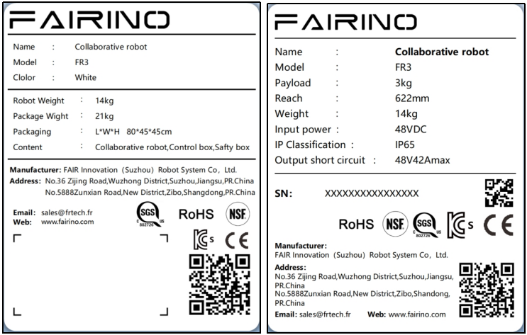

.. centered:: Figure 3.1-1 FR3 model collaborative robot

.. figure:: installation/106.png
	:align: center
	:width: 6in

.. centered:: Figure 3.1-2 FR3-WMS model collaborative robot

.. figure:: installation/107.png
	:align: center
	:width: 6in

.. centered:: Figure 3.1-3 FR3-WML model collaborative robot

.. figure:: installation/108.png
	:align: center
	:width: 6in

.. centered:: Figure 3.1-4 FR3-C model collaborative robot

.. figure:: installation/003.png
	:align: center
	:width: 6in

.. centered:: Figure 3.1-5 FR5 model collaborative robot

.. figure:: installation/004.png
	:align: center
	:width: 6in

.. centered:: Figure 3.1-6 FR10 model collaborative robot

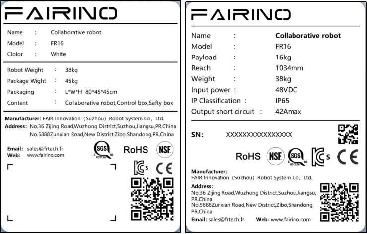

.. centered:: Figure 3.1-7 FR16 model collaborative robot

.. figure:: installation/006.png
	:align: center
	:width: 6in

.. centered:: Figure 3.1-8 FR20 model collaborative robot

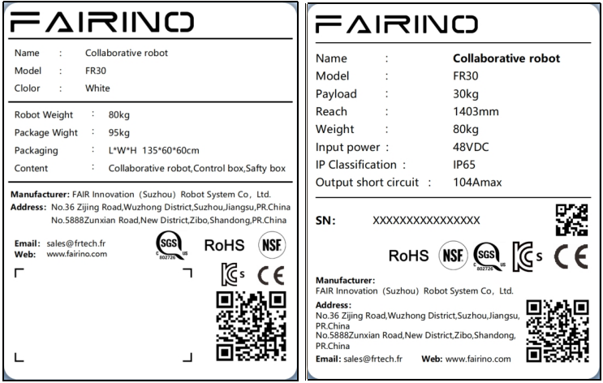

.. centered:: Figure 3.1-9 FR30 model collaborative robot

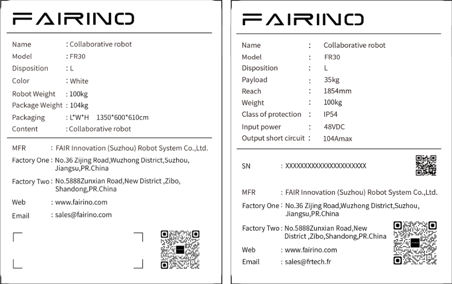

.. centered:: Figure 3.1-10 FR30L model collaborative robot

Effectiveness and responsibility
~~~~~~~~~~~~~~~~~~~~~~~~~~~~~~~~~~~~~

The information in this manual does not include a complete robot application in design, installation and operation, nor does it contain all peripheral equipment that may affect the security of this complete system. The design and installation of this complete system must meet the safety requirements established in the standards and specifications of the country's installation.

The integrated integrator of FAIR INNOVATION is responsible for ensuring that it follows the laws and regulations of relevant countries, and there is no major danger in the complete robotic application. This includes but not limited to the following:

-  Do a risk assessment of the complete robot system

-  Connect other machinery and additional safety equipment defined by risk assessment and definition

-  Establish appropriate security settings in software

-  Make sure that users will not modify any security measures

-  Confirm that the design and installation of the entire robot system is accurate

-  Clear instructions for use

-  Kark the relevant signs and contact information of integrators on the robot

-  Collect all the documents in the technical file, including this manual

Limited responsibility
~~~~~~~~~~~~~~~~~~~~~~~~

Any security information contained in this manual shall not be regarded as a general robot safety guarantee. Even if you comply with all security descriptions, it may still cause personnel damage or equipment damage.

The warning signs in this manual
~~~~~~~~~~~~~~~~~~~~~~~~~~~~~~~~~~~~~~

The following flag defines the explanation of the danger level provisions contained in this manual. The product also uses the same warning signs.

.. important:: 
	.. figure:: installation/008.png
		:width: 60
		:height: 50
		:align: left

	Danger: This refers to the power consumption that is about to cause danger. If it is not avoided, it can lead to death or severe damage.

.. important:: 
	.. figure:: installation/009.png
		:width: 60
		:height: 50
		:align: left

	Electric shock danger: This refers to the upcoming electric shock situation that is about to cause danger.

.. important:: 
	.. figure:: installation/010.png
		:width: 60
		:height: 50
		:align: left

	Dangerous burns: This refers to the hot surface that may cause danger. If you do not avoid contact, it can cause personnel to hurt.
	

Pre-use evaluation
~~~~~~~~~~~~~~~~~~~~~~~

After using a robot or any modification for the first time, the robot's default speed is less than 250mm/s. Do not log in to the administrator to modify the speed to enter the high-speed mode. After that, the following test must be performed. It is confirmed that all security input and output are correct and the connection is correct. Test whether all connected security input and output (including multiple machines or robots shared equipments) are normal. So you must:

-  Test whether the emergency stop button and input can stop the robot and start the brake.

-  Test whether the protection input can stop the robot movement. If the protection reset is configured, check if you need activation before recovery.

-  The test operation mode can switch the operation mode, see the icon in the upper right corner of the user interface.

-  Test whether the 3rd gear actuation device must be pressed to activate in manual mode, and the robot is under deceleration control (the robot software version V3.0 does not support this function).

-  Test whether the system emergency stop output can bring the entire system to a safe state.

Emergency stop
~~~~~~~~~~~~~~

The emergency stop button is type 0 stop. Press the emergency stop button to stop all the movements of the robot immediately.

The following table shows the stop distance and stop time of the type 0 stop. These measurement results correspond to the following configuration of the robot:

-  Extension: 100%(the robotic arm is fully expanded)

-  Speed: 100%(Robot general speed is set to 100%, moved at a joint speed of 180 °/s)

-  Effective load: Maximum effective load

Joint 1, joint 6 testing robot levels, the rotating shaft is perpendicular to the ground. Joint 2, joint 3, joint 4, joint 5 testing robots follow the vertical trajectory, the rotating shaft is parallel to the ground, and stops when the robot moves down.

.. centered:: Table 3.1-1 Category 0 stop distance(rad)
.. list-table::
   :widths: 10 15 15 15 15 15 15
   :header-rows: 0
   :class: sheet-center

   * - 
     - **Joint 1**
     - **Joint 2**
     - **Joint 3**
     - **Joint 4**
     - **Joint 5**
     - **Joint 6**

   * - **FR3**
     - 0.47
     - 0.60
     - 0.56
     - 0.29
     - 0.10
     - 0.06

   * - **FR3-WMS**
     - 0.47
     - 0.60
     - 0.56
     - 0.29
     - 0.10
     - 0.06

   * - **FR3-WML**
     - 0.51
     - 0.63
     - 0.60
     - 0.33
     - 0.16
     - 0.10

   * - **FR3-C**
     - 0.47
     - 0.60
     - 0.56
     - 0.29
     - 0.10
     - 0.06

   * - **FR5**
     - 0.51
     - 0.63
     - 0.60
     - 0.33
     - 0.16
     - 0.10

   * - **FR10**
     - 0.64
     - 0.70
     - 0.69
     - 0.42
     - 0.25
     - 0.13

   * - **FR16**
     - 0.60
     - 0.67
     - 0.65
     - 0.39
     - 0.22
     - 0.12

   * - **FR20**
     - 0.69
     - 0.75
     - 0.80
     - 0.48
     - 0.31
     - 0.22

   * - **FR30L**
     - 0.69
     - 0.75
     - 0.80
     - 0.48
     - 0.31
     - 0.22

.. centered:: Table 3.1-2 Category 0 stop time (ms)
.. list-table::
   :widths: 10 15 15 15 15 15 15
   :header-rows: 0
   :class: sheet-center

   * - 
     - **Joint 1**
     - **Joint 2**
     - **Joint 3**
     - **Joint 4**
     - **Joint 5**
     - **Joint 6**

   * - **FR3**
     - 400
     - 470
     - 450
     - 280
     - 120
     - 90

   * - **FR3-WMS**
     - 400
     - 470
     - 450
     - 280
     - 120
     - 90

   * - **FR3-WML**
     - 400
     - 470
     - 450
     - 280
     - 120
     - 90

   * - **FR3-C**
     - 400
     - 470
     - 450
     - 280
     - 120
     - 90

   * - **FR5**
     - 420
     - 500
     - 480
     - 310
     - 150
     - 120

   * - **FR10**
     - 460
     - 540
     - 510
     - 330
     - 170
     - 140

   * - **FR16**
     - 440
     - 530
     - 490
     - 320
     - 160
     - 130

   * - **FR20**
     - 540
     - 600
     - 700
     - 400
     - 260
     - 170

   * - **FR30L**
     - 540
     - 600
     - 700
     - 400
     - 260
     - 170

After the emergency stop, turn off the power, rotate the emergency stop button, and turn on the power to restart the robot.

At the same time, the stop time and stop distance of the robot safety stop and soft limit stop are shown in the table below. These measurement results correspond to the following configuration of the robot:

-  Extension: 100%(the robotic arm is fully expanded)

-  Speed: 100%(Robot general speed is set to 100%, moved at a joint speed of 180 °/s)

-  Effective load: Maximum effective load

Joint 1, joint 6 testing robot levels, the rotating shaft is perpendicular to the ground. Joint 2, joint 3, joint 4, joint 5 testing robots follow the vertical trajectory, the rotating shaft is parallel to the ground, and stops when the robot moves down.

.. centered:: Table 3.1-3 Safety stop distance(rad)
.. list-table::
   :widths: 10 15 15 15 15 15 15
   :header-rows: 0
   :class: sheet-center

   * - 
     - **Joint 1**
     - **Joint 2**
     - **Joint 3**
     - **Joint 4**
     - **Joint 5**
     - **Joint 6**

   * - **FR3**
     - 0.49
     - 0.63
     - 0.58
     - 0.32
     - 0.12
     - 0.09

   * - **FR3-WMS**
     - 0.49
     - 0.63
     - 0.58
     - 0.32
     - 0.12
     - 0.09

   * - **FR3-WML**
     - 0.54
     - 0.65
     - 0.63
     - 0.35
     - 0.19
     - 0.12

   * - **FR3-C**
     - 0.49
     - 0.63
     - 0.58
     - 0.32
     - 0.12
     - 0.09

   * - **FR5**
     - 0.54
     - 0.65
     - 0.63
     - 0.35
     - 0.19
     - 0.12

   * - **FR10**
     - 0.66
     - 0.73
     - 0.71
     - 0.45
     - 0.27
     - 0.14

   * - **FR16**
     - 0.63
     - 0.69
     - 0.68
     - 0.41
     - 0.25
     - 0.14

   * - **FR20**
     - 0.71
     - 0.78
     - 0.82
     - 0.51
     - 0.33
     - 0.25

   * - **FR30L**
     - 0.71
     - 0.78
     - 0.82
     - 0.51
     - 0.33
     - 0.25

.. centered:: Table 3.1-4 Safety stop time(ms)
.. list-table::
   :widths: 10 15 15 15 15 15 15
   :header-rows: 0
   :class: sheet-center

   * - 
     - **Joint 1**
     - **Joint 2**
     - **Joint 3**
     - **Joint 4**
     - **Joint 5**
     - **Joint 6**

   * - **FR3**
     - 410
     - 490
     - 410
     - 300
     - 130
     - 110

   * - **FR3-WMS**
     - 410
     - 490
     - 410
     - 300
     - 130
     - 110

   * - **FR3-WML**
     - 410
     - 490
     - 410
     - 300
     - 130
     - 110

   * - **FR3-C**
     - 410
     - 490
     - 410
     - 300
     - 130
     - 110

   * - **FR5**
     - 450
     - 520
     - 510
     - 330
     - 180
     - 140

   * - **FR10**
     - 480
     - 570
     - 530
     - 360
     - 190
     - 170

   * - **FR16**
     - 470
     - 550
     - 520
     - 340
     - 190
     - 150

   * - **FR20**
     - 560
     - 630
     - 720
     - 430
     - 280
     - 200

   * - **FR30L**
     - 560
     - 630
     - 720
     - 430
     - 280
     - 200

.. centered:: Table 3.1-5 Soft limit stop distance(rad)
.. list-table::
   :widths: 10 15 15 15 15 15 15
   :header-rows: 0
   :class: sheet-center

   * - 
     - **Joint 1**
     - **Joint 2**
     - **Joint 3**
     - **Joint 4**
     - **Joint 5**
     - **Joint 6**

   * - **FR3**
     - 0.52
     - 0.65
     - 0.61
     - 0.34
     - 0.15
     - 0.11

   * - **FR3-WMS**
     - 0.52
     - 0.65
     - 0.61
     - 0.34
     - 0.15
     - 0.11

   * - **FR3-WML**
     - 0.56
     - 0.68
     - 0.65
     - 0.38
     - 0.21
     - 0.15

   * - **FR3-C**
     - 0.52
     - 0.65
     - 0.61
     - 0.34
     - 0.15
     - 0.11

   * - **FR5**
     - 0.56
     - 0.68
     - 0.65
     - 0.38
     - 0.21
     - 0.15

   * - **FR10**
     - 0.69
     - 0.75
     - 0.74
     - 0.47
     - 0.30
     - 0.18

   * - **FR16**
     - 0.65
     - 0.72
     - 0.70
     - 0.44
     - 0.27
     - 0.17

   * - **FR20**
     - 0.74
     - 0.80
     - 0.85
     - 0.53
     - 0.36
     - 0.27

   * - **FR30L**
     - 0.74
     - 0.80
     - 0.85
     - 0.53
     - 0.36
     - 0.27

.. centered:: Table 3.1-6 Soft limit stop time(ms)
.. list-table::
   :widths: 10 15 15 15 15 15 15
   :header-rows: 0
   :class: sheet-center

   * - 
     - **Joint 1**
     - **Joint 2**
     - **Joint 3**
     - **Joint 4**
     - **Joint 5**
     - **Joint 6**

   * - **FR3**
     - 430
     - 500
     - 430
     - 310
     - 150
     - 120

   * - **FR3-WMS**
     - 430
     - 500
     - 430
     - 310
     - 150
     - 120

   * - **FR3-WML**
     - 430
     - 500
     - 430
     - 310
     - 150
     - 120

   * - **FR3-C**
     - 430
     - 500
     - 430
     - 310
     - 150
     - 120

   * - **FR5**
     - 460
     - 540
     - 520
     - 350
     - 190
     - 160

   * - **FR10**
     - 500
     - 580
     - 550
     - 370
     - 210
     - 180

   * - **FR16**
     - 480
     - 570
     - 530
     - 360
     - 200
     - 170

   * - **FR20**
     - 580
     - 640
     - 740
     - 440
     - 300
     - 210

   * - **FR30L**
     - 580
     - 640
     - 740
     - 440
     - 300
     - 210

.. important:: 
	According to IEC 60204-1 and ISO 13850, emergency stop device is not a safe protection device. They are supplementary protection measures and do not need to prevent damage.

Power-free movement
~~~~~~~~~~~~~~~~~~~~~~~~~~~~

If you must move the robot joint but cannot power the robot or other emergencies, please contact the robot dealer. If necessary, you can use violent means to force mobile robots to rescue the trapped persons.

Equipment transportation
----------------------------

Transportation
~~~~~~~~~~~~~~~~~~

Robot and control boxes have been calibrated as complete equipment. Do not separate them, that would require recalibration.

You can only transport the robot in the original packaging. If you want to move the robot in the future, save the packaging material in a dry place.

When the robot moves from the packaging to the installation space, the two arms of the robot are held at the same time. Hold the robot until all the installation bolts of the robot seat are tight.

Carry
~~~~~~

According to different models, the total quality (including packaging) is 15kg-80 kg depending on the model. When manpower transports or transfers the collaborative robot, multiple people need to help lift it, don’t recommend single-person handling, it must be stable during transportation. Avoid equipment tilt or slipping.

.. warning:: 
	- If you use professional equipment for handling, be sure to use a crane or forklift to transport or carry the collaborative robot by using a crane or forklift, otherwise it may cause personnel damage or other accidents;
	- If you use manual handling, please pay attention to the personal safety on the way to handle;
	- The collaborative robot contains precision components, which should avoid severe vibration or shaking during transportation or transportation, otherwise it may reduce the performance of the equipment.

Storage
~~~~~~~~~

The collaborative robot should be stored in -25 ~ 60 ° C, and there is no frost-free environment.

Maintenance, inspection, and scrapping
-------------------------------------------

Maintenance disposal
~~~~~~~~~~~~~~~~~~~~~~~~

Please check the emergency stop and protection stop for 1 month. Determine whether the security function is effective.

Please refer to the wiring chapter for emergency stop and protective stop wiring.

Inspection Plan
~~~~~~~~~~~~~~~~~~~

Preface
+++++++++++

Safety Notice
****************

The following warnings are used in this manual. These warnings are intended to ensure personal and equipment safety. It is important that you observe and follow all assembly instructions and guidelines in other sections of this manual when reading this manual.

Special attention should be paid to the text related to warning signs. Please read the user manual carefully before use. This manual is only used as a customer maintenance instruction manual. Maintenance operators need to have professional competence. Non-professional personnel operation. FAIRINO refuses to assume all responsibilities.

.. note:: If the robot (robot body, control box, teaching box) is damaged, changed or modified due tohumanreasons,FAIRINO rejects all responsibility; FAIRINO is not responsible for any damage to the robot or any other equipment caused by errors inthe programs written by thecustomer.

Effectiveness and accountability
**************************************

The information in this manual does not cover the design, installation and operation of a complete robot application, nor does it cover all peripheral equipment that may affect the safety of this complete system. The complete system is designed and installed to meet safety requirements established in the standards and codes of the country where the robot is installed.

It is the responsibility of FAIRINO integrators to ensure compliance with relevant national laws and regulations and to ensure that there are no significant risks in the complete robot application. This includes but is not limited to the following:

- Do a risk assessment of the complete robotic system
- Connect other machinery and additional safety equipment defined by the risk assessment
- Establish appropriate security settings in software
- Ensure that users do not modify any security measures
- Confirm that the design and installation of the entire robot system is correct
- Clear instructions for use
- Mark the relevant logo and contact information of the integrator on the robot
- Collect all documents in technical files, including this manual

Limited Liability
*********************

Any safety information contained in this manual should not be considered a general robot safety guarantee, and even if all safety instructions are followed, it may still cause personal injury or equipment damage.

Warning signs in this manual
*************************************

The following symbols define the hazard classification specifications contained in this manual. The same warning signs are used on the products. 

.. note:: 
   .. image:: installation/070.png
      :height: 0.75in
      :align: left

   Name: **Danger**
     
   Function: This refers to an electrical situation that is about to cause danger and, if not avoided, could result in death or serious injury.

.. note:: 
   .. image:: installation/071.png
      :height: 0.75in
      :align: left

   Name: **Electric shockhazard**
   
   Function: This refers to an imminent hazardous electric shock situation which, if not avoided, could result in electrocution or serious injury.

.. note:: 
   .. image:: installation/072.png
      :height: 0.75in
      :align: left

   Name: **Burnhazard**
   
   Function: This refers to hot surfaces that may cause hazards and, if touched, may cause injury to persons.

Digital Input/Output Description of Control Box
~~~~~~~~~~~~~~~~~~~~~~~~~~~~~~~~~~~~~~~~~~~~~~~~~~~~~~

Precautions When Switching Digital Related Functions of Control Box
++++++++++++++++++++++++++++++++++++++++++++++++++++++++++++++++++++++++

.. important:: 

  (1) When switching digital input/output functions, the safety operation procedures of the robot must be followed to ensure the safety of operators and equipment.
  (2) Avoid switching digital input/output functions during robot operation to prevent affecting the normal operation of the robot.
  (3) Before switching digital input/output functions, the power supply of the robot must be cut off to prevent electric shock and unexpected machine movement, which may cause personal injury and equipment damage.
  (4) Before switching functions, the requirements of the robot control system for digital input/output must be clarified, including signal type, voltage level, load capacity, etc.
  (5) Ensure that the connection between digital input/output ports and external devices is correct, including whether the wiring is secure and whether the ports match.
  (6) Avoid repeated signal allocation to ensure that each signal is uniquely allocated.
  (7) After allocation is completed, the robot control system must be restarted to make the settings take effect.
  (8) After completing the configuration, enter the I/O status interface to check whether the status of digital input/output signals is correct.
  (9) Verify whether the digital input/output functions are working properly through actual operation or writing test programs.
  (10) If digital input/output signals are related to program logic, check whether the processing of these signals in the program is correct.

Digital Input Description of Control Box
++++++++++++++++++++++++++++++++++++++++++++

Summary of Digital Input of Control Box
***************************************

The following lists the input types supported by the digital input of Faro robot integrated mini control box, as well as the corresponding wiring diagrams and configuration comparison tables.

.. figure:: installation/080.png
	:align: center
	:width: 4in

.. centered:: Figure 3.3-1 DI0-DI7 General Input Valid Status

.. centered:: Table 3.3-1 Control Box Digital Input Configuration Comparison Table

.. list-table::
   :widths: 15 15 35 10 10 10 10 
   :header-rows: 0
   :align: center

   * - **Control Box Type**
     - **Input Type**
     - **Connection Diagram**
     - **High Level Valid (Switch Closed)** 
     - **High Level Valid (Switch Open)** 
     - **Low Level Valid (Switch Closed)**
     - **Low Level Valid (Switch Open)**

   * - DC Control Box
     - NPN Output
     - .. figure:: installation/081.png
          :align: center
          :width: 3in
     - Invalid
     - Valid
     - Valid
     - Invalid

   * - AC Narrow Voltage Control Box
     - NPN Output
     - .. figure:: installation/082.png
          :align: center
          :width: 3in
     - Invalid
     - Valid
     - Valid
     - Invalid

   * - AC Wide Voltage Control Box
     - NPN Output
     - .. figure:: installation/083.png
          :align: center
          :width: 3in
     - Invalid
     - Valid
     - Valid
     - Invalid

   * - AC Wide Voltage Control Box
     - PNP Output
     - .. figure:: installation/084.png
          :align: center
          :width: 3in
     - Invalid
     - Valid
     - Valid
     - Invalid

Supported Types of Digital Input of Control Box
*************************************************************

The digital input of DC control box and AC narrow voltage control box only supports NPN type input. The digital input of AC wide voltage control box supports optional NPN and PNP types, with NPN type as the default factory setting.

.. list-table::
   :widths: 50 50
   :header-rows: 0
   :align: center

   * - **Control Box Type**
     - **Input Type**

   * - DC Control Box
     - NPN Input

   * - AC Narrow Voltage Control Box
     - NPN Input

   * - AC Wide Voltage Control Box
     - NPN Input/PNP Input

Wiring Diagram of Digital Input of Control Box
**************************************************

The digital input of DC control box and AC narrow voltage control box only supports NPN type input. The wiring diagram is as follows.

	.. figure:: installation/085.png
		:align: center
		:width: 6in

	.. centered:: Figure 3.3-2 Wiring Diagram of Digital Input for DC Control Box and AC Narrow Voltage Control Box

The digital input of AC wide voltage control box supports optional NPN and PNP types, with NPN type as the default factory setting. The wiring diagrams are as follows:

.. list-table::
   :widths: 50 50
   :header-rows: 0
   :align: center

   * - **Input Type** 
     - **Connection Diagram**

   * - NPN Input 
     - 	.. figure:: installation/086.png
          :align: center
          :width: 3in

   * - PNP Input
     - 	.. figure:: installation/087.png
          :align: center
          :width: 3in

The input type of the wide voltage control box digital input is determined by the DIP switch inside the control box. If the user needs to change the input type, the DIP switch needs to be set to the corresponding position.

.. list-table::
   :widths: 30 30 40
   :header-rows: 0
   :align: center

   * -  
     - DIP Switch Position
     - DIP Switch Physical Position

   * - NPN Input 
     - EX-24V
     - .. figure:: installation/088.png
          :align: center
          :width: 3in

   * - PNP Input 
     - EX-0V
     - 	.. figure:: installation/089.png
          :align: center
          :width: 3in

Software Settings Related to Digital Input of Control Box
***************************************************************

The only software setting item for digital input is "DI0-DI7 General Input Valid Status", which represents the digital voltage level value corresponding to the detected valid input. This setting allows users to use digital input more flexibly.

	.. figure:: installation/090.png
		:align: center
		:width: 6in

  .. centered:: Figure 3.3-3 DI0-DI7 General Input Valid Status

The comparison table of valid status detected by the software under different settings of "DI0-DI7 General Input Valid Status" when the external switch of digital input is in different states is as follows:

.. centered:: Table 3.3-2 Valid Status Comparison Table

.. list-table::
   :widths: 15 15 15 15 15 15
   :header-rows: 0
   :align: center

   * - **Control Box Type** 
     - **Input Type**
     - **High Level Valid (Switch Closed)**
     - **High Level Valid (Switch Open)**
     - **Low Level Valid (Switch Closed)**
     - **Low Level Valid (Switch Open)**

   * - DC Control Box
     - NPN Input
     - Invalid
     - Valid
     - Valid
     - Invalid

   * - AC Narrow Voltage Control Box
     - NPN Input
     - Invalid
     - Valid
     - Valid
     - Invalid

   * - AC Wide Voltage Control Box
     - NPN Input
     - Invalid
     - Valid
     - Valid
     - Invalid

   * - AC Wide Voltage Control Box
     - PNP Input
     - Invalid
     - Valid
     - Valid
     - Invalid

Digital Output Description of Control Box
+++++++++++++++++++++++++++++++++++++++++++++

Summary of Digital Output of Control Box
*************************************************

The following lists the output types supported by the digital output of Faro robot integrated mini control box, as well as the corresponding wiring diagrams and configuration comparison tables.

.. figure:: installation/091.png
	:align: center
	:width: 4in

.. centered:: Figure 3.3-4 Control Box DO Output During Power-On

.. centered:: Table 3.3-3 Control Box Digital Output Configuration Comparison Table

.. list-table::
   :widths: 10 10 30 10 10 10 10
   :header-rows: 0
   :align: center

   * - **Control Box Type**
     - **Input Type**
     - **Connection Diagram**
     - **High Level (Switch Set to ON)** 
     - **High Level (Switch Set to OFF)** 
     - **Low Level (Switch Set to ON)**
     - **Low Level (Switch Set to OFF)**

   * - DC Control Box
     - NPN Output
     - 	.. figure:: installation/093.png
          :align: center
          :width: 3in
     - Valid 
     - Valid
     - Invalid
     - Invalid

   * - AC Narrow Voltage Control Box
     - NPN Output
     - .. figure:: installation/094.png
          :align: center
          :width: 3in
     - Valid 
     - Valid
     - Invalid
     - Invalid

   * - AC Wide Voltage Control Box
     - NPN Output
     - .. figure:: installation/095.png
          :align: center
          :width: 3in
     - Valid 
     - Valid
     - Invalid
     - Invalid

   * - AC Wide Voltage Control Box
     - PNP Output
     - .. figure:: installation/096.png
          :align: center
          :width: 3in
     - Valid 
     - Valid
     - Invalid
     - Invalid

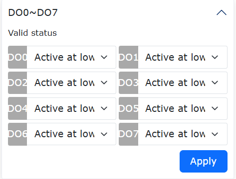

.. centered:: Figure 3.3-5 General Output Valid Status

.. centered:: Table 3.3-4 Control Box Digital Output Configuration Comparison Table

.. list-table::
   :widths: 10 10 30 10 10 10 10 
   :header-rows: 0
   :align: center

   * - **Control Box Type**
     - **Input Type**
     - **Connection Diagram**
     - **High Level Valid (Switch Set to ON)**
     - **High Level Valid (Switch Set to OFF)**
     - **Low Level Valid (Switch Set to ON)**
     - **Low Level Valid (Switch Set to OFF)**

   * - DC Control Box
     - NPN Output
     - 	.. figure:: installation/093.png
          :align: center
          :width: 3in
     - Valid
     - Invalid
     - Invalid
     - Valid

   * - AC Narrow Voltage Control Box
     - NPN Output
     - .. figure:: installation/094.png
          :align: center
          :width: 3in
     - Valid
     - Invalid
     - Invalid
     - Valid

   * - AC Wide Voltage Control Box
     - NPN Output
     - .. figure:: installation/095.png
          :align: center
          :width: 3in
     - Valid
     - Invalid
     - Invalid
     - Valid

   * - AC Wide Voltage Control Box
     - PNP Output
     - .. figure:: installation/096.png
          :align: center
          :width: 3in
     - Valid
     - Invalid
     - Invalid
     - Valid

Supported Types of Digital Output of Control Box
*****************************************************

The digital output of DC control box and AC narrow voltage control box only supports NPN type output. The digital output of AC wide voltage control box supports optional NPN and PNP types, with push-pull structure. It only needs to be wired according to the corresponding wiring diagram without special settings.

.. list-table::
   :widths: 50 50
   :header-rows: 0
   :align: center

   * - **Control Box Type**
     - **Input Type**

   * - DC Control Box
     - NPN Output

   * - AC Narrow Voltage Control Box
     - NPN Output

   * - AC Narrow Voltage Control Box
     - NPN Output/PNP Output

Wiring Diagram of Digital Output of Control Box
******************************************************

The digital output of DC control box and AC narrow voltage control box only supports NPN type output. The wiring diagram is as follows.

	.. figure:: installation/097.png
		:align: center
		:width: 6in

	.. centered:: Figure 3.3-6 Wiring Diagram of Digital Output for DC Control Box and AC Narrow Voltage Control Box

The digital output of AC wide voltage control box supports NPN and PNP types. The wiring diagrams are as follows:

.. list-table::
   :widths: 50 50
   :header-rows: 0
   :align: center

   * - **Input Type** 
     - **Connection Diagram**

   * - NPN Input 
     - 	.. figure:: installation/098.png
          :align: center
          :width: 3in

   * - PNP Input
     - 	.. figure:: installation/099.png
          :align: center
          :width: 3in

Software Settings Related to Digital Output of Control Box
***************************************************************

There are two software setting items for digital output: "Control Box DO Output During Power-On" and "DO0-D07 General Output Valid Status". "Control Box DO Output During Power-On" represents the output level during the power-on period of the control box when the control system has not completed initialization. It can correspond to different output valid states, which can flexibly meet the requirements for output status during power-on. "General Output Valid Status" represents the digital output voltage level value that needs to be controlled when the output is valid. This setting allows users to use digital output more flexibly.

(1) The comparison table of valid status under different settings of "Control Box DO Output During Power-On" is as follows:

	.. figure:: installation/100.png
		:align: center
		:width: 6in

	.. centered:: Figure 3.3-7 Control Box DO Output During Power-On

.. centered:: Table 3.3-5 Valid Status Comparison Table

.. list-table::
   :widths: 20 15 15 15 15 15
   :header-rows: 0
   :align: center

   * - **Control Box Type** 
     - **Input Type**
     - **High Level Valid (Switch Set to ON)**
     - **High Level Valid (Switch Set to OFF)**
     - **Low Level Valid (Switch Set to ON)**
     - **Low Level Valid (Switch Set to OFF)**

   * - DC Control Box
     - NPN Output
     - Valid
     - Valid
     - Invalid
     - Invalid

   * - AC Narrow Voltage Control Box
     - NPN Output
     - Valid
     - Valid
     - Invalid
     - Invalid

   * - AC Wide Voltage Control Box
     - NPN Output
     - Valid
     - Valid
     - Invalid
     - Invalid

   * - AC Wide Voltage Control Box
     - PNP Output
     - Valid
     - Valid
     - Invalid
     - Invalid

(2) The comparison table of valid status under different settings of "DO0-D07 General Output Valid Status" is as follows:

	.. figure:: installation/101.png
		:align: center
		:width: 6in

	.. centered:: Figure 3.3-8 DO0-D07 General Output Valid Status

.. centered:: Table 3.3-6 Valid Status Comparison Table

.. list-table::
   :widths: 20 15 15 15 15 15
   :header-rows: 0
   :align: center

   * - **Control Box Type** 
     - **Input Type**
     - **High Level Valid (Switch Set to ON)**
     - **High Level Valid (Switch Set to OFF)**
     - **Low Level Valid (Switch Set to ON)**
     - **Low Level Valid (Switch Set to OFF)**

   * - DC Control Box
     - NPN Output
     - Valid
     - Invalid
     - Invalid
     - Valid

   * - AC Narrow Voltage Control Box
     - NPN Output
     - Valid
     - Invalid
     - Invalid
     - Valid

   * - AC Wide Voltage Control Box
     - NPN Output
     - Valid
     - Invalid
     - Invalid
     - Valid

   * - AC Wide Voltage Control Box
     - PNP Output
     - Valid
     - Invalid
     - Invalid
     - Valid

Inspection maintenance plan
++++++++++++++++++++++++++++++++++

Robotic arm
**************

1. Inspection plan

Below is a checklist of checklists that FAIRINO Robots recommends performing based on the marked time intervals. If the inspection reveals that the condition of the relevant parts is unqualified, please correct it immediately.

.. note:: F=Functional check,V=visual inspection,*=Must be checked after severe collision.

.. list-table::
   :widths: 10 40 20 20 20 20
   :header-rows: 0
   :align: center

   * - 
     - **Check item**
     - 
     - **Monthly**
     - **Semi-annually**
     - **Annually**

   * - 1
     - Check joint rear cover *
     - V
     - 
     - ✔
     - 

   * - 2
     - Check joint rear cover screws
     - F
     - 
     - ✔
     - 

   * - 3
     - Check joint rubber ring
     - V
     - 
     - ✔
     - 

   * - 4
     - Check robot cables
     - V
     - 
     - ✔
     - 

   * - 5
     - Check robot cable links
     - V
     - 
     - ✔
     - 

   * - 6
     - Check robot base mounting bolts *
     - F
     - ✔
     - 
     - 

   * - 7
     - Check End Tool Mounting Bolts *
     - F
     - ✔
     - 
     - 

.. figure:: installation/073.png
  :align: center
  :width: 3in

2. Visual inspection
   
.. note:: Do not use compressed air to clean robot arms as it may damage components. Do not store the robot for more than 6 months without visual inspection. 

- If possible, move the robot arm to the zero position. 
- Turn off and disconnect the power cord of the control box. 
- Check the cable between the control box and the robot arm for any damage. 
- Check whether the base mounting bolts are properly tightened. 
- Check whether the tool flange bolts are properly tightened. 
- Check whether the flat ring is worn and damaged.
- Check all joint backs for any cracks or damage. 
- Check that the screws for the articulated rear cover are seated and tightened correctly. 

.. note:: If the robot shows any damage during the warranty period, please contact the dealer who purchased the robot.

3. Function check

The purpose of the functional inspection is to ensure that screws, bolts, tools and robot arms are not loose. The screws/bolts mentioned in the inspection planshall be checked with torque wrenches and the torque shall comply with the standard specifications, which can be found in chapter of the Installation Specifications of the User Manual for the specifications of the mounting bolts of the robot arm.

4. Cleaning

You can wipe off any dust/dirt/grease observed on the robot arm using a cloth and one of the following cleaners: water, isopropyl alcohol, 10% ethanol or 10% naphtha. If the robot is operating in harsh environments, such as cutting fluids, coolants, etc., it is recommended to clean or replacethe rubber ringregularly.

Do not use bleach. Do not use bleach in any diluted cleaning solution.

In rare cases, a very small amount of grease can be seen from the joint. This does not affect the function, use or longevity of the joint. 

Control box, teaching device, button box
******************************************

1. Inspection plan

Below is a checklist of checklists that FAIRINO Robots recommends performing based on the marked time intervals. If the inspection reveals that the condition of the relevant parts is unqualified, please correct it immediately.

.. note:: F=Functional check,V=Visual inspection.

.. list-table::
   :widths: 10 40 20 20 20 20
   :header-rows: 0
   :align: center

   * - 
     - **Check item**
     - 
     - **Monthly**
     - **Semi-annually**
     - **Annually**

   * - 1
     - Emergency stop button on test button box (teach pendant)
     - F
     - ✔
     - 
     - 

   * - 2
     - Safety input and output functions on the test terminal strip
     - F
     - ✔
     - 
     - 

   * - 3
     - Detection button box start/stop, mode switching function
     - F
     - ✔
     - 
     - 

   * - 4
     - Test button box (teach pendant) cable
     - V
     - 
     - ✔
     - 

   * - 5
     - Check and clean the air filter on the control box
     - V
     - ✔
     - 
     - 

   * - 6
     - Check whether the terminals of the control box are firm
     - F
     - 
     - ✔
     - 

   * - 7
     - Ground resistance of detection control box ≤1Ω
     - F
     - 
     - 
     - ✔

   * - 8
     - Check the main power supply of the control box
     - F
     - 
     - 
     - ✔

.. figure:: installation/074.png
  :align: center
  :width: 3in

2. Visual inspection

- Unplug the power cord from the control box.

- Check that the terminals of the control board are inserted correctly and there are no loose wires.

- Check whether there is dirt/dust in the control box. Use an ESD vacuum cleaner for cleaning if necessary. 

.. note:: Do not use compressed air to clean the inside of the control box as this may damage components. 

3. Function check

.. note:: Robot safety features are important and it is recommended to test once a month to ensure proper functionality.

- Emergency stop button onteach pendant/button box:
  
  A. Press the emergency stop button on the teach pendant/button box. 
  B. Observe that the robot stops and turns off the joint power. 
  C. Turn on the robot power again. 

	.. figure:: installation/075.png
		:align: center
		:width: 4in

	.. figure:: installation/076.png
		:align: center
		:width: 4in

- Other safety inputs and outputs remain operational
  
  Check which safety inputs and outputs are active and whether they can be triggered by PolyScope or external devices.

- Date and clock
  
  Check that the date and clock in the Log tab are correct. Incorrect dates and clocks indicate low CMOS battery charge. CMOS batteries have a shelf life of up to5 years.

- Check whether the terminal snaps are in place
  
	.. figure:: installation/077.png
		:align: center
		:width: 4in

4. Cleaning

- Teaching device
  
  You may need to clean the teach pendant screen. It is recommended to use a standard mild industrial cleaner that does not contain diluents or any corrosive additives. Do not wipe the screen with abrasive materials. FAIRINO don't market specific cleaning agents.

- The button box 
  
  Do not need to be cleaned regularly when it is not normal. If the key identification is blurred and affects the recognition operation, please clean it with detergent at any time.

- Control box
  
  The control box contains two filters, one on each side of the control box.

  A. The filter can be observed from the left and right side vents of the control box. Under normal circumstances, you can see the honeycomb structure of the filter.
  B. Remove the filter for cleaning. Clean with low pressure air or change filters as needed. Remember to clean each side. If it is dirty or damaged, replace it (worse, remove the upper cover of the controller and replace the filter from inside the upper cover). 
  C. Listen to the sound of the fan when running. If the sound is abnormal, please contact the service provider or replace it.

Check program registration card
******************************************************************

1. Robotic arm
  
.. list-table::
   :widths: 40 20 20 20 40
   :header-rows: 0
   :align: center

   * - **InspectionItem**
     - **Inspected**
     - **Inspector**
     - **Data**
     - **Remark**

   * - **Check joint rear cover**
     - 
     - 
     - 
     - 

   * - **Check joint rear cover screws**
     - 
     - 
     - 
     - 

   * - **Check joint rubber ring**
     - 
     - 
     - 
     - 

   * - **Check robot cables**
     - 
     - 
     - 
     - 

   * - **Check robot cable links**
     - 
     - 
     - 
     - 

   * - **Check robot base mounting bolts**
     - 
     - 
     - 
     - 

   * - **Check End Tool Mounting Bolts**
     - 
     - 
     - 
     - 
  
2. Control box, teaching device, button box

.. list-table::
   :widths: 40 20 20 20 40
   :header-rows: 0
   :align: center

   * - **InspectionItem**
     - **Inspected**
     - **Inspector**
     - **Data**
     - **Remark**

   * - **Emergency stop button on test button box (teach pendant)**
     - 
     - 
     - 
     - 

   * - **Safety input and output functions on the test terminal strip**
     - 
     - 
     - 
     - 

   * - **Detection button box start/stop, mode switching function**
     - 
     - 
     - 
     - 

   * - **Test button box (teach pendant) cable**
     - 
     - 
     - 
     - 

   * - **Check and clean the air filter on the control box**
     - 
     - 
     - 
     - 

   * - **Check whether the terminals of the control box are firm**
     - 
     - 
     - 
     - 

   * - **Ground resistance of detection control box ≤1Ω**
     - 
     - 
     - 
     - 

   * - **Check the main power supply of the control box**
     - 
     - 
     - 
     - 

Robot waste disposal
~~~~~~~~~~~~~~~~~~~~~~

FR robots need to be disposed of according to the applicable national laws and regulations and national standards. For details, you can contact manufacturers.

Installation specifications
---------------------------------

Robot arm installation
~~~~~~~~~~~~~~~~~~~~~~~~~

.. important::
  The recommended robot installation base meets the following requirements to ensure a secure and stable installation of the robot:
  
  (1)The robot mounting base needs to be strong enough and have sufficient load-bearing capacity, which should be able to bear at least 5 times the weight of the robot and at least 10 times the 1-axis torque.

  (2)The surface of the robot mounting base should be flat to ensure close contact with the robot contact surface.

  (3)The robot mounting base should have sufficient stiffness, be firmly fixed, and not resonate with the robot.

  (4)When the robot and other components are moving simultaneously, the mounting base should be separated from other moving components and not fixed together to avoid vibration interference during the movement process.

  (5)If the robot is installed on a mobile platform or external axis, the acceleration of the mobile platform or external axis should be as low as possible.

.. warning:: 
  The following installation methods should be avoided:

  (I)Avoid fixing the robot to other moving devices.

  .. figure:: installation/064.png
    :align: center
    :width: 3in

  .. centered:: Figure 3.4-1 Avoid installing on other sports equipment

  Make sure the robot arm is installed correctly and safely. Unstable installation will cause accidents.

.. note:: 
	You can purchase accurate bases as attachments. Figure 3.4-2、3.4-5、3.4-8、3.4-11 show the position of the sales hole and the location of the screw.

Installation requirements for FR3/FR3-WMS/FR3-WML/FR3-C robot
++++++++++++++++++++++++++++++++++++++++++++++++++++++++++++++++

When installing the robot on the mounting base, use four M6 bolts with a strength of not less than 8.8 to fix the robot on the mounting base. The bolts must be tightened with a torque of not less than 10Nm.Suggest using two on the mounting base φ 5mm pin hole matched with pins for robot positioning to improve robot installation accuracy and prevent robot movement due to collisions and other factors.When the robot has high operating accuracy requirements, please be sure to add pins to position the robot.

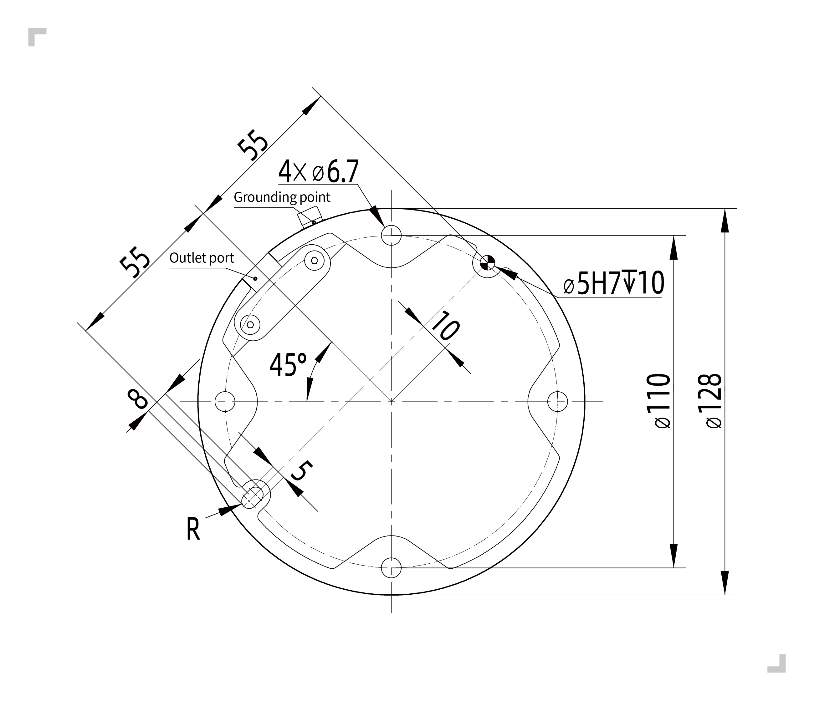

.. centered:: Figure 3.4-2 FR3/FR3-WMS/FR3-WML/FR3-C model collaborative robot installation size

.. important:: 
  According to different application scenarios, we recommend several robot installation bases as follows

  (I)For situations where the motion speed is not too fast, the running speed is not too large, the accuracy requirements are average, and it is not convenient to fix the robot on the ground, the recommended installation base for the robot is as follows.

  .. figure:: installation/062.png
    :align: center
    :width: 3in

  .. centered:: Figure 3.4-3 FR3/FR3-WMS/FR3-WML/FR3-C model collaborative robot low requirement mounting base
  
  (II)For situations where the motion speed is fast, the running speed is high, and the accuracy requirements are high, it is recommended to install the robot on the following base and fix it on a solid ground.

  .. figure:: installation/067.png
    :align: center
    :width: 3in

  .. centered:: Figure 3.4-4 FR3/FR3-WMS/FR3-WML/FR3-C Model Collaborative Robot High Demand Mounting Base

Installation requirements for FR5 robot
++++++++++++++++++++++++++++++++++++++++++++

When installing the robot on the mounting base, use four M8 bolts with a strength of not less than 8.8 to fix the robot on the mounting base. The bolts must be tightened with a torque of not less than 20Nm.Suggest using two on the mounting base φ 8mm pin hole matched with pins for robot positioning to improve robot installation accuracy and prevent robot movement due to collisions and other factors.When the robot has high operating accuracy requirements, please be sure to add pins to position the robot.

.. figure:: installation/026.png
	:align: center
	:width: 6in

.. centered:: Figure 3.4-5 FR5 model collaborative robot installation size

.. important:: 
  According to different application scenarios, we recommend several robot installation bases as follows

  (I)For situations where the motion speed is not too fast, the running speed is not too large, the accuracy requirements are average, and it is not convenient to fix the robot on the ground, the recommended installation base for the robot is as follows.

  .. figure:: installation/062.png
    :align: center
    :width: 3in

  .. centered:: Figure 3.4-6 FR5 Model Collaborative Robot High Demand Mounting Base
  
  (II)For situations where the motion speed is fast, the running speed is high, and the accuracy requirements are high, it is recommended to install the robot on the following base and fix it on a solid ground.

  .. figure:: installation/067.png
    :align: center
    :width: 3in
  
  .. centered:: Figure 3.4-7 FR5 model collaborative robot low requirement mounting base

Installation requirements for FR10&FR16 robot
++++++++++++++++++++++++++++++++++++++++++++++++

When installing the robot on the mounting base, use four M8 bolts with a strength of not less than 8.8 to fix the robot on the mounting base. The bolts must be tightened with a torque of not less than 25Nm.Suggest using two on the mounting base φ 8mm pin hole matched with pins for robot positioning to improve robot installation accuracy and prevent robot movement due to collisions and other factors.When the robot has high operating accuracy requirements, please be sure to add pins to position the robot.

.. figure:: installation/027.png
	:align: center
	:width: 6in

.. centered:: Figure 3.4-8 FR10&FR16 model collaborative robot installation size

.. important:: 
  According to different application scenarios, we recommend several robot installation bases as follows

  (I)For situations where the motion speed is not too fast, the running speed is not too large, the accuracy requirements are average, and it is not convenient to fix the robot on the ground, the recommended installation base for the robot is as follows.

  .. figure:: installation/065.png
    :align: center
    :width: 3in

  .. centered:: Figure 3.4-9 FR10&FR16 model collaborative robot low requirement mounting base
  
  (II)For situations where the motion speed is fast, the running speed is high, and the accuracy requirements are high, it is recommended to install the robot on the following base and fix it on a solid ground.

  .. figure:: installation/067.png
    :align: center
    :width: 3in

  .. centered:: Figure 3.4-10 FR10&FR16 Model Collaborative Robot High Demand Mounting Base

Installation requirements for FR20&FR30&FR30L robot
++++++++++++++++++++++++++++++++++++++++++++++++++++++++++

When installing the robot on the mounting base, use six M10 bolts with a strength of not less than 8.8 to fix the robot on the mounting base. The bolts must be tightened with a torque of not less than 45Nm.Suggest using two on the mounting base φ 8mm pin hole matched with pins for robot positioning to improve robot installation accuracy and prevent robot movement due to collisions and other factors.When the robot has high operating accuracy requirements, please be sure to add pins to position the robot.

.. figure:: installation/029.png
	:align: center
	:width: 6in

.. centered:: Figure 3.4-11 FR20&FR30&FR30L model collaborative robot installation size

.. important:: 
  Because the FR20 and FR30 robots have a large weight and running inertia, it is recommended to be directly fixed on the ground. The recommended base is as follows.

  .. figure:: installation/066.png
    :align: center
    :width: 4in

  .. centered:: Figure 3.4-12 FR20&FR30 model collaborative robot low requirement mounting base

Tool end installation
~~~~~~~~~~~~~~~~~~~~~~~

There are four M6 thread holes in the robot tool, which can be used to connect the tool to the robot. The M6 bolt must be tightened with 8nm torque, and its strength level is not less than 8.8. In order to accurately regain the tools, please use the nails in the reserved ø6 sales holes.

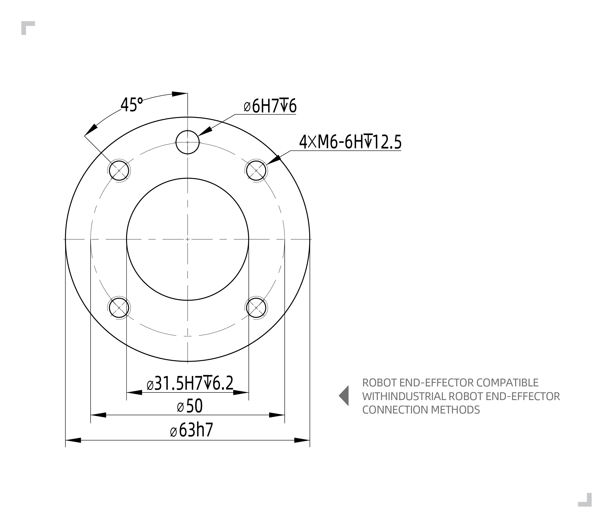

.. centered:: Figure 3.4-13 FR3/FR3-WMS/FR3-WML/FR3-C/FR5/FR10/FR16 model robot end flange drawing

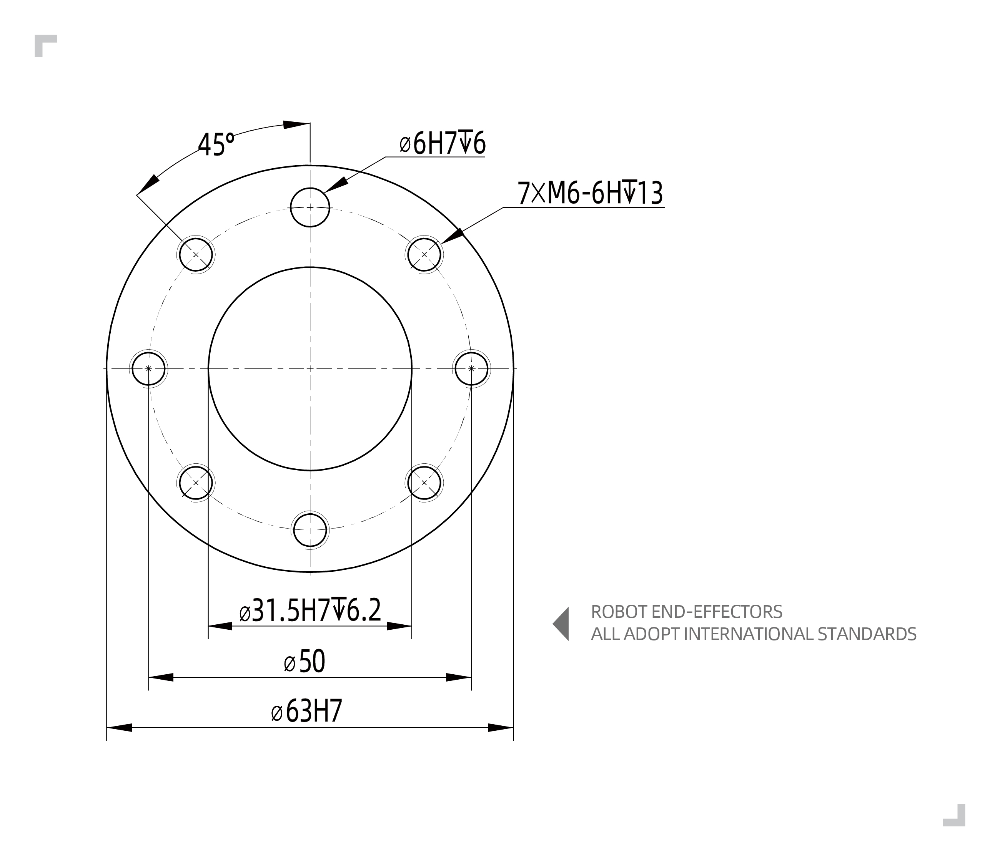

.. centered:: Figure 3.4-14 FR20/FR30/FR30L model robot end flange drawing

.. important:: 
	- Make sure the tools are installed correctly and safely.
	- Ensure the safety architecture of the tools, and no parts of parts fall into danger.
	- Installing M6 bolts with a length of more than 8mm on the robot flange may destroy tool flanges and cause damage that cannot be repaired, causing a tool to change tools.

Installation environment
~~~~~~~~~~~~~~~~~~~~~~~~~~~

When installing and using a collaborative robot, make sure to meet the following requirements:

-  Environmental temperature 0-45 ℃

-  Humidity 20-80RH is not exposed

-  No mechanical impact and shock

-  Altitude requires less than 2000M

-  No corrosive gases, no liquid, no explosive gases, no oil pollution, no salt fog, no dust or metal powder, no radioactive material, no electromagnetic noise, non-flammable items

-  Avoid the device from working under the unstable conditions of the current

-  Users need to add an air switch before the robot power supply, and it is recommended to add an EMC filter

.. note:: 
	If you want to hang or install the collaborative robot, please contact us.

Floor carrier capacity
~~~~~~~~~~~~~~~~~~~~~~~~~~

Installing the robot on a strong surface, the surface should be sufficient to withstand the weight of the robotic arm at least 5 times, and the surface cannot be vibrated.

Load curves for all FR series models
~~~~~~~~~~~~~~~~~~~~~~~~~~~~~~~~~~~~~~~

Overview
+++++++++++++++

The load curves in this section are based on the tests of each model under specific trajectories. The load curves of each model have two parts: "full performance" and "extended load capacity", as follows:

(1) The operating environment of "full performance" is: the friction compensation coefficient of each joint is 1; the collision level of each joint is 10; the web interface is set to 100% operating speed and 360deg/s2 acceleration; dynamics 2.0. In this environment, the "full performance" part of the load curve is suitable for most operating trajectories.

(2) If the end load is in the "extended load capacity", the "time optimal mode" must be turned on and the acceleration limit must be met, or the robot's working range must be reduced.

Parameter Description
++++++++++++++++++++++++

The rated payload of the robot depends on the center of gravity offset of the payload, where the center of gravity offset is defined as the distance between the center of the end flange and the center of gravity of the attached payload.

FR3 Model Collaborative Robot Load Curve
***********************************************

The maximum load that the FR3 collaborative robot can carry is 5kg, and the rated load is 3kg. The load curve is shown in Figure 1. The specific interpretation of the load curve is as follows:

(1) FR3 can carry a load of 3kg or less at full performance, see the "blue envelope";

(2) When the load is 3kg to 5kg, it is the extended load capacity, see the "red envelope", at this time the robot can operate in the following states:

  ① Turn on the "time optimal mode", it is recommended to set the acceleration to less than 360deg/s\ :sup:`2`;

  ② Reduce the robot's working range or reduce the operating speed.

.. figure:: installation/032.png
	:align: center
	:width: 5in

.. centered:: Figure 3.4-15 FR3 Model Collaborative Robot Load Curve

FR3-WMS Model Collaborative Robot Load Curve
***********************************************

The maximum load that the FR3-WMS collaborative robot can carry is 5kg, and the rated load is 3kg. The load curve is shown in Figure 1. The specific interpretation of the load curve is as follows:

(1) FR3-WMS can carry a load of 3kg or less at full performance, see the "blue envelope";

(2) When the load is 3kg to 5kg, it is the extended load capacity, see the "red envelope", at this time the robot can operate in the following states:

  ① Turn on the "time optimal mode", it is recommended to set the acceleration to less than 360deg/s\ :sup:`2`;

  ② Reduce the robot's working range or reduce the operating speed.

.. figure:: installation/032.png
	:align: center
	:width: 5in

.. centered:: Figure 3.4-16 FR3-WMS Model Collaborative Robot Load Curve

FR3-WML Model Collaborative Robot Load Curve
***********************************************

The maximum load that the FR3-WML collaborative robot can carry is 4kg, and the rated load is 3kg. The load curve is shown in Figure 1. The specific interpretation of the load curve is as follows:

(1) FR3-WML can carry a load of 3kg or less at full performance, see the "blue envelope";

(2) When the load is 3kg to 4kg, it is the extended load capacity, see the "red envelope", at this time the robot can operate in the following states:

  ① Turn on the "time optimal mode", it is recommended to set the acceleration to less than 360deg/s\ :sup:`2`;

  ② Reduce the robot's working range or reduce the operating speed.

.. figure:: installation/110.png
	:align: center
	:width: 5in

.. centered:: Figure 3.4-17 FR3-WML Model Collaborative Robot Load Curve

FR3-C Model Collaborative Robot Load Curve
***********************************************

The maximum load that the FR3-C collaborative robot can carry is 5kg, and the rated load is 3kg. The load curve is shown in Figure 1. The specific interpretation of the load curve is as follows:

(1) FR3-C can carry a load of 3kg or less at full performance, see the "blue envelope";

(2) When the load is 3kg to 5kg, it is the extended load capacity, see the "red envelope", at this time the robot can operate in the following states:

  ① Turn on the "time optimal mode", it is recommended to set the acceleration to less than 360deg/s\ :sup:`2`;

  ② Reduce the robot's working range or reduce the operating speed.

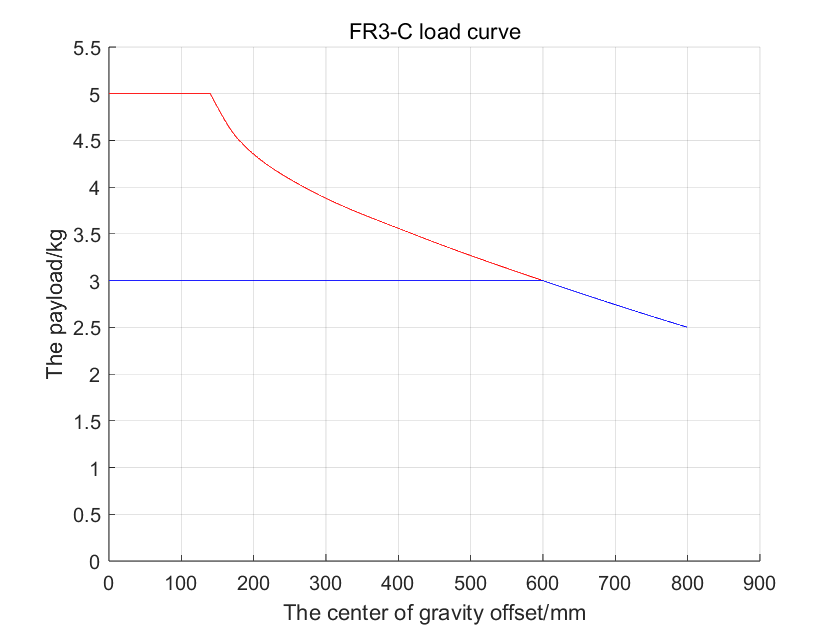

.. centered:: Figure 3.4-18 FR3-C Model Collaborative Robot Load Curve

FR5 Model Collaborative Robot Load Curve
*******************************************

The maximum load that the FR5 collaborative robot can carry is 7kg, and the rated load is 5kg. The load curve is shown in the figure. The specific interpretation of the load curve is as follows:

(1) FR5 can carry a load of 5kg or less at full performance, see the "blue envelope";
(2) When the load is 5kg to 7kg, it is the extended load capacity, see the "red envelope", at this time the robot can operate in the following states:

① Turn on the "time optimal mode", it is recommended to set the acceleration to less than 360deg/s\ :sup:`2`;

② Reduce the robot's working range or reduce the running speed.

.. figure:: installation/033.png
	:align: center
	:width: 5in

.. centered:: Figure 3.4-19 FR5 Model Collaborative Robot Load Curve

FR10 Model Collaborative Robot Load Curve
*******************************************

The maximum load that the FR10 collaborative robot can carry is 14kg, and the rated load is 10kg. The load curve is shown in Figure 3. The specific interpretation of the load curve is as follows:

(1) FR10 can carry a load of 10kg or less at full performance, see the "blue envelope";

(2) When the load is 10kg to 14kg, it is the extended load capacity, see the "red envelope", at this time the robot can operate in the following states:

  ① Turn on the "time optimal mode", it is recommended to set the acceleration to less than 180deg/s\ :sup:`2`;

  ② Reduce the robot's working range or reduce the operating speed.

.. figure:: installation/034.png
	:align: center
	:width: 5in

.. centered:: Figure 3.4-20 FR10 Model Collaborative Robot Load Curve
  
FR16 Model Collaborative Robot Load Curve
**********************************************

The maximum load that the FR16 collaborative robot can carry is 20kg, and the rated load is 16kg. The load curve is shown in the figure. The specific interpretation of the load curve is as follows:

(1) FR16 can carry a load of 16kg or less at full performance, see the "blue envelope";

(2) When the load is 16kg to 20kg, it is the extended load capacity, see the "red envelope", and the robot can operate in the following states:

① Turn on the "time optimal mode", and it is recommended to set the acceleration to less than 180deg/s\ :sup:`2`;

② Reduce the robot's working range or reduce the operating speed.

.. figure:: installation/035.png
	:align: center
	:width: 5in

.. centered:: Figure 3.4-21 FR16 Model Collaborative Robot Load Curve

FR20 Model Collaborative Robot Load Curve
*************************************************

The maximum load that the FR20 collaborative robot can carry is 25kg, and the rated load is 20kg. The load curve is shown in the figure. The specific interpretation of the load curve is as follows:

(1) FR20 can carry a load of 20kg or less at full performance, see the "blue envelope";

(2) When the load is 20kg to 25kg, it is the extended load capacity, see the "red envelope", at this time the robot can operate in the following states:

  ① Turn on the "time optimal mode", it is recommended to set the acceleration to less than 150deg/s\ :sup:`2`;

  ② Reduce the robot's working range or reduce the operating speed.

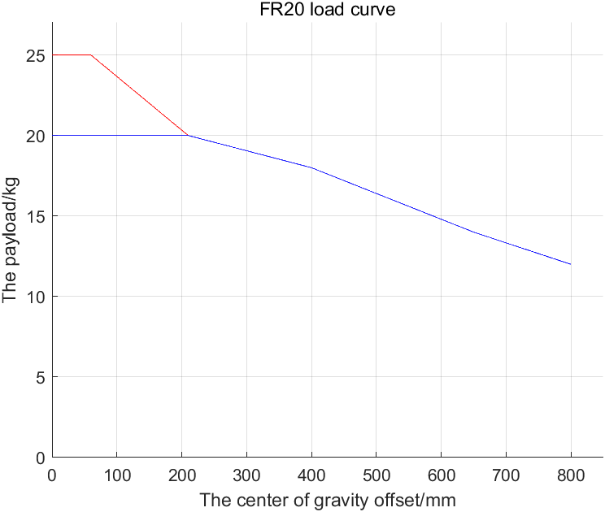

.. centered:: Figure 3.4-22 FR20 Model Collaborative Robot Load Curve

FR30 Model Collaborative Robot Load Curve
*************************************************

The maximum load that the FR30 collaborative robot can carry is 35kg, and the rated load is 30kg. The load curve is shown in the figure.

(1) FR30 can carry a load of 30kg or less at full performance, see the "blue envelope";

(2) When the load is 30kg to 35kg, it is the extended load capacity, see the "red envelope", at this time the robot can operate in the following states:

① Turn on the "time optimal mode", it is recommended to set the acceleration to less than 150deg/s\ :sup:`2`;

② Reduce the robot's working range or reduce the operating speed.

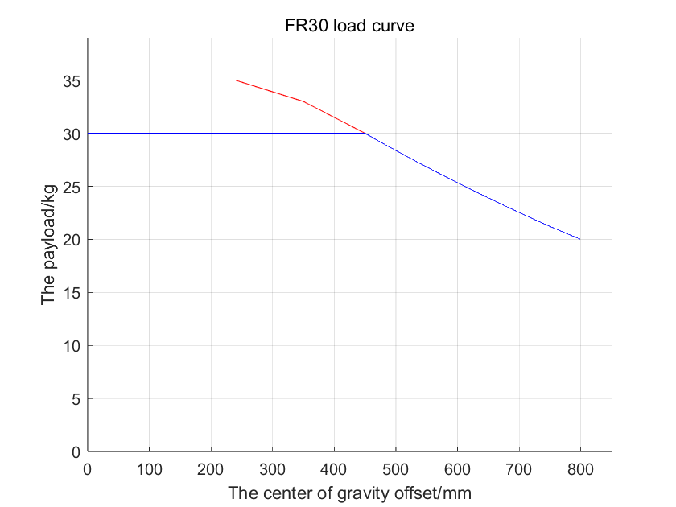

.. centered:: Figure 3.4-23 FR30 Model Collaborative Robot Load Curve

Control connection
------------------------

Controller interface
~~~~~~~~~~~~~~~~~~~~~~~~

This series of robots can be equipped with three control boxes with different power inputs. For details on the control box power input, refer to the control box nameplate information. The robot needs to be electrically grounded.

.. list-table::
   :widths: 20 40 40
   :header-rows: 0
   :align: center

   * - 
     - **Maximum Input (for customers to configure the front-stage power supply)**
     - **Maximum output Output (maximum output peak)**

   * - **DC 2kW**
     - 30-60VDC/30A
     - 2000W/48VDC/41A

   * - **DC 5kW**
     - 30-60VDC/40A
     - 5000W/48VDC/104A

   * - **AC narrow voltage 2kW**
     - 176-264VDC/10A/Single Machine/50Hz
     - 2000W/48VDC/41A

   * - **AC wide voltage 2kW**
     - 100-240VDC/10A/Single Machine/50-60Hz
     - 2000W/48VDC/41A

   * - **AC wide voltage 5kW**
     - 100-240VDC/16A/Single Machine/50-60Hz
     - 5000W/48VDC/104A
  
.. warning:: 
	Before wiring, please ensure that the power supply is turned off and hang a safety warning sign next to it.

The external wiring of this series of robotic arm control systems is connected using pluggable and quickly installable plugs. The wiring panel of the collaborative robot is shown in Figure 3.5-1.

-  Make sure the power button on the control box is off (the button is turned to 0) and connect the power cord to the power socket.

-  Connect the robot body overload cable to the control box overload interface.

-  Insert the button box aviation plug into the control box teaching device interface.

-  The heat dissipation ports on both sides of the control box should be spaced at least 15CM apart.

-  At the front of the control box (user Table metal, switch power button, heavy load and teaching pendant wiring harness), the spacing distance should not be less than 25CM.

-  The control box is 0.6-1.5m above the ground.

-  Do not allow users to replace power cables on their own.

.. figure:: installation/037.png
	:align: center
	:width: 6in

.. centered:: Figure 3.5-1 Robot wiring schematic diagram

Controller I/O panel
~~~~~~~~~~~~~~~~~~~~~~~~~~~~

You can use the I/O in the control box to control various devices, including the stop button of pneumatic relay, PLC, and tight limit device. Figure 3.5-2 shows the electrical interface group of the control box. Figure 3.5-3 shows the electrical interface group that is easy to manufacture control box.

.. figure:: installation/038.png
	:align: center
	:width: 6in

.. centered:: Figure 3.5-2 Control box electrical interface schematic diagram

.. figure:: installation/039.png
	:align: center
	:width: 6in

.. centered:: Figure 3.5-3 Easy to manufacture control box electrical interface schematic diagram

RJ45 network interface group
~~~~~~~~~~~~~~~~~~~~~~~~~~~~~

The network interface group address in the control box is shown in figure below. Note that the graph corresponds to the sequence of the address order of the internal network port of the control box, and the default port of the robot is prohibited from insertion. The user's network port can be used to communicate with the camera and other devices. The IP address is 192.168.57.2. The button box interface is default to the faculty control port, and the IP address is 192.168.58.2. Use the network cable connection button box interface and computer. The computer IP address is set to 192.168.58.10 or the same network segment as it. You can access the teaching pendant page. Easy to manufacture control boxes to access the pages of the oscillator through the network port of the connection button box.

.. figure:: installation/040.png
	:align: center
	:width: 3in

.. centered:: Figure 3.5-4 Significant diagram of network interface group

End plate
~~~~~~~~~~~~~

You can use the end -panel's I/O and 485 communication interfaces to control various devices, including pneumatic relay, PLC and emergency stop buttons. The PIN foot distribution and its PIN foot explanation is shown in figure below. The I/O connector model is M12 connector 8 cores.

.. note:: End board I/O and 485 interfaces are prohibited from hot plugging.

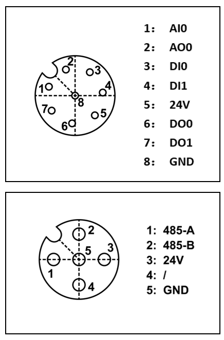

.. centered:: Figure 3.5-5 The schematic diagram of the end version of the electrical interface

Ground
~~~~~~~~~~~~~~

1. The control box is located at the M4 combination screw in the upper left of the power switch, as shown in figure below.

.. figure:: installation/042.png
	:align: center
	:width: 8in

.. centered:: Figure 3.5-6 Demonstration diagram of the control box

1. The body is located on the right side of the base of the base, as shown in figure below.

.. figure:: installation/043.png
	:align: center
	:width: 4in

.. centered:: Figure 3.5-7 Dragon schematic diagram of the body

The protective wire used alone, the cross -sectional area should not be less than:

- 2.5mm\ :sup:`2` copper or 16mm\ :sup:`2` aluminum，if mechanical injury protection is provided (wire pipe, pipeline, etc.)
- 4mm\ :sup:`2` copper or 16mm\ :sup:`2` aluminum，if no mechanical damage protection is provided

The common specifications of all digital I/O
~~~~~~~~~~~~~~~~~~~~~~~~~~~~~~~~~~~~~~~~~~~~~~~~~

This section stipulates the electrical specifications of the following control box 24 volt digital input/output:

-  Safety I/O

-  Universal digital amount I/O

Robots must be installed in accordance with electrical specifications.

By configured the "Power Communication" interface, you can use the internal or external 24V power supply to power the digital I/O. The above two terminals (EX24V and EXON) in the interface are 24V and ground with external power supply, and the two terminals (24V and GND) below are 24V and land of internal power supply. The default configuration uses internal power, as shown in figure below.

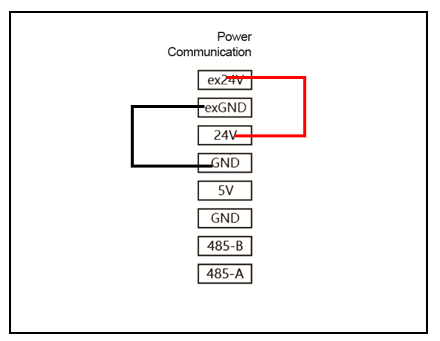

.. centered:: Figure 3.5-8 Power communication schematic diagram 01

If the load power is large, you can connect the external power supply as shown in figure below.

.. figure:: installation/045.png
	:align: center
	:width: 3in

.. centered:: Figure 3.5-9 Power communication schematic diagram 02

The electrical specifications of internal and external power are shown in table below Internal and external electrical specifications:

.. centered:: Table 2.5‑1 Internal and external power supply electrical specifications
.. list-table::
   :widths: 50 20 6 4 6 4
   :header-rows: 0
   :align: center

   * - **Terminal**
     - **Parameter**
     - **Mininum**
     - **Typical**
     - **Maximum**
     - **Unit**

   * - | Internal 24V power supply
       | [ex24V -exGND]
       | [ex24V -exGND]
     - | 
       | Voltage
       | Current
     - | 
       | 23
       | 0
     - | 
       | 24
       | -
     - | 
       | 25
       | 2
     - | 
       | V
       | A

   * - | Internal 24V power supply
       | [24V- GND]
       | [24V- GND]
     - | 
       | Voltage
       | Current
     - | 
       | 23
       | 0
     - | 
       | 24
       | -
     - | 
       | 25
       | 1.5
     - | 
       | V
       | A

The electrical specifications of digital I/O are shown in table below Digital I/O Electric Specifications:

.. centered:: Table 2.5‑2 Digital I/O Electric Specification
.. list-table::
   :widths: 30 40 6 4 6 4
   :header-rows: 0
   :align: center

   * - **Terminal**
     - **Parameter**
     - **Mininum**
     - **Typical**
     - **Maximum**
     - **Unit**

   * - | Digital output
       | [COx/DOx]
       | [COx/DOx]
       | [COx/DOx]
     - | 
       | Current
       | Pressure drop
       | Leakage current
     - | 
       | 0
       | 0
       | 0
     - | 
       | -
       | -
       | -
     - | 
       | 1
       | 0.5
       | 0.1
     - | 
       | A
       | V
       | mA

   * - [COx/DOx]
     - function
     - | -
     - NPN
     - | -
     - Type

   * - | Digital output
       | [EIx/SIx/CIx/DIx]
       | [EIx/SIx/CIx/DIx]
       | [EIx/SIx/CIx/DIx]
     - | 
       | OFF
       | ON
       | Current(11~30)
     - | 
       | -3
       | 11
       | 2
     - | 
       | -
       | -
       | -
     - | 
       | 5
       | 30
       | 15
     - | 
       | V
       | V
       | mA

   * - [EIx/SIx/CIx/DIx]
     - function
     - | -
     - NPN
     - | -
     - Type

Safety I/O
~~~~~~~~~~~~~~~

This section describes the electrical specifications of security I/O, and must abide by the general electrical specifications in Section 3.5.6.

Safety devices and equipment must be installed in accordance with the safety description and risk assessment, see section 3.1. All security I/O is paired (redundant) and must be stored as two independent branches. Single failures should not cause loss of security function.

Safety I/O includes emergency stop and security stop. Urgent stop input is only used for emergency stop equipment, and safely stops input for various security -related protection equipment. Functional differences are shown in table below:

.. centered:: Table 2.5-3 Functional difference
.. list-table::
   :widths: 100 60 60
   :header-rows: 0
   :align: center

   * - 
     - **Emergency stop**
     - **Safe stop**

   * - **Robot stops moving**
     - Yes
     - Yes

   * - **Stop Category**
     - Category 0
     - Category 1

   * - **Program execution**
     - Stop
     - Pause

   * - **Robot power supply**
     - Close
     - Open

   * - **Restart**
     - Manual
     - Automatic or manual

   * - **Frequency of use**
     - Infrequent
     - Often

   * - **Reinitialization required**
     - Need
     - Needless

.. warning:: 
	- Do not connect the security signal to a PLC that does not have the correct and safe level. If this warning does not follow, it may cause serious damage or death because one of the security stop function may be covered. Security interface signals must be separated from normal I/O interface signals.
	- All I/O is a redundant -related I/O built (two independent channels). Two channels must be kept separately so that a single failure will not cause security function.
	- Before the robot is put into operation, it is necessary to verify the emergency stop safety function (the robot is powered on, press the emergency stop button, the robot is disconnected, the power is turned off, the rotating emergency stop button, the power is turned on, and the robot is re -power to enable it). Safety functions must be tested regularly.
	- Robot installation should comply with these specifications. Otherwise, it may lead to severe damage or death, because the safety stop function may be over.

The following sections are given some examples of how to use security I/O.

**Default safety configuration**
When the robot leaves the factory, it has the default configuration. It can be operated without any additional safety devices. Please refer to figure below.

.. figure:: installation/049.png
	:align: center
	:width: 3in

.. centered:: Figure 3.5-10 Safety protection schematic diagram 01

**Connect the emergency stop button**
In most applications, one or more additional emergency stop buttons need to be used. Please refer to figure below.

.. figure:: installation/050.png
	:align: center
	:width: 3in

.. centered:: Figure 3.5-11 Safety protection schematic diagram 02

**Connect the security stop button**
An example of a safe stop device is the door switch that the robot stops when the door is turned on. Please refer to figure below.

.. figure:: installation/051.png
	:align: center
	:width: 3in

.. centered:: Figure 3.5-12 Safety protection schematic diagram 03

Universal digital amount I/O
~~~~~~~~~~~~~~~~~~~~~~~~~~~~~~~~

This section describes the electrical specifications of the general digital I/O, and must abide by the general electrical specifications in Section 3.5.6.

The general digital amount I/O can be used to drive relays, solenoid valves and other devices or interact with other PLCs.

**Digital quantity output control load**

This example demonstrates how to connect the digital quantity output to control the load, Please refer to figure below.

.. figure:: installation/052.png
	:align: center
	:width: 3in

.. centered:: Figure 3.5-13 Great digital quantity output schematic diagram 01

Digital input from the button
~~~~~~~~~~~~~~~~~~~~~~~~~~~~~~

The following example demonstrates how to connect the simple button to the digital quantity input.

.. figure:: installation/053.png
	:align: center
	:width: 3in

.. centered:: Figure 3.5-14 Great digital quantity output schematic diagram 02

Interact with other devices or PLC
~~~~~~~~~~~~~~~~~~~~~~~~~~~~~~~~~~~~~

The following example demonstrates how to interact with other devices or PLC digital input output.

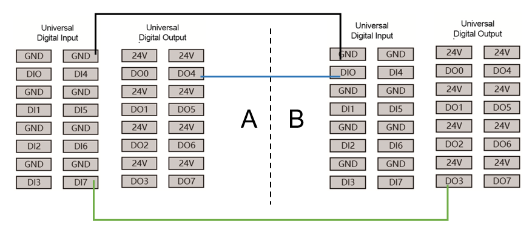

.. centered:: Figure 3.5-15 Interactive diagram with other devices or PLC

Simulation I/O
~~~~~~~~~~~~~~~~

.. centered:: Table 2.5-4 Simulation current voltage
.. list-table::
   :widths: 50 20 6 4 6 4
   :header-rows: 0
   :align: center

   * - **Terminal**
     - **Parameter**
     - **Mininum**
     - **Typical**
     - **Maximum**
     - **Unit**

   * - | Analog current input
       | [AIx-END]
       | [AIx-END]
       | [AIx-END]
     - | 
       | Current
       | Impedance
       | Resolution
     - | 
       | 0
       | -
       | -
     - | 
       | -
       | 500
       | 12
     - | 
       | 20
       | -
       | -
     - | 
       | mA
       | ohm
       | bit

   * - | Analog voltage input
       | [AIx-END]
       | [AIx-END]
       | [AIx-END]
     - | 
       | Voltage
       | Impedance
       | Resolution
     - | 
       | 0
       | -
       | -
     - | 
       | -
       | 510
       | 12
     - | 
       | 10
       | -
       | -
     - | 
       | V
       | Kohm
       | bit

   * - | Analog current input
       | [AOx-END]
       | [AOx-END]
       | [AOx-END]
     - | 
       | Current
       | Voltage
       | Resolution
     - | 
       | 0
       | 0
       | -
     - | 
       | -
       | -
       | 12
     - | 
       | 20
       | 10
       | -
     - | 
       | mA
       | V
       | bit

   * - | Analog voltage input
       | [AOx-END]
       | [AOx-END]
       | [AOx-END]
       | [AOx-END]
     - | 
       | Voltage
       | Current
       | Impedance
       | Resolution
     - | 
       | 0
       | 0
       | -
       | -
     - | 
       | -
       | -
       | 100
       | 12
     - | 
       | 10
       | 20
       | -
       | -
     - | 
       | V
       | mA
       | ohm
       | bit

The simulation I/O is used to set or measure the voltage (0-10V) or current (0-20mA) of other devices.

In order to achieve high precision, the following methods are recommended.

-  The equipment and control box use the same ground (GND).

-  Use shielding cables or twisted wires.

The following example demonstrates how to use analog I/O.

**Use analog output**

The following example is to demonstrate the use of analog output control conveyor belt.

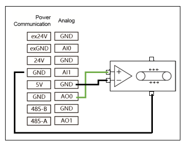

.. centered:: Figure 3.5-16 Simulation output schematic diagram

**Use analog input**

The following example is to demonstrate the simulation input connection simulation sensor.

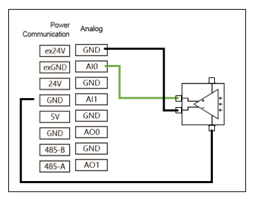

.. centered:: Figure 3.5-17 Simulation input schematic diagram

FR3MT&3C Optional Modules
~~~~~~~~~~~~~~~~~~~~~~~~~~~~~~~~~~~~~~~~~

Preface
+++++++++++++++++++++++++

The definition of collaborative robots complies with international ISO standards and national regulations to ensure operator safety. We do not recommend directly applying the robot body in scenarios where the operation target is the human body. However, if the robot user or developer has a specific need to involve human targets, they must conduct thorough evaluations and ensure personnel safety by configuring a reliable, fully tested, and certified safety protection system for the robot body.

Safety Notice
***************************

This manual serves only as a safety certification guide for customers. Maintenance operators must possess professional expertise. FaRo (法奥) assumes no responsibility for any incidents caused by non-professionals.

.. important:: If the robot (robot body, power module, or extension module) is damaged, altered, or modified due to human factors, FaRo refuses to bear any responsibility. FaRo is not liable for any damage caused to the robot or other equipment due to programming errors made by the customer.

Validity and Responsibility
***************************

The information in this manual does not cover the design, installation, or operation of a complete robot application, nor does it account for all peripheral devices that may affect the safety of the system. The design and installation of the complete system must comply with the safety requirements established by the standards and regulations of the country where the robot is installed.

FaRo’s integrators are responsible for ensuring compliance with relevant national laws and regulations, guaranteeing that the complete robot application poses no significant hazards. This includes but is not limited to:

- Conducting a risk assessment for the complete robot system
- Connecting additional mechanical and safety devices as defined in the risk assessment
- Establishing appropriate safety settings in the software
- Ensuring users do not modify any safety measures
- Verifying the correct design and installation of the entire robot system
- Providing clear usage instructions
- Marking the integrator’s logo and contact information on the robot
- Collecting all documentation, including this manual, in the technical file

Limited Liability
***************************

The safety information in this manual does not constitute a general safety guarantee for robots. Even if all safety instructions are followed, personnel injury or equipment damage may still occur.

Safety Warning Signs
***************************

The following safety warning signs are used on the product.

.. important:: 
	.. figure:: installation/008.png
		:width: 60
		:height: 50
		:align: left

	Name: **DANGER**  

	Purpose: Indicates an imminent electrical hazard that could result in death or serious injury if not avoided.

.. important:: 
	.. figure:: installation/009.png
		:width: 60
		:height: 50
		:align: left

	Name: **ELECTRIC SHOCK HAZARD** 

	Purpose: Indicates an imminent electric shock hazard that could result in death or serious injury if not avoided.

.. important:: 
	.. figure:: installation/010.png
		:width: 60
		:height: 50
		:align: left

	Name: **BURN HAZARD**  

	Purpose: Indicates a hot surface that could cause injury if touched.

.. important:: 
	.. figure:: installation/112.png
		:width: 60
		:height: 50
		:align: left

	Name: **GROUNDING**  
  
	Purpose: Indicates that the device must be properly grounded.
	                                           
FR3MT&3C Base and Module Interface Definitions
++++++++++++++++++++++++++++++++++++++++++++++++++++++++++++++++++++

Base Interface Definitions
***************************

The base of the robot has seven external buttons and interfaces, defined as follows:

.. figure:: installation/113.png
	:align: center
	:width: 4in

.. centered:: Figure 3.5-18 Base Buttons and Interfaces

.. note:: The pin definitions for base interfaces are viewed from the installation reference plane.

**1. Controller Power Button**: Powers on automatically by default.

**2. M8-A Type-4P-Female Socket Pin Definitions**:  
User Ethernet port (IP: 192.168.57.2). Connector: M8-A Type-4P-Female (with M8-A Type-4P-Male plug). Complies with IEC 61076-2-101.

.. figure:: installation/114.png
	:align: center
	:width: 2in

.. list-table::
   :widths: 20 30 50
   :header-rows: 0
   :align: center

   * - **Pin**
     - **Definition**
     - **Description**

   * - 1
     - TX+
     - Data Transmit Positive

   * - 2
     - RX+
     - Data Receive Positive

   * - 3
     - RX-
     - Data Receive Negative

   * - 4
     - TX-
     - Data Transmit Negative

**3. M12-L Type-5P-Male Socket Pin Definitions**:  
Connector: M12-L Type-5P-Male (with M12-L Type-5P-Female plug). Complies with IEC 61076-2-101.

.. figure:: installation/115.png
	:align: center
	:width: 2in

.. list-table::
   :widths: 10 15 15 20 40 
   :header-rows: 0
   :align: center

   * - **Pin**
     - **Color**
     - **Definition**
     - **Description**
     - **Remarks**

   * - 1
     - Black
     - 0V
     - Control Power Negative
     - Robot control power negative (backup power, no connection needed)

   * - 2
     - Brown
     - 24V
     - Control Power Positive
     - Robot control power positive (backup power, no connection needed)

   * - 3
     - White
     - 48V
     - Power Supply Positive
     - Robot power supply positive

   * - 4
     - Blue
     - 0V
     - Power Supply Negative
     - Robot power supply negative

   * - 5
     - Gray
     - PE
     - Ground
     - Safety ground
  
.. note:: 
  ① The base includes a 48V-to-24V power converter.  
  ② The 48V-to-24V converter serves as a backup for the 24V input.

.. figure:: installation/116.png
	:align: center
	:width: 6in

.. centered:: Figure 3.5-19 48V-to-24V Power Conversion Diagram

**4. M12-A Type-12P-Female Socket Pin Definitions**:  
Connector: M12-A Type-12P-Female (with M12-A Type-12P-Male plug). Complies with IEC 61076-2-101.

.. figure:: installation/117.png
	:align: center
	:width: 2in

.. list-table::
   :widths: 10 15 15 20 40 
   :header-rows: 0
   :align: center

   * - **Pin**
     - **Color**
     - **Definition**
     - **Description**
     - **Remarks**

   * - 1
     - Blue
     - AGND
     - Analog Ground
     - Analog reference ground

   * - 2
     - Brown
     - 0V
     - 24V Power Negative
     - Control power negative

   * - 3
     - Red
     - 485-A
     - RS485 Communication A
     - Reserved for expansion

   * - 4
     - Gray
     - 485-B
     - RS485 Communication B
     - Reserved for expansion

   * - 5
     - Black
     - DI0/DO0
     - Digital Input/Output 0
     - Configurable as input or output (mutually exclusive)

   * - 6
     - Yellow
     - DI1/DO1
     - Digital Input/Output 1
     - Configurable as input or output (mutually exclusive)

   * - 7
     - Pink
     - DI2/DO2
     - Digital Input/Output 2
     - Configurable as input or output (mutually exclusive)

   * - 8
     - Dark Green
     - AI0/AO0
     - Analog Input/Output 0
     - Configurable as input or output (mutually exclusive)

   * - 9
     - White
     - AI1/AO1
     - Analog Input/Output 1
     - Configurable as input or output (mutually exclusive)

   * - 10
     - Purple
     - 24V
     - 24V Power Positive
     - Control power positive

   * - 11
     - Orange
     - DI3/DO3
     - Digital Input/Output 3
     - Configurable as input or output (mutually exclusive)

   * - 12
     - Light Green
     - DI4/DO4
     - Digital Input/Output 4
     - Configurable as input or output (mutually exclusive)

**5. M8-A Type-4P-Female Socket Pin Definitions**:  
Debug Ethernet port (IP: 192.168.58.2). Connector: M8-A Type-4P-Female (with M8-A Type-4P-Male plug). Complies with IEC 61076-2-101.

.. figure:: installation/114.png
	:align: center
	:width: 2in

.. list-table::
   :widths: 20 30 50
   :header-rows: 0
   :align: center

   * - **Pin**
     - **Definition**
     - **Description**

   * - 1
     - TX+
     - Data Transmit Positive

   * - 2
     - RX+
     - Data Receive Positive

   * - 3
     - RX-
     - Data Receive Negative

   * - 4
     - TX-
     - Data Transmit Negative

**6. USB-A Port**: USB 2.0 for internal debugging.  
**7. HDMI-A Port**: HDMI display for internal debugging.

Power Module Interface Definitions
******************************************************

The power module uses a Meanwell NDR-480-48. Pin definitions:

.. figure:: installation/118.png
	:align: center
	:width: 3in

.. list-table::
   :widths: 20 20 20 40
   :header-rows: 0
   :align: center

   * - **Pin**
     - **Definition**
     - **Description**
     - **Remarks**

   * - 1
     - L
     - Live Wire
     - Input 100-240V AC

   * - 2
     - N
     - Neutral Wire
     - Input 100-240V AC

   * - 3
     - PE
     - Ground
     - Earth connection

   * - 4
     - +V
     - 48V
     - Output 48V/10A

   * - 5
     - +V
     - 48V
     - Output 48V/10A

   * - 6
     - -V
     - 0V
     - Output 48V return

   * - 7
     - -V
     - 0V
     - Output 48V return

Extension Module Interface Definitions
******************************************************

The extension module includes emergency stop and energy discharge functions. External terminals and internal topology:

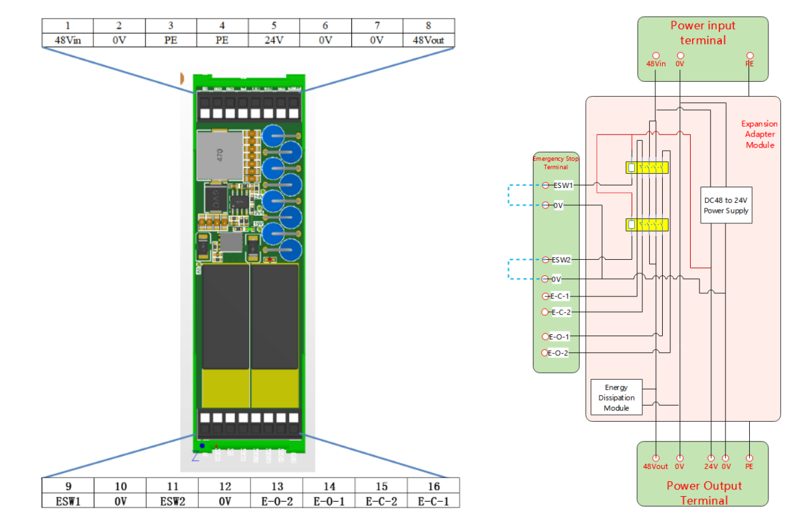

.. list-table::
   :widths: 20 30 50
   :header-rows: 0
   :align: center

   * - **Pin**
     - **Definition**
     - **Description**

   * - 1
     - 48-IN
     - 48V Input Positive

   * - 2
     - 0V
     - 48V Input Negative

   * - 3
     - PE
     - Ground

   * - 4
     - PE
     - Ground

   * - 5
     - 24V
     - Control Power Positive

   * - 6
     - 0V
     - Control Power Negative

   * - 7
     - 0V
     - Power Supply Negative

   * - 8
     - 48-OUT
     - Power Supply Positive

   * - 9
     - ESW1
     - Emergency Stop Button 1 Positive

   * - 10
     - 0V
     - Emergency Stop Button 1 Negative

   * - 11
     - ESW2
     - Emergency Stop Button 2 Positive

   * - 12
     - 0V
     - Emergency Stop Button 2 Negative

   * - 13
     - E-O-2
     - Passive Normally Open 2

   * - 14
     - E-O-1
     - Passive Normally Open 1

   * - 15
     - E-C-2
     - Passive Normally Closed 2

   * - 16
     - E-C-1
     - Passive Normally Closed 1

FR3MT&3C Application Scenarios
++++++++++++++++++++++++++++++++++++++++++++++++++++

Most scenarios only require the user cable kit. Specific use cases:

.. list-table::
   :widths: 10 15 15 20 40 
   :header-rows: 0
   :align: center

   * - **No.**
     - **Scenario**
     - **Power Supply**
     - **Functional Requirements**
     - **Recommended Configuration**

   * - 1
     - Basic Application
     - 48V/10A DC available
     - No E-stop/energy discharge
     - User cable kit

   * - 2
     - Safety Extended
     - 48V/10A DC available
     - E-stop + energy discharge
     - User cable kit + extension module

   * - 3
     - Independent Power
     - No 48V/10A DC
     - No E-stop/energy discharge
     - User cable kit + power module + power cord

   * - 4
     - Full Function
     - No 48V/10A DC
     - E-stop + energy discharge
     - User cable kit + power module + power cord + extension module

Basic Application
******************************************************

Only user cable kit required. Connection steps:

1. Connect the M12-L-5P-Female power cable to the base (48V/0V/PE to user power supply; insulate 24V/0V).  
2. Connect M12-A-12P-Male and M8-A-4P-Male to base.

.. figure:: installation/120.png
	:align: center
	:width: 6in

.. centered:: Figure 3.5-20 Only user cable kit required connection steps

Safety Extended
******************************************************

User cable kit + extension module. Connection steps:

1. Connect the 0.5M extension cable (48V/0V/PE) to user power and module.  
2. Connect M12-L-5P-Female to base (all 5 wires to module).  
3. Connect M12-A-12P-Male and M8-A-4P-Male to base.

.. figure:: installation/121.png
	:align: center
	:width: 6in

.. centered:: Figure 3.5-21 User cable kit + extension module connection steps

Independent Power
******************************************************

User cable kit + power module + power cord. Connection steps:

1. Connect 1.5M power cord (L/N/PE) to NDR-480-48 input.  
2. Connect M12-L-5P-Female to base (48V/0V/PE to power module; insulate 24V/0V).  
3. Connect M12-A-12P-Male and M8-A-4P-Male to base.

.. figure:: installation/122.png
	:align: center
	:width: 6in

.. centered:: Figure 3.5-22 User cable kit + power module + power cord connection steps

Full Function
******************************************************

User cable kit + power module + power cord + extension module. Connection steps:

1. Connect 1.5M power cord (L/N/PE) to NDR-480-48.  
2. Connect 0.5M extension cable (48V/0V/PE) between power module and extension.  
3. Connect M12-L-5P-Female to base (all 5 wires to module).  
4. Connect M12-A-12P-Male and M8-A-4P-Male to base.

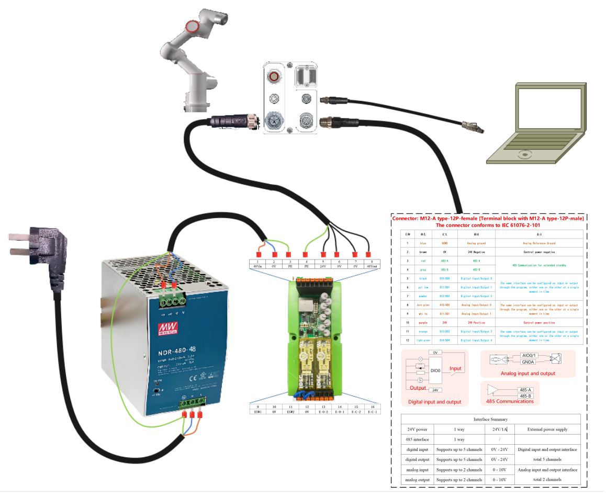

.. centered:: Figure 3.5-23 User cable kit + power module + power cord + extension module connection steps

Optional Parts List
+++++++++++++++++++++++++++++++++++++++++++++++++++++++

User Cable Kit (5M):

.. list-table::
   :widths: 20 60 20 
   :header-rows: 0
   :align: center

   * - **No.**
     - **Name**
     - **Qty**

   * - 1
     - FR3MT&3C-DC Power Cable-5M
     - 1

   * - 2
     - FR3MT&3C-I/O Cable-5M
     - 1

   * - 3
     - FR3MT&3C-Ethernet Cable-5M
     - 1

   * - 4
     - M8 Straight Plug, M8-P4A-PLA05, 4-pin
     - 1

User Cable Kit (1M):

.. list-table::
   :widths: 20 60 20 
   :header-rows: 0
   :align: center

   * - **No.**
     - **Name**
     - **Qty**

   * - 1
     - FR3MT&3C-DC Power Cable-1M
     - 1

   * - 2
     - FR3MT&3C-I/O Cable-1M
     - 1

   * - 3
     - FR3MT&3C-Ethernet Cable-1M
     - 1

   * - 4
     - M8 Straight Plug, M8-P4A-PLA05, 4-pin
     - 1

Power Module:

.. list-table::
   :widths: 20 60 20 
   :header-rows: 0
   :align: center

   * - **No.**
     - **Name**
     - **Qty**

   * - 1
     - Meanwell Power Supply, NDR-480-48
     - 1

Power Cord:

.. list-table::
   :widths: 20 60 20 
   :header-rows: 0
   :align: center

   * - **No.**
     - **Name**
     - **Qty**

   * - 1
     - FR3MT&3C-Power Cord-1.5M 
     - 1

Extension Module:

.. list-table::
   :widths: 20 60 20 
   :header-rows: 0
   :align: center

   * - **No.**
     - **Name**
     - **Qty**

   * - 1
     - FR3MT&3C Base-Extension Module
     - 1

   * - 2
     - FR3MT&3C Power-Extension Cable-0.5M
     - 1

Demonstrate and end LED
---------------------------

The robotic teaching pendant can use a computer or tablet to access and control the robot. The connection method can refer to Section 3.5.3 to explain. In addition, users can also use our FR-HMI osteter.

Introduction to the button box
~~~~~~~~~~~~~~~~~~~~~~~~~~~~~~~~~~

60 Button Box (POE) (BX01)
+++++++++++++++++++++++++++++++++++++

.. figure:: installation/058.png
	:align: center
	:width: 6in

.. centered:: Figure 2.6-1 60 Button Box (POE) (BX01)

**Emergency stop switch:**\  When pressing the emergency stop switch, the robot enters the state of emergency stop.

**Type-c:**\ Connect the port of the web teaching pendant.

**Button 1:**\ Short press automatic/manual mode switch, long press and enter/exit the drag mode.

**Button 2:**\ Short press the record to show the teaching point, long press and enter/exit the state of no demonstrator.

**Button 3:**\ Start/stop running program.

60 Button Box (POE) (BX02)-V1.0
++++++++++++++++++++++++++++++++++++++

.. figure:: installation/059.png
	:align: center
	:width: 6in

.. centered:: Figure 2.6-2 60 Button Box (POE) (BX02)-V1.0

**Emergency stop switch:**\ When pressing the emergency stop switch, the robot enters the state of emergency stop.

**Start/Stop:**\ Start/stop running program.

**Ethernet:**\ Connect to the web teaching pendant.

**Turn off:**\ No enabled.

**Record point:**\ Record the teaching point.

**Teaching mode:**\ Enter/exit with the teaching pendant state.

**Working mode:**\ Automatic/manual mode switch.

**Drag mode:**\ Enter/exit drag mode.

60 Button Box (POE) (BX02) - V2.0
++++++++++++++++++++++++++++++++++++++

.. figure:: installation/079.png
	:align: center
	:width: 6in

.. centered:: Figure 3.6-3 60 Button Box (POE) (BX02) - V2.0

**Emergency stop switch:** \ When the emergency stop switch is pressed, the robot enters an emergency stop state.

**Start/Stop:** \ Start/Stop running the program.

**Network port:** \ Connect to a web teaching pendant.

**IP reset:** \ Reset the network port IP.

**Record point:** \ Record teaching points.

**One click clear:** \ Clear all recoverable errors.

**Operation mode:** \ Automatic/Manual mode switching.

**Drag mode:** \ Enter/exit drag mode.

FR-HMI Teach pendant introduction
~~~~~~~~~~~~~~~~~~~~~~~~~~~~~~~~~~~

.. figure:: installation/060.png
	:align: center
	:width: 6in

.. centered:: Figure 2.6-3 FR-HMI teaching pendant front

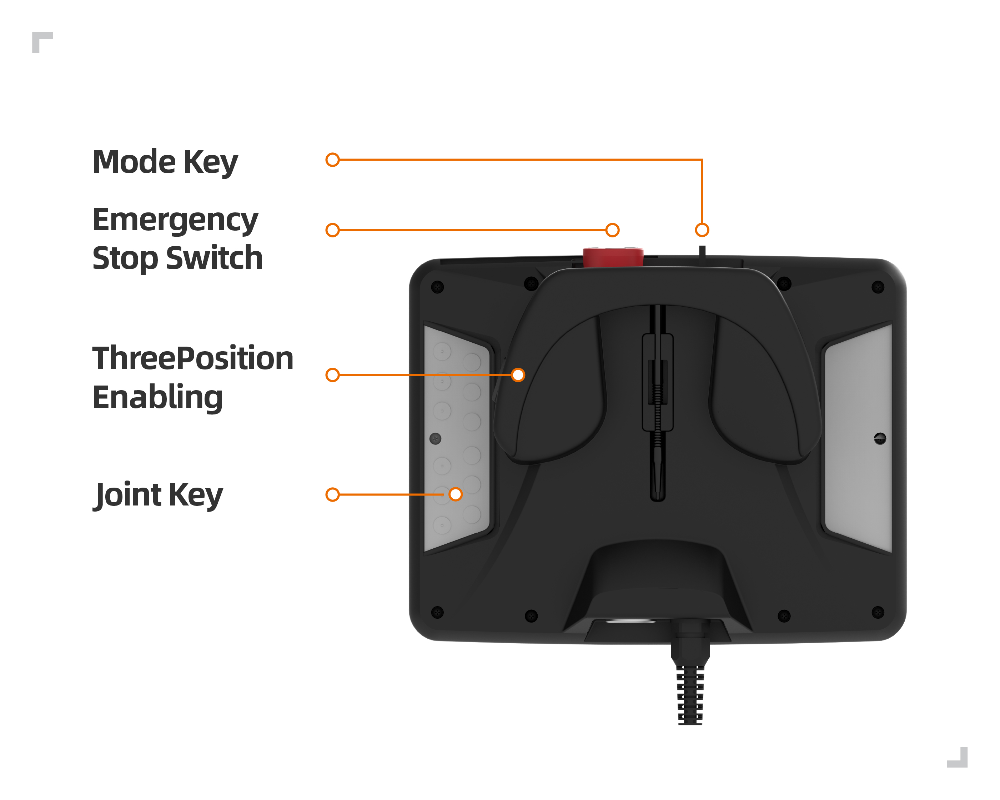

.. centered:: Figure 2.6-4 FR-HMI teaching pendant back

**Display:**\ Touch operation and display interface of the teaching pendant.

**Start key:**\ Start the program.

**Stop key:**\ Stop the currently running program.

**Joint button:**\ The joint node of the robot.

**Three -bit enable:**\ Manual mode enable robots

**Emergency stop switch:**\ When pressing the emergency stop switch, the robot enters the state of emergency stop.

**Mode key:**\ Rotate the button to switch the automatic mode.

End LED definition
~~~~~~~~~~~~~~~~~~~~~

.. centered:: Table 3.6‑1 The end LED definition table
.. list-table::
   :widths: 50 50
   :header-rows: 0
   :align: center

   * - **Function**
     - **LED color**

   * - When communication is not established
     - "Off", "Red", "Green" and "Blue" alternately

   * - Automatic mode
     - Blue long bright

   * - Manual mode
     - Green long bright

   * - Drag Mode
     - White cyan long bright

   * - Button box record point (only when using button box)
     - Purple blinks twice

   * - Start running (only when using the button box)
     - Cyan blue flashes twice

   * - Enter the state of unmatched button box (only when using the button box)
     - Blue flashes twice

   * - Stop operation (only when using the button box)
     - Red flashes twice

   * - Error reporting (only when using the button box)
     - Red long bright

   * - Zero calibration completed
     - White cyan flashes three times

   * - Enable
     - Yellow flashes twice