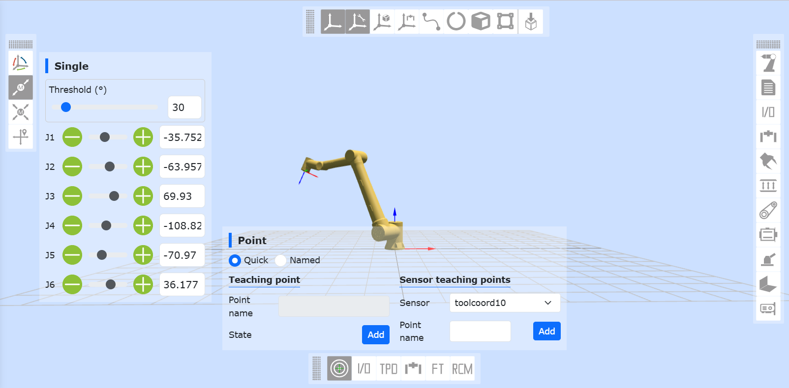

Insegnamento manuale del robot
=================================

Insegnamento manuale e registrazione dei punti di insegnamento
--------------------------------------------------------------------------------

L'insegnamento manuale comprende due modalità:

- 1. Premere e tenere premuto il pulsante di trascinamento finale per eseguire l'insegnamento per trascinamento;
- 2. Utilizzare il controllo del robot in 3D -> Operazioni sugli oggetti 3D per eseguire il movimento puntuale.

Dopo aver insegnato il punto di destinazione, è possibile salvare il punto di insegnamento in "Funzioni robotiche" -> "Registrazione punti di insegnamento". Quando il punto di insegnamento viene salvato, il sistema di coordinate del punto di insegnamento sarà quello del sistema di coordinate attualmente utilizzato dal robot.

.. centered:: Diagramma 4.1‑1 Insegnamento manuale

Visualizzare le informazioni del punto di insegnamento
-----------------------------------------------------------------

Cliccando su "Programma di insegnamento" -> "Punti di insegnamento" si visualizzano tutte le informazioni sui punti di insegnamento salvati. La modalità attuale dei punti è suddivisa in "Modalità sistema" e "Modalità tabella dei punti".

In questa interfaccia è possibile importare ed esportare i file dei punti di insegnamento. Selezionando un punto di insegnamento e cliccando sul pulsante "Elimina", il punto selezionato sarà rimosso. I valori dei punti di insegnamento x, y, z, rx, ry, rz e v possono essere modificati. Inserisci i valori modificati, seleziona la casella di controllo sulla sinistra e clicca su "Modifica" in alto per aggiornare le informazioni del punto di insegnamento.

Cliccando sul pulsante "Inizia esecuzione", il robot eseguirà il movimento verso il punto di insegnamento selezionato. Inoltre, gli utenti possono cercare i punti di insegnamento tramite il nome.

.. image:: points/001.png
   :width: 6in
   :align: center

.. centered:: Diagramma 4.2‑1 Interfaccia di gestione dei punti di insegnamento

.. important:: 
    I valori modificati per i punti di insegnamento x, y, z, rx, ry, rz non devono superare il campo di lavoro del robot.
