Process Package
==========================

.. toctree::
  :maxdepth: 5

Welding Expert Library
--------------------------------

Click the "Welding Expert Library" menu item under "Auxiliary Application" -> "Process Package" to enter the Welding Expert Library function interface, which includes Straight Welding, Arc Welding, Multi-Layer Multi-Pass Welding, and Posture Adjustment.

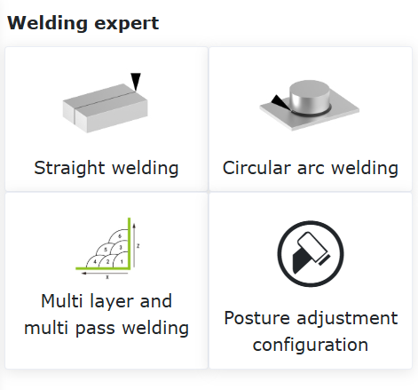

.. centered:: Figure 15.1‑1 Extended Axis Configuration

Straight Welding
~~~~~~~~~~~~~~~~~~~~~~~~

Click "Straight Welding" to enter the Straight Welding guidance interface. Based on the completion of basic robot settings, we can quickly generate welding teaching programs through a few simple steps. It mainly includes the following five steps. Due to functional mutual exclusion, the actual steps to generate one welding teaching program are fewer than five.

Step 1: Decide whether to use the extended axis. If using the extended axis, you need to configure the relevant coordinate system for the extended axis and enable it. Weaving function cannot be used when the extended axis is used.

.. image:: process/002.png
   :width: 4in
   :align: center

.. centered:: Figure 15.1‑2 Extended Axis Configuration

Step 2: Choose whether sensor tracking is needed. If yes, you need to edit the parameters of the laser search command. Weaving function cannot be used when sensor tracking is used.

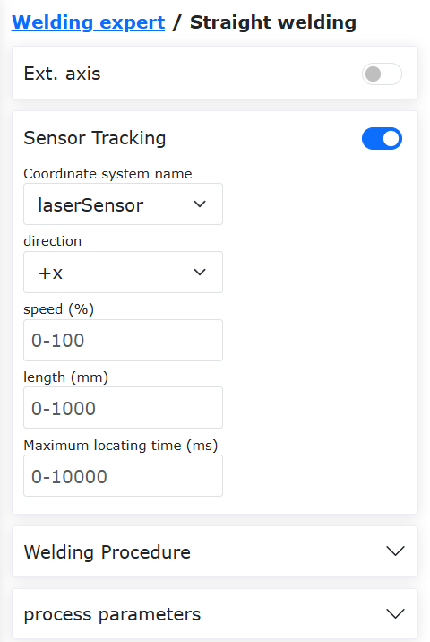

.. centered:: Figure 15.1‑3 Laser Search Configuration

Step 3: Choose whether weaving is needed. If weaving is needed, you need to edit the relevant weaving parameters.

.. image:: process/004.png
   :width: 4in
   :align: center

.. centered:: Figure 15.1‑4 Weaving Configuration

Step 4: Calibrate the Start Point, Start Safe Point, End Point, and End Safe Point. If the extended axis was selected in Step 1, the extended axis movement function will be loaded to assist with the calibration of the relevant points.

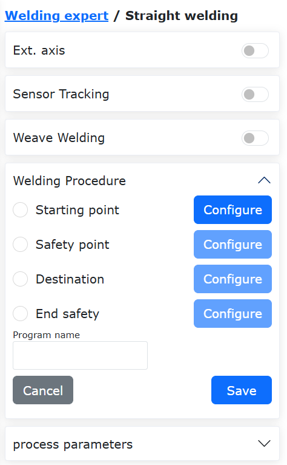

.. centered:: Figure 15.1‑5 Calibrating Relevant Points

Step 5: Name the program, and it will automatically open in the program teaching interface.

.. image:: process/006.png
   :width: 4in
   :align: center

.. centered:: Figure 15.1‑6 Saving the Program

After the program is successfully saved, you can modify the welding speed in the Process Parameters.

.. image:: process/007.png
   :width: 4in
   :align: center

.. centered:: Figure 15.1‑6 Process Parameters

Arc Welding
~~~~~~~~~~~~~~~~~~~~~~~~

Click "Arc Welding" under "Weldment Shape" to enter the Arc Welding guidance interface. Based on the completion of basic robot settings, we can quickly generate welding teaching programs through two simple steps. It mainly includes the following two steps.

Step 1: Calibrate the Start Point, Start Safe Point, Arc Transition Point, End Point, and End Safe Point.

.. image:: process/008.png
   :width: 4in
   :align: center

.. centered:: Figure 15.1‑8 Calibrating Points

Step 2: Name the program, and it will automatically open in the program teaching interface.

.. image:: process/009.png
   :width: 4in
   :align: center

.. centered:: Figure 15.1‑9 Saving the Program

After the program is successfully saved, you can modify the welding speed in the Process Parameters.

.. image:: process/010.png
   :width: 4in
   :align: center

.. centered:: Figure 15.1‑10 Process Parameters

Multi-Layer Multi-Pass Welding
~~~~~~~~~~~~~~~~~~~~~~~~~~~~~~~~~~~~

When the weld leg size is greater than 10mm, the Multi-Layer Multi-Pass Welding function is typically used. This function enables template-based configuration of welding programs, incorporates arc tracking function during the first pass of multi-layer multi-pass welding, and corrects weld deviation in subsequent multi-pass straight welding processes, thereby improving weld quality.

The operation process for Arc Tracking Multi-Layer Multi-Pass Welding is as follows:

1) Set the Tool Coordinate System, enter the tool dimensions and posture of the welding torch.

.. note::
   The values on the interface are for example only; use the actual tool status.

.. image:: process/011.png
   :width: 4in
   :align: center

.. centered:: Figure 15.1-11 Setting Tool Coordinate System

2) Click "Multi-Layer Multi-Pass Welding" to enter the interface.

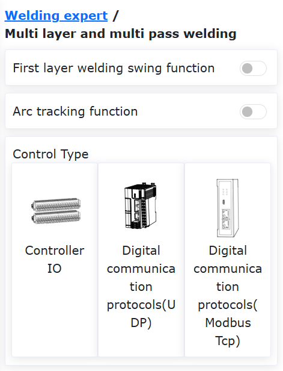

.. centered:: Figure 15.1-12 Opening the Multi-Layer Multi-Pass Welding Interface

3) To use the arc tracking function, be sure to turn on the "First Layer Welding Weaving Function" switch and configure the corresponding weaving parameters.

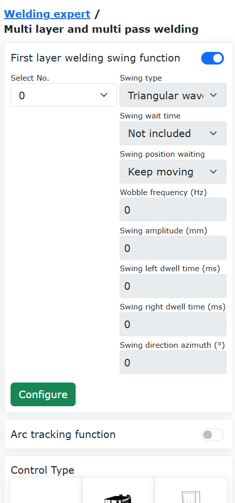

.. centered:: Figure 15.1-13 Enabling First Layer Welding Weaving Function

4) Click the "Configure" button, edit the weaving parameters, then click "Configure".

.. note::
   If arc tracking requires left/right compensation, only "Triangle Wave Weaving" and "Sine Wave Weaving" types can be selected. The weaving frequency must not be lower than 0.5Hz, the weaving amplitude must not be less than 3mm, the left and right dwell times must be the same, and the weaving azimuth angle must be 0.

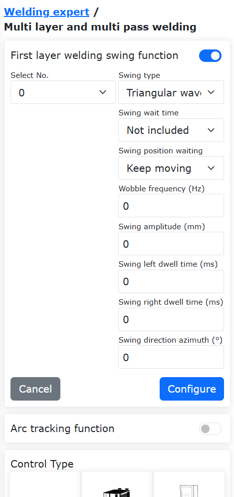

.. centered:: Figure 15.1-14 Configuring Weaving Parameters

5) Turn on the "Arc Tracking Function" switch and edit the corresponding up/down and left/right compensation parameters.

.. note::
   Configure the arc tracking parameters according to the actual welding situation, refer to the "Arc Tracking Function Operation Manual" or contact relevant technical personnel.

.. image:: process/015.png
   :width: 4in
   :align: center

.. centered:: Figure 15.1-15 Configuring Arc Tracking Parameters

6) Click the corresponding type according to the control type to enter the interface. First, in the first set of points, set the "Welding Point" as the welding start position; the "X+ Point" is a point in the X+ direction of the custom offset coordinate system relative to the welding point; the "Z+ Point" is a point in the Z+ direction of the custom offset coordinate system relative to the welding point; the "Safe Point" is the transition position from the completion of the last weld to the start of the next weld. After teaching and setting, automatically proceed to the second set of points.

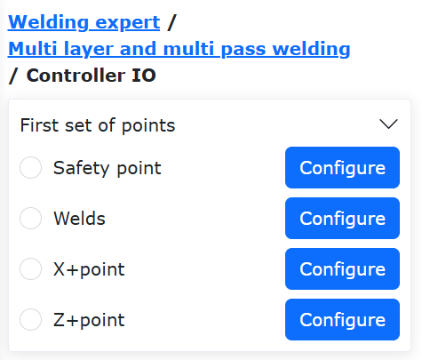

.. centered:: Figure 15.1-16 Multi-Layer Multi-Pass Welding Straight Start Point Position Setting

7) Select "Straight Point". Here, the "Welding Point" is the welding end position; the "X+ Point" is a point in the X+ direction of the custom offset coordinate system relative to the "Welding Point"; the "Z+ Point" is a point in the Z+ direction of the custom offset coordinate system relative to the "Welding Point". After teaching and setting, click the "Finish" button to set the multi-layer multi-pass welding parameters.

.. image:: process/017.png
   :width: 4in
   :align: center

.. centered:: Figure 15.1-17 Multi-Layer Multi-Pass Welding Straight End Point Position Setting

8) On this page, you can set the number of multi-layer multi-pass welds and their distribution positions. Click the "On/Off" box in the parameter table to activate the corresponding offset position and angle values for the multi-layer multi-pass welding positions, and enter the desired offset positions and angles in the custom coordinate system in the "X", "Z", and "B" columns.

.. image:: process/018.png
   :width: 4in
   :align: center

.. centered:: Figure 15.1-18 Multi-Layer Multi-Pass Welding Parameter Setting

9) At this point, all parameter configuration is complete. Enter the desired program name and click the "Save" button to automatically generate the corresponding multi-layer multi-pass welding program.

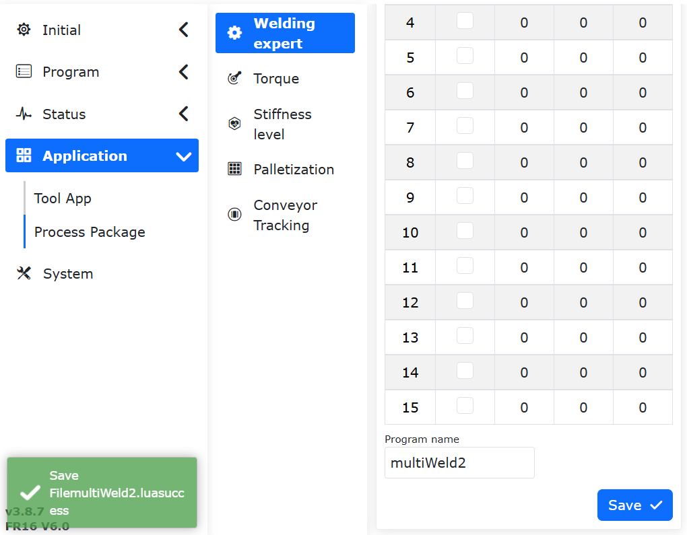

.. centered:: Figure 15.1-19 Multi-Layer Multi-Pass Welding Program Generation

10) Click the "Open Program" button to read the Lua program saved in the previous step. The program content is shown in the figure below.

.. image:: process/020.png
   :width: 4in
   :align: center

.. centered:: Figure 15.1-20 Arc Tracking Multi-Layer Multi-Pass Welding Program Example

Posture Adjustment
~~~~~~~~~~~~~~~~~~~~~~~~~~~~~~~~~~~~

Posture Adaptive Configuration Steps
++++++++++++++++++++++++++++++++++++++++++++++++++++++++

**Step1**: Enter the Posture Adjustment configuration interface, select the plate type and the actual robot working movement direction, adjust the robot posture, and set Posture Point A, Posture Point B, and Posture Point C respectively. Usually, A is the flat posture point, B is the rising edge posture point, and C is the falling edge posture point.

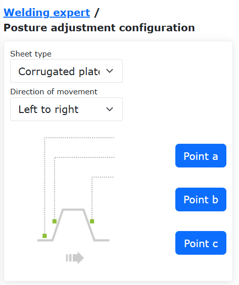

.. centered:: Figure 15.1‑21 Posture Adjustment Configuration

.. important::
	The posture change between posture A and B, and posture A and C should be as small as possible while meeting the application requirements. The posture adaptive function is an auxiliary application function, usually used in conjunction with seam tracking.

**Step2**: Select the "Adjust" command in the program teaching command interface. Add instructions as needed according to the specific program teaching requirements.

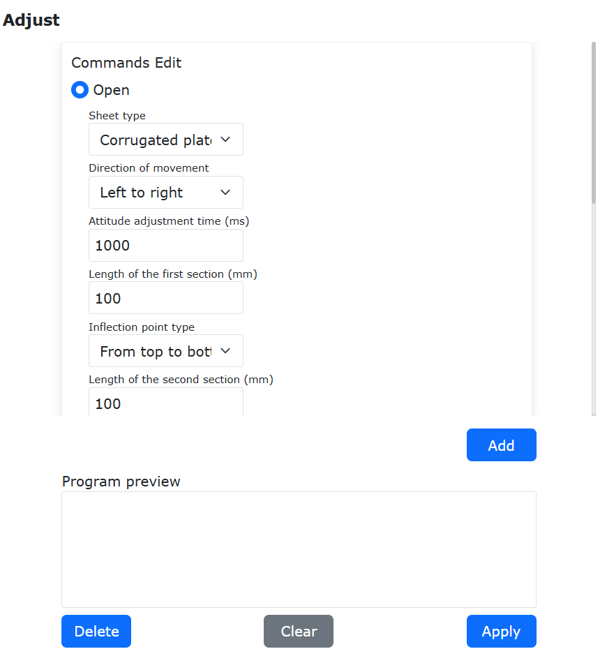

.. centered:: Figure 15.1‑22 Posture Adjustment Command Editing

Posture Adaptive Combined with Extended Axis and Laser Tracking Welding Teaching Program
++++++++++++++++++++++++++++++++++++++++++++++++++++++++++++++++++++++++++++++++++++++++++++++++++++

.. list-table::
   :widths: 50 80 80
   :header-rows: 0
   :align: center

   * - **No.**
     - **Command Format**
     - **Comment**

   * - 1
     - EXT_AXIS_PTP(1,1laserstart)
     - #External axis move to laser sensor start point

   * - 2
     - PTP(laserstart,10,-1,0)
     - #Robot move to laser sensor start point

   * - 3
     - LTSearchStart(3,20,10,10000)
     - #Start search

   * - 4
     - LTSearchStop()
     - #Stop search

   * - 5
     - EXT_AXIS_PTP(1,1,seamPos)
     - #External axis move to seam start point

   * - 6
     - Lin(seamPos,20,-1,00,0)
     - #Robot move to seam start point

   * - 7
     - LTTrackOn()
     - #Laser tracking on

   * - 8
     - ARCStart(0,10000)
     - #Arc start

   * - 9
     - PostureAdjustOn(0,PosA,PosC,PosB,1000)
     - #Posture adaptive adjustment on

   * - 10
     - EXT_AXIS_PTP(1,1,laserend)
     - #External axis move to seam end point

   * - 11
     - Lin( laserend,10,-1,0,0)
     - #Robot move to seam end point

   * - 12
     - ARCEnd(0,10000)
     - #Arc end

   * - 13
     - PostureAdjustOff(0)
     - #Posture adaptive adjustment off

   * - 14
     - LTTrackOff
     - #Laser tracking off

Palletizing System Configuration
---------------------------------------------

Palletizing System Configuration Steps
~~~~~~~~~~~~~~~~~~~~~~~~~~~~~~~~~~~~~~~~~~~~~~~~~~~~~~~~~~~~~~~~~~

**Step1**: Click the "Palletizing" menu item under "Auxiliary Application" -> "Process Package" to enter the Palletizing System Configuration interface.

For first-time use, you need to first create a recipe. Click "Recipe Creation", enter the recipe name, click "Create". After successful creation, click "Start Configuration" to enter the palletizing configuration page.

.. figure:: process/023.png
   :align: center
   :width: 4in

.. centered:: Figure 15.2‑1 Palletizing Recipe Configuration

**Step2**: In the Workpiece Configuration section, click "Configure" to enter the workpiece configuration pop-up window. Set the workpiece's "Length", "Width", "Height", and the workpiece pickup point. Click "Confirm Configuration" to complete the workpiece information setup.

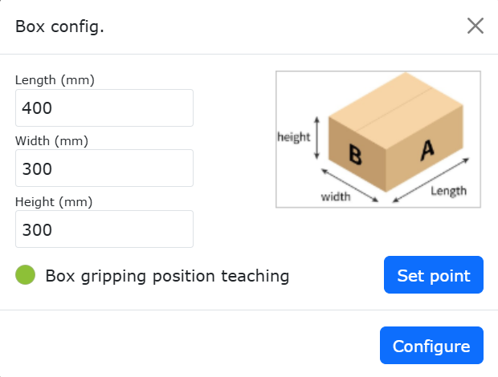

.. centered:: Figure 15.2‑2 Palletizing Workpiece Configuration

**Step3**: In the Pallet Configuration section, click "Configure" to enter the pallet configuration pop-up window. Set the pallet's "Front Edge", "Side Edge", and "Height", then set the station and station transition points. Click "Confirm Configuration" to complete the pallet information setup.

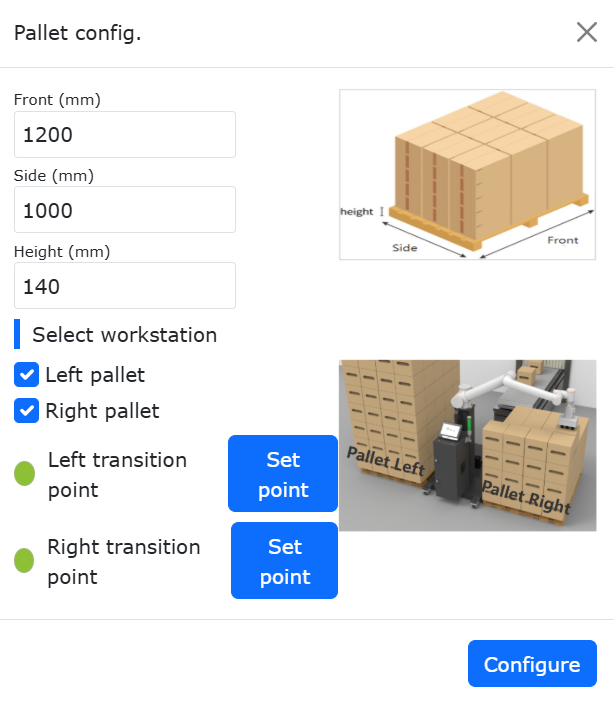

.. centered:: Figure 15.2‑3 Palletizing Pallet Configuration

**Step4**: In the Palletizing Equipment Dimensions Configuration section, click "Configure" to enter the palletizing equipment dimensions configuration pop-up window. Set the equipment's "X", "Y", "Z", and "Angle". Click "Confirm Configuration" to complete the palletizing equipment dimensions configuration.

.. important::
   X, Y, Z are the absolute values of the coordinates of the upper right corner point of the left pallet or the upper left corner point of the right pallet relative to the robot base coordinate system. Angle is the rotation angle during robot installation, recommended to be 0 during installation.

.. figure:: process/026.png
   :align: center
   :width: 4in

.. centered:: Figure 15.2‑4 Palletizing Equipment Dimensions Configuration

**Step5**: In the Mode Configuration section, click "Configure" to enter the mode configuration pop-up window.

   **Mode B On/Off**: On: Can switch between Mode A/B, configure Mode B for each palletizing layer; Off: Cannot switch to Mode B, cannot configure Mode B for each palletizing layer;

   **Mode A/B Switch**: Select Mode A: Added workpieces are Mode A, workpiece numbers are A1, A2..., cannot adjust workpiece transparency; Select Mode B: Added workpieces are Mode B, workpiece numbers are B1, B2..., can then turn on/off "Show Mode A Configuration" to display Mode A workpieces;

   **Show Mode A On/Off**: On: Adjust Mode B workpiece transparency to check if the A/B mode configuration effect is reasonable. At this time, only operations like selecting, adding, batch adding, deleting, and deleting all can be performed on Mode B workpieces; Off: Cannot set Mode B workpiece transparency;

.. important::
   When configuring workpieces, if workpieces collide, the workpiece background color turns red, and the above operations cannot be performed. If operation is needed, please configure the workpieces to have no collision.

When configuring workpieces, first set the workpiece spacing. The right box simulates the placement of workpieces on the right pallet; you can add individually or in batches. Then set the number of palletizing layers and the mode for each layer. Click "Confirm Configuration" to complete the mode information setup.

.. important::
   Palletizing direction: Taking the right pallet as an example, the lower right corner is the farthest point. Place a row of workpieces vertically or horizontally from the lower right corner, then place the next row of workpieces horizontally or vertically above it, and so on (The web page has marked the palletizing direction, please check).

   The left pallet places workpieces mirrored based on the right pallet mode.

.. figure:: process/027.png
   :align: center
   :width: 4in

.. centered:: Figure 15.2‑5 Palletizing Mode A Configuration

.. figure:: process/028.png
   :align: center
   :width: 4in

.. centered:: Figure 15.2‑6 Palletizing Mode B Configuration

**Step6**: In the Teaching Program Generation section, click "Advanced Configuration" to enter the advanced configuration pop-up window. Configure the "Pick Lift Height", "First Offset Distance", "Second Offset Distance", and "Suction Wait Time".

   **Pick Lift Height**: User-defined height lifted after successful pickup from the pickup point;

   **First/Second Offset Distance**: User-defined offset distance for the robot to tilt and stack to the target point;

   **Suction Wait Time**: User-defined suction wait time, monitoring the negative pressure signal after suction, repeating the suction action if not到位;

   **Smooth Transition**: Turn on the Smooth Transition button to configure parameters related to Palletizing/Depalletizing PTP smooth time and LIN smooth radius.

   - PTP Smooth Time: No smooth transition time / Level 1 (200ms) / Level 2 (400ms) / Level 3 (600ms) / Level 4 (800ms) / Level 5 (1000ms)
   - LIN Smooth Radius: No smooth transition radius / Level 1 (200mm) / Level 2 (400mm) / Level 3 (600mm) / Level 4 (800mm) / Level 5 (1000mm)

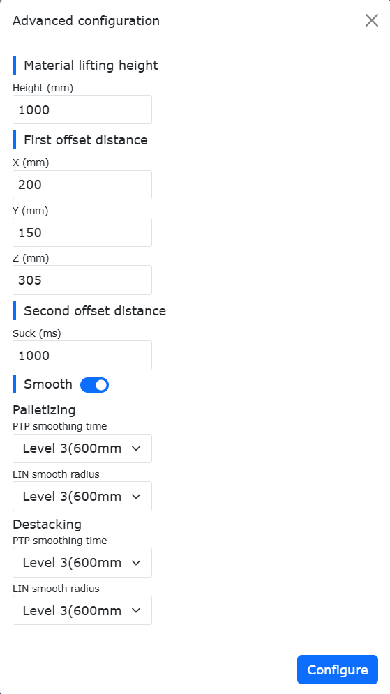

.. centered:: Figure 15.2‑7 Palletizing Advanced Configuration

**Step7**: In the Teaching Program Generation section, select "Method Selection", click "Generate Program", open the "Palletizing Monitor Page". On this page, you can view and check the "Generation Information", "Alarm Information", and "Palletizing Program".

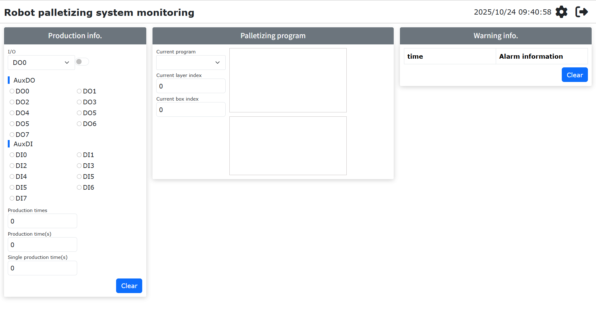

.. centered:: Figure 15.2‑8 Palletizing System Monitoring

**Step8**: If the palletizing running program reports an error midway and stops, the user should first clear the error, then select the palletizing program to run again. At this time, a "Last Program Interrupted" pop-up box will appear. Click the "Resume" button to continue running, or click the "Restart" button to restart the program.

.. figure:: process/031.png
   :align: center
   :width: 3in

.. centered:: Figure 15.2‑9 Palletizing Program Resume

Conveyor Tracking
----------------------------------

Conveyor Tracking Configuration Steps
~~~~~~~~~~~~~~~~~~~~~~~~~~~~~~~~~~~~~~~~~~~~~~~~~~~~~~~~~~~~~~~

**Step1**: Select the "Conveyor" menu item under "Auxiliary Application" -> "Process Package" to enter the Conveyor Tracking Configuration interface. Click the "Configure Conveyor IO" button to quickly configure the IO required for the conveyor function. Then, configure the corresponding parameters according to the actual function usage. Here, taking non-vision tracking picking function as an example, you need to configure the conveyor encoder channel, resolution, lead, and select "No" for vision pairing, then click Configure.

.. figure:: process/032.png
   :align: center
   :width: 4in

.. figure:: process/033.png
   :align: center
   :width: 4in

.. centered:: Figure 15.3‑1 Conveyor Configuration

**Step2**: Next, set the pickup point compensation values, which are the compensation distances in the X, Y, and Z directions. These can be set during debugging based on the actual situation.

.. figure:: process/034.png
   :align: center
   :width: 4in

.. centered:: Figure 15.3‑2 Conveyor Pickup Point Compensation Configuration

**Step3**: Start the conveyor, move the calibrated object to the defined Point A position, then stop the conveyor. Move the robot to align the tip of the calibration rod at the robot end with the tip of the calibrated object. Click the Start Point A button. A dialog box will pop up, displaying the current encoder value and robot pose. Click Calibrate to complete the Start Point A calibration.

.. figure:: process/035.png
   :align: center
   :width: 4in

.. centered:: Figure 15.3‑3 Start Point A Configuration

**Step4**: Click the Reference Point button to enter reference point calibration. When recording the reference point, record the robot's height and posture during picking. Each tracking will use the recorded reference point height and posture for tracking and picking. It can be at a different height from Points A and B. Click Calibrate to complete the reference point calibration.

.. figure:: process/036.png
   :align: center
   :width: 4in

.. centered:: Figure 15.3‑4 Reference Point Configuration

**Step5**: Start the conveyor, move the calibrated object to the defined Point B position, then stop the conveyor. Move the robot to align the tip of the calibration rod at the robot end with the tip of the calibrated object. Click the End Point B button. A dialog box will pop up, displaying the current encoder value and robot pose. Click Calibrate to complete the End Point B calibration.

.. figure:: process/037.png
   :align: center
   :width: 4in

.. centered:: Figure 15.3‑5 End Point B Configuration

Conveyor Tracking Teaching Program
~~~~~~~~~~~~~~~~~~~~~~~~~~~~~~~~~~~~~~~~~~~~~~

.. list-table::
   :widths: 50 80 80
   :header-rows: 0
   :align: center

   * - **No.**
     - **Command Format**
     - **Comment**

   * - 1
     - PTP(conveyorstart,30,-1,0)
     - #Robot move to pick start point

   * - 2
     - While(1) do
     - #Loop picking

   * - 3
     - ConveyorlODetect(10000)
     - #IO real-time object detection

   * - 4
     - ConveyorGetTrackData(1)
     - #Object position acquisition

   * - 5
     - ConveyorTrackStart(1)
     - #Conveyor tracking start

   * - 6
     - Lin(cvrCatchPoint,10,-1,0,0)
     - #Robot reach pickup point

   * - 7
     - MoveGripper(1,255,255,0,10000)
     - #Gripper pick object

   * - 8
     - Lin(cvrRaisePoint,10,-1,0,0)
     - #Robot lift up

   * - 9
     - ConveyorTrackEnd()
     - #Conveyor tracking end

   * - 10
     - PTP(conveyorraise,30,-1,0)
     - #Robot reach wait point

   * - 11
     - PTP(conveyorend,30,-1,0)
     - #Robot reach place point

   * - 12
     - MoveGripper(1,0,255,0,10000)
     - #Gripper release object

   * - 13
     - PTP(conveyorstart,50,-1,0)
     - #Robot return to pick start point, wait for next pick

   * - 14
     - end
     - #End

Robot Conveyor Tracking System Composition
~~~~~~~~~~~~~~~~~~~~~~~~~~~~~~~~~~~~~~~~~~~~~~

Conveyor Encoder Data Communication Connection Method
++++++++++++++++++++++++++++++++++++++++++++++++++++++++++++++++++++++

For machine tool processing, to achieve automated loading and unloading processes, a CNC function package based on FOCAS communication has been developed, enabling communication interaction and coordinated motion between collaborative robots and CNC machine tools.

As shown in the figure, FOCAS communication is based on Ethernet. By connecting the robot control box network port with the machine tool's embedded network port via an Ethernet cable, FOCAS communication between the robot and the machine tool can be established, enabling CNC control and machine tool status monitoring on the robot side.

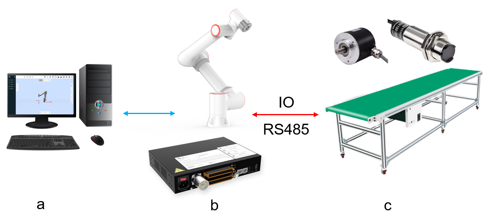

.. centered:: Figure 15.3‑6 Robot Conveyor Tracking System Composition Topology

In the system, (a) is the computer, (b) is the robot and its control box, (c) is the conveyor system consisting of the conveyor belt, photoelectric sensor, and encoder. The robot control box is connected to the photoelectric sensor and conveyor belt via digital IO communication, and connected to the conveyor encoder via RS485.

Conveyor Configuration
+++++++++++++++++++++++++++++++++++

Enter the Conveyor Tracking function configuration interface under "Basic Settings", "Peripherals", "Tracking" on the robot Web page to configure the conveyor tracking function properties.

.. figure:: process/039.png
   :align: center
   :width: 4in

.. centered:: Figure 15.3‑7 Conveyor Tracking Configuration Page

On the conveyor tracking configuration page, click the "Conveyor I/O One-Key Configuration" button to configure the conveyor physical connection with one click.
Then, in the "Function Selection" dropdown under "Parameter Configuration", select "Tracking Motion". Subsequently, configure the encoder properties, tracking workpiece coordinate system workpiece axis, vision pairing, and select "Chase Motion" in the "Tracking Type" dropdown. Then you can input the tracking start distance and tracking end distance.
Tracking Start Distance: After the tracking signal is triggered, the robot starts action after the conveyor runs the set distance. When set to -1, it triggers automatically.
Tracking End Distance: The maximum distance the robot follows the conveyor in synchronous motion after starting action.

Tracking Coordinate System Configuration
++++++++++++++++++++++++++++++++++++++++++++++++++++++++++++++++++++++

Tracking motion uses the workpiece coordinate system as the conveyor coordinate system, so the workpiece coordinate system needs to be set.

Click "Initial Setup", "Basic", select "Workpiece Coordinate System" under "Coordinate System", click to select a workpiece coordinate system other than "wobjcoord0" for calibration. The calibration method is not detailed here.

.. figure:: process/040.png
   :align: center
   :width: 4in

.. centered:: Figure 15.3‑8 Tracking Coordinate System Setup

Conveyor Tracking Chase Motion Function
++++++++++++++++++++++++++++++++++++++++++++++++++++++++++++++++++++++

Chase motion is a type of conveyor tracking motion. Compared to tracking motion, the teaching of motion points for chase motion does not need to be done above the workpiece coordinate system; it can be taught at any position in the workpiece coordinate system. Then, through the "Tracking Start Distance" parameter, the end effector synchronizes motion with the conveyor, making it a more flexible tracking method.

Conveyor Tracking Chase Motion Function Introduction
++++++++++++++++++++++++++++++++++++++++++++++++++++++++++++++++++++++

The following gives a chase motion example to introduce its motion characteristics.

.. figure:: process/041.png
   :align: center
   :width: 6in

.. centered:: Figure 15.3‑9 Conveyor Tracking Chase Motion Teaching Example

Here, x is the direction of conveyor motion in the workpiece coordinate system, a is the conveyor plane, b is the target workpiece to be picked, c is the photoelectric sensor, d is the tracking start distance, e is the tracking end distance. P1 to P4 are the taught waypoints in sequential order, P2 to P3 are the same waypoint, including gripper motion.

.. figure:: process/042.png
   :align: center
   :width: 6in

.. centered:: Figure 15.3‑10 Conveyor Tracking Chase Motion Execution Example After Teaching

When the above taught program starts running and the workpiece triggers the photoelectric switch signal, the robot will wait for the target to move under P1 before starting the tracking motion. The robot gripper will move along the trajectory shown in the figure above.

Chase Motion Program Teaching
+++++++++++++++++++++++++++++++++++

The chase motion program logic is basically the same as the tracking motion logic, including acquiring the trigger signal, acquiring conveyor data, and starting the tracking motion.

**Step 1**: Click "Teaching Program", "Program Programming", select and click the "Conveyor" button under "Peripheral Instructions" to enter the conveyor instruction configuration page.

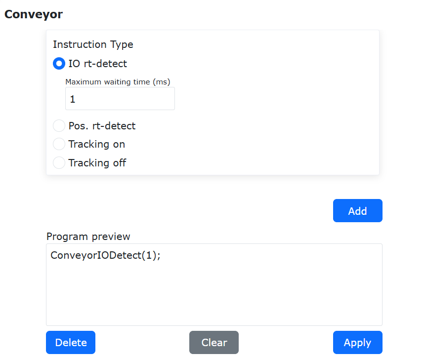

.. centered:: Figure 15.3‑11 I/O Real-time Monitoring Instruction

**Step 2**: Click "I/O Real-time Monitoring" and set the "Max Wait Time (ms)" to detect the tracking trigger signal in real-time. Click "Add" and "Apply" to add the instruction to the program.

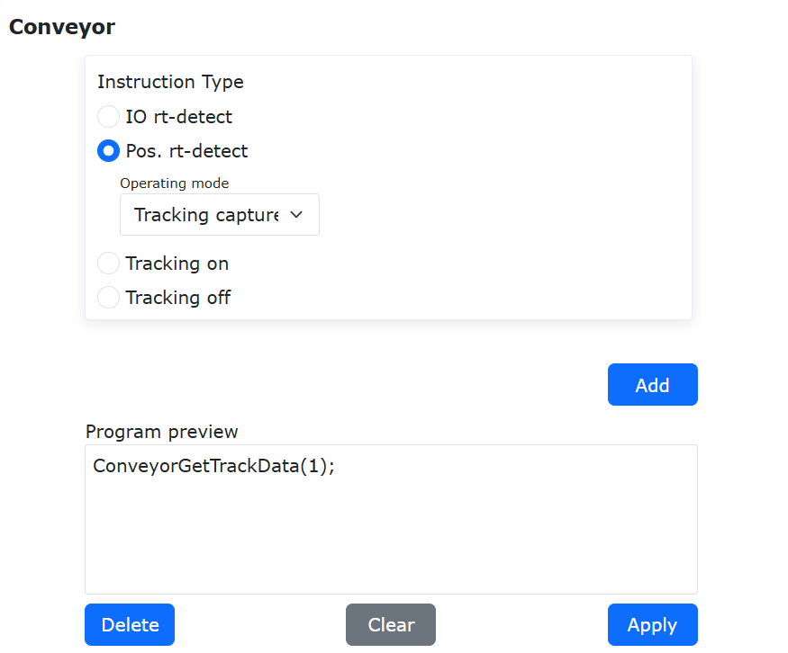

.. centered:: Figure 15.3‑12 Position Real-time Detection Instruction

**Step 3**: Click "Position Real-time Detection" and select "Tracking Motion" for the working mode. Click "Add" and "Apply" to add the instruction to the program.

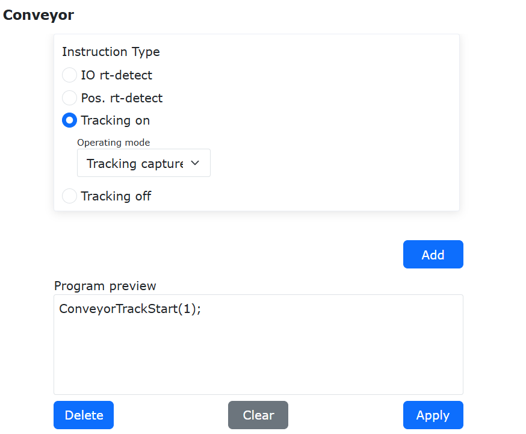

.. centered:: Figure 15.3‑13 Tracking Start Instruction

**Step 4**: Click "Tracking Start" and select "Tracking Motion" for the working mode. Click "Add" and "Apply" to add the instruction to the program.

**Step 5**: Teach the Cartesian space motion after tracking starts and the gripper peripheral motion. During the motion process, it will maintain synchronous tracking motion with the conveyor.

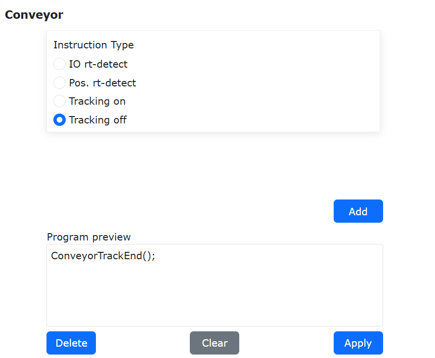

.. centered:: Figure 15.3‑14 Tracking Stop Instruction

**Step 6**: Click "Tracking Stop" and click "Add" and "Apply" to add the instruction to the program.

.. figure:: process/047.png
   :align: center
   :width: 6in

.. centered:: Figure 15.3‑15 A Typical Conveyor Program Tracking Motion Program

When two identical tracking motion targets are taught consecutively (may include offset distance), the robot motion will block at this target position, achieving continuous synchronous tracking until the tracking distance reaches the stop tracking distance.

.. figure:: process/048.png
   :align: center
   :width: 6in

.. centered:: Figure 15.3‑11 A Typical Conveyor Blocking Tracking Picking Motion Program

When two identical tracking motion targets are taught consecutively (may include offset distance), and gripper motion is inserted in between, the robot will continuously track the conveyor at this target position until the gripper motion is completed, achieving blocking tracking picking.
