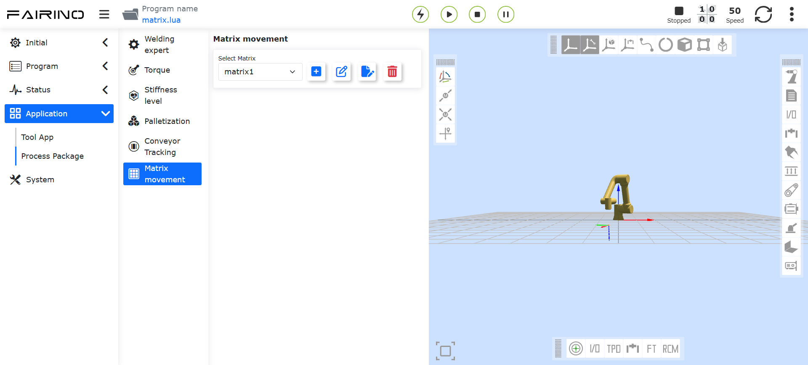
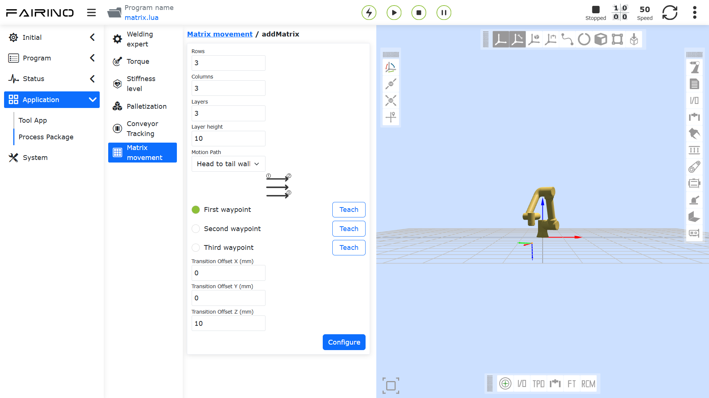
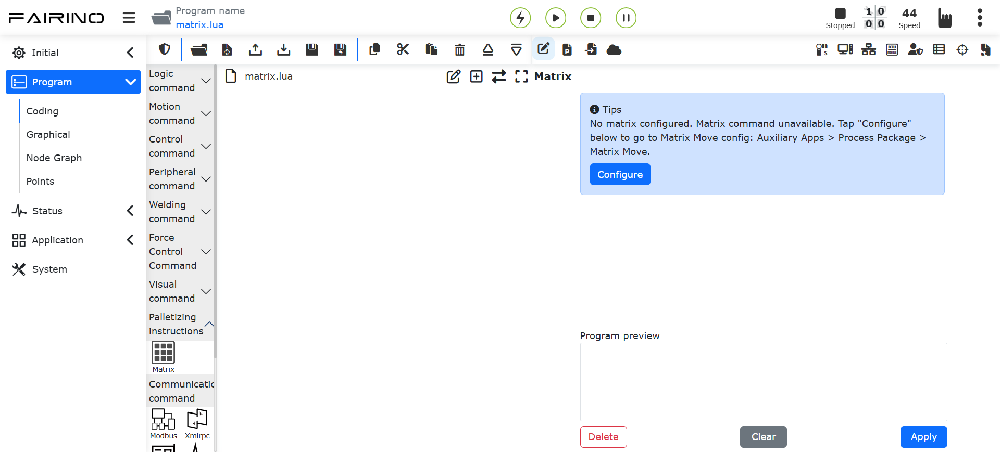
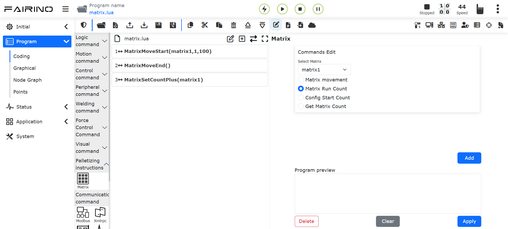
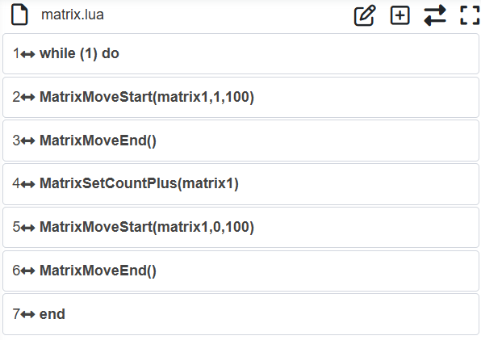

Pacchetti di Processo
========================================

.. toctree:: 
  :maxdepth: 5

Libreria Esperta di Saldatura
------------------------------------------------

Cliccare la voce di menu "Libreria Esperta di Saldatura" in "Applicazioni Ausiliarie" -> "Pacchetti di Processo" per accedere all'interfaccia della funzione della libreria esperta di saldatura, che include saldatura lineare, saldatura ad arco, saldatura multistrato multi-passata e regolazione della postura.

.. image:: process/001.png
   :width: 4in
   :align: center

.. centered:: Grafico 15.1‑1 Configurazione asse esteso

Saldatura Lineare
~~~~~~~~~~~~~~~~~~~~~~~~

Cliccare "Saldatura Lineare" per accedere all'interfaccia di guida della saldatura lineare. Sulla base del completamento delle varie configurazioni di base del robot, possiamo generare rapidamente un programma di insegnamento della saldatura attraverso alcuni semplici passaggi. Include principalmente i seguenti cinque passaggi. Poiché le funzioni si escludono a vicenda, i passaggi effettivi per generare un programma di insegnamento della saldatura sono inferiori a cinque.

Passo uno, se utilizzare l'asse esteso. Se si utilizza l'asse esteso, è necessario configurare il corrispondente sistema di coordinate dell'asse esteso e abilitare l'asse esteso. Quando si utilizza l'asse esteso, non è possibile utilizzare la funzione di saldatura oscillante.

.. image:: process/002.png
   :width: 4in
   :align: center

.. centered:: Grafico 15.1‑2 Configurazione asse esteso

Passo due, scegliere se è necessario il tracciamento del sensore. In caso affermativo, è necessario modificare i parametri dell'istruzione di ricerca laser. Quando si utilizza il tracciamento del sensore, non è possibile utilizzare la funzione di saldatura oscillante.

.. image:: process/003.png
   :width: 4in
   :align: center

.. centered:: Grafico 15.1‑3 Configurazione ricerca laser

Passo tre, scegliere se è necessaria la saldatura oscillante. Se è necessaria la saldatura oscillante, è necessario modificare i relativi parametri.

.. image:: process/004.png
   :width: 4in
   :align: center

.. centered:: Grafico 15.1‑4 Configurazione saldatura oscillante

Passo quattro, tarare il punto di inizio, il punto di sicurezza dell'inizio, il punto di fine e il punto di sicurezza della fine. Se al primo passo è stato selezionato l'asse esteso, verrà caricata la funzione di movimento dell'asse esteso, in combinazione con la taratura dei punti correlati.

.. image:: process/005.png
   :width: 4in
   :align: center

.. centered:: Grafico 15.1‑5 Taratura punti correlati

Passo cinque, assegnare un nome al programma e aprirlo automaticamente nell'interfaccia di insegnamento del programma.

.. image:: process/006.png
   :width: 4in
   :align: center

.. centered:: Grafico 15.1‑6 Salvataggio programma

Dopo il salvataggio riuscito del programma, è possibile modificare la velocità di saldatura nei parametri del processo.

.. image:: process/007.png
   :width: 4in
   :align: center

.. centered:: Grafico 15.1‑7 Parametri del processo

Saldatura ad Arco
~~~~~~~~~~~~~~~~~~~~

Cliccare "Saldatura ad Arco" sotto "Forma del pezzo da saldare" per accedere all'interfaccia di guida della saldatura ad arco. Sulla base del completamento delle varie configurazioni di base del robot, possiamo generare rapidamente un programma di insegnamento della saldatura attraverso due semplici passaggi. Include principalmente i seguenti due passaggi.

Passo uno, tarare il punto di inizio, il punto di sicurezza dell'inizio, il punto di transizione dell'arco, il punto di fine e il punto di sicurezza della fine.

.. image:: process/008.png
   :width: 4in
   :align: center

.. centered:: Grafico 15.1‑8 Taratura punti

Passo due, assegnare un nome al programma e aprirlo automaticamente nell'interfaccia di insegnamento del programma.

.. image:: process/009.png
   :width: 4in
   :align: center

.. centered:: Grafico 15.1‑9 Salvataggio programma

Dopo il salvataggio riuscito del programma, è possibile modificare la velocità di saldatura nei parametri del processo.

.. image:: process/010.png
   :width: 4in
   :align: center

.. centered:: Grafico 15.1‑10 Parametri del processo

Saldatura Multistrato Multi-Passata
~~~~~~~~~~~~~~~~~~~~~~~~~~~~~~~~~~~~~~~~~~~~~~~~~~~~

Quando la dimensione del cordone di saldatura è superiore a 10 mm, di solito si utilizza la funzione di saldatura multistrato multi-passata. Questa funzione consente di configurare in modo modulare il programma di saldatura, aggiungendo la funzione di tracciamento dell'arco durante il primo passaggio di saldatura multistrato multi-passata e correggendo la deviazione del cordone nei successivi passaggi di saldatura lineare multi-passata, migliorando così la qualità della saldatura.

Il flusso operativo della funzione di saldatura multistrato multi-passata con tracciamento dell'arco è il seguente:

1) Impostare il sistema di coordinate dello strumento, inserendo le dimensioni e la postura dello strumento della torcia.

.. note::
   I valori nell'interfaccia sono solo esempi, fare riferimento allo stato effettivo dello strumento.

.. image:: process/011.png
   :width: 4in
   :align: center

.. centered:: Grafico 15.1-11 Impostazione sistema coordinate strumento

2) Cliccare "Saldatura Multistrato Multi-Passata" per accedere all'interfaccia.

.. image:: process/012.png
   :width: 4in
   :align: center

.. centered:: Grafico 15.1-12 Apertura interfaccia saldatura multistrato multi-passata

3) Per utilizzare la funzione di tracciamento dell'arco, è necessario attivare l'interruttore "Funzione di oscillazione saldatura primo strato" e configurare i corrispondenti parametri di oscillazione.

.. image:: process/013.png
   :width: 4in
   :align: center

.. centered:: Grafico 15.1-13 Attivazione funzione oscillazione saldatura primo strato

4) Cliccare il pulsante "Configura", modificare i parametri di oscillazione, poi cliccare "Configura".

.. note::
   Se è necessario che il tracciamento dell'arco compensi a sinistra e a destra, è possibile scegliere solo i tipi "Oscillazione onda triangolare" e "Oscillazione onda sinusoidale". La frequenza di oscillazione non deve essere inferiore a 0,5 Hz, l'ampiezza di oscillazione non deve essere inferiore a 3 mm, il tempo di attesa sinistra e destra dell'oscillazione deve essere uguale e l'angolo azimutale dell'oscillazione deve essere 0.

.. image:: process/014.png
   :width: 4in
   :align: center

.. centered:: Grafico 15.1-14 Configurazione parametri oscillazione

5) Attivare l'interruttore "Funzione Tracciamento Arco", modificare i corrispondenti parametri di compensazione su/giù e sinistra/destra.

.. note::
   I parametri di tracciamento dell'arco vengono configurati in base alla situazione di saldatura effettiva, fare riferimento al "Manuale Operativo Funzione Tracciamento Arco" o contattare il personale tecnico correlato.

.. image:: process/015.png
   :width: 4in
   :align: center

.. centered:: Grafico 15.1-15 Configurazione parametri tracciamento arco

6) In base al tipo di controllo, cliccare sul tipo corrispondente per accedere all'interfaccia. Prima di tutto, nel primo gruppo di punti impostare "Punto saldatura" come posizione di inizio della saldatura; "Punto X+" come un punto sulla direzione X+ del sistema di coordinate offset personalizzato rispetto al punto di saldatura; "Punto Z+" come un punto sulla direzione Z+ del sistema di coordinate offset personalizzato rispetto al punto di saldatura; "Punto sicurezza" come posizione di transizione dal completamento della saldatura precedente all'inizio della saldatura successiva. Dopo l'insegnamento e l'impostazione, si passa automaticamente all'impostazione del secondo gruppo di punti.

.. image:: process/016.png
   :width: 4in
   :align: center

.. centered:: Grafico 15.1-16 Impostazione posizione punto di inizio linea saldatura multistrato multi-passata

7) Selezionare "Punto linea". Qui "Punto saldatura" è la posizione di fine saldatura; "Punto X+" è un punto sulla direzione X+ del sistema di coordinate offset personalizzato rispetto al "Punto saldatura"; "Punto Z+" è un punto sulla direzione Z+ del sistema di coordinate offset personalizzato rispetto al "Punto saldatura". Dopo l'insegnamento e l'impostazione, cliccare il pulsante "Completa" per impostare i parametri di saldatura multistrato multi-passata.

.. image:: process/017.png
   :width: 4in
   :align: center

.. centered:: Grafico 15.1-17 Impostazione posizione punto di fine linea saldatura multistrato multi-passata

8) In questa pagina è possibile impostare il numero di strati e passate della saldatura multistrato multi-passata e la loro distribuzione. Cliccare la casella "On/Off" nella tabella dei parametri per selezionare i valori corrispondenti alle posizioni di saldatura multistrato multi-passata attivate. Inserire le posizioni di offset e l'angolo corrispondenti nel sistema di coordinate personalizzato nelle colonne "X", "Z", "B".

.. image:: process/018.png
   :width: 4in
   :align: center

.. centered:: Grafico 15.1-18 Impostazione parametri saldatura multistrato multi-passata

9) A questo punto è stata completata tutta la configurazione dei parametri. Inserire il nome del programma che si desidera salvare, cliccare il pulsante "Salva" per generare automaticamente il corrispondente programma di saldatura multistrato multi-passata.

.. image:: process/019.png
   :width: 6in
   :align: center

.. centered:: Grafico 15.1-19 Generazione programma saldatura multistrato multi-passata

10) Cliccare il pulsante "Apri programma" per leggere il programma lua salvato nel passaggio precedente. Il contenuto del programma è mostrato nella figura seguente.

.. image:: process/020.png
   :width: 4in
   :align: center

.. centered:: Grafico 15.1-20 Esempio programma saldatura multistrato multi-passata con tracciamento arco

Regolazione della Postura
~~~~~~~~~~~~~~~~~~~~~~~~~~~~~~~~~~

Passaggi Configurazione Adattamento Postura
+++++++++++++++++++++++++++++++++++++++++++++++++

**Step1**: Accedere all'interfaccia di configurazione della regolazione della postura, selezionare il tipo di lamiera e la direzione di movimento effettiva del robot, regolare la postura del robot, impostare rispettivamente il punto di postura A, il punto di postura B e il punto di postura C. Solitamente A è il punto di postura piano, B è il punto di postura del bordo ascendente, C è il punto di postura del bordo discendente.

.. figure:: process/021.png
   :align: center
   :width: 4in

.. centered:: Grafico 15.1‑21 Configurazione regolazione postura

.. important:: 
   Il cambio di postura tra la postura A e la postura B, e tra la postura A e la postura C, dovrebbe essere il più piccolo possibile pur soddisfacendo i requisiti dell'applicazione. La funzione di adattamento della postura è una funzione di applicazione ausiliaria, solitamente utilizzata in combinazione con il tracciamento del cordone di saldatura.

**Step2**: Nell'interfaccia dei comandi di insegnamento del programma, selezionare il comando "Adjust". In base alle specifiche esigenze di insegnamento del programma, aggiungere le istruzioni nei punti appropriati.

.. figure:: process/022.png
   :align: center
   :width: 6in

.. centered:: Grafico 15.1‑22 Modifica istruzione regolazione postura

Programma di Insegnamento Saldatura con Adattamento Postura, Asse Esteso e Tracciamento Laser
+++++++++++++++++++++++++++++++++++++++++++++++++++++++++++++++++++++++++++++++++++++++++++++++

.. list-table::
   :widths: 50 80 80
   :header-rows: 0
   :align: center

   * - **N.**
     - **Formato Istruzione**
     - **Commento**

   * - 1
     - EXT_AXIS_PTP(1,1laserstart)
     - #Movimento asse esterno punto iniziale sensore laser

   * - 2
     - PTP(laserstart,10,-1,0)
     - #Movimento robot punto iniziale sensore laser

   * - 3
     - LTSearchStart(3,20,10,10000)
     - #Inizio ricerca posizione

   * - 4
     - LTSearchStop()
     - #Fine ricerca posizione

   * - 5
     - EXT_AXIS_PTP(1,1,seamPos)
     - #Movimento asse esterno punto inizio saldatura

   * - 6
     - Lin(seamPos,20,-1,00,0)
     - #Movimento robot punto inizio saldatura

   * - 7
     - LTTrackOn()
     - #Tracciamento laser

   * - 8
     - ARCStart(0,10000)
     - #Accensione arco saldatrice

   * - 9
     - PostureAdjustOn(0,PosA,PosC,PosB,1000)
     - #Attivazione regolazione adattamento postura

   * - 10
     - EXT_AXIS_PTP(1,1,laserend)
     - #Movimento asse esterno punto fine saldatura

   * - 11
     - Lin( laserend,10,-1,0,0)
     - #Movimento robot punto fine saldatura

   * - 12
     - ARCEnd(0,10000)
     - #Spegnimento arco saldatrice

   * - 13
     - PostureAdjustOff(0)
     - #Disattivazione regolazione adattamento postura

   * - 14
     - LTTrackOff
     - #Disattivazione tracciamento laser

Configurazione Sistema Pallettizzazione
-------------------------------------------------------

Passaggi Configurazione Sistema Pallettizzazione
~~~~~~~~~~~~~~~~~~~~~~~~~~~~~~~~~~~~~~~~~~~~~~~~~~~

**Step1**: In "Applicazioni Ausiliarie" -> "Pacchetti di Processo", cliccare la voce di menu "Pallettizzazione" per accedere all'interfaccia di configurazione del sistema di pallettizzazione.

Al primo utilizzo, è necessario prima creare una ricetta. Cliccare "Crea Ricetta", inserire il nome della ricetta, cliccare "Crea". Dopo la creazione riuscita, cliccare "Inizia Configurazione" per accedere alla pagina di configurazione della pallettizzazione.

.. figure:: process/023.png
   :align: center
   :width: 4in

.. centered:: Grafico 15.2‑1 Configurazione ricetta pallettizzazione

**Step2**: Nella barra di configurazione del pezzo, cliccare "Configura" per accedere alla finestra di configurazione del pezzo. Impostare "Lunghezza", "Larghezza", "Altezza" del pezzo e il punto di presa del pezzo. Cliccare "Conferma Configurazione" per completare l'impostazione delle informazioni del pezzo.

.. figure:: process/024.png
   :align: center
   :width: 4in

.. centered:: Grafico 15.2‑2 Configurazione pezzo pallettizzazione

**Step3**: Nella barra di configurazione del pallet, cliccare "Configura" per accedere alla finestra di configurazione del pallet. Impostare "Lato anteriore", "Lato laterale" e "Altezza" del pallet. Quindi impostare le postazioni di lavoro e i punti di transizione delle postazioni. Cliccare "Conferma Configurazione" per completare l'impostazione delle informazioni del pallet.

.. figure:: process/025.png
   :align: center
   :width: 4in

.. centered:: Grafico 15.2‑3 Configurazione pallet pallettizzazione

**Step4**: Nella barra di configurazione dimensioni dispositivo pallettizzazione, cliccare "Configura" per accedere alla finestra di configurazione delle dimensioni del dispositivo di pallettizzazione. Impostare "X", "Y", "Z" e "Angolo" del dispositivo. Cliccare "Conferma Configurazione" per completare l'impostazione delle informazioni di configurazione delle dimensioni del dispositivo di pallettizzazione.

.. important:: 
   X, Y, Z sono i valori assoluti delle coordinate del punto in alto a destra del pallet sinistro o in alto a sinistra del pallet destro rispetto al sistema di coordinate base del robot. L'Angolo è l'angolo di rotazione durante l'installazione del robot, si consiglia di impostarlo a 0 durante l'installazione.

.. figure:: process/026.png
   :align: center
   :width: 4in

.. centered:: Grafico 15.2‑4 Configurazione dimensioni dispositivo pallettizzazione

**Step5**: Nella barra di configurazione della modalità, cliccare "Configura" per accedere alla finestra di configurazione della modalità.

   **Attiva/Disattiva Modalità B**: Attiva: è possibile passare dalla modalità A/B e configurare la modalità B per ogni strato di pallettizzazione; Disattiva: non è possibile passare alla modalità B, non è possibile configurare la modalità B per ogni strato di pallettizzazione;

   **Passaggio Modalità A/B**: Selezionare Modalità A: aggiungere il pezzo come modalità A, il numero del pezzo è A1, A2..., non è possibile regolare la trasparenza del pezzo; Selezionare Modalità B: aggiungere il pezzo come modalità B, il numero del pezzo è B1, B2..., a questo punto è possibile attivare/disattivare "Mostra Configurazione Modalità A" per visualizzare i pezzi della modalità A;

   **Attiva/Disattiva Mostra Modalità A**: Attiva: regolare la trasparenza dei pezzi della modalità B per verificare se l'effetto della configurazione delle modalità A/B è ragionevole, a questo punto è possibile eseguire solo le operazioni di selezione, aggiunta, aggiunta in batch, eliminazione ed eliminazione totale sui pezzi della modalità B; Disattiva: non è possibile impostare la trasparenza dei pezzi della modalità B;

.. important:: 
   Durante la configurazione del pezzo, se c'è collisione tra i pezzi, il colore di sfondo del pezzo diventa rosso. In questo caso, le operazioni sopra menzionate non possono essere eseguite. Se è necessario operare, configurare il pezzo senza collisioni.

Durante la configurazione del pezzo, prima impostare l'intervallo tra i pezzi. Il riquadro a destra simula il modo in cui i pezzi vengono posizionati sul pallet destro, è possibile aggiungere singolarmente o in batch. Quindi impostare il numero di strati di pallettizzazione e la modalità di ogni strato. Cliccare "Conferma Configurazione" per completare l'impostazione delle informazioni della modalità.

.. important:: 
   Direzione pallettizzazione: prendendo come esempio il pallet destro, l'angolo in basso a destra è il punto più lontano. Posizionare una fila di pezzi verticalmente o orizzontalmente dall'angolo in basso a destra, poi posizionare un'altra fila di pezzi orizzontalmente o verticalmente sopra, e così via (la direzione di pallettizzazione è indicata nella pagina Web, si prega di controllare).
   
   Il pallet sinistro posiziona i pezzi specularmente in base alla modalità del pallet destro.

.. figure:: process/027.png
   :align: center
   :width: 4in

.. centered:: Grafico 15.2‑5 Configurazione Modalità A Palletizzazione

.. figure:: process/028.png
   :align: center
   :width: 4in

.. centered:: Grafico 15.2‑6 Configurazione Modalità B Palletizzazione

**Step6**: Nella barra di generazione del programma di insegnamento, cliccare "Configurazione Avanzata" per accedere alla finestra di configurazione avanzata. A questo punto configurare "Altezza sollevamento presa materiale", "Distanza offset prima volta", "Distanza offset seconda volta" e "Tempo attesa aspirazione".

   **Altezza sollevamento presa materiale**: altezza di sollevamento dopo il successo della presa materiale dal punto di presa, definita dall'utente;

   **Distanza offset prima/seconda volta**: distanza di offset per il posizionamento inclinato del robot fino al punto target, definita dall'utente;
   
   **Tempo attesa aspirazione**: tempo di attesa per l'aspirazione, definito dall'utente, per monitorare il segnale di raggiungimento del vuoto dopo l'aspirazione, ripetendo l'azione di aspirazione se non raggiunto;

   **Transizione morbida**: attivare il pulsante di transizione morbida per configurare i parametri correlati al tempo di transizione morbida PTP e al raggio di transizione morbida LIN per la pallettizzazione/depallettizzazione.
   
   - Tempo transizione morbida PTP: nessun tempo transizione morbida / livello 1 (200 ms) / livello 2 (400 ms) / livello 3 (600 ms) / livello 4 (800 ms) / livello 5 (1000 ms)
   - Raggio transizione morbida LIN: nessun raggio transizione morbida / livello 1 (200 mm) / livello 2 (400 mm) / livello 3 (600 mm) / livello 4 (800 mm) / livello 5 (1000 mm)

.. figure:: process/029.png
   :align: center
   :width: 4in

.. centered:: Grafico 15.2‑7 Configurazione Avanzata Palletizzazione

**Step7**: Nella barra di generazione del programma di insegnamento, selezionare "Scelta Metodo", cliccare "Genera Programma", aprire la "Pagina Monitoraggio Palletizzazione". In questa pagina è possibile visualizzare e controllare le "Informazioni di Generazione", le "Informazioni di Allarme" e il "Programma di Palletizzazione".

.. figure:: process/030.png
   :align: center
   :width: 6in

.. centered:: Grafico 15.2‑8 Monitoraggio Sistema Palletizzazione

**Step8**: Se il programma di pallettizzazione segnala un errore durante l'esecuzione, il programma si interrompe. L'utente deve prima cancellare l'errore, quindi selezionare nuovamente il programma di pallettizzazione per l'esecuzione. A questo punto apparirà una finestra di dialogo "Interruzione Programma Precedente". Cliccare il pulsante "Continua" per riprendere l'esecuzione, cliccare il pulsante "Ricomincia" per ricominciare l'esecuzione del programma.

.. figure:: process/031.png
   :align: center
   :width: 3in

.. centered:: Grafico 15.2‑9 Continuazione Programma Palletizzazione

Tracciamento Nastro Trasportatore
---------------------------------------------------------

Passaggi Configurazione Tracciamento Nastro Trasportatore
~~~~~~~~~~~~~~~~~~~~~~~~~~~~~~~~~~~~~~~~~~~~~~~~~~~~~~~~~~~~

**Step1**: In "Applicazioni Ausiliarie" -> "Pacchetti di Processo", selezionare la voce di menu "Nastro Trasportatore" per accedere all'interfaccia di configurazione del tracciamento del nastro trasportatore. Cliccare il pulsante "Configura I/O Nastro Trasportatore" per configurare rapidamente gli I/O necessari per la funzione del nastro trasportatore. Quindi configurare i parametri corrispondenti in base alla funzionalità effettivamente utilizzata. Prendendo come esempio la funzione di presa senza tracciamento visivo, è necessario configurare il canale dell'encoder del nastro trasportatore, la risoluzione, il passo della vite, selezionare "No" per l'abbinamento visivo, cliccare configura.

.. figure:: process/032.png
   :align: center
   :width: 4in

.. figure:: process/033.png
   :align: center
   :width: 4in

.. centered:: Grafico 15.3‑1 Configurazione nastro trasportatore

**Step2**: Successivamente impostare i valori di compensazione del punto di presa, che sono le distanze di compensazione nelle tre direzioni X, Y, Z. Possono essere impostati durante il debug in base alla situazione effettiva.

.. figure:: process/034.png
   :align: center
   :width: 4in

.. centered:: Grafico 15.3‑2 Configurazione compensazione punto di presa nastro trasportatore

**Step3**: Accendere il nastro trasportatore, spostare l'oggetto tarato nella posizione del punto A definito, fermare il nastro trasportatore. Spostare il robot, allineare la punta dell'asta di taratura all'estremità del robot con la punta dell'oggetto tarato, cliccare il pulsante Punto iniziale A. Apparirà una finestra di dialogo che mostra il valore corrente dell'encoder e la posa del robot. Cliccare Taratura per completare la taratura del punto iniziale A.

.. figure:: process/035.png
   :align: center
   :width: 4in

.. centered:: Grafico 15.3‑3 Configurazione punto iniziale A

**Step4**: Cliccare il pulsante Punto di riferimento per accedere alla taratura del punto di riferimento. Durante la registrazione del punto di riferimento, registrare l'altezza e la postura della presa del robot. Ogni volta che si traccia, verranno utilizzate l'altezza e la postura registrate del punto di riferimento per tracciare e afferrare. Può essere a un'altezza diversa dai punti A e B. Cliccare Taratura per completare la taratura del punto di riferimento.

.. figure:: process/036.png
   :align: center
   :width: 4in

.. centered:: Grafico 15.3‑4 Configurazione punto di riferimento

**Step5**: Accendere il nastro trasportatore, spostare l'oggetto tarato nella posizione del punto B definito, fermare il nastro trasportatore. Spostare il robot, allineare la punta dell'asta di taratura all'estremità del robot con la punta dell'oggetto tarato, cliccare il pulsante Punto finale B. Apparirà una finestra di dialogo che mostra il valore corrente dell'encoder e la posa del robot. Cliccare Taratura per completare la taratura del punto finale B.

.. figure:: process/037.png
   :align: center
   :width: 4in

.. centered:: Grafico 15.3‑5 Configurazione punto finale B

Programma di Insegnamento Tracciamento Nastro Trasportatore
~~~~~~~~~~~~~~~~~~~~~~~~~~~~~~~~~~~~~~~~~~~~~~~~~~~~~~~~~~~~~~~

.. list-table::
   :widths: 50 80 80
   :header-rows: 0
   :align: center

   * - **N.**
     - **Formato Istruzione**
     - **Commento**

   * - 1
     - PTP(conveyorstart,30,-1,0)
     - #Punto di inizio presa robot

   * - 2
     - While(1) do
     - #Ciclo di presa

   * - 3
     - ConveyorlODetect(10000)
     - #Rilevamento in tempo reale oggetto tramite IO

   * - 4
     - ConveyorGetTrackData(1)
     - #Acquisizione posizione oggetto

   * - 5
     - ConveyorTrackStart(1)
     - #Inizio tracciamento nastro trasportatore

   * - 6
     - Lin(cvrCatchPoint,10,-1,0,0)
     - #Robot raggiunge punto di presa

   * - 7
     - MoveGripper(1,255,255,0,10000)
     - #Pinza afferra oggetto

   * - 8
     - Lin(cvrRaisePoint,10,-1,0,0)
     - #Robot solleva

   * - 9
     - ConveyorTrackEnd()
     - #Fine tracciamento nastro trasportatore

   * - 10
     - PTP(conveyorraise,30,-1,0)
     - #Robot raggiunge punto di attesa

   * - 11
     - PTP(conveyorend,30,-1,0)
     - #Robot raggiunge punto di posizionamento

   * - 12
     - MoveGripper(1,0,255,0,10000)
     - #Pinza rilascia

   * - 13
     - PTP(conveyorstart,50,-1,0)
     - #Robot ritorna al punto di inizio presa, attende la prossima presa

   * - 14
     - end
     - #Fine

Composizione del Sistema di Tracciamento Nastro Trasportatore Robot
~~~~~~~~~~~~~~~~~~~~~~~~~~~~~~~~~~~~~~~~~~~~~~~~~~~~~~~~~~~~~~~~~~~~~~~

Metodo di Connessione Comunicazione Dati Encoder Nastro Trasportatore
+++++++++++++++++++++++++++++++++++++++++++++++++++++++++++++++++++++++++++

Per realizzare un processo automatizzato di carico e scarico nella lavorazione delle macchine utensili, è stato sviluppato un pacchetto funzionalità CNC basato sulla comunicazione FOCAS, che consente l'interazione comunicativa e il movimento coordinato tra robot collaborativo e macchina utensile CNC.

Come mostrato in figura, la comunicazione FOCAS è basata su Ethernet. Collegando tramite cavo di rete la porta di rete della scatola di controllo del robot e la porta di rete integrata nella macchina utensile, è possibile stabilire la comunicazione FOCAS tra robot e macchina utensile, realizzando il controllo CNC e il monitoraggio dello stato della macchina utensile dal lato robot.

.. figure:: process/038.png
   :align: center
   :width: 6in

.. centered:: Grafico 15.3‑6 Diagramma topologico composizione sistema di tracciamento nastro trasportatore robot

Nel sistema, (a) è il computer, (b) è il robot e la sua scatola di controllo, (c) è il sistema nastro trasportatore composto da nastro trasportatore, sensore fotoelettrico ed encoder. La scatola di controllo del robot è collegata tramite comunicazione digitale IO al sensore fotoelettrico e al nastro trasportatore, e tramite RS485 all'encoder del nastro trasportatore.

Configurazione Nastro Trasportatore
+++++++++++++++++++++++++++++++++++++++++

Accedere all'interfaccia di configurazione della funzione "Nastro Trasportatore" sotto "Impostazioni Base", "Periferiche", "Tracciamento" nella pagina Web del robot per configurare le proprietà della funzione di tracciamento del nastro trasportatore.

.. figure:: process/039.png
   :align: center
   :width: 4in

.. centered:: Grafico 15.3‑7 Pagina configurazione tracciamento nastro trasportatore

Nella pagina di configurazione del tracciamento del nastro trasportatore, cliccare il pulsante "Configurazione I/O Nastro Trasportatore con un clic" per configurare con un clic il collegamento fisico del nastro trasportatore.
Successivamente, nel menu a discesa "Scelta Funzione" sotto "Configurazione Parametri", selezionare "Movimento di Tracciamento". Quindi configurare le proprietà dell'encoder, l'asse del pezzo del sistema di coordinate del pezzo da tracciare, l'abbinamento visivo. Nel menu a discesa "Tipo Tracciamento" selezionare "Movimento di Inseguimento". A questo punto è possibile inserire la distanza di inizio tracciamento e la distanza di fine tracciamento.
Distanza di inizio tracciamento: dopo il segnale di trigger del tracciamento, quando il nastro trasportatore ha percorso la distanza impostata, il robot inizia ad agire. Se impostata a -1, viene attivata automaticamente.
Distanza di fine tracciamento: la distanza massima che il robot percorre in movimento sincrono con il nastro trasportatore dopo aver iniziato ad agire.

Configurazione Sistema Coordinate Tracciamento
+++++++++++++++++++++++++++++++++++++++++++++++++

Il movimento di tracciamento utilizza il sistema di coordinate del pezzo come sistema di coordinate del nastro trasportatore, quindi è necessario impostare il sistema di coordinate del pezzo.

Cliccare "Impostazioni Iniziali", "Base", in "Sistema di Coordinate" selezionare "Sistema di Coordinate Pezzo". Cliccare per selezionare un sistema di coordinate pezzo diverso da "wobjcoord0" per la taratura. Il metodo di taratura non verrà approfondito qui.

.. figure:: process/040.png
   :align: center
   :width: 4in

.. centered:: Grafico 15.3‑8 Impostazione sistema coordinate tracciamento

Funzione Movimento di Inseguimento Tracciamento Nastro Trasportatore
+++++++++++++++++++++++++++++++++++++++++++++++++++++++++++++++++++++++++++

Il movimento di inseguimento è un tipo di movimento di tracciamento del nastro trasportatore. Rispetto al movimento di tracciamento, i punti di movimento del movimento di inseguimento non devono essere insegnati sopra il sistema di coordinate del pezzo, ma possono essere insegnati in qualsiasi posizione del sistema di coordinate del pezzo. Attraverso il parametro "Distanza di inizio tracciamento", l'estremità del robot si muove in sincronia con il nastro trasportatore. È un metodo di tracciamento più flessibile.

Introduzione Funzione Movimento di Inseguimento Tracciamento Nastro Trasportatore
+++++++++++++++++++++++++++++++++++++++++++++++++++++++++++++++++++++++++++++++++++

Di seguito viene fornito un esempio di movimento di inseguimento per introdurne le caratteristiche.

.. figure:: process/041.png
   :align: center
   :width: 6in

.. centered:: Grafico 15.3‑9 Esempio insegnamento movimento di inseguimento tracciamento nastro trasportatore

Dove, x è la direzione di movimento del nastro trasportatore nel sistema di coordinate del pezzo, a è il piano del nastro trasportatore, b è il pezzo target da afferrare, c è il sensore fotoelettrico, d è la distanza di inizio tracciamento, e è la distanza di fine tracciamento. Da P1 a P4 sono i punti di percorso insegnati e il loro ordine sequenziale, P2 e P3 sono gli stessi punti di percorso, inclusi i movimenti della pinza.

.. figure:: process/042.png
   :align: center
   :width: 6in

.. centered:: Grafico 15.3‑10 Esempio esecuzione dopo insegnamento movimento di inseguimento tracciamento nastro trasportatore

Quando il programma di insegnamento sopra inizia l'esecuzione e il pezzo attiva il segnale del sensore fotoelettrico, il robot aspetterà che il target si sposti sotto P1 prima di iniziare il movimento di tracciamento. La pinza del robot si muoverà lungo la traiettoria mostrata nella figura sopra.

Insegnamento Programma Movimento di Inseguimento
+++++++++++++++++++++++++++++++++++++++++++++++++++++

La logica del programma di movimento di inseguimento è fondamentalmente la stessa della logica del movimento di tracciamento, includendo l'acquisizione del segnale di trigger, l'acquisizione dei dati del nastro trasportatore e l'inizio del movimento di tracciamento.

**Step 1**: Cliccare "Programmazione Insegnamento", "Programmazione Programma", selezionare e cliccare il pulsante "Nastro Trasportatore" sotto "Istruzione Periferica" per accedere alla pagina di configurazione delle istruzioni del nastro trasportatore.

.. figure:: process/043.png
   :align: center
   :width: 6in

.. centered:: Grafico 15.3‑11 Istruzione monitoraggio IO in tempo reale

**Step 2**: Cliccare "Monitoraggio IO in tempo reale" e impostare "Tempo massimo attesa insegnamento (ms)" per rilevare in tempo reale il segnale di trigger del tracciamento. Cliccare i pulsanti "Aggiungi" e "Applica" per aggiungere l'istruzione al programma.

.. figure:: process/044.png
   :align: center
   :width: 6in

.. centered:: Grafico 15.3‑12 Istruzione rilevamento posizione in tempo reale

**Step 3**: Cliccare "Rilevamento posizione in tempo reale" e selezionare la modalità di lavoro come "Movimento di Tracciamento". Cliccare i pulsanti "Aggiungi" e "Applica" per aggiungere l'istruzione al programma.

.. figure:: process/045.png
   :align: center
   :width: 6in

.. centered:: Grafico 15.3‑13 Istruzione attivazione tracciamento

**Step 4**: Cliccare "Attivazione Tracciamento" e selezionare la modalità di lavoro come "Movimento di Tracciamento". Cliccare i pulsanti "Aggiungi" e "Applica" per aggiungere l'istruzione al programma.

**Step 5**: Insegnare il movimento nello spazio cartesiano dopo l'attivazione del tracciamento e il movimento periferico della pinza. Durante il movimento, verrà mantenuto il movimento sincrono di tracciamento con il nastro trasportatore.

.. figure:: process/046.png
   :align: center
   :width: 6in

.. centered:: Grafico 15.3‑14 Istruzione disattivazione tracciamento

**Step 6**: Cliccare "Disattivazione Tracciamento" e cliccare i pulsanti "Aggiungi" e "Applica" per aggiungere l'istruzione al programma.

.. figure:: process/047.png
   :align: center
   :width: 6in

.. centered:: Grafico 15.3‑15 Un tipico programma di movimento di tracciamento nastro trasportatore

Quando si insegnano consecutivamente due target di movimento di tracciamento identici (possono includere una distanza di offset), il movimento del robot si bloccherà in quella posizione target, realizzando un tracciamento sincrono continuo fino a quando la distanza di tracciamento raggiunge la distanza di fine tracciamento.

.. figure:: process/048.png
   :align: center
   :width: 6in

.. centered:: Grafico 15.3‑16 Un tipico programma di movimento di presa con tracciamento bloccante nastro trasportatore

Quando si insegnano consecutivamente due target di movimento di tracciamento identici (possono includere una distanza di offset), e contemporaneamente si inserisce un movimento della pinza nel mezzo, il robot continuerà a tracciare il nastro trasportatore in quella posizione target fino al completamento del movimento della pinza, realizzando una presa con tracciamento bloccante.

Funzione di Ottimizzazione dell'Istruzione di Movimento a Matrice
------------------------------------------------------------------
Panoramica
~~~~~~~~~~~~~~~~~~~~~~~~~~~~~~~~~~~~~~~~~~~~~~

Nel processo di lavorazione automatizzata delle apparecchiature CNC e delle operazioni di pallettizzazione, le istruzioni di movimento a matrice sono ampiamente utilizzate in molteplici fasi critiche del processo, tra cui il caricamento dei grezzi, lo scarico dei prodotti finiti, il ribaltamento dei pezzi e il secondo bloccaggio. Insegnando tre punti matrice nella ricetta del movimento a matrice per determinare la posizione della matrice e configurando le righe, le colonne, gli strati e il percorso di movimento della matrice, la ricetta della matrice può essere rapidamente commutata sull'interfaccia delle istruzioni per l'implementazione e l'esecuzione.

Configurazione della Ricetta di Movimento a Matrice
~~~~~~~~~~~~~~~~~~~~~~~~~~~~~~~~~~~~~~~~~~~~~~~~~~~~~~~

**Step1**: Accedere all'interfaccia "Applicazioni Ausiliarie -> Pacchetti Processo -> Movimento a Matrice" per eseguire operazioni di aggiunta, modifica, ridenominazione ed eliminazione delle ricette;

.. centered:: Figura 15.4‑1 Interfaccia Ricetta Matrice

.. note:: 
   .. image:: process/050.png
      :height: 0.75in
      :align: left

   Nome: **Pulsante Aggiungi**
   
   Funzione: Aggiungere una nuova ricetta matrice

.. note:: 
   .. image:: process/051.png
      :height: 0.75in
      :align: left

   Nome: **Pulsante Modifica**
   
   Funzione: Modificare i parametri della ricetta matrice

.. note:: 
   .. image:: process/052.png
      :height: 0.75in
      :align: left

   Nome: **Pulsante Rinomina**
   
   Funzione: Rinominare la ricetta matrice

.. note:: 
   .. image:: process/053.png
      :height: 0.75in
      :align: left

   Nome: **Pulsante Elimina**
   
   Funzione: Eliminare la ricetta matrice

**Step2**: Aggiungere una nuova ricetta matrice. Fare clic sul pulsante "Aggiungi" per aprire la finestra modale "Aggiungi Matrice". Inserire il nome della matrice (sono vietati caratteri speciali, sono consentiti solo numeri, caratteri cinesi comuni e il trattino basso "_"). Quindi accedere all'interfaccia dei dettagli della ricetta per inserire il numero di righe, strati, colonne, altezza dello strato, configurazione del movimento e gli offset X, Y, Z del punto di transizione, e insegnare tre punti del percorso della matrice. Fare clic sul pulsante "Configura" per confermare la configurazione.

.. figure:: process/054.png
   :align: center
   :width: 6in

.. centered:: Figura 15.4‑2 Finestra Modale Aggiungi Matrice

.. figure:: process/055.png
   :align: center
   :width: 4in

.. centered:: Figura 15.4‑3 Insegnamento del Primo Punto del Percorso

.. figure:: process/057.png
   :align: center
   :width: 4in

.. figure:: process/058.png
   :align: center
   :width: 6in

.. centered:: Figura 15.4‑4 Insegnamento del Secondo Punto del Percorso

.. figure:: process/059.png
   :align: center
   :width: 4in

.. figure:: process/060.png
   :align: center
   :width: 6in

.. centered:: Figura 15.4‑5 Insegnamento del Terzo Punto del Percorso

I percorsi di movimento sono divisi nel metodo "testa-coda" e nel metodo "a zigzag". Le descrizioni sono le seguenti:

**Metodo Testa-Coda**: Completare la prima riga da sinistra a destra, tornare al punto di partenza sinistro, quindi completare la seconda riga da sinistra a destra, tornare nuovamente al punto di partenza sinistro, completare la terza riga da sinistra a destra, fino a raggiungere la copertura completa.

.. figure:: process/061.png
   :align: center
   :width: 1in

.. centered:: Figura 15.4‑6 Metodo Testa-Coda

**Metodo a Zigzag**: Completare la prima riga da sinistra a destra, spostarsi verticalmente verso il basso, quindi completare la seconda riga da destra a sinistra. Spostarsi nuovamente verticalmente verso il basso, quindi completare la terza riga da sinistra a destra, continuando fino a quando l'area è completamente coperta.

.. figure:: process/062.png
   :align: center
   :width: 1in

.. centered:: Figura 15.4‑7 Metodo a Zigzag

**Step3**: Modifica, ridenominazione ed eliminazione della ricetta. Fare clic sul pulsante "Modifica" per recuperare i dati della ricetta matrice attualmente selezionata. Modificare i parametri o ri-insegnare i punti del percorso secondo necessità. Quando è necessaria la ridenominazione, fare clic sul pulsante "Rinomina", inserire il nuovo nome e fare nuovamente clic sul pulsante "Rinomina" per completare l'operazione. Fare clic sul pulsante "Elimina", sarà richiesta una conferma secondaria per eliminare la ricetta matrice; fare nuovamente clic sul pulsante "Elimina" per confermare l'eliminazione. Come mostrato di seguito:

.. figure:: process/063.png
   :align: center
   :width: 6in

.. centered:: Figura 15.4‑8 Ridenominazione della Ricetta Matrice

.. figure:: process/064.png
   :align: center
   :width: 6in

.. centered:: Figura 15.4‑9 Promemoria di Eliminazione della Ricetta Matrice

Aggiunta dell'Istruzione di Movimento a Matrice
~~~~~~~~~~~~~~~~~~~~~~~~~~~~~~~~~~~~~~~~~~~~~~~~~~~~~~~

**Step1**: Dopo essere entrati nell'interfaccia "Programma di Insegnamento -> Programmazione -> Istruzioni di Pallettizzazione -> Movimento a Matrice", verificare se esistono ricette. Se non è stata creata alcuna ricetta, viene visualizzato un messaggio di prompt. Sotto il testo del prompt, è possibile fare clic sul pulsante "Configura" per accedere rapidamente all'interfaccia "Applicazioni Ausiliarie -> Pacchetti Processo -> Movimento a Matrice". Come mostrato di seguito:

.. centered:: Figura 15.4‑10 Interfaccia Istruzione Movimento a Matrice senza Ricetta

Quando esiste una ricetta, viene visualizzata l'interfaccia delle istruzioni di movimento a matrice. I tipi di istruzione corrente sono:

- **Movimento a Matrice**: Imposta il robot per spostarsi al punto di transizione per le operazioni di carico/scarico;
- **Conteggio Operazione Matrice**: Conta la riga, la colonna e lo strato dopo che il robot ha completato il carico/scarico;
- **Configura Conteggio Iniziale**: Imposta la riga, la colonna e lo strato da cui il robot inizia il carico/scarico;
- **Ottieni Conteggio Matrice**: Ottiene la riga, la colonna e lo strato a cui il robot ha completato il carico/scarico.

.. figure:: process/066.png
   :align: center
   :width: 6in

.. centered:: Figura 15.4‑11 Interfaccia Istruzione Movimento a Matrice con Ricetta

**Step2**: Aggiungere l'istruzione "Movimento a Matrice". Creare un nuovo programma denominato "matrix", selezionare la ricetta "matrix1", la direzione di movimento "Giù" e inserire la velocità 100. Il robot si sposta dal punto di sicurezza al punto di transizione e quindi al punto di presa. Fare clic sul pulsante "Aggiungi" per applicarlo al programma. Come mostrato di seguito:

.. figure:: process/067.png
   :align: center
   :width: 6in

.. centered:: Figura 15.4‑12 Istruzione Movimento a Matrice Giù

**Step3**: Aggiungere l'istruzione "Conteggio Operazione Matrice". Selezionare la ricetta "matrix1", fare clic sul pulsante "Aggiungi" per applicarlo al programma. Come mostrato di seguito:

.. centered:: Figura 15.4‑13 Istruzione Conteggio Operazione Matrice

**Step4**: Aggiungere l'istruzione "Movimento a Matrice". Selezionare la ricetta "matrix1", la direzione di movimento "Su" e inserire la velocità 100. Il robot si sposta dal punto di presa al punto di transizione e quindi torna al punto di sicurezza. Fare clic sul pulsante "Aggiungi" per applicarlo al programma. Come mostrato di seguito:

.. figure:: process/069.png
   :align: center
   :width: 6in

.. centered:: Figura 15.4‑14 Istruzione Movimento a Matrice Su

**Step5**: Aggiungere un'istruzione while per il ciclo continuo. Fare clic sul pulsante "Salva" per salvare il programma, passare alla modalità automatica ed eseguire il programma. Il robot esegue continuamente operazioni di carico/scarico con movimento a matrice. Come mostrato di seguito:

.. centered:: Figura 15.4‑15 Esecuzione dell'Istruzione Movimento a Matrice

**Step6**: Aggiungere l'istruzione "Configura Conteggio Iniziale". Selezionare la ricetta "matrix1", inserire riga 1, colonna 1, strato 1. Fare clic sul pulsante "Aggiungi" per applicarlo al programma. Come mostrato di seguito:

.. note:: I numeri di riga, colonna e strato inseriti vengono incrementati di 1 per rappresentare la riga, la colonna e lo strato effettivi. Cioè, inserendo riga 1, colonna 1, strato 1, il robot inizia effettivamente dalla riga 2, colonna 2, strato 2 nella posizione specificata.

.. figure:: process/071.png
   :align: center
   :width: 6in

.. centered:: Figura 15.4‑16 Istruzione Configura Conteggio Iniziale

**Step7**: Quando la matrice cambia, entrare nell'interfaccia "Applicazioni Ausiliarie -> Pacchetti Processo -> Movimento a Matrice", selezionare la ricetta matrice "matrix1", fare clic sul pulsante modifica per modificare i parametri, quindi fare clic sul pulsante configura per completare la modifica della matrice. A questo punto, tornare all'interfaccia di programmazione, aprire il programma "matrix" ed eseguirlo direttamente per eseguire il nuovo scenario di lavoro a matrice.

.. figure:: process/072.png
   :align: center
   :width: 6in

.. centered:: Figura 15.4‑17 Modifica della Ricetta Matrice