Modalità Remota Robot
=============================================================

.. toctree::
   :maxdepth: 6

Panoramica
-------------------------

Per consentire al PLC di controllare il movimento del robot tramite diversi protocolli bus industriali (CC-Link, Profinet, Ethernet/IP ed EtherCAT), al mini armadio di controllo integrato vengono aggiunte le schede FRH-PCIeN-EC/EIP/CC/PN-RJ-V10 e FRJ-PCIeN-EIP/CC/PN-RJ-V10, realizzando le seguenti funzioni:

1) Supporto protocollo slave CC-Link;
2) Supporto protocollo slave Profinet;
3) Supporto protocollo slave Ethernet/IP;
4) Supporto protocollo slave EtherCAT (non supportato dalla scheda FRJ-PCIeN-EIP/CC/PN-RJ-V10).

Configurazione Ambiente
--------------------------------------------

Installazione Scheda
~~~~~~~~~~~~~~~~~~~~~~~~~~~~~~~~~~~~~~~~~~~~~

(1) Verifica materiali: Le schede FRH-PCIeN, FRJ-PCIeN e le relative parti in lamiera sono mostrate di seguito.

.. image:: remote_mode/001.png
   :width: 4in
   :align: center

.. centered:: Figura 18.2-1 Lamiera di Montaggio (Frontale)

.. image:: remote_mode/002.png
   :width: 4in
   :align: center

.. centered:: Figura 18.2-2 Lamiera di Montaggio (Retro)

.. image:: remote_mode/003.png
   :width: 4in
   :align: center

.. centered:: Figura 18.2-3 Scheda FRH-PCIeN-EC/EIP/CC/PN-RJ-V10

.. image:: remote_mode/004.png
   :width: 4in
   :align: center

.. centered:: Figura 18.2-4 Scheda FRJ-PCIeN-EIP/CC/PN-RJ-V10

(2) Installare la scheda nel mini armadio di controllo integrato come mostrato.

.. image:: remote_mode/005.png
   :width: 4in
   :align: center

.. centered:: Figura 18.2-5 Diagramma Installazione Lamiera

.. image:: remote_mode/006.png
   :width: 4in
   :align: center

.. centered:: Figura 18.2-6 Diagramma Installazione Scheda Principale FRH-PCIeN

.. image:: remote_mode/007.png
   :width: 4in
   :align: center

.. centered:: Figura 18.2-7 Diagramma Installazione Scheda di Espansione Porta di Rete (RJ45) FRH-PCIeN

.. image:: remote_mode/008.png
   :width: 4in
   :align: center

.. centered:: Figura 18.2-8 Diagramma Installazione Scheda Principale FRJ-PCIeN

.. image:: remote_mode/009.png
   :width: 4in
   :align: center

.. centered:: Figura 18.2-9 Diagramma Installazione Scheda di Espansione Porta di Rete (RJ45) FRJ-PCIeN

.. note:: Nota: Serrare tutte le viti.

(3) Il cablaggio tra l'armadio di controllo del robot e il PLC è mostrato di seguito.

.. image:: remote_mode/010.png
   :width: 4in
   :align: center

.. centered:: Figura 18.2-10 Diagramma Cablaggio Armadio di Controllo & PLC Mitsubishi

.. image:: remote_mode/011.png
   :width: 4in
   :align: center

.. centered:: Figura 18.2-11 Diagramma Cablaggio Armadio di Controllo & PLC Siemens

.. image:: remote_mode/012.png
   :width: 4in
   :align: center

.. centered:: Figura 18.2-12 Diagramma Cablaggio Armadio di Controllo & PLC Omron

.. image:: remote_mode/013.png
   :width: 4in
   :align: center

.. centered:: Figura 18.2-13 Diagramma Cablaggio Armadio di Controllo & PLC Omron

.. note::
    1: Armadio di controllo robot (porta di rete scheda);
    2: Switch;
    3: PC portatile;
    4: PLC Mitsubishi (porta CC-Link IEF Basic);
    5: PLC Siemens (porta Profinet);
    6: PLC Omron (porta Ethernet/IP);
    7: PLC Omron (porta EtherCAT);

Quando il protocollo viene commutato sul bus EtherCAT, le porte di rete della scheda devono essere distinte come EtherCAT_IN ed EtherCAT_OUT. In questo caso, la porta EtherCAT del PLC Omron deve essere collegata direttamente alla porta EtherCAT_IN della scheda tramite un cavo Ethernet.

Configurazione Ambiente PLC
~~~~~~~~~~~~~~~~~~~~~~~~~~~~~~~~~~~~~~~~~~~~~~~~~~

L'ambiente di test configurato per implementare i comandi slave di ciascun protocollo è mostrato nella tabella seguente, includendo i modelli di PLC, le versioni del firmware e il software di test utilizzati per ciascun protocollo.

.. centered:: Tabella 2-1 Ambiente di Test

.. list-table::
   :widths: 20 40 40
   :header-rows: 1
   :align: center

   * - Protocollo
     - Profinet
     - CC-link

   * - Marca
     - Siemens
     - Mitsubishi

   * - Modello
     - CPU 1515-2 PN
     - FX5S-30TR/DS

   * - Firmware
     - 6ES75152AM020AB0
     - 30MR/ES V1.3

   * - Software
     - TIA Portal V17
     - GXWorks3V1.097B

   * - Indirizzo IP Scheda
     - "192.168.0.2"
     - "192.168.0.113"

   * - Indirizzo IP PLC
     - IP non deve essere nella stessa sottorete
     - "192.168.0.15" (IP stessa sottorete)

.. list-table::
   :widths: 20 40 40
   :header-rows: 1
   :align: center

   * - Protocollo
     - Ethernet/IP
     - EtherCAT

   * - Marca
     - Omron
     - Omron

   * - Modello
     - NX102-1100
     - NX102-1100

   * - Firmware
     - V1.3
     - V1.3

   * - Software
     - SysmacStudioV1.50
     - SysmacStudioV1.50

   * - Indirizzo IP Scheda
     - "192.168.0.112"
     - "192.168.0.2"

   * - Indirizzo IP PLC
     - "192.168.0.88" (IP stessa sottorete)
     - "192.168.0.88" (IP stessa sottorete)

Siemens Profinet
+++++++++++++++++++++++++++++++++++++++++++++++++++++++++++++

(1) Importazione file GSD (file XML)

Aprire il software di programmazione Siemens TIA Portal V17, creare un nuovo progetto PLC, selezionare "Dispositivi e Reti", e nel "Catalogo Hardware" a destra, fare doppio clic su 6ES7 515-2AM02-0AB0 per aggiungere il modulo PLC.

.. image:: remote_mode/014.png
   :width: 6in
   :align: center

Nella barra dei menu del software TIA PORTAL, selezionare "Opzioni" -> "Gestisci file descrittivi stazione generale (GSD)" per installare o eliminare i file GSD già installati.

.. image:: remote_mode/015.png
   :width: 6in
   :align: center

Per installare il file GSD, selezionare "Gestisci file descrittivi stazione generale (GSD)" come sopra. Apparirà la finestra "Gestisci file descrittivi stazione generale".

Selezionare la cartella contenente i file GSD da installare dal "Percorso origine", scegliere uno o più file dall'elenco visualizzato dei file GSD e fare clic sul pulsante "Installa". Come mostrato di seguito.

.. image:: remote_mode/016.png
   :width: 6in
   :align: center

Dopo l'installazione riuscita, il dispositivo del file GSD installato può essere trovato in "Altri dispositivi di campo" nel catalogo hardware, come mostrato di seguito.

.. image:: remote_mode/017.png
   :width: 6in
   :align: center

Assegnazione I/O: Trascinare i moduli Input e Output dal catalogo.

.. image:: remote_mode/018.png
   :width: 6in
   :align: center

Scaricare il programma sul dispositivo: Fare doppio clic su "Dispositivi e Reti" nell'albero del progetto a sinistra, fare clic con il pulsante destro sul modulo "PLC_1", selezionare "Scarica sul dispositivo" dal menu a discesa, fare clic su "Hardware e software (solo modifiche)":

.. image:: remote_mode/019.png
   :width: 6in
   :align: center

Cercare e scaricare il dispositivo: Dopo il popup, configurare il tipo di interfaccia PG/PC come mostrato, fare clic su "Avvia ricerca", selezionare il dispositivo su cui scaricare il programma, fare clic su "Scarica":

.. image:: remote_mode/020.png
   :width: 6in
   :align: center

.. image:: remote_mode/021.png
   :width: 6in
   :align: center

Mitsubishi CC-link
++++++++++++++++++++++++++++++++++++++++++++++++++++

(1) Importare il file di configurazione
Aprire GxWorks3, selezionare "Strumenti" -> "Gestione file di configurazione" -> "Accedi". Dopo il popup, selezionare il file di comunicazione corrispondente, fare clic su "Accedi" per completare l'importazione del file di configurazione.

.. image:: remote_mode/022.png
   :width: 6in
   :align: center

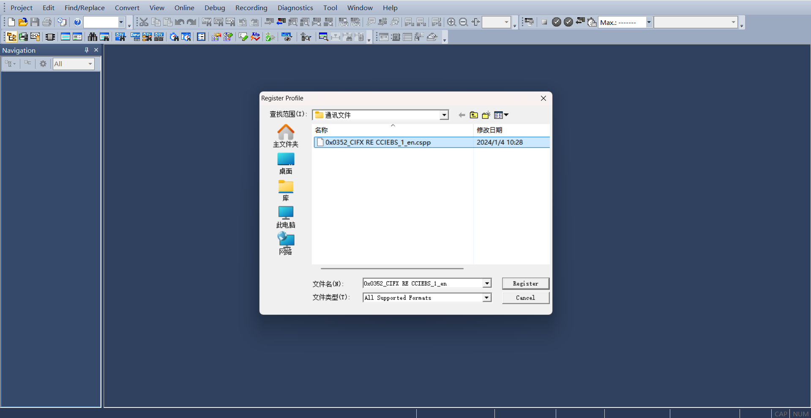

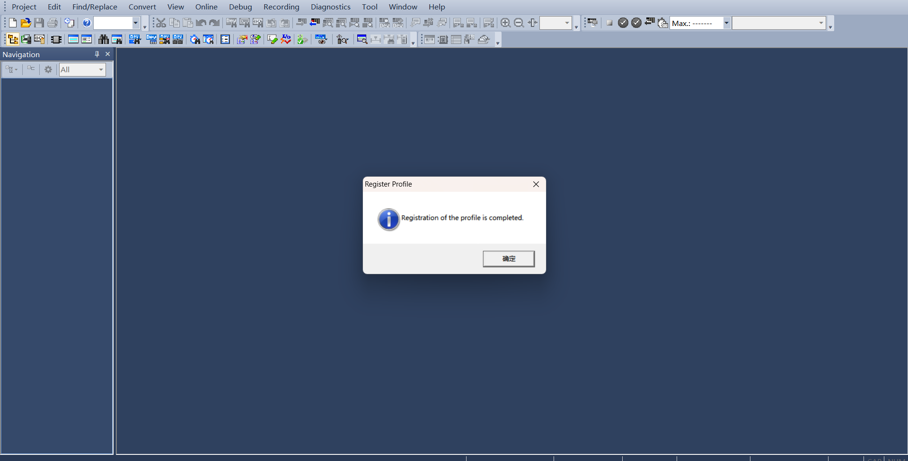

(2) Impostazioni CC-Link IEF Basic

Creare un progetto PLC, abilitare CC-link: Selezionare "Porta Ethernet" nel menu di navigazione a sinistra, impostare l'indirizzo IP del PLC per assicurarsi che sia sulla stessa sottorete dell'indirizzo della scheda Hilscher. Fare clic su "Utilizzo CC-Link IEF Basic" e selezionare "Utilizza".

.. image:: remote_mode/025.png
   :width: 6in
   :align: center

Impostazioni configurazione rete CC-Link: Sempre nelle Impostazioni CC-Link IEF Basic, selezionare "Impostazioni configurazione rete". Selezionare il modulo Hilscher CIFX Digital I/O per il modulo. Trascinarlo in basso a sinistra della vista per completare la configurazione hardware.

.. image:: remote_mode/026.png
   :width: 6in
   :align: center

Impostazioni aggiornamento CC-Link: Sempre nelle Impostazioni CC-Link IEF Basic, fare clic su "Impostazioni aggiornamento". Personalizzare le impostazioni di trasferimento: 256 byte in ricezione, 256 byte in invio.

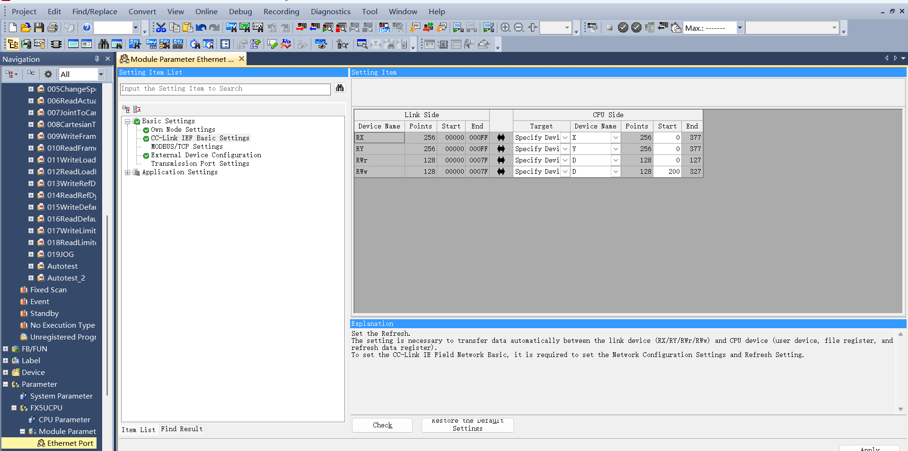

(3) Download del programma

Dopo aver aperto il programma di test, fare clic su "Online" -> "Scrivi su PLC" per accedere all'interfaccia di download.

.. image:: remote_mode/028.png
   :width: 6in
   :align: center

Dopo aver aperto l'interfaccia di download, fare clic su "Parametri + Programma" in alto a sinistra, quindi fare clic su "Esegui" in basso a destra per scaricare. Attendere il completamento del download.

.. image:: remote_mode/029.png
   :width: 6in
   :align: center

Omron Ethernet/IP
++++++++++++++++++++++++++++++++++++++++++++++++++++++++

(1) Creare un nuovo progetto PLC (Questo esempio utilizza il modello: NX102-1100, PLC Omron 1.47):

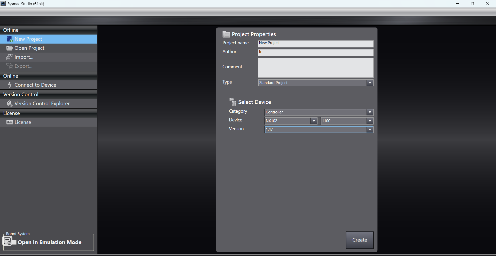

Creare nuove variabili globali:

.. image:: remote_mode/031.png
   :width: 6in
   :align: center

(2) Importare il file EDS

Fare clic su "Strumenti" -> "Impostazioni connessione EtherNet/IP":

.. image:: remote_mode/032.png
   :width: 6in
   :align: center

Accedere alle impostazioni per il PLC da collegare:

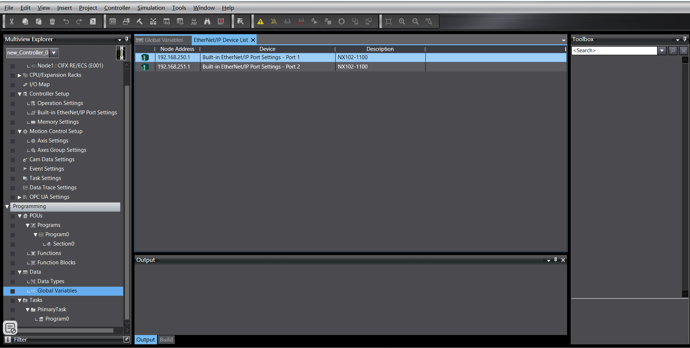

Fare clic con il pulsante destro nell'area vuota del gruppo di tag per creare un nuovo gruppo di tag:

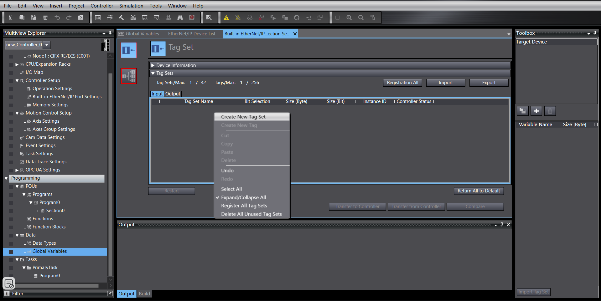

Fare clic con il pulsante destro sul gruppo di tag appena creato, creare tag. Uguale per input e output, entrambi di lunghezza 256 byte:

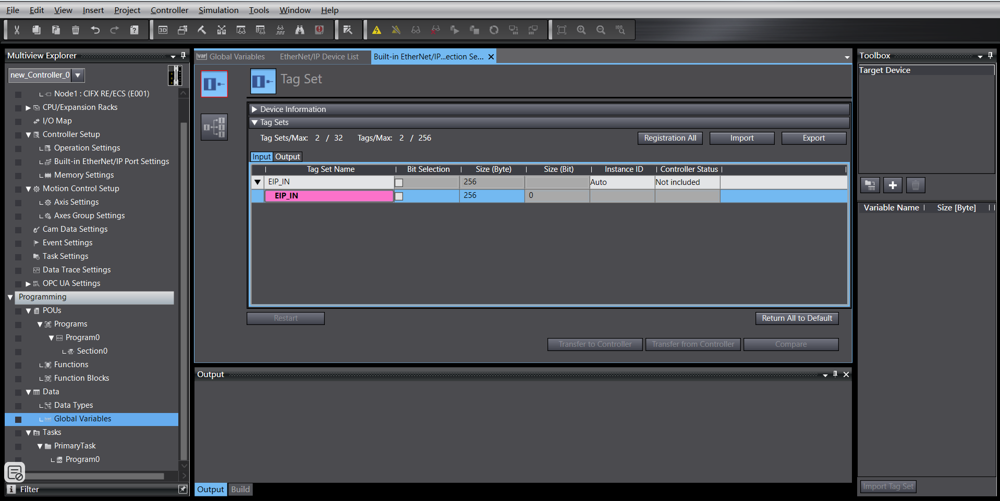

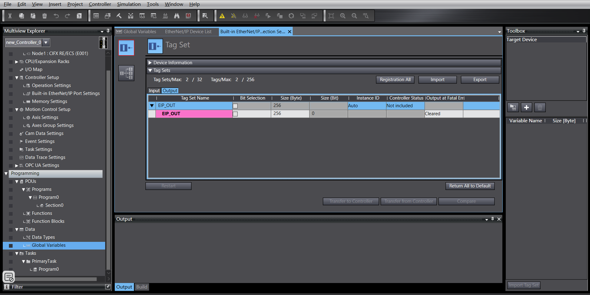

Accedere alle impostazioni di connessione, fare clic con il pulsante destro nell'area vuota della cassetta degli attrezzi, fare clic con il pulsante destro per visualizzare la libreria EDS:

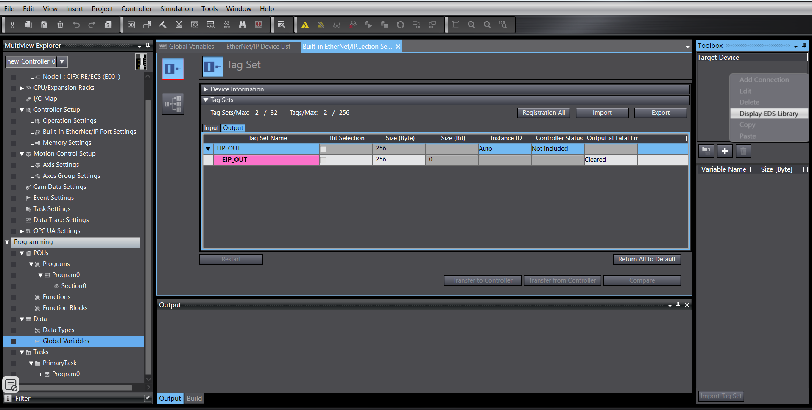

Installare il file EDS:

.. image:: remote_mode/038.png
   :width: 6in
   :align: center

Fare clic sul "+" nella cassetta degli attrezzi, aggiungere il dispositivo di destinazione, inserire l'indirizzo IP del dispositivo di destinazione:

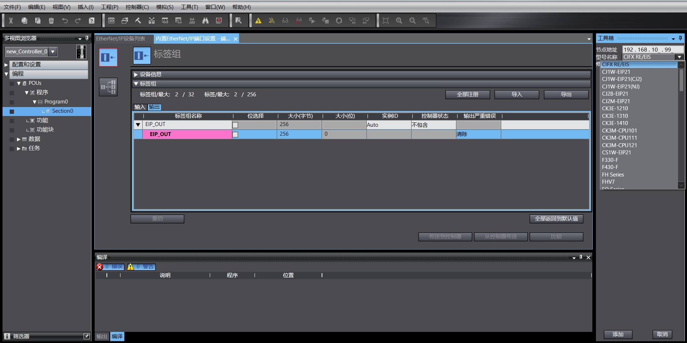

Fare clic su "Aggiungi" in basso a destra. Dopo l'aggiunta riuscita, il dispositivo di destinazione viene visualizzato:

.. image:: remote_mode/040.png
   :width: 6in
   :align: center

(3) Impostazioni parametri EtherNet/IP

Fare clic con il pulsante destro sul dispositivo di destinazione aggiunto, fare clic su "Modifica":

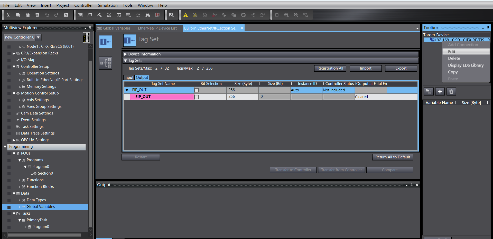

La lunghezza del mapping dei dati del dispositivo corrente è di 256 byte. Modificare 0001 e 0002 in 256, confermare:

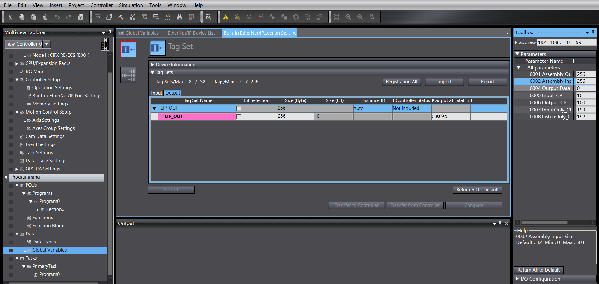

Fare doppio clic sul dispositivo di destinazione, compilare input e output, selezionare la variabile di partenza:

.. image:: remote_mode/043.png
   :width: 6in
   :align: center

(4) Download del programma

Aprire il programma di test, modificare l'indirizzo IP del PLC sulla stessa sottorete della scheda, scaricare il programma ed eseguirlo.

Omron EtherCAT
+++++++++++++++++++++++++++++++++++++++++++++++++

(1) Creare un nuovo progetto PLC (Questo esempio utilizza il modello: NX102-1100, PLC Omron 1.47):

.. image:: remote_mode/044.png
   :width: 6in
   :align: center

Creare nuove variabili globali:

.. image:: remote_mode/045.png
   :width: 6in
   :align: center

(2) Importare il file XML

Fare doppio clic su "EtherCAT" per accedere all'interfaccia delle impostazioni del master, fare clic con il pulsante destro e selezionare "Mostra libreria ESI".

.. image:: remote_mode/046.png
   :width: 6in
   :align: center

.. image:: remote_mode/047.png
   :width: 6in
   :align: center

Nella cassetta degli attrezzi a destra, selezionare il dispositivo di destinazione aggiunto, fare doppio clic per aggiungere lo slave:

.. image:: remote_mode/048.png
   :width: 6in
   :align: center

(3) Impostazioni slave EtherCAT

Impostare "Orologio distribuito valido" dello slave su "Avvia DC":

.. image:: remote_mode/049.png
   :width: 6in
   :align: center

(4) Mapping I/O

Fare doppio clic su "Mappa I/O" per associare le variabili agli indirizzi:

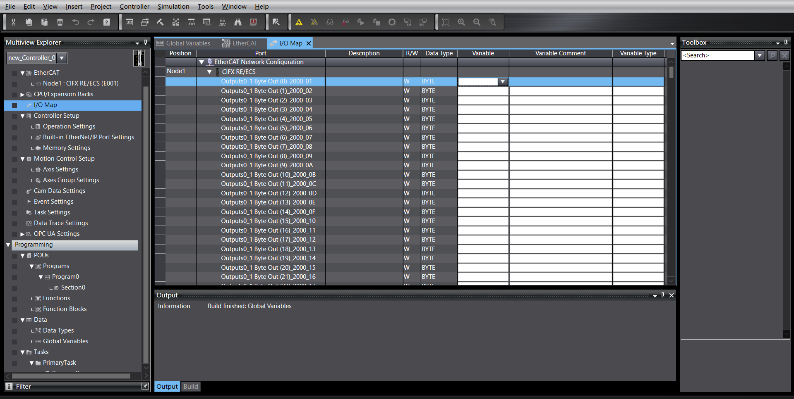

(5) Download del programma

Aprire il programma di test, modificare l'indirizzo IP del PLC sulla stessa sottorete della scheda, scaricare il programma ed eseguirlo.

Istruzioni Operative Modalità Remota Robot
----------------------------------------------------------------------------

(1) Inserire l'indirizzo IP 192.168.58.2 nel browser. Nome utente è admin, password è 123. Fare clic su "Accedi" per accedere all'interfaccia web dell'armadio di controllo del robot.

.. image:: remote_mode/051.png
   :width: 6in
   :align: center

.. centered:: Figura 18.2-14 Interfaccia Web Armadio di Controllo

(2) Fare clic su "Impostazioni Sistema" -> "Informazioni" -> Interfaccia Aggiornamento Software. Fare clic sul pulsante "Aggiorna", caricare il pacchetto software da aggiornare, fare clic su "Aggiorna" per iniziare l'aggiornamento. Riavviare l'armadio di controllo al termine dell'aggiornamento.

.. image:: remote_mode/052.png
   :width: 6in
   :align: center

.. centered:: Figura 18.2-15 Aggiornamento Software

(3) Fare clic sul pulsante di espansione nell'angolo in alto a destra per aprire la barra dei menu. Fare clic su "Modalità Locale" per passare alla "Modalità Remota".

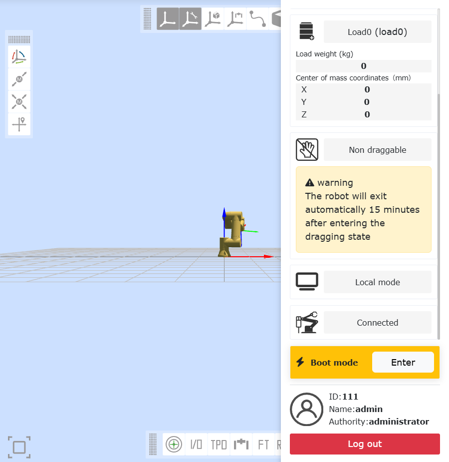

.. centered:: Figura 18.2-16 Commutazione alla Modalità Remota

(4) Selezionare il protocollo slave del controller e se è necessaria la funzione di avvio automatico. Fare clic sul pulsante "Imposta".

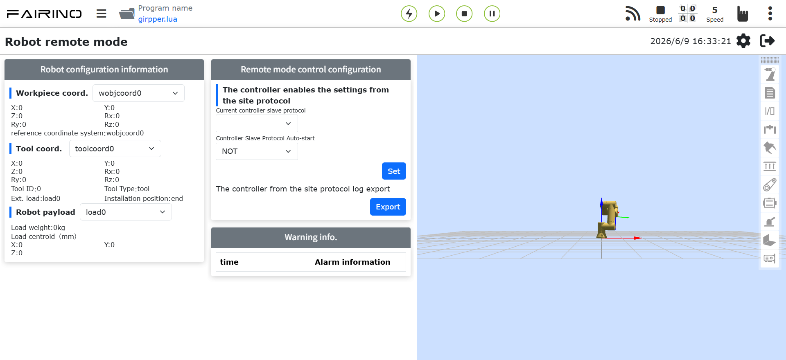

.. centered:: Figura 18.2-17 Configurazione Protocollo di Comunicazione

.. note:: Per passare da un protocollo all'altro, è necessario prima fare clic sul pulsante "Disinstalla" prima di configurare un altro protocollo.

Appendice
-------------------

Elenco Comandi
~~~~~~~~~~~~~~~~~~~~~~~~~~~

.. list-table::
   :widths: 20 80
   :header-rows: 1
   :align: center

   * - Codice Comando
     - Descrizione Comando

   * - 0x1000
     - Abilitazione Robot

   * - 0x1001
     - Ripristina tutti gli errori

   * - 0x1002
     - Arresto movimento robot

   * - 0x1003
     - Leggi posizione effettiva

   * - 0x1004
     - Imposta velocità robot

   * - 0x1005
     - Continua movimento robot

   * - 0x1006
     - Pausa movimento robot

   * - 0x1007
     - Calcola posizione cartesiana dalla posizione articolare

   * - 0x1008
     - Calcola posizione articolare dalla posizione cartesiana

   * - 0x2000
     - Scrivi informazioni utensile

   * - 0x2001
     - Leggi informazioni utensile

   * - 0x2002
     - Scrivi informazioni pezzo

   * - 0x2003
     - Leggi informazioni pezzo

   * - 0x2004
     - Scrivi informazioni carico

   * - 0x2005
     - Leggi informazioni carico

   * - 0x2006
     - Scrivi informazioni dynamic di riferimento

   * - 0x2007
     - Leggi informazioni dynamic di riferimento

   * - 0x2008
     - Scrivi informazioni dynamic predefinite

   * - 0x2009
     - Leggi informazioni dynamic predefinite

   * - 0x2010
     - Scrivi informazioni finecorsa software

   * - 0x2011
     - Leggi informazioni finecorsa software

   * - 0x3000
     - MoveAxes (basato su angoli articolari)

   * - 0x3001
     - MoveLinear

   * - 0x3002
     - MoveDirect (basato su sistema di coordinate cartesiano)

   * - 0x3003
     - Movimento Jog

   * - 0x3004
     - Arresto Jog