Peripherals
=============

.. toctree::
  :maxdepth: 5

End-Effector Lua Custom Open Protocol
----------------------------------------

Overview
~~~~~~~~~~~~~~~~

The End-Effector Lua Custom Open Protocol supports the use of force sensors, grippers, and welding handles. It also supports the combined use of force sensors and grippers.

Operation Steps
~~~~~~~~~~~~~~~~~~~~~~~

**Step1**: Navigate to System Settings -> About -> Firmware Upgrade interface, select the end-effector firmware .bin file, and upgrade the end-effector firmware.

.. important::
   First, confirm whether the end-effector firmware version FV2.010.06 or later meets the requirements. If the version does not meet the requirements, upgrade the corresponding software firmware; otherwise, firmware upgrade is not necessary.

   Before uploading the end-effector firmware upgrade package, it is necessary to disable the robot and then enter boot mode.

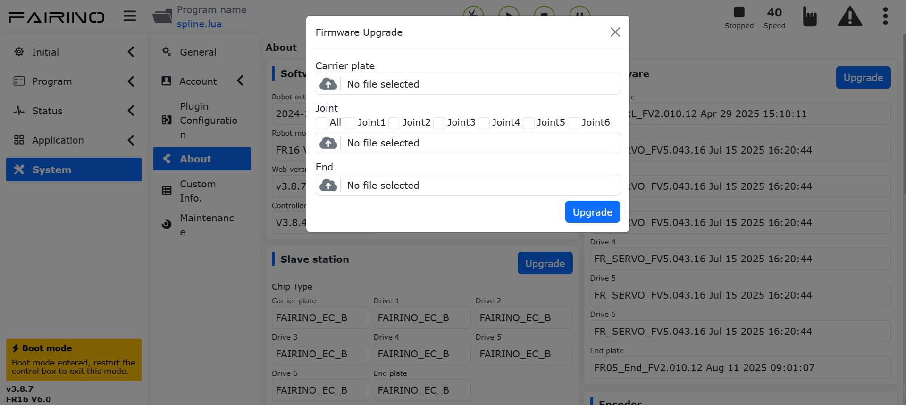

.. centered:: Figure 8.1‑1 Upgrade End-Effector Firmware

**Step2**: Navigate to the content interface of Peripherals -> Gripper/Force Sensor/Welding Handle, click the "Custom Protocol" card to enter the interface, upload the Lua end-effector open protocol, select the required Lua end-effector open protocol, and perform the upload operation.

.. important::
   Before uploading the end-effector protocol, you need to enter boot mode. Simultaneously, the file name must begin with `AXLE_LUA_`.

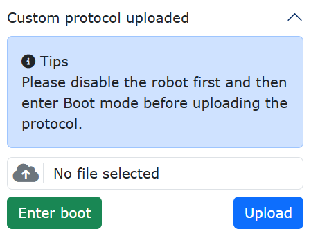

.. centered:: Figure 8.1‑2 Upload Lua End-Effector Open Protocol

**Step3**: Configure the end-effector communication parameters, including baud rate, data bits, stop bits, etc. After configuration, click the "Configure" button.

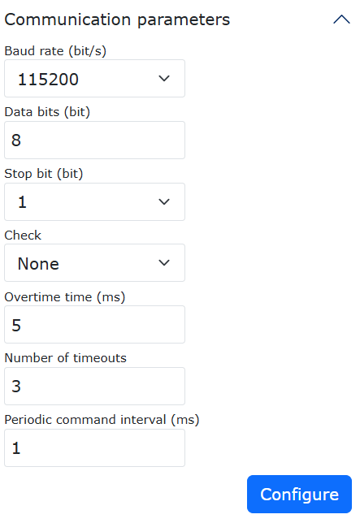

.. centered:: Figure 8.1‑3 Configure End-Effector Communication Parameters

The detailed end-effector communication parameters are as follows:

- **Baud Rate**: Supports 1-9600, 2-14400, 3-19200, 4-38400, 5-56000, 6-67600, 7-115200, 8-128000; The end-effector Rs485 driver chip is a low-speed 485, baud rate cannot be >200k;
- **Data Bits**: Supports (8,9), commonly 8 is used;
- **Stop Bits**: 1-1, 2-0.5, 3-2, 4-1.5, commonly 1 is used;
- **Parity Bit**: 0-None, 1-Odd, 2-Even, commonly 0 is used;
- **Timeout**: 1~1000ms, this value needs to be set reasonably in combination with the peripheral device;
- **Timeout Retries**: 1~10, mainly for timeout retransmission, reducing sporadic exceptions and improving user experience;
- **Periodic Command Interval**: 1~1000ms, mainly used for the time interval between each issuance of periodic commands;

**Step4**: Enable the End-Effector Lua by clicking the "Enable" button.

.. figure:: robot_peripherals/004.png
   :align: center
   :width: 4in

.. centered:: Figure 8.1‑4 Enable End-Effector Lua

When an exception occurs in the Lua file, a "End-Effector Lua File Exception" warning is prompted, and "Ignore/Recover" processing can be performed. Turn off the Lua enable button to close the warning prompt.

.. figure:: robot_peripherals/005.png
   :align: center
   :width: 4in

.. centered:: Figure 8.1‑5 Lua File Exception

When the device type is a gripper, status monitoring can be performed.

**Turn on "Status Monitoring"**: The gripper status bar on the right displays real-time status information such as gripper running speed, torque, position, etc.

**Turn off "Status Monitoring"**: The gripper data status bar on the right closes.

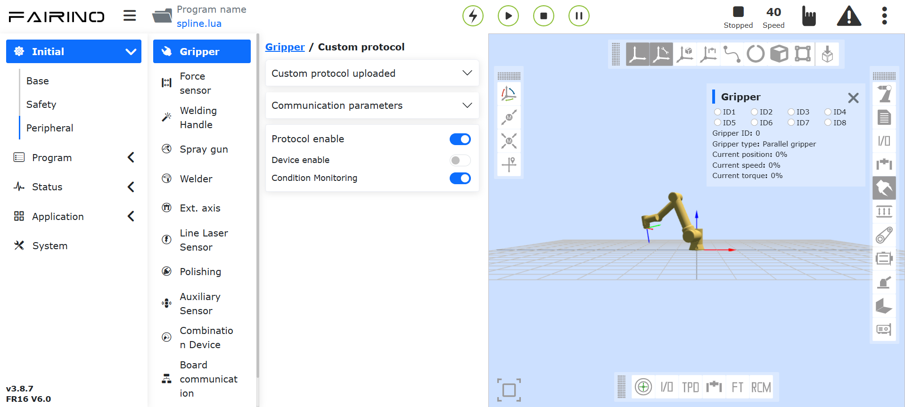

.. centered:: Figure 8.1‑6 Status Monitoring

Gripper
-------------------

In the "Initial" -> "Peripherals" -> "Gripper" interface, grippers can currently be used via Pre-Adapted Devices and the End-Effector Lua Custom Open Protocol.

Pre-Adapted Devices
~~~~~~~~~~~~~~~~~~~~~~~~~~~

**Step1**: Click "Pre-Adapted Devices" to enter the end-effector peripheral configuration interface. The gripper configuration information includes gripper manufacturer, gripper type, software version, and mounting position. Users can configure the corresponding gripper information according to specific production needs. If the user needs to change the configuration, they can first select the corresponding gripper number, click the "Clear" button to clear the corresponding configuration, and reconfigure according to the requirements;

.. figure:: robot_peripherals/007.png
   :align: center
   :width: 4in

.. centered:: Figure 8.2‑1 Gripper Configuration

.. important::
	Before clicking to clear the configuration, the corresponding gripper should be in an inactive state.

**Step2**: After the gripper configuration is completed, the user can view the corresponding gripper information in the gripper information table at the bottom of the page. If a configuration error is found, click the "Clear" button to reconfigure the gripper;

.. figure:: robot_peripherals/008.png
   :align: center
   :width: 4in

.. centered:: Figure 8.2‑2 Gripper Configuration Information

**Step3**: Select the configured gripper, click the "Reset" button, after the page pops up indicating the command was sent successfully, then click the "Activate" button. Check the activation status in the gripper information table to determine whether the activation was successful;

.. important::
	When activating the gripper, the gripper must not be holding any object.

**Step4**: In the program teaching command interface, select the "Gripper" command. In the gripper command interface, the user can select the gripper number they want to control (grippers that have been configured and activated), set the corresponding open/close state, open/close speed, open/close torque, and the maximum waiting time for the gripper action. After completing the settings, click Add to apply. Additionally, gripper activation and reset commands can be added to activate/reset the gripper when running the program.

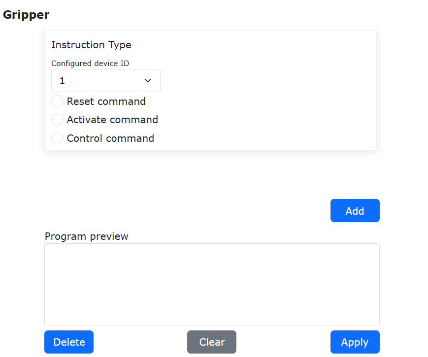

.. centered:: Figure 8.2‑3 Gripper Command Editing

Gripper Program Teaching
++++++++++++++++++++++++++++++++++++++++++++++++

.. list-table::
   :widths: 15 40 100
   :header-rows: 1

   * - No.
     - Command Format
     - Comment
   * - 1
     - PTP(template2,100,-1,0)
     - # Wait for gripping point
   * - 2
     - PTP(template1,100,-1,0)
     - # Gripping point
   * - 3
     - MoveGripper(1,255,255,0,1000,0)
     - # Gripper close
   * - 4
     - PTP(template2,100,-1,0)
     - /
   * - 5
     - PTP(template3,100,-1,0)
     - # Wait for placement point
   * - 6
     - PTP(template3,100,-1,0)
     - # Placement point
   * - 7
     - MoveGripper(1,0,255,0,1000,0)
     - # Gripper open

Custom Open Protocol
~~~~~~~~~~~~~~~~~~~~~~~~~~~~~~~~~~~~~~~~

For the steps to upload a gripper custom protocol, refer to the content of the End-Effector Lua Custom Open Protocol.

**Step1**: Enable Gripper -> Select Gripper ID -> Check the function codes adapted for the gripper -> Click Configure. The configured device displays the Gripper ID and function codes.

.. figure:: robot_peripherals/010.png
   :align: center
   :width: 4in

.. centered:: Figure 8.2‑4 Configure Gripper

.. note::
  The current supported device address range for the end-effector open function for grippers is 1~8. Before use, adjust the gripper device address via the gripper manufacturer's upper computer software.

  The selected function codes should be queried from the product manual provided by the gripper manufacturer to match the gripper's adapted functions, and should correspond to the end-effector Lua function codes. For details, please refer to the "End-Effector Lua Adaptation Gripper Instruction Manual".

**Step2**: Select Gripper ID -> Reset -> Activate. The gripper performs an initialization. For specific initialization details, please refer to the product manual provided by the gripper manufacturer.

.. figure:: robot_peripherals/011.png
   :align: center
   :width: 4in

.. centered:: Figure 8.2‑5 Activate Gripper

**Step3**: Enter Teach Program -> Program Programming -> Add Gripper Motion Command.

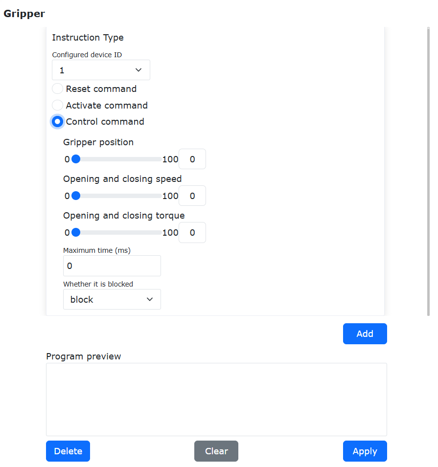

.. centered:: Figure 8.2‑6 Add Gripper Motion Command

.. figure:: robot_peripherals/013.png
   :align: center
   :width: 6in

.. centered:: Figure 8.2‑7 Gripper Motion Command Example

Multiple Grippers
++++++++++++++++++++++++++++++++++

Activation and motion control refer to the gripper steps.

.. figure:: robot_peripherals/014.png
   :align: center
   :width: 4in

.. centered:: Figure 8.2‑8 Configure Multiple Grippers

.. note:: The current supported device address range for the end-effector open function for grippers is 1~8. Before use, adjust the gripper device address via the gripper manufacturer's upper computer software.

Rotary Gripper
++++++++++++++++++++++++++++

**Step1**: Enable Gripper -> Select Gripper ID -> Check the function codes adapted for the gripper -> Click Configure. The configured device displays the Gripper ID and function codes.

.. figure:: robot_peripherals/010.png
   :align: center
   :width: 4in

.. centered:: Figure 8.2‑9 Configure Gripper and Function Codes

.. note:: The selected function codes should be queried from the product manual provided by the gripper manufacturer to match the gripper's adapted functions, and should correspond to the end-effector Lua function codes. For details, please refer to "FR05-End-Effector Full Peripheral Protocol-V2.5-20241101.xlsx".

**Step2**: Select Gripper ID -> Reset -> Activate. The gripper performs an initialization. For specific initialization details, please refer to the product manual provided by the gripper manufacturer.

.. figure:: robot_peripherals/011.png
   :align: center
   :width: 4in

.. centered:: Figure 8.2‑10 Activate Gripper

**Step3**: Enter Teach Program -> Program Programming -> Add Rotary Gripper Motion Command.

.. centered:: Figure 8.2‑11 Add Rotary Gripper Motion Command

.. figure:: robot_peripherals/015.png
   :align: center
   :width: 6in

.. centered:: Figure 8.2‑12 Rotary Gripper Motion Command Example

.. note:: The rotation turns are absolute rotation turns. The maximum forward rotation turns are 90, and the maximum reverse rotation turns are 90. A reset operation is required after rotation.

Force Sensor
-------------------------

In the "Initial" -> "Peripherals" -> "Force Sensor" interface, force sensors can currently be used via Pre-Adapted Devices and the End-Effector Lua Custom Open Protocol.

Pre-Adapted Devices
~~~~~~~~~~~~~~~~~~~~~~~~~~~~~~~~~~~~~~

**Step1**: Click "Pre-Adapted Devices" to enter the end-effector peripheral configuration interface.

The force sensor configuration information includes manufacturer, type, software version, and mounting position. Users can configure the corresponding force sensor information according to specific production needs. If the user needs to change the configuration, they can first select the corresponding number, click the "Clear" button to clear the corresponding information, and reconfigure according to the requirements;

.. figure:: robot_peripherals/016.png
   :align: center
   :width: 4in

.. centered:: Figure 8.3‑1 Force Sensor Configuration

.. important::
	Before clicking to clear the configuration, the corresponding sensor should be in an inactive state.

**Step2**: After the force sensor configuration is completed, the user can view the corresponding force sensor information in the information table at the bottom of the page. If a configuration error is found, click the "Clear" button to reconfigure.

.. figure:: robot_peripherals/017.png
   :align: center
   :width: 4in

.. centered:: Figure 8.3‑2 Force Sensor Configuration Information

**Step3**: Select the configured force sensor number, click the "Reset" button, after the page pops up indicating the command was sent successfully, then click the "Activate" button. Check the activation status in the force sensor information table to determine whether the activation was successful; Additionally, the force sensor will have an initial value. The user can choose "Zero Calibration" and "Remove Zero" according to usage requirements. Force sensor zero calibration requires ensuring the force sensor is level and vertically downward, and the robot has no configured load.

**Step4**: After the force sensor configuration is completed, it is necessary to configure the sensor type tool coordinate system. The sensor tool coordinate system values can be directly input and applied based on the distance between the sensor and the end-effector tool center.

Sensor Load Identification
~~~~~~~~~~~~~~~~~~~~~~~~~~~~~~~~~~~~~~~~~~~~~~~~~~~~

Under the "Initial" -> "Basic" -> "Load" menu bar, click "Sensor Identification" to enter the sensor load identification interface.

Specific Pose Identification: Clear the end-effector load data, configure the force sensor, establish the sensor coordinate system, adjust the robot end-effector posture to vertical downward, perform "Zero Calibration" and then install the end-effector load. First, select the corresponding sensor tool coordinate system, adjust the robot so that the sensor and tool are vertical downward, record data, and calculate the mass. Then, adjust the robot to 3 different postures, record three sets of data respectively, calculate the center of mass, confirm it is correct and click Apply.

**Dynamic Identification**: Clear the end-effector load data, configure the force sensor, establish the sensor coordinate system, adjust the robot end-effector posture to vertical downward, perform "Zero Calibration" and then install the end-effector load. Click "Identification Start", drag the robot to move, then click "Identification Stop", and the load result will be automatically applied to the robot.

**Auto Zero**: After the sensor records the initial position, it can automatically zero.

.. figure:: robot_peripherals/018.png
   :align: center
   :width: 4in

.. centered:: Figure 8.3‑3 Sensor Load Identification

Force Sensor Assisted Dragging
~~~~~~~~~~~~~~~~~~~~~~~~~~~~~~~~~~~~~~~~~~~~~~~~~~~~~~~~

After configuring the sensor, it can be paired with the sensor to provide better assistance for dragging the robot. For the first use, you can configure according to the data in the right figure. After applying, you do not need to enter the drag mode; directly drag the end-effector force sensor to control the robot to move in a fixed posture. (The data in the figure below is a reference standard)

.. figure:: robot_peripherals/019.png
   :align: center
   :width: 4in

.. centered:: Figure 8.3‑4 Force/Torque Sensor Drag Lock

.. note::
   Singularity Strategy is a function developed under force sensor assisted locking for singularity crossing and avoidance.

   Singularity Avoidance Strategy is the default function option. After enabling assisted dragging, the avoidance function is enabled by default. Singularity avoidance is a function that applies virtual force to move the robot away from a singular configuration when the robot is in a singular pose.

   Singular Configurations:

   **Elbow Singularity**: Rotation axes 2, 3, and 4 are in the same plane. At this time, the elbow joint is fully extended or fully contracted. Due to FR robot mechanical limits, the fully contracted configuration cannot be reached.

   **Wrist Singularity**: Rotation axes 4 and 6 are parallel. Due to FR robot mechanical limits, this configuration cannot be reached.

   **Shoulder Singularity**: The wrist center point is located in the plane formed by rotation axes 1 and 2.

   Singularity Crossing Function: Select "Singularity Strategy" as "Cross" and apply. When the robot detects that the current pose is in a singular configuration, it automatically switches to the current loop drag mode. When it detects exiting the singular configuration, the drag mode switches back to force sensor assisted dragging to continue motion.

**Adaptive Selection**: Enable when assembly is required; after enabling, dragging becomes heavier;

**Inertia Parameters**: Adjust the feel during the dragging process, operate with caution under the guidance of technical personnel.

**Damping Parameters**:

-  Translation Direction: Recommended parameter range [100-200];
-  Rotation Direction: Recommended parameter range [3-10], with the RZ direction range [0.1-5];
-  Effect: When dragging with the sensor, increasing damping makes dragging difficult, decreasing damping makes dragging the robot too easy (recommended not to set too small);
-  Overall Damping Parameter Range: Translation XYZ: [100-1000]; Rotation RX, RY: [3-50], RZ: [2-10];
-  Maximum Drag Force is 50, Maximum Drag Speed is 180.

**Stiffness Parameters**: All set to 0;

**Drag Force Threshold**: Translation XYZ: [5-10]; Rotation RX, RY, RZ: [0.5-5];

.. important::
   Locking is achieved by increasing the force threshold for translation directions XYZ or rotation directions RX, RY, RZ.

Force/Torque Sensor Collision Detection
~~~~~~~~~~~~~~~~~~~~~~~~~~~~~~~~~~~~~~~~~~~~~~~~~~~~~~~~~~~~~~~~~

Command Description: The "FT_Guard" command is the collision detection command. Select the corresponding sensor coordinate system, check the effective torque direction detection, set the current value, maximum collision threshold, and minimum collision threshold. The normal collision detection condition range is (Current Value - Min Threshold, Current Value + Max Threshold). Add the "Enable" and "Disable" commands to the program.

.. figure:: robot_peripherals/020.png
   :align: center
   :width: 6in

.. centered:: Figure 8.3‑5 FT_Guard Command Editing

Program Example:

.. list-table::
   :widths: 50 80 80
   :header-rows: 0
   :align: center

   * - **No.**
     - **Command Format**
     - **Comment**

   * - 1
     - FT_Guard(1,1,1,1,1,0,0,0,5,0,0,0,0,0,10,0,0,0,0,0,5,0,0,0,0,0)
     - # Force/Torque Collision Detection Enable

   * - 2
     - PTP(template1,100,-1,0)
     - # Motion Command

   * - 3
     - FT_Guard(0,1,1,1,1,0,0,0,5,0,0,0,0,0,10,0,0,0,0,0,5,0,0,0,0,0)
     - # Force/Torque Collision Detection Disable

Force/Torque Sensor Force Control Motion
~~~~~~~~~~~~~~~~~~~~~~~~~~~~~~~~~~~~~~~~~~~~~~~~~~~~~~~~~~~~~~~~~~

Command Description: The "FT_Control" command is the force control motion command, which allows the robot to move near the set force, commonly used in grinding scenarios. Select the corresponding sensor coordinate system, check the effective torque direction detection, set the detection threshold, and the PID proportional coefficients in each direction (generally set p to 0.001), set the maximum adjustment distance (for X,Y,Z) and maximum adjustment angle (for RX,RY,RZ). Add the "Enable" and "Disable" commands to the program.

.. figure:: robot_peripherals/021.png
   :align: center
   :width: 6in

.. figure:: robot_peripherals/022.png
   :align: center
   :width: 6in

.. centered:: Figure 8.3‑6 FT_Control Command Editing

Program Example:

.. list-table::
   :widths: 50 80 80
   :header-rows: 0
   :align: center

   * - **No.**
     - **Command Format**
     - **Comment**

   * - 1
     - FT_Control(1,11,1,0,1,0,0,0,10,0,5,0,0,0,0.001,0,0,0,0,0,0,0,0,10,5)
     - # Force/Torque Motion Control Enable

   * - 2
     - Lin(template3,100,-1,0,0)
     - # Motion Command

   * - 3
     - FT_Control(0,11,1,0,1,0,0,0,10,0,5,0,0,0,0.001,0,0,0,0,0,0,0,10,5)
     - # Force/Torque Motion Control Disable

Force/Torque Sensor Spiral Insertion
~~~~~~~~~~~~~~~~~~~~~~~~~~~~~~~~~~~~~~~~~~~~~~~~~~~~~~~~~~~~~~

Command Description: The "FT_Spiral" command is for spiral search insertion, generally used for shaft-hole assembly actions of cylindrical shafts. Before running the action, the robot end-effector needs to be dragged to the approximate position of the hole. According to the current scene, set the command parameters, add them to the program. After running, the robot will explore with a spiral motion.

.. figure:: robot_peripherals/023.png
   :align: center
   :width: 6in

.. centered:: Figure 8.3‑7 FT_Spiral Command Editing

Program Example:

.. list-table::
   :widths: 50 80 80
   :header-rows: 0
   :align: center

   * - **No.**
     - **Command Format**
     - **Comment**

   * - 1
     - FT_Control(1,10,0,0,1,0,0,0,0,0,5,0,0,0,0.0005,0,0,0,0,0,0,10,0)
     - # Force/Torque Motion Control Enable

   * - 2
     - FT_SpiralSearch(0,0.7,0,60000,5)
     - # Spiral Insertion

   * - 3
     - FT_Control(0,10,0,0,1,0,0,0,0,0,5,0,0,0,0.0005,0,0,0,0,0,0,10,0)
     - # Force/Torque Motion Control Disable

Force/Torque Sensor Rotation Insertion
~~~~~~~~~~~~~~~~~~~~~~~~~~~~~~~~~~~~~~~~~~~~~~~~~~~~~~~~~~~~~~~~

Command Description: The "FT_Rot" command is for rotation search insertion, generally used to follow the spiral insertion action, for keyed shaft-hole assembly. Before running the action, the robot end-effector needs to be moved to the hole position found by the spiral search or a taught hole position that is completely aligned. According to the current scene, set the command parameters, add them to the program. After running, the robot will explore with a slow rotation.

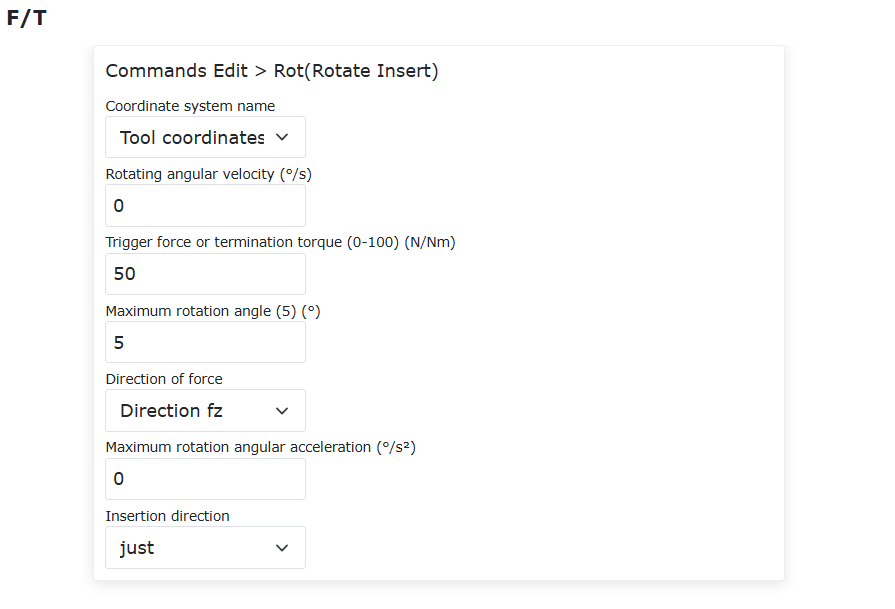

.. centered:: Figure 8.3‑8 FT_Rot Command Editing

Program Example:

.. list-table::
   :widths: 50 80 80
   :header-rows: 0
   :align: center

   * - **No.**
     - **Command Format**
     - **Comment**

   * - 1
     - FT_Control(1,10,0,0,1,0,0,0,0,0,5,0,0,0,0.0005,0,0,0,0,0,0,10,0)
     - # Force/Torque Motion Control Enable

   * - 2
     - FT_RotInsertion(0,3,0,5,1,0,1)
     - # Rotation Insertion

   * - 3
     - FT_Control(0,10,0,0,1,0,0,0,0,0,5,0,0,0,0.0005,0,0,0,0,0,0,10,0)
     - # Force/Torque Motion Control Disable

Force/Torque Sensor Linear Insertion
~~~~~~~~~~~~~~~~~~~~~~~~~~~~~~~~~~~~~~~~~~~~~~~~~~~~~~~~~~~~~~

Command Description: The "FT_Lin" command is for linear search insertion, generally used to follow the spiral insertion action or rotation insertion action, for keyed shaft-hole assembly. Before running the action, the robot end-effector needs to be moved to the hole position found by the spiral search, the end position of the rotation insertion action, or a taught hole position that is completely aligned. According to the current scene, set the command parameters, add them to the program. After running, the robot will perform linear motion in the set direction.

.. figure:: robot_peripherals/025.png
   :align: center
   :width: 6in

.. centered:: Figure 8.3‑9 FT_Lin Command Editing

Program Example:

.. list-table::
   :widths: 50 80 80
   :header-rows: 0
   :align: center

   * - **No.**
     - **Command Format**
     - **Comment**

   * - 1
     - FT_Control(1,10,0,0,1,0,0,0,0,0,5,0,0,0,0.0005,0,0,0,0,0,0,10,0)
     - # Force/Torque Motion Control Enable

   * - 2
     - FT_LinInsertion(0,50,1,0,100,1)
     - # Linear Insertion

   * - 3
     - FT_Control(0,10,0,0,1,0,0,0,0,0,5,0,0,0,0.0005,0,0,0,0,0,0,10,0)
     - # Force/Torque Motion Control Disable

Force/Torque Sensor Surface Finding
~~~~~~~~~~~~~~~~~~~~~~~~~~~~~~~~~~~~~~~~~~~~~~~~~~~~~~~~~~~~~

Command Description: The "FT_FindSurface" command is for surface finding, generally used to find the surface of an object. According to the current scene, set the corresponding coordinate system, movement direction, movement axis, search linear speed, search linear acceleration, maximum search distance, action termination force threshold and other parameters, add them to the program. Run the program, the action starts executing, and the robot end-effector begins to slowly move towards the direction of the surface.

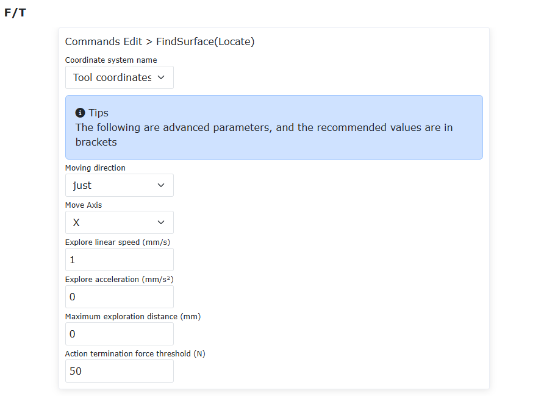

.. centered:: Figure 8.3‑10 FT_FindSurface Command Editing

Program Example:

.. list-table::
   :widths: 50 80 80
   :header-rows: 0
   :align: center

   * - **No.**
     - **Command Format**
     - **Comment**

   * - 1
     - PTP(1,30,-1,0)
     - # Initial Position

   * - 2
     - FT_FindSurface(0,1,3,1,0,100,5)
     - # Surface Finding

Force/Torque Sensor Center Finding
~~~~~~~~~~~~~~~~~~~~~~~~~~~~~~~~~~~~~~~~~~~~~~~~~~~~~~~~~~~~

Command Description: The "FT_CalCenter" command is for center finding, generally used to find the middle plane surface between two surfaces. According to the current scene, set the corresponding coordinate system, movement direction, movement axis, search linear speed, search linear acceleration, maximum search distance, action termination force threshold and other parameters, find surface A and surface B respectively, add them to the program. Run the program, the action starts executing, the robot slowly moves towards the direction of surface A, after locating surface A, the robot slowly moves towards the direction of surface B, after locating surface B, the center plane position can be calculated.

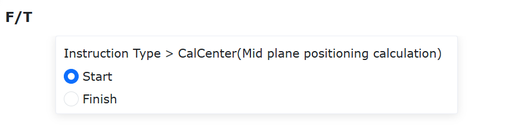

.. centered:: Figure 8.3‑11 FT_CalCenter Command Editing

Program Example:

.. list-table::
   :widths: 20 40 50
   :header-rows: 0
   :align: center

   * - **No.**
     - **Command Format**
     - **Comment**

   * - 1
     - PTP(1,30,-1,0)
     - # Initial Position

   * - 2
     - FT_CalCenterStart()
     - # Surface Finding Start

   * - 3
     - FT_Control(1,10,0,0,1,0,0,0,0,0,-10,0,0,0,0.00001,0,0,0,0,0,0,100,0)
     - # Force/Torque Motion Control Enable

   * - 4
     - FT_FindSurface(1,2,2,10,0,200,5)
     - # Locate Plane A

   * - 5
     - FT_Control(0,10,0,0,1,0,0,0,0,0,-10,0,0,0,0.00001,0,0,0,0,0,0,100,0)
     - # Force/Torque Motion Control Disable

   * - 6
     - PTP(1,30,-1,0)
     - # Initial Position

   * - 7
     - FT_Control(1,10,0,0,1,0,0,0,0,0,-10,0,0,0,0.00001,0,0,0,0,0,0,100,0)
     - # Force/Torque Motion Control Enable

   * - 8
     - FT_FindSurface(1,1,2,20,0,200,5)
     - # Locate Plane B

   * - 9
     - FT_Control(0,10,0,0,1,0,0,0,0,0,10,0,0,0,0.00001,0,0,0,0,0,0,100,0)
     - # Force/Torque Motion Control Disable

   * - 10
     - pos={}
     - # Define array pos

   * - 11
     - pos = FT_CalCenterEnd()
     - # Get located center Cartesian pose

   * - 12
     - MoveCart(pos,GetActualTCPNum(),GetActualWObjNum(),30,10,100,-1,0)
     - # Move to the located center position

Custom Open Protocol
~~~~~~~~~~~~~~~~~~~~~~~~~~~~~~~~~~~~~~~~~~~~~~

Click the "Custom Protocol" card to enter the interface, enable the force sensor. The configured device displays the force sensor. Click to enter the FT interface to query force sensor data.

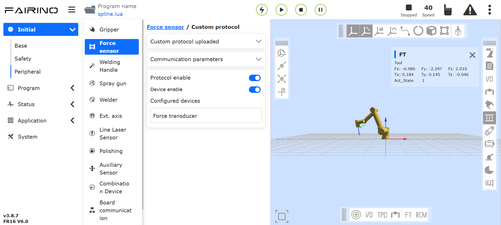

.. centered:: Figure 8.3‑12 Enable Force Sensor

Welding Pendant
-------------------------------------------------------------

In the "Initial" -> "Peripherals" -> "Welding Pendant" interface, the welding pendant can currently be used through adapted devices and the end Lua custom open protocol.

Adapted Devices
~~~~~~~~~~~~~~~~~~~~~~

Configuration Steps
++++++++++++++++++++++++++++++++++++

**Step1**: Click the "Adapted Devices" card to enter the Adapted Devices interface. The configuration information is divided into Manufacturer, Type, Software Version, and Mounting Position. Users can configure the corresponding information according to specific production needs. If users need to change the configuration, they can first select the corresponding manufacturer, click the "Clear" button to clear the corresponding information, and reconfigure according to requirements.

.. figure:: robot_peripherals/029.png
   :align: center
   :width: 3in

.. centered:: Figure 8.4‑1 Welding Pendant Adapted Device Configuration

.. important::
    The corresponding device should be in an inactive state before clicking to clear the configuration.

**Step2**: Configure key positions A-E and the IO key sequentially. After the Smart Tool configuration is completed, the task manager internally maintains the function corresponding to each button. When it detects that a button is pressed, it automatically executes the function item corresponding to that button.

A-E Key Functions:

- New Program
- Save Program
- PTP
- Lin
- ARC
- Start Weave Weld
- End Weave Weld
- IO Port

-  **Motion Command**: When selecting PTP, LIN, or ARC motion commands, the corresponding point speed needs to be entered. After successful configuration, a related motion command is added to the teach program. When configuring the ARC motion command, the PTP/LIN command must be configured first.
  
-  **DO Output**: When selecting "DO Output", a dropdown menu is displayed allowing selection of DO0⁓DO7 options.

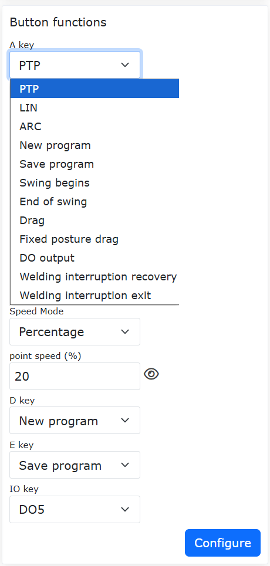

.. centered:: Figure 8.4‑2 A-E Keys

IO Key Functions:

-  **IO Signal Configuration**: The dropdown menu allows selection of DO0⁓DO7 options, CO0⁓CO7 options, End-DO0, End-DO1, and extended IO (Aux-DO0⁓Aux-DO127);

-  **Combined Command**: After selecting "IO Signal", under specific conditions, the "Welder Selection" and "Point Speed" configuration items are displayed, generating different program commands.

.. important::
   -  When the IO signal is configured as DO0~DO7 or CO0~CO7 (without "Arc Start" configured), the program adds SetDO; "Welder Selection" and "Point Speed" are hidden at this time.
   -  When the IO signal is configured as End-DO0 or End-DO1, the program adds SetToolDO; "Welder Selection" and "Point Speed" are hidden at this time.
   -  When the IO signal is configured as extended IO (without "Welder Arc Start" configured), the program adds SetAuxDO; "Welder Selection" and "Point Speed" are hidden at this time.
   -  When the IO signal is configured as CO0~CO7 (with "Arc Start" configured) and "Welder Selection" is "None", the program adds SetDO; "Welder Selection" and "Point Speed" are hidden at this time.
   -  When the IO signal configuration item is extended IO (with "Welder Arc Start" configured) and "Welder Selection" is "None", the program adds SetAuxDO; "Welder Selection" and "Point Speed" are hidden at this time.
   -  When the IO signal is configured as CO0~CO7 (with "Arc Start" configured) or extended IO (with "Welder Arc Start" configured), and "Welder Selection" is "Welding", the first press adds ARCStart, the second adds ARCEnd, the third adds ArcStart, the fourth adds ARCStart, alternating and repeating the above operations; "Welder Selection" and "Point Speed" are hidden at this time.
   -  When the IO signal is configured as CO0~CO7 (with "Arc Start" configured) or extended IO (with "Welder Arc Start" configured), and "Welder Selection" is "LIN+Welding", the first press adds LIN and ARCStart, the second adds LIN and ARCEnd, the third adds LIN and ARCStart, the fourth adds LIN and ARCEnd, alternating and repeating the above operations; "Welder Selection" and "Point Speed" are displayed at this time.
   -  When the IO signal is configured as CO0~CO7 (with "Arc Start" configured) or extended IO (with "Welder Arc Start" configured), and "Welder Selection" is "LIN+Welding+Weaving", the first press adds LIN, ARCStart, and WeaveStart, the second adds LIN, ARCEnd, and WeaveEnd, the third adds LIN, ARCStart, and WeaveStart, the fourth adds LIN, ARCEnd, and WeaveEnd, alternating and repeating the above operations; "Welder Selection" and "Point Speed" are hidden at this time.

  
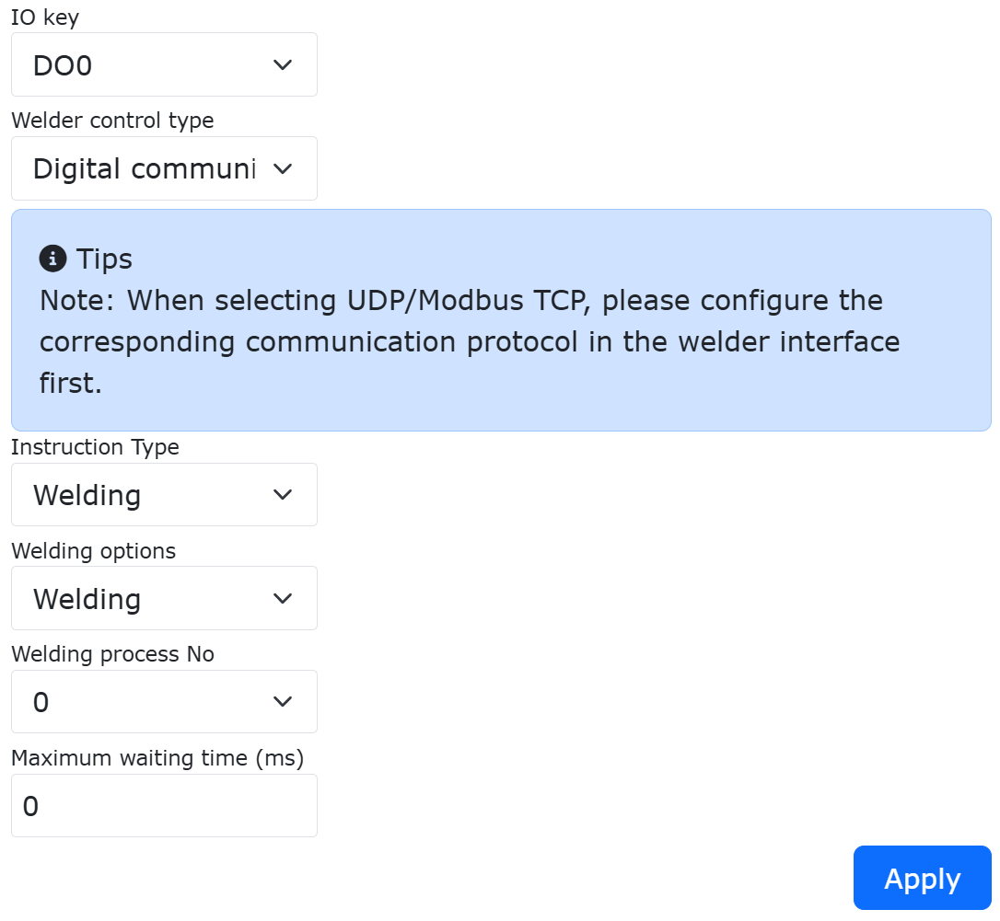

.. centered:: Figure 8.4‑3 IO Key

Custom Protocol
~~~~~~~~~~~~~~~~~~~~~~

Click "Custom Protocol" to enter the end Lua open protocol adaptation welding pendant function interface.

Protocol Configuration
+++++++++++++++++++++++++++++++++++++++

When using the open protocol to adapt the welding pendant, it is necessary to first enter the web page for open protocol upload configuration after the robot is powered on and starts.

Click "Custom Protocol Upload", click "Enter Boot", click "Upload" open protocol. After the upload is completed, restart the device to use the end Lua open protocol to adapt the welding pendant.

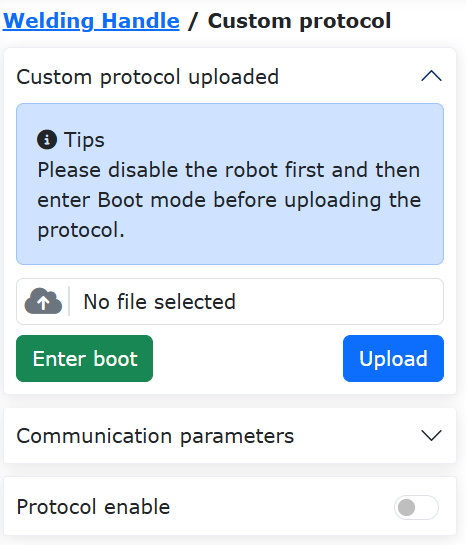

.. centered:: Figure 8.4‑4 End Open Protocol Upload

Slide the "End Protocol Enable" switch to ON to adapt the welding pendant. After enabling, parameters are retained after power off and restart.

.. figure:: robot_peripherals/033.png
   :align: center
   :width: 4in

.. centered:: Figure 8.4‑5 End Open Protocol Enable

Open Protocol Template
++++++++++++++++++++++++++++++

Taking the Jiashida adaptation open protocol as an example:

.. code-block:: console

   function Getbit(X,Bit)                   -- Extract the corresponding bit of X
   return ((X&(1<<Bit))>>Bit)
   end
   while(1)
   do
   IwdgTaskHandle()
   MainLoop()
   UpDownLoadHandle()
   SdoRwPara()
   EndErrClear()
   local BFlag=LuaBreak()
   if(BFlag==1)then
   break
   end
   RxData={}
   T0={0x7D,0x08,0x22,0xB3,0x01,0x00}
   T1={0x7D,0x08,0x22,0xB4,0x03,0x00}
   T2={0x7D,0X08,0X22,0XB5,0x1E,0x00}
   DelayMs(5)
   RxLen=WeldToolMasterGetCmd(RxData)                                    -- The WeldToolMasterGetCmd() function is used to get commands sent by the welding pendant (for when the welding pendant acts as the master station). Requires pushing an empty table onto the stack (X={}) when used.
   if (RxData[1]==0x7D)and(RxData[2]==0x08)and(RxData[3]==0x22) then
   if(RxData[4] == 0xB3)then                                              
      -- Taking Jiashida welding pendant function code as an example, here it is 0xB3 (Set Welding Parameters).
   local SetParams={A2=RxData[7],A1=RxData[8],A6=(ByteToDwFloat(RxData[9],RxData[10],RxData[11],RxData[12]))*1000,
   A8=(ByteToDwFloat(RxData[13],RxData[14],RxData[15],RxData[16])),A7=(ByteToDwFloat(RxData[17],RxData[18],RxData[19],RxData[20])),
   A4=(ByteToDwFloat(RxData[21],RxData[22],RxData[23],RxData[24]))*1000,A5=(ByteToDwFloat(RxData[25],RxData[26],RxData[27],RxData[28]))*1000}
   SetWeldParams(SetParams)                                                -- The SetWeldParams() function is used to set the controller's welding parameters. Need to refer to the welding pendant custom parameter table to determine the welding parameters that need to be modified (divided into 3 areas A, B, C in total).
   Dword=GetRobotState()                                                   -- The GetRobotState() function is used to get the robot's related status. Currently bit0 is the robot enable status, bit1 is the robot fault status, bit2 is the robot moving status, bit3 is the arc start/end command signal. Refer to End Full Peripherals Protocol V2.7.
   T0[7]=((Dword)&(1<<1))
   T0[8],T0[9]=WeldToolCrcValue(T0)                                        -- WeldToolCrcValue() Faro custom protocol CRC check
   T0[10]=0x0E
   EndTxWeldData(T0)                                                       -- The EndTxWeldData() function is used to send packaged data (here it is responding to the welding pendant's set welding parameters command).
   DelayMs(5)
   end
   if(RxData[4] == 0xB4)then                                               -- 0xB4 Real-time Control Command
   local key={K0=Getbit(RxData[7],0),K1=Getbit(RxData[7],1),K2=Getbit(RxData[7],2),K3=Getbit(RxData[7],3),
   K4=Getbit(RxData[7],4),K5=Getbit(RxData[7],5),K6=Getbit(RxData[7],6),K7=Getbit(RxData[7],7),
   K8=Getbit(RxData[8],0),K9=Getbit(RxData[8],1),K10=Getbit(RxData[8],2),K11=Getbit(RxData[8],3),
   K12=Getbit(RxData[8],4),K13=Getbit(RxData[8],5),K14=Getbit(RxData[8],6),K15=Getbit(RxData[9],0),
   K16=Getbit(RxData[9],1),K17=Getbit(RxData[9],2),K18=Getbit(RxData[9],3),K19=Getbit(RxData[9],4),
   K20=Getbit(RxData[9],5),K21=Getbit(RxData[9],6),K22=Getbit(RxData[9],7),K23=Getbit(RxData[10],0),
   K24=Getbit(RxData[10],1)}                                               -- Key values need to refer to End Full Peripherals Protocol V2.7 Table 26. K0-K31 correspond to DWordInput10's bit0-bit31, K32-K63 correspond to DWordInput9's bit0-bit31.
   SetWeldToolKeys(key)                                                    -- The SetWeldToolKeys() function is used to upload the welding pendant button status. Can adjust the key values filled in the table according to the actual situation of the welding pendant.
   Dword=GetRobotState()
   T1[7]=(Dword)&(0x1)
   T1[8]=(Dword>>1)&(0x1)
   T1[9]=(Dword>>2)&(0x1)
   T1[10],T1[11]=WeldToolCrcValue(T1)
   T1[12]=0X0E
   EndTxWeldData(T1)
   DelayMs(5)
   end
   if(RxData[4] == 0xB5)then                                               
   -- Read Welding Parameters (Get from the controller, give to the welding pendant)
   local wldpams={"A2","A1","A6","A8","A7","A4","A5"}                      
   -- Fill according to the welding parameters actually needed by the welding pendant. Jiashada needs these here, refer to End Full Peripherals Protocol V2.7 Table 26.
   GetWeldParams(wldpams)                                                  -- GetWeldParams() gets the corresponding welding parameters and replaces their values in the table (assuming A2=100, then after calling the function, wldpams[1]=100).
   T2[7]=wldpams[1]
   T2[8]=wldpams[2]
   wldpams[3]=wldpams[3]/1000
   wldpams[6]=wldpams[6]/1000
   wldpams[7]=wldpams[7]/1000
   for i=0,4 do
   T2[9+(i*4)+3],T2[9+(i*4)+2],T2[9+(i*4)+1],T2[9+(i*4)+0]=DwFloatToByte(wldpams[3+i])
   end
   for i=0,7 do
   T2[29+i]=0
   end
   T2[37],T2[38]=WeldToolCrcValue(T2)
   T2[39]=0x0E
   EndTxWeldData(T2)
   DelayMs(5)
   end
   end
   LuaGc()
   end

Instructions Supported by Open Protocol
++++++++++++++++++++++++++++++++++++++++++++++++++++++

The following instructions can be configured in the open protocol, while bits 39-63 are reserved for future expansion.

.. centered:: Table 8.4-1 Instructions Supported by Open Protocol

.. list-table::
   :widths: 20 80
   :header-rows: 0
   :align: center
   :class: sheet-center

   * - **Bit**
     - **Description**
   * - 0
     - Clear Program
   * - 1
     - Save Program
   * - 2
     - Generate Safe Point (LIN Command)
   * - 3
     - Generate Linear Motion Point (LIN Command)
   * - 4
     - Add Arc Transition Point
   * - 5
     - Add Arc End Point and Generate ARC Command
   * - 6
     - Switch Mode, default is Manual Mode
   * - 7
     - Toggle Robot Run Status
   * - 8
     - Toggle Robot Drag Status
   * - 9
     - Start Spot Weld
   * - 10
     - Add Start Weave Arc Command
   * - 11
     - Add End Weave Arc Command
   * - 12
     - Jog in Positive X Direction
   * - 13
     - Jog in Negative X Direction
   * - 14
     - Jog in Positive Y Direction
   * - 15
     - Jog in Negative Y Direction
   * - 16
     - Jog in Positive Z Direction
   * - 17
     - Jog in Negative Z Direction
   * - 18
     - Jog in Positive RX Direction
   * - 19
     - Jog in Negative RX Direction
   * - 20
     - Jog in Positive RY Direction
   * - 21
     - Jog in Negative RY Direction
   * - 22
     - Jog in Positive RZ Direction
   * - 23
     - Jog in Negative RZ Direction
   * - 24
     - Generate Start Point
   * - 25
     - PTP
   * - 26
     - Fixed Pose Drag
   * - 27
     - Weld Interruption Recovery
   * - 28
     - Weld Interruption Exit
   * - 29
     - SetDO
   * - 30
     - Offline
   * - 31
     - Configuration Parameter Update
   * - 32
     - ArcStart
   * - 33
     - ArcEnd
   * - 34
     - Lin+ArcStart+WeaveStart
   * - 35
     - Lin+ArcEnd+WeaveEnd
   * - 36
     - Lin+ArcStart
   * - 37
     - Lin+ArcEnd
   * - 38
     - Undo Program
   * - 39
     - Reserved
   * - ...
     - Reserved
   * - 63
     - Reserved

Configurable Parameters in Open Protocol
++++++++++++++++++++++++++++++++++++++++++++++++++++++

The following parameters can be configured in the open protocol.

.. centered:: Table 8.4-2 Configurable Parameters in Open Protocol

.. list-table::
   :widths: 10 40 20 30
   :header-rows: 0
   :align: center
   :class: sheet-center

   * - **Index**
     - **Data Content**
     - **Data Type**
     - **Range**

   * - 0
     - Welding Speed
     - float
     - 0-100%

   * - 1
     - Air Move Speed
     - float
     - 0-100%

   * - 2
     - Arc Start/End Timeout
     - float
     - 0-65535(ms)

   * - 3
     - Weave Left Dwell Time
     - float
     - 0-99999 (ms)

   * - 4
     - Weave Right Dwell Time
     - float
     - 0-99999 (ms)

   * - 5
     - Spot Weld Time
     - float
     - 0-99999 (ms)

   * - 6
     - Weave Width
     - float
     - 0-1000 (0.1mm)

   * - 7
     - Weave Frequency
     - float
     - 0-100(0.1Hz)

   * - 8
     - Welder Control Type; 0-Control Box IO; 1-Digital Communication Protocol (UDP)
     - float
     - 0-255

   * - 9
     - Welding Process Number (0-99)
     - float
     - 0-99

   * - 10
     - Weave Type
     - float
     - 0-255

   * - 11
     - Current Control Output Analog Output Port
     - float
     - 0-1

   * - 12
     - Voltage Control Output Analog Output Port
     - float
     - 0-1

   * - 13
     - Operation DO Port Number
     - float
     - 0-15

   * - 14
     - Weave Parameter Number
     - float
     - 0-255

   * - 15
     - Manual Mode Global Speed
     - float
     - 0-100%

   * - 16
     - Auto Mode Global Speed
     - float
     - 0-100%

   * - 17
     - Welding Current
     - float
     - 0-999990 (0.1A)

   * - 18
     - Welding Voltage
     - float
     - 0-999990 (0.1V)

   * - 19
     - Single Jog Maximum Distance
     - float
     - 0-1000 (0.1mm)

   * - 20
     - Welder Ready Extended DI Port
     - float
     - 0-127

   * - 21
     - Arc Success Extended DI Port
     - float
     - 0-127

   * - 22
     - Weld Interruption Recovery Extended DI Port
     - float
     - 0-127

   * - 23
     - Weld Interruption Exit Extended DI Port
     - float
     - 0-127

   * - 24
     - Welder Arc Start Extended DO Port
     - float
     - 0-127

   * - 25
     - Gas Detection Extended D0 Port
     - float
     - 0-127

   * - 26
     - Forward Wire Feed Extended D0 Port
     - float
     - 0-127

   * - 27
     - Reverse Wire Feed Extended D0 Port
     - float
     - 0-127

   * - 28
     - Weld Interruption Recovery Enable
     - float
     - 0-1

   * - 29
     - Go to Recovery Point Speed
     - float
     - 0-100%

   * - 30
     - Motion Mode
     - float
     - 0-1

   * - 31
     - Welding Arc Interruption Detection Enable
     - float
     - 0-1

   * - 32
     - Whether to Include Wait Time(ms)
     - float
     - 0-1

   * - 33
     - Weave Callback Ratio
     - float
     - 0-100%

   * - 34
     - Weave Position Wait Type
     - float
     - 0-255

   * - 35
     - Arc Start Time
     - float
     - 0-65535 (ms)

   * - 36
     - Arc End Time
     - float
     - 0-65535 (ms)

   * - 37
     - Welding Arc Interruption Confirmation Duration
     - float
     - 0-65535 (ms)

   * - 38
     - Overlap Distance
     - float
     - 0-1000(0.1mm)

   * - 39
     - Arc Start Current
     - float
     - 0-999990(0.1A)

   * - 40
     - Arc Start Voltage
     - float
     - 0-999990(0.1V)

   * - 41
     - Arc End Current
     - float
     - 0-999990(0.1A)

   * - 42
     - Arc End Voltage
     - float
     - 0-999990(0.1V)

   * - 43
     - Minimum Welding Current
     - float
     - 0-999990(0.1A)

   * - 44
     - Maximum Welding Current
     - float
     - 0-999990(0.1A)

   * - 45
     - Analog Output Corresponding to Minimum Welding Current
     - float
     - 0-100(0.1A)

   * - 46
     - Analog Output Corresponding to Maximum Welding Current
     - float
     - 0-100(0.1A)

   * - 47
     - Minimum Welding Voltage
     - float
     - 0-2000(0.1V)

   * - 48
     - Maximum Welding Voltage
     - float
     - 0-2000(0.1V)

   * - 49
     - Analog Output Corresponding to Minimum Welding Voltage
     - float
     - 0-100(0.1V)

   * - 50
     - Analog Output Corresponding to Maximum Welding Voltage
     - float
     - 0-100(0.1V)

   * - 51
     - Vertical Triangle Weave Left Chord Length
     - float
     - 0-1000(0.1mm)

   * - 52
     - Vertical Triangle Weave Right Chord Length
     - float
     - 0-1000(0.1mm)

   * - 53
     - Weave Direction Azimuth Angle
     - float
     - -1800-1800(0.1°)

   * - 54
     - Weave Direction Tilt Angle
     - float
     - -1800-1800(0.1°)

   * - 55
     - Vertical Triangle Weave Apex Wait Time
     - float
     - 0-99999(ms)

Spray Gun
-------------

Spray Gun Peripheral Configuration Steps
~~~~~~~~~~~~~~~~~~~~~~~~~~~~~~~~~~~~~~~~~~~~~~~~~~~~~~

**Step1**: In the "Initial" -> "Peripherals" menu bar, click "Spray Gun" to enter the spray gun configuration interface.

The spraying function allows one-click configuration of keys for quick setup of the required DOs for spraying (by default, DO10 is configured for spray start/stop, DO11 for gun cleaning).

Users can also customize DO configuration according to their needs in "Initial" -> "Basic" -> "I/O Settings".

.. important::
    Before using the spraying function, the corresponding tool coordinate system must be established and applied during program teaching.

**Step2**: After configuration is complete, click the four buttons "Start Spraying", "Stop Spraying", "Start Cleaning", and "Stop Cleaning" to debug the spray gun.

.. figure:: robot_peripherals/034.png
   :align: center
   :width: 4in

.. centered:: Figure 8.5‑1 Spray Gun Configuration

**Step3**: Select the "Spray Gun" command in the program command interface. According to the specific program teaching requirements, add the four instructions "Start Spraying", "Stop Spraying", "Start Cleaning", and "Stop Cleaning" at the appropriate locations.

.. figure:: robot_peripherals/035.png
   :align: center
   :width: 6in

.. centered:: Figure 8.5‑2 Spray Gun Commands

Spraying Program Teaching
~~~~~~~~~~~~~~~~~~~~~~~~~~~~~~~~~~~~~~~~~~

.. list-table::
   :widths: 15 40 100
   :header-rows: 1

   * - No.
     - Command Format
     - Comment
   * - 1
     - Lin(template1,100,-1,0,0)
     - #Start spraying point
   * - 2
     - SprayStart()
     - #Start spraying
   * - 3
     - Lin(template2,100,-1,0,0)
     - #Spraying path
   * - 4
     - Lin(template3,100,-1,0,0)
     - #Stop spraying point
   * - 5
     - SprayStop()
     - #Stop spraying
   * - 6
     - Lin(template4,100,-1,0,0)
     - #Cleaning point
   * - 7
     - PowerCleanStart()
     - #Start cleaning
   * - 8
     - WaitTime(5000)
     - #Cleaning time ms
   * - 9
     - PowerCleanStop()
     - #Stop cleaning

Welding Machine
--------------------------

Collaborative robots carrying welding torches for welding operations can significantly improve welding efficiency and quality. Faro collaborative robots can control welding through three methods: "Controller IO", "Digital Communication Protocol (UDP)", or "Digital Communication Protocol (Modbus TCP)":

**Controller IO**: The robot controls the welding current and voltage by setting the control box analog output (0-10V), controls welding arc initiation, wire feeding, and gas supply through the control box digital output, and collects signals such as welder ready and arc success through the control box digital input.

**Digital Communication Protocol (UDP)**: The robot communicates with a PLC via UDP, and the PLC then communicates with the welding machine via CANOpen bus or other protocols to control welding voltage, current, and operations like arc initiation, wire feeding, and gas supply (Refer to Appendix 1 for the robot UDP communication protocol content).

**Digital Communication Protocol (Modbus TCP)**: This refers to the controller peripheral open protocol, typically a runnable LUA program. The program includes commands for creating communication, cyclically writing control data to the slave device, and reading real-time status data. When this LUA program is executed, the robot establishes communication with the device and performs data exchange. The IP address, port number, cycle, and other communication parameters can be customized in the controller peripheral open protocol LUA program. Users need to modify the protocol content according to the actual device situation when using it. Devices supported by the controller peripheral open protocol include grinding heads, laser sensors, CNC, welding machines, etc. The controller peripheral open protocol file name must start with `CtrlDev_`, such as "CtrlDev_Welding.lua". A maximum of 4 open protocols can run simultaneously.

.. figure:: robot_peripherals/036.png
   :align: center
   :width: 4in

.. centered:: Figure 8.6‑1 Welding Machine

Welding control via "Controller IO" or "Digital Communication Protocol (UDP)" mainly includes the following steps: ① Welding torch installation and signal wiring; ② Welding machine parameter configuration; ③ Writing welding control programs.

Welding Torch Installation
~~~~~~~~~~~~~~~~~~~~~~~~~~~~~~~~~~~~~~~~~~

The welding torch is installed at the robot end via an adapter plate, and the welding torch cable must be fixed to the robotic arm.

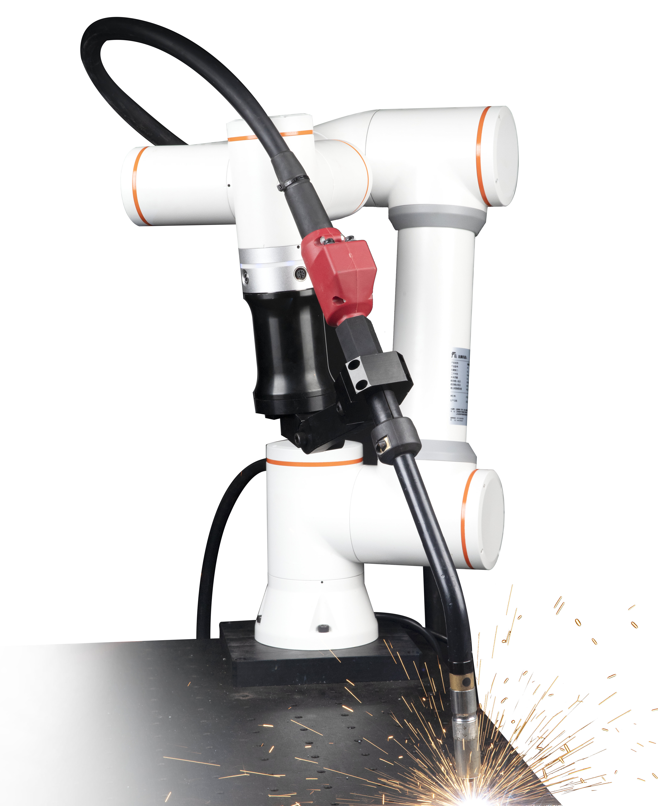

.. centered:: Figure 8.6‑2 Welding Torch Installed at Robot End

After the welding torch is fixed and installed, calibrate the welding torch tool coordinate system using the six-point method and apply it as the current tool coordinate system. The calibration accuracy of the welding torch tool coordinate system will affect the actual welding accuracy.

.. figure:: robot_peripherals/038.png
   :align: center
   :width: 4in

.. centered:: Figure 8.6-3 Robot Tool Coordinate System Calibration and Application

Welding Machine Parameter Configuration
~~~~~~~~~~~~~~~~~~~~~~~~~~~~~~~~~~~~~~~~~~~~~~~~~~~~~~

Collaborative robots can control the welding process through "Controller IO" signals or "Digital Communication Protocol". The configuration operations for these two methods mainly differ in the following two points:

① When using "Controller IO", it is necessary to set the correspondence between the actual controlled welding current/voltage and the control box analog output values.

② When using "Digital Communication Protocol", communication parameters need to be configured.

"Controller IO" Welding Control Configuration
++++++++++++++++++++++++++++++++++++++++++++++++++++++++++++++++++++++

In the "Initial" -> "Peripherals" -> "Welding Machine" menu bar, click the "Controller I/O" card to enter the interface.

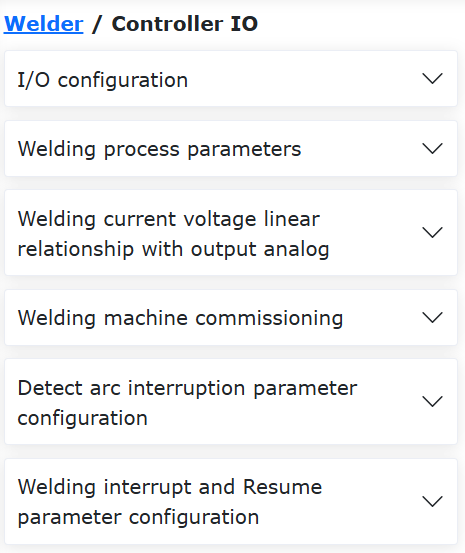

.. centered:: Figure 8.6-4 Controller I/O

Welding IO Signal Configuration
********************************************************

As shown in the figure below, select the DI input ports for the welder status signals and the DO output ports for the welder control signals, then click the "Configure" button. The meanings of each signal are as follows:

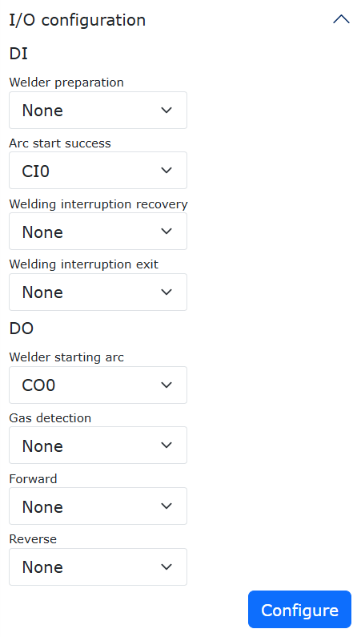

.. centered:: Figure 8.6-5 Set Welding Machine Signal Ports

**Welder Ready**: This signal is output from the welding machine to the robot when the welding machine is ready to perform welding operations.

When the welding machine is not ready due to faults or other reasons, this signal is not input to the robot. At this time, the robot WebApp prompt in the upper right corner "Welder not ready". If your welding machine does not have a welder ready signal, you can set this port to "None".

.. figure:: robot_peripherals/041.png
   :align: center
   :width: 3in

.. centered:: Figure 8.6-6 Welder Not Ready Error

.. figure:: robot_peripherals/042.png
   :align: center
   :width: 4in

.. centered:: Figure 8.6-7 Welder Ready Set to "None"

**Arc Success**: The arc has been successfully initiated. After the robot outputs the arc initiation signal to the welding machine, it waits for the arc success feedback signal from the welding machine. If the robot does not detect the arc success signal from the welding machine within the set timeout period, the robot reports an "Arc initiation timeout" error.

If the arc success signal is not configured, welding can still be performed using the robot welding function, but the robot will report a "Arc success DI not configured" warning. If your welding machine has an arc success signal output, we recommend configuring this signal for safer welding.

.. figure:: robot_peripherals/043.png
   :align: center
   :width: 3in

.. centered:: Figure 8.6-8 Arc Initiation Timeout Error
   
.. figure:: robot_peripherals/044.png
   :align: center
   :width: 3in

.. centered:: Figure 8.6-9 Arc Success DI Not Configured Warning

**Welding Interruption Recovery**: Triggered when the arc is unexpectedly interrupted during robot welding or the operator actively pauses welding. When this signal input to the robot changes from invalid to valid after a welding interruption, the robot automatically resumes welding from the original interruption position.

**Welding Interruption Exit**: Triggered when the arc is unexpectedly interrupted during robot welding or the operator actively pauses welding. When this signal input to the robot changes from invalid to valid after a welding interruption, the robot terminates welding. After termination, welding cannot be resumed.

**Welding Arc Initiation**: The DO output port through which the robot controls the welding machine to initiate the arc. When the robot program executes the arc initiation command, the corresponding DO output port for arc initiation automatically outputs a valid signal.

**Gas Detection**: The DO output port through which the robot controls the welding machine to supply gas. When the robot executes the welding gas supply command, the corresponding DO output port for gas supply automatically outputs a valid signal.

**Forward Wire Feed**: The DO output port through which the robot controls the welding machine for forward wire feeding. When the robot executes the forward wire feed command, the corresponding DO output port for forward wire feed automatically outputs a valid signal.

**Reverse Wire Feed**: The DO output port through which the robot controls the welding machine for reverse wire feeding. When the robot executes the reverse wire feed command, the corresponding DO output port for reverse wire feed automatically outputs a valid signal.

Welding Process Parameter Configuration
********************************************************

As shown in the figure below, find the "Welding Process Parameters" section on the welding configuration page. The collaborative robot provides 100 sets of welding process parameters, numbered 0 to 99. Process number 0 indicates not using the welding process curve, while process numbers 1-99 use the welding process curve.
   
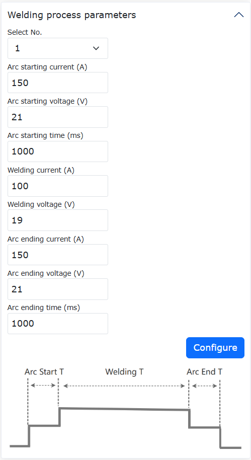

.. centered:: Figure 8.6-10 Welding Process Parameter Configuration

When using the welding process curve, take selecting welding process number 1 as an example. Input the parameters from Arc Initiation Current to Arc Closing Time as shown in Figure 8, then click the "Configure" button. The actual welding process represented by these parameters is as follows:

① Set welding current 200A, voltage 23V;
② Execute arc initiation, wait for arc success;
③ After arc success, maintain the arc for 500ms (Arc initiation time, robot does not move);
④ Set welding current 150A, welding voltage 21V, then the robot starts moving and performs welding;
⑤ After welding to the end point, set welding current to 100A, welding voltage to 19V (Arc closing current, Arc closing voltage);
⑥ After setting the arc closing current and voltage, maintain arc burning for 500ms (robot does not move), finally extinguish the arc.

When not using the welding process curve, i.e., selecting welding process parameter number 0, as shown below, the welding process is:
① Set welding current and welding voltage;
② The robot controls the welding machine to initiate the arc and waits for arc success;
③ After arc success, the robot starts moving and performs welding;
④ The robot extinguishes the arc immediately after welding to the end point.
   
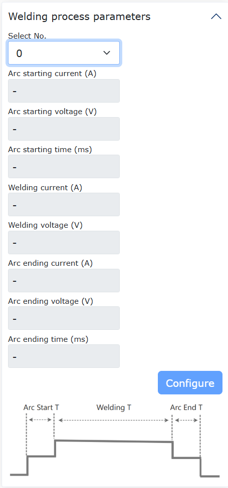

.. centered:: Figure 8.6-11 Not Using Welding Process Curve

Setting the Relationship Diagram Between Welding Current/Voltage and Analog Output
***************************************************************************************************************************

When the collaborative robot welding control type is selected as "Controller IO", the welding current and voltage values are controlled by the magnitude of the control box analog output (control box analog output voltage range is 0 ~ 10V). At this time, it is necessary to configure the linear correspondence between the control box analog output value and the actual welding current and welding voltage values.

As shown in Figure 12, find the "Analog Current Voltage Relationship Diagram" on the welding machine configuration page. "A-V" represents the correspondence between welding current and the control box output analog voltage, and "V-V" represents the correspondence between welding voltage and the control box output analog voltage.

Select "A-V", input the welding current range 0-1000A, analog output voltage 0-10V, output AO as "Ctrl-AO0" (the analog output port for welding current control is AO0), click the "Configure" button; Under these parameters, when the control box outputs an analog voltage of 1.5V, it corresponds to a welding current of 150A.
   
.. figure:: robot_peripherals/047.png
   :align: center
   :width: 4in

.. centered:: Figure 8.6-12 Welding Current vs Output Analog Correspondence Configuration

As shown in Figure 13, click "V-V" to set the correspondence between welding voltage and the control box analog output voltage. Input the welding voltage range as 0-60V, the analog output voltage value as 0-10V, and the output AO as "Ctrl-AO1" (the analog output port for welding voltage control is AO1), then click the "Configure" button. In this case, if the control box AO1 analog output is 3.5V, it actually controls the welding voltage to be 21V.
   
.. figure:: robot_peripherals/048.png
   :align: center
   :width: 4in

.. centered:: Figure 8.6-13 Welding Voltage vs Output Analog Correspondence Configuration

Welding Machine Debugging
**********************************************

As shown in Figure 14, find "Welding Machine Debugging" on the welding machine configuration page. Select process number 1, input the timeout time as 1000ms, click "Gas On", and the robot will control the welding machine to start supplying shielding gas. Click the "Gas Off" button, and the robot will control the welding machine to stop supplying shielding gas. The operation methods for other buttons like "Arc Start", "Forward Wire Feed", "Reverse Wire Feed", etc., are the same and will not be repeated.
   
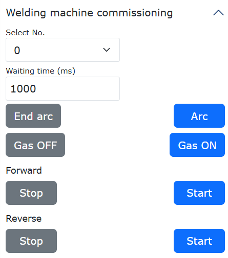

.. centered:: Figure 8.6-14 Welding Machine Debugging

"Digital Communication Protocol (UDP)" Welding Control Configuration
+++++++++++++++++++++++++++++++++++++++++++++++++++++++++++++++++++++++++++++++++++++++++++++++++++++++++

When the robot uses the "Digital Communication Protocol" for welding control, it essentially communicates with a PLC via UDP. The robot transmits control data such as arc initiation, wire feeding, gas supply, current, and voltage to the PLC via UDP communication. The PLC then further controls the welding machine via CANOpen bus (or other methods). Simultaneously, the PLC collects actual welding current, voltage, and arc success signals and feeds them back to the robot. (Refer to Appendix 1 for the robot UDP communication protocol content).

In the "Initial" -> "Peripherals" menu bar, click "Welding Machine" to enter the welding machine configuration interface. As shown below:
   
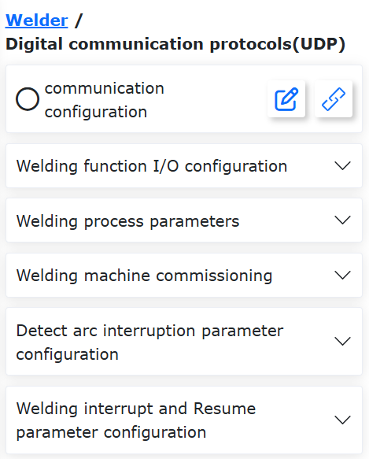

.. centered:: Figure 8.6-15 Digital Communication Protocol (UDP)

Since the robot communicates with the PLC via UDP, UDP communication parameters need to be configured. The meanings of these parameters are as follows:

**IP Address**: The IP address of the PLC end for UDP communication.
**Port Number**: The UDP communication port number on the PLC end.
**Communication Cycle**: The cycle for UDP communication between the robot and the PLC, default is 2ms.
**Packet Loss Detection Cycle, Packet Loss Count**: When the number of lost packets within the packet loss detection cycle exceeds the set value, the robot reports a "UDP communication packet loss exception" error and automatically cuts off the communication.
**Communication Interruption Confirmation Duration**: If the robot does not receive a complete frame of PLC feedback data within this duration, it reports a "UDP communication interruption" error alarm and cuts off the UDP communication.
**Auto-reconnect after Power Restart**: Whether the robot automatically attempts to reconnect and recover after detecting a robot power restart.
**Auto-reconnect after Communication Interruption**: Whether the robot automatically attempts to reconnect and recover after detecting a UDP communication interruption.
**Reconnection Cycle, Reconnection Count**: When auto-reconnect after UDP communication interruption is enabled and a interruption is detected, the robot attempts reconnection at the set cycle. If the reconnection count reaches the maximum set value and the connection is still not successful, the robot reports a "UDP communication interruption" error alarm and cuts off the UDP communication.

After configuring the above parameters, click the "Configure" button. After successful configuration, click the "Load" button.
   
.. figure:: robot_peripherals/051.png
   :align: center
   :width: 4in

.. centered:: Figure 8.6-16 UDP Communication Configuration

.. note::
   .. image:: robot_peripherals/052.png
      :height: 0.75in
      :align: left

   Name: **Edit Button**
   
   Function: Open/Close UDP communication parameter configuration

.. note::
   .. image:: robot_peripherals/053.png
      :height: 0.75in
      :align: left

   Name: **Load Button**
   
   Function: Load UDP communication

Welding IO Signal Configuration
********************************************************

Select the DI input ports for the welder status signals and the DO output ports for the welder control signals, then click the "Configure" button. The meanings of each signal are as follows:
   
.. figure:: robot_peripherals/054.png
   :align: center
   :width: 4in

.. centered:: Figure 8.6-17 Set Welding Machine Signal Ports

**Welder Ready**: This signal is output from the welding machine to the robot when the welding machine is ready to perform welding operations.

When the welding machine is not ready due to faults or other reasons, this signal is not input to the robot. At this time, the robot WebApp prompt in the upper right corner "Welder not ready". If your welding machine does not have a welder ready signal, you can set this port to "-1".
   
.. figure:: robot_peripherals/041.png
   :align: center
   :width: 3in

.. centered:: Figure 8.6-18 Welder Not Ready Error
   
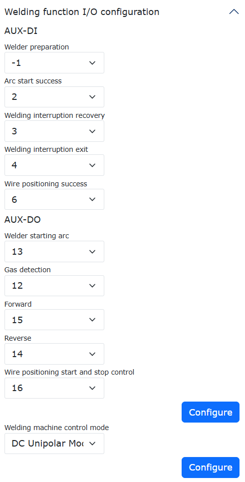

.. centered:: Figure 8.6-19 Welder Ready Set to "-1"

**Arc Success**: The arc has been successfully initiated. After the robot outputs the arc initiation signal to the welding machine, it waits for the arc success feedback signal from the welding machine. If the robot does not detect the arc success signal from the welding machine within the set timeout period, the robot reports an "Arc initiation timeout" error.

If the arc success signal is not configured, welding can still be performed using the robot welding function, but the robot will report a "Arc success DI not configured" warning. If your welding machine has an arc success signal output, we recommend configuring this signal for safer welding.
   
.. figure:: robot_peripherals/043.png
   :align: center
   :width: 3in

.. centered:: Figure 8.6-20 Arc Initiation Timeout Error	
      
.. figure:: robot_peripherals/044.png
   :align: center
   :width: 3in

.. centered:: Figure 8.6-21 Arc Success DI Not Configured Warning

**Welding Interruption Recovery**: Triggered when the arc is unexpectedly interrupted during robot welding or the operator actively pauses welding. When this signal input to the robot changes from invalid to valid after a welding interruption, the robot automatically resumes welding from the original interruption position.

**Welding Interruption Exit**: Triggered when the arc is unexpectedly interrupted during robot welding or the operator actively pauses welding. When this signal input to the robot changes from invalid to valid after a welding interruption, the robot terminates welding. After termination, welding cannot be resumed.

**Welding Arc Initiation**: The DO output port through which the robot controls the welding machine to initiate the arc. When the robot program executes the arc initiation command, the corresponding DO output port for arc initiation automatically outputs a valid signal.

**Gas Detection**: The DO output port through which the robot controls the welding machine to supply gas. When the robot executes the welding gas supply command, the corresponding DO output port for gas supply automatically outputs a valid signal.

**Forward Wire Feed**: The DO output port through which the robot controls the welding machine for forward wire feeding. When the robot executes the forward wire feed command, the corresponding DO output port for forward wire feed automatically outputs a valid signal.

**Reverse Wire Feed**: The DO output port through which the robot controls the welding machine for reverse wire feeding. When the robot executes the reverse wire feed command, the corresponding DO output port for reverse wire feed automatically outputs a valid signal.

Welding Process Parameter Configuration
********************************************************

As shown in Figure 22, find the "Welding Process Parameters" section on the welding configuration page. The collaborative robot provides 100 sets of welding process parameters, numbered 0 to 99. Process number 0 indicates not using the welding process curve, while process numbers 1-99 use the welding process curve.
      

.. centered:: Figure 8.6-22 Welding Process Parameter Configuration

When using the welding process curve, take selecting welding process number 1 as an example. Input the parameters from Arc Initiation Current to Arc Closing Time as shown in Figure 8, then click the "Configure" button. The actual welding process represented by these parameters is as follows:

① Set welding current 200A, voltage 23V;
② Execute arc initiation, wait for arc success;
③ After arc success, maintain the arc for 500ms (Arc initiation time, robot does not move);
④ Set welding current 150A, welding voltage 21V, then the robot starts moving and performs welding;
⑤ After welding to the end point, set welding current to 100A, welding voltage to 19V (Arc closing current, Arc closing voltage);
⑥ After setting the arc closing current and voltage, maintain arc burning for 500ms (robot does not move), finally extinguish the arc.

When not using the welding process parameters, i.e., selecting welding process parameter number 0, the welding process is:
① Set the corresponding welding current and welding voltage via the set current/voltage interface;
② The robot controls the welding machine to initiate the arc and waits for arc success;
③ After arc success, the robot starts moving and performs welding;
④ The robot extinguishes the arc immediately after welding to the end point.
      

.. centered:: Figure 8.6-23 Not Using Welding Process Curve

Welding Machine Debugging
**********************************************

Find "Welding Machine Debugging" on the welding machine configuration page. Select process number 1, input the timeout time as 1000ms, click "Gas On", and the robot will control the welding machine to start supplying shielding gas. Click the "Gas Off" button, and the robot will control the welding machine to stop supplying shielding gas. The operation methods for other buttons like "Arc Start", "Forward Wire Feed", "Reverse Wire Feed", etc., are the same and will not be repeated.

.. centered:: Figure 8.5-24 Welding Machine Debugging

Welding Program Writing
~~~~~~~~~~~~~~~~~~~~~~~~~~~~~~~~~~~~~~~~~~~~~~~~~~~~~~

Writing Programs Using Welding Process Curves
++++++++++++++++++++++++++++++++++++++++++++++++++++++++++++++++++++++++

When using the welding process curve (i.e., selecting welding process parameter numbers 1 ~ 99), the voltage and current control during the welding process follows the curve parameters set for a specific process number, and there is no need to separately add instructions to set welding voltage and current. As shown in Figure 25, click "Teach" -> "Program Programming", and create a new user program "testWeld.lua".

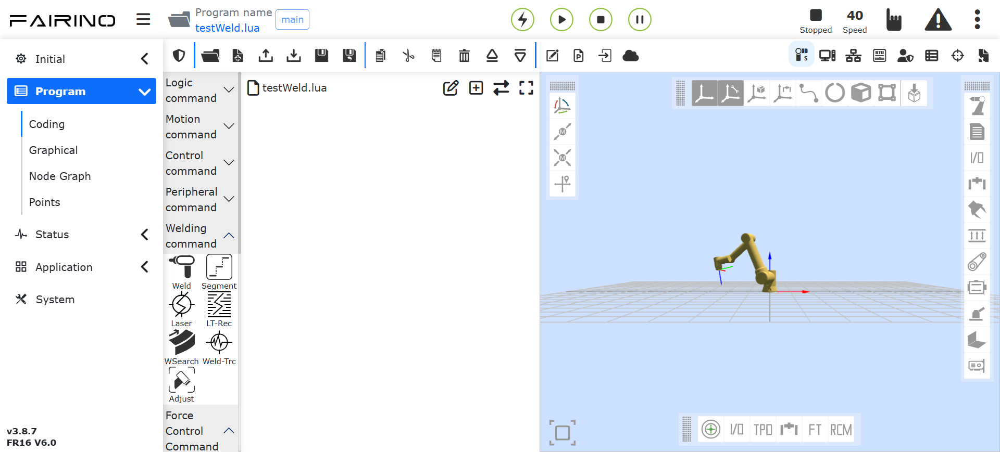

.. centered:: Figure 8.6-25 Create "testWeld.lua" Program

In the opened welding instruction addition page, select the control type as "Controller I/O" (select based on the actual configured welding control method), select the welding process number as 1 (Process number 0 does not use the welding process curve, numbers 1-99 do), set the maximum wait time as 10000ms, click the "Arc Start" button and then the "Arc Close" button sequentially, and finally click "Apply".

.. figure:: robot_peripherals/057.png
   :align: center
   :width: 6in

.. centered:: Figure 8.6-26 Welding Instruction Addition

Now the "testWeld.lua" program has added the welding arc start instruction and the welding arc close instruction. Since the arc start and close operations selected welding process curve number 1, the voltage and current control during the welding process follows the curve parameters set for process number 1, and there is no need to separately add instructions to set welding voltage and current.

.. figure:: robot_peripherals/058.png
   :align: center
   :width: 6in

.. centered:: Figure 8.6-27 Arc Start and Close Program

Add two linear motion instructions and adjust the instruction order so that the robot first moves to point "P1", executes arc start, then moves to point "P2", and executes arc close, achieving welding from point "P1" to point "P2".

.. figure:: robot_peripherals/059.png
   :align: center
   :width: 6in

.. centered:: Figure 8.6-28 Robot Welding from Point P1 to P2

Writing Programs Without Using Welding Process Curves
++++++++++++++++++++++++++++++++++++++++++++++++++++++++++++++++++++++++

When not using the welding process curve (i.e., selecting welding process parameter number 0), instructions to set welding voltage and current must be added to the welding program to control the actual welding parameters. Click "Teach" -> "Program Teaching", and create a new user program "testWeld.lua".

.. centered:: Figure 8.6-29 Create "testWeld.lua" Program

In the opened welding instruction addition page, select the control type as "Controller I/O" (select based on the actual configured welding control method), select the welding process number as 0 (Process number 0 does not use the welding process curve, numbers 1-99 do), set the welding current control AO as "Ctrl-AO0", welding current as 150A, click the "Add" button; set the welding voltage control AO as "Ctrl-AO1", welding voltage as 21V, click the "Add" button; set the maximum wait time as 10000ms, click the "Arc Start" button and then the "Arc Close" button sequentially, and finally click "Apply".

.. figure:: robot_peripherals/057.png
   :align: center
   :width: 6in

.. centered:: Figure 8.6-30 Welding Instruction Addition

Now the "testWeld.lua" program has added the welding arc start instruction and the welding arc close instruction. Since the arc start and close instructions selected welding process number 0, when the program executes the set welding voltage and current instructions, the robot will automatically output the corresponding control box analog signal based on the set welding voltage and current values and the "Welding voltage, current vs output analog correspondence" set in the welding machine configuration page.

.. figure:: robot_peripherals/060.png
   :align: center
   :width: 6in

.. centered:: Figure 8.6-31 Set Welding Voltage, Current, Arc Start, Arc Close Program

Add two linear motion instructions and adjust the instruction order so that the robot first moves to point "P1", executes arc start, then moves to point "P2", and executes arc close, achieving welding from point "P1" to point "P2".

.. figure:: robot_peripherals/061.png
   :align: center
   :width: 6in 

.. centered:: Figure 8.6-32 Robot Welding from Point P1 to P2

Running the above program will achieve welding along a straight line P1 ~ P2. Before running the program, please check:
① Whether the welding torch is correctly installed, whether the welding torch tool coordinate system has been calibrated, and applied as the current tool coordinate system;
② Whether the welding power supply, gas path, and wire feed path are working normally;
③ Whether the signal line connections between the robot and the welding machine are normal.

Welding Interruption and Recovery
~~~~~~~~~~~~~~~~~~~~~~~~~~~~~~~~~~~~~~~~~~~~~~~~~~~~~~

Welding interruption may occur during robot welding under the following circumstances:
① The operator actively pauses welding to observe the actual welding condition or perform operations like cleaning the nozzle;
② Unexpected welding arc interruption;
③ The robot collides, causing welding to pause;

After a welding interruption occurs during robot welding, the operator can switch the robot to manual mode, drag the robot to a safe position, and address the cause of the interruption.

After the issue is resolved, the collaborative robot can automatically move from the current position back to the position where the welding interruption occurred, re-ignite the arc, and resume welding. The specific operation process is:
① Configure welding interruption recovery parameters;
② Execute the welding program, pause welding during the process to cause an interruption;
③ Switch the robot to manual mode, handle the relevant issues, then switch the robot back to automatic mode after completion;
④ Click the "Resume Welding" button, and the robot automatically resumes welding.

Welding Interruption Recovery Parameter Configuration
+++++++++++++++++++++++++++++++++++++++++++++++++++++++++++++++++++++++++++++++++++++++

In the "Initial" -> "Peripherals" menu bar, click "Welding Machine" to enter the welding machine configuration interface. Find the "Detect Arc Interruption Parameter Configuration" section, turn on "Function Enable", input "Confirmation Duration" as 20ms, click the "Configure" button. This means that if the arc success signal remains invalid for more than 20ms during welding, the robot will report a "Welding arc interruption" error.

.. figure:: robot_peripherals/062.png
   :align: center
   :width: 4in 

.. centered:: Figure 8.6-33 Detect Arc Interruption Parameter Configuration

Find the "Welding Interruption Recovery Parameter Configuration" section, turn on "Function Enable", input "Overlap Distance" as 5mm, "Speed" as 10%, "Motion Mode" as "PTP", click the "Configure" button. The explanations for these three parameters are as follows:

**Overlap Distance**: To ensure the continuity between the resumed weld and the weld before the interruption, the arc restart point for welding recovery needs to have a certain overlap distance with the original weld.

**Speed**: After a welding interruption, the robot often needs to be moved to a safe position and the weld needs to be treated. After treatment is completed and welding recovery is executed, the robot will move from the current position to the welding restart point. This "Speed" indicates the speed at which the robot moves to the restart point.

**Motion Mode**: After a welding interruption, the robot often needs to be moved to a safe position and the weld needs to be treated. After treatment is completed and welding recovery is executed, the robot will move from the current position to the welding restart point. This "Motion Mode" indicates the motion mode used by the robot to move to the restart point, with "LIN" and "PTP" available for selection.

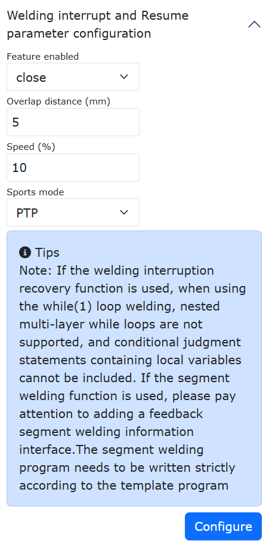

.. centered:: Figure 8.6-34 Welding Interruption Recovery Parameter Configuration

Welding Interruption Recovery Application
++++++++++++++++++++++++++++++++++++++++++++++++++++++++++

Take the "testWeld" program as an example. Switch the robot to automatic mode, click the start button, and the robot begins welding. During welding, click the pause button. At this point, welding is interrupted, and a welding interruption recovery prompt box pops up in the WebApp right corner. Click the "Resume Welding" button, and the robot automatically moves to the restart point and executes the subsequent welding tasks.

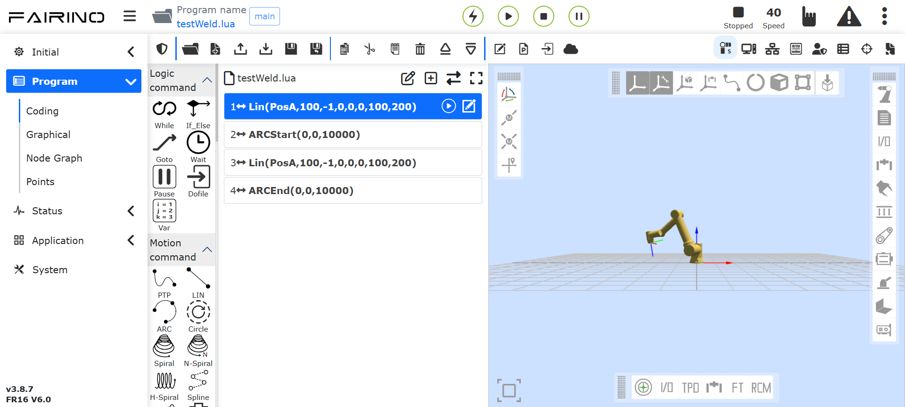

.. centered:: Figure 8.6-35 Execute Welding Program

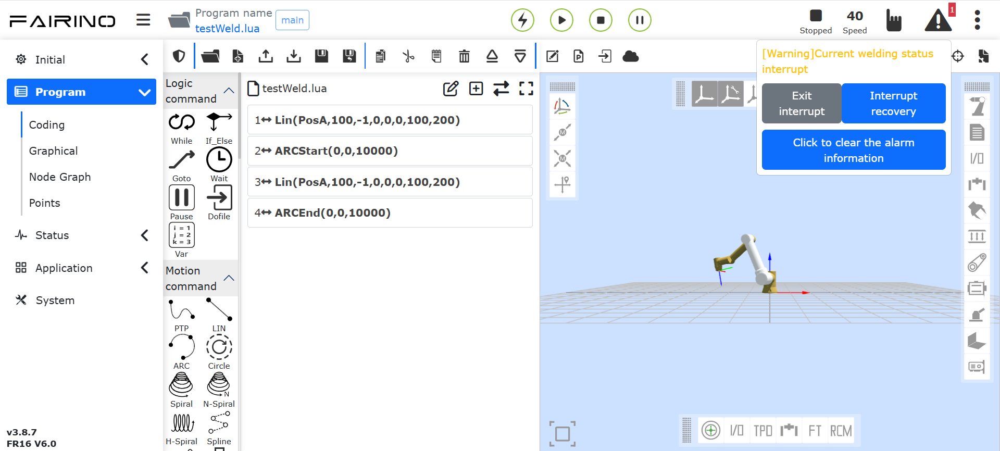

.. centered:: Figure 8.6-36 Welding Recovery

.. warning::
   The collaborative robot welding interruption recovery function can only be used for linear welds or circular arc welds. When using a while (1) loop for welding, nested multi-layer while loops are not supported, and conditional judgment statements containing local variables cannot be included. If using stitch welding function, please pay attention to adding the interface for feedback stitch welding information.

Attachment 1: Robot UDP Communication Protocol
~~~~~~~~~~~~~~~~~~~~~~~~~~~~~~~~~~~~~~~~~~~~~~~~~~~~~~~~~~~~~~~~~~~~~~~~~~~~~~

.. warning::
  1) CRC check method: Uses modbus 16 check but only takes the lower 8 bits for verification. The data areas for verification are D100-D176, D200-D273.

  2) Arc Tracking: The actual current feedback converts the actual current obtained by the PLC from the welder into an analog value of 0-4095 and transmits it to the analog channel 0 of the UDP data protocol, i.e., D168.

  3) Speed conversion logic: Robot issued speed (unit mm/s) V ÷ lead × 60 = V';
     PLC converts the robot issued speed V' × encoder resolution ÷ 60 = V" (unit pulse/s).

Robot Controller -> PLC
++++++++++++++++++++++++++++++++++++++++++++

.. list-table::
   :widths: 10 10 10 10 20
   :header-rows: 1
   :align: center

   * - No.
     - Register Address
     - Data Type
     - Data Value
     - Variable Name

   * - 1
     - D199
     - INT
     - 0x5A5A
     - Frame Header

   * - 2
     - D200
     - INT
     -
     - 1# Motor Control Word

   * - 3
     - D201
     - DINT
     -
     - 1# Target Position Input

   * - 4
     - D202
     - DINT
     -
     - 1# Target Position Input

   * - 5
     - D203
     - INT
     -
     - 1# Homing Control Word

   * - 6
     - D204
     - DINT
     -
     - 1# Homing High Speed Input

   * - 7
     - D205
     - DINT
     -
     - 1# Homing High Speed Input

   * - 8
     - D206
     - DINT
     -
     - 1# Homing Low Speed Input

   * - 9
     - D207
     - DINT
     -
     - 1# Homing Low Speed Input

   * - 10
     - D208
     - DINT
     -
     - 1# Position Offset (Reserved)

   * - 11
     - D209
     - DINT
     -
     - 1# Position Offset (Reserved)

   * - 12
     - D210
     - DINT
     -
     - 1# Speed Offset (Reserved)

   * - 13
     - D211
     - DINT
     -
     - 1# Speed Offset (Reserved)

   * - 14
     - D212
     - DINT
     -
     - 1# Torque Offset (Reserved)

   * - 15
     - D213
     - DINT
     -
     - 1# Torque Offset (Reserved)

   * - 16
     - D214
     - INT
     -
     - 2# Motor Control Word

   * - 17
     - D215
     - DINT
     -
     - 2# Target Position Input

   * - 18
     - D216
     - DINT
     -
     - 2# Target Position Input

   * - 19
     - D217
     - INT
     -
     - 2# Homing Control Word

   * - 20
     - D218
     - DINT
     -
     - 2# Homing High Speed Input

   * - 21
     - D219
     - DINT
     -
     - 2# Homing High Speed Input

   * - 22
     - D220
     - DINT
     -
     - 2# Homing Low Speed Input

   * - 23
     - D221
     - DINT
     -
     - 2# Homing Low Speed Input

   * - 24
     - D222
     - DINT
     -
     - 2# Position Offset (Reserved)

   * - 25
     - D223
     - DINT
     -
     - 2# Position Offset (Reserved)

   * - 26
     - D224
     - DINT
     -
     - 2# Speed Offset (Reserved)

   * - 27
     - D225
     - DINT
     -
     - 2# Speed Offset (Reserved)

   * - 28
     - D226
     - DINT
     -
     - 2# Torque Offset (Reserved)

   * - 29
     - D227
     - DINT
     -
     - 2# Torque Offset (Reserved)

   * - 30
     - D228
     - INT
     -
     - 3# Motor Control Word

   * - 31
     - D229
     - DINT
     -
     - 3# Target Position Input

   * - 32
     - D230
     - DINT
     -
     - 3# Target Position Input

   * - 33
     - D231
     - INT
     -
     - 3# Homing Control Word

   * - 34
     - D232
     - DINT
     -
     - 3# Homing High Speed Input

   * - 35
     - D233
     - DINT
     -
     - 3# Homing High Speed Input

   * - 36
     - D234
     - DINT
     -
     - 3# Homing Low Speed Input

   * - 37
     - D235
     - DINT
     -
     - 3# Homing Low Speed Input

   * - 38
     - D236
     - DINT
     -
     - 3# Position Offset (Reserved)

   * - 39
     - D237
     - DINT
     -
     - 3# Position Offset (Reserved)

   * - 40
     - D238
     - DINT
     -
     - 3# Speed Offset (Reserved)

   * - 41
     - D239
     - DINT
     -
     - 3# Speed Offset (Reserved)

   * - 42
     - D240
     - DINT
     -
     - 3# Torque Offset (Reserved)

   * - 43
     - D241
     - DINT
     -
     - 3# Torque Offset (Reserved)

   * - 44
     - D242
     - INT
     -
     - 4# Motor Control Word

   * - 45
     - D243
     - DINT
     -
     - 4# Target Position Input

   * - 46
     - D244
     - DINT
     -
     - 4# Target Position Input

   * - 47
     - D245
     - INT
     -
     - 4# Homing Control Word

   * - 48
     - D246
     - DINT
     -
     - 4# Homing High Speed Input

   * - 49
     - D247
     - DINT
     -
     - 4# Homing High Speed Input

   * - 50
     - D248
     - DINT
     -
     - 4# Homing Low Speed Input

   * - 51
     - D249
     - DINT
     -
     - 4# Homing Low Speed Input

   * - 52
     - D250
     - DINT
     -
     - 4# Position Offset (Reserved)

   * - 53
     - D251
     - DINT
     -
     - 4# Position Offset (Reserved)

   * - 54
     - D252
     - DINT
     -
     - 4# Speed Offset (Reserved)

   * - 55
     - D253
     - DINT
     -
     - 4# Speed Offset (Reserved)

   * - 56
     - D254
     - INT
     -
     - Reserved

   * - 57
     - D255
     - INT
     -
     - Welding Mode Setting (0-DC Mono, 1-Pulse Mono, 2-JOB Mode, 3-Local Control Mode, 4-Separate Mode, 5-CC/CV, 6-TIG, 7-CMT Mode)

   * - 58
     - D256
     - INT
     -
     - General Output DO(0-15)

   * - 59
     - D257
     - INT
     -
     - General Output DO(16-31)

   * - 60
     - D258
     - INT
     -
     - General Output DO(32-47)

   * - 61
     - D259
     - INT
     -
     - General Output DO(48-63)

   * - 62
     - D260
     - INT
     -
     - General Output DO(64-79)

   * - 63
     - D261
     - INT
     -
     - General Output DO(80-95)

   * - 64
     - D262
     - INT
     -
     - High-Speed Output DO(96-111)

   * - 65
     - D263
     - INT
     -
     - High-Speed Output DO(112-127)

   * - 66
     - D264
     - INT
     -
     - Analog Output AO0

   * - 67
     - D265
     - INT
     -
     - Analog Output AO1

   * - 68
     - D266
     - INT
     -
     - Analog Output AO2

   * - 69
     - D267
     - INT
     -
     - Analog Output AO3

   * - 70
     - D268
     - REAL
     -
     - Issued Welding Voltage

   * - 71
     - D269
     - REAL
     -
     - Issued Welding Voltage

   * - 72
     - D270
     - REAL
     -
     - Issued Welding Current

   * - 73
     - D271
     - REAL
     -
     - Issued Welding Current

   * - 74
     - D272
     - REAL
     -
     - Packet Loss Detection Cycle

   * - 75
     - D273
     - INT
     -
     - Number of Lost Packets

   * - 76
     - D274
     - INT
     -
     - Frame Count (0-255)

   * - 77
     - D275
     - INT
     -
     - CRC Check Code

PLC -> Robot Controller
++++++++++++++++++++++++++++++++++++++++++

.. list-table::
   :widths: 10 10 10 10 20
   :header-rows: 1
   :align: center

   * - No.
     - Register Address
     - Data Type
     - Data Value
     - Variable Name

   * - 1
     - D99
     - INT
     - 0x5A5A
     - Frame Header

   * - 2
     - D100
     - INT
     -
     - 1# Motor Status Word

   * - 3
     - D101
     - DINT
     -
     - 1# Current Position

   * - 4
     - D102
     - DINT
     -
     - 1# Current Position

   * - 5
     - D103
     - INT
     -
     - 1# Homing Status Word

   * - 6
     - D104
     - DINT
     -
     - 1# Homing High Speed Feedback

   * - 7
     - D105
     - DINT
     -
     - 1# Homing High Speed Feedback

   * - 8
     - D106
     - DINT
     -
     - 1# Homing Low Speed Feedback

   * - 9
     - D107
     - DINT
     -
     - 1# Homing Low Speed Feedback

   * - 10
     - D108
     - INT
     -
     - 1# Fault Code

   * - 11
     - D109
     - DINT
     -
     - 1# Following Deviation (Reserved)

   * - 12
     - D110
     - DINT
     -
     - 1# Following Deviation (Reserved)

   * - 13
     - D111
     - DINT
     -
     - 1# Speed Feedback (Reserved)

   * - 14
     - D112
     - DINT
     -
     - 1# Speed Feedback (Reserved)

   * - 15
     - D113
     - DINT
     -
     - 1# Real-time Torque (Reserved)

   * - 16
     - D114
     - DINT
     -
     - 1# Real-time Torque (Reserved)

   * - 17
     - D115
     - INT
     -
     - 2# Motor Status Word

   * - 18
     - D116
     - DINT
     -
     - 2# Current Position

   * - 19
     - D117
     - DINT
     -
     - 2# Current Position

   * - 20
     - D118
     - INT
     -
     - 2# Homing Status Word

   * - 21
     - D119
     - DINT
     -
     - 2# Homing High Speed Feedback

   * - 22
     - D120
     - DINT
     -
     - 2# Homing High Speed Feedback

   * - 23
     - D121
     - DINT
     -
     - 2# Homing Low Speed Feedback

   * - 24
     - D122
     - DINT
     -
     - 2# Homing Low Speed Feedback

   * - 25
     - D123
     - INT
     -
     - 2# Fault Code

   * - 26
     - D124
     - DINT
     -
     - 2# Following Deviation (Reserved)

   * - 27
     - D125
     - DINT
     -
     - 2# Following Deviation (Reserved)

   * - 28
     - D126
     - DINT
     -
     - 2# Speed Feedback (Reserved)

   * - 29
     - D127
     - DINT
     -
     - 2# Speed Feedback (Reserved)

   * - 30
     - D128
     - DINT
     -
     - 2# Real-time Torque (Reserved)

   * - 31
     - D129
     - DINT
     -
     - 2# Real-time Torque (Reserved)

   * - 32
     - D130
     - INT
     -
     - 3# Motor Status Word

   * - 33
     - D131
     - DINT
     -
     - 3# Current Position

   * - 34
     - D132
     - DINT
     -
     - 3# Current Position

   * - 35
     - D133
     - INT
     -
     - 3# Homing Status Word

   * - 36
     - D134
     - DINT
     -
     - 3# Homing High Speed Feedback

   * - 37
     - D135
     - DINT
     -
     - 3# Homing High Speed Feedback

   * - 38
     - D136
     - DINT
     -
     - 3# Homing Low Speed Feedback

   * - 39
     - D137
     - DINT
     -
     - 3# Homing Low Speed Feedback

   * - 40
     - D138
     - DINT
     -
     - 3# Fault Code

   * - 41
     - D139
     - DINT
     -
     - 3# Following Deviation (Reserved)

   * - 42
     - D140
     - DINT
     -
     - 3# Following Deviation (Reserved)

   * - 43
     - D141
     - DINT
     -
     - 3# Speed Feedback (Reserved)

   * - 44
     - D142
     - DINT
     -
     - 3# Speed Feedback (Reserved)

   * - 45
     - D143
     - DINT
     -
     - 3# Real-time Torque (Reserved)

   * - 46
     - D144
     - DINT
     -
     - 3# Real-time Torque (Reserved)

   * - 47
     - D145
     - INT
     -
     - 4# Motor Status Word

   * - 48
     - D146
     - DINT
     -
     - 4# Current Position

   * - 49
     - D147
     - DINT
     -
     - 4# Current Position

   * - 50
     - D148
     - INT
     -
     - 4# Homing Status Word

   * - 51
     - D149
     - DINT
     -
     - 4# Homing High Speed Feedback

   * - 52
     - D150
     - DINT
     -
     - 4# Homing High Speed Feedback

   * - 53
     - D151
     - DINT
     -
     - 4# Homing Low Speed Feedback

   * - 54
     - D152
     - DINT
     -
     - 4# Homing Low Speed Feedback

   * - 55
     - D153
     - DINT
     -
     - 4# Fault Code

   * - 56
     - D154
     - DINT
     -
     - 4# Following Deviation (Reserved)

   * - 57
     - D155
     - DINT
     -
     - 4# Following Deviation (Reserved)

   * - 58
     - D156
     - DINT
     -
     - 4# Speed Feedback (Reserved)

   * - 59
     - D157
     - DINT
     -
     - 4# Speed Feedback (Reserved)

   * - 60
     - D158
     - DINT
     -
     - Real-time Torque (Reserved)

   * - 61
     - D159
     - DINT
     -
     - Real-time Torque (Reserved)

   * - 62
     - D160
     - INT
     -
     - General Input DI(0-15)

   * - 63
     - D161
     - INT
     -
     - General Input DI(16-31)

   * - 64
     - D162
     - INT
     -
     - General Input DI(32-47)

   * - 65
     - D163
     - INT
     -
     - General Input DI(48-63)

   * - 66
     - D164
     - INT
     -
     - General Input DI(64-79)

   * - 67
     - D165
     - INT
     -
     - General Input DI(80-95)

   * - 68
     - D166
     - INT
     -
     - High-Speed Input DI(96-111)

   * - 69
     - D167
     - INT
     -
     - High-Speed Input DI(112-127)

   * - 70
     - D168
     - INT
     -
     - Analog Input AI0

   * - 71
     - D169
     - INT
     -
     - Analog Input AI1

   * - 72
     - D170
     - INT
     -
     - Analog Input AI2

   * - 73
     - D171
     - INT
     -
     - Analog Input AI3

   * - 74
     - D172
     - REAL
     -
     - Actual Current Feedback

   * - 75
     - D173
     - REAL
     -
     - Actual Current Feedback

   * - 76
     - D174
     - REAL
     -
     - Actual Voltage Feedback

   * - 77
     - D175
     - REAL
     -
     - Actual Voltage Feedback

   * - 78
     - D176
     - INT
     -
     - Fault Code 0-No Fault, 1-Data Packet Loss

   * - 79
     - D177
     - INT
     -
     - Frame Count

   * - 80
     - D178
     - INT
     -
     - CRC Check Code

Digital Communication Protocol (Modbus TCP)
~~~~~~~~~~~~~~~~~~~~~~~~~~~~~~~~~~~~~~~~~~~~~~~~~~~~~~~~~~~~~~~~~~~~~~~~

Click "Initial" -> "Peripherals" -> "Welder" to enter the welder interface, then click the "Digital Communication Protocol (Modbus TCP)" card to enter the Welder Open Protocol interface.

Protocol Configuration
++++++++++++++++++++++++++++++++++++++++++

In the Open Protocol Configuration, click the "Upload" button to upload the completed Open Protocol LUA program file to the controller. Select an Open Protocol ID and Open Protocol Name, then click the "Configure" button (the selected Protocol ID must match the ID written in the Open Protocol file) to assign an ID to each open protocol.

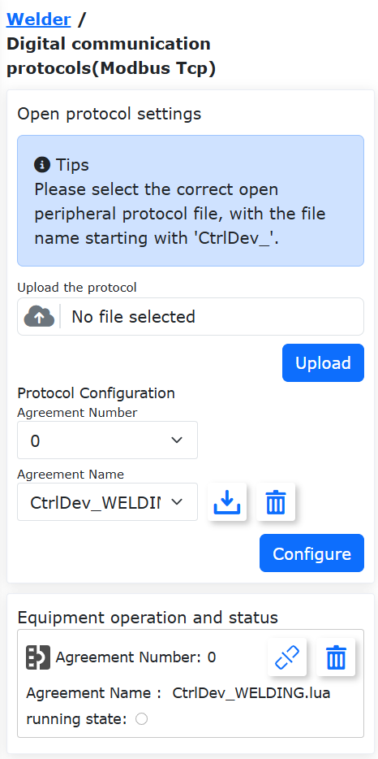

.. centered:: Chart 8.6‑37 Controller Peripheral Open Protocol Upload and Configuration

In the configured protocol list, click the "Load" button. The running status indicator lights up, indicating that the open protocol has been loaded successfully.

.. figure:: robot_peripherals/067.png
   :align: center
   :width: 4in

.. centered:: Chart 8.6-38 Controller Peripheral Open Protocol Loading and Running Indication

Welder Open Protocol
++++++++++++++++++++++++++++++++++++++++++

The robot communicates with the welder via the controller peripheral open protocol using ModbusTCP. Write the corresponding communication protocol LUA file according to the welder slave register definitions. Configure communication parameters such as the welder IP address, port number, and register addresses for arc start control, wire feed control, etc., in this file. Upload this protocol to the robot controller and load it to enable communication between the robot and the welder.

Welder Open Protocol Example
************************************************

.. code-block:: console
   :linenos:

   local id = 1 --Protocol number, must match the protocol number configured in WebApp
   local ctrlValues = {0, 0, 0, 0, 0, 0}
   local realTimeState = {0, 0, 0, 0, 0, 0, 0, 0, 0, 0, 0, 0, 0, 0, 0, 0, 0, 0, 0, 0}
   ModbusTCPMasterClose(id)
   ModbusTCPMasterCreate('192.168.58.45', 502, 1, id)
   while(1) do
   setArcStart, setWireForward, setWireReverse, setShieldingGas, setTouchEnable, setRobotError,setRobotEnableState,default1,default2, default3, default4, setCurrent, setVoltage, SetMode = WeldingGetCtrlState()
   local ctrlWord = 0
   ctrlWord = SetBitWithIndex(ctrlWord, 0, setArcStart)
   ctrlWord = SetBitWithIndex(ctrlWord, 1, setWireForward)
   ctrlWord = SetBitWithIndex(ctrlWord, 2, setWireReverse)
   ctrlWord = SetBitWithIndex(ctrlWord, 3, setShieldingGas)
   ctrlWord = SetBitWithIndex(ctrlWord, 4, setTouchEnable)
   ctrlWord = SetBitWithIndex(ctrlWord, 7, setRobotError)
   ctrlValues[1] = setRobotEnableState
   ctrlValues[2] = ctrlWord
   ctrlValues[3] = 0
   ctrlValues[4] = setCurrent
   ctrlValues[5] = setVoltage
   ctrlValues[6] = 0
   ModbusTCPMasterSetHoldRegs(id, 201, 6, ctrlValues, "U16")
   localtmpCtrlMode={0,0,0,0}
   tmpCtrlMode[1]=SetMode
   ModbusTCPMasterSetHoldRegs(id,0x1000,1,tmpCtrlMode,"U16")
   sleep_ms(10)

   getWeldState, getCurrent, getVoltage,default1, default2, getWelderErrorCode = ModbusTCPMasterGetHoldRegs(id, 211, 6, "U16")
   realTimeState[1] = GetBitWithIndex(getWeldState, 0) + GetBitWithIndex(getWeldState, 1) * 2  --welderType
   realTimeState[2] = GetBitWithIndex(getWeldState, 5) --arc state(WCR)
   realTimeState[3] = GetBitWithIndex(getWeldState, 4) --touch state
   realTimeState[4] = GetBitWithIndex(getWeldState, 7) --welder error state
   realTimeState[12] = getCurrent                      --current
   realTimeState[13] = getVoltage                      --voltage
   realTimeState[14] = getWelderErrorCode              --welder error code
   realTimeState[15] = getWeldState / 255             --heart jump
   WeldingSetRealtimeState(realTimeState)

   local stopFlag = GetOpenLUAStopFlag(id)
   if(stopFlag ~= 0) then
   ModbusTCPMasterClose(id)
   break
   end

   sleep_ms(10)
   end

Welder Open Protocol Analysis
******************************************************

The welder open protocol mainly consists of three parts:

**① Establish Communication Connection**: Specify the protocol number id (must match the protocol number set when loading the open protocol), welder IP address, port number, and other parameters. Use the "ModbusTCPMasterCreate()" command to establish a ModbusTCP connection between the robot and the welder.

**② Cyclically Write Control Data to Welder**: When the welder open protocol executes, it first reads the current welder control data from the robot controller's internal memory, then writes this data to the welder to control its actions. The return values of the instruction "WeldingGetCtrlState()", which reads robot welding control data in the protocol, are defined in Table 2-1. The control data can be decomposed according to the actual welder control register definitions and then written to the welder via ModbusTCP.

.. centered:: Table 8.19-1 WeldingGetCtrlState() Return Values

.. list-table::
   :widths: 10 20 30 40
   :align: center
   :class: sheet-center

   * - **No.**
     - **Type**
     - **Name**
     - **Description**

   * - 1
     - uint16_t
     - setArcStart
     - Arc Start Signal; 0-Arc Extinguish; 1-Arc Start

   * - 2
     - uint16_t
     - setWireForward
     - Forward Wire Feed: 0-Stop Wire Feed; 1-Forward Wire Feed

   * - 3
     - uint16_t
     - setWireReverse
     - Reverse Wire Feed: 0-Stop Wire Feed; 1-Reverse Wire Feed

   * - 4
     - uint16_t
     - setShieldingGas
     - Shielding Gas Control: 0-Stop Gas; 1-Start Gas

   * - 5
     - uint16_t
     - setTouchEnable
     - Wire Touch Sensing Enable: 0-Disable; 1-Enable

   * - 6
     - uint16_t
     - setRobotError
     - Robot Fault: 0-No Fault; 1-Fault

   * - 7
     - uint16_t
     - setRobotEnableState
     - Robot Enable State: 0-Not Enabled; 1-Enabled

   * - 8
     - uint16_t
     - default1
     - Reserved

   * - 9
     - uint16_t
     - default2
     - Reserved

   * - 10
     - uint16_t
     - default3
     - Reserved

   * - 11
     - uint16_t
     - default4
     - Reserved

   * - 12
     - uint16_t
     - setCurrent
     - Set Welding Current (0.1A)

   * - 13
     - uint16_t
     - setVoltage
     - Set Welding Voltage (0.01V)

   * - 14
     - uint16_t
     - SetMode
     - Set Welding Mode: 0-DC Mono, 1-Pulse Mono, 2-JOB Mode, 3-Local Control Mode, 4-Separate Mode, 5-CC/CV, 6-TIG, 7-CMT Mode

   * - 15
     - uint16_t
     - default6
     - Reserved

   * - 16
     - uint16_t
     - default7
     - Reserved

   * - 17
     - uint16_t
     - default8
     - Reserved

   * - 18
     - uint16_t
     - default9
     - Reserved

   * - 19
     - uint16_t
     - default10
     - Reserved

   * - 20
     - uint16_t
     - default11
     - Reserved

**③ Cyclically Read Status Data from Welder**: The welder open protocol first reads real-time status data from the welder via ModbusTCP, then writes the relevant data to the robot controller, allowing the robot to monitor the welder's real-time action status. The parameter for the protocol's interface "WeldingSetRealtimeState()", which sets the welder status in the robot, is an array containing all welder statuses (note: in the open protocol LUA, array indexing starts from 1) as shown in Table 2-2. The welder status data read via ModbusTCP according to the actual welder status register definitions can be combined into the welder status array and written to the robot controller.

.. centered:: Table 8.19-2 WeldingSetRealtimeState() Detailed Parameters

.. list-table::
   :widths: 10 20 30 40
   :align: center
   :class: sheet-center

   * - **Type**
     - **Name**
     - **Array Index**
     - **Description**

   * - uint16_t[20]
     - realTimeState
     - 1
     - Welder Model

   * - uint16_t[20]
     - realTimeState
     - 2
     - Arc State: 0-Arc Off; 1-Arc On

   * - uint16_t[20]
     - realTimeState
     - 3
     - Wire Contact State: 0-Not Contacted; 1-Contacted

   * - uint16_t[20]
     - realTimeState
     - 4
     - Welder Fault State: 0-No Fault; 1-Welder Fault

   * - uint16_t[20]
     - realTimeState
     - 5
     - Reserved

   * - uint16_t[20]
     - realTimeState
     - 6
     - Reserved

   * - uint16_t[20]
     - realTimeState
     - 7
     - Reserved

   * - uint16_t[20]
     - realTimeState
     - 8
     - Reserved

   * - uint16_t[20]
     - realTimeState
     - 9
     - Reserved

   * - uint16_t[20]
     - realTimeState
     - 10
     - Reserved

   * - uint16_t[20]
     - realTimeState
     - 11
     - Reserved

   * - uint16_t[20]
     - realTimeState
     - 12
     - Real-time Welding Current (0.1A)

   * - uint16_t[20]
     - realTimeState
     - 13
     - Real-time Welding Voltage (0.01V)

   * - uint16_t[20]
     - realTimeState
     - 14
     - Welder Fault Code

   * - uint16_t[20]
     - realTimeState
     - 15
     - Welder Communication Heartbeat Data

   * - uint16_t[20]
     - realTimeState
     - 16
     - Reserved

   * - uint16_t[20]
     - realTimeState
     - 17
     - Reserved

   * - uint16_t[20]
     - realTimeState
     - 18
     - Reserved

   * - uint16_t[20]
     - realTimeState
     - 19
     - Reserved

   * - uint16_t[20]
     - realTimeState
     - 20
     - Reserved

Welding Machine Open Protocol Upload and Load
*********************************************************************

Successively click "Initial", "Peripherals", "Control Box", "Peripheral Open Protocol", then click the "Upload" button to upload the welding machine open protocol file "CtrlDev_WELDING.lua" (The protocol file name must start with `CtrlDev_` and have the extension `.lua`).

.. figure:: robot_peripherals/068.png
   :align: center
   :width: 4in

.. centered:: Figure 8.6‑39 Upload Welding Machine Open Protocol

In "Protocol Configuration", select a "Protocol Number" (needs to match the protocol number in the open protocol file), here using number 1 as an example, and select the "Protocol Name" as the welding machine open protocol "CtrlDev_WELDING.lua". Click the "Configure" button. At this point, the configured welding machine open protocol is displayed in "Device Operation and Status".

.. figure:: robot_peripherals/069.png
   :align: center
   :width: 4in

.. centered:: Figure 8.6‑40 Configure Welding Machine Open Protocol

Click the "Connect" button to load the welding machine open protocol. The running status indicator lights up, indicating that the robot and the welding machine are communicating.

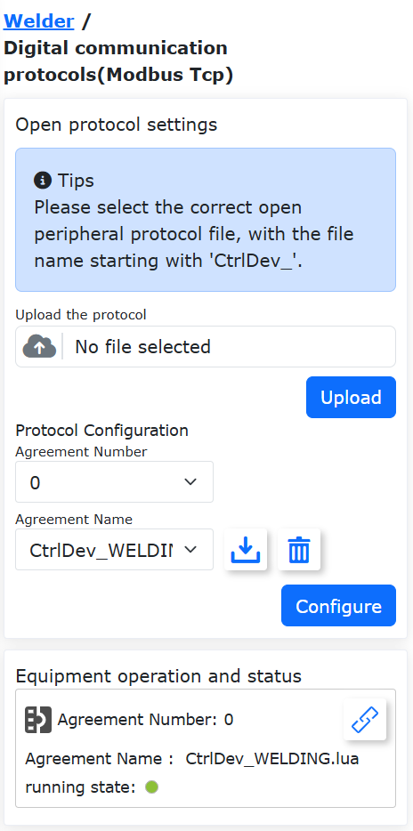

.. centered:: Figure 8.6‑41 Load Welding Machine Open Protocol

Welding Machine Debugging
********************************************************

Before debugging the welding machine, please ensure that the welding machine open protocol has been loaded normally and the relevant register address configurations are correct.

Successively click "Initial", "Peripherals", "Welding Machine", and select "Digital Communication Protocol (ModbusTcp)".

.. figure:: robot_peripherals/036.png
   :align: center
   :width: 4in

.. centered:: Figure 8.6‑42 Select "Digital Communication Protocol (ModbusTcp)"

Click buttons such as "Arc Start", "Arc Stop", "Gas On", "Gas Off", etc., and observe whether the actual welding machine actions are consistent with the settings. If the welding machine does not perform the set actions, check if the register configuration in the welding machine open protocol is incorrect and perform further debugging.

.. centered:: Figure 8.6‑43 Welding Machine Debugging

Welding Program Writing
********************************

Click "Initial", "Teach Program", "Program Programming", and create a new program "testWeld.lua".

.. centered:: Figure 8.6‑44 Create Welding LUA Program

Click the "Welding" button. In the pop-up welding command addition page, select "Digital Communication Protocol (Modbus Tcp)". Then successively select "Arc Start", click "Add", select "Arc Stop", click "Add", and finally click the "Apply" button.

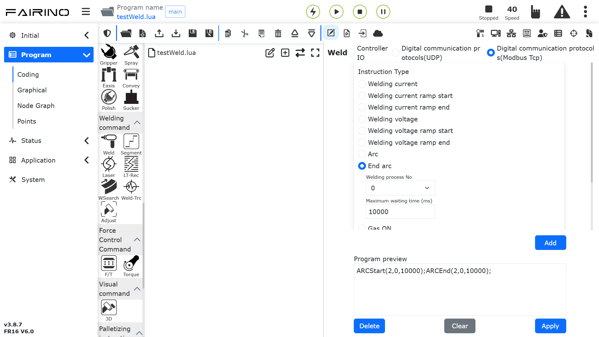

.. centered:: Figure 8.6‑45 Add Arc Start and Arc Stop Commands

At this point, the Arc Start and Arc Stop commands have been successfully added to "testWeld.lua".

.. figure:: robot_peripherals/058.png
   :align: center
   :width: 4in

.. centered:: Figure 8.6‑46 Added Arc Start and Arc Stop Commands

Successively add the welding start point and welding end point. Switch the robot to automatic mode, and under safe conditions, start the program. The robot will then control the welding machine to perform welding along one weld seam.

.. figure:: robot_peripherals/059.png
   :align: center
   :width: 4in

.. centered:: Figure 8.6‑47 Welding Program

Welding Machine Open Protocol Unload
**********************************************************

Successively click "Initial", "Peripherals", "Control Box", "Peripheral Open Protocol". In the "Device Operation and Status" section, click the "Unload" button.

.. figure:: robot_peripherals/067.png
   :align: center
   :width: 4in

.. centered:: Figure 8.6‑48 Unload Open Protocol

At this point, the protocol running status indicator turns off.

.. figure:: robot_peripherals/072.png
   :align: center
   :width: 4in

.. centered:: Figure 8.6‑49 Open Protocol Unloaded

If welding debugging is performed or a welding program is executed at this time, the robot will report a "Protocol Not Loaded Error" in the lower left corner of the WebApp.

.. figure:: robot_peripherals/073.png
   :align: center
   :width: 3in

.. centered:: Figure 8.6‑50 Protocol Not Loaded Error

Extended Axis Configuration
---------------------------------------------------

In "Initial" -> "Peripherals", click "Extended Axis" to enter the Extended Axis configuration interface, which includes Extended Axis Coordinate System configuration and Extended Axis Peripheral configuration. The interface when first entering Extended Axis configuration is as follows:

.. figure:: robot_peripherals/074.png
   :align: center
   :width: 4in

.. centered:: Figure 8.7‑1 Initial Extended Axis Configuration Interface

Currently, Extended Axis Peripheral configuration is divided into the following two types based on communication method:

- Controller + PLC (UDP Communication).

- Controller + Servo Drive (485 Communication).

Extended Axis Coordinate System
~~~~~~~~~~~~~~~~~~~~~~~~~~~~~~~~~~~~~~~

The Extended Axis Coordinate System settings interface allows for the application, clearing, and configuration of the extended axis coordinate system.

.. note::
   .. image:: robot_peripherals/075.png
      :height: 0.75in
      :align: left

   Name: **Apply**

   Function: Apply the extended axis coordinate system

.. note::
   .. image:: robot_peripherals/076.png
      :height: 0.75in
      :align: left

   Name: **Clear**

   Function: Clear extended axis coordinate system data

There are 5 numbers in the drop-down list for the Extended Axis Coordinate System, from exaxis0 to exaxis4. Selecting a corresponding coordinate system will display its coordinate values below. After selecting a coordinate system, click the "Apply" button, and the currently used extended axis coordinate system changes to the selected one, as shown below.

.. image:: robot_peripherals/077.png
   :width: 4in
   :align: center

.. centered:: Figure 8.7‑2 Extended Axis Coordinate System

Select an extended axis coordinate system other than "exaxis0", click "Configure" to enter the Extended Axis Coordinate System configuration interface to reset the extended axis coordinate system for that number. As shown below:

.. important::
  - Before calibration, first clear the extended axis coordinate system to be calibrated, and apply this extended axis coordinate system.

  - Select the extended axis number. "Get Info" can retrieve the drive information for the corresponding extended axis, which can be used for parameter configuration.

.. image:: robot_peripherals/078.png
   :width: 4in
   :align: center

.. centered:: Figure 8.7‑3 Extended Axis Coordinate System Calibration

The current extended axis solutions are as follows:

- 0 - Single Degree of Freedom Linear Slide

- 1 - Two Degree of Freedom L-type Positioner

- 2 - Three Degree of Freedom (Temporarily unavailable)

- 3 - Four Degree of Freedom (Temporarily unavailable)

- 4 - Single Degree of Freedom Positioner

- 5 - Two Degree of Freedom AGV

**Single Degree of Freedom Linear Slide**: First set the DH parameters, then set the robot's position relative to the extended axis (the linear slide is considered *on* the extended axis). If not calibrating, just click Save; at this point, the extended axis can only move asynchronously.

.. image:: robot_peripherals/079.png
   :width: 4in
   :align: center

.. centered:: Figure 8.7-4 Linear Slide DH Parameter Configuration

.. image:: robot_peripherals/080.png
   :width: 4in
   :align: center

.. centered:: Figure 8.7-5 Linear Slide -- Robot Position Relative to Extended Axis Configuration

If synchronous movement with the robot is required, at the extended axis zero point, click the operation area 'Eaxis' to enable the extended axis. Align the robot end center point (using the tool end point under the applied tool coordinate system) to a fixed point on the extended axis with two different postures, setting Point 1 and Point 2 respectively.

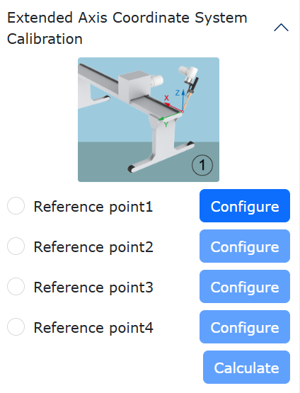

.. image:: robot_peripherals/082.png
   :width: 3in
   :align: center

.. centered:: Figure 8.7‑6 Linear Slide Calibration Points 1 and 2

Disable the axis, move the extended axis a certain distance, enable it again, and similarly align the robot end center point to the previous fixed point, setting Point 3. Disable the axis, move the extended axis back to the zero point, and enable the extended axis. Move the robot end center point to a point in space directly above the fixed point, setting Point 4. Calculate the coordinate system and save.

.. image:: robot_peripherals/083.png
   :width: 3in
   :align: center

.. image:: robot_peripherals/084.png
   :width: 3in
   :align: center

.. centered:: Figure 8.7‑7 Linear Slide Calibration Points 3 and 4

**Two Degree of Freedom L-type Positioner**: The positioner consists of two extended axes. First set the DH parameters. Measure the DH parameters of the positioner according to the diagram and input them into the boxes. Set the robot's position relative to the extended axis (the positioner is considered *outside* the extended axis). If not calibrating, just click Save; at this point, the extended axes can only move asynchronously.

.. image:: robot_peripherals/085.png
   :width: 4in
   :align: center

.. centered:: Figure 8.7‑8 Two DOF L-type Positioner DH Parameter Configuration

.. image:: robot_peripherals/086.png
   :width: 4in
   :align: center

.. centered:: Figure 8.7‑9 Two DOF L-type Positioner -- Robot Position Relative to Extended Axis

If synchronous movement with the robot is required, at the extended axes zero point, click the operation area 'Eaxis' to enable the extended axes. Establish a coordinate system on the positioner. Select a point and input its Cartesian pose in that coordinate system. For example, selecting a point in the positive Y direction, measuring Y as 100mm, input the values as shown in the figure. Click "Reference Point" to set the reference point. The subsequent four calibration points all require aligning the robot end center point (using the tool end point under the applied tool coordinate system) to this reference point.

.. image:: robot_peripherals/087.png
   :width: 4in
   :align: center

.. centered:: Figure 8.7‑10 Two DOF L-type Positioner -- Reference Point Configuration

Align the robot end center point (using the tool end point under the applied tool coordinate system) to this reference point and set Point 1. Click the operation area 'Eaxis' to jog the two axes a small distance, align the robot end center point to the reference point, and set Point 2. Continue jogging the two axes, align the robot end center point to the reference point, and set Point 3. Finally, continue jogging the two axes, align the robot end center point to the reference point, and set Point 4. Click "Calculate" to get the coordinate system result, then click "Save" and "Apply".

.. image:: robot_peripherals/088.png
   :width: 3in
   :align: center

.. image:: robot_peripherals/089.png
   :width: 3in
   :align: center

.. image:: robot_peripherals/090.png
   :width: 3in
   :align: center

.. image:: robot_peripherals/091.png
   :width: 3in
   :align: center

.. centered:: Figure 8.7‑11 Two DOF L-type Positioner Calibration

**Single Degree of Freedom Positioner**: Consists of one rotating extended axis. Set the DH parameters to 0. Set the robot's position relative to the extended axis as *outside* the extended axis. If not calibrating, just click Save; at this point, the extended axis can only move asynchronously.

.. image:: robot_peripherals/092.png
   :width: 4in
   :align: center

.. centered:: Figure 8.7‑12 Single DOF Positioner DH Parameter Configuration

.. image:: robot_peripherals/093.png
   :width: 4in
   :align: center

.. centered:: Figure 8.7‑13 Single DOF Positioner -- Robot Position Relative to Extended Axis

If synchronous movement with the robot is required, at the extended axis zero point, click the operation area 'Eaxis' to enable the extended axis. Establish a coordinate system on the positioner. Select a point and input its Cartesian pose in that coordinate system. Click "Reference Point" to set the reference point.

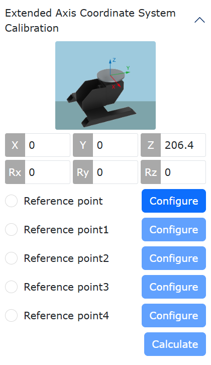

.. centered:: Figure 8.7‑14 Single DOF Positioner Reference Point Configuration

The subsequent four calibration points all require aligning the robot end center point (using the tool end point under the applied tool coordinate system) to this reference point. Align the robot end center point to this reference point and set Point 1. Click the operation area 'Eaxis' to jog the rotation axis a small distance, align the robot end center point to the reference point, and set Point 2. Continue jogging the rotation axis, align the robot end center point to the reference point, and set Point 3. Finally, continue jogging the rotation axis, align the robot end center point to the reference point, and set Point 4. Click "Calculate" to get the coordinate system result, then click "Save" and "Apply".

.. image:: robot_peripherals/095.png
   :width: 3in
   :align: center

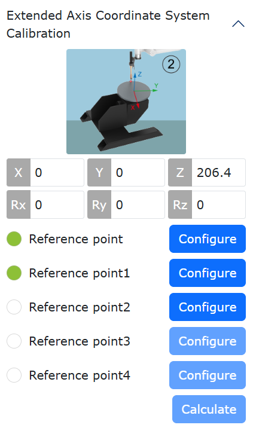

.. image:: robot_peripherals/097.png
   :width: 3in
   :align: center

.. image:: robot_peripherals/098.png
   :width: 3in
   :align: center

.. centered:: Figure 8.7‑15 Single DOF Positioner Calibration

.. important::
   1. The extended axis coordinate system is calibrated based on the tool coordinate system and needs to be established on the basis of an already created tool coordinate system.
   2. Extended axis systems generally use exaxis1~exaxis4. Applying exaxis0 means no extended axis coordinate system is used. When calibrating an extended axis coordinate system, first apply the extended axis coordinate system to exaxis0, then select another extended axis coordinate system for calibration and application.

Controller + PLC (UDP Communication)
~~~~~~~~~~~~~~~~~~~~~~~~~~~~~~~~~~~~~~~~~~~~~~~~~~~~~~

Before using the extended axis UDP communication method, it is necessary to first establish the corresponding extended axis coordinate system, configure the corresponding extended axis solution under that coordinate system, and apply the established tool coordinate system during program teaching. The extended axis function is primarily used in conjunction with the welding machine function and the laser tracking sensor function.

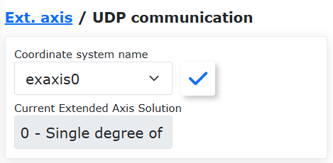

.. centered:: Figure 8.7‑16 Extended Axis Coordinate System Application and Current Extended Axis Solution Display

When only needing to modify the current extended axis coordinate system, select the coordinate system in the Peripheral Extended Axis configuration interface to apply it. When needing to change the extended axis solution, enter the Extended Axis Coordinate System configuration interface to modify it.

When the extended axis solution is "0 - Single Degree of Freedom Linear Slide", "1 - Two Degree of Freedom L-type Positioner", "2 - Three Degree of Freedom", "3 - Four Degree of Freedom", or "4 - Single Degree of Freedom Positioner", after successful UDP communication configuration, the interface displays "UDP Extended Axis" and "Positioning Completion Time Setting" content. When the extended axis solution is "5 - Two Degree of Freedom AGV", the interface displays "Two Degree of Freedom AGV Test" content.

UDP Communication Configuration
+++++++++++++++++++++++++++++++++++++++++++++++++++

.. note::
   .. image:: robot_peripherals/100.png
      :height: 0.75in
      :align: left

   Name: **Edit Button**

   Function: UDP communication parameter configuration

.. note::
   .. image:: robot_peripherals/101.png
      :height: 0.75in
      :align: left

   Name: **Load Button**

   Function: Load UDP communication

**Step1**: Configure extended axis UDP communication parameters: Set IP Address, Port Number, Communication Cycle, Packet Loss Detection Cycle, Packet Loss Count, etc. The Reconnection Cycle and Reconnection Count can only be configured after the Communication Interruption Auto-reconnect switch is turned on.

- IP Address: Custom IP address;

- Port Number: Define according to the actual situation;

- Communication Cycle: Define according to the actual situation, unit ms;

- Packet Loss Detection Communication Cycle: 10 ~ 1000 ms;

- Packet Loss Count: 1 ~ 100;

- Communication Interruption Confirmation Duration: 0 ~ 500 ms;

- Power-off Restart Auto-reconnect: On/Off;

- Communication Interruption Auto-reconnect: On/Off;

- Reconnection Cycle: 1 ~ 1000 ms;

- Reconnection Count: 1 ~ 100;

.. figure:: robot_peripherals/102.png
   :align: center
   :width: 4in

.. centered:: Figure 8.7‑17 Extended Axis UDP Communication Parameter Configuration

.. important::
  1. After setting the Communication Disconnect Confirmation Duration, communication disconnect is confirmed and an error is reported only when the communication abnormality exceeds this duration.
  2. After UDP communication is disconnected, a UDP disconnect error is triggered (can be reset). Click the Clear Warning Information button, and UDP communication will be re-established.

**Step2**: After successful communication parameter configuration, click the "Load" button to establish UDP communication. After successful communication, the button in front of "UDP Communication Configuration" turns green. Check the extended axis status in the robot's various status views; the extended axis should be servoed and in position.

.. figure:: robot_peripherals/103.png
   :align: center
   :width: 4in

.. centered:: Figure 8.7‑18 Extended Axis UDP Communication Established

.. figure:: robot_peripherals/104.png
   :align: center
   :width: 4in

.. centered:: Figure 8.7‑19 Extended Axis Servo Ready

.. important::
  1. When UDP communication is not established, UDP extended axis number information cannot be configured or viewed.
  2. Before loading extended axis UDP communication, be sure to first configure and apply an extended axis coordinate system other than number 0.

UDP Extended Axis
++++++++++++++++++++++++++++++

.. note::
   .. image:: robot_peripherals/100.png
      :height: 0.75in
      :align: left

   Name: **Edit Button**

   Function: Extended axis parameter configuration

.. note::
   .. image:: robot_peripherals/105.png
      :height: 0.75in
      :align: left

   Name: **Enable Button**

   Function: Extended axis enabled state. Clicking the button disables the extended axis.

.. note::
   .. image:: robot_peripherals/106.png
      :height: 0.75in
      :align: left

   Name: **Disable Button**

   Function: Extended axis disabled state. Clicking the button enables the extended axis.

.. note::
   .. image:: robot_peripherals/107.png
      :height: 0.75in
      :align: left

   Name: **Homing Button**

   Function: Set extended axis homing method

.. note::
   .. image:: robot_peripherals/108.png
      :height: 0.75in
      :align: left

   Name: **Test Button**

   Function: Extended axis function test

**Step1**: Select any extended axis number (currently only numbers 1, 2, 3, 4 are available). Click the "Edit" button behind the extended axis number to enter the detailed configuration interface. Set Axis Type, Axis Direction, Operating Speed, Acceleration, Positive Limit, Negative Limit, Lead, Encoder Resolution, Start Offset, Manufacturer, Model, and Mode. Click "Configure" to complete the configuration.

- Axis Type: Linear Slide, Rotary Axis, Infinite Rotary Axis;

- Axis Direction: Positive / Negative;

- Operating Speed: 0~2000 mm/s;

- Acceleration: 0 ~ 2000 mm/s²;

- Positive Limit: 0 ~ 50000;

- Negative Limit: -50000 ~ 0;

- Lead: 0~1000;

- Encoder Resolution: 0 ~ 10000000;

- Start Offset: 0 ~ 10000 mm;

- Manufacturer: Hechuan, Huichuan, Panasonic;

- Model: Automatically matched model list based on the manufacturer;

- Mode: Incremental System and Absolute Position System;

.. figure:: robot_peripherals/109.png
   :align: center
   :width: 4in

.. centered:: Figure 8.7‑20 Extended Axis Parameter Configuration

**Step2**: After completing the extended axis parameter configuration, click the "Disable" button to enable the corresponding extended axis number. After successful enabling, the homing method can be set and the extended axis can be tested. When the extended axis is not enabled, the homing method setting and extended axis test cannot be performed.

.. figure:: robot_peripherals/110.png
   :align: center
   :width: 4in

.. centered:: Figure 8.7‑21 Extended Axis Enable/Disable

**Step3**: If the extended axis is not successfully enabled, the button to enter the settings interface is grayed out. After the extended axis is successfully enabled, click the "Homing" button to enter the homing method setting interface. Set the Homing Method, Homing Speed, and Zero Latch Speed. Click the "Set" button, and the extended axis will start homing. The homing status will be displayed in the blank area below the Axis Direction. When the "Homing Completed" prompt appears, it indicates successful extended axis zero point setting.

- Homing Method: Current Position Homing, Negative Limit Homing, Positive Limit Homing;

- Homing Speed: 0~2000 mm/s;

- Zero Latch Speed: 0~2000 mm/s;

.. figure:: robot_peripherals/111.png
   :align: center
   :width: 4in

.. centered:: Figure 8.7‑22 Homing Method Setting

**Step4**: If the extended axis is not successfully enabled, the button to enter the settings interface is grayed out. After the extended axis is successfully enabled and the homing method is set, click the "Test" button to enter the extended axis test interface. Set the Running Speed, Acceleration, and Maximum Distance to test the extended axis with forward rotation and reverse rotation. During rotation, you can click the "Stop" button to test if the extended axis can stop normally.

.. figure:: robot_peripherals/112.png
   :align: center
   :width: 4in

.. centered:: Figure 8.7‑23 Extended Axis Test

**Step5**: The extended axis is often used in conjunction with a laser sensor. In this case, the laser sensor is usually installed externally. The sensor reference point configuration needs to use the three-point calibration method instead of the previously used six-point calibration method. Align the tool center point to the bottom middle point of the right cross-section (the side closer to the camera) and set Point 1. Align the tool center point to the bottom middle point of the other cross-section (the left cross-section) and set Point 2. Move the tool center point to the top middle point of the right cross-section of the sensor and set Point 3. Calculate and save, then click Apply to complete the three-point calibration.

.. figure:: robot_peripherals/113.png
   :align: center
   :width: 4in

.. centered:: Figure 8.7‑24 Sensor Three-Point Calibration

**Step6**: In the "Teach Program" -> "Program Programming" interface, select the "Extended Axis" command from the peripheral instructions. Add instructions in the appropriate places according to the specific program teaching requirements.

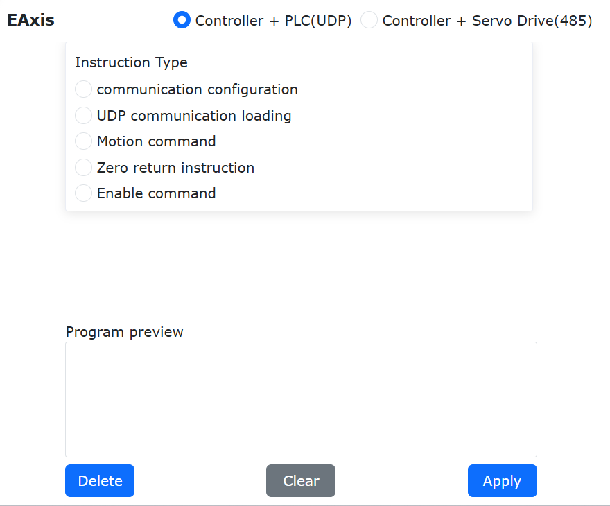

.. centered:: Figure 8.7‑25 Extended Axis Command Editing

Extended Axes with Laser Tracking Welding Teaching Program
++++++++++++++++++++++++++++++++++++++++++++++++++++++++++++++++++++++++++++++++++++

.. list-table::
   :widths: 50 80 80
   :header-rows: 0
   :align: center

   * - **No.**
     - **Command Format**
     - **Comment**

   * - 1
     - EXT_AXIS_PTP(1,1laserstart)
     - #External axis moves to laser sensor start point

   * - 2
     - PTP(laserstart,10,-1,0)
     - #Robot moves to laser sensor start point

   * - 3
     - LTSearchStart(3,20,10,10000)
     - #Start searching

   * - 4
     - LTSearchStop()
     - #Stop searching

   * - 5
     - EXT_AXIS_PTP(1,1,seamPos)
     - #External axis moves to weld seam start point

   * - 6
     - Lin(seamPos,20,-1,00,0)
     - #Robot moves to weld seam start point

   * - 7
     - LTTrackOn()
     - #Laser tracking on

   * - 8
     - ARCStart(0,10000)
     - #Welder arc start

   * - 9
     - EXT_AXIS_PTP(1,1,laserend)
     - #External axis moves to weld seam end point

   * - 10
     - Lin( laserend,10,-1,0,0)
     - #Robot moves to weld seam end point

   * - 11
     - ARCEnd(0,10000)
     - #Welder arc end

   * - 12
     - LTTrackOff
     - #Laser tracking off

Positioning Completion Time
++++++++++++++++++++++++++++++++++++++++++++++++++++++

After the extended axis establishes UDP communication, input the time and click the "Configure" button to complete the setting. This configuration item is used to monitor the time when the extended axis motion stops.

.. figure:: robot_peripherals/115.png
   :align: center
   :width: 4in

.. centered:: Figure 8.7‑26 Positioning Completion Time Configuration

Two-DOF Trolley Test
~~~~~~~~~~~~~~~~~~~~~~~~~~~~~~~~~~~~~~~~~~~~~~~~~~~~~~~~~~~~~~~~

This content is displayed in the UDP communication interface only when the extended axis scheme is set to "5-Two-DOF Trolley" in the extended axis coordinate system configuration; otherwise, it cannot be viewed.

.. figure:: robot_peripherals/116.png
   :align: center
   :width: 4in

.. centered:: Figure 8.7‑27 Interface for Extended Axis Scheme "5-Two-DOF Trolley"

.. important:: The two-DOF trolley by default uses extended axis numbers 1 and 2. After UDP communication is successful, check the servo ready status for extended axes 1 and 2 via the extended axis status in the robot's various status monitors.

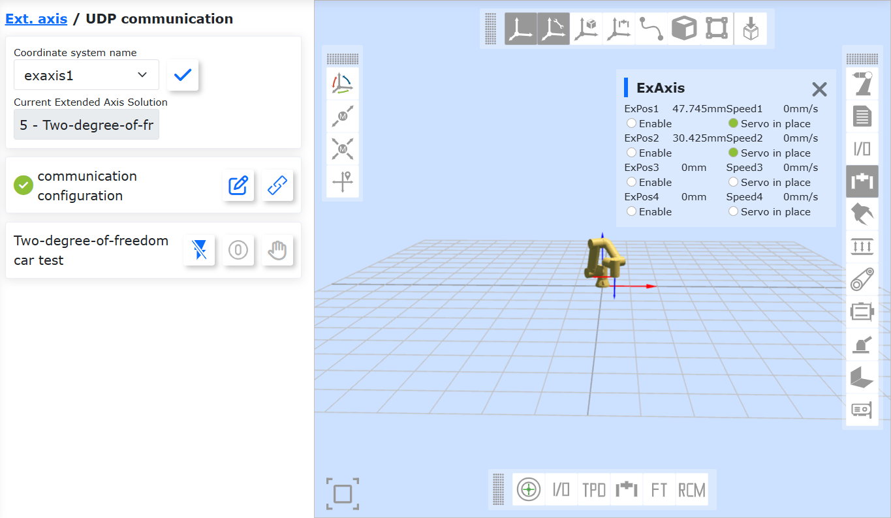

.. centered:: Figure 8.7‑28 Two-DOF Trolley Extended Axis Servo Ready

.. note::
   .. image:: robot_peripherals/105.png
      :height: 0.75in
      :align: left

   Name: **Enable Button**
   
   Function: Extended axis enabled state. Click the button to disable the extended axis.

.. note::
   .. image:: robot_peripherals/106.png
      :height: 0.75in
      :align: left

   Name: **Disable Button**
   
   Function: Extended axis disabled state. Click the button to enable the extended axis.

.. note::
   .. image:: robot_peripherals/107.png
      :height: 0.75in
      :align: left

   Name: **Homing Button**
   
   Function: Home the extended axis at the current position.

.. note::
   .. image:: robot_peripherals/108.png
      :height: 0.75in
      :align: left

   Name: **Test Button**
   
   Function: Test the two-DOF trolley functionality.

**Step1**: After UDP communication is successful, click the "Disable" button to enable the extended axes corresponding to the two-DOF trolley. Check that extended axes 1 and 2 are servo enabled via the extended axis status in the robot's various status monitors.

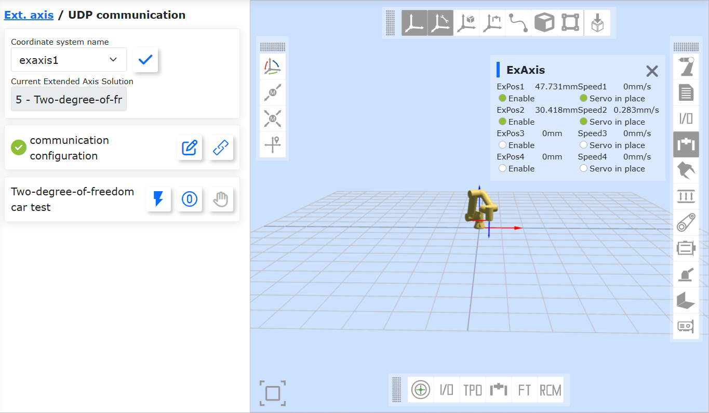

.. centered:: Figure 8.7‑29 Two-DOF Trolley Extended Axes Enabled

**Step2**: After the extended axes are successfully enabled, click the "Homing" button to set the current position of the extended axes as home. If homing is successful, the test button becomes highlighted; otherwise, it remains grayed out.

.. figure:: robot_peripherals/119.png
   :align: center
   :width: 6in

.. centered:: Figure 8.7‑30 Two-DOF Trolley Current Position Homing Successful

**Step3**: After the two-DOF trolley's current position homing is successful, click the "Test" button to enter the interface. Select the motion mode, input parameters for motion testing, and click the "Stop" button during motion to test the stop function.

- Motion Mode: Linear / Arc;

- Distance: -5000~5000mm (Linear motion mode);

- Radius: 1~5000mm (Linear motion mode);

- Angle: -360~360° (Arc motion mode);

- Speed: 1~100%

.. figure:: robot_peripherals/120.png
   :align: center
   :width: 4in

.. figure:: robot_peripherals/121.png
   :align: center
   :width: 4in

.. centered:: Figure 8.7‑31 Two-DOF Trolley Test

Controller + Servo Drive (485 Communication)
~~~~~~~~~~~~~~~~~~~~~~~~~~~~~~~~~~~~~~~~~~~~~~~~~~~~~~~~~~~~~~~~~~~~~~~~~~~~~~~~~~~~~~~~

Hardware Wiring
++++++++++++++++++++++++++++++++++++++

Before using RS485 communication to control the servo extended axis, please first connect the RS485 communication interface of the servo drive to the RS485 communication interface on the robot control box. The electrical interface diagram for the Faro Robot Yizhizao control box is as follows:

.. figure:: robot_peripherals/122.png
   :align: center
   :width: 6in

.. centered:: Figure 8.7‑32 Faro Robot Mini Control Box Electrical Interface Diagram

Taking the Dynatek servo drive model FD100-750C as an example, refer to the drive panel terminal diagram and the X3A-IN terminal definition of the FD100-750C. When configuring the robot to communicate with the FD100-750C servo extended axis, it is necessary to connect the 485-A0 terminal and 485-B0 terminal on the control box to pins 4 and 5 of the drive's X3A-IN terminal, respectively. (Please note: You might see a terminal marked "485" on the servo drive panel. This terminal is currently not available for user use. Do not connect your RS485 communication cable to this terminal). Additionally, if connecting multiple servo drives and this drive is the last in the chain, it is necessary to turn on the RS485 communication termination resistor dip switch (No. 2 dip switch) on the panel.

.. figure:: robot_peripherals/123.png
   :align: center
   :width: 6in

.. centered:: Figure 8.7‑33 FD100-750C Drive Panel

.. figure:: robot_peripherals/124.png
   :align: center
   :width: 6in

.. centered:: Figure 8.7‑34 FD100-750C X3A-IN Terminal Definition

Communication Configuration
++++++++++++++++++++++++++++++++++++++++++++++++++

After ensuring your RS485 communication cable is correctly connected and both the robot and servo extended axis are powered on normally, open the robot WebApp.

Click on the image with the combination "Controller + Servo Drive" to enter the detailed configuration interface. In the servo drive configuration, select the number as "1" (Please note: When multiple servos are connected, this number is used to distinguish different servos, we will mention this number multiple times later), the manufacturer as "Dynatek", select the corresponding servo drive model, here the model is "FD00-750C", the software version is V1.0, fill in the resolution corresponding to the servo drive, here it is 131072, fill in the mechanical transmission ratio according to your mechanism model, here it is 15.45, and click the "Configure" button.

.. figure:: robot_peripherals/125.png
   :align: center
   :width: 4in

.. centered:: Figure 8.7‑35 Servo Drive Configuration

So far, we have completed the 485 communication configuration between the robot and the servo drive. You can view the real-time status information of the servo in the "Servo Status Bar" on the right side of the WebApp, as shown below:

.. figure:: robot_peripherals/126.png
   :align: center
   :width: 4in

.. centered:: Figure 8.7‑36 Servo Status Bar

Now you need to set the enable and homing method for the extended axis device in order, and then you can perform certain motion tests. Please follow this manual for the following test operations under safe conditions.

Configured Servo Drives
++++++++++++++++++++++++++++++++++++++++++++++

.. note::
   .. image:: robot_peripherals/127.png
      :height: 0.75in
      :align: left

   Name: **View Button**
   
   Function: Click to view servo drive configuration information.

.. note::
   .. image:: robot_peripherals/105.png
      :height: 0.75in
      :align: left

   Name: **Enable Button**
   
   Function: Servo drive enabled state. Click the button to disable the servo drive.

.. note::
   .. image:: robot_peripherals/106.png
      :height: 0.75in
      :align: left

   Name: **Disable Button**
   
   Function: Servo drive disabled state. Click the button to enable the servo drive.

.. note::
   .. image:: robot_peripherals/107.png
      :height: 0.75in
      :align: left

   Name: **Homing Button**
   
   Function: Set the homing method for the servo drive.

.. note::
   .. image:: robot_peripherals/108.png
      :height: 0.75in
      :align: left

   Name: **Test Button**
   
   Function: Test the servo drive.

.. note::
   .. image:: robot_peripherals/128.png
      :height: 0.75in
      :align: left

   Name: **Servo Error Clear Button**
   
   Function: When the servo drive indicates an error, click to clear it.

Servo Control Mode and Enable
*****************************************

In "Configured Servo Drives", select the control mode as "Position Mode", select the corresponding servo number, and click the "Disable" button. This will first set the servo drive number. After successful setting, it sets the control mode. After the control mode is set successfully, the servo drive is enabled (Please note: After switching the control mode, you need to first disable the servo drive, then enable the servo drive again for the servo control mode switch to take effect. After the servo is enabled, switching the control mode will be disabled).

.. figure:: robot_peripherals/129.png
   :align: center
   :width: 4in

.. centered:: Figure 8.7‑37 Servo Control Mode and Enable

After the servo is successfully enabled, check the "Servo" section in the robot's various status bars to observe the "Servo Enable" status light is on, indicating the servo drive is enabled. Click the "Enable" status button to disable the servo drive, and the "Servo Enable" status light turns off.

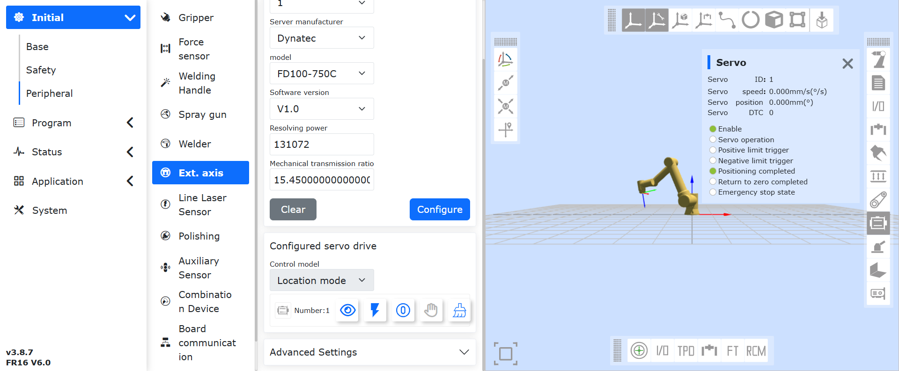

.. centered:: Figure 8.7‑38 Servo Drive Status Bar

Servo Homing
************************

After the servo drive is successfully enabled, the "Homing" button becomes highlighted. Click the button to enter the setup interface. Select the homing mode as "Current Position Homing", homing speed as 5mm/s, and zero search speed as 1mm/s; click the "Set" button to complete the servo current position homing operation. In the "Servo" section of the robot's various status bars, you can observe that the current "Servo Position" is 0; (Please perform homing tests with "Negative Limit Homing" or "Positive Limit Homing" only after fully reading this manual).

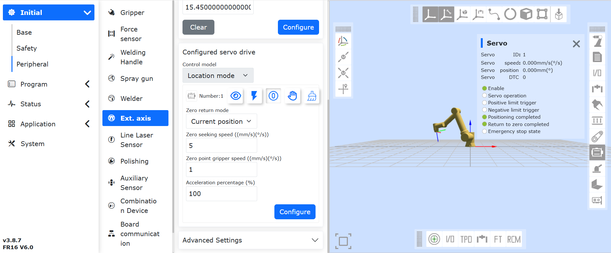

.. centered:: Figure 8.7‑39 Servo Homing

Servo Motion
************************

Before actually controlling the servo motor motion, please first understand the "Position Mode" and "Speed Mode" of the servo motor. We remind you again:

**Position Mode**: You can input a certain motion speed and target position parameter. The servo will move to the target position at the set speed and stop after reaching the target position.

**Speed Mode**: You can input a certain target speed. The servo will continue to move at the target speed you set until you set the target speed to 0 or disable the servo motor;

When switching control modes, the "Current Control Mode" display will switch automatically (Please note: After switching the control mode, you need to first disable the servo, then enable the servo again for the servo control mode switch to take effect). If your servo is not currently in "Position Mode", please switch your servo to position mode. Enter the "Target Position" as 50mm and the run speed as 5mm/s. Under confirmed safe conditions, click the "Set" button. At this point, the servo motor will move according to the parameters you set. You can observe the servo's position, speed, etc., in real-time in the "Servo" section of the robot's various status bars.

.. figure:: robot_peripherals/132.png
   :align: center
   :width: 4in

.. centered:: Figure 8.7‑40 Servo Motion Debugging (Position Mode)

Change the servo control mode to "Speed Mode". Click the "Enable" status button to disable the servo drive, then click the "Disable" status button. Now the servo is switched to speed mode (Please note: After the servo motor starts moving, it can only be stopped by setting the target speed to 0). Enter the target speed as 5mm/s and click the "Set" button. The servo motor will maintain motion at 5mm/s. Similarly, you can observe the servo's position, speed, etc., in real-time in the "Servo" section of the robot's various status bars.

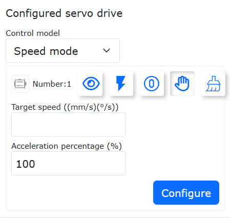

.. centered:: Figure 8.7‑41 Servo Motion Debugging (Speed Mode)

Advanced Settings
++++++++++++++++++++++++++++++++++

If the robot collides, the emergency stop is pressed, or other emergency situations occur, the extended axis can trigger an emergency stop and stop motion according to the set emergency stop deceleration. After the collision alarm is reset, commands can continue to be sent to resume extended axis operation. It is necessary to set the servo acceleration/deceleration and servo emergency stop acceleration/deceleration in the Advanced Settings, as shown below:

.. figure:: robot_peripherals/134.png
   :align: center
   :width: 4in

.. centered:: Figure 8.7‑42 Advanced Settings

Extended Axis Programming
++++++++++++++++++++++++++++++++++++++++++++++++++

In "Teaching Program" -> "Program Programming", create a new user program "testServo.lua" and select "Peripheral Instructions".

.. figure:: robot_peripherals/135.png
   :align: center
   :width: 6in

.. centered:: Figure 8.7‑43 Open Peripheral Instructions

Click "Extended Axis" to open the Add Extended Axis Instruction interface. Select the combination method as "Controller + Servo Drive (485)", set the control mode to "Position Mode", and click the "Add" button on the right. Scroll to the bottom of the Add Extended Axis Instruction interface and click the "Apply" button.

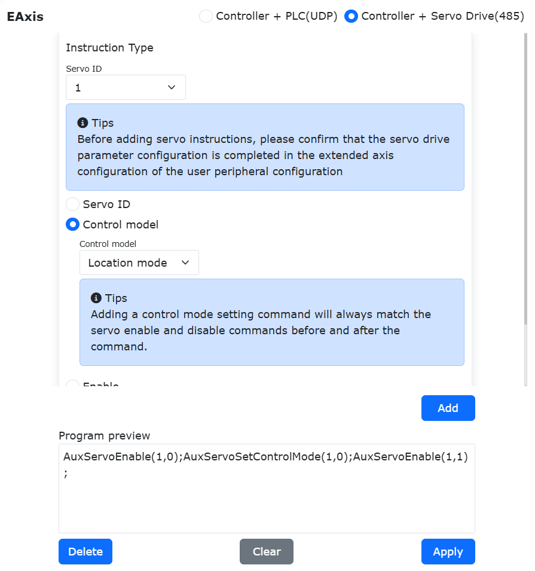

.. centered:: Figure 8.7‑44 Set Extended Axis Control Mode

Now, a set of instructions for switching the servo control mode appears in the "testServo.lua" program. You can switch the robot to automatic mode and execute this program.

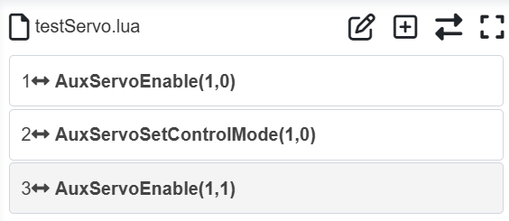

.. centered:: Figure 8.7‑45 Set Servo Control Mode Program

How to control servo motion through a user program? Similarly, open the Add Extended Axis Instruction interface, as shown below, find the parameter configuration bar. Taking position mode as an example, enter the target position and run speed, click the "Add" button; scroll to the bottom of the Add Extended Axis Instruction interface, click the "Apply" button, and close the Add Extended Axis Instruction interface.

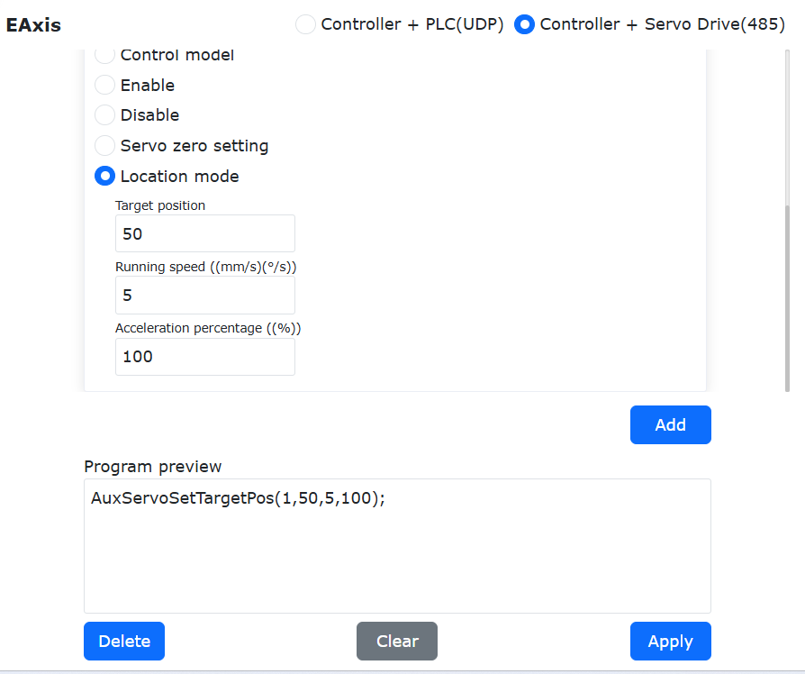

.. centered:: Figure 8.7‑46 Add Position Mode Motion Instruction

The "testServo.lua" program adds a servo motion instruction: "AuxServoSetTargetPos(1,50,5)". The meanings of the three parameters in the instruction function are:

- 1: Servo number is 1.

- 50: Target position.

- 5: Target speed.

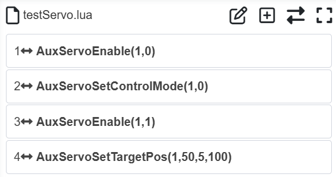

.. centered:: Figure 8.7‑47 Position Mode Servo Motion Program

Switch the robot to automatic mode and run the program. Now your servo will move to the 50mm position at a speed of 5mm/s.

So far, we have completed the preliminary configuration and testing of RS485 controlled servo extended axes. You can write programs combining robot motion and servo motion according to the actual situation, such as the example program below.

Example Program for Coordinated Motion between Extended Axis and Robot
***********************************************************************************************

.. list-table::
   :widths: 50 80 80
   :header-rows: 0
   :align: center

   * - **No.**
     - **Command Format**
     - **Comment**

   * - 1
     - AuxServoSetTargetPos(1,50,5)
     - #Extended axis moves to reset point

   * - 2
     - if(GetDI(8,0) == 1) then
     - #If CI0 input is valid

   * - 3
     - AuxServoSetTargetPos(1,50,5)
     - #Extended axis moves to 50mm

   * - 4
     - PTP(testptp1,100,-1,0)
     - #Robot moves to testptp1 point

   * - 5
     - elseif(GetDI(9,0) == 1) then
     - #If CI1 input is valid

   * - 6
     - AuxServoSetTargetPos(1,150,5)
     - #Extended axis moves to 150mm

   * - 7
     - PTP(testptp2,100,-1,0)
     - #Robot moves to testptp2 point

   * - 8
     - else
     - #If both CI0 and CI1 inputs are invalid

   * - 9
     - AuxServoSetTargetPos(1,300,5)
     - #Extended axis moves to 300mm

   * - 10
     - PTP(testptp3,100,-1,0)
     - #Robot moves to testptp3 point

   * - 11
     - end
     - #End

Summary
++++++++++++++

In summary, the key points for configuring RS485 communication between the collaborative robot and the servo extended axis are as follows:

1. Correctly connect the RS485 communication cable between the collaborative robot and the servo drive;

2. Correctly select the control mode for the servo extended axis;

3. After switching the control mode, you must first disable the servo, then enable the servo again for the control mode switch to take effect.

Line Laser Sensor
---------------------------------------------

The F&R collaborative robot is used in conjunction with a laser sensor to identify feature positions such as welds, achieving the goals of simplified programming and improved production efficiency. The collaborative robot can be adapted to laser sensors from three manufacturers: Ruiniu, Chuangxiang, and Quanshi. When using different sensors, only the corresponding communication protocol needs to be loaded.

Hardware Connection
~~~~~~~~~~~~~~~~~~~~~~~~~~~~~~~~~~~~~~~

Before using the laser sensor, it needs to be installed in a suitable position. Connect the laser sensor's network cable directly or through a switch to any RJ45 interface on the robot control box.

Sensor Configuration
~~~~~~~~~~~~~~~~~~~~~~~~~~~~~~~~~~~~~~~

Please ensure your laser sensor and welding torch are fixedly installed on the robot end flange, the laser sensor is connected to the robot control box via a network cable, and the IP addresses of the laser sensor and the robot control box are on the same subnet. Turn on the power for both the robot and the sensor. The figure below shows the installation of a Ruiniu laser sensor.

.. figure:: robot_peripherals/140.png
   :align: center
   :width: 4in

.. centered:: Figure 8.8‑1 Laser Sensor Installation

In the communication configuration section, enter the sensor's IP address and port number, click the "Configure" button. The sampling period defaults to 25, select "Laser Plane Coordinate System" for the coordinate system, choose the corresponding communication protocol according to your sensor model, and click the "Load" button.

.. figure:: robot_peripherals/141.png
   :align: center
   :width: 4in

.. centered:: Figure 8.8‑2 Laser Sensor Configuration

In the "Tracking Sensor Test" section, click "Open" and then "Close" the sensor sequentially, observing whether the sensor's laser turns on or off. If the laser turns on and off normally, it indicates that communication has been successfully established between the robot and the sensor. Otherwise, please check if parameters such as the IP address and port number are correct, and if the network connection between the sensor and the robot is proper.

.. figure:: robot_peripherals/142.png
   :align: center
   :width: 4in

.. centered:: Figure 8.8‑3 Laser Sensor Communication Test

Sensor Calibration
~~~~~~~~~~~~~~~~~~~~~~~~~~~~~~~~~~~~

Before using the laser sensor, it needs to be calibrated. The calibration accuracy directly affects the tracking accuracy of the laser sensor. Calibration methods for the laser sensor include the Five-Point Method, Six-Point Method, and Eight-Point Method. Taking the most commonly used Five-Point Method in welding applications as an example, the calibration principle is to first point the tool (welding torch) to a fixed calibration point (as shown in Figure 4), and then have the laser sensor irradiate and recognize this point from four different poses.

.. note::
  This calibration point must be accurately recognizable by the laser sensor; otherwise, precise calibration cannot be achieved.

Then, the sensor coordinate pose is calculated. The calibration process is described in detail below:

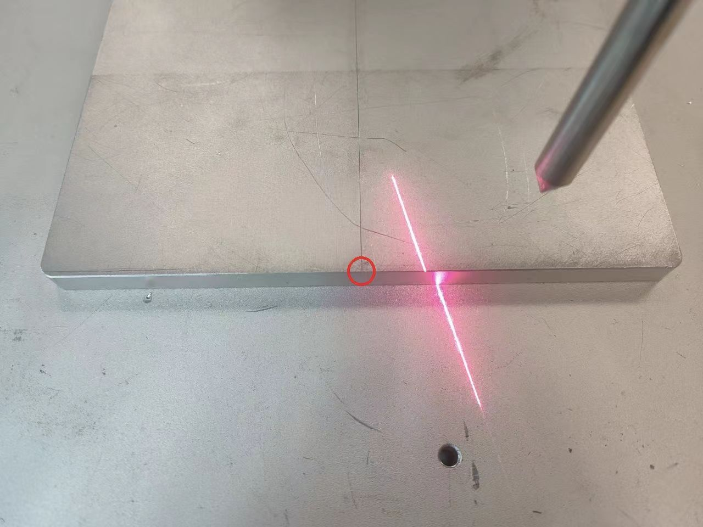

.. centered:: Figure 8.8‑4 Laser Sensor Calibration Point

**Step1**: Open the robot WebApp, navigate to "Initial" -> "Basic" -> "Tool Coordinate" to enter the Tool Coordinate System interface. Select an unused tool coordinate system, click to modify its name to "Welding Torch", set the tool type to "Tool", and the installation location to "End Flange".

.. figure:: robot_peripherals/144.png
   :align: center
   :width: 4in

.. centered:: Figure 8.8‑5 Setting the "Welding Torch" Coordinate System

Select another unused coordinate system, change its name to "Laser Sensor", set the tool type to "Sensor", and the installation location to "End Flange".

.. figure:: robot_peripherals/145.png
   :align: center
   :width: 4in

.. centered:: Figure 8.8‑6 Setting the "Laser Sensor" Coordinate System

**Step2**: Calibrate the tool coordinate system of the welding torch using the Six-Point Method: Select the "Welding Torch" coordinate system, click the modify button, and use the Six-Point Method to calibrate the welding torch tool coordinate system (for specific calibration methods, refer to the F&R documentation, which will not be detailed here).

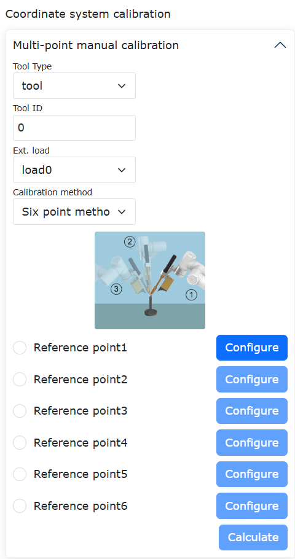

.. centered:: Figure 8.8‑7 "Welding Torch" Coordinate System Calibration

**Step3**: In the "Tool Coordinate System Settings", select the 0th coordinate system (Base Coordinate System), default name "toolcoord0", click "Apply" to switch the current coordinate system to the base coordinate system.

.. figure:: robot_peripherals/147.png
   :align: center
   :width: 4in

.. centered:: Figure 8.8‑8 Sensor Calibration Step 1

**Step4**: Select the previously set "Laser Sensor" coordinate system again (do not click "Apply"), click the "Edit" button, select the tool type as "Sensor", confirm the sensor is fixed on the "Robot End Flange", and select the calibration method as "Five-Point Method".

.. figure:: robot_peripherals/148.png
   :align: center
   :width: 4in

.. centered:: Figure 8.8‑9 Sensor Calibration Step 2

**Step5**: Jog the robot so that the tip of the welding torch aligns with the calibration point, select the "Welding Torch" coordinate system, click "Apply", then click "Set Point 1", as shown in Figure 13.

.. figure:: robot_peripherals/149.png
   :align: center
   :width: 4in

.. centered:: Figure 8.8‑10 Sensor Calibration Step 3

.. figure:: robot_peripherals/150.png
   :align: center
   :width: 4in

.. centered:: Figure 8.8‑11 Sensor Calibration Step 4

**Step6**: Select the 0th coordinate system ("toolcoord0") again; then select the "Sensor" coordinate system (do not click "Apply"), and you can continue with the calibration.

.. figure:: robot_peripherals/147.png
   :align: center
   :width: 4in

.. centered:: Figure 8.8‑12 Sensor Calibration Step 5

.. figure:: robot_peripherals/145.png
   :align: center
   :width: 4in

.. centered:: Figure 8.8‑13 Sensor Calibration Step 6

**Step7**: Move the laser sensor position so that the laser beam just scans the calibration point, click "Set Point 2"; at this time, the sensor output value at the corresponding sequence number on the left will display the current sensor data. If the data is normal, it indicates the current calibration point was successful; otherwise, recalibration is needed.

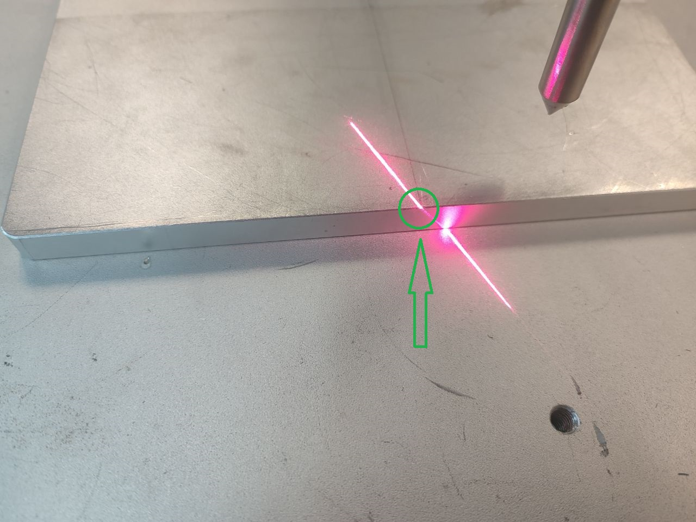

.. centered:: Figure 8.8‑14 Sensor Calibration Step 7

.. figure:: robot_peripherals/152.png
   :align: center
   :width: 4in

.. centered:: Figure 8.8‑15 Sensor Calibration Step 8

**Step8**: Sequentially make the laser irradiate the calibration point from three more different poses, and click "Set Point 3", "Set Point 4", and "Set Point 5" respectively. Finally, ensuring the data for each point is normal, click the "Calculate" button.

.. figure:: robot_peripherals/153.png
   :align: center
   :width: 4in

.. centered:: Figure 8.8‑16 Sensor Calibration Step 9

**Step9**: At this point, the WebApp displays the sensor calibration result and accuracy. Click the "Apply" button to complete the laser sensor calibration. If the calibration accuracy is too poor, you can choose to click the "Cancel" button and recalibrate.

.. figure:: robot_peripherals/154.png
   :align: center
   :width: 4in

.. centered:: Figure 8.8‑17 Sensor Calibration Accuracy

Laser Sensor Application
~~~~~~~~~~~~~~~~~~~~~~~~~~~~~~~~~~~~~~~~~~~~~~~~

Before using the laser sensor, first apply the "Welding Torch" tool coordinate system as the current tool coordinate system.

.. figure:: robot_peripherals/144.png
   :align: center
   :width: 4in

.. centered:: Figure 8.8‑18 Apply Welding Torch Coordinate System

Laser Sensor Teaching Points
++++++++++++++++++++++++++++++++++++++++++++++++++

Jog the robot so that the laser sensor beam points to the desired weld seam point for teaching. In the WebApp, select the sensor as "Laser Sensor", enter the sensor point name as "laserPt", and click the "Add" button. Create a new user program "testLaser.lua", create a PTP motion command, select "laserPt" as the target point, and execute this instruction step by step. At this point, the welding torch will move to the point previously indicated by the laser sensor.

.. figure:: robot_peripherals/155.png
   :align: center
   :width: 4in

.. centered:: Figure 8.8‑19 Laser Sensor Weld Seam Point

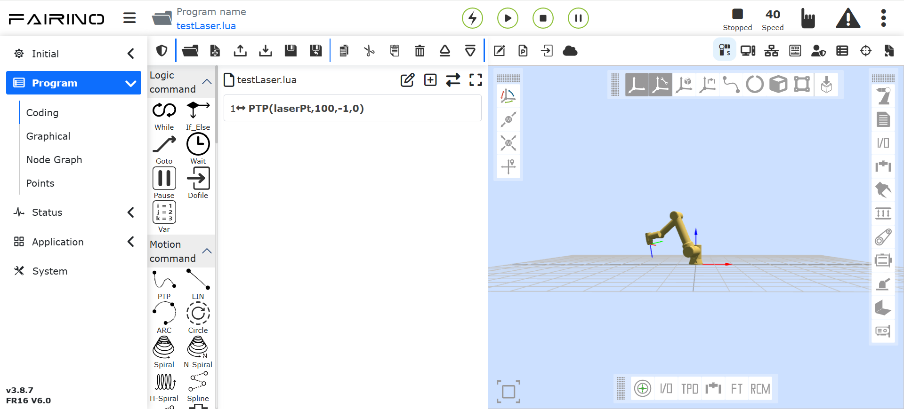

.. centered:: Figure 8.8‑20 Teaching Sensor Point

.. figure:: robot_peripherals/157.png
   :align: center
   :width: 4in

.. centered:: Figure 8.8‑21 Welding Torch Pointing to Weld Seam Point

Laser Seam Finding + Tracking
++++++++++++++++++++++++++++++++++++++++++++++++

The collaborative robot, working with the laser sensor, requires the following steps to complete the laser seam finding + laser tracking function:

(1) The robot moves to a point outside the weld seam;
(2) Start laser seam finding, and the robot moves towards the weld seam position carrying the laser sensor;
(3) The laser sensor identifies the weld seam, and the robot moves the welding torch to the identified weld seam start point;
(4) Laser tracking begins, and simultaneously the robot moves towards the weld seam end point, with the laser sensor recording the position in real time during the movement;
(5) The welding torch moves along the positions recorded by the laser sensor, achieving the tracking effect.

Before debugging seam finding and tracking, please ensure the sensor is correctly installed, the "Welding Torch" tool coordinate system is correctly calibrated, and the laser sensor is also correctly calibrated. Assuming the green line in the figure is the weld seam to be welded, to make the robot automatically find the welding start point A and automatically weld to point B, the following instructions need to be written:

.. figure:: robot_peripherals/158.png
   :align: center
   :width: 4in

.. centered:: Figure 8.8‑22 Sensor Installation

Writing Seam Finding Instructions
****************************************************************

Create a new user program "laserTrack.lua", select "Welding Instructions". Click "Laser Tracking", and the laser tracking instruction addition page will pop up.

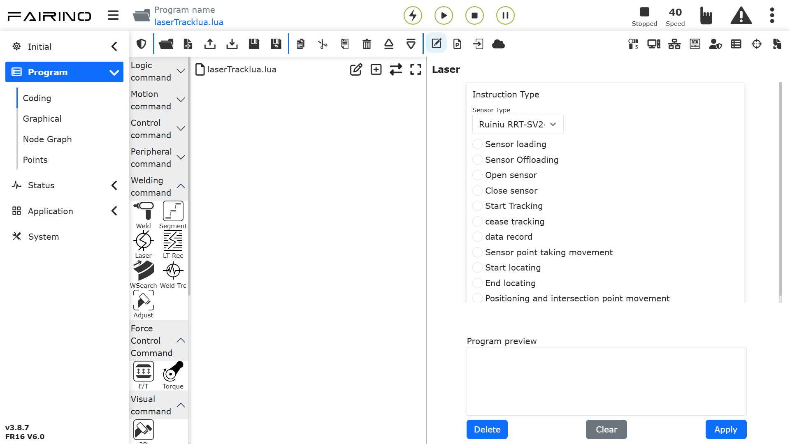

.. centered:: Figure 8.8‑23 Laser Tracking Instruction

Find the "Seam Finding Command", select the coordinate system name as "Laser Sensor", direction select "+x" indicating the robot carrying the laser sensor moves from the current position along the "+x" direction of the "Welding Torch" coordinate system while searching for the weld seam. "Speed" is the moving speed for the laser sensor seam finding, Length is the maximum seam finding length for the laser sensor. If the robot exceeds this length without finding the weld seam, it will report an error. Maximum Seam Finding Time is similar to the length; if this time is exceeded without finding the weld seam, the robot reports an error. Please input the above parameters correctly according to the actual scenario. Click the "Seam Finding Start" and "Seam Finding End" instructions sequentially, and click the "Apply" button.

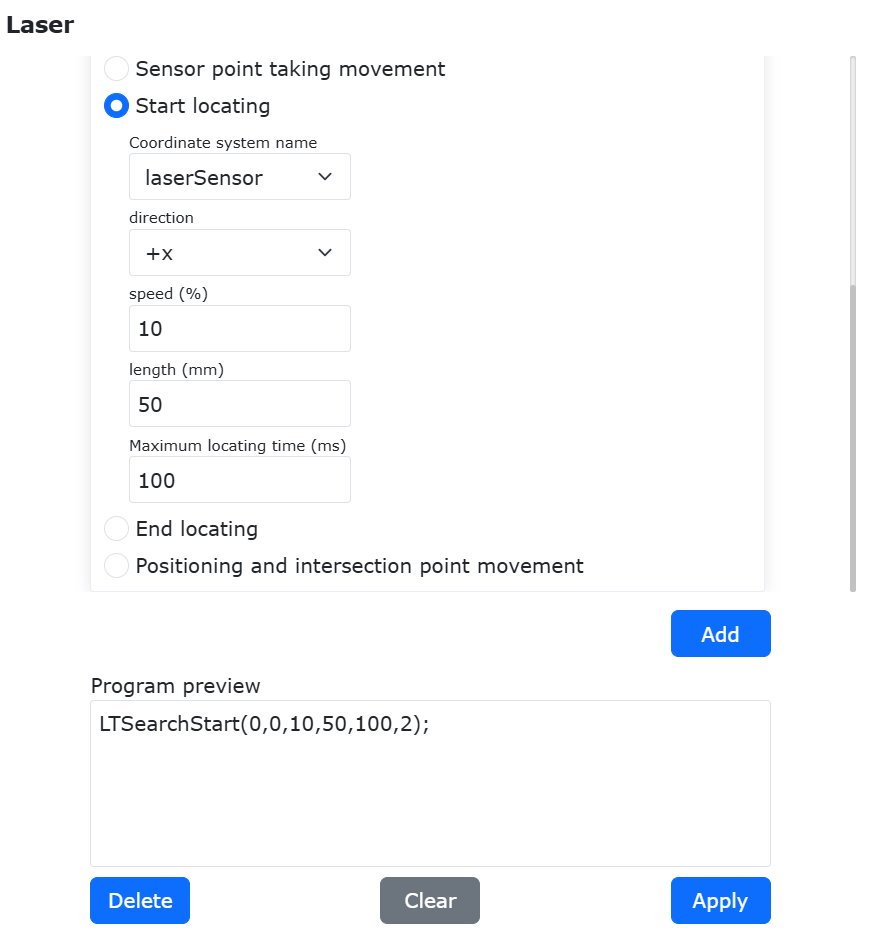

.. centered:: Figure 8.8‑24 Adding Seam Finding Instructions

At this point, the corresponding laser seam finding start and end instructions will be added to "laserTrack.lua".

.. figure:: robot_peripherals/161.png
   :align: center
   :width: 6in

.. centered:: Figure 8.8‑25 Seam Finding Program

Writing Instruction to Move to Seam Finding Point
***********************************************************************

Add a Linear (LIN) point-to-point motion instruction, with the target point being "seamPos", which is the laser sensor seam finding point.

.. note:: The "seamPos" point is an internal point in the robot system dedicated for laser sensor seam finding. There is no need to teach this point manually; after laser sensor seam finding, the seam finding point information is automatically stored in the "seamPos" point.

Offset can be set for the seam finding point. The offset type can be "Base Coordinate System Offset", "Tool Coordinate System Offset", or "Laser Raw Data Offset".

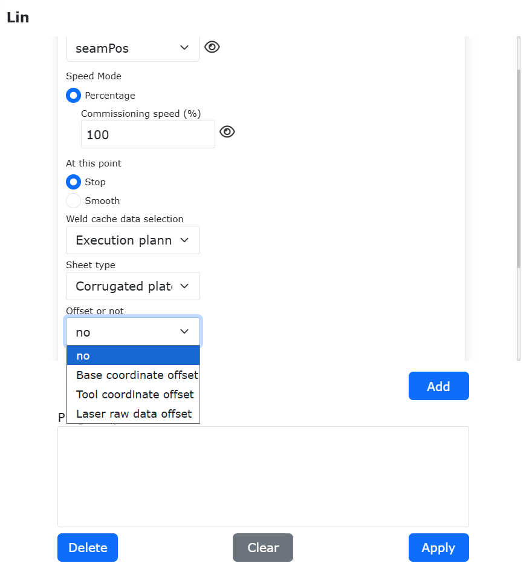

.. centered:: Figure 8.8‑26 Seam Finding Offset Options

When the seam finding offset function is enabled, offset parameters can be set. "dx" represents the offset distance along the x-direction of the selected coordinate system, "drx" represents the rotation angle around the x-axis of the selected coordinate system. Click the "Add" button, then click the "Apply" button.

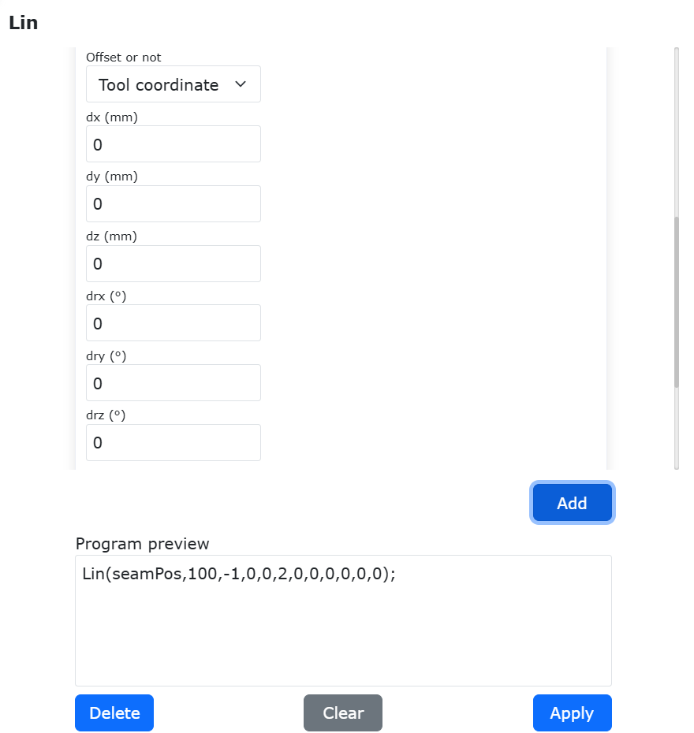

.. centered:: Figure 8.8‑27 Seam Finding Offset Parameter Settings

At this point, the instruction to move to the seam finding point will be added to "testTrack.lua", as shown in Figure 32.

.. figure:: robot_peripherals/164.png
   :align: center
   :width: 6in

.. centered:: Figure 8.8‑28 Seam Finding Offset Program

Writing Laser Tracking Instructions
****************************************************

Open the "Laser Tracking" instruction addition page again, click the "Start Tracking" and "Stop Tracking" buttons sequentially, and finally click the "Apply" button at the bottom of the page.

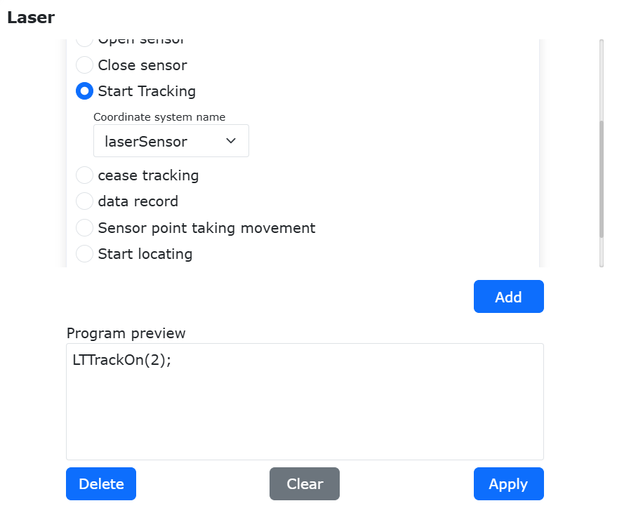

.. centered:: Figure 8.8‑29 Laser Tracking Start and Stop

The user program "testTrack.lua" at this stage:

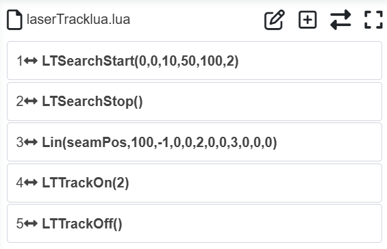

.. centered:: Figure 8.8‑30 Laser Tracking Program

Writing Seam Finding Start Point and Tracking End Point Instructions
************************************************************************************************

Before starting laser seam finding, a seam finding start point needs to be specified. The robot first moves to the seam finding start point, then performs seam finding along a certain direction and speed. Teach the seam finding start point "seamStartPt" near where the laser sensor beam is close to the weld seam start point A. Pay attention to matching the seam finding start point with the seam finding direction to ensure the robot can find the weld seam position within the set distance and maximum seam finding time.

.. figure:: robot_peripherals/167.png
   :align: center
   :width: 4in

.. centered:: Figure 8.8‑31 Seam Finding Start Point

Teach the tracking end point "trackEndPt" at the end of the weld seam.

.. figure:: robot_peripherals/168.png
   :align: center
   :width: 4in

.. centered:: Figure 8.8‑32 Seam Finding End Point

Add the above two points to the "testTrack.lua" user program. The final user program is as follows:

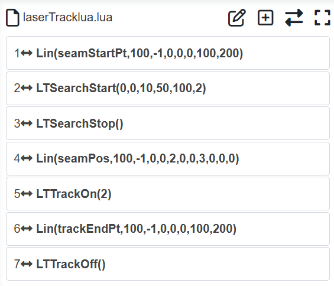

.. centered:: Figure 8.8‑33 Seam Finding and Tracking Program

Writing Welding Related Instructions
***************************************************

Finally, add welding instructions between the welding seam finding point "seampos" and "trackEndPt". The final program is as follows:

.. figure:: robot_peripherals/170.png
   :align: center
   :width: 6in

.. centered:: Figure 8.8‑34 Seam Finding, Tracking, and Welding Program

Execute the above program. The robot will carry the laser sensor to start the seam finding movement from the seam finding start point. After finding the weld seam, the robot immediately moves to the weld seam start point and executes the arc starting operation. After successful arc starting, the robot moves towards the weld seam end point and tracks the weld seam trajectory during the movement. The robot stops welding upon reaching the weld seam end point.

Laser Trajectory Recording + Trajectory Replay
++++++++++++++++++++++++++++++++++++++++++++++++++++++++++++++++++++++++

The workflow for laser trajectory recording + trajectory replay is:

(1) The robot carries the laser sensor to move along a segment of the weld seam, and the laser sensor records the weld seam position trajectory data in real time during the movement;
(2) After the trajectory recording is completed, the robot moves to the starting point of the recorded trajectory;
(3) The robot performs trajectory replay motion along the trajectory recorded by the laser sensor.

Writing Robot Trajectory Recording Instructions
****************************************************************

Create a new user program "testRecord.lua", click "Laser Recording" to open the laser recording instruction addition page, find "Weld Seam Data Recording", select "Start Recording", click the "Add" button, select "Stop Recording", click the "Add" button again; finally click the "Apply" button.

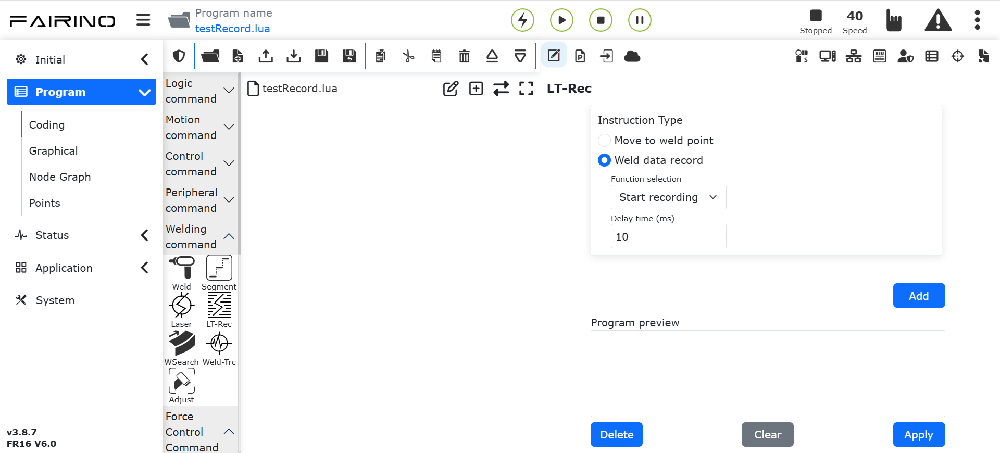

.. centered:: Figure 8.8‑35 Laser Recording

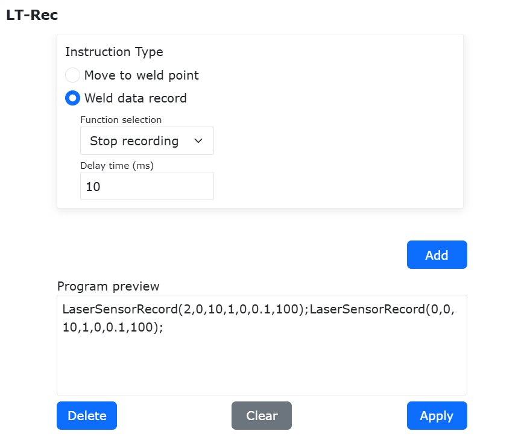

.. centered:: Figure 8.8‑36 Start Recording and Stop Recording

At this point, the trajectory recording start and stop instructions appear on the page.

.. figure:: robot_peripherals/173.png
   :align: center
   :width: 6in

.. centered:: Figure 8.8‑37 Trajectory Recording Program

Assuming the green line segment AB in the figure is the weld seam, make the laser irradiate the weld seam start point A and the weld seam end point B respectively, and teach the trajectory recording start point "recordStartPt" and end point "recordEndPt".

.. figure:: robot_peripherals/174.png
   :align: center
   :width: 4in

.. figure:: robot_peripherals/175.png
   :align: center
   :width: 4in

.. centered:: Figure 8.8‑38 Trajectory Recording Start and End Points

Add two Linear (LIN) motion instructions to "testRecord.lua", for moving to the trajectory recording start point "recordStartPt" and end point "recordEndPt" respectively. Adjust the instruction order so that the robot performs the following operations: first move to the "recordStartPt" point, start trajectory recording, robot moves to the "recordEndPt" point, stop trajectory recording.

.. figure:: robot_peripherals/176.png
   :align: center
   :width: 6in

.. centered:: Figure 8.8‑39 Trajectory Recording Program

Writing Instruction for Robot to Move to Trajectory Recording Start Point
*********************************************************************************************

Click "Laser Recording" to open the laser recording instruction addition page, find the "Move to Weld Seam Point" section, select the motion mode as PTP, input a certain motion speed, click "Move to Start Point", then click the "Apply" button.

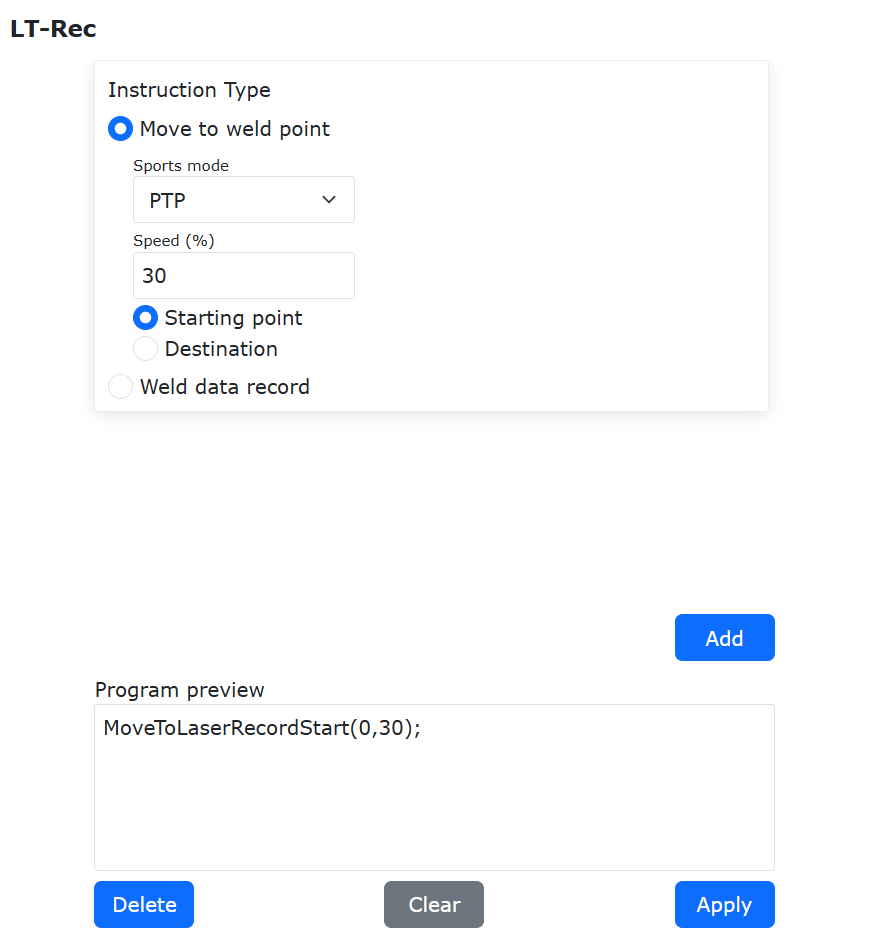

.. centered:: Figure 8.8‑40 Move to Trajectory Start Point

The "testRecord.lua" user program at this stage is as follows:

.. figure:: robot_peripherals/178.png
   :align: center
   :width: 6in

.. centered:: Figure 8.8‑41 Move to Trajectory Start Point Program

Writing Laser Sensor Trajectory Replay Instructions
********************************************************************

Click "Laser Recording" to open the laser recording instruction addition page, find "Weld Seam Data Recording", select "Trajectory Replay", click the "Add" button, click the "Laser Tracking Replay" button, and finally click the "Apply" button.

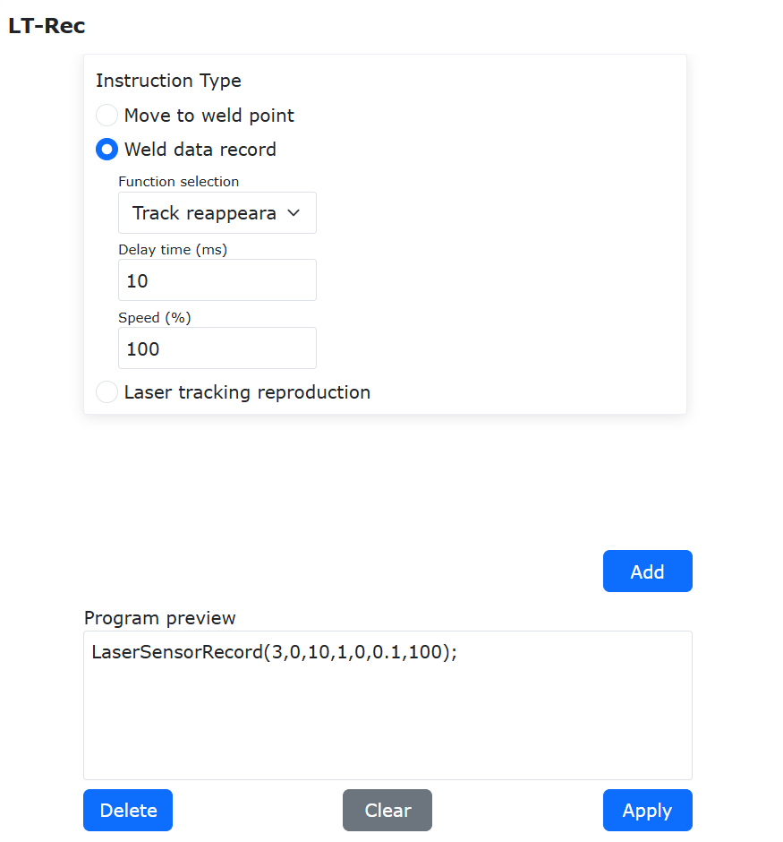

.. centered:: Figure 8.8‑42 Trajectory Replay

The program after addition is as follows:

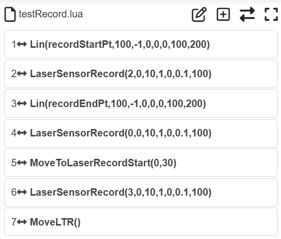

.. centered:: Figure 8.8‑43 Trajectory Replay Program

Writing Welding Related Instructions
************************************************************

Finally, add welding start and welding end instructions before the trajectory replay starts and after it ends:

.. figure:: robot_peripherals/181.png
   :align: center
   :width: 6in

.. centered:: Figure 8.8‑44 Trajectory Recording and Replay Welding Program

Execute the above program. The robot will first carry the laser sensor to move along the weld seam trajectory and record the entire trajectory. Then the robot moves to the start point of the recorded trajectory. The robot starts the arc and begins welding along the trajectory recorded by the laser sensor. When the robot completes the trajectory replay, the welding arc is extinguished, completing the welding.

Laser Sensor Adaptation Controller Peripheral Open Protocol
~~~~~~~~~~~~~~~~~~~~~~~~~~~~~~~~~~~~~~~~~~~~~~~~~~~~~~~~~~~~~~~~~~~~~~~~~~~~~~~~~~

**Step1**: If you need to use "Open Protocol Connection" and "Control Laser Sensor", then in the sensor tracking configuration, select "Peripheral Open Protocol" for the "Protocol Type" option. If using the original scheme, select "Adapted Device", and configure and load the laser peripheral in the tracking sensor interface.

.. figure:: robot_peripherals/182.png
   :align: center
   :width: 4in

.. centered:: Figure 8.8‑45 "Open Protocol Connection" and "Control Laser Sensor" Configuration Interface

**Step2**: Click "Peripheral Open Protocol" to enter the interface. In the "Open Protocol Settings", upload the peripheral open protocol corresponding to the laser sensor. After successful upload, select the protocol number and the uploaded file name, click Configure. Then, in the Device Operation and Status section, run the uploaded laser sensor protocol to establish a connection with the corresponding laser sensor.

.. figure:: robot_peripherals/183.png
   :align: center
   :width: 4in

.. centered:: Figure 8.8‑46 Laser Sensor Connection Establishment

Polishing
---------------

In the "Initial" -> "Peripherals" -> "Polishing" interface, polishing can currently be used via adapted devices or the peripheral open protocol.

.. figure:: robot_peripherals/184.png
   :align: center
   :width: 4in

.. centered:: Figure 8.9-1 Polishing Status Configuration Page

Adapted Devices
~~~~~~~~~~~~~~~~~~~~~~~~~~~~~~~~~~

**Communication Configuration and Loading**: Configure communication information, including IP address, port, sampling period, and communication protocol. Establish communication with the polishing device using the Load/Unload buttons.

.. figure:: robot_peripherals/185.png
   :align: center
   :width: 4in

.. centered:: Figure 8.9-2 Communication Configuration and Loading

**Device Functions**: Operations such as device enabling, error clearing, and force sensor zeroing can be performed.

.. figure:: robot_peripherals/186.png
   :align: center
   :width: 4in

.. centered:: Figure 8.9-3 Device Functions

**Parameter Configuration**: Parameters such as the polishing device's rotation speed, contact force, extension distance, and control mode can be set. After successful setting, the corresponding data and status are displayed in the right "Polish" status feedback column.

.. figure:: robot_peripherals/187.png
   :align: center
   :width: 4in

.. centered:: Figure 8.9-4 Parameter Configuration

.. figure:: robot_peripherals/188.png
   :align: center
   :width: 4in

.. centered:: Figure 8.9-5 Parameter Configuration

Peripheral Open Protocol
~~~~~~~~~~~~~~~~~~~~~~~~~~~~~~~~~~

Click "Peripheral Open Protocol" to enter the interface. In the "Open Protocol Settings", upload the peripheral open protocol corresponding to the polishing device. After successful upload, select the protocol number and the uploaded file name, click Configure. Then, in the Device Operation and Status section, run the uploaded polishing peripheral open protocol to establish a connection with the corresponding polishing device.

.. figure:: robot_peripherals/189.png
   :align: center
   :width: 4in

.. centered:: Figure 8.9‑6 Polishing Device Connection establishment

Auxiliary Sensors
-------------------

In the "Initial" -> "Peripherals" -> "Auxiliary Sensors" interface, it is currently available for use with adapted devices. The custom protocol function is not yet open.

.. figure:: robot_peripherals/190.png
   :align: center
   :width: 4in

.. centered:: Figure 8.10‑1 Auxiliary Sensors--Adapted Devices

Adapted Devices
~~~~~~~~~~~~~~~~~~~

Click "Adapted Devices" to enter the auxiliary sensor configuration interface.

The configuration information for auxiliary sensors includes manufacturer, type, software version, and mounting location. Users can configure the corresponding auxiliary sensor information according to specific production requirements.

If users need to change the configuration, they can first select the corresponding auxiliary sensor number, click the "Clear" button to clear the corresponding configuration, and then reconfigure according to requirements.

.. figure:: robot_peripherals/191.png
   :align: center
   :width: 4in

.. centered:: Figure 8.10‑2 Auxiliary Sensors--Adapted Devices

Combined Devices (SmartTool + Force Sensor Combination)
---------------------------------------------------------------------------------

In the "Initial" -> "Peripherals" -> "Combined Devices" interface, it is currently available for use with adapted devices. The custom protocol is not yet open.

.. figure:: robot_peripherals/192.png
   :align: center
   :width: 4in

.. centered:: Figure 8.11-1 Combined Devices

Adapted Devices
~~~~~~~~~~~~~~~~~~~

Click "Adapted Devices" to enter the configuration interface.

The configuration information is divided into manufacturer, type, software version, and mounting location. Different manufacturers correspond to different types. The current manufacturer is FR.

Users can configure the corresponding device information according to specific production requirements. After successful configuration, the device information table is displayed. If users need to change the configuration, they can first select the corresponding number, click the "Clear" button to clear the corresponding information, and then reconfigure the device information according to requirements.

.. important::
  Before clicking to clear the configuration, the corresponding device should be in an inactive state.

.. image:: robot_peripherals/193.png
   :width: 4in
   :align: center

.. centered:: Figure 8.11‑2 Adapted Devices

FR
++++++++++

The type corresponding to FR is "SmartTool" used in combination with a force sensor. The collaborative robot can be adapted to three types of force sensors: XJC, NSR, and GZCX. When using different sensors, only the corresponding communication protocol needs to be loaded, as follows:

- SmartTool + XJC-6F-D82 (XJC).
- SmartTool + NSR-FT Sensor A (NSR).
- SmartTool + GZCX-6F-75A (GZCX).

1. Hardware Installation

1) Disassemble the SmartTool handle, take out the middle fixture, and install it on the robot end. After the fixture is installed, reassemble the SmartTool handle. After successful reassembly, connect the cable to the robot end.

.. image:: robot_peripherals/194.png
   :width: 3in
   :align: center

.. centered:: Figure 8.11‑3 Installing the Middle Fixture of the SmartTool Handle

.. image:: robot_peripherals/195.png
   :width: 3in
   :align: center

.. centered:: Figure 8.11‑4 SmartTool Handle Installed Successfully

2) After the SmartTool handle is installed, mount the force sensor (using GZCX as an example) to the end of the SmartTool handle, and connect the cable to the SmartTool handle.

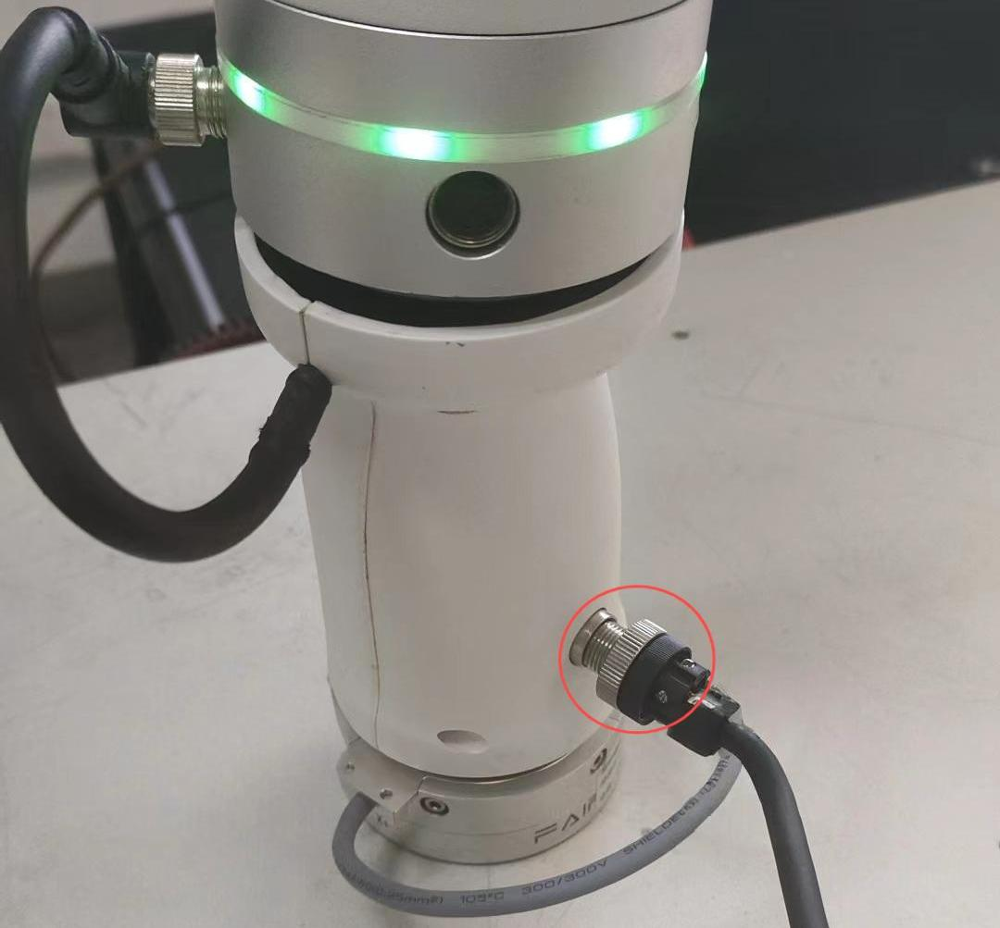

.. centered:: Figure 8.11‑5 GZCX Force Sensor Installed at the End of the SmartTool Handle

2. Device Configuration

.. important:: Please ensure that your SmartTool handle is securely installed on the robot end and correctly connected to the robot end, and that the force sensor is securely installed on the end of the SmartTool handle and correctly connected to the SmartTool handle.

1) Configure the SmartTool handle (refer to Welding Handle Key Function Configuration).

2) After configuring the SmartTool handle key functions, set the manufacturer to "FR", select the "Type", "Software Version", and "Mounting Location" information, and click the "Configure" button.

.. image:: robot_peripherals/197.png
   :width: 4in
   :align: center

.. centered:: Figure 8.11‑6 FR Device Information Configuration Interface

3) After successfully configuring the device information, select the configured force sensor, click the "Activate" button to activate the force sensor. After successful activation, click the "Zero Calibration" button to zero the force sensor, and view the table data.

.. image:: robot_peripherals/198.png
   :width: 4in
   :align: center

.. centered:: Figure 8.11‑7 Force Sensor Zero Calibration

4) According to the current end installation, configure the load data in the "Load" interface, and configure the tool coordinate data, tool type, and installation position in the "Tool Coordinate" interface.

.. image:: robot_peripherals/199.png
   :width: 4in
   :align: center

.. centered:: Figure 8.11‑8 "End Load" Configuration

.. image:: robot_peripherals/200.png
   :width: 4in
   :align: center

.. centered:: Figure 8.11‑9 "Tool Coordinate" Configuration

3. Application

After the device information is successfully configured, it can independently implement the SmartTool button functions and force sensor functions, such as measuring the magnitude and direction of force, and auxiliary drag locking based on the force sensor.

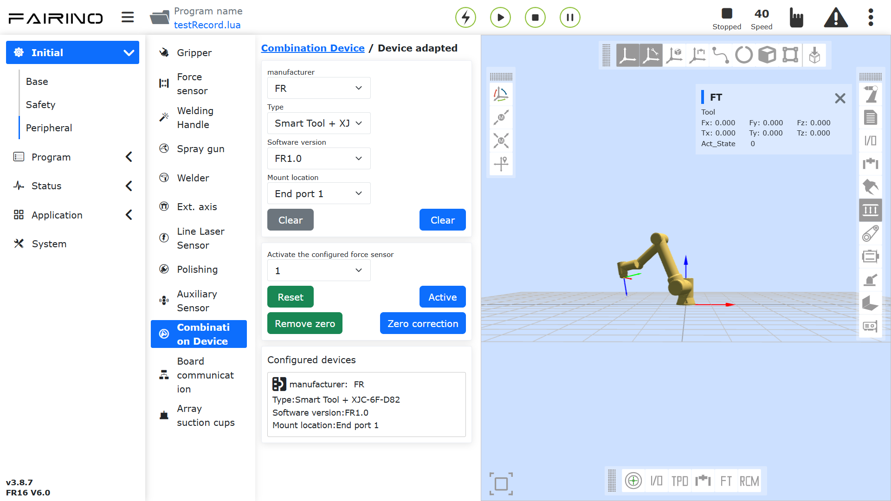

.. centered:: Figure 8.11‑10 Measuring Force Magnitude and Direction

Array Suction Cups
----------------------------------

Overview
~~~~~~~~~~~~~~~~~~~~~~

Installing array suction cups on the robot end can help quickly deploy material grasping workstations for different scenarios. The number and layout of suction cups can be customized for materials of different sizes and shapes, improving work efficiency and stability.

The collaborative robot supports an array of up to 20 suction cups. Individual suction cups can be controlled for grasping and releasing, or the entire connected array can be controlled to act synchronously. Each suction cup supports configuration of station numbers from 1 to 20, configured based on DynamicLAB software.

Hardware Description
+++++++++++++++++++++++++++++++++++++++++++

The collaborative robot communicates with and controls the suction cup array via an Ethernet to 485 module. The WebApp generates the communication protocol for the array suction cups. The protocol sends control data to the Ethernet to 485 module via TCP/IP. The module then sends the received control data to each suction cup via 485, thus achieving control of the array suction cups (the control data format is ModbusRTU protocol format).

The Ethernet to 485 module acts as the server for Ethernet communication and the master for 485 communication. Each suction cup in the array is a 485 communication slave station, and each suction cup should be configured with a different slave station number.

.. figure:: robot_peripherals/202.png
   :align: center
   :width: 6in

.. centered:: Figure 8.12-1 Collaborative Robot Suction Cup Array Gripper Application

The Ethernet to 485 module usually has two TCP Server ports corresponding to multiple 485 slave ports. Taking CH9121 as an example, its TCP Server port 1 corresponds to 485 slave ports 1-10, and TCP Server port 2 corresponds to 485 slave ports 11-20. The robot establishes two TCP communications with the Ethernet to 485 module, ultimately controlling 20 suction cups respectively.

The aforementioned Ethernet to 485 module needs to be configured as follows:

- ① Ethernet end configured as TCP Server, IP address: 192.168.58.10, Port 1 number: 50001, Port 2 number: 50002;
- ② 485 end configured with baud rate 115200, data bits 8, stop bits 1, no parity. The Ethernet to 485 module usually comes with a debugging software where the above configuration can be performed. The following figure shows the configuration tool page for the CH9121 model Ethernet to 485 module:

.. .. figure:: robot_peripherals/203.png
..    :align: center
..    :width: 6in

.. .. centered:: Figure 8.12-2 Ethernet to 485 Module Debugging Tool

Function Configuration
~~~~~~~~~~~~~~~~~~~~~~~~~~~~~~~~

Open the WebApp, click sequentially "Initial" -> "Peripherals" -> "Array Suction Cups"; The control modes for array suction cups are Unicast Mode and Broadcast Mode:

**Unicast Mode**: The communication protocol includes control content for each suction cup, allowing independent control of each suction cup in the array.

**Broadcast Mode**: Generates a communication protocol for all suction cups in the array, allowing synchronous control of grasping and releasing for all suction cups in the array, but cannot control a single suction cup individually.

Depending on the actual scenario, you can configure only Unicast Mode, or configure both modes simultaneously (allowing both individual control of specific suction cups and synchronous control of all suction cups).

.. figure:: robot_peripherals/204.png
   :align: center
   :width: 4in

.. centered:: Figure 8.12-3 Array Suction Cup Control Mode

Unicast Mode Configuration
++++++++++++++++++++++++++++++++++

Open the WebApp, click sequentially "Initial" -> "Peripherals" -> "Array Suction Cups" -> "Unicast Mode". There are two methods for configuring the Unicast Mode protocol: "Auto Configuration" and "Manual Configuration":

.. figure:: robot_peripherals/205.png
   :align: center
   :width: 4in

.. centered:: Figure 8.12-4 Unicast Configuration Mode

**Auto Configuration**: Upload an existing protocol file directly to the robot controller. The existing protocol file may come from: ① Downloaded from another robot that has already configured and debugged the array suction cups; ② Written by technical personnel according to the actual scenario (users writing protocol files can achieve more flexible and efficient suction cup control). If multiple devices use the same array suction cups, using Auto Configuration to directly upload the protocol can improve deployment speed.

**Manual Configuration**: Configure the communication protocol for each suction cup according to the slave ID and vacuum level of the suction cups in the array. The manual configuration steps are as follows:

Select slave station number 1, input the maximum vacuum, minimum vacuum, grasp timeout time (timeout is not yet open), and click the "Configure" button. At this time, a suction cup protocol with protocol number 1 appears in the "Device Operation and Status" column, and the "Manual Configuration" and "Slave Station Number" labels will display all currently configured slave station numbers.

.. figure:: robot_peripherals/206.png
   :align: center
   :width: 4in

.. centered:: Figure 8.12-5 Configuring Unicast Suction Cup

Repeat the above steps to configure suction cups for multiple slave station numbers as needed. Each time a suction cup is configured, the robot system automatically updates the suction cup communication protocol content corresponding to "Protocol Number: 1", supporting up to 20 suction cups. After all suction cups are configured, click the "Connect" button in the "Protocol Number 1" box. The communication between the robot and the suction cups starts running, and the "Run Status" indicator lights up (Note: Please complete the configuration of all slave station number suction cups first, then click the "Connect" button. Configuring suction cup slaves after communication is established is invalid).

After the communication between the robot and the suction cups is successfully established, a list of operation boxes for all configured suction cup slave stations appears in the "Device Operation and Status" column; In the operation box page corresponding to each slave station number suction cup, suction cup control and status monitoring can be performed (including "Suction Status", "Current Vacuum", "Suction Cup Pressure", etc.). The suction cup slave station IDs configured in the figure below are 2 and 11 respectively.

.. figure:: robot_peripherals/207.png
   :align: center
   :width: 4in

.. centered:: Figure 8.12-6 Unicast Suction Cup Connection

Click the "Suction" button in the upper right corner of the control box for slave station number 1 suction cup, and the suction cup will execute the "Set Vacuum Suction" action. At this time, the "Suction" button becomes the "Release" button. Click this button again, and the suction cup will execute the release action. When the suction cup performs the above actions, the corresponding status items such as "Suction Status" and "Current Vacuum" will display the suction cup's status in real time.

.. note:: Note: After configuring the suction cup protocol and completing the connection, you need to click the "Suction" button once to activate the suction cup. This can also test whether the communication between the robot and the suction cup is normal.

If the connection between the robot and the suction cup fails, the suction cup control box will not be displayed, and the run status indicator in "Protocol Number: 1" will be off.

.. note:: Note: If the physical communication connection between the suction cup and the Ethernet to 485 module is disconnected and then reconnected during use, it may cause the protocol to fail to establish a connection. In this case, you can unplug and replug the network cable of the Ethernet to 485 module and try to connect again.

.. figure:: robot_peripherals/208.png
   :align: center
   :width: 4in

.. centered:: Figure 8.12-7 Robot and Suction Cup Connection Failed

Unicast Mode Protocol Download
++++++++++++++++++++++++++++++++++++++++++

Click the "Download" button in "Manual Configuration" to download the suction cup protocol to the local computer. The suction cup protocol is a cyclically executed LUA program. The program executes the following steps in each cycle:

- ① Read suction cup control data from the robot;
- ② Write control data to the suction cup via socket;
- ③ Read status data from the suction cup via socket;
- ④ Feedback suction cup status data to the robot;

The suction cup communication protocol cyclically executes to achieve communication control between the robot and the suction cups. In the communication protocol, users can customize the cycle period, control data register address, and status data register address, and can modify the protocol content according to the actual situation. The following is a suction cup communication protocol code example:

Suction Cup Protocol Program Example:

.. code-block:: console
    :linenos:

    local id = 1
    local ctrlValues = {0, 0, 0, 0, 0, 0, 0, 0, 0, 0, 0, 0, 0, 0, 0, 0, 0, 0, 0, 0}
    local realTimeState = {0, 0, 0, 0, 0, 0, 0, 0, 0, 0}
    local suckerConfig = {0, 0, 0, 0, 0, 0, 0, 0, 0, 0}
    clearSuckerState()
    socket1 = TCPClientConnect('192.168.58.10', 50001, 500, 10, 2, 3)
    socket2 = TCPClientConnect('192.168.58.10', 50002, 500, 10, 2, 3)
    suckerConfig[1] = 30
    suckerConfig[2] = 20
    suckerConfig[3] = 100
    ModbusRTUOverTCPWriteMultiReg(socket1, 0, 0x0501, 3, suckerConfig)
    ModbusRTUOverTCPWriteMultiReg(socket2, 0, 0x0501, 3, suckerConfig)
    sleep_ms(10)
    while(1) do
      setAllCtrl,ctrlValues[1],ctrlValues[2],ctrlValues[3],ctrlValues[4],ctrlValues[5],ctrlValues[6],ctrlValues[7],ctrlValues[8],ctrlValues[9], ctrlValues[10], ctrlValues[11], ctrlValues[12],ctrlValues[13],ctrlValues[14],ctrlValues[15],ctrlValues[16],ctrlValues[17],ctrlValues[18],ctrlValues[19], ctrlValues[20] = getSuckerCtrlState()
      if(setAllCtrl ~= 0) then
        ModbusRTUOverTCPWriteSingleReg(socket1, 0, 0x0500, setAllCtrl)
        ModbusRTUOverTCPWriteSingleReg(socket2, 0, 0x0500, setAllCtrl)
        ctrlValues = {0, 0, 0, 0, 0, 0, 0, 0, 0, 0, 0, 0, 0, 0, 0, 0, 0, 0, 0, 0}
        sleep_ms(1)
      else
        ModbusRTUOverTCPWriteSingleReg(socket1, 2, 0x0500, ctrlValues[2])
        ModbusRTUOverTCPWriteSingleReg(socket2, 11, 0x0500, ctrlValues[11])
      end
      suckerState, pressValue, error, default1, default2 = ModbusRTUOverTCPReadReg(socket1, 2, 0x0600, 3)
      realTimeState[1] = suckerState
      realTimeState[2] = pressValue
      realTimeState[3] = error
      ctrlState, maxPress, minPress, time, default2 = ModbusRTUOverTCPReadReg(socket1, 2, 0x0500, 4)
      realTimeState[4] = ctrlState
      realTimeState[5] = maxPress
      realTimeState[6] = minPress
      realTimeState[7] = time
      setSuckerRealtimeState(2, realTimeState)
      suckerState, pressValue, error, default1, default2 = ModbusRTUOverTCPReadReg(socket2, 11, 0x0600, 3)
      realTimeState[1] = suckerState
      realTimeState[2] = pressValue
      realTimeState[3] = error
      ctrlState, maxPress, minPress, time, default2 = ModbusRTUOverTCPReadReg(socket2, 11, 0x0500, 4)
      realTimeState[4] = ctrlState
      realTimeState[5] = maxPress
      realTimeState[6] = minPress
      realTimeState[7] = time
      setSuckerRealtimeState(11, realTimeState)
      local stopFlag = GetOpenLUAStopFlag(id)
      if(stopFlag ~= 0) then
        TCPClientDisconnect(socket1)
        TCPClientDisconnect(socket2)
        clearSuckerState()
        break
      end
      sleep_ms(100)
    end

The above protocol uses the `getSuckerCtrlState()` instruction to obtain suction cup control data, uses the `ModbusRTUOverTCPWriteSingleReg()` instruction to write control data to the suction cups via communication, uses the `ModbusRTUOverTCPReadReg()` instruction to read the status data of the suction cups, and then uses the `setSuckerRealtimeState()` instruction to feedback the suction cup status data to the robot. The detailed definitions of these instructions are as follows:

.. centered:: Table 8.12-1 getSuckerCtrlState() Return Values

.. list-table::
   :widths: 10 10 20 40
   :header-rows: 0
   :align: center
   :class: sheet-center

   * - **No.**
     - **Type**
     - **Variable Name**
     - **Description**

   * - 1
     - int
     - setAllCtrl
     - Broadcast mode control data: 1-Suction at max vacuum; 2-Suction at set vacuum, i.e., suction cup vacuum maintained between max and min vacuum; 3-Stop suction

   * - 2 ~ 21
     - int
     - ctrlValues[i]
     - Suction cup control data corresponding to slave station numbers 1 ~ 20: 1-Suction at max vacuum; 2-Suction at set vacuum, i.e., suction cup vacuum maintained between max and min vacuum; 3-Stop suction

.. centered:: Table 8.12-2 ModbusRTUOverTCPWriteSingleReg() Detailed Parameters

.. list-table::
   :widths: 10 10 20 40
   :header-rows: 0
   :align: center
   :class: sheet-center

   * - **No.**
     - **Type**
     - **Variable Name**
     - **Description**

   * - 1
     - int
     - socket
     - Socket handle

   * - 2
     - int
     - slaveID
     - Slave station number 0-20; 0-Broadcast; 1~20-Slave station number

   * - 3
     - uint16_t
     - regAddr
     - Write register address

   * - 4
     - uint16_t
     - data
     - Data to write

.. centered:: Table 8.12-3 ModbusRTUOverTCPWriteMultiReg() Detailed Parameters

.. list-table::
   :widths: 10 10 20 40
   :header-rows: 0
   :align: center
   :class: sheet-center

   * - **No.**
     - **Type**
     - **Variable Name**
     - **Description**

   * - 1
     - int
     - socket
     - Socket handle

   * - 2
     - int
     - slaveID
     - Slave station number 0-20; 0-Broadcast; 1~20-Slave station number

   * - 3
     - uint16_t
     - regStartAddr
     - Start address for writing multiple registers

   * - 4
     - int
     - num
     - Number of registers to write

   * - 5
     - uint16_t[]
     - data
     - Array of data content to write

.. centered:: Table 8.12-4 ModbusRTUOverTCPReadReg() Detailed Parameters

.. list-table::
   :widths: 10 10 20 40
   :header-rows: 0
   :align: center
   :class: sheet-center

   * - **No.**
     - **Type**
     - **Variable Name**
     - **Description**

   * - 1
     - int
     - socket
     - Socket handle

   * - 2
     - int
     - slaveID
     - Slave station number 0-20; 0-Broadcast; 1~20-Slave station number

   * - 3
     - uint16_t
     - regStartAddr
     - Start address for reading multiple registers

   * - 4
     - int
     - num
     - Number of registers to read

.. centered:: Table 8.12-5 ModbusRTUOverTCPReadReg() Return Values

.. list-table::
   :widths: 10 10 20 40
   :header-rows: 0
   :align: center
   :class: sheet-center

   * - **No.**
     - **Type**
     - **Variable Name**
     - **Description**

   * - 1
     - int
     - suckState
     - Suction cup current status: 0-Object released or suction cup started successfully; 1-Workpiece detected, object adsorbed; 2-No object adsorbed; 3-Object detached

   * - 2
     - float
     - pressValue
     - Current vacuum/pressure

   * - 3
     - int
     - err
     - Error code: 0-Normal; Others: Abnormal

.. centered:: Table 8.12-6 setSuckerRealtimeState() Detailed Parameters

.. list-table::
   :widths: 10 10 20 40
   :header-rows: 0
   :align: center
   :class: sheet-center

   * - **No.**
     - **Type**
     - **Variable Name**
     - **Description**

   * - 1
     - int
     - slaveID
     - Slave ID

   * - 2
     - int[]
     - states
     - states[1]: Current status 0-Object released or suction cup started successfully; 1-Workpiece detected, object adsorbed; 2-No object adsorbed; 3-Object detached.
        states[2]: Current vacuum/pressure;
        states[3]: Wait register value;
        states[4]: Control status;
        states[5]: Maximum vacuum;
        states[6]: Minimum vacuum;
        state[7]: Timeout time;
        states[8~10]: Reserved.

Broadcast Mode
++++++++++++++++++++++++++++++++++

The collaborative robot can control all connected suction cups to act simultaneously through Broadcast Mode.

.. note:: Note: Unicast Mode must be configured first before configuring Broadcast Mode.

Open the WebApp, click sequentially "Initial" -> "Peripherals" -> "Array Suction Cups", first complete the configuration of all required suction cup slave stations in Unicast Mode (configure only, do not establish communication protocol connection).

Click "Broadcast Mode", input the "Maximum Vacuum", "Minimum Vacuum", "Grasp Timeout Time" (timeout is not yet open) for the suction cups in the "Parameter Configuration", and click the "Configure" button. At this time, the broadcast mode communication protocol appears in the "Device Operation and Status" box. In broadcast mode, setting the vacuum parameters takes effect for every connected suction cup.

.. figure:: robot_peripherals/209.png
   :align: center
   :width: 4in

.. centered:: Figure 8.12-8 Broadcast Mode Parameter Configuration

Click the "Connect" button in the "Protocol Number 1" operation box. The "Run Status" indicator lights up, indicating that communication has been established between the robot and the array suction cups. After successful connection, the operation box list for all connected suction cups is displayed in the "Device Operation and Status" column.

Click "Start" in "Parameter Configuration" -> "One-key Suction", and each suction cup in the array suction cups will perform the "Set Vacuum Suction" action. Click "Stop", and each suction cup in the array suction cups will stop the suction action.

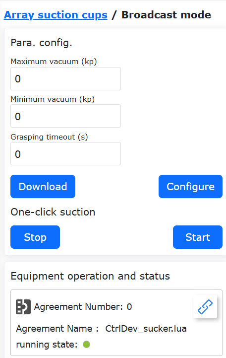

.. centered:: Figure 8.12-9 Broadcast Mode Communication Established

Downloading the protocol file in Broadcast Mode is the same as in Unicast Mode. The protocol files downloaded from both locations can be uploaded to the robot via the "Auto Configuration" in the Unicast Mode page.

Array Suction Cup LUA Program Application
~~~~~~~~~~~~~~~~~~~~~~~~~~~~~~~~~~~~~~~~~~~~~~~~~~~~~~~~~~~~~~~~

Adding array suction cup control, status acquisition, and other instructions to the robot LUA program, combined with robot motion instructions, can flexibly and conveniently implement material grasping and handling applications.

Open the WebApp, click sequentially "Teach Program" -> "Program Programming", and create a new LUA program "testSucker.lua".

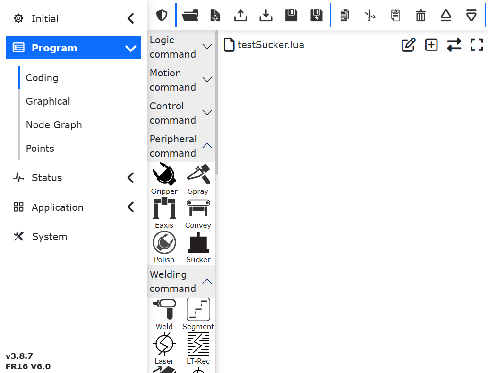

.. centered:: Figure 8.12-10 Create New "testSucker.lua" Program

Select the instruction type as "Peripheral Instruction", and click the "Suction Cup" button in the peripheral instructions. At this time, the "Sucker" array suction cup instruction addition page appears on the right side of the WebApp.

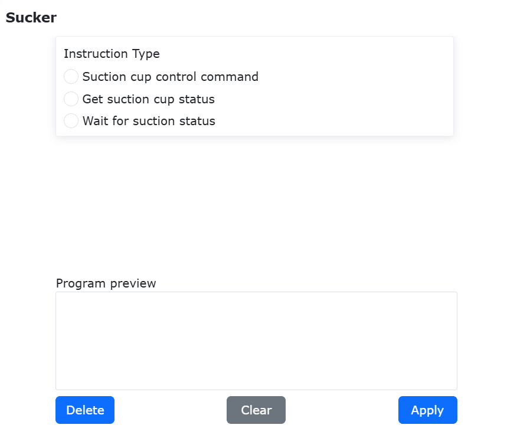

.. centered:: Figure 8.12-11 Array Suction Cup Instruction Addition

Suction Cup Control Instruction Addition
+++++++++++++++++++++++++++++++++++++++++++

Writing suction cup control instructions in the LUA program allows for suction control and release control of the suction cups. Unicast Mode and Broadcast Mode controls have different logical effects.

Unicast Mode Control Instruction Addition
***********************************************************

Unicast Mode control can control single or multiple suction cups based on the starting slave station address and quantity, and can set different control states for each suction cup.

In the suction cup instruction addition page, click "Suction Cup Control Instruction", select the control mode as "Unicast Mode", input the slave station number as 1, the write quantity as 2, and the suction states as "1,2". Click the "Add" button to add a Unicast Mode suction cup control instruction in the "Program Preview".

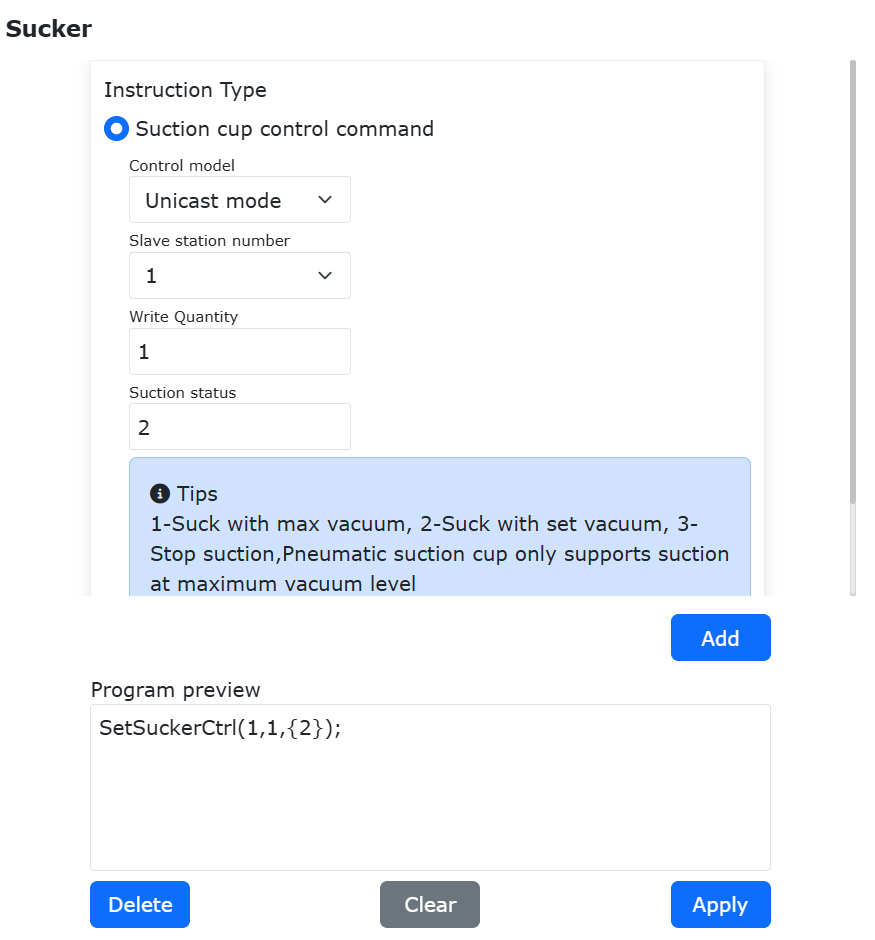

.. centered:: Figure 8.12-12 Add Suction Cup Control Instruction

The meanings of the parameters in the suction cup control instruction are as follows:

- **Slave Station Number**: The starting slave station number for Unicast Mode control of suction cups.
- **Write Quantity**: The number of suction cups to control starting from the starting slave station number in Unicast Mode.
- **Suction States**: In Unicast Mode, starting from the starting slave station number, the control state flag for each suction cup (1-Suction at max vacuum; 2-Suction at set vacuum, i.e., suction cup vacuum maintained between max and min vacuum; 3-Stop suction); The control state flags for each suction cup are separated by ",", and the number of control flags must match the number of suction cups to be controlled; If you want to control two suction cups, with control operations being "Suction at max vacuum" and "Suction at set vacuum" respectively, then the input for this item is "1,2".

Click the "Apply" button. At this time, a suction cup control instruction is added to the "testSucker.lua" program. Switch the robot to automatic mode and execute this LUA program. The robot will control the two suction cups with slave station numbers 1 and 2 to perform suction actions at maximum vacuum and set vacuum respectively.

.. figure:: robot_peripherals/214.png
   :align: center
   :width: 4in

.. centered:: Figure 8.12-13 Add Suction Cup Instruction in LUA Program

Adding Broadcast Mode Control Commands
***********************************************************

The suction state set by the broadcast mode control command takes effect on all currently connected suction cups.

Click "Suction Cup Control Command", select the control mode as "Broadcast Mode", and enter the suction state as 1 (suction with maximum vacuum). Click the "Add" button.

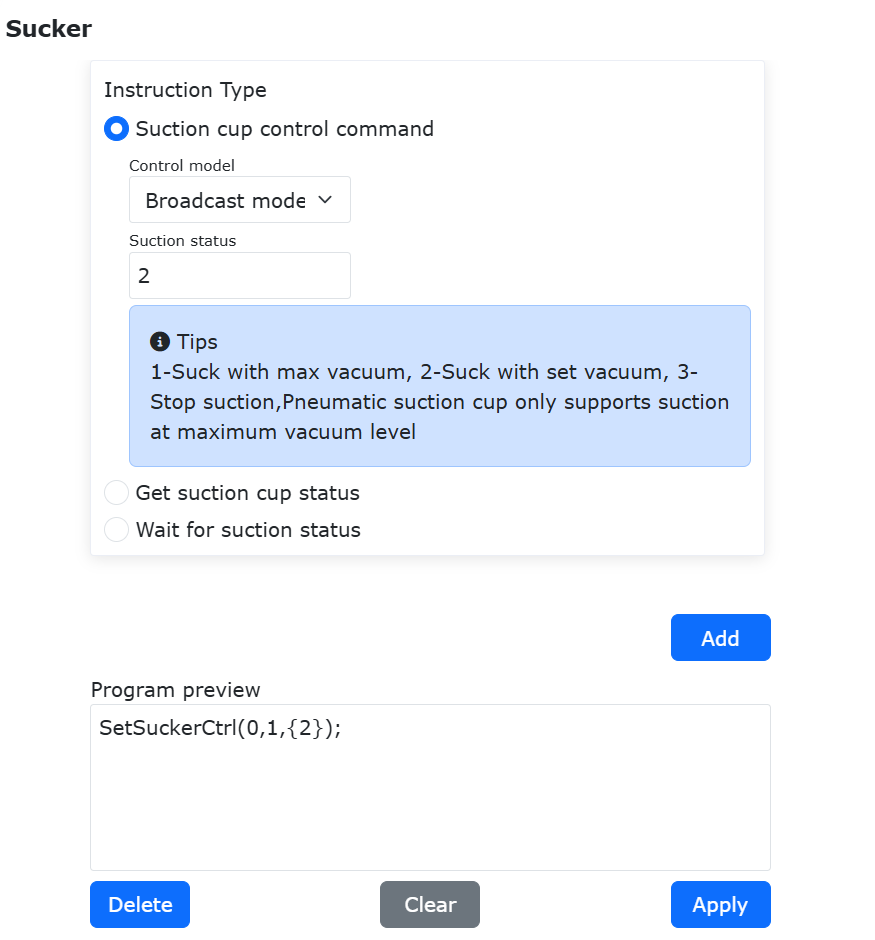

.. centered:: Figure 8.12-14 Adding a Broadcast Control Command

Click the "Apply" button. At this point, a broadcast mode suction cup control command is added to the "testSucker.lua" file. Switch the robot to automatic mode and execute this program, then all connected suction cups will start the suction action with maximum vacuum.

.. figure:: robot_peripherals/216.png
   :align: center
   :width: 4in

.. centered:: Figure 8.12-15 Adding a Broadcast Control Command in the LUA Program

Adding Suction Cup Status Acquisition Command
+++++++++++++++++++++++++++++++++++++++++++++++++++++++++

Click "Get Suction Cup Status", select the slave station number of the suction cup whose status you want to obtain, then click the "Add" and "Apply" buttons sequentially. This adds a command "GetSuckerState(1)" to get the suction cup status in "testSucker.lua".

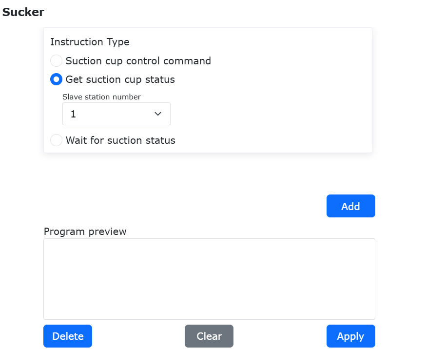

.. centered:: Figure 8.12-16 Adding the Get Suction Cup Status Command

The GetSuckerState() command returns 3 values, as follows:

- **state**: The current state of the suction cup: 0-Object released or suction cup started successfully; 1-Workpiece detected, object adsorbed; 2-No object adsorbed; 3-Object detached.
- **pressValue**: Current vacuum/pressure value;
- **err**: Error code: 0-Normal; Others: Abnormal.

In "testSucker.lua", use three variables to receive the return values of the GetSuckerState() function. Use Lua variable queries to display the above information in the WebApp Variable Query Display Area.

.. figure:: robot_peripherals/218.png
   :align: center
   :width: 4in

.. centered:: Figure 8.12-17 Program for Getting Suction Cup Status

Adding Wait for Suction Cup Adsorption Status Command
+++++++++++++++++++++++++++++++++++++++++++++++++++++++++

In practical applications of array suction cups, it is often necessary to wait for the suction cup to complete suction (release) before executing the next action. The collaborative robot provides a command to wait for the suction cup action to complete. This command ends execution when the suction cup reaches the set state; otherwise, it blocks and waits for the suction cup action to complete within the set timeout period.

On the array suction cup command addition page, click "Wait for Suction Cup Adsorption Status", select the corresponding suction cup slave station number 1, select the control mode as "Workpiece detected, object adsorbed", and enter the timeout time as 10000ms. Click the "Add" button.

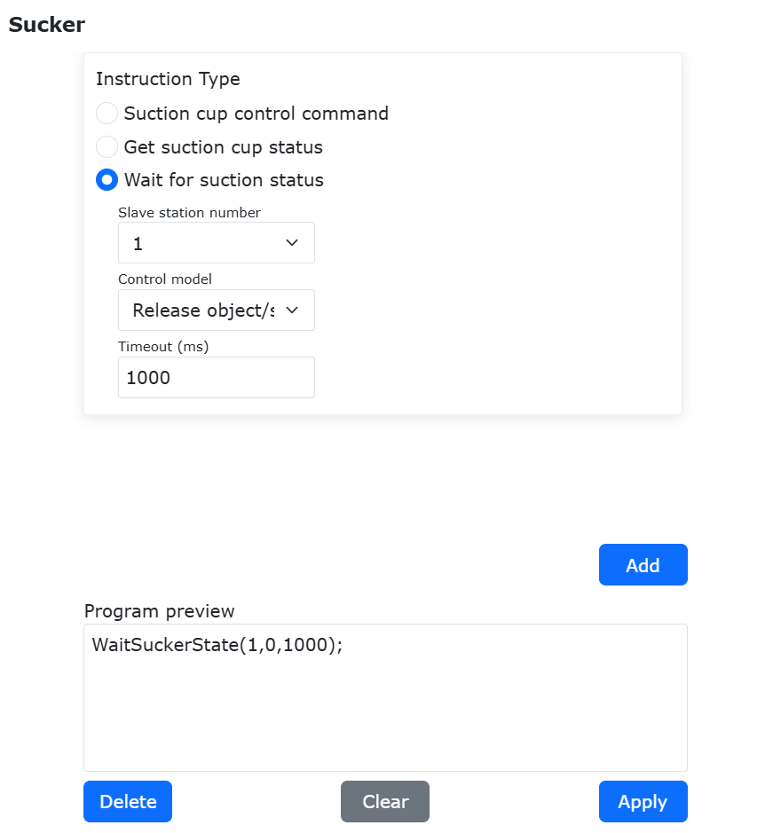

.. centered:: Figure 8.12-18 Adding the Wait for Suction Cup Status Command

Click the "Apply" button. A command to wait for the suction cup to adsorb an object is added to "testSucker.lua".

.. figure:: robot_peripherals/220.png
   :align: center
   :width: 4in

.. centered:: Figure 8.12-19 Adding Wait for Suction Cup to Adsorb Object in LUA Program

Application Example
++++++++++++++++++++++++++++++++++

Example LUA program for suction cup handling control:

.. code-block:: console
  :linenos:

  while (1) do 
  ::satety_suck::
  PTP(sucker_safey,100,-1,0)
  PTP(sucker_suck,100,-1,0)
  SetSuckerCtrl(2, 1, {2})
  SetSuckerCtrl(11, 1, {2})
  loop1 = 0 
  while (loop1 < 10) do 
      state, press, errorcode = GetSuckerState(2)
      RegisterVar("number","state")
      RegisterVar("number","press")
      RegisterVar("number","errorcode")
      state11, press11, errorcode11 = GetSuckerState(11)
      RegisterVar("number","state11")
      RegisterVar("number","press11")
      RegisterVar("number","errorcode11")
      loop1 = loop1 + 1
      WaitMs(50)
  end
  
  if(state11 == 1) then
      PTP(sucker_safey,100,-1,0)
      PTP(sucker_release,100,-1,0)
      WaitMs(1000)
      SetSuckerCtrl(2, 1, {3})
      SetSuckerCtrl(11, 1, {3})
      WaitMs(500)
  else
      PTP(sucker_safey,100,-1,0)
      SetSuckerCtrl(2, 1, {3})
      SetSuckerCtrl(11, 1, {3})
      WaitMs(2000)
      goto satety_suck
  end
  ::satety_release::
  PTP(sucker_safey,100,-1,0)
  PTP(sucker_release,100,-1,0)
  SetSuckerCtrl(2, 1, {2})
  SetSuckerCtrl(11, 1, {2})
  loop1 = 0 
  while (loop1 < 10) do 
      state, press, errorcode = GetSuckerState(2)
      RegisterVar("number","state")
      RegisterVar("number","press")
      RegisterVar("number","errorcode")
      state11, press11, errorcode11 = GetSuckerState(11)
      RegisterVar("number","state11")
      RegisterVar("number","press11")
      RegisterVar("number","errorcode11")
      loop1 = loop1 + 1
      WaitMs(50)
  end
  
  if(state11 == 1) then
      PTP(sucker_safey,100,-1,0)
      PTP(sucker_suck,100,-1,0)
      WaitMs(1000)
      SetSuckerCtrl(2, 1, {3})
      SetSuckerCtrl(11, 1, {3})
      WaitMs(500)
  else
      PTP(sucker_safey,100,-1,0)
      SetSuckerCtrl(2, 1, {3})
      SetSuckerCtrl(11, 1, {3})
      WaitMs(2000)
      goto satety_release
  end
  end 

CNC Function Package Based on FOCAS (For Linux Systems Only)
--------------------------------------------------------------------------------------------------

Overview
~~~~~~~~~~~~~

To automate the loading and unloading process in machine tool processing, a CNC function package based on FOCAS communication has been developed, enabling communication interaction and coordinated motion between the collaborative robot and the CNC machine tool.

As shown in the figure, FOCAS communication is based on Ethernet. By connecting the robot control box network port to the embedded network port of the machine tool with an Ethernet cable, FOCAS communication between the robot and the machine tool can be established, enabling CNC control and machine tool status monitoring from the robot side.

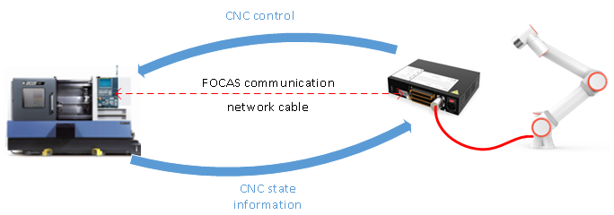

.. centered:: Figure 8.13‑1 FOCAS Communication Topology Diagram Between Robot and CNC

The functions currently supported by the control box's CNC function package based on FOCAS communication for machine tool control and status feedback are shown in the table.

.. centered:: Table 8.13-1 Supported Functions of the FOCAS-based CNC Function Package

.. list-table:: 
   :widths: 15 40 100
   :header-rows: 0
   :align: center
   :class: sheet-center

   * - **No.**
     - **Function Name**
     - **Description**
   * - 1
     - Machine Tool Type
     - Status Feedback
   * - 2
     - FOCAS Communication Status
     - Status Feedback
   * - 3
     - Auto Mode Operation
     - Control, Status Feedback
   * - 4
     - Alarm Status
     - Status Feedback
   * - 5
     - Safety Door
     - Status Feedback
   * - 6
     - Chuck
     - Control, Status Feedback
   * - 7
     - Emergency Stop
     - Control, Status Feedback
  
Related Operation Instructions
~~~~~~~~~~~~~~~~~~~~~~~~~~~~~~~~~~~~~~~~~~~~~~~~~~~~~~~~~~~~~~~~~~

Establishing FOCAS Communication
+++++++++++++++++++++++++++++++++++++++++++++++++++++++++

FOCAS communication is based on Ethernet. It requires forming a local area network (LAN) connecting the robot, CNC machine tool, and PC to achieve physical link connection, and finally establishing FOCAS communication through the robot's open protocol.

Network Configuration
**************************************************

**Step1**: First, change the IP address of the PC to the same subnet as the robot control box. The robot control box's IP address is "192.168.58.2".

If no switch is used for networking, you can use the two built-in network ports on the robot control box for networking. The operation is as follows: Log in to the robot's WebAPP, go to System Settings -> General Settings -> Network Settings, set the IP address of Port 0 to: 192.168.58.2; set the IP address of Port 1 to 192.168.57.2. Simultaneously, set WebAPP to use Port 0 and WebRecovery to use Port 1, as shown in the figure. After completing all settings, click Set Network.

.. figure:: robot_peripherals/222.png
   :align: center
   :width: 6in

.. centered:: Figure 8.13‑2 Robot Network Configuration Diagram

**Step2**: Then restart the control box and connect it to the PC via the Port 0 network port, then log in to the robot WebApp. Also, configure the IP address of the CNC machine tool that needs communication to be in the same subnet as the PC and the robot control box, i.e., 192.168.58.xx, and change the machine tool's port to 8193. This completes all network configuration.

Open Protocol File Configuration
**************************************************

**Step1**: Then proceed with the peripheral open protocol configuration. First, you need to create a new lua file named starting with `CtrlDev_CNC` as the open protocol file for establishing FOCAS communication, such as `CtrlDev_CNC_demo.lua`.

This file needs to set the Open Protocol ID and use the `CNCComSet` function to establish or disconnect the connection with the CNC. The parameter descriptions for the `CNCComSet` function are shown in the table below. Example code is as follows.

.. centered:: Table 8.13-2 CNCComSet Function Parameter Description Table

.. list-table:: 
   :widths: 15 40 100
   :header-rows: 0
   :align: center
   :class: sheet-center

   * - **No.**
     - **Parameter Name**
     - **Description**
   * - 1
     - Machine Tool Manufacturer
     - 0-Invalid 1-Machine Tool (FOCAS)
   * - 2
     - Communication Command
     - 1-Establish Connection 1001-Disconnect
   * - 3
     - Machine Tool IP Address
     - --
   * - 4
     - Machine Tool Port Number
     - --

Open protocol example code for establishing FOCAS connection:

.. code-block:: console
    :linenos:

    local id = 1      --Open LUA Protocol ID
    --FOCAS Disconnect
    CNCComSet(1, 1001, '192.168.57.100', 8193)
    sleep_ms(1000)
    --FOCAS Establish Connection
    CNCComSet(1, 1, '192.168.57.100', 8193)
    sleep_ms(1000)
    while(1) do
    sleep_ms(5000)
    end

**Step2**: After writing the open protocol lua file, select the just-created `CtrlDev_CNC_fanuc.lua` file and upload it. Select the ID set in the file, choose the uploaded open protocol file from the dropdown, and click Configure.

.. figure:: robot_peripherals/223.png
   :align: center
   :width: 4in

.. centered:: Figure 8.13‑3 Open Protocol File Upload and Configuration

**Step3**: Then check that all communication links are normal and confirm the CNC machine tool is powered on. Click the Connect button in the open protocol. You can confirm whether the connection with the machine tool is established through the CNC -> FOCAS Communication Status in the status feedback panel on the right (Red light: Connection established; Gray: Connection disconnected), as shown in the figure.

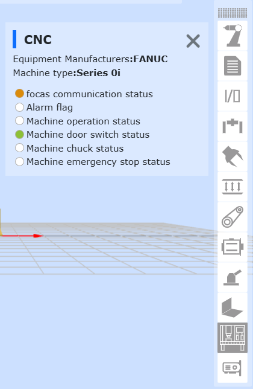

.. centered:: Figure 8.13‑4 FOCAS Communication Connection Established

CNC Status Feedback Description
++++++++++++++++++++++++++++++++++++++++++++++++++++

The status feedback of the CNC machine tool is displayed on the CNC icon in the peripheral status feedback area on the far right of the WebAPP, as shown in the figure. Clicking it will display all current statuses of the machine tool, including equipment manufacturer, machine tool type, FOCAS communication status, alarm flag, machine tool operation status, machine door switch status, machine chuck status, and machine emergency stop status.

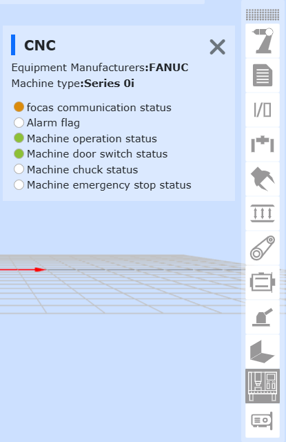

.. centered:: Figure 8.13‑5 CNC Status Feedback Panel

The meanings of the status feedback indicator lights for CNC are shown in the table below.

.. centered:: Table 8.13-3 Meanings of CNC Status Feedback Indicator Lights

.. list-table:: 
   :widths: 15 40 100
   :header-rows: 0
   :align: center
   :class: sheet-center

   * - **No.**
     - **Function Name**
     - **Description**
   * - 1
     - FOCAS Communication Status
     - Gray-Communication disconnected Red-Communication normal
   * - 2
     - Alarm Flag
     - Gray-No alarm Red-Alarm exists
   * - 3
     - Machine Tool Operation Status
     - Gray-Stopped Green-Running
   * - 4
     - Machine Door Status
     - Gray-Door closed Green-Door open
   * - 5
     - Machine Chuck Status
     - Gray-Loosened Green-Clamped
   * - 6
     - Machine Emergency Stop Status
     - Gray-E-stop inactive Green-E-stop active

CNC Control Description
++++++++++++++++++++++++++++++++++++++++++++++++++++

The control for the CNC machine tool is located in the Peripheral Open Protocol. After the FOCAS communication connection is completed, click the upper right corner of the configured peripheral open protocol to open the CNC control page, as shown in the figure.

.. note:: The control buttons include Door Control (Open, Close), Chuck Control (Clamp, Loosen), Start/Stop Control (Run, Stop), and Emergency Stop Control (E-stop, Inactive). All control signals are edge-triggered.

.. figure:: robot_peripherals/226.png
   :align: center
   :width: 4in

.. centered:: Figure 8.13‑6 CNC Control Page

CNC Teach Program Description
++++++++++++++++++++++++++++++++++++++++++++++++++++

The CNC function package supports calling control commands in teach programs and obtaining machine tool status in real time. Navigate sequentially to "Teach Program" -> "Program Programming" -> "Peripheral Commands" -> "CNC" to see all supported CNC teach commands, as shown in the figure.

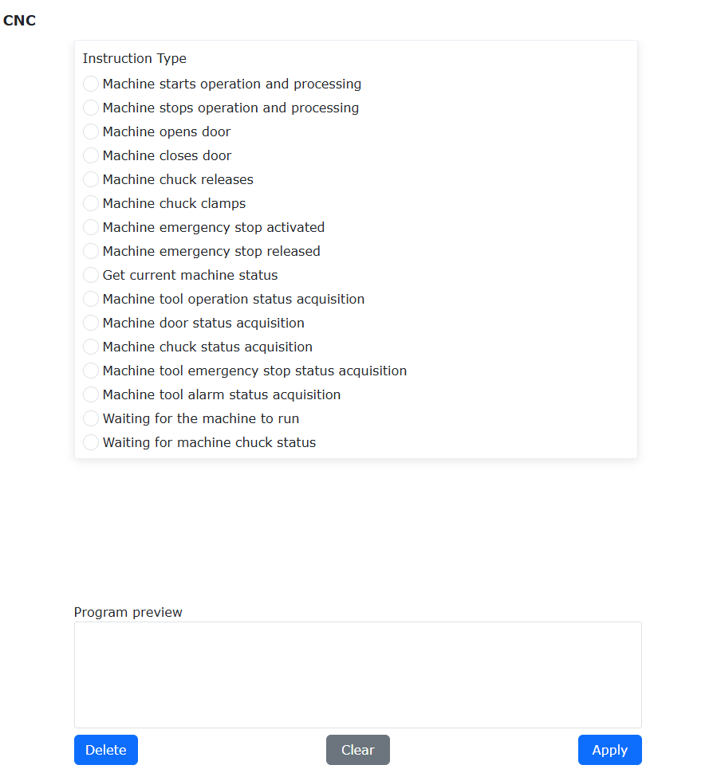

.. centered:: Figure 8.13‑7 CNC Teach Commands

.. note:: The control commands correspond one-to-one with the CNC controls and are all edge signal effective, meaning that after a start command is executed, a stop command must be executed before the next start command will take effect.

"Get Current Machine Tool Status" is a Lua function. This function returns 9 parameters, whose meanings are shown in the table below.

.. centered:: Table 8.13-4 Return Value Description for "Get Current Machine Tool Status"

.. list-table:: 
   :widths: 15 40 100
   :header-rows: 0
   :align: center
   :class: sheet-center

   * - **No.**
     - **Name**
     - **Meaning**
   * - 1
     - Equipment Manufacturer
     - 0-Invalid 1-Other-Reserved
   * - 2
     - FOCAS Communication Status
     - 0-Communication normal Other-Communication disconnected
   * - 3
     - Machine Tool Model (string)
     - '15' : Series 150/150i '16' : Series 160/160i '18' : Series 180/180i '21' : Series 210/210i '30' : Series 300i '31' : Series 310i '32' : Series 320i '0' : Series 0i 
   * - 4
     - Machine Tool Type (string)
     - '15' : Series 150/150i '16' : Series 160/160i '18' : Series 180/180i '21' : Series 210/210i '30' : Series 300i '31' : Series 310i '32' : Series 320i '0' : Series 0i 
   * - 5
     - Machine Tool Operation Status
     - 0-Stopped 1-Running
   * - 6
     - Machine Tool Emergency Stop Status
     - 0-E-stop active Other-E-stop inactive
   * - 7
     - Machine Tool Alarm Status
     - 0-No alarm Other-Alarm exists
   * - 8
     - Machine Tool Door Status
     - 0-Door open 1-Door closed
   * - 9
     - Machine Tool Chuck Status
     - 0-Loosened 1-Clamped

A Lua teach program example is written for the robot loading/unloading process. This example program includes controlling the CNC door (close, open), operation (run, stop), chuck (loosen, clamp), and uses the obtained CNC current status as judgment conditions to set the robot's movement between three points: safety point, pick point, and place point, as shown in the code.

Example Lua Teach Program for Coordinated Motion between Robot and CNC:

.. code-block:: console
    :linenos:

     while (1) do 
        CNCDoorClose()
        CNCWorkStart()
        WaitMs(1000)
        t1,t2,t3,t4,t5,t6,t7,t8,t9=CNCGetStatus()
        if t5 == 1 then
            PTP(CNCsafe,100,-1,0)
        else
            CNCWorkStop()
            CNCDoorOpen()
            WaitMs(1000)
            PTP(CNCg1,100,-1,0)
            WaitMs(1000)
            CNCChuckOpen()
            PTP(CNCg2,100,-1,0)
            PTP(CNCsafe,100,-1,0)
        end
        t1,t2,t3,t4,t5,t6,t7,t8,t9=CNCGetStatus()
        if t8 == 0 then
            if t5 == 0 then
                PTP(CNCg2,100,-1,0)
                 PTP(CNCg1,100,-1,0)
                 CNCChuckFastening()
                 WaitMs(1000)
                 PTP(CNCsafe,100,-1,0)
             end   
         end
    end

Virtual Wall Configuration Based on Force Sensor
--------------------------------------------------------------------------------

The virtual wall function based on the force sensor allows setting virtual walls to limit the robot's workspace and avoid direct collision contact.

Force Sensor Installation and Configuration
~~~~~~~~~~~~~~~~~~~~~~~~~~~~~~~~~~~~~~~~~~~~~~~~~~~~~~~~~~~~~~~~~~

**Step1**: Taking the "Kunwei" sensor as an example, during installation, the coordinate system direction of the force sensor must be consistent with the end flange coordinate system, as shown in Figure 1 (In Figure 1, red indicates the X+ direction of the end flange coordinate system, green indicates the Y+ direction, and blue indicates the Z+ direction);

.. figure:: robot_peripherals/228.png
   :align: center
   :width: 4in

.. figure:: robot_peripherals/229.png
   :align: center
   :width: 4in

.. centered:: Figure 8.14‑1 Force Sensor Installation

**Step2**: Under the "Initial" -> "Peripherals" -> "Force Sensor" menu bar, click "Adapted Devices" to enter the force sensor device configuration interface.

The force sensor configuration information includes manufacturer, type, software version, and mounting location. Users can configure the corresponding force sensor information according to specific production needs. If users need to change the configuration, they can first select the corresponding number, click the "Clear" button to clear the corresponding information, and reconfigure according to requirements; the specific operation is shown in the figure.

**Step3**: Select the configured force sensor number, click the "Reset" button. After the page pops up indicating the command was sent successfully, click the "Activate" button. Check the activation status in the force sensor information table to determine if activation was successful. Additionally, the force sensor will have initial values. Users can choose "Zero Calibration" and "Remove Zero" according to usage needs. Force sensor zero calibration requires ensuring the force sensor is level and vertically downward, and the robot has no configured load.

.. figure:: robot_peripherals/016.png
   :align: center
   :width: 4in

.. centered:: Figure 8.14‑2 Force Sensor Configuration and Activation

.. figure:: robot_peripherals/017.png
   :align: center
   :width: 4in

.. centered:: Figure 8.14‑3 Force Sensor Activation

Virtual Wall Configuration
~~~~~~~~~~~~~~~~~~~~~~~~~~~~~~~~~~~~~~~~~~~~

To use the force sensor for assisted dragging, a dragging handle needs to be installed under the force sensor, and a tool coordinate system needs to be configured. The specific operation is shown in Figure 4. At this point, the method for detecting the interference zone uses the set tool coordinate system position as a reference; if not set, the end flange is used as the reference.

**Step1**: Under the "Initial" -> "Safety" -> "Interference Zone" menu bar, click "Single" to enter the interference zone configuration function interface;

**Step2**: It is necessary to configure the interference method and the operation upon entering the interference zone; click "Cube Interference" to enter the configuration interface, set the operation upon entering the interference zone during dragging to "Do Not Restrict Dragging", and the operation upon entering during motion can be set as needed;

**Step3**: According to requirements, the parameter configuration can be modified. The detection method is divided into two types: "Command Position" and "Feedback Position". The interference zone mode is divided into two types: "Interference Within Range" and "Interference Outside Range". The reference coordinate system is selected as "Base Coordinate". Set according to actual use. Detailed operations are shown in the figure;

.. figure:: robot_peripherals/230.png
   :align: center
   :width: 4in

.. figure:: robot_peripherals/231.png
   :align: center
   :width: 4in

.. centered:: Figure 8.14‑4 Installing Dragging Handle and Setting Tool Coordinate System

.. figure:: robot_peripherals/232.png
   :align: center
   :width: 4in

.. centered:: Figure 8.14‑5 Virtual Wall Parameter Configuration

**Step4**: The interference zone mode under parameter configuration is divided into two types: "Interference Within Range" and "Interference Outside Range";

.. figure:: robot_peripherals/233.png
   :align: center
   :width: 4in

.. centered:: Figure 8.14‑6 Interference Within Range

.. figure:: robot_peripherals/234.png
   :align: center
   :width: 4in

.. centered:: Figure 8.14‑7 Interference Outside Range

**Step5**: Establish the interference zone. The specific operation is shown in Figure 7 and Figure 8; it is recommended to set the interference area as large as possible when selecting "Interference Outside Range".

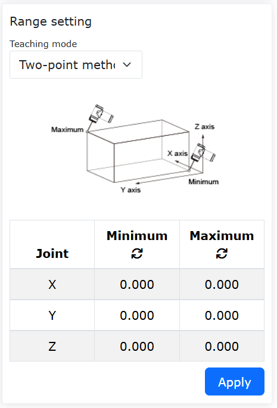

.. centered:: Figure 8.14‑8 Establishing Interference Zone Using Two-Point Method

.. figure:: robot_peripherals/236.png
   :align: center
   :width: 4in

.. centered:: Figure 8.14‑9 Establishing Interference Zone Using Center Point + Side Length Method

Force Sensor Assisted Dragging
~~~~~~~~~~~~~~~~~~~~~~~~~~~~~~~~~~~~~~~~~~~~~~~~~~~~~~~~~~~~~~~~~~~~~~~~~~~~~~

**Step1**: Under the "Application" -> "Tool App" menu, click "Drag Lock" to enter the force sensor assisted locking function interface;

**Step2**: Set the parameters as shown in the figure below to enable the virtual wall function based on the force sensor. The specific effect is: approaching the virtual wall, resistance increases; moving away from the virtual wall, the force sensor assisted dragging function works normally.

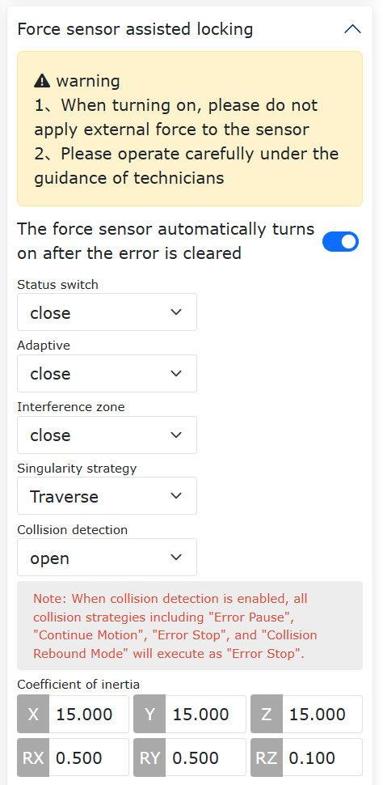

.. figure:: robot_peripherals/238.png
   :align: center
   :width: 4in

.. centered:: Figure 8.14‑10 Parameter Settings for Force Sensor Assisted Dragging

Specific functions of the parameters:

**Adaptive Selection**: Enable when assembly is needed; dragging becomes heavier after enabling;

**Inertia Parameter**: Adjusts the feel during dragging; operate with caution under the guidance of technical personnel.

**Damping Parameter**:

-  Translational Direction: Recommended parameter range [100-200];
-  Rotational Direction: Recommended parameter range [3-10], with the RZ direction range being [0.1-5];
-  Effect: When dragging with the sensor, increasing damping makes dragging difficult, decreasing damping makes dragging the robot too easy (recommended not to set it too small);
-  Overall Damping Parameter Range: Translational XYZ: [100-1000]; Rotational RX, RY: [3-50], RZ: [2-10];
-  Maximum Drag Force is 50, Maximum Drag Speed is 180.

**Stiffness Parameter**: Set all to 0;

**Drag Force Threshold**: Translational XYZ is [5-10]; Rotational RX, RY, RZ is [0.5-5];

**Maximum Drag Force**: 50;

**Maximum Drag Speed**: 180;

Six-Axis Force and Joint Impedance Hybrid Dragging Function
~~~~~~~~~~~~~~~~~~~~~~~~~~~~~~~~~~~~~~~~~~~~~~~~~~~~~~~~~~~~~~~~~~~~~~~~~~~~~~~~~~~~

Overview
++++++++++++++++++++++++++++++++++++++++

The six-axis force and joint impedance hybrid dragging function utilizes the force sensor to perceive external forces, allowing the robot to perform assisted dragging in drag mode. Different dragging experiences can be achieved by adjusting the gain coefficients. Joint impedance uses impedance control to limit the drag force.

Force Sensor Installation Configuration and Zeroing Operation
++++++++++++++++++++++++++++++++++++++++++++++++++++++++++++++++++++++++++++++++++++++++++++++++++++++

1. Force Sensor Installation Configuration

For detailed operations on force sensor installation configuration, refer to the section above: Virtual Wall Configuration Based on Force Sensor.

2. Force Sensor Zeroing

To facilitate dragging the robot, a drag handle needs to be installed below the sensor, as shown in Figure 1.

.. figure:: robot_peripherals/239.png
   :align: center
   :width: 4in

.. centered:: Figure 8.14‑11 Drag Handle

**Step1**: Set the tool coordinate system according to the actual handle length, as shown in Figure 2.

**Step2**: Under the "Initial" -> "Basic" -> "Load" menu, click "Sensor" to enter the Force/Torque Sensor Load interface.

Using the drag button, adjust the robot end effector to face horizontally downwards. Then, click "Load" -> "Sensor Identification" to enter the interface, find the "Record Initial Position" button in the "Sensor Auto Zeroing" section. Then, switch the robot mode to automatic mode and click the "Auto Zero" button. After the program finishes running, the sensor zeroing is complete. Detailed operations are shown in the figures.

.. figure:: robot_peripherals/231.png
   :align: center
   :width: 4in

.. centered:: Figure 8.14‑12 Tool Coordinate System Setup

.. figure:: robot_peripherals/240.png
   :align: center
   :width: 4in

.. centered:: Figure 8.14‑13 Force/Torque Sensor Auto Zeroing

Six-Axis Force and Joint Impedance Hybrid Dragging
++++++++++++++++++++++++++++++++++++++++++++++++++++++++++++++++++++++++

1. Assisted Dragging

**Step1**: Under the "Application" -> "Tool App" menu, click "Drag Lock" to enter the drag lock function interface.

**Step2**: In the "Six-Axis Force and Joint Impedance Hybrid Dragging" section, set the Control Status to "On", the Impedance Enable Status to "Off", set the Drag Gain, the End Linear Speed to 1000 mm/s, the Angular Speed Limit to 100 °/s, then click the "Apply" button to enable the function. The specific configuration is shown in Figure 4.

**Step3**: Switch the robot mode to drag mode to drag the robot. The specific effect is: dragging the robot end effector feels easy and provides a good experience; dragging the robot joints feels heavy.

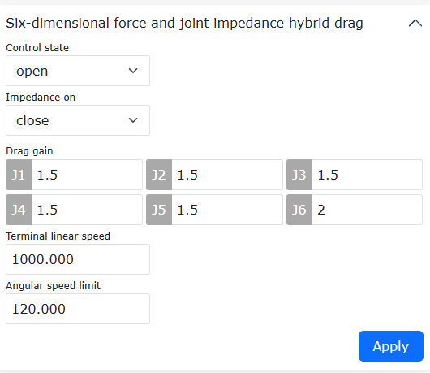

.. centered:: Figure 8.14‑14 Configuration Parameters for Six-Axis Force Assisted Dragging

2. Joint Impedance Control

The role of impedance control is to limit the drag force and drag position. Its default status is "Off".

The specific operation is shown in Figure 5. Set the Impedance Enable Status to "On", then set the Damping Coefficient and Stiffness Coefficient as shown in Figure 5. The function of the Stiffness Coefficient is currently not available.

.. figure:: robot_peripherals/242.png
   :align: center
   :width: 4in

.. centered:: Figure 8.14‑15 Configuration Parameters for Joint Impedance

Specific functions of the parameters:

- **Control Status**: After enabling, this function can be used in drag mode.

- **Impedance Enable**: After enabling, stiffness and damping parameters need to be configured. Its role is to limit the drag force and drag position.

- **Drag Gain**: Recommended parameter range [0-5]. Setting the parameter to 0 makes the robot undraggable. Setting to 1 shows no improvement in dragging effect. Setting greater than 1 makes dragging light and provides a good experience. The larger the parameter, the easier the dragging.

- **Stiffness Gain**: Set to 0. Its role is to return to the initial position before dragging after dragging.

- **Damping Gain**: Its role is to limit the drag force. Parameter range for axes 1-3 is [0-0.5], for axes 4-5 is [0-0.1]; for axis 6 it is [0-0.05].

- **End Linear Speed**: 1000 mm/s. When the end linear speed limit is exceeded, the robot switches mode to manual mode and prompts TCP overspeed.

- **Angular Speed Limit**: 100 °/s. When the angular speed limit is exceeded, the robot switches mode to manual mode and prompts TCP overspeed.

Extended Axis with Laser Point Tracking Function
--------------------------------------------------------------------------------------------------

Robot Extended Axis with Laser Point Tracking System Composition
~~~~~~~~~~~~~~~~~~~~~~~~~~~~~~~~~~~~~~~~~~~~~~~~~~~~~~~~~~~~~~~~~~~~~~~~~~~~~~~~~~~~~~~~~~~~~~~~~~~~~~~~~~~~~~~~~~~~~

.. figure:: robot_peripherals/243.png
   :align: center
   :width: 4in

.. centered:: Figure 8.15‑1 Robot Extended Axis with Laser Point Tracking System Composition

In the system, (a) is the computer, (b) is the robot and its control box, (c) is the positioner and drive equipment, (d) is the weld seam tracking laser sensor, (e) is the welder and supporting equipment.

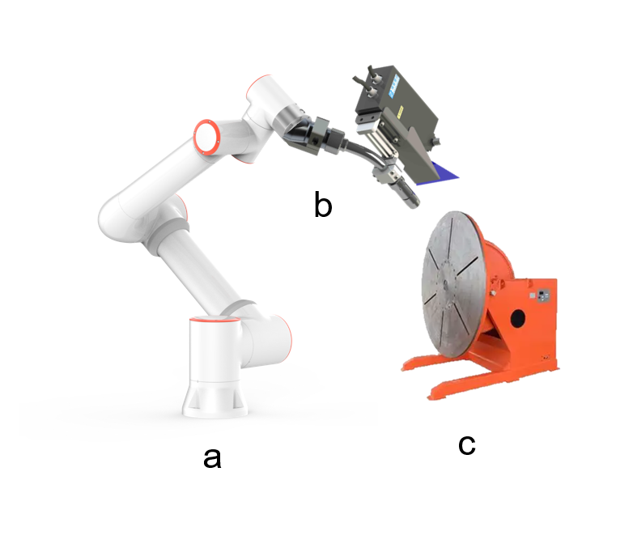

.. centered:: Figure 8.15‑2 Peripheral Installation Diagram

The weld seam tracking laser sensor and welding torch (b) are installed on the end flange of the robot (a), and the positioner (c) is fixedly installed outside the robot.

Extended Axis Communication Configuration
~~~~~~~~~~~~~~~~~~~~~~~~~~~~~~~~~~~~~~~~~~~~~~~~~~~~~~~~~~~~~~~~~~~~~~~~~~~~~~

The communication methods between the robot and the extended axis include using UDP or RS485.

.. figure:: robot_peripherals/074.png
   :align: center
   :width: 4in

.. centered:: Figure 8.15‑3 Extended Axis Configuration Page

Click "Initial" -> "Peripherals" -> "Extended Axis" on the robot operation interface to enter the extended axis configuration page. Taking connecting the robot to a PLC via UDP communication as an example, click the "UDP Communication" icon to enter the UDP communication extended axis configuration page.

.. figure:: robot_peripherals/110.png
   :align: center
   :width: 4in

.. centered:: Figure 8.15‑4 UDP Communication Configuration Interface

On the UDP communication extended axis configuration page, you can select the corresponding extended axis number, connect and configure UDP communication parameters (address, port, cycle, packet loss detection, etc.), and the extended axis positioning completion time.

The extended axis configuration content is not the focus of this function introduction. For detailed configuration, refer to the corresponding part of the user manual.

Weld Seam Tracking Laser Sensor Connection Configuration
~~~~~~~~~~~~~~~~~~~~~~~~~~~~~~~~~~~~~~~~~~~~~~~~~~~~~~~~~~~~~~~~~~~~~~~~~~~~~~

Connect the weld seam tracking laser sensor through the following configuration page:

.. figure:: robot_peripherals/245.png
   :align: center
   :width: 4in

.. centered:: Figure 8.15‑5 Laser Sensor Connection and Configuration Page

Click "Initial" -> "Peripherals" -> "Line Laser Sensor" -> "Adapted Devices" to enter the configuration page. The configuration page includes "Sensor Configuration", "Communication Configuration and Loading", "Base Calculation". Click "Sensor Configuration" to set the sensor input filter parameters. Click "Communication Configuration and Loading" to input the corresponding communication parameters to connect the laser sensor.

The laser sensor configuration content is not the focus of this function introduction. For detailed configuration, refer to the corresponding part of the user manual.

Welder Connection Configuration
~~~~~~~~~~~~~~~~~~~~~~~~~~~~~~~~~~~~~~~~~~~~~~~~~~~~~~~~~~~~~~~~~~~~~~~~~~~~~~

Configure the welder through the following configuration page:

.. figure:: robot_peripherals/246.png
   :align: center
   :width: 4in

.. centered:: Figure 8.15‑6 Welder Configuration Page

Welder communication can use IO communication or RS485 communication. Click "Initial", "Peripherals", "Welder" to enter the configuration and connection interface, where you can configure modules such as "Control Type", "Signal Corresponding IO", "Welding Process Parameters", "Welder Debugging", etc.

The welder configuration content is not the focus of this function introduction. For detailed configuration, refer to the corresponding part of the user manual.

Tool Coordinate System and Laser Sensor Coordinate System Calibration
~~~~~~~~~~~~~~~~~~~~~~~~~~~~~~~~~~~~~~~~~~~~~~~~~~~~~~~~~~~~~~~~~~~~~~~~~~~~~~~~~~~~~~~~~~~~~~~~~~~~~~~~~~~~~~~~~~~~~

After installing the welding torch on the robot end, calibrate the extrinsic parameters between the welding torch and the laser sensor:

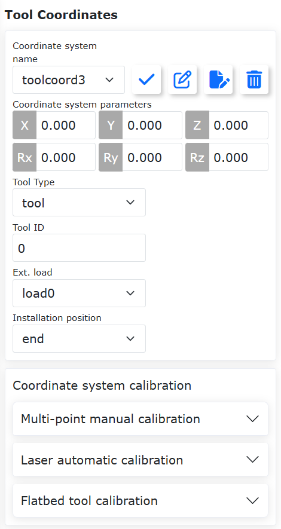

.. centered:: Figure 8.15‑7 Tool Coordinate System Configuration Page

Click "Initial", "Basic", "Coordinate System", "Tool" to enter the tool coordinate system setup page.

.. figure:: robot_peripherals/248.png
   :align: center
   :width: 4in

.. centered:: Figure 8.15‑8 Selecting the 6-Point Method to Calibrate the Welding Torch

Select an empty coordinate system, select the tool type as "Tool", and choose the 6-point method to calibrate the welding torch tool.

.. figure:: robot_peripherals/148.png
   :align: center
   :width: 4in

.. centered:: Figure 8.15‑9 Selecting the 5-Point Method to Calibrate the Laser Sensor

Select an empty coordinate system, select the tool type as "Sensor", and choose the 5-point method to calibrate the laser sensor.

The tool coordinate system and laser sensor coordinate system calibration content is not the focus of this function introduction. For detailed calibration methods, refer to the corresponding part of the user manual.

Extended Axis and Laser Point Tracking Function
~~~~~~~~~~~~~~~~~~~~~~~~~~~~~~~~~~~~~~~~~~~~~~~~~~~~~~~~~~~~~~~~~~~~~~~~~~~~~~

Extended axis and laser point tracking are divided into two methods: laser data with transformation executes a "record first, then replay" tracking strategy, and laser data without transformation executes a "record while replaying" tracking strategy.

Extended Axis Coordinate System Calibration
++++++++++++++++++++++++++++++++++++++++++++++++++++++++++

Calibrating the extended axis coordinate system is required when using the extended axis coordinate system to achieve synchronized laser tracking between the extended axis and the robot.

.. figure:: robot_peripherals/077.png
   :align: center
   :width: 4in

.. centered:: Figure 8.15‑10 Extended Axis Coordinate System Setup Page

Click "Initial" -> "Peripherals" -> "Extended Axis" to enter the extended axis coordinate system setup interface. Select the extended axis number that needs to be set, click the edit button, select "4-Single DOF Positioner" and save.

.. figure:: robot_peripherals/249.png
   :align: center
   :width: 4in

.. centered:: Figure 8.15‑11 Extended Axis Calibration Page

When calibrating the extended axis, pay attention to select "Robot Position Relative to Extended Axis" as "Outside Extended Axis". For the case of a positioner, select the 4-point method for calibration.

The extended axis calibration content is not the focus of this function introduction. For detailed calibration methods, refer to the corresponding part of the user manual.

Synchronized Laser Tracking of Extended Axis and Robot
+++++++++++++++++++++++++++++++++++++++++++++++++++++++++++++++++++++++++++++++++++++++

Laser Data with Transformation Method
****************************************************

Synchronized laser tracking of the extended axis and robot in the base coordinate system does not require external axis calibration. Other function settings and composition are consistent with synchronized tracking in the extended axis coordinate system.

First, configure the laser tracking data, setting the laser tracker data to the type with transformation.

.. figure:: robot_peripherals/250.png
   :align: center
   :width: 4in

.. centered:: Figure 8.15‑12 Setting Laser Data to Type with Transformation

Click "Initial", "Peripherals", "Tracking", "Sensor", click "Sensor Configuration" in the page dropdown, and adjust "Data Processing" to the data type with transformation.

.. figure:: robot_peripherals/251.png
   :align: center
   :width: 6in

.. centered:: Figure 8.15‑13 Laser Tracking Function Page

This function is implemented through a combination of multi-functional modules. The main functional modules are included within the "Laser Tracking" function. Click "Teach Program" -> "Program Programming" -> "Laser Tracking" to enter the laser tracking page, or click "Laser Record" to directly enter the recording page.

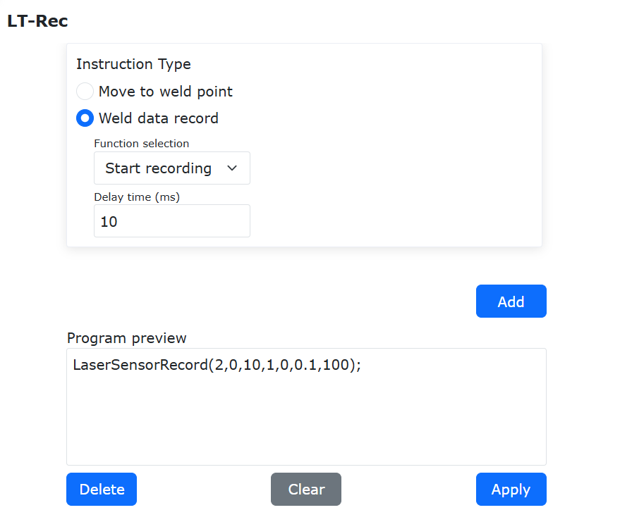

.. centered:: Figure 8.15‑14 Adding the Start Recording Laser Data Instruction

Add the start recording laser data instruction after the extended axis moves to the welding start point.

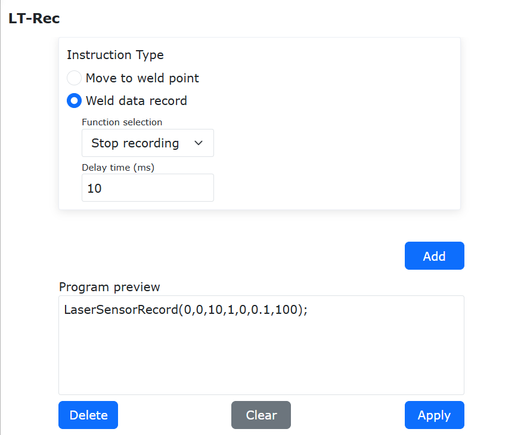

.. centered:: Figure 8.15‑15 Adding the Stop Recording Laser Data Instruction

Add the stop recording laser data instruction after the extended axis moves to the welding end point.

After the robot finishes recording the movement trajectory of the weld seam during the extended axis motion in place, the extended axis can be returned to the welding start point to prepare for synchronized tracking welding.

At the beginning of welding, the welding torch needs to be moved to the starting point position of the laser sensor recorded data. Add the Move to Welding Point instruction:

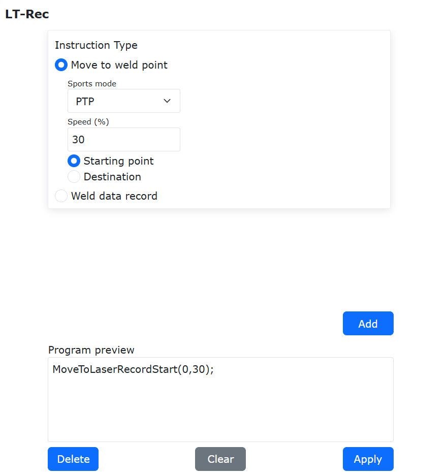

.. centered:: Figure 8.15‑16 Adding the Move to Welding Point Instruction

Click "Teach Program" -> "Program Programming" -> "Laser Record" button, select "Move to Welding Point", set the motion mode and speed, click the "Start Point" button and apply.

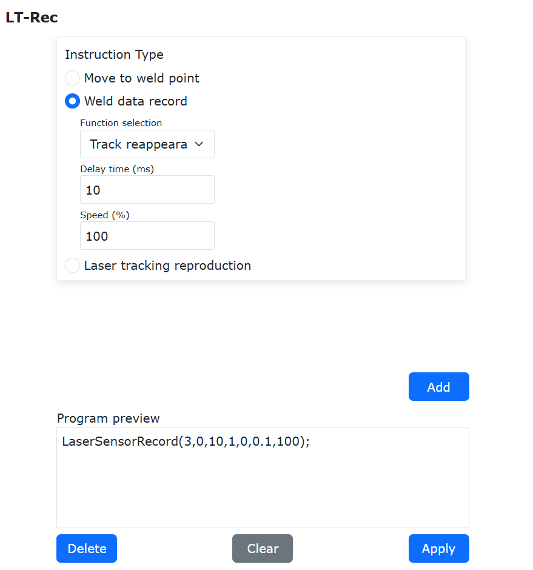

.. centered:: Figure 8.15‑17 Adding the Trajectory Replay Instruction for Recorded Laser Data

In the "Laser Tracking" page, select the "Data Record" -> "Trajectory Replay" instruction, click "Add" and apply. In the instruction, the waiting time defaults to 0ms, and the speed is the ratio of the replay speed to the recording speed, recommended to be greater than 50%.

Adding an extended axis motion instruction after the "Trajectory Replay" instruction enables synchronized motion of the extended axis and robot laser tracking.

The following is a typical LUA program for extended axis with laser data transformation point tracking:

.. figure:: robot_peripherals/256.png
   :align: center
   :width: 4in

.. centered:: Figure 8.15‑18 Example Program for Extended Axis with Laser Data Transformation Point Tracking

The robot executes the "record first, then replay" process. It first records the changing trajectory of the workpiece weld seam during extended axis motion, and then during welding, the extended axis and trajectory replay are executed synchronously.

Laser Data without Transformation Method
****************************************************

Using the laser data without transformation method for point tracking does not require calibration of the extended axis coordinate system.

Set the laser tracking sensor data to the type without transformation.

.. figure:: robot_peripherals/257.png
   :align: center
   :width: 4in

.. centered:: Figure 8.15‑19 Setting Laser Data to Type without Transformation

Click "Initial" -> "Peripherals" -> "Line Laser Sensor", click "Sensor Configuration" in the page dropdown, and adjust "Data Processing" to the data type without transformation.

.. figure:: robot_peripherals/251.png
   :align: center
   :width: 6in

.. centered:: Figure 8.15‑20 Laser Tracking Function Page

Click "Teach Program" -> "Program Programming" -> "Laser Tracking" to enter the laser tracking page, or click "Laser Record" to directly enter the recording page.

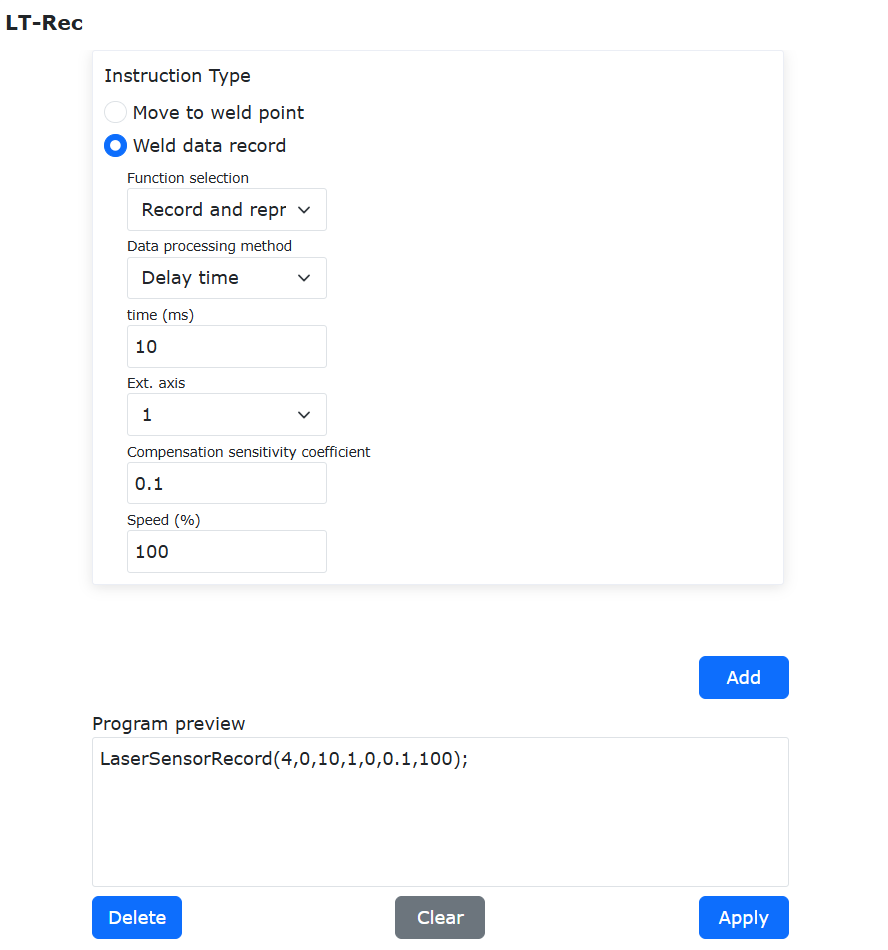

.. centered:: Figure 8.15‑21 Adding the Record While Replaying Instruction

In the "Laser Record" page, select the "Record While Replaying" instruction, click "Add" and apply. In the instruction, you can choose "Delay Time" or "Delay Distance" (distance is recommended). The compensation sensitivity coefficient is adjusted according to the actual sensor laser data; a lower value means lower adjustment sensitivity and better anti-interference. The replay speed defaults to 100%.

Adding an extended axis motion instruction after the "Record While Replaying" instruction enables synchronized motion of the extended axis and robot laser tracking.

The following is a typical LUA program for extended axis with laser data without transformation point tracking:

.. figure:: robot_peripherals/259.png
   :align: center
   :width: 5in

.. centered:: Figure 8.15‑22 Example Program for Extended Axis with Laser Data without Transformation Point Tracking

After aligning the welding torch with the offset from the front-mounted laser, the robot's extended axis moves and executes the "record while replaying" process. The front-mounted laser tracker first records the changing trajectory of the workpiece weld seam during extended axis motion, and then adjusts at the welding torch after the set delay distance or time.

Laser Seam Finding Point Position Acquisition Function
-----------------------------------------------------------

Robot Laser Seam Finding Point Position Acquisition System Composition
~~~~~~~~~~~~~~~~~~~~~~~~~~~~~~~~~~~~~~~~~~~~~~~~~~~~~~~~~~~~~~~~~~~~~~~~~~~

.. figure:: robot_peripherals/260.png
   :align: center
   :width: 6in

.. centered:: Figure 8.16‑1 Robot Laser Seam Finding Point Position Acquisition System Topology Diagram
.. centered:: In the system, (a) is the computer, (b) is the robot and its control box, (c) is the laser sensor.

Laser Sensor Communication Configuration
~~~~~~~~~~~~~~~~~~~~~~~~~~~~~~~~~~~~~~~~~~~~~~~~~~~~~~~~~~~~~~~~

Open WebApp, click sequentially "Initial" -> "Peripherals" -> "Line Laser Sensor" to configure the sensor communication.

.. figure:: robot_peripherals/245.png
   :align: center
   :width: 4in

.. centered:: Figure 8.16‑2 Sensor Communication Configuration

Laser Seam Finding Point Position Acquisition Function
~~~~~~~~~~~~~~~~~~~~~~~~~~~~~~~~~~~~~~~~~~~~~~~~~~~~~~~~~~~~~~~~

The operation process for acquiring the laser seam finding point position is as follows:

**Step 1**: Before laser seam finding, first designate the seam finding start points "seamStartPt1", "seamStartPt2". Then click "Teach Program", "Program Programming", select "Point to Point", and move the laser sensor's beam close to the seam finding start point 1 "seamStartPt1" near the start of weld seam 1.

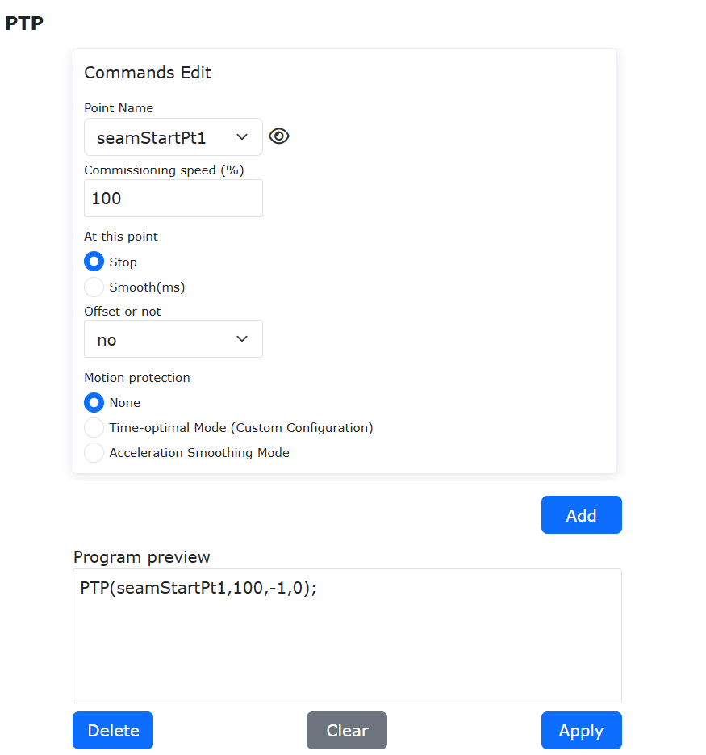

.. centered:: Figure 8.16‑3 Adding the Move to Seam Finding Start Point 1 Instruction

**Step 2**: In the instruction type, click "Seam Finding Start", then select the calibrated sensor coordinate system, set the seam finding direction, speed, length, and maximum seam finding time, and click the "Add" button. Then click "Seam Finding End", and click the "Add" button.

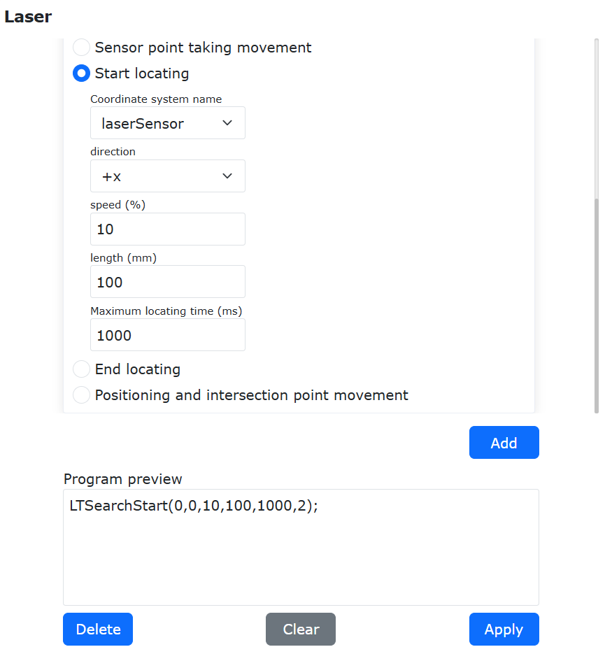

.. centered:: Figure 8.16‑4 Adding the Seam Finding Start Instruction

**Step 3**: Select "Sensor Point Acquisition Motion", select the calibrated "Laser Sensor" for the coordinate system name, select "PTP" or "LIN" for the motion mode, set the debugging speed and choose whether to "Configure Pose", click the "Add" button, then click the "Apply" button to add it to the LUA program.

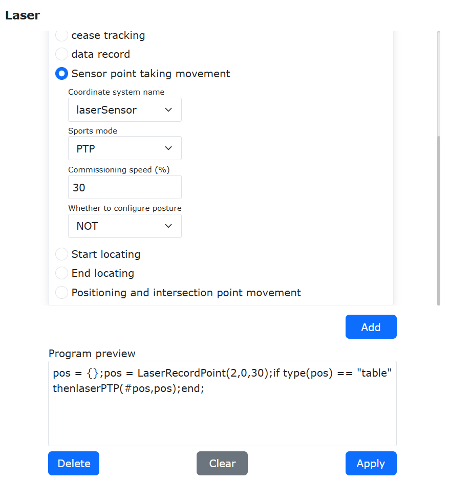

.. centered:: Figure 8.16‑5 Adding the Sensor Point Acquisition Motion Instruction

**Step 4**: In the "Program Programming" interface, click the "Switch Mode" button, change the variable "pos" to "pos1", and delete the move to seam finding point instruction.

.. figure:: robot_peripherals/264.png
   :align: center
   :width: 4in

.. centered:: Figure 8.16‑6 Program Programming Switch Mode

.. figure:: robot_peripherals/265.png
   :align: center
   :width: 4in

.. centered:: Figure 8.16‑7 Modifying the Acquire Laser Seam Finding Point Program

**Step 5**: Follow Steps 1-4 to perform seam finding for the second weld seam and acquire the laser seam finding point position.

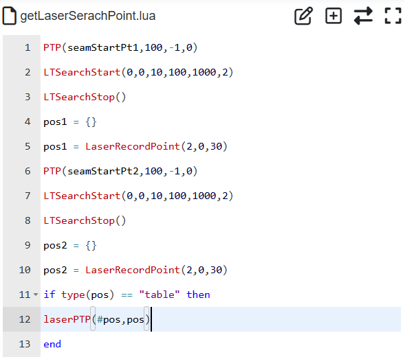

.. centered:: Figure 8.16‑8 Second Weld Seam Seam Finding Point Acquisition

DARU DFC Force Control Polishing Head Application
-----------------------------------------------------------

Overview
~~~~~~~~~~~~~~~~~~~~~~~

Installing the DFC polishing head on the robot end-effector helps the robot quickly deploy grinding, polishing, and deburring tasks in different scenarios. It allows customizing the force control magnitude for workpieces of different sizes and shapes, improving the precision and effectiveness of grinding work.

Hardware Description
+++++++++++++++++++++++++++++
The collaborative robot communicates with and controls the DARU DFC polishing head via Ethernet. The WebApp generates the DARU DFC polishing head communication protocol, which sends control data to the DARU force control controller module via TCP/IP. The module then sends the received control data to the DFC force control actuator, thereby achieving control of the polishing head. The force control controller module acts as the server for Ethernet communication and can connect to polishing head actuators on two channels.

.. figure:: robot_peripherals/267.png
   :align: center
   :width: 6in

.. centered:: Figure 8.17‑1 Collaborative Robot DARU DFC Polishing Head Application

The force control controller module requires the following configuration: Ethernet port configured with IP address: 192.168.58.88, port number: 2000.

Function Configuration
~~~~~~~~~~~~~~~~~~~~~~~~~~~~~~
Open the WebApp, click sequentially on "Initial Setup", "Peripherals", "Polishing". The control types for the polishing head are Pre-adapted Devices and Peripheral Open Protocol:
Pre-adapted Devices: Automatically generates and loads the open protocol for adapted polishing head device types, no user programming required.
Peripheral Open Protocol: Users write the open protocol for the polishing head to be adapted using Lua to achieve communication control.

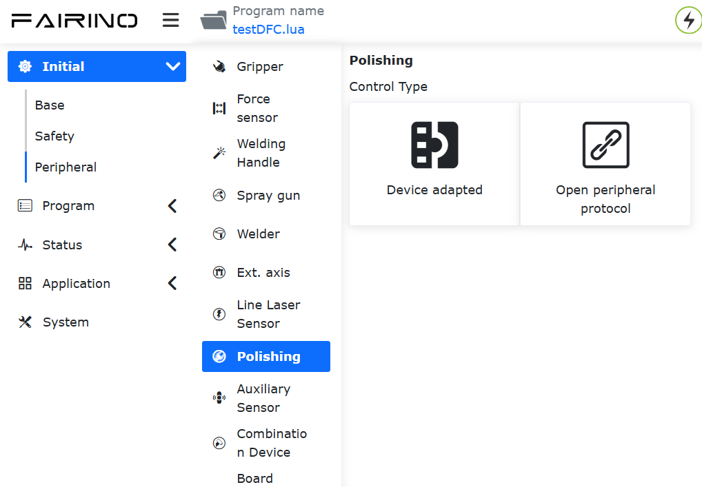

.. centered:: Figure 8.17‑2 Polishing Control Types

Pre-adapted Device Configuration
+++++++++++++++++++++++++++++++++++++++

Open the WebApp, click sequentially on "Initial Setup", "Peripherals", "Polishing Head", "Pre-adapted Devices". In the device status, select "DARU DFC Polishing Head" for the type, then click "Configure". This will automatically load the embedded peripheral open protocol "CtrlDev_DARUDFCPOLISH.lua".

.. figure:: robot_peripherals/269.png
   :align: center
   :width: 6in

.. centered:: Figure 8.17‑3 DARU DFC Device Peripheral Open Protocol Auto-loading

With the hardware connection confirmed correct, the open protocol can be started. When the run status is green and the communication status feedback in the Polish status on the right shows "Connection Established", it indicates successful communication between the robot and the polishing head controller. Parameters can then be configured to set the polishing head channel for force control and the set force value. The open protocol will cyclically send the set value, channel, and the robot's current rx, ry, rz to the polishing head, as shown in Figure 2-3. Additionally, the Polish status feedback will also display the current force feedback value and force limit warning from the polishing head in real-time. When a warning occurs, an alarm reminder will also appear in the upper right corner of the page, as shown in Figure 2-4.

.. figure:: robot_peripherals/270.png
   :align: center
   :width: 6in

.. centered:: Figure 8.17‑4 DFC Polishing Head Page Settings and Status Feedback

.. figure:: robot_peripherals/271.png
   :align: center
   :width: 6in

.. centered:: Figure 8.17‑5 DFC Polishing Head Force Control Limit Exceeded Alarm

Peripheral Open Protocol Download
+++++++++++++++++++++++++++++++++++++++

Click the "Download" button in "Peripheral Open Protocol" to download the protocol to the local computer. The peripheral open protocol is a cyclically executed LUA program. In each cycle, the program performs the following steps:

① Read control data for the DFC polishing head from the robot;

② Write control data to the DFC polishing head via socket;

③ Read status data from the DFC polishing head via socket;

④ Feedback DFC polishing head status data to the robot;

The communication protocol executes cyclically to achieve communication control between the robot and the polishing head. Within the communication protocol, users can customize the cycle period, the server port to connect to, and the IP address.

Below is a sample communication protocol code for the DARU DFC polishing head:

.. code-block:: 
    :linenos:

    local id = 1 
    local ctrlValues = {0,0, 0,0, 0,0, 0,0}
    local realTimeState = {0,0, 0,0, 0,0, 0,0}
    socket1 = TCPClientConnect('192.168.58.88', 2000, 500, 10, 2, 3)
    sleepCnt = 100
    while(sleepCnt > 0) do
        local stopFlag = GetOpenLUAStopFlag(id)
        if(stopFlag ~= 0) then 
          TCPClientDisconnect(socket1)
          setDFCPolishRealtimeState(0, 0, 0)
          break
        end 
      sleepCnt = sleepCnt -1
      sleep_ms(50)
    end
    local cnt = 5
    while(1) do
        channel, force = getDFCPolishSet()
        comState, sendBuff = DFCPolishInput(socket1, channel, force)
        sleep_ms(50)

        byte, error, forceFeedback = DFCPolishOutput(socket1)
        setDFCPolishRealtimeState(comState, error, forceFeedback)
        sleep_ms(50)

      if(comState == 0) then
          TCPClientDisconnect(socket1)
          while(cnt > 0) do
            socket1 = TCPClientConnect('192.168.58.88', 2000, 500, 10, 2, 3)
            cnt = cnt - 1
            if(socket1 > 0)then
              break
            end
          end
      end

        local stopFlag = GetOpenLUAStopFlag(id)
        if(stopFlag ~= 0 or cnt == 0) then 
          TCPClientDisconnect(socket1)
          setDFCPolishRealtimeState(0, 0, 0)
          break
        end    
    end

DFC Polishing Head LUA Program Application
~~~~~~~~~~~~~~~~~~~~~~~~~~~~~~~~~~~~~~~~~~~~~~~~

Adding DFC force control configuration, channel switching, status acquisition instructions, etc., to the robot LUA program, combined with robot motion instructions, enables flexible and convenient implementation of polishing applications.
Open the WebApp, click sequentially on "Teach Program", "Program Programming", and create a new LUA program "testDFC.lua".

.. figure:: robot_peripherals/272.png
   :align: center
   :width: 6in

.. centered:: Figure 8.17‑6 Create New "testDFC.lua" Program

Select the instruction type as "Peripheral Instruction", and click the "Polishing Device" button in the peripheral instructions. The "Polish" polishing instruction addition page will then appear on the right side of the WebApp. Select "DARU DFC Polishing Head" for the device type.

.. figure:: robot_peripherals/273.png
   :align: center
   :width: 6in

.. centered:: Figure 8.17‑7 Polishing Head Instruction Addition

Polishing Head Control Instruction Addition
++++++++++++++++++++++++++++++++++++++++++++

Writing polishing head control instructions in the LUA program allows force control setting and channel selection for the DFC.

In the polishing device instruction addition page, click "Set DFC", select the polishing head channel mode as "2", and the set force as "10". Click the "Add" button to add the polishing head setting instruction in the "Program Preview".

.. figure:: robot_peripherals/274.png
   :align: center
   :width: 6in

.. centered:: Figure 8.17‑8 Add Polishing Head Control Instruction

Polishing Head Status Acquisition Instruction Addition
+++++++++++++++++++++++++++++++++++++++++++++++++++++++++++++++

Click "Get DFC Data", then click "Add" and "Apply" buttons sequentially. This adds an instruction "GetDFCState()" to "testDFC.lua" for acquiring polishing head data.

.. figure:: robot_peripherals/275.png
   :align: center
   :width: 6in

.. centered:: Figure 8.17‑9 Add Get Polishing Head Status Instruction

The GetDFCState() instruction returns 2 values, as follows:

**DFCwarn**: Force control limit exceeded warning 0-Normal 1-Alarm;

**force**: Force feedback value.

In "testDFC.lua", use three variables to receive the return values of the GetDFCState() function. Use Lua variable query to display the above information in the WebApp variable query display area.

.. figure:: robot_peripherals/276.png
   :align: center
   :width: 6in

.. centered:: Figure 8.17‑10 Get Polishing Head Status Program

Application Example
+++++++++++++++++++++++++++++++++++++++

The following is a LUA program example for DFC polishing head control and monitoring:

.. code-block:: 
    :linenos:

    SetDFCForce(0,25)
    while (1) do 
        PTP(c1,100,-1,0)
        SetDO(0,1,0,0)
        ARC(c2,0,0,0,0,0,0,0,c3,0,0,0,0,0,0,0,100,-1,0,100,200)
        DFCwarn,force = GetDFCState()
        RegisterVar("number","DFCwarn")
        RegisterVar("number","force")
        if(DFCwarn == 1) then
            PTP(safe,100,-1,0)
            break
        else
            PTP(p6,100,-1,0)
        end
        SetDO(0,0,0,0)
    end