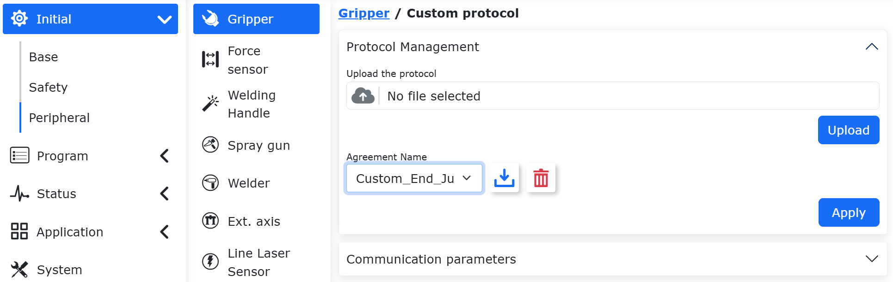
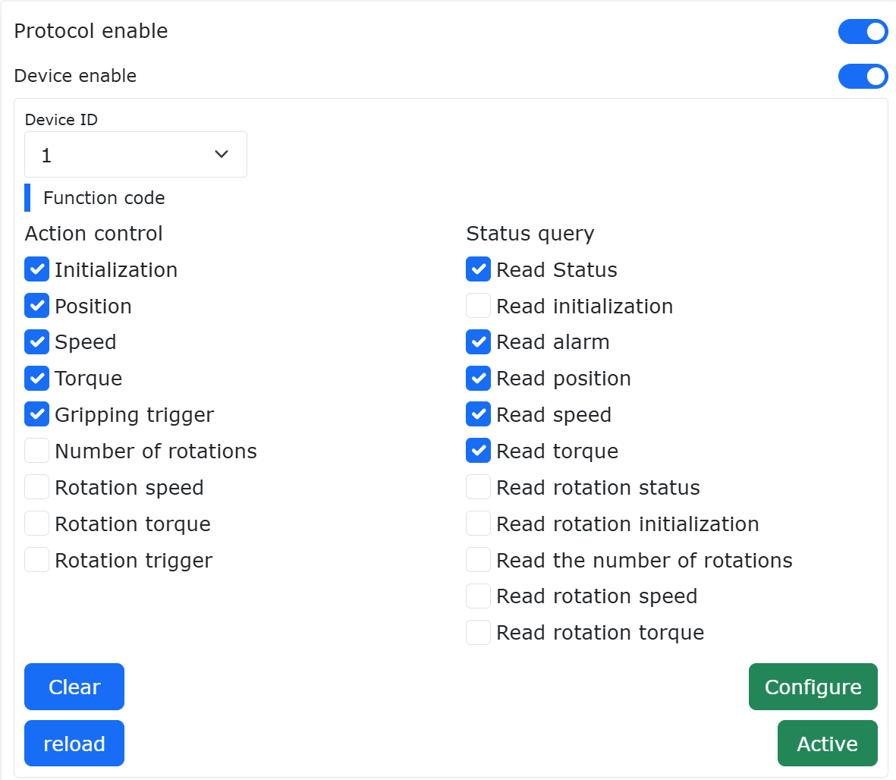
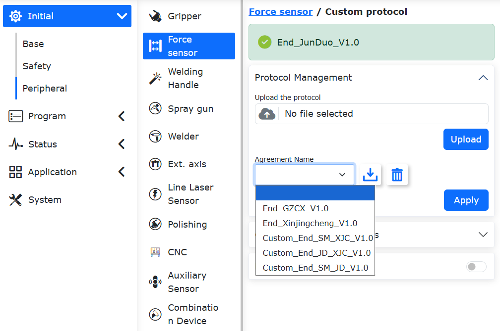
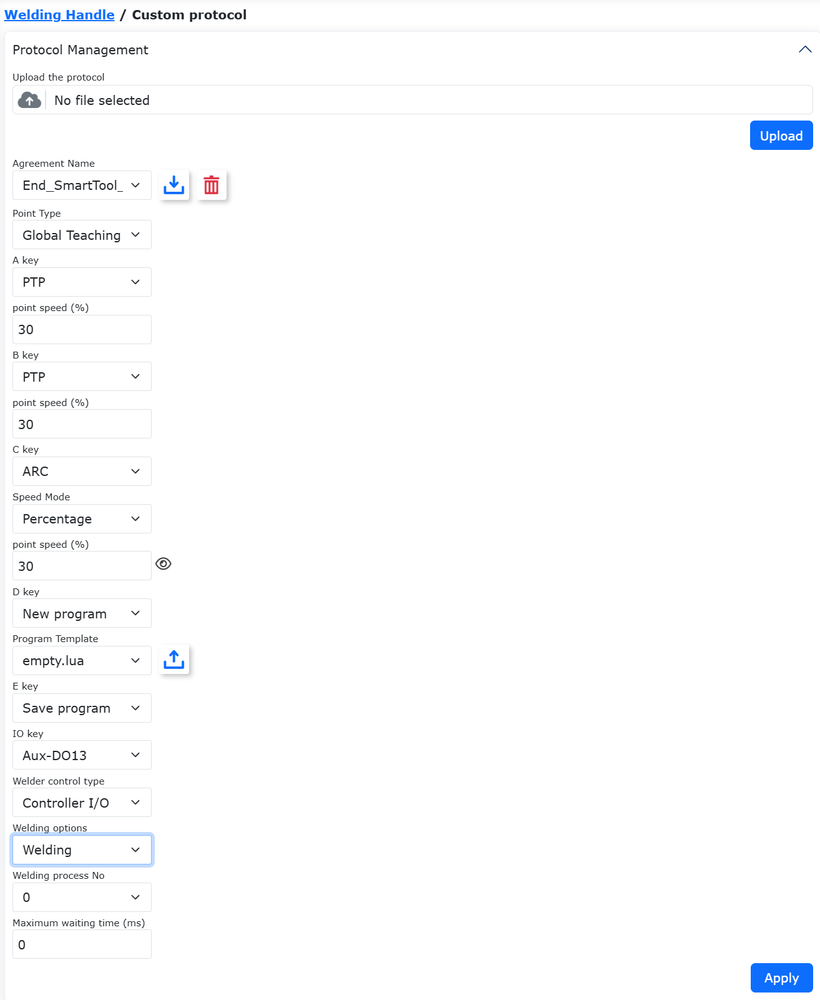
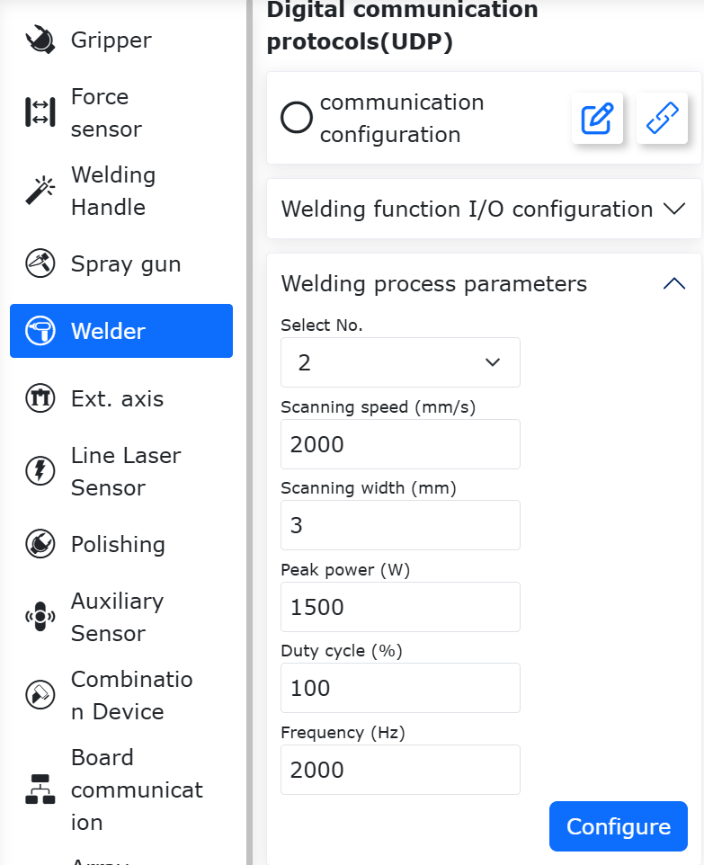
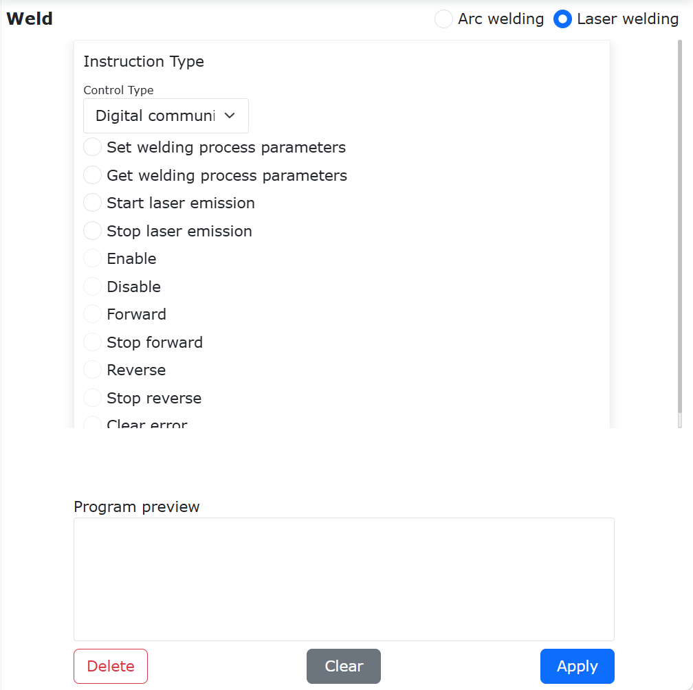
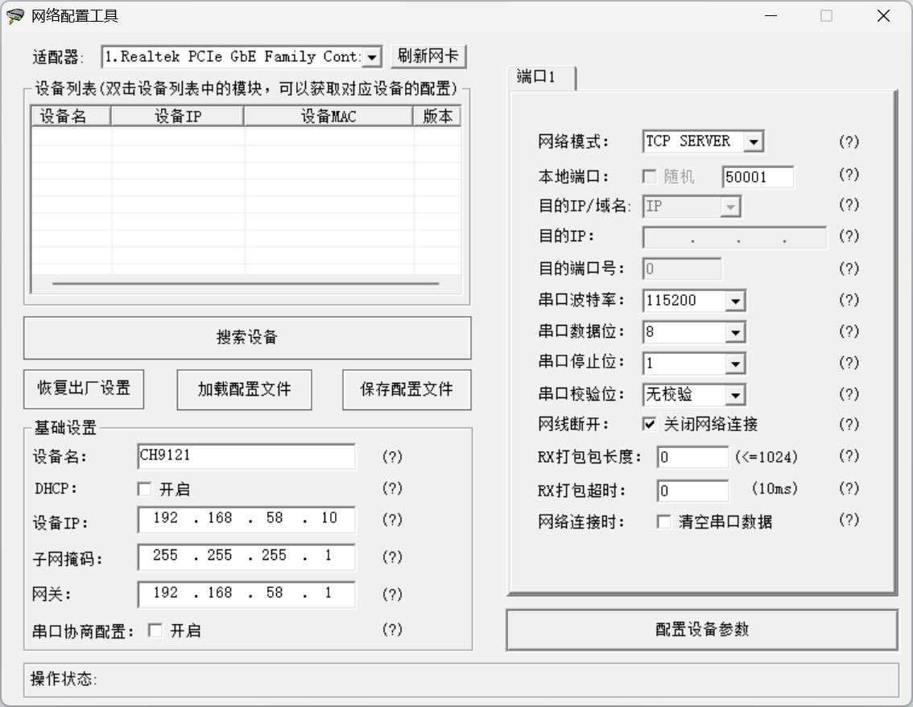
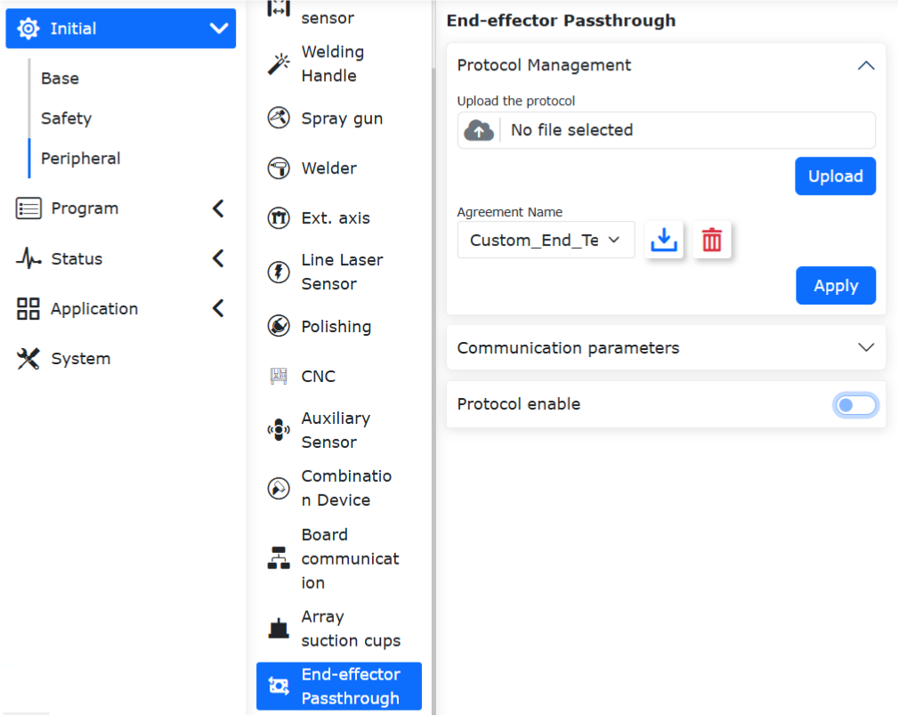
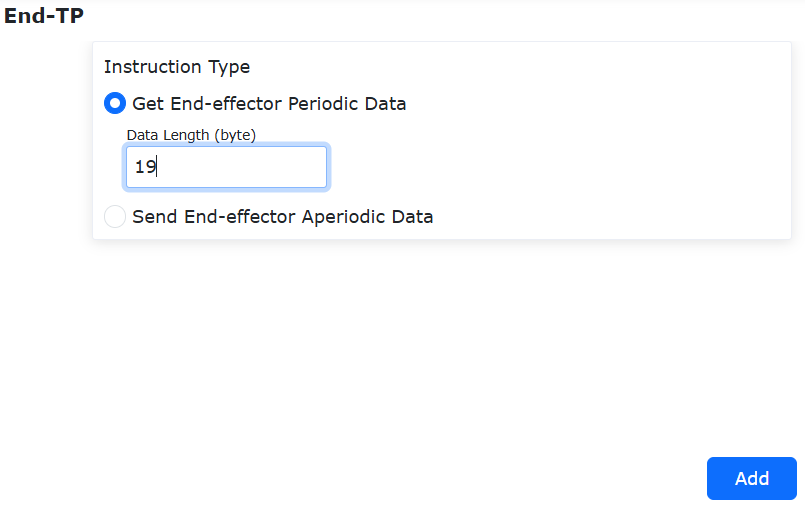
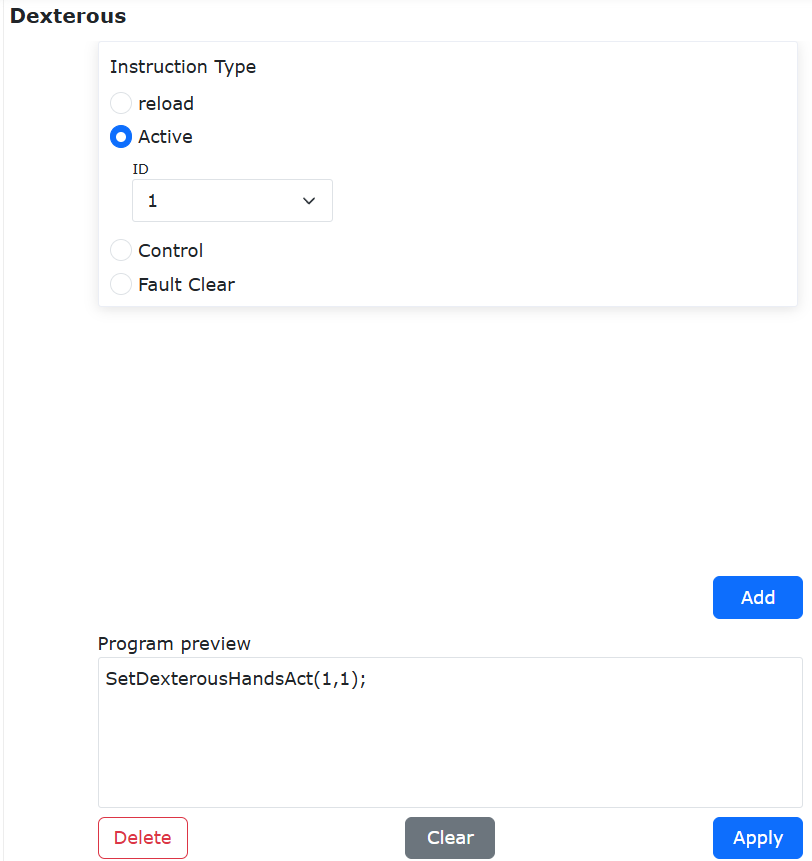

Periferiche
=============

.. toctree::
  :maxdepth: 5

Protocollo Aperto Personalizzato Lua per l'Estremità
----------------------------------------------------------------------

Panoramica
~~~~~~~~~~~~~~~~~~

All'estremità del robot è fornita un'interfaccia hardware per collegare periferiche tramite comunicazione 485. Le periferiche attualmente supportate includono pinze, pinze rotanti, sensori di forza, manipoli di saldatura e altri dispositivi. Tutti questi dispositivi terminali possono essere adattati scrivendo un protocollo aperto in Lua per realizzare l'adattamento del protocollo, consentendo il controllo della periferica e l'acquisizione del suo stato.Per la saldatrice SmartTool (SmartTool welding handle), gli utenti possono anche scegliere di accedere alla pagina web per configurare le funzioni dei tasti e generare automaticamente un file di protocollo aperto. Il protocollo generato verrà applicato automaticamente all'end.

Procedura Operativa
~~~~~~~~~~~~~~~~~~~~~~~~~~

**Step1**: Accedere a Impostazioni di sistema->Informazioni->Aggiornamento firmware, selezionare il file binario del firmware dell'estremità .bin e aggiornare il firmware dell'estremità.

.. important::
   È necessario prima verificare se la versione del firmware dell'estremità FV2.010.06 e le versioni software successive sono compatibili. Se la versione non è compatibile, eseguire l'aggiornamento del firmware software corrispondente, altrimenti non è necessario aggiornare il firmware.

   Prima di caricare il pacchetto di aggiornamento del firmware dell'estremità, è necessario disabilitare il robot e quindi entrare in modalità boot.

.. figure:: robot_peripherals/001.png
   :align: center
   :width: 6in

.. centered:: Diagramma 8.1‑1 Aggiornamento firmware dell'estremità

**Step2**: Aprire la WebApp, fare clic in sequenza su "Impostazioni Iniziali", "Periferiche" e selezionare la periferica terminale da configurare (ad esempio, pinza). Il tipo di controllo per le periferiche include due opzioni: dispositivi pre-adattati e protocollo aperto periferica:

- **Dispositivi Pre-adattati**: Utilizza il controllore del robot per la comunicazione. Non è richiesto caricamento o applicazione.
- **Protocollo Aperto Periferica**: L'utente scrive un protocollo aperto basato su Lua per l'estremità da adattare per realizzare il controllo della comunicazione. I protocolli terminali sono suddivisi in due categorie: una è costituita da protocolli caricati dall'utente, l'altra da protocolli incorporati preimpostati nel robot.A partire dalla versione 3.9.2, gli utenti non devono eseguire operazioni di verifica e crittografia sul protocollo Lua da caricare all'end utilizzando software aggiuntivi; possono caricarlo direttamente. I protocolli precedentemente verificati e crittografati possono ancora essere caricati e utilizzati normalmente. Il robot distinguerà attivamente se il file è stato verificato e crittografato. Se non è stato verificato, il robot lo verificherà e crittograferà prima di caricarlo e applicarlo all'end. Se è già crittografato, verrà caricato e applicato all'end direttamente.

.. figure:: robot_peripherals/002.png
   :align: center
   :width: 6in

.. centered:: Figura 8.1‑2 Tipo di Controllo Pinza

**Step3**: Entrare nell'interfaccia del contenuto Periferiche -> Pinza/Sensore di forza/Manipolo di saldatura. Fare clic sulla scheda "Protocollo Personalizzato" per accedere all'interfaccia. Caricare il protocollo aperto terminale Lua, selezionare il protocollo aperto terminale Lua da caricare ed eseguire l'operazione di caricamento.

.. important:: 
  Il nome del file caricato deve iniziare con `AXLE_LUA_`.

**Step4**: Configurare i parametri di comunicazione dell'estremità, che includono baud rate, bit di dati, bit di stop, ecc. Dopo la configurazione, fare clic sul pulsante "Configura".

.. figure:: robot_peripherals/003.png
   :align: center
   :width: 4in

.. centered:: Diagramma 8.1‑3 Configurazione parametri di comunicazione dell'estremità

I parametri dettagliati di comunicazione dell'estremità sono i seguenti:

- **Baud rate**: supporta 1-9600, 2-14400, 3-19200, 4-38400, 5-56000, 6-67600, 7-115200, 8-128000; il chip driver RS485 dell'estremità è un 485 a bassa velocità, il baud rate non può essere >200k;
- **Bit di dati**: supporta (8,9), attualmente comunemente usato è 8;
- **Bit di stop**: 1-1, 2-0.5, 3-2, 4-1.5, attualmente comunemente usato è 1;
- **Bit di parità**: 0-None, 1-Odd, 2-Even, attualmente comunemente usato è 0;
- **Timeout**: 1~1000ms, questo valore deve essere impostato in combinazione con la periferica esterna con un parametro di tempo ragionevole;
- **Numero di timeout**: 1~10, utilizzato principalmente per la ritrasmissione in caso di timeout, riducendo le anomalie occasionali e migliorando l'esperienza utente;
- **Intervallo di tempo del comando periodico**: 1~1000ms, utilizzato principalmente per l'intervallo di tempo di ogni invio del comando periodico;

**Step5**: Abilitazione Lua dell'estremità, fare clic sul pulsante "Attiva".

.. figure:: robot_peripherals/004.png
   :align: center
   :width: 4in

.. centered:: Diagramma 8.1‑4 Abilitazione Lua dell'estremità

Quando si verifica un'anomalia nel file Lua, viene visualizzato l'avviso "Anomalia file Lua dell'estremità", che può essere gestito con "Non ripristinare/Ripristinare". Disattivando il pulsante di abilitazione Lua, l'avviso viene chiuso.

.. figure:: robot_peripherals/005.png
   :align: center
   :width: 4in

.. centered:: Diagramma 8.1‑5 Anomalia file Lua

Quando il tipo di dispositivo è una pinza, è possibile monitorarne lo stato.

**Attivare "Monitoraggio stato"**: la barra di stato della pinza a destra mostra in tempo reale informazioni come velocità di funzionamento, coppia, posizione, ecc.

**Disattivare "Monitoraggio stato"**: la barra di stato dati della pinza a destra viene chiusa.

.. figure:: robot_peripherals/006.png
   :align: center
   :width: 6in

.. centered:: Diagramma 8.1‑6 Monitoraggio stato

Pinza
-------------------

Nell'interfaccia "Impostazioni iniziali"->"Periferiche"->"Pinza", è attualmente possibile utilizzare la pinza tramite dispositivi già adattati e il protocollo aperto personalizzato Lua dell'estremità.

Dispositivi già adattati
~~~~~~~~~~~~~~~~~~~~~~~~~~~~~

**Step1**: Fare clic su "Dispositivi già adattati" per accedere all'interfaccia di configurazione delle periferiche dell'estremità. Le informazioni di configurazione della pinza sono suddivise in produttore della pinza, tipo di pinza, versione software e posizione di montaggio. L'utente può configurare le informazioni della pinza corrispondenti in base alle esigenze di produzione specifiche. Se l'utente necessita di modificare la configurazione, può prima selezionare il numero della pinza corrispondente, fare clic sul pulsante "Cancella" per cancellare la configurazione corrispondente e riconfigurare in base alle esigenze;

.. figure:: robot_peripherals/007.png
   :align: center
   :width: 4in

.. centered:: Diagramma 8.2‑1 Configurazione pinza

.. important::
	Prima di fare clic su cancella configurazione, la pinza corrispondente deve essere in stato non attivato.

**Step2**: Dopo aver completato la configurazione della pinza, l'utente può visualizzare le informazioni corrispondenti nella tabella delle informazioni della pinza nella parte inferiore della pagina. Se viene rilevato un errore di configurazione, è possibile fare clic sul pulsante "Cancella" per riconfigurare la pinza;

.. figure:: robot_peripherals/008.png
   :align: center
   :width: 4in

.. centered:: Diagramma 8.2‑2 Informazioni di configurazione pinza

**Step3**: Selezionare la pinza configurata, fare clic sul pulsante "Reset". Dopo che la pagina indica l'invio riuscito del comando, fare clic sul pulsante "Attiva". È possibile controllare lo stato di attivazione nella tabella delle informazioni della pinza per determinare se l'attivazione è riuscita;

.. important::
	Quando si attiva la pinza, la pinza non deve avere oggetti bloccati.

**Step4**: Nell'interfaccia dei comandi di insegnamento del programma, selezionare il comando "Gripper". Nell'interfaccia del comando della pinza, l'utente può selezionare il numero della pinza che si desidera controllare (pinza già configurata e attivata), impostare lo stato di apertura/chiusura corrispondente, la velocità di apertura/chiusura, la coppia di apertura/chiusura e il tempo massimo di attesa per l'azione della pinza. Dopo aver completato le impostazioni, fare clic su Aggiungi applicazione. Inoltre, è possibile aggiungere i comandi di attivazione e reset della pinza per attivare/resettare la pinza durante l'esecuzione del programma.

.. figure:: robot_peripherals/009.png
   :align: center
   :width: 6in

.. centered:: Diagramma 8.2‑3 Modifica comando pinza

Insegnamento programma pinza
+++++++++++++++++++++++++++++++++++++++++

.. list-table::
   :widths: 15 40 100
   :header-rows: 1

   * - Numero
     - Formato comando
     - Commento
   * - 1
     - PTP(template2,100,-1,0)
     - #Punto di attesa per la presa
   * - 2
     - PTP(template1,100,-1,0)
     - #Punto di presa
   * - 3
     - MoveGripper(1,255,255,0,1000,0)
     - #Chiusura pinza
   * - 4
     - PTP(template2,100,-1,0)
     - /
   * - 5
     - PTP(template3,100,-1,0)
     - #Punto di attesa per il rilascio
   * - 6
     - PTP(template3,100,-1,0)
     - #Punto di rilascio
   * - 7
     - MoveGripper(1,0,255,0,1000,0)
     - #Apertura pinza

Configurazione del protocollo Lua per l'end-effector Gripper
~~~~~~~~~~~~~~~~~~~~~~~~~~~~~~~~~~~~~~~~~~~~~~~~~~~~~~~~~~~~~~~~~~
Aprire la WebApp, fare clic in sequenza su "Configurazione iniziale", "Periferiche", "Gripper", "Protocollo personalizzato". Fare clic su "Gestione protocolli" per configurare il protocollo dell'end-effector.

Il nome del file caricato dall'utente deve iniziare con "AXLE_LUA_End". Dopo il caricamento, il nome del protocollo nell'elenco cambierà per iniziare con "Custom_End". Questo tipo di protocollo può essere scaricato ed eliminato. I file con nomi duplicati caricati dall'utente verranno automaticamente sovrascritti con il Lua più recente.

.. figure:: robot_peripherals/277.png
   :align: center
   :width: 4in

.. centered:: Figura 8.2‑4-1 Caricamento protocollo personalizzato per Gripper

I protocolli integrati predefiniti del robot iniziano con il prefisso `End_`. Possono essere solo scaricati, non eliminati. I protocolli integrati per le periferiche (gripper, gripper rotante, ventosa) sono mostrati nella figura seguente.

.. figure:: robot_peripherals/278.png
   :align: center
   :width: 4in

.. centered:: Figura 8.2‑4-2 Protocollo integrato predefinito per Gripper (Gripper rotante, Ventosa)

Dopo aver assicurato che il protocollo corretto sia selezionato, è possibile disabilitare il robot e applicare il protocollo aperto. Dopo l'applicazione, il robot entrerà automaticamente in modalità boot e applicherà il protocollo selezionato all'end-effector. Quando la pagina segnala "Aggiornamento riuscito, si prega di riavviare il control box", è possibile spegnere e riaccendere il control box.

.. figure:: robot_peripherals/279.png
   :align: center
   :width: 6in

.. centered:: Figura 8.2‑4-3 Applicazione del protocollo aperto dell'end-effector alla scheda dell'end-effector

Dopo il riavvio e l'accesso alla pagina WebApp, la pagina mostrerà il nome del protocollo attualmente applicato. Dopo aver fatto clic per abilitare il protocollo dell'end-effector e aver abilitato il dispositivo, il protocollo dell'end-effector inizierà a essere eseguito. L'ID dispositivo è l'indirizzo slave Modbus della periferica end-effector e deve essere utilizzato in combinazione con il contenuto del protocollo.

.. figure:: robot_peripherals/280.png
   :align: center
   :width: 4in

.. centered:: Figura 8.2‑4-4 Visualizzazione e abilitazione della configurazione del protocollo dell'end-effector Gripper

La scheda dell'end-effector verificherà il protocollo Lua caricato. Quando c'è un problema con il file Lua, verrà mostrato un avviso "File Lua dell'end-effector anomalo". È possibile scegliere "Non recuperare/Recuperare". Spegnere il pulsante di abilitazione Lua per chiudere il messaggio di avviso.

.. figure:: robot_peripherals/005.png
   :align: center
   :width: 4in

.. centered:: Figura 8.2‑4-5 Visualizzazione e abilitazione della configurazione del protocollo dell'end-effector Gripper

Esempio di protocollo Lua per periferica end-effector di un Gripper
++++++++++++++++++++++++++++++++++++++++++++++++++++++++++++++++++++++++++++++++

.. code-block:: console

  function Getbit(X,Bit)--Getbit(), estrae il bit corrispondente da un byte. Parametri: X: il byte da cui estrarre il bit; Bit: la posizione del bit da estrarre (intervallo 0-7)
  return ((X&(1<<Bit))>>Bit)
  end

  function GetOneByte(U32)--GetOneByte(), estrae il dato 0x1234, ottiene il suo byte basso, restituisce 0x34
  return ((U32>>0)&0xFF)
  end

  function GetTwoByte(U32)--GetTwoByte(), estrae il dato 0x1234, ottiene il suo byte alto, restituisce 0x12
  return ((U32>>8)&0xFF)
  end
  function GetThreeByte(U32)--GetThreeByte(), estrae il dato 0x56781234, estrae e restituisce 0x78
  return ((U32>>16)&0xFF)
  end
  function GetFourByte(U32)--GetFourByte(), estrae il dato 0x56781234, estrae e restituisce 0x56
  return ((U32>>24)&0xFF)
  end
  X,Speed,Torque=0,0,0
  while(1)
  do
  IwdgTaskHandle()
  MainLoop()
  UpDownLoadHandle()
  SdoRwPara()
  EndErrClear()
  local BFlag=LuaBreak()
  if(BFlag==1)then
  break
  end--Da qui fino alla fine del file LuaGc(), end è sintassi fissa

  T1={0x01,0x06,0x03,0xE8,0x00,0x09,0xC9,0xBC}--Popola i comandi del gripper (comandi Modbus RTU). T1-T5 sono rispettivamente: comando di esecuzione azione gripper, comando di inizializzazione gripper, comando posizione gripper, comando velocità gripper, comando coppia gripper
  --/Analisi comando: T1[1]=0X01, è l'indirizzo del gripper; T1[2]=0x06, codice funzione scrittura registro singolo holding; T1[3], T1[4]: 0x03,0xE8, indirizzo del registro su cui operare per il comando esecuzione azione; T1[5],T1[6]: 0x00,0x09, dati da scrivere nel registro; T1[7],T1[8]: 0xC9,0xBC, checksum CRC, deve essere modificato secondo il manuale utente del gripper
  T2={}
  T3={}
  T4={}
  T5={}

  T7={0x01,0x03,0x07,0xD0,0x00,0x01,0x84,0x87}--T7-T12, comandi lettura stato gripper, rispettivamente: comando lettura stato gripper, comando lettura inizializzazione gripper, comando lettura codice errore gripper, comando lettura posizione gripper, comando lettura velocità gripper, comando lettura coppia gripper
  T8={}
  T9={}
  T10={}
  T11={}
  T12={}
  Rcmd1,Rcmd2,Rcmd3,Rcmd4=GetGripCmd()--Uso fisso, non necessita modifica. Rcm2 è l'indirizzo gripper inviato dal controller, Rcmd4 sono i dati inviati dal controller
  if(Rcmd1==1) then
  T1[1]=Rcmd2                   
  T2[1]=Rcmd2
  T3[1]=Rcmd2
  T4[1]=Rcmd2
  T5[1]=Rcmd2

  T7[1]=Rcmd2
  T8[1]=Rcmd2
  T9[1]=Rcmd2
  T10[1]=Rcmd2
  T11[1]=Rcmd2
  T12[1]=Rcmd2                    --**Aggiornamento indirizzo gripper
  if (Rcmd3==1) then              --Comando esecuzione azione gripper
  T1[7],T1[8]=CrcValue(T1[1],T1[2],T1[3],T1[4],T1[5],T1[6])--Calcola valore CRC comando Modbus RTU, due byte
  EndTxGripData(T1[1],T1[2],T1[3],T1[4],T1[5],T1[6],T1[7],T1[8])--End-effector invia comando al gripper
  DelayMs(10)                                                   --Ritardo 10ms
  A,Rxd1,Rxd2,Rxd3,Rxd4,Rxd5,Rxd6,Rxd7=EndRxGripData()--End-effector restituisce i dati di feedback del gripper ricevuti a Lua. Il contenuto specifico del feedback deve essere verificato nel manuale utente del gripper
  GripStateBack(Rxd3)
  end
  if (Rcmd3==2) then
  T2[7],T2[8]=CrcValue(T2[1],T2[2],T2[3],T2[4],T2[5],T2[6])
  EndTxGripData(T2[1],T2[2],T2[3],T2[4],T2[5],T2[6],T2[7],T2[8])
  DelayMs(10)
  A,Rxd1,Rxd2,Rxd3,Rxd4,Rxd5,Rxd6,Rxd7=EndRxGripData()
  GripStateBack(Rxd3)
  end
  if(Rcmd3==3) then
  X=Rcmd4
  T3[5]=0x00
  T3[6]=X
  T3[7],T3[8]=CrcValue(T3[1],T3[2],T3[3],T3[4],T3[5],T3[6])
  EndTxGripData(T3[1],T3[2],T3[3],T3[4],T3[5],T3[6],T3[7],T3[8])
  DelayMs(10)
  A,Rxd1,Rxd2,Rxd3,Rxd4,Rxd5,Rxd6,Rxd7=EndRxGripData()
  GripStateBack(Rxd3)
  end
  if (Rcmd3==4) then
  Speed=Rcmd4
  T4[5]=Torque
  T4[6]=Speed
  T4[7],T4[8]=CrcValue(T4[1],T4[2],T4[3],T4[4],T4[5],T4[6])
  EndTxGripData(T4[1],T4[2],T4[3],T4[4],T4[5],T4[6],T4[7],T4[8])
  DelayMs(10)
  A,Rxd1,Rxd2,Rxd3,Rxd4,Rxd5,Rxd6,Rxd7=EndRxGripData()
  GripStateBack(Rxd3)
  end
  if(Rcmd3==5) then
  Torque=Rcmd4
  T5[5]=Torque
  T5[6]=Speed
  T5[7],T5[8]=CrcValue(T5[1],T5[2],T5[3],T5[4],T5[5],T5[6])
  EndTxGripData(T5[1],T5[2],T5[3],T5[4],T5[5],T5[6],T5[7],T5[8])
  DelayMs(10)
  A,Rxd1,Rxd2,Rxd3,Rxd4,Rxd5,Rxd6,Rxd7=EndRxGripData()
  GripStateBack(Rxd3)
  end
  if(Rcmd3 == 7) then
  T7[7],T7[8]=CrcValue(T7[1],T7[2],T7[3],T7[4],T7[5],T7[6])
  EndTxGripData(T7[1],T7[2],T7[3],T7[4],T7[5],T7[6],T7[7],T7[8])
  DelayMs(10)
  A,Rxd1,Rxd2,Rxd3,Rxd4,Rxd5,Rxd6,Rxd7=EndRxGripData()
  RxdCrcH,RxdCrcL = CrcValue(Rxd1,Rxd2,Rxd3,Rxd4,Rxd5)
  if((A==8)and(Rxd1==Rcmd2)and(Rxd2==0x03)and(Rxd3==0x02)and(Rxd6==RxdCrcH)and(Rxd7==RxdCrcL))then
  GripStateBack(Rxd4)
  end
  end
  if(Rcmd3==8) then
  T8[7],T8[8]=CrcValue(T8[1],T8[2],T8[3],T8[4],T8[5],T8[6])
  EndTxGripData(T8[1],T8[2],T8[3],T8[4],T8[5],T8[6],T8[7],T8[8])
  DelayMs(10)
  A,Rxd1,Rxd2,Rxd3,Rxd4,Rxd5,Rxd6,Rxd7=EndRxGripData()
  RxdCrcH,RxdCrcL = CrcValue(Rxd1,Rxd2,Rxd3,Rxd4,Rxd5)
  if((A==8)and(Rxd1==Rcmd2)and(Rxd2==0x03)and(Rxd3==0x02)and(Rxd6==RxdCrcH)and(Rxd7 ==RxdCrcL)) then
  GripStateBack(Rxd5)
  end
  end
  if(Rcmd3 == 9) then
  T9[7],T9[8]=CrcValue(T9[1],T9[2],T9[3],T9[4],T9[5],T9[6])
  EndTxGripData(T9[1],T9[2],T9[3],T9[4],T9[5],T9[6],T9[7],T9[8])
  DelayMs(10)
  A,Rxd1,Rxd2,Rxd3,Rxd4,Rxd5,Rxd6,Rxd7=EndRxGripData()
  RxdCrcH,RxdCrcL = CrcValue(Rxd1,Rxd2,Rxd3,Rxd4,Rxd5)
  if((A==8)and(Rxd1==Rcmd2)and(Rxd2==0x03)and(Rxd3==0x02)and(Rxd6==RxdCrcH)and(Rxd7==RxdCrcL)) then
  GripStateBack(Rxd5)
  end
  end
  if(Rcmd3 == 10) then
  T10[7],T10[8]=CrcValue(T10[1],T10[2],T10[3],T10[4],T10[5],T10[6])
  EndTxGripData(T10[1],T10[2],T10[3],T10[4],T10[5],T10[6],T10[7],T10[8])
  DelayMs(10)
  A,Rxd1,Rxd2,Rxd3,Rxd4,Rxd5,Rxd6,Rxd7=EndRxGripData()
  RxdCrcH,RxdCrcL = CrcValue(Rxd1,Rxd2,Rxd3,Rxd4,Rxd5)
  if((A==8)and(Rxd1==Rcmd2)and(Rxd2==0x03)and(Rxd3==0x02)and(Rxd6==RxdCrcH)and(Rxd7==RxdCrcL)) then
  GripStateBack(Rxd4)
  end
  end
  if(Rcmd3 == 11) then
  T11[7],T11[8]=CrcValue(T11[1],T11[2],T11[3],T11[4],T11[5],T11[6])
  EndTxGripData(T11[1],T11[2],T11[3],T11[4],T11[5],T11[6],T11[7],T11[8])
  DelayMs(10)
  A,Rxd1,Rxd2,Rxd3,Rxd4,Rxd5,Rxd6,Rxd7=EndRxGripData()
  RxdCrcH,RxdCrcL = CrcValue(Rxd1,Rxd2,Rxd3,Rxd4,Rxd5)
  if((A==8)and(Rxd1==Rcmd2)and(Rxd2==0x03)and(Rxd3==0x02)and(Rxd6==RxdCrcH)and(Rxd7==RxdCrcL)) then
  GripStateBack(Rxd5)
  end
  end
  if(Rcmd3 == 12) then
  T12[7],T12[8]=CrcValue(T12[1],T12[2],T12[3],T12[4],T12[5],T12[6])
  EndTxGripData(T12[1],T12[2],T12[3],T12[4],T12[5],T12[6],T12[7],T12[8])
  DelayMs(10)
  A,Rxd1,Rxd2,Rxd3,Rxd4,Rxd5,Rxd6,Rxd7=EndRxGripData()
  RxdCrcH,RxdCrcL = CrcValue(Rxd1,Rxd2,Rxd3,Rxd4,Rxd5)
  if((A==8)and(Rxd1==Rcmd2)and(Rxd2==0x03)and(Rxd3==0x02)and(Rxd6==RxdCrcH)and(Rxd7==RxdCrcL)) then
  GripStateBack(Rxd4)
  end
  end
  end
  LuaGc()
  end

Abilitazione Dispositivo
+++++++++++++++++++++++++++++

**Step1**: Abilita pinza->Seleziona ID pinza->Seleziona i codici funzione adattati per la pinza->Fare clic su Configura, nei dispositivi configurati vengono visualizzati l'ID e i codici funzione della pinza.

.. figure:: robot_peripherals/010.png
   :align: center
   :width: 4in

.. centered:: Diagramma 8.2‑4 Configurazione pinza

.. note::
   Poiché la funzione aperta dell'estremità attualmente supporta un intervallo di indirizzi del dispositivo pinza da 1 a 8, prima dell'uso è necessario regolare l'indirizzo del dispositivo pinza tramite il software del produttore della pinza.

   La selezione dei codici funzione deve essere verificata tramite il manuale del prodotto fornito dal produttore della pinza per i codici funzione adattati della pinza e deve corrispondere ai codici funzione Lua dell'estremità. Per dettagli, consultare il "Manuale di istruzioni per l'adattamento della pinza Lua dell'estremità".

**Step2**: Seleziona ID pinza->Reset->Attiva, la pinza esegue un'inizializzazione. Per i dettagli dell'inizializzazione, fare riferimento al manuale del prodotto fornito dal produttore della pinza.

.. figure:: robot_peripherals/011.png
   :align: center
   :width: 4in

.. centered:: Diagramma 8.2‑5 Attivazione pinza

**Step3**: Accedere a Insegnamento programma->Programmazione programma->Aggiungi comando di movimento pinza.

.. figure:: robot_peripherals/012.png
   :align: center
   :width: 6in

.. centered:: Diagramma 8.2‑6 Aggiunta comando di movimento pinza

.. figure:: robot_peripherals/013.png
   :align: center
   :width: 6in

.. centered:: Diagramma 8.2‑7 Esempio comando di movimento pinza

Pinze multiple
+++++++++++++++++++

L'attivazione e il controllo del movimento fanno riferimento ai passaggi della pinza.

.. figure:: robot_peripherals/014.png
   :align: center
   :width: 4in

.. centered:: Diagramma 8.2‑8 Configurazione pinze multiple

.. note:: Poiché la funzione aperta dell'estremità attualmente supporta un intervallo di indirizzi del dispositivo pinza da 1 a 8, prima dell'uso è necessario regolare l'indirizzo del dispositivo pinza tramite il software del produttore della pinza.

Pinza rotante
+++++++++++++++++++

**Step1**: Abilita pinza->Seleziona ID pinza->Seleziona i codici funzione adattati per la pinza->Fare clic su Configura, nei dispositivi configurati vengono visualizzati l'ID e i codici funzione della pinza.

.. figure:: robot_peripherals/010.png
   :align: center
   :width: 4in

.. centered:: Diagramma 8.2‑9 Configurazione pinza e codici funzione

.. note:: La selezione dei codici funzione deve essere verificata tramite il manuale del prodotto fornito dal produttore della pinza per i codici funzione adattati della pinza e deve corrispondere ai codici funzione Lua dell'estremità. Per dettagli, consultare "FR05-Protocollo periferiche complete estremità-V2.5-20241101.xlsx".

**Step2**: Seleziona ID pinza->Reset->Attiva, la pinza esegue un'inizializzazione. Per i dettagli dell'inizializzazione, fare riferimento al manuale del prodotto fornito dal produttore della pinza.

.. figure:: robot_peripherals/011.png
   :align: center
   :width: 4in

.. centered:: Diagramma 8.2‑10 Attivazione pinza

**Step3**: Accedere a Insegnamento programma->Programmazione programma->Aggiungi comando di movimento pinza rotante.

.. figure:: robot_peripherals/012.png
   :align: center
   :width: 6in

.. centered:: Diagramma 8.2‑11 Aggiunta comando di movimento pinza rotante

.. figure:: robot_peripherals/015.png
   :align: center
   :width: 6in

.. centered:: Diagramma 8.2‑12 Esempio comando di movimento pinza rotante

.. note:: Il numero di giri di rotazione è il numero di giri assoluto. Il numero massimo di giri in avanti è 90, il numero massimo di giri all'indietro è 90. Dopo la rotazione, è necessario eseguire un'operazione di reset.

Funzione di Rilevamento Caduta del Pezzo della Pinza
~~~~~~~~~~~~~~~~~~~~~~~~~~~~~~~~~~~~~~~~~~~~~~~~~~~~~~~~~~~~~~~~~~~~~~~~~~~~~~~~~~~~~~

Istruzioni di Configurazione
++++++++++++++++++++++++++++++++++++++++++++++++++

Gli utenti possono modificare il protocollo aperto dell'estremità per leggere il valore del registro di allarme caduta della pinza e restituirlo al robot. Quando la pinza imposta questo guasto, il robot attiverà simultaneamente il guasto "Allarme Caduta Pezzo della Pinza".

Prendendo come esempio la pinza Junduo, di seguito è riportato un esempio di aggiunta del rilevamento caduta della pinza al protocollo aperto dell'estremità. Questo codice legge il bit 1 del registro 0x07D0 della pinza. Quando questo bit è impostato a 1, viene attivato il flag di caduta del pezzo e GripState viene assegnato al valore 3 e trasmesso al robot, attivando il guasto "Allarme Caduta Pezzo della Pinza".

Se si incontrano problemi durante la scrittura, contattare la nostra azienda per il supporto tecnico.

.. centered:: Esempio di Aggiunta della Logica di Rilevamento Caduta Pinza Junduo al Protocollo Aperto dell'Estremità

.. code-block:: console
    :linenos:  

    ……
    local T5 = {0x01,0x03,0x07,0xD0,0x00,0x01,0x84,0x87}
    ……
    if (Rcmd3 == 7) then
    T5[7], T5[8] = CrcValue(T5[1], T5[2], T5[3], T5[4], T5[5], T5[6])
    EndTxGripData(T5[1], T5[2], T5[3], T5[4], T5[5], T5[6], T5[7], T5[8])
    DelayMs(10)
    a, Rxd1, Rxd2, Rxd3, Rxd4, Rxd5, Rxd6, Rxd7 = EndRxGripData()
    RxdCrcH, RxdCrcL = CrcValue(Rxd1, Rxd2, Rxd3, Rxd4, Rxd5)
    if ((a == 8) and (Rxd1 == Rcmd2) and (Rxd2 == 0x03) and (Rxd3 == 0x02) and (Rxd6 == RxdCrcH) and (Rxd7 == RxdCrcL)) then
    local Fall = ((Rxd5 & 0x02) >> 1)
    Rxd5 = ((Rxd5 & 0xC0) >> 6)
    if(Fall == 0)then
    if (Rxd5 == 0x00) then
    GripState = 0x00
    elseif (Rxd5 == 0x03) then
    GripState = 0x01
    elseif ((Rxd5 == 0x01) or (Rxd5 == 0x02)) then
    GripState = 0x02
    end
    else
    GripState = 0x03
    end
    GripStateBack(GripState)
    end
    end

Basato sul protocollo dell'estremità con la logica di rilevamento caduta aggiunta, andare su "Impostazioni Iniziali" -> "Periferiche" -> "Pinza" per caricare, aggiornare e applicare il protocollo aperto LUA dell'estremità.

.. centered:: Figura 8.2‑13 Caricamento del Protocollo dell'Estremità della Pinza

Dopo il riavvio del robot, la pinza può essere utilizzata normalmente. Se si verifica una caduta del pezzo durante l'uso della pinza, il robot segnalerà "Pezzo della pinza caduto, reimpostare e riattivare la pinza" e il robot interromperà simultaneamente il movimento in corso e il programma LUA in esecuzione.

I codici di guasto principali e secondari delle porte 8083 e 20004 diventeranno 8-3, con il codice di errore della pinza corrispondente pari a 3. Per gli altri codici di errore caricati dalla pinza, il controller aggiungerà 3 al codice di errore originale.

.. figure:: robot_peripherals/317.png
   :align: center
   :width: 3in

.. centered:: Figura 8.2‑14 Guasto "Pezzo della Pinza Caduto"
 
È importante notare che dopo aver cancellato questo guasto, l'utente deve inviare manualmente i comandi "Reimposta Pinza" e "Attiva Pinza" per cancellare il flag di caduta nel registro della pinza. Questo può essere fatto tramite pulsanti sulla pagina o comandi LUA; altrimenti, il guasto verrà ancora segnalato all'esecuzione successiva.

.. centered:: Figura 8.2‑15 Reimpostazione e Attivazione della Pinza tramite Pagina

.. figure:: robot_peripherals/319.png
   :align: center
   :width: 6in

.. centered:: Figura 8.2‑16 Reimpostazione e Attivazione della Pinza tramite Comandi LUA

Inoltre, la pinza Junduo fornisce un registro di soglia di rilevamento caduta all'indirizzo 0x1399, che deve essere modificato scrivendo con il comando 0x10. L'intervallo di modifica è 0~1000. Il protocollo dell'estremità fornito in questo documento può modificare il valore di questo registro. La prima scrittura dopo ogni esecuzione del protocollo scrive questo valore (0x14, modificabile secondo necessità). Un esempio è mostrato di seguito in 2-2. Per informazioni dettagliate sull'uso, consultare il produttore della pinza Junduo.

.. centered:: Esempio di Aggiunta della Modifica della Soglia di Caduta Pinza Junduo al Protocollo Aperto dell'Estremità

.. code-block:: console
    :linenos:  

    ……
    local T10 = {0x01,0x10,0x13,0x99,0x00,0x01,0x02,0x00,0x14,0x00,0x00}
    ……
    if Set == 0 then
    T10[10],T10[11]= CrcValue(T10[1],T10[2],T10[3],T10[4],T10[5],T10[6],T10[7],T10[8],T10[9])
    EndTxGripData(T10[1],T10[2],T10[3],T10[4],T10[5],T10[6],T10[7],T10[8],T10[9],T10[10],T10[11])
    DelayMs(35)
    a,Rxd1, Rxd2, Rxd3, Rxd4, Rxd5,Rxd6,Rxd7,Rxd8 = EndRxGripData()
    Set=1
    end

Appendice 1: Errori del Controller di Movimento e Metodi di Gestione
++++++++++++++++++++++++++++++++++++++++++++++++++++++++++++++++++++++++++++++++++++++++++++++++++++

.. centered:: Tabella dei Codici di Errore del Controller di Movimento

.. list-table:: 
   :widths: 15 40 100
   :header-rows: 1

   * - Codice Guasto Principale
     - Codice Guasto Secondario
     - Descrizione
   * - 8-Errore Dispositivo dell'Estremità
     - 1
     - Errore timeout movimento pinza, reimpostabile
   * - 8-Errore Dispositivo dell'Estremità
     - 2
     - Timeout comunicazione 485 dell'estremità, reimpostabile
   * - 8-Errore Dispositivo dell'Estremità
     - 3
     - Allarme caduta pezzo della pinza, reimpostabile. Dopo aver cancellato il guasto, reimpostare e riattivare la pinza

Sensore di Forza
-------------------------

Nell'interfaccia "Impostazioni iniziali"->"Periferiche"->"Sensore di forza", è attualmente possibile utilizzare il sensore di forza tramite dispositivi già adattati e il protocollo aperto personalizzato Lua dell'estremità.

Dispositivi già adattati
~~~~~~~~~~~~~~~~~~~~~~~~~~~

**Step1**: Fare clic su "Dispositivi già adattati" per accedere all'interfaccia di configurazione delle periferiche dell'estremità.

Le informazioni di configurazione del sensore di forza sono suddivise in produttore, tipo, versione software e posizione di montaggio. L'utente può configurare le informazioni del sensore di forza corrispondenti in base alle esigenze di produzione specifiche. Se l'utente necessita di modificare la configurazione, può prima selezionare il numero corrispondente, fare clic sul pulsante "Cancella" per cancellare le informazioni corrispondenti e riconfigurare in base alle esigenze;

.. figure:: robot_peripherals/016.png
   :align: center
   :width: 4in

.. centered:: Diagramma 8.3‑1 Configurazione sensore di forza

.. important::
	Prima di fare clic su cancella configurazione, il sensore corrispondente deve essere in stato non attivato.

**Step2**: Dopo aver completato la configurazione del sensore di forza, l'utente può visualizzare le informazioni corrispondenti nella tabella delle informazioni nella parte inferiore della pagina. Se viene rilevato un errore di configurazione, è possibile fare clic sul pulsante "Cancella" per riconfigurare.

.. figure:: robot_peripherals/017.png
   :align: center
   :width: 4in

.. centered:: Diagramma 8.3‑2 Informazioni di configurazione sensore di forza

**Step3**: Selezionare il numero del sensore di forza configurato, fare clic sul pulsante "Reset". Dopo che la pagina indica l'invio riuscito del comando, fare clic sul pulsante "Attiva". È possibile controllare lo stato di attivazione nella tabella delle informazioni del sensore di forza per determinare se l'attivazione è riuscita; Inoltre, il sensore di forza avrà un valore iniziale. L'utente può scegliere "Correzione zero" e "Rimozione zero" in base alle esigenze di utilizzo. La correzione zero del sensore di forza richiede che il sensore di forza sia posizionato verticalmente verso il basso e che il robot non sia configurato con un carico.

**Step4**: Dopo aver completato la configurazione del sensore di forza, è necessario configurare il sistema di coordinate dell'utensile del tipo di sensore. È possibile inserire direttamente il valore del sistema di coordinate dell'utensile del sensore in base alla distanza tra il sensore e il centro dell'utensile dell'estremità e applicare.

Protocollo Lua Terminale per Sensore di Forza
~~~~~~~~~~~~~~~~~~~~~~~~~~~~~~~~~~~~~~~~~~~~~~~~~~~~~~~~~~~~~

Aprire la WebApp, fare clic in sequenza su "Impostazioni Iniziali", "Periferiche", "Sensore di Forza", "Protocollo Personalizzato". Fare clic su "Gestione Protocolli" per configurare il protocollo terminale. Attualmente, i protocolli incorporati preimpostati per il sensore di forza sono mostrati nella figura seguente.La versione 3.9.2 ha aggiunto due protocolli combinati incorporati per pinza + sensore di forza: End_JD_XJC_V1.0.lua e End_JD_GZCX_V1.0.lua.

.. centered:: Figura 8.3‑2-2 Protocolli Incorporati Preimpostati per il Sensore di Forza

Protocollo Lua End per Saldatrice (Welding Handle)
~~~~~~~~~~~~~~~~~~~~~~~~~~~~~~~~~~~~~~~~~~~~~~~~~~~~~~~~~~~~~

Aprire WebApp, quindi fare clic in sequenza su "Impostazioni Iniziali," "Periferiche," "Saldatrice (Welding Handle)," "Protocollo Personalizzato." Fare clic su "Gestione Protocollo" per configurare il protocollo end. I protocolli incorporati predefiniti attualmente per la saldatrice sono mostrati nella figura sottostante. La versione 3.9.2 ha aggiunto tre nuovi protocolli combinati incorporati per SmartTool+pinza o sensore di forza: End_SM_JD_V1.3.lua, End_SM_GZCX_V1.3.lua, End_SM_XJC_V1.3.lua.

.. figure:: robot_peripherals/283.png
   :align: center
   :width: 6in

.. centered:: Figura 8.3‑2-3 Protocolli Incorporati Predefiniti per Saldatrice

Generazione Automatica del Protocollo End Lua
+++++++++++++++++++++++++++++++++++++++++++++++++++++++++++++++++

Questa nuova funzionalità aggiunta consente la generazione automatica del protocollo Lua end tramite la configurazione della pagina web per i protocolli relativi alle periferiche SmartTool incorporate per la saldatrice (attualmente solo quattro protocolli supportano la generazione automatica: End_SmartTool_V1.3.lua, End_SM_JD_V1.3.lua, End_SM_GZCX_V1.3.lua, End_SM_XJC_V1.3.lua). Il protocollo generato viene caricato e applicato all'end senza richiedere la scrittura da parte dell'utente. Gli utenti configurano i tasti A, B, C, D, E e IO della saldatrice SmartTool secondo le proprie esigenze. Dopo il completamento della configurazione, il robot deve essere disabilitato, quindi fare clic su "Applica". A questo punto, la pagina richiederà "Entrare in boot e applicare il protocollo aperto?" Facendo clic su Conferma, il robot entrerà nello stato boot e caricherà automaticamente il protocollo Lua end generato automaticamente. Dopo il riavvio del robot, SmartTool può essere utilizzato secondo i tasti configurati.

.. centered:: Figura 8.3‑2-4 Generazione Automatica del Protocollo di Configurazione Saldatrice SmartTool

.. figure:: robot_peripherals/285.png
   :align: center
   :width: 4in

.. centered:: Figura 8.3‑2-5 Prompt della Pagina "Entrare in boot e applicare il protocollo aperto?"

Importazione Modello per Generazione Programmi SmartTool
++++++++++++++++++++++++++++++++++++++++++++++++++++++++++++++++++++++

Se il tasto SmartTool è configurato con la funzione di generazione programmi, in base al protocollo aperto, vengono forniti due tipi di programmi generati: per impostazione predefinita viene generato un programma Lua vuoto, oppure l'utente può scegliere di caricare un modello che inizia con 'template' come modello per il nuovo programma. Quando il nuovo programma seleziona il programma modello, il file Lua generato attivando "Nuovo Programma" su SmartTool include il contenuto del file modello caricato. Eventuali istruzioni aggiunte successivamente vengono aggiunte dopo il contenuto del modello.

.. figure:: robot_peripherals/286.png
   :align: center
   :width: 4in

.. centered:: Figura 8.3‑2-6 Importazione Modello per Generazione Programmi SmartTool

Configurazione Punti Istruzione Movimento SmartTool
++++++++++++++++++++++++++++++++++++++++++++++++++++++++++++++++++++++

Quando si configurano le istruzioni "PTP," "LIN," e "ARC" in SmartTool, è possibile scegliere il database di archiviazione per i punti istruzione generati tra "Punti Insegnamento Globali" o "Punti Insegnamento Locali." Quando si seleziona "Punti Insegnamento Globali," i punti istruzione generati possono essere visualizzati tramite "Programma Insegnamento," "Punti Insegnamento." Quando si seleziona "Punti Insegnamento Locali," i punti istruzione generati possono essere visualizzati tramite "Programma Insegnamento," "Programmazione Programma," "Punti Insegnamento Locali."

.. centered:: Figura 8.3‑2-7 Configurazione Punti Istruzione Movimento SmartTool "Punti Insegnamento Globali" e "Punti Insegnamento Locali"

Modalità Anti-Tocco Accidentale SmartTool
++++++++++++++++++++++++++++++++++++++++++++++++++++++++++++++++++++++

Lo SmartTool basato sul protocollo aperto aggiunge una modalità anti-tocco accidentale. Fare clic in sequenza su "Impostazioni Iniziali," "Periferiche," "Saldatrice," "Protocollo Personalizzato." Dopo aver abilitato il protocollo end, è possibile vedere l'interruttore per "Modalità Anti-Tocco Accidentale." Quando questa funzione è abilitata, le due funzioni tasto "Annulla Programma" e "Cancella Programma" su SmartTool devono essere premute due volte per essere attivate.

.. figure:: robot_peripherals/288.png
   :align: center
   :width: 6in

.. centered:: Figura 8.3‑2-8 Funzione "Modalità Anti-Tocco Accidentale" SmartTool

Esempio di Protocollo Periferico End Lua per Saldatrice
+++++++++++++++++++++++++++++++++++++++++++++++++++++++++++++++++++++++++++++

Le funzioni dei sei tasti A, B, C, D, E e IO possono essere modificate e definite cambiando il valore key alla riga 31 del codice. Tra questi, K38=Getbit(R[7],1) e K0=Getbit(R[7],2) sono rispettivamente per "Cancella Programma" e "Tasto Annulla" e non possono essere modificati. I successivi cinque valori K possono essere modificati secondo le definizioni nel documento *Protocollo Periferico Completo End*. In questo esempio (protocollo SmartTool incorporato), le corrispondenti funzioni tasto sono: A: LIN, B: PTP, C: Crea Programma, D: Ripresa Interruzione Saldatura, E: Uscita Interruzione Saldatura, IO: LIN+Saldatura+Oscillazione.

.. centered:: Esempio di Protocollo Periferico End Lua per Saldatrice (SmartTool)
  
.. code-block:: 
   :linenos:

   function Getbit(X,Bit)
   return ((X&(1<<Bit))>>Bit)
   end

   if(Getbit(GetRobotState(),0)==1)then
   local SetParams={B6=3}-- B6 - Numero porta DO operativa è DO3
   SetWeldParams(SetParams)
   while(1)
   do
   IwdgTaskHandle()
   MainLoop()
   UpDownLoadHandle()
   SdoRwPara()
   EndErrClear()
   local BFlag=LuaBreak()
   if(BFlag==1)then
   break
   end
   local R={0}
   local T={0x7D,0x01,0x30,0xC0,0x00,0x04,0x00,0x00,0x00,0x00}
   DelayMs(100)
   T[7],T[8],T[9],T[10]=GetIoCmd()
   Dword=GetRobotState()
   T[7]=Getbit(Dword,4)
   T[12],T[11]=WeldToolCrcValue(T)
   T[13]=0x0E
   WeldToolSlaveSetCmd(T)
   DelayMs(3)
   Len=EndRxWeldData(R)
   if((Len==13)and(R[1]==0x7D)and(R[2]==0x01)and(R[3]==0x30))then
   local key={K38=Getbit(R[7],1),K0=Getbit(R[7],2),K3=Getbit(R[7],3),K25=Getbit(R[7],4),K39=Getbit(R[7],5),K27=Getbit(R[7],6),K28=Getbit(R[7],7), K44=Getbit(R[8],0),
   K6=Getbit(R[8],1),K7=Getbit(R[8],2)}--Impostazioni tasti saldatrice smarttool, Tasto Annulla - K38 Annulla Programma; Tasto Cancella - K0 Cancella Programma; Tasto A - K3 LIN; Tasto B - K25 PTP; Tasto C - K39 Crea Programma; Tasto D - K27 Ripresa Interruzione Saldatura; Tasto E - K28 Uscita Interruzione Saldatura; Tasto IO - K44 LIN+Saldatura+Oscillazione  Tasto Manuale/Automatico - K6 Manuale/Automatico; Tasto Esegui/Pausa - K7 Esegui/Pausa
   SetWeldToolKeys(key)
   end
   LuaGc()
   end
   end

Identificazione carico sensore
~~~~~~~~~~~~~~~~~~~~~~~~~~~~~~~~~~~~~

Sotto la barra dei menu "Impostazioni iniziali"->"Base"->"Carico", fare clic su "Identificazione sensore" per accedere all'interfaccia di identificazione del carico del sensore.

Identificazione postura specifica: Cancellare i dati del carico dell'estremità, configurare il sensore di forza, stabilire il sistema di coordinate del sensore, regolare la postura dell'estremità del robot in verticale verso il basso, eseguire "Correzione zero" e quindi installare il carico dell'estremità. Prima selezionare il sistema di coordinate dell'utensile del sensore corrispondente, regolare il robot in modo che il sensore e l'utensile siano verticali verso il basso, registrare i dati, calcolare la massa. Successivamente, regolare il robot in 3 posture diverse, registrare rispettivamente tre gruppi di dati, calcolare il centro di massa, confermare che sia corretto e fare clic su Applica.

**Identificazione dinamica**: Cancellare i dati del carico dell'estremità, configurare il sensore di forza, stabilire il sistema di coordinate del sensore, regolare la postura dell'estremità del robot in verticale verso il basso, eseguire "Correzione zero" e quindi installare il carico dell'estremità. Fare clic su "Avvia identificazione", trascinare il robot per il movimento, quindi fare clic su "Interrompi identificazione", e il risultato del carico verrà automaticamente applicato al robot.

**Correzione zero automatica**: Dopo che il sensore ha registrato la posizione iniziale, può eseguire automaticamente la correzione zero.

.. figure:: robot_peripherals/018.png
   :align: center
   :width: 4in

.. centered:: Diagramma 8.3‑3 Identificazione carico sensore

Trascinamento assistito da sensore di forza
~~~~~~~~~~~~~~~~~~~~~~~~~~~~~~~~~~~~~~~~~~~~~~~~~~

Dopo aver configurato il sensore, è possibile abbinarlo al sensore per un migliore assistimento nel trascinamento del robot. Al primo utilizzo, è possibile configurare secondo i dati nell'immagine a destra. Dopo aver applicato, non è necessario entrare in modalità di trascinamento, è sufficiente trascinare direttamente il sensore di forza dell'estremità per controllare il movimento del robot in una postura fissa. (I dati nella figura seguente sono uno standard di riferimento)

.. figure:: robot_peripherals/019.png
   :align: center
   :width: 4in

.. centered:: Diagramma 8.3‑4 Blocco trascinamento sensore forza/coppia

.. note::
   La strategia dei punti singolari è una funzione sviluppata per il superamento e l'evitamento dei punti singolari sotto il blocco assistito da sensore di forza.

   La strategia di evitamento dei punti singolari è l'opzione di funzione predefinita. Dopo aver attivato il trascinamento assistito, la funzione di evitamento è attivata per impostazione predefinita. L'evitamento dei punti singolari è una funzione che, quando il robot si trova in una configurazione singolare, applica una forza virtuale per allontanare il robot dalla configurazione singolare.

   Configurazioni singolari:

   **Singolarità del gomito**: Gli assi di rotazione 2, 3, 4 si trovano sullo stesso piano. In questo caso, l'articolazione del gomito è completamente estesa o completamente contratta. A causa dei limiti meccanici del robot FR, la configurazione completamente contratta non è raggiungibile.

   **Singolarità del polso**: Gli assi di rotazione 4, 6 sono paralleli. A causa dei limiti meccanici del robot FR, questa configurazione non è raggiungibile.

   **Singolarità della spalla**: Il punto centrale del polso si trova sul piano formato dagli assi di rotazione 1 e 2.

   Funzione di superamento dei punti singolari: Selezionare "Strategia punti singolari" come "Superamento" e applicare. Quando il robot rileva che la posa corrente è in una configurazione singolare, passa automaticamente alla modalità di trascinamento a loop di corrente. Quando rileva l'uscita dalla configurazione singolare, la modalità di trascinamento torna al trascinamento assistito da sensore di forza per continuare il movimento.

**Selezione adattativa**: Attivare quando necessario per l'assemblaggio. Dopo l'attivazione, il trascinamento diventa più pesante;

**Parametri di inerzia**: Regolare la sensazione durante il trascinamento. Operare con cautela sotto la guida del personale tecnico.

**Parametri di smorzamento**:

-  Direzione di traslazione: Si consiglia di impostare i parametri nell'intervallo [100-200];

-  Direzione di rotazione: Si consiglia di impostare i parametri nell'intervallo [3-10], dove la direzione RZ ha un intervallo di impostazione di [0.1-5];

-  Effetto: Durante il trascinamento con il sensore, aumentare lo smorzamento rende il trascinamento difficile, diminuire lo smorzamento rende il trascinamento del robot troppo facile (si consiglia di non impostare valori troppo piccoli);

-  Intervallo complessivo dei parametri di smorzamento: Traslazione XYZ: [100-1000]; Rotazione RX, RY: [3-50], RZ: [2-10];

-  Forza massima di trascinamento 50, velocità massima di trascinamento 180.

**Parametri di rigidità**: Impostare tutti a 0;

**Soglia di forza di trascinamento**: Traslazione XYZ: [5-10]; Rotazione RX, RY, RZ: [0.5-5];

.. important::
   Modalità di blocco aumentando la soglia di forza nelle direzioni di traslazione XYZ o rotazione RX, RY, RZ.

Rilevamento collisione sensore forza/coppia
~~~~~~~~~~~~~~~~~~~~~~~~~~~~~~~~~~~~~~~~~~~~~~~~~~~~

Descrizione comando: Il comando "FT_Guard" è un comando di rilevamento collisione. Selezionare il sistema di coordinate del sensore corrispondente, selezionare le direzioni di rilevamento della coppia abilitate, impostare il valore corrente, la soglia massima di collisione e la soglia minima di collisione. La condizione normale di rilevamento collisione è nell'intervallo (valore corrente - soglia minima, valore corrente + soglia massima). Aggiungere i comandi "Attiva" e "Disattiva" al programma.

.. figure:: robot_peripherals/020.png
   :align: center
   :width: 6in

.. centered:: Diagramma 8.3‑5 Modifica comando FT_Guard

Esempio programma:

.. list-table::
   :widths: 50 80 80
   :header-rows: 0
   :align: center

   * - **Numero**
     - **Formato comando**
     - **Commento**

   * - 1
     - FT_Guard(1,1,1,1,1,0,0,0,5,0,0,0,0,0,10,0,0,0,0,0,5,0,0,0,0,0)
     - #Attivazione rilevamento collisione forza/coppia

   * - 2
     - PTP(template1,100,-1,0)
     - #Comando di movimento

   * - 3
     - FT_Guard(0,1,1,1,1,0,0,0,5,0,0,0,0,0,10,0,0,0,0,0,5,0,0,0,0,0)
     - #Disattivazione rilevamento collisione forza/coppia

Movimento controllato dalla forza sensore forza/coppia
~~~~~~~~~~~~~~~~~~~~~~~~~~~~~~~~~~~~~~~~~~~~~~~~~~~~~~~~~~~~~~~~~~~~

Descrizione comando: Il comando "FT_Control" è un comando di movimento controllato dalla forza, che consente al robot di muoversi vicino alla forza impostata, comunemente utilizzato in scenari di levigatura. Selezionare il sistema di coordinate del sensore corrispondente, selezionare le direzioni di rilevamento della coppia abilitate, impostare la soglia di rilevamento e i coefficienti PID proporzionali in ciascuna direzione (generalmente impostare p a 0.001), impostare la distanza di regolazione massima (corrispondente a X,Y,Z) e l'angolo di regolazione massimo (corrispondente a RX,RY,RZ). Aggiungere i comandi "Attiva" e "Disattiva" al programma.

.. figure:: robot_peripherals/021.png
   :align: center
   :width: 6in
  
.. figure:: robot_peripherals/022.png
   :align: center
   :width: 6in

.. centered:: Diagramma 8.3‑6 Modifica comando FT_Control

Esempio programma:

.. list-table::
   :widths: 50 80 80
   :header-rows: 0
   :align: center

   * - **Numero**
     - **Formato comando**
     - **Commento**

   * - 1
     - FT_Control(1,11,1,0,1,0,0,0,10,0,5,0,0,0,0.001,0,0,0,0,0,0,0,0,10,5)
     - #Attivazione controllo movimento forza/coppia

   * - 2
     - Lin(template3,100,-1,0,0)
     - #Comando di movimento

   * - 3
     - FT_Control(0,11,1,0,1,0,0,0,10,0,5,0,0,0,0.001,0,0,0,0,0,0,0,10,5)
     - #Disattivazione controllo movimento forza/coppia

Inserimento a spirale sensore forza/coppia
~~~~~~~~~~~~~~~~~~~~~~~~~~~~~~~~~~~~~~~~~~~~~~~~

Descrizione comando: Il comando "FT_Spiral" è un inserimento a spirale, generalmente utilizzato per azioni di assemblaggio asse-foro cilindrico. Prima di eseguire l'azione, è necessario trascinare l'estremità del robot nella posizione approssimativa del foro. In base allo scenario corrente, impostare i parametri del comando, aggiungerlo al programma. Dopo l'esecuzione, il robot esplorerà con un movimento a spirale.

.. figure:: robot_peripherals/023.png
   :align: center
   :width: 6in

.. centered:: Diagramma 8.3‑7 Modifica comando FT_Spiral

Esempio programma:

.. list-table::
   :widths: 50 80 80
   :header-rows: 0
   :align: center

   * - **Numero**
     - **Formato comando**
     - **Commento**

   * - 1
     - FT_Control(1,10,0,0,1,0,0,0,0,0,5,0,0,0,0.0005,0,0,0,0,0,0,10,0)
     - #Attivazione controllo movimento forza/coppia

   * - 2
     - FT_SpiralSearch(0,0.7,0,60000,5)
     - #Inserimento a spirale

   * - 3
     - FT_Control(0,10,0,0,1,0,0,0,0,0,5,0,0,0,0.0005,0,0,0,0,0,0,10,0)
     - #Disattivazione controllo movimento forza/coppia

Inserimento rotazionale sensore forza/coppia
~~~~~~~~~~~~~~~~~~~~~~~~~~~~~~~~~~~~~~~~~~~~~~~~~~~~~~~~~~

Descrizione comando: Il comando "FT_Rot" è un inserimento rotazionale, generalmente utilizzato per azioni di assemblaggio asse-foro con chiavetta, successivo all'inserimento a spirale. Prima di eseguire l'azione, è necessario spostare l'estremità del robot nella posizione del foro trovata dall'esplorazione a spirale o nella posizione del foro completamente allineata. In base allo scenario corrente, impostare i parametri del comando, aggiungerlo al programma. Dopo l'esecuzione, il robot esplorerà con una rotazione lenta.

.. figure:: robot_peripherals/024.png
   :align: center
   :width: 6in

.. centered:: Diagramma 8.3‑8 Modifica comando FT_Rot

Esempio programma:

.. list-table::
   :widths: 50 80 80
   :header-rows: 0
   :align: center

   * - **Numero**
     - **Formato comando**
     - **Commento**

   * - 1
     - FT_Control(1,10,0,0,1,0,0,0,0,0,5,0,0,0,0.0005,0,0,0,0,0,0,10,0)
     - #Attivazione controllo movimento forza/coppia

   * - 2
     - FT_RotInsertion(0,3,0,5,1,0,1)
     - #Inserimento rotazionale

   * - 3
     - FT_Control(0,10,0,0,1,0,0,0,0,0,5,0,0,0,0.0005,0,0,0,0,0,0,10,0)
     - #Disattivazione controllo movimento forza/coppia

Inserimento lineare sensore forza/coppia
~~~~~~~~~~~~~~~~~~~~~~~~~~~~~~~~~~~~~~~~~~~~~~~

Descrizione comando: Il comando "FT_Lin" è un inserimento lineare, generalmente utilizzato per azioni di assemblaggio asse-foro con chiavetta, successivo all'inserimento a spirale o rotazionale. Prima di eseguire l'azione, è necessario spostare l'estremità del robot nella posizione del foro trovata dall'esplorazione a spirale, nella posizione finale dell'inserimento rotazionale o nella posizione del foro completamente allineata. In base allo scenario corrente, impostare i parametri del comando, aggiungerlo al programma. Dopo l'esecuzione, il robot si muoverà linearmente nella direzione impostata.

.. figure:: robot_peripherals/025.png
   :align: center
   :width: 6in

.. centered:: Diagramma 8.3‑9 Modifica comando FT_Lin

Esempio programma:

.. list-table::
   :widths: 50 80 80
   :header-rows: 0
   :align: center

   * - **Numero**
     - **Formato comando**
     - **Commento**

   * - 1
     - FT_Control(1,10,0,0,1,0,0,0,0,0,5,0,0,0,0.0005,0,0,0,0,0,0,10,0)
     - #Attivazione controllo movimento forza/coppia

   * - 2
     - FT_LinInsertion(0,50,1,0,100,1)
     - #Inserimento lineare

   * - 3
     - FT_Control(0,10,0,0,1,0,0,0,0,0,5,0,0,0,0.0005,0,0,0,0,0,0,10,0)
     - #Disattivazione controllo movimento forza/coppia

Posizionamento superficie sensore forza/coppia
~~~~~~~~~~~~~~~~~~~~~~~~~~~~~~~~~~~~~~~~~~~~~~~~~~~~~~~~~~~~

Descrizione comando: Il comando "FT_FindSurface" è per il posizionamento della superficie, generalmente utilizzato per trovare la superficie di un oggetto. In base allo scenario corrente, impostare il sistema di coordinate corrispondente, direzione di movimento, asse di movimento, velocità lineare di esplorazione, accelerazione lineare di esplorazione, distanza massima di esplorazione, soglia di forza di terminazione dell'azione, ecc. Aggiungere al programma, eseguire il programma, l'azione inizia, l'estremità del robot inizia a muoversi lentamente verso la direzione della superficie.

.. figure:: robot_peripherals/026.png
   :align: center
   :width: 6in

.. centered:: Diagramma 8.3‑10 Modifica comando FT_FindSurface

Esempio programma:

.. list-table::
   :widths: 50 80 80
   :header-rows: 0
   :align: center

   * - **Numero**
     - **Formato comando**
     - **Commento**

   * - 1
     - PTP(1,30,-1,0)
     - #Posizione iniziale

   * - 2
     - FT_FindSurface(0,1,3,1,0,100,5)
     - #Posizionamento piano

Posizionamento centrale sensore forza/coppia
~~~~~~~~~~~~~~~~~~~~~~~~~~~~~~~~~~~~~~~~~~~~~~~~~~~~~~~~

Descrizione comando: Il comando "FT_CalCenter" è per il posizionamento del centro, generalmente utilizzato per trovare la superficie centrale di due superfici. In base allo scenario corrente, impostare il sistema di coordinate corrispondente, direzione di movimento, asse di movimento, velocità lineare di esplorazione, accelerazione lineare di esplorazione, distanza massima di esplorazione, soglia di forza di terminazione dell'azione, ecc. Trovare rispettivamente il piano A e il piano B, aggiungere al programma, eseguire il programma, l'azione inizia, il robot si muove lentamente verso la direzione della superficie A, dopo il posizionamento della superficie A, il robot si muove lentamente verso la direzione della superficie B, dopo il posizionamento della superficie B, è possibile calcolare la posizione del piano centrale.

.. figure:: robot_peripherals/027.png
   :align: center
   :width: 6in

.. centered:: Diagramma 8.3‑11 Modifica comando FT_CalCenter

Esempio programma:

.. list-table::
   :widths: 20 40 50
   :header-rows: 0
   :align: center

   * - **Numero**
     - **Formato comando**
     - **Commento**

   * - 1
     - PTP(1,30,-1,0)
     - #Posizione iniziale

   * - 2
     - FT_CalCenterStart()
     - #Inizio posizionamento superficie

   * - 3
     - FT_Control(1,10,0,0,1,0,0,0,0,0,-10,0,0,0,0.00001,0,0,0,0,0,0,100,0)
     - #Attivazione controllo movimento forza/coppia

   * - 4
     - FT_FindSurface(1,2,2,10,0,200,5)
     - #Posizionamento piano A

   * - 5
     - FT_Control(0,10,0,0,1,0,0,0,0,0,-10,0,0,0,0.00001,0,0,0,0,0,0,100,0)
     - #Disattivazione controllo movimento forza/coppia

   * - 6
     - PTP(1,30,-1,0)
     - #Posizione iniziale

   * - 7
     - FT_Control(1,10,0,0,1,0,0,0,0,0,-10,0,0,0,0.00001,0,0,0,0,0,0,100,0)
     - #Attivazione controllo movimento forza/coppia
     
   * - 8
     - FT_FindSurface(1,1,2,20,0,200,5)
     - #Posizionamento piano B

   * - 9
     - FT_Control(0,10,0,0,1,0,0,0,0,0,10,0,0,0,0.00001,0,0,0,0,0,0,100,0)
     - #Disattivazione controllo movimento forza/coppia

   * - 10
     - pos={}
     - #Definire array pos

   * - 11
     - pos = FT_CalCenterEnd()
     - #Ottenere posa cartesiana del centro di posizionamento

   * - 12
     - MoveCart(pos,GetActualTCPNum(),GetActualWObjNum(),30,10,100,-1,0)
     - #Spostarsi alla posizione centrale di posizionamento

Protocollo aperto personalizzato
~~~~~~~~~~~~~~~~~~~~~~~~~~~~~~~~~~~~~~

Fare clic sulla scheda "Protocollo personalizzato" per accedere all'interfaccia, abilitare il sensore di forza, nei dispositivi configurati viene visualizzato il sensore di forza. Fare clic per accedere all'interfaccia FT, interrogare i dati del sensore di forza.

.. figure:: robot_peripherals/028.png
   :align: center
   :width: 6in

.. centered:: Diagramma 8.3‑12 Abilitazione sensore di forza

Maniglia di Saldatura
-------------------------------------------------------------

Nell'interfaccia "Impostazioni iniziali"->"Periferiche"->"Maniglia di saldatura", è attualmente possibile utilizzare la maniglia di saldatura tramite dispositivi già adattati e il protocollo aperto personalizzato Lua dell'estremità.

Dispositivi già adattati
~~~~~~~~~~~~~~~~~~~~~~~~~~~~~~~~~

Procedura di configurazione
++++++++++++++++++++++++++++++++++++++++++++

**Step1**: Fare clic sulla scheda "Dispositivi già adattati" per accedere all'interfaccia dei dispositivi già adattati. Le informazioni di configurazione sono suddivise in produttore, tipo, versione software e posizione di montaggio. L'utente può configurare le informazioni corrispondenti in base alle esigenze di produzione specifiche. Se l'utente necessita di modificare la configurazione, può prima selezionare il produttore corrispondente, fare clic sul pulsante "Cancella" per cancellare le informazioni corrispondenti e riconfigurare in base alle esigenze;

.. figure:: robot_peripherals/029.png
   :align: center
   :width: 3in

.. centered:: Diagramma 8.4‑1 Configurazione dispositivo già adattato maniglia di saldatura

.. important::
	Prima di fare clic su cancella configurazione, il dispositivo corrispondente deve essere in stato non attivato.

**Step2**: Configurare in sequenza i tasti A-E e il tasto IO. Dopo aver completato la configurazione di Smart Tool, il gestore delle attività mantiene internamente la funzione corrispondente a ciascun pulsante. Quando viene rilevata la pressione di un pulsante, viene automaticamente eseguita la funzione corrispondente a quel pulsante.

Funzioni tasti A-E:

- **Comando di Movimento:** Quando si selezionano i comandi di movimento PTP, LIN o ARC, è necessario inserire la velocità del punto corrispondente. Per i comandi LIN e ARC, è possibile scegliere "Percentuale" o "Velocità Fisica":
    - **Percentuale:** Inserire una percentuale di velocità di debug. Il robot si muove a una percentuale della sua velocità massima. La velocità di movimento effettiva del robot viene calcolata come: V = Velocità Massima del Robot × Percentuale Velocità Globale × Percentuale Velocità Punto. Posizionando il mouse sull'icona a forma di occhio a destra del campo di inserimento "Velocità Punto", verrà visualizzata la velocità fisica effettiva (in mm/s) del robot in modalità manuale e automatica con le impostazioni correnti.

.. image:: coding/469.png
   :width: 6in
   :align: center

.. centered:: Figura 8.4‑2-1 Visualizzazione del Valore di Velocità Fisica Effettiva Inserendo una Percentuale

- **Velocità Fisica:** La velocità inserita è la velocità operativa effettiva del robot, in mm/s. L'accelerazione inserita è tipicamente impostata al doppio della velocità. (La velocità fisica massima del comando LIN è limitata dalla percentuale di velocità globale. Se la velocità operativa massima del robot è 1000 mm/s e la velocità globale è del 50%, la velocità fisica massima per il comando LIN è 1000 × 50% = 500 mm/s).

.. image:: coding/470.png
   :width: 6in
   :align: center

.. centered:: Figura 8.4‑2-2 Inserimento della Velocità Fisica Effettiva

Dopo una configurazione riuscita, viene aggiunto un comando di movimento correlato al programma di insegnamento. Quando si configura il comando di movimento ARC, è necessario prima configurare un comando PTP o LIN.

- **Uscita DO:** Quando si seleziona "Uscita DO", viene visualizzato un menu a discesa che consente di selezionare le opzioni DO0⁓DO7.

.. image:: coding/471.png
   :width: 6in
   :align: center

.. centered:: Figura 8.4‑2-3 Configurazione Smart Tool (Tasti A-E)

Funzioni tasti IO:

-  **Configurazione segnale IO**: La casella a discesa consente di selezionare le opzioni DO0⁓DO7, CO0⁓CO7, End-DO0, End-DO1 e IO estesi (Aux-DO0⁓Aux-DO127);

-  **Comando combinato**: Dopo aver selezionato "Segnale IO", in condizioni specifiche vengono visualizzati gli elementi di configurazione "Selezione saldatrice" e "Velocità punto", generando diversi comandi di programma.

.. important::
   -  Quando la configurazione del segnale IO è DO0~DO7 o CO0~CO7 (non configurato "accensione arco"), il programma aggiunge SetDO; in questo caso vengono nascosti "Selezione saldatrice" e "Velocità punto".
   -  Quando la configurazione del segnale IO è End-DO0, End-DO1, il programma aggiunge SetToolDO; in questo caso vengono nascosti "Selezione saldatrice" e "Velocità punto".
   -  Quando la configurazione del segnale IO è IO estesi (non configurato "accensione arco saldatrice"), il programma aggiunge SetAuxDO; in questo caso vengono nascosti "Selezione saldatrice" e "Velocità punto".
   -  Quando la configurazione del segnale IO è CO0~CO7 (configurato "accensione arco"), se "Selezione saldatrice" è "Nessuna", il programma aggiunge SetDO; in questo caso vengono nascosti "Selezione saldatrice" e "Velocità punto".
   -  Quando la configurazione del segnale IO è IO estesi (configurato "accensione arco saldatrice"), se "Selezione saldatrice" è "Nessuna", il programma aggiunge SetAuxDO; in questo caso vengono nascosti "Selezione saldatrice" e "Velocità punto".
   -  Quando la configurazione del segnale IO è CO0~CO7 (configurato "accensione arco") o IO estesi (configurato "accensione arco saldatrice"), se "Selezione saldatrice" è "Saldatura", alla prima pressione il programma aggiunge ARCStart, alla seconda ARCEnd, alla terza ARCStart, alla quarta ARCStart, alternando ripetutamente le operazioni sopra; in questo caso vengono nascosti "Selezione saldatrice" e "Velocità punto".
   -  Quando la configurazione del segnale IO è CO0~CO7 (configurato "accensione arco") o IO estesi (configurato "accensione arco saldatrice"), se "Selezione saldatrice" è "LIN+saldatura", alla prima pressione il programma aggiunge LIN e ARCStart, alla seconda LIN e ARCEnd, alla terza LIN e ARCStart, alla quarta LIN e ARCEnd, alternando ripetutamente le operazioni sopra; in questo caso vengono visualizzati "Selezione saldatrice" e "Velocità punto".
   -  Quando la configurazione del segnale IO è CO0~CO7 (configurato "accensione arco") o IO estesi (configurato "accensione arco saldatrice"), se "Selezione saldatrice" è "LIN+saldatura+oscillazione", alla prima pressione il programma aggiunge LIN, ARCStart e WeaveStart, alla seconda LIN, ARCEnd e WeaveEnd, alla terza LIN, ARCStart e WeaveStart, alla quarta LIN, ARCEnd e WeaveEnd, alternando ripetutamente le operazioni sopra; in questo caso vengono nascosti "Selezione saldatrice" e "Velocità punto".

  
.. image:: robot_peripherals/031.png
   :width: 4in
   :align: center

.. centered:: Diagramma 8.4‑3 Tasti IO

Protocollo Lua Terminale per Manipolo di Saldatura
~~~~~~~~~~~~~~~~~~~~~~~~~~~~~~~~~~~~~~~~~~~~~~~~~~~~~~~~~~~~

Fare clic su "Protocollo Personalizzato" per accedere all'interfaccia funzionale del manipolo di saldatura per l'adattamento del protocollo aperto Lua terminale.

Gestione Protocolli
+++++++++++++++++++++++++++++++++++++++++++

Aprire la WebApp, fare clic in sequenza su "Impostazioni Iniziali", "Periferiche", "Manipolo di Saldatura", "Protocollo Personalizzato". Fare clic su "Gestione Protocolli" per configurare il protocollo terminale. Attualmente, i protocolli incorporati preimpostati per il manipolo di saldatura sono mostrati nella figura seguente.

.. figure:: robot_peripherals/032.png
   :align: center
   :width: 4in

.. centered:: Figura 8.4‑4 Protocolli Incorporati Preimpostati per il Manipolo di Saldatura

Attivare il cursore "Abilita Protocollo Terminale" per adattare il manipolo di saldatura. I parametri vengono conservati dopo un riavvio dell'alimentazione una volta abilitati.

.. figure:: robot_peripherals/033.png
   :align: center
   :width: 4in

.. centered:: Figura 8.4‑5 Abilita Protocollo Aperto Terminale

Esempio di Protocollo Periferico Lua Terminale per Dispositivi Combinati
+++++++++++++++++++++++++++++++++++++++++++++++++++++++++++++++++++++++++++++++++++++++

Le funzioni dei cinque pulsanti A, B, C, D, E possono essere modificate e definite tramite i valori delle chiavi alla riga 30 del codice. Tra questi, `K38=Getbit(R[7],1)`, `K0=Getbit(R[7],2)` sono per "Cancella Programma" e "Annulla Pulsante" e non possono essere modificati. I successivi 5 valori K possono essere modificati secondo le definizioni nel documento "Protocollo Completo Periferico Terminale".

In questo esempio (protocollo SmartTool incorporato), le funzioni corrispondenti dei pulsanti sono: A: MoveL, B: ArcStart, C: ArcEnd, D: Rewelding start, E: Rewelding quit.

.. code-block:: console

  function Getbit(X,Bit)
  return ((X&(1<<Bit))>>Bit)
  end

  if(Getbit(GetRobotState(),0)==1)then
  local SetParams={A3=2000,B6=3}--Imposta i parametri di saldatura, A3-Timeout di inizio/fine arco è 2000ms, B6-Numero porta DO operativa è 3. Per configurare i parametri di saldatura, consultare "RD36-Tabella Parametri Personalizzati Manipolo Saldatura-V0.2-20250903"
  SetWeldParams(SetParams)
  while(1)
  do
  IwdgTaskHandle()
  MainLoop()
  UpDownLoadHandle()
  SdoRwPara()
  EndErrClear()
  local BFlag=LuaBreak()
  if(BFlag==1)then
  break
  end
  local R={0}
  local T={0x7D,0x01,0x30,0xC0,0x00,0x04,0x00,0x00,0x00,0x00}
  DelayMs(100)
  T[7],T[8],T[9],T[10]=GetIoCmd()
  T[7]=Getbit(T[7],3)
  T[12],T[11]=WeldToolCrcValue(T)
  T[13]=0x0E
  WeldToolSlaveSetCmd(T)
  DelayMs(3)
  Len=EndRxWeldData(R)
  if((Len==13)and(R[1]==0x7D)and(R[2]==0x01)and(R[3]==0x30))then
  local key={K38=Getbit(R[7],1),K0=Getbit(R[7],2),K3=Getbit(R[7],3),K32=Getbit(R[7],4),K33=Getbit(R[7],5),K27=Getbit(R[7],6),K28=Getbit(R[7],7),
  K6=Getbit(R[8],1),K7=Getbit(R[8],2)}--Impostazioni pulsanti manipolo di saldatura SmartTool, Pulsante Annulla - K38 Annulla programma; Pulsante Cancella - K0 Cancella programma; Pulsante A - K3 Movimento lineare; Pulsante B - K32 ArcStart; Pulsante C - K33 ArcEnd; Pulsante D - K27 Ripresa saldatura interrotta; Pulsante E - K28 Uscita saldatura interrotta; Pulsante Manuale/Auto - K6 Manuale/Auto; Pulsante Esegui/Pausa - K7 Esegui/Pausa
  SetWeldToolKeys(key)
  end
  LuaGc()
  end
  end

Modello protocollo aperto
++++++++++++++++++++++++++++++

Prendendo come esempio il protocollo aperto adattato per Jiashida:

.. code-block:: console

   function Getbit(X,Bit)                   --Estrae il bit corrispondente di X
   return ((X&(1<<Bit))>>Bit)
   end
   while(1)
   do
   IwdgTaskHandle()
   MainLoop()
   UpDownLoadHandle()
   SdoRwPara()
   EndErrClear()
   local BFlag=LuaBreak()
   if(BFlag==1)then
   break
   end
   RxData={}
   T0={0x7D,0x08,0x22,0xB3,0x01,0x00}
   T1={0x7D,0x08,0x22,0xB4,0x03,0x00}
   T2={0x7D,0X08,0X22,0XB5,0x1E,0x00}
   DelayMs(5)
   RxLen=WeldToolMasterGetCmd(RxData)                                    --La funzione WeldToolMasterGetCmd() viene utilizzata per ottenere i comandi inviati dalla maniglia di saldatura (per il caso in cui la maniglia di saldatura funge da master). Durante l'uso è necessario inserire una tabella vuota (X={})
   if (RxData[1]==0x7D)and(RxData[2]==0x08)and(RxData[3]==0x22) then
   if(RxData[4] == 0xB3)then                                              
      --Prendendo come esempio il codice funzione della maniglia di saldatura Jiashida, qui è 0xB3 (impostazione parametri saldatura).
   local SetParams={A2=RxData[7],A1=RxData[8],A6=(ByteToDwFloat(RxData[9],RxData[10],RxData[11],RxData[12]))*1000,
   A8=(ByteToDwFloat(RxData[13],RxData[14],RxData[15],RxData[16])),A7=(ByteToDwFloat(RxData[17],RxData[18],RxData[19],RxData[20])),
   A4=(ByteToDwFloat(RxData[21],RxData[22],RxData[23],RxData[24]))*1000,A5=(ByteToDwFloat(RxData[25],RxData[26],RxData[27],RxData[28]))*1000}
   SetWeldParams(SetParams)                                                --La funzione SetWeldParams() viene utilizzata per impostare i parametri di saldatura del controller, è necessario fare riferimento alla tabella dei parametri personalizzati della maniglia di saldatura per determinare i parametri di saldatura da modificare (suddivisi in 3 aree A,B,C)
   Dword=GetRobotState()                                                   --La funzione GetRobotState() viene utilizzata per ottenere lo stato correlato del robot, attualmente bit0 è lo stato di abilitazione del robot, bit1 è lo stato di errore del robot, bit2 è lo stato di movimento del robot, bit3 è il segnale del comando di accensione/spegnimento arco, fare riferimento al protocollo periferiche complete estremità V2.7
   T0[7]=((Dword)&(1<<1))
   T0[8],T0[9]=WeldToolCrcValue(T0)                                        --Metodo CRC protocollo personalizzato FA
   T0[10]=0x0E
   EndTxWeldData(T0)                                                       --La funzione EndTxWeldData() viene utilizzata per inviare dati impacchettati (qui per rispondere al comando di impostazione parametri saldatura della maniglia di saldatura)
   DelayMs(5)
   end
   if(RxData[4] == 0xB4)then                                               --0xB4 comando di controllo in tempo reale
   local key={K0=Getbit(RxData[7],0),K1=Getbit(RxData[7],1),K2=Getbit(RxData[7],2),K3=Getbit(RxData[7],3),
   K4=Getbit(RxData[7],4),K5=Getbit(RxData[7],5),K6=Getbit(RxData[7],6),K7=Getbit(RxData[7],7),
   K8=Getbit(RxData[8],0),K9=Getbit(RxData[8],1),K10=Getbit(RxData[8],2),K11=Getbit(RxData[8],3),
   K12=Getbit(RxData[8],4),K13=Getbit(RxData[8],5),K14=Getbit(RxData[8],6),K15=Getbit(RxData[9],0),
   K16=Getbit(RxData[9],1),K17=Getbit(RxData[9],2),K18=Getbit(RxData[9],3),K19=Getbit(RxData[9],4),
   K20=Getbit(RxData[9],5),K21=Getbit(RxData[9],6),K22=Getbit(RxData[9],7),K23=Getbit(RxData[10],0),
   K24=Getbit(RxData[10],1)}                                               --I valori dei tasti devono fare riferimento alla tabella 26 del protocollo periferiche complete estremità V2.7, K0-K31 corrispondono a bit0-bit31 di DWordInput10, K32-K63 corrispondono a bit0-bit31 di DWordInput9
   SetWeldToolKeys(key)                                                    --La funzione SetWeldToolKeys() viene utilizzata per caricare lo stato dei tasti della maniglia di saldatura, è possibile regolare i valori dei tasti riportati nella tabella in base alla situazione effettiva della maniglia di saldatura
   Dword=GetRobotState()
   T1[7]=(Dword)&(0x1)
   T1[8]=(Dword>>1)&(0x1)
   T1[9]=(Dword>>2)&(0x1)
   T1[10],T1[11]=WeldToolCrcValue(T1)
   T1[12]=0X0E
   EndTxWeldData(T1)
   DelayMs(5)
   end
   if(RxData[4] == 0xB5)then                                               
   --Lettura parametri saldatura (ottenuti dal controller, inviati alla maniglia di saldatura)
   local wldpams={"A2","A1","A6","A8","A7","A4","A5"}                      
   --Inserire in base ai parametri di saldatura effettivamente necessari per la maniglia di saldatura, qui Jiashida richiede questi, fare riferimento alla tabella 26 del protocollo periferiche complete estremità V2.7
   GetWeldParams(wldpams)                                                  --GetWeldParams() ottiene i parametri di saldatura corrispondenti e sostituisce i loro valori nella tabella (supponendo A2=100, dopo la chiamata della funzione, wldpams[1]=100)
   T2[7]=wldpams[1]
   T2[8]=wldpams[2]
   wldpams[3]=wldpams[3]/1000
   wldpams[6]=wldpams[6]/1000
   wldpams[7]=wldpams[7]/1000
   for i=0,4 do
   T2[9+(i*4)+3],T2[9+(i*4)+2],T2[9+(i*4)+1],T2[9+(i*4)+0]=DwFloatToByte(wldpams[3+i])
   end
   for i=0,7 do
   T2[29+i]=0
   end
   T2[37],T2[38]=WeldToolCrcValue(T2)
   T2[39]=0x0E
   EndTxWeldData(T2)
   DelayMs(5)
   end
   end
   LuaGc()
   end

Comandi supportati dal protocollo aperto
++++++++++++++++++++++++++++++++++++++++++++++++

È possibile configurare i seguenti comandi nel protocollo aperto, mentre 39-63 sono riservati per espansioni future.

.. centered:: Tabella 8.4-1 Comandi supportati dal protocollo aperto

.. list-table::
   :widths: 20 80
   :header-rows: 0
   :align: center
   :class: sheet-center

   * - **Bit**
     - **Descrizione**
   * - 0
     - Cancella programma
   * - 1
     - Salva programma
   * - 2
     - Genera punto di sicurezza (comando LIN)
   * - 3
     - Genera punto di esecuzione lineare (comando LIN)
   * - 4
     - Aggiungi punto di transizione arco
   * - 5
     - Aggiungi punto finale arco e genera comando ARC
   * - 6
     - Cambia modalità, predefinito in modalità manuale
   * - 7
     - Cambia stato di esecuzione del robot
   * - 8
     - Cambia stato di trascinamento del robot
   * - 9
     - Inizia saldatura a punti
   * - 10
     - Aggiungi comando inizio arco oscillante
   * - 11
     - Aggiungi comando fine arco oscillante
   * - 12
     - Movimento a impulsi direzione X positiva
   * - 13
     - Movimento a impulsi direzione X negativa
   * - 14
     - Movimento a impulsi direzione Y positiva
   * - 15
     - Movimento a impulsi direzione Y negativa
   * - 16
     - Movimento a impulsi direzione Z positiva
   * - 17
     - Movimento a impulsi direzione Z negativa
   * - 18
     - Movimento a impulsi direzione RX positiva
   * - 19
     - Movimento a impulsi direzione RX negativa
   * - 20
     - Movimento a impulsi direzione RY positiva
   * - 21
     - Movimento a impulsi direzione RY negativa
   * - 22
     - Movimento a impulsi direzione RZ positiva
   * - 23
     - Movimento a impulsi direzione RZ negativa
   * - 24
     - Genera punto di partenza
   * - 25
     - PTP
   * - 26
     - Trascinamento a postura fissa
   * - 27
     - Ripristino interruzione saldatura
   * - 28
     - Uscita interruzione saldatura
   * - 29
     - SetDO
   * - 30
     - offline
   * - 31
     - Aggiornamento parametri di configurazione
   * - 32
     - Accensione arco ArcStart
   * - 33
     - Spegnimento arco ArcEnd
   * - 34
     - Lin+ArcStart+weaveStart
   * - 35
     - Lin+ArcEnd+weaveEnd
   * - 36
     - Lin+ArcStart
   * - 37
     - Lin+ArcEnd
   * - 38
     - Annulla programma
   * - 39
     - Riservato
   * - ...
     - Riservato
   * - 63
     - Riservato

Parametri configurabili nel protocollo aperto
++++++++++++++++++++++++++++++++++++++++++++++++++++++

È possibile configurare i seguenti parametri nel protocollo aperto.

.. centered:: Tabella 8.4-2 Parametri configurabili nel protocollo aperto

.. list-table::
   :widths: 10 40 20 30
   :header-rows: 0
   :align: center
   :class: sheet-center

   * - **Indice**
     - **Contenuto dati**
     - **Tipo dati**
     - **Intervallo**

   * - 0
     - Velocità di saldatura
     - float
     - 0-100%

   * - 1
     - Velocità linea vuota
     - float
     - 0-100%

   * - 2
     - Tempo di timeout accensione/spegnimento arco
     - float
     - 0-65535(ms)

   * - 3
     - Tempo di sosta sinistra oscillazione
     - float
     - 0-99999 (ms)

   * - 4
     - Tempo di sosta destra oscillazione
     - float
     - 0-99999 (ms)

   * - 5
     - Tempo saldatura a punti
     - float
     - 0-99999 (ms)

   * - 6
     - Larghezza oscillazione
     - float
     - 0-1000 (0.1mm)

   * - 7
     - Frequenza oscillazione
     - float
     - 0-100(0.1Hz)

   * - 8
     - Tipo controllo saldatrice; 0-IO quadro controllo; 1-Protocollo comunicazione digitale (UDP)
     - float
     - 0-255

   * - 9
     - Numero processo saldatura (0-99)
     - float
     - 0-99

   * - 10
     - Tipo oscillazione
     - float
     - 0-255

   * - 11
     - Porta uscita analogica controllo corrente
     - float
     - 0-1

   * - 12
     - Porta uscita analogica controllo tensione
     - float
     - 0-1

   * - 13
     - Numero porta DO operativa
     - float
     - 0-15

   * - 14
     - Numero parametri oscillazione
     - float
     - 0-255

   * - 15
     - Velocità globale modalità manuale
     - float
     - 0-100%

   * - 16
     - Velocità globale modalità automatica
     - float
     - 0-100%

   * - 17
     - Corrente di saldatura
     - float
     - 0-999990 (0.1A)

   * - 18
     - Tensione di saldatura
     - float
     - 0-999990 (0.1V)

   * - 19
     - Distanza massima movimento a impulsi singolo
     - float
     - 0-1000 (0.1mm)

   * - 20
     - Porta DI estesa preparazione saldatrice
     - float
     - 0-127

   * - 21
     - Porta DI estesa accensione arco riuscita
     - float
     - 0-127

   * - 22
     - Porta DI estesa ripristino interruzione saldatura
     - float
     - 0-127

   * - 23
     - Porta DI estesa uscita interruzione saldatura
     - float
     - 0-127

   * - 24
     - Porta DO estesa accensione arco saldatrice
     - float
     - 0-127

   * - 25
     - Porta D0 estesa rilevamento gas
     - float
     - 0-127

   * - 26
     - Porta D0 estesa avanzamento filo positivo
     - float
     - 0-127

   * - 27
     - Porta D0 estesa avanzamento filo inverso
     - float
     - 0-127

   * - 28
     - Abilitazione ripristino interruzione saldatura
     - float
     - 0-1

   * - 29
     - Velocità punto di ripristino
     - float
     - 0-100%

   * - 30
     - Modalità movimento
     - float
     - 0-1

   * - 31
     - Abilitazione rilevamento interruzione arco saldatura
     - float
     - 0-1

   * - 32
     - Se include tempo di attesa (ms)
     - float
     - 0-1

   * - 33
     - Rapporto di callback oscillazione
     - float
     - 0-100%

   * - 34
     - Tipo attesa posizione oscillazione
     - float
     - 0-255

   * - 35
     - Tempo accensione arco
     - float
     - 0-65535 (ms)

   * - 36
     - Tempo spegnimento arco
     - float
     - 0-65535 (ms)

   * - 37
     - Durata conferma interruzione arco saldatura
     - float
     - 0-65535 (ms)

   * - 38
     - Distanza sovrapposizione
     - float
     - 0-1000(0.1mm)

   * - 39
     - Corrente accensione arco
     - float
     - 0-999990(0.1A)

   * - 40
     - Tensione accensione arco
     - float
     - 0-999990(0.1V)

   * - 41
     - Corrente spegnimento arco
     - float
     - 0-999990(0.1A)

   * - 42
     - Tensione spegnimento arco
     - float
     - 0-999990(0.1V)

   * - 43
     - Corrente di saldatura minima
     - float
     - 0-999990(0.1A)

   * - 44
     - Corrente di saldatura massima
     - float
     - 0-999990(0.1A)

   * - 45
     - Uscita analogica corrispondente a corrente di saldatura minima
     - float
     - 0-100(0.1A)

   * - 46
     - Uscita analogica corrispondente a corrente di saldatura massima
     - float
     - 0-100(0.1A)

   * - 47
     - Tensione di saldatura minima
     - float
     - 0-2000(0.1V)

   * - 48
     - Tensione di saldatura massima
     - float
     - 0-2000(0.1V)

   * - 49
     - Uscita analogica corrispondente a tensione di saldatura minima
     - float
     - 0-100(0.1V)

   * - 50
     - Uscita analogica corrispondente a tensione di saldatura massima
     - float
     - 0-100(0.1V)

   * - 51
     - Lunghezza corda sinistra oscillazione triangolo verticale
     - float
     - 0-1000(0.1mm)

   * - 52
     - Lunghezza corda destra oscillazione triangolo verticale
     - float
     - 0-1000(0.1mm)

   * - 53
     - Angolo azimutale direzione oscillazione
     - float
     - -1800-1800(0.1°)

   * - 54
     - Angolo di inclinazione laterale direzione oscillazione
     - float
     - -1800-1800(0.1°)

   * - 55
     - Tempo di attesa punto apicale triangolo oscillazione triangolo verticale
     - float
     - 0-99999(ms)

Pistola a Spruzzo
-----------------------

Procedura di configurazione periferica pistola a spruzzo
~~~~~~~~~~~~~~~~~~~~~~~~~~~~~~~~~~~~~~~~~~~~~~~~~~~~~~~~~~~~~~~~~~~~~~~~

**Step1**: Nella barra dei menu "Impostazioni iniziali"->"Periferiche", fare clic su "Pistola a spruzzo" per accedere all'interfaccia di configurazione della pistola a spruzzo.

L'utente può configurare rapidamente i tasti con un clic tramite la funzione di spruzzatura, configurando rapidamente i DO necessari per la spruzzatura (configurazione predefinita DO10 per avvio/arresto spruzzatura, DO11 per pulizia pistola).

L'utente può anche configurare personalmente i DO in "Impostazioni iniziali"->"Base"->"Impostazioni I/O" in base alle proprie esigenze.

.. important::
	Prima di utilizzare la funzione di spruzzatura, è necessario prima stabilire il corrispondente sistema di coordinate dell'utensile e applicarlo durante l'insegnamento del programma.

**Step2**: Dopo aver completato la configurazione, fare clic sui quattro pulsanti "Inizia spruzzatura", "Arresta spruzzatura", "Inizia pulizia pistola" e "Arresta pulizia pistola" per eseguire il debug della pistola a spruzzo.

.. figure:: robot_peripherals/034.png
   :align: center
   :width: 4in

.. centered:: Diagramma 8.5‑1 Configurazione pistola a spruzzo

**Step3**: Nell'interfaccia dei comandi di programmazione del programma, selezionare il comando "Pistola a spruzzo". In base alle esigenze specifiche di insegnamento del programma, aggiungere e applicare i quattro comandi "Inizia spruzzatura", "Arresta spruzzatura", "Inizia pulizia pistola" e "Arresta pulizia pistola" nei punti corrispondenti.

.. figure:: robot_peripherals/035.png
   :align: center
   :width: 6in

.. centered:: Diagramma 8.5‑2 Comando pistola a spruzzo

Insegnamento programma spruzzatura
~~~~~~~~~~~~~~~~~~~~~~~~~~~~~~~~~~~~~~~~~

.. list-table::
   :widths: 15 40 100
   :header-rows: 1

   * - Numero
     - Formato comando
     - Commento
   * - 1
     - Lin(template1,100,-1,0,0)
     - #Punto di inizio spruzzatura
   * - 2
     - SprayStart()
     - #Inizia spruzzatura
   * - 3
     - Lin(template2,100,-1,0,0)
     - #Percorso spruzzatura
   * - 4
     - Lin(template3,100,-1,0,0)
     - #Punto di arresto spruzzatura
   * - 5
     - SprayStop()
     - #Arresta spruzzatura
   * - 6
     - Lin(template4,100,-1,0,0)
     - #Punto di pulizia pistola
   * - 7
     - PowerCleanStart()
     - #Inizia pulizia pistola
   * - 8
     - WaitTime(5000)
     - #Tempo pulizia pistola ms
   * - 9
     - PowerCleanStop()
     - #Arresta pulizia pistola

Saldatrice
-------------

Il robot collaborativo che trasporta una torcia di saldatura per operazioni di saldatura può migliorare significativamente l'efficienza e la qualità della saldatura. Il robot collaborativo FA può controllare la saldatura attraverso tre metodi: "IO del controller", "Protocollo di comunicazione digitale (UDP)" o "Protocollo di comunicazione digitale (Modbus TCP)":

**IO del controller**: Il robot controlla la grandezza della corrente e tensione di saldatura impostando l'uscita analogica del quadro di controllo (0-10V), controlla l'accensione dell'arco, l'avanzamento del filo e l'alimentazione del gas attraverso l'uscita digitale del quadro di controllo, e acquisisce segnali di ingresso come preparazione della saldatrice e accensione dell'arco riuscita attraverso l'ingresso digitale del quadro di controllo.

**Protocollo di comunicazione digitale (UDP)**: Il robot comunica con il PLC tramite UDP, il PLC a sua volta comunica con la saldatrice tramite bus CANOpen o altri protocolli, controllando così la tensione e corrente di saldatura e operazioni come accensione dell'arco, avanzamento del filo e alimentazione del gas (il contenuto del protocollo di comunicazione UDP del robot è allegato in Appendice 1).

**Protocollo di comunicazione digitale (Modbus TCP)**: Protocollo aperto periferiche controller, di solito un programma LUA eseguibile. Il programma include istruzioni per la creazione della comunicazione, cicli per scrivere dati di controllo e leggere dati di stato in tempo reale al dispositivo slave. Quando si esegue questo programma LUA, il robot stabilisce la comunicazione con il dispositivo e scambia dati. Nel programma LUA del protocollo aperto periferiche controller, è possibile personalizzare parametri di comunicazione come indirizzo IP, numero di porta, ciclo, ecc. L'utente deve modificare il contenuto di questo protocollo in base alla situazione effettiva del dispositivo durante l'uso. I dispositivi supportati dal protocollo aperto periferiche controller includono testine di levigatura, sensori laser, CNC, saldatrici, ecc. Il nome del file del protocollo aperto periferiche controller deve iniziare con `CtrlDev_`, ad esempio "CtrlDev_Welding.lua", supportando al massimo 4 protocolli aperti in esecuzione simultanea.

.. figure:: robot_peripherals/036.png
   :align: center
   :width: 4in

.. centered:: Diagramma 8.6‑1 Saldatrice

Il controllo della saldatura tramite "IO del controller" o "Protocollo di comunicazione digitale (UDP)" include principalmente i seguenti passi: ①Installazione della torcia di saldatura e cablaggio dei segnali; ②Configurazione dei parametri della saldatrice; ③Scrittura del programma di controllo della saldatura.

Installazione torcia di saldatura
~~~~~~~~~~~~~~~~~~~~~~~~~~~~~~~~~~~~~~~

La torcia di saldatura è installata all'estremità del robot tramite una piastra di adattamento, i cavi della torcia di saldatura devono essere fissati al braccio robotico.

.. figure:: robot_peripherals/037.png
   :align: center
   :width: 3in

.. centered:: Diagramma 8.6‑2 Installazione torcia di saldatura all'estremità del robot

Dopo il fissaggio e l'installazione della torcia di saldatura, calibrare il sistema di coordinate dell'utensile della torcia di saldatura utilizzando il metodo a sei punti e applicarlo come sistema di coordinate dell'utensile corrente. La precisione della calibrazione del sistema di coordinate dell'utensile della torcia di saldatura influenzerà la precisione della saldatura effettiva.

.. figure:: robot_peripherals/038.png
   :align: center
   :width: 4in

.. centered:: Diagramma 8.6-3 Calibrazione e applicazione sistema di coordinate utensile robot

Configurazione parametri saldatrice
~~~~~~~~~~~~~~~~~~~~~~~~~~~~~~~~~~~~~~~~~~

Il robot collaborativo può controllare il processo di saldatura tramite segnali "IO del controller" o "Protocollo di comunicazione digitale". Le principali differenze nelle operazioni di configurazione tra i due metodi sono le seguenti:

①Quando si utilizzano "IO del controller", è necessario impostare la relazione corrispondente tra il controllo effettivo della corrente e tensione di saldatura e il valore di uscita analogica del quadro di controllo;

②Quando si utilizza il "Protocollo di comunicazione digitale", è necessario configurare i parametri di comunicazione.

Configurazione controllo saldatura "IO del controller"
+++++++++++++++++++++++++++++++++++++++++++++++++++++++++++++++++

Nella barra dei menu "Impostazioni iniziali"->"Periferiche"->"Saldatrice", fare clic sulla scheda "I/O controller" per accedere all'interfaccia.

.. figure:: robot_peripherals/039.png
   :align: center
   :width: 4in

.. centered:: Diagramma 8.6-4 I/O controller

Configurazione segnali IO saldatura
************************************************

Come mostrato nella figura sottostante, selezionare la porta di ingresso DI del segnale di stato della saldatrice e la porta di uscita DO del segnale di controllo della saldatrice, fare clic sul pulsante "Configura". Il significato di ciascun segnale è il seguente:

.. figure:: robot_peripherals/040.png
   :align: center
   :width: 4in

.. centered:: Diagramma 8.6-5 Impostazione porte segnale saldatrice

**Preparazione saldatrice**: Quando la saldatrice è pronta per eseguire operazioni di saldatura, la saldatrice invia questo segnale al robot.

Quando la saldatrice non è pronta a causa di guasti o altri motivi, non invia questo segnale al robot. In questo caso, l'angolo in alto a destra della WebApp del robot segnala "Saldatrice non pronta". Se la saldatrice non ha un segnale di preparazione, è possibile impostare la porta di questo elemento su "Nessuno".

.. figure:: robot_peripherals/041.png
   :align: center
   :width: 3in

.. centered:: Diagramma 8.6-6 Errore saldatrice non pronta

.. figure:: robot_peripherals/042.png
   :align: center
   :width: 4in

.. centered:: Diagramma 8.6-7 Impostazione preparazione saldatrice su "Nessuno"

**Accensione arco riuscita**: L'accensione dell'arco della saldatrice ha avuto successo. Dopo che il robot invia il segnale di accensione dell'arco alla saldatrice, attende il segnale di feedback di accensione dell'arco riuscita dalla saldatrice. Se il robot non rileva il segnale di accensione dell'arco riuscita dalla saldatrice entro il tempo di timeout impostato, il robot segnala l'errore "Timeout accensione arco".

Quando si utilizza la funzione di saldatura del robot senza configurare il segnale di accensione dell'arco riuscita, è ancora possibile saldare, ma il robot segnalerà l'avviso "DI accensione arco riuscita non configurata"; se la saldatrice ha un segnale di uscita di accensione dell'arco riuscita, si consiglia di configurare questo segnale per una saldatura più sicura.

.. figure:: robot_peripherals/043.png
   :align: center
   :width: 3in

.. centered:: Diagramma 8.6-8 Errore timeout accensione arco
   
.. figure:: robot_peripherals/044.png
   :align: center
   :width: 3in

.. centered:: Diagramma 8.6-9 Avviso DI accensione arco riuscita non configurata

**Ripristino interruzione saldatura**: Durante il processo di saldatura del robot, se l'arco si interrompe accidentalmente o l'operatore sospende attivamente la saldatura, si verifica un'interruzione della saldatura. Dopo l'interruzione della saldatura, quando il segnale esterno inviato al robot passa da non valido a valido, il robot riprende automaticamente la saldatura dalla posizione originale dell'interruzione.

**Uscita interruzione saldatura**: Durante il processo di saldatura del robot, se l'arco si interrompe accidentalmente o l'operatore sospende attivamente la saldatura, si verifica un'interruzione della saldatura. Dopo l'interruzione della saldatura, quando il segnale esterno inviato al robot passa da non valido a valido, il robot termina la saldatura. Dopo la terminazione della saldatura, non è possibile riprenderla.

**Accensione arco saldatrice**: Porta di uscita DO del robot per controllare l'accensione dell'arco della saldatrice. Quando il programma del robot esegue il comando di accensione dell'arco, la porta di uscita DO corrispondente all'accensione dell'arco della saldatrice emette automaticamente un segnale valido.

**Rilevamento gas**: Porta di uscita DO del robot per controllare l'alimentazione del gas della saldatrice. Quando il robot esegue il comando di alimentazione del gas per la saldatura, la porta di uscita DO corrispondente all'alimentazione del gas emette automaticamente un segnale valido.

**Avanzamento filo positivo**: Porta di uscita DO del robot per controllare l'avanzamento positivo del filo della saldatrice. Quando il robot esegue il comando di avanzamento positivo del filo, la porta di uscita DO corrispondente all'avanzamento positivo del filo emette automaticamente un segnale valido.

**Avanzamento filo inverso**: Porta di uscita DO del robot per controllare l'avanzamento inverso del filo della saldatrice. Quando il robot esegue il comando di avanzamento inverso del filo, la porta di uscita DO corrispondente all'avanzamento inverso del filo emette automaticamente un segnale valido.

Configurazione parametri processo saldatura
****************************************************

Come mostrato nella figura sottostante, nella pagina di configurazione della saldatura, trovare la barra "Parametri processo saldatura". Il robot collaborativo fornisce da 0 a 99 gruppi di parametri di processo saldatura, di cui il numero di processo 0 indica che non si utilizza la curva del processo di saldatura, i numeri di processo 1-99 utilizzano la curva del processo di saldatura.
   
.. figure:: robot_peripherals/045.png
   :align: center
   :width: 4in

.. centered:: Diagramma 8.6-10 Configurazione parametri processo saldatura

Quando si utilizza la curva del processo di saldatura, prendendo come esempio la selezione del numero di processo di saldatura 1, inserire in sequenza i parametri da corrente di accensione arco a tempo di spegnimento arco come mostrato nella Figura 8, fare clic sul pulsante "Configura". Il processo di saldatura effettivo rappresentato da questi parametri di processo è il seguente:

①Impostare corrente di saldatura 200A, tensione 23V;

②Eseguire l'accensione dell'arco, attendere l'accensione dell'arco riuscita;

③Dopo il successo dell'accensione dell'arco, mantenere l'arco per 500ms (tempo di accensione arco, robot non si muove);

④Impostare corrente di saldatura 150A, tensione di saldatura 21V, quindi il robot inizia a muoversi e a saldare;

⑤Dopo aver raggiunto la fine della saldatura, impostare la corrente di saldatura a 100A, la tensione di saldatura a 19V (corrente di spegnimento arco, tensione di spegnimento arco);

⑥Dopo aver impostato la corrente e tensione di spegnimento arco, mantenere l'arco acceso per 500ms (robot non si muove), infine spegnere l'arco.

Quando non si utilizza la curva del processo di saldatura, ovvero selezionando il numero di parametri di processo di saldatura 0, come mostrato nella figura sottostante, il processo di saldatura è:

①Impostare corrente e tensione di saldatura;

②Il robot controlla la saldatrice per accendere l'arco e attende il successo dell'accensione;

③Dopo il successo dell'accensione dell'arco, il robot inizia a muoversi e a saldare;

④Dopo che il robot ha raggiunto la fine della saldatura, spegne immediatamente l'arco.
   
.. figure:: robot_peripherals/046.png
   :align: center
   :width: 4in

.. centered:: Diagramma 8.6-11 Non utilizzare la curva del processo di saldatura

Impostazione relazione corrente/tensione saldatura con uscita analogica
*********************************************************************************

Quando si seleziona il tipo di controllo saldatura come "IO controller", si controllano i valori di corrente e tensione di saldatura effettivi attraverso la grandezza dell'uscita analogica del quadro di controllo (l'intervallo di tensione di uscita analogica del quadro di controllo è 0 ~ 10V). In questo caso, è necessario configurare la relazione lineare corrispondente tra il valore di uscita analogica del quadro di controllo e la corrente e tensione di saldatura effettiva.

Come mostrato nella Figura 12, nella pagina di configurazione della saldatrice, trovare la "Relazione corrente/tensione analogica", dove "A-V" rappresenta la relazione corrispondente tra la corrente di saldatura e la tensione di uscita analogica del quadro di controllo, "V-V" rappresenta la relazione corrispondente tra la tensione di saldatura e la tensione di uscita analogica del quadro di controllo.

Selezionare "A-V", inserire l'intervallo di corrente di saldatura 0-1000A, tensione di uscita analogica 0-10V, uscita AO come "Ctrl-AO0" (porta di uscita analogica di controllo corrente di saldatura è AO0), fare clic sul pulsante "Configura"; con questi parametri, quando il quadro di controllo emette una tensione analogica di 1.5V, corrisponde a una corrente di saldatura di 150A.
   
.. figure:: robot_peripherals/047.png
   :align: center
   :width: 4in

.. centered:: Diagramma 8.6-12 Configurazione relazione corrispondente corrente saldatura e uscita analogica

Come mostrato nella Figura 13, fare clic su "V-V" per impostare la relazione corrispondente tra la tensione di saldatura e la tensione di uscita analogica del quadro di controllo, inserire l'intervallo di tensione di saldatura 0-60V, valore di tensione di uscita analogica 0-10V, uscita AO come "Ctrl-AO1" (porta di uscita analogica di controllo corrente di saldatura è AO0), fare clic sul pulsante "Configura". In questo caso, se il quadro di controllo emette una tensione analogica AO1 di 3.5V, controlla effettivamente una tensione di saldatura di 21V.
   
.. figure:: robot_peripherals/048.png
   :align: center
   :width: 4in

.. centered:: Diagramma 8.6-13 Configurazione relazione corrispondente tensione saldatura e uscita analogica

Debug saldatrice
************************

Come mostrato nella Figura 14, nella pagina di configurazione della saldatrice, trovare "Debug saldatrice", selezionare il numero di processo 1, inserire il tempo di timeout 1000ms, fare clic su "Alimenta gas", il robot controllerà la saldatrice per iniziare a fornire gas di protezione, fare clic sul pulsante "Arresta gas", il robot controllerà la saldatrice per interrompere il gas di protezione. Gli altri pulsanti "Accendi arco", "Avanzamento filo positivo", "Avanzamento filo inverso", ecc., hanno lo stesso metodo operativo e non verranno ulteriormente descritti.
   
.. figure:: robot_peripherals/049.png
   :align: center
   :width: 4in

.. centered:: Diagramma 8.6-14 Debug saldatrice

Configurazione controllo saldatura "Protocollo di comunicazione digitale (UDP)"
+++++++++++++++++++++++++++++++++++++++++++++++++++++++++++++++++++++++++++++++++++++

Il controllo della saldatura del robot tramite "Protocollo di comunicazione digitale" è essenzialmente la comunicazione UDP tra il robot e il PLC. Il robot trasmette dati di controllo come accensione dell'arco, avanzamento del filo, alimentazione del gas, corrente, tensione, ecc., al PLC tramite comunicazione UDP, che a sua volta controlla ulteriormente la saldatrice tramite bus CANOpen (o altri metodi). Allo stesso tempo, il PLC acquisisce la corrente e tensione di saldatura effettiva, il segnale di accensione dell'arco riuscita e li invia al robot. (Il contenuto del protocollo di comunicazione UDP del robot è allegato in Appendice 1).

Nella barra dei menu "Impostazioni iniziali"->"Periferiche", fare clic su "Saldatrice" per accedere all'interfaccia di configurazione della saldatrice. Come mostrato nella figura sottostante:
   
.. figure:: robot_peripherals/050.png
   :align: center
   :width: 4in

.. centered:: Diagramma 8.6-15 Protocollo di comunicazione digitale (UDP)

Poiché il robot comunica con il PLC tramite UDP, è necessario configurare i parametri di comunicazione UDP. Il significato di ciascun parametro è il seguente:

**Indirizzo IP**: Indirizzo IP del lato PLC della comunicazione UDP;

**Numero di porta**: Numero di porta di comunicazione UDP del lato PLC;

**Ciclo di comunicazione**: Ciclo di comunicazione UDP tra robot e PLC, predefinito 2ms;

**Ciclo di rilevamento perdita pacchetti, numero di perdite pacchetti**: Quando il numero di pacchetti persi nel ciclo di rilevamento delle perdite supera il valore impostato, il robot segnala l'errore "Anomalia perdita pacchetti comunicazione UDP" e interrompe automaticamente la comunicazione.

**Durata conferma interruzione comunicazione**: Se il robot non riceve un pacchetto di dati di feedback completo dal PLC entro questa durata, segnala l'errore di allarme "Interruzione comunicazione UDP" e interrompe la comunicazione UDP.

**Riconnessione automatica dopo spegnimento/riavvio**: Indica se il robot tenta automaticamente di riconnettersi dopo aver rilevato lo spegnimento e riavvio del robot;

**Riconnessione automatica dopo interruzione comunicazione**: Indica se il robot tenta automaticamente di riconnettersi dopo aver rilevato l'interruzione della comunicazione UDP;

**Ciclo di riconnessione, numero di riconnessioni**: Dopo aver abilitato la riconnessione automatica dopo interruzione comunicazione UDP e rilevato l'interruzione della comunicazione UDP, il robot tenta di riconnettersi con il ciclo impostato. Quando il numero di tentativi di riconnessione raggiunge il valore massimo impostato senza successo, il robot segnala l'errore di allarme "Interruzione comunicazione UDP" e interrompe la comunicazione UDP.

Dopo aver configurato i parametri sopra, fare clic sul pulsante "Configura". Dopo la configurazione riuscita, fare clic sul pulsante "Carica".
   
.. figure:: robot_peripherals/051.png
   :align: center
   :width: 4in

.. centered:: Diagramma 8.6-16 Configurazione comunicazione UDP

.. note::
   .. image:: robot_peripherals/052.png
      :height: 0.75in
      :align: left

   Nome: **Pulsante modifica**
   
   Funzione: Apertura/chiusura configurazione parametri comunicazione UDP

.. note::
   .. image:: robot_peripherals/053.png
      :height: 0.75in
      :align: left

   Nome: **Pulsante carica**
   
   Funzione: Caricamento comunicazione UDP

Configurazione segnali IO saldatura
*******************************************

Selezionare la porta di ingresso DI del segnale di stato della saldatrice e la porta di uscita DO del segnale di controllo della saldatrice, fare clic sul pulsante "Configura". Il significato di ciascun segnale è il seguente:
   
.. figure:: robot_peripherals/054.png
   :align: center
   :width: 4in

.. centered:: Diagramma 8.6-17 Impostazione porte segnale saldatrice

**Preparazione saldatrice**: Quando la saldatrice è pronta per eseguire operazioni di saldatura, la saldatrice invia questo segnale al robot;

Quando la saldatrice non è pronta a causa di guasti o altri motivi, non invia questo segnale al robot. In questo caso, l'angolo in alto a destra della WebApp del robot segnala "Saldatrice non pronta". Se la saldatrice non ha un segnale di preparazione, è possibile impostare la porta di questo elemento su "-1".
   
.. figure:: robot_peripherals/041.png
   :align: center
   :width: 3in

.. centered:: Diagramma 8.6-18 Errore saldatrice non pronta
   
.. figure:: robot_peripherals/055.png
   :align: center
   :width: 4in

.. centered:: Diagramma 8.6-19 Impostazione preparazione saldatrice su "-1"

**Accensione arco riuscita**: L'accensione dell'arco della saldatrice ha avuto successo. Dopo che il robot invia il segnale di accensione dell'arco alla saldatrice, attende il segnale di feedback di accensione dell'arco riuscita dalla saldatrice. Se il robot non rileva il segnale di accensione dell'arco riuscita dalla saldatrice entro il tempo di timeout impostato, il robot segnala l'errore "Timeout accensione arco";

Quando si utilizza la funzione di saldatura del robot senza configurare il segnale di accensione dell'arco riuscita, è ancora possibile saldare, ma il robot segnalerà l'avviso "DI accensione arco riuscita non configurata"; se la saldatrice ha un segnale di uscita di accensione dell'arco riuscita, si consiglia di configurare questo segnale per una saldatura più sicura.
   
.. figure:: robot_peripherals/043.png
   :align: center
   :width: 3in

.. centered:: Diagramma 8.6-20 Errore timeout accensione arco	
      
.. figure:: robot_peripherals/044.png
   :align: center
   :width: 3in

.. centered:: Diagramma 8.6-21 Errore DI accensione arco riuscita non configurata

**Ripristino interruzione saldatura**: Durante il processo di saldatura del robot, se l'arco si interrompe accidentalmente o l'operatore sospende attivamente la saldatura, si verifica un'interruzione della saldatura. Dopo l'interruzione della saldatura, quando il segnale esterno inviato al robot passa da non valido a valido, il robot riprende automaticamente la saldatura dalla posizione originale dell'interruzione.

**Uscita interruzione saldatura**: Durante il processo di saldatura del robot, se l'arco si interrompe accidentalmente o l'operatore sospende attivamente la saldatura, si verifica un'interruzione della saldatura. Dopo l'interruzione della saldatura, quando il segnale esterno inviato al robot passa da non valido a valido, il robot termina la saldatura. Dopo la terminazione della saldatura, non è possibile riprenderla.

**Accensione arco saldatrice**: Porta di uscita DO del robot per controllare l'accensione dell'arco della saldatrice. Quando il programma del robot esegue il comando di accensione dell'arco, la porta di uscita DO corrispondente all'accensione dell'arco della saldatrice emette automaticamente un segnale valido.

**Rilevamento gas**: Porta di uscita DO del robot per controllare l'alimentazione del gas della saldatrice. Quando il robot esegue il comando di alimentazione del gas per la saldatura, la porta di uscita DO corrispondente all'alimentazione del gas emette automaticamente un segnale valido.

**Avanzamento filo positivo**: Porta di uscita DO del robot per controllare l'avanzamento positivo del filo della saldatrice. Quando il robot esegue il comando di avanzamento positivo del filo, la porta di uscita DO corrispondente all'avanzamento positivo del filo emette automaticamente un segnale valido.

**Avanzamento filo inverso**: Porta di uscita DO del robot per controllare l'avanzamento inverso del filo della saldatrice. Quando il robot esegue il comando di avanzamento inverso del filo, la porta di uscita DO corrispondente all'avanzamento inverso del filo emette automaticamente un segnale valido.

Configurazione parametri processo saldatura
************************************************

Come mostrato nella Figura 22, nella pagina di configurazione della saldatura, trovare la barra "Parametri processo saldatura". Il robot collaborativo fornisce da 0 a 99 gruppi di parametri di processo saldatura, di cui il numero di processo 0 indica che non si utilizza la curva del processo di saldatura, i numeri di processo 1-99 utilizzano la curva del processo di saldatura.
      
.. figure:: robot_peripherals/045.png
   :align: center
   :width: 4in

.. centered:: Diagramma 8.6-22 Configurazione parametri processo saldatura

Quando si utilizza la curva del processo di saldatura, prendendo come esempio la selezione del numero di processo di saldatura 1, inserire in sequenza i parametri da corrente di accensione arco a tempo di spegnimento arco come mostrato nella Figura 8, fare clic sul pulsante "Configura". Il processo di saldatura effettivo rappresentato da questi parametri di processo è il seguente:

①Impostare corrente di saldatura 200A, tensione 23V;

②Eseguire l'accensione dell'arco, attendere l'accensione dell'arco riuscita;

③Dopo il successo dell'accensione dell'arco, mantenere l'arco per 500ms (tempo di accensione arco, robot non si muove);

④Impostare corrente di saldatura 150A, tensione di saldatura 21V, quindi il robot inizia a muoversi e a saldare;

⑤Dopo aver raggiunto la fine della saldatura, impostare la corrente di saldatura a 100A, la tensione di saldatura a 19V (corrente di spegnimento arco, tensione di spegnimento arco);

⑥Dopo aver impostato la corrente e tensione di spegnimento arco, mantenere l'arco acceso per 500ms (robot non si muove), infine spegnere l'arco.

Quando non si utilizza la curva del processo di saldatura, ovvero selezionando il numero di parametri di processo di saldatura 0, il processo di saldatura è:

①Impostare la corrente e tensione di saldatura tramite l'interfaccia di impostazione corrente e tensione;

②Il robot controlla la saldatrice per accendere l'arco e attende il successo dell'accensione;

③Dopo il successo dell'accensione dell'arco, il robot inizia a muoversi e a saldare;

④Dopo che il robot ha raggiunto la fine della saldatura, spegne immediatamente l'arco.
      
.. figure:: robot_peripherals/046.png
   :align: center
   :width: 4in

.. centered:: Diagramma 8.6-23 Non utilizzare la curva del processo di saldatura

Debug saldatrice
***********************

Nella pagina di configurazione della saldatrice, trovare "Debug saldatrice", selezionare il numero di processo 1, inserire il tempo di timeout 1000ms, fare clic su "Alimenta gas", il robot controllerà la saldatrice per iniziare a fornire gas di protezione, fare clic sul pulsante "Arresta gas", il robot controllerà la saldatrice per interrompere il gas di protezione. Gli altri pulsanti "Accendi arco", "Avanzamento filo positivo", "Avanzamento filo inverso", ecc., hanno lo stesso metodo operativo e non verranno ulteriormente descritti.

.. figure:: robot_peripherals/049.png
   :align: center
   :width: 4in

.. centered:: Diagramma 8.5-24 Debug saldatrice

Scrittura programma saldatura
~~~~~~~~~~~~~~~~~~~~~~~~~~~~~~~~~~~~~~~

Scrittura programma con curva del processo di saldatura
+++++++++++++++++++++++++++++++++++++++++++++++++++++++++++++++++++++++

Quando si utilizza la curva del processo di saldatura (ovvero selezionando il numero di parametri di processo di saldatura 1 ~ 99), il controllo della tensione e corrente durante il processo di saldatura segue i parametri della curva impostati da un numero di processo specifico, non è necessario aggiungere separatamente comandi per impostare la tensione e corrente di saldatura. Come mostrato nella Figura 25, fare clic su "Insegnamento programma"->"Programmazione programma", creare un nuovo programma utente "testWeld.lua".

.. figure:: robot_peripherals/056.png
   :align: center
   :width: 6in

.. centered:: Diagramma 8.6-25 Creazione programma "testWeld.lua"

Nella pagina di aggiunta comandi di saldatura aperta, selezionare il tipo di controllo come "I/O controller" (selezionare in base al metodo di controllo della saldatura effettivamente configurato), selezionare il numero di processo di saldatura 1 (il numero di processo 0 non utilizza la curva del processo di saldatura, i numeri di processo 1-99 utilizzano la curva del processo di saldatura), tempo di attesa massimo 10000ms, fare clic in sequenza sul pulsante "Accendi arco" e sul pulsante "Spegni arco", infine fare clic su "Applica".

.. figure:: robot_peripherals/057.png
   :align: center
   :width: 6in

.. centered:: Diagramma 8.6-26 Aggiunta comando saldatura

A questo punto, nel programma "testWeld.lua" sono stati aggiunti i comandi di accensione e spegnimento dell'arco di saldatura. Poiché l'accensione e lo spegnimento dell'arco di saldatura utilizzano la curva del processo di saldatura numero 1, il controllo della tensione e corrente durante il processo di saldatura segue i parametri della curva impostati dal numero di processo 1, non è necessario aggiungere separatamente comandi per impostare la tensione e corrente di saldatura.

.. figure:: robot_peripherals/058.png
   :align: center
   :width: 6in

.. centered:: Diagramma 8.6-27 Programma accensione e spegnimento arco

Aggiungere due comandi di movimento lineare e regolare l'ordine dei comandi in modo che il robot si muova prima al punto "P1", esegua l'accensione dell'arco, poi si muova al punto "P2", esegua lo spegnimento dell'arco, realizzando la saldatura del robot dal punto "P1" al punto "P2".

.. figure:: robot_peripherals/059.png
   :align: center
   :width: 6in

.. centered:: Diagramma 8.6-28 Saldatura robot da punto P1 a punto P2

Scrittura programma senza curva del processo di saldatura
++++++++++++++++++++++++++++++++++++++++++++++++++++++++++++++++++

Quando non si utilizza la curva del processo di saldatura (ovvero selezionando il numero di parametri di processo di saldatura 0), nel programma di saldatura è necessario aggiungere comandi per impostare la tensione e corrente di saldatura per controllare i parametri di saldatura effettivi. Fare clic su "Insegnamento simulazione", "Insegnamento programma", creare un nuovo programma utente "testWeld.lua".

.. figure:: robot_peripherals/056.png
   :align: center
   :width: 6in

.. centered:: Diagramma 8.6-29 Creazione programma "testWeld.lua"

Nella pagina di aggiunta comandi di saldatura aperta, selezionare il tipo di controllo come "I/O controller" (selezionare in base al metodo di controllo della saldatura effettivamente configurato), selezionare il numero di processo di saldatura 0 (il numero di processo 0 non utilizza la curva del processo di saldatura, i numeri di processo 1-99 utilizzano la curva del processo di saldatura), AO controllo corrente saldatura come "Ctrl-AO0", corrente di saldatura 150A, fare clic sul pulsante "Aggiungi"; impostare AO controllo tensione saldatura come "Ctrl-AO1", tensione di saldatura 21V, fare clic sul pulsante "Aggiungi"; impostare tempo di attesa massimo 10000ms, fare clic in sequenza sul pulsante "Accendi arco" e sul pulsante "Spegni arco", infine fare clic su "Applica".

.. figure:: robot_peripherals/057.png
   :align: center
   :width: 6in

.. centered:: Diagramma 8.6-30 Aggiunta comando saldatura

A questo punto, nel programma "testWeld.lua" sono stati aggiunti i comandi di accensione e spegnimento dell'arco di saldatura. Poiché i comandi di accensione e spegnimento dell'arco di saldatura utilizzano il numero di processo di saldatura 0, quando il programma esegue i comandi di impostazione della tensione e corrente di saldatura, il robot emetterà automaticamente l'uscita analogica corrispondente del quadro di controllo in base ai valori di tensione e corrente di saldatura impostati e alla "Relazione corrispondente tra tensione/corrente di saldatura e uscita analogica" impostata nella pagina di configurazione della saldatrice.

.. figure:: robot_peripherals/060.png
   :align: center
   :width: 6in

.. centered:: Diagramma 8.6-31 Programma impostazione tensione, corrente, accensione e spegnimento arco

Aggiungere due comandi di movimento lineare e regolare l'ordine dei comandi in modo che il robot si muova prima al punto "P1", esegua l'accensione dell'arco, poi si muova al punto "P2", esegua lo spegnimento dell'arco, realizzando la saldatura del robot dal punto "P1" al punto "P2".

.. figure:: robot_peripherals/061.png
   :align: center
   :width: 6in 

.. centered:: Diagramma 8.6-32 Saldatura robot da punto P1 a punto P2

Eseguire il programma sopra per realizzare una saldatura lineare P1 ~ P2. Prima di eseguire il programma, verificare:

①Se la torcia di saldatura è installata correttamente, se il sistema di coordinate dell'utensile della torcia di saldatura è stato calibrato e applicato come sistema di coordinate dell'utensile corrente;

②Se l'alimentazione della saldatura, le linee del gas e del filo funzionano normalmente;

③Se i collegamenti dei segnali tra il robot e la saldatrice sono normali.

Interruzione e ripristino saldatura
~~~~~~~~~~~~~~~~~~~~~~~~~~~~~~~~~~~~~~~~~~~~~

Durante il processo di saldatura del robot, possono verificarsi interruzioni nelle seguenti situazioni:

①L'operatore sospende attivamente la saldatura per osservare la situazione effettiva della saldatura o eseguire operazioni come la pulizia dell'ugello;

②Interruzione accidentale dell'arco di saldatura;

③Collisione del robot che causa la sospensione della saldatura;

Dopo un'interruzione durante il processo di saldatura del robot, l'operatore può passare il robot in modalità manuale, trascinare il robot in una posizione sicura e gestire la causa dell'interruzione.

Dopo aver risolto il problema, il robot collaborativo può spostarsi automaticamente dalla posizione corrente alla posizione in cui si è verificata l'interruzione della saldatura, riaccendere l'arco e riprendere la saldatura. La procedura operativa specifica è:

①Configurazione dei parametri di ripristino dopo interruzione della saldatura;

②Eseguire il programma di saldatura, sospendere la saldatura durante il processo di saldatura per causare l'interruzione;

③Passare il robot in modalità manuale e gestire i problemi correlati, dopo aver risolto i problemi, passare nuovamente il robot in modalità automatica;

④Fare clic sul pulsante "Ripristina saldatura", il robot riprende automaticamente la saldatura.

Configurazione parametri ripristino dopo interruzione saldatura
+++++++++++++++++++++++++++++++++++++++++++++++++++++++++++++++++++++++++

Nella barra dei menu "Impostazioni iniziali"->"Periferiche", fare clic su "Saldatrice" per accedere all'interfaccia di configurazione della saldatrice, trovare la barra "Configurazione parametri rilevamento interruzione arco", attivare "Abilita funzione", inserire "Durata conferma" 20ms, fare clic sul pulsante "Configura", ovvero quando durante il processo di saldatura il segnale di accensione dell'arco riuscita è non valido per più di 20ms, il robot segnala l'errore "Interruzione arco di saldatura".

.. figure:: robot_peripherals/062.png
   :align: center
   :width: 4in 

.. centered:: Diagramma 8.6-33 Configurazione parametri rilevamento interruzione arco

Trovare la barra "Configurazione parametri ripristino dopo interruzione saldatura", attivare "Abilita funzione", inserire "Distanza sovrapposizione" 5mm, "Velocità" 10%, "Modalità movimento" come "PTP", fare clic sul pulsante "Configura". Il significato di questi tre parametri è spiegato di seguito:

**Distanza sovrapposizione**: Per garantire la continuità della saldatura dopo il ripristino, il punto di riaccensione della saldatura e la saldatura originale devono avere una certa distanza di sovrapposizione.

**Velocità**: Dopo l'interruzione della saldatura, spesso è necessario spostare il robot in una posizione sicura e gestire la saldatura. Dopo aver risolto i problemi ed eseguito il ripristino della saldatura, il robot si sposterà dalla posizione corrente al punto di riaccensione della saldatura. Questa "Velocità" indica la velocità con cui il robot si sposta al punto di riaccensione.

**Modalità movimento**: Dopo l'interruzione della saldatura, spesso è necessario spostare il robot in una posizione sicura e gestire la saldatura. Dopo aver risolto i problemi ed eseguito il ripristino della saldatura, il robot si sposterà dalla posizione corrente al punto di riaccensione della saldatura. Questa "Modalità movimento" indica il modo in cui il robot si sposta al punto di riaccensione, sono disponibili due modalità "LIN" e "PTP".

.. figure:: robot_peripherals/063.png
   :align: center
   :width: 4in 

.. centered:: Diagramma 8.6-34 Configurazione parametri ripristino dopo interruzione saldatura

Applicazione ripristino dopo interruzione saldatura
++++++++++++++++++++++++++++++++++++++++++++++++++++++++++++++

Prendendo come esempio il programma "testWeld", passare il robot in modalità automatica, fare clic sul pulsante di avvio, il robot inizia l'operazione di saldatura. Durante il processo di saldatura, fare clic sul pulsante di pausa, a questo punto la saldatura si interrompe. Nell'angolo in alto a destra della WebApp viene visualizzata una finestra di promemoria per il ripristino della saldatura dopo interruzione. Fare clic sul pulsante "Ripristina saldatura", il robot si sposta automaticamente al punto di riaccensione ed esegue le successive operazioni di saldatura.

.. figure:: robot_peripherals/064.png
   :align: center
   :width: 6in 

.. centered:: Diagramma 8.6-35 Esecuzione programma saldatura

.. figure:: robot_peripherals/065.png
   :align: center
   :width: 6in 

.. centered:: Diagramma 8.6-36 Ripristino saldatura

.. warning::
   La funzione di ripristino dopo interruzione della saldatura del robot collaborativo può essere utilizzata solo per saldature lineari o ad arco. Quando si utilizza il ciclo while (1) per la saldatura, non supporta cicli while annidati su più livelli e non può contenere istruzioni condizionali con variabili locali. Se si utilizza la funzione di saldatura a punti, prestare attenzione ad aggiungere l'interfaccia di feedback delle informazioni sulla saldatura a punti.

Adattamento della Comunicazione del Robot con la Saldatrice Laser
~~~~~~~~~~~~~~~~~~~~~~~~~~~~~~~~~~~~~~~~~~~~~~~~~~~~~~~~~~~~~~~~~~~~~~~~~~~~~~~~~

Contesto
++++++++++++++++++++++++++++++++++++++++++++

Questo manuale utente spiega utilizzando come esempio la saldatrice laser attualmente adattata, la REDSABERE 1500. Il robot esegue il controllo della saldatura tramite il "Protocollo di Comunicazione Digitale". In sostanza, il robot comunica con il PLC tramite UDP. Il robot trasmette i dati di controllo al PLC attraverso la comunicazione UDP, e il PLC controlla ulteriormente la saldatrice laser tramite Modbus RTU. Allo stesso tempo, il PLC acquisisce i parametri effettivi del processo di saldatura laser e i segnali di controllo e li trasmette al robot. Il contenuto del protocollo di comunicazione UDP del robot è fornito nell'Appendice I.

Configurazione PLC
++++++++++++++++++++++++++++++++++++++++++++

.. list-table:: 
   :widths: 25 25 25 25
   :header-rows: 1

   * - Marca
     - Modello
     - Software
     - Indirizzo IP
   * - Inovance
     - EASY521-0808TN
     - AutoShopV4.11.0.1
     - 192.168.58.88
			
Download del Programma: Aprire il programma di test. L'indirizzo IP predefinito del PLC è "192.168.1.88". Modificare l'indirizzo IP del PLC in "192.168.58.88".

Fare clic sul pulsante di test per stabilire la comunicazione con il PLC corrente, come mostrato nella figura sottostante;

.. figure:: robot_peripherals/293.png
   :align: center
   :width: 6in 

.. centered:: Figura 8.6-37 Connessione di Comunicazione PLC

Dopo aver stabilito con successo la comunicazione con il PLC corrente, modificare l'IP come mostrato nella figura sottostante;

.. figure:: robot_peripherals/294.png
   :align: center
   :width: 6in 

.. centered:: Figura 8.6-38 Modifica dell'Indirizzo IP del PLC

Modificare in 192.168.58.88 e modificare il gateway predefinito in 192.168.58.1, come mostrato nella figura sottostante;

.. figure:: robot_peripherals/295.png
   :align: center
   :width: 6in 

.. centered:: Figura 8.6-39 Modifica dell'Indirizzo del Gateway del PLC

Modificare l'indirizzo IP locale del computer nel segmento di rete 58, quindi fare nuovamente clic sul pulsante di test per verificare se la comunicazione ha successo, come mostrato nella figura sottostante;

.. figure:: robot_peripherals/296.png
   :align: center
   :width: 6in 

.. centered:: Figura 8.6-40 Test di Connessione PLC

Fare clic sul pulsante di download per scaricare il programma, come mostrato nella figura sottostante.

.. figure:: robot_peripherals/297.png
   :align: center
   :width: 6in 

.. centered:: Figura 8.6-41 Download del Programma PLC

Configurazione dei Parametri della Saldatrice Laser
++++++++++++++++++++++++++++++++++++++++++++++++++++++++++++++++++++++++++++++++++++++++

Il robot collaborativo controlla il processo di saldatura tramite il "Protocollo di Comunicazione Digitale". Quando si utilizza il "Protocollo di Comunicazione Digitale", i parametri di comunicazione devono essere configurati prima.

Configurazione del "Protocollo di Comunicazione Digitale"
*************************************************************************************

Come mostrato nella figura sottostante, aprire il WebApp e fare clic in sequenza su "Impostazioni Iniziali", "Periferiche", "Saldatrice", "Saldatura Laser", "Protocollo di Comunicazione Digitale (UDP)", "Configurazione Comunicazione UDP".

.. figure:: robot_peripherals/298.png
   :align: center
   :width: 6in 

.. centered:: Figura 8.6-42 Configurazione del Protocollo di Comunicazione

I significati dei vari parametri sono i seguenti:

- **Indirizzo IP**: Indirizzo IP del PLC per la comunicazione UDP;
- **Numero di Porta**: Numero di porta UDP del PLC;
- **Periodo di Comunicazione**: Il periodo di comunicazione UDP tra robot e PLC, predefinito a 2ms;
- **Periodo di Rilevamento Perdita Pacchetti, Numero di Perdite**: Quando il numero di perdite di pacchetti all'interno del periodo di rilevamento supera il valore impostato, il robot segnala un errore "Anomalia perdita pacchetti comunicazione UDP" e interrompe automaticamente la comunicazione;
- **Durata di Conferma Interruzione Comunicazione**: Se il robot non riceve un pacchetto dati di feedback completo dal PLC entro questo tempo, segnala un allarme di errore "Interruzione comunicazione UDP" e interrompe la comunicazione UDP;
- **Riconnessione Automatica all'Interruzione della Comunicazione**: Se il robot tenta automaticamente di riconnettersi dopo aver rilevato un'interruzione della comunicazione UDP;
- **Periodo di Riconnessione, Numero di Tentativi di Riconnessione**: Quando la riconnessione automatica all'interruzione della comunicazione è abilitata e viene rilevata un'interruzione della comunicazione UDP, il robot tenta di riconnettersi al periodo impostato. Se la connessione non riesce ancora dopo il numero massimo impostato di tentativi di riconnessione, il robot segnala un allarme di errore "Interruzione comunicazione UDP" e interrompe la comunicazione UDP.

Dopo aver configurato i parametri sopra indicati, fare clic sui pulsanti "Configura" e "Carica" di conseguenza.

Configurazione IO della Funzione di Saldatura
*************************************************************************************

Come mostrato nella figura sottostante, selezionare la porta di ingresso DI per il segnale di stato della saldatrice e la porta di uscita DO per il segnale di controllo della saldatrice. L'attuale saldatrice laser REDSABERE 1500 supporta solo il segnale di avvio saldatura (emissione laser); altri segnali non sono ancora stati adattati. Dopo aver selezionato le porte, fare clic sul pulsante "Configura".

.. figure:: robot_peripherals/299.png
   :align: center
   :width: 4in 

.. centered:: Figura 8.6-43 Configurazione della Funzione IO della Saldatrice

I significati dei segnali AUX-DI sono i seguenti:

- **Pronto Saldatrice**: Quando la saldatrice è pronta per le operazioni di saldatura, emette questo segnale al robot; quando la saldatrice è guasta o non è pronta per altri motivi, questo segnale non viene inviato al robot e l'angolo in alto a destra del WebApp del robot mostra "Saldatrice non pronta". La saldatrice laser REDSABERE 1500 non supporta questo segnale e non è ancora stata adattata.
- **Stato Operativo Saldatrice**: Quando la saldatrice entra nello stato operativo, emette questo segnale al robot. La saldatrice laser REDSABERE 1500 non supporta questo segnale e non è ancora stata adattata.
- **Stato Guasto Saldatrice**: Quando la saldatrice è in guasto, emette questo segnale al robot. La saldatrice laser REDSABERE 1500 non supporta questo segnale e non è ancora stata adattata.

I significati dei segnali AUX-DO sono i seguenti:

- **Abilitazione Saldatrice**: La porta di uscita DO per il robot per controllare l'abilitazione della saldatrice. Quando il programma robot esegue il comando di abilitazione della saldatrice, la corrispondente porta di uscita DO per l'abilitazione della saldatrice diventa automaticamente attiva. La saldatrice laser REDSABERE 1500 non supporta questo segnale e non è ancora stata adattata.
- **Avvio Saldatura (Emissione Laser)**: La porta di uscita DO per il robot per controllare l'avvio della saldatura (emissione laser). Quando il programma robot esegue il comando di avvio saldatura (emissione laser), la corrispondente porta di uscita DO per l'avvio saldatura (emissione laser) diventa automaticamente attiva. Quando si modifica la porta di uscita DO, è necessario modificare anche la corrispondente porta di controllo nel programma PLC; l'attuale PLC utilizza DO1 per impostazione predefinita.
- **Rilevamento Gas**: La porta di uscita DO per il robot per controllare l'erogazione del gas della saldatrice. Quando il robot esegue il comando di erogazione gas di saldatura, la corrispondente porta di uscita DO per l'erogazione gas diventa automaticamente attiva. La saldatrice laser REDSABERE 1500 non supporta questo segnale e non è ancora stata adattata.
- **Reset Guasto Saldatrice**: La porta di uscita DO per il robot per controllare il reset del guasto della saldatrice. Quando il programma robot esegue il comando di reset del guasto della saldatrice, la corrispondente porta di uscita DO per il reset del guasto della saldatrice diventa automaticamente attiva. La saldatrice laser REDSABERE 1500 non supporta questo segnale e non è ancora stata adattata.
- **Avanzamento Filo**: La porta di uscita DO per il robot per controllare l'avanzamento del filo in avanti della saldatrice. Quando il robot esegue il comando di avanzamento filo in avanti, la corrispondente porta di uscita DO per l'avanzamento filo in avanti diventa automaticamente attiva. La saldatrice laser REDSABERE 1500 non supporta questo segnale e non è ancora stata adattata.
- **Retrazione Filo**: La porta di uscita DO per il robot per controllare la retrazione del filo all'indietro della saldatrice. Quando il robot esegue il comando di retrazione filo all'indietro, la corrispondente porta di uscita DO per la retrazione filo all'indietro diventa automaticamente attiva. La saldatrice laser REDSABERE 1500 non supporta questo segnale e non è ancora stata adattata.

Configurazione dei Parametri del Processo di Saldatura
*************************************************************************************

Come mostrato nella figura sottostante, trovare la sezione "Parametri del Processo di Saldatura" sulla pagina di configurazione della saldatura. Il robot collaborativo fornisce 10 gruppi di parametri del processo di saldatura da 0 a 10. Il numero di processo 0 indica che non si utilizza la curva del processo di saldatura, mentre i numeri di processo 1-10 utilizzano la curva del processo di saldatura.

.. centered:: Figura 8.6-44 Configurazione dei Parametri del Processo di Saldatura

Quando si utilizza la curva del processo di saldatura, prendendo come esempio la selezione del numero di processo di saldatura 1, inserire in sequenza "Velocità di Scansione (mm/s)", "Larghezza di Scansione (mm)", "Potenza di Picco (W)", "Ciclo di Lavoro (%)" e "Frequenza (Hz)".

La velocità di scansione della saldatrice laser REDSABERE 1500 è limitata dalla larghezza di scansione. La relazione di vincolo è: 10 ≤ Velocità di Scansione / (Larghezza di Scansione × 2) ≤ 500. I valori al di fuori di questo intervallo vengono automaticamente modificati ai valori limite. Quando la larghezza di scansione è impostata su 0, non viene eseguita alcuna scansione (cioè fonte di luce puntiforme). In caso contrario, verrà segnalato un errore e l'interfaccia web mostrerà "Anomalia di comunicazione della saldatrice". Una volta che la configurazione è corretta, l'errore scomparirà automaticamente. Come mostrato nella figura sottostante.

.. figure:: robot_peripherals/301.png
   :align: center
   :width: 3in 

.. centered:: Figura 8.6-45 Anomalia di Comunicazione della Saldatrice

Debugging della Saldatrice
*************************************************************************************

Come mostrato nella figura sottostante, trovare la sezione "Debugging della Saldatrice" sulla pagina di configurazione della saldatrice. L'attuale saldatrice laser REDSABERE 1500 supporta solo il debug delle funzioni di arresto emissione laser e avvio emissione laser. Altri pulsanti come "Tempo di Timeout" e "Abilita" non sono ancora stati adattati.

.. figure:: robot_peripherals/302.png
   :align: center
   :width: 4in 

.. centered:: Figura 8.6-46 Debugging della Saldatrice

Scrittura del Programma di Saldatura
++++++++++++++++++++++++++++++++++++++++++++

Le istruzioni della funzione di saldatura sono integrate nel programma di insegnamento. Come mostrato nella figura sottostante, fare clic su "Programma di Insegnamento", "Programmazione" per creare un nuovo programma utente "testWeld.lua".

.. figure:: robot_peripherals/303.png
   :align: center
   :width: 6in 

.. centered:: Figura 8.6-47 Creazione del Programma "testWeld.lua"

Come mostrato nella figura sottostante, selezionare "Istruzioni di Saldatura" e fare clic su "Saldatura Laser".

.. centered:: Figura 8.6-48 Istruzioni Relative alla Saldatura Laser

Come mostrato nella figura sottostante, il tipo di controllo predefinito per le istruzioni di saldatura laser è "Protocollo di Comunicazione Digitale (UDP)". È possibile aggiungere in sequenza istruzioni per impostare i parametri del processo di saldatura (programma Lua), ottenere i parametri del processo di saldatura (programma Lua), avvio emissione laser e arresto emissione laser. Dopo aver aggiunto le istruzioni Lua, fare clic sul pulsante "Applica" per generare il programma Lua di saldatura laser. Fare clic sul pulsante "Salva", passare alla modalità automatica ed eseguire il programma.

.. figure:: robot_peripherals/305.png
   :align: center
   :width: 6in 

.. centered:: Figura 8.6-49 Generazione del Programma di Saldatura

Appendice 1: Protocollo di comunicazione UDP del robot
~~~~~~~~~~~~~~~~~~~~~~~~~~~~~~~~~~~~~~~~~~~~~~~~~~~~~~~~~~~~~~

.. warning::
  1) Metodo di verifica CRC: Utilizza la verifica modbus 16 ma prende solo i bit bassi 8 per la verifica, l'area dati di verifica è D100-D176, D200-D273.

  2) Tracciamento arco: Il feedback della corrente effettiva consiste nel convertire la corrente effettiva della saldatrice acquisita dal PLC in un valore analogico 0-4095 e trasmetterlo al canale analogico 0 del protocollo dati UDP, ovvero D168.

  3) Logica di conversione della velocità: Velocità inviata dal robot (unità mm/s) V÷passo×60=V';

    Il PLC converte la velocità inviata dal robot V'×risoluzione encoder÷60=V" unità (impulsi/s).

Controller robot->PLC
++++++++++++++++++++++

.. list-table::
   :widths: 10 10 10 10 20
   :header-rows: 1
   :align: center

   * - Numero
     - Indirizzo registro
     - Tipo dati
     - Valore dati
     - Nome variabile

   * - 1
     - D199
     - INT
     - 0x5A5A
     - Intestazione frame

   * - 2
     - D200
     - INT
     - 
     - Parola di controllo motore 1#

   * - 3
     - D201
     - DINT
     - 
     - Ingresso posizione target 1#

   * - 4
     - D202
     - DINT
     - 
     - Ingresso posizione target 1#

   * - 5
     - D203
     - INT
     - 
     - Parola di controllo homing 1#

   * - 6
     - D204
     - DINT
     - 
     - Ingresso alta velocità homing 1#

   * - 7
     - D205
     - DINT
     - 
     - Ingresso alta velocità homing 1#

   * - 8
     - D206
     - DINT
     - 
     - Ingresso bassa velocità homing 1#

   * - 9
     - D207
     - DINT
     - 
     - Ingresso bassa velocità homing 1#

   * - 10
     - D208
     - DINT
     - 
     - Offset posizione 1# (riservato)

   * - 11
     - D209
     - DINT
     - 
     - Offset posizione 1# (riservato)

   * - 12
     - D210
     - DINT
     - 
     - Offset velocità 1# (riservato)

   * - 13
     - D211
     - DINT
     - 
     - Offset velocità 1# (riservato)

   * - 14
     - D212
     - DINT
     - 
     - Offset coppia 1# (riservato)

   * - 15
     - D213
     - DINT
     - 
     - Offset coppia 1# (riservato)

   * - 16
     - D214
     - INT
     - 
     - Parola di controllo motore 2#

   * - 17
     - D215
     - DINT
     - 
     - Ingresso posizione target 2#

   * - 18
     - D216
     - DINT
     - 
     - Ingresso posizione target 2#

   * - 19
     - D217
     - INT
     - 
     - Parola di controllo homing 2#

   * - 20
     - D218
     - DINT
     - 
     - Ingresso alta velocità homing 2#

   * - 21
     - D219
     - DINT
     - 
     - Ingresso alta velocità homing 2#

   * - 22
     - D220
     - DINT
     - 
     - Ingresso bassa velocità homing 2#

   * - 23
     - D221
     - DINT
     - 
     - Ingresso bassa velocità homing 2#

   * - 24
     - D222
     - DINT
     - 
     - Offset posizione 2# (riservato)

   * - 25
     - D223
     - DINT
     - 
     - Offset posizione 2# (riservato)

   * - 26
     - D224
     - DINT
     - 
     - Offset velocità 2# (riservato)

   * - 27
     - D225
     - DINT
     - 
     - Offset velocità 2# (riservato)

   * - 28
     - D226
     - DINT
     - 
     - Offset coppia 2# (riservato)

   * - 29
     - D227
     - DINT
     - 
     - Offset coppia 2# (riservato)

   * - 30
     - D228
     - INT
     - 
     - Parola di controllo motore 3#
  
   * - 31
     - D229
     - DINT
     - 
     - Ingresso posizione target 3#

   * - 32
     - D230
     - DINT
     - 
     - Ingresso posizione target 3#

   * - 33
     - D231
     - INT
     - 
     - Parola di controllo homing 3#

   * - 34
     - D232
     - DINT
     - 
     - Ingresso alta velocità homing 3#

   * - 35
     - D233
     - DINT
     - 
     - Ingresso alta velocità homing 3#

   * - 36
     - D234
     - DINT
     - 
     - Ingresso bassa velocità homing 3#

   * - 37
     - D235
     - DINT
     - 
     - Ingresso bassa velocità homing 3#

   * - 38
     - D236
     - DINT
     - 
     - Offset posizione 3# (riservato)

   * - 39
     - D237
     - DINT
     - 
     - Offset posizione 3# (riservato)

   * - 40
     - D238
     - DINT
     - 
     - Offset velocità 3# (riservato)

   * - 41
     - D239
     - DINT
     - 
     - Offset velocità 3# (riservato)

   * - 42
     - D240
     - DINT
     - 
     - Offset coppia 3# (riservato)

   * - 43
     - D241
     - DINT
     - 
     - Offset coppia 3# (riservato)

   * - 44
     - D242
     - INT
     - 
     - Velocità di scansione (saldatrice laser)
  
   * - 45
     - D243
     - DINT
     - 
     - Larghezza di scansione (saldatrice laser)

   * - 46
     - D244
     - DINT
     - 
     - Potenza di picco (saldatrice laser)

   * - 47
     - D245
     - INT
     - 
     - Ciclo di lavoro (saldatrice laser)

   * - 48
     - D246
     - DINT
     - 
     - Frequenza di scansione (saldatrice laser)

   * - 49
     - D247
     - DINT
     - 
     - Frequenza di scansione (saldatrice laser)

   * - 50
     - D248
     - DINT
     - 
     - Saldatrice laser riservato

   * - 51
     - D249
     - DINT
     - 
     - Saldatrice laser riservato

   * - 52
     - D250
     - DINT
     - 
     - Saldatrice laser riservato

   * - 53
     - D251
     - DINT
     - 
     - Saldatrice laser riservato

   * - 54
     - D252
     - DINT
     - 
     - Saldatrice laser riservato

   * - 55
     - D253
     - DINT
     - 
     - Saldatrice laser riservato

   * - 56
     - D254
     - INT
     - 
     - Saldatrice laser riservato

   * - 57
     - D255
     - INT
     - 
     - Impostazione modalità saldatura (0-DC unario, 1-Pulse unario, 2-Modalità JOB, 3-Modalità controllo locale, 4-Modalità separata, 5-CC/CV, 6-TIG, 7-Modalità CMT)

   * - 58
     - D256
     - INT
     - 
     - Uscita DO ordinaria (0-15)

   * - 59
     - D257
     - INT
     - 
     - Uscita DO ordinaria (16-31)

   * - 60
     - D258
     - INT
     - 
     - Uscita DO ordinaria (32-47)

   * - 61
     - D259
     - INT
     - 
     - Uscita DO ordinaria (48-63)

   * - 62
     - D260
     - INT
     - 
     - Uscita DO ordinaria (64-79)

   * - 63
     - D261
     - INT
     - 
     - Uscita DO ordinaria (80-95)

   * - 64
     - D262
     - INT
     - 
     - Uscita DO ad alta velocità (96-111)

   * - 65
     - D263
     - INT
     - 
     - Uscita DO ad alta velocità (112-127)

   * - 66
     - D264
     - INT
     - 
     - Uscita analogica AO0

   * - 67
     - D265
     - INT
     - 
     - Uscita analogica AO1

   * - 68
     - D266
     - INT
     - 
     - Uscita analogica AO2

   * - 69
     - D267
     - INT
     - 
     - Uscita analogica AO3

   * - 70
     - D268
     - REAL
     - 
     - Tensione di saldatura inviata

   * - 71
     - D269
     - REAL
     - 
     - Tensione di saldatura inviata

   * - 72
     - D270
     - REAL
     - 
     - Corrente di saldatura inviata

   * - 73
     - D271
     - REAL
     - 
     - Corrente di saldatura inviata

   * - 74
     - D272
     - REAL
     - 
     - Ciclo di rilevamento perdita pacchetti

   * - 75
     - D273
     - INT
     - 
     - Numero di pacchetti persi

   * - 76
     - D274
     - INT
     - 
     - Contatore frame (0-255)

   * - 77
     - D275
     - INT
     - 
     - Codice di verifica CRC

PLC -> Controller robot
++++++++++++++++++++++++++++++++++

.. list-table::
   :widths: 10 10 10 10 20
   :header-rows: 1
   :align: center

   * - Numero
     - Indirizzo registro
     - Tipo dati
     - Valore dati
     - Nome variabile

   * - 1
     - D99
     - INT
     - 0x5A5A
     - Intestazione frame

   * - 2
     - D100
     - INT
     - 
     - Parola di stato motore 1#

   * - 3
     - D101
     - DINT
     - 
     - Posizione corrente 1#

   * - 4
     - D102
     - DINT
     - 
     - Posizione corrente 1#

   * - 5
     - D103
     - INT
     - 
     - Parola di stato homing 1#

   * - 6
     - D104
     - DINT
     - 
     - Feedback alta velocità homing 1#

   * - 7
     - D105
     - DINT
     - 
     - Feedback alta velocità homing 1#

   * - 8
     - D106
     - DINT
     - 
     - Feedback bassa velocità homing 1#

   * - 9
     - D107
     - DINT
     - 
     - Feedback bassa velocità homing 1#

   * - 10
     - D108
     - INT
     - 
     - Codice di errore 1#

   * - 11
     - D109
     - DINT
     - 
     - Deviazione inseguimento 1# (riservato)

   * - 12
     - D110
     - DINT
     - 
     - Deviazione inseguimento 1# (riservato)

   * - 13
     - D111
     - DINT
     - 
     - Feedback velocità 1# (riservato)

   * - 14
     - D112
     - DINT
     - 
     - Feedback velocità 1# (riservato)

   * - 15
     - D113
     - DINT
     - 
     - 1# Coppia in tempo reale (riservata) Trasmettere la coppia del motore al computer host dopo aver moltiplicato il valore di uscita dopo il rapporto di riduzione per 100

   * - 16
     - D114
     - DINT
     - 
     - 1# Coppia in tempo reale (riservata) Trasmettere la coppia del motore al computer host dopo aver moltiplicato il valore di uscita dopo il rapporto di riduzione per 100

   * - 17
     - D115
     - INT
     - 
     - Parola di stato motore 2#

   * - 18
     - D116
     - DINT
     - 
     - Posizione corrente 2#

   * - 19
     - D117
     - DINT
     - 
     - Posizione corrente 2#

   * - 20
     - D118
     - INT
     - 
     - Parola di stato homing 2#

   * - 21
     - D119
     - DINT
     - 
     - Feedback alta velocità homing 2#

   * - 22
     - D120
     - DINT
     - 
     - Feedback alta velocità homing 2#

   * - 23
     - D121
     - DINT
     - 
     - Feedback bassa velocità homing 2#

   * - 24
     - D122
     - DINT
     - 
     - Feedback bassa velocità homing 2#

   * - 25
     - D123
     - INT
     - 
     - Codice di errore 2#

   * - 26
     - D124
     - DINT
     - 
     - Deviazione inseguimento 2# (riservato)

   * - 27
     - D125
     - DINT
     - 
     - Deviazione inseguimento 2# (riservato)

   * - 28
     - D126
     - DINT
     - 
     - Feedback velocità 2# (riservato)

   * - 29
     - D127
     - DINT
     - 
     - Feedback velocità 2# (riservato)

   * - 30
     - D128
     - DINT
     - 
     - Coppia in tempo reale 2# (riservato)
  
   * - 31
     - D129
     - DINT
     - 
     - Coppia in tempo reale 2# (riservato)

   * - 32
     - D130
     - INT
     - 
     - Parola di stato motore 3#

   * - 33
     - D131
     - DINT
     - 
     - Posizione corrente 3#

   * - 34
     - D132
     - DINT
     - 
     - Posizione corrente 3#

   * - 35
     - D133
     - INT
     - 
     - Parola di stato homing 3#

   * - 36
     - D134
     - DINT
     - 
     - Feedback alta velocità homing 3#

   * - 37
     - D135
     - DINT
     - 
     - Feedback alta velocità homing 3#

   * - 38
     - D136
     - DINT
     - 
     - Feedback bassa velocità homing 3#

   * - 39
     - D137
     - DINT
     - 
     - Feedback bassa velocità homing 3#

   * - 40
     - D138
     - DINT
     - 
     - Codice di errore 3#

   * - 41
     - D139
     - DINT
     - 
     - Deviazione inseguimento 3# (riservato)

   * - 42
     - D140
     - DINT
     - 
     - Deviazione inseguimento 3# (riservato)

   * - 43
     - D141
     - DINT
     - 
     - Feedback velocità 3# (riservato)

   * - 44
     - D142
     - DINT
     - 
     - Feedback velocità 3# (riservato)
  
   * - 45
     - D143
     - DINT
     - 
     - Coppia in tempo reale 3# (riservato)

   * - 46
     - D144
     - DINT
     - 
     - Coppia in tempo reale 3# (riservato)

   * - 47
     - D145
     - INT
     - 
     - Velocità di scansione (saldatrice laser)

   * - 48
     - D146
     - DINT
     - 
     - Larghezza di scansione (saldatrice laser)

   * - 49
     - D147
     - DINT
     - 
     - Potenza di picco (saldatrice laser)

   * - 50
     - D148
     - INT
     - 
     - Ciclo di lavoro (saldatrice laser)

   * - 51
     - D149
     - DINT
     - 
     - Frequenza di scansione (saldatrice laser)

   * - 52
     - D150
     - DINT
     - 
     - Frequenza di scansione (saldatrice laser)

   * - 53
     - D151
     - DINT
     - 
     - Saldatrice laser riservato

   * - 54
     - D152
     - DINT
     - 
     - Saldatrice laser riservato

   * - 55
     - D153
     - DINT
     - 
     - Saldatrice laser riservato

   * - 56
     - D154
     - DINT
     - 
     - Saldatrice laser riservato

   * - 57
     - D155
     - DINT
     - 
     - Saldatrice laser riservato

   * - 58
     - D156
     - DINT
     - 
     - Saldatrice laser riservato

   * - 59
     - D157
     - DINT
     - 
     - Saldatrice laser riservato

   * - 60
     - D158
     - DINT
     - 
     - Saldatrice laser riservato

   * - 61
     - D159
     - DINT
     - 
     - Saldatrice laser riservato

   * - 62
     - D160
     - INT
     - 
     - Ingresso DI ordinario (0-15)

   * - 63
     - D161
     - INT
     - 
     - Ingresso DI ordinario (16-31)

   * - 64
     - D162
     - INT
     - 
     - Ingresso DI ordinario (32-47)

   * - 65
     - D163
     - INT
     - 
     - Ingresso DI ordinario (48-63)

   * - 66
     - D164
     - INT
     - 
     - Ingresso DI ordinario (64-79)

   * - 67
     - D165
     - INT
     - 
     - Ingresso DI ordinario (80-95)

   * - 68
     - D166
     - INT
     - 
     - Ingresso DI ad alta velocità (96-111)

   * - 69
     - D167
     - INT
     - 
     - Ingresso DI ad alta velocità (112-127)

   * - 70
     - D168
     - INT
     - 
     - Ingresso analogico AI0

   * - 71
     - D169
     - INT
     - 
     - Ingresso analogico AI1

   * - 72
     - D170
     - INT
     - 
     - Ingresso analogico AI2

   * - 73
     - D171
     - INT
     - 
     - Ingresso analogico AI3

   * - 74
     - D172
     - REAL
     - 
     - Feedback corrente effettiva

   * - 75
     - D173
     - REAL
     - 
     - Feedback corrente effettiva

   * - 76
     - D174
     - REAL
     - 
     - Feedback tensione effettiva

   * - 77
     - D175
     - REAL
     - 
     - Feedback tensione effettiva

   * - 78
     - D176
     - INT
     - 
     - Codice di errore 0-nessun errore, 1-perdita dati pacchetto

   * - 79
     - D177
     - INT
     - 
     - Contatore frame

   * - 80
     - D178
     - INT
     - 
     - Codice di verifica CRC

Protocollo di comunicazione digitale (Modbus TCP)
~~~~~~~~~~~~~~~~~~~~~~~~~~~~~~~~~~~~~~~~~~~~~~~~~~~~~~~~~~~~~~~~~~~~~~

Fare clic su "Impostazioni iniziali"->"Periferiche"->"Saldatrice" per accedere all'interfaccia della saldatrice, fare clic sulla scheda "Protocollo di comunicazione digitale (Modbus TCP)" per accedere all'interfaccia del protocollo aperto della saldatrice.

Configurazione protocollo
++++++++++++++++++++++++++++

Nella configurazione del protocollo aperto, fare clic sul pulsante "Carica" per caricare il file del programma LUA del protocollo aperto completato nel controller. Selezionare un ID del protocollo aperto e un nome del protocollo aperto, fare clic sul pulsante "Configura" (l'ID del protocollo selezionato deve corrispondere all'ID scritto nel file del protocollo aperto), assegnare un ID a ciascun protocollo aperto.

.. figure:: robot_peripherals/066.png
   :align: center
   :width: 4in

.. centered:: Diagramma 8.6‑50 Caricamento e configurazione protocollo aperto periferiche controller

Nel protocollo configurato, fare clic sul pulsante "Carica", la spia dello stato di esecuzione si illumina, indicando che il protocollo aperto è stato caricato correttamente.

.. figure:: robot_peripherals/067.png
   :align: center
   :width: 4in

.. centered:: Diagramma 8.6-51 Caricamento e indicazione di esecuzione protocollo aperto periferiche controller

Protocollo aperto saldatrice
+++++++++++++++++++++++++++++++++++++++

Il robot comunica con la saldatrice tramite il protocollo aperto periferiche controller tramite comunicazione ModbusTCP. In base alla definizione dei registri slave della saldatrice, scrivere il corrispondente file di protocollo di comunicazione LUA. In questo file configurare i parametri di comunicazione come l'indirizzo IP della saldatrice, il numero di porta e gli indirizzi dei registri per il controllo dell'accensione dell'arco, dell'avanzamento del filo, ecc. Caricare questo protocollo nel controller del robot e caricarlo per realizzare la comunicazione tra robot e saldatrice.

Esempio protocollo aperto saldatrice
************************************************

.. code-block:: console
   :linenos:

   local id = 1 --Numero protocollo, deve corrispondere al numero protocollo configurato in WebApp
   local ctrlValues = {0, 0, 0, 0, 0, 0}
   local realTimeState = {0, 0, 0, 0, 0, 0, 0, 0, 0, 0, 0, 0, 0, 0, 0, 0, 0, 0, 0, 0}
   ModbusTCPMasterClose(id)
   ModbusTCPMasterCreate('192.168.58.45', 502, 1, id)
   while(1) do
   setArcStart, setWireForward, setWireReverse, setShieldingGas, setTouchEnable, setRobotError,setRobotEnableState,default1,default2, default3, default4, setCurrent, setVoltage, SetMode = WeldingGetCtrlState()
   local ctrlWord = 0  
   ctrlWord = SetBitWithIndex(ctrlWord, 0, setArcStart)
   ctrlWord = SetBitWithIndex(ctrlWord, 1, setWireForward)
   ctrlWord = SetBitWithIndex(ctrlWord, 2, setWireReverse)
   ctrlWord = SetBitWithIndex(ctrlWord, 3, setShieldingGas)
   ctrlWord = SetBitWithIndex(ctrlWord, 4, setTouchEnable)
   ctrlWord = SetBitWithIndex(ctrlWord, 7, setRobotError)
   ctrlValues[1] = setRobotEnableState
   ctrlValues[2] = ctrlWord
   ctrlValues[3] = 0
   ctrlValues[4] = setCurrent
   ctrlValues[5] = setVoltage
   ctrlValues[6] = 0
   ModbusTCPMasterSetHoldRegs(id, 201, 6, ctrlValues, "U16")
   localtmpCtrlMode={0,0,0,0}
   tmpCtrlMode[1]=SetMode
   ModbusTCPMasterSetHoldRegs(id,0x1000,1,tmpCtrlMode,"U16")
   sleep_ms(10)

   getWeldState, getCurrent, getVoltage,default1, default2, getWelderErrorCode = ModbusTCPMasterGetHoldRegs(id, 211, 6, "U16")
   realTimeState[1] = GetBitWithIndex(getWeldState, 0) + GetBitWithIndex(getWeldState, 1) * 2  --welderType
   realTimeState[2] = GetBitWithIndex(getWeldState, 5) --arc state(WCR)
   realTimeState[3] = GetBitWithIndex(getWeldState, 4) --touch state
   realTimeState[4] = GetBitWithIndex(getWeldState, 7) --welder error state
   realTimeState[12] = getCurrent                      --current
   realTimeState[13] = getVoltage                      --voltage
   realTimeState[14] = getWelderErrorCode              --welder error code
   realTimeState[15] = getWeldState / 255             --heart jump
   WeldingSetRealtimeState(realTimeState)

   local stopFlag = GetOpenLUAStopFlag(id)
   if(stopFlag ~= 0) then 
   ModbusTCPMasterClose(id)
   break
   end

   sleep_ms(10)
   end

Analisi del protocollo aperto per saldatrici
************************************************************

Il protocollo aperto per saldatrici comprende principalmente tre parti:

**① Stabilire la connessione di comunicazione**: Il master specifica parametri come l'ID del protocollo (l'ID impostato durante il caricamento del protocollo aperto deve corrispondere all'ID nel file di protocollo), l'indirizzo IP della saldatrice, il numero di porta, ecc., e stabilisce una connessione Modbus TCP tra robot e saldatrice attraverso il comando "ModbusTCPMasterCreate()".

**② Scrittura ciclica dei dati di controllo alla saldatrice**: Durante l'esecuzione del protocollo aperto per saldatrici, prima vengono letti i dati di controllo correnti della saldatrice dall'interno del controller del robot, poi questi dati vengono scritti nella saldatrice per controllarne le azioni. Il valore restituito dal comando "WeldingGetCtrlState()" che legge i dati di controllo della saldatura del robot nel protocollo è definito nella Tabella 2-1. I dati di controllo possono essere scomposti in base alla definizione del registro di controllo effettivo della saldatrice, quindi scritti nella saldatrice via Modbus TCP.

.. centered:: Tabella 8.19-1 Valore restituito da WeldingGetCtrlState()

.. list-table::
   :widths: 10 20 30 40
   :align: center
   :class: sheet-center

   * - **N.**
     - **Tipo**
     - **Nome**
     - **Descrizione**

   * - 1
     - uint16_t
     - setArcStart
     - Segnale di inizio arco; 0-arco spento; 1-arco acceso

   * - 2
     - uint16_t
     - setWireForward
     - Avanzamento filo: 0-arresto avanzamento filo; 1-avanzamento filo in avanti

   * - 3
     - uint16_t
     - setWireReverse
     - Retromarcia filo: 0-arresto avanzamento filo; 1-avanzamento filo indietro

   * - 4
     - uint16_t
     - setShieldingGas
     - Controllo gas di protezione: 0-arresto gas; 1-erogazione gas

   * - 5
     - uint16_t
     - setTouchEnable
     - Abilitazione ricerca posizione filo: 0-disabilitato; 1-abilitato

   * - 6
     - uint16_t
     - setRobotError
     - Guasto robot: 0-nessun guasto; 1-guasto

   * - 7
     - uint16_t
     - setRobotEnableState
     - Stato abilitazione robot: 0-non abilitato; 1-abilitato

   * - 8
     - uint16_t
     - default1
     - Riservato

   * - 9
     - uint16_t
     - default2
     - Riservato

   * - 10
     - uint16_t
     - default3
     - Riservato

   * - 11
     - uint16_t
     - default4
     - Riservato

   * - 12
     - uint16_t
     - setCurrent
     - Imposta corrente di saldatura (0.1A)

   * - 13
     - uint16_t
     - setVoltage
     - Imposta tensione di saldatura (0.01V)

   * - 14
     - uint16_t
     - SetMode
     - Imposta modalità saldatura: 0-CC monocomando, 1-impulso monocomando, 2-modalità JOB, 3-modalità controllo locale, 4-modalità separata, 5-CC/CV, 6-TIG, 7-modalità CMT

   * - 15
     - uint16_t
     - default6
     - Riservato

   * - 16
     - uint16_t
     - default7
     - Riservato

   * - 17
     - uint16_t
     - default8
     - Riservato

   * - 18
     - uint16_t
     - default9
     - Riservato

   * - 19
     - uint16_t
     - default10
     - Riservato

   * - 20
     - uint16_t
     - default11
     - Riservato

**③ Lettura ciclica dei dati di stato dalla saldatrice**: Il protocollo aperto per saldatrici prima legge i dati di stato in tempo reale dalla saldatrice via Modbus TCP, poi scrive i dati rilevanti nel controller del robot, permettendo al robot di monitorare lo stato di azione in tempo reale della saldatrice. L'interfaccia "WeldingSetRealtimeState()" che imposta lo stato della saldatrice al robot nel protocollo ha come parametro un array contenente tutti gli stati della saldatrice (nota: in LUA per protocolli aperti, l'indice dell'array inizia da 1) come mostrato nella Tabella 2-2. I dati di stato della saldatrice possono essere letti via Modbus TCP in base alla definizione del registro di stato effettivo della saldatrice, quindi combinati in un array di stati della saldatrice e scritti nel controller del robot.

.. centered:: Tabella 8.19-2 Parametri dettagliati di WeldingSetRealtimeState()

.. list-table::
   :widths: 10 20 30 40
   :align: center
   :class: sheet-center

   * - **Tipo**
     - **Nome**
     - **Indice Array**
     - **Descrizione**

   * - uint16_t[20]
     - realTimeState
     - 1
     - Modello saldatrice

   * - uint16_t[20]
     - realTimeState
     - 2
     - Stato arco: 0-arco non acceso; 1-arco acceso

   * - uint16_t[20]
     - realTimeState
     - 3
     - Stato contatto filo: 0-non a contatto; 1-a contatto

   * - uint16_t[20]
     - realTimeState
     - 4
     - Stato guasto saldatrice: 0-nessun guasto; 1-guasto saldatrice

   * - uint16_t[20]
     - realTimeState
     - 5
     - Riservato

   * - uint16_t[20]
     - realTimeState
     - 6
     - Riservato

   * - uint16_t[20]
     - realTimeState
     - 7
     - Riservato

   * - uint16_t[20]
     - realTimeState
     - 8
     - Riservato

   * - uint16_t[20]
     - realTimeState
     - 9
     - Riservato

   * - uint16_t[20]
     - realTimeState
     - 10
     - Riservato

   * - uint16_t[20]
     - realTimeState
     - 11
     - Riservato

   * - uint16_t[20]
     - realTimeState
     - 12
     - Corrente di saldatura in tempo reale (0.1A)

   * - uint16_t[20]
     - realTimeState
     - 13
     - Tensione di saldatura in tempo reale (0.01V)

   * - uint16_t[20]
     - realTimeState
     - 14
     - Codice errore saldatrice

   * - uint16_t[20]
     - realTimeState
     - 15
     - Dati heartbeat comunicazione saldatrice

   * - uint16_t[20]
     - realTimeState
     - 16
     - Riservato

   * - uint16_t[20]
     - realTimeState
     - 17
     - Riservato

   * - uint16_t[20]
     - realTimeState
     - 18
     - Riservato

   * - uint16_t[20]
     - realTimeState
     - 19
     - Riservato

   * - uint16_t[20]
     - realTimeState
     - 20
     - Riservato

Caricamento e upload del protocollo aperto per saldatrici
***********************************************************

Cliccare in sequenza "Impostazioni iniziali", "Periferiche", "Scatola di controllo", "Protocolli aperti per periferiche", cliccare il pulsante "Upload" per caricare il protocollo aperto per saldatrici "CtrlDev_WELDING.lua" (il nome del file di protocollo deve iniziare con `CtrlDev_` ed avere estensione ".lua").

.. figure:: robot_peripherals/068.png
   :align: center
   :width: 4in

.. centered:: Grafico 8.6‑39 Upload protocollo aperto per saldatrici

In "Configurazione protocollo", selezionare un "ID protocollo" (deve corrispondere all'ID protocollo nel file di protocollo aperto), qui ad esempio ID 1, e selezionare il "Nome protocollo" come protocollo aperto per saldatrici "CtrlDev_WELDING.lua", cliccare il pulsante "Configura", a questo punto nel "Controllo periferica e stato" verrà visualizzato il protocollo aperto per saldatrici configurato.

.. figure:: robot_peripherals/069.png
   :align: center
   :width: 4in

.. centered:: Grafico 8.6‑40 Configurazione protocollo aperto per saldatrici

Cliccare il pulsante "Connetti" per caricare il protocollo aperto per saldatrici, la spia dello stato di esecuzione si accende indicando che robot e saldatrice stanno comunicando.

.. figure:: robot_peripherals/070.png
   :align: center
   :width: 4in

.. centered:: Grafico 8.6‑41 Caricamento protocollo aperto per saldatrici

Regolazione saldatrice
**************************
Prima di regolare la saldatrice, assicurarsi che il protocollo aperto per saldatrici sia stato caricato correttamente e che gli indirizzi dei registri correlati siano configurati correttamente.

Cliccare in sequenza "Impostazioni iniziali", "Periferiche", "Saldatrice", selezionare "Protocollo comunicazione digitale (ModbusTcp)".

.. figure:: robot_peripherals/036.png
   :align: center
   :width: 4in

.. centered:: Grafico 8.6‑42 Selezione "Protocollo comunicazione digitale (ModbusTcp)"

Cliccare i pulsanti "Accensione arco", "Spegnimento arco", "Apertura gas", "Chiusura gas", ecc., osservare se le azioni effettive della saldatrice corrispondono alle impostazioni. Se la saldatrice non esegue l'azione impostata, verificare se la configurazione dei registri nel protocollo aperto per saldatrici è errata e procedere con ulteriori regolazioni.

.. figure:: robot_peripherals/049.png
   :align: center
   :width: 4in

.. centered:: Grafico 8.6‑43 Regolazione saldatrice

Scrittura programma di saldatura
*******************************************

Cliccare "Impostazioni iniziali", "Programmazione insegnamento", "Programmazione programma", creare un nuovo programma "testWeld.lua".

.. figure:: robot_peripherals/056.png
   :align: center
   :width: 6in

.. centered:: Grafico 8.6‑44 Creazione programma LUA saldatura

Cliccare il pulsante "Saldatura", nella pagina di aggiunta comandi saldatura che appare selezionare "Protocollo comunicazione digitale (Modbus Tcp)", selezionare in sequenza "Accensione arco", cliccare "Aggiungi", cliccare "Spegnimento arco", cliccare "Aggiungi", infine cliccare il pulsante "Applica".

.. figure:: robot_peripherals/071.png
   :align: center
   :width: 6in

.. centered:: Grafico 8.6‑45 Aggiunta comandi accensione e spegnimento arco

A questo punto l'aggiunta dei comandi di accensione e spegnimento arco in "testWeld.lua" è completata.

.. figure:: robot_peripherals/058.png
   :align: center
   :width: 4in

.. centered:: Grafico 8.6‑46 Aggiunta comandi accensione e spegnimento arco

Aggiungere in sequenza il punto di inizio e il punto di fine saldatura. Portare il robot in modalità automatica e, in condizioni di sicurezza garantite, avviare il programma. Il robot controllerà quindi la saldatrice per eseguire una saldatura lungo una corda di giunzione.

.. figure:: robot_peripherals/059.png
   :align: center
   :width: 4in

.. centered:: Grafico 8.6‑47 Programma di saldatura

Scaricamento protocollo aperto per saldatrici
*******************************************************

Cliccare in sequenza "Impostazioni iniziali", "Periferiche", "Scatola di controllo", "Protocolli aperti per periferiche", nel "Controllo periferica e stato" cliccare il pulsante "Scarica".

.. figure:: robot_peripherals/067.png
   :align: center
   :width: 4in

.. centered:: Grafico 8.6‑48 Scaricamento protocollo aperto

A questo punto la spia dello stato di esecuzione del protocollo si spegne.

.. figure:: robot_peripherals/072.png
   :align: center
   :width: 4in

.. centered:: Grafico 8.6‑49 Protocollo aperto scaricato

A questo punto, durante la regolazione della saldatura o l'esecuzione di un programma di saldatura, il robot segnalerà un errore "Errore protocollo non caricato" in basso a sinistra nel WebApp.

.. figure:: robot_peripherals/073.png
   :align: center
   :width: 3in

.. centered:: Grafico 8.6‑50 Errore protocollo non caricato

Configurazione assi estesi
---------------------------------------

In "Impostazioni iniziali" -> "Periferiche", cliccare "Assi estesi" per accedere all'interfaccia di configurazione assi estesi, che include la configurazione del sistema di coordinate degli assi estesi e la configurazione delle periferiche degli assi estesi. La prima volta che si accede all'interfaccia di configurazione assi estesi appare quanto segue:

.. figure:: robot_peripherals/074.png
   :align: center
   :width: 4in

.. centered:: Grafico 8.7‑1 Interfaccia primo accesso configurazione assi estesi

Attualmente la configurazione delle periferiche per assi estesi si divide, in base al metodo di comunicazione, nelle seguenti due categorie:

- Controller + PLC (comunicazione UDP).

- Controller + azionamenti servo (comunicazione 485).

Sistema di coordinate assi estesi
~~~~~~~~~~~~~~~~~~~~~~~~~~~~~~~~~~~~~~~~~~~~

Nell'interfaccia di impostazione del sistema di coordinate assi estesi è possibile applicare, cancellare e configurare le coordinate degli assi estesi.

.. note::
   .. image:: robot_peripherals/075.png
      :height: 0.75in
      :align: left

   Nome: **Applica**

   Funzione: Applica il sistema di coordinate assi estesi

.. note::
   .. image:: robot_peripherals/076.png
      :height: 0.75in
      :align: left

   Nome: **Cancella**

   Funzione: Cancella i dati del sistema di coordinate assi estesi

L'elenco a discesa dei sistemi di coordinate assi estesi contiene 5 numeri, da exaxis0 a exaxis4. Selezionando un sistema di coordinate corrispondente, i valori delle coordinate verranno visualizzati in basso. Dopo aver selezionato un sistema di coordinate, cliccare il pulsante "Applica", il sistema di coordinate assi estesi in uso diventerà quello selezionato, come mostrato di seguito.

.. image:: robot_peripherals/077.png
   :width: 4in
   :align: center

.. centered:: Grafico 8.7‑2 Sistema di coordinate assi estesi

Selezionare un sistema di coordinate assi estesi diverso da "exaxis0", cliccare "Configura" per accedere all'interfaccia di configurazione del sistema di coordinate assi estesi e reimpostare il sistema di coordinate per quel numero. Come mostrato di seguito:

.. important::
  - Prima della taratura, cancellare il sistema di coordinate assi estesi da tarare e applicare tale sistema di coordinate.

  - Selezionare il numero dell'asse esteso, ottenere informazioni permette di ottenere le informazioni dell'azionamento corrispondente all'asse esteso. Possiamo configurare i parametri in base a tali informazioni.

.. image:: robot_peripherals/078.png
   :width: 4in
   :align: center

.. centered:: Grafico 8.7‑3 Taratura sistema di coordinate assi estesi

Le soluzioni attuali per gli assi estesi sono le seguenti:

- 0-Guida lineare a singolo grado di libertà

- 1-Posizionatore a L a due gradi di libertà

- 2-Tre gradi di libertà (non ancora disponibile)

- 3-Quattro gradi di libertà (non ancora disponibile)

- 4-Posizionatore a singolo grado di libertà

- 5-Carrello a due gradi di libertà

**Guida lineare a singolo grado di libertà**: Prima impostare i parametri DH, poi impostare la posizione del robot rispetto all'asse esteso, la guida lineare si trova sull'asse esteso. Se non si effettua la taratura, cliccare semplicemente salva. In questo caso l'asse esteso può muoversi solo in modo asincrono.

.. image:: robot_peripherals/079.png
   :width: 4in
   :align: center

.. centered:: Grafico 8.7-4 Configurazione parametri DH guida lineare

.. image:: robot_peripherals/080.png
   :width: 4in
   :align: center

.. centered:: Grafico 8.7-5 Guida lineare - Configurazione posizione robot rispetto all'asse esteso

Se si desidera un movimento sincrono con il robot, nella posizione zero dell'asse esteso, cliccare Eaxis nell'area operativa per abilitare l'asse esteso. Portare il centro dell'estremità del robot (usando il punto terminale dell'utensile nel sistema di coordinate utensile applicato) su un punto fisso sull'asse esteso con due pose diverse, impostare rispettivamente il punto 1 e il punto 2.

.. image:: robot_peripherals/081.png
   :width: 3in
   :align: center

.. image:: robot_peripherals/082.png
   :width: 3in
   :align: center

.. centered:: Grafico 8.7‑6 Guida lineare punti di taratura 1 e 2

Disabilitare, spostare l'asse esteso di una certa distanza, abilitare nuovamente, portare il centro dell'estremità del robot sullo stesso punto fisso di prima, impostare il punto 3. Disabilitare, portare l'asse esteso alla posizione zero, abilitare l'asse esteso. Portare il centro dell'estremità del robot in un punto nello spazio direttamente sopra il punto fisso, impostare il punto 4, calcolare il sistema di coordinate e salvare.

.. image:: robot_peripherals/083.png
   :width: 3in
   :align: center

.. image:: robot_peripherals/084.png
   :width: 3in
   :align: center

.. centered:: Grafico 8.7‑7 Guida lineare punti di taratura 3 e 4

**Posizionatore a L a due gradi di libertà**: Il posizionatore è composto da due assi estesi. Prima impostare i parametri DH, misurare i parametri DH del posizionatore in base al diagramma e inserirli nei campi di input. Impostare la posizione del robot rispetto all'asse esteso, il posizionatore si trova all'esterno dell'asse esteso. Se non si effettua la taratura, cliccare semplicemente salva. In questo caso l'asse esteso può muoversi solo in modo asincrono.

.. image:: robot_peripherals/085.png
   :width: 4in
   :align: center

.. centered:: Grafico 8.7‑8 Configurazione parametri DH posizionatore a L a due gradi di libertà

.. image:: robot_peripherals/086.png
   :width: 4in
   :align: center

.. centered:: Grafico 8.7‑9 Posizionatore a L a due gradi di libertà - Posizione robot rispetto all'asse esteso

Se si desidera un movimento sincrono con il robot, nella posizione zero dell'asse esteso, cliccare Eaxis nell'area operativa per abilitare l'asse esteso. Creare un sistema di coordinate sul posizionatore, selezionare un punto, inserire la posizione cartesiana di quel punto in quel sistema di coordinate. Ad esempio, selezionare un punto lungo la direzione Y positiva, misurare Y=100mm, inserire i valori come mostrato, cliccare punto di riferimento per impostarlo. I successivi quattro punti di taratura dovranno essere tutti allineati con il centro dell'estremità del robot (usando il punto terminale dell'utensile nel sistema di coordinate utensile applicato) su questo punto di riferimento.

.. image:: robot_peripherals/087.png
   :width: 4in
   :align: center

.. centered:: Grafico 8.7‑10 Posizionatore a L a due gradi di libertà - Configurazione punto di riferimento

Portare il centro dell'estremità del robot (usando il punto terminale dell'utensile nel sistema di coordinate utensile applicato) sul punto di riferimento, impostare punto 1. Cliccare Eaxis nell'area operativa, muovere leggermente i due assi, portare il centro dell'estremità del robot sul punto di riferimento, impostare punto 2. Continuare a muovere i due assi, portare il centro dell'estremità del robot sul punto di riferimento, impostare punto 3. Infine, continuare a muovere i due assi, portare il centro dell'estremità del robot sul punto di riferimento, impostare punto 4. Cliccare calcola, ottenere il risultato del sistema di coordinate, cliccare salva, applicare.

.. image:: robot_peripherals/088.png
   :width: 3in
   :align: center

.. image:: robot_peripherals/089.png
   :width: 3in
   :align: center

.. image:: robot_peripherals/090.png
   :width: 3in
   :align: center

.. image:: robot_peripherals/091.png
   :width: 3in
   :align: center

.. centered:: Grafico 8.7‑11 Taratura posizionatore a L a due gradi di libertà

**Posizionatore a singolo grado di libertà**: Composto da un asse di rotazione esteso, i parametri DH sono impostati a 0. Impostare la posizione del robot rispetto all'asse esteso come esterno all'asse esteso. Se non si effettua la taratura, cliccare semplicemente salva. In questo caso l'asse esteso può muoversi solo in modo asincrono.

.. image:: robot_peripherals/092.png
   :width: 4in
   :align: center

.. centered:: Grafico 8.7‑12 Configurazione parametri DH posizionatore a singolo grado di libertà

.. image:: robot_peripherals/093.png
   :width: 4in
   :align: center

.. centered:: Grafico 8.7‑13 Posizionatore a singolo grado di libertà - Posizione robot rispetto all'asse esteso

Se si desidera un movimento sincrono con il robot, nella posizione zero dell'asse esteso, cliccare Eaxis nell'area operativa per abilitare l'asse esteso. Creare un sistema di coordinate sul posizionatore, selezionare un punto, inserire la posizione cartesiana di quel punto in quel sistema di coordinate, cliccare "Punto di riferimento" per impostarlo.

.. image:: robot_peripherals/094.png
   :width: 4in
   :align: center

.. centered:: Grafico 8.7‑14 Posizionatore a singolo grado di libertà - Configurazione punto di riferimento

I successivi quattro punti di taratura dovranno essere tutti allineati con il centro dell'estremità del robot (usando il punto terminale dell'utensile nel sistema di coordinate utensile applicato) su questo punto di riferimento. Portare il centro dell'estremità del robot (usando il punto terminale dell'utensile nel sistema di coordinate utensile applicato) sul punto di riferimento, impostare punto 1. Cliccare Eaxis nell'area operativa, muovere leggermente l'asse di rotazione, portare il centro dell'estremità del robot sul punto di riferimento, impostare punto 2. Continuare a muovere l'asse di rotazione, portare il centro dell'estremità del robot sul punto di riferimento, impostare punto 3. Infine, continuare a muovere l'asse di rotazione, portare il centro dell'estremità del robot sul punto di riferimento, impostare punto 4. Cliccare calcola, ottenere il risultato del sistema di coordinate, cliccare salva, applicare.

.. image:: robot_peripherals/095.png
   :width: 3in
   :align: center

.. image:: robot_peripherals/096.png
   :width: 3in
   :align: center

.. image:: robot_peripherals/097.png
   :width: 3in
   :align: center

.. image:: robot_peripherals/098.png
   :width: 3in
   :align: center

.. centered:: Grafico 8.7‑15 Taratura posizionatore a singolo grado di libertà

.. important::
   1. Il sistema di coordinate assi estesi viene tarato sulla base dell'utensile, è necessario stabilire il sistema di coordinate dell'utensile prima di poter stabilire il sistema di coordinate assi estesi.
   2. Per il sistema di coordinate assi estesi si utilizzano generalmente exaxis1~ exaxis4. Applicare exaxis0 significa nessun sistema di coordinate assi estesi. Durante la taratura del sistema di coordinate assi estesi, prima applicare il sistema di coordinate assi estesi a exaxis0, poi selezionare altri sistemi di coordinate assi estesi per la taratura e applicazione.

Controller + PLC (comunicazione UDP)
~~~~~~~~~~~~~~~~~~~~~~~~~~~~~~~~~~~~~~~

Prima di utilizzare il metodo di comunicazione UDP per assi estesi, è necessario stabilire il corrispondente sistema di coordinate assi estesi, configurare la corrispondente soluzione per assi estesi nel corrispondente sistema di coordinate, e applicare il sistema di coordinate dell'utensile stabilito durante la programmazione dell'insegnamento. La funzione degli assi estesi viene utilizzata principalmente in combinazione con la funzione saldatrice e la funzione del sensore di tracciamento laser.

.. figure:: robot_peripherals/099.png
   :align: center
   :width: 4in

.. centered:: Grafico 8.7‑16 Applicazione sistema di coordinate assi estesi e visualizzazione soluzione corrente assi estesi

Quando è necessario modificare solo il sistema di coordinate assi estesi corrente, selezionare il sistema di coordinate nell'interfaccia di configurazione assi estesi periferiche per applicarlo. Quando è necessario cambiare la soluzione per assi estesi, è necessario accedere all'interfaccia di configurazione del sistema di coordinate assi estesi per modificarla.

Quando la soluzione per assi estesi è "0-Guida lineare a singolo grado di libertà", "1-Posizionatore a L a due gradi di libertà", "2-Tre gradi di libertà", "3-Quattro gradi di libertà" e "4-Posizionatore a singolo grado di libertà", dopo il successo della configurazione della comunicazione UDP, vengono visualizzati i contenuti "Asse esteso UDP" e "Impostazione tempo completamento posizionamento". Quando la soluzione per assi estesi è "5-Carrello a due gradi di libertà", l'interfaccia visualizza il contenuto "Test carrello a due gradi di libertà".

Configurazione comunicazione UDP
+++++++++++++++++++++++++++++++++++++

.. note::
   .. image:: robot_peripherals/100.png
      :height: 0.75in
      :align: left

   Nome: **Pulsante modifica**

   Funzione: Configurazione parametri comunicazione UDP

.. note::
   .. image:: robot_peripherals/101.png
      :height: 0.75in
      :align: left

   Nome: **Pulsante carica**

   Funzione: Caricamento comunicazione UDP

**Step1**: Configurare i parametri di comunicazione UDP per assi estesi: impostare indirizzo IP, numero di porta, ciclo di comunicazione, ciclo di rilevamento perdita pacchetti, numero di perdite pacchetti, ecc. Il ciclo e il numero di tentativi di riconnessione possono essere configurati solo dopo l'attivazione dell'interruttore di riconnessione automatica in caso di interruzione comunicazione.

- Indirizzo IP: indirizzo IP personalizzato;

- Numero di porta: definito in base alla situazione effettiva;

- Ciclo di comunicazione: definito in base alla situazione effettiva, unità ms;

- Ciclo di comunicazione per rilevamento perdita pacchetti: 10 ~ 1000 ms;

- Numero di perdite pacchetti: 1 ~ 100;

- Durata conferma interruzione comunicazione: 0 ~ 500 ms;

- Riconnessione automatica dopo riavvio alimentazione: acceso/spento;

- Riconnessione automatica in caso di interruzione comunicazione: acceso/spento;

- Ciclo di riconnessione: 1 ~ 1000 ms;

- Numero tentativi di riconnessione: 1 ~ 100;

.. figure:: robot_peripherals/102.png
   :align: center
   :width: 4in

.. centered:: Grafico 8.7‑17 Configurazione parametri comunicazione UDP per assi estesi

.. important::
  1. Dopo aver impostato la durata di conferma dell'interruzione della comunicazione, l'interruzione della comunicazione viene confermata e viene segnalato un errore solo quando l'anomalia della comunicazione supera tale durata;
  2. Dopo l'interruzione della comunicazione UDP, viene attivato un errore di interruzione UDP (ripristinabile). È possibile cliccare il pulsante per cancellare i messaggi di avviso e la comunicazione UDP verrà ristabilita.

**Step2**: Dopo il successo della configurazione dei parametri di comunicazione, cliccare il pulsante "Carica" per stabilire la comunicazione UDP. Dopo il successo della comunicazione, il pulsante davanti a "Configurazione comunicazione UDP" diventa verde. Controllare nello stato degli assi estesi nelle varie condizioni del robot che l'asse esteso è servoassistito e in posizione.

.. figure:: robot_peripherals/103.png
   :align: center
   :width: 4in

.. centered:: Grafico 8.7‑18 Stabilimento comunicazione UDP per assi estesi

.. figure:: robot_peripherals/104.png
   :align: center
   :width: 4in

.. centered:: Grafico 8.7‑19 Asse esteso servo in posizione

.. important::
  1. Se la comunicazione UDP non è stabilita, non è possibile configurare e visualizzare le informazioni sul numero dell'asse esteso UDP;
  2. Prima di caricare la comunicazione UDP per assi estesi, assicurarsi di aver prima configurato e applicato un sistema di coordinate assi estesi diverso dal numero 0.

Asse esteso UDP
++++++++++++++++++++++++

.. note::
   .. image:: robot_peripherals/100.png
      :height: 0.75in
      :align: left

   Nome: **Pulsante modifica**

   Funzione: Configurazione parametri asse esteso

.. note::
   .. image:: robot_peripherals/105.png
      :height: 0.75in
      :align: left

   Nome: **Pulsante abilita**

   Funzione: Stato abilitazione asse esteso, cliccare per disabilitare l'asse esteso

.. note::
   .. image:: robot_peripherals/106.png
      :height: 0.75in
      :align: left

   Nome: **Pulsante disabilita**

   Funzione: Stato disabilitazione asse esteso, cliccare per abilitare l'asse esteso

.. note::
   .. image:: robot_peripherals/107.png
      :height: 0.75in
      :align: left

   Nome: **Pulsante ritorno a zero**

   Funzione: Impostazione metodo ritorno a zero asse esteso

.. note::
   .. image:: robot_peripherals/108.png
      :height: 0.75in
      :align: left

   Nome: **Pulsante test**

   Funzione: Test funzionalità asse esteso

**Step1**: Selezionare un numero qualsiasi di asse esteso (attualmente solo numeri 1, 2, 3, 4), cliccare il pulsante "Modifica" dietro al numero dell'asse esteso per accedere all'interfaccia di configurazione dettagliata. Impostare tipo asse, direzione asse, velocità di movimento, accelerazione, limite direzione positiva, limite direzione negativa, passo vite, risoluzione encoder, offset punto iniziale, produttore, modello e modalità, cliccare configura per completare la configurazione.

- Tipo asse: guida lineare, asse rotante, asse rotante infinito;

- Direzione asse: positiva/negativa;

- Velocità di movimento: 0~2000mm/s;

- Accelerazione: 0 ~ 2000 mm/s²;

- Limite direzione positiva: 0 ~ 50000;

- Limite direzione negativa: -50000 ~ 0;

- Passo vite: 0~1000;

- Risoluzione encoder: 0 ~ 10000000;

- Offset punto iniziale: 0 ~ 10000mm;

- Produttore: Hechuan, Inovance, Panasonic;

- Modello: elenco modelli corrispondente automaticamente in base al produttore;

- Modalità: sistema incrementale e sistema posizione assoluta;

.. figure:: robot_peripherals/109.png
   :align: center
   :width: 4in

.. centered:: Grafico 8.7‑20 Configurazione parametri asse esteso

**Step2**: Dopo il completamento della configurazione dei parametri dell'asse esteso, cliccare il pulsante "Disabilita", abilitare il numero dell'asse esteso corrispondente. Dopo il successo dell'abilitazione, è possibile impostare il metodo di ritorno a zero e testare l'asse esteso. Quando l'asse esteso non è abilitato, non è possibile impostare il metodo di ritorno a zero né testare l'asse esteso.

.. figure:: robot_peripherals/110.png
   :align: center
   :width: 4in

.. centered:: Grafico 8.7‑21 Abilitazione/Disabilitazione asse esteso

**Step3**: Se l'asse esteso non è abilitato con successo, non è possibile accedere all'interfaccia di impostazione, il pulsante risulta inattivo (grigio). Dopo il successo dell'abilitazione dell'asse esteso, cliccare il pulsante "Ritorno a zero" per accedere all'interfaccia di impostazione del metodo di ritorno a zero. Impostare il metodo di ritorno a zero, la velocità di ricerca zero e la velocità di aggancio zero, cliccare il pulsante "Imposta", l'asse esteso inizia il ritorno a zero. Lo stato del ritorno a zero verrà visualizzato nello spazio vuoto sotto la direzione dell'asse. Quando appare il messaggio "Ritorno a zero completato", indica che l'impostazione dello zero dell'asse esteso è riuscita.

- Metodo ritorno a zero: ritorno a zero posizione corrente, ritorno a zero limite negativo, ritorno a zero limite positivo;

- Velocità ricerca zero: 0~2000mm/s;

- Velocità aggancio zero: 0~2000mm/s;

.. figure:: robot_peripherals/111.png
   :align: center
   :width: 4in

.. centered:: Grafico 8.7‑22 Impostazione metodo ritorno a zero

**Step4**: Se l'asse esteso non è abilitato con successo, non è possibile accedere all'interfaccia di impostazione, il pulsante risulta inattivo (grigio). Dopo il successo dell'abilitazione dell'asse esteso e il completamento dell'impostazione del metodo di ritorno a zero, cliccare il pulsante "Test" per accedere all'interfaccia di test dell'asse esteso. Impostare velocità di movimento, accelerazione e distanza massima, eseguire test di rotazione in avanti e indietro sull'asse esteso. Durante la rotazione, è possibile cliccare il pulsante "Ferma" per verificare se l'asse esteso si ferma normalmente.

.. figure:: robot_peripherals/112.png
   :align: center
   :width: 4in

.. centered:: Grafico 8.7‑23 Test asse esteso

**Step5**: L'asse esteso viene solitamente utilizzato in combinazione con il sensore laser. In questo caso il sensore laser viene solitamente installato esternamente. La configurazione del punto di riferimento del sensore richiede la taratura a tre punti, non il metodo a sei punti utilizzato in precedenza. Portare il centro dell'utensile sul punto centrale inferiore della sezione trasversale destra (lato vicino alla telecamera), impostare punto 1. Portare il centro dell'utensile sull'altra sezione, cioè il punto centrale inferiore della sezione trasversale sinistra, impostare punto 2. Portare il centro dell'utensile sul punto centrale del bordo superiore della sezione trasversale destra del sensore, impostare punto 3. Calcolare e salvare, cliccare applica per completare la taratura a tre punti.

.. figure:: robot_peripherals/113.png
   :align: center
   :width: 6in

.. centered:: Grafico 8.7‑24 Taratura a tre punti sensore

**Step6**: Nell'interfaccia "Programmazione insegnamento" -> "Programmazione programma" selezionare il comando "Asse esteso" nei comandi periferiche. In base alle esigenze specifiche della programmazione insegnamento, aggiungere i comandi nei punti appropriati.

.. figure:: robot_peripherals/114.png
   :align: center
   :width: 6in

.. centered:: Grafico 8.7‑25 Modifica comando asse esteso

Programma insegnamento saldatura con tracciamento laser assistito da asse esteso
++++++++++++++++++++++++++++++++++++++++++++++++++++++++++++++++++++++++++++++++++

.. list-table::
   :widths: 50 80 80
   :header-rows: 0
   :align: center

   * - **N.**
     - **Formato comando**
     - **Commento**

   * - 1
     - EXT_AXIS_PTP(1,1,laserstart)
     - #Movimento asse esterno punto iniziale sensore laser

   * - 2
     - PTP(laserstart,10,-1,0)
     - #Movimento robot punto iniziale sensore laser

   * - 3
     - LTSearchStart(3,20,10,10000)
     - #Inizio ricerca posizione

   * - 4
     - LTSearchStop()
     - #Fine ricerca posizione

   * - 5
     - EXT_AXIS_PTP(1,1,seamPos)
     - #Movimento asse esterno punto inizio saldatura

   * - 6
     - Lin(seamPos,20,-1,00,0)
     - #Movimento robot punto inizio saldatura

   * - 7
     - LTTrackOn()
     - #Tracciamento laser

   * - 8
     - ARCStart(0,10000)
     - #Accensione arco saldatrice

   * - 9
     - EXT_AXIS_PTP(1,1,laserend)
     - #Movimento asse esterno punto fine saldatura

   * - 10
     - Lin(laserend,10,-1,0,0)
     - #Movimento robot punto fine saldatura

   * - 11
     - ARCEnd(0,10000)
     - #Spegnimento arco saldatrice

   * - 12
     - LTTrackOff
     - #Disattivazione tracciamento laser

Tempo completamento posizionamento
+++++++++++++++++++++++++++++++++++++

Dopo aver stabilito la comunicazione UDP per l'asse esteso, inserire il tempo, cliccare il pulsante "Configura" per completare l'impostazione. Questa configurazione viene utilizzata per monitorare il tempo di arresto del movimento dell'asse esteso.

.. figure:: robot_peripherals/115.png
   :align: center
   :width: 4in

.. centered:: Grafico 8.7‑26 Configurazione tempo completamento posizionamento

Test carrello a due gradi di libertà
~~~~~~~~~~~~~~~~~~~~~~~~~~~~~~~~~~~~~~~~~

Nella configurazione della soluzione per assi estesi nel sistema di coordinate assi estesi, quando la soluzione è "5-Carrello a due gradi di libertà", dopo l'accesso all'interfaccia di comunicazione UDP viene visualizzato questo contenuto, altrimenti non è possibile visualizzarlo.

.. figure:: robot_peripherals/116.png
   :align: center
   :width: 4in

.. centered:: Grafico 8.7‑27 Interfaccia con soluzione assi estesi "5-Carrello a due gradi di libertà"

.. important:: Il carrello a due gradi di libertà utilizza per impostazione predefinita i numeri di asse esteso 1 e 2. Dopo il successo della comunicazione UDP, controllare nello stato degli assi estesi nelle varie condizioni del robot che gli assi estesi 1 e 2 sono servoassistiti e in posizione.

.. figure:: robot_peripherals/117.png
   :align: center
   :width: 6in

.. centered:: Grafico 8.7‑28 Carrello a due gradi di libertà - Assi estesi servo in posizione

.. note::
   .. image:: robot_peripherals/105.png
      :height: 0.75in
      :align: left

   Nome: **Pulsante abilita**

   Funzione: Stato abilitazione asse esteso, cliccare per disabilitare l'asse esteso

.. note::
   .. image:: robot_peripherals/106.png
      :height: 0.75in
      :align: left

   Nome: **Pulsante disabilita**

   Funzione: Stato disabilitazione asse esteso, cliccare per abilitare l'asse esteso

.. note::
   .. image:: robot_peripherals/107.png
      :height: 0.75in
      :align: left

   Nome: **Pulsante ritorno a zero**

   Funzione: Ritorno a zero posizione corrente asse esteso

.. note::
   .. image:: robot_peripherals/108.png
      :height: 0.75in
      :align: left

   Nome: **Pulsante test**

   Funzione: Test funzionalità carrello a due gradi di libertà

**Step1**: Dopo il successo della comunicazione UDP, cliccare il pulsante "Disabilita" per abilitare gli assi estesi corrispondenti del carrello a due gradi di libertà. Controllare nello stato degli assi estesi nelle varie condizioni del robot che gli assi estesi 1 e 2 sono abilitati servo.

.. figure:: robot_peripherals/118.png
   :align: center
   :width: 6in

.. centered:: Grafico 8.7‑29 Carrello a due gradi di libertà - Assi estesi abilitati

**Step2**: Dopo il successo dell'abilitazione degli assi estesi, cliccare il pulsante "Ritorno a zero" per impostare il ritorno a zero della posizione corrente degli assi estesi. Dopo il successo del ritorno a zero, il pulsante test diventa attivo (evidenziato), altrimenti rimane inattivo (grigio).

.. figure:: robot_peripherals/119.png
   :align: center
   :width: 6in

.. centered:: Grafico 8.7‑30 Carrello a due gradi di libertà - Ritorno a zero posizione corrente riuscito

**Step3**: Dopo il successo del ritorno a zero della posizione corrente del carrello a due gradi di libertà, cliccare il pulsante "Test" per accedere all'interfaccia. Selezionare la modalità di movimento, inserire i parametri per eseguire il test di movimento. Durante il movimento, cliccare il pulsante "Ferma" per testare la funzione di arresto.

- Modalità movimento: linea/arco;

- Distanza: -5000~5000mm (modalità movimento linea);

- Raggio: 1~5000mm (modalità movimento linea);

- Angolo: -360~360° (modalità movimento arco);

- Velocità: 1~100%

.. figure:: robot_peripherals/120.png
   :align: center
   :width: 4in

.. figure:: robot_peripherals/121.png
   :align: center
   :width: 4in

.. centered:: Grafico 8.7‑31 Test carrello a due gradi di libertà

Controller + azionamenti servo (comunicazione 485)
~~~~~~~~~~~~~~~~~~~~~~~~~~~~~~~~~~~~~~~~~~~~~~~~~~~~~~~

Cablaggio hardware
+++++++++++++++++++++++++++

Prima di utilizzare la comunicazione RS485 per controllare gli assi estesi servo, collegare prima l'interfaccia di comunicazione RS485 dell'azionamento servo all'interfaccia di comunicazione RS485 della scatola di controllo del robot. Lo schema delle interfacce elettriche della scatola di controllo "Faro Robot Easy Manufacturing" è il seguente:

.. figure:: robot_peripherals/122.png
   :align: center
   :width: 6in

.. centered:: Grafico 8.7‑32 Schema interfacce elettriche scatola di controllo mini robot Faro

Prendendo come esempio il modello di azionamento servo "Dinatech FD100-750C", facendo riferimento allo schema dei terminali del pannello di questo azionamento e alla definizione dei terminali X3A-IN del FD100-750C, quando si configura la comunicazione del robot con l'asse esteso servo FD100-750C, è necessario collegare i terminali 485-A0 e 485-B0 della scatola di controllo rispettivamente ai pin 4 e 5 del terminale X3A-IN dell'azionamento. (Si noti: sull'azionamento servo potrebbe essere visibile un connettore contrassegnato "485". Questo terminale non è attualmente disponibile per l'uso da parte dell'utente. Non collegare il cavo di comunicazione RS485 a questo terminale). Inoltre, se si collegano più azionamenti servo e l'azionamento è l'ultimo della catena, è necessario attivare l'interruttore a levetta della resistenza di terminazione della comunicazione RS485 sul pannello (levetta n. 2).

.. figure:: robot_peripherals/123.png
   :align: center
   :width: 6in

.. centered:: Grafico 8.7‑33 Pannello azionamento FD100-750C

.. figure:: robot_peripherals/124.png
   :align: center
   :width: 6in

.. centered:: Grafico 8.7‑34 Definizione terminali X3A-IN FD100-750C

Configurazione comunicazione
+++++++++++++++++++++++++++++++++++

Assicurarsi che il cavo di comunicazione RS485 sia collegato correttamente e che sia il robot che l'asse esteso servo siano alimentati normalmente, quindi aprire il WebApp del robot.

Cliccare l'immagine della combinazione "Controller + azionamenti servo" per accedere all'interfaccia di configurazione dettagliata. Nella configurazione dell'azionamento servo, selezionare il numero "1" (si noti: quando si collegano più servo, questo numero viene utilizzato per distinguere i diversi servo, lo menzioneremo più volte in seguito), il produttore "Dinatech", selezionare il modello corrispondente dell'azionamento servo, qui il modello è "FD00-750C", la versione software è V1.0, inserire la risoluzione corrispondente all'azionamento servo, qui 131072, inserire il rapporto di trasmissione meccanica in base al modello del meccanismo, qui 15.45, cliccare il pulsante "Configura".

.. figure:: robot_peripherals/125.png
   :align: center
   :width: 4in

.. centered:: Grafico 8.7‑35 Configurazione azionamento servo

A questo punto abbiamo completato la configurazione della comunicazione 485 tra robot e azionamento servo. È possibile visualizzare le informazioni sullo stato in tempo reale del servo nella "Barra stato servo" a destra nel WebApp. Come mostrato di seguito:

.. figure:: robot_peripherals/126.png
   :align: center
   :width: 4in

.. centered:: Grafico 8.7‑36 Barra stato servo

Ora è necessario abilitare in sequenza il dispositivo asse esteso e impostare il metodo di ritorno a zero, dopodiché sarà possibile eseguire alcuni test di movimento. Seguire questo manuale per eseguire le seguenti operazioni di test, assicurandosi di farlo in condizioni di sicurezza.

Azionamenti servo configurati
++++++++++++++++++++++++++++++++++++

.. note::
   .. image:: robot_peripherals/127.png
      :height: 0.75in
      :align: left

   Nome: **Pulsante visualizza**

   Funzione: Cliccare per visualizzare le informazioni di configurazione dell'azionamento servo

.. note::
   .. image:: robot_peripherals/105.png
      :height: 0.75in
      :align: left

   Nome: **Pulsante abilita**

   Funzione: Stato abilitazione azionamento servo, cliccare per disabilitare l'azionamento servo

.. note::
   .. image:: robot_peripherals/106.png
      :height: 0.75in
      :align: left

   Nome: **Pulsante disabilita**

   Funzione: Stato disabilitazione azionamento servo, cliccare per abilitare l'azionamento servo

.. note::
   .. image:: robot_peripherals/107.png
      :height: 0.75in
      :align: left

   Nome: **Pulsante ritorno a zero**

   Funzione: Impostazione metodo ritorno a zero azionamento servo

.. note::
   .. image:: robot_peripherals/108.png
      :height: 0.75in
      :align: left

   Nome: **Pulsante test**

   Funzione: Test azionamento servo

.. note::
   .. image:: robot_peripherals/128.png
      :height: 0.75in
      :align: left

   Nome: **Pulsante cancella errore servo**

   Funzione: Quando l'azionamento servo segnala un errore, cliccare per cancellare

Modalità controllo servo e abilitazione
****************************************

In "Azionamenti servo configurati", selezionare la modalità controllo come "Modalità posizione", selezionare il numero servo corrispondente, cliccare il pulsante "Disabilita". A questo punto verrà prima impostato il numero dell'azionamento servo, dopo il successo dell'impostazione verrà impostata la modalità controllo. Dopo il successo dell'impostazione della modalità controllo, l'azionamento servo verrà abilitato (si noti: dopo aver cambiato la modalità controllo, è necessario prima disabilitare l'azionamento servo, poi abilitarlo nuovamente affinché il cambio di modalità controllo del servo abbia effetto. Dopo il successo dell'abilitazione del servo, il cambio di modalità controllo verrà disabilitato).

.. figure:: robot_peripherals/129.png
   :align: center
   :width: 4in

.. centered:: Grafico 8.7‑37 Modalità controllo servo e abilitazione

Dopo il successo dell'abilitazione del servo, controllando nella barra "Servo" nelle varie condizioni del robot, è possibile osservare che la spia di stato "Servo abilitato" è accesa, indicando che l'azionamento servo è abilitato. Cliccare il pulsante di stato "Abilita" per disabilitare l'azionamento servo, la spia di stato "Servo abilitato" si spegne.

.. figure:: robot_peripherals/130.png
   :align: center
   :width: 6in

.. centered:: Grafico 8.7‑38 Barra stato azionamento servo

Ritorno a zero servo
************************

Dopo il successo dell'abilitazione dell'azionamento servo, il pulsante "Ritorno a zero" diventa attivo (evidenziato). Cliccare il pulsante per accedere all'interfaccia di impostazione. Selezionare la modalità ritorno a zero come "Ritorno a zero posizione corrente", velocità ritorno a zero 5mm/s, velocità aggancio zero 1mm/s; cliccare il pulsante "Imposta" per completare l'operazione di ritorno a zero della posizione corrente del servo. Nella barra "Servo" nelle varie condizioni del robot, è possibile osservare che la "Posizione servo" corrente è 0; (si prega di leggere completamente questo manuale prima di selezionare la modalità ritorno a zero come "Ritorno a zero limite negativo" o "Ritorno a zero limite positivo" per eseguire test di ritorno a zero).

.. figure:: robot_peripherals/131.png
   :align: center
   :width: 6in

.. centered:: Grafico 8.7‑39 Ritorno a zero servo

Movimento Servo
***************

Prima di controllare effettivamente il movimento del motore servo, si prega di comprendere le "Modalità Posizione" e "Modalità Velocità" del motore servo. Si ricorda ancora:

**Modalità Posizione**: È possibile inserire parametri di velocità di movimento e posizione target. Il servo si muoverà alla velocità impostata fino alla posizione target, dopodiché si fermerà.

**Modalità Velocità**: È possibile inserire una velocità target. Il servo continuerà a muoversi alla velocità target impostata fino a quando non si imposta la velocità target a 0 o si disabilita il motore servo.

Quando si cambia la modalità di controllo, la visualizzazione della "Modalità controllo corrente" cambierà automaticamente (nota: dopo aver cambiato la modalità di controllo, è necessario prima disabilitare il servo, poi riabilitarlo affinché il cambio di modalità di controllo del servo abbia effetto). Se attualmente il servo non è in "Modalità Posizione", si prega di passarlo alla modalità posizione. Inserire la "Posizione target" a 50 mm, velocità di movimento 5 mm/s, in condizioni di sicurezza confermate, cliccare il pulsante "Imposta". A questo punto il motore servo si muoverà secondo i parametri impostati. È possibile osservare in tempo reale la posizione e la velocità del servo nella barra "Servo" nelle varie condizioni del robot.

.. figure:: robot_peripherals/132.png
   :align: center
   :width: 4in

.. centered:: Grafico 8.7‑40 Debug movimento servo (modalità posizione)

Cambiare la modalità di controllo del servo in "Modalità Velocità". Cliccare il pulsante di stato "Abilita" per disabilitare l'azionamento servo, poi cliccare il pulsante di stato "Disabilita". A questo punto il servo passa in modalità velocità (nota: quando il motore servo è in movimento, può essere fermato solo impostando la velocità target a 0). Inserire la velocità target a 5 mm/s, cliccare il pulsante "Imposta". Il motore servo continuerà a muoversi a 5 mm/s. Allo stesso modo, è possibile osservare in tempo reale la posizione e la velocità del servo nella barra "Servo" nelle varie condizioni del robot.

.. figure:: robot_peripherals/133.png
   :align: center
   :width: 4in

.. centered:: Grafico 8.7‑41 Debug movimento servo (modalità velocità)

Impostazioni Avanzate
++++++++++++++++++++++++++++++++

Affinché l'asse esteso possa attivare l'arresto di emergenza in situazioni di emergenza come collisioni del robot o pressione del pulsante di arresto di emergenza, e fermarsi secondo la decelerazione di arresto di emergenza impostata, e dopo il ripristino dell'allarme di collisione possa continuare a ricevere comandi per riprendere il funzionamento, è necessario impostare nelle Impostazioni Avanzate l'accelerazione/decelerazione servo e l'accelerazione/decelerazione di arresto di emergenza servo, come mostrato di seguito:

.. figure:: robot_peripherals/134.png
   :align: center
   :width: 4in

.. centered:: Grafico 8.7‑42 Impostazioni Avanzate

Programmazione Assi Estesi
++++++++++++++++++++++++++

In "Programmazione Insegnamento" -> "Programmazione Programma", creare un nuovo programma utente "testServo.lua", selezionare "Istruzione Periferica".

.. figure:: robot_peripherals/135.png
   :align: center
   :width: 6in

.. centered:: Grafico 8.7‑43 Apertura istruzione periferica

Cliccare "Asse Esteso", aprire l'interfaccia di aggiunta istruzione asse esteso. Selezionare la combinazione "Controller + azionamento servo (485)", impostare la modalità controllo su "Modalità Posizione", cliccare il pulsante "Aggiungi" a destra. Scorrere fino in fondo all'interfaccia di aggiunta istruzione asse esteso, cliccare il pulsante "Applica".

.. figure:: robot_peripherals/136.png
   :align: center
   :width: 6in

.. centered:: Grafico 8.7‑44 Impostazione modalità controllo asse esteso

A questo punto nel programma "testServo.lua" appare un set di istruzioni per cambiare la modalità controllo servo. È possibile passare il robot in modalità automatica ed eseguire il programma.

.. figure:: robot_peripherals/137.png
   :align: center
   :width: 6in

.. centered:: Grafico 8.7‑45 Programma impostazione modalità controllo servo

Come controllare il movimento servo tramite un programma utente? Aprire nuovamente l'interfaccia di aggiunta istruzione asse esteso, come mostrato di seguito, trovare la barra di configurazione parametri. Prendendo come esempio la modalità posizione, inserire posizione target e velocità di movimento, cliccare il pulsante "Aggiungi"; scorrere fino in fondo all'interfaccia di aggiunta istruzione asse esteso, cliccare il pulsante "Applica", e chiudere l'interfaccia di aggiunta istruzione asse esteso.

.. figure:: robot_peripherals/138.png
   :align: center
   :width: 6in

.. centered:: Grafico 8.7‑46 Aggiunta istruzione movimento modalità posizione

Nel programma "testServo.lua" viene aggiunta l'istruzione movimento servo: "AuxServoSetTargetPos(1,50,5)". Il significato dei tre parametri nella funzione istruzione è:

- 1: Numero servo 1.
- 50: Posizione target.
- 5: Velocità target.

.. figure:: robot_peripherals/139.png
   :align: center
   :width: 6in

.. centered:: Grafico 8.7‑47 Programma movimento servo modalità posizione

Portare il robot in modalità automatica, eseguire il programma. A questo punto il servo si muoverà alla velocità di 5 mm/s fino alla posizione di 50 mm.

Finora abbiamo completato la configurazione e i test preliminari del controllo servo asse esteso via RS485. È possibile scrivere programmi che combinano il movimento del robot e il movimento servo in base alla situazione reale, come nell'esempio di programma qui sotto.

Esempio di programma di movimento coordinato asse esteso e robot
****************************************************************

.. list-table::
   :widths: 50 80 80
   :header-rows: 0
   :align: center

   * - **N.**
     - **Formato Istruzione**
     - **Commento**

   * - 1
     - AuxServoSetTargetPos(1,50,5)
     - #Asse esteso si muove al punto di reset

   * - 2
     - if(GetDI(8,0) == 1) then
     - #Se l'input CI0 è valido

   * - 3
     - AuxServoSetTargetPos(1,50,5)
     - #Asse esteso si muove a 50mm

   * - 4
     - PTP(testptp1,100,-1,0)
     - #Robot si muove al punto testptp1

   * - 5
     - elseif(GetDI(9,0) == 1) then
     - #Se l'input CI1 è valido

   * - 6
     - AuxServoSetTargetPos(1,150,5)
     - #Asse esteso si muove a 150mm

   * - 7
     - PTP(testptp2,100,-1,0)
     - #Robot si muove al punto testptp2

   * - 8
     - else
     - #Se sia CI0 che CI1 non sono validi

   * - 9
     - AuxServoSetTargetPos(1,300,5)
     - #Asse esteso si muove a 300mm

   * - 10
     - PTP(testptp3,100,-1,0)
     - #Robot si muove al punto testptp3

   * - 11
     - end
     - #Fine

Riepilogo
+++++++++

In sintesi, per configurare la comunicazione RS485 tra robot collaborativo e asse esteso servo, si devono notare i seguenti punti:

1. Collegare correttamente il cavo di comunicazione RS485 tra il robot collaborativo e l'azionamento servo;
2. Selezionare correttamente la modalità di controllo dell'asse esteso servo;
3. Dopo aver cambiato la modalità di controllo, è necessario prima disabilitare, poi riabilitare il servo affinché il cambio di modalità di controllo abbia effetto.

Sensore Laser a Linea
-----------------------

I robot collaborativi Faro vengono utilizzati in combinazione con sensori laser per identificare la posizione di caratteristiche come cordoni di saldatura, al fine di semplificare la programmazione e aumentare l'efficienza produttiva. Il robot collaborativo può adattarsi a sensori laser di tre produttori: Ruinu, Chuangxiang e Quanshi. Quando si utilizzano sensori diversi, è sufficiente caricare il corrispondente protocollo di comunicazione.

Cablaggio Hardware
~~~~~~~~~~~~~~~~~~~~~

Prima di utilizzare il sensore laser, è necessario installare il sensore laser in una posizione adeguata e collegare il cavo di rete del sensore laser direttamente o tramite uno switch a qualsiasi interfaccia RJ45 della scatola di controllo del robot.

Configurazione Sensore
~~~~~~~~~~~~~~~~~~~~~~~~~~~~~~

Assicurarsi che il sensore laser e la torcia siano fissati saldamente all'estremità del robot, che il sensore laser sia collegato alla scatola di controllo del robot tramite cavo di rete, e che il sensore laser e la scatola di controllo del robot abbiano indirizzi IP sulla stessa sottorete. Accendere il robot e il sensore. La figura seguente mostra l'installazione del sensore laser Ruinu.

.. figure:: robot_peripherals/140.png
   :align: center
   :width: 4in

.. centered:: Grafico 8.8‑1 Installazione sensore laser

Nella barra di configurazione comunicazione, inserire l'indirizzo IP e il numero di porta del sensore, cliccare il pulsante "Configura". Il periodo di campionamento predefinito è 25, selezionare il sistema di coordinate come "Sistema coordinate piano laser", scegliere il corrispondente protocollo di comunicazione in base al modello del sensore, cliccare il pulsante "Carica".

.. figure:: robot_peripherals/141.png
   :align: center
   :width: 4in

.. centered:: Grafico 8.8‑2 Configurazione sensore laser

Nella barra "Test sensore tracciamento", cliccare in sequenza "Apri" e "Chiudi" il sensore, osservare se il laser del sensore si accende o si spegne. Se il laser si accende e si spegne normalmente, significa che la comunicazione tra robot e sensore è stata stabilita correttamente. Altrimenti, verificare che i parametri come indirizzo IP e numero di porta siano corretti e che la connessione di rete tra sensore e robot sia corretta.

.. figure:: robot_peripherals/142.png
   :align: center
   :width: 4in

.. centered:: Grafico 8.8‑3 Test comunicazione sensore laser

Taratura Sensore
~~~~~~~~~~~~~~~~~~

Prima di utilizzare il sensore laser, è necessario tarare il sensore laser. La precisione della taratura influisce direttamente sulla precisione di tracciamento del sensore laser. I metodi di taratura del sensore laser includono il metodo a cinque punti, a sei punti e a otto punti. Prendendo come esempio il metodo a cinque punti, il più comune negli scenari di saldatura, il principio di taratura consiste prima nel puntare lo strumento (torcia) su un punto di taratura fisso (come in Figura 4), poi nel far illuminare e riconoscere quel punto dal sensore laser da quattro diverse orientazioni.

.. note::
   Questo punto di taratura deve essere riconoscibile accuratamente dal sensore laser, altrimenti non è possibile una taratura precisa.

Successivamente, si calcola la posa del sistema di coordinate del sensore. Di seguito viene descritto in dettaglio il processo di taratura:

.. figure:: robot_peripherals/143.png
   :align: center
   :width: 4in

.. centered:: Grafico 8.8‑4 Punto di taratura sensore laser

**Step1**: Aprire il WebApp del robot, cliccare in sequenza "Impostazioni Iniziali" -> "Base" -> "Coordinate Strumento" per accedere all'interfaccia del sistema di coordinate strumento. Selezionare un sistema di coordinate strumento non utilizzato, cliccare modifica, cambiare il nome in "Torcia", tipo strumento "Strumento", posizione installazione "Estremità".

.. figure:: robot_peripherals/144.png
   :align: center
   :width: 4in

.. centered:: Grafico 8.8‑5 Impostazione sistema coordinate "Torcia"

Selezionare nuovamente un sistema di coordinate non utilizzato, cambiare il nome in "Sensore Laser", selezionare tipo strumento "Sensore", posizione installazione "Estremità".

.. figure:: robot_peripherals/145.png
   :align: center
   :width: 4in

.. centered:: Grafico 8.8‑6 Impostazione sistema coordinate "Sensore Laser"

**Step2**: Tarare il sistema di coordinate strumento della torcia con il metodo a sei punti: selezionare il sistema di coordinate "Torcia", cliccare il pulsante modifica, utilizzare il metodo a sei punti per tarare il sistema di coordinate strumento della torcia (per il metodo di taratura specifico, fare riferimento alla documentazione Faro, non verrà approfondito qui).

.. figure:: robot_peripherals/146.png
   :align: center
   :width: 4in

.. centered:: Grafico 8.8‑7 Taratura sistema coordinate "Torcia"

**Step3**: In "Impostazione Sistema Coordinate Strumento", selezionare il sistema di coordinate numero 0 (sistema di base), nome predefinito "toolcoord0", cliccare "Applica", cambiare il sistema di coordinate corrente in quello di base.

.. figure:: robot_peripherals/147.png
   :align: center
   :width: 4in

.. centered:: Grafico 8.8‑8 Step 1 taratura sensore

**Step4**: Selezionare nuovamente il sistema di coordinate "Sensore Laser" precedentemente impostato (senza cliccare "Applica"), cliccare il pulsante "Modifica", selezionare tipo strumento "Sensore", sensore fissato su "Estremità robot", metodo di taratura selezionare "Metodo a 5 punti".

.. figure:: robot_peripherals/148.png
   :align: center
   :width: 4in

.. centered:: Grafico 8.8‑9 Step 2 taratura sensore

**Step5**: Trascinare il robot in modo che la punta della torcia sia allineata con il punto di taratura. Selezionare il sistema di coordinate "Torcia", cliccare "Applica", cliccare "Imposta punto 1", come in Figura 13.

.. figure:: robot_peripherals/149.png
   :align: center
   :width: 4in

.. centered:: Grafico 8.8‑10 Step 3 taratura sensore

.. figure:: robot_peripherals/150.png
   :align: center
   :width: 4in

.. centered:: Grafico 8.8‑11 Step 4 taratura sensore

**Step6**: Selezionare nuovamente il sistema di coordinate numero 0 ("toolcoord0"); quindi selezionare il sistema di coordinate "Sensore" (senza cliccare "Applica"), per procedere con la taratura.

.. figure:: robot_peripherals/147.png
   :align: center
   :width: 4in

.. centered:: Grafico 8.8‑12 Step 5 taratura sensore

.. figure:: robot_peripherals/145.png
   :align: center
   :width: 4in

.. centered:: Grafico 8.8‑13 Step 6 taratura sensore

**Step7**: Spostare la posizione del sensore laser in modo che il laser scandisca esattamente il punto di taratura, cliccare "Imposta punto 2"; a questo punto, nella posizione corrispondente al numero sequenziale dei valori di output del sensore a sinistra verranno visualizzati i dati correnti del sensore. Se i dati sono normali, significa che il punto di taratura corrente è riuscito, altrimenti è necessario ripetere la taratura.

.. figure:: robot_peripherals/151.png
   :align: center
   :width: 4in

.. centered:: Grafico 8.8‑14 Step 7 taratura sensore

.. figure:: robot_peripherals/152.png
   :align: center
   :width: 4in

.. centered:: Grafico 8.8‑15 Step 8 taratura sensore

**Step8**: Far illuminare il punto di taratura con il laser da altre tre diverse orientazioni, cliccare rispettivamente "Imposta punto 3", "Imposta punto 4" e "Imposta punto 5". Infine, assicurandosi che i dati di ogni punto siano normali, cliccare il pulsante "Calcola".

.. figure:: robot_peripherals/153.png
   :align: center
   :width: 4in

.. centered:: Grafico 8.8‑16 Step 9 taratura sensore

**Step9**: A questo punto sul WebApp vengono visualizzati i risultati della taratura del sensore e la precisione di taratura. Cliccare il pulsante "Applica" per completare la taratura del sensore laser. Se la precisione di taratura è troppo bassa, è possibile scegliere di cliccare il pulsante "Annulla" e ripetere la taratura.

.. figure:: robot_peripherals/154.png
   :align: center
   :width: 4in

.. centered:: Grafico 8.8‑17 Precisione taratura sensore

Applicazione Sensore Laser
~~~~~~~~~~~~~~~~~~~~~~~~~~~~

Prima di utilizzare il sensore laser, applicare il sistema di coordinate strumento "Torcia" al sistema di coordinate strumento corrente.

.. figure:: robot_peripherals/144.png
   :align: center
   :width: 4in

.. centered:: Grafico 8.8‑18 Applicazione sistema coordinate torcia

Punti di Insegnamento Sensore Laser
++++++++++++++++++++++++++++++++++++++

Trascinare il robot in modo che il raggio del sensore laser punti al punto di saldatura che si desidera insegnare. Nel WebApp selezionare il sensore come "Sensore Laser", inserire il nome del punto sensore come "laserPt", cliccare il pulsante "Aggiungi". Creare un nuovo programma utente "testLaser.lua", creare un'istruzione di movimento PTP, punto target selezionare "laserPt", eseguire l'istruzione passo dopo passo. A questo punto la torcia si sposterà al punto precedentemente indicato dal sensore laser.

.. figure:: robot_peripherals/155.png
   :align: center
   :width: 4in

.. centered:: Grafico 8.8‑19 Punto cordone sensore laser

.. figure:: robot_peripherals/156.png
   :align: center
   :width: 6in

.. centered:: Grafico 8.8‑20 Insegnamento punto sensore

.. figure:: robot_peripherals/157.png
   :align: center
   :width: 4in

.. centered:: Grafico 8.8‑21 Torcia punta al punto cordone

Ricerca Posizione Laser + Tracciamento
+++++++++++++++++++++++++++++++++++++++++

Per completare la funzione di ricerca posizione laser + tracciamento laser con il robot collaborativo e il sensore laser, sono necessari i seguenti passaggi:

(1) Il robot si sposta in un punto all'esterno del cordone;
(2) Inizia la ricerca posizione laser e il robot, portando il sensore laser, si sposta verso la posizione del cordone;
(3) Il sensore laser identifica il cordone, il robot porta la torcia al punto di riconoscimento del cordone;
(4) Inizia il tracciamento laser, contemporaneamente il robot si sposta verso la fine del cordone, il sensore laser registra la posizione in tempo reale durante il movimento;
(5) La torcia si muove lungo le posizioni registrate dal sensore laser, ottenendo l'effetto di tracciamento.

Prima del debug di ricerca e tracciamento, assicurarsi che il sensore sia installato correttamente, che il sistema di coordinate strumento "Torcia" sia tarato correttamente e che il sensore laser sia stato tarato correttamente. Supponendo che la linea verde nella figura sia il cordone da saldare, per far sì che il robot trovi automaticamente il punto di inizio saldatura A e saldi automaticamente fino al punto B, è necessario scrivere le istruzioni come segue:

.. figure:: robot_peripherals/158.png
   :align: center
   :width: 4in

.. centered:: Grafico 8.8‑22 Installazione sensore

Scrittura Istruzioni Ricerca Posizione
***************************************

Creare un nuovo programma utente "laserTrack.lua", selezionare "Istruzione Saldatura". Cliccare "Tracciamento Laser", apparirà la pagina di aggiunta istruzioni tracciamento laser.

.. figure:: robot_peripherals/159.png
   :align: center
   :width: 6in

.. centered:: Grafico 8.8‑23 Istruzione tracciamento laser

Trovare "Comando Ricerca", selezionare il nome del sistema di coordinate come "Sensore Laser", direzione selezionare "+x" per indicare che il robot, portando il sensore laser, si muoverà dalla posizione corrente lungo la direzione "+x" del sistema di coordinate "Torcia" mentre cerca il cordone. "Velocità" è la velocità di movimento della ricerca posizione del sensore laser, "Lunghezza" è la lunghezza massima di ricerca del sensore laser. Quando la distanza di ricerca del robot supera questa lunghezza senza trovare il cordone, il robot segnalerà un errore. "Tempo massimo ricerca" è simile alla lunghezza, superato questo tempo senza trovare il cordone, il robot segnalerà un errore. Inserire correttamente i parametri sopra menzionati in base alla scena reale. Cliccare in sequenza le istruzioni "Inizio Ricerca" e "Fine Ricerca", poi cliccare il pulsante "Applica".

.. figure:: robot_peripherals/160.png
   :align: center
   :width: 6in

.. centered:: Grafico 8.8‑24 Aggiunta istruzioni ricerca

A questo punto in "laserTrack.lua" verranno aggiunte le corrispondenti istruzioni di inizio e fine ricerca laser.

.. figure:: robot_peripherals/161.png
   :align: center
   :width: 6in

.. centered:: Grafico 8.8‑25 Programma ricerca

Scrittura Istruzione Movimento al Punto Ricerca
************************************************

Aggiungere un'istruzione di movimento lineare LIN, punto target "seamPos", ovvero il punto di ricerca del sensore laser.

.. note:: "seamPos" è il nome interno del sistema robot dedicato al punto di ricerca del sensore laser. Non è necessario insegnare questo punto. Dopo la ricerca del sensore laser, le informazioni del punto di ricerca verranno automaticamente memorizzate nel punto "seamPos".

È possibile impostare un offset per il punto di ricerca. Il tipo di offset può essere "Offset sistema di base", "Offset sistema coordinate strumento" o "Offset dati grezzi laser".

.. figure:: robot_peripherals/162.png
   :align: center
   :width: 6in

.. centered:: Grafico 8.8‑26 Opzioni offset ricerca

Quando si attiva la funzione di offset ricerca, è possibile impostare i parametri di offset. "dx" indica la distanza di offset lungo la direzione x del sistema di coordinate selezionato, "drx" indica l'angolo di rotazione attorno all'asse x del sistema di coordinate selezionato. Cliccare il pulsante "Aggiungi", poi il pulsante "Applica".

.. figure:: robot_peripherals/163.png
   :align: center
   :width: 6in

.. centered:: Grafico 8.8‑27 Impostazione parametri offset ricerca

A questo punto in "testTrack.lua" verrà aggiunta l'istruzione di movimento al punto di ricerca, come in Figura 32.

.. figure:: robot_peripherals/164.png
   :align: center
   :width: 6in

.. centered:: Grafico 8.8‑28 Programma offset ricerca

Scrittura Istruzioni Tracciamento Laser
*****************************************

Aprire nuovamente la pagina di aggiunta istruzioni "Tracciamento Laser", cliccare in sequenza i pulsanti "Inizia Tracciamento" e "Ferma Tracciamento", infine cliccare il pulsante "Applica" in fondo alla pagina.

.. figure:: robot_peripherals/165.png
   :align: center
   :width: 6in

.. centered:: Grafico 8.8‑29 Inizio e fine tracciamento laser

Il programma utente "testTrack.lua" a questo punto:

.. figure:: robot_peripherals/166.png
   :align: center
   :width: 6in

.. centered:: Grafico 8.8‑30 Programma tracciamento laser

Scrittura Istruzioni Punto Inizio Ricerca e Punto Fine Tracciamento
********************************************************************

Prima dell'inizio della ricerca laser, è necessario specificare un punto di inizio ricerca. Il robot si sposta prima al punto di inizio ricerca, poi procede con la ricerca lungo una certa direzione e velocità. Insegnare il punto di inizio ricerca "seamStartPt" vicino al punto di inizio A del cordone nella zona del raggio del sensore laser. Fare attenzione ad abbinare il punto di inizio ricerca e la direzione di ricerca, assicurandosi che il robot possa trovare la posizione del cordone entro la distanza e il tempo massimo di ricerca impostati.

.. figure:: robot_peripherals/167.png
   :align: center
   :width: 4in

.. centered:: Grafico 8.8‑31 Punto inizio ricerca

Insegnare il punto di fine tracciamento "trackEndPt" alla fine del cordone.

.. figure:: robot_peripherals/168.png
   :align: center
   :width: 4in

.. centered:: Grafico 8.8‑32 Punto fine ricerca

Aggiungere i due punti sopra al programma utente "testTrack.lua". Il programma utente finale è il seguente:

.. figure:: robot_peripherals/169.png
   :align: center
   :width: 6in

.. centered:: Grafico 8.8‑33 Programma ricerca tracciamento

Scrittura Istruzioni Relative alla Saldatura
********************************************

Infine, aggiungere le istruzioni di saldatura tra il punto di ricerca saldatura "seampos" e "trackEndPt". Il programma finale è il seguente:

.. figure:: robot_peripherals/170.png
   :align: center
   :width: 6in

.. centered:: Grafico 8.8‑34 Programma saldatura ricerca tracciamento

Eseguendo il programma sopra, il robot porterà il sensore laser dal punto di inizio ricerca per iniziare il movimento di ricerca. Dopo aver trovato il cordone, il robot si sposterà immediatamente al punto di inizio del cordone ed eseguirà l'operazione di accensione arco. Dopo il successo dell'accensione arco, il robot si sposterà verso la fine del cordone e durante il movimento traccerà la traiettoria del cordone. Quando il robot raggiunge la fine del cordone, la saldatura si interrompe.

Registrazione Traiettoria Laser + Riproduzione Traiettoria
+++++++++++++++++++++++++++++++++++++++++++++++++++++++++++

Il flusso di lavoro per la registrazione traiettoria laser + riproduzione traiettoria è:

(1) Il robot, portando il sensore laser, si muove lungo un tratto di traiettoria del cordone. Il sensore laser registra in tempo reale i dati della posizione traiettoria del cordone durante il movimento;
(2) Dopo il completamento della registrazione traiettoria, il robot si sposta al punto di inizio della traiettoria registrata;
(3) Il robot esegue il movimento di riproduzione traiettoria lungo la traiettoria registrata dal sensore laser.

Scrittura Istruzione Registrazione Traiettoria Robot
*****************************************************

Creare un nuovo programma utente "testRecord.lua". Cliccare "Registrazione Laser" per aprire la pagina di aggiunta istruzioni registrazione laser. Trovare "Registrazione Dati Cordone", selezionare "Inizia Registrazione", cliccare il pulsante "Aggiungi", selezionare "Ferma Registrazione", cliccare nuovamente il pulsante "Aggiungi"; infine cliccare il pulsante "Applica".

.. figure:: robot_peripherals/171.png
   :align: center
   :width: 6in

.. centered:: Grafico 8.8‑35 Registrazione laser

.. figure:: robot_peripherals/172.png
   :align: center
   :width: 6in

.. centered:: Grafico 8.8‑36 Inizia e ferma registrazione

A questo punto nella pagina compaiono le istruzioni di inizio e fine registrazione traiettoria.

.. figure:: robot_peripherals/173.png
   :align: center
   :width: 6in

.. centered:: Grafico 8.8‑37 Programma registrazione traiettoria

Supponendo che il segmento verde AB nella figura sia il cordone, far illuminare rispettivamente il laser sul punto di inizio A e sul punto intermedio B del cordone, e insegnare il punto di inizio registrazione traiettoria "recordStartPt" e il punto di fine "recordEndPt".

.. figure:: robot_peripherals/174.png
   :align: center
   :width: 4in

.. figure:: robot_peripherals/175.png
   :align: center
   :width: 4in

.. centered:: Grafico 8.8‑38 Punto inizio e fine registrazione traiettoria

In "testRecord.lua" aggiungere due istruzioni di movimento lineare (LIN), rispettivamente movimento al punto di inizio registrazione traiettoria "recordStartPt" e al punto di fine "recordEndPt". Regolare la posizione delle istruzioni in modo che il robot esegua le seguenti operazioni: prima si sposta al punto "recordStartPt", inizia la registrazione traiettoria, il robot si sposta al punto "recordEndPt", ferma la registrazione traiettoria.

.. figure:: robot_peripherals/176.png
   :align: center
   :width: 6in

.. centered:: Grafico 8.8‑39 Programma registrazione traiettoria

Scrittura Istruzione Movimento Robot al Punto Inizio Registrazione Traiettoria
******************************************************************************

Cliccare "Registrazione Laser" per aprire la pagina di aggiunta istruzioni registrazione laser. Trovare la barra "Movimento al Punto Cordone", selezionare modalità movimento PTP, inserire una velocità di movimento, cliccare "Movimento all'Inizio", cliccare il pulsante "Applica".

.. figure:: robot_peripherals/177.png
   :align: center
   :width: 6in

.. centered:: Grafico 8.8‑40 Movimento al punto inizio traiettoria

Il programma utente "testRecord.lua" a questo punto è il seguente:

.. figure:: robot_peripherals/178.png
   :align: center
   :width: 6in

.. centered:: Grafico 8.8‑41 Programma movimento al punto inizio traiettoria

Scrittura Istruzione Riproduzione Traiettoria Sensore Laser
************************************************************

Cliccare "Registrazione Laser" per aprire la pagina di aggiunta istruzioni registrazione laser. Trovare "Registrazione Dati Cordone", selezionare "Riproduzione Traiettoria", cliccare il pulsante "Aggiungi", cliccare il pulsante "Tracciamento Laser Riproduzione", infine cliccare il pulsante "Applica".

.. figure:: robot_peripherals/179.png
   :align: center
   :width: 6in

.. centered:: Grafico 8.8‑42 Riproduzione traiettoria

Il programma dopo l'aggiunta è il seguente:

.. figure:: robot_peripherals/180.png
   :align: center
   :width: 6in

.. centered:: Grafico 8.8‑43 Programma riproduzione traiettoria

Scrittura Istruzioni Relative alla Saldatura
********************************************

Infine, aggiungere le istruzioni di inizio e fine saldatura prima dell'inizio e dopo la fine della riproduzione traiettoria:

.. figure:: robot_peripherals/181.png
   :align: center
   :width: 6in

.. centered:: Grafico 8.8‑44 Programma saldatura registrazione riproduzione traiettoria

Eseguendo il programma sopra, il robot porterà prima il sensore laser lungo la traiettoria del cordone, registrando l'intera traiettoria. Poi il robot si sposterà al punto di inizio della traiettoria registrata, accenderà l'arco e inizierà a saldare lungo la traiettoria registrata dal sensore laser. Quando la riproduzione traiettoria del robot è completata, l'arco di saldatura si spegne, completando la saldatura.

Adattamento del Sensore Laser al Protocollo Aperto Periferiche Controller
~~~~~~~~~~~~~~~~~~~~~~~~~~~~~~~~~~~~~~~~~~~~~~~~~~~~~~~~~~~~~~~~~~~~~~~~~~

**Step1**: Se si desidera utilizzare "Connessione Protocollo Aperto" e "Controllo Sensore Laser", nella configurazione del sensore di tracciamento, nell'opzione "Tipo Protocollo" selezionare "Protocollo Aperto Periferiche". Se si utilizza la soluzione originale, selezionare "Dispositivo Adattato" e configurare e caricare la periferica laser nell'interfaccia del sensore di tracciamento.

.. figure:: robot_peripherals/182.png
   :align: center
   :width: 4in

.. centered:: Grafico 8.8‑45 Interfaccia configurazione "Connessione Protocollo Aperto" e "Controllo Sensore Laser"

**Step2**: Cliccare "Protocollo Aperto Periferiche" per accedere all'interfaccia. In "Impostazioni Protocollo Aperto", caricare il protocollo aperto periferiche corrispondente al sensore laser. Dopo il caricamento con successo, selezionare il numero del protocollo e il nome del file caricato, cliccare configura. Nel controllo periferica e stato, eseguire il sensore laser caricato per stabilire la connessione con il corrispondente sensore laser.

.. figure:: robot_peripherals/183.png
   :align: center
   :width: 4in

.. centered:: Grafico 8.8‑46 Stabilimento connessione sensore laser

Smerigliatura
---------------

Nell'interfaccia "Impostazioni Iniziali" -> "Periferiche" -> "Smerigliatura", è attualmente possibile utilizzare la smerigliatura tramite dispositivi adattati o protocollo aperto periferiche.

.. figure:: robot_peripherals/184.png
   :align: center
   :width: 4in

.. centered:: Grafico 8.9-1 Pagina configurazione stato smerigliatura

Dispositivo Adattato
~~~~~~~~~~~~~~~~~~~~~

**Configurazione Comunicazione e Caricamento**: Configurare le informazioni di comunicazione, è necessario configurare indirizzo IP, porta, periodo di campionamento e protocollo di comunicazione. Stabilire la comunicazione con il dispositivo di smerigliatura tramite i pulsanti carica/scarica.

.. figure:: robot_peripherals/185.png
   :align: center
   :width: 4in

.. centered:: Grafico 8.9-2 Configurazione comunicazione e caricamento

**Funzione Dispositivo**: È possibile eseguire operazioni come abilitazione dispositivo, cancellazione errori e azzeramento sensore di forza.

.. figure:: robot_peripherals/186.png
   :align: center
   :width: 4in

.. centered:: Grafico 8.9-3 Funzione dispositivo

**Configurazione Parametri**: È possibile impostare velocità di rotazione, forza di contatto, distanza di estensione e modalità di controllo del dispositivo di smerigliatura. Dopo l'impostazione riuscita, i dati e lo stato corrispondenti vengono visualizzati nella barra di feedback stato "Polish" a destra.

.. figure:: robot_peripherals/187.png
   :align: center
   :width: 4in

.. centered:: Grafico 8.9-4 Configurazione parametri

.. figure:: robot_peripherals/188.png
   :align: center
   :width: 4in

.. centered:: Grafico 8.9-5 Configurazione parametri

Protocollo Aperto Periferiche
~~~~~~~~~~~~~~~~~~~~~~~~~~~~~

Cliccare "Protocollo Aperto Periferiche" per accedere all'interfaccia. In "Impostazioni Protocollo Aperto", caricare il protocollo aperto periferiche corrispondente alla smerigliatura. Dopo il caricamento con successo, selezionare il numero del protocollo e il nome del file caricato, cliccare configura. Nel controllo periferica e stato, eseguire il protocollo aperto periferiche di smerigliatura caricato per stabilire la connessione con il corrispondente dispositivo di smerigliatura.

.. figure:: robot_peripherals/189.png
   :align: center
   :width: 4in

.. centered:: Grafico 8.9‑6 Stabilimento connessione sensore laser

Sensore Ausiliario
-------------------

Nell'interfaccia "Impostazioni Iniziali" -> "Periferiche" -> "Sensore Ausiliario", è attualmente possibile utilizzare tramite dispositivo adattato. La funzione protocollo personalizzato non è ancora disponibile.

.. figure:: robot_peripherals/190.png
   :align: center
   :width: 4in

.. centered:: Grafico 8.10‑1 Sensore ausiliario -- Dispositivo adattato

Dispositivo Adattato
~~~~~~~~~~~~~~~~~~~~~~~

Cliccare "Dispositivo Adattato" per accedere all'interfaccia di configurazione del sensore ausiliario.

Le informazioni di configurazione del sensore ausiliario sono divise in produttore, tipo, versione software e posizione di montaggio. L'utente può configurare le informazioni del sensore ausiliario corrispondente in base alle specifiche esigenze produttive.

Se l'utente ha bisogno di modificare la configurazione, può prima selezionare il numero corrispondente del sensore ausiliario, cliccare il pulsante "Cancella" per cancellare le informazioni corrispondenti, e riconfigurare in base alle esigenze;

.. figure:: robot_peripherals/191.png
   :align: center
   :width: 4in

.. centered:: Grafico 8.10‑2 Sensore ausiliario -- Dispositivo adattato

Dispositivo Combinato (Combinazione SmartTool + Sensore di Forza)
--------------------------------------------------------------------

Nell'interfaccia "Impostazioni Iniziali" -> "Periferiche" -> "Dispositivo Combinato", è attualmente possibile utilizzare tramite dispositivo adattato. Il protocollo personalizzato non è ancora disponibile.

.. figure:: robot_peripherals/192.png
   :align: center
   :width: 4in

.. centered:: Grafico 8.11-1 Dispositivo combinato

Dispositivo Adattato
~~~~~~~~~~~~~~~~~~~~~~~

Cliccare "Dispositivo Adattato" per accedere all'interfaccia di configurazione.

Le informazioni di configurazione sono divise in produttore, tipo, versione software e posizione di montaggio. Produttori diversi corrispondono a tipi diversi. Il produttore attuale è FR.

L'utente può configurare le informazioni del dispositivo corrispondente in base alle specifiche esigenze produttive. Dopo il successo della configurazione, viene visualizzata una tabella delle informazioni del dispositivo. Se l'utente ha bisogno di modificare la configurazione, può prima selezionare il numero corrispondente, cliccare il pulsante "Cancella" per cancellare le informazioni corrispondenti, e riconfigurare le informazioni del dispositivo in base alle esigenze.

.. important::
  Prima di cliccare per cancellare la configurazione, il dispositivo corrispondente deve essere in stato non attivato.

.. image:: robot_peripherals/193.png
   :width: 4in
   :align: center

.. centered:: Grafico 8.11‑2 Dispositivo adattato

FR
++++++++++

Il tipo corrispondente a FR è "SmartTool" utilizzato in combinazione con il sensore di forza. Il robot collaborativo può adattarsi a tre tipi di sensori di forza: Xinjingcheng, NSR e Gangzhichuangxin. Quando si utilizzano sensori diversi, è sufficiente caricare il corrispondente protocollo di comunicazione. Nello specifico:

- SmartTool + XJC-6F-D82 (Xinjingcheng).
- SmartTool + NSR-FT Sensor A (NSR).
- SmartTool + GZCX-6F-75A (Gangzhichuangxin).

1. Installazione hardware

1) Smontare la maniglia SmartTool, estrarre il dispositivo intermedio, installarlo sull'estremità del robot. Dopo l'installazione del dispositivo, rimontare la maniglia SmartTool. Dopo il montaggio, collegare il cavo di connessione all'estremità del robot.

.. image:: robot_peripherals/194.png
   :width: 3in
   :align: center

.. centered:: Grafico 8.11‑3 Installazione dispositivo intermedio maniglia SmartTool

.. image:: robot_peripherals/195.png
   :width: 3in
   :align: center

.. centered:: Grafico 8.11‑4 Maniglia SmartTool installata con successo

2) Dopo l'installazione della maniglia SmartTool, installare il sensore di forza (prendendo come esempio Gangzhichuangxin) all'estremità della maniglia SmartTool, e collegare il cavo di connessione alla maniglia SmartTool.

.. image:: robot_peripherals/196.png
   :width: 3in
   :align: center

.. centered:: Grafico 8.11‑5 Sensore di forza Gangzhichuangxin installato all'estremità della maniglia SmartTool

2. Configurazione dispositivo

.. important:: Assicurarsi che la maniglia SmartTool sia fissata saldamente all'estremità del robot e collegata correttamente all'estremità del robot, e che il sensore di forza sia fissato saldamente all'estremità della maniglia SmartTool e collegato correttamente alla maniglia SmartTool.

1) Configurare la maniglia SmartTool (fare riferimento alla configurazione delle funzioni dei pulsanti della maniglia di saldatura).

2) Dopo il completamento della configurazione delle funzioni dei pulsanti della maniglia SmartTool, configurare il produttore come "FR", selezionare le informazioni "Tipo", "Versione software" e "Posizione di montaggio", cliccare il pulsante "Configura";

.. image:: robot_peripherals/197.png
   :width: 4in
   :align: center

.. centered:: Grafico 8.11‑6 Interfaccia configurazione informazioni dispositivo FR

3) Dopo il successo della configurazione delle informazioni del dispositivo, selezionare il sensore di forza configurato, cliccare il pulsante "Attiva" per attivare il sensore di forza. Dopo l'attivazione con successo, cliccare il pulsante "Correzione zero" per azzerare il sensore di forza, visualizzare i dati della tabella;

.. image:: robot_peripherals/198.png
   :width: 4in
   :align: center

.. centered:: Grafico 8.11‑7 Azzeramento sensore di forza

4) In base all'installazione corrente dell'estremità, configurare i dati del carico nell'interfaccia "Carico", e configurare i dati del sistema di coordinate strumento, tipo strumento e posizione di installazione nell'interfaccia "Coordinate Strumento".

.. image:: robot_peripherals/199.png
   :width: 4in
   :align: center

.. centered:: Grafico 8.11‑8 Configurazione "Carico estremità"

.. image:: robot_peripherals/200.png
   :width: 4in
   :align: center

.. centered:: Grafico 8.11‑9 Configurazione "Coordinate Strumento"

3. Applicazione

Dopo il successo della configurazione delle informazioni del dispositivo, è possibile realizzare indipendentemente le funzioni dei pulsanti SmartTool e le funzioni del sensore di forza, ad esempio: misurare l'entità della forza e la direzione della forza, e il blocco dell'assistenza al trascinamento basato sul sensore di forza.

.. image:: robot_peripherals/201.png
   :width: 6in
   :align: center

.. centered:: Grafico 8.11‑10 Misurazione entità forza e direzione forza

Protocollo Lua Terminale per Dispositivi Combinati
~~~~~~~~~~~~~~~~~~~~~~~~~~~~~~~~~~~~~~~~~~~~~~~~~~~~~~~

Attualmente, il terminale può supportare l'applicazione di protocolli combinati per due dispositivi. Il secondo dispositivo può essere collegato tramite un cavo di comunicazione uno-due o attraverso l'interfaccia SmartTool 485 di F&S.

I passi operativi sono i seguenti:

Aprire la WebApp, fare clic in sequenza su "Impostazioni Iniziali", "Periferiche", e selezionare uno dei tipi di dispositivo da combinare (ad esempio, manipolo di saldatura). Scegliere "Protocollo Personalizzato". Fare clic su "Gestione Protocolli" per configurare il protocollo terminale.

Attualmente, i protocolli incorporati preimpostati per i dispositivi combinati includono: Pinza Junduo + Sensore di forza Xinjingcheng, SmartTool + Pinza Junduo, SmartTool + Sensore di forza Xinjingcheng. I protocolli preimpostati per i dispositivi combinati appartengono ai protocolli definiti dall'utente e iniziano con "Custom_End". Possono essere scaricati ed eliminati, come mostrato nella figura seguente.

.. image:: robot_peripherals/282.png
   :width: 6in
   :align: center

.. centered:: Figura 8.11‑11 Protocolli Incorporati Preimpostati per il Manipolo di Saldatura

Ventosa a Matrice
-----------------

Panoramica
~~~~~~~~~~~~~~~~~~~~~~
L'installazione di una ventosa a matrice sull'estremità del robot può aiutare il robot a distribuire rapidamente stazioni di presa materiali per diversi scenari, permettendo di personalizzare il numero e la disposizione delle ventose per materiali di diverse dimensioni e forme, migliorando l'efficienza e la stabilità del lavoro.

Il robot collaborativo supporta una matrice di ventose composta da un massimo di 20 ventose. È possibile controllare individualmente la presa e il rilascio di una specifica ventosa nella matrice, o controllare l'azione sincrona di tutte le ventose nella matrice attualmente collegata. Ogni ventosa supporta la configurazione del numero slave da 1 a 20, basata sul software DynamicLAB.

Descrizione Hardware
+++++++++++++++++++++++++++++++++++++++++++

Il robot collaborativo comunica e controlla la matrice di ventose tramite un modulo Ethernet a 485. Sulla WebApp viene generato un protocollo di comunicazione per la ventosa a matrice. Il protocollo invia i dati di controllo via TCP/IP al modulo Ethernet a 485, che a sua volta invia i dati di controllo ricevuti via 485 a ciascuna ventosa, realizzando così il controllo della ventosa a matrice (il formato dei dati di controllo sopra menzionato è il formato del protocollo ModbusRTU).

Tra questi, il modulo Ethernet a 485 è il server per la comunicazione Ethernet e il master per la comunicazione 485. Ogni ventosa nella matrice è uno slave per la comunicazione 485, e ogni ventosa dovrebbe essere configurata con un numero slave diverso.

.. figure:: robot_peripherals/202.png
   :align: center
   :width: 6in

.. centered:: Grafico 8.12-1 Applicazione pinza a matrice ventosa robot collaborativo

Il modulo Ethernet a 485 ha solitamente due porte TCPServer corrispondenti a più porte slave 485. Prendendo come esempio CH9121, la sua porta TCPServer 1 corrisponde alle porte slave 485 1-10, la porta TCPServer 2 corrisponde alle porte slave 485 11-20. Il robot stabilisce due comunicazioni TCP con il modulo Ethernet a 485, controllando infine rispettivamente 20 ventose.

Il suddetto modulo Ethernet a 485 deve essere configurato come segue:

- ① Lato Ethernet configurato come TCPServer, indirizzo IP: 192.168.58.10, numero porta per la porta 1: 50001, numero porta per la porta 2: 50002;
- ② Lato 485 configurato con baud rate 115200, bit dati 8, bit stop 1, nessuna parità. Il modulo Ethernet a 485 è solitamente dotato di un software di debug, è possibile effettuare la configurazione sopra nel software di debug. La figura seguente è la pagina dello strumento di configurazione per il modulo Ethernet a 485 modello CH9121:

.. centered:: Grafico 8.12-2 Strumento di debug modulo Ethernet a 485

Configurazione Funzione
~~~~~~~~~~~~~~~~~~~~~~~~~~~~~~~~

Aprire WebApp, cliccare in sequenza "Impostazioni Iniziali" -> "Periferiche" -> "Ventosa a Matrice"; le modalità di controllo della ventosa a matrice sono due: modalità unicast e modalità broadcast:

**Modalità Unicast**: Il protocollo di comunicazione include il contenuto di controllo della comunicazione per ciascuna ventosa, permettendo il controllo indipendente di ogni ventosa nella matrice.

**Modalità Broadcast**: Genera un protocollo di comunicazione per tutte le ventose nella matrice, permettendo di controllare sincronamente la presa e il rilascio di tutte le ventose nella matrice, ma non di controllare singolarmente una specifica ventosa.

In base allo scenario reale di lavoro, è possibile configurare solo la modalità unicast, o configurare entrambe le modalità contemporaneamente (potendo così controllare singolarmente una ventosa e controllare sincronamente tutte le ventose).

.. figure:: robot_peripherals/204.png
   :align: center
   :width: 4in

.. centered:: Grafico 8.12-3 Modalità controllo ventosa a matrice

Configurazione Modalità Unicast
++++++++++++++++++++++++++++++++++

Aprire WebApp, cliccare in sequenza "Impostazioni Iniziali" -> "Periferiche" -> "Ventosa a Matrice" -> "Modalità Unicast". I metodi di configurazione del protocollo in modalità unicast sono due: "Configurazione Automatica" e "Configurazione Manuale":

.. figure:: robot_peripherals/205.png
   :align: center
   :width: 4in

.. centered:: Grafico 8.12-4 Modalità configurazione unicast

**Configurazione Automatica**: Caricare direttamente nel controller del robot un file di protocollo esistente. Il file di protocollo esistente può provenire da: ① Download da un robot che ha già configurato e collaudato una ventosa a matrice; ② Scritto dal personale tecnico in base allo scenario reale (l'utente può scrivere un file di protocollo per un controllo più flessibile ed efficiente delle ventose). Se più dispositivi utilizzano la stessa ventosa a matrice, il caricamento diretto del protocollo tramite configurazione automatica può accelerare la distribuzione.

**Configurazione Manuale**: Configurare il protocollo di comunicazione per ciascuna ventosa in base al numero slave ID e al vuoto nella matrice. I passi operativi per la configurazione manuale sono:

Selezionare il numero slave 1, inserire il vuoto massimo, il vuoto minimo, il tempo di timeout di presa (il tempo di timeout non è ancora disponibile), cliccare il pulsante "Configura". A questo punto, nella barra "Controllo Dispositivo e Stato" appare il protocollo ventosa con numero protocollo 1. Contemporaneamente, sull'etichetta "Configurazione Manuale" e "Numero Slave" vengono visualizzati tutti i numeri slave attualmente configurati.

.. figure:: robot_peripherals/206.png
   :align: center
   :width: 4in

.. centered:: Grafico 8.12-5 Configurazione ventosa unicast

Ripetere i passi sopra. È possibile configurare ventose con più numeri slave secondo necessità. Ogni configurazione di una ventosa, il sistema robot aggiorna automaticamente il contenuto del protocollo di comunicazione della ventosa corrispondente al "Numero Protocollo: 1", supportando un massimo di 20 ventose. Dopo il completamento della configurazione di tutte le ventose, nella casella "Numero Protocollo 1" cliccare il pulsante "Connetti", la comunicazione tra robot e ventose inizia a funzionare, la spia "Stato Esecuzione" si accende (nota: configurare prima tutte le ventose con numero slave, poi cliccare il pulsante "Connetti"; dopo l'avvio della comunicazione, la configurazione di ventose slave aggiuntive non ha effetto).

Dopo il successo della comunicazione tra robot e ventose, nella barra "Controllo Dispositivo e Stato" appare un elenco di caselle operative per tutte le ventose slave configurate; nella pagina della casella operativa corrispondente a ciascun numero slave è possibile controllare la ventosa e monitorarne lo stato (inclusi "Stato Presa", "Vuoto Corrente", "Pressione Ventosa", ecc.). Nella figura seguente, i numeri slave delle ventose configurate sono rispettivamente 2 e 11.

.. figure:: robot_peripherals/207.png
   :align: center
   :width: 4in

.. centered:: Grafico 8.12-6 Connessione ventosa unicast

Nell'angolo in alto a destra della casella di controllo della ventosa con numero slave 1, cliccare il pulsante "Aspira", la ventosa esegue l'azione "Aspirazione con vuoto impostato". A questo punto il pulsante "Aspira" diventa "Rilascia". Cliccando nuovamente il pulsante, la ventosa esegue l'azione di rilascio. Quando la ventosa esegue le azioni sopra, le voci di stato corrispondenti come "Stato Presa", "Vuoto Corrente" visualizzeranno in tempo reale lo stato della ventosa.

.. note:: Nota: Dopo aver configurato il protocollo della ventosa e completato la connessione, è necessario cliccare una volta il pulsante "Aspira" per attivare la ventosa, testando contemporaneamente se la comunicazione tra robot e ventosa è normale.

Se la connessione tra robot e ventosa fallisce, la casella di controllo della ventosa non viene visualizzata e la spia dello stato di esecuzione in "Numero Protocollo: 1" si spegne.

.. note:: Nota: Se durante l'uso la connessione fisica di comunicazione tra la ventosa e il modulo Ethernet a 485 si interrompe e poi si ricollega, potrebbe verificarsi una situazione in cui il protocollo non può stabilire la connessione. In questo caso, è possibile scollegare e ricollegare il cavo di rete del modulo Ethernet a 485, quindi riprovare a connettere.

.. figure:: robot_peripherals/208.png
   :align: center
   :width: 4in

.. centered:: Grafico 8.12-7 Connessione fallita tra robot e ventosa

Download Protocollo Modalità Unicast
++++++++++++++++++++++++++++++++++++++++++

Nella "Configurazione Manuale", cliccare il pulsante "Download" per scaricare il protocollo ventosa sul computer locale. Il protocollo ventosa è un programma LUA che viene eseguito ciclicamente. Il programma esegue i seguenti passi in ogni ciclo:

- ① Legge i dati di controllo della ventosa dal robot;
- ② Scrive i dati di controllo nella ventosa tramite socket;
- ③ Legge i dati di stato dalla ventosa tramite socket;
- ④ Restituisce i dati di stato della ventosa al robot;

Il protocollo di comunicazione della ventosa viene eseguito ciclicamente per realizzare il controllo di comunicazione tra robot e ventosa. Nel protocollo di comunicazione, l'utente può personalizzare il periodo del ciclo, l'indirizzo del registro dei dati di controllo e l'indirizzo del registro dei dati di stato, e modificare il contenuto del protocollo in base alla situazione reale. Di seguito un esempio di codice per un protocollo di comunicazione della ventosa:

Esempio di programma protocollo ventosa:

.. code-block:: console
    :linenos:

    local id = 1 
    local ctrlValues = {0, 0, 0, 0, 0, 0, 0, 0, 0, 0, 0, 0, 0, 0, 0, 0, 0, 0, 0, 0} 
    local realTimeState = {0, 0, 0, 0, 0, 0, 0, 0, 0, 0}
    local suckerConfig = {0, 0, 0, 0, 0, 0, 0, 0, 0, 0}
    clearSuckerState() 
    socket1 = TCPClientConnect('192.168.58.10', 50001, 500, 10, 2, 3)
    socket2 = TCPClientConnect('192.168.58.10', 50002, 500, 10, 2, 3)
    suckerConfig[1] = 30
    suckerConfig[2] = 20
    suckerConfig[3] = 100
    ModbusRTUOverTCPWriteMultiReg(socket1, 0, 0x0501, 3, suckerConfig)
    ModbusRTUOverTCPWriteMultiReg(socket2, 0, 0x0501, 3, suckerConfig)
    sleep_ms(10) 
    while(1) do
      setAllCtrl,ctrlValues[1],ctrlValues[2],ctrlValues[3],ctrlValues[4],ctrlValues[5],ctrlValues[6],ctrlValues[7],ctrlValues[8],ctrlValues[9], ctrlValues[10], ctrlValues[11], ctrlValues[12],ctrlValues[13],ctrlValues[14],ctrlValues[15],ctrlValues[16],ctrlValues[17],ctrlValues[18],ctrlValues[19], ctrlValues[20] = getSuckerCtrlState()
      if(setAllCtrl ~= 0) then 
        ModbusRTUOverTCPWriteSingleReg(socket1, 0, 0x0500, setAllCtrl) 
        ModbusRTUOverTCPWriteSingleReg(socket2, 0, 0x0500, setAllCtrl) 
        ctrlValues = {0, 0, 0, 0, 0, 0, 0, 0, 0, 0, 0, 0, 0, 0, 0, 0, 0, 0, 0, 0} 
        sleep_ms(1) 
      else 
        ModbusRTUOverTCPWriteSingleReg(socket1, 2, 0x0500, ctrlValues[2]) 
        ModbusRTUOverTCPWriteSingleReg(socket2, 11, 0x0500, ctrlValues[11])
      end 
      suckerState, pressValue, error, default1, default2 = ModbusRTUOverTCPReadReg(socket1, 2, 0x0600, 3) 
      realTimeState[1] = suckerState
      realTimeState[2] = pressValue 
      realTimeState[3] = error 
      ctrlState, maxPress, minPress, time, default2 = ModbusRTUOverTCPReadReg(socket1, 2, 0x0500, 4) 
      realTimeState[4] = ctrlState 
      realTimeState[5] = maxPress 
      realTimeState[6] = minPress 
      realTimeState[7] = time 
      setSuckerRealtimeState(2, realTimeState) 
      suckerState, pressValue, error, default1, default2 = ModbusRTUOverTCPReadReg(socket2, 11, 0x0600, 3) 
      realTimeState[1] = suckerState
      realTimeState[2] = pressValue 
      realTimeState[3] = error 
      ctrlState, maxPress, minPress, time, default2 = ModbusRTUOverTCPReadReg(socket2, 11, 0x0500, 4) 
      realTimeState[4] = ctrlState 
      realTimeState[5] = maxPress 
      realTimeState[6] = minPress 
      realTimeState[7] = time 
      setSuckerRealtimeState(11, realTimeState) 
      local stopFlag = GetOpenLUAStopFlag(id) 
      if(stopFlag ~= 0) then 
        TCPClientDisconnect(socket1) 
        TCPClientDisconnect(socket2) 
        clearSuckerState() 
        break 
      end 
      sleep_ms(100) 
    end 

Il protocollo sopra ottiene i dati di controllo della ventosa tramite l'istruzione getSuckerCtrlState(), e scrive i dati di controllo nella ventosa tramite comunicazione con l'istruzione ModbusRTUOverTCPWriteSingleReg(). Legge i dati di stato della ventosa tramite l'istruzione ModbusRTUOverTCPReadReg(), poi restituisce i dati di stato della ventosa al robot tramite setSuckerRealtimeState(). Le definizioni dettagliate delle suddette istruzioni sono le seguenti:

.. centered:: Tabella 8.12-1 Valore restituito da getSuckerCtrlState()

.. list-table:: 
   :widths: 10 10 20 40
   :header-rows: 0
   :align: center
   :class: sheet-center

   * - **N.**
     - **Tipo**
     - **Nome Variabile**
     - **Descrizione**

   * - 1
     - int
     - setAllCtrl
     - Dati controllo modalità broadcast: 1-aspira con vuoto massimo; 2-aspira con vuoto impostato, ovvero il vuoto della ventosa rimane tra il vuoto massimo e minimo; 3-interrompi aspirazione

   * - 2 ~ 21
     - int
     - ctrlValues[i]
     - Dati controllo ventosa corrispondenti ai numeri slave 1 ~ 20: 1-aspira con vuoto massimo; 2-aspira con vuoto impostato, ovvero il vuoto della ventosa rimane tra il vuoto massimo e minimo; 3-interrompi aspirazione

.. centered:: Tabella 8.12-2 Parametri dettagliati ModbusRTUOverTCPWriteSingleReg()

.. list-table:: 
   :widths: 10 10 20 40
   :header-rows: 0
   :align: center
   :class: sheet-center

   * - **N.**
     - **Tipo**
     - **Nome Variabile**
     - **Descrizione**

   * - 1
     - int
     - socket
     - Handle socket

   * - 2
     - int
     - slaveID
     - Numero slave 0-20; 0-broadcast; 1~20-numero slave

   * - 3
     - uint16_t
     - regAddr
     - Indirizzo registro scrittura

   * - 4
     - uint16_t
     - data
     - Dati da scrivere

.. centered:: Tabella 8.12-3 Parametri dettagliati ModbusRTUOverTCPWriteMultiReg()

.. list-table:: 
   :widths: 10 10 20 40
   :header-rows: 0
   :align: center
   :class: sheet-center

   * - **N.**
     - **Tipo**
     - **Nome Variabile**
     - **Descrizione**

   * - 1
     - int
     - socket
     - Handle socket

   * - 2
     - int
     - slaveID
     - Numero slave 0-20; 0-broadcast; 1~20-numero slave

   * - 3
     - uint16_t
     - regStartAddr
     - Indirizzo inizio registri scrittura multipla

   * - 4
     - int
     - num
     - Numero registri da scrivere

   * - 5
     - uint16_t[]
     - data
     - Array contenuto dati da scrivere

.. centered:: Tabella 8.12-4 Parametri dettagliati ModbusRTUOverTCPReadReg()

.. list-table:: 
   :widths: 10 10 20 40
   :header-rows: 0
   :align: center
   :class: sheet-center

   * - **N.**
     - **Tipo**
     - **Nome Variabile**
     - **Descrizione**

   * - 1
     - int
     - socket
     - Handle socket

   * - 2
     - int
     - slaveID
     - Numero slave 0-20; 0-broadcast; 1~20-numero slave

   * - 3
     - uint16_t
     - regStartAddr
     - Indirizzo inizio registri lettura multipla

   * - 4
     - int
     - num
     - Numero registri da leggere

.. centered:: Tabella 8.12-5 Valore restituito da ModbusRTUOverTCPReadReg()

.. list-table:: 
   :widths: 10 10 20 40
   :header-rows: 0
   :align: center
   :class: sheet-center

   * - **N.**
     - **Tipo**
     - **Nome Variabile**
     - **Descrizione**

   * - 1
     - int
     - suckState
     - Stato corrente ventosa: 0-rilascia oggetto o avvio ventosa riuscito; 1-rilevato pezzo, oggetto aspirato; 2-nessun oggetto aspirato; 3-oggetto distaccato

   * - 2
     - float
     - pressValue
     - Vuoto/pressione corrente

   * - 3
     - int
     - err
     - Codice errore: 0-normale; altro: anomalia

.. centered:: Tabella 8.12-6 Parametri dettagliati setSuckerRealtimeState()

.. list-table:: 
   :widths: 10 10 20 40
   :header-rows: 0
   :align: center
   :class: sheet-center

   * - **N.**
     - **Tipo**
     - **Nome Variabile**
     - **Descrizione**

   * - 1
     - int
     - slaveID
     - ID slave

   * - 2
     - int[]
     - states
     - states[1]: stato corrente 0-rilascia oggetto o avvio ventosa riuscito; 1-rilevato pezzo, oggetto aspirato; 2-nessun oggetto aspirato; 3-oggetto distaccato.
        states[2]: vuoto/pressione corrente;
        states[3]: valore registro attesa;
        states[4]: stato controllo;
        states[5]: vuoto massimo;
        states[6]: vuoto minimo;
        state[7]: tempo timeout;
        states[8~10]: riservati.

Modalità Broadcast
++++++++++++++++++++++++++++++++++

Il robot collaborativo può controllare simultaneamente tutte le ventose collegate tramite modalità broadcast.

.. note:: Nota: È necessario prima configurare la modalità unicast, poi configurare la modalità broadcast.

Aprire WebApp, cliccare in sequenza "Impostazioni Iniziali" -> "Periferiche" -> "Ventosa a Matrice", prima configurare in modalità unicast tutte le ventose slave necessarie (solo configurazione, senza stabilire connessione protocollo comunicazione).

Cliccare "Modalità Broadcast", in "Configurazione Parametri" inserire "Vuoto Massimo", "Vuoto Minimo", "Tempo Timeout Presa" (il tempo timeout non è ancora disponibile) della ventosa, cliccare il pulsante "Configura". A questo punto, nella casella "Controllo Dispositivo e Stato" appare il protocollo di comunicazione modalità broadcast. In modalità broadcast, i parametri di vuoto impostati hanno effetto su ogni ventosa collegata.

.. figure:: robot_peripherals/209.png
   :align: center
   :width: 4in

.. centered:: Grafico 8.12-8 Configurazione parametri modalità broadcast

Nella casella operativa "Numero Protocollo 1" cliccare il pulsante "Connetti", la spia "Stato Esecuzione" si accende, indicando che la comunicazione tra robot e ventosa a matrice è stata stabilita. Dopo il successo della connessione, l'elenco di tutte le caselle operative delle ventose collegate viene visualizzato nella barra "Controllo Dispositivo e Stato".

In "Configurazione Parametri" -> "Aspirazione Unica" cliccare "Inizia", ogni ventosa nella matrice di ventose esegue l'azione "Aspirazione con vuoto impostato". Cliccare "Ferma", ogni ventosa nella matrice di ventose interrompe l'azione di aspirazione.

.. figure:: robot_peripherals/210.png
   :align: center
   :width: 4in

.. centered:: Grafico 8.12-9 Stabilimento comunicazione modalità broadcast

Il download del file di protocollo in modalità broadcast è identico all'operazione in modalità unicast. Entrambi i file di protocollo scaricati possono essere caricati nel robot tramite "Configurazione Automatica" nella pagina modalità unicast.

Applicazione Programma LUA Ventosa a Matrice
~~~~~~~~~~~~~~~~~~~~~~~~~~~~~~~~~~~~~~~~~~~~~~~~~~~~~~~~~~~~~~~~

Aggiungendo istruzioni di controllo ventosa a matrice, acquisizione stato, ecc., nel programma LUA del robot, in combinazione con le istruzioni di movimento del robot, è possibile realizzare flessibilmente e convenientemente applicazioni di presa e movimentazione materiali.

Aprire WebApp, cliccare in sequenza "Programmazione Insegnamento" -> "Programmazione Programma", creare un nuovo programma LUA "testSucker.lua".

.. figure:: robot_peripherals/211.png
   :align: center
   :width: 4in

.. centered:: Grafico 8.12-10 Creazione programma "testSucker.lua"

Selezionare il tipo di istruzione "Istruzione Periferica", nelle istruzioni periferiche cliccare il pulsante "Ventosa". A questo punto, nella parte destra di WebApp appare la pagina di aggiunta istruzioni "Sucker" per ventosa a matrice.

.. figure:: robot_peripherals/212.png
   :align: center
   :width: 4in

.. centered:: Grafico 8.12-11 Aggiunta istruzione ventosa a matrice

Aggiunta Istruzione Controllo Ventosa
+++++++++++++++++++++++++++++++++++++++++++

Scrivendo istruzioni di controllo ventosa nel programma LUA, è possibile controllare l'aspirazione e il rilascio della ventosa. Le modalità unicast e broadcast hanno effetti logici di controllo diversi.

Aggiunta Istruzione Controllo Modalità Unicast
***********************************************************

Il controllo in modalità unicast può controllare una o più ventose in base all'indirizzo slave iniziale e alla quantità, e può impostare stati di controllo diversi per ciascuna ventosa.

Nella pagina di aggiunta istruzioni ventosa, cliccare "Istruzione Controllo Ventosa", selezionare modalità controllo "Modalità Unicast", inserire numero slave 1, quantità scrittura 2, stato aspirazione "1,2". Cliccare il pulsante "Aggiungi", aggiungendo così un'istruzione di controllo ventosa in modalità unicast in "Anteprima Programma".

.. figure:: robot_peripherals/213.png
   :align: center
   :width: 4in

.. centered:: Grafico 8.12-12 Aggiunta istruzione controllo ventosa

Il significato dei parametri nell'istruzione di controllo ventosa è il seguente:

- **Numero Slave**: Numero slave iniziale per il controllo ventosa in modalità unicast.
- **Quantità Scrittura**: Numero di ventose da controllare a partire dal numero slave iniziale in modalità unicast.
- **Stato Aspirazione**: Flag di stato di controllo per ciascuna ventosa a partire dal numero slave iniziale in modalità unicast (1-aspira con vuoto massimo; 2-aspira con vuoto impostato, ovvero il vuoto della ventosa rimane tra vuoto massimo e minimo; 3-interrompi aspirazione); i flag di stato di controllo per ciascuna ventosa sono separati da "," e il numero di flag di controllo deve corrispondere al numero di ventose da controllare; per controllare due ventose, con operazioni rispettivamente "Aspirazione con vuoto massimo" e "Aspirazione con vuoto impostato", il contenuto di input è "1,2".

Cliccare il pulsante "Applica". A questo punto nel programma "testSucker.lua" viene aggiunta un'istruzione di controllo ventosa. Portare il robot in modalità automatica, eseguire il programma LUA. Il robot controllerà le due ventose con numeri slave 1 e 2 rispettivamente per eseguire azioni di aspirazione con vuoto massimo e vuoto impostato.

.. figure:: robot_peripherals/214.png
   :align: center
   :width: 4in

.. centered:: Grafico 8.12-13 Aggiunta istruzione ventosa in programma LUA

Aggiunta Istruzione Controllo Modalità Broadcast
***********************************************************

Lo stato di aspirazione impostato dall'istruzione di controllo in modalità broadcast ha effetto su tutte le ventose attualmente collegate.

Cliccare "Istruzione Controllo Ventosa", selezionare modalità controllo "Modalità Broadcast", inserire stato aspirazione 1 (aspira con vuoto massimo). Cliccare il pulsante "Aggiungi".

.. figure:: robot_peripherals/215.png
   :align: center
   :width: 4in

.. centered:: Grafico 8.12-14 Aggiunta istruzione controllo broadcast

Cliccare il pulsante "Applica". A questo punto in "testSucker.lua" viene aggiunta un'istruzione di controllo ventosa in modalità broadcast. Portare il robot in modalità automatica, eseguire il programma. Tutte le ventose collegate inizieranno l'azione di aspirazione con vuoto massimo.

.. figure:: robot_peripherals/216.png
   :align: center
   :width: 4in

.. centered:: Grafico 8.12-15 Aggiunta istruzione controllo broadcast in programma LUA

Aggiunta Istruzione Acquisizione Stato Ventosa
+++++++++++++++++++++++++++++++++++++++++++++++++++++++++

Cliccare "Ottieni Stato Ventosa", selezionare il numero slave della ventosa di cui ottenere lo stato, cliccare in sequenza "Aggiungi", "Applica". In "testSucker.lua" viene così aggiunta un'istruzione per ottenere lo stato della ventosa "GetSuckerState(1)".

.. figure:: robot_peripherals/217.png
   :align: center
   :width: 4in

.. centered:: Grafico 8.12-16 Aggiunta istruzione ottenimento stato ventosa

L'istruzione GetSuckerState() restituisce 3 valori, rispettivamente:

- **state**: Stato corrente ventosa: 0-rilascia oggetto o avvio ventosa riuscito; 1-rilevato pezzo, oggetto aspirato; 2-nessun oggetto aspirato; 3-oggetto distaccato.
- **pressValue**: Vuoto/pressione corrente;
- **err**: Codice errore: 0-normale; altro: anomalia.

In "testSucker.lua", utilizzare tre variabili per ricevere i valori restituiti dalla funzione GetSuckerState(). E tramite la query variabili Lua, visualizzare le informazioni sopra nell'area di visualizzazione query variabili di WebApp.

.. figure:: robot_peripherals/218.png
   :align: center
   :width: 4in

.. centered:: Grafico 8.12-17 Programma ottenimento stato ventosa

Aggiunta Istruzione Attesa Stato Aspirazione Ventosa
+++++++++++++++++++++++++++++++++++++++++++++++++++++++++

Nelle applicazioni pratiche della ventosa a matrice, spesso è necessario attendere il completamento dell'aspirazione (rilascio) della ventosa prima di eseguire l'azione successiva. Il robot collaborativo fornisce un'istruzione di attesa completamento azione ventosa. Quando la ventosa raggiunge lo stato impostato, l'esecuzione dell'istruzione termina, altrimenti rimane in attesa bloccante del completamento dell'azione ventosa entro il tempo timeout impostato.

Nella pagina di aggiunta istruzioni ventosa a matrice, cliccare "Attesa Stato Aspirazione Ventosa", selezionare il numero slave corrispondente alla ventosa 1, selezionare modalità controllo "Rilevato pezzo, oggetto aspirato", inserire tempo timeout 10000 ms. Cliccare il pulsante "Aggiungi".

.. figure:: robot_peripherals/219.png
   :align: center
   :width: 4in

.. centered:: Grafico 8.12-18 Aggiunta istruzione attesa stato ventosa

Cliccare il pulsante "Applica". In "testSucker.lua" viene aggiunta un'istruzione di attesa che la ventosa aspiri un oggetto.

.. figure:: robot_peripherals/220.png
   :align: center
   :width: 4in

.. centered:: Grafico 8.12-19 Aggiunta attesa aspirazione oggetto in programma LUA

Esempio Applicazione
++++++++++++++++++++++++++++++++++

Esempio programma LUA controllo movimentazione ventosa:

.. code-block:: console
  :linenos:

  while (1) do 
  ::satety_suck::
  PTP(sucker_safey,100,-1,0)
  PTP(sucker_suck,100,-1,0)
  SetSuckerCtrl(2, 1, {2})
  SetSuckerCtrl(11, 1, {2})
  loop1 = 0 
  while (loop1 < 10) do 
      state, press, errorcode = GetSuckerState(2)
      RegisterVar("number","state")
      RegisterVar("number","press")
      RegisterVar("number","errorcode")
      state11, press11, errorcode11 = GetSuckerState(11)
      RegisterVar("number","state11")
      RegisterVar("number","press11")
      RegisterVar("number","errorcode11")
      loop1 = loop1 + 1
      WaitMs(50)
  end
  
  if(state11 == 1) then
      PTP(sucker_safey,100,-1,0)
      PTP(sucker_release,100,-1,0)
      WaitMs(1000)
      SetSuckerCtrl(2, 1, {3})
      SetSuckerCtrl(11, 1, {3})
      WaitMs(500)
  else
      PTP(sucker_safey,100,-1,0)
      SetSuckerCtrl(2, 1, {3})
      SetSuckerCtrl(11, 1, {3})
      WaitMs(2000)
      goto satety_suck
  end
  ::satety_release::
  PTP(sucker_safey,100,-1,0)
  PTP(sucker_release,100,-1,0)
  SetSuckerCtrl(2, 1, {2})
  SetSuckerCtrl(11, 1, {2})
  loop1 = 0 
  while (loop1 < 10) do 
      state, press, errorcode = GetSuckerState(2)
      RegisterVar("number","state")
      RegisterVar("number","press")
      RegisterVar("number","errorcode")
      state11, press11, errorcode11 = GetSuckerState(11)
      RegisterVar("number","state11")
      RegisterVar("number","press11")
      RegisterVar("number","errorcode11")
      loop1 = loop1 + 1
      WaitMs(50)
  end
  
  if(state11 == 1) then
      PTP(sucker_safey,100,-1,0)
      PTP(sucker_suck,100,-1,0)
      WaitMs(1000)
      SetSuckerCtrl(2, 1, {3})
      SetSuckerCtrl(11, 1, {3})
      WaitMs(500)
  else
      PTP(sucker_safey,100,-1,0)
      SetSuckerCtrl(2, 1, {3})
      SetSuckerCtrl(11, 1, {3})
      WaitMs(2000)
      goto satety_release
  end
  end 

Pacchetto Funzionalità CNC basato su FOCAS (utilizzabile solo su sistema Linux)
--------------------------------------------------------------------------------

Panoramica
~~~~~~~~~~~~~

Per realizzare un processo automatizzato di carico e scarico nella lavorazione delle macchine utensili, è stato sviluppato un pacchetto funzionalità CNC basato sulla comunicazione FOCAS, che consente l'interazione comunicativa e il movimento coordinato tra robot collaborativo e macchina utensile CNC.

Come mostrato in figura, la comunicazione FOCAS è basata su Ethernet. Collegando tramite cavo di rete la porta di rete della scatola di controllo del robot e la porta di rete integrata nella macchina utensile, è possibile stabilire la comunicazione FOCAS tra robot e macchina utensile, realizzando il controllo CNC e il monitoraggio dello stato della macchina utensile dal lato robot.

.. figure:: robot_peripherals/221.png
   :align: center
   :width: 6in

.. centered:: Grafico 8.13‑1 Diagramma topologico comunicazione FOCAS tra robot e CNC

Attualmente, le funzioni di controllo della macchina utensile e feedback dello stato supportate dal pacchetto funzionalità CNC basato su FOCAS nella scatola di controllo sono mostrate nella tabella.

.. centered:: Tabella 8.13-1 Tabella funzioni supportate dal pacchetto funzionalità CNC basato su FOCAS

.. list-table:: 
   :widths: 15 40 100
   :header-rows: 0
   :align: center
   :class: sheet-center

   * - **N.**
     - **Nome Funzione**
     - **Spiegazione**
   * - 1
     - Tipo macchina utensile
     - Feedback stato
   * - 2
     - Stato comunicazione FOCAS
     - Feedback stato
   * - 3
     - Funzionamento modalità automatica
     - Controllo, feedback stato
   * - 4
     - Stato allarme
     - Feedback stato
   * - 5
     - Porta di sicurezza
     - Feedback stato
   * - 6
     - Mandrino
     - Controllo, feedback stato
   * - 7
     - Arresto di emergenza
     - Controllo, feedback stato

Istruzioni Operative Correlate
~~~~~~~~~~~~~~~~~~~~~~~~~~~~~~~~~~~~~~

Stabilimento Comunicazione FOCAS
+++++++++++++++++++++++++++++++++

La comunicazione FOCAS è basata su Ethernet. È necessario formare una rete locale tra robot, macchina utensile CNC e computer PC per realizzare il collegamento fisico, e stabilire infine la comunicazione FOCAS tramite il protocollo aperto del robot.

Configurazione Rete
*************************

**Step1**: Prima di tutto, modificare l'indirizzo IP del computer PC in modo che sia sulla stessa sottorete della scatola di controllo del robot. L'indirizzo IP della scatola di controllo del robot è "192.168.58.2".

Se non si dispone di uno switch per la creazione della rete, è possibile utilizzare le due porte di rete integrate nella scatola di controllo del robot per creare la rete. Operare come segue: accedere al WebAPP del robot, in Impostazioni Sistema -> Impostazioni Generali -> Impostazioni Rete, impostare l'indirizzo IP della porta di rete 0 su: 192.168.58.2; impostare l'indirizzo IP della porta di rete 1 su 192.168.57.2. Contemporaneamente, impostare WebAPP sulla porta di rete 0, WebRecovery sulla porta di rete 1, come mostrato in figura. Dopo aver completato tutte le impostazioni, cliccare Imposta Rete.

.. figure:: robot_peripherals/222.png
   :align: center
   :width: 6in

.. centered:: Grafico 8.13‑2 Diagramma configurazione rete robot

**Step2**: Riavviare quindi la scatola di controllo e collegarsi al computer PC tramite la porta di rete 0, accedere al WebApp del robot. Contemporaneamente, configurare l'indirizzo IP della macchina utensile CNC che necessita di comunicazione in modo che sia sulla stessa sottorete del computer PC e della scatola di controllo del robot, cioè 192.168.58.xx, e modificare la porta della macchina utensile su 8193. Ciò completa tutte le configurazioni di rete.

Configurazione File Protocollo Aperto
**********************************************************

**Step1**: Successivamente, configurare il protocollo aperto periferiche. Prima di tutto, è necessario creare un file lua che inizi con CtrlDev_CNC come nome per il file di protocollo aperto per stabilire la comunicazione FOCAS, ad esempio CtrlDev_CNC_demo.lua.

In questo file è necessario impostare l'ID del protocollo aperto e stabilire o interrompere la connessione con il CNC tramite la funzione CNCComSet. La spiegazione dei parametri della funzione CNCComSet è mostrata nella tabella seguente. Il codice di esempio è il seguente.

.. centered:: Tabella 8.13-2 Tabella spiegazione parametri funzione CNCComSet

.. list-table:: 
   :widths: 15 40 100
   :header-rows: 0
   :align: center
   :class: sheet-center

   * - **N.**
     - **Nome Funzione**
     - **Spiegazione**
   * - 1
     - Produttore macchina utensile
     - 0-non valido 1-macchina utensile (FOCAS)
   * - 2
     - Comando comunicazione
     - 1-stabilire connessione 1001-interrompere connessione
   * - 3
     - Indirizzo IP macchina utensile
     - --
   * - 4
     - Numero porta macchina utensile
     - --

Codice di esempio protocollo aperto stabilimento connessione comunicazione FOCAS:

.. code-block:: console
    :linenos:

    local id = 1      --ID protocollo LUA aperto
    --Interruzione connessione FOCAS
    CNCComSet(1, 1001, '192.168.57.100', 8193)
    sleep_ms(1000)
    --Stabilimento connessione FOCAS
    CNCComSet(1, 1, '192.168.57.100', 8193)
    sleep_ms(1000)
    while(1) do
    sleep_ms(5000)
    end

**Step2**: Dopo aver completato la scrittura del file lua del protocollo aperto, selezionare il file CtrlDev_CNC_fanuc.lua appena creato e caricarlo, selezionare l'ID impostato nel file, selezionare dall'elenco a discesa il file di protocollo aperto caricato e cliccare configura.

.. figure:: robot_peripherals/223.png
   :align: center
   :width: 4in

.. centered:: Grafico 8.13‑3 Caricamento e configurazione file protocollo aperto

**Step3**: Controllare quindi che tutti i collegamenti di comunicazione siano normali e confermare che la macchina utensile CNC sia accesa. Cliccare il pulsante di connessione nel protocollo aperto. Tramite la barra di feedback stato a destra CNC -> Stato comunicazione FOCAS, è possibile confermare se la connessione con la macchina utensile è stata stabilita (luce rossa: connessione stabilita; grigio: connessione interrotta), come mostrato in figura.

.. figure:: robot_peripherals/224.png
   :align: center
   :width: 4in

.. centered:: Grafico 8.13‑4 Stabilimento connessione comunicazione FOCAS

Spiegazione Feedback Stato CNC
++++++++++++++++++++++++++++++++++

Il feedback dello stato della macchina utensile CNC viene visualizzato nell'icona della forma CNC nella barra di feedback stato periferiche all'estrema destra del WebAPP, come mostrato in figura. Cliccando si visualizza l'intero stato corrente della macchina utensile, inclusi produttore del dispositivo, tipo macchina utensile, stato comunicazione FOCAS, flag allarme, stato di funzionamento/lavorazione della macchina utensile, stato apertura/chiusura porta macchina utensile, stato mandrino macchina utensile, stato arresto di emergenza macchina utensile.

.. figure:: robot_peripherals/225.png
   :align: center
   :width: 4in

.. centered:: Grafico 8.13‑5 Barra feedback stato CNC

Il significato delle luci indicatrici per ciascuno stato di feedback CNC è mostrato nella tabella seguente.

.. centered:: Tabella 8.13-3 Tabella significato luci icone feedback stato CNC

.. list-table:: 
   :widths: 15 40 100
   :header-rows: 0
   :align: center
   :class: sheet-center

   * - **N.**
     - **Nome Funzione**
     - **Spiegazione**
   * - 1
     - Stato comunicazione FOCAS
     - Grigio-comunicazione interrotta Rosso-comunicazione normale
   * - 2
     - Flag allarme
     - Grigio-nessun allarme Rosso-allarme presente
   * - 3
     - Stato funzionamento/lavorazione macchina utensile
     - Grigio-ferma Verde-in funzione
   * - 4
     - Stato apertura/chiusura porta macchina utensile
     - Grigio-porta chiusa Verde-porta aperta
   * - 5
     - Stato mandrino macchina utensile
     - Grigio-allentato Verde-serrati
   * - 6
     - Stato arresto di emergenza macchina utensile
     - Grigio-arresto di emergenza non valido Verde-arresto di emergenza effettivo

Spiegazione Feedback Stato CNC
++++++++++++++++++++++++++++++++++

Il controllo della macchina utensile CNC si trova nel protocollo aperto periferiche. Dopo aver completato la connessione di comunicazione FOCAS, cliccando nell'angolo in alto a destra del protocollo aperto periferiche configurato, si apre la pagina di controllo CNC, come mostrato in figura.

.. note:: I pulsanti di controllo includono controllo porta (apri porta, chiudi porta), controllo mandrino (serra, allenta), controllo avvio/arresto (avvia, ferma), controllo arresto di emergenza (arresto di emergenza, non valido). Tutti i segnali di controllo sono triggerati dal bordo del segnale.

.. figure:: robot_peripherals/226.png
   :align: center
   :width: 4in

.. centered:: Grafico 8.13‑6 Pagina controllo CNC

Spiegazione Programma Insegnamento CNC
++++++++++++++++++++++++++++++++++++++++++++++++++++++++++++++++

Il pacchetto funzionalità CNC supporta la chiamata di istruzioni di controllo nel programma di insegnamento e l'acquisizione in tempo reale dello stato della macchina utensile. Aprendo in sequenza "Programmazione Insegnamento" -> "Programmazione Programma" -> "Istruzione Periferica" -> "CNC", è possibile vedere tutte le istruzioni di insegnamento CNC supportate, come mostrato in figura.

.. figure:: robot_peripherals/227.png
   :align: center
   :width: 4in

.. centered:: Grafico 8.13‑7 Istruzioni insegnamento CNC

.. note:: Le istruzioni di controllo corrispondono una a una con il controllo CNC e sono tutte efficaci come segnali di bordo, cioè dopo l'esecuzione del comando di avvio, è necessario eseguire l'arresto prima che il successivo comando di avvio diventi effettivo.

"Acquisizione stato corrente macchina utensile" è una funzione lua. Il valore restituito da questa funzione è di 9 parametri, il cui significato è mostrato nella tabella seguente.

.. centered:: Tabella 8.13-4 Tabella spiegazione valori restituiti da "Acquisizione stato corrente macchina utensile"

.. list-table:: 
   :widths: 15 40 100
   :header-rows: 0
   :align: center
   :class: sheet-center

   * - **N.**
     - **Nome**
     - **Significato**
   * - 1
     - Produttore dispositivo
     - 0-non valido 1-altro-riservato
   * - 2
     - Stato comunicazione FOCAS
     - 0-comunicazione normale altro-comunicazione interrotta
   * - 3
     - Modello macchina utensile(string)
     - '15' : Series 150/150i '16' : Series 160/160i '18' : Series 180/180i '21' : Series 210/210i '30' : Series 300i '31' : Series 310i '32' : Series 320i '0' : Series 0i 
   * - 4
     - Modello macchina utensile(string)
     - '15' : Series 150/150i '16' : Series 160/160i '18' : Series 180/180i '21' : Series 210/210i '30' : Series 300i '31' : Series 310i '32' : Series 320i '0' : Series 0i 
   * - 5
     - Stato funzionamento macchina utensile
     - 0-ferma 1-in funzione
   * - 6
     - Stato arresto di emergenza macchina utensile
     - 0-arresto di emergenza effettivo altro-arresto di emergenza non valido
   * - 7
     - Stato allarme macchina utensile
     - 0-nessun allarme altro-allarme presente
   * - 8
     - Stato porta macchina utensile
     - 0-porta aperta 1-porta chiusa
   * - 9
     - Stato mandrino macchina utensile
     - 0-allentato 1-serrati

Prendendo come esempio il processo di carico e scarico del robot, è stato scritto un esempio di programma di insegnamento lua. Questo programma di esempio include il controllo della chiusura e apertura della porta CNC, avvio, arresto, allentamento e serraggio del mandrino CNC, e utilizza l'acquisizione dello stato corrente del CNC come condizione di giudizio, impostando il movimento del robot in tre punti: punto di sicurezza, punto di prelievo materiale, punto di posizionamento materiale, come mostrato nel codice.

Esempio programma di insegnamento lua movimento coordinato robot e CNC:

.. code-block:: console
    :linenos:

     while (1) do 
        CNCDoorClose()
        CNCWorkStart()
        WaitMs(1000)
        t1,t2,t3,t4,t5,t6,t7,t8,t9=CNCGetStatus()
        if t5 == 1 then
            PTP(CNCsafe,100,-1,0)
        else
            CNCWorkStop()
            CNCDoorOpen()
            WaitMs(1000)
            PTP(CNCg1,100,-1,0)
            WaitMs(1000)
            CNCChuckOpen()
            PTP(CNCg2,100,-1,0)
            PTP(CNCsafe,100,-1,0)
        end
        t1,t2,t3,t4,t5,t6,t7,t8,t9=CNCGetStatus()
        if t8 == 0 then
            if t5 == 0 then
                PTP(CNCg2,100,-1,0)
                 PTP(CNCg1,100,-1,0)
                 CNCChuckFastening()
                 WaitMs(1000)
                 PTP(CNCsafe,100,-1,0)
             end   
         end
    end

Configurazione Parete Virtuale basata su Sensore di Forza
---------------------------------------------------------

La funzione di parete virtuale basata su sensore di forza consente di impostare manualmente una parete virtuale per limitare lo spazio di lavoro del robot, evitando collisioni dirette.

Installazione e Configurazione Sensore di Forza
~~~~~~~~~~~~~~~~~~~~~~~~~~~~~~~~~~~~~~~~~~~~~~~

**Step1**: Prendendo come esempio il sensore "Kunwei", durante l'installazione è necessario che la direzione del sistema di coordinate del sensore di forza sia coerente con il sistema di coordinate della flangia terminale, come mostrato in Figura 1 (in Figura 1, il rosso indica la direzione X+ del sistema di coordinate della flangia terminale, il verde indica la direzione Y+ del sistema di coordinate della flangia terminale, il blu indica la direzione Z+ del sistema di coordinate della flangia terminale);

.. figure:: robot_peripherals/228.png
   :align: center
   :width: 4in

.. figure:: robot_peripherals/229.png
   :align: center
   :width: 4in

.. centered:: Grafico 8.14‑1 Installazione sensore di forza

**Step2**: Nel menu "Impostazioni Iniziali" -> "Periferiche" -> "Sensore di Forza", cliccare "Dispositivo Adattato" per accedere all'interfaccia di configurazione del dispositivo sensore di forza.

Le informazioni di configurazione del sensore di forza sono divise in produttore, tipo, versione software e posizione di montaggio. L'utente può configurare le informazioni del sensore di forza corrispondente in base alle specifiche esigenze produttive. Se l'utente ha bisogno di modificare la configurazione, può prima selezionare il numero corrispondente, cliccare il pulsante "Cancella" per cancellare le informazioni corrispondenti, e riconfigurare in base alle esigenze. Le operazioni specifiche sono mostrate in figura.

**Step3**: Selezionare il numero del sensore di forza configurato, cliccare il pulsante "Reset". Dopo la comparsa del messaggio di successo dell'invio del comando sulla pagina, cliccare il pulsante "Attiva". È possibile controllare lo stato di attivazione nella tabella delle informazioni del sensore di forza per determinare se l'attivazione è riuscita. Inoltre, il sensore di forza avrà un valore iniziale. L'utente può scegliere "Correzione Zero" e "Rimuovi Zero" in base alle esigenze d'uso. La correzione zero del sensore di forza richiede che il sensore di forza sia orizzontale e verticale verso il basso, e che il robot non abbia carico configurato.

.. figure:: robot_peripherals/016.png
   :align: center
   :width: 4in

.. centered:: Grafico 8.14‑2 Configurazione e attivazione sensore di forza

.. figure:: robot_peripherals/017.png
   :align: center
   :width: 4in

.. centered:: Grafico 8.14‑3 Attivazione sensore di forza

Configurazione Parete Virtuale
~~~~~~~~~~~~~~~~~~~~~~~~~~~~~~~~~~~~~~~~~~~~~~~

Per l'assistenza al trascinamento tramite il sensore di forza, è necessario installare una maniglia di trascinamento sotto il sensore di forza e configurare il sistema di coordinate dello strumento. Le operazioni specifiche sono mostrate in Figura 4. In questo caso, il metodo di rilevamento dell'area di interferenza utilizza come riferimento la posizione del sistema di coordinate dello strumento impostato; se non impostato, utilizza come riferimento la flangia terminale.

**Step1**: Nel menu "Impostazioni Iniziali" -> "Sicurezza" -> "Area di Interferenza", cliccare "Singolo" per accedere all'interfaccia della funzione di configurazione dell'area di interferenza;

**Step2**: È necessario configurare il metodo di interferenza e l'operazione di ingresso nell'area di interferenza; cliccare "Interferenza Cubo" per accedere all'interfaccia di configurazione, configurare l'ingresso nell'area di interferenza trascinamento come "Nessuna limitazione al trascinamento", l'ingresso nell'area di interferenza movimento può essere configurato entrambi;

**Step3**: In base alle esigenze, è possibile modificare la configurazione dei parametri. Il metodo di rilevamento è diviso in due tipi: "Posizione Istruzione" e "Posizione Feedback", la modalità area di interferenza è divisa in "Interferenza all'interno dell'area" e "Interferenza all'esterno dell'area" due tipi, selezionare il sistema di coordinate di riferimento come "Sistema di Base", impostare in base all'uso effettivo. Le operazioni dettagliate sono mostrate in figura;

.. figure:: robot_peripherals/230.png
   :align: center
   :width: 4in

.. figure:: robot_peripherals/231.png
   :align: center
   :width: 4in

.. centered:: Grafico 8.14‑4 Installazione maniglia di trascinamento e impostazione sistema coordinate strumento

.. figure:: robot_peripherals/232.png
   :align: center
   :width: 4in

.. centered:: Grafico 8.14‑5 Configurazione parametri parete virtuale

**Step4**: La modalità area di interferenza sotto la configurazione dei parametri è divisa in due tipi: "Interferenza all'interno dell'area" e "Interferenza all'esterno dell'area";

.. figure:: robot_peripherals/233.png
   :align: center
   :width: 4in

.. centered:: Grafico 8.14‑6 Interferenza all'interno dell'area

.. figure:: robot_peripherals/234.png
   :align: center
   :width: 4in

.. centered:: Grafico 8.14‑7 Interferenza all'esterno dell'area

**Step5**: Creare un'area di interferenza. Le operazioni specifiche sono mostrate in Figura 7 e Figura 8; si consiglia, quando si seleziona "Interferenza all'esterno dell'area", di impostare l'area di interferenza il più ampia possibile.

.. figure:: robot_peripherals/235.png
   :align: center
   :width: 4in

.. centered:: Grafico 8.14‑8 Creazione area di interferenza metodo due punti

.. figure:: robot_peripherals/236.png
   :align: center
   :width: 4in

.. centered:: Grafico 8.14‑9 Creazione area di interferenza metodo punto centrale + lunghezza lato

Assistenza al Trascinamento con Sensore di Forza
~~~~~~~~~~~~~~~~~~~~~~~~~~~~~~~~~~~~~~~~~~~~~~~~~~~~~~~~~~~~~~~

**Step1**: Nel menu "Applicazione Ausiliaria" -> "Applicazione Strumento", cliccare "Blocco Trascinamento" per accedere all'interfaccia della funzione di blocco assistenza al trascinamento con sensore di forza;

**Step2**: Impostare i parametri come mostrato in figura per realizzare la funzione di parete virtuale basata su sensore di forza. L'effetto specifico è: avvicinandosi alla parete virtuale, la resistenza aumenta; allontanandosi dalla parete virtuale, la funzione di assistenza al trascinamento basata su sensore di forza funziona normalmente.

.. figure:: robot_peripherals/237.png
   :align: center
   :width: 4in
  
.. figure:: robot_peripherals/238.png
   :align: center
   :width: 4in

.. centered:: Grafico 8.14‑10 Impostazione parametri assistenza al trascinamento con sensore di forza

Funzione specifica dei parametri:

**Selezione Adattativa**: Attivare quando necessario per il montaggio, dopo l'attivazione il trascinamento diventa più pesante;

**Parametro Inerzia**: Regola la sensazione durante il trascinamento, operare con cautela sotto la guida del personale tecnico.

**Parametri Smorzamento**:

-  Direzione traslazionale: Si consiglia di impostare i parametri tra [100-200];

-  Direzione rotazionale: Si consiglia di impostare i parametri tra [3-10], con il parametro per la direzione RZ compreso tra [0.1-5];

-  Effetto: Durante il trascinamento assistito dal sensore, aumentare lo smorzamento rende il trascinamento difficile, diminuirlo rende il trascinamento del robot troppo facile (si consiglia di non impostarlo troppo basso);

-  Intervallo complessivo parametri smorzamento: Traslazione XYZ: [100-1000]; Rotazione RX, RY: [3-50], RZ: [2-10];

-  Forza massima trascinamento 50, velocità massima trascinamento 180.

**Parametri Rigidezza**: Tutti impostati a 0;

**Soglia Forza Trascinamento**: Traslazione XYZ [5-10]; Rotazione RX, RY, RZ [0.5-5];

**Forza Massima Trascinamento**: 50;

**Velocità Massima Trascinamento**: 180;

Funzione Trascinamento Ibrido a Sei Assi di Forza e Impedenza Articolare
~~~~~~~~~~~~~~~~~~~~~~~~~~~~~~~~~~~~~~~~~~~~~~~~~~~~~~~~~~~~~~~~~~~~~~~~~~~

Panoramica
++++++++++

La funzione di trascinamento ibrido a sei assi di forza e impedenza articolare utilizza il sensore di forza per percepire la forza esterna. Il robot in modalità trascinamento esegue un'assistenza al trascinamento, e regolando il coefficiente di guadagno si ottengono esperienze di trascinamento diverse. L'impedenza articolare utilizza il controllo di impedenza per limitare la forza di trascinamento.

Installazione, Configurazione e Operazione di Azzeramento del Sensore di Forza
++++++++++++++++++++++++++++++++++++++++++++++++++++++++++++++++++++++++++++++++++

1. Installazione e configurazione del sensore di forza

Per le operazioni dettagliate di installazione e configurazione del sensore di forza, vedere sopra: Configurazione Parete Virtuale basata su Sensore di Forza.

2. Azzeramento del sensore di forza

Per facilitare il trascinamento del robot, è necessario installare una maniglia di trascinamento sotto il sensore, come mostrato in Figura 1.

.. figure:: robot_peripherals/239.png
   :align: center
   :width: 4in

.. centered:: Grafico 8.14‑11 Maniglia di trascinamento

**Step1**: In base alla lunghezza effettiva della maniglia, impostare il sistema di coordinate dello strumento, come mostrato in Figura 2.

**Step2**: Nel menu "Impostazioni Iniziali" -> "Base" -> "Carico", cliccare "Sensore" per accedere all'interfaccia del carico sensore di forza/coppia.

Tramite il pulsante di trascinamento, regolare l'estremità del robot in orizzontale verso il basso. Cliccare in sequenza "Carico" -> "Identificazione Sensore" per accedere all'interfaccia, trovare il pulsante "Registra Posizione Iniziale" nella barra "Azzeramento Automatico Sensore". Quindi, passare il robot in modalità automatica, cliccare il pulsante "Azzeramento Automatico". Dopo il completamento dell'esecuzione del programma, il lavoro di azzeramento del sensore è completato. Le operazioni dettagliate sono mostrate in figura.

.. figure:: robot_peripherals/231.png
   :align: center
   :width: 4in

.. centered:: Grafico 8.14‑12 Impostazione sistema coordinate strumento

.. figure:: robot_peripherals/240.png
   :align: center
   :width: 4in

.. centered:: Grafico 8.14‑13 Azzeramento automatico sensore forza/coppia

Trascinamento Ibrido a Sei Assi di Forza e Impedenza Articolare
+++++++++++++++++++++++++++++++++++++++++++++++++++++++++++++++++

1. Assistenza al trascinamento

**Step1**: Nel menu "Applicazione Ausiliaria" -> "Applicazione Strumento", cliccare "Blocco Trascinamento" per accedere all'interfaccia della funzione di blocco trascinamento.

**Step2**: Nella barra "Trascinamento Ibrido a Sei Assi di Forza e Impedenza Articolare", impostare lo stato di controllo su "Attiva", stato di attivazione impedenza su "Disattiva", impostare il guadagno di trascinamento, velocità lineare terminale su 1000 mm/s, limite velocità angolare su 100°/s, poi cliccare il pulsante "Applica", la funzione viene attivata. La configurazione specifica è mostrata in Figura 4.

**Step3**: Passare il robot in modalità trascinamento per trascinare il robot. L'effetto specifico è: trascinando l'estremità del robot, il trascinamento è leggero, esperienza buona; trascinando l'articolazione del robot, il trascinamento è pesante.

.. figure:: robot_peripherals/241.png
   :align: center
   :width: 4in

.. centered:: Grafico 8.14‑14 Parametri di configurazione assistenza al trascinamento a sei assi di forza

2. Controllo impedenza articolare

La funzione del controllo impedenza è limitare la forza e la posizione di trascinamento. Il suo stato predefinito è "Disattiva".

Le operazioni specifiche sono mostrate in Figura 5. Impostare lo stato di attivazione impedenza su "Attiva", quindi impostare i coefficienti di smorzamento e rigidità come mostrato in Figura 5. Tra questi, la funzione del coefficiente di rigidità non è ancora disponibile.

.. figure:: robot_peripherals/242.png
   :align: center
   :width: 4in

.. centered:: Grafico 8.14‑15 Parametri di configurazione impedenza articolare

Funzione specifica dei parametri:

- **Stato Controllo**: Dopo l'attivazione, in modalità trascinamento è possibile utilizzare questa funzione.
  
- **Attivazione Impedenza**: Dopo l'attivazione, è necessario configurare i parametri di rigidità e smorzamento. La funzione è limitare la forza e la posizione di trascinamento.
  
- **Guadagno Trascinamento**: Si consiglia di impostare il parametro tra [0-5]. Impostato a 0, il robot non può essere trascinato. Impostato a 1, l'effetto di trascinamento non migliora. Maggiore di 1, il trascinamento è leggero, esperienza di trascinamento buona. Più alto è il parametro, più facile è il trascinamento.
  
- **Guadagno Rigidità**: Impostato a 0, la funzione è tornare alla posizione iniziale prima del trascinamento dopo il trascinamento.
  
- **Guadagno Smorzamento**: La funzione è limitare la forza di trascinamento. Parametri per gli assi 1-3 nell'intervallo [0-0.5], assi 4-5 nell'intervallo [0-0.1]; asse 6 nell'intervallo [0-0.05].
  
- **Velocità Lineare Terminale**: 1000 mm/s, quando si supera il limite di velocità lineare terminale, il robot passa in modalità manuale e segnala sovraccarico TCP.
  
- **Limite Velocità Angolare**: 100°/s, quando si supera il limite di velocità angolare, il robot passa in modalità manuale e segnala sovraccarico TCP.

Funzione di Tracciamento Laser a Punto Fisso con Asse Esteso
-------------------------------------------------------------

Composizione del Sistema di Tracciamento Laser a Punto Fisso con Asse Esteso del Robot
~~~~~~~~~~~~~~~~~~~~~~~~~~~~~~~~~~~~~~~~~~~~~~~~~~~~~~~~~~~~~~~~~~~~~~~~~~~~~~~~~~~~~~~

.. figure:: robot_peripherals/243.png
   :align: center
   :width: 4in

.. centered:: Grafico 8.15‑1 Composizione sistema di tracciamento laser a punto fisso con asse esteso del robot

Nel sistema, (a) è il computer, (b) è il robot e la sua scatola di controllo, (c) è il posizionatore e il dispositivo di azionamento, (d) è il sensore laser di tracciamento cordoni, (e) è la saldatrice e le apparecchiature associate.

.. figure:: robot_peripherals/244.png
   :align: center
   :width: 3in

.. centered:: Grafico 8.15‑2 Schema installazione periferiche

Il sensore laser di tracciamento cordoni e la torcia (b) sono installati sulla flangia terminale del robot (a), il posizionatore (c) è fissato all'esterno del robot.

Configurazione Comunicazione Asse Esteso
~~~~~~~~~~~~~~~~~~~~~~~~~~~~~~~~~~~~~~~~~~~~~~~

I metodi di comunicazione tra robot e asse esteso includono l'uso di UDP o RS485.

.. figure:: robot_peripherals/074.png
   :align: center
   :width: 4in

.. centered:: Grafico 8.15‑3 Pagina configurazione asse esteso

Nell'interfaccia operativa del robot, cliccare "Impostazioni Iniziali" -> "Periferiche" -> "Asse Esteso" per accedere alla pagina di configurazione dell'asse esteso. Prendendo come esempio il collegamento del robot a un PLC tramite comunicazione UDP, cliccare l'icona "Comunicazione UDP" per accedere alla pagina di configurazione dell'asse esteso con comunicazione UDP.

.. figure:: robot_peripherals/110.png
   :align: center
   :width: 4in

.. centered:: Grafico 8.15‑4 Interfaccia configurazione comunicazione UDP

Nella pagina di configurazione dell'asse esteso con comunicazione UDP, è possibile selezionare il numero corrispondente dell'asse esteso, connettere e configurare i parametri di comunicazione UDP (indirizzo, porta, ciclo, rilevamento perdita pacchetti, ecc.), e il tempo di completamento del posizionamento dell'asse esteso.

Il contenuto della configurazione dell'asse esteso non è il focus di questa introduzione funzionale. Per la configurazione dettagliata, fare riferimento al relativo manuale utente.

Configurazione Connessione Sensore Laser di Tracciamento Cordoni
~~~~~~~~~~~~~~~~~~~~~~~~~~~~~~~~~~~~~~~~~~~~~~~~~~~~~~~~~~~~~~~~~

Collegare il sensore laser di tracciamento cordoni tramite la seguente pagina di configurazione:

.. figure:: robot_peripherals/245.png
   :align: center
   :width: 4in

.. centered:: Grafico 8.15‑5 Pagina connessione e configurazione sensore laser

Cliccare "Impostazioni Iniziali" -> "Periferiche" -> "Sensore Laser a Linea", "Dispositivo Adattato" per accedere alla pagina di configurazione. La pagina di configurazione include "Configurazione Sensore", "Configurazione Comunicazione e Caricamento", "Calcolo Riferimento". Cliccando "Configurazione Sensore" è possibile impostare i parametri di filtraggio dell'input del sensore, cliccando "Configurazione Comunicazione e Caricamento" è possibile inserire i corrispondenti parametri di comunicazione per collegare il sensore laser.

Il contenuto della configurazione del sensore laser non è il focus di questa introduzione funzionale. Per la configurazione dettagliata, fare riferimento al relativo manuale utente.

Configurazione Connessione Saldatrice
~~~~~~~~~~~~~~~~~~~~~~~~~~~~~~~~~~~~~~~~~~~~~~~

Configurare la saldatrice tramite la seguente pagina di configurazione:

.. figure:: robot_peripherals/246.png
   :align: center
   :width: 4in

.. centered:: Grafico 8.15‑6 Pagina configurazione saldatrice

La comunicazione della saldatrice può utilizzare comunicazione IO o comunicazione RS485. Cliccare "Impostazioni Iniziali", "Periferiche", "Saldatrice" per accedere all'interfaccia di configurazione e connessione, dove è possibile configurare moduli come "Tipo Controllo", "IO Segnale Corrispondente", "Parametri Processo Saldatura", "Debug Saldatrice", ecc.

Il contenuto della configurazione della saldatrice non è il focus di questa introduzione funzionale. Per la configurazione dettagliata, fare riferimento al relativo manuale utente.

Taratura Sistema Coordinate Strumento e Sistema Coordinate Sensore Laser
~~~~~~~~~~~~~~~~~~~~~~~~~~~~~~~~~~~~~~~~~~~~~~~~~~~~~~~~~~~~~~~~~~~~~~~~~~~

Dopo aver installato la torcia sull'estremità del robot, tarare i parametri esterni della torcia e del sensore laser:

.. figure:: robot_peripherals/247.png
   :align: center
   :width: 4in

.. centered:: Grafico 8.15‑7 Pagina configurazione sistema coordinate strumento

Cliccare "Impostazioni Iniziali", "Base", "Coordinate", "Strumento" per accedere alla pagina di impostazione del sistema di coordinate dello strumento.

.. figure:: robot_peripherals/248.png
   :align: center
   :width: 4in

.. centered:: Grafico 8.15‑8 Selezione metodo a 6 punti per taratura torcia

Selezionare un sistema di coordinate vuoto, selezionare tipo strumento "Strumento", selezionare il metodo a 6 punti per la taratura della torcia.

.. figure:: robot_peripherals/148.png
   :align: center
   :width: 4in

.. centered:: Grafico 8.15‑9 Selezione metodo a 5 punti per taratura sensore laser

Selezionare un sistema di coordinate vuoto, selezionare tipo strumento "Sensore", selezionare il metodo a 5 punti per la taratura del sensore laser.

Il contenuto della taratura del sistema di coordinate dello strumento e del sistema di coordinate del sensore laser non è il focus di questa introduzione funzionale. Per i metodi di taratura dettagliati, fare riferimento al relativo manuale utente.

Funzione di Tracciamento Laser a Punto Fisso con Asse Esteso
~~~~~~~~~~~~~~~~~~~~~~~~~~~~~~~~~~~~~~~~~~~~~~~~~~~~~~~~~~~~~~~

Il tracciamento laser a punto fisso con asse esteso si divide in due metodi: con trasformazione dei dati laser esegue la strategia di tracciamento "prima registra poi riproduce", senza trasformazione dei dati laser esegue la strategia di tracciamento "registra e riproduce contemporaneamente".

Taratura Sistema Coordinate Asse Esteso
+++++++++++++++++++++++++++++++++++++++++++++

Per utilizzare il sistema di coordinate dell'asse esteso per realizzare il tracciamento laser sincrono tra asse esteso e robot, è necessario tarare il sistema di coordinate dell'asse esteso.

.. figure:: robot_peripherals/077.png
   :align: center
   :width: 4in

.. centered:: Grafico 8.15‑10 Pagina impostazione sistema coordinate asse esteso

Cliccare "Impostazioni Iniziali" -> Periferiche -> "Asse Esteso" per accedere all'interfaccia di impostazione del sistema di coordinate dell'asse esteso. Selezionare il numero dell'asse esteso da impostare, cliccare il pulsante modifica, selezionare "4-Posizionatore a singolo grado di libertà" e salvare.

.. figure:: robot_peripherals/249.png
   :align: center
   :width: 4in

.. centered:: Grafico 8.15‑11 Pagina taratura asse esteso

Durante la taratura dell'asse esteso, fare attenzione a selezionare "Posizione robot rispetto all'asse esteso" come "Esterno all'asse esteso". Per il caso del posizionatore, selezionare il metodo a 4 punti per la taratura.

Il contenuto della taratura dell'asse esteso non è il focus di questa introduzione funzionale. Per i metodi di taratura dettagliati, fare riferimento al relativo manuale utente.

Tracciamento Laser Sincrono Asse Esteso e Robot
+++++++++++++++++++++++++++++++++++++++++++++++++++++

Metodo con Trasformazione Dati Laser
****************************************************

Il tracciamento laser sincrono tra asse esteso e robot nel sistema di base non richiede la taratura dell'asse esterno. Le altre impostazioni e componenti sono coerenti con il tracciamento sincrono nel sistema di coordinate dell'asse esteso.

Prima eseguire la configurazione dei dati di tracciamento laser, impostando i dati del tracciatore laser come dati con tipo di trasformazione.

.. figure:: robot_peripherals/250.png
   :align: center
   :width: 4in

.. centered:: Grafico 8.15‑12 Impostazione tipo dati laser con trasformazione

Cliccare "Impostazioni Iniziali", "Periferiche", "Tracciamento", "Sensore", nella pagina a discesa cliccare "Configurazione Sensore", regolare "Elaborazione Dati" su dati con tipo di trasformazione.

.. figure:: robot_peripherals/251.png
   :align: center
   :width: 6in
 
.. centered:: Grafico 8.15‑13 Pagina funzione tracciamento laser

Questa funzione viene realizzata tramite la combinazione di moduli multifunzionali. I moduli funzionali principali sono contenuti nella funzione "Tracciamento Laser". Cliccare "Programmazione Insegnamento" -> "Programmazione Programma" -> "Tracciamento Laser" per accedere alla pagina del tracciamento laser, oppure cliccare "Registrazione Laser" per accedere direttamente alla pagina di registrazione.

.. figure:: robot_peripherals/252.png
   :align: center
   :width: 6in

.. centered:: Grafico 8.15‑14 Aggiunta istruzione inizio registrazione dati laser

Dopo che l'asse esteso si è spostato al punto di inizio saldatura, aggiungere l'istruzione di inizio registrazione dati laser.

.. figure:: robot_peripherals/253.png
   :align: center
   :width: 6in

.. centered:: Grafico 8.15‑15 Aggiunta istruzione fine registrazione dati laser

Dopo che l'asse esteso si è spostato al punto di fine saldatura, aggiungere l'istruzione di fine registrazione dati laser.

Dopo che il robot ha registrato sul posto la traiettoria del movimento del cordone durante il movimento dell'asse esteso, è possibile far tornare l'asse esteso al punto di inizio saldatura, preparandosi per iniziare il tracciamento sincrono della saldatura.

All'inizio della saldatura, è necessario spostare la torcia nella posizione di inizio dei dati registrati dal sensore laser. Aggiungere l'istruzione di movimento al punto di saldatura:

.. figure:: robot_peripherals/254.png
   :align: center
   :width: 6in

.. centered:: Grafico 8.15‑16 Aggiunta istruzione movimento al punto di saldatura

Cliccare "Programmazione Insegnamento" -> "Programmazione Programma" -> "Registrazione Laser", selezionare "Movimento al punto di saldatura", impostare modalità di movimento e velocità di movimento, cliccare il pulsante "Inizio" e applicare.

.. figure:: robot_peripherals/255.png
   :align: center
   :width: 6in

.. centered:: Grafico 8.15‑17 Aggiunta istruzione riproduzione traiettoria dati registrati laser

Nella pagina "Tracciamento Laser", selezionare l'istruzione "Registrazione Dati" -> "Riproduzione Traiettoria", cliccare "Aggiungi" e applicare. Nell'istruzione, il tempo di attesa predefinito è 0 ms, la velocità è il rapporto tra la velocità di riproduzione e la velocità di registrazione, si consiglia di essere superiore al 50%.

Aggiungendo un'istruzione di movimento dell'asse esteso dopo l'istruzione "Riproduzione Traiettoria", è possibile realizzare il movimento sincrono tra asse esteso e tracciamento laser del robot.

Di seguito un tipico programma LUA per tracciamento laser a punto fisso con asse esteso e dati con trasformazione:

.. figure:: robot_peripherals/256.png
   :align: center
   :width: 4in

.. centered:: Grafico 8.15‑18 Programma di esempio tracciamento a punto fisso con asse esteso e dati laser con trasformazione

Il robot esegue il processo "prima registra poi riproduce", prima registrando la traiettoria di cambiamento del cordone del pezzo durante il movimento dell'asse esteso, poi durante la saldatura l'asse esteso e la riproduzione della traiettoria vengono eseguiti sincronamente.

Metodo senza Trasformazione Dati Laser
****************************************************

L'utilizzo del metodo senza trasformazione dei dati laser per il tracciamento a punto fisso non richiede la taratura del sistema di coordinate dell'asse esteso.

Impostare i dati del sensore di tracciamento laser come tipo senza trasformazione.

.. figure:: robot_peripherals/257.png
   :align: center
   :width: 4in

.. centered:: Grafico 8.15‑19 Impostazione tipo dati laser senza trasformazione

Cliccare "Impostazioni Iniziali" -> "Periferiche" -> "Sensore Laser a Linea", nella pagina a discesa cliccare "Configurazione Sensore", regolare "Elaborazione Dati" su dati senza trasformazione.

.. figure:: robot_peripherals/251.png
   :align: center
   :width: 6in

.. centered:: Grafico 8.15‑20 Pagina funzione tracciamento laser

Cliccare "Programmazione Insegnamento" -> "Programmazione Programma" -> "Tracciamento Laser" per accedere alla pagina del tracciamento laser, oppure cliccare "Registrazione Laser" per accedere direttamente alla pagina di registrazione.

.. figure:: robot_peripherals/258.png
   :align: center
   :width: 6in

.. centered:: Grafico 8.15‑21 Aggiunta istruzione registra e riproduce contemporaneamente

Nella pagina "Registrazione Laser", selezionare l'istruzione "Registra e Riproduce Contemporaneamente", cliccare "Aggiungi" e applicare. Nell'istruzione, è possibile scegliere "Tempo di Ritardo" o "Distanza di Ritardo" (si consiglia di scegliere la distanza), il coefficiente di sensibilità di compensazione viene regolato in base ai dati laser effettivi del sensore, un valore più basso indica una minore sensibilità di regolazione e una migliore resistenza alle interferenze, la velocità di riproduzione predefinita è 100%.

Aggiungendo un'istruzione di movimento dell'asse esteso dopo l'istruzione "Registra e Riproduce Contemporaneamente", è possibile realizzare il movimento sincrono tra asse esteso e tracciamento laser del robot.

Di seguito un tipico programma LUA per tracciamento laser a punto fisso con asse esteso e dati senza trasformazione:

.. figure:: robot_peripherals/259.png
   :align: center
   :width: 5in

.. centered:: Grafico 8.15‑22 Programma di esempio tracciamento a punto fisso con asse esteso e dati laser senza trasformazione

Dopo aver allineato l'offset della torcia rispetto al laser anteriore, il robot si muove con l'asse esteso ed esegue il processo "registra e riproduce contemporaneamente". Il tracciatore laser anteriore prima registra la traiettoria di cambiamento del cordone del pezzo durante il movimento dell'asse esteso, e dopo la distanza o il tempo di ritardo impostati, regola nella posizione della torcia.

Funzione di Acquisizione Posizione Punto di Ricerca Laser
---------------------------------------------------------

Composizione del Sistema di Acquisizione Posizione Punto di Ricerca Laser del Robot
~~~~~~~~~~~~~~~~~~~~~~~~~~~~~~~~~~~~~~~~~~~~~~~~~~~~~~~~~~~~~~~~~~~~~~~~~~~~~~~~~~~~~~~

.. figure:: robot_peripherals/260.png
   :align: center
   :width: 6in

.. centered:: Grafico 8.16‑1 Diagramma topologico composizione sistema di acquisizione posizione punto di ricerca laser del robot
.. centered:: Nel sistema, (a) è il computer, (b) è il robot e la sua scatola di controllo, (c) è il sensore laser.

Configurazione Comunicazione Sensore Laser
~~~~~~~~~~~~~~~~~~~~~~~~~~~~~~~~~~~~~~~~~~~~

Aprire WebApp, cliccare in sequenza "Impostazioni Iniziali" -> "Periferiche" -> "Sensore Laser a Linea", configurare la comunicazione del sensore.

.. figure:: robot_peripherals/245.png
   :align: center
   :width: 4in

.. centered:: Grafico 8.16‑2 Configurazione comunicazione sensore

Funzione di Acquisizione Posizione Punto di Ricerca Laser
~~~~~~~~~~~~~~~~~~~~~~~~~~~~~~~~~~~~~~~~~~~~~~~~~~~~~~~~~~~

Il flusso operativo per acquisire la posizione del punto di ricerca laser è il seguente:

**Step 1**: Prima della ricerca laser, specificare prima i punti di inizio ricerca "seamStartPt1", "seamStartPt2", poi cliccare "Programmazione Insegnamento", "Programmazione Programma", selezionare "Punto a Punto", far sì che il raggio del sensore laser si avvicini al punto di inizio ricerca 1 "seamStartPt1" vicino al punto di inizio del cordone 1.

.. figure:: robot_peripherals/261.png
   :align: center
   :width: 6in

.. centered:: Grafico 8.16‑3 Aggiunta istruzione movimento al punto di inizio ricerca 1

**Step 2**: Nel tipo di istruzione, cliccare "Inizio Ricerca", selezionare il sistema di coordinate del sensore tarato, impostare direzione di ricerca, velocità, lunghezza e tempo massimo di ricerca, cliccare il pulsante "Aggiungi". Poi cliccare "Fine Ricerca", cliccare il pulsante "Aggiungi".

.. figure:: robot_peripherals/262.png
   :align: center
   :width: 6in

.. centered:: Grafico 8.16‑4 Aggiunta istruzione inizio ricerca

**Step 3**: Selezionare "Movimento Acquisizione Punto Sensore", nome sistema di coordinate selezionare il "Sensore Laser" tarato, modalità movimento selezionare "PTP" o "LIN", impostare velocità di debug e selezionare "Configurare Posa", cliccare il pulsante "Aggiungi", cliccare il pulsante "Applica" per aggiungere al programma LUA.

.. figure:: robot_peripherals/263.png
   :align: center
   :width: 6in

.. centered:: Grafico 8.16‑5 Aggiunta istruzione movimento acquisizione punto sensore

**Step 4**: Nell'interfaccia "Programmazione Programma", cliccare il pulsante "Cambia Modalità", cambiare la variabile "pos" in "pos1", e cancellare l'istruzione di movimento al punto di ricerca.

.. figure:: robot_peripherals/264.png
   :align: center
   :width: 4in

.. centered:: Grafico 8.16‑6 Programmazione programma cambio modalità

.. figure:: robot_peripherals/265.png
   :align: center
   :width: 4in

.. centered:: Grafico 8.16‑7 Modifica programma acquisizione punto di ricerca laser

**Step 5**: Seguire i passi Step1-Step4 per eseguire la ricerca del secondo cordone, acquisendo la posizione del punto di ricerca laser.

.. figure:: robot_peripherals/266.png
   :align: center
   :width: 4in

.. centered:: Grafico 8.16‑8 Acquisizione punto di ricerca secondo cordone

Applicazione Testa Smerigliatrice con Controllo Forza DFC Daru
---------------------------------------------------------------

Panoramica
~~~~~~~~~~~~~~~~~~~~~~~

L'installazione di una testa smerigliatrice DFC sull'estremità del robot può aiutare il robot a distribuire rapidamente stazioni di lavoro per smerigliatura, lucidatura, rimozione sbavature in diversi scenari, permettendo di personalizzare l'entità del controllo forza per pezzi di diverse dimensioni e forme, migliorando la precisione e l'effetto del lavoro di smerigliatura.

Descrizione Hardware
+++++++++++++++++++++++++++++
Il robot collaborativo comunica e controlla la testa smerigliatrice DFC Daru tramite Ethernet. Sulla WebApp viene generato un protocollo di comunicazione per la testa smerigliatrice DFC Daru. Il protocollo invia i dati di controllo via TCP/IP al modulo controller di controllo forza Daru, che a sua volta invia i dati di controllo ricevuti all'attuatore di controllo forza DFC, realizzando così il controllo della testa smerigliatrice. Il modulo controller di controllo forza è il server per la comunicazione Ethernet, in grado di collegare due canali di attuatori testa smerigliatrice.

.. figure:: robot_peripherals/267.png
   :align: center
   :width: 6in

.. centered:: Grafico 8.17‑1 Applicazione testa smerigliatrice DFC Daru robot collaborativo

Il modulo controller di controllo forza deve essere configurato come segue: lato Ethernet configurato con indirizzo IP: 192.168.58.88, numero porta: 2000.

Configurazione Funzione
~~~~~~~~~~~~~~~~~~~~~~~~~~~~~~
Aprire WebApp, cliccare in sequenza "Impostazioni Iniziali", "Periferiche", "Smerigliatura"; i tipi di controllo della testa smerigliatrice sono due: dispositivo adattato e protocollo aperto periferiche:
Dispositivo adattato: genera e carica automaticamente un protocollo aperto per i tipi di dispositivi testa smerigliatrice già adattati, senza bisogno di scrittura da parte dell'utente.
Protocollo aperto periferiche: l'utente scrive tramite lua il protocollo aperto per il dispositivo testa smerigliatrice da adattare per realizzare il controllo di comunicazione.

.. figure:: robot_peripherals/268.png
   :align: center
   :width: 6in

.. centered:: Grafico 8.17‑2 Tipo controllo smerigliatrice

Configurazione Dispositivo Adattato
+++++++++++++++++++++++++++++++++++++++

Aprire WebApp, cliccare in sequenza "Impostazioni Iniziali", "Periferiche", "Testa Smerigliatrice", "Dispositivo Adattato". Nello stato del dispositivo, selezionare tipo "Testa smerigliatrice DFC Daru", cliccare "Configura", verrà automaticamente caricato il protocollo aperto periferiche integrato "CtrlDev_DARUDFCPOLISH.lua"

.. figure:: robot_peripherals/269.png
   :align: center
   :width: 6in

.. centered:: Grafico 8.17‑3 Caricamento automatico protocollo aperto periferiche dispositivo DFC Daru
 
In condizioni di collegamento corretto del collegamento hardware, è possibile avviare il protocollo aperto. Quando lo stato di esecuzione è verde e lo stato di comunicazione nel feedback stato Polish a destra è connessione stabilita, significa che il robot ha stabilito con successo la comunicazione con il controller della testa smerigliatrice. A questo punto, tramite la configurazione dei parametri, è possibile configurare il canale della testa smerigliatrice che necessita di impostazione del controllo forza e l'entità della forza impostata. Il protocollo aperto invierà ciclicamente il valore impostato, il canale, gli rx, ry, rz correnti del robot alla testa smerigliatrice, come mostrato in Figura 2-3. Inoltre, il feedback stato Polish visualizzerà in tempo reale il valore di controllo forza e l'allarme di superamento limite di controllo forza feedback dalla testa smerigliatrice. Quando viene generato un allarme, anche l'angolo in alto a destra della pagina effettuerà una segnalazione di allarme, come mostrato in Figura 2-4.

.. figure:: robot_peripherals/270.png
   :align: center
   :width: 6in

.. centered:: Grafico 8.17‑4 Impostazioni pagina e feedback stato testa smerigliatrice DFC

.. figure:: robot_peripherals/271.png
   :align: center
   :width: 6in

.. centered:: Grafico 8.17‑5 Allarme superamento limite controllo forza testa smerigliatrice DFC

Download Protocollo Aperto Periferiche
+++++++++++++++++++++++++++++++++++++++

In "Protocollo Aperto Periferiche", cliccare il pulsante "Download" per scaricare il protocollo sul computer locale. Il protocollo aperto periferiche è un programma LUA che viene eseguito ciclicamente. Il programma esegue i seguenti passi in ogni ciclo:

① Legge i dati di controllo della testa smerigliatrice DFC dal robot;

② Scrive i dati di controllo nella testa smerigliatrice DFC tramite socket;

③ Legge i dati di stato dalla testa smerigliatrice DFC tramite socket;

④ Restituisce i dati di stato della testa smerigliatrice DFC al robot;

Il protocollo di comunicazione viene eseguito ciclicamente per realizzare il controllo di comunicazione tra robot e testa smerigliatrice. Nel protocollo di comunicazione, l'utente può personalizzare il periodo del ciclo, la porta del server e l'IP a cui connettersi.

Di seguito un esempio di codice del protocollo di comunicazione per la testa smerigliatrice DFC Daru:

.. code-block:: 
    :linenos:

    local id = 1 
    local ctrlValues = {0,0, 0,0, 0,0, 0,0}
    local realTimeState = {0,0, 0,0, 0,0, 0,0}
    socket1 = TCPClientConnect('192.168.58.88', 2000, 500, 10, 2, 3)
    sleepCnt = 100
    while(sleepCnt > 0) do
        local stopFlag = GetOpenLUAStopFlag(id)
        if(stopFlag ~= 0) then 
          TCPClientDisconnect(socket1)
          setDFCPolishRealtimeState(0, 0, 0)
          break
        end 
      sleepCnt = sleepCnt -1
      sleep_ms(50)
    end
    local cnt = 5
    while(1) do
        channel, force = getDFCPolishSet()
        comState, sendBuff = DFCPolishInput(socket1, channel, force)
        sleep_ms(50)

        byte, error, forceFeedback = DFCPolishOutput(socket1)
        setDFCPolishRealtimeState(comState, error, forceFeedback)
        sleep_ms(50)

      if(comState == 0) then
          TCPClientDisconnect(socket1)
          while(cnt > 0) do
            socket1 = TCPClientConnect('192.168.58.88', 2000, 500, 10, 2, 3)
            cnt = cnt - 1
            if(socket1 > 0)then
              break
            end
          end
      end

        local stopFlag = GetOpenLUAStopFlag(id)
        if(stopFlag ~= 0 or cnt == 0) then 
          TCPClientDisconnect(socket1)
          setDFCPolishRealtimeState(0, 0, 0)
          break
        end    
    end

Applicazione Programma LUA Testa Smerigliatrice DFC
~~~~~~~~~~~~~~~~~~~~~~~~~~~~~~~~~~~~~~~~~~~~~~~~~~~~

Aggiungendo istruzioni di configurazione controllo forza DFC, cambio canale, acquisizione stato, ecc., nel programma LUA del robot, in combinazione con le istruzioni di movimento del robot, è possibile realizzare flessibilmente e convenientemente applicazioni di smerigliatura.
Aprire WebApp, cliccare in sequenza "Programmazione Insegnamento", "Programmazione Programma", creare un nuovo programma LUA "testDFC.lua".

.. figure:: robot_peripherals/272.png
   :align: center
   :width: 6in

.. centered:: Grafico 8.17‑6 Creazione programma "testDFC.lua"

Selezionare il tipo di istruzione "Istruzione Periferica", nelle istruzioni periferiche cliccare il pulsante "Dispositivo Smerigliatrice". A questo punto, nella parte destra di WebApp appare la pagina di aggiunta istruzioni "Polish" per smerigliatura, tipo dispositivo selezionare "Testa smerigliatrice DFC Daru".

.. figure:: robot_peripherals/273.png
   :align: center
   :width: 6in

.. centered:: Grafico 8.17‑7 Aggiunta istruzione testa smerigliatrice

Aggiunta Istruzione Controllo Testa Smerigliatrice
++++++++++++++++++++++++++++++++++++++++++++++++++++

Scrivendo istruzioni di controllo testa smerigliatrice nel programma LUA, è possibile impostare il controllo forza e la selezione del canale per DFC.

Nella pagina di aggiunta istruzioni dispositivo smerigliatrice, cliccare "Imposta DFC", selezionare modalità canale testa smerigliatrice "2", forza impostata "10". Cliccare il pulsante "Aggiungi", aggiungendo così un'istruzione di impostazione testa smerigliatrice in "Anteprima Programma".

.. figure:: robot_peripherals/274.png
   :align: center
   :width: 6in

.. centered:: Grafico 8.17‑8 Aggiunta istruzione controllo testa smerigliatrice
 
Aggiunta Istruzione Acquisizione Stato Testa Smerigliatrice
+++++++++++++++++++++++++++++++++++++++++++++++++++++++++++++

Cliccare "Ottieni Dati DFC", cliccare in sequenza "Aggiungi", "Applica". In "testDFC.lua" viene così aggiunta un'istruzione per ottenere i dati della testa smerigliatrice "GetDFCState()".

.. figure:: robot_peripherals/275.png
   :align: center
   :width: 6in

.. centered:: Grafico 8.17‑9 Aggiunta istruzione ottenimento stato testa smerigliatrice

L'istruzione GetDFCState () restituisce 2 valori, rispettivamente:

**DFCwarn**: Allarme superamento limite controllo forza 0-normale 1-allarme;

**force**: Valore feedback controllo forza.

In "testDFC.lua", utilizzare tre variabili per ricevere i valori restituiti dalla funzione GetDFCState (). E tramite la query variabili Lua, visualizzare le informazioni sopra nell'area di visualizzazione query variabili di WebApp.

.. figure:: robot_peripherals/276.png
   :align: center
   :width: 6in

.. centered:: Grafico 8.17‑10 Programma ottenimento stato testa smerigliatrice

Esempio Applicazione
+++++++++++++++++++++++++++++++++++++++

Di seguito un esempio di programma LUA per il controllo e il monitoraggio della testa smerigliatrice DFC:

.. code-block:: 
    :linenos:

    SetDFCForce(0,25)
    while (1) do 
        PTP(c1,100,-1,0)
        SetDO(0,1,0,0)
        ARC(c2,0,0,0,0,0,0,0,c3,0,0,0,0,0,0,0,100,-1,0,100,200)
        DFCwarn,force = GetDFCState()
        RegisterVar("number","DFCwarn")
        RegisterVar("number","force")
        if(DFCwarn == 1) then
            PTP(safe,100,-1,0)
            break
        else
            PTP(p6,100,-1,0)
        end
        SetDO(0,0,0,0)
    end

Funzione di Trasmissione Trasparente dell'End-Effector
----------------------------------------------------------

Panoramica
~~~~~~~~~~~~~~~~~~~~~~~~~~~~~~
Gli utenti possono configurare la funzione di trasmissione trasparente dell'end-effector per ottenere, basandosi sul protocollo aperto per periferiche end-effector + CNDE + interfaccia SDK, la trasmissione/ricezione di dati non periodici e l'acquisizione di dati periodici per qualsiasi periferica end-effector. I dati periodici richiedono la scrittura di un protocollo aperto Lua per l'end-effector e il caricamento dell'applicazione sull'end-effector per ottenere un'interazione periodica e la lettura con la periferica. I dati periodici di feedback della periferica vengono ottenuti tramite la configurazione CNDE, mentre i dati non periodici vengono trasmessi/ricevuti come frame di dati tramite l'interfaccia SDK.

Istruzioni per l'Uso
~~~~~~~~~~~~~~~~~~~~~~~~~~~~~~~~~~~~~~~~~~~~~~~~~~~~~~~~~~~~~~~~~~~~~~~~~~

**Step1**: Aprire la pagina del robot e selezionare "Impostazioni iniziali" -> "Periferiche" -> "Trasmissione trasparente end-effector". Caricare e applicare il protocollo aperto Lua per l'end-effector che deve essere adattato alla periferica.

.. centered:: Figura 8.18‑1 Caricamento del protocollo di trasmissione trasparente dell'end-effector

**Step2**: Dopo aver riavviato il robot, attivare il pulsante "Abilita protocollo end-effector" per abilitare questa funzione. È importante notare che dopo aver abilitato questa funzione, altri dispositivi end-effector già adattati non possono essere utilizzati contemporaneamente.

.. figure:: robot_peripherals/290.png
   :align: center
   :width: 4in

.. centered:: Figura 8.18‑2 Abilitazione del protocollo di trasmissione trasparente dell'end-effector

**Step3**: Aprire la pagina del robot e selezionare "Programma di insegnamento" -> "Istruzioni periferiche" -> "Trasmissione trasparente end-effector". Dopo aver abilitato la trasmissione trasparente dell'end-effector, è possibile eseguire test di debug per la trasmissione/ricezione di dati non periodici e l'acquisizione di dati periodici tramite l'interfaccia Lua. L'uso effettivo richiede la combinazione con la funzione CNDE del robot e l'SDK. La lunghezza dei dati di istruzione non periodici in trasmissione e ricezione è massimo di 16 byte, mentre i dati periodici sono massimo di 128 byte.

.. centered:: Figura 8.18‑3 Interfaccia Lua per dati non periodici di trasmissione trasparente dell'end-effector

.. figure:: robot_peripherals/292.png
   :align: center
   :width: 6in

.. centered:: Figura 8.18‑4 Interfaccia Lua per dati periodici di trasmissione trasparente dell'end-effector

Script Lua per la Funzione di Trasmissione Trasparente dell'End-Effector
~~~~~~~~~~~~~~~~~~~~~~~~~~~~~~~~~~~~~~~~~~~~~~~~~~~~~~~~~~~~~~~~~~~~~~~~~~~~~~~~~~~~~~

Panoramica
++++++++++++++++++++++++

La funzione di protocollo aperto Lua aggiunge un'interfaccia di trasmissione trasparente dati generica. Gli script Lua vengono scritti secondo l'interfaccia Lua C concordata e utilizzati insieme a CNDE per ottenere la trasmissione e la ricezione di dati per i dispositivi montati sull'end-effector.

Istruzioni per la Scrittura di Script Lua per End-Effector
++++++++++++++++++++++++++++++++++++++++++++++++++++++++++++++++++++++++

Funzioni Registrate Lua C per Trasmissione e Ricezione Rs485
*********************************************************************
(1) Funzione Registrata Lua C per Trasmissione Rs485: EndTxCustomData(). Questa funzione invia istruzioni al dispositivo montato tramite Rs485.

.. code-block:: 
    :linenos:

    Tcmd={0}
    EndTxCustomData(Tcmd)

.. centered:: Codice 8.18-1 Descrizione dello script Lua

(2) Funzione Registrata Lua C per Ricezione Rs485: EndRxCustomData(). Questa funzione riceve le istruzioni di risposta dal dispositivo montato tramite feedback Rs485.

.. code-block:: 
    :linenos:

    Rcmd={0}
    EndRxCustomData(Rcmd)

.. centered:: Codice 8.18-2 Descrizione dello script Lua

Funzioni Registrate Lua C per Trasmissione e Feedback di Dati Non Periodici
***************************************************************************************

(1) Funzione Registrata Lua C per Trasmissione Dati Non Periodici: GetHostTransparentCmd(). Questa funzione verifica se il controller ha emesso un'istruzione di dati non periodici. Se è stata emessa un'istruzione, recupera l'istruzione di dati non periodici. La lunghezza di trasmissione dell'istruzione di dati non periodici è massimo di 16 byte.

.. code-block:: 
    :linenos:

    Tcmd={0}
    RxFlag=0
    RxFlag = GetHostTransparentCmd(Tcmd)
    if(RxFlag == 1)then
    EndTxCustomData(Tcmd)

.. centered:: Codice 8.18-3 Descrizione dello script Lua

(2) Funzione Registrata Lua C per Feedback di Istruzioni Dati Non Periodici: BackHostTransparentCmd(). Questa funzione trasmette trasparentemente al controller l'istruzione di dati non periodici risposta dal dispositivo montato. La lunghezza di ricezione dell'istruzione di dati non periodici è massimo di 16 byte.

.. code-block:: 
    :linenos:

    Rcmd={0}
    EndRxCustomData(Rcmd)
    BackHostTransparentCmd(Rcmd)

.. centered:: Codice 8.18-4 Descrizione dello script Lua

Funzione Registrata Lua C per Feedback di Dati Periodici
*********************************************************************

(1) Funzione Registrata Lua C per Feedback di Dati Periodici: SetDWrodInputBack(). Questa funzione trasmette trasparentemente al controller i dati periodici letti dal dispositivo montato. Il feedback di dati periodici è massimo di 128 byte.

.. code-block:: 
    :linenos:

    R = {0}
    TotalNum =0
    PacketNum=0
    TotalNum,PacketNum=SetDWrodInputBack(R)

.. centered:: Codice 8.18-5 Descrizione dello script Lua

Script Lua Scritto per la Testa di Moxibustione DIO Health Care come Esempio
***************************************************************************************

.. code-block:: 
    :linenos:

    --***
    --Mantenere il normale funzionamento delle altre funzioni dell'end-effector
    while(1)
    do
    IwdgTaskHandle()
    MainLoop()
    UpDownLoadHandle()
    SdoRwPara()
    EndErrClear()
    local BFlag=LuaBreak()
    if(BFlag==1)then
    break
    end
    --***
    --***
    --Esempio di trasmissione dati non periodici
    Rcmd = {0}       --Memorizza i dati non periodici risposti dal dispositivo montato
    Tcmd = {0}       --Memorizza i dati non periodici emessi dal controller
    RxFlag=0         --Flag che indica se il controller ha emesso un'istruzione
    RxFlag = GetHostTransparentCmd(Tcmd)
    if(RxFlag == 1)then
    EndTxCustomData(Tcmd)
    DelayMs(35)
    EndRxCustomData(Rcmd)
    if((#Rcmd) > 1))and(R[1]==0xAB)and(R[2]==0xBA)) then
    BackHostTransparentCmd(Rcmd)
    end
    end
    --***
    --***
    --Esempio di trasmissione dati periodici
    R = {0}          --Memorizza i dati periodici risposti dal dispositivo montato
    T = {0xAB,0xBA,0x14,0x01,0xAA,0x24}     --Istruzione per interrogare i dati periodici dal dispositivo montato
    if TotalNum==0 then
    EndTxCustomData(T)
    DelayMs(35)
    EndRxCustomData(R)
    end
    TotalNum =0      --Per dati periodici che richiedono la segmentazione, numero totale di pacchetti
    PacketNum=0     --Numero di sequenza del pacchetto corrente
    if((#R==19)and(R[1]==0xAB)and(R[2]==0xBA)and(R[3]==0x14)and(R[4]==0x0E))then
    TotalNum,PacketNum=SetDWrodInputBack(R)
    if PacketNum>TotalNum then
    PacketNum=0
    TotalNum=0
    end
    end
    --***
    LuaGc()
    end

Funzione Mano Destra
---------------------------------------------------------------------

Panoramica
~~~~~~~~~~~~~~~~~~~~~~~~~~~~~~

Il protocollo aperto LUA dell'estremità aggiunge le seguenti funzioni:

1. Il protocollo aperto LUA dell'estremità si adatta alla mano destra per realizzare il movimento sincrono delle articolazioni della mano destra.
2. Aggiunta la funzione di invio di comandi sincroni multi-slave per la risposta sincrona di più motori slave.

Configurazione Ambientale
~~~~~~~~~~~~~~~~~~~~~~~~~~~~~~~~~~~~~~~~~~~~~~~~~~~~~~~~~~~~

Versione Firmware dell'Estremità: FR_END_FV201013_MAIN_U1_T01_20260407

Versione Software del Robot: V3.9.7 e successive

Istruzioni Operative Relative alla Mano Destra
~~~~~~~~~~~~~~~~~~~~~~~~~~~~~~~~~~~~~~~~~~~~~~~~~~~~~~~~~~~~~~~~~~~~~~

Configurazione della Mano Destra
+++++++++++++++++++++++++++++++++++++++++++++++++++++++++++++++++++

1. Aprire WebApp, andare su Impostazioni Iniziali -> Periferiche -> Mano Destra -> Gestione Protocolli, caricare il file Lua della Mano Destra, selezionare il file caricato e fare clic sul pulsante "Applica". Dopo il messaggio di aggiornamento riuscito, riavviare la scatola di controllo.

.. figure:: robot_peripherals/306.png
   :align: center
   :width: 6in

.. centered:: Figura 8.19‑1 Gestione Protocolli

2. Aprire WebApp, andare su Impostazioni Iniziali -> Periferiche -> Mano Destra -> Parametri di Comunicazione, configurare i parametri di comunicazione, inclusi baud rate, bit di dati, bit di stop, ecc., e fare clic sul pulsante "Configura" dopo il completamento.

.. figure:: robot_peripherals/307.png
   :align: center
   :width: 6in

.. centered:: Figura 8.19‑2 Configurazione Parametri di Comunicazione

I parametri dettagliati di comunicazione dell'estremità sono i seguenti:

- **Baud Rate**: Supporta 1-9600, 2-14400, 3-19200, 4-38400, 5-56000, 6-67600, 7-115200, 8-128000; il chip driver Rs485 dell'estremità è 485 a bassa velocità, il baud rate non può superare 200k;
- **Bit di Dati**: Supporta (8, 9), attualmente 8 è comunemente usato;
- **Bit di Stop**: 1-1, 2-0.5, 3-2, 4-1.5, attualmente 1 è comunemente usato;
- **Parità**: 0-None, 1-Odd, 2-Even, attualmente 0 è comunemente usato;
- **Tempo di Timeout**: 1~1000ms, questo valore deve essere impostato ragionevolmente in combinazione con le periferiche;
- **Tentativi di Timeout**: 1~10, principalmente per la ritrasmissione in timeout per ridurre le anomalie occasionali e migliorare l'esperienza utente;
- **Intervallo Comando Periodico**: 1~1000ms, principalmente per l'intervallo di tempo tra ogni invio di comando periodico;

3. Aprire WebApp, andare su Impostazioni Iniziali -> Periferiche -> Mano Destra -> Abilitazione Protocollo Estremità, abilitare il protocollo dell'estremità, avviare il dispositivo della mano destra e configurare i codici funzione corrispondenti per la mano destra.

.. figure:: robot_peripherals/308.png
   :align: center
   :width: 6in

.. figure:: robot_peripherals/309.png
   :align: center
   :width: 6in

.. centered:: Figura 8.19‑3 Codici Funzione Corrispondenti della Mano Destra

4. I codici funzione attualmente definiti del protocollo aperto LUA dell'estremità sono mostrati nelle figure seguenti.

.. figure:: robot_peripherals/310.png
   :align: center
   :width: 6in

.. figure:: robot_peripherals/311.png
   :align: center
   :width: 6in

.. centered:: Figura 8.19‑4 Codici Funzione del Protocollo Aperto

.. note:: La mano destra deve supportare la lettura dei codici funzione relativi allo stato operativo per facilitare la consultazione dello stato del movimento.
  
Controllo del Movimento della Mano Destra
+++++++++++++++++++++++++++++++++++++++++++++++++++++++++++++++++++++++++++++++++

1. Aprire WebApp, andare su Programma di Insegnamento -> Interfaccia di Programmazione, e aprire le istruzioni periferiche della mano destra.

.. figure:: robot_peripherals/312.png
   :align: center
   :width: 4in

.. centered:: Figura 8.19‑5 Istruzioni Periferiche della Mano Destra
   
2. Fare clic su Attiva, selezionare l'indirizzo di partenza corrispondente della mano destra e aggiungere l'istruzione di attivazione corrispondente.

.. centered:: Figura 8.19‑6 Istruzione di Attivazione della Mano Destra

3. Fare clic su Controllo, compilare i dati di posizione, velocità e coppia necessari per il movimento del singolo slave della mano destra, compilare il tempo massimo di timeout e aggiungere l'istruzione di controllo corrispondente.

.. figure:: robot_peripherals/314.png
   :align: center
   :width: 6in

.. centered:: Figura 8.19‑7 Istruzione di Controllo della Mano Destra

Monitoraggio dei Dati della Mano Destra
+++++++++++++++++++++++++++++++++++++++++++++++++++++++++++++++++++++++++++++++++

Aprire WebApp, andare su Impostazioni Iniziali -> Periferiche -> Mano Destra -> Abilitazione Protocollo Estremità, e abilitare il monitoraggio dello stato. Dopo l'invio delle istruzioni di controllo, nell'interfaccia Dexterous a destra è possibile ottenere i dati di feedback in tempo reale di posizione, velocità e coppia del singolo slave della mano destra.

.. figure:: robot_peripherals/315.png
   :align: center
   :width: 6in

.. centered:: Figura 8.19‑8 Dati di Feedback in Tempo Reale della Mano Destra    