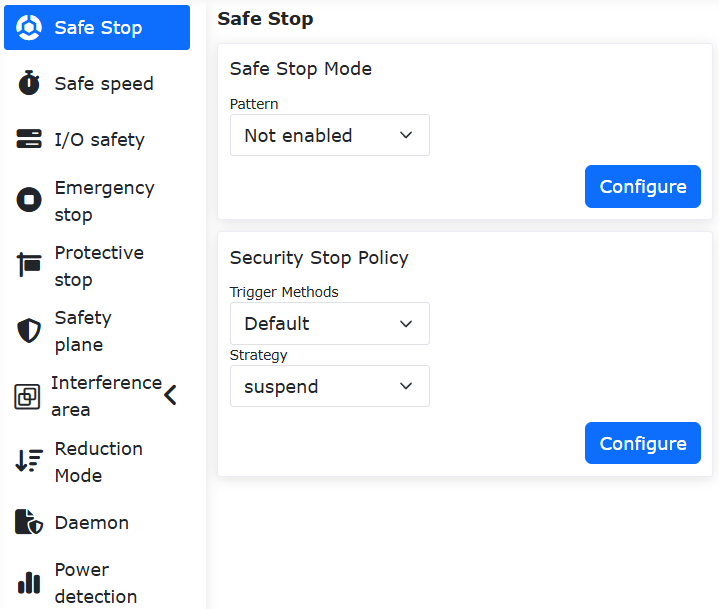
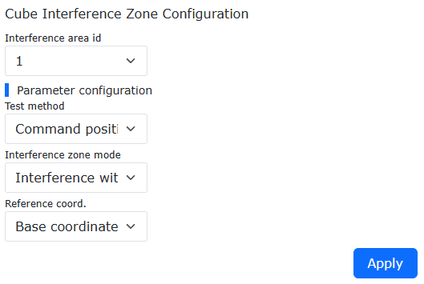

Sicurezza
===============

.. toctree::
   :maxdepth: 6

Arresto di Sicurezza
-----------------------------

Fare clic sulla barra dei menu "Impostazioni iniziali" -> "Sicurezza", quindi fare clic sulla sottovoce "Arresto di sicurezza" per accedere all'interfaccia di configurazione. Impostare la modalità di arresto di sicurezza e i parametri della strategia di arresto di sicurezza.

.. image:: safety/001.png
   :width: 4in
   :align: center

.. centered:: Diagramma 7.1-1 Configurazione Arresto di Sicurezza

Arresto di Sicurezza a Doppio Canale + Modalità Ridotta Configurabile
~~~~~~~~~~~~~~~~~~~~~~~~~~~~~~~~~~~~~~~~~~~~~~~~~~~~~~~~~~~~~~~~~~~~~~~~~~~~~~~~~~

Panoramica
++++++++++++++++++++++++++++++++++++

Quando la modalità di attivazione dell'arresto di sicurezza è impostata su "Doppio Canale", entrambi i canali devono essere garantiti puliti e l'avviso deve essere cancellato manualmente nell'interfaccia operativa prima che il robot possa essere resettato. Inoltre, nella configurazione della strategia viene aggiunta un'opzione di modalità ridotta. Quando questa strategia viene selezionata dall'utente, il robot entrerà in movimento in modalità ridotta.

Procedura Operativa
++++++++++++++++++++++++++++++++++++

**Step1**: Fare clic sul pulsante "Impostazioni Iniziali" -> "Sicurezza" -> "Arresto Sicurezza". La modalità di attivazione può essere selezionata come "Predefinita" o "Doppio Canale". La differenza tra le due è la seguente: nella modalità "Predefinita", dopo l'attivazione e il ripristino, l'errore dell'interfaccia viene cancellato automaticamente. Nella modalità "Doppio Canale", dopo l'attivazione e il ripristino, l'errore dell'interfaccia deve essere cancellato manualmente. La "Strategia di Arresto Sicurezza" può essere selezionata come "Arresto", "Pausa", "Modalità Ridotta Livello 1" o "Modalità Ridotta Livello 2". Spiegazioni dettagliate sono le seguenti: Quando si seleziona "Arresto", il robot si ferma. Quando si seleziona "Pausa", il robot mette in pausa il movimento corrente e riprenderà dopo il ripristino e la cancellazione dell'errore. Quando si seleziona "Modalità Ridotta Livello 1", il robot entra in movimento in modalità ridotta di livello 1. Quando si seleziona "Modalità Ridotta Livello 2", il robot entra in movimento in modalità ridotta di livello 2.

.. centered:: Figura 7.1-2 Impostazioni Strategia Arresto Sicurezza

**Step2**: Poiché quando la modalità di attivazione è selezionata come "Predefinita", dopo l'attivazione e il ripristino, l'errore dell'interfaccia può essere cancellato automaticamente, non richiede molta introduzione. Pertanto, ci concentriamo principalmente sull'operazione quando la modalità di attivazione è selezionata come "Doppio Canale": Dopo l'attivazione e il ripristino, è necessario fare clic manualmente sull'operazione "Cancella" in alto a destra prima che il robot possa essere resettato.

.. image:: safety/049.png
   :width: 4in
   :align: center

.. centered:: Figura 7.1-3 Cancellazione Manuale di un'Operazione di Attivazione Arresto Sicurezza

Velocità di Sicurezza
-----------------------------

Fare clic sulla barra dei menu "Impostazioni iniziali" -> "Sicurezza", quindi fare clic sulla sottovoce "Velocità di sicurezza" per accedere all'interfaccia di configurazione. Impostare la velocità di sicurezza.

.. note:: La velocità manuale TCP è inferiore a 250 mm/s.

.. image:: safety/002.png
   :width: 4in
   :align: center

.. centered:: Diagramma 7.2-1 Configurazione Velocità Manuale Sicura

Sicurezza I/O
----------------

Fare clic sulla barra dei menu "Impostazioni iniziali" -> "Sicurezza", quindi fare clic sulla sottovoce "Sicurezza I/O" per accedere all'interfaccia di configurazione.

L'HMI consente di impostare lo stato di sicurezza per 16 ingressi digitali e 16 uscite digitali, che possono essere configurati come validi o non validi. Quando il controller rileva che il sistema è in uno stato sicuro, i 16 ingressi digitali e le 16 uscite digitali vengono impostati nello stato di sicurezza.

.. image:: safety/003.png
   :width: 4in
   :align: center

.. centered:: Diagramma 7.3-1 Configurazione Stato Sicurezza I/O

Nel sistema LA:
    "Sicurezza I/O" fornisce la funzione di sicurezza DIO, che è un DI a doppio canale o DO. Quando viene rilevato un segnale DI di sicurezza o viene attivato un flag di stato di sicurezza, viene emesso il DO.

.. image:: safety/004.png
   :width: 4in
   :align: center

.. centered:: Diagramma 7.3-2 Configurazione Funzione Sicurezza I/O

Arresto di Emergenza
-------------------------

Fare clic sulla barra dei menu "Impostazioni iniziali" -> "Sicurezza", quindi fare clic sulla sottovoce "Arresto di emergenza" per accedere all'interfaccia di configurazione.

È possibile configurare i tipi di arresto di emergenza 0, 1a, 1b, 2, impostare i limiti di tempo di arresto e i limiti di distanza di arresto.

- Attraverso il controller inviato alla scheda del quadro di controllo, il tipo di arresto di emergenza 0 interrompe immediatamente l'alimentazione alla scheda del quadro di controllo;
  
- Il tipo di arresto di emergenza 1a interrompe l'alimentazione al corpo del robot dopo l'arresto in decelerazione;
  
- Il tipo di arresto di emergenza 1b disabilita il corpo del robot dopo l'arresto in decelerazione, senza interrompere l'alimentazione al corpo;

- Il tipo di arresto di emergenza 2 significa che quando viene premuto l'emergenza, il robot si arresta in decelerazione e mantiene l'abilitazione. Dopo aver rilasciato l'emergenza, il robot dovrebbe funzionare normalmente.

.. image:: safety/005.png
   :width: 4in
   :align: center

.. centered:: Diagramma 7.4-1 Configurazione Arresto di Emergenza

Funzione opzionale di abilitazione automatica al ripristino dell'arresto di sicurezza
~~~~~~~~~~~~~~~~~~~~~~~~~~~~~~~~~~~~~~~~~~~~~~~~~~~~~~~~~~~~~~~~~~~~~~~~~~~~~~~~~~~~~~~~~~~~~~~

Panoramica
+++++++++++++++++++++

Dopo aver subito un arresto di emergenza di tipo 1b, il robot offre due modalità: abilitazione manuale e abilitazione automatica, per consentire agli utenti di scegliere autonomamente. Quando si seleziona l'abilitazione manuale, l'utente deve, dopo aver rilasciato il pulsante di emergenza, cambiare la modalità di funzionamento del robot in automatica e fare clic manualmente sul pulsante di abilitazione per abilitare il robot; quando si seleziona l'abilitazione automatica, dopo che l'utente ha rilasciato il pulsante di emergenza, il robot si abilita automaticamente.

Procedura operativa
+++++++++++++++++++++++++++

**Step1**: Fare clic sul pulsante "Impostazioni iniziali" -> "Sicurezza" -> "Arresto di emergenza", selezionare "Tipo 1b" come "Tipo di arresto" e, in base alle esigenze effettive, impostare i parametri "Limite tempo arresto" e "Limite distanza arresto". "Strategia abilitazione dopo reset emergenza" può essere selezionata come "Abilitazione manuale" o "Abilitazione automatica", come mostrato nella Figura 2-1.

.. image:: safety/046.png
   :width: 4in
   :align: center

.. centered:: Diagramma 7.4-2 Impostazioni Strategia Abilitazione

**Step2**: Quando si seleziona "Abilitazione automatica", dopo che l'utente ha rilasciato il pulsante di emergenza, il robot si abilita automaticamente; quando si seleziona "Abilitazione manuale", l'utente deve, dopo aver rilasciato il pulsante di emergenza, in modalità automatica, fare clic manualmente sul pulsante di abilitazione per abilitare il robot, come mostrato nella Figura 2-2.

.. image:: safety/047.png
   :width: 6in
   :align: center

.. centered:: Diagramma 7.4-3 Operazione Abilitazione Manuale

Arresto Protettivo
-------------------------

Fare clic sulla barra dei menu "Impostazioni iniziali" -> "Sicurezza", quindi fare clic sulla sottovoce "Arresto protettivo" per accedere all'interfaccia di configurazione.

Tipi di arresto protettivo 0, 1, 2. Il tipo di arresto protettivo 0 interrompe immediatamente l'alimentazione alla scheda del quadro di controllo; il tipo di arresto protettivo 1 fa sì che la scheda del quadro di controllo notifichi prima al controller di fermare il robot, quindi il controller segnala alla scheda del quadro di controllo di interrompere l'alimentazione; il tipo di arresto protettivo 2 fa sì che la scheda del quadro di controllo notifichi al controller di fermare il robot.

.. image:: safety/006.png
   :width: 4in
   :align: center

.. centered:: Diagramma 7.5-1 Configurazione Arresto Protettivo

.. important::
    I flag di stato dei dati di sicurezza e il feedback dei guasti della scheda del quadro di controllo vengono acquisiti tramite l'interfaccia Web e il feedback dello stato del controller. Quando il flag è impostato a 1, lo stato anomalo dei dati di sicurezza viene segnalato nello stato di allarme WebAPP. Dopo l'acquisizione del guasto della scheda del quadro di controllo, il codice di errore specifico viene visualizzato nello stato di allarme WebAPP in base al codice di errore.

.. image:: safety/007.png
   :width: 4in
   :align: center

.. centered:: Diagramma 7.5-2 Stato Allarme WebAPP

Configurazione Zona di Interferenza
--------------------------------------------------

Sotto la barra dei menu "Impostazioni iniziali" -> "Sicurezza" -> "Zona di interferenza", fare clic sulla sottovoce "Singola" per accedere all'interfaccia di configurazione della funzione di zona di interferenza.

Innanzitutto, è necessario configurare la modalità di interferenza e l'operazione di ingresso nella zona di interferenza. Le modalità di interferenza sono suddivise in "Interferenza asse" e "Interferenza cubo".

.. image:: safety/025.png
   :width: 3in
   :align: center

.. centered:: Diagramma 7.6‑1 Modalità Zona di Interferenza

Controllare l'attivazione tramite l'interruttore a cursore. Innanzitutto, configurare il movimento nella zona di interferenza come "Continua movimento" o "Arresta". Successivamente, configurare l'operazione di trascinamento all'ingresso nella zona di interferenza. Gli utenti possono impostare la strategia dopo l'ingresso nella zona di interferenza in modalità trascinamento in base alle proprie esigenze: nessuna limitazione al trascinamento, callback di impedenza o ritorno alla modalità manuale.

.. image:: safety/026.png
   :width: 3in
   :align: center

.. centered:: Diagramma 7.6‑2 Configurazione Zona di Interferenza

Selezionare l'interferenza asse, è necessario configurare i parametri dell'interferenza asse. Il metodo di rilevamento è suddiviso in "Posizione comando" e "Posizione feedback" due tipi. La modalità zona di interferenza è suddivisa in "Interferenza all'interno del range" e "Interferenza all'esterno del range" due tipi. Successivamente, impostare il range per ogni giunto e se abilitare il range di ciascun giunto. È possibile inserire valori numerici o utilizzare l'"icona di aggiornamento" dopo "Valore minimo" e "Valore massimo" per registrare la posizione corrente del robot. Infine, fare clic su Configura.

.. image:: safety/027.png
   :width: 3in
   :align: center

.. centered:: Diagramma 7.6‑3 Configurazione Interferenza Asse

Selezionare l'interferenza cubo, è necessario configurare i parametri dell'interferenza cubo. Il metodo di rilevamento è suddiviso in "Posizione comando" e "Posizione feedback" due tipi. La modalità zona di interferenza è suddivisa in "Interferenza all'interno del range" e "Interferenza all'esterno del range" due tipi. Il sistema di coordinate di riferimento è suddiviso in "Coordinate base" e "Coordinate utensile", selezionare in base all'uso effettivo. Successivamente, procedere con l'impostazione del range. L'impostazione del range è suddivisa in due metodi. Per prima cosa, vedere il primo metodo "Metodo a due punti", ovvero i due vertici diagonali del cubo. Possiamo registrare la posizione tramite inserimento o insegnamento del robot. Infine, fare clic su Applica.

.. image:: safety/028.png
   :width: 3in
   :align: center

.. centered:: Diagramma 7.6‑4 Configurazione Interferenza Cubo

Successivamente, vedere il secondo metodo "Punto centrale + lunghezza lato", ovvero il punto centrale della posizione del cubo e la lunghezza del lato del cubo costituiscono la zona di interferenza. Possiamo registrare la posizione tramite inserimento o insegnamento del robot. Infine, fare clic su Applica.

.. image:: safety/029.png
   :width: 3in
   :align: center

.. centered:: Diagramma 7.6‑5 Configurazione Interferenza Cubo

Funzione di callback di sicurezza per l'ingresso in interferenza asse con trascinamento assistito da sensore di forza
~~~~~~~~~~~~~~~~~~~~~~~~~~~~~~~~~~~~~~~~~~~~~~~~~~~~~~~~~~~~~~~~~~~~~~~~~~~~~~~~~~~~~~~~~~~~~~~~~~~~~~~~~~~~~~~~~~~~~~~~~~~~~~

Panoramica
+++++++++++++++++++++++++

La funzione di callback di sicurezza per l'ingresso in interferenza asse con trascinamento assistito da sensore di forza è quando il trascinamento assistito da sensore di forza e la zona di interferenza coesistono. Quando il robot entra nella zona di interferenza, il robot passa automaticamente alla modalità di trascinamento, con effetto di callback di impedenza; quando il robot esce dalla zona di interferenza, il robot ritorna automaticamente al trascinamento assistito da sensore di forza. Ciò consente di soddisfare molteplici scenari d'uso per gli utenti che utilizzano il trascinamento assistito da sensore di forza.

Procedura operativa
++++++++++++++++++++++++

Anello di limitazione articolare
********************************
**Step1**: Accedere all'interfaccia web, fare clic sull'interruttore "Anello di limitazione articolare". Un anello di limitazione articolare apparirà sulle articolazioni del robot, come mostrato nella figura sottostante.

.. image:: safety/030.png
   :width: 4in
   :align: center

.. centered:: Diagramma 7.6‑6 Anello di limitazione articolare interfaccia web

**Step2**: Il puntatore bianco sull'anello di limitazione articolare rappresenta l'angolo effettivo dell'articolazione; l'intaglio rappresenta la posizione del limite morbido dell'articolazione corrispondente, la dimensione dell'intaglio dell'anello di limitazione articolare cambia con la dimensione del limite morbido; quando l'articolazione si muove, l'anello di limitazione articolare rimane relativamente stazionario rispetto all'articolazione.

Configurazione interferenza asse
********************************
**Step1**: Configurare e attivare l'interferenza asse. Fare clic in sequenza su "Impostazioni iniziali" -> "Sicurezza" -> "Zona di interferenza" -> "Singola", accedere alla pagina di configurazione della zona di interferenza, fare clic sulla scheda "Interferenza asse" per accedere all'interfaccia, attivare l'interruttore "Funzione attiva".

**Step2**: È possibile impostare la "Strategia di movimento" su "Continua movimento", selezionare "Strategia di trascinamento" come "Callback di impedenza" e impostare i parametri di callback di impedenza, come mostrato nella figura sottostante. I parametri di callback di impedenza rappresentano la forza di rimbalzo durante la callback di impedenza, valori più alti indicano una forza di rimbalzo maggiore. Si consiglia di configurare il parametro a "5".

.. image:: safety/031.png
   :width: 4in
   :align: center

.. centered:: Diagramma 7.6‑7 Interfaccia di configurazione interferenza asse

**Step3**: Impostare il range della zona di interferenza asse. È possibile impostare la "Modalità di rilevamento" su "Posizione feedback", la "Modalità zona di interferenza" può essere selezionata tra le due modalità "Interferenza all'interno del range" e "Interferenza all'esterno del range"; impostare il range di interferenza per ciascuna articolazione, selezionare "Abilita" per attivare il range di interferenza dell'asse corrispondente, come mostrato nella figura sottostante.

.. image:: safety/032.png
   :width: 4in
   :align: center

.. centered:: Diagramma 7.6‑8 Interfaccia configurazione range zona di interferenza

**Step4**: Impostare la "Modalità zona di interferenza" su "Interferenza all'interno del range". Nell'interfaccia web, l'anello di limitazione articolare mostra in verde l'area di movimento libero, in giallo l'area di interferenza, e l'area in cui si trova il puntatore bianco è evidenziata, come mostrato nella figura sottostante.

.. image:: safety/033.png
   :width: 4in
   :align: center

.. centered:: Diagramma 7.6‑9 Visualizzazione anello di limitazione articolare in modalità "Interferenza all'interno del range"

**Step5**: Impostare la "Modalità zona di interferenza" su "Interferenza all'esterno del range". Nell'interfaccia web, l'anello di limitazione articolare mostra in verde l'area di movimento libero, in giallo l'area di interferenza, e l'area in cui si trova il puntatore bianco è evidenziata, come mostrato nella figura sottostante.

.. image:: safety/034.png
   :width: 4in
   :align: center

.. centered:: Diagramma 7.6‑10 Visualizzazione anello di limitazione articolare in modalità "Interferenza all'esterno del range"

Ingresso in zona di interferenza asse con trascinamento assistito da sensore di forza
++++++++++++++++++++++++++++++++++++++++++++++++++++++++++++++++++++++++++++++++++++++++++

**Step1**: Fare clic in sequenza su "Applicazioni ausiliarie" -> "Applicazioni utensile" -> "Blocco trascinamento", cambiare l'interruttore "Stato" della funzione di blocco assistito da sensore di forza su "Attivo", selezionare "Attiva" per l'opzione zona di interferenza, impostare i coefficienti correlati e applicare, come mostrato nella figura sottostante.

.. image:: safety/035.png
   :width: 4in
   :align: center

.. centered:: Diagramma 7.6‑11 Interfaccia di configurazione trascinamento assistito da sensore di forza

**Step2**: Trascinare il robot con trascinamento assistito da sensore di forza. Quando l'angolo dell'articolazione del robot raggiunge il range della zona di interferenza, la modalità del robot passa al trascinamento a loop di corrente, con effetto di callback di impedenza, consentendo di allontanarsi dalla zona di interferenza asse; dopo l'uscita dal range della zona di interferenza asse, la modalità del robot ritorna al trascinamento assistito da sensore di forza.

Configurazione interferenza cubo
++++++++++++++++++++++++++++++++++++++++++

**Step1**: Impostare la zona di interferenza cubo. Fare clic in sequenza su "Impostazioni iniziali" -> "Sicurezza" -> "Zona di interferenza" -> "Singola", accedere alla pagina di configurazione della zona di interferenza, fare clic sulla scheda "Interferenza cubo" per accedere all'interfaccia, attivare l'interruttore "Funzione attiva".

**Step2**: È possibile impostare la "Strategia di movimento" su "Continua movimento", selezionare "Strategia di trascinamento" come "Nessuna limitazione al trascinamento", come mostrato nella figura sottostante.

.. image:: safety/036.png
   :width: 4in
   :align: center

.. centered:: Diagramma 7.6‑12 Configurazione zona di interferenza cubo

**Step3**: Configurare i parametri della zona di interferenza cubo. È possibile impostare la "Modalità di rilevamento" su "Posizione feedback", la "Modalità zona di interferenza" può essere selezionata tra le due modalità "Interferenza all'interno del range" e "Interferenza all'esterno del range", impostare "Coordinate di riferimento" su "Coordinate base".

**Step4**: Selezionare il metodo di insegnamento del range della zona di interferenza cubo come "Metodo a due punti". Insegnare al robot due punti, rispettivamente il punto minimo e il punto massimo nello spazio cartesiano, fare clic su "Applica". Successivamente, un cubo virtuale apparirà nell'interfaccia web, come mostrato nella figura sottostante.

.. image:: safety/037.png
   :width: 4in
   :align: center

.. centered:: Diagramma 7.6‑13 Impostazione zona di interferenza cubo con "Metodo a due punti"

.. image:: safety/038.png
   :width: 4in
   :align: center

.. centered:: Diagramma 7.6‑14 Visualizzazione cubo virtuale nell'interfaccia web

**Step5**: Selezionare il metodo di insegnamento del range della zona di interferenza cubo come "Punto centrale + lunghezza lato". Insegnare al robot un punto, impostare la lunghezza dei tre assi X, Y, Z centrata sul punto insegnato, come mostrato nella figura sottostante, fare clic su "Applica". Successivamente, un cubo virtuale apparirà nell'interfaccia web.

.. image:: safety/039.png
   :width: 4in
   :align: center

.. centered:: Diagramma 7.6‑15 Impostazione zona di interferenza cubo con "Punto centrale + lunghezza lato"

**Step6**: Impostare la "Modalità zona di interferenza" su "Interferenza all'interno del range". Quando l'estremità del robot è all'esterno del range del cubo, il cubo virtuale nell'interfaccia web viene visualizzato in giallo con trasparenza del 40%; quando l'estremità del robot è all'interno del range del cubo, il cubo appare in giallo con trasparenza del 90% e viene visualizzato l'avviso "Ingresso zona di interferenza", come mostrato nella figura sottostante.

.. image:: safety/040.png
   :width: 4in
   :align: center

.. centered:: Diagramma 7.6‑16 Ingresso nella zona di interferenza cubo in modalità "Interferenza all'interno del range"

**Step7**: Impostare la "Modalità zona di interferenza" su "Interferenza all'esterno del range". Quando l'estremità del robot è all'interno del range del cubo, il cubo virtuale nell'interfaccia web viene visualizzato in verde con trasparenza del 40%; quando l'estremità del robot è all'esterno del range del cubo, il cubo appare in verde con trasparenza del 90% e viene visualizzato l'avviso "Ingresso zona di interferenza", come mostrato nella figura sottostante.

.. image:: safety/041.png
   :width: 4in
   :align: center

.. centered:: Diagramma 7.6‑17 Visualizzazione zona di interferenza cubo in modalità "Interferenza all'esterno del range"

Configurazione parete di sicurezza
++++++++++++++++++++++++++++++++++++++++++++++++++
**Step1**: Impostare la parete di sicurezza. Fare clic in sequenza su "Impostazioni iniziali" -> "Sicurezza" -> "Parete di sicurezza" per accedere all'interfaccia di configurazione della parete di sicurezza. L'interfaccia web supporta l'impostazione simultanea di massimo 8 pareti di sicurezza. Selezionare la parete di sicurezza e configurarla. Dopo aver completato la configurazione, attivare la parete di sicurezza corrispondente. Un muro virtuale arancione con trasparenza del 40% apparirà nell'interfaccia web, come mostrato nella figura sottostante.

.. image:: safety/042.png
   :width: 4in
   :align: center

.. centered:: Diagramma 7.6‑18 Configurazione parete di sicurezza

.. image:: safety/043.png
   :width: 4in
   :align: center

.. centered:: Diagramma 7.6‑19 Visualizzazione muro virtuale nell'interfaccia web

**Step2**: Quando l'estremità del robot entra nella parete di sicurezza, il muro virtuale diventa arancione con trasparenza del 90% e viene visualizzato l'avviso "Ingresso parete di sicurezza", come mostrato nella figura sottostante.

.. image:: safety/044.png
   :width: 4in
   :align: center

.. centered:: Diagramma 7.6‑20 Visualizzazione muro virtuale nell'interfaccia web quando l'estremità del robot entra nella parete di sicurezza

Funzione Interferenza Cubo
~~~~~~~~~~~~~~~~~~~~~~~~~~~~~~~~~~~~~~~~~~~~~~~~~~~~~~~~~~

Panoramica
+++++++++++++++++++++++++++++++

La funzione di interferenza cubo supporta la definizione e l'attivazione simultanea di più zone di interferenza cubo indipendenti. La posizione e le dimensioni di ciascuna zona di interferenza nello spazio tridimensionale possono essere configurate indipendentemente. Inoltre, ogni zona di interferenza è dotata di un'uscita di segnale di trigger CO (Controller Output) individuale, in grado di emettere i corrispondenti segnali di trigger in base alla posizione in tempo reale del robot.

Procedura Operativa
+++++++++++++++++++++++++++++++++++++++++++++++++++++++++++++++++++

**Step1**: Abilitare la funzione di interferenza cubo ed eseguire la configurazione di base. Fare clic in sequenza sui comandi "Impostazioni Iniziali" -> "Sicurezza" -> "Zona Interferenza" -> "Interferenza Cubo". Utilizzare gli interruttori a cursore per controllare se ciascuna zona di interferenza cubo è abilitata ed eseguire la configurazione di base.

Tra queste impostazioni, la strategia di movimento all'ingresso della zona di interferenza può essere selezionata come "Continua Movimento" o "Stop". Quando si seleziona "Continua Movimento", il robot visualizzerà un avviso ma continuerà a muoversi all'ingresso della zona di interferenza. Quando si seleziona "Stop", il robot visualizzerà un avviso e si fermerà all'ingresso della zona di interferenza. La strategia di trascinamento all'ingresso della zona di interferenza può essere selezionata come "Trascinamento Illimitato," "Callback Impedenza," o "Ripassa a Modalità Manuale".

.. image:: safety/050.png
   :width: 4in
   :align: center

.. centered:: Figura 7.6‑21 Controllo Abilitazione Cubo e Configurazione di Base

**Step2**: Configurare le zone di interferenza cubo. È possibile impostare diversi parametri di configurazione per ciascun ID zona di interferenza. È importante notare:

(1) Il metodo di rilevamento deve essere selezionato in base alle effettive esigenze funzionali come "Posizione Comando" o "Posizione Feedback".

(2) Quando la modalità della zona di interferenza è selezionata come "Interferenza Fuori Intervallo", è efficace solo per una singola zona di interferenza.

.. centered:: Figura 7.6‑22 Configurazione Zona Interferenza Cubo

**Step3**: Impostare l'intervallo della zona di interferenza. L'intervallo può essere impostato scegliendo il metodo "Metodo a Due Punti" o "Punto Centrale + Lunghezze Lati" per generare la zona di interferenza cubo. Il "Metodo a Due Punti" genera la zona specificando due vertici opposti del cubo. Il metodo "Punto Centrale + Lunghezze Lati" genera la zona specificando il punto centrale e le lunghezze dei tre lati del cubo.

.. image:: safety/052.png
   :width: 4in
   :align: center

.. centered:: Figura 7.6‑23 Generazione Zona Interferenza tramite "Metodo a Due Punti"

.. image:: safety/053.png
   :width: 4in
   :align: center

.. centered:: Figura 7.6‑24 Generazione Zona Interferenza tramite "Punto Centrale + Lunghezze Lati"

**Step4**: Configurare i segnali CO. Fare clic in sequenza sui comandi "Impostazioni Iniziali" -> "Base" -> "Impostazioni I/O" -> "DO" per configurare l'uscita CO corrispondente per ciascun cubo.

.. image:: safety/054.png
   :width: 4in
   :align: center

.. centered:: Figura 7.6‑25 Configurazione Uscita CO

**Step5**: Ciascuna zona di interferenza cubo verrà visualizzata sull'interfaccia del robot in base al proprio numero ID impostato. Quando il punto centrale dell'end-effector del robot entra in una zona di interferenza, l'interfaccia visualizzerà un avviso "Zona Interferenza Entrata" e l'interfaccia CO corrispondente emetterà un segnale.

.. image:: safety/055.png
   :width: 4in
   :align: center

.. centered:: Figura 7.6‑26 Visualizzazione Interfaccia Zone Interferenza Multi-Cubo

Modalità Ridotta
-----------------------------

Fare clic sulla barra dei menu "Impostazioni iniziali" -> "Sicurezza", quindi fare clic sulla sottovoce "Modalità ridotta" per accedere all'interfaccia di configurazione. Selezionare "Modalità livello 1/livello 2" per configurare la velocità dell'articolazione e la velocità TCP dell'estremità.

.. image:: safety/045.png
   :width: 4in
   :align: center

.. centered:: Diagramma 7.7-1 Modalità Ridotta

Parete di Sicurezza
-----------------------------

Fare clic sulla barra dei menu "Impostazioni iniziali" -> "Sicurezza", quindi fare clic sulla sottovoce "Configurazione parete di sicurezza" per accedere all'interfaccia di configurazione.

-  **Configurazione parete di sicurezza**: Fare clic sul pulsante Attiva per attivare la parete di sicurezza corrispondente. Se la parete di sicurezza non è configurata con un range di sicurezza, verrà visualizzato un messaggio di errore. Fare clic sulla casella a discesa, selezionare la parete di sicurezza che si desidera impostare, la distanza di sicurezza verrà automaticamente visualizzata (può essere lasciata non impostata, predefinita 0), quindi fare clic sul pulsante "Imposta" per completare l'impostazione.

.. image:: safety/008.png
   :width: 4in
   :align: center

.. centered:: Diagramma 7.8-1 Configurazione Parete di Sicurezza

-  **Configurazione punti di riferimento parete di sicurezza**: Dopo aver selezionato la parete di sicurezza, è possibile impostare quattro punti di riferimento. I primi tre punti sono punti di riferimento planari, utilizzati per confermare il piano della parete di sicurezza impostata. Il quarto punto è il punto di riferimento del range di sicurezza, utilizzato per confermare il range di sicurezza della parete di sicurezza impostata.

.. important::
   Se il punto di riferimento è impostato correttamente, la spia è verde. In caso contrario, è gialla. Fino a quando il punto di riferimento non viene impostato correttamente, diventa verde. Quando tutti e quattro i punti di riferimento sono impostati correttamente, è possibile calcolare il range di sicurezza. Dopo il calcolo riuscito, lo stato del parametro del range di sicurezza ritorna predefinito.

.. image:: safety/009.png
   :width: 4in
   :align: center

.. centered:: Diagramma 7.8-2 Impostazione punti di riferimento range di sicurezza

-  Effetto applicazione: Attivare la parete di sicurezza configurata con successo. Trascinare il robot. Se l'estremità TCP del robot si trova all'interno del range di sicurezza impostato, il sistema è normale. Se si trova al di fuori del range di sicurezza impostato, viene segnalato un errore.

.. image:: safety/010.png
   :width: 6in
   :align: center

.. centered:: Diagramma 7.8-3 Effetto dopo l'impostazione riuscita del range di sicurezza

Programma in Background di Sicurezza
---------------------------------------------------------

Fare clic sulla barra dei menu "Impostazioni iniziali" -> "Sicurezza", quindi fare clic sulla sottovoce "Programma in background di sicurezza" per accedere all'interfaccia di configurazione.

L'utente fa clic sul pulsante "Attiva funzione" per attivare o disattivare le impostazioni del programma in background di sicurezza. Selezionare "Situazione imprevista" e "Programma in background", fare clic sul pulsante "Imposta" per configurare i parametri della logica di gestione delle situazioni impreviste.

Attivare il programma in background di sicurezza e impostare lo scenario di situazione imprevista e il programma in background. Quando l'utente inizia a eseguire il programma, se si verifica uno scenario di situazione imprevista che corrisponde alla situazione imprevista impostata, il robot eseguirà il programma in background corrispondente, svolgendo un ruolo di protezione della sicurezza.

.. image:: safety/011.png
   :width: 4in
   :align: center

.. centered:: Diagramma 7.9-1 Programma in Background di Sicurezza

Limitazione Direzione Utensile (utilizzabile solo nel sistema LA)
-------------------------------------------------------------------------------

Fare clic sulla barra dei menu "Impostazioni iniziali" -> "Sicurezza", quindi fare clic sulla sottovoce "Limitazione direzione utensile" per accedere all'interfaccia di configurazione.

La limitazione della direzione dell'utensile è una funzione protettiva che agisce sullo spazio cartesiano dell'estremità dell'utensile del robot, utilizzata per limitare il range di movimento dell'orientamento dell'estremità del robot. Include l'impostazione dell'attivazione della funzione, l'impostazione della direzione di riferimento dell'utensile e l'impostazione dell'angolo di deviazione massimo. L'angolo di deviazione massimo definisce il valore limite dell'angolo massimo tra l'asse Z del sistema di coordinate cartesiane dell'estremità dell'utensile e la direzione di riferimento dell'utensile, generalmente comprensibile come uno spazio conico.

.. image:: safety/012.png
   :width: 4in
   :align: center

.. centered:: Diagramma 7.10-1 Limitazione Direzione Utensile

Limiti del Robot (utilizzabile solo nel sistema LA)
-------------------------------------------------------------------------------

Fare clic sulla barra dei menu "Impostazioni iniziali" -> "Sicurezza", quindi fare clic sulla sottovoce "Limiti del robot" per accedere all'interfaccia di configurazione.

I limiti del robot includono la quantità di moto e la potenza, dove il limite di quantità di moto è utilizzato per limitare la quantità di moto massima del robot, e il limite di potenza è utilizzato per limitare il lavoro meccanico svolto dal robot.

.. image:: safety/013.png
   :width: 4in
   :align: center

.. centered:: Diagramma 7.11-1 Limiti del Robot

Rilevamento Potenza (utilizzabile solo nel sistema QX)
-------------------------------------------------------------------------------

Fare clic sulla barra dei menu "Impostazioni iniziali" -> "Sicurezza", quindi fare clic sulla sottovoce "Rilevamento potenza" per accedere all'interfaccia di configurazione.

Quando agisce direttamente sul loop di corrente del robot (solo il comando servoJT), viene utilizzato per limitare il lavoro svolto dal robot. Rilevando che l'integrale di velocità e coppia del robot supera il limite, viene attivata la protezione di potenza.

.. image:: safety/014.png
   :width: 4in
   :align: center

.. centered:: Diagramma 7.12-1 Rilevamento Potenza

Configurazione Movimento
---------------------------------------------

Ottimizzazione caratteristica velocità a T + funzione blending di levigatura
~~~~~~~~~~~~~~~~~~~~~~~~~~~~~~~~~~~~~~~~~~~~~~~~~~~~~~~~~~~~~~~~~~~~~~~~~~~~~~~

Panoramica
++++++++++++++++++++++

Il blending tra due segmenti di traiettoria può evitare i frequenti avvii e arresti causati dall'arresto completo, migliorando così l'efficienza del movimento del robot.

Questa funzione si applica principalmente al blending tra istruzioni PTP-PTP, LIN-LIN, ARC-ARC, LIN-ARC, ARC-LIN. Il blending tra altre istruzioni non è efficace.

Procedura operativa
++++++++++++++++++++++

Poiché le modalità operative delle varie istruzioni sono simili, questo manuale prende come esempio il blending PTP-PTP per illustrare il metodo operativo di questa funzione. Questa funzione può essere implementata in due modi: utilizzando l'istruzione Lua e utilizzando l'interruttore di configurazione del movimento.

Metodo utilizzando l'istruzione Lua
*********************************************************

**Step1**: Selezionare i punti di insegnamento per eseguire la funzione PTP. Questo manuale utilizza "A0"~"A5" come nomi dei punti di insegnamento.

**Step2**: Fare clic sul pulsante "Programmazione insegnamento" -> "Programmazione programma", selezionare l'istruzione "Punto a punto" nelle "Istruzioni di movimento", nell'"Editor istruzioni" selezionare il punto di insegnamento e impostare la velocità di debug, selezionare "Modalità levigatura accelerazione" per la protezione del movimento, impostare il parametro "Transizione levigata" nei punti in cui è necessaria la levigatura.

.. image:: safety/020.png
   :width: 6in
   :align: center

.. centered:: Diagramma 7.13-1 Impostazione istruzione blending PTP con levigatura accelerazione

**Step3**: Generare il programma Lua ed eseguirlo per realizzare la funzione di blending PTP-PTP. Questo metodo utilizza la velocità a T ottimizzata solo per le istruzioni tra AccSmoothStart() e AccSmoothEnd(), e utilizza la velocità a T originale per le altre istruzioni.

.. image:: safety/021.png
   :width: 4in
   :align: center

.. centered:: Diagramma 7.13-2 Programma tipico per blending PTP-PTP con istruzioni Lua

Metodo utilizzando l'interruttore di configurazione del movimento
*****************************************************************************

**Step1**: Fare clic sul pulsante "Impostazioni iniziali" -> "Sicurezza" -> "Configurazione movimento", attivare l'interruttore "Modalità levigatura accelerazione".

.. image:: safety/022.png
   :width: 6in
   :align: center

.. centered:: Diagramma 7.13-3 Impostazione interruttore configurazione modalità levigatura accelerazione

**Step2**: Selezionare i punti di insegnamento per eseguire la funzione PTP-PTP. Questo manuale utilizza "A0"~"A5" come nomi dei punti di insegnamento.

**Step3**: Fare clic sul pulsante "Programmazione insegnamento" -> "Programmazione programma", selezionare l'istruzione "Punto a punto" nelle "Istruzioni di movimento", nell'"Editor istruzioni" selezionare il punto di insegnamento e impostare la velocità di debug, selezionare "Nessuna" per la protezione del movimento, impostare il parametro "Transizione levigata" nei punti in cui è necessaria la levigatura.

.. image:: safety/023.png
   :width: 6in
   :align: center

.. centered:: Diagramma 7.13-4 Impostazione istruzione blending PTP convenzionale

**Step4**: Generare il programma Lua ed eseguirlo per realizzare la funzione di blending PTP-PTP. Il programma tipico è lo stesso del programma PTP convenzionale. Questo metodo utilizza la velocità a T ottimizzata per tutte le istruzioni.

.. image:: safety/024.png
   :width: 4in
   :align: center

.. centered:: Diagramma 7.13-5 Programma tipico per blending PTP-PTP con interruttore di configurazione

Funzione parametri adattativi FIR + Funzione pausa/ripresa FIR
~~~~~~~~~~~~~~~~~~~~~~~~~~~~~~~~~~~~~~~~~~~~~~~~~~~~~~~~~~~~~~~

Panoramica
++++++++++++++++++++++

La funzione di configurazione adattativa dei parametri della modalità tempo ottimale del robot realizza la configurazione automatica dei suoi vari parametri senza necessità di debug. Questa funzione adatta automaticamente i parametri della modalità tempo ottimale in base allo stato operativo corrente del robot, migliorando l'efficienza del debug.

Procedura operativa
++++++++++++++++++++++

Le istruzioni di movimento di base del robot PTP, LIN e ARC hanno modalità d'uso simili. Questo esempio utilizza principalmente l'istruzione di movimento PTP in modalità tempo ottimale.

**Step1**: Nell'interfaccia di controllo Web del robot, fare clic in sequenza su "Impostazioni iniziali" -> "Sicurezza" -> "Configurazione movimento" per accedere all'interfaccia "Configurazione movimento".

.. image:: safety/015.png
   :width: 6in
   :align: center

.. centered:: Diagramma 7.13-6 Interfaccia Configurazione Movimento

**Step2**: Nell'interfaccia "Configurazione movimento", fare clic sull'interruttore "Modalità tempo ottimale" per accedere all'interfaccia "Modalità tempo ottimale".

.. image:: safety/016.png
   :width: 3in
   :align: center

.. centered:: Diagramma 7.13-7 Interfaccia Modalità Tempo Ottimale

.. note:: Nella barra "Configurazione parametri" dell'interfaccia "Modalità tempo ottimale", il "Coefficiente di regolazione" può essere impostato da -100 a 100, che rappresenta il fattore di scala utilizzato per controllare il grado di ottimizzazione temporale dell'istruzione di movimento. Il valore predefinito è 1.

**Step3**: Determinare i punti di insegnamento per eseguire il movimento PTP. Questo esempio utilizza "A0"~"A5" come nomi dei punti di insegnamento.

**Step4**: Nell'interfaccia di controllo Web del robot, fare clic in sequenza su "Programmazione insegnamento" -> "Programmazione programma" per accedere all'interfaccia "Istruzioni di movimento".

.. image:: safety/017.png
   :width: 2in
   :align: center

.. centered:: Diagramma 7.13-8 Interfaccia Istruzioni di Movimento

**Step5**: Nell'interfaccia "Istruzioni di movimento", fare clic su "Punto a punto" per accedere all'interfaccia di modifica istruzioni "PTP". Selezionare rispettivamente il punto di insegnamento nella casella a discesa "Nome punto", impostare la proporzione della velocità desiderata nella barra "Velocità debug", selezionare "Arresta" nella barra "In questo punto", selezionare "No" nella casella a discesa "Spostamento" e selezionare "Nessuna" nella barra "Protezione movimento", quindi fare clic su "Aggiungi".

.. image:: safety/018.png
   :width: 6in
   :align: center

.. centered:: Diagramma 7.13-9 Interfaccia modifica istruzione movimento PTP

**Step6**: Nell'interfaccia di modifica istruzioni "PTP", fare clic su "Applica" per generare automaticamente il programma LUA corrispondente.

.. image:: safety/019.png
   :width: 4in
   :align: center

.. centered:: Diagramma 7.13-10 Programma LUA tipico per movimento PTP in modalità tempo ottimale

.. note:: 
   Il programma LUA tipico per movimento PTP in modalità tempo ottimale non è diverso dal programma LUA per movimento PTP generale. La differenza è che nel passaggio Step2 è già stata attivata la funzione "Modalità tempo ottimale".

   Attivando l'interruttore della funzione "Modalità tempo ottimale", le attuali istruzioni di movimento di base del robot PTP, LIN e ARC sono tutte in modalità tempo ottimale. Disattivando l'interruttore della funzione "Modalità tempo ottimale" in questa interfaccia, si ripristina lo stato delle istruzioni di movimento di base PTP, LIN e ARC.
   In questa interfaccia non è possibile attivare contemporaneamente l'interruttore della funzione "Modalità levigatura accelerazione".