Safety
===============

.. toctree:: 
   :maxdepth: 6

Stop mode
--------------

Click "Initial" -> "Safety" in the menu bar, and then click the "Stop mode" submenu to enter the configuration interface, set the safety stop mode and safety stop policy parameters function.

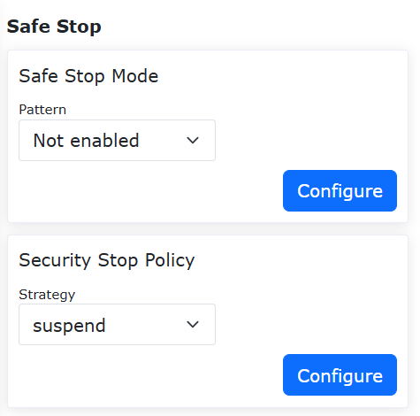

.. centered:: Figure 7.1-1 Safe Stop Configuration

Safe speed
--------------

Click "Initial" -> "Safety" in the menu bar, and then click the "Safe speed" submenu to enter the configuration interface, set the safe speed.

.. note:: TCP manual speed is less than 250mm/s.

.. image:: safety/002.png
   :width: 4in
   :align: center

.. centered:: Figure 7.2-1 Safe manual speed configuration

I/O safety
--------------

Click "Initial" -> "Safety" in the menu bar, and then click the "I/O safety" submenu to enter the configuration interface.

The HMI provides the setting of the safety status of 16 digital inputs and 16 digital outputs, which can be set to valid or invalid status. When the controller determines that it is in a safe state, the 16 digital inputs and 16 digital outputs are set to a safe state.

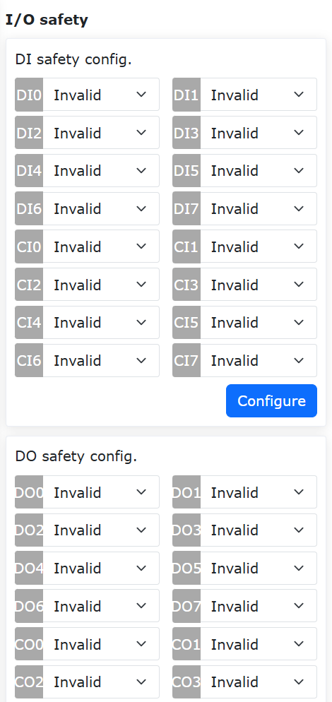

.. centered:: Figure 7.3-1 DIO safety status configuration

On Linux:
   The I/O safety function is provided in "DIO Safety". The safety function is dual-channel DI or DO. When a safety DI signal is detected or the safety status flag is triggered, DO is output.

.. image:: safety/004.png
   :width: 4in
   :align: center

.. centered:: Figure 7.3-2 DIO safety function configuration

Emergency stop
---------------------

Click "Initial" -> "Safety" in the menu bar, and then click the "Emergency stop" submenu to enter the configuration interface.

Emergency stop types 0, 1a, 1b, 2 can be set, stop time limit can be set, and stop distance limit can be set.

 - Send the control box board through the controller, and the emergency stop type 0 control box board directly cuts off the power;

 - Emergency stop type 1a is to cut off the power supply of the main body after deceleration stop;

 - Emergency stop type 1b is to not cut off the power supply of the main body after deceleration stop, and the main body is disabled;

- Emergency stop type 2 indicates pressing the emergency stop button, the robot decelerates to stop and maintains enable status. After releasing the emergency stop, the robot should be able to operate normally.
  
.. image:: safety/005.png
   :width: 4in
   :align: center

.. centered:: Figure 7.4-1 Emergency stop configuration

Safety Stop Recovery Optional Auto Enable Function
~~~~~~~~~~~~~~~~~~~~~~~~~~~~~~~~~~~~~~~~~~~~~~~~~~~~~

Overview
+++++++++++++++++++++

After the robot experiences a Category 1b emergency stop, it provides two modes for the user to choose from: Manual Enable and Auto Enable. When Manual Enable is selected, the user needs to change the robot's operation mode to Automatic after releasing the emergency stop button and manually click the enable button to enable the robot. When Auto Enable is selected, the robot will enable automatically after the user releases the emergency stop button.

Operation Process
+++++++++++++++++++++++++++

**Step1**: Click the "Initial Setup" -> "Safety" -> "Emergency Stop" button. Select "Category 1b" for "Stop Type", and set the "Stop Time Limit" and "Stop Distance Limit" parameters as needed. The "Enable Strategy After E-stop Reset" can be set to "Manual Enable" or "Auto Enable", as shown in Figure 2-1.

.. image:: safety/046.png
   :width: 6in
   :align: center

.. centered:: Figure 7.4-2 Enable Strategy Setting

**Step2**: When "Auto Enable" is selected, the robot will enable automatically after the user releases the emergency stop button. When "Manual Enable" is selected, the user must manually click the enable button in Automatic mode after releasing the emergency stop button to enable the robot, as shown in Figure 2-2.

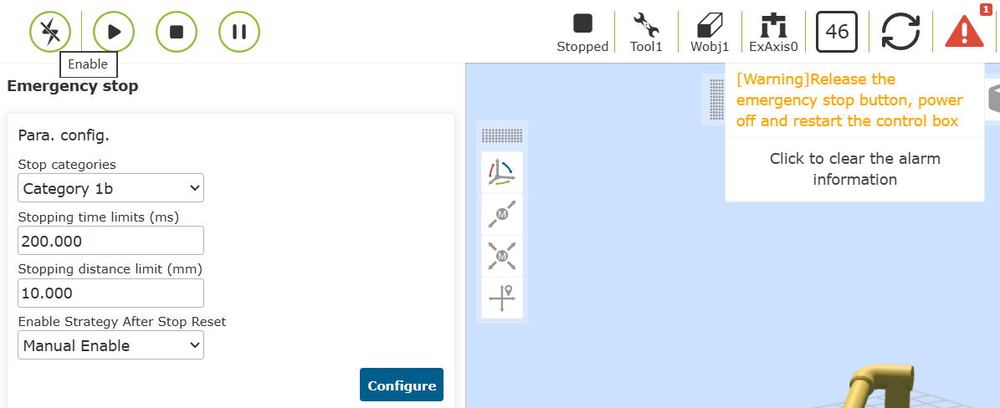

.. centered:: Figure 7.4-3 Manual Enable Operation

Protective stop
---------------------

Click "Initial" -> "Safety" in the menu bar, and then click the "Protective stop" submenu to enter the configuration interface.

Protective stop type 0, 1, 2. Protective stop type 0: the control box board directly cuts off the power. Protective stop type 1: the control box board first notifies the controller to control the robot to stop and then the controller feeds back to cut off the power of the control box board. Protective stop type 2: the control box board notifies the controller to control the robot to stop.

.. image:: safety/006.png
   :width: 4in
   :align: center

.. centered:: Figure 7.5-1 Protective shutdown configuration

.. important::
   The safety data status flag and control box carrier board fault feedback are obtained through the Web terminal and the controller status feedback. When the flag bit is 1, the safety data status is abnormal in the WebAPP alarm status. After the control box carrier board fault is obtained, the specific error information is displayed in the WebAPP alarm status according to the error code.

.. image:: safety/007.png
   :width: 4in
   :align: center

.. centered:: Figure 7.5-2 WebAPP alarm status 

Interference zone configuration
------------------------------------------------

In the menu bar of "Initial" -> "Safety", click "Interference Zone" to enter the interference area configuration function interface. Click on the "Shaft interference" card to enter the interface, then toggle the "Feature Enabled" slider.

First of all, we need to configure the interference mode and the operation of entering the interference area. The interference mode is divided into "Shaft interference" and "cube interference". When enabled, the activation sign will be displayed. First, enter the interference zone motion configuration "continue motion" or "stop".

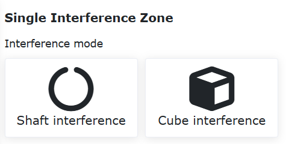

.. centered:: Figure 7.6‑1 Interference zone configuration

Next, set the configuration of dragging into the interference area. Users can set the strategy after entering the interference area in drag mode according to their needs, without restricting dragging, impedance callback and switching back to manual mode.

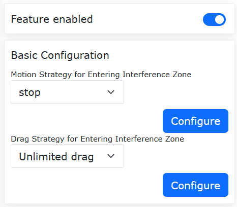

.. centered:: Figure 7.6‑2 Interference area drag configuration

To select Shaft interference, you need to configure the parameters of Shaft interference. The detection method is divided into two types: "command position" and "feedback position". The interference area mode is divided into two types: "interference within the range" and "interference outside the range". Next Set the range of each joint and whether each joint range is enabled, you can enter the value, or you can record the current position of the robot through the "Robot Teaching" button, and finally click Apply.

.. image:: safety/027.png
   :width: 3in
   :align: center

.. centered:: Figure 7.6‑3 Shaft interference configuration

To choose cube interference, you need to configure the parameters of cube interference. The detection method is divided into two types: "command position" and "feedback position". The interference area mode is divided into "interference within range" and "interference outside range". The system is divided into "base coordinates" and "workpiece coordinates", which can be selected and set according to actual use. Next, set the range setting. The range setting is divided into two methods. First, look at the first method "two-point method", which is composed of two diagonal vertices of the cube. We can record the position through input or robot teaching. Finally click Apply.

.. image:: safety/028.png
   :width: 3in
   :align: center

.. centered:: Figure 7.6‑4 Cube Interferometric Configuration

Next, look at the second method "center point + side length", that is, the center point of the cube and the side length of the cube form an interference area, and we can record the position through input or robot teaching. Finally click Apply.

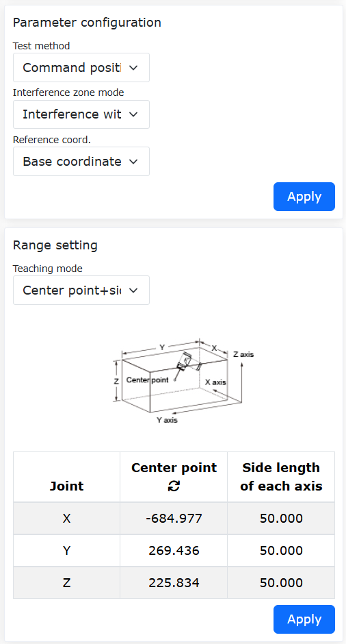

.. centered:: Figure 7.6‑5 Cube Interferometric Configuration

Safety Callback Function for Force Sensor-Assisted Dragging into Shaft interference Zone
~~~~~~~~~~~~~~~~~~~~~~~~~~~~~~~~~~~~~~~~~~~~~~~~~~~~~~~~~~~~~~~~~~~~~~~~~~~~~~~~~~~~~~~~~~~~~~~~~~~~~~~~~~

Overview
+++++++++++++++++++++++++

The safety callback function for force sensor-assisted dragging into Shaft interference zones automatically switches the robot to dragging mode with impedance callback effect when entering an interference zone during force sensor-assisted dragging, and reverts to force sensor-assisted dragging when exiting. This satisfies various user scenarios during force sensor-assisted operations.

Operation Procedure
++++++++++++++++++++++++

Joint Limit Ring
********************************

**Step1**: Log into the web interface, toggle the "Joint Limit Ring" switch, and the joint limit rings will appear on robot joints as shown below.

.. image:: safety/030.png
   :width: 4in
   :align: center

.. centered:: Figure 7.6‑6 Joint Limit Ring on Web Interface

**Step2**: The white marker on the ring indicates actual joint angle; the gap represents soft limit positions (gap size varies with limit settings); rings remain stationary relative to joints during motion.

Shaft interference Configuration
********************************

**Step1**: Configure and activate Shaft interference. Navigate to: "Initial" → "Safety" → "Interference Zone" → "Single", select "Shaft interference" and toggle "Enable".

**Step2**: Set "Motion Strategy" to "Continue Motion", select "Dragging Strategy" as "Impedance Callback" and configure parameters (e.g., recommended value "5" for callback force intensity).

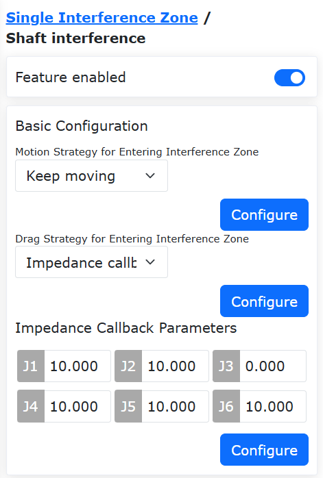

.. centered:: Figure 7.6‑7 Shaft interference Configuration

**Step3**: Set interference ranges. Choose "Feedback Position" detection mode, select "Inside Range" or "Outside Range" interference mode, then enable ranges for each axis.

.. image:: safety/032.png
   :width: 4in
   :align: center

.. centered:: Figure 7.6‑8 Interference Range Configuration

**Step4**: In "Inside Range" mode, green indicates free movement zones and yellow shows interference zones on the web interface.

.. image:: safety/033.png
   :width: 4in
   :align: center

.. centered:: Figure 7.6‑9 Limit Ring Display (Inside Range)

**Step5**: In "Outside Range" mode, the color scheme reverses while maintaining the same display logic.

.. image:: safety/034.png
   :width: 4in
   :align: center

.. centered:: Figure 7.6‑10 Limit Ring Display (Outside Range)

Entering Shaft interference Zone with Force Sensor Assistance
++++++++++++++++++++++++++++++++++++++++++++++++++++++++++++++++++++

**Step1**: Enable force sensor assistance at: "Auxiliary Applications"→"Tool App"→"Drag Lock", then activate interference zone options.

.. image:: safety/035.png
   :width: 4in
   :align: center

.. centered:: Figure 7.6‑11 Force Sensor Drag Configuration

**Step2**: During force-assisted dragging, the system automatically switches to current-loop dragging with impedance callback when entering interference zones, then reverts upon exit.

Cuboid Interference Configuration
++++++++++++++++++++++++++++++++++

**Step1**: Configure cuboid interference at: "Initial" → "Safety" → "Interference Zone" → "Single". Click on the "Cube Interference" card to enter the interface, and turn on the "Feature Enabled" slider.

**Step2**: Set "Motion Strategy" to "Continue Motion" and "Dragging Strategy" to "Unrestricted Dragging".

.. image:: safety/036.png
   :width: 4in
   :align: center

.. centered:: Figure 7.6‑12 Cuboid Interference Settings

**Step3**: Configure parameters including "Base Coordinate" reference and "Two-Point" or "Center+Edge Length" teaching methods.

**Step4**: Virtual cuboids appear on the web interface (40% opacity yellow/green for normal state, 90% when triggered).

.. image:: safety/037.png
   :width: 4in
   :align: center

.. centered:: Figure 7.6‑13 Two-Point Teaching Method

.. image:: safety/038.png
   :width: 4in
   :align: center

.. centered:: Figure 7.6‑14 Web interface virtual wall display

**Step5**：The teaching method for selecting the interference zone of the cube is "center point + side length." Teach the robot a point, set the side lengths along the X, Y, and Z axes with the taught point as the center, as shown in the figure below. After clicking "Apply," a virtual cube will appear on the web interface.

.. image:: safety/039.png
   :width: 4in
   :align: center

.. centered:: Figure 7.6‑15 "Center point + side length" to set cube interference zone

**Step6**：Set the "interference zone mode" to "interference within range." When the robot end is outside the cubic range, the virtual cube on the web interface appears as yellow with 40% transparency. When the robot end is within the cubic range, the cube turns yellow with 90% transparency, and an "Entering interference zone" warning appears, as shown in the figure below.

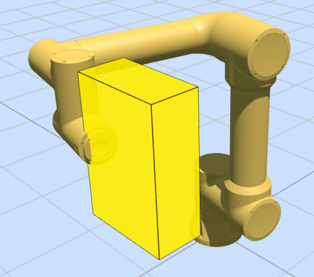

.. centered:: Figure 7.6‑16 "In-range interference" mode when entering the cubic interference zone

**Step7**：Set the "Interference Zone Mode" to "Interference Outside the Range". When the robot end is within the cube range, the virtual cube on the web interface is displayed as 40% transparency green. When the robot end is outside the cube range, the cube appears as 90% transparency green, and an "Entering Interference Zone" warning is displayed, as shown in the figure below.

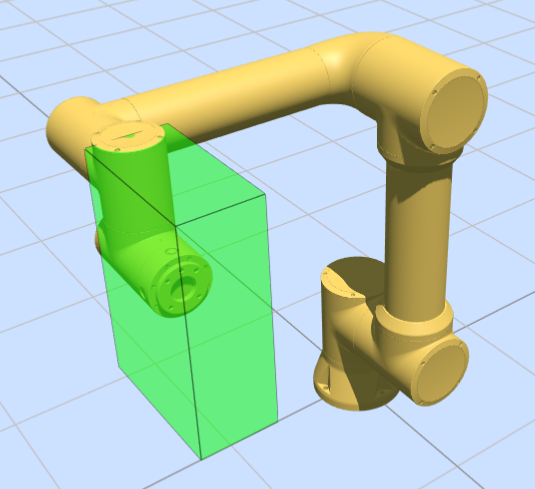

.. centered:: Figure 7.6‑17 "Out-of-Range Interference" mode cube interference zone display

Safety plane
++++++++++++++++++++++++++++++++++++++++++
**Step1**: Configure up to 8 safety walls at: "Initial"→"Safety"→"Safety plane". Enabled walls appear as 40% orange translucent objects.

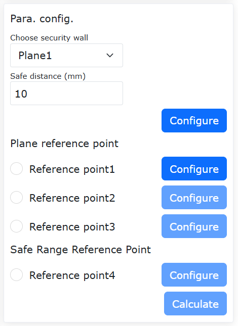

.. centered:: Figure 7.6‑18 Safety Wall Setup

.. image:: safety/043.png
   :width: 4in
   :align: center

.. centered:: Figure 7.6‑19 Web interface virtual wall display

**Step2**: Walls turn 90% opaque orange with warnings when breached.

.. image:: safety/044.png
   :width: 4in
   :align: center

.. centered:: Figure 7.6‑20 Triggered Safety Wall

Reduction Mode
-----------------------

Click on the "Initial" -> "Safety" in the menu bar, then select the "Reduction Mode" submenu to enter the configuration interface, and choose the "Level 1/2 reduction Mode" to configure joint speed and end TCP speed.

.. image:: safety/045.png
   :width: 4in
   :align: center

.. centered:: Figure 7.7-1 Reduction Mode

Safety plane
---------------------------------

Click "Initial" -> "Safety" in the menu bar, and then click the "Safety plane" submenu to enter the configuration interface.

-  **Safety Plane Configuration**:Click the enable button to enable the corresponding security plane. When the security plane is not configured with a security range, an error will be prompted. Click the drop-down box, select the security plane you want to set, and automatically bring out the security distance (you can not set it, the default value is 0), and then click the "Setting" button to set it successfully.
  
.. image:: safety/008.png
   :width: 4in
   :align: center

.. centered:: Figure 7.8-1 Safety Plane Configuration

-  **SSafety Plane Reference Point Configuration**:After selecting a security plane, four reference points can be set. The first three points are plane reference points, which are used to confirm the plane of the safety wall set. The fourth point is the safety range reference point, which is used to confirm the safety range of the set safety wall.

.. important::
   If the reference point is set successfully, the green light will be on. Otherwise, the yellow light is on. It turns green until the reference point is set successfully. When the four reference points are all set successfully, the safety range can be calculated, and the safety range parameter point status will return to the default after the calculation is successful.

.. image:: safety/009.png
   :width: 4in
   :align: center

.. centered:: Figure 7.8-2 Safe range reference point setting

-  Apply effects: The successfully configured security plane is enabled. Drag the robot, if the TCP at the end of the robot is within the set safety range, the system is normal. If it is outside the set safety range, an error will be prompted.

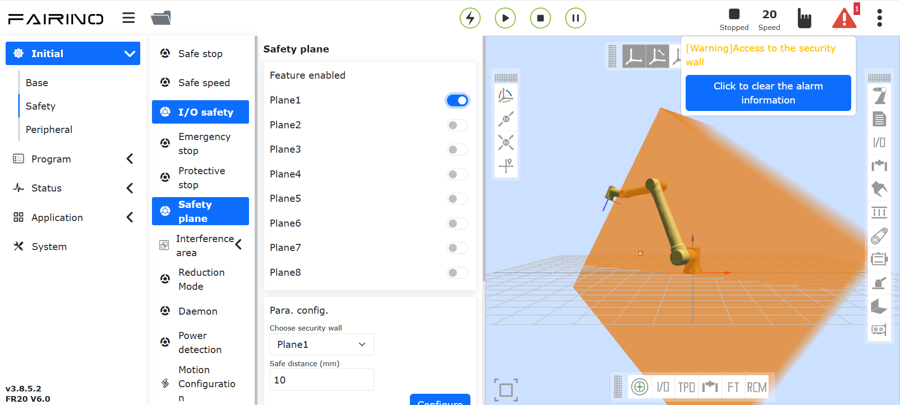

.. centered:: Figure 7.8-3 The effect picture after the security range is set successfully

Daemon
---------------------------------

Click "Initial" -> "Safety" in the menu bar, and then click the "Daemon" submenu to enter the configuration interface.

The user clicks the "function enabled" button to open or close the setting of the daemon. Select "Unexpected Situation" and "Background Program", and click the "Settings" button to configure the parameters of the unexpected situation handling logic.

Enable the security background program and set the unexpected scene and background program. When the user starts to run the program and the unexpected situation matches the set unexpected situation, the robot will execute the corresponding background program to play a role of security protection.

.. image:: safety/011.png
   :width: 4in
   :align: center

.. centered:: Figure 7.9-1 Daemon

Direction limit (Only used in Linux systems)
---------------------------------------------

Click "Initial" -> "Safety" in the menu bar, and then click the "Direction limit" submenu to enter the configuration interface.

Tool direction limit is a protective function that acts on the Cartesian space of the robot tool end to limit the range of motion of the robot end posture, including function enablement settings, reference tool direction settings, and maximum offset angle settings. The maximum offset angle defines the maximum angle limit between the Z axis of the Cartesian coordinate system of the tool end and the reference tool direction, which can usually be understood as a conical space.

.. image:: safety/012.png
   :width: 4in
   :align: center

.. centered:: Figure 7.10-1 Direction limit

Robot limit (Only used in Linux systems)
---------------------------------------------

Click "Initial" -> "Safety" in the menu bar, and then click the "Robot limit" submenu to enter the configuration interface.

Robot limits include momentum and power, where the momentum limit is used to limit the robot's maximum momentum, and the power limit is used to limit the mechanical work done by the robot.

.. image:: safety/013.png
   :width: 4in
   :align: center

.. centered:: Figure 7.13-1 Robot limit

Power detection (Only used in QX systems)
---------------------------------------------

Click "Initial" -> "Safety" in the menu bar, and then click the "Power detection" submenu to enter the configuration interface.

When acting directly on the current loop of the robot (only with the command servoJT), it is used to limit the work done by the robot. When it is detected that the integral of the robot speed and torque exceeds the limit, power protection is performed.

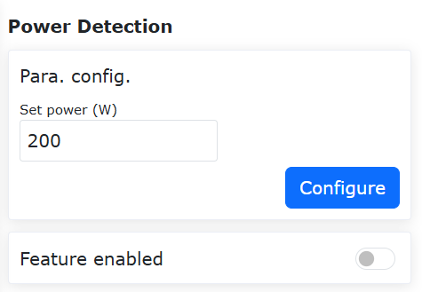

.. centered:: Figure 7.12-1 Power detection

Motion Configuration
---------------------------------------------

T-Shaped Velocity Optimization + Blending Smoothing Function
~~~~~~~~~~~~~~~~~~~~~~~~~~~~~~~~~~~~~~~~~~~~~~~~~~~~~~~~~~~~~~~~~~~~~~~

Overview
++++++++++++++++++++++

Performing blending between two trajectory segments can avoid frequent start-stop issues caused by complete stops, thereby improving the robot's motion efficiency.

This function mainly applies to blending between PTP-PTP, LIN-LIN, ARC-ARC, LIN-ARC, and ARC-LIN commands. Blending between other commands is not effective.

Operation Process
++++++++++++++++++++++

Since the operation methods for each command are similar, this manual uses PTP-PTP blending as an example to explain the operation method. This function can be implemented in two ways: using Lua commands or using the motion configuration switch.

Using Lua Commands
*****************************

**Step 1**: Select the teaching points for the PTP function. This manual uses "A0" to "A5" as the names of the teaching points.

**Step 2**: Click "Teaching Program" -> "Program Programming," select the "Point-to-Point" command under "Motion Commands," choose the teaching point in the "Command Edit" section, set the debugging speed, select "Acceleration Smoothing Mode" for motion protection, and set the "Smooth Transition" parameter at the points where smoothing is required.

.. image:: safety/020.png
   :width: 6in
   :align: center

.. centered:: Figure 7.13-1 Blending Command Settings for Acceleration Smoothing PTP

**Step 3**: Generate and run the Lua program to implement PTP-PTP blending. This method only applies the optimized T-shaped velocity to commands between `AccSmoothStart()` and `AccSmoothEnd()`, while using the original T-shaped velocity for other commands.

.. image:: safety/021.png
   :width: 4in
   :align: center

.. centered:: Figure 7.13-2 Typical Program for PTP-PTP Blending Using Lua Commands

Using Motion Configuration Switch
***********************************

**Step 1**: Click "Initial" -> "Safety" -> "Motion Configuration," and turn on the "Acceleration Smoothing Mode" switch.

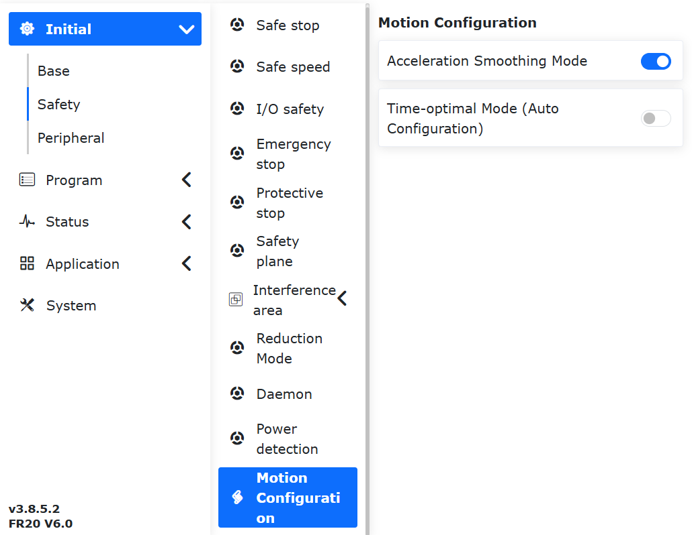

.. centered:: Figure 7.13-3 Acceleration Smoothing Mode Configuration Switch Settings

**Step 2**: Select the teaching points for the PTP-PTP function. This manual uses "A0" to "A5" as the names of the teaching points.

**Step 3**: Click "Teaching Program" -> "Coding," select the "Point-to-Point" command under "Motion Commands," choose the teaching point in the "Command Edit" section, set the debugging speed, select "None" for motion protection, and set the "Smooth Transition" parameter at the points where smoothing is required.

.. image:: safety/023.png
   :width: 6in
   :align: center

.. centered:: Figure 7.13-4 Blending Command Settings for Regular PTP

**Step 4**: Generate and run the Lua program to implement PTP-PTP blending. The typical program is the same as a regular PTP program. This method applies the optimized T-shaped velocity to all commands.

.. image:: safety/024.png
   :width: 4in
   :align: center

.. centered:: Figure 7.13-5 Typical Program for PTP-PTP Blending Using Configuration Switch

FIR Adaptive Parameter Function + FIR Pause/Resume Function
~~~~~~~~~~~~~~~~~~~~~~~~~~~~~~~~~~~~~~~~~~~~~~~~~~~~~~~~~~~~~~~~~~~~~~~~~~~~~~~

Overview
++++++++++++++++++++++

The robot's time-optimal mode parameter adaptive configuration function eliminates the need to manually debug and configure parameters. This function adaptively configures the parameters of the time-optimal mode based on the robot's current operating state, improving debugging efficiency.

Operation Process
++++++++++++++++++++++

The usage of basic robot motion commands (PTP, LIN, and ARC) is similar. This example uses the time-optimal mode PTP motion command as the primary example.

**Step 1**: On the robot's web control interface, navigate to "Initial" -> "Safety" -> "Motion Configuration" to enter the "Motion Configuration" interface.

.. image:: safety/015.png
   :width: 6in
   :align: center

.. centered:: Figure 7.13-6 Motion Configuration Interface

**Step 2**: In the "Motion Configuration" interface, click the "Time-Optimal Mode" switch to enter the "Time-Optimal Mode" interface.

.. image:: safety/016.png
   :width: 3in
   :align: center

.. centered:: Figure 7.13-7 Time-Optimal Mode Interface

.. note:: In the "Parameter Configuration" section of the "Time-Optimal Mode" interface, the "Adjustment Coefficient" can be set from -100 to 100, representing a scaling ratio to control the time-optimal degree of motion commands. The default value is 1.

**Step 3**: Determine the teaching points for the PTP motion. This example uses "A0" to "A5" as the names of the teaching points.

**Step 4**: On the robot's web control interface, navigate to "Teaching Program" -> "Program Programming" to enter the "Motion Commands" interface.

.. image:: safety/017.png
   :width: 2in
   :align: center

.. centered:: Figure 7.13-8 Motion Commands Interface

**Step 5**: In the "Motion Commands" interface, click "Point-to-Point" to enter the "PTP" command editing interface. Select the teaching point from the "Point Name" dropdown, set the desired speed ratio in the "Debugging Speed" section, choose "Stop" in the "At This Point" section, select "No" in the "Offset" dropdown, and choose "None" in the "Motion Protection" section. Then, click "Add."

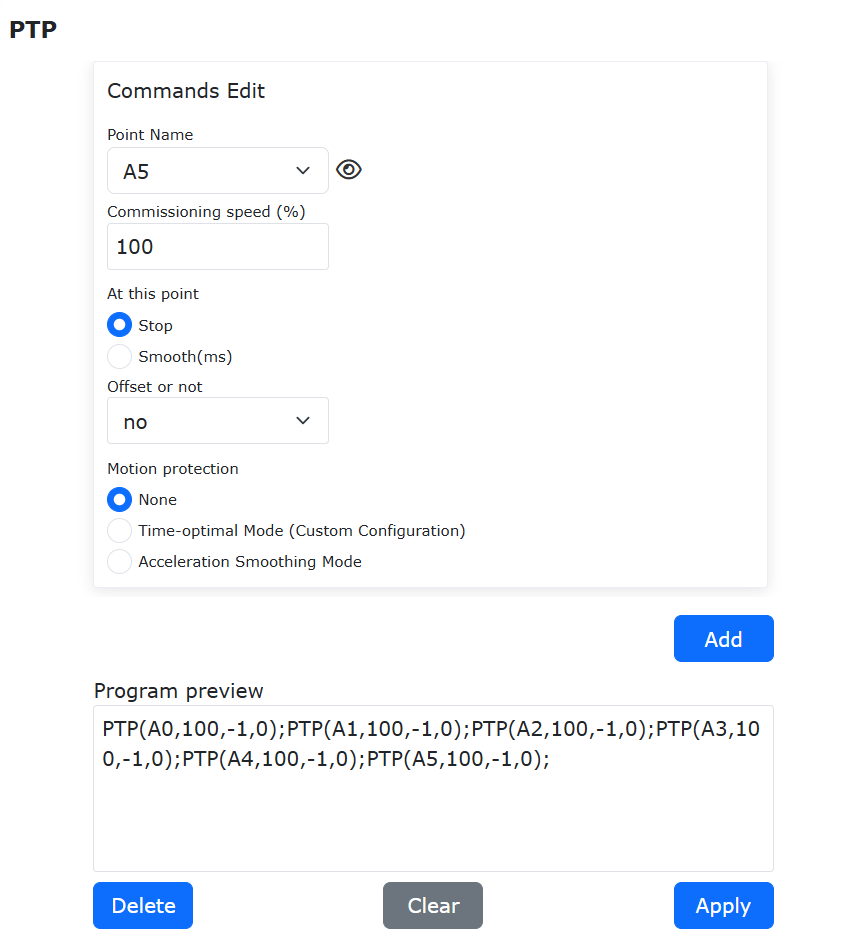

.. centered:: Figure 7.13-9 PTP Motion Command Editing Interface

**Step 6**: In the "PTP" motion command editing interface, click "Apply" to automatically generate the corresponding Lua program.

.. image:: safety/019.png
   :width: 4in
   :align: center

.. centered:: Figure 7.13-10 Typical Time-Optimal Mode PTP Motion Lua Program

.. note:: 
   The typical time-optimal mode PTP motion Lua program is the same as a regular PTP motion Lua program, except that the "Time-Optimal Mode" function is enabled in Step 2.

   When the "Time-Optimal Mode" function switch is enabled, all basic robot motion commands (PTP, LIN, and ARC) operate in time-optimal mode. Disabling the switch restores the commands to their basic state.
   The "Acceleration Smoothing Mode" function switch cannot be enabled simultaneously in this interface.