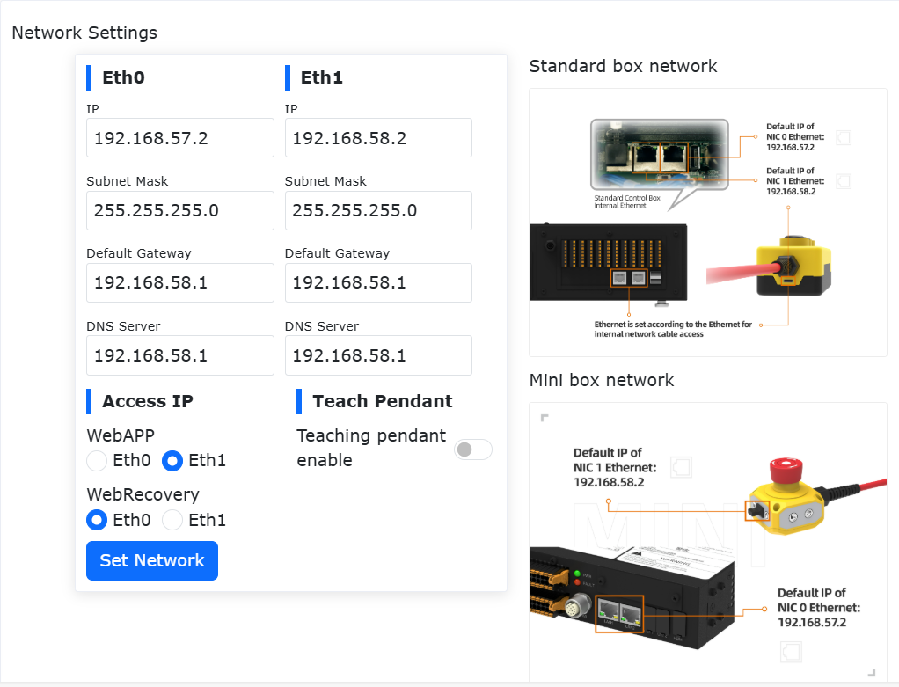
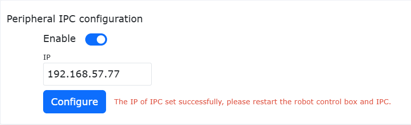
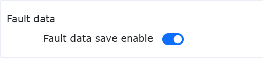
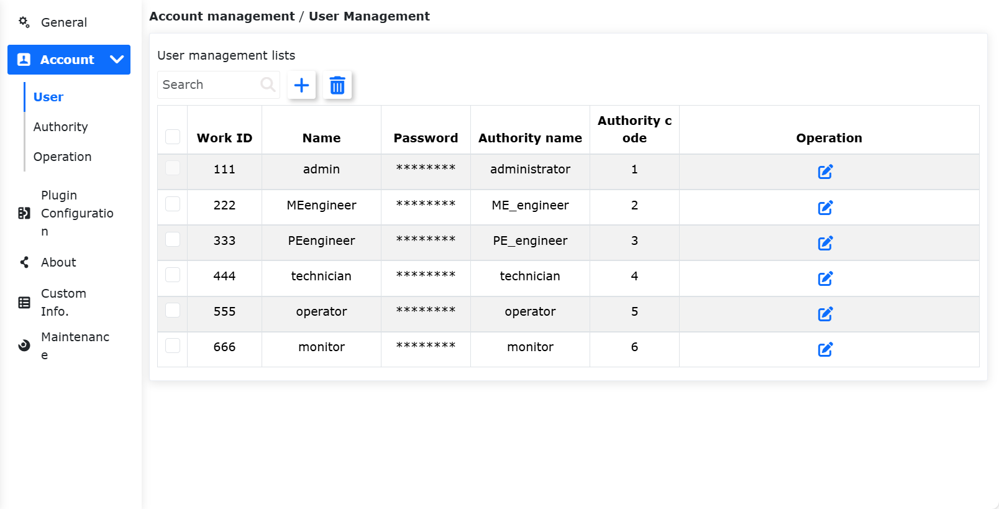
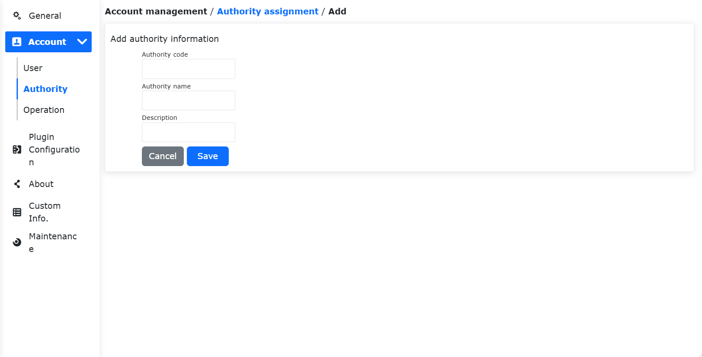
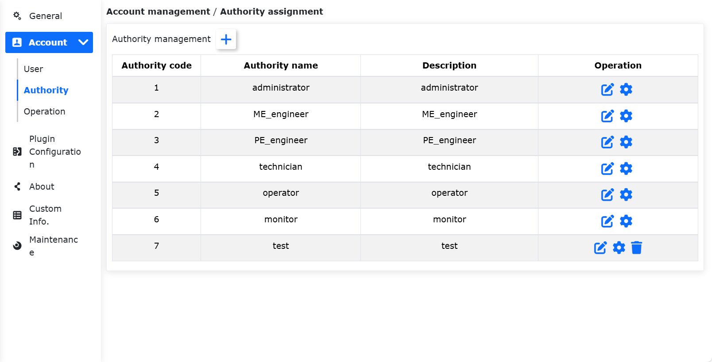
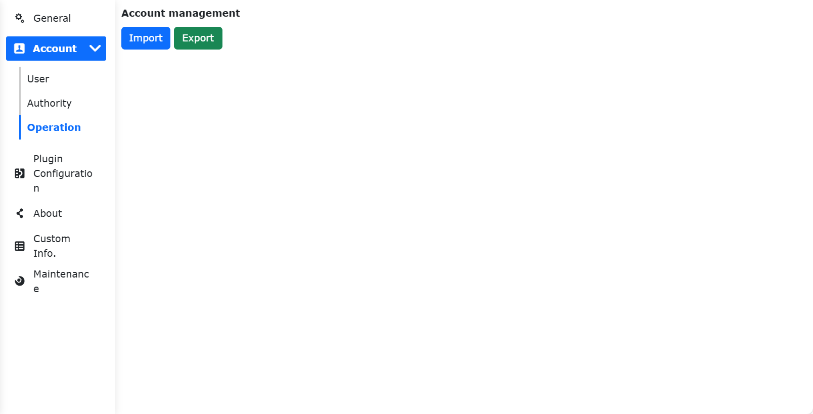
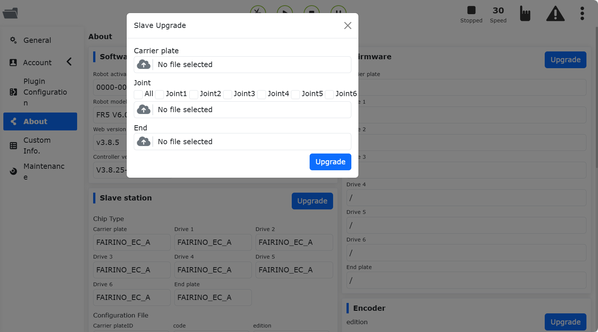
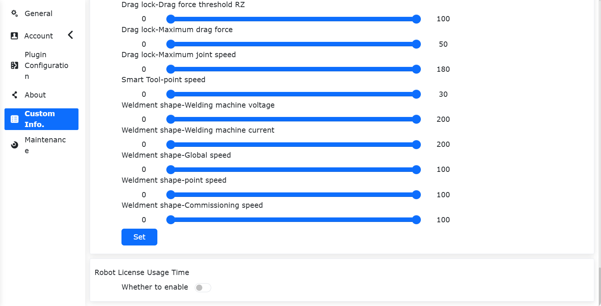
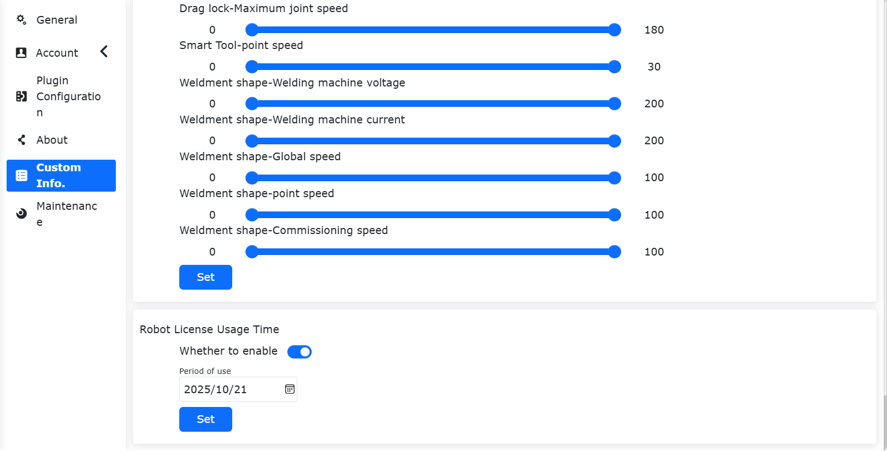

System
===============

.. toctree:: 
   :maxdepth: 6

General settings
-------------------

Click "System Settings" on the left menu bar, and then click "General Settings" on the secondary menu bar to enter the general settings interface. General settings can update the robot system time according to the current computer time so that the time of the log content can be recorded accurately.

.. image:: system/028.png
   :width: 4in
   :align: center

.. centered:: Figure 15.1‑1 Time Settings

Network settings can set the controller IP, subnet mask, default gateway, DNS server and teach pendant IP (this IP is valid when using our FR-HMI teach pendant, and the teach pendant enable status needs to be configured to enable when using the FR-HMI teach pendant), which is convenient for customers to use the scene.

Network settings
~~~~~~~~~~~~~~~~~~~~~~~~

.. centered:: Figure 15.1‑2 Network settings diagram

- **Set network card**: Enter the network card IP, subnet mask (linked with IP, automatically filled in), default gateway, and DNS server that need to communicate. The factory default IP of network card 0 network port is: 192.168.57.2, and the factory default IP of network card 1 network port is: 192.168.58.2.

- **Teach pendant enable**: Control whether to enable the teach pendant. The teach pendant is turned off by default, and the device cannot be operated using the teach pendant. Click the slide switch button to enable the teach pendant to operate the device.

- **Access IP**: Select the network card associated with WebAPP and WebRecovery. When the teach pendant is enabled, WebAPP selects network card 1 by default, and network card 0 is not selectable.

- **Set up network**: Click the "Set up network" button, and it will prompt that the configuration is in progress. After the configuration is complete, you need to restart the device.

Teach pendant touch screen calibration
~~~~~~~~~~~~~~~~~~~~~~~~~~~~~~~~~~~~~~~~~~~~~~~~

After enabling the teach pendant, you can calibrate the teach pendant.

.. image:: system/029.png
   :width: 4in
   :align: center

.. centered:: Figure 15.1‑3 Teach pendant touch screen calibration

Peripheral industrial computer configuration
~~~~~~~~~~~~~~~~~~~~~~~~~~~~~~~~~~~~~~~~~~~~~~~~~~~

To enable the peripheral industrial computer, you need to enter the IP address. After successful configuration, you need to restart the control box and industrial computer.

.. centered:: Figure 15.1‑4 Peripheral IPC Configuration

System Language
~~~~~~~~~~~~~~~~~~

Language Import
++++++++++++++++

Select a language pack to import (Note: the import file format is [language code].json). If the import is successful and the language pack is not an existing language in the system, a new imported language pack data will be added to the system language.

.. image:: system/031.png
   :width: 4in
   :align: center

.. centered:: Figure 15.1‑5 System language interface

Language Export
+++++++++++++++++
Select the system language, taking English as an example, click the "Export" button, and the exported download file will pop up on the page.

.. image:: system/035.png
   :width: 6in
   :align: center

.. centered:: Figure 15.1‑6 Export system language
   
Language Application
++++++++++++++++++++++

Select the system language and click the "Apply" button to switch the system language. After the language is applied successfully, the system will automatically log out to the login page, and the system language will be switched to the current language. Take English as an example:

.. image:: system/036.png
   :width: 6in
   :align: center

.. centered:: Figure 15.1‑7 Language system successful interface

System safe mode recovery
++++++++++++++++++++++++++++++

When the system needs to upgrade or downgrade the version, or the system language pack import fails and the system cannot be entered normally, you need to enter the "System Security Mode Recovery" interface. The specific operations are as follows:
1. Enter the System Settings -> General Settings -> Network Settings interface, adjust the WebRecovery access IP to the network card 0 position, and click "Set Network".

.. image:: system/037.png
   :width: 6in
   :align: center

.. centered:: Figure 15.1‑8 WebRecovery set up the network card interface

2. After the network settings are successful, restart the control box, switch the IP address to 192.168.57.xxx, and connect the network cable to the control box network card 0.
3. Log in to the URL "192.168.57.2:8050" and enter the "System Security Mode Recovery" interface.

.. image:: system/038.png
   :width: 3in
   :align: center

.. centered:: Figure 15.1‑9 System security mode recovery interface

- Software upgrade package import: system software package upgrade or downgrade;
- Restore factory language: clear the imported application language package data, restore the factory language package data, and set the default language to English;
  
Fault data
~~~~~~~~~~~~

Click the "Fault Data Save Enable" button to generate a fault data file when the controller fails, saving data 15 seconds before and after the fault.

After saving, you can select all data sources to export in the system settings, and unzip error_data.tar.gz to view the fault data file.

.. centered:: Figure 15.1‑10 Fault data

Timeout Logout Time Setting
~~~~~~~~~~~~~~~~~~~~~~~~~~~~~~~~

Users can set the timeout logout time. If the time is met, the robot will automatically log out. The unit is min.

.. image:: system/033.png
   :width: 3in
   :align: center

.. centered:: Figure 15.1‑11 Timeout Logout Time Setting

System Settings
~~~~~~~~~~~~~~~~~

Restoring to factory settings under system recovery can clear user data and restore the robot to factory configuration.

The slave log generation and controller log export functions are to download some important status or error record files of the controller, which is convenient for troubleshooting robot problems.

.. image:: system/034.png
   :width: 4in
   :align: center

.. centered:: Figure 15.1‑12 System Settings

Account settings account settings
--------------------------------------

Click Account Settings on the secondary menu bar to enter the Account Settings interface. Account management functions are only available to administrators. The function is divided into the following three modules:

User Management
~~~~~~~~~~~~~~~~~~~~~~~

User management page, used to save user information, you can add user ID, function, etc. The user can log in by entering the existing user name and password in the user list.

.. centered:: Figure 15.2-1 User Management

-  **Add users**:Click the "Add" button, enter the job number, name, password and select the function. 
  
.. important::
   The job number can be up to 10-digit integer, and the job number and password are uniquely checked, and the password is displayed in Braille. After the user is added successfully, you can enter the name and password to log in again.

.. image:: system/003.png
   :width: 6in
   :align: center

.. centered:: Figure 15.2-2 Add users
  
-  **Edit users**:When there is a user list, click the "Edit" button on the right, the job number and name cannot be modified, but the password and function can be modified, and the password also needs to be uniquely verified.
  
.. image:: system/004.png
   :width: 6in
   :align: center

.. centered:: Figure 15.2-3 Edit users

-  **Delete users**:The deletion methods are divided into single deletion and batch deletion. 
 
   1. Click the single "Delete" button on the right side of the list, and it will prompt "Please click the delete button again to confirm deletion", and click the list again to delete successfully. 
   
   2. Click the check box on the left, select the users to be deleted, and then click the batch "Delete" button at the top of the list twice to delete. 
   
.. important::
   The initial user 111 and the current login user cannot be deleted.

.. centered:: Figure 15.2-4 Delete users

Authority management
~~~~~~~~~~~~~~~~~~~~~~~

.. important:: 
   The default function data (function code 1-6) cannot be deleted, and the function code cannot be modified, but the function name and function description can be modified and the authority of the function can be set.

.. image:: system/006.png
   :width: 6in
   :align: center

.. centered:: Figure 15.2-5 Authority management

There are six functions by default, administrators have no function restrictions, operators and monitors can use a small number of functions, ME engineers, PE&PQE engineers and technicians & team leaders have some function restrictions, administrators have no function restrictions, the specific default permissions are shown in the following table:

.. important:: 
   Default permissions can be modified

.. centered:: Table 15.2-1 Permission details

.. image:: system/007.png
   :width: 6in
   :align: center

-  **Add function**: Click the "Add" button, enter the function code, function name and function description, click the "Save" button, and return to the list page after success. Among them, the function code can only be an integer greater than 0 and cannot be the same as the existing function code, and all input items are required.

.. centered:: Figure 15.2-6 Add function

-  **Edit function name and description**: Click the "Edit" icon in the table operation bar to modify the function name and function description of the current function. After the modification is completed, click the "Save" button below to confirm the modification.

.. image:: system/009.png
   :width: 6in
   :align: center

.. centered:: Figure 15.2-7 Edit function name and description

-  **Set function permissions**: Click the "Settings" icon in the table operation bar to set the permissions of the current function. After setting, click the "Save" button below to confirm the settings.

.. image:: system/010.png
   :width: 6in
   :align: center

.. image:: system/011.png
   :width: 6in
   :align: center

.. centered:: Figure 15.2-8 Set function permissions

-  **Delete function**: Click the "Delete" icon in the table operation bar, firstly, it will check whether the current function is used by a user, if no user uses it, the current function can be deleted, otherwise it cannot be deleted.

.. centered:: Figure 15.2-9 Delete function

Import/Export
~~~~~~~~~~~~~~~~~~~~~~~

.. centered:: Figure 15.2-10 Account settings import/export

-  **Import**: Click the "Import" button to import user management and rights management data in batches.

-  **Export**: Click the "Export" button to export the data of user management and rights management in batches.

About
------------

Click About on the secondary menu bar to enter the About interface. This page shows the model and serial number of the robot, the web version and control box version used by the robot, hardware version and firmware version.

.. image:: system/014.png
   :width: 6in
   :align: center

.. centered:: Figure 15.3-1 About Schematics

Software Upgrade
~~~~~~~~~~~~~~~~~~~~~~~~~

Operation Preparation
+++++++++++++++++++++++++++++++

1. Before upgrading, check and confirm the current software version in "System Settings - About".
2. Software upgrade package: Download from the corresponding version's FARRDOC "Resources Download - Robot Software Download". After extraction, it contains the software upgrade package "software.tar.gz" for the corresponding version.

Important Notes
+++++++++++++++++++++++++++++++

1. **Data Backup**: It is recommended to perform a backup before upgrading (refer to section 3.2.1) to avoid data loss due to upgrade anomalies.
2. **Version Restrictions**:

.. centered:: Table 15.3-1 Version Upgrade Restrictions

.. list-table::
   :widths: 50 50
   :header-rows: 0
   :align: center

   * - **Current Version**
     - **Maximum Upgradeable Version**

   * - < v3.6.1
     - v3.6.1

   * - v3.6.1 - v3.6.4
     - v3.6.5

   * - v3.6.5 - v3.6.8
     - v3.6.9

   * - v3.6.9 - v3.7.4
     - v3.7.5

   * - v3.7.5
     - v3.7.6

   * - ≥ v3.7.6
     - No restrictions

3. **Cache Clearance**: After each upgrade (especially for cross-version upgrades), it is recommended to clear the browser cache to ensure normal system operation.

Operation Steps
*****************************

**Software Upgrade**:

1. Under the "System Settings" -> "About" menu, click the "Upgrade" button to enter the software upgrade interface;

.. image:: system/040.png
   :width: 6in
   :align: center

.. centered:: Figure 15.3-2 System Upgrade Interface

2. Click "Choose File" and select the software package "software.tar.gz" downloaded from the official website;

.. important::
   The software upgrade package name must be exactly "software.tar.gz". If the upgrade package name differs, the upgrade will fail. Rename it to the correct package name.

3. Click "Upload Upgrade Package" to start the upgrade. The progress bar will be displayed during the upgrade process;

4. When the upgrade progress reaches 100%, the interface will prompt "Upgrade successful, please restart the control box";

.. image:: system/041.png
   :width: 4in
   :align: center

.. centered:: Figure 15.3-3 Software Upgrade Successful

5. After restarting the control box, the upgrade is complete. Confirm the version information in "About".

**Firmware Upgrade**: After the robot enters BOOT mode, upload the upgrade compressed package, select the required slave stations (control box slave station, body drive slave stations 1~6, end effector slave station) to perform the upgrade operation, and display the upgrade status.

.. image:: system/042.png
   :width: 6in
   :align: center

.. centered:: Figure 15.3-4 Firmware Upgrade

**Slave Station Configuration File Upgrade**: After the robot is disabled, upload the upgrade file, select the required slave stations (control box slave station, body drive slave stations 1~6, end effector slave station) to perform the upgrade operation, and display the upgrade status.

.. centered:: Figure 15.3-5 Slave Station Configuration File Upgrade

**Encoder Upgrade**: After the robot is disabled, upload the upgrade file, select the required joints (Joint1~Joint6) to upgrade, and configure the encoder mode.

.. image:: system/044.png
   :width: 6in
   :align: center

.. centered:: Figure 15.3-6 Encoder Upgrade

Custom information
------------------------

Click the custom information of the secondary menu bar to enter the custom information interface. Custom information functions can only be used by administrators.
This page can upload user information packages, robot models, and setting teaching program encryption status.

.. image:: system/015.png
   :width: 6in
   :align: center

.. centered:: Figure 15.4-1 Custom information schematic diagram

Robot Model
~~~~~~~~~~~~~~~

.. important::
   1. The robot model configured here is a custom robot model name, which is inconsistent with the robot model function configured in "System" -> "Maintenance" -> "Controller Compatible";
   2. It is not recommended to use names starting with "FR" and "ART". If you enter a custom robot model starting with "FR" and "ART", the model name you enter must be consistent with the "Model Abbreviation" in the robot model catalog table (for details of the robot model catalog table, see the "Robot Model Configuration" section).

Parameter range configuration
~~~~~~~~~~~~~~~~~~~~~~~~~~~~~~~~~~

Parameter range configuration, only the administrator can adjust the parameter range, and the parameters of other authorized members can only be set within the parameter range set by the administrator.

There are two ways to set parameters: slider dragging and manual input. 

.. important:: 
   The maximum value of the parameter range must be greater than the minimum value. 3 seconds after the parameter range is successfully configured, it will automatically jump to the login page, and you need to log in again.

.. image:: system/016.png
   :width: 6in
   :align: center

.. image:: system/022.png
   :width: 6in
   :align: center

.. centered:: Figure 15.4-2 Schematic diagram of parameter range configuration

Robot License Usage Time
~~~~~~~~~~~~~~~~~~~~~~~~~~~~~~~~~~~~~~~

1. License Usage Time settings

Check the web interface lock screen settings in "Custom" and set whether this function is turned on. When choosing to turn on this function, select the usage period. If not selected, it will prompt "The usage period cannot be empty".

.. note:: If the Robot License Usage Time is turned on, secondary settings cannot be made, and the system time cannot be updated.) After selecting the usage period, click the "Configure" button.

After selecting the usage period, click the "Configure" button.

.. centered:: Figure 15.4-3 WEB interface lock screen shutdown settings

.. centered:: Figure 15.4-4 WEB interface lock screen enable settings

2. Expiration reminder

When the web interface Robot License Usage Time is turned on, the following prompt will appear after logging in to the interface:

1)5 days before the expiration of the device, if you power on and log in successfully, a pop-up window will prompt the remaining days of the use period, which can be eliminated by resetting.

.. image:: system/025.png
   :width: 6in
   :align: center

.. centered:: Figure 15.4-5 Boot prompt

2)If the device continues to work, 5 days before the device expires, a pop-up window will automatically pop up at zero o'clock to prompt the remaining days of the service life, which can be eliminated by resetting.

.. image:: system/026.png
   :width: 6in
   :align: center

.. centered:: Figure 15.4-6 Continuous work tips

3. Unlock login

When the web interface Robot License Usage Time is turned on, after the device expires, you will directly enter the lock screen interface when you log in to the webApp for the first time. When the device continues to work, it will automatically log out after obtaining the lock screen data at zero point and enter the lock screen interface. At this time, enter the unlock code to unlock and enter the login interface, enter your login information to log in.

.. note:: The integrator operates to generate an encrypted unlock code.
 
.. image:: system/027.png
   :width: 6in
   :align: center

.. centered:: Figure 15.4-7 Lock screen  

Robot model configuration
--------------------------------------

.. important:: 
   If you need to modify the robot model, please contact our technical engineers and proceed under guidance.

After logging into the collaborative robot console Web, select the corresponding model to modify in the "System Settings" -> "Maintenance Mode" -> "Controller Compatibility" configuration item. For the robot model, refer to the table below.

The robot model table is as follows:

.. list-table::
   :widths: 10 58 32
   :header-rows: 0
   :align: center

   * - **Numerical value**
     - **Model (Main model - Major - Minor)**
     - **Model Abbreviation**
     
   * - 0
     - Not configured
     - /

   * - 1
     - FR3-V1-000(V5.0)
     - FR3 V5.0

   * - 2
     - FR3-V1-001(V6.0)
     - FR3 V6.0

   * - 3
     - FR3-V1-002(V6.0 Mirror)
     - FR3 V6.0(Mirror)

   * - ...
     - Reserved
     - /

   * - 101
     - FR5-V1-000
     - FR5 V4.0

   * - 102
     - FR5-V1-001(V5.0)
     - FR5 V5.0

   * - 103
     - FR5-V1-002(V6.0)
     - FR5 V6.0
     
   * - ...
     - Reserved
     - /
   
   * - 201
     - FR10-V1-000(V5.0)
     - FR10 V5.0

   * - 202
     - FR10-V1-001(V6.0)
     - FR10 V6.0
     
   * - ...
     - Reserved
     - /
   
   * - 301
     - FR16-V1-000(V5.0)
     - FR16 V5.0

   * - 302
     - FR16-V1-001(V6.0)
     - FR16 V6.0
     
   * - ...
     - Reserved
     - /
   
   * - 401
     - FR20-V1-000(V5.0)
     - FR20 V5.0

   * - 402
     - FR20-V1-001(V6.0)
     - FR20 V6.0
     
   * - ...
     - Reserved
     - /

   * - 501
     - ART3-V1-000
     - ART3
     
   * - ...
     - Reserved
     - /

   * - 601
     - ART5-V1-000
     - ART5
     
   * - ...
     - Reserved
     - /

   * - 702
     - FRCustom(7)-V1-001(FR3-WML)
     - FR3-WML

   * - 703
     - FRCustom(7)-V1-001(FR3-WMS)
     - FR3-WMS
     
   * - ...
     - Reserved
     - /
  
   * - 802
     - FRCustom(8)-V1-001(FR5WM)
     - FR5WM
     
   * - ...
     - Reserved
     - /

   * - 901
     - FRCustom(9)-V1-001(FR3MT)
     - FR3MT

   * - 902
     - FRCustom(9)-V1-001(FR10YD)
     - FR10YD
     
   * - 904
     - FRCustom(9)-V1-001(FR3-C)
     - FR3-C

   * - 905
     - FRCustom(9)-V01-001(FR30L)
     - FR30L

   * - ...
     - Reserved
     - /

   * - 1001
     - FR30-V1-001(V6.0)
     - FR30 V6.0
     
   * - ...
     - Reserved
     - /

.. note:: 
   Among them, 10 major version numbers (1-10) are reserved, and 10 minor version numbers (1-10) are reserved.
