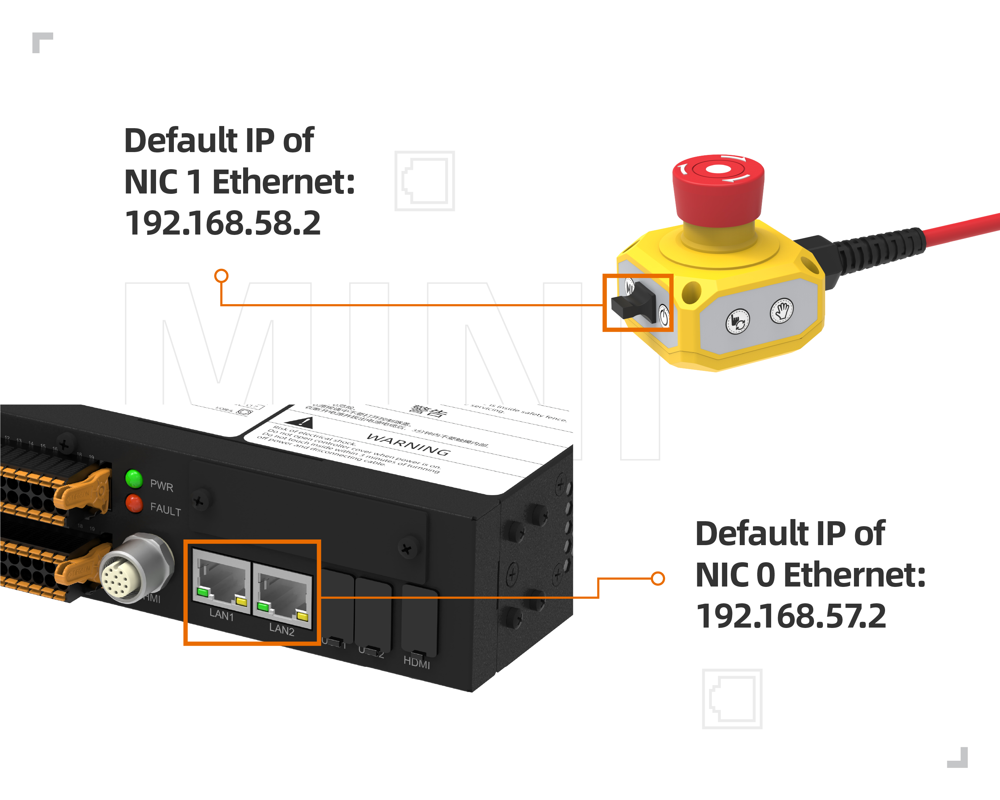

Insegnatore
===============

.. toctree:: 
   :maxdepth: 6

Abilitazione dell'Insegnatore
----------------------------------------------

1. Collegare l'insegnatore alla scatola di controllo e avviare il sistema.

2. Accedere con l'account "admin" e password "123". Nella pagina principale, cliccare su "Impostazioni di Sistema" > "Impostazioni Generali" per confermare che l'insegnatore sia in stato abilitato.

.. image:: teach_pendant/001.png
   :width: 6in
   :align: center

.. centered:: Figura 16.1-1 Stato dell'Insegnatore Abilitato

Impostazione Multilingua dell'Insegnatore
-----------------------------------------------------------------

1. Nella schermata di login (o nella schermata di attivazione iniziale), selezionare la lingua nell'angolo in alto a destra.

.. image:: teaching_pendant_software/062.png
   :width: 6in
   :align: center

.. centered:: Figura 16.2-1 Impostazione Lingua nella Schermata di Attivazione

.. image:: teaching_pendant_software/063.png
   :width: 6in
   :align: center

.. centered:: Figura 16.2-2 Impostazione Lingua nella Schermata di Login

2. Come esempio, selezionare la lingua desiderata nella schermata di login. Dopo la selezione, verrà visualizzato un messaggio corrispondente (in base alla lingua scelta) per confermare l'avvenuta impostazione. Riavviare la scatola di controllo per completare l'impostazione della lingua.

.. image:: teach_pendant/004.png
   :width: 6in
   :align: center

.. centered:: Figura 16.2-3 Impostazione Cinese

.. image:: teach_pendant/005.png
   :width: 6in
   :align: center

.. centered:: Figura 16.2-4 Impostazione Inglese

Cambio della Tastiera
~~~~~~~~~~~~~~~~~~~~~~~~~~~~~~~~~~~~~~~~~~

La tastiera predefinita è quella inglese.

1. Aprire la tastiera virtuale nell'angolo in basso a destra e cliccare sul campo di immissione, ad esempio il campo per il nome utente.

2. Cambiare la tastiera in cinese (Pinyin).

Premere due volte il tasto "CTRL", il tasto diventerà rosso. Premere il tasto "Spazio" per selezionare la tastiera desiderata. Di seguito è mostrata la tastiera cinese.

.. image:: teach_pendant/006.png
   :width: 6in
   :align: center

.. centered:: Figura 16.2-5 Tastiera Cinese (Pinyin)

3. Cambiare la tastiera in inglese.

Premere due volte il tasto "CTRL", il tasto diventerà rosso. Premere il tasto "Spazio" per selezionare la tastiera desiderata. Di seguito è mostrata la tastiera inglese.

.. image:: teach_pendant/007.png
   :width: 6in
   :align: center

.. centered:: Figura 16.2-6 Tastiera Inglese

Dopo un login riuscito, il sistema caricherà i dati del modello. Al termine del caricamento, verrà visualizzata la pagina iniziale.

Lingua dell'Insegnatore e di webApp Non Corrispondente
~~~~~~~~~~~~~~~~~~~~~~~~~~~~~~~~~~~~~~~~~~~~~~~~~~~~~~~~~~~~~~~~~~~~~~~~~~~~~~

Dopo l'abilitazione dell'insegnatore, nella schermata di login verrà verificata la corrispondenza tra la lingua dell'insegnatore e quella di webApp. Se le lingue non corrispondono, verrà visualizzato il seguente messaggio.

.. image:: teach_pendant/008.png
   :width: 6in
   :align: center

.. centered:: Figura 16.2-7 Messaggio di Discrepanza Lingua tra Insegnatore e webApp

Funzione di Reset IP del Controller e del Teach Pendant Fisico
----------------------------------------------------------------------------------

Panoramica della Funzione
~~~~~~~~~~~~~~~~~~~~~~~~~~~~~~~~~~~~~~~~~~~~

Questa ottimizzazione aggiunge operazioni di reset IP per il controller e il teach pendant fisico tramite diversi metodi, abilitando principalmente le seguenti funzioni attraverso le seguenti operazioni:

- 1. Utilizzare l'interfaccia webrecovery per resettare gli indirizzi IP della Scheda di Rete 0 e della Scheda di Rete 1 del controller;
- 2. Utilizzare la funzione personalizzata del tasto F1 del teach pendant fisico configurata per il reset IP (premere e tenere premuto per 10 secondi) per resettare gli indirizzi IP della Scheda di Rete 0 del controller, della Scheda di Rete 1 e del teach pendant fisico;
- 3. Utilizzare la combinazione dei tasti F2 e F4 del teach pendant fisico, premere e tenere premuti simultaneamente per 10 secondi, per resettare l'indirizzo IP del dispositivo teach pendant fisico quando non è loggato.

.. centered:: Figura 16.3‑1 Diagramma Porte di Rete Mini Controller Box

Reset IP tramite Interfaccia Webrecovery
~~~~~~~~~~~~~~~~~~~~~~~~~~~~~~~~~~~~~~~~~~~~~~~~~~~~~~~~~~~~~~

Accedere all'interfaccia webrecovery utilizzando la porta 8050, ad esempio, accedere con l'IP predefinito: 192.168.57.2:8050. Fare clic sul pulsante 'Reset' per "Reset IP Controller". La pagina mostrerà un pop-up di conferma secondario. Fare clic su 'Conferma' e quindi fare nuovamente clic sul pulsante Reset IP Controller per confermare il reset.

.. image:: teach_pendant/011.png
   :width: 5in
   :align: center

.. centered:: Figura 16.3‑2 Funzione Reset IP tramite Interfaccia Webrecovery

Dopo la conferma secondaria, un messaggio indicherà che è necessario un riavvio per rendere effettive le modifiche. Dopo il riavvio, l'IP della Scheda di Rete 0 del controller verrà ripristinato al valore predefinito 192.168.57.2 e l'IP della Scheda di Rete 1 verrà ripristinato al valore predefinito 192.168.58.2.

Reset IP Personalizzato tramite Tasto F1 del Teach Pendant Fisico
~~~~~~~~~~~~~~~~~~~~~~~~~~~~~~~~~~~~~~~~~~~~~~~~~~~~~~~~~~~~~~~~~~~~~~~~~~~~~

Per utilizzare la funzione personalizzata del tasto F1 del teach pendant fisico, è necessario prima accedere all'interfaccia del teach pendant per configurare le funzioni personalizzate dei tasti F. Fare clic su "Impostazioni di Sistema", fare clic su "Impostazioni Generali", selezionare il modulo Teach Pendant, attivare l'interruttore Abilita Teach Pendant, configurare il tasto F1 come Reset IP (premere e tenere premuto per 10 secondi), quindi fare clic su Configura.

.. image:: teach_pendant/013.png
   :width: 6in
   :align: center

.. centered:: Figura 16.3‑3 Reset IP Personalizzato tramite Tasto F1 del Teach Pendant Fisico

Questa funzione è effettiva solo quando il teach pendant fisico è loggato nel webapp. Dopo aver premuto e tenuto premuto il tasto F1 per 10 secondi, un messaggio indicherà che è necessario un riavvio per rendere effettive le modifiche. Dopo il riavvio, l'IP della Scheda di Rete 0 del controller verrà ripristinato al valore predefinito 192.168.57.2, l'IP della Scheda di Rete 1 verrà ripristinato al valore predefinito 192.168.58.2 e l'IP del teach pendant fisico verrà ripristinato al valore predefinito 192.168.58.77.

Reset IP tramite Combinazione Tasti F2 e F4 del Teach Pendant Fisico
~~~~~~~~~~~~~~~~~~~~~~~~~~~~~~~~~~~~~~~~~~~~~~~~~~~~~~~~~~~~~~~~~~~~~~~~~~~~~

Il dispositivo teach pendant fisico fornisce una funzione di reset IP, che può essere eseguita anche quando non è connesso al webapp. Premere e tenere premuti simultaneamente i tasti F2 e F4 per 10 secondi per resettare l'indirizzo IP del teach pendant fisico. L'IP verrà ripristinato al valore predefinito 192.168.58.77. Dopo il ripristino, è necessario accedere nuovamente al webapp. In Impostazioni di Sistema - Impostazioni Generali, impostare l'IP del teach pendant fisico su 192.168.58.77. Riavviare per ristabilire la connessione del teach pendant.

.. image:: installation/060.png
   :width: 6in
   :align: center

.. centered:: Figura 16.3‑4 Reset IP tramite Combinazione Tasti F2 e F4 del Teach Pendant Fisico

Funzione di Personalizzazione Tasti Teach Pendant
----------------------------------------------------------------------------------

Panoramica della Funzione
~~~~~~~~~~~~~~~~~~~~~~~~~~~~~~~~~~~~~~~~~~~~

Questo documento ha lo scopo di introdurre come utilizzare la funzione di personalizzazione dei tasti del teach pendant.

Istruzioni Operative
~~~~~~~~~~~~~~~~~~~~~~~~~~~~~~~~~~~~~~~~~~~~

Configurazione Funzione
++++++++++++++++++++++++++++++++++++++

1. Aprire e accedere al webApp;
   
2. Fare clic sul menu "Impostazioni di Sistema" - "Impostazioni Generali" nella barra laterale sinistra per accedere all'interfaccia del modulo di configurazione del teach pendant;

.. image:: teach_pendant/013.png
   :width: 6in
   :align: center

.. centered:: Figura 16.4‑1 Interfaccia di Configurazione Funzione Tasti Teach Pendant

3. Dopo l'abilitazione del teach pendant, include la funzione personalizzata della chiave e la configurazione delle funzioni dei tasti F1-F4. La funzione personalizzata della chiave può essere impostata su modalità Trascinamento. I tasti F1-F4 possono essere configurati per Reset IP (premere e tenere premuto per 10 secondi), Cancellazione Errori con un Tasto, Output DO, Commutazione Abilitazione e Avvio Programma Lua Specificato.

Chiave Personalizzata Impostata su Trascinamento
++++++++++++++++++++++++++++++++++++++++++++++++++++++++++++++++

1. Quando la chiave personalizzata è configurata in modalità Trascinamento e mentre si è loggati nel WebApp, se la chiave del teach pendant viene ruotata su Personalizzato, l'interfaccia mostrerà una finestra pop-up che richiede la conferma del carico attuale per prevenire cadute dovute a un carico errato;

.. image:: installation/061.png
   :width: 6in
   :align: center

.. centered:: Figura 16.4‑2 Esempio Modalità Teach Pendant

2. Dopo aver confermato che l'impostazione del carico è corretta, fare clic su Conferma e il robot entrerà in modalità Trascinamento.

.. image:: teach_pendant/014.png
   :width: 6in
   :align: center

.. centered:: Figura 16.4‑3 Conferma Carico Prima di Impostare la Modalità Trascinamento

Personalizzazione Funzione Tasti F1-F4
++++++++++++++++++++++++++++++++++++++++++++++++++++++++++++++++

.. image:: installation/060.png
   :width: 6in
   :align: center
   
.. centered:: Figura 16.4‑4 Esempio Tasti Teach Pendant

1. **Funzione Reset IP (premere e tenere premuto per 10 secondi)**: Dopo la configurazione, premere e tenere premuto per 10 secondi richiederà un riavvio per rendere effettive le modifiche. Dopo il riavvio, l'IP della Scheda di Rete 0 del controller verrà ripristinato al valore predefinito 192.168.57.2, l'IP della Scheda di Rete 1 al valore predefinito 192.168.58.2 e l'IP del teach pendant fisico al valore predefinito 192.168.58.77.
   
2. **Funzione Cancellazione Errori con un Tasto**: Quando un messaggio di errore appare sull'interfaccia, premere il tasto F funzione corrispondente può cancellare l'errore.
   
3. **Funzione Output DO**: Dopo aver configurato questa funzione e impostato il numero DO, premere il tasto F funzione corrispondente può attivare/disattivare lo stato corrispondente al numero DO corrente.
   
4. **Funzione Commutazione Abilitazione**: Dopo aver configurato questa funzione, premere il tasto F funzione corrispondente può attivare/disattivare lo stato di abilitazione corrente.
   
5. **Avvio Programma Lua**: Dopo aver configurato questa funzione e impostato il programma Lua, premere il tasto F funzione corrispondente farà sì che il robot esegua automaticamente il programma Lua impostato in modalità Automatica.