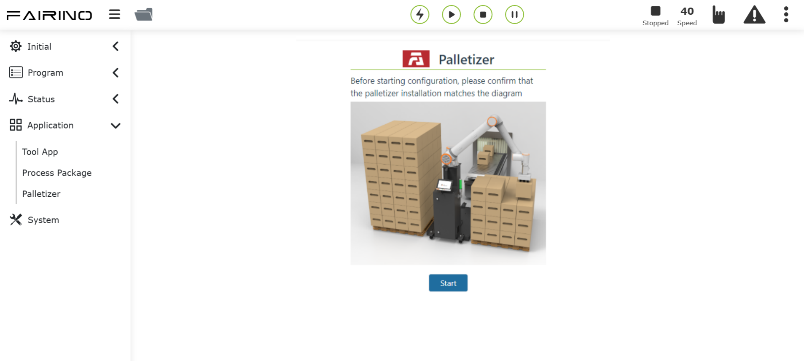

FRCap case
=========================

.. toctree:: 
   :maxdepth: 6

FAIRINO Palletizer
-----------------------------

It can be used after uploading the "Palletizer.plugin" under the build folder in the project to the WebApp and registering it.

.. centered:: Figure 7-1 Use of FRCap for palletizing

Palletizing workpiece configuration 
+++++++++++++++++++++++++++++++++++++++++++++

Command name: palletizing_config_box. 

Command parameters: 

.. code-block:: c++
   :linenos:

   /** 
   * @param  int length piece length
   * @param  int width workpiece speed
   * @param  int height Work piece height
   * @param  int payload artifact payload
   * @param  string grip_point workpiece grip point
   * /

Instruction example:

.. code-block:: c++
   :linenos:

   {
      cmd: "palletizing_config_box",
      data: {
         length: 800,
         width: 615,
         height: 312,
         payload: 2.34,
         grip_point: "grippoint"
      }
   } 

Command feedback:

.. code-block:: c++
   :linenos:

   /** 
   * @return status:200 "success"
   * @return status:404 "fail"
   */

Palletizing pallet configuration 
+++++++++++++++++++++++++++++++++++++++++++++

Command name: palletizing_config_pallet.

Command parameters: 

.. code-block:: c++
   :linenos:

   /** 
   * @param  int front tray front
   * @param  int side tray side
   * @param  int height Pallet height
   * @param  int left_pallet left tray enabled
   * @param  int right_pallet Right tray enabled
   */

Instruction example:

.. code-block:: c++
   :linenos:

   {
      cmd: "palletizing_config_pallet",
      data: {
            front: 1200,
            side: 1000,
            height: 110,
            left_pallet: 0,
            right_pallet: 1
         }
   }

Command feedback:

.. code-block:: c++
   :linenos:

   /** 
   * @return status:200 "success"
   * @return status:404 "fail"
   */ 

Advanced palletizing configuration
+++++++++++++++++++++++++++++++++++++++++++

Command name:  palletizing_advanced_cfg.

Command parameters: 

.. code-block:: c++
   :linenos:

   /** 
   * @param  string height grab point lifting height
   * @param  string x1 palletizing progressive point 1: x offset in x direction, unit mm
   * @param  string y1 palletizing progressive point 1: y offset in x direction, unit mm
   * @param  string z1 palletizing progressive point 1: z offset in x direction, unit mm
   * @param  string x2 palletizing progressive point 2: x offset in x direction, unit mm
   * @param  string y2 palletizing progressive point 2: y offset in x direction, unit mm
   * @param  string z2 palletizing progressive point 2: z offset in x direction, unit mm
   * @param  string time suction waiting time, unit ms
   */ 

Instruction example:

.. code-block:: c++
   :linenos:

   {
      cmd: "palletizing_advanced_cfg",
      data: {
      height: "1000",
            x1: "100",
            y1: "100",
            z1: "100",
            x2: "10",
            y2: "10",
            z2: "10",
            time: "1"
         }
   }

Command feedback:

.. code-block:: c++
   :linenos:

   /** 
   * @return status:200 "success"
   * @return status:404 "fail"
   */

Palletizing equipment size configuration
+++++++++++++++++++++++++++++++++++++++++++++++++++

Command name: palletizing_config_device.

Command parameters: 

.. code-block:: c++
   :linenos:

   /** 
   * @param  int x absolute value of the upper right corner of the left pallet relative to the coordinate axis of the robot base coordinate system in the x direction
   * @param  int y absolute value of the upper right corner of the left pallet relative to the coordinate axis of the robot base coordinate system in the y direction
   * @param  int z absolute value of the upper right corner of the left pallet relative to the coordinate axis of the robot base coordinate system in the z direction
   * @param  int angle angle when the robot is installed
   */ 

Instruction example:

.. code-block:: c++
   :linenos:

   {
      cmd: "palletizing_config_device",
      data: {
         x: 2400,
         y: 1800,
         z: 120,
         angle: 0   
      }
   }

Command feedback:

.. code-block:: c++
   :linenos:

   /** 
   * @return status:200 "success"
   * @return status:404 "fail"
   */

Palletizing mode configuration 
+++++++++++++++++++++++++++++++++++++++++++++

Command name: palletizing_config_pattern.

Command parameters: 

.. code-block:: c++
   :linenos:

   /** 
   * @param  int layers palletizing layers
   * @param  int box_gap Workpiece pixel spacing, unit: mm
   * @param  string sequence palletizing working mode
   * @param  int pattern_b_enable Whether mode b is turned on, 1: turned on, 0: not turned on
   * @param  string left_pattern_a Left station mode a Cartesian coordinates
   * @param  string left_pattern_b Left station mode b Cartesian coordinates
   * @param  string right_pattern_a Right station mode a Cartesian coordinates
   * @param  string right_pattern_b Right station mode b Cartesian coordinates
   * @param  string origin_pattern_a Initial mode a Cartesian coordinates
   * @param  string origin_pattern_b Initial mode b Cartesian coordinates
   */

Instruction example:

.. code-block:: c++
   :linenos:

   {
      cmd: "palletizing_config_pattern",
      data: {
         layers: 8,
         box_gap: 0,
         sequence: "a,b,a,b,a,b,a,b",
         pattern_b_enable: 1,
         left_pattern_a: "{\"1\": [[1,2,3,0.1,0.2,0.3],[1,2,3,0.1,0.2,0.3],[1,2,3,0.1,0.2,0.3]]}",
         "left_pattern_b": "{\"1\": [[1,2,3,0.1,0.2,0.3],[1,2,3,0.1,0.2,0.3],[1,2,3,0.1,0.2,0.3]]}",
         "right_pattern_a": "{\"1\": [[1,2,3,0.1,0.2,0.3],[1,2,3,0.1,0.2,0.3],[1,2,3,0.1,0.2,0.3]]}",
         "right_pattern_b": "{\"1\": [[1,2,3,0.1,0.2,0.3],[1,2,3,0.1,0.2,0.3],[1,2,3,0.1,0.2,0.3]]}",
         "origin_pattern_a": "[]",
         "origin_pattern_b": "[]"
      }
   }

Command feedback:

.. code-block:: c++
   :linenos:

   /** 
   * @return status:200 "success"
   * @return status:404 "fail"
   */

Palletizing program generation
++++++++++++++++++++++++++++++++++++++

Command name: generate_palletizing_program.

Command parameters: 

.. code-block:: c++
   :linenos:

   /**
   * @param  string palletizing_name name
   * @param  string depalletizing_name Destacking name
   * @param  string flag the palletizing or depalletizing program is generated, 0-not generated, 1 generated
   */ 

Instruction example:

.. code-block:: c++
   :linenos:

   {
      cmd: "generate_palletizing_program",
      data: {
         palletizing_name: "palletizing_1",
         depalletizing_name:"depalletizing_1",
         flag:"[0,1]"
      }
   }

Command feedback:

.. code-block:: c++
   :linenos:

   /** 
   * @return status:200 "success"
   * @return status:404 "fail"
   */

Get palletizing recipe
++++++++++++++++++++++++++++++

Command name: get_palletizing_formula.

Command parameters: 

.. code-block:: c++
   :linenos:

   /** 
   * @param  string name palletizing recipe name
   */ 

Instruction example:

.. code-block:: c++
   :linenos:

   {
      cmd: "get_palletizing_formula",
      data: {
         name: "palletizing_1"
      }
   }

Command feedback:

.. code-block:: c++
   :linenos:

   /** 
   * @return status:200 
   * @param  object box_config artifact configuration
   * @param  object pallet_config pallet configuration
   * @param  object device_config Installation device location
   * @param  object pattern_config Mode configuration
   * @param  object program_config Procedural build configuration
   * @param  object lefttransitionpoint left transition point
   * @param  object righttransitionpoint Right transition point Cartesian coordinates
   * @param  object advanced_config advanced configuration
   * @return status:404 "fail"
   */

Instruction feedback case:

.. code-block:: c++
   :linenos:

   {
      "box_config": {
        "flag": 1,
        "length": 200,
        "width": 400,
        "height": 300,
        "payload": 2.34,
        "grip_point": "grippoint"
      },
      "pallet_config": {
        "flag": 1,
        "front": 1000,
        "side": 1200,
        "height": 110,
         "left_pallet": 0,
         "right_pallet": 1
      },
      "device_config": {
      "flag": 1,
      "x": 2400,
      "y": 1800,
      "z": 120,
      "angle": 0
      },
      "pattern_config": {
      "flag": 1,
      "layers": 8,
      "box_gap": 0,
      "sequence": "a,b,a,b,a,b,a,b",
      "pattern_b_enable": 1,
      "left_pattern_a": "{\"1\": [[1,2,3,0.1,0.2,0.3],[1,2,3,0.1,0.2,0.3],[1,2,3,0.1,0.2,0.3]]}",
      "left_pattern_b": "{\"1\": [[1,2,3,0.1,0.2,0.3],[1,2,3,0.1,0.2,0.3],[1,2,3,0.1,0.2,0.3]]}",
      "right_pattern_a": "{\"1\": [[1,2,3,0.1,0.2,0.3],[1,2,3,0.1,0.2,0.3],[1,2,3,0.1,0.2,0.3]]}",
      "right_pattern_b": "{\"1\": [[1,2,3,0.1,0.2,0.3],[1,2,3,0.1,0.2,0.3],[1,2,3,0.1,0.2,0.3]]}",
      "origin_pattern_a": "[]",
      "origin_pattern_b": "[]"
      },
      "program_config": {
      "palletizing_name": "palletizing_1",
      "depalletizing_name":"depalletizing_1",
      "flag":"[0,1]"   
      },
      "lefttransitionpoint":{
      "j1":"120",
      "j2":"120",
      "j3":"120",
      "j4":"120",
      "j5":"120",
      "j6":"120"
      },
      "righttransitionpoint":{
      "j1":"120",
      "j2":"120",
      "j3":"120",
      "j4":"120",
      "j5":"120",
      "j6":"120"
      },
      "advanced_config":{
      "height": "1000",
      "x1": "100",
      "y1": "100",
      "z1": "100",
      "x2": "10",
      "y2": "10",
      "z2": "10",
      "time": "1"
      }
   }

Get the list of existing formula names for palletizing
++++++++++++++++++++++++++++++++++++++++++++++++++++++++

Command name: get_palletizing_formula_list.

Command parameters: None

Instruction example:

.. code-block:: c++
   :linenos:

   {
      cmd: "get_palletizing_formula_list"
   }

Command feedback:

.. code-block:: c++
   :linenos:

   /** 
   * @return status:200 
   * @param  Array ${name} palletizing name list
   * @return status:404 "fail"
   */

Instruction feedback case:

.. code-block:: c++
   :linenos:

   ["palletizing1"]

