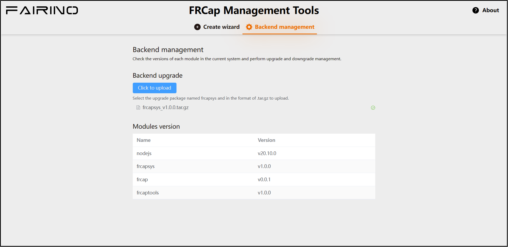

Gestione Backend
=========================

.. toctree:: 
   :maxdepth: 6

Aggiornamento Backend
---------------------------------
Nella sezione "Download Software" di questo documento, è possibile scaricare il pacchetto di aggiornamento più recente per il sistema backend FRCap. Dopo aver caricato con successo il pacchetto di aggiornamento scaricato, il backend eseguirà automaticamente l'aggiornamento.

Un aggiornamento riuscito è mostrato nella figura seguente.

.. centered:: Figura 4-1 Aggiornamento Riuscito Sistema Backend FRCap

.. note:: Dopo un aggiornamento riuscito, è necessario riavviare il pannello di controllo del robot affinché le modifiche abbiano effetto.

Versioni Moduli
-----------------------

Versioni dei moduli per la prima versione iniziale del sistema backend FRCap:

- Node.js: v20.10.0.
- FRCapSys: v1.0.0.
- FRCap: v0.0.1.
- FRCapTools: v1.0.0.

Per i dettagli specifici sui contenuti degli aggiornamenti di versione, consultare le note di rilascio.

.. note:: Node.js attualmente non viene aggiornato automaticamente con le nuove versioni.