Palletizing FRCap
=======================

.. toctree:: 
   :maxdepth: 6

Palletizing FRCap plug-in package management
----------------------------------------------

In the collaborative robot WebApp, "System Settings - FRCap Config." page，click the "Import" button and select the palletizing FRCap plug-in package (name format: plug-in package name + version number. frcap, example: palletizer Palletizer-v0.0.0.plugin) to upload. After the upload is successful, the list displays the successfully imported palletized FRCap plug-in package, including Status, Name, Version, Description and Author, etc. The palletizing FRCap plug-in package can be "Deactivate", "Enabled" and "Delete" in the operation bar.

.. image:: frcap_pictures/013.png
   :width: 6in
   :align: center

.. centered:: Figure 10-1-1 WebApp plug-in configuration interface

After successfully importing the palletizing FRCap plug-in package for the first time, the status of the plug-in package is "Disabled". Click the "Enable" button. After successful activation, the "Auxiliary Application" module of the collaborative robot WebApp adds the palletizing FRCap plug-in package start page ( For example: the page module name corresponding to Palletizer-v0.0.0.plugin is "Palletizer"). Click the "Start" button to enter the homepage, view the currently configured palletizing formula, and use it according to your needs.

.. note:: 
    If the recipe is empty, please add/import the recipe first.

.. image:: frcap_pictures/014.png
   :width: 6in
   :align: center

.. centered:: Figure 10-1-2 WebApp+ palletizing FRCap display diagram

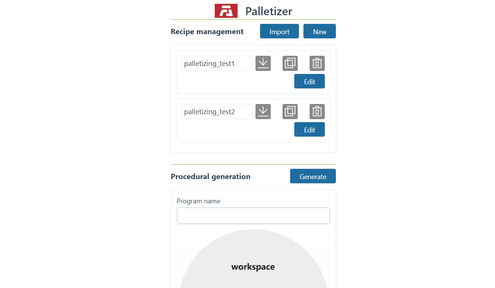

.. centered:: Figure 10-1-3 Palletizing FRCap Home Page

Recipe management
----------------------------------------------

Each recipe is divided into three major areas: recipe name, recipe operation and recipe editing. The operation area buttons are: Rename, Export, Copy and Delete.

.. image:: frcap_pictures/016.png
   :width: 3in
   :align: center

.. centered:: Figure 10-2-1 Recipe area division

.. note:: 
   .. image:: frcap_pictures/045.png
      :width: 0.5in
      :height: 0.5in
      :align: left

   | Name: Export recipe
   | Function: Export the data of the current recipe

.. note:: 
   .. image:: frcap_pictures/046.png
      :width: 0.5in
      :height: 0.5in
      :align: left

   | Name: Copy recipe
   | Function: Copy the data of the current recipe

.. note:: 
   .. image:: frcap_pictures/047.png
      :width: 0.5in
      :height: 0.5in
      :align: left

   | Name: Delete recipe
   | Function: Delete the current recipe

Obtain
+++++++++++++++++++++

After entering the homepage of the palletizing plug-in package, you can obtain all current recipes. When the number of recipes is greater than four, a scroll bar appears in the recipe display area, and the user can scroll up and down to view the recipes.

.. note:: 
    All recipe names start with "palletizing", for example "palletizing_test1".

.. image:: frcap_pictures/017.png
   :width: 3in
   :align: center

.. centered:: Figure 10-2-2 Recipe acquisition

New
+++++++++++++++++++++

In the operation area of any formula, click the "Add" button to enter the "New Formula" pop-up window, enter the name of the palletizing formula, and click the "Confirm" button. After the addition is successful, the new palletizing formula will be added to the formula display area.

.. note:: 
    All recipe names start with "palletizing". There is no need to enter "palletizing". You only need to enter the name after "_". For example, "palletizing_add", enter "add".

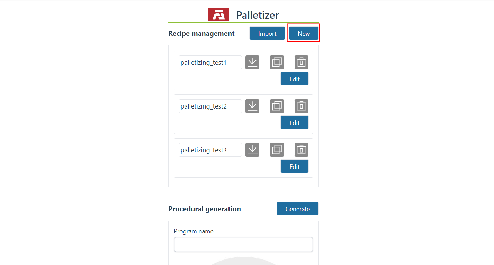

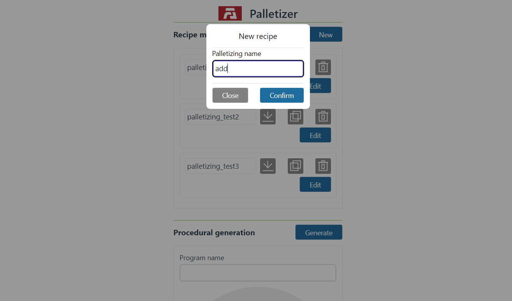

.. centered:: Figure 10-2-3 New recipe added

Rename
+++++++++++++++++++++
In the operation area of any formula, click the "Rename" icon to enter the "Palletizing Recipe Rename" pop-up window, enter the name of the palletizing formula, and click the "Confirm" button. After the renaming is successful, the original palletizing recipe name in the recipe display area is renamed.

.. note:: 
    All recipe names start with "palletizing". There is no need to enter "palletizing". The modal window will automatically bring out the name after "_". For example, "palletizing_rename" will automatically bring out "rename".

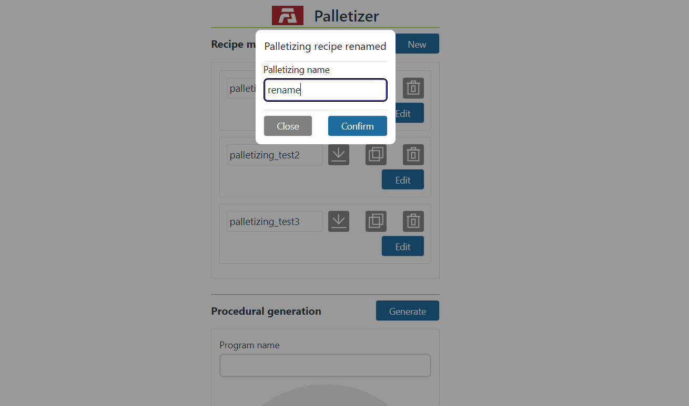

.. centered:: Figure 10-2-4 Recipe rename

Export
+++++++++++++++++++++

In the operation area of any recipe, click the "Export" icon to download all data of the current recipe.

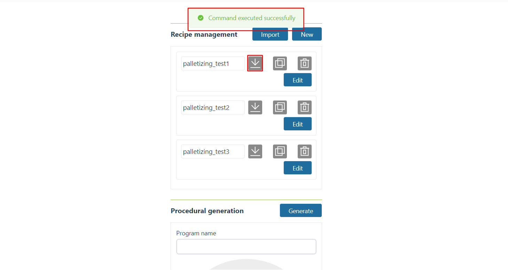

.. centered:: Figure 10-2-5 Recipe export

Copy
+++++++++++++++++++++

In the operation area of any formula, click the "Copy" icon to enter the "Palletizing Formula Copy" pop-up window, enter the name of the palletizing formula, and click the "Confirm" button. After the copy is successful, the copied palletizing formula will be added to the formula display area.

.. note:: 
    All recipe names start with "palletizing". There is no need to enter "palletizing". The modal window will automatically bring out the names after "_". For example, "palletizing_copy" will automatically bring out "copy".

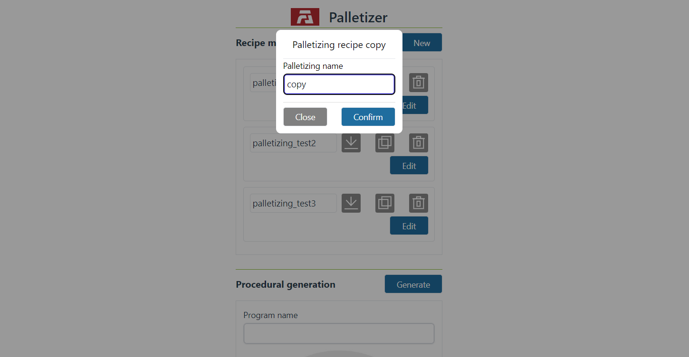

.. centered:: Figure 10-2-6 Recipe copy

Delete
+++++++++++++++++++++

In the operation area of any recipe, click the "Delete" icon to delete the current recipe.

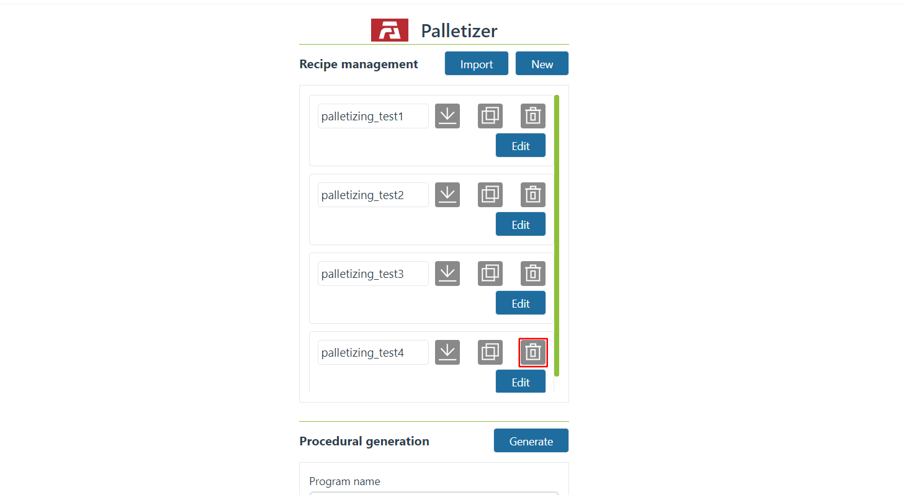

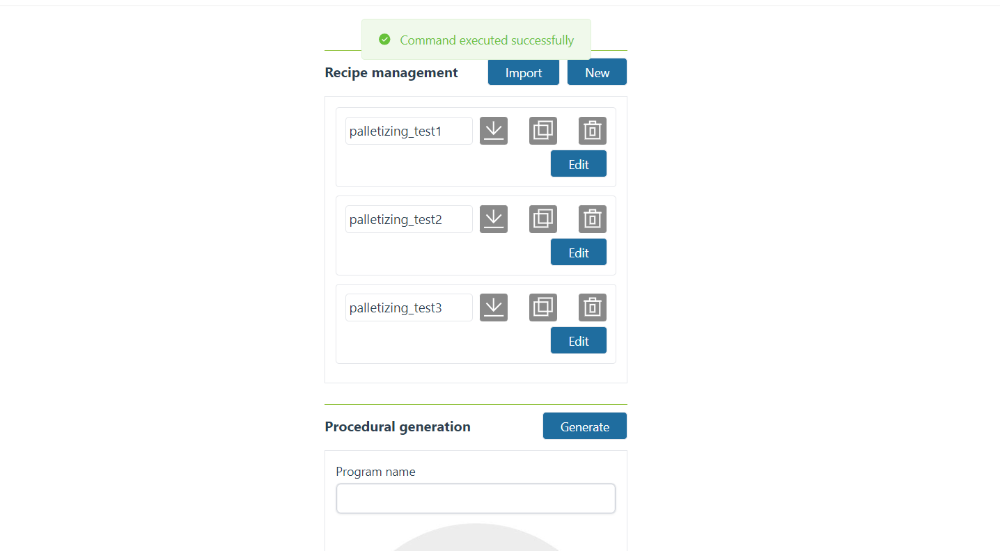

.. centered:: Figure 10-2-7 Recipe delete

Edit
+++++++++++++++++++++

For any recipe, click the "Edit" button to enter the configuration interface of the current recipe.

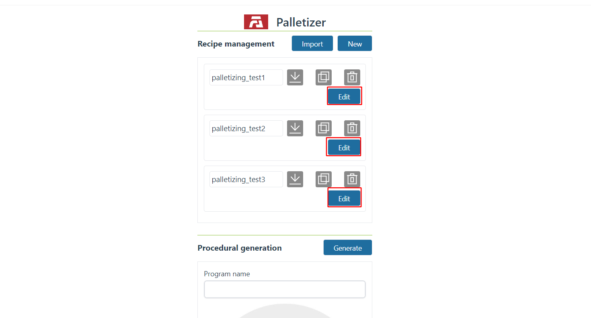

.. centered:: Figure 10-2-8 Palletizing recipe editor

Import
+++++++++++++++++++++

Click the "Import" button, select the compressed package of the palletizing formula and upload it. After the import is successful, the imported formula will be added to the palletizing formula.

.. note:: 
    All recipe compressed package names start with "palletizing" and end with ".tar.gz", such as "palletizing_import.tar.gz".

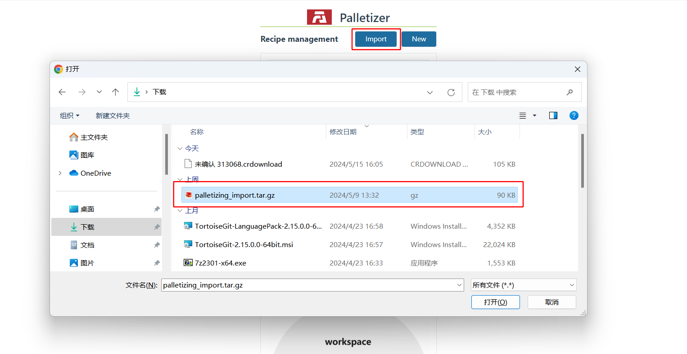

.. centered:: Figure 10-2-9 Recipe import

.. important:: 
    When "adding", "renaming" and "copying" a palletizing formula, entering an existing formula name will prompt "There is already a formula with the same name".

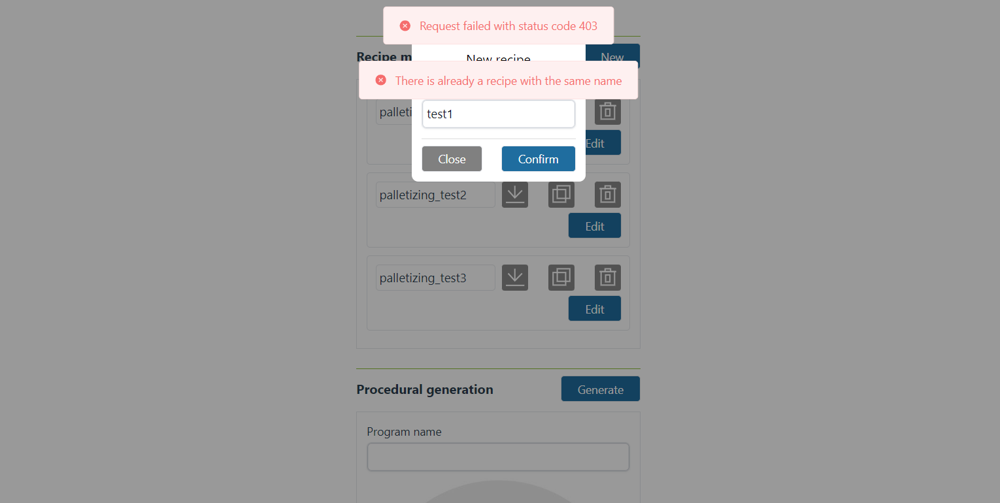

.. centered:: Figure 10-2-10 Tips for recipes with the same name

Recipe configuration
----------------------------------------------

The configuration interface of any recipe displays the basic information of boxes, trays, modes and advanced configurations, and configures specific parameters in the corresponding configuration column.

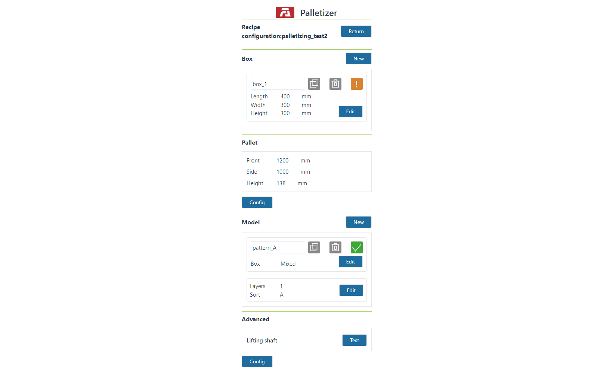

.. centered:: Figure 10-3-1 Palletizing recipe editing interface

Box configuration
++++++++++++++++++++++++++++++++++++++++++

Workstation Settings
~~~~~~~~~~~~~~~~~~~~~~~~~~~~~~~~

In recipe editing, you can choose whether to use a palletizing workstation, as shown in Figure 2-2. If a palletizing workstation is used, the corresponding palletizing functions will be completed using I/O signals from the workstation PLC; if no palletizing workstation is selected, the palletizing functions will default to using I/O signals from the control box.

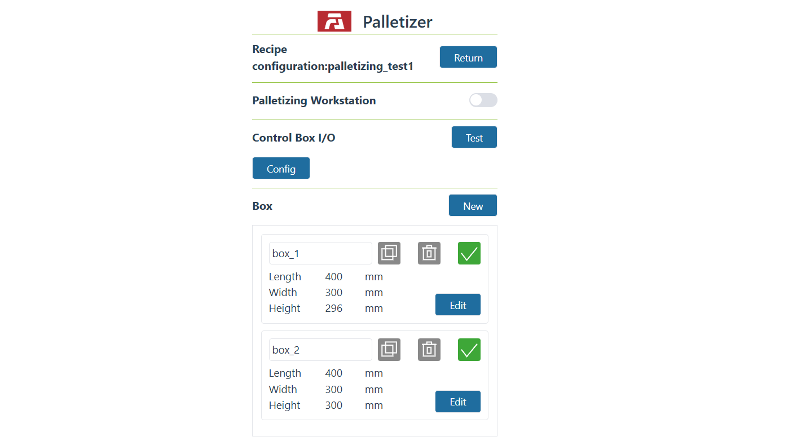

.. centered:: Figure 10-3-1-1 Recipe Editing Page

Palletizing Function I/O Wiring Configuration
~~~~~~~~~~~~~~~~~~~~~~~~~~~~~~~~~~~~~~~~~~~~~~~~~~~~~~~~~~~~~~~~

(1) After selecting to use a palletizing workstation, click on Extended I/O Configuration. Based on the corresponding functions and the actual wiring of the I/O interfaces with the PLC, you can customize the selection of I/O signal configuration for palletizing functions. Figure 2-3 shows the default wiring configuration for the palletizing workstation.

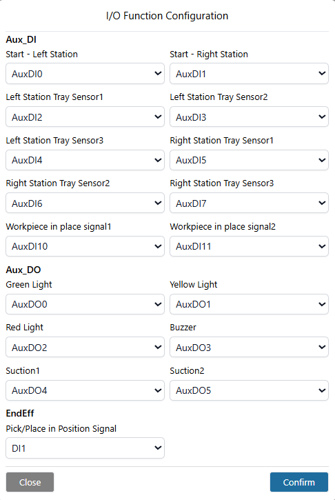

.. centered:: Figure 10-3-1-2 Default Wiring Configuration for Palletizing Workstation

(2) If you choose not to use a palletizing workstation, the system defaults to using control box I/O signals. Based on the corresponding functions and the actual wiring of the I/O interfaces with the control box, you can customize the selection of I/O signal configuration for palletizing functions. Figure 2-4 shows the default wiring configuration when no palletizing workstation is used (using control box I/O).

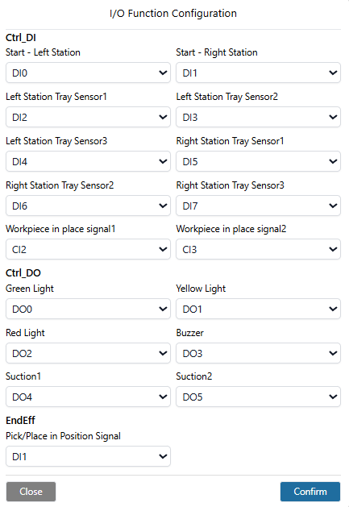

.. centered:: Figure 10-3-1-3 Default Wiring Configuration for No Palletizing Workstation (Control Box I/O)

Palletizing Function I/O Communication Test
~~~~~~~~~~~~~~~~~~~~~~~~~~~~~~~~~~~~~~~~~~~~~~~~~~~~~~~~~~~~~~~~

(1) When using a palletizing workstation, after configuring the extended I/O signals for the workstation palletizing workstation, you can click "Test" to verify the functionality of the wired I/O;

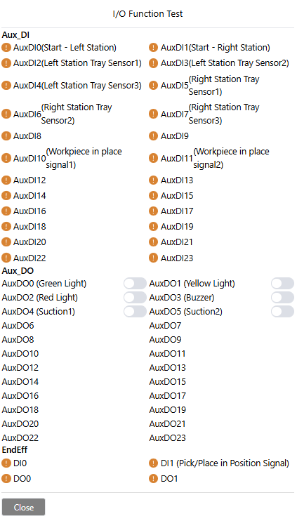

.. centered:: Figure 10-3-1-4 Palletizing Workstation I/O Wiring Test

(2) When no palletizing workstation is selected, after configuring the control box I/O signals corresponding to the palletizing functions, you can click "Test" to verify the functionality of the wired I/O;

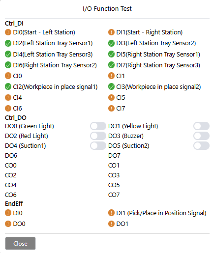

.. centered:: Figure 10-3-1-5 No Palletizing Workstation (Control Box I/O) Wiring Test

Box operation
~~~~~~~~~~~~~~~~~~

Boxes can be configured with multiple boxes of different types.

Click the "Add" button. After the addition is successful, a new box will be added in the current order.

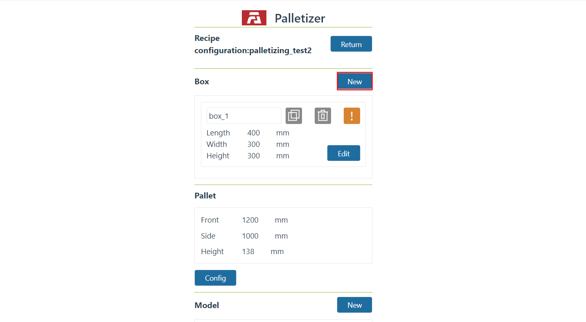

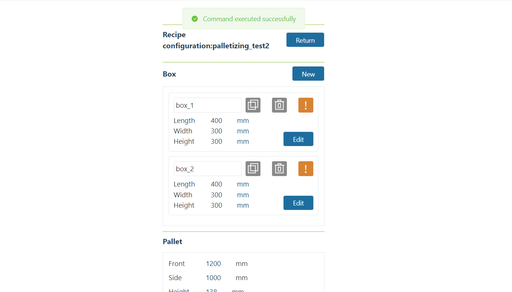

.. centered:: Figure 10-3-2 Add new box

Click the input box area where the box name is displayed, and the "Box Rename" modal window will pop up. After entering the name, click the "Confirm" button to confirm the renaming.

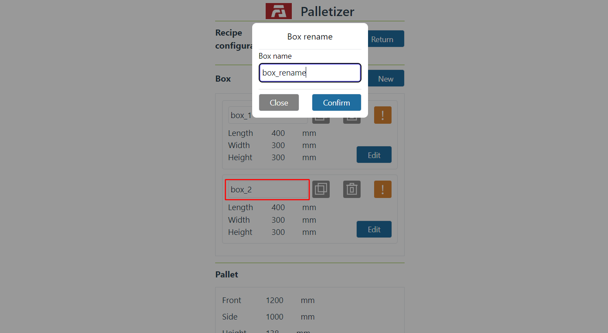

.. centered:: Figure 10-3-3 Rename box

Click the "Copy" icon. After the copy is successful, copy a box based on the current box name.

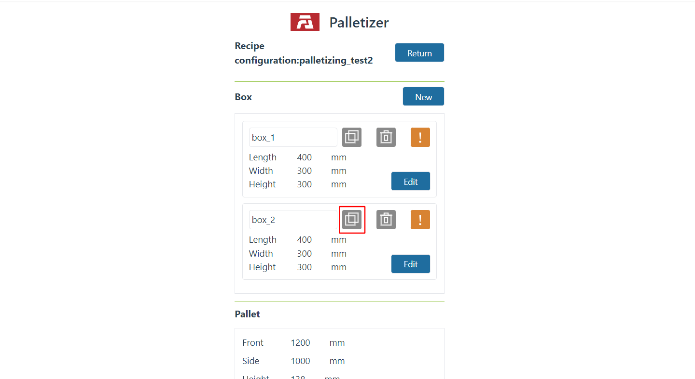

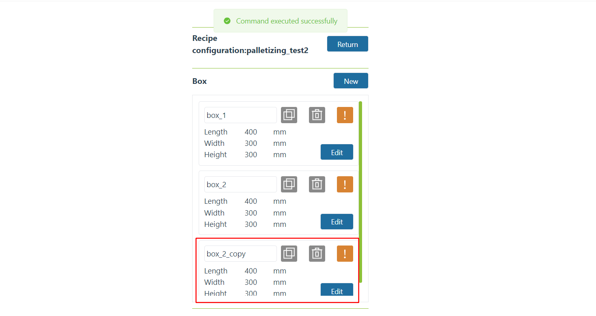

.. centered:: Figure 10-3-4 Copy box

Click the "Delete" icon to delete the box data.

.. note:: 
   Do not delete boxes that have been configured in the mode configuration.

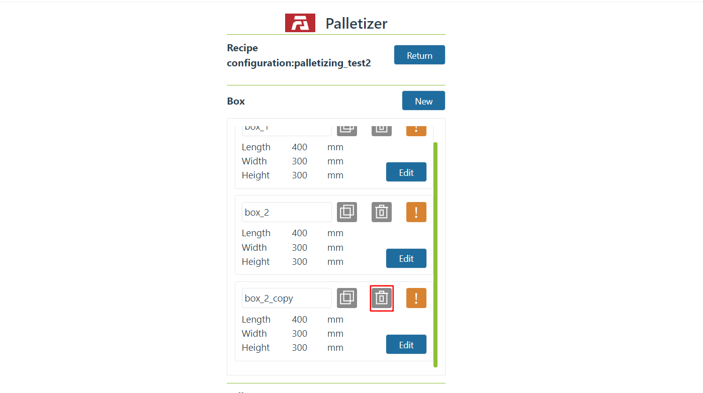

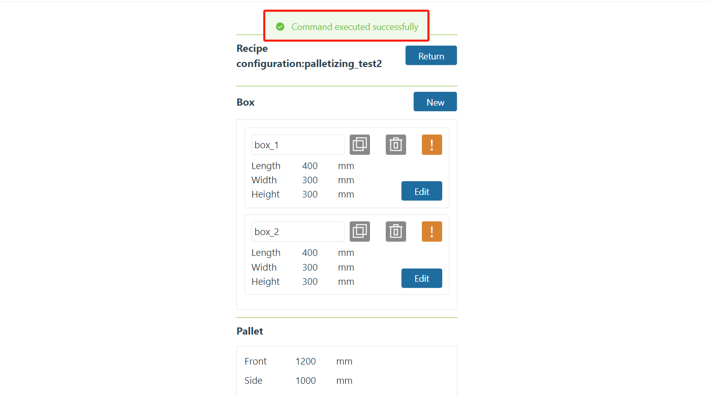

.. centered:: Figure 10-3-5 Delete box

For any box, click the "Edit" button to enter the box parameter configuration interface. After the configuration is successful, the box configuration status chart is green; when the configuration is not completed, the box configuration status icon is yellow.

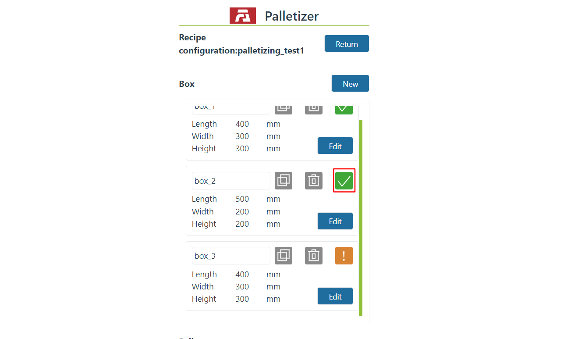

.. centered:: Figure 10-3-6 Box parameter configuration completed

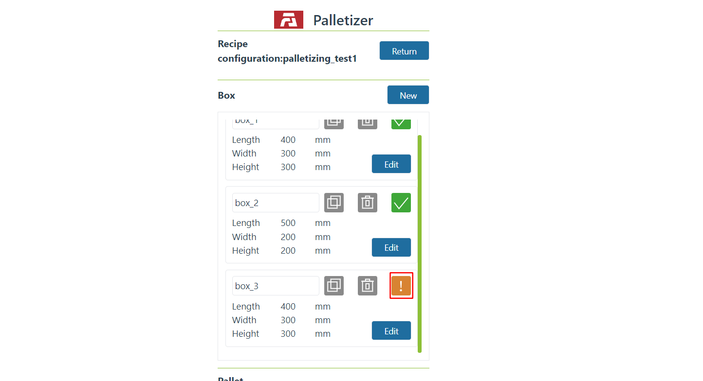

.. centered:: Figure 10-3-7 Box parameter configuration is not completed

Box parameters
~~~~~~~~~~~~~~~~~~

.. note:: 
   .. image:: frcap_pictures/057.png
      :width: 0.5in
      :height: 0.5in
      :align: left

   | Name: Previous box
   | Function: Switch to select the previous box. When the first box is selected, switch the selection to the last box again.

.. note:: 
   .. image:: frcap_pictures/058.png
      :width: 0.5in
      :height: 0.5in
      :align: left

   | Name: Next box
   | Function: Switch to select the next box. When the last box is selected, switch to the first box again.

Click "Edit" in the box configuration column to enter the "Box Configuration" pop-up window, set the "length", "width", "height", "load", "workpiece label orientation" and workpiece in place signal of the box, click "Confirm" button to complete the box information configuration; set the grab point of the box (keep the grab point at the center of the box, and the bottom of the suction cup will be in a squeeze state when in contact with the box), and click the "Record" button to complete the setting.

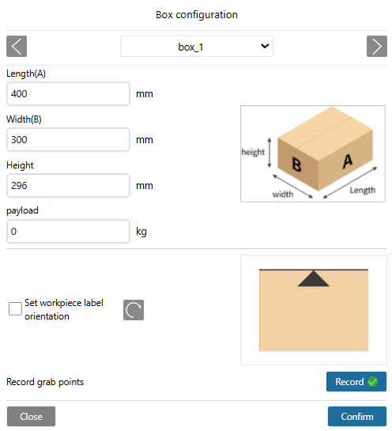

.. centered:: Figure 10-3-8 Box configuration

.. image:: frcap_pictures/030.png
   :width: 3in
   :align: center

.. centered:: Figure 10-3-9 Box grab point

.. important:: 
    The box grab point must be recorded, otherwise the length, width and height of the box cannot be configured.

Pallet configuration
~~~~~~~~~~~~~~~~~~~~~~~~~~~~~~~~~~~~

Click "Config" in the pallet configuration column to enter the "Pallet Configuration" pop-up window, set the "front", "side" and "height" of the pallet, then set the workstation transition point, and click "Confirm Configuration" to complete the pallet information setting.

.. image:: frcap_pictures/031.png
   :width: 6in
   :align: center

.. centered:: Figure 10-3-10 Pallet configuration

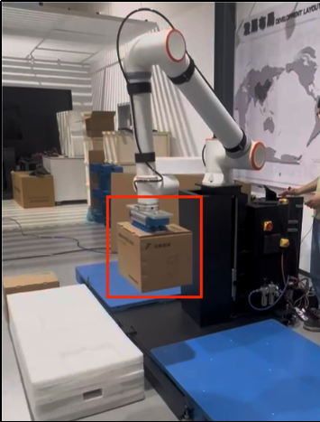

.. centered:: Figure 10-3-11 Left station transition point

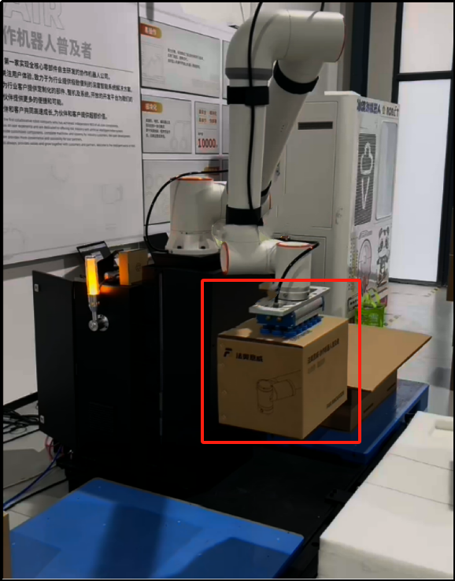

.. centered:: Figure 10-3-12 Right station transition point

.. important:: 
    Station transition points must be recorded, otherwise the program that cannot be generated cannot be saved.

Pattern configuration
++++++++++++++++++++++++++++++++++++++++++

Pattern operation
~~~~~~~~~~~~~~~~~~~~

When selecting boxes in a pattern configuration, you can select boxes of the same height but different lengths and widths. The mode display area is divided into: mode addition (configuring palletizing type) and palletizing layer configuration.

.. image:: frcap_pictures/059.png
   :width: 3in
   :align: center

.. centered:: Figure 10-3-13 Mode display area

Click the "Add" button. After the addition is successful, a new mode will be added in the current order.

.. image:: frcap_pictures/060.png
   :width: 6in
   :align: center

.. image:: frcap_pictures/061.png
   :width: 6in
   :align: center

.. centered:: Figure 10-3-14 New pattern

In any mode in the mode adding area, click the input box area where the mode name is displayed, and the "Mode Rename" modal window will pop up. After entering the name, click the "Confirm" button to confirm the renaming.

.. image:: frcap_pictures/062.png
   :width: 6in
   :align: center

.. centered:: Figure 10-3-15 Rename pattern

In any mode in the mode adding area, click the "Copy" icon. After the copy is successful, a mode will be copied according to the current mode name.

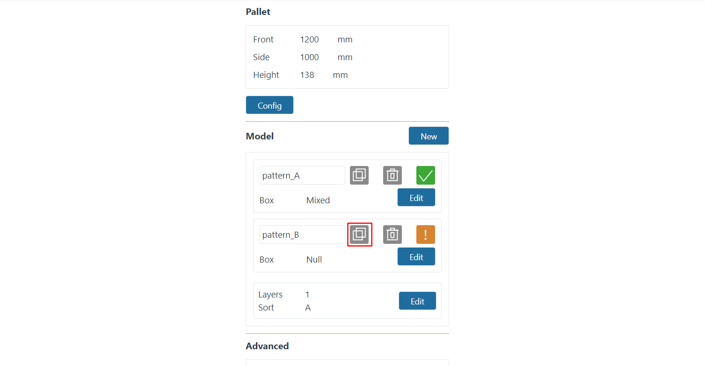

.. image:: frcap_pictures/064.png
   :width: 6in
   :align: center

.. centered:: Figure 10-3-16 Copy pattern

In any mode in the mode adding area, click the "Delete" icon to delete the current mode data.

.. image:: frcap_pictures/065.png
   :width: 6in
   :align: center

.. image:: frcap_pictures/066.png
   :width: 6in
   :align: center

.. centered:: Figure 10-3-17 Delete pattern

In any mode in the mode adding area, click the "Edit" button to enter the "Mode Configuration" modal window and configure the palletizing type of the current mode. After the configuration is successful, the box configuration status chart is green; when the configuration is not completed, the box configuration status icon is yellow.

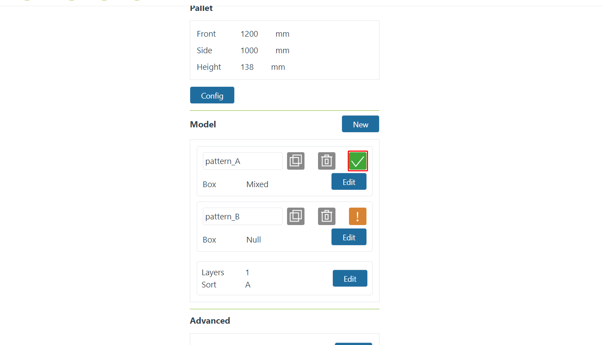

.. centered:: Figure 10-3-18 Pattern parameter configuration completed

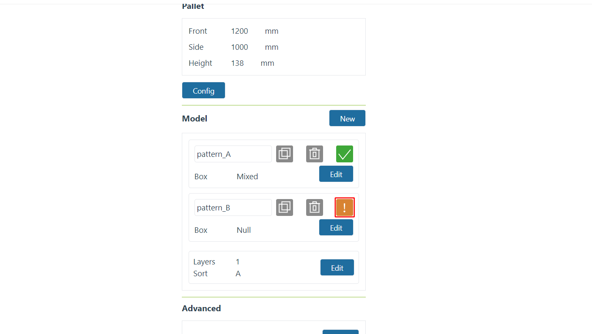

.. centered:: Figure 10-3-19 Mode parameter configuration is not completed

In the palletizing layer configuration area, the number and sorting of the palletizing layers are displayed. Click the "Edit" button to enter the "Palletizing Sequence Configuration" modal window, enter the "Number of Palletizing Layers", select the mode of each layer, and click the "Confirm" button to complete the configuration.

.. image:: frcap_pictures/069.png
   :width: 6in
   :align: center

.. centered:: Figure 10-3-20 Palletizing layer configuration

Pattern parameters
~~~~~~~~~~~~~~~~~~~~

.. note:: 
   .. image:: frcap_pictures/057.png
      :width: 0.5in
      :height: 0.5in
      :align: left

   | Name: Previous mode
   | Function: Switch to select the previous mode. When the first mode is selected, switch to the last mode again.

.. note:: 
   .. image:: frcap_pictures/058.png
      :width: 0.5in
      :height: 0.5in
      :align: left

   | Name: Next mode
   | Function: Switch to select the next mode. When the last mode is selected, switch to the first mode again.

Click "Edit" in the mode configuration column to enter the "Mode Configuration" pop-up window. It is mainly divided into three areas: pattern selection, box operation and stacking simulation.

.. image:: frcap_pictures/040.png
   :width: 6in
   :align: center

.. centered:: Figure 10-3-21 Pattern  configuration

.. important:: 
    When adding boxes, the background color of the workpiece turns red when there is a collision between boxes, and the above operation cannot be performed at this time. If necessary, please adjust the box to be collision-free.

Select the mode at the top of the pop-up window, select the box in the box operation area to add boxes in this mode, first set the box interval, you can add it individually or in batches, click "Confirm" to complete the mode information setting. When the heights of the selected boxes are inconsistent, the configuration cannot be completed, and the prompt "Box types are highly inconsistent and can't be added in the same pattern."

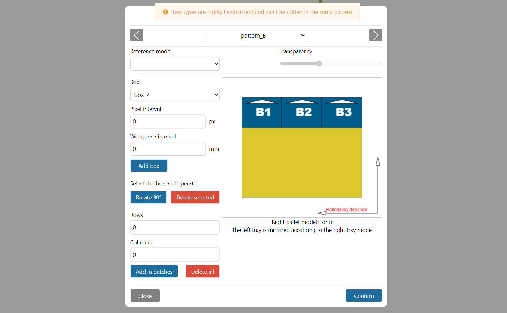

.. centered:: Figure 10-3-22 Tips for inconsistent heights of selected boxes

Select the reference mode (the selected mode cannot be selected), compare and see whether the current mode configuration can be palletized based on the reference mode, so that customers can intuitively check the box stacking types in different modes.

.. note:: 
    Currently only two modes, A and B, are supported.

.. important:: 
    Palletizing direction: Taking the right pallet as an example, the lower right corner is the farthest point. Place a row of workpieces vertically or horizontally from the lower right corner, then place workpieces horizontally or vertically in the upper row, and so on (Web page The palletizing direction has been marked, please check carefully). The left pallet places workpieces mirroring the right pallet mode.

Advanced configuration
+++++++++++++++++++++++++++++++++++++++

Click "Config" in the advanced configuration column to enter the "Advanced Configuration" pop-up window. The configuration items are as follows:

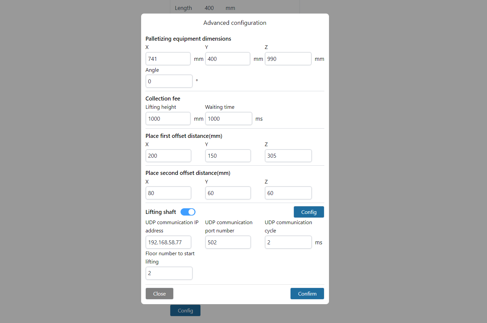

.. centered:: Figure 10-3-23 Advanced configuration

1) Dimensions of palletizing equipment: Dimensions of palletizing workbench.

.. image:: frcap_pictures/074.png
   :width: 6in
   :align: center

.. image:: frcap_pictures/075.png
   :width: 6in
   :align: center

.. centered:: Figure 10-3-24 Palletizing Station

.. important:: 
    X, Y, and Z are the absolute values of the coordinates of the point at the upper right corner of the left tray or the upper left corner of the right tray relative to the robot's base coordinate system. Angle is the rotation angle during the robot's installation, which is recommended to be 0 during installation.
    
2) Lifting height for picking up materials: User-defined lifting height after successfully picking up materials from the grabbing point.

3) Waiting time for picking up materials: The user can customize the waiting time for monitoring the negative pressure arrival signal after picking up materials, and repeat the picking up action when it is not in place.

4) First/second offset distance: User-defined offset distance for tilting the robot to the target point. (Note: The first offset parameter Z must be greater than the height of the box, otherwise it will collide with the already placed boxes during the stacking process).

5) Partition configuration: Click "Configuration" in the partition configuration column to enter the "Partition Configuration" pop-up window, set the partition size "length", "width" and "height" and select the start and stop of the partition.

.. image:: frcap_pictures/034.png
   :width: 6in
   :align: center

.. centered:: Figure 10-3-25 Partition configuration

.. image:: frcap_pictures/071.png
   :width: 6in
   :align: center

.. centered:: Figure 10-3-26 Recipe Management - Advanced Configuration Displays Partition Configuration

Then set the transition points of the partitions. There are three transition points for the partitions. The purpose of setting them is to roughly plan a movement path after grabbing the partitions to avoid collisions and being unable to complete the action of placing the partitions.

.. note:: 
    Transition point 1 starts to move a certain distance from the box grab point and then teaches; transition point 2 starts to move a certain distance from transition point 1 and starts teaching, and can also become a transition intermediate point; transition point 3 starts to move from transition point 2 A distance is the last point before the partition is placed.

.. image:: frcap_pictures/035.png
   :width: 3in
   :align: center

.. centered:: Figure 10-3-27 Partition transition point 1 (take the right station as an example)

.. image:: frcap_pictures/036.png
   :width: 3in
   :align: center

.. centered:: Figure 10-3-28 Partition transition point 2 (take the right station as an example)

.. image:: frcap_pictures/037.png
   :width: 3in
   :align: center

.. centered:: Figure 10-3-29 Partition transition point 3 (take the right station as an example)

Then set the grab point (keep the grab point at the center of the partition, and the bottom of the suction cup will be in a squeeze state when it contacts the partition) and placement point, and click "Confirm" to complete the partition information setting.

.. image:: frcap_pictures/038.png
   :width: 3in
   :align: center

.. centered:: Figure 10-3-30 Partition grab point (take the right station as an example)

.. image:: frcap_pictures/039.png
   :width: 3in
   :align: center

.. centered:: Figure 10-3-31 Partition placement point (take the right workstation as an example)

6) Lifting axis: Users can customize the start and stop of the lifting axis, communication parameters (IP address, port number and communication cycle), the floor number to start lifting and select the start and stop of the lifting axis. 

.. note:: 
    - When the lifting shaft is working, the height it lifts each time is the height of the box.
    - When the lifting shaft function is turned on, the home page displays the advanced configuration content and displays the lifting shaft test button. Click the "Test" button to enter the "Lifting" button. Axis Test" pop-up window is used to test the accuracy of loading communication, rising and falling of the lifting axis to avoid problems such as inability to work and large errors when used directly.

.. image:: frcap_pictures/042.png
   :width: 6in
   :align: center

.. centered:: Figure 10-3-32 Lifting shaft configuration

.. image:: frcap_pictures/072.png
   :width: 6in
   :align: center

.. centered:: Figure 10-3-33 Recipe Management - Advanced Configuration Display Lifting Axis

.. image:: frcap_pictures/073.png
   :width: 4in
   :align: center

.. centered:: Figure 10-3-34 Lifting shaft test

Procedural generation
--------------------------------------------

Check "Program Generation" below the recipe display, enter the program name, select the recipe according to the recipe and requirements. The left and right recipes can be the same or different, and click the "Generate" button.

.. note:: 
    All program names start with "palletizing". There is no need to enter "palletizing". You only need to enter the name after "_". For example, for "palletizing_program", enter "program".

.. important:: 
    1) If the palletizing formula is not selected for the left or right station, it means that the station is not enabled.
    2) After successfully generating the program, be sure to manually save all subprograms and main programs in program teaching.
    3) The depalletizing program starts with "de", for example, the palletizing program is "palletizing_program" and the depalletizing program is "depalletizing_program".

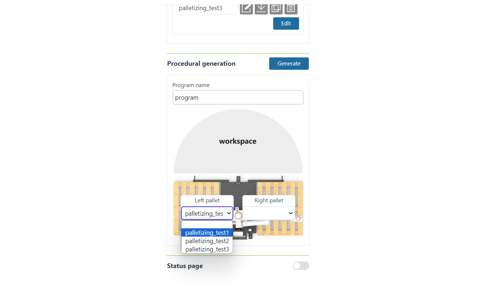

.. centered:: Figure 10-4-1 Procedural generation

.. Palletizing status page start and stop
.. --------------------------------------------

.. Enable this function in the "Status Page" column, enter the palletizing work status page, and view "Production Information", "Alarm Information" and "Palletizing Program".

.. .. image:: frcap_pictures/044.png
..    :width: 6in
..    :align: center

.. .. centered:: Figure 10-5-1 Palletizing status page
