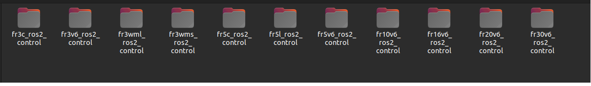
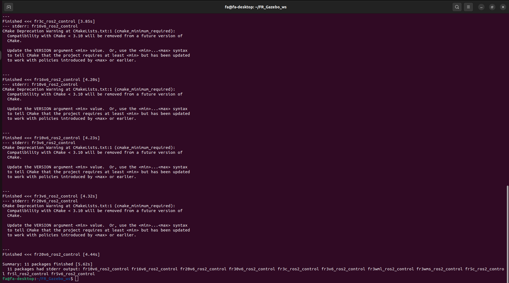

Introduzione al Plugin
++++++++++++++++++++++++++++++
Il plugin FAIRINO MoveIt2 è un plugin che fornisce supporto per il controllo del movimento e la pianificazione del percorso dei robot FAIRINO. Grazie al plugin FAIRINO MoveIt2, è possibile implementare funzionalità complesse come il controllo del movimento del robot, la pianificazione del percorso, la soluzione della cinematica inversa e il rilevamento delle collisioni in tempo reale. È adatto per vari scenari di applicazione dei bracci robotici, come l'industria, la saldatura, la produzione, il carico/scarico automatizzato, il pallettizzazione, il settore medico, ecc.

Uso Rapido
++++++++++++++++++++++++++++++
Questo capitolo spiega come configurare l'ambiente di esecuzione dell'APP.

Si consiglia di utilizzarlo su Ubuntu 22.04 LTS (Jammy). Dopo aver installato il sistema, è possibile installare ROS2. Si consiglia di utilizzare ros2-humble. L'installazione di ROS2 può essere seguita dal tutorial: https://docs.ros.org/en/humble/index.html.

Installazione e Configurazione del Pacchetto Plugin FAIRINO MoveIt2
------------------------------------------------------------------------------------
Clonare il Plugin FAIRINO MoveIt2
""""""""""""""""""""""""""""""""""""""""""""
Clonare il plugin FAIRINO MoveIt2 in locale, quindi cd nella directory di destinazione. I file principali includono: il pacchetto di funzionalità `fairino_msgs` per i tipi di dati di trasmissione del robot FAIRINO; il pacchetto di funzionalità del plugin hardware `fairino_hardware` per il robot FAIRINO;

il pacchetto di funzionalità per l'aspetto e i file urdf del robot FAIRINO: `fairino_robot/fairino_description`;

i pacchetti di configurazione moveit2 per i robot FAIRINO: `fairino_robot/fairino3mt_v6_moveit2_config`, `fairino_robot/fairino3_v6_moveit2_config`, `fairino_robot/fairino5_v6_moveit2_config`, `fairino_robot/fairino10_v6_moveit2_config`, `fairino_robot/fairino16_v6_moveit2_config`, `fairino_robot/fairino20_v6_moveit2_config`, `fairino_robot/fairino30_v6_moveit2_config`; il pacchetto di codice demo MTC per FAIR: `fairino_robot/fairino_mtc_demo`.

.. image:: img/fairino_harware_001.png
    :width: 6in
    :align: center
.. image:: img/fairino_harware_002.png
    :width: 6in
    :align: center

Compilare i Pacchetti di Funzionalità
""""""""""""""""""""""""""""""""""""""""""""""

Compilare il pacchetto `fairino_msgs`

.. code-block:: shell
    :linenos:

    cd ros2_ws
    colcon build --packages-select fairino_msgs
    source install/setup.bash

Compilare il pacchetto `fairino_hardware`

.. code-block:: shell
    :linenos:

    cd ros2_ws
    colcon build --packages-select fairino_hardware
    source install/setup.bash

Compilare il pacchetto `fairino_description`

.. code-block:: shell
    :linenos:

    cd ros2_ws
    colcon build --packages-select fairino_description
    source install/setup.bash

Compilare i pacchetti di configurazione moveit2 per i robot FAIRINO, prendendo `fairino5_v6_moveit2_config` come esempio

.. code-block:: shell
    :linenos:

    cd ros2_ws
    colcon build --packages-select fairino5_v6_moveit2_config
    source install/setup.bash

Compilare il pacchetto di codice demo `fairino_mtc_demo` per i robot FAIRINO. Se questo pacchetto di esempio non è presente nello spazio di lavoro ufficiale `ros2_ws`, contattare il servizio post-vendita per ottenerlo.

.. code-block:: shell
    :linenos:

    cd ros2_ws
    colcon build --packages-select fairino_mtc_demo
    source install/setup.bash

Configurare il Modello Moveit2 per il Braccio Robotico FAIR
----------------------------------------------------------------------------
Se non si desidera utilizzare i pacchetti di configurazione moveit2 forniti ufficialmente per il robot, è possibile configurare un pacchetto di configurazione moveit2 personalizzato per il robot tramite `moveit_setup_assistant`.

Creare uno Spazio di Lavoro
""""""""""""""""""""""""""""""""""
Creare uno spazio di lavoro e un pacchetto di funzionalità

.. code-block:: shell
    :linenos:

    mkdir -p test_fa_ws/src
    cd test_fa_ws/src
    mkdir fairino5_v6_robot_moveit_config
    cd ..
    cd ..

Compilare il pacchetto di funzionalità e eseguire source

.. code-block:: shell
    :linenos:

    colcon build
    source install/setup.bash

Avviare `moveit_setup_assistant` per configurare il robot

.. code-block:: shell
    :linenos:

    ros2 launch moveit_setup_assistant setup_assistant.launch.py

Configurare il Robot
""""""""""""""""""""""""""""""""""
Avviare l'Interfaccia di Configurazione
^^^^^^^^^^^^^^^^^^^^^^^^^^^^^^^^^^^^^^^^
Aprire un terminale nella directory `test_fa_ws`. Nell'interfaccia di configurazione, selezionare "Create New Moveit Configuration Package" per creare un nuovo pacchetto di configurazione moveit.

.. image:: img/fairino_harware_003.png
    :width: 6in
    :align: center

Quindi selezionare il file di descrizione del robot, cioè il file `.urdf`, e selezionare "Load Files" per caricare il modello del robot. Si vedrà il modello del robot caricato a destra.

.. image:: img/fairino_harware_004.png
    :width: 6in
    :align: center

Configurare Self-Collisions
^^^^^^^^^^^^^^^^^^^^^^^^^^^^^^^^^^^^^^^^
Self-Collisions è l'impostazione delle collisioni del robot. Fare clic su "Generate Collision Matrix" per generare automaticamente la matrice di collisione delle giunzioni. Questa annullerà le collisioni tra due link a contatto e tra link che non entreranno mai in contatto, configurando così la matrice di collisione delle giunzioni del robot ed evitando di calcolare le collisioni tra due superfici a contatto. Fare clic su "Generate Collision Matrix" per generarla automaticamente.

.. image:: img/fairino_harware_005.png
    :width: 6in
    :align: center

Configurare Virtual Joints
^^^^^^^^^^^^^^^^^^^^^^^^^^^^^^^^^^^^^^^^
Virtual Joints sono gli assi virtuali del robot. Quando il robot è installato su una piattaforma mobile, è necessario impostare un asse virtuale per il robot, impostando il nome dell'asse virtuale, il link figlio, il tipo di giunzione, ecc. Quando la piattaforma mobile si muove, anche l'asse virtuale si muove in sincronia, spostando così il robot, realizzando la funzione del robot che si muove con la piattaforma mobile. Questa volta posizioniamo direttamente il robot nel sistema di coordinate world, chiamandolo `virtual_joint`.

.. image:: img/fairino_harware_006.png
    :width: 6in
    :align: center

Configurare Planning Groups
^^^^^^^^^^^^^^^^^^^^^^^^^^^^^^^^^^^^^^^^
Planning Groups sono i gruppi di pianificazione del robot. Raggruppano le giunzioni che devono essere considerate insieme durante il calcolo cinematico nello stesso gruppo di pianificazione, per eseguire calcoli cinematici diretti e inversi unificati. Ad esempio, se si posiziona un robot su un AGV e si installa una pinza all'estremità del robot, si possono raggruppare le quattro giunzioni dell'AGV in un gruppo di pianificazione, le sei giunzioni del robot in un gruppo di pianificazione e la giunzione della pinza in un gruppo di pianificazione per il calcolo cinematico.

Poiché questa volta non coinvolge una pinza, aggiungiamo solo i vari gruppi di giunzioni del robot, cioè il gruppo `arm`. Innanzitutto, aggiungere il gruppo `arm`. Per il risolutore cinematico "Kinematic Solver" selezionare `kdl_kinematics_plugin/KDLKinematicsPlugin`, quindi il pianificatore predefinito del gruppo "Group Default Planner" selezionare `TRRT`, quindi fare clic su "Add Joints" per aggiungere giunzioni a questo gruppo di pianificazione.

.. image:: img/fairino_harware_007.png
    :width: 6in
    :align: center

Le giunzioni per `arm` possono essere selezionate multipli tenendo premuto Shift. Fare clic su '>' per aggiungere, quindi fare clic su "save" per salvare.

.. image:: img/fairino_harware_008.png
    :width: 6in
    :align: center

Il gruppo di pianificazione definito è mostrato di seguito:

.. image:: img/fairino_harware_009.png
    :width: 6in
    :align: center

Configurare Robot Poses
^^^^^^^^^^^^^^^^^^^^^^^^^^^^^^^^^^^^^^^^
Robot Poses sono le pose predefinite del robot. Definisce alcune pose predefinite per ogni gruppo di pianificazione. Definire una posa "home" per `arm`. Questa posa può essere scelta liberamente.

.. image:: img/fairino_harware_010.png
    :width: 6in
    :align: center

Robot Poses può definire pose predefinite per ogni gruppo di pianificazione. Quando nel robot è presente una pinza, è possibile aggiungere un gruppo di pianificazione per la pinza nella sezione Planning Groups, quindi durante l'impostazione delle pose in Robot Poses è possibile impostare pose predefinite per la pinza.

Configurare End Effectors
^^^^^^^^^^^^^^^^^^^^^^^^^^^^^^^^^^^^^^^^
End Effectors è l'organo di esecuzione finale del robot. Il gruppo di pianificazione dell'organo di esecuzione finale è `hand`, e il `parent_link` di connessione predefinito è `panda_link8`. Poiché questa volta non c'è un organo di esecuzione finale, questo passaggio può essere saltato.

Modifiche URDF di ros2_control
^^^^^^^^^^^^^^^^^^^^^^^^^^^^^^^^^^^^^^^^
Le modifiche URDF di ros2_control sono principalmente utilizzate per impostare il tipo di dati delle giunzioni inviati e ricevuti in feedback. È possibile scegliere tra posizione, velocità e coppia. Questa volta selezioniamo sia i dati inviati che quelli di feedback come controllo di posizione, quindi fare semplicemente clic su "Add interfaces".

.. image:: img/fairino_harware_011.png
    :width: 6in
    :align: center

.. important::

   - Nota:

     La selezione del tipo di dati delle giunzioni deve corrispondere al plugin `fairino_hardware` successivo. Selezionare il tipo di dati delle giunzioni inviati e ricevuti in feedback in base ai dati trasmessi dal plugin `fairino_hardware`. Poiché il plugin `fairino_hardware` che controlla il movimento effettivo del robot questa volta utilizza il tipo di dati `position`, selezioniamo sia i dati inviati che quelli di feedback come controllo di posizione.

Controller ROS 2
^^^^^^^^^^^^^^^^^^^^^^^^^^^^^^^^^^^^^^^^
I controller ROS 2 sono principalmente utilizzati per generare il file `ros2_controllers.yaml`. Questo file imposta la frequenza di pubblicazione, i nomi delle giunzioni, i nomi dei controller, i tipi di controller, ecc. Configurare i controller ROS 2 per configurare un controller per ogni gruppo di pianificazione. Fare clic su "Auto Add JointTrajectoryController Controllers For Each Planning Group".

.. image:: img/fairino_harware_012.png
    :width: 6in
    :align: center

Controller Moveit
^^^^^^^^^^^^^^^^^^^^^^^^^^^^^^^^^^^^^^^^
I controller Moveit sono principalmente utilizzati per generare il file `moveit_controllers`. Questo file imposta i nomi dei controller, i tipi di controller, ecc. È importante notare che i nomi dei controller in `moveit_controllers` devono essere gli stessi dei nomi dei controller in `ros2_controllers`, altrimenti non funzionerà correttamente.

Inoltre, quando i nomi dei controller in `moveit_controllers` corrispondono ai nomi dei controller in `ros2_controllers`, i tipi di controller in `moveit_controllers` verranno automaticamente mappati sui tipi di controller in `ros2_controllers`, realizzando l'invio dei dati di controllo tramite `moveit_controllers` a `ros2_controllers`, quindi attraverso il plugin in `ros2_controllers` per guidare il movimento effettivo del robot.

.. image:: img/fairino_harware_013.png
    :width: 6in
    :align: center

File di Lancio (Launch Files)
^^^^^^^^^^^^^^^^^^^^^^^^^^^^^^^^^^^^^^^^
Configurare i file di lancio. Utilizzare la configurazione predefinita.

.. image:: img/fairino_harware_014.png
    :width: 6in
    :align: center

Informazioni sull'Autore
^^^^^^^^^^^^^^^^^^^^^^^^^^^^^^^^^^^^^^^^
.. image:: img/fairino_harware_015.png
    :width: 6in
    :align: center

Generare i File di Lancio
^^^^^^^^^^^^^^^^^^^^^^^^^^^^^^^^^^^^^^^^
Generare i file di lancio. Selezionare la posizione di generazione. Questa volta creare una cartella `fairino5_v6_robot_moveit_config` nel percorso del file `test_fa_ws/src` per memorizzare i file di configurazione, quindi selezionare "Generate".

.. image:: img/fairino_harware_016.png
    :width: 6in
    :align: center

Poiché questa configurazione è stata già eseguita in precedenza, se questa è la configurazione iniziale, il contenuto della sezione "Check files you want to be generated" sarà nero, indicando che è possibile generare i file di lancio.

Avviare il Lancio
""""""""""""""""""""""""""""""""""
Dopo aver completato la configurazione, è possibile compilare il pacchetto di funzionalità. È possibile sostituire il pacchetto di configurazione moveit2 per il robot FAIRINO con un pacchetto di configurazione moveit2 personalizzato per il robot, per realizzare l'uso compatibile del plugin per robot personalizzati dall'utente.

.. code-block:: shell
    :linenos:

    colcon build --packages-select fairino5_v6_robot_moveit_config
    source install/setup.bash

Quindi eseguire direttamente il file di lancio appena configurato

.. code-block:: shell
    :linenos:

    ros2 launch fairino5_v6_robot_moveit_config demo.launch.py

Si vedrà l'interfaccia rviz2 configurata.

.. image:: img/fairino_harware_017.png
    :width: 6in
    :align: center

Utilizzo di Moveit2
""""""""""""""""""""""""""""""""""
Dopo aver aperto il pacchetto configurato, è possibile impostare la posizione target del robot trascinando la sfera blu all'estremità del robot nell'interfaccia 3D a destra, quindi modificare l'orientamento dell'estremità del robot utilizzando i tre anelli rosso, verde e blu all'estremità del robot.

.. image:: img/fairino_harware_018.png
    :width: 6in
    :align: center

Fare clic sul pulsante "Plan" a sinistra per pianificare la traiettoria di movimento del robot.

.. image:: img/fairino_harware_019.png
    :width: 6in
    :align: center

Fare clic sul pulsante "Execute" a sinistra per guidare il robot a muoversi lungo la traiettoria pianificata fino alla posa target.

.. image:: img/fairino_harware_020.png
    :width: 6in
    :align: center

Il pulsante "Plan&Execute" controlla automaticamente il movimento del robot dopo aver pianificato la traiettoria.

Quindi, facendo clic sulla scheda "Joints", è possibile modificare la posa target del robot cambiando gli angoli delle singole giunzioni, quindi utilizzare i pulsanti "Plan", "Execute", "Plan&Execute" per guidare il movimento del robot.

.. image:: img/fairino_harware_021.png
    :width: 6in
    :align: center

Gazebo Simulation Environment Mass-Production Robot Adaptation Function Package
++++++++++++++++++++++++++++++++++++++++++++++++++++++++++++++++++++++++++++++++++++++++++++++++++++++++++++++++++++++++

Introduction
------------------------------------------------------------

Questo progetto fornisce pacchetti di simulazione per robot collaborativi a 6 gradi di libertà della serie FR nell'ambiente di simulazione Gazebo Classic, implementati basati sull'architettura ROS2 Humble e ros2_control. Ogni robot corrisponde a un pacchetto ROS2 indipendente, che utilizza l'interfaccia hardware GazeboSystem standard di ros2_control, supportando il controllo dei giunti e il feedback dello stato dei giunti. Il nome predefinito del workspace in questo manuale è FR_Gazebo_ws; se personalizzato, sostituirlo di conseguenza.

Modelli Supportati (11 Pacchetti)
""""""""""""""""""""""""""""""""""""""""""""""""""""""""""""""""""""""""""""""""""""""""""""""""""""""""""""

Tabella 1-1 Corrispondenza Modelli Supportati e Pacchetti

.. list-table::
   :widths: 50 50
   :header-rows: 0
   :align: center

   * - **Modello** 
     - **Pacchetto**

   * - FR3
     - fr3v6_ros2_control

   * - FR5
     - fr5v6_ros2_control

   * - FR10
     - fr10v6_ros2_control

   * - FR16
     - fr16v6_ros2_control

   * - FR20
     - fr20v6_ros2_control

   * - FR30
     - fr30v6_ros2_control

   * - FR3C
     - fr3c_ros2_control

   * - FR5C
     - fr5c_ros2_control

   * - FR5WML
     - fr5l_ros2_control

   * - FR3WML
     - fr3wml_ros2_control

   * - FR3WMS
     - fr3wms_ros2_control

Caratteristiche Principali
""""""""""""""""""""""""""""""""""""""""""""""""""""""""""""""""""""""""""""""""""""""""""""""""""""""""""""

- Nomenclatura Unificata dei Giunti: Tutti i modelli hanno 6 giunti rotazionali, denominati j1 ~ j6, nell'ordine: base → spalla → gomito → polso1 → polso2 → polso3.
- Interfaccia di Controllo Unificata: I comandi trajectory_msgs/msg/JointTrajectory (controllo di posizione) vengono inviati tramite il topic /joint_trajectory_controller/joint_trajectory.
- Feedback dello Stato dei Giunti: Gli angoli dei giunti vengono restituiti in tempo reale tramite il topic joint_states sotto il namespace di ciascun modello.
- Script di Dimostrazione: Ogni pacchetto include uno script *_demo.py che attende automaticamente che il controller sia pronto e poi dimostra il movimento di ciascun giunto.

.. image:: img/039.png
    :width: 6in
    :align: center

.. centered:: Figura 1-1 Effetto di Caricamento del Robot nell'Ambiente di Simulazione Gazebo

Requisiti Ambientali
------------------------------

Sistema Operativo
""""""""""""""""""""""""""""""""""""""""""""""""""""""""""""""""""""""""""""""""""""""""""""""""""""""""""""

Ubuntu 22.04 LTS (versione ufficialmente supportata da ROS 2 Humble).

Dipendenze Software
""""""""""""""""""""""""""""""""""""""""""""""""""""""""""""""""""""""""""""""""""""""""""""""""""""""""""""

Tabella 2-1 Elenco Dipendenze Software

.. list-table::
   :widths: 30 30 40
   :header-rows: 0
   :align: center

   * - **Software/Componente** 
     - **Versione/Descrizione**
     - **Percorso di Installazione**

   * - ROS 2
     - Humble
     - /opt/ros/humble

   * - Gazebo
     - Gazebo Classic 11 (gzserver / gzclient)
     - Installato con gazebo_ros

   * - Workspace Sorgente ros2_control
     - Include ros2_control, gazebo_ros2_control, ros2_controllers, controller_manager, joint_trajectory_controller, joint_state_broadcaster, ecc.
     - ~/ros2_control_ws

   * - Python 3
     - Per eseguire script launch e demo
     - Incluso nel sistema
		
.. note:: I pacchetti gazebo_ros2_control, joint_trajectory_controller, joint_state_broadcaster e altri richiesti da questo progetto provengono dal workspace ~/ros2_control_ws compilato da sorgente (repository ros-controls). Prima del lancio/compilazione, questo workspace deve essere sourced; altrimenti si verificheranno errori "controller/plugin non trovato". Si consiglia inoltre di utilizzare il tipo di build predefinito per evitare problemi di caricamento dei plugin causati da simboli di debug.

Passaggi di Installazione e Compilazione dei Pacchetti
------------------------------------------------------------------------------------------

Preparazione: Verificare il Workspace ros2_control
""""""""""""""""""""""""""""""""""""""""""""""""""""""""""""""""""""""""""""""""""""""""""""""""""""""""""""

Verificare che ~/ros2_control_ws esista e sia stato compilato (contenente il repository ros-controls). Se già esistente, procedere direttamente alla Sezione 3.2. Se necessario configurarlo, eseguire i seguenti comandi:

.. centered:: Codice 3-1 Configurazione del Workspace ros2_control
    
.. code-block:: console

    # 1. Creare il workspace e clonare il codice sorgente ros-controls
    mkdir -p ~/ros2_control_ws/src
    cd ~/ros2_control_ws/src
    git clone https://github.com/ros-controls/ros2_control -b humble

    # 2. Compilare (ROS 2 Humble deve essere già sourced)
    source /opt/ros/humble/setup.bash
    cd ~/ros2_control_ws
    rosdep install --from-paths src --ignore-src -r -y
    colcon build
    source ~/ros2_control_ws/install/setup.bash

Clonazione del Repository
""""""""""""""""""""""""""""""""""""""""""""""""""""""""""""""""""""""""""""""""""""""""""""""""""""""""""""

Innanzitutto, clonare i pacchetti di adattamento Gazebo localmente, inclusi fr3c_ros2_control, fr3v6_ros2_control, fr3wml_ros2_control, fr3wms_ros2_control, fr5c_ros2_control, fr5l_ros2_control, fr5v6_ros2_control, fr10v6_ros2_control, fr16v6_ros2_control, fr20v6_ros2_control, fr30v6_ros2_control. Creare la cartella FR_Gazebo_ws/src e clonare i pacchetti sopra elencati nella directory src.

.. centered:: Figura 3-1 Pacchetti di Adattamento Robot nella Directory src

Compilazione del Workspace
""""""""""""""""""""""""""""""""""""""""""""""""""""""""""""""""""""""""""""""""""""""""""""""""""""""""""""

Tutti i pacchetti in questo progetto sono pacchetti di tipo file (installano solo URDF/launch/config/meshes).

.. centered:: Codice 3-2 Compilazione del Workspace FR_Gazebo_ws
    
.. code-block:: console

    # 1. Caricare gli ambienti in ordine (l'ordine non deve essere invertito)
    source /opt/ros/humble/setup.bash
    source ~/ros2_control_ws/install/setup.bash

    # 2. Entrare nel workspace e compilare
    cd ~/FR_Gazebo_ws
    colcon build

    # 3. Dopo la compilazione, caricare l'ambiente del workspace
    source ~/FR_Gazebo_ws/install/setup.bash

Verifica del Risultato di Compilazione
""""""""""""""""""""""""""""""""""""""""""""""""""""""""""""""""""""""""""""""""""""""""""""""""""""""""""""

Dopo una compilazione riuscita, tutti gli 11 pacchetti dovrebbero apparire nella directory install/:

Codice 3-3 Verifica del Risultato di Compilazione
    
.. code-block:: console

    ls ~/FR_Gazebo_ws/install
    # Dovrebbe mostrare: fr3v6_ros2_control  fr5v6_ros2_control  fr10v6_ros2_control  ... 11 in totale

.. centered:: Figura 3-2 Output del Terminale di Compilazione Riuscita

Istruzioni per l'Uso
------------------------------------------------------------------------------------------

Avvio della Simulazione (Utilizzando FR5 come Esempio)
""""""""""""""""""""""""""""""""""""""""""""""""""""""""""""""""""""""""""""""""""""""""""""""""""""""""""""

.. centered:: Codice 4-1 Avvio della Simulazione FR5
    
.. code-block:: console

    # 1. Caricare gli ambienti in ordine
    cd ~/FR_Gazebo_ws
    source /opt/ros/humble/setup.bash
    source ~/ros2_control_ws/install/setup.bash
    source ~/FR_Gazebo_ws/install/setup.bash

    # 2. Avviare (il launch avvierà automaticamente gzserver/gzclient, genererà il robot e caricherà i controller. Se necessario pulire i processi vecchi, fare riferimento alla nota alla fine della Sezione 4.2)
    ros2 launch fr5v6_ros2_control spawn_fr5v6.launch.py
    
Durante l'avvio, il launch attenderà automaticamente che controller_manager sia pronto prima di caricare i controller. Vedere il seguente log indica che è pronto. Se "Successfully loaded" non viene visualizzato dopo più di 3 minuti, fare riferimento alla Sezione 5.2 per risolvere l'ordine di sourcing degli ambienti:

.. centered:: Codice 4-2 Log di Caricamento Controller Riuscito
    
.. code-block:: console

    Successfully loaded controller joint_trajectory_controller into state active

.. image:: img/042.png
    :width: 6in
    :align: center

.. centered:: Figura 4-1 Log del Terminale di Caricamento Controller Riuscito

.. image:: img/043.png
    :width: 6in
    :align: center

.. centered:: Figura 4-2 Postura Iniziale del Robot nell'Interfaccia Gazebo

Tabella di Riferimento dei Comandi di Avvio per Tutti i Modelli
""""""""""""""""""""""""""""""""""""""""""""""""""""""""""""""""""""""""""""""""""""""""""""""""""""""""""""

Il processo operativo è lo stesso per tutti i modelli, cambiano solo il nome del pacchetto, il nome del file launch e il namespace:

Tabella 4-1 Tabella di Riferimento dei Comandi di Avvio per Tutti i Modelli

.. list-table::
   :widths: 20 40 20 20
   :header-rows: 0
   :align: center

   * - **Modello** 
     - **Comando di Avvio**
     - **Namespace**
     - **Topic Stato Giunti**

   * - FR3 
     - ros2 launch fr3v6_ros2_control spawn_fr3v6.launch.py
     - fr3v6
     - /fr3v6/joint_states

   * - FR5 
     - ros2 launch fr5v6_ros2_control spawn_fr5v6.launch.py
     - fr5v6
     - /fr5v6/joint_states

   * - FR10 
     - ros2 launch fr10v6_ros2_control spawn_fr10v6.launch.py
     - fr10v6
     - /fr10v6/joint_states

   * - FR16 
     - ros2 launch fr16v6_ros2_control spawn_fr16v6.launch.py
     - fr16v6
     - /fr16v6/joint_states

   * - FR20 
     - ros2 launch fr20v6_ros2_control spawn_fr20v6.launch.py
     - fr20v6
     - /fr20v6/joint_states

   * - FR30 
     - ros2 launch fr30v6_ros2_control spawn_fr30v6.launch.py
     - fr30v6
     - /fr30v6/joint_states

   * - FR3C 
     - ros2 launch fr3c_ros2_control spawn_fr3c.launch.py
     - fr3c
     - /fr3c/joint_states

   * - FR3WML 
     - ros2 launch fr3wml_ros2_control spawn_FR3WML.launch.py
     - fr3wml
     - /fr3wml/joint_states

   * - FR3WMS 
     - ros2 launch fr3wms_ros2_control spawn_FR3WMS.launch.py
     - fr3wms
     - /fr3wms/joint_states

   * - FR5C 
     - ros2 launch fr5c_ros2_control spawn_fr5c.launch.py
     - fr5c
     - /fr5c/joint_states

   * - FR5WML 
     - ros2 launch fr5l_ros2_control spawn_fr5l.launch.py
     - fr5l
     - /fr5l/joint_states
			
.. note:: È possibile avviare un solo modello alla volta. Per cambiare, è necessario prima chiudere il processo Gazebo corrente (pkill -9 gzserver; pkill -9 gzclient); altrimenti la nuova istanza fallirà a causa di conflitti di porta.

Controllo Manuale (Invio dei Giunti Target)
""""""""""""""""""""""""""""""""""""""""""""""""""""""""""""""""""""""""""""""""""""""""""""""""""""""""""""

Una volta che il controller è pronto, inviare i giunti target (6 angoli dei giunti in radianti) a /joint_trajectory_controller/joint_trajectory:

.. centered:: Codice 4-3 Invio Manuale dei Comandi di Traiettoria dei Giunti
    
.. code-block:: console

    # Muovere ai giunti target [1.57, -0.78, -1.57, -1.2, 1.57, 1.3] (unità: radianti)
    ros2 topic pub --once /joint_trajectory_controller/joint_trajectory \
    trajectory_msgs/msg/JointTrajectory \
    "{joint_names: [j1,j2,j3,j4,j5,j6],
        points: [{positions: [1.57, -0.78, -1.57, -1.2, 1.57, 1.3],
                time_from_start: {sec: 2, nanosec: 0}}]}"

    # Tornare alla posizione zero
    ros2 topic pub --once /joint_trajectory_controller/joint_trajectory \
    trajectory_msgs/msg/JointTrajectory \
    "{joint_names: [j1,j2,j3,j4,j5,j6],
        points: [{positions: [0.0, 0.0, 0.0, 0.0, 0.0, 0.0],
                time_from_start: {sec: 2, nanosec: 0}}]}"

.. note:: La formula di conversione degli angoli è: radianti = gradi × π / 180. Valori comuni: 90° ≈ 1.5708, −90° ≈ −1.5708, 100° ≈ 1.7453.

Esecuzione degli Script di Dimostrazione
""""""""""""""""""""""""""""""""""""""""""""""""""""""""""""""""""""""""""""""""""""""""""""""""""""""""""""

Ogni pacchetto include uno script di dimostrazione che attende automaticamente che controller_manager sia pronto e poi esegue un movimento alternativo 0→±90° per ogni giunto:

.. centered:: Codice 4-4 Esecuzione dello Script di Dimostrazione
    
.. code-block:: console

    # Utilizzando FR5 come esempio (sostituire il nome del pacchetto nel percorso dello script per altri modelli)
    python3 ~/FR_Gazebo_ws/src/fr5v6_ros2_control/scripts/fr5v6_demo.py

Tabella 4-2 Tabella di Riferimento dei Percorsi degli Script di Dimostrazione per Tutti i Modelli

.. list-table::
   :widths: 30 70
   :header-rows: 0
   :align: center

   * - **Modello** 
     - **Percorso Script di Dimostrazione**

   * - FR3
     - ~/FR_Gazebo_ws/src/fr3v6_ros2_control/scripts/fr3v6_demo.py

   * - FR5
     - ~/FR_Gazebo_ws/src/fr5v6_ros2_control/scripts/fr5v6_demo.py

   * - FR10
     - ~/FR_Gazebo_ws/src/fr10v6_ros2_control/scripts/fr10v6_demo.py

   * - FR16
     - ~/FR_Gazebo_ws/src/fr16v6_ros2_control/scripts/fr16v6_demo.py

   * - FR20
     - ~/FR_Gazebo_ws/src/fr20v6_ros2_control/scripts/fr20v6_demo.py

   * - FR30
     - ~/FR_Gazebo_ws/src/fr30v6_ros2_control/scripts/fr30v6_demo.py

   * - FR3C
     - ~/FR_Gazebo_ws/src/fr3c_ros2_control/scripts/fr3c_demo.py

   * - FR3WML
     - ~/FR_Gazebo_ws/src/fr3wml_ros2_control/scripts/fr3wml_demo.py

   * - FR3WMS
     - ~/FR_Gazebo_ws/src/fr3wms_ros2_control/scripts/fr3wms_demo.py

   * - FR5C
     - ~/FR_Gazebo_ws/src/fr5c_ros2_control/scripts/fr5c_demo.py

   * - FR5WML
     - ~/FR_Gazebo_ws/src/fr5l_ros2_control/scripts/fr5l_demo.py

.. image:: img/044.png
    :width: 6in
    :align: center

.. centered:: Figura 4-3 Postura del Robot durante l'Esecuzione dello Script di Dimostrazione

Monitoraggio dello Stato dei Giunti
""""""""""""""""""""""""""""""""""""""""""""""""""""""""""""""""""""""""""""""""""""""""""""""""""""""""""""

.. centered:: Codice 4-5 Monitoraggio dello Stato dei Giunti
    
.. code-block:: console
        
    # Visualizzare gli angoli dei giunti in tempo reale
    ros2 topic echo /joint_states

.. image:: img/045.png
    :width: 6in
    :align: center

.. centered:: Figura 4-4 Output in Tempo Reale dello Stato dei Giunti

Domande Frequenti
------------------------------------------------------------------------------------------

Conflitto di Porta / Gazebo non si apre all'avvio
""""""""""""""""""""""""""""""""""""""""""""""""""""""""""""""""""""""""""""""""""""""""""""""""""""""""""""

- Causa: Il processo Gazebo precedente non è uscito, occupando la porta.
- Soluzione: Pulire i processi residui prima dell'avvio: pkill -9 gzserver; pkill -9 gzclient

Bloccato su "Waiting for controller_manager..." per più di 2 minuti
""""""""""""""""""""""""""""""""""""""""""""""""""""""""""""""""""""""""""""""""""""""""""""""""""""""""""""

- Causa: controller_manager non è pronto, spesso perché ~/ros2_control_ws/install/setup.bash non è stato sourced, o il caricamento delle mesh è troppo lento.
- Soluzione: Uscire prima con Ctrl+C; confermare che i tre ambienti siano stati source nell'ordine (ros2 → ros2_control_ws → FR_Gazebo_ws).

Il robot non si muove quando si inviano comandi manualmente
""""""""""""""""""""""""""""""""""""""""""""""""""""""""""""""""""""""""""""""""""""""""""""""""""""""""""""

- Causa: Molto probabilmente un problema di temporizzazione; il comando è stato inviato prima che il controller entrasse completamente nello stato active, ed è stato scartato.
- Soluzione: Confermare che il terminale stampi "Successfully loaded controller joint_trajectory_controller into state active" prima di inviare i comandi di controllo; o utilizzare direttamente lo script demo della Sezione 4.4.

Errore: plugin joint_trajectory_controller/gazebo_ros2_control non trovato
""""""""""""""""""""""""""""""""""""""""""""""""""""""""""""""""""""""""""""""""""""""""""""""""""""""""""""

- Causa: Le dipendenze relative a ros2_control non sono caricate.
- Soluzione: Confermare che ~/ros2_control_ws/install/setup.bash sia stato source; e confermare che l'ordine di caricamento in ~/.bashrc o nel terminale corrente sia ROS → ros2_control_ws → questo workspace.

Componenti Mancanti / Giunti Incompleti dopo il Caricamento del Robot
""""""""""""""""""""""""""""""""""""""""""""""""""""""""""""""""""""""""""""""""""""""""""""""""""""""""""""

- Causa: I file mesh referenziati nell'URDF sono mancanti.
- Soluzione: Confermare che la directory meshes/ del pacchetto corrispondente esista e sia completa.

È possibile avviare due modelli contemporaneamente?
""""""""""""""""""""""""""""""""""""""""""""""""""""""""""""""""""""""""""""""""""""""""""""""""""""""""""""

- No. Più istanze di simulazione competerebbero per la stessa porta Gazebo; è possibile avviare un solo modello alla volta.

Plugin fairino_hardware (Pacchetto di configurazione moveit personalizzato per robot)

Il plugin `fairino_hardware` è lo strato intermedio che collega moveit al robot. Attraverso il plugin `fairino_hardware`, `move_group` invia la pianificazione del movimento a `moveit_control`, che poi lo inoltra a `ros2_control`. `ros2_control` guida quindi il robot effettivo attraverso il plugin `fairino_hardware`. Inoltre, il plugin `fairino_hardware` riceve anche i dati di feedback dal robot effettivo, realizzando così la sincronizzazione tra il modello del robot nell'interfaccia di simulazione rviz2 e il robot effettivo. Ciò consente all'utente di guidare il robot effettivo attraverso l'interfaccia rviz2.

Inoltre, grazie all'implementazione del plugin `fairino_hardware`, i robot FAIRINO possono essere integrati nel framework di controllo `ros2_control`, consentendo ai robot FAIRINO di essere compatibili con pacchetti di funzionalità di terze parti basati su `ros2_control`.

Nel plugin `fairino_hardware` adattato alla versione software V3.8.3 del braccio robotico, è stata aggiunta la modalità coppia e l'interfaccia per la coppia di comando, consentendo al braccio robotico di entrare in modalità coppia e ricevere la coppia di comando.

Compilazione del Plugin fairino_hardware
----------------------------------------------------------------------------------------------------------
Compilare il pacchetto di funzionalità del plugin `fairino_hardware` nello spazio di lavoro `ros2_ws` fornito ufficialmente. Seguendo la compilazione del pacchetto di funzionalità del plugin `fairino_hardware` nella sezione precedente, si troverà il file `.so` generato dal plugin, `libfairino_hardware.so`, in

.. code-block:: shell
    :linenos:

    ros2_ws/install/fairino_hardware/lib/fairino_hardware
    
indicando che la compilazione del plugin è riuscita.

È importante notare che i nomi assegnati dal plugin `fairino_hardware` alle giunzioni del robot devono essere gli stessi dei nomi delle giunzioni del robot configurati in moveit2. Questo plugin `fairino_hardware` assegna i nomi `j1`, `j2`, `j3`, `j4`, `j5`, `j6` alle sei giunzioni del robot, dalla posizione della base all'estremità del robot. Pertanto, durante la configurazione del robot in moveit2, è necessario nominare le giunzioni del robot come `j1`, `j2`, `j3`, `j4`, `j5`, `j6`.

Utilizzo del Plugin fairino_hardware
----------------------------------------------------------------------------------------------------------
Se si utilizza il pacchetto di configurazione moveit personalizzato per il robot configurato, andare nella directory

.. code-block:: shell
    :linenos:

    /home/fairino/test_fa_ws/install/fairino5_v6_robot_moveit_config/share/fairino5_v6_robot_moveit_config/config

Trovare il file `fairino5_v6_robot.ros2_control.xacro` e sostituire il parametro alla riga 3

.. code-block:: shell
    :linenos:

    use_fake_hardware:=false

con

.. code-block:: shell
    :linenos:

    use_fake_hardware:=true

In base alla successiva condizione `if`, si può vedere che impostando `use_fake_hardware` su `true` si abilita il plugin `fairino_hardware/FairinoHardwareInterface`. Salvare il file e uscire.

.. image:: img/fairino_harware_022.png
    :width: 6in
    :align: center

Qui, "fairino_hardware/FairinoHardwareInterface" è il nome del plugin hardware impostato. I dettagli possono essere visualizzati nel file "fairino_hardware.xml" nella directory "/home/fairino/ros2_ws/src/fairino_hardware".

.. image:: img/fairino_harware_023.png
    :width: 6in
    :align: center

Nota: il parametro `robot_control_mode` alla riga 3 del file determina l'interfaccia di comando esposta durante il caricamento del plugin, cioè il parametro rappresenta la modalità di controllo. 0 è la modalità di controllo di posizione e il plugin esporrà l'interfaccia `position`. 1 è la modalità di controllo di coppia e il plugin esporrà l'interfaccia `effort`. Una demo per l'interfaccia di controllo di coppia dovrebbe essere rilasciata nel pacchetto di funzionalità `fairino_hardware` adattato alla versione software V3.8.5 del braccio robotico.

L'attuale controller Moveit2 supporta solo la modalità di controllo di posizione. Non impostare `robot_control_mode` su 1.

Eseguire il Plugin
----------------------------------------------------------------------------------------------------------
Aprire un terminale, quindi passare allo spazio di lavoro `ros2_ws` ed eseguire `source` dello spazio di lavoro. Lo scopo è aggiungere il plugin `fairino_hardware`. È anche possibile aggiungere questo percorso al file "~/.bashrc", ma non è consigliato.

.. code-block:: shell
    :linenos:

    cd ros2_ws
    source install/setup.bash

Quindi tornare alla directory home, passare allo spazio di lavoro `test_fa_ws` ed eseguire `source` dello spazio di lavoro, quindi eseguire il file `demo.launch.py`

.. code-block:: shell
    :linenos:

    cd ..
    cd test_fa_ws
    source install/setup.bash
    ros2 launch fairino5_v6_robot_moveit_config demo.launch.py

Risultato dell'Esecuzione
----------------------------------------------------------------------------------------------------------
Dopo l'avvio del file `demo.launch.py`, l'interfaccia rviz2 sarà come mostrato di seguito:

.. image:: img/fairino_harware_024.png
    :width: 6in
    :align: center

A questo punto, la differenza principale tra l'interfaccia di avvio di rviz2 e quella nella sezione 3.3.1 è la posa iniziale del robot. Ora, poiché è stato aggiunto il plugin `fairino_hardware`, questo plugin riceverà lo stato delle giunzioni del robot effettivo in tempo reale e lo restituirà a `move_group` tramite `ros2_control`, controllando così la posa del robot simulato nell'interfaccia rviz2, realizzando la sincronizzazione tra il robot effettivo e il robot simulato in rviz2.

La posa attuale del robot effettivo è la seguente:

.. image:: img/fairino_harware_025.png
    :width: 3in
    :align: center

A questo punto è possibile guidare il robot effettivo attraverso l'interfaccia rviz2. Trascinare la sfera blu all'estremità del robot nell'interfaccia rviz2 per spostare l'estremità del robot nella posizione target, quindi trascinare i tre anelli rosso, verde e blu all'estremità del robot per modificare l'orientamento dell'estremità del robot. Fare quindi clic sul pulsante "Planning & Execute" a sinistra per pianificare la traiettoria di movimento e guidare il robot. Si noterà che il robot effettivo e il robot simulato nell'interfaccia rviz2 si muovono in sincronia e si fermano nella posa target.

Le immagini seguenti mostrano il controllo del robot effettivo e del robot simulato nell'interfaccia rviz2 fino alla posa target tramite l'interfaccia rviz2:

.. image:: img/fairino_harware_026.png
    :width: 6in
    :align: center

.. image:: img/fairino_harware_027.png
    :width: 3in
    :align: center

A questo punto è possibile controllare il robot effettivo e il robot simulato nell'interfaccia rviz2 per muoversi in sincronia tramite moveit2.

Pacchetto di Codice Demo MTC
++++++++++++++++++++++++++++++

Introduzione al Pacchetto di Codice Demo MTC
---------------------------------------------------
Il pacchetto di codice demo MTC fornisce un'interfaccia rviz2 ricostruita utilizzando moveit2 e il plugin `fairino_hardware`, sostituendo la scheda "MotionPlanning" originale con la scheda "Motion Planning Tasks" per visualizzare le varie fasi del movimento del robot. L'interfaccia rviz2 può essere modificata tramite il file "mtc.rviz" nel percorso

.. code-block:: shell
    :linenos:

    ros2_ws/install/fairino_mtc_demo/share/fairino_mtc_demo/launch

Gli utenti possono personalizzare l'interfaccia rviz2 in base alle proprie esigenze funzionali modificando il file "mtc.rviz".

Inoltre, il pacchetto di codice demo MTC fornisce un esempio di come far muovere il robot in ciclo per afferrare un target utilizzando moveit2 e il plugin `fairino_hardware`. Attraverso questo esempio, gli utenti possono imparare come interagire meglio con il robot effettivo in forma di codice utilizzando moveit2 e il plugin `fairino_hardware`. Sulla base di ciò, gli utenti possono personalizzarlo in base alle proprie esigenze.

Compilazione del Pacchetto di Codice Demo MTC
---------------------------------------------------

Clonare il Pacchetto di Codice Demo MTC
"""""""""""""""""""""""""""""""""""""""""""""""""
Clonare il pacchetto di codice demo MTC ufficiale "fairino_robot" nella directory src dello spazio di lavoro "ros2_ws".

Selezione del Modello di Robot
""""""""""""""""""""""""""""""""""
Nel pacchetto di codice demo MTC fornito ufficialmente, nel file `mtc_demo_env.launch.py` nella directory

.. code-block:: shell
    :linenos:

    ros2_ws/src/fairino_robot/fairino_mtc_demo/launch

selezionare il modello di robot, modificando le righe 9, 10, 11 di questo file per corrispondere al robot che si desidera impostare.

.. image:: img/fairino_harware_030.png
    :width: 6in
    :align: center

I nomi specifici dei modelli di robot possono essere consultati nei pacchetti di funzionalità dei vari modelli di robot nella directory

.. code-block:: shell
    :linenos:

    ros2_ws/src/fairino_robot/

.. image:: img/fairino_harware_031.png
    :width: 3in
    :align: center

Compilare il Pacchetto di Codice Demo MTC
""""""""""""""""""""""""""""""""""""""""""""""""""""""""""""""""
Compilare il Pacchetto di Funzionalità `fairino_description`
^^^^^^^^^^^^^^^^^^^^^^^^^^^^^^^^^^^^^^^^^^^^^^^^^^^^^^^^^^^^^^^^^^^^^^^^^^^^^^^
Aprire un terminale, passare alla directory `ros2_ws`, compilare il pacchetto di funzionalità `fairino_description`, quindi eseguire `source`

.. code-block:: shell
    :linenos:

    cd ros2_ws
    colcon build --packages-select fairino_description
    source install/setup.bash

Compilare il Pacchetto di Funzionalità del Robot
^^^^^^^^^^^^^^^^^^^^^^^^^^^^^^^^^^^^^^^^^^^^^^^^^^^^^^^^^^^^^^^^^^
Nella directory `ros2_ws`, compilare il pacchetto di funzionalità del robot corrispondente al modello. Prendendo il robot `fairino5` come esempio

.. code-block:: shell
    :linenos:

    colcon build --packages-select fairino5_v6_moveit2_config
    source install/setup.bash

Quindi è necessario aggiungere il plugin `fairino_hardware` per sincronizzare il movimento con il robot effettivo. Passare alla directory

.. code-block:: shell
    :linenos:

    ros2_ws/install/fairino5_v6_moveit2_config/share/fairino5_v6_moveit2_config/config
    
Trovare `fairino5_v6_robot.ros2_control.xacro` e sostituire alla riga 9

.. code-block:: shell
    :linenos:

    <plugin>mock_components/GenericSystem</plugin>
    
con

.. code-block:: shell
    :linenos:

    <plugin>fairino_hardware/FairinoHardwareInterface</plugin>
    
Salvare e uscire.

.. image:: img/fairino_harware_032.png
    :width: 6in
    :align: center

Compilare il Pacchetto di Funzionalità `fairino_mtc_demo`
^^^^^^^^^^^^^^^^^^^^^^^^^^^^^^^^^^^^^^^^^^^^^^^^^^^^^^^^^^^^^^^^^^^^^^^^^^^^^^^
Compilare il pacchetto di funzionalità `fairino_mtc_demo` ed eseguire `source`

.. code-block:: shell
    :linenos:

    colcon build --packages-select fairino_mtc_demo
    source install/setup.bash

Esecuzione del Pacchetto di Codice Demo MTC
---------------------------------------------------
Interfaccia rviz2
""""""""""""""""""""""""""""""""""
Eseguire il file `mtc_demo_env.launch.py` per aprire l'interfaccia rviz2 personalizzata. La scheda "Motion Planning Tasks" viene utilizzata per visualizzare i vari processi di movimento del robot personalizzati.

.. code-block:: shell
    :linenos:

    cd ros2_ws
    source install/setup.bash
    ros2 launch fairino_mtc_demo mtc_demo_env.launch.py

.. image:: img/fairino_harware_033.png
    :width: 6in
    :align: center

.. image:: img/fairino_harware_034.png
    :width: 3in
    :align: center

Movimento del Robot
""""""""""""""""""""""""""""""""""
Aprire un nuovo terminale, passare alla directory `ros2_ws` ed eseguire `source`, quindi eseguire il file `mtc_demo_app.launch.py` per far muovere il robot.

.. code-block:: shell
    :linenos:

    cd ros2_ws
    source install/setup.bash
    ros2 launch fairino_mtc_demo mtc_demo_app.launch.py

Quindi, nella scheda "Motion Planning Tasks" dell'interfaccia rviz2, verranno visualizzati i vari processi di movimento del robot e il robot effettivo si sincronizzerà con il robot simulato nell'interfaccia rviz2.

.. image:: img/fairino_harware_035.png
    :width: 6in
    :align: center

.. image:: img/fairino_harware_036.png
    :width: 3in
    :align: center

Note Importanti
++++++++++++++++++++++++++++++

Sincronizzazione della Versione del Plugin fairino_hardware
------------------------------------------------------------------------
Il prerequisito per utilizzare il plugin `fairino_hardware` è che la versione del plugin `fairino_hardware` sia coerente con la versione del robot FAIRINO;

Il plugin `fairino_hardware` riceve i dati di feedback dal robot FAIRINO e li converte nel tipo di dati di comando specificato da `ros2_control`, quindi converte i dati di movimento del robot inviati da `ros2_control` in frame dati specifici del robot FAIRINO;

Pertanto, la coerenza dei tipi di dati tra il plugin `fairino_hardware` e il robot FAIRINO è fondamentale. Versioni diverse del plugin e del robot potrebbero portare a tipi di dati diversi. Quindi, prima di eseguire il debug formale del plugin `fairino_hardware`, è necessario confermare se la versione del robot FAIRINO corrisponde alla versione del plugin `fairino_hardware`. In caso contrario, è necessario aggiornare il robot FAIRINO.

- Innanzitutto, è possibile visualizzare le versioni attuali del robot nell'interfaccia "WebAPP -> Impostazioni di sistema -> Informazioni" del robot FAIRINO.

.. image:: img/fairino_harware_037.png
    :width: 6in
    :align: center

- Quindi preparare il pacchetto software del robot fornito ufficialmente, quindi accedere all'interfaccia "WebAPP -> Applicazioni ausiliarie -> Corpo robot -> Aggiornamento sistema" del robot FAIRINO, fare clic sul pulsante "Seleziona file", selezionare il pacchetto di aggiornamento software del robot corrispondente alla versione del plugin `fairino_hardware` preparato, selezionare "Carica pacchetto di aggiornamento" e attendere il completamento dell'aggiornamento software.

- Dopo il completamento dell'aggiornamento, il sistema chiederà di riavviare il robot. Impostare l'interruttore sul cabinet di controllo del robot sulla posizione off, attendere circa 25 secondi, quindi avviare il robot. A questo punto, l'aggiornamento della versione software del robot è completo e si può procedere alla compilazione e all'uso successivi del plugin `fairino_hardware`.

.. image:: img/fairino_harware_038.png
    :width: 6in
    :align: center

Problemi Possibili
---------------------------------------------------
Possibile problema: Il modello del robot potrebbe non essere caricato a destra durante la configurazione del pacchetto di funzionalità del robot.
""""""""""""""""""""""""""""""""""""""""""""""""""""""""""""""""""""""""""""""""""""""""""""""""""""""""""""""""""""""""""""""""""""""""""""""""""""""""""""""""
Soluzione: Questo errore potrebbe essere causato da percorsi errati nel file `.urdf`. È possibile risolverlo modificando i percorsi nel file `.urdf` e copiando la cartella `meshes` nella directory `install/test_moveit/share/test_moveit` dello spazio di lavoro.

Errore durante l'esecuzione dopo aver generato il pacchetto.
""""""""""""""""""""""""""""""""""""""""""""""""""""""""""""""""""""""""
Soluzione: Eliminare "["capabilities"]" alla riga 203 del file `launches.py`, nella riga `default_value=moveit_config.move_group_capabilities["capabilities"],` per risolvere il problema.

Riepilogo
++++++++++++++++++++++++++++++
Questo manuale descrive l'installazione, la configurazione e l'uso del plugin MoveIt2; l'installazione e l'uso del plugin `fairino_hardware`, realizzando il movimento sincronizzato tra il robot simulato in rviz2 e il robot effettivo; nonché la compilazione e l'esecuzione del pacchetto di codice demo MTC, utilizzando moveit2 e il plugin `fairino_hardware` per implementare funzionalità personalizzate.

Si spera che attraverso questa guida gli utenti possano avere una comprensione più completa di MoveIt2 e del plugin `fairino_hardware`, e che possa aiutare gli utenti a personalizzare meglio i servizi del robot FAIRINO.