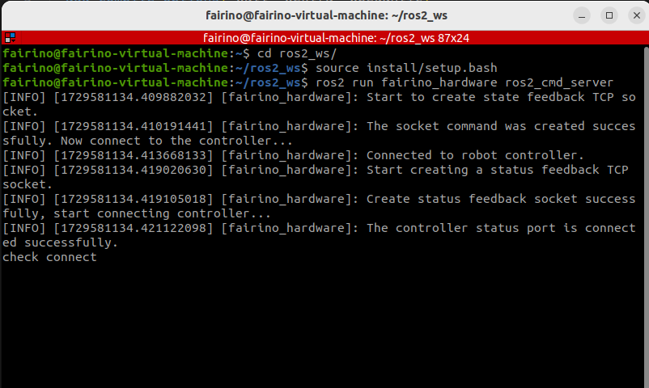
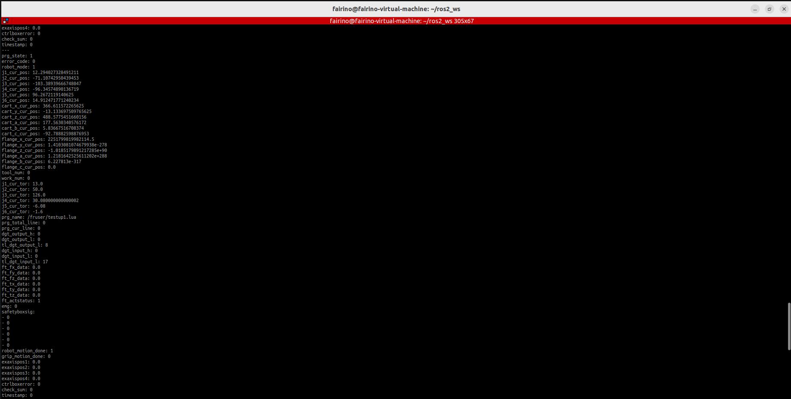

Prefazione
++++++++++
`fairino_hardware` è un'interfaccia API sviluppata da Fairino Innovation Collaborative Robot basata su ROS2, progettata per consentire agli utenti alle prime armi di utilizzare più facilmente l'SDK di Fair. Configurando i parametri predefiniti attraverso il file di configurazione dei parametri, è possibile adattarsi alle diverse esigenze dei clienti.

fairino_hardware
++++++++++++++++++++++++++++
Questo capitolo descrive come configurare l'ambiente di esecuzione dell'APP.

Installazione Ambiente Base
--------------------------------

Si consiglia di utilizzare Ubuntu 22.04 LTS (Jammy). Dopo l'installazione del sistema, è necessario installare ROS2; si raccomanda ros2-humble. L'installazione completa di ROS2 può essere consultata nel tutorial: https://docs.ros.org/en/humble/index.html.
Prima di compilare ufficialmente `fairino_hardware`, è necessario installare anche il pacchetto ufficiale `ros2_control`. L'installazione completa di `ros2_control` può essere consultata nel tutorial: https://control.ros.org/humble/index.html. L'ufficiale fornisce due metodi di installazione per `ros2_control`: installazione tramite comando e installazione tramite compilazione del codice sorgente. Poiché l'installazione tramite comando potrebbe causare un'installazione incompleta dei pacchetti, si consiglia di utilizzare il metodo di installazione tramite compilazione del codice sorgente.

Di seguito viene dettagliato il processo di installazione di ROS2 (humble):

1. Aprire una finestra shell

.. code-block:: shell
    :linenos:

    locale  # verificare UTF-8

    sudo apt update && sudo apt install locales
    sudo locale-gen en_US en_US.UTF-8
    sudo update-locale LC_ALL=en_US.UTF-8 LANG=en_US.UTF-8
    export LANG=en_US.UTF-8

    locale  # verificare le impostazioni

2. Configurare le sorgenti

.. code-block:: shell
    :linenos:
    
    sudo apt install software-properties-common
    sudo add-apt-repository universe

    sudo apt update && sudo apt install curl -y
    sudo curl -sSL https://raw.githubusercontent.com/ros/rosdistro/master/ros.key -o /usr/share/keyrings/ros-archive-keyring.gpg

    echo "deb [arch=$(dpkg --print-architecture) signed-by=/usr/share/keyrings/ros-archive-keyring.gpg] http://packages.ros.org/ros2/ubuntu $(. /etc/os-release && echo $UBUNTU_CODENAME) main" | sudo tee /etc/apt/sources.list.d/ros2.list > /dev/null

3. Installare ROS2

.. code-block:: shell
    :linenos:

    sudo apt update
    sudo apt upgrade
    sudo apt install ros-humble-desktop

4. Infine, installare gli strumenti dev

.. code-block:: shell
    :linenos:

    sudo apt install ros-dev-tools

Di seguito viene dettagliato il processo di installazione di `ros2_control`:

1. Prima, eseguire il source delle risorse ROS2

.. code-block:: shell
    :linenos:

    source /opt/ros/humble/setup.bash

2. Creare l'area di lavoro di `ros2_control`, scaricare le risorse

.. code-block:: shell
    :linenos:

    mkdir -p ~/ros2_control_ws/src
    cd ~/ros2_control_ws/
    wget https://raw.githubusercontent.com/ros-controls/ros2_control_ci/master/ros_controls.$ROS_DISTRO.repos
    vcs import src < ros_controls.$ROS_DISTRO.repos

3. Installare i pacchetti dipendenti

.. code-block:: shell
    :linenos:

    rosdep update --rosdistro=$ROS_DISTRO
    sudo apt-get update
    rosdep install --from-paths src --ignore-src -r -y

4. Compilare `ros2_control`

.. code-block:: shell
    :linenos:

    . /opt/ros/${ROS_DISTRO}/setup.sh
    colcon build --symlink-install

Compilazione e Costruzione di fairino_hardware
------------------------------------------------------------
1. Creare un'area di lavoro colcon
`fairino_hardware` è composto da due pacchetti funzionali: uno è il pacchetto di strutture dati personalizzate `fairino_msgs` e l'altro è il pacchetto principale del programma `fairino_hardware`. Dopo aver installato l'ambiente base, creare prima un'area di lavoro colcon, ad esempio:

Prima è necessario eseguire il source delle risorse ROS2 e `ros2_control`

.. code-block:: shell
    :linenos:

    source /opt/ros/humble/setup.bash
    source ~/ros2_control_ws/install/setup.bash

Quindi creare l'area di lavoro

.. code-block:: shell
    :linenos:

    cd ~/
    mkdir -p ros2_ws/src

2. Compilare i pacchetti funzionali
Copiare il codice del pacchetto di installazione nella directory `ros2_ws/src`, quindi eseguire il seguente comando nella directory `ros2_ws`:

.. code-block:: shell
    :linenos:

    source ~/ros2_control_ws/install/setup.bash

Dopo il completamento del comando, eseguire il seguente comando:

.. code-block:: shell
    :linenos:

    colcon build --packages-select fairino_msgs

Dopo aver completato la compilazione del comando precedente, utilizzare il seguente comando per compilare `fairino_hardware`:

.. code-block::  shell
    :linenos:

    colcon build --packages-select fairino_hardware

Inizio Rapido
++++++++++++++

Procedura di Avvio
-----------------------------------
In Ubuntu, aprire la riga di comando e inserire:

.. code-block::  shell
    :linenos:

    cd ros2_ws
    source install/setup.bash
    ros2 run fairino_hardware ros2_cmd_server

Procedura per Visualizzare il Feedback dello Stato del Braccio Robotico
--------------------------------------------------------------------------------
Il feedback dello stato del braccio robotico viene pubblicato tramite topic. Gli utenti possono osservare l'aggiornamento dei dati di stato tramite i comandi integrati di ROS2, oppure scrivere un programma per acquisire tali dati. Di seguito viene mostrato come osservare i dati di stato del braccio robotico tramite i comandi ROS2.

In Ubuntu, aprire la riga di comando e inserire:

.. code-block:: shell
    :linenos:

    cd ros2_ws
    source install/setup.bash
    ros2 topic echo /nonrt_state_data

Nella finestra della riga di comando si vedranno i dati di stato aggiornati continuamente, come mostrato nella figura seguente.

Procedura per Invio Comandi
--------------------------------------
In Ubuntu, aprire la riga di comando e inserire:

.. code-block:: shell
    :linenos:

    cd ros2_ws
    source install/setup.bash
    rqt

Dopo l'esecuzione del comando sopra, verrà visualizzata un'interfaccia GUI rqt, come mostrato nella figura seguente.

.. image:: img/fr_ros2_003.png
    :width: 6in
    :align: center

Nell'interfaccia GUI, selezionare plugins -> service -> service caller, per visualizzare l'interfaccia seguente. Selezionare `/fairino_remote_command_service`, inserire la stringa del comando nel campo expression, quindi fare clic su call per vedere le informazioni di risposta apparire nella finestra di dialogo sottostante.

.. image:: img/fr_ros2_004.png
    :width: 6in
    :align: center

.. important:: 

   - Regole per la stringa di input:

   Il programma filtra internamente il formato della stringa di input. Il formato di input della funzione deve essere [nome_funzione]() e la stringa dei parametri tra parentesi tonde deve essere composta solo da lettere, numeri, virgole e segni meno. La presenza di altri caratteri o spazi causerà un errore.

   - Spiegazione del valore di feedback del comando:

   Ad eccezione del comando GET che restituisce una stringa, i valori di feedback di tutte le altre funzioni sono di tipo int. Generalmente, 0 indica un errore, 1 indica un'esecuzione corretta. Se compaiono altri valori, fare riferimento al codice di errore definito nell'SDK XMLRPC corrispondente.

Procedura di Modifica dei Parametri
----------------------------------------------------
Poiché l'SDK semplificato è migliorato rispetto alle interfacce SDK native, la semplificazione è possibile grazie all'assegnazione di alcuni valori di parametri predefiniti. Tuttavia, durante l'uso effettivo, può capitare che i parametri predefiniti non soddisfino le esigenze. In questo caso, è possibile modificare i valori dei parametri predefiniti corrispondenti e poi caricarli nel nodo.

Nel file del codice sorgente esiste un file di parametri `fairino_remotecmdinterface_para.yaml`. I parametri in questo file sono parametri predefiniti impostati in anticipo, utilizzati per semplificare i parametri di input dei comandi. È possibile modificare questi parametri in base alle proprie esigenze specifiche, quindi utilizzare il comando per modificare dinamicamente i parametri: `ros2 param load fr_command_server ~/ros2_ws/src/fairino_hardware/fairino_remotecmdinterface_para.yaml`.

Descrizione API
++++++++++++++++++++++++++++++++++

.. code-block:: c++
    :linenos:

    /*
    Descrizione funzionale: Memorizza un punto di posizione articolare.
    id - Numero ID punto da memorizzare, a partire da 1. Nota: questo ID è indipendente dagli ID dei punti CARTPoint.
    double j1-j6 - Posizioni dei 6 giunti, unità in gradi.
    */
    int JNTPoint(int id, double j1, double j2, double j3, double j4, double j5, double j6)
    // Esempio
    JNTPoint(1,10,11,12,13,14,15)

    /*
    Descrizione funzionale: Memorizza un punto di posizione cartesiana.
    id - Numero ID punto da memorizzare, a partire da 1. Nota: questo ID è indipendente dagli ID dei punti JNTPoint.
    double x,y,z,rx,ry,yz - Informazioni punto cartesiano, unità posizione: mm, unità angolo: gradi.
    */
    int CARTPoint(int id, double x,y,z,rx,ry,rz) // Memorizza un punto nello spazio cartesiano.
    // Esempio
    CARTPoint(1,100,110,200,0,0,0)

    /*
    Descrizione funzionale: Ottiene le informazioni di posizione articolare o cartesiana del punto con l'ID specificato.
    string name - 'JNT' o 'CART'. JNT indica ottenere informazioni punto articolare, 'CART' indica ottenere informazioni punto cartesiano.
    int id - ID punto, a partire da 1.
    */
    string GET(string name, int id) // Ottiene il contenuto del punto corrispondente all'ID. name può essere JNT o CART.
    // Esempio
    GET(JNT,1)

    /*
    Descrizione funzionale: Interruttore modalità trascinamento.
    uint8_t state - 1- Attiva modalità trascinamento, 0- Disattiva modalità trascinamento.
    */
    int DragTeachSwitch(uint8_t state)
    // Esempio
    DragTeachSwitch(0)

    /*
    Descrizione funzionale: Interruttore abilitazione braccio robotico.
    uint8_t state - 1- Abilita braccio robotico, 0- Disabilita braccio robotico.
    */
    int RobotEnable(uint8_t state)
    // Esempio
    RobotEnable(1)

    /*
    Descrizione funzionale: Cambio modalità.
    uint8_t state - 1- Modalità manuale, 0- Modalità automatica.
    */
    int Mode(uint8_t state)
    // Esempio
    Mode(1)

    /*
    Descrizione funzionale: Imposta la velocità del braccio robotico nella modalità corrente.
    float vel - Percentuale velocità, intervallo 1-100.
    */
    int SetSpeed(float vel)
    // Esempio
    SetSpeed(10)

    /*
    Descrizione funzionale: Imposta e carica il sistema di coordinate utensile con l'ID specificato.
    int id - Numero sistema di coordinate utensile, intervallo 1-15.
    float x,y,z,rx,ry,rz - Informazioni offset del sistema di coordinate utensile.
    */
    int SetToolCoord(int id, float x,float y, float z,float rx,float ry,float rz)
    // Esempio
    SetToolCoord(1,0,0,0,0,0,0)

    /*
    Descrizione funzionale: Imposta l'elenco dei sistemi di coordinate utensile.
    int id - Numero sistema di coordinate utensile, intervallo 1-15.
    float x,y,z,rx,ry,rz - Informazioni offset del sistema di coordinate utensile.
    */
    int SetToolList(int id, float x,float y, float z,float rx,float ry,float rz );
    // Esempio
    SetToolList(1,0,0,0,0,0,0)

    /*
    Descrizione funzionale: Imposta il sistema di coordinate utensile esterno.
    int id - Numero sistema di coordinate utensile, intervallo 1-15.
    float x,y,z,rx,ry,rz - Informazioni offset del sistema di coordinate utensile esterno.
    */
    int SetExToolCoord(int id, float x,float y, float z,float rx,float ry,float rz);	
    // Esempio
    SetExToolCoord(1,0,0,0,0,0,0)

    /*
    Descrizione funzionale: Imposta l'elenco dei sistemi di coordinate utensile esterni.
    int id - Numero sistema di coordinate utensile, intervallo 1-15.
    float x,y,z,rx,ry,rz - Informazioni offset del sistema di coordinate utensile esterno.
    */
    int SetExToolList(int id, float x,float y, float z,float rx,float ry,float rz);
    // Esempio
    SetExToolList(1,0,0,0,0,0,0)

    /*
    Descrizione funzionale: Imposta il sistema di coordinate pezzo.
    int id - Numero sistema di coordinate pezzo, intervallo 1-15.
    float x,y,z,rx,ry,rz - Informazioni offset del sistema di coordinate pezzo.
    */
    int SetWObjCoord(int id, float x,float y, float z,float rx,float ry,float rz);
    // Esempio
    SetWObjCoord(1,0,0,0,0,0,0)

    /*
    Descrizione funzionale: Imposta l'elenco dei sistemi di coordinate pezzo.
    int id - Numero sistema di coordinate pezzo, intervallo 1-15.
    float x,y,z,rx,ry,rz - Informazioni offset del sistema di coordinate pezzo.
    */
    int SetWObjList(int id, float x,float y, float z,float rx,float ry,float rz);
    // Esempio
    SetWObjList(1,0,0,0,0,0,0)

    /*
    Descrizione funzionale: Imposta il peso del carico terminale.
    float weight - Peso carico, unità kg.
    */
    int SetLoadWeight(float weight);
    // Esempio
    SetLoadWeight(3.5)

    /*
    Descrizione funzionale: Imposta le coordinate del centro di massa del carico terminale.
    float x,y,z - Coordinate centro di massa, unità mm.
    */
    int SetLoadCoord(float x,float y,float z);
    // Esempio
    SetLoadCoord(10,20,30)

    /*
    Descrizione funzionale: Imposta il metodo di installazione del robot.
    uint8_t install - Metodo installazione, 0- Installazione normale, 1- Installazione laterale, 2- Installazione a soffitto.
    */
    int SetRobotInstallPos(uint8_t install);
    // Esempio
    SetRobotInstallPos(0)

    /*
    Descrizione funzionale: Imposta l'angolo di installazione del robot, installazione libera.
    double yangle - Angolo di inclinazione.
    double zangle - Angolo di rotazione.
    */
    int SetRobotInstallAngle(double yangle,double zangle);
    // Esempio
    SetRobotInstallAngle(90,0)

    // Configurazione Sicurezza
    /*
    Descrizione funzionale: Imposta il livello di collisione del robot.
    float level1-level6 - Livello di collisione per gli assi 1-6, intervallo 1-10.
    */
    int SetAnticollision(float level1, float level2, float level3, float level4, float level5, folat level6);
    // Esempio
    SetAnticollision(1,1,1,1,1,1)

    /*
	 * @brief  Imposta la strategia dopo collisione.
	 * @param  [in] strategy  0- Segnala errore e arresta, 1- Continua esecuzione.
	 * @param  [in] safeTime  Tempo di arresto sicuro [1000 - 2000] ms.
	 * @param  [in] safeDistance  Distanza di arresto sicuro [1-150] mm.
	 * @param  [in] safeVel  Velocità sicura [50-250] mm/s.
	 * @param  [in] safetyMargin  Coefficiente di sicurezza j1-j6 [1-10].
	 * @return  Codice errore.
    */
	int SetCollisionStrategy(int strategy, int safeTime, int safeDistance, int safeVel, int safetyMargin[])
    // Esempio
    SetCollisionStrategy(1)

    /*
	 * @brief Imposta il metodo di rilevamento collisione del robot.
	 * @param [in] method Metodo rilevamento collisione: 0- Modalità corrente; 1- Doppio encoder; 2- Corrente e doppio encoder attivati contemporaneamente.
     * @param [in] thresholdMode Metodo soglia livello collisione; 0- Metodo soglia fissa livello collisione; 1- Soglia di rilevamento collisione personalizzata.
	 * @return  Codice errore.
    */
	int SetCollisionDetectionMethod(int method, int thresholdMode);
    // Esempio
    SetCollisionDetectionMethod(0,0)

    /*
	 * @brief Imposta l'inizio/chiusura del rilevamento collisione statico.
	 * @param  [in] status 0- Disattiva; 1- Attiva.
	 * @return  Codice errore.
    */
	int SetStaticCollisionOnOff(int status);
    // Esempio
    SetStaticCollisionOnOff(1)

    /*
	 * @brief Rilevamento coppia/potenza giunto.
	 * @param  [in] status 0- Disattiva; 1- Attiva.
	 * @param  [in] power  Potenza massima impostata (W);
	 * @return  Codice errore.
    */
	int SetPowerLimit(int status, double power);
    // Esempio
    SetPowerLimit(1,100)

    /*
	 * @brief  Configura sensore di forza.
	 * @param  [in] company  Produttore sensore di forza, 17- Kunwei Technology, 19- Aerospace 11th Academy, 20- Sensore ATI, 21- Zhongke Midian, 22- Weihang Minxin, 23- NBIT, 24- Xincheng (XJC), 26- NSR.
	 * @param  [in] device  Numero dispositivo, Kunwei (0-KWR75B), Aerospace 11th Academy (0-MCS6A-200-4), ATI (0-AXIA80-M8), Zhongke Midian (0-MST2010), Weihang Minxin (0-WHC6L-YB-10A), NBIT (0-XLH93003ACS), Xincheng XJC (0-XJC-6F-D82), NSR (0-NSR-FTSensorA).
	 * @param  [in] softvesion  Numero versione software, attualmente non utilizzato, default 0.
	 * @param  [in] bus  Posizione bus terminale dispositivo, attualmente non utilizzato, default 0.
	 * @return  Codice errore.
    */
	int FT_SetConfig(int company, int device, int softvesion, int bus);
    // Esempio
    FT_SetConfig(0,1,0,0)

    /*
	 * @brief  Ottiene configurazione sensore di forza.
	 * @param  [out] company  Produttore sensore di forza, da definire.
	 * @param  [out] device  Numero dispositivo, attualmente non utilizzato, default 0.
	 * @param  [out] softvesion  Numero versione software, attualmente non utilizzato, default 0.
	 * @param  [out] bus  Posizione bus terminale dispositivo, attualmente non utilizzato, default 0.
	 * @return  Codice errore.
    */
	int FT_GetConfig(int *company, int *device, int *softvesion, int *bus);
    // Esempio
    FT_GetConfig()

    /*
	 * @brief  Attiva sensore di forza.
	 * @param  [in] act  0- Reset, 1- Attiva.
	 * @return  Codice errore.
    */
	int FT_Activate(uint8_t act);
    // Esempio
    FT_Activate(1)

    /*
	 * @brief  Taratura zero sensore di forza.
	 * @param  [in] act  0- Rimuovi zero, 1- Calibrazione zero.
	 * @return  Codice errore.
    */
	int FT_SetZero(uint8_t act);
    // Esempio
    FT_SetZero(1)

    /*
	 * @brief  Guardia collisione.
	 * @param  [in] flag 0- Disattiva guardia collisione, 1- Attiva guardia collisione.
	 * @param  [in] sensor_id Numero sensore di forza.
	 * @param  [in] select  Seleziona quali 6 gradi di libertà rilevare per collisione, 0- Non rilevare, 1- Rileva.
	 * @param  [in] ft  Forza/Coppia collisione, fx,fy,fz,tx,ty,tz.
	 * @param  [in] max_threshold  Soglia massima.
	 * @param  [in] min_threshold  Soglia minima.
	 * @note   Intervallo di rilevamento forza/coppia: (ft-min_threshold, ft+max_threshold)
	 * @return  Codice errore.
    */
	int FT_Guard(uint8_t flag, int sensor_id, uint8_t select[6], ForceTorque *ft, float max_threshold[6], float min_threshold[6]);
    // Esempio
    FT_Guard(1,1,0,0,1,0,0,0,0,0,100,0,0,0,0,0,200,0,0,0,0,0,50,0,0,0)

    /*
	 * @brief  Controllo forza costante.
	 * @param  [in] flag 0- Disattiva controllo forza costante, 1- Attiva controllo forza costante.
	 * @param  [in] sensor_id Numero sensore di forza.
	 * @param  [in] select  Seleziona quali 6 gradi di libertà rilevare per collisione, 0- Non rilevare, 1- Rileva.
	 * @param  [in] ft  Forza/Coppia collisione, fx,fy,fz,tx,ty,tz.
	 * @param  [in] ft_pid Parametri PID forza, parametri PID coppia.
	 * @param  [in] adj_sign Controllo avvio/arresto adattativo, 0- Disattiva, 1- Attiva.
	 * @param  [in] ILC_sign Controllo avvio/arresto ILC, 0- Arresta, 1- Addestra, 2- Operativo.
	 * @param  [in] max_dis Distanza massima aggiustamento, unità mm.
	 * @param  [in] max_ang Angolo massimo aggiustamento, unità gradi.
	 * @param  [in] filter_Sign Segnale attivazione filtro 0- Disattiva; 1- Attiva, default disattivato.
     * @param  [in] posAdapt_sign Segnale attivazione adattamento posa 0- Disattiva; 1- Attiva, default disattivato.
     * @param  [in] isNoBlock Segnale blocco, 0- Bloccante; 1- Non bloccante.
	 * @return  Codice errore.
    */
	int FT_Control(uint8_t flag, int sensor_id, uint8_t select[6], ForceTorque *ft, float ft_pid[6], uint8_t adj_sign, uint8_t ILC_sign, float max_dis, float max_ang, int filter_Sign = 0, int posAdapt_sign = 0, int isNoBlock = 0);
    // Esempio
    FT_Control(1,1,0,0,1,0,0,0,0,0,-10,0,0,0,0.0005,0,0,0,0,0,0,0,100,10,0,0,0) 

    /*
	 * @brief  Avvia controllo adattativo.
	 * @param  [in] p Coefficiente regolazione posizione o coefficiente adattativo.
	 * @param  [in] force Soglia forza per avvio controllo adattativo, unità N.
	 * @return  Codice errore.
    */
	int FT_ComplianceStart(float p, float force);
    // Esempio
    FT_ComplianceStart(0.005,20)

    /**
	 * @brief  Arresta controllo adattativo.
	 * @return  Codice errore.
    */
	int FT_ComplianceStop();
    // Esempio
    FT_ComplianceStop()

    /*
    Descrizione funzionale: Imposta limite positivo. Nota: il valore impostato deve essere compreso nell'intervallo del limite fisico.
    float limit1-limit6 - Valori limite per i 6 giunti.
    */
    int SetLimitPositive(float limit1, float limit2, float limit3, float limit4, float limit5, float limit6);
    // Esempio
    SetLimitPositve(100,90,90,90,90,90)

    /*
    Descrizione funzionale: Imposta limite negativo. Nota: il valore impostato deve essere compreso nell'intervallo del limite fisico.
    float limit1-limit6 - Valori limite per i 6 giunti.
    */
    int SetLimitNegative(float limit1, float limit2, float limit3, float limit4, float limit5, float limit6);
    // Esempio
    SetLimitNegative(-100,-90,-90,-90,-90,-90)

    /*
    Descrizione funzionale: Cancella stato errore.
    */
    int ResetAllError();

    /*
    Descrizione funzionale: Interruttore compensazione attrito giunto.
    uint8_t state - 0- Disattiva, 1- Attiva.
    */
    int FrictionCompensationOnOff(uint8_t state);
    // Esempio
    FrictionCompensationOnOff(1)

    /*
    Descrizione funzionale: Imposta coefficienti compensazione attrito giunto - installazione normale.
    float coeff1-coeff6 - Coefficienti compensazione per i 6 giunti, intervallo 0-1.
    */
    int SetFrictionValue_level(float coeff1,float coeff1,float coeff3,float coeff4,float coeff5,float coeff6);
    // Esempio
    SetFrictionValue_level(1,1,1,1,1,1)

    /*
    Descrizione funzionale: Imposta coefficienti compensazione attrito giunto - installazione laterale.
    float coeff1-coeff6 - Coefficienti compensazione per i 6 giunti, intervallo 0-1.
    */
    int SetFrictionValue_wall(float coeff1,float coeff1,float coeff3,float coeff4,float coeff5,float coeff6);
    // Esempio
    SetFrictionValue_wall(0.5,0.5,0.5,0.5,0.5,0.5)

    /*
    Descrizione funzionale: Imposta coefficienti compensazione attrito giunto - installazione a soffitto.
    float coeff1-coeff6 - Coefficienti compensazione per i 6 giunti, intervallo 0-1.
    */
    int SetFrictionValue_ceiling(float coeff1,float coeff1,float coeff3,float coeff4,float coeff5,float coeff6);
    // Esempio
    SetFrictionValue_ceiling(0.5,0.5,0.5,0.5,0.5,0.5)

    // Controllo Periferiche
    /*
    Descrizione funzionale: Attiva pinza.
    int index - Numero pinza.
    uint8_t act - 0- Reset, 1- Attiva.
    */
    int ActGripper(int index,uint8_t act);
    // Esempio
    ActGripper(1,1)

    /*
    Descrizione funzionale: Controlla pinza.
    int index - Numero pinza.
    int pos - Percentuale posizione, intervallo 0-100.
    */
    int MoveGripper(int index,int pos);
    // Esempio
    MoveGripper(1,10)

    // Controllo I/O
    /*
    Descrizione funzionale: Imposta uscita digitale pannello di controllo.
    int id - Numero I/O, intervallo 0-15.
    uint_t status - 0- Disattiva, 1- Attiva.
    */
    int SetDO(int id,uint8_t status);
    // Esempio
    SetDO(1,1)

    /*
    Descrizione funzionale: Imposta uscita digitale utensile.
    int id - Numero I/O, intervallo 0-1.
    uint_t status - 0- Disattiva, 1- Attiva.
    */
    int SetToolDO(int id,uint8_t status);
    // Esempio
    SetToolDO(0,1)

    /*
    Descrizione funzionale: Imposta uscita analogica pannello di controllo.
    int id - Numero I/O, intervallo 0-1.
    float vlaue - Percentuale valore corrente o tensione, intervallo 0-100.
    */
    int SetAO(int id,float value);
    // Esempio
    SetAO(1,100)

    /*
    Descrizione funzionale: Imposta uscita analogica utensile.
    int id - Numero I/O, intervallo 0.
    float vlaue - Percentuale valore corrente o tensione, intervallo 0-100.
    */
    int SetToolAO(int id,float value);
    // Esempio
    SetToolAO(0,100)

    // Comandi Movimento
    /*
    Descrizione funzionale: Jog robot.
    uint8_t ref - 0- Jog articolare, 2- Jog sistema coordinate base, 4- Jog sistema coordinate utensile, 8- Jog sistema coordinate pezzo.
    uint8_t nb - 1- Giunto 1 (o asse x),2- Giunto 2 (o asse y),3- Giunto 3 (o asse z),4- Giunto 4 (o rotazione attorno asse x),5- Giunto 5 (o rotazione attorno asse y),6- Giunto 6 (o rotazione attorno asse z).
    uint8_t dir - 0- Direzione negativa, 1- Direzione positiva.
    float vel - Percentuale velocità, intervallo 0-100.
    */
    int StartJOG(uint8_t ref, uin8_t nb, uint8_t dir, float vel);
    // Esempio
    StartJOG(1,1,1,10)

    /*
    Descrizione funzionale: Arresta jog robot.
    uint8_t ref - 0- Arresta jog articolare, 2- Arresta jog sistema coordinate base, 4- Arresta jog sistema coordinate utensile, 8- Arresta jog sistema coordinate pezzo.
    */
    int StopJOG(uint8_t ref);
    // Esempio
    StopJOG(1)

    /*
    Descrizione funzionale: Arresta immediatamente jog robot.
    */
    int ImmStopJOG();

    /*
    Descrizione funzionale: Movimento spazio giunti.
    string point_name - Nome punto pre-memorizzato, ad esempio JNT1 indica il punto con ID 1 delle informazioni punto articolare, CART1 indica il punto con ID 1 delle informazioni punto cartesiano. L'istruzione MoveJ supporta l'input di punti articolari o punti cartesiani. Da notare: poiché i parametri predefiniti dell'istruzione MoveJ specificano il sistema di coordinate utensile e pezzo, se il numero di questi sistemi di coordinate non corrisponde a quello attualmente caricato, l'istruzione causerà un errore. È necessario modificare i parametri del sistema di coordinate nei parametri predefiniti, caricare i parametri, quindi eseguire il comando di movimento.
    float vel - Percentuale velocità comando, intervallo 0-100.
    int tool - Numero sistema di coordinate utensile.
    int user - Numero sistema di coordinate pezzo.
    double expos1 - Posizione asse esterno 1.
    double expos2 - Posizione asse esterno 2.
    double expos3 - Posizione asse esterno 3.
    double expos4 - Posizione asse esterno 4.
    */
    int MoveJ(string point_name, float vel,int tool, int user,double expos1,double expos2,double expos3,double expos4); // point_name è l'input delle informazioni punto pre-memorizzate.
    // Esempio
    MoveJ(JNT1,10,1,1,0,0,0,0)

    /*
    Descrizione funzionale: Movimento lineare spazio cartesiano.
    string point_name - Nome punto pre-memorizzato, ad esempio JNT1 indica il punto con ID 1 delle informazioni punto articolare, CART1 indica il punto con ID 1 delle informazioni punto cartesiano. L'istruzione MoveL supporta l'input di punti articolari o punti cartesiani. Da notare: poiché i parametri predefiniti dell'istruzione MoveL specificano il sistema di coordinate utensile e pezzo, se il numero di questi sistemi di coordinate non corrisponde a quello attualmente caricato, l'istruzione causerà un errore. È necessario modificare i parametri del sistema di coordinate nei parametri predefiniti, caricare i parametri, quindi eseguire il comando di movimento.
    float vel - Percentuale velocità comando, intervallo 0-100.
    int tool - Numero sistema di coordinate utensile.
    int user - Numero sistema di coordinate pezzo.
    double expos1 - Posizione asse esterno 1.
    double expos2 - Posizione asse esterno 2.
    double expos3 - Posizione asse esterno 3.
    double expos4 - Posizione asse esterno 4.
    */
    int MoveL(string point_name,float vel,int tool,int user,double expos1,double expos2,double expos3,double expos4);
    // Esempio
    MoveL(CART1,10,1,1,0,0,0,0)

    /*
    Descrizione funzionale: Movimento circolare spazio cartesiano.
    string point1_name point2_name - Nomi punti pre-memorizzati, ad esempio JNT1 indica il punto con ID 1 delle informazioni punto articolare, CART1 indica il punto con ID 1 delle informazioni punto cartesiano. L'istruzione MoveC supporta l'input di punti articolari o punti cartesiani, ma entrambi i punti devono essere dello stesso tipo, ovvero non è supportato l'input di un punto articolare per il primo punto e un punto cartesiano per il secondo. Da notare: poiché i parametri predefiniti dell'istruzione MoveC specificano il sistema di coordinate utensile e pezzo, se il numero di questi sistemi di coordinate non corrisponde a quello attualmente caricato, l'istruzione causerà un errore. È necessario modificare i parametri del sistema di coordinate nei parametri predefiniti, caricare i parametri, quindi eseguire il comando di movimento.
    float vel - Percentuale velocità comando, intervallo 0-100.
    int tool - Numero sistema di coordinate utensile.
    int user - Numero sistema di coordinate pezzo.
    double expos1 - Posizione asse esterno 1 per punto1.
    double expos2 - Posizione asse esterno 2 per punto1.
    double expos3 - Posizione asse esterno 3 per punto1.
    double expos4 - Posizione asse esterno 4 per punto1.
    double expos1 - Posizione asse esterno 1 per punto2.
    double expos2 - Posizione asse esterno 2 per punto2.
    double expos3 - Posizione asse esterno 3 per punto2.
    double expos4 - Posizione asse esterno 4 per punto2.
    */
    int MoveC(string point1_name,string point2_name, float vel, int tool,int user,double expos1,double expos2,double expos3,double expos4,double expos1,double expos2,double expos3,double expos4);
    // Esempio
    MoveC(JNT1,JNT2,10,1,1,0,0,0,0,0,0,0,0)

    /*
    Descrizione funzionale: Inizia movimento spline.
    */
    int SplineStart();

    /*
    Descrizione funzionale: Movimento spline spazio giunti. Questa istruzione supporta solo l'input di dati articolari come JNT1; l'input di punti cartesiani causerà errore.
    string point_name - Nome punto pre-memorizzato, ad esempio JNT1 indica il punto con ID 1 delle informazioni punto articolare.
    float vel - Percentuale velocità, intervallo 0-100.
    */
    int SplinePTP(string point_name, float vel);
    // Esempio
    SplinePTP(JNT2,10)

    /*
    Descrizione funzionale: Termina movimento spline.
    */
    int SplineEnd();

    /*
    Descrizione funzionale: Inizia movimento spline spazio cartesiano.
    uint8_t ctlpoint - 0- La traiettoria passa attraverso i punti via, 1- La traiettoria non passa attraverso i punti di controllo, almeno 4 punti.
    */
    int NewSplineStart(uint8_t ctlpoint);
    // Esempio
    NewSplineStrart(1)

    /*
    Descrizione funzionale: Movimento spline spazio cartesiano. Supporta solo l'input di punti spazio cartesiano come CART1; l'input di punti spazio giunti causerà errore.
    string point_name - Nome punto pre-memorizzato, ad esempio CART1 indica il punto con ID 1 delle informazioni punto spazio cartesiano.
    float vel - Percentuale velocità, intervallo 0-100.
    int lastflag - 0- Non è l'ultimo punto, 1- È l'ultimo punto.
    */
    int NewSplinePoint(string point_name, float vel, int lastflag);
    // Esempio
    NewSplinePoint(JNT2,20,0)

    /*
    Descrizione funzionale: Termina movimento spline spazio cartesiano.
    */
    int NewSplineEnd();

    /*
    Descrizione funzionale: Arresta movimento.
    */
    int StopMotion();

    /*
    Descrizione funzionale: Abilita offset globale punti.
    int flag - 0- Offset nel sistema coordinate base/pezzo, 2- Offset nel sistema coordinate utensile.
    double x,y,z,rx,ry,rz - Quantità offset posa.
    */
    int PointsOffsetEnable(int flag,double x,double y,double z,double rx,double ry,double rz);
    // Esempio
    PointsOffsetEnable(1,10,10,10,0,0,0)

    /*
    Descrizione funzionale: Disabilita offset globale punti.
    */
    int PointsOffsetDisable();