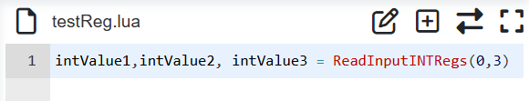
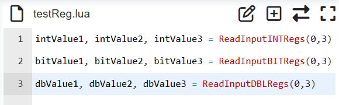

Robot input and output register
======================================

The CNDE client and robot can exchange data through input and output registers, which specifically includes two processes:

①The input configuration of CNDE client includes the input register, and the input register value is modified when data is input. The input register value modified by CNDE client can be read by adding the command of reading the input register in the robot LUA program.

②Add the command of writing output register into the robot LUA program, execute the LUA program to write the numerical value into the output register, and the output configuration of the CNDE client includes the output register to start the feedback of the CNDE status of the robot, so that the client can read the numerical value of the output register written in the LUA program after receiving the CNDE output data.

Read input register
~~~~~~~~~~~~~~~~~~~~~~~

Open the WebApp, click "Program" and "Coding" in turn to create a new user program "testReg.lua".

.. image:: cnde/012.png
   :width: 6in
   :align: center

.. centered:: Figure 4-1 New "testReg.lua" program

Click "Var", select "Input register variable reading" in the command addition box on the right, select variable type as "int", register start index as 0, and number of register as 3, and click "Add" and "Apply" buttons.

.. image:: cnde/013.png
   :width: 6in
   :align: center

.. centered:: Figure 4-2 Adding a Read Input Register command

At this time, an command to read the "int" input register has been added in "testReg.lua".

.. image:: cnde/014.png
   :width: 6in
   :align: center

.. centered:: Figure 4-3 Command Addition for Reading "int" Type Input Register

Click the switch mode button to switch to the program editable mode, and add three lua program variables before reading the input register command to receive the read three input register values.

.. centered:: Figure 4-4 Adding Reading Input Register Value

In the same way, you can add "bit" and "double" register data reading respectively.

.. centered:: Figure 4-5 Add "bit" and "double" input register to read

Save the above program, switch the robot to automatic mode, execute the program, and the input register value will be read into the lua program variable.

Write output register
~~~~~~~~~~~~~~~~~~~~~~

Open the WebApp, click "Program" and "Coding" in turn to create a new user program "testReg.lua".

.. image:: cnde/017.png
   :width: 6in
   :align: center

.. centered:: Figure 4-6 New "testReg.lua" program

Click "Var", select "Output Register Variable write " in the command add box on the right, select variable type as "int", register start index as 0, number of registers as 2 and register value as "18,55", and click "Add" button; Select "Output register variable read" again, select variable type as "int", register start index as 0 and number of register as 2, and click "Add" and "Apply" buttons.

.. image:: cnde/018.png
   :width: 6in
   :align: center

.. centered:: Figure 4-7 Add Read-Write Output Register command

At this time, the "int" output register writing and reading commands have been added in "testReg.lua".

.. image:: cnde/019.png
   :width: 6in
   :align: center

.. centered:: Figure 4-8 Addition of Write and Read commands for "INT" Type Output Register

Click the switch mode button to switch to the program editable mode, and add two lua program variables before reading the output register command to receive the read two output register values.

.. image:: cnde/020.png
   :width: 6in
   :align: center

.. centered:: Figure 4-9 Adding Reading Input Register Value

Save the above program, switch the robot to automatic mode and execute the program. At this time, the values of LUA program variables "intValue1" and "intValue2" are 18 and 55 respectively. The operation of "bit" and "double" registers is the same as that of "int" registers.

CNDE input,output register interactive application
~~~~~~~~~~~~~~~~~~~~~~~~~~~~~~~~~~~~~~~~~~~~~~~~~~~~~~~~

.. image:: cnde/021.png
   :width: 4in
   :align: center

.. centered:: Figure 4-10 Data interaction between input and output registers

Data interaction scenarios between the robot and the CNDE client through input and output registers include but are not limited to the following types:

①Input register to control robot movement; The CNDE client plans the robot target position and writes the robot target position into the input register; Read the input register value in the robot LUA program to obtain the robot target position, and then control the robot to move to the target position through PTP, LIN, ServoJ and other motion commands. The LUA example program is as follows:

.. code-block:: lua
    :linenos:

    i = 0;
    oldFlag = 0
    while(1) do
        startFlag = ReadInputINTRegs(0,1)
        if(startFlag ~= oldFlag) then
        oldFlag = startFlag
        x, y, z, a, b, c = ReadInputDBLRegs(0,6)
        ServoJ({x, y, z, a, b, c}, {0, 0, 0, 0}, 10, 10, 0.008, 0, 0)
        end	
    end

②The CNDE client writes different values to an input register, and then controls the robot to perform different actions. The robot LUA program cycles to obtain the corresponding input register values, and performs different actions according to the different register values. The example program is as follows:

.. code-block:: lua
    :linenos:

    runFlag = ReadInputINTRegs(0,1)
    while(runFlag > 0) do
        motion,target = ReadInputINTRegs(1,2)
        if(motion > 0) then
            if(target == 1)then 
                Lin(a1,100,-1,0,0)
            else if(target == 2) then
                Lin(a2,100,-1,0,0)
            else
                Lin(safety,100,-1,0,0)
            end
            end
        else
            sleep_ms(100)
        end
    end

③The robot writes the current program status to the output register during operation, and the CNDE client realizes the monitoring of the robot program operation by reading the output register status. The example program is as follows:

.. code-block:: lua
    :linenos:

    local weldCount = 0
    runFlag = ReadInputINTRegs(0,1)
    while(runFlag > 0) do
        Lin(safety,100,-1,0,0)
        Lin(a1,100,-1,0,0)
        ARCStart(0, 0, 3000)
        Lin(a2,100,-1,0,0)
        ARCEnd(0, 0, 3000)
        runFlag = ReadInputINTRegs(0,1)
        weldCount = weldCount + 1
        WriteOutputINTRegs(0,1,{weldCount})
    end