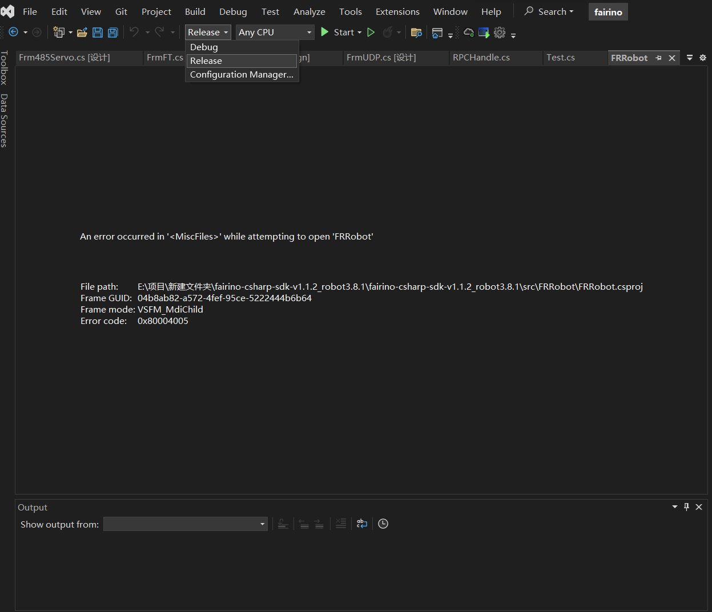
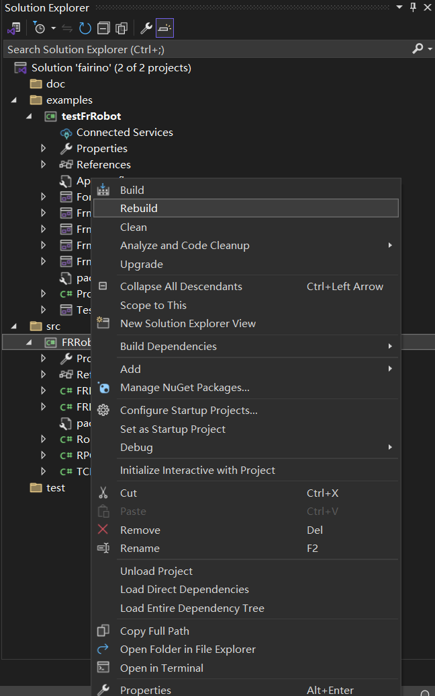
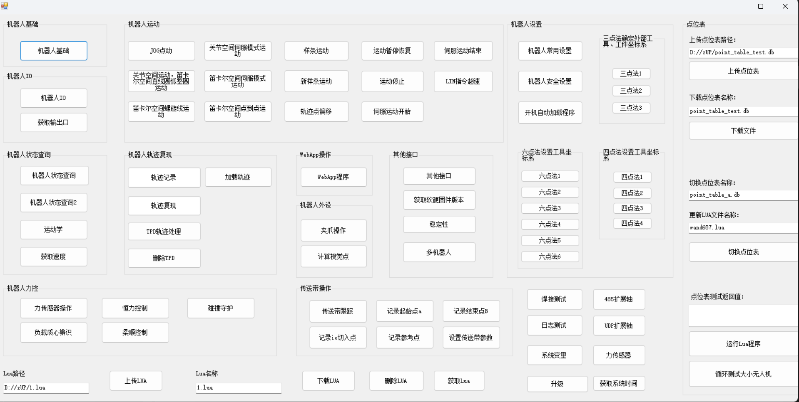

Appendix
=================

.. toctree:: 
    :maxdepth: 5

Source Code Download
------------------------------------------------
Find the "Downloads" section in the FAIRINO documentation (https://fairino-doc-en.readthedocs.io/latest/), click the "C# SDK" button, and then click "FAIRINO C# SDK" on the right-hand page. Wait for the browser to complete the download.

.. image:: image/001.png
   :width: 6in
   :align: center

.. centered:: Figure 15.1‑1 C# SDK Source Code Download
    
Download and extract the C# SDK. The project directory is shown below. The "examples" folder contains test samples, the "src" folder contains the C# SDK, and "Fairino.sln" is the project solution file. "Dlls" contains library files.

.. image:: image/010.png
   :width: 6in
   :align: center

.. centered:: Figure 15.1‑2 C# SDK File Structure Example

Locate the solution file named "fairino.sln" and double-click to open it. The file structure is shown below.

.. image:: image/011.png
   :width: 6in
   :align: center

.. centered:: Figure 15.1‑3 Project File Structure Example in Visual Studio 2022

Windows Platform Source Code Compilation
-----------------------------------------------------

C# SDK Compilation
~~~~~~~~~~~~~~~~~~~~~~~~~~~~~~~~~~~~~~~~~~~~
Right-click the FRRobot project, select Properties, and choose the .NET framework version.

.. image:: image/012.png
   :width: 6in
   :align: center

.. centered:: Figure 15.2‑1 Setting Properties

.. image:: image/013.png
   :width: 6in
   :align: center

.. centered:: Figure 15.2‑2 Selecting .NET Framework

.. centered:: Figure 15.2‑3 Building FRRobot Project in Release Mode

Switch Visual Studio 2022 to Release mode and rebuild the FRRobot project. The DLL dynamic link library will be generated in the \bin\Release folder.

.. centered:: Figure 15.2‑4 Setting Release Mode

.. image:: image/016.png
   :width: 6in
   :align: center

.. centered:: Figure 15.2‑5 Rebuilding FRRobot Project in Release Mode

.. image:: image/016.png
   :width: 6in
   :align: center

.. centered:: Figure 15.2‑6 Generating DLL Dynamic Link Library

C# SDK Usage
~~~~~~~~~~~~~~~~~~~~~~~~~~~~~~~~~~~~~~~~~~~~~
Right-click the testFrRobot project and set it as the startup project.

.. image:: image/017.png
   :width: 6in
   :align: center

.. centered:: Figure 15.2‑7 Setting as Startup Project
 
The C# SDK test interface is shown below.

.. centered:: Figure 15.2‑8 C# SDK Test Interface

Notes
---------------------------------------

Potential Issues
~~~~~~~~~~~~~~~~~~~~~~~~~~~~~~~~~~~~~~~~~~~~~~~~~~

Handling No Effect After Code Updates
+++++++++++++++++++++++++++++++++++++++++++++++++++++++++++
If the project still executes old code after rewriting and restarting, consider the following steps:

Rebuild the project: Follow the instructions in step 3.2 to rebuild or update the project configuration and files.

Error Codes
+++++++++++++++++++++++++++++++++++++++++++++++++++++++++++
A return value of 0 indicates normal operation. If the return value is not 0, refer to the error code table.