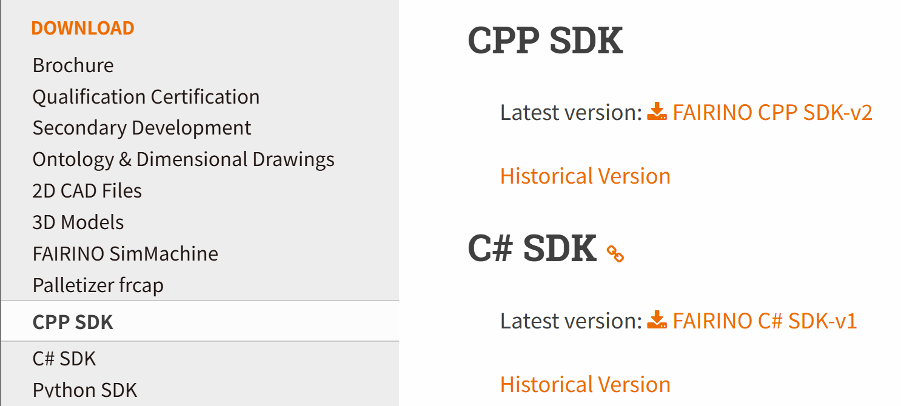
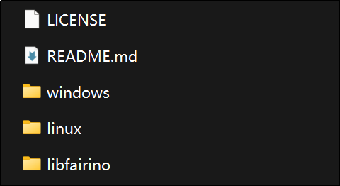
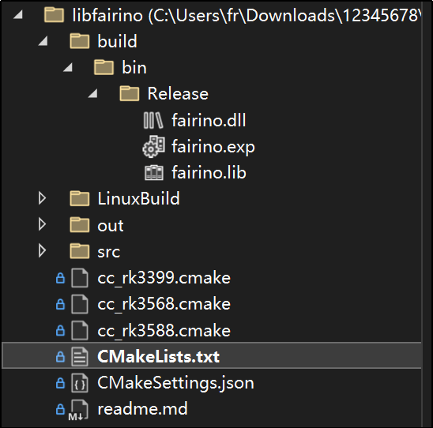

Appendix
=================

.. toctree:: 
    :maxdepth: 5

Source Code Download
------------------------------------------------

On the Fairino documentation site (https://fairino-doc-en.readthedocs.io/latest/), locate the "Resources Download" section, click the "CPP SDK" button, then click "FAIRINO CPP SDK" on the right page and wait for the browser to complete the download.

.. centered:: Figure 15.1‑1 C++SDK Source Code Download

After extracting the package, the directory structure is as shown below, including:

- windows: Header files and library files (.lib and .dll) compiled for common environments like VS2015~VS2019, including both Debug and Release modes
- linux: Header files and library files (.so) for common environments like gcc, rk3399, rk3568
- libfairino: C++SDK source code

.. centered:: Figure 15.1‑2 C++SDK Source Directory

Windows Platform Compilation
------------------------------------------------
① Open Visual Studio, click "Continue without code" at bottom right;

.. image:: image/003.png
   :width: 6in
   :align: center

.. centered:: Figure 15.2‑1 Opening Visual Studio

② Navigate to "File" → "Open" → "CMake", select the "CMakeLists.txt" file from the downloaded C++SDK source code (\libfairino\CMakeLists.txt). Visual Studio will automatically load the project based on CMakeLists.txt definitions.

.. image:: image/004.png
   :width: 6in
   :align: center

.. centered:: Figure 15.2‑2 Opening CMake Project

③ Select build platform ("x64-Debug" or "x64-Release" etc.) and set startup item to "fairino.dll".

.. image:: image/005.png
   :width: 6in
   :align: center

.. centered:: Figure 15.2‑3 Selecting Startup Item

④ Navigate to "Build" → "Rebuild fairino.dll" in the menu bar to start compilation.

.. image:: image/006.png
   :width: 6in
   :align: center

.. centered:: Figure 15.2‑4 Building fairino.dll

⑤ Locate the compiled fairino.dll and fairino.lib files in the "build" folder under project directory.

.. centered:: Figure 15.2‑5 Locating fairino.lib and fairino.dll

⑥ To use the C++SDK: First copy the three header files ("robot.h", "robot_error.h", "robot_type.h") from \libfairino\src\include\Robot-CN\ to your project directory. Add fairino.lib to link libraries, then place fairino.dll in the executable directory.

Linux Platform Compilation
------------------------------------------------

Before compiling on Linux, ensure gcc, g++ compilers and cmake build system (v3.10+) are installed.

The "buildGcc.sh" script in \libfairino\linuxBuild\ contains commands for: "cmake..", "make", and copying final header/library files to \linuxBuild\. Execute this script to compile the C++SDK.

① Open terminal, navigate to \libfairino\linuxBuild\, execute: "sh buildGcc.sh" and wait for completion.

.. image:: image/008.png
   :width: 6in
   :align: center

.. centered:: Figure 15.3‑1 Executing Build Script

② After compilation, the \include\ and \lib\ directories under \libfairino\linuxBuild\ will contain required header and library files.

.. image:: image/009.png
   :width: 6in
   :align: center

.. centered:: Figure 15.3‑2 Compilation Results