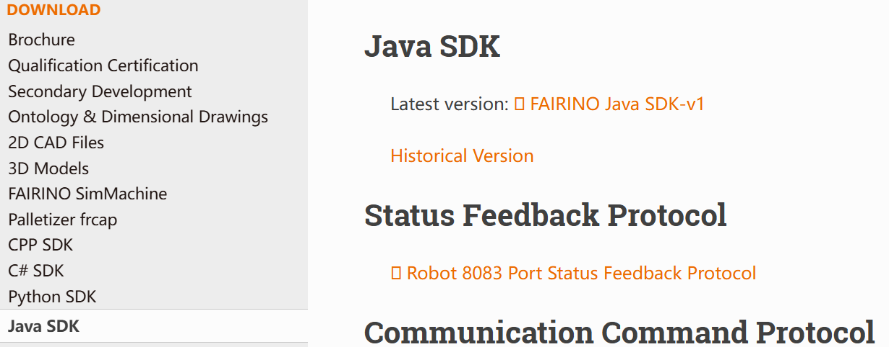

Appendix
=================

.. toctree:: 
    :maxdepth: 5

Source Code Download
------------------------------------------------

Find the "Downloads" section in the FAIRINO documentation (https://fairino-doc-en.readthedocs.io/latest/), click the "Java SDK" button, and then click "FAIRINO Java SDK" on the right-hand page. Wait for the browser to complete the download.

.. centered:: Figure 16.1‑1 Java SDK Source Code Download

Extract the compressed package. The file directory is as shown in the figure, which includes:

fairino_Java_SDK_maven: Source code (.java) and library files (.jar) compiled in a Windows system environment.

.. image:: image/020.png
   :width: 4in
   :align: center

.. centered:: Figure 16.1‑2 Java SDK File Directory

Enter the fairino_Java_SDK_maven folder, which contains the following directories:

- lib: Dependency JAR files used in the source code;
- src: Java SDK source code files;
- target: Library files (.jar) generated from the Java SDK source code;

.. image:: image/021.png
   :width: 6in
   :align: center

.. centered:: Figure 16.1‑3 Java SDK Source Code and Library File Directory

Windows Platform Source Code Compilation
-------------------------------------------------------------
① Install and configure the build tool—Maven

Maven download and installation website: Welcome to Apache Maven – Maven

After installation and configuration, the terminal will display the following information when you enter `maven --version`:

.. image:: image/022.png
   :width: 6in
   :align: center

.. centered:: Figure 16.2‑1 Maven Installation and Configuration

② Open a terminal in the Java SDK source code directory and enter `mvn package` to generate the library files (.jar).

.. image:: image/023.png
   :width: 6in
   :align: center

.. centered:: Figure 16.2‑2 Compiling Java SDK into Library Files
 
③ Locate the "target" folder in the source code directory and find the compiled `fairino-jar-with-dependencies.jar` and `fairino.jar` files, as shown in the figure.

.. image:: image/024.png
   :width: 6in
   :align: center

.. centered:: Figure 16.2‑3 Generated JAR Files

④ To use the collaborative robot Java SDK, first open the project in IntelliJ IDEA, then navigate to File -> Project Structure -> Libraries, and add the .jar files generated in the previous step. Use `import fairino.*;` in your files to utilize the generated .jar files.