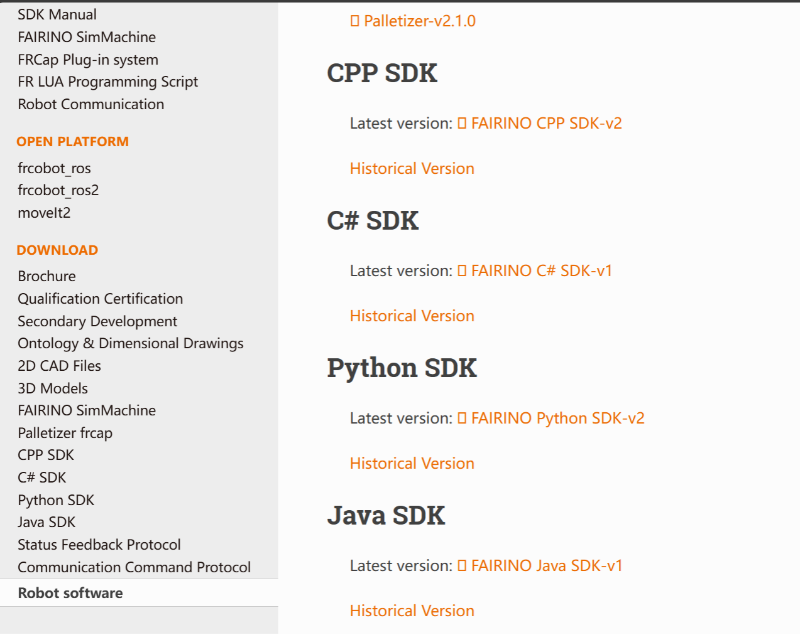
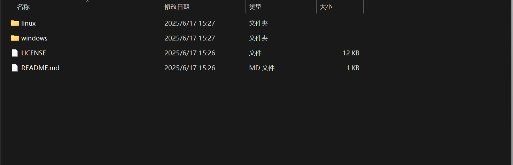
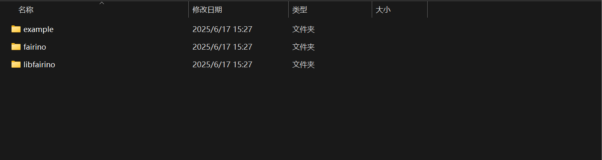
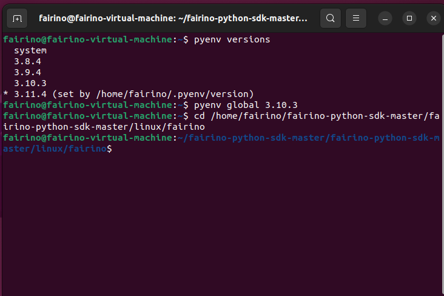
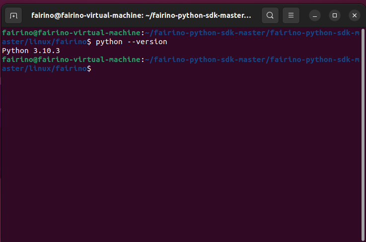

Appendix
=================

.. toctree:: 
    :maxdepth: 5

Source Code Download
------------------------------------------------

Find the "Downloads" section in the FAIRINO documentation (https://fairino-doc-en.readthedocs.io/latest/), click the "Python SDK" button, and then click "FAIRINO Python SDK" on the right-hand page. Wait for the browser to complete the download.

.. centered:: Figure 16.1‑1 Python SDK Source Code Download

Download and extract the Python SDK. The project directory is shown below. The "windows" folder contains the Python SDK for Windows systems, and the "linux" folder contains the Python SDK for Linux systems.

.. centered:: Figure 16.1‑2 Python SDK File Structure Example

Taking the Windows system as an example, open the "windows" folder. The directory is shown below. The "example" folder contains test samples, the "fairino" folder contains the Python SDK source code, and "libfairino" contains library files.

.. centered:: Figure 16.1‑3 Python SDK File Structure Example for Windows Systems

Open the "windows" folder in PyCharm. The structure is shown below.

.. image:: image/028.png
   :width: 4in
   :align: center

.. centered:: Figure 16.1‑4 Project File Structure Example in PyCharm
 
Source Code Compilation
----------------------------------------
The generation of Python dynamic libraries varies depending on the system type and Python version. For example, on Windows platforms, the library file suffix is ".pyd", while on Linux platforms, it is ".so". Additionally, dynamic libraries generated for different Python versions cannot be mixed. Therefore, before generating dynamic libraries, ensure the Python version and platform are correctly selected. This manual uses Python 3.10, Windows 11, and Ubuntu 22.04 for compilation instructions.

Windows Platform Python SDK Compilation
~~~~~~~~~~~~~~~~~~~~~~~~~~~~~~~~~~~~~~~~~~~~~~~~~~~~~~~~~~~~~~~~~~~~~~~~
First, open the downloaded Python SDK files in PyCharm and open the "setup.py" file.

.. image:: image/029.png
   :width: 6in
   :align: center

.. centered:: Figure 16.2‑1 Opening the Project File

Then, select the Python interpreter at the bottom-right corner. This example uses Python 3.10.

.. image:: image/030.png
   :width: 6in
   :align: center

.. centered:: Figure 16.2‑2 Selecting the Python Version
 
Right-click the "fairino" folder, click "Open In," and then click "Terminal."

.. image:: image/031.png
   :width: 6in
   :align: center

.. centered:: Figure 16.2‑3 Opening the Terminal

In the terminal, enter "python setup.py build_ext --inplace" and press "Enter" to generate the Python SDK dynamic library.

.. image:: image/032.png
   :width: 6in
   :align: center

.. centered:: Figure 16.2‑4 Running the Dynamic Library Generation Command

After the dynamic library is generated, the "fairino" folder will contain "Robot.c" and "Robot.cp310-win_amd64.pyd". "Robot.c" is the C language file converted from "Robot.py", and "Robot.cp310-win_amd64.pyd" is the Python SDK dynamic library. Here, "cp310" indicates compatibility with Python 3.10, and "win_amd64" indicates compatibility with Windows platforms.

.. image:: image/033.png
   :width: 6in
   :align: center

.. centered:: Figure 16.2‑5 Generated .pyd Dynamic Library
 
Linux Platform Python SDK Compilation
~~~~~~~~~~~~~~~~~~~~~~~~~~~~~~~~~~~~~~~~~~~~~~~~~~~~~~~~~~~~~~~
First, check the Python version. This manual uses the "pyenv" tool to manage Python versions on Linux systems. Run the "pyenv versions" command to view the current Python version.

.. image:: image/034.png
   :width: 6in
   :align: center

.. centered:: Figure 16.2‑6 Checking the Python Version

Switch to the target Python version. For example, to use Python 3.10, run the "pyenv global 3.10.3" command.

.. image:: image/035.png
   :width: 6in
   :align: center

.. centered:: Figure 16.2‑7 Selecting the Python Version

Navigate to the directory containing "Robot.py" by running the command "cd /home/fairino/fairino-python-sdk-master/fairino-python-sdk-master/linux/fairino".

.. centered:: Figure 16.2‑8 Navigating to the "Robot.py" Directory

Confirm the Python version by running the "python --version" command.

.. centered:: Figure 16.2‑9 Checking the Python Version
 
In the terminal, enter "python setup.py build_ext --inplace" and press "Enter" to generate the Python SDK dynamic library.

.. image:: image/038.png
   :width: 6in
   :align: center

.. centered:: Figure 16.2‑10 Running the Dynamic Library Generation Command

After the dynamic library is generated, the "fairino" folder will contain "Robot.c" and "Robot.cpython-310-x86_64-linux-gnu.so". "Robot.c" is the C language file converted from "Robot.py", and "Robot.cpython-310-x86_64-linux-gnu.so" is the Python SDK dynamic library. Here, "python-310" indicates compatibility with Python 3.10, and "linux-gnu" indicates compatibility with Linux platforms.

.. image:: image/039.png
   :width: 6in
   :align: center

.. centered:: Figure 16.2‑11 Generated .so Dynamic Library

Notes
----------------------------------

Potential Issues
~~~~~~~~~~~~~~~~~~~~~~~~~~~~~~~~~~~~~~~~

Version Compatibility
++++++++++++++++++++++++++++++
Python dynamic libraries depend on the generation environment and Python version. Therefore, when using Python dynamic libraries, ensure the library matches the system type and Python version.

Error Codes
++++++++++++++++++++++++++++++
A return value of 0 indicates normal operation. If the return value is not 0, refer to the error code table.