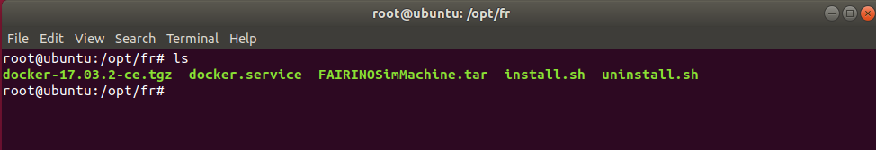
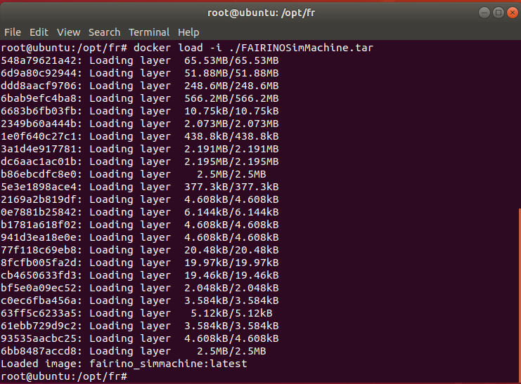
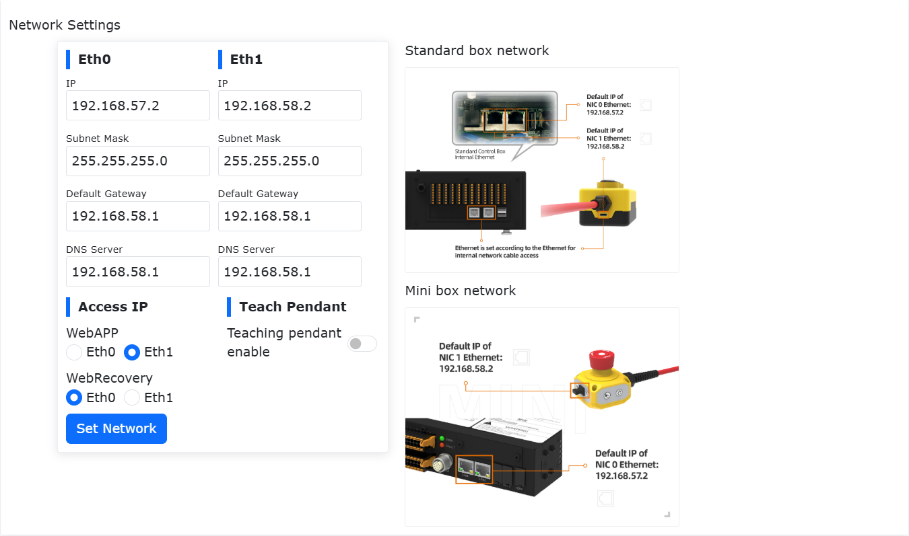

Virtual Machine - Docker
=================================

Linux Docker Image Deployment
----------------------------------

Operating Environment
~~~~~~~~~~~~~~~~~~~~~~~~

Virtual machine operating system: Ubuntu 18.04.6;

Virtual machine operating environment: RAM 4G, ROM 50G, 6-core CPU;

Operation permissions: Use super administrator root privileges. Setting method see Appendix 3;

Docker installation file: fr_docker.tar.gz;

FAIRINO SimMachine image: FAIRINOSimMachine.tar;

Install Docker
~~~~~~~~~~~~~~

If the user has already installed and deployed Docker, skip this section and proceed to section 1.3 Image Deployment.

1. Download fr_docker.tar.gz and place it in the Ubuntu file path /opt/.

2. Extract fr_docker.tar.gz. Using /opt/ directory as an example:

.. code-block:: console
   :linenos:

   cd /opt/ && tar -zxvf fr_docker.tar.gz

3. Execute the Docker installation script:

.. code-block:: console
   :linenos:

   sh install.sh docker-27.0.3.tgz

After the script finishes executing, if the version number appears, it indicates successful installation.

.. image:: controller_virtual_machine/037.png
   :width: 6in
   :align: center

Image Configuration
~~~~~~~~~~~~~~~~~~~~~~~~~~~~~~~~~~~~~~~~~

Import Docker Image
++++++++++++++++++++

1. Download the virtual machine image FAIRINOSimMachine.tar and extract it.

2. Check the Docker version to confirm installation.

.. code-block:: console
   :linenos:

   docker -v

.. image:: controller_virtual_machine/038.png
   :width: 6in
   :align: center

3. Import the image

.. code-block:: console
   :linenos:

   docker load -i ./FAIRINOSimMachine.tar

The appearance of `fairno_simmachine:latest` indicates the import is complete.

4. Execute `docker images` to check if the import was successful.

Create Custom Bridge Network
++++++++++++++++++++++++++++++++++

1. Execute the following command to create a bridge network named `fairino-net` with subnet `192.168.58.0/24`.

.. code-block:: console
   :linenos:

   docker network create --driver bridge --subnet 192.168.58.0/24 --gateway 192.168.58.1 fairino-net

2. View the network

.. code-block:: console
   :linenos:

   docker network ls

The presence of the `fairino-net` network indicates successful creation.

.. image:: controller_virtual_machine/040.png
   :width: 6in
   :align: center

First-time Docker Container Startup
++++++++++++++++++++++++++++++++++++++++

1. Create and start the container

Start the container using the `fairino-net` network and the `fairino_simmachine` image.

.. code-block:: console
   :linenos:

   docker run -d -P --name fairino-container --privileged -u root --net fairino-net fairino_simmachine

.. image:: controller_virtual_machine/041.png
   :width: 6in
   :align: center

.. code-block:: console
   :linenos:

   docker ps

Check if the container started successfully. The appearance of `fairino-container` indicates successful startup.

.. image:: controller_virtual_machine/042.png
   :width: 6in
   :align: center

Web Operation of Virtual Robot
----------------------------------------

Container Normal Startup
~~~~~~~~~~~~~~~~~~~~~~~~~~~~~~

This section applies to non-first-time container startups, such as when the container is not running in the background due to computer restart or Docker shutdown.

1. Start Docker:

.. code-block:: console
   :linenos:

   systemctl start docker

2. Check Docker status:

.. code-block:: console
   :linenos:

   systemctl status docker

Green `active(running)` indicates successful startup.

.. image:: controller_virtual_machine/043.png
   :width: 6in
   :align: center

3. Execute `docker ps -a` to view the container ID.

.. image:: controller_virtual_machine/044.png
   :width: 6in
   :align: center

4. Execute `docker start [Container ID]`.

.. image:: controller_virtual_machine/045.png
   :width: 6in
   :align: center

5. After successful execution, execute `docker ps` again to confirm the container is running.

.. image:: controller_virtual_machine/046.png
   :width: 6in
   :align: center

Operating the Virtual Robot
~~~~~~~~~~~~~~~~~~~~~~~~~~~~~~

1. Confirm the Docker container is running.

.. code-block:: console
   :linenos:

   docker ps

The appearance of `fairino-container` indicates it is running.

.. image:: controller_virtual_machine/047.png
   :width: 6in
   :align: center

2. Open a browser, enter the default IP: 192.168.58.2, to access the web interface and operate the virtual robot.

.. image:: controller_virtual_machine/048.png
   :width: 6in
   :align: center

3. Log in with the admin account, password: 123.

.. image:: controller_virtual_machine/049.png
   :width: 6in
   :align: center

User IP Address Modification
~~~~~~~~~~~~~~~~~~~~~~~~~~~~~~~~~~~~~~

1. Open a browser, enter the default IP: 192.168.58.2, to open the web page;
2. Log in with the admin account, password: 123;
3. Navigate to "System Settings" → "General Settings" → "Network Settings", modify the IP to the target IP address, subnet mask, and gateway. Click "Set Network";
4. Open the terminal, stop the container;

View the container ID:

.. code-block:: console
   :linenos:

   docker ps -a

.. image:: controller_virtual_machine/052.png
   :width: 6in
   :align: center

Stop the container:

.. code-block:: console
   :linenos:

   docker stop [Container ID]

.. image:: controller_virtual_machine/053.png
   :width: 6in
   :align: center

5. Reconfigure the container network;

Delete the original network:

.. code-block:: console
   :linenos:

   docker network rm fairino-net

Create a new network:

.. code-block:: console
   :linenos:

   docker network create --driver bridge --subnet [Target IP/Subnet Mask] --gateway [Gateway IP] fairino-net

Using 192.168.56.0/24 as an example: `docker network create --driver bridge --subnet 192.168.56.0/24 --gateway 192.168.56.1 fairino-net`

.. image:: controller_virtual_machine/054.png
   :width: 6in
   :align: center

6. Reconnect the container to the newly created network;

.. code-block:: console
   :linenos:

   docker network connect fairino-net [Container ID]

.. image:: controller_virtual_machine/055.png
   :width: 6in
   :align: center

7. Restart the container;

.. code-block:: console
   :linenos:

   docker start [Container ID]

8. Now open the browser, enter the modified IP address, to access the web interface and operate the virtual robot.

.. image:: controller_virtual_machine/056.png
   :width: 6in
   :align: center

Virtual Machine Version Upgrade/Downgrade
-------------------------------------------------------------

Overview
~~~~~~~~~~~~~~~~~~~~~~~~~~~~~~

This manual details the standard procedure for performing software upgrades and downgrades when using the FAIRINO SimMachine Docker virtual machine, and systematically outlines key considerations during the version change process.

Upgrade/Downgrade Preparation and Considerations
~~~~~~~~~~~~~~~~~~~~~~~~~~~~~~~~~~~~~~~~~~~~~~~~~~~~~~~~

Operation Preparation
++++++++++++++++++++++

1. A deployed and normally functioning FAIRINO SimMachine Docker virtual machine. Deployment tutorial see "User Manual - Linux Docker Image Deployment";
2. Software upgrade package for the Docker virtual machine version. Download location see "Data Download - FAIRINO SimMachine Docker". After extraction, contents include the latest version docker image FAIRINOSimMachine.tar and the software upgrade package software.tar.gz.

Considerations
+++++++++++++++++

1. Data Backup: It is recommended to perform a backup before upgrading, method see "Data Backup" chapter, to avoid data loss due to upgrade anomalies.
2. Version Restrictions:

.. centered:: Table 2.3-1 Upgrade/Downgrade Version Restrictions

.. list-table::
   :widths: 50 50 50
   :header-rows: 0
   :align: center

   * - **Operation Type**
     - **Condition/Restriction**
     - **Step Description**

   * - **Version Upgrade**
     - Current Version >= 3.7.8
     - Can upgrade directly

   * - **Version Upgrade**
     - Current Version < 3.7.8
     - Must first upgrade to version 3.7.5 or use the compatibility solution

   * - **Version Downgrade**
     - Current AND Target Version >= 3.7.8
     - Can downgrade directly

   * - **Version Downgrade**
     - Current OR Target Version < 3.7.8
     - Use the compatibility solution

   * - **Compatibility Solution**
     - Applicable for both upgrade/downgrade anomalies
     - See "Compatibility Solution" chapter for detailed steps