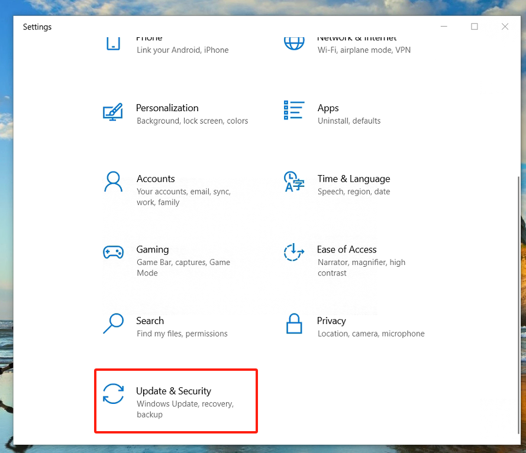
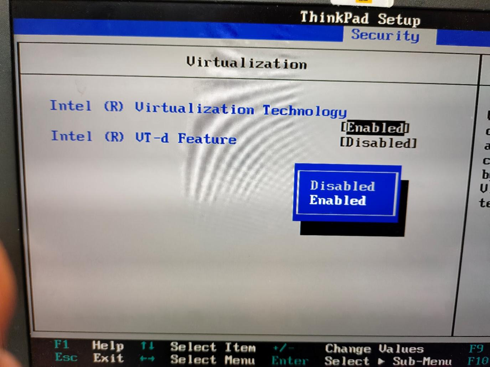
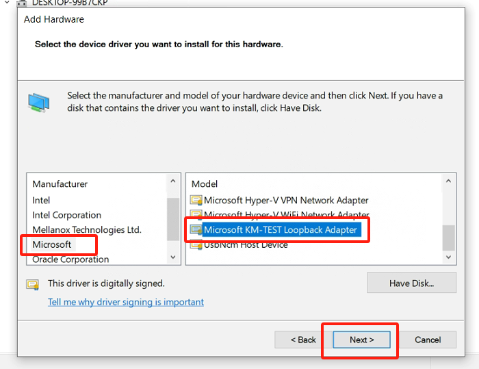
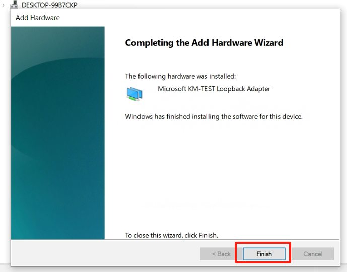
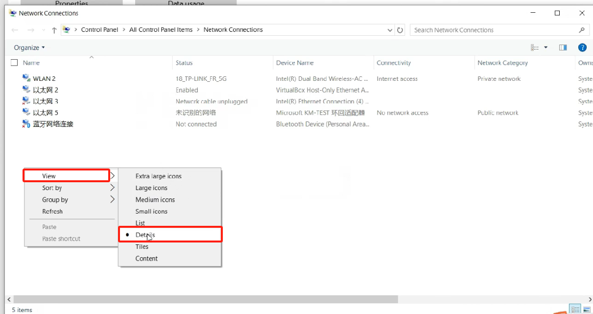
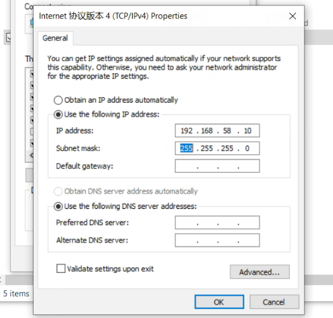

Appendix
==================================

Appendix 1: Enabling Virtualization in the BIOS
------------------------------------------------------

Different models of computers may have different processes to enable virtualization. Take Lenovo ThinkPad series Windows 10 as an example:

- Open PC Settings and select Update and Security.

.. image:: controller_virtual_machine/013.png
   :width: 4in
   :align: center

- Select "Recover".

.. image:: controller_virtual_machine/015.png
   :width: 4in
   :align: center

- Select "Restart Now".

.. image:: controller_virtual_machine/016.png
   :width: 4in
   :align: center

- Select "Troubleshoot".
  
.. image:: controller_virtual_machine/017.png
   :width: 4in
   :align: center

- Select "Advanced Options".

.. image:: controller_virtual_machine/018.png
   :width: 4in
   :align: center

- Select "UEFI Firmware Settings".

.. image:: controller_virtual_machine/019.png
   :width: 4in
   :align: center

- Select "Restart".

.. image:: controller_virtual_machine/020.png
   :width: 4in
   :align: center

- Select "Virtualization" under Security.

.. image:: controller_virtual_machine/021.png
   :width: 4in
   :align: center

- Select "Enabled" and press "Enter" to confirm.

- Press "F10", select "Yes", press "Enter" to save changes.

.. image:: controller_virtual_machine/023.png
   :width: 4in
   :align: center

Appendix 2: Adding a Virtual NIC (Loopback Network Adapter)
-------------------------------------------------------------------

1. Open Device Manager, press "Windows Key - X", select "Network adapters".
   
.. image:: controller_virtual_machine/024.png
   :width: 4in
   :align: center

2. Add a network.

.. image:: controller_virtual_machine/025.png
   :width: 4in
   :align: center

.. image:: controller_virtual_machine/026.png
   :width: 4in
   :align: center

.. image:: controller_virtual_machine/027.png
   :width: 4in
   :align: center

.. image:: controller_virtual_machine/028.png
   :width: 4in
   :align: center

.. image:: controller_virtual_machine/030.png
   :width: 4in
   :align: center

   
3. View the virtual network card, press the "Windows key - X" , select "Network Connection".

.. image:: controller_virtual_machine/032.png
   :width: 4in
   :align: center

.. image:: controller_virtual_machine/033.png
   :width: 4in
   :align: center

.. image:: controller_virtual_machine/035.png
   :width: 6in
   :align: center
   
4. Configuring a Loopback Adapter Network.

- IP address: 192.168.58.XXX (same network segment as 192.168.58.2) .
- Subnet mask: 255.255.255.0.

5. Open the Virtualbox network configuration, select "Loopback Adapter Network" for the network card name, and start the virtual machine.

.. image:: controller_virtual_machine/013.png
   :width: 6in
   :align: center

Appendix 3: Root Permissions
--------------------------------------

After Ubuntu is installed, the root user is not allowed to log in by default, and the password is empty. If you want to log in as the root user, you must first set a password for the root user.

1. Open the terminal, type `sudo passwd root`, press Enter, and then enter the password several times. A success message will be displayed once the password is set.

.. image:: controller_virtual_machine/057.png
   :width: 6in
   :align: center

2. Continue in the terminal by entering the command `su - root` to switch users, and press Enter to input the password.

.. warning:: When entering the command, be sure to include the hyphen in "su -". The option "-" signifies that the environment variables should be switched along with the user, and it is crucial not to omit it.

.. image:: controller_virtual_machine/058.png
   :width: 6in
   :align: center

Appendix 4: Docker Basic Commands
--------------------------------------

1. Docker help command: 

.. code-block:: console
   :linenos:

   docker --help

2. Start Docker :

.. code-block:: console
   :linenos:

   systemctl start docker

3.  Stop Docker :

.. code-block:: console
   :linenos:

   systemctl stop docker

4. Restart Docker :

.. code-block:: console
   :linenos:

   systemctl restart docker

5. Set Docker to start automatically with the service :

.. code-block:: console
   :linenos:

   systemctl enable docker

6. Check the running status of Docker :

.. code-block:: console
   :linenos:

   systemctl status docker
   --If it's running, you'll see "active" in green

7. Docker container :

.. code-block:: console
   :linenos:

   docker images: List the downloaded images.
   docker rmi [image_id_or_name]: Remove a local image.
   docker rmi -f [image_id_or_name]: Force remove an image.
   docker build: Build an image.
   docker search [image_id_or_name]: Search for an image by keyword in the Hub.
   docker pull [image_id_or_name]: Download an image
   docker images: List the downloaded images.
   docker rmi [image_id_or_name]: Remove a local image.
   docker rmi -f [image_id_or_name]: Force remove an image.
   docker build: Build an image.

8. Docker container :

.. code-block:: console
   :linenos:

   docker ps: List running containers.
   docker ps -a: List all containers, including those not running.
   docker stop [container_id_or_name]: Stop a container.
   docker kill [container_id]: Force stop a container.
   docker start [container_id_or_name]: Start a stopped container.
   docker inspect [container_id]: View all information about a container.
   docker container logs [container_id]: View container logs.
   docker top [container_id]: View processes inside the container.
   docker exec -it [container_id] /bin/bash: Enter the container.
   exit: Exit the container.
   docker rm [container_id_or_name]: Remove a stopped container.
   docker rm -f [container_id]: Remove a running container.
   docker exec -it [container_ID] sh: Enter the container using the shell.